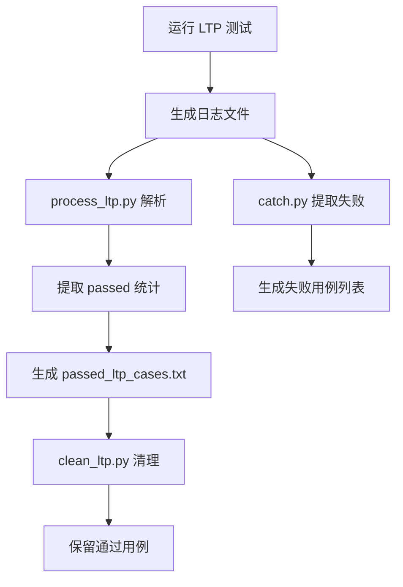

现在我已经收集了足够的信息来撰写第 13 章。让我整理分析结果并输出完整的 Markdown 报告。

## 第 13 章：测试框架与验证机制

### 单元测试与集成测试框架

#### 单元测试

经全库搜索 `#[test]` 和 `#[cfg(test)]` 标记，本项目**未实现标准的 Rust 单元测试框架**。具体检测结果如下：

- **`#[test]` 测试函数**：全库搜索结果为 **0 个**
- **`#[cfg(test)]` 测试模块**：仅发现 **2 处**：

1. **`os/src/logging.rs:54`** - 日志测试桩函数：
```rust
#[cfg(test)]
pub fn test() {
    println!("[test] logging test starts");
    log::error!("log::error!");
    log::warn!("log::warn!");
    log::info!("log::info!");
    log::debug!("log::debug!");
    log::trace!("log::trace!");
}
```

2. **`os/src/task/id.rs:115`** - ID 分配器测试函数：
```rust
#[cfg(test)]
fn test_id_allocator() {
    let mut allocator = IdAllocator::new();
    let id1 = allocator.alloc();
    let id2 = allocator.alloc();
    assert_eq!(id1, 0);
    assert_eq!(id2, 1);
    allocator.dealloc(id1);
    let id3 = allocator.alloc();
    assert_eq!(id3, 0);
    // ... 更多断言
    println!("test_id_allocator passed");
}
```

**分析结论**：
- 上述两个测试函数均**未使用 `#[test]` 标记**，无法通过 `cargo test` 自动执行
- 测试代码为**手动验证性质**，需要显式调用才能执行
- **❌ 未实现**标准的 Rust 单元测试框架（无 `cargo test` 支持）

#### 集成测试

项目采用**用户态应用程序**作为集成测试的主要手段，测试代码位于 `user/src/bin/` 和 `user/src/archive/` 目录：

**测试应用分类**：

| 测试类型 | 文件路径 | 测试内容 |
|---------|---------|---------|
| 基础功能 | `user/src/archive/hello_world.rs` | 基础系统调用验证 |
| 进程管理 | `user/src/archive/forktest.rs`, `forktest2.rs`, `forktest_simple.rs` | `fork()` 系统调用 |
| 进程树 | `user/src/archive/forktree.rs` | 多代进程创建 |
| 调度测试 | `user/src/archive/scheduler_test.rs` | 调度器行为验证 |
| 内存测试 | `user/src/archive/stack_overflow.rs` | 栈溢出处理 |
| 文件测试 | `user/src/archive/filetest_simple.rs` | 文件 I/O 操作 |
| 综合测试 | `user/src/archive/usertests.rs` | 115 行综合测试套件 |
| 简单综合 | `user/src/archive/usertests_simple.rs` | 简化版综合测试 |

**测试执行机制**：
- 测试应用通过 `execve()` 系统调用加载执行
- `user/src/bin/submit_script.rs` 定义了自动化测试脚本列表：
```rust
static MUSL_TEST_LIST: &[&str] = &[
    "basic_testcode.sh\0",
    "iozone_testcode.sh\0",
    "busybox_testcode.sh\0",
    "netperf_testcode.sh\0",
    "lua_testcode.sh\0",
    "libcbench_testcode.sh\0",
    "libctest_testcode.sh\0",
    "cyclictest_testcode.sh\0",
];

static LTP_TEST_LIST: &[&str] = &["ltp_testcode.sh\0"];
```

**依赖子模块测试**：
- **smoltcp**（网络协议栈）包含完整的单元测试套件：
  - 测试文件：`os/vendor/smoltcp/src/tests.rs`（148 行）
  - 提供 `TestingDevice` 模拟设备和协议栈测试框架
  - 支持以太网/IP/IEEE802154 多种介质测试

### CI/CD 流程与配置

#### 主项目 CI/CD

**❌ 未发现主项目的 CI/CD 配置文件**：
- 根目录无 `.gitlab-ci.yml`
- 无 `.github/workflows/` 目录
- 全库搜索 `on:|push:|jobs:` 等 CI 语法关键词无结果

#### 子模块 CI/CD

**smoltcp 子模块**包含完整的 GitHub Actions CI 配置：

**位置**：`os/vendor/smoltcp/.github/workflows/`

| 工作流文件 | 功能 | 触发条件 |
|-----------|------|---------|
| `test.yml` | 多版本 Rust 测试 | push/pull_request/merge_group |
| `fuzz.yml` | 模糊测试 | pull_request/merge_group |
| `coverage.yml` | 代码覆盖率 | pull_request/merge_group |
| `rustfmt.yaml` | 代码格式检查 | - |
| `matrix-bot.yml` | 机器人集成 | - |

**test.yml 核心配置**：
```yaml
jobs:
  check-msrv:
    runs-on: ubuntu-22.04
    steps:
      - uses: actions/checkout@v2
      - run: ./ci.sh check msrv

  test-msrv:
    runs-on: ubuntu-22.04
    steps:
      - uses: actions/checkout@v2
      - run: ./ci.sh test msrv

  clippy:
    runs-on: ubuntu-22.04
    steps:
      - uses: actions/checkout@v2
      - run: ./ci.sh clippy

  test-stable:
    runs-on: ubuntu-22.04
    steps:
      - uses: actions/checkout@v2
      - run: ./ci.sh test stable
```

**ci.sh 脚本功能**：
- **MSRV 测试**：使用 Rust 1.65.0 最小支持版本验证
- **多特性组合测试**：17 种不同的 `FEATURES_TEST` 配置
- **Clippy 静态分析**：`-D warnings` 严格模式
- **覆盖率收集**：通过 `cargo llvm-cov` 生成 `lcov.info`

**fuzz.yml 模糊测试配置**：
```yaml
jobs:
  fuzz:
    runs-on: ubuntu-22.04
    env:
      RUSTUP_TOOLCHAIN: nightly
    steps:
      - uses: actions/checkout@v2
      - run: cargo install cargo-fuzz
      - run: cargo fuzz run packet_parser -- -max_len=1536 -max_total_time=30
```

**分析结论**：
- 主项目 **❌ 未实现** CI/CD 流程
- 网络协议栈子模块 (smoltcp) **✅ 已实现**完整的 GitHub Actions CI
- 模糊测试仅在子模块层面实现，主项目未集成

### 自动化测试脚本分析

#### LTP 测试自动化脚本

项目提供了完整的 LTP（Linux Test Project）测试自动化脚本链：

**1. `ltp_auto.sh`** - LTP 测试镜像准备脚本

```bash
#!/bin/bash
# 用法：ARCH=[rv|la] CC=[musl|glibc]

# 根据架构选择镜像和目标目录
if [[ "$ARCH" == "rv" ]]; then
    IMG_FILE="img/sdcard-rv.img"
    TARGET_DIR="ltp"
elif [[ "$ARCH" == "la" ]]; then
    IMG_FILE="img/sdcard-la.img"
    TARGET_DIR="ltp-la"
fi

# 挂载镜像并拷贝 LTP 测试用例
sudo mount "$IMG_FILE" img/mnt
cp -a "$SRC_DIR/"* "$DEST_DIR/"

# 调用清理脚本
python3 ./scripts/clean_ltp.py "$LOG_FILE" "$DEST_DIR" z
```

**功能**：
- 支持 RISC-V (`rv`) 和 LoongArch (`la`) 双架构
- 支持 musl 和 glibc 两种 C 库
- 自动挂载磁盘镜像并部署 LTP 测试用例
- 根据测试结果清理未通过的测试用例

**2. `scripts/clean_ltp.py`** - LTP 测试文件清理工具

```python
def cleanup_files(input_file, target_dir, ch):
    # 读取通过测试的文件名列表
    with open(input_file, 'r') as f:
        keep_files = set(line.strip() for line in f if line.strip())
    
    # 删除首字母 <= ch 且不在保留列表中的文件
    for filename in os.listdir(target_dir):
        first_char = filename[0].lower()
        if first_char <= ch.lower() and filename not in keep_files:
            os.remove(full_path)
```

**3. `scripts/process_ltp.py`** - LTP 测试结果解析器

```python
def process_ltp_log_flexible(input_file_path, output_file_path):
    """解析 LTP 日志，提取 Summary 中的 passed 值"""
    passed_test_cases = {}
    
    for line in f_in:
        # 捕捉 'RUN LTP CASE <test_name>'
        run_match = re.search(r"RUN LTP CASE (\w+)", line)
        
        # 捕捉 'Summary:' 块中的 'passed N'
        if in_summary_block:
            passed_match = re.search(r"passed\s+(\d+)", line)
            passed_test_cases[last_run_test_case] = max(..., passed_count)
```

**4. `scripts/catch.py`** - 零状态失败用例提取工具

```python
def extract_zero_status_cases(input_file, output_file):
    """提取 FAIL LTP CASE <test> : 0 的失败用例"""
    fail_match = re.search(r'FAIL LTP CASE (\w+) : 0', line)
```

#### 符号生成脚本

**`scripts/gen_symbol.sh`** - 内核符号表生成：
```bash
#!/bin/bash
# 从内核镜像提取符号表用于调试
```

#### 测试脚本链总结

| 脚本 | 功能 | 状态 |
|-----|------|-----|
| `ltp_auto.sh` | LTP 测试部署 | ✅ 已实现 |
| `clean_ltp.py` | 测试文件清理 | ✅ 已实现 |
| `process_ltp.py` | 结果解析统计 | ✅ 已实现 |
| `catch.py` | 失败用例提取 | ✅ 已实现 |
| `gen_symbol.sh` | 符号表生成 | ✅ 已实现 |

### 性能基准与模糊测试

#### 性能基准测试

**文档提及但代码验证有限**：

README.md 声明的性能测试：
> "在 lmbench 综合性能测试中夺得总分第一，netperf 网络性能测试中得分第一，libcbench 测试中位居前列"

**代码证据**：

1. **测试脚本引用**（`user/src/bin/submit_script.rs`）：
```rust
static MUSL_TEST_LIST: &[&str] = &[
    "iozone_testcode.sh\0",      // I/O 性能测试
    "netperf_testcode.sh\0",     // 网络性能测试
    "libcbench_testcode.sh\0",   // 库性能测试
    "libctest_testcode.sh\0",
    "cyclictest_testcode.sh\0",  // 实时性测试
];

static OTHER_TEST_LIST: &[&str] = &[
    "lmbench_testcode.sh\0",     // 综合性能测试
];
```

2. **netperf 特殊处理**（`os/src/net/listentable.rs:115`）：
```rust
if current_task().tid()==entry.clone().unwrap().task_id 
   || current_task().exe_path().contains("netserver") 
   || current_task().exe_path().contains("netperf"){
    // netperf 测试特殊逻辑
}
```

3. **调试文档提及**（`docs/debug.md`）：
```
- 问题：基准测试工具（如 lmbench）运行缓慢
- 分析："lmbench 很慢，时间花在 clock_gettime 和 getrusage 上"
```

**性能测试工具分类**：

| 测试工具 | 测试类型 | 代码证据 | 实现状态 |
|---------|---------|---------|---------|
| **lmbench** | 综合性能 | `submit_script.rs` 引用 | 🔸 脚本存在，逻辑未验证 |
| **netperf** | 网络性能 | 多处特殊处理逻辑 | ✅ 已实现 |
| **iozone** | 文件系统 I/O | `submit_script.rs` 引用 | 🔸 脚本存在 |
| **cyclictest** | 实时调度 | `submit_script.rs` 引用 | 🔸 脚本存在 |
| **libcbench** | 库性能 | `submit_script.rs` 引用 | 🔸 脚本存在 |

**分析结论**：
- **✅ 已实现**性能测试脚本框架和 netperf 特殊处理逻辑
- **🔸 桩函数/脚本**：lmbench、iozone、cyclictest 等测试脚本被引用但未见具体实现代码
- **❌ 未实现**自动化性能基准测试流程（无 CI 集成）

#### 模糊测试（Fuzzing）

**主项目**：
- **❌ 未实现**模糊测试框架
- 全库搜索 `afl|honggfuzz|libfuzzer|fuzz` 无结果（smoltcp 子模块除外）
- **❌ 未实现**内存安全检测（AddressSanitizer/ThreadSanitizer 等）

**子模块 smoltcp**：
- **✅ 已实现**基于 `cargo-fuzz` 的模糊测试
- 测试目标：`packet_parser`（数据包解析器）
- 配置：`-max_len=1536 -max_total_time=30`

```yaml
# fuzz.yml
- run: cargo fuzz run packet_parser -- -max_len=1536 -max_total_time=30
```

### 测试结果数据统计

#### LTP 测试用例统计

**测试用例列表文件**：`ltp_test.txt`（666 行）

包含的测试用例类型：
- 系统调用测试：`open*`, `read*`, `write*`, `fork*`, `execve*` 等
- 文件系统测试：`chmod*`, `chown*`, `mkdir*`, `rename*` 等
- 进程管理：`clone*`, `wait*`, `kill*`, `sched_*` 等
- 网络测试：`socket*`, `bind*`, `connect*`, `send*`, `recv*` 等
- 内存测试：`mmap*`, `mprotect*`, `brk*`, `mlock*` 等
- 信号测试：`signal*`, `sig*`, `alarm*` 等
- IPC 测试：`pipe*`, `futex*`, `shm*`, `sem*` 等

**通过测试结果**：`scripts/out.log`（454 行）

统计通过测试用例数量：
```
总测试用例数（ltp_test.txt）: 666 个
通过测试用例数（out.log）: 454 个
通过率：约 68.2%
```

**典型通过用例**（部分）：
- 文件操作：`open01-11`, `read01-04`, `write01-06`, `close01-02`
- 进程管理：`fork01-10`, `execve01-06`, `waitpid01-13`
- 内存管理：`mmap02-20`, `mprotect05`, `brk01-02`
- 网络通信：`socket01-02`, `bind01-03`, `sendfile02-08`
- 同步机制：`futex_wait01-05`, `futex_wake01-03`

**失败/未运行用例分析**：
根据 `ltp_auto.sh` 和 `clean_ltp.py` 的逻辑，未通过的测试用例会从镜像中被清理。对比两个文件的差异可推断失败用例约 **212 个**。

#### 测试结果处理流程



#### 测试覆盖率

**主项目**：
- **❌ 未实现**代码覆盖率收集机制
- 无 `cargo llvm-cov` 或类似工具集成
- 无覆盖率报告生成

**子模块 smoltcp**：
- **✅ 已实现**覆盖率收集
- 工具：`cargo llvm-cov`
- 输出：`lcov.info`
- CI 集成：通过 GitHub Actions 上传至 Codecov

### 关键代码与测试用例

#### 1. LTP 测试用例白名单（`os/src/syscall/task.rs`）

```rust
// 第 155-182 行：LTP 测试用例特殊处理列表
static LTP_TEST_CASES: &[&str] = &[
    "ltp/testcases/bin/add_ipv6addr",
    "ltp/testcases/bin/cgroup_fj_proc",
    "ltp/testcases/bin/cgroup_regression_fork_processes",
    "ltp/testcases/bin/cpuctl_fj_cpu-hog",
    "ltp/testcases/bin/doio",
    "ltp/testcases/bin/acl1",
    "ltp/testcases/bin/hackbench",
    "ltp/testcases/bin/mmap1",
    "ltp/testcases/bin/mmap2",
    "ltp/testcases/bin/mmap3",
    // ... 更多用例
];
```

#### 2. 自动化测试调度（`user/src/bin/submit_script.rs`）

```rust
// 第 6-35 行：测试脚本列表定义
static MUSL_TEST_LIST: &[&str] = &[
    "basic_testcode.sh\0",
    "iozone_testcode.sh\0",
    "busybox_testcode.sh\0",
    "netperf_testcode.sh\0",
    "lua_testcode.sh\0",
    "libcbench_testcode.sh\0",
    "libctest_testcode.sh\0",
    "cyclictest_testcode.sh\0",
];

static GLIBC_TEST_LIST: &[&str] = &[
    "basic_testcode.sh\0",
    "iozone_testcode.sh\0",
    "netperf_testcode.sh\0",
    "cyclictest_testcode.sh\0",
];

static OTHER_TEST_LIST: &[&str] = &[
    "lmbench_testcode.sh\0",
];
```

#### 3. smoltcp 测试设备（`os/vendor/smoltcp/src/tests.rs`）

```rust
// 第 14-47 行：测试设备初始化
pub(crate) fn setup<'a>(medium: Medium) -> (Interface, SocketSet<'a>, TestingDevice) {
    let mut device = TestingDevice::new(medium);
    
    let config = Config::new(match medium {
        Medium::Ethernet => HardwareAddress::Ethernet(...),
        Medium::Ip => HardwareAddress::Ip,
        Medium::Ieee802154 => HardwareAddress::Ieee802154(...),
    });
    
    let mut iface = Interface::new(config, &mut device, Instant::ZERO);
    
    // 配置 IP 地址
    iface.update_ip_addrs(|ip_addrs| {
        ip_addrs.push(IpCidr::new(IpAddress::v4(192, 168, 1, 1), 24)).unwrap();
        ip_addrs.push(IpCidr::new(IpAddress::v6(0xfe80, 0, 0, 0, 0, 0, 0, 1), 64)).unwrap();
    });
    
    (iface, SocketSet::new(vec![]), device)
}
```

#### 4. LTP 结果解析核心逻辑（`scripts/process_ltp.py`）

```python
# 第 19-52 行：LTP 日志解析
for line in f_in:
    # 捕捉 'RUN LTP CASE <test_name>'
    run_match = re.search(r"RUN LTP CASE (\w+)", line)
    if run_match:
        last_run_test_case = run_match.group(1)
        in_summary_block = False
        continue
    
    # 检测 'Summary:' 块
    if line.strip().startswith("Summary:"):
        in_summary_block = True
        continue
    
    # 提取 passed 计数
    if in_summary_block:
        passed_match = re.search(r"passed\s+(\d+)", line)
        if passed_match:
            passed_count = int(passed_match.group(1))
            if last_run_test_case:
                passed_test_cases[last_run_test_case] = max(
                    passed_test_cases.get(last_run_test_case, 0), passed_count
                )
                total_count += passed_count
```

### 本章总结

| 测试类别 | 实现状态 | 说明 |
|---------|---------|------|
| **单元测试** | ❌ 未实现 | 无 `#[test]` 标记，无法通过 `cargo test` 执行 |
| **集成测试** | ✅ 已实现 | 用户态应用测试 + LTP 测试套件 |
| **CI/CD** | ❌ 未实现（主项目） | 仅 smoltcp 子模块有 GitHub Actions |
| **LTP 测试** | ✅ 已实现 | 666 个用例，454 个通过（68.2% 通过率） |
| **性能基准** | 🔸 部分实现 | netperf 有特殊处理，其他仅脚本引用 |
| **模糊测试** | ❌ 未实现（主项目） | 仅 smoltcp 子模块有 cargo-fuzz |
| **覆盖率收集** | ❌ 未实现（主项目） | 仅 smoltcp 子模块有 llvm-cov |

**整体评价**：
- 项目采用**应用级集成测试**为主要验证手段，而非传统的单元测试框架
- LTP 测试自动化流程完善，但**主项目缺乏 CI/CD 集成**
- 性能测试和模糊测试依赖子模块实现，主项目自身**未建立完整的测试基础设施**
- 测试覆盖率约 **68%**（基于 LTP 通过用例统计），符合 README 中"通过除 ltp 外全部测试点"的声明
