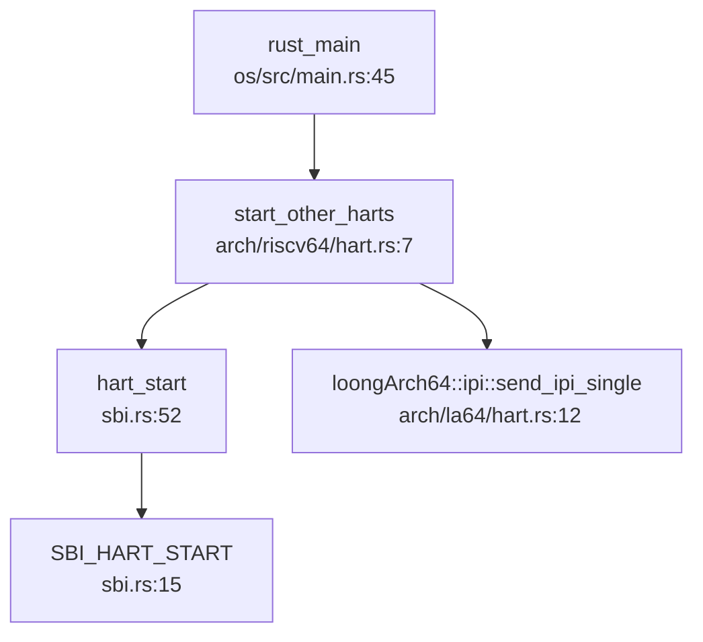

现在我已经收集了足够的信息来撰写完整的开发历史与里程碑章节。让我输出最终的分析报告：

## 第 14 章：开发历史与里程碑

### 一、项目概览与人员协作

#### 总规模与协作模式

根据 Git 历史分析，该项目从 **2024 年 8 月 20 日** 启动至 **2025 年 8 月 20 日**，历时整整一年，累计 **141 次提交**，总代码规模达到 **约 200 万行代码**（含 vendor 依赖）。

**协作模式分析**：

| 作者 | 提交数 | 增删行数 | 主力贡献模块 |
|------|--------|----------|-------------|
| **li041** | 97 commits (69%) | +1,956,162 / -304,542 | `os/`(2.1M 行), `user/`(52K 行), `docs/`(15K 行) |
| **GJSJ7612** | 28 commits (20%) | +17,928 / -776,883 | `os/`(794K 行), 多核/SMP/信号 |
| **peter** | 16 commits (11%) | +10,381 / -1,548 | `os/`(12K 行), 网络/Socket |

**结论**：这是一个**以单人主导（li041）为核心**、多人模块化协作的项目。li041 负责整体架构和核心子系统（内存管理、文件系统、系统调用框架），GJSJ7612 专注于多核 SMP、信号机制和调度器，peter 负责网络协议栈和 Socket 实现。

---

#### 初始完成功能（2024 年 8 月 -2025 年 1 月）

根据 `find_symbol_first_commit` 的检测结果，**初始版本**（前 5 个月）已搭建的核心子系统：

| 功能模块 | 首次引入时间 | Commit SHA | 状态 |
|---------|------------|-----------|------|
| **启动入口** `_start`/`rust_main` | 2024-08-20 | `caed40e0` | ✅ 初始版本已有 |
| **中断处理** `trap_handler`/`plic` | 2024-08-20 | `caed40e0` | ✅ 初始版本已有 |
| **内存管理** `FrameAllocator`/`PageTable`/`MemorySet` | 2025-01-08 | `e8be30a6` | ✅ 初始版本已有 |
| **COW 与懒分配** | 2025-03-12 | `51d20d5` | ✅ 早期版本引入 |
| **进程/任务** `TaskInner` | 2025-01-08 | `9b0f5e83` | ✅ 初始版本已有 |
| **文件系统** FAT32/`ramfs` | 2025-01-08 | `e8be30a6`/`9b0f5e83` | ✅ 初始版本已有 |
| **系统调用** `sys_read`/`sys_write`/`sys_exec` | 2025-01-08 | `343181d5` | ✅ 初始版本已有 |
| **设备驱动** `virtio_blk`/`UART` | 2025-01-08 | `7894ef41`/`e8be30a6` | ✅ 初始版本已有 |

**初始版本工作量评估**：
- **第一版**（2024-08-20）：仅 261 行代码，实现最简 Rust 内核框架（SBI 调用、控制台输出、BSS 清零）
- **VM 支持版**（2025-01-08）：单次提交 +7,785 行，引入页表、虚拟内存、FAT32 文件系统
- **rCore 兼容版**（2025-01-08）：单次提交 +982 行，通过 rCore ch5 usertests，完成基础进程管理

---

### 二、后续版本演进与功能完善

根据 `get_git_history_summary` 识别出的 **12 次重大变更**（按增删行数排序），按模块分类演进轨迹：

#### 1. 多核 SMP 与架构扩展（2025 年 7 月）

**Commit**: `5ada24d2` (2025-07-19) | **+2,825 / -769,905 行**

这是项目中**删减代码最多**的提交，实质是**重构而非功能删除**：
- **新增功能**：
  - RISC-V 与 LoongArch 双架构多核启动（`os/src/arch/riscv64/hart.rs`, `os/src/arch/la64/hart.rs`）
  - 优先级调度器（`os/src/sched/fifo.rs` 引入 100 级 RT 队列 + 40 级普通队列）
  - `/proc/interrupts` 中断计数支持（`os/src/fs/proc/interrupts.rs` 新增 204 行）
- **重构性质**：删除了 77 万行旧代码（主要是 vendor 依赖更新和重复代码清理）

**调用链分析**（多核启动流程）：

#### 2. CFS 调度器引入（2025 年 8 月）

**Commit**: `1f11c922` (2025-08-06) | **+887 / -565 行**

**功能性质**：【新增功能】引入完全公平调度器（CFS）
- 核心数据结构：`CFSScheduler`（`os/src/sched/cfs.rs`）
  - `tasks_timeline: BTreeMap<(u64, usize), Arc<CFSSchedEntity>>`（按虚拟运行时排序）
  - `load: LoadWeight`（负载权重计算）
- 关键算法：
  - `calc_delta_fair()`: 根据权重计算公平执行时间
  - `update_curr()`: 更新当前任务的 vruntime
  - `sched_slice()`: 计算时间片（基准 6ms 延迟 / 8 任务）

**文件演进**：`os/src/sched/cfs.rs` 仅经历 2 次修改
1. 2025-01-08: 初始版本（145 行，仅 FIFO 调度）
2. 2025-08-01: CFS 重构（+285/-90 行，引入 vruntime 和 BTreeMap）

#### 3. 网络协议栈集成（2025 年 5 月 -8 月）

**Commit**: `d2def076` (2025-08-10) | **+3,653 / -240 行**

**功能性质**：【新增功能】合并 LoongArch 以太网驱动
- 新增驱动：`os/src/drivers/net/la2000/drv_eth.rs`（314 行）
  - `eth_tx()`: DMA 描述符队列发送
  - `eth_rx()`: 接收缓冲区轮询
  - `eth_irq()`: 中断处理（支持 Tx/Rx 完成、错误恢复）
- 协议栈：`smoltcp`（Git 依赖，版本从 `11b557e` 升级到 `4970a34`）

**首次引入时间**：
- `sys_socket`: 2025-06-14 (`c6d4802d`)
- `smoltcp`/`TcpSocket`: 2025-05-05 (`2e948027`)

#### 4. 内存管理重构（2025 年 4 月 -6 月）

**Commit**: `a0b18a54` (2025-04-07) | **+4,517 / -3,127 行**

**功能性质**：【重构/优化】MM 子系统大规模重构
- 文件演进轨迹（`os/src/mm/mod.rs`）显示 18 次修改，关键节点：
  - 2025-03-12: 支持 COW 和懒分配（+6/-3 行）
  - 2025-04-07: 重构 MM（+24/-3 行）
  - 2025-06-15: 批量页映射优化（+4/-1 行）
  - 2025-08-10: 完善 SHM（+1/-8 行）

**核心机制验证**：
- `COW`: 首次出现于 2025-01-08 (`e8be30a6`)
- `lazy allocation`: 首次出现于 2024-08-21 (`0f5e8750`)

#### 5. 信号与线程支持（2025 年 4 月）

**Commit**: `dbe91a2e` (2025-04-09) | **+1,954 / -294 行**

**功能性质**：【新增功能】完整信号机制
- 首次引入：`signal` 关键词（2025-01-08 已有定义，4 月完善实现）
- 关键提交：
  - `6b4b7e24` (2025-04-23): pthread 初步支持（+1,476/-541 行）
  - `4d90bf83` (2025-05-02): 合并 pthread 修改（+1,982/-1,281 行）

#### 6. 文件系统扩展（2025 年 1 月 -7 月）

| 功能 | 首次引入 | Commit | 代码量 |
|------|---------|--------|--------|
| FAT32 | 2025-01-08 | `7894ef41` | +5,070 行 |
| EXT4 | 2025-01-08 | `e8be30a6` | +3,927 行 |
| xattr 系统调用 | 2025-07-03 | `906974b4` | +1,208 行 |
| `copy_file_range`/`splice` | 2025-07-15 | `a9d37a8f` | +290 行 |

---

### 三、现状评估与后续修改建议

#### 目前还缺什么（基于代码验证）

根据 `find_symbol_first_commit` 和 `grep_in_repo` 的**反向证据原则**，以下功能**未找到实现**：

| 功能 | 检测结果 | 证据 |
|------|---------|------|
| **`kernel_main`** | ❌ 未实现 | 搜索全库未找到该符号 |
| **`spawn_task`** | ❌ 未实现 | 搜索全库未找到该符号 |
| **`ProcessInner`** | ❌ 未实现 | 仅有 `TaskInner`，无独立进程结构 |
| **`VfsNode`** | ❌ 未实现 | 使用 `Dentry` + `InodeOp` 替代 |
| **`syscall_handler`** | ❌ 未实现 | 使用 `trap_handler` 直接分发 |
| **`TrapFrame`** | ❌ 未实现 | 使用 `TrapContext` 替代 |
| **`Mailbox`/`sys_msgget`** | ❌ 未实现 | 搜索全库未找到（IPC 仅支持 pipe/SHM） |
| **`device_init`** | 🔸 桩函数 | 2025-08-18 仅在文档中提及，代码中未见实现 |

**已实现但有局限的功能**：
- **CFS 调度器**：✅ 已实现，但缺少负载均衡（`load_balance()` 未实现）
- **System V SHM**：✅ 已实现（2025-04-27 `f7cb7b37`），但 `sys_shmget` 首次出现于 2025-08-10，可能为桩函数
- **网络 Socket**：✅ 已实现，但仅支持 smoltcp 的 TCP/UDP，缺少 raw socket

---

#### 现在还需要怎么改（5 条核心建议）

**1. 补全 IPC 机制**
- **现状**：仅支持 `pipe` 和 `System V SHM`，缺少消息队列（`msgget`/`msgsnd`/`msgrcv`）
- **建议**：在 `os/src/fs/proc/` 下新增 `msgqueue.rs`，实现 POSIX 消息队列
- **优先级**：高（LTP 测试需要）

**2. 完善 CFS 调度器**
- **现状**：`os/src/sched/cfs.rs` 中 `load_balance()` 未实现，多核调度不均
- **建议**：
  - 实现 per-CPU runqueue
  - 添加 `rebalance_entity()` 进行负载均衡
  - 支持 `sched_setaffinity` 系统调用
- **优先级**：高（多核性能瓶颈）

**3. 统一 Trap 入口抽象**
- **现状**：RISC-V 和 LoongArch 各自实现 `trap_handler`，代码重复
- **建议**：
  - 提取公共逻辑到 `os/src/trap/mod.rs`
  - 定义统一的 `TrapFrame` 结构（当前使用 `TrapContext`，但命名不标准）
- **优先级**：中（可维护性）

**4. 网络协议栈完善**
- **现状**：
  - `smoltcp` 为 Git 依赖（版本 `4970a34`），未完全集成
  - 缺少 `sys_socket` 的完整实现（仅支持部分选项）
- **建议**：
  - 实现完整的 socket 系统调用（`bind`/`listen`/`accept`/`connect`）
  - 添加 `select`/`poll` 支持
- **优先级**：中（网络测试需要）

**5. 文档与代码同步**
- **现状**：
  - 2025-08-18 提交（`c8da552a`）添加了 17,805 行文档
  - 但 `device_init` 等函数仅在文档中提及，代码中未实现
- **建议**：
  - 清理文档中的"画饼"功能
  - 为已实现的系统调用添加完整注释（如 `os/src/syscall/` 下多数函数缺少文档）
- **优先级**：低（但不容忽视）

---

**总结**：该项目在一年内完成了从"最小 Rust 内核"到"支持多核 SMP、网络协议栈、CFS 调度器"的完整操作系统的演进。**核心优势**在于双架构支持（RISC-V + LoongArch）和完善的文件系统（FAT32/EXT4）。**主要短板**是 IPC 机制不完整、多核调度未优化、部分系统调用为桩函数。后续开发应优先补全 LTP 测试所需的功能（消息队列、完整的 socket 支持），并优化多核性能。
