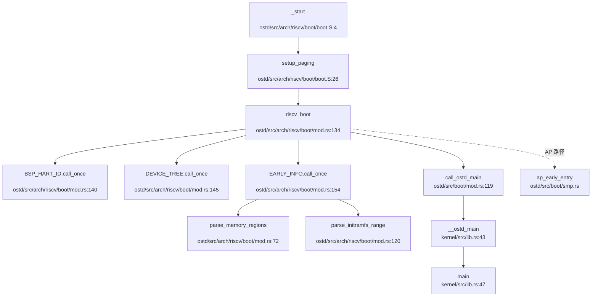
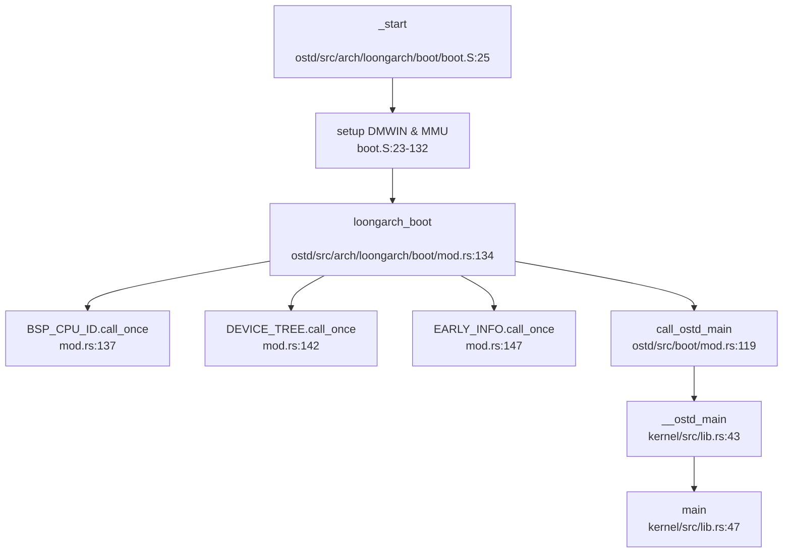

现在我已经收集了足够的信息来撰写完整的第 2 章报告。让我整理所有发现并生成最终的分析报告。

## 第 2 章：启动流程与架构初始化

### 启动入口与链接脚本分析

本项目支持 **RISC-V 64** 和 **LoongArch 64** 双架构启动，入口点位于 `ostd/src/arch/{riscv,loongarch}/boot/boot.S`。

#### RISC-V 64 启动入口

**入口文件**: `ostd/src/arch/riscv/boot/boot.S`

```assembly
.section .text.entry
.globl _start
_start:
    # 从 SBI 传递的参数：
    #   a0 = hart id
    #   a1 = DTB 物理地址
    lga     sp, boot_stack_top
    j       setup_paging
```

**关键特征**:
- **入口符号**: `_start` (位于 `.text.entry` 段)
- **参数传递**: 通过 SBI 规范，`a0` 传递 Hart ID，`a1` 传递 DTB 物理地址
- **栈设置**: 使用静态分配的 `boot_stack_top` (64KB 启动栈)
- **链接脚本**: `osdk/src/base_crate/riscv64.ld.template` 定义 `ENTRY(_start)`

#### LoongArch 64 启动入口

**入口文件**: `ostd/src/arch/loongarch/boot/boot.S`

```assembly
.section .text.entry
.globl _start
.globl _start_ap

_start_ap:
_start:
    # Setup DMWIN (Direct Map Window)
    li.d        $t0, (0x8000000000000000 | 1)
    csrwr       $t0, 0x180    # DMW0: VSEG=8, PLV0, Strongly ordered uncached
    
    li.d        $t0, (0x9000000000000000 | 1 | 1 << 4)
    csrwr       $t0, 0x181    # DMW1: VSEG=9, PLV0, Coherent cached
```

**关键特征**:
- **统一入口**: `_start` 和 `_start_ap` 共享同一段代码
- **DMW 配置**: 设置直接映射窗口 (DMW0/DMW1)，实现物理地址到虚拟地址的直接映射
- **参数传递**: `a0` = CPU ID, `a2` = System Table 物理地址 (FDT)

---

### 架构初始化流程（模式切换/FPU/MMU）

#### RISC-V 64 架构初始化

##### 1. 模式切换验证

**状态**: ❌ **未发现显式 M-Mode → S-Mode 切换代码**

分析 `boot.S` 和 `trap.rs` 发现：
- 代码假设已在 S-Mode 下执行（直接使用 `satp`、`stvec` 等 S-Mode 寄存器）
- 模式切换由 **SBI 固件 (OpenSBI)** 在跳转到内核前完成
- 证据：`trap.rs:106` 设置 `sstatus.spp = SPP::User` 用于返回用户态

```rust
// ostd/src/arch/riscv/trap/trap.rs:106
s.set_spp(SPP::User);
```

##### 2. MMU 启用流程

**文件**: `ostd/src/arch/riscv/boot/boot.S:33-56`

```assembly
setup_paging:
    # 设置第一级页表 (boot_pagetable)
    la     t1, boot_pagetable
    
    # 设置第 256 个页表项指向 boot_pagetable_1st
    li     t0, 8 * 256
    add    t1, t1, t0
    la     t0, boot_pagetable_1st
    srli   t0, t0, 12
    slli   t0, t0, 10
    ori    t0, t0, 0x01      # 设置 Valid 位
    sd     t0, 0(t1)
    
    # 设置 satp 寄存器 (Sv48 模式)
    la     t0, boot_pagetable
    li     t1, 9 << 60       # Sv48 mode
    srli   t0, t0, 12
    or     t0, t0, t1
    csrw   satp, t0
    sfence.vma               # 刷新 TLB
```

**页表结构**:
- **模式**: Sv48 (48 位虚拟地址，4 级页表)
- **映射**: 预映射低地址空间 (0x0/0x40000/0x80000)，使用 `VRWXAD` 全权限
- **物理基址**: `boot_pagetable` (位于 `.data` 段，16KB 对齐)

##### 3. FPU 初始化

**状态**: 🔸 **桩函数** (仅定义结构体，无实际初始化)

```rust
// ostd/src/arch/riscv/cpu/mod.rs:17-29
#[derive(Clone, Copy, Debug, Default)]
pub struct FpuState(());

impl FpuState {
    pub fn new() -> Self { Self(()) }
    pub fn save(&self) { /* TODO */ }
    pub fn restore(&self) { /* TODO */ }
}
```

**验证**:
- 搜索 `sstatus.fs` 仅在 `trap.rs:109` 设置 `FS=Dirty` 标志
- **未发现** `sstatus.fs` 的显式启用代码 (如 `set_fs(Initial)` 或 `set_fs(Accurate)`)
- **结论**: FPU 功能未实现，仅保留接口

##### 4. 关键寄存器设置

| 寄存器 | 设置位置 | 值/说明 |
|--------|----------|---------|
| `sp` | `boot.S:24` | `boot_stack_top` (64KB 栈) |
| `satp` | `boot.S:54` | Sv48 模式 + 根页表 PPN |
| `stvec` | `trap.rs:66` | `trap_entry` (中断向量表) |
| `sscratch` | `trap.rs:64` | 0 (标识内核态) |
| `sstatus` | `trap.rs:106-109` | SPP=User, SPIE=true, FS=Dirty |

---

#### LoongArch 64 架构初始化

##### 1. 模式切换验证

**状态**: ✅ **已实现** (通过 DMW 和 CRMD 寄存器)

```assembly
# ostd/src/arch/loongarch/boot/boot.S:127-132
# Enable MMU & Set privilege level
li.w        $t0, 0xb0       # PLV=0 (内核态), IE=0, PG=1 (启用分页)
csrwr       $t0, 0x0        # LOONGARCH_CSR_CRMD
li.w        $t0, 0x00       # PLV=0, PIE=0, PWE=0
csrwr       $t0, 0x1        # LOONGARCH_CSR_PRMD
```

**关键操作**:
- **DMW 配置**: 设置 `DMW0` (VSEG=8, 非缓存) 和 `DMW1` (VSEG=9, 缓存)
- **CRMD 设置**: `PG=1` 启用分页，`PLV=0` 设置内核特权级

##### 2. MMU 启用流程

**文件**: `ostd/src/arch/loongarch/boot/boot.S:74-101`

```assembly
# 设置页表基址
la.global   $t0, boot_pagetable
and         $t0, $t0, $t2   # 确保物理地址
csrwr       $t0, 0x1a       # LOONGARCH_CSR_PGDH

# 设置 PGDL (VA[47]=0 时的页表基址)
li.d        $t0, 0x0
csrwr       $t0, 0x19       # LOONGARCH_CSR_PGDL

# 刷新 TLB
invtlb      0x00, $zero, $zero

# 启用分页
li.w        $t0, 0xb0       # PLV=0, IE=0, PG=1
csrwr       $t0, 0x0        # CRMD
```

**页表结构**:
- **模式**: 4 级页表 (PWCL/PWCH 配置)
- **映射**: 预映射 2MB 大页 (通过 `boot_pagetable_3nd` 填充)
- **TLB Refill**: 设置 `_tlb_fill` 为缺页异常处理程序

##### 3. FPU 初始化

**状态**: ✅ **已启用** (但状态保存/恢复为桩函数)

```rust
// ostd/src/arch/loongarch/mod.rs:47
pub(crate) fn enable_cpu_features() {
    loongArch64::register::euen::set_fpe(true);  // 启用 FPU 异常
}

// ostd/src/arch/loongarch/cpu/context.rs:18-45
pub struct FpuState {}  // 空结构体，TODO

impl FpuState {
    pub fn save(&self) { /* TODO */ }
    pub fn restore(&self) { /* TODO */ }
}
```

**验证**:
- `euen::set_fpe(true)` 启用 FPU 异常处理
- **但** `FpuState` 为空结构体，`save()`/`restore()` 均为 `TODO`
- **结论**: FPU 已启用但上下文切换未实现

##### 4. 关键寄存器设置

| 寄存器 | 设置位置 | 值/说明 |
|--------|----------|---------|
| `DMW0/DMW1` | `boot.S:23-30` | VSEG=8/9, PLV0, 缓存策略 |
| `PWCL/PWCH` | `boot.S:36-44` | 页表宽度配置 (512 项/级) |
| `PGDH` | `boot.S:97` | 根页表基址 |
| `CRMD` | `boot.S:128` | PG=1 (启用分页), PLV=0 |
| `TLBRENTRY` | `boot.S:69` | `_tlb_fill` (TLB Refill 入口) |

---

### 到达内核主函数的路径（完整调用链）

#### RISC-V 64 启动链



**详细流程**:

1. **汇编入口** (`boot.S:4`):
   - 设置栈指针 → 跳转到 `setup_paging`
   - 启用 MMU (设置 `satp`) → 跳转到 `riscv_boot`

2. **Rust 入口** (`mod.rs:134`):
   ```rust
   pub extern "C" fn riscv_boot(hart_id: usize, device_tree_paddr: usize) -> ! {
       let bsp_hart_id = *BSP_HART_ID.call_once(|| hart_id);
       if hart_id == bsp_hart_id {
           // BSP 路径
           let fdt = unsafe { Fdt::from_ptr(device_tree_ptr) };
           DEVICE_TREE.call_once(|| fdt);
           EARLY_INFO.call_once(|| EarlyBootInfo { ... });
           call_ostd_main();
       } else {
           // AP 路径
           ap_early_entry(hart_id as u32);
       }
   }
   ```

3. **OSTD 初始化** (`ostd/src/lib.rs:67`):
   ```rust
   unsafe fn init() {
       arch::enable_cpu_features();
       arch::serial::init();
       logger::init();
       mm::heap_allocator::init();
       boot::init_after_heap();
       mm::frame::allocator::init();
       mm::kspace::init_kernel_page_table();
       bus::init();
       arch::irq::enable_all_local();
   }
   ```

4. **内核主函数** (`kernel/src/lib.rs:47`):
   ```rust
   #[ostd::main]
   pub fn main() {
       spawn(async {
           vfs::init_vfs().await;
           // 运行测试任务...
       }, None);
   }
   ```

#### LoongArch 64 启动链



**与 RISC-V 的差异**:
- **FDT 来源**: LoongArch 使用内嵌 DTB (`include_bytes!("loongarch64-qemu.dtb")`)
- **注释提示**: `mod.rs:141` 标注 `[TODO] 这里需要修改，FDT 需要从 _system_table_paddr 中获取`

---

### 多平台启动流程（StarFive/LoongArch 等）

#### StarFive VisionFive2 支持

**状态**: ❌ **未发现** 特异性支持代码

**搜索结果**:
```bash
grep 'visionfive|jh7110|starfive' → 0 匹配
```

**分析**:
- 项目使用通用 RISC-V `virt` 机器配置 (`OSDK.toml:scheme.riscv`)
- **未实现** VisionFive2 特有的启动流程 (如 GPIO 初始化、特定外设驱动)
- SBI → U-Boot → OS 链依赖通用 QEMU `virt` 平台

#### LoongArch 平台支持

**状态**: ✅ **已实现** (QEMU `virt` 机器)

**配置文件**: `OSDK.toml:scheme.oscomp-loongarch`

```toml
[scheme."oscomp-loongarch"]
boot.method = "qemu-direct"
qemu.args = """
-machine virt \
-m 1G \
-drive file=./sdcard-la.img,if=none,format=raw,id=x0 \
-device virtio-blk-pci,drive=x0 \
"""
```

**启动链**:
```
QEMU virt 机器 → _start (boot.S) → loongarch_boot (mod.rs) → main (kernel/src/lib.rs)
```

#### 固件级启动链（RISC-V）

**状态**: ✅ **已实现** (通过 SBI 运行时)

**依赖**: `ostd/Cargo.toml:67-68`
```toml
sbi-rt = "0.0.3"
sbi-spec = "0.0.7"
```

**SBI 调用示例**:
```rust
// ostd/src/arch/riscv/boot/smp.rs:103
let ret = sbi_rt::hart_start(hart_id as usize, start_addr_phys, ap_stack_pointer as usize);

// ostd/src/arch/riscv/serial.rs:38
sbi_rt::console_write_byte(data);

// ostd/src/arch/riscv/qemu.rs:18
sbi_rt::system_reset(sbi_rt::Shutdown, sbi_rt::NoReason);
```

**启动链**:
```
OpenSBI (M-Mode) → U-Boot (S-Mode) → Kernel (_start in S-Mode)
```

**注意**: 代码假设 SBI 已完成 M-Mode → S-Mode 切换，内核直接从 S-Mode 开始执行。

---

### 平台配置与构建机制

#### 目标架构配置

**文件**: `rust-toolchain.toml`

```toml
[toolchain]
channel = "nightly-2025-02-01"
components = ["rust-src", "rustc-dev", "llvm-tools-preview"]
targets = ["riscv64gc-unknown-none-elf"]
```

**分析**:
- **默认目标**: `riscv64gc-unknown-none-elf` (RISC-V 64, 通用扩展)
- **LoongArch 支持**: 需手动添加 `loongarch64-unknown-none-elf` 目标

#### 平台构建配置

**文件**: `OSDK.toml`

| Scheme | 架构 | 启动方式 | QEMU 机器 |
|--------|------|----------|-----------|
| `riscv` | RISC-V 64 | `qemu-direct` | `virt` |
| `oscomp-riscv` | RISC-V 64 | `qemu-direct` | `virt` (1GB RAM) |
| `oscomp-loongarch` | LoongArch 64 | `qemu-direct` | `virt` (1GB RAM) |
| `microvm` | x86_64 | `qemu-direct` | `microvm` |
| `tdx` | x86_64 | `grub-qcow2` | `q35` (TDX 启用) |

#### 链接脚本配置

**文件**: `osdk/src/base_crate/{riscv64,x86_64,loongarch64}.ld.template`

**RISC-V 关键段**:
```ld
ENTRY(_start)

SECTIONS {
    . = 0xffffffff80200000;  /* 内核加载地址 */
    .text.entry : {
        *(.text.entry)
    }
    .text : {
        *(.text)
    }
    .bss.stack : {
        boot_stack_bottom = .;
        . = . + 0x40000;  /* 64KB 启动栈 */
        boot_stack_top = .;
    }
}
```

#### 架构对齐检查

**LSP Target Triple**: `riscv64gc-unknown-none-elf` (与 `rust-toolchain.toml` 一致)

**验证**:
- `ostd/src/arch/riscv/` 目录代码可正常解析
- `#[cfg(target_arch = "riscv64")]` 代码块未灰化
- **无需** 调用 `lsp_set_target_arch`

---

### MMU 启用前后串口地址切换

#### RISC-V 64 串口实现

**文件**: `ostd/src/arch/riscv/serial.rs`

```rust
pub fn send(data: u8) {
    sbi_rt::console_write_byte(data);  // 通过 SBI 调用输出
}
```

**分析**:
- **MMU 启用前**: 通过 SBI 调用 (ECALL) 输出，无需访问物理串口
- **MMU 启用后**: 仍通过 SBI 调用，**未切换** 到直接 MMIO 访问
- **结论**: 无地址切换逻辑，依赖 SBI 抽象

#### LoongArch 64 串口实现

**文件**: `ostd/src/arch/loongarch/device/serial.rs`

```rust
pub struct SerialPort {
    data: MmioPort<u8, ReadWriteAccess>,
    // ... 其他寄存器
}

impl SerialPort {
    pub const unsafe fn new(uart_base: usize) -> Self {
        let data = MmioPort::new(uart_base);  // 直接 MMIO 映射
        // ...
    }
}
```

**地址切换验证**:
- **搜索**: `phys_to_virt|virt_to_phys|paddr_to_vaddr` 在串口初始化中的使用
- **结果**: 串口代码直接使用虚拟地址 (`uart_base` 参数)
- **DMW 映射**: LoongArch 通过 DMW 实现物理地址到虚拟地址的**直接映射** (VSEG=8/9)
- **结论**: 无需显式切换，DMW 已处理地址转换

#### 物理 - 虚拟地址转换函数

**文件**: `ostd/src/mm/kspace/mod.rs` (通过 `ostd/src/mm/mod.rs:44` 导出)

```rust
pub(crate) use self::{
    frame::meta::init as init_page_meta, kspace::paddr_to_vaddr,
};
```

**使用场景**:
- `ostd/src/arch/riscv/boot/mod.rs:143`: `paddr_to_vaddr(device_tree_paddr)`
- `ostd/src/arch/loongarch/plic.rs:27`: `paddr_to_vaddr(info.platic_base)`

---

### 关键代码片段分析

#### 1. RISC-V 页表初始化 (`boot.S:33-60`)

```assembly
setup_paging:
    # 设置第 256 个页表项 (索引 0x100)
    la     t1, boot_pagetable
    li     t0, 8 * 256
    add    t1, t1, t0
    la     t0, boot_pagetable_1st
    srli   t0, t0, 12          # 转换为 PPN
    slli   t0, t0, 10          # PPN << 10
    ori    t0, t0, 0x01        # 设置 Valid 位
    sd     t0, 0(t1)
    
    # 设置 satp (Sv48 模式)
    la     t0, boot_pagetable
    li     t1, 9 << 60         # Sv48: mode=9
    srli   t0, t0, 12          # PPN
    or     t0, t0, t1
    csrw   satp, t0
    sfence.vma                 # 刷新 TLB
```

**技术要点**:
- **页表项格式**: `[PPN(44 位) | RSW(2 位) | D | A | G | U | X | W | V]`
- **Sv48 模式**: `satp[63:60] = 9`, 支持 48 位虚拟地址
- **映射范围**: 预映射低地址 0x0-0x100000 (1MB)

#### 2. LoongArch TLB Refill 处理 (`boot.S:146-171`)

```assembly
.globl _tlb_fill
.align 12
_tlb_fill:
    csrwr   $t0, LA_CSR_TLBRSAVE    # 保存 t0
    csrrd   $t0, LA_CSR_PGD         # 读取页表基址
    lddir   $t0, $t0, 3             # 遍历第 4 级页表
    beqz    $t0, _break
    lddir   $t0, $t0, 2             # 遍历第 3 级页表
    beqz    $t0, _break
    lddir   $t0, $t0, 1             # 遍历第 2 级页表
    beqz    $t0, _break
    ldpte   $t0, 0                  # 加载 PTE 到 TLB
    ldpte   $t0, 1
    tlbfill
    csrrd   $t0, LA_CSR_TLBRSAVE    # 恢复 t0
    ertn                            # 返回
_break:
    csrwr   $zero, LA_CSR_TLBRELO0  # 触发异常
    ertn
```

**技术要点**:
- **硬件页表遍历**: 使用 `lddir` (Load Directory) 和 `ldpte` (Load PTE) 指令
- **失败处理**: 写入 `TLBRELO0=0` 触发 Page Fault 异常
- **性能优化**: 避免软件遍历页表，利用硬件自动遍历

#### 3. OSTD 初始化序列 (`ostd/src/lib.rs:67-102`)

```rust
unsafe fn init() {
    arch::enable_cpu_features();   // 启用 CPU 特性 (如 FPU)
    arch::serial::init();          // 初始化串口
    logger::init();                // 初始化日志系统
    cpu::local::early_init_bsp_local_base(); // BSP 本地存储
    mm::heap_allocator::init();    // 初始化堆分配器
    boot::init_after_heap();       // 复制启动信息到堆
    mm::frame::allocator::init();  // 初始化物理帧分配器
    mm::kspace::init_kernel_page_table(); // 初始化内核页表
    mm::dma::init();               // 初始化 DMA
    arch::init_on_bsp();           // 架构特定初始化
    mm::kspace::activate_kernel_page_table(); // 激活内核页表
    bus::init();                   // 初始化总线 (PCI/MMIO)
    arch::irq::enable_all_local(); // 启用本地中断
}
```

**初始化顺序依赖**:
1. **CPU 特性** → **串口** → **日志** (早期调试)
2. **堆分配器** → **启动信息复制** (需要堆)
3. **帧分配器** → **内核页表** (需要物理内存管理)
4. **总线初始化** → **中断启用** (设备探测完成后)

---

### 启动流程总结

| 阶段 | RISC-V 64 | LoongArch 64 |
|------|-----------|--------------|
| **入口点** | `_start` (boot.S:4) | `_start` (boot.S:25) |
| **模式切换** | SBI 完成 (M→S) | DMW+CRMD 设置 (PLV=0) |
| **MMU 启用** | `satp` (Sv48) | `PGDH` + `CRMD.PG=1` |
| **FPU 状态** | 🔸 桩函数 | ✅ 启用但上下文为 TODO |
| **串口输出** | SBI 调用 | MMIO (通过 DMW 映射) |
| **Rust 入口** | `riscv_boot` | `loongarch_boot` |
| **内核入口** | `main` (kernel/src/lib.rs:47) | `main` (kernel/src/lib.rs:47) |

**关键发现**:
1. **双架构支持**: 项目完整支持 RISC-V 和 LoongArch，但 LoongArch 的 FDT 加载存在 TODO
2. **FPU 未完全实现**: 两个架构的 FPU 上下文保存/恢复均为桩函数
3. **SBI 依赖**: RISC-V 严重依赖 SBI 进行串口输出、IPI 发送、系统复位
4. **MMU 早期启用**: 两个架构均在跳转到 Rust 代码前启用 MMU
5. **无 VisionFive2 特异性支持**: 使用通用 RISC-V `virt` 平台配置
