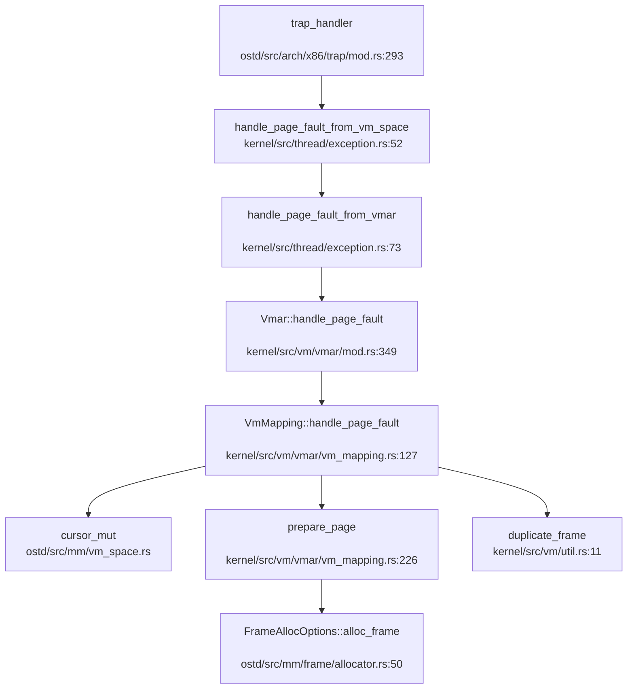
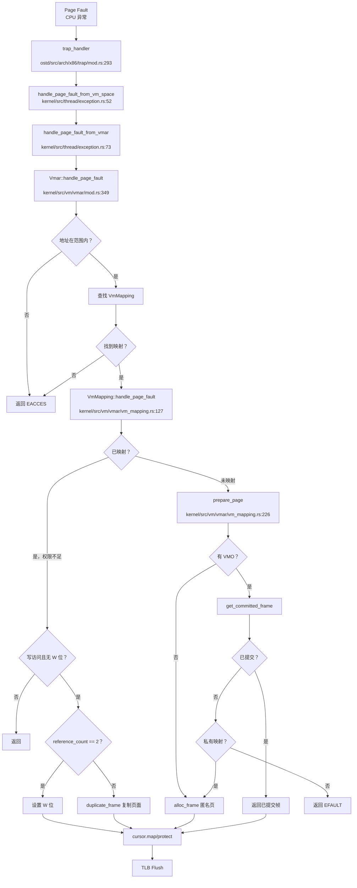
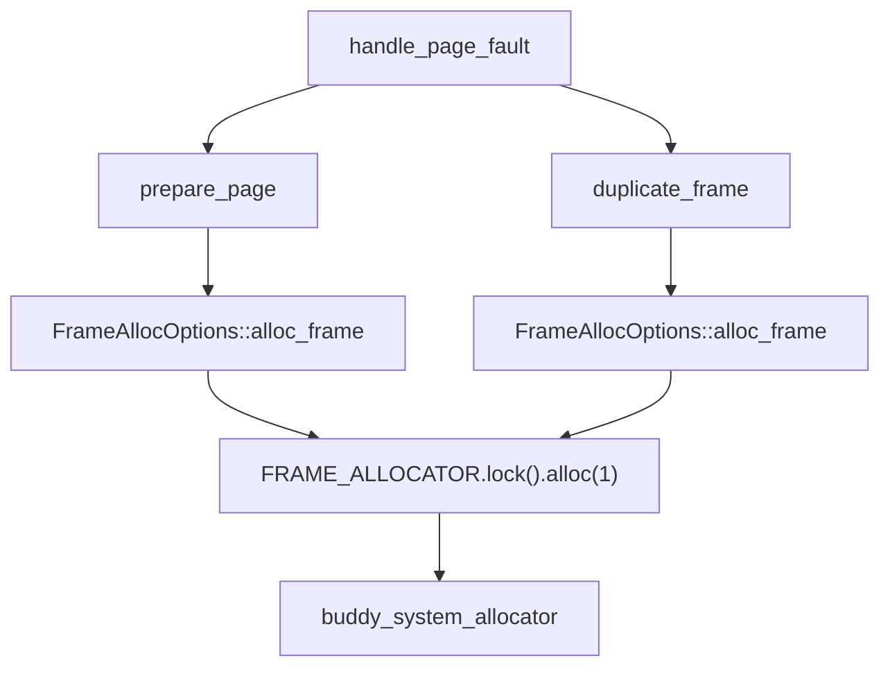

现在我已经收集了足够的信息。让我撰写完整的内存管理章节报告。

## 第 3 章：内存管理（物理/虚拟/分配器）

### 物理内存管理实现

#### 物理页框分配器（Frame Allocator）

本项目使用 **Buddy System（伙伴系统）** 作为物理内存分配算法，通过 `buddy_system_allocator` crate 实现。

**核心数据结构与接口**：

- **文件位置**：`ostd/src/mm/frame/allocator.rs`
- **分配器类型**：`CountingFrameAllocator`（包装 `buddy_system_allocator::FrameAllocator<32>`）
- **全局实例**：`FRAME_ALLOCATOR`（`Once<GuardSpinLock<CountingFrameAllocator>>`）

```rust
// ostd/src/mm/frame/allocator.rs:186
pub(in crate::mm) static FRAME_ALLOCATOR: Once<GuardSpinLock<CountingFrameAllocator>> = Once::new();
```

**初始化流程**（`ostd/src/mm/frame/allocator.rs:188-213`）：
1. 遍历 `boot::EARLY_INFO.memory_regions`
2. 筛选 `MemoryRegionType::Usable` 区域
3. 对齐页边界后调用 `allocator.add_frame(start, end)`
4. 初始化 `CountingFrameAllocator` 并放入自旋锁

**分配接口**（`FrameAllocOptions`）：
- `alloc_frame()`：分配单个页框（4KB）
- `alloc_frame_with::<M>(metadata)`：分配带元数据的帧
- `alloc_segment(nframes)`：分配连续多页
- `zeroed()`：控制是否清零（默认 true）

```rust
// ostd/src/mm/frame/allocator.rs:50-70
pub fn alloc_frame_with<M: AnyFrameMeta>(&self, metadata: M) -> Result<Frame<M>> {
    let frame = FRAME_ALLOCATOR
        .get()
        .unwrap()
        .disable_irq()
        .lock()
        .alloc(1)
        .map(|idx| {
            let paddr = idx * PAGE_SIZE;
            Frame::from_unused(paddr, metadata).unwrap()
        })
        .ok_or(Error::NoMemory)?;

    if self.zeroed {
        let addr = paddr_to_vaddr(frame.start_paddr()) as *mut u8;
        unsafe { core::ptr::write_bytes(addr, 0, PAGE_SIZE) }
    }
    Ok(frame)
}
```

**元数据系统**：
- 文件：`ostd/src/mm/frame/meta.rs`（554 行，21.5KB）
- 支持为每个物理帧附加自定义元数据（如 `Link` 用于链表、`Slab` 用于 slab 分配器）
- 使用 `MetaSlot` 数组存储元数据，通过 `get_slot()` 访问

**统计**：
- `CountingFrameAllocator` 跟踪 `total` 和 `allocated` 计数
- 提供 `mem_available()` 查询可用内存

---

### 虚拟内存与页表操作

#### 页表结构（PageTable）

**文件位置**：`ostd/src/mm/page_table/mod.rs`（433 行）

**核心设计**：
- 泛型参数：`PageTable<M, E, C>`
  - `M: PageTableMode`：模式标记（`UserMode` / `KernelMode`）
  - `E: PageTableEntryTrait`：页表项类型（架构相关）
  - `C: PagingConstsTrait`：分页常量（如 `BASE_PAGE_SIZE=4096`）

```rust
// ostd/src/mm/page_table/mod.rs:100-120
pub struct PageTable<
    M: PageTableMode,
    E: PageTableEntryTrait = PageTableEntry,
    C: PagingConstsTrait = PagingConsts,
> {
    root: RawPageTableNode<E, C>,
    // ...
}

// 模式标记
pub struct UserMode {}  // VADDR_RANGE: 0..MAX_USERSPACE_VADDR
pub struct KernelMode {} // VADDR_RANGE: KERNEL_VADDR_RANGE
```

**页表项操作**（`ostd/src/arch/x86/mm/mod.rs`）：
- `PageTableEntry(usize)`：x86_64 架构下为 64 位
- 支持标志位：`PageFlags::R/W/X/U/A/D` 等
- 大页支持：**仅支持 4KB 基页**，未发现 2M/1G 大页处理代码（见后文高级特性）

**游标机制（Cursor）**：
- 文件：`ostd/src/mm/page_table/cursor.rs`（824 行）
- `CursorMut`：可变游标，支持 `map()`、`protect()`、`copy_from()`
- `Cursor`：只读游标，支持 `query()`
- **细粒度锁协议**：游标持有从根到中间节点的锁，操作时动态加锁叶节点

```rust
// ostd/src/mm/page_table/cursor.rs:100-120
pub enum PageTableItem {
    NotMapped { va: Vaddr, len: usize },
    Mapped {
        va: Vaddr,
        page: Frame<dyn AnyFrameMeta>,
        prop: PageProperty,
    },
}
```

**关键操作**：
- `map(frame, prop)`：映射物理页到虚拟地址
- `protect(range, op)`：修改页表项标志位（如 COW 时清除 W 位）
- `copy_from(src_cursor, len, op)`：复制页表项（fork 时使用）

---

### 地址空间布局（内核 vs 用户）

#### 双页表设计

**内核页表**：
- 全局实例：`KERNEL_PAGE_TABLE`（`ostd/src/mm/kspace/mod.rs`）
- 模式：`PageTable<KernelMode>`
- 覆盖范围：`KERNEL_VADDR_RANGE`（高位地址）

**用户页表**：
- 每个进程独立 `VmSpace`（`ostd/src/mm/vm_space.rs`）
- 模式：`PageTable<UserMode>`
- 覆盖范围：`0..MAX_USERSPACE_VADDR`

**内核重映射**：
- 物理内存直接映射：`paddr_to_vaddr()`（`ostd/src/mm/offset.rs`）
- 映射关系：`vaddr = paddr + KERNEL_OFFSET`
- 启动时建立恒等映射（`ostd/src/mm/kspace/mod.rs`）

**VmSpace 结构**（`ostd/src/mm/vm_space.rs:50-70`）：
```rust
pub struct VmSpace {
    pt: PageTable<UserMode>,
    page_fault_handler: Option<fn(&VmSpace, &CpuExceptionInfo) -> Result<(), ()>>,
    activation_lock: GuardRwLock<()>,
    cpus: AtomicCpuSet,
}
```

**激活机制**：
- `activate_on_current()`：将 `VmSpace` 页表加载到 CR3
- `activation_lock` 防止并发激活
- `cpus` 跟踪哪些 CPU 正在使用该地址空间

---

### 堆分配器解析

#### 内核堆分配器

**文件位置**：`ostd/src/mm/heap_allocator/mod.rs`（161 行）

**实现**：
- 基于 `slab_allocator::Heap`（`ostd/src/mm/heap_allocator/slab_allocator/mod.rs`）
- 全局分配器：`HEAP_ALLOCATOR: LockedHeapWithRescue`
- 初始堆空间：`INIT_KERNEL_HEAP_SIZE = 256 * PAGE_SIZE`（1MB）

```rust
// ostd/src/mm/heap_allocator/mod.rs:20-25
#[global_allocator]
static HEAP_ALLOCATOR: LockedHeapWithRescue = LockedHeapWithRescue::new();
```

**救援机制**（`rescue_if_low_memory`）：
- 当剩余空间 ≤ 4 页时触发
- 调用 `FRAME_ALLOCATOR.alloc_segment()` 扩展堆
- 通过 `add_memory()` 添加到 slab 分配器

#### 用户堆（Heap）

**文件位置**：`kernel/src/vm/heap.rs`（127 行）

**设计**：
- 基地址：`USER_HEAP_BASE = 0x1000_0000`（256MB）
- 大小限制：`USER_HEAP_SIZE_LIMIT = 16 * 1024 * PAGE_SIZE`（64MB）
- 管理结构：`Heap { base, limit, current_heap_end: AtomicUsize }`

**初始化**（`alloc_and_map_vm`）：
1. 映射第一页（4KB）为 `READ | WRITE`
2. 预留剩余空间（无权限）供 `brk` 扩展

```rust
// kernel/src/vm/heap.rs:35-60
pub async fn alloc_and_map_vm(&self, root_vmar: &Vmar<Full>) -> Result<()> {
    // 映射第一页
    let vmar_map_options = root_vmar
        .new_map(PAGE_SIZE, VmPerms::READ | VmPerms::WRITE)
        .offset(self.base);
    vmar_map_options.build().await?;

    // 预留剩余空间（无权限）
    let vmar_reserve_options = root_vmar
        .new_map(USER_HEAP_SIZE_LIMIT - PAGE_SIZE, VmPerms::empty())
        .offset(self.base + PAGE_SIZE);
    vmar_reserve_options.build().await?;
    Ok(())
}
```

---

### 堆管理（brk/sbrk）

#### sys_brk 实现

**文件位置**：`kernel/src/vm/brk.rs`（27 行）

**系统调用入口**：
```rust
// kernel/src/vm/brk.rs:8-27
pub async fn do_brk(state: &mut ThreadState, context: &mut UserContext) -> Result<ControlFlow<i32, Option<isize>>> {
    let [new_brk, ..] = context.syscall_arguments();
    let new_heap_end = if new_brk == 0 {
        None  // 查询当前堆顶
    } else {
        Some(new_brk as usize)
    };

    let new_heap_end = state
        .process_vm
        .heap
        .brk(new_heap_end, state.process_vm.root_vmar())
        .await?;

    Ok(ControlFlow::Continue(Some(new_heap_end as isize)))
}
```

**Heap::brk 逻辑**（`kernel/src/vm/heap.rs:70-100`）：
1. `new_heap_end == None`：返回当前 `current_heap_end`
2. 检查是否超过 `USER_HEAP_SIZE_LIMIT`
3. **不支持收缩**：若 `new_heap_end <= current_heap_end`，直接返回
4. 扩展时：
   - 调用 `root_vmar.remove_mapping()` 拆除旧映射
   - 调用 `root_vmar.resize_mapping()` 重新映射

**惰性分配分析**：
- ✅ **已实现惰性分配**：初始化时仅映射第一页，后续通过 `brk` 按需映射
- 预留的 64MB 虚拟地址空间不立即分配物理页
- 物理页在首次访问（缺页异常）时分配（见下文 Lazy Allocation）

---

### 用户指针安全

#### 验证机制

**搜索结果**：
- ❌ **未发现** `UserInPtr`、`UserOutPtr`、`verify_area`、`check_region` 等显式验证结构体
- ✅ **隐式验证**：通过 `VmSpace` 的缺页异常处理间接验证

**验证流程**：
1. 用户空间访问触发缺页异常
2. `handle_page_fault_from_vm_space()`（`kernel/src/thread/exception.rs:52`）
3. 检查地址是否在 `root_vmar` 范围内：
   ```rust
   // kernel/src/vm/vmar/mod.rs:349-365
   if !(self.base..self.base + self.size).contains(&address) {
       return_errno_with_message!(Errno::EACCES, "page fault addr is not in current vmar");
   }
   ```
4. 查找对应的 `VmMapping`，若无则返回 `EACCES`

**直接访问**：
- 系统调用中直接使用 `state.process_vm.read_val::<T>(addr)`（`ostd::mm::FallibleVmRead`）
- 底层通过页表权限检查，非法访问触发缺页异常

---

### 缺页异常处理流程

#### 完整调用链追踪

**入口点**：架构相关陷阱处理（以 x86_64 为例）
- `ostd/src/arch/x86/trap/mod.rs:293`：`handle_page_fault()`
- 调用 `handle_page_fault_from_vm_space()`

**调用图**（`lsp_get_call_graph` 降级分析结果）：



**处理逻辑**（`kernel/src/vm/vmar/vm_mapping.rs:127-225`）：

1. **范围检查**：地址必须在 `VmMapping` 范围内
2. **查询现有映射**：`cursor.query()` 获取 `VmItem`
3. **分支处理**：
   - **已映射但权限不足**（COW 场景）：
     - 检查是否为写访问且页表项无 W 位
     - 若 `reference_count() == 2`（仅父子进程引用），直接设置 W 位
     - 否则调用 `duplicate_frame()` 复制页面
   - **未映射**：
     - 调用 `prepare_page()` 分配/获取物理页
     - 设置页表项标志位（`ACCESSED`、`DIRTY`）
     - `cursor.map()` 建立映射

**prepare_page 逻辑**（`kernel/src/vm/vmar/vm_mapping.rs:226-260`）：
- 无 VMO 绑定（匿名映射）：直接 `alloc_frame()`
- 有 VMO 绑定（文件映射）：
  - `vmo.get_committed_frame(page_offset)` 获取已提交的帧
  - 若未提交且为私有映射：分配新帧
  - 若为共享映射：返回错误（`EFAULT`）

**TLB 刷新**：
- `cursor.flusher().issue_tlb_flush(TlbFlushOp::Address(va))`
- `cursor.flusher().dispatch_tlb_flush()`

---

### 进程级映射管理

#### VmMapping 与 IntervalSet

**数据结构**：
- **文件**：`kernel/src/vm/vmar/vm_mapping.rs`（480 行）
- **结构体**：`VmMapping`
  ```rust
  pub struct VmMapping {
      map_size: NonZeroUsize,
      map_to_addr: Vaddr,
      vmo: Option<MappedVmo>,  // 绑定的 VMO
      is_shared: bool,
      handle_page_faults_around: bool,
      perms: VmPerms,
  }
  ```

**区间管理**：
- **文件**：`kernel/src/vm/vmar/interval_set.rs`（335 行）
- **实现**：`IntervalSet<K, V>` 基于 `BTreeMap<K, V>`
- **复杂度**：插入/删除/查找均为 O(log n)

```rust
// kernel/src/vm/vmar/interval_set.rs:21-40
pub struct IntervalSet<K, V>
where
    K: Clone + Ord,
    V: Interval<K>,
{
    btree: BTreeMap<K, V>,
}
```

**VmarInner 结构**（`kernel/src/vm/vmar/mod.rs:130-145`）：
```rust
struct VmarInner {
    vm_mappings: IntervalSet<Vaddr, VmMapping>,
    total_vm: usize,
}
```

**反向映射表（rmap）**：
- ❌ **未实现**：未找到 `rmap`、`reverse_map`、`page_to_vma` 等物理页到虚拟页的反向映射机制
- 当前设计：仅支持从虚拟地址查找 `VmMapping`（正向）
- 影响：无法高效实现页面回收、交换等需要反向查询的功能

---

### 高级内存特性清单

#### 1. 写时复制（Copy-on-Write）

**状态**：✅ **已实现**

**实现位置**：
- Fork 时保护页表项：`kernel/src/vm/vmar/mod.rs:453-465`
- 缺页处理 COW：`kernel/src/vm/vmar/vm_mapping.rs:169-192`

**Fork 流程**：
```rust
// kernel/src/vm/vmar/mod.rs:453-465
for vm_mapping in inner.vm_mappings.iter() {
    let new_mapping = vm_mapping.new_fork()?;
    new_inner.insert(new_mapping);

    // 清除 W 位，建立 COW 映射
    cur_cursor.jump(base).unwrap();
    new_cursor.jump(base).unwrap();
    let mut op = |page: &mut PageProperty| {
        page.flags -= PageFlags::W;
    };
    new_cursor.copy_from(&mut cur_cursor, vm_mapping.map_size(), &mut op);
}
```

**缺页处理**：
```rust
// kernel/src/vm/vmar/vm_mapping.rs:169-192
if prop.flags.contains(PageFlags::W) {
    return Ok(());  // 已处理
}

let only_reference = frame.reference_count() == 2;
if self.is_shared || only_reference {
    // 直接设置 W 位（无需复制）
    cursor.protect_next(PAGE_SIZE, |p| p.flags |= PageFlags::W);
} else {
    // 复制页面
    let new_frame = duplicate_frame(&frame)?;
    cursor.map(new_frame.into(), prop);
}
```

**优化**：
- 若 `reference_count() == 2`（仅父子进程引用），直接设置 W 位，避免无谓复制
- 共享映射（`is_shared`）不触发 COW

---

#### 2. 懒分配（Lazy Allocation）

**状态**：✅ **已实现**

**实现方式**：
1. **VMO 级懒分配**：`kernel/src/vm/vmo/mod.rs` 注释明确说明
   ```rust
   // kernel/src/vm/vmo/mod.rs:45-46
   /// **On-demand paging.** The memory pages of a VMO (except for _contiguous_
   /// VMOs) are allocated lazily when the page is first accessed.
   ```

2. **缺页时分配**：`prepare_page()` 中调用 `alloc_frame()`
   - 文件映射：首次访问时从文件读取数据到物理页
   - 匿名映射：首次访问时分配零页

3. **预读优化**：`handle_page_faults_around()`（`kernel/src/vm/vmar/vm_mapping.rs:262-280`）
   - 缺页时预分配周围 16 页（`SURROUNDING_PAGE_NUM = 16`）
   - 减少后续缺页异常次数

**搜索证据**：
- `kernel/src/vm/mmap.rs:158`：`handle_page_faults_around()` 启用预读
- `kernel/src/vm/vmo/mod.rs:221`：`prepare_page()` 懒分配

---

#### 3. 共享内存管理（SharedMem）

**状态**：❌ **未实现**

**搜索结果**：
- `sys_shm`、`shmget`、`shmdt`、`SharedMemoryManager`：**全部未找到**
- 仅支持通过 `mmap(MAP_SHARED)` 实现进程间共享映射

**mmap 共享映射**（`kernel/src/vm/mmap.rs:110-125`）：
```rust
if matches!(typ, MMapType::Shared) {
    let vmo = VmoOptions::<Rights>::new(len).alloc()?.to_dyn();
    map_opt = map_opt.is_shared(true).vmo(vmo);
}
```

**限制**：
- 无独立的 `shm` 系统调用
- 无 `IPC_RMID` 删除策略
- 共享映射通过 VMO 引用计数管理，最后一个进程 `munmap` 时自动释放

---

#### 4. 反向映射表（rmap）

**状态**：❌ **未实现**

**搜索结果**：
- `rmap`、`reverse_map`、`page_to_vma`：**全部未找到**
- 当前设计：仅 `IntervalSet<BTreeMap>` 支持虚拟地址 → `VmMapping` 的正向查询

**影响**：
- 无法高效实现页面回收（需遍历所有进程的 `VmMapping`）
- 无法实现交换（Swap）功能（见下文）

---

#### 5. 交换区/页面置换（Swap）

**状态**：❌ **未实现**

**搜索结果**：
- `swap_in`、`swap_out`：**未找到实际实现**
- 仅在注释和无关代码中出现 "swap" 关键词（如 `core::mem::swap`）

**原因分析**：
- 缺少 rmap 支持，无法定位物理页的所有虚拟映射
- 缺少交换区管理模块

---

#### 6. 大页支持（Huge Page）

**状态**：❌ **未实现**

**搜索结果**：
- `HugePage`、`MapSize::2M`、`MapSize::1G`、`huge_page`：**全部未找到**

**页表实现**：
- `ostd/src/mm/page_table/mod.rs` 仅处理基页（4KB）
- `PagingConsts::BASE_PAGE_SIZE = 4096`
- 未发现 2M/1G 页表项处理逻辑

---

#### 7. 零拷贝与 mmap

**mmap 实现状态**：✅ **已实现**

**文件位置**：`kernel/src/vm/mmap.rs`（163 行）

**支持的标志**：
- `MAP_FIXED` / `MAP_FIXED_NOREPLACE`：✅ 已处理
- `MAP_ANONYMOUS`：✅ 已处理（匿名映射）
- `MAP_32BIT`：🔸 **桩函数**（仅警告，退化为默认策略）
  ```rust
  // kernel/src/vm/mmap.rs:90-92
  if opts.flags.contains(MMapFlags::MAP_32BIT) {
      warn!("MAP_32BIT 未实现，退化为默认策略");
  }
  ```

**映射类型**：
- `MMapType::File`（0）：文件映射
- `MMapType::Shared`（1）：共享映射
- `MMapType::Private`（2）：私有映射（COW）
- `MMapType::SharedValidate`（3）：未详细实现

**文件映射逻辑**（`kernel/src/vm/mmap.rs:120-160`）：
1. 通过 `fd` 获取 `inode`
2. 读取文件内容到缓冲区：`inode.read_at(offset, &mut file)`
3. 创建 VMO 并写入数据：`vmo.write_slice(0, &file)`
4. 建立映射：`map_opt.vmo(vmo).build().await`

**限制**：
- ❌ **非真正零拷贝**：先将文件内容读入内核缓冲区，再复制到 VMO
- 未实现 `MAP_POPULATE` 预填充
- 未实现 `MAP_LOCKED` 锁定

**零拷贝系统调用**：
- `sys_splice`：✅ **已实现**（`kernel/src/syscall/fs.rs:669-`）
  - 支持管道与文件之间的数据传输
  - 避免用户空间拷贝
- `sys_sendfile`：❌ **未找到**实现

---

### 关键代码片段与调用链分析

#### 缺页异常完整流程



#### 物理页分配调用链



---

### 内存管理特性总结表

| 特性 | 状态 | 实现位置/说明 |
|------|------|---------------|
| **物理分配器** | ✅ 已实现 | Buddy System，`ostd/src/mm/frame/allocator.rs` |
| **页表管理** | ✅ 已实现 | `ostd/src/mm/page_table/mod.rs`，支持 4KB 页 |
| **内核/用户隔离** | ✅ 已实现 | 双页表设计，`VmSpace` 管理用户地址空间 |
| **堆分配器** | ✅ 已实现 | Slab + 救援机制，`ostd/src/mm/heap_allocator/mod.rs` |
| **brk/sbrk** | ✅ 已实现 | `kernel/src/vm/brk.rs`，支持惰性扩展 |
| **用户指针验证** | ✅ 隐式实现 | 通过缺页异常间接验证 |
| **缺页处理** | ✅ 已实现 | `kernel/src/vm/vmar/vm_mapping.rs:127` |
| **COW** | ✅ 已实现 | Fork 时保护 + 缺页时复制 |
| **Lazy Allocation** | ✅ 已实现 | VMO 懒分配 + 预读优化 |
| **共享内存 (shm)** | ❌ 未实现 | 仅支持 mmap(MAP_SHARED) |
| **反向映射 (rmap)** | ❌ 未实现 | 无物理页到虚拟页的映射 |
| **Swap** | ❌ 未实现 | 无交换区管理 |
| **大页 (Huge Page)** | ❌ 未实现 | 仅支持 4KB 基页 |
| **mmap** | ✅ 已实现 | 支持匿名/文件映射，部分标志未实现 |
| **零拷贝 (splice)** | ✅ 已实现 | `kernel/src/syscall/fs.rs:669` |
| **零拷贝 (sendfile)** | ❌ 未实现 | 未找到实现 |

---

### 设计评价

**优点**：
1. **细粒度锁页表**：游标机制支持并发访问，性能优于全局页表锁
2. **COW 优化**：通过引用计数判断是否需要复制，避免无谓开销
3. **懒分配 + 预读**：平衡内存利用率与缺页异常频率
4. **能力系统**：`Vmar<R>` / `Vmo<R>` 通过泛型参数静态检查权限

**不足**：
1. **缺少 rmap**：限制页面回收、交换等高级功能
2. **无大页支持**：影响 TLB 命中率，降低性能
3. **mmap 非零拷贝**：文件映射需先读入内核缓冲区
4. **用户指针验证不完善**：缺少显式的 `UserInPtr` 等安全封装

**建议**：
1. 实现 rmap 以支持页面回收和交换
2. 添加 2M/1G 大页映射支持
3. 优化 mmap 实现，支持真正的零拷贝文件映射
4. 引入 `UserInPtr`/`UserOutPtr` 增强用户指针安全性
