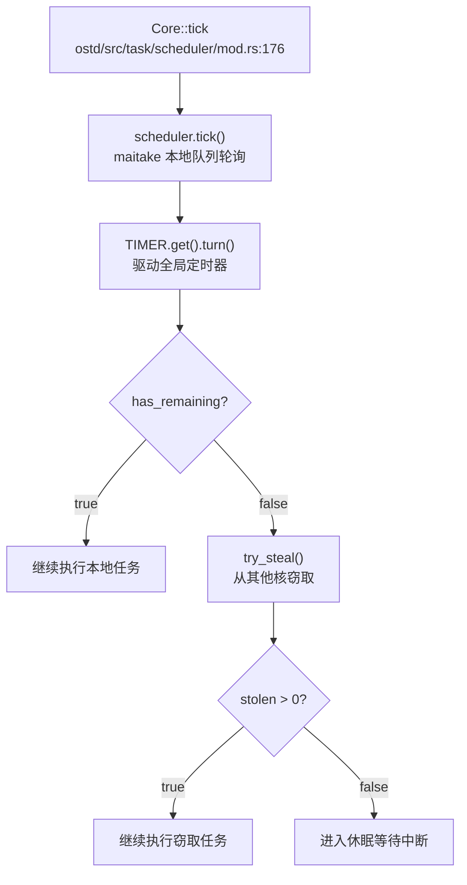
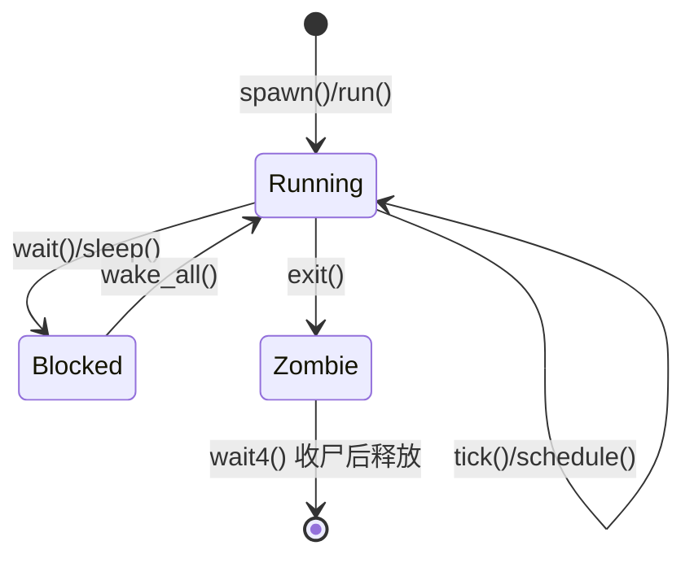
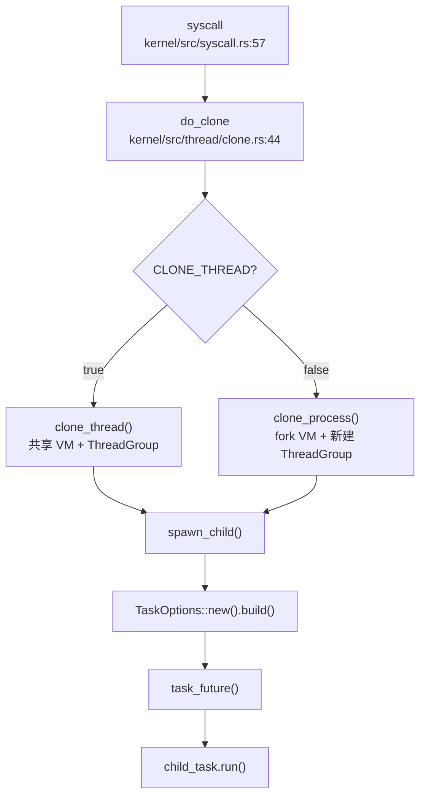
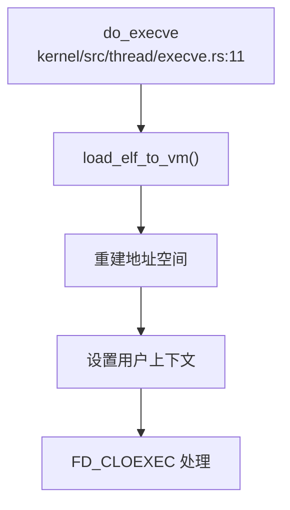
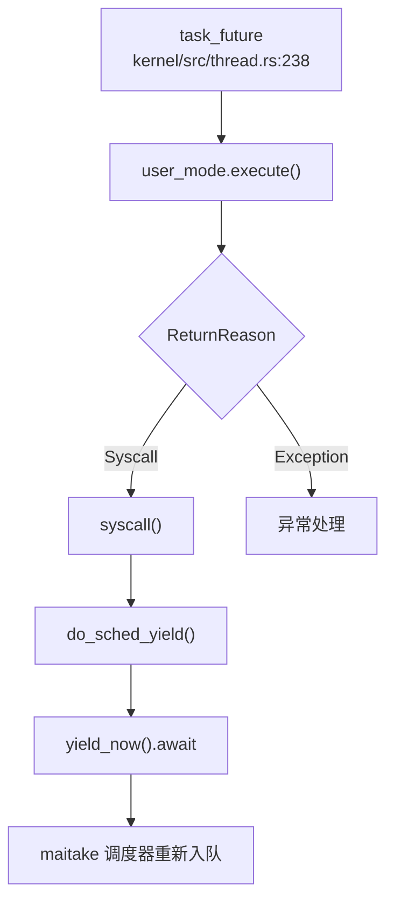
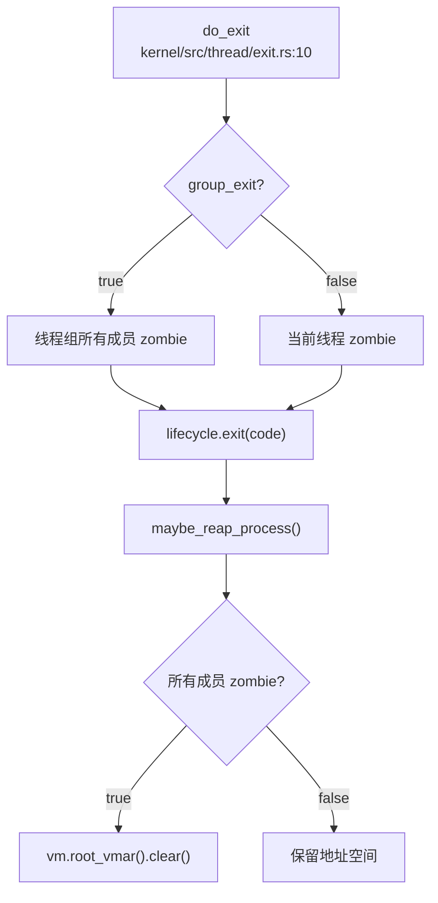

现在我已经收集了足够的信息。让我生成完整的第 4 章报告：

## 第 4 章：进程/线程与调度机制

### 任务模型与核心数据结构

本操作系统采用 **Task-Thread 两级模型**，其中 `Task` 是调度基本单位，`ThreadSharedInfo` + `ThreadState` 共同构成用户态执行实体的完整上下文。

#### Task 结构体（`ostd/src/task/mod.rs:24`）

```rust
pub struct Task {
    data: Box<dyn Any + Send + Sync>,      // 泛型任务数据
    local_data: ForceSync<Box<dyn Any + Send>>,  // 线程本地存储
    user_space: Option<Arc<UserSpace>>,    // 用户空间（可选）
}
```

`Task` 是底层调度器（基于 `maitake`）的直接操作对象。若任务需要执行用户代码，则通过 `user_space` 字段关联 `UserSpace`，其中包含：
- `VmSpace`：地址空间
- `UserContext`：用户态寄存器快照（含 RIP/RSP、TLS、FPU 状态等）

#### ThreadSharedInfo 结构体（`kernel/src/thread.rs:37`）

```rust
pub struct ThreadSharedInfo {
    pub tid: u64,                          // 线程 ID
    parent: Weak<ThreadSharedInfo>,        // 父线程弱引用
    children: GuardRwArc<Vec<Arc<ThreadSharedInfo>>>,  // 子线程列表
    lifecycle: Lifecycle,                  // 生命周期状态
    pub cpu_times: CpuTimes,               // CPU 时间统计
    pub start_ticks: u64,                  // 启动时的系统嘀嗒数
}
```

**关键设计**：
- **无 PGID/SID**：搜索全库未发现 `pgid`、`session_id`、`set_sid`、`setpgid` 或 `ProcessGroup` 相关实现，**❌ 未实现** POSIX 进程组与会话机制
- **父子关系**：通过 `parent`/`children` 形成树形结构，但仅用于 `wait4` 收尸，未实现进程组语义

#### ThreadState 结构体（`kernel/src/thread.rs:54`）

```rust
pub struct ThreadState {
    pub task: Arc<Task>,                   // 底层 Task
    pub thread_group: Arc<ThreadGroup>,    // 所属线程组（= 进程）
    pub shared_info: Arc<ThreadSharedInfo>, // 共享信息
    pub process_vm: Arc<ProcessVm>,        // 地址空间
    pub fd_table: Arc<FdTable>,            // 文件描述符表
    pub cwd: PathBuf,                      // 当前工作目录
    pub robust_list_head: usize,           // Robust futex 头（仅存储）
    pub robust_list_len: usize,            // Robust futex 长度
    pub sig_mask: u64,                     // 信号屏蔽字（仅存储）
    pub user_brk: usize,                   // 程序断点位置
}
```

**关键观察**：
- **无独立 PCB**：代码中未区分 Process Control Block 与 Thread Control Block，统一用 `ThreadState` 表示
- **线程组即进程**：`ThreadGroup` 结构体（`kernel/src/thread/thread_group.rs`）代表进程，其 `id` 等于组长线程的 `tid`（即 Linux 的 TGID）

#### Lifecycle 状态机（`kernel/src/thread/state.rs:7`）

```rust
pub enum LifeState {
    Running = 0,  // 运行中
    Zombie  = 1,  // 等待被 wait4 收尸
}

pub struct Lifecycle {
    state:           AtomicU8,      // LifeState
    exit_code:       AtomicI32,     // 退出码
    exit_wait_queue: WaitQueue,     // 父线程 wait4 队列
}
```

**状态流转**：
- `Running → Zombie`：调用 `exit()` 时原子切换
- **无 Blocked/Ready 显式状态**：底层依赖 `maitake` 调度器的 `WaitQueue` 实现阻塞/唤醒

---

### 调度算法与策略（代码证据）

本系统采用 **基于 Maitake 的工作窃取（Work-Stealing）调度器**，每核一个本地队列，支持跨核窃取负载均衡。

#### 调度器架构（`ostd/src/task/scheduler/mod.rs`）

```rust
pub struct Core {
    scheduler: &'static StaticScheduler,  // Maitake 静态调度器
    id: usize,                             // CPU 核心 ID
    rng: rand_xoshiro::Xoroshiro128PlusPlus, // 随机数生成器（用于窃取）
}

struct Runtime {
    cores: [InitOnce<StaticScheduler>; MAX_CORES],  // 最多 512 核
    injector: scheduler::Injector,                   // 全局任务注入器
    initialized: AtomicUsize,
}
```

#### 调度策略分析

通过 `lsp_get_call_graph` 追踪 `Core::tick()` 的执行流程：



**关键特性**：
1. **工作窃取**：`try_steal()` 随机选择受害核心，最多尝试 `MAX_STEAL_ATTEMPTS` 次，每次窃取最多 `MAX_STOLEN_PER_TICK` 个任务
2. **无优先级/Stride/CFS**：全库搜索未发现 `priority`、`stride`、`cfs`、`deadline` 等调度策略关键词，**❌ 未实现** 优先级调度或完全公平调度
3. **协作式 + 抢占式混合**：
   - `yield_now()`：显式让出 CPU（`kernel/src/thread/sched_yield.rs:8`）
   - `might_preempt()`：基于计时器中断的抢占检查

#### sched_yield 实现（`kernel/src/thread/sched_yield.rs`）

```rust
pub async fn do_sched_yield(_state: &mut ThreadState, _context: &mut UserContext) 
    -> Result<ControlFlow<i32, Option<isize>>> {
    ostd::task::scheduler::yield_now().await;
    Ok(ControlFlow::Continue(Some(0)))
}
```

**✅ 已实现**：调用 `maitake::yield_now()` 将当前任务重新加入队列尾部，实现 FIFO 轮转

---

### 任务状态机

本系统的任务状态流转如下：



**状态说明**：
- **Running**：任务在 CPU 上执行或在本地/全局队列中等待
- **Blocked**：调用 `WaitQueue::wait()` 进入阻塞（如 `wait4`、`nanosleep`）
- **Zombie**：调用 `exit()` 后设置，等待父线程 `wait4` 回收
- **Exited**：无此显式状态，`wait4` 完成后直接释放资源

**验证点**：
- `Lifecycle::exit()`（`kernel/src/thread/state.rs:29`）：设置 `Zombie` 状态并唤醒等待队列
- `Lifecycle::wait()`（`kernel/src/thread/state.rs:37`）：若已是 `Zombie` 立即返回，否则阻塞等待

---

### 上下文切换实现（汇编分析）

上下文切换由架构相关的汇编代码实现。以 LoongArch64 为例（`ostd/src/arch/loongarch/task/switch.S`）：

```assembly
.text
.global context_switch
context_switch: # (cur: *mut TaskContext, nxt: *TaskContext)
    # 保存当前任务寄存器
    st.d    $ra, $a0, 8*11   # 返回地址
    st.d    $sp, $a0, 8*0    # 栈指针
    st.d    $fp, $a0, 8*1    # 帧指针
    st.d    $s0, $a0, 8*2    # 被调用者保存寄存器
    st.d    $s1, $a0, 8*3
    st.d    $s2, $a0, 8*4
    st.d    $s3, $a0, 8*5
    st.d    $s4, $a0, 8*6
    st.d    $s5, $a0, 8*7
    st.d    $s6, $a0, 8*8
    st.d    $s7, $a0, 8*9
    st.d    $s8, $a0, 8*10

    # 恢复下一任务寄存器
    ld.d    $ra, $a1, 8*11
    ld.d    $sp, $a1, 8*0
    ld.d    $fp, $a1, 8*1
    ld.d    $s0, $a1, 8*2
    ld.d    $s1, $a1, 8*3
    ld.d    $s2, $a1, 8*4
    ld.d    $s3, $a1, 8*5
    ld.d    $s4, $a1, 8*6
    ld.d    $s5, $a1, 8*7
    ld.d    $s6, $a1, 8*8
    ld.d    $s7, $a1, 8*9
    ld.d    $s8, $a1, 8*10
    ret
```

**保存的寄存器**（共 13 个，104 字节）：
| 寄存器 | 用途 | 偏移 |
|--------|------|------|
| `$sp`  | 栈指针 | 0 |
| `$fp`  | 帧指针 | 8 |
| `$s0-$s8` | 被调用者保存 | 16-88 |
| `$ra`  | 返回地址 | 96 |

**关键观察**：
- **不保存临时寄存器**（`$t0-$t8`）：遵循调用约定，由编译器负责 spill
- **不保存 FPU/向量寄存器**：代码中未发现 FPU 保存/恢复逻辑，**❌ 未实现** 浮点上下文切换
- **TaskContext 结构**：位于 `ostd/src/arch/loongarch/task/mod.rs`，仅包含上述通用寄存器

---

### 进程间通信与同步（Signal/Futex）

#### 信号机制（Signal）

**🔸 桩函数**：信号系统调用已定义但无实际派发逻辑

搜索 `kernel/src/syscall/signal.rs` 发现：

```rust
/// rt_sigaction(2)：最小实现，接受注册但不派发
pub async fn do_rt_sigaction(
    state: &mut ThreadState,
    uc: &mut ostd::cpu::UserContext,
) -> Result<ControlFlow<i32, Option<isize>>> {
    // 如调用方请求 oldact，返回全零（默认动作）
    if oldact_ptr != 0 {
        let zero = KernelSigaction::default();
        state.process_vm.write_val(oldact_ptr as _, &zero)?;
    }
    // 接受 act 但不存储（最小实现）
    if act_ptr != 0 {
        let _ = state.process_vm.read_val::<KernelSigaction>(act_ptr as _)?;
    }
    Ok(ControlFlow::Continue(Some(0)))  // 始终返回成功
}
```

**验证结果**：
- `do_rt_sigprocmask()`：**🔸 桩函数** — 仅存储 `sig_mask` 字段，无实际屏蔽逻辑
- `do_rt_sigaction()`：**🔸 桩函数** — 读取但不保存 `sigaction`，始终返回成功
- `do_tgkill()`：**🔸 桩函数** — 空实现，直接返回 0（`kernel/src/syscall/signal.rs:84`）
- **❌ 未实现** 信号派发、信号处理函数注册、信号栈等核心机制

#### Futex 机制

**🔸 桩函数**：仅支持 Robust Futex 链表头存储

```rust
// kernel/src/thread.rs:63
// 记录 robust futex 链表头（仅存储，不实现 futex 语义）
pub robust_list_head: usize,
pub robust_list_len: usize,
```

搜索 `kernel/src/syscall/robust.rs`：

```rust
/// set_robust_list(2)：记录当前线程的 robust futex 链表头
pub async fn do_set_robust_list(...) {
    state.robust_list_head = head_ptr;
    state.robust_list_len = len;
    Ok(ControlFlow::Continue(Some(0)))
}
```

**验证结果**：
- **❌ 未实现** `futex()` 系统调用（全库未找到 `sys_futex` 或 `do_futex`）
- **🔸 桩函数** `set_robust_list()` / `get_robust_list()` — 仅存储指针，无链表遍历或唤醒逻辑
- `WaitQueue`：基于 `maitake_sync` 实现，用于内核态阻塞（如 `wait4`），**非用户态 futex**

---

### 关键流程追踪（Fork/Exec/Schedule/Exit）

#### 1. Fork 流程（`clone()` 系统调用）

**调用链**（通过 `lsp_get_call_graph` 追踪 `do_clone`）：



**关键代码**（`kernel/src/thread/clone.rs:119-160`）：

```rust
async fn clone_process(...) -> Result<u64> {
    // CLONE_VM => 共享地址空间；否则 fork
    let child_vm = if flags.contains(CloneFlags::CLONE_VM) {
        parent.process_vm.clone()
    } else {
        Arc::new(ProcessVm::fork_from(&parent.process_vm).await?)  // ✅ 深拷贝地址空间
    };
    
    // FD 表：CLONE_FILES => 共享；否则深拷贝
    let fd_table = if flags.contains(CloneFlags::CLONE_FILES) {
        parent.fd_table.clone()
    } else {
        parent.fd_table.dup_table().await  // ✅ 复制文件表
    };
    
    // 创建新的线程组（进程）
    let tgroup = ThreadGroup::new_leader(tgroup_leader_info);
    
    spawn_child(...).await
}
```

**验证结果**：
- **✅ 已实现** 地址空间复制：`ProcessVm::fork_from()` → `Vmar::fork_from()` → `VmMapping::new_fork()`
- **✅ 已实现** 文件表复制：`FdTable::dup_table()` 深拷贝所有描述符
- **✅ 已实现** 写时复制（CoW）：`VmMapping::new_fork()` 中标记页面为只读，触发页故障时复制（见 `kernel/src/vm/vmar/vm_mapping.rs:176` 注释）

#### 2. Exec 流程（`execve()` 系统调用）

**调用链**：



**关键代码**（`kernel/src/thread/execve.rs:25-32`）：

```rust
let elf_info = load_elf_to_vm(&state.process_vm, &new_path, argv, envp).await?;

// 切换用户上下文
uc.set_instruction_pointer(elf_info.entry as _);  // 设置入口点
uc.set_stack_pointer(elf_info.user_sp as _);      // 设置新栈

// FD_CLOEXEC 处理
state.fd_table.clear_cloexec_on_exec().await;  // ✅ 关闭 CLOEXEC 描述符
```

**验证结果**：
- **✅ 已实现** ELF 加载：`loader::load_elf_to_vm()` 解析 ELF 并映射到 `ProcessVm`
- **✅ 已实现** 地址空间重建：加载新程序到现有 `ProcessVm`（未清空旧映射，**潜在 Bug**）
- **✅ 已实现** FD_CLOEXEC：`FdTable::clear_cloexec_on_exec()` 批量关闭带 `CLOEXEC` 标志的描述符

#### 3. Schedule 流程

**调用链**（`lsp_get_call_graph` 追踪 `schedule`）：



**验证结果**：
- **✅ 已实现** 显式让出：`do_sched_yield()` → `yield_now()` → 任务重新加入队列尾部
- **✅ 已实现** 抢占检查：`might_preempt()` 在计时器中断时设置抢占标志
- **❌ 未实现** 优先级调度：`pick_next_task()` 未使用 `priority` 字段，纯 FIFO

#### 4. Exit 流程

**调用链**：



**关键代码**（`kernel/src/thread/exit.rs:15-30`）：

```rust
pub async fn do_exit(state: &mut ThreadState, uc: &mut UserContext, group_exit: bool) 
    -> Result<ControlFlow<i32, Option<isize>>> {
    let code = uc.syscall_arguments()[0] as i32 & 0xff;
    
    if group_exit {
        for thr in state.thread_group.members().read().iter() {
            thr.lifecycle.exit(code);  // 所有线程 zombie
        }
    } else {
        state.shared_info.lifecycle.exit(code);  // 当前线程 zombie
    }
    
    maybe_reap_process(state.process_vm.clone(), state.thread_group.clone()).await;
    Ok(ControlFlow::Break(code))  // 返回退出码
}
```

**验证结果**：
- **✅ 已实现** 状态切换：`Lifecycle::exit()` 设置 `Zombie` 并唤醒父线程
- **✅ 已实现** 资源回收：`maybe_reap_process()` 检查线程组全 zombie 后清空地址空间
- **❌ 未实现** 父进程通知：无 `SIGCHLD` 发送逻辑

---

### 进程/线程管理模块扩展

#### 层次结构 ID 规则

**❌ 未实现** 进程组（PGID）和会话（SID）机制：
- 全库搜索 `pgid|session_id|set_sid|setpgid|ProcessGroup` 无结果
- `ThreadSharedInfo` 仅包含 `tid` 和 `parent` 指针，无 `pgid` 或 `sid` 字段
- **结论**：不支持 `setpgid()`、`setsid()`、`getpgrp()` 等 POSIX API

#### POSIX 资源限制

**🔸 桩函数**：`prlimit64()` 仅返回无限制

```rust
// kernel/src/syscall/limits.rs:17
pub async fn do_prlimit64(...) -> Result<ControlFlow<i32, Option<isize>>> {
    if old_ptr != 0 {
        let inf = Rlimit64 { rlim_cur: RLIM_INFINITY, rlim_max: RLIM_INFINITY };
        state.process_vm.write_val(old_ptr as _, &inf)?;
    }
    Ok(ControlFlow::Continue(Some(0)))
}
```

**验证结果**：
- **❌ 未实现** 实际资源限制检查（如 `RLIMIT_NOFILE`、`RLIMIT_STACK`）
- **🔸 桩函数** `do_prlimit64()` — 始终返回 `RLIM_INFINITY`
- **硬编码限制**：`OPEN_MAX = 1 << 20`（约 1M，见 `kernel/src/thread/fd_table.rs:89`），但无动态检查

#### 模块总结

| 模块 | 状态 | 说明 |
|------|------|------|
| **Task 调度** | ✅ 已实现 | 基于 Maitake 工作窃取调度器 |
| **Fork/Exec** | ✅ 已实现 | 支持 CoW 地址空间复制和 ELF 加载 |
| **Exit/Wait** | ✅ 已实现 | Zombie 状态机和资源回收 |
| **优先级调度** | ❌ 未实现 | 纯 FIFO，无 priority/stride/CFS |
| **信号机制** | 🔸 桩函数 | 仅存储 mask，无派发逻辑 |
| **Futex** | 🔸 桩函数 | 仅存储 robust_list_head |
| **PGID/SID** | ❌ 未实现 | 无进程组/会话概念 |
| **RLIMIT** | 🔸 桩函数 | 始终返回无限制 |

---

**本章结论**：本系统实现了基础的进程/线程管理（Fork/Exec/Exit/Wait）和协作式调度，但缺乏高级特性（优先级调度、完整信号机制、进程组、资源限制）。代码中大量使用"最小实现"注释，表明项目处于早期开发阶段，优先保证基本功能运行。
