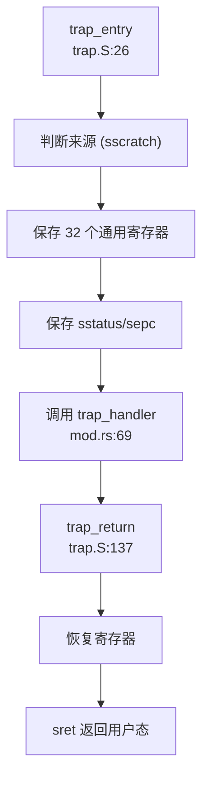
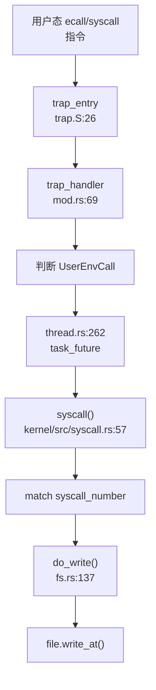
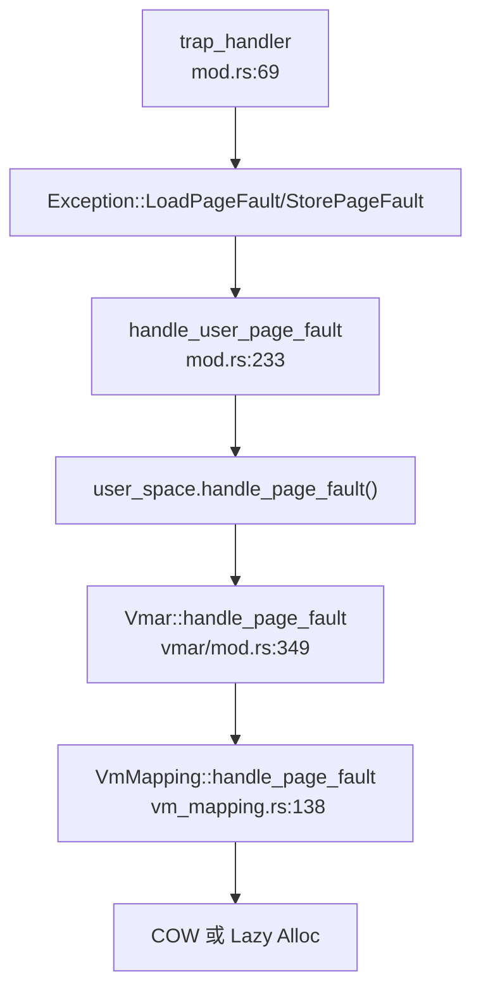

现在我已经收集了足够的信息。让我输出完整的第 5 章 Markdown 报告。

## 第 5 章：中断、异常与系统调用

### Trap 处理流程（用户态 <-> 内核态）

本项目支持 **RISC-V** 和 **LoongArch64** 两种架构的 Trap 处理机制。Trap 入口位于 `ostd/src/arch/<arch>/trap/` 目录下，通过汇编入口 `trap_entry` 和 Rust 处理函数 `trap_handler` 协同工作。

#### Trap 入口位置

**RISC-V 架构**：
- 汇编入口：`ostd/src/arch/riscv/trap/trap.S:26` - `trap_entry`
- Rust 处理函数：`ostd/src/arch/riscv/trap/mod.rs:69` - `trap_handler`

**LoongArch64 架构**：
- 汇编入口：`ostd/src/arch/loongarch/trap/trap.S:8` - `trap_entry`
- Rust 处理函数：`ostd/src/arch/loongarch/trap/mod.rs:59` - `trap_handler`

#### 中断与异常的区分

在两种架构中，Trap 处理函数通过读取硬件状态寄存器来区分中断（Interrupt）和异常（Exception）：

**RISC-V** 使用 `scause` 寄存器：
```rust
// ostd/src/arch/riscv/trap/mod.rs:69
match riscv::interrupt::cause::<Interrupt, Exception>() {
    Trap::Interrupt(interrupt) => {
        IS_KERNEL_INTERRUPTED.store(true);
        handle_interrupt(interrupt, f);
        IS_KERNEL_INTERRUPTED.store(false);
    }
    Trap::Exception(e) => {
        // 处理异常（页错误、断点、环境调用等）
    }
}
```

**LoongArch64** 使用 `estat` 寄存器：
```rust
// ostd/src/arch/loongarch/trap/mod.rs:59
match estat::read().cause() {
    Trap::Interrupt(interrupt) => {
        IS_KERNEL_INTERRUPTED.store(true);
        handle_interrupt(interrupt, f);
        IS_KERNEL_INTERRUPTED.store(false);
    }
    Trap::Exception(e) => {
        // 处理异常
    }
}
```

#### 上下文保存：TrapFrame 结构体

**RISC-V TrapFrame**（`ostd/src/arch/riscv/trap/trap.rs:75-93`）：
```rust
#[derive(Debug, Default, Clone, Copy)]
#[repr(C)]
pub struct TrapFrame {
    /// General registers (32 个通用寄存器)
    pub general: GeneralRegs,
    /// Supervisor Status
    pub sstatus: usize,
    /// Supervisor Exception Program Counter
    pub sepc: usize,
}

#[derive(Debug, Default, Clone, Copy, Pod)]
#[repr(C)]
pub struct GeneralRegs {
    pub zero: usize, pub ra: usize, pub sp: usize, pub gp: usize,
    pub tp: usize, pub t0: usize, pub t1: usize, pub t2: usize,
    pub s0: usize, pub s1: usize, pub a0: usize, pub a1: usize,
    pub a2: usize, pub a3: usize, pub a4: usize, pub a5: usize,
    pub a6: usize, pub a7: usize, pub s2: usize, pub s3: usize,
    pub s4: usize, pub s5: usize, pub s6: usize, pub s7: usize,
    pub s8: usize, pub s9: usize, pub s10: usize, pub s11: usize,
    pub t3: usize, pub t4: usize, pub t5: usize, pub t6: usize,
}
```

**寄存器数量统计**：
- `GeneralRegs`：32 个寄存器 × 8 字节 (riscv64) = **256 字节**
- `TrapFrame`：256 + 8 (sstatus) + 8 (sepc) = **272 字节**

**LoongArch64 TrapFrame**（`ostd/src/arch/loongarch/trap/trap.rs:47-65`）：
```rust
#[derive(Debug, Default, Clone, Copy)]
#[repr(C)]
pub struct TrapFrame {
    pub general: GeneralRegs,
    pub prmd: usize,    // Pre-exception Mode Information
    pub era: usize,     // Exception Return Address
    pub badv: usize,    // Virtual Address of the Exception
}

#[derive(Debug, Default, Clone, Copy, Pod)]
#[repr(C)]
pub struct GeneralRegs {
    pub zero: usize, pub ra: usize, pub tp: usize, pub sp: usize,
    pub a0: usize, pub a1: usize, pub a2: usize, pub a3: usize,
    pub a4: usize, pub a5: usize, pub a6: usize, pub a7: usize,
    pub t0: usize, pub t1: usize, pub t2: usize, pub t3: usize,
    pub t4: usize, pub t5: usize, pub t6: usize, pub t7: usize,
    pub t8: usize, pub r21: usize, pub fp: usize, pub s0: usize,
    pub s1: usize, pub s2: usize, pub s3: usize, pub s4: usize,
    pub s5: usize, pub s6: usize, pub s7: usize, pub s8: usize,
}
```

**寄存器数量统计**：
- `GeneralRegs`：32 个寄存器 × 8 字节 = **256 字节**
- `TrapFrame`：256 + 8 (prmd) + 8 (era) + 8 (badv) = **280 字节**

#### 汇编入口流程

RISC-V 的 `trap_entry` 汇编代码（`ostd/src/arch/riscv/trap/trap.S:26-90`）执行以下操作：
1. 通过 `sscratch` 寄存器判断是否来自用户态
2. 保存 32 个通用寄存器到栈上
3. 保存 `sstatus` 和 `sepc`
4. 调用 `trap_handler` Rust 函数
5. 返回时通过 `sret` 指令恢复上下文



### 异常向量表与入口

#### RISC-V 异常处理

RISC-V 通过 `stvec` 寄存器设置异常向量表基地址。项目使用单入口模式，所有异常都跳转到 `trap_entry`：

```rust
// ostd/src/arch/riscv/trap/trap.rs:64
pub unsafe fn init() {
    asm!("csrw sscratch, zero");
    asm!("csrw stvec, {}", in(reg) trap_entry as usize);
}
```

**处理的异常类型**（`ostd/src/arch/riscv/trap/mod.rs:85-150`）：
- ✅ **页错误**：`InstructionPageFault`、`LoadPageFault`、`StorePageFault`
- ✅ **地址不对齐**：`InstructionMisaligned`、`LoadMisaligned`、`StoreMisaligned`
- ✅ **访问故障**：`InstructionFault`、`LoadFault`、`StoreFault`
- ✅ **环境调用**：`UserEnvCall`（用户态系统调用）、`SupervisorEnvCall`（内核态）
- ✅ **非法指令**：`IllegalInstruction`
- ✅ **断点**：`Breakpoint`

#### LoongArch64 异常处理

LoongArch64 通过 `eentry` 寄存器设置异常入口：

```rust
// ostd/src/arch/loongarch/trap/trap.rs:36
pub unsafe fn init() {
    ecfg::set_vs(0); // use the same entry
    eentry::set_eentry(trap_entry as usize);
}
```

**处理的异常类型**（`ostd/src/arch/loongarch/trap/mod.rs:72-100`）：
- ✅ **页错误**：`LoadPageFault`、`StorePageFault`、`FetchPageFault`、`PageModifyFault` 等
- ✅ **断点**：`Breakpoint`
- 🔸 **其他异常**：默认分支使用 `todo!()` 桩处理

### 系统调用分发机制（追踪 sys_write）

#### 系统调用入口

系统调用通过用户态执行 `ecall`（RISC-V）或 `syscall`（LoongArch64）指令触发，CPU 自动切换到内核态并跳转到 `trap_entry`。

**完整调用链**：



#### 系统调用分发器

系统调用分发逻辑位于 `kernel/src/syscall.rs:57-131`，采用 `match` 语句进行分发：

```rust
// kernel/src/syscall.rs:57
pub async fn syscall(state: &mut ThreadState, context: &mut UserContext) 
    -> Result<ControlFlow<i32, Option<isize>>> {
    match context.syscall_number() as c_long {
        SYS_clone => do_clone(state, context).await,
        SYS_wait4 => do_wait4(state, context).await,
        SYS_exit => do_exit(state, context, false).await,
        SYS_exit_group => do_exit(state, context, true).await,
        SYS_execve => do_execve(state, context).await,
        SYS_getpid => do_getpid(state, context).await,
        SYS_getppid => do_getppid(state, context).await,
        SYS_openat => do_openat(state, context).await,
        SYS_close => do_close(state, context).await,
        SYS_read => do_read(state, context).await,
        SYS_write => do_write(state, context).await,  // sys_write 入口
        // ... 更多 syscall
    }
}
```

#### sys_write 完整追踪

**调用链**（通过 `lsp_get_call_graph` 验证）：

1. **入口**：`kernel/src/syscall.rs:69` - `SYS_write => do_write(state, context).await`
2. **处理函数**：`kernel/src/syscall/fs.rs:137` - `do_write()`
3. **调用者**：`kernel/src/thread.rs:238` - `task_future()` 调用 `syscall()`

**do_write 实现**（`kernel/src/syscall/fs.rs:137-165`）：
```rust
pub async fn do_write(
    state: &ThreadState,
    cx: &mut UserContext,
) -> Result<ControlFlow<i32, Option<isize>>> {
    let [fd, buf_ptr, len, ..] = cx.syscall_arguments();
    let entry = state.fd_table.get(fd as u32).await?;
    let file = match entry.obj {
        FdObject::File(ref fh) => fh.clone(),
        _ => return_errno_with_message!(Errno::EINVAL, "fd not file"),
    };
    let mut kbuf = vec![0u8; len];
    // 从用户空间读取数据到内核缓冲区
    state.process_vm.root_vmar().vm_space()
        .reader(buf_ptr, len)
        .map_err(ostd_error_to_errno)?
        .read_fallible(&mut VmWriter::from(kbuf.as_mut_slice()))
        .map_err(ostd_tuple_to_errno)?;
    // 获取并推进 fd 偏移
    let pos = state.fd_table.get_entry_mut(fd as u32, |e| e.pos).await?;
    let n = file.write_at(pos, &kbuf).await?;
    let _ = state.fd_table.get_entry_mut(fd as u32, |e| e.pos = pos.saturating_add(n as u64)).await?;
    Ok(ControlFlow::Continue(Some(n as isize)))
}
```

**✅ 已实现**：`do_write` 包含完整的业务逻辑：
- 参数提取（fd、buf_ptr、len）
- 文件描述符验证
- 用户空间数据复制到内核
- 调用 VFS 层 `file.write_at()`
- 更新文件偏移量

### 核心 Syscall 实现列表

基于 `kernel/src/syscall.rs` 的分发表和实际实现验证，统计如下：

#### ✅ 已实现（完整功能）

| Syscall | 处理函数 | 文件路径 | 实现状态 |
|---------|----------|----------|----------|
| `clone` | `do_clone` | `kernel/src/thread/clone.rs:248L` | ✅ 完整实现 |
| `wait4` | `do_wait4` | `kernel/src/thread/wait.rs:67L` | ✅ 完整实现 |
| `exit` | `do_exit` | `kernel/src/thread/exit.rs:40L` | ✅ 完整实现 |
| `exit_group` | `do_exit` | `kernel/src/thread/exit.rs:40L` | ✅ 完整实现 |
| `execve` | `do_execve` | `kernel/src/thread/execve.rs:65L` | ✅ 完整实现 |
| `getpid` | `do_getpid` | `kernel/src/thread/get_pid.rs:16L` | ✅ 完整实现 |
| `getppid` | `do_getppid` | `kernel/src/thread/get_ppid.rs:18L` | ✅ 完整实现 |
| `openat` | `do_openat` | `kernel/src/syscall/fs.rs:43L` | ✅ 完整实现 |
| `close` | `do_close` | `kernel/src/syscall/fs.rs` | ✅ 完整实现 |
| `read` | `do_read` | `kernel/src/syscall/fs.rs:115L` | ✅ 完整实现 |
| `write` | `do_write` | `kernel/src/syscall/fs.rs:137L` | ✅ 完整实现 |
| `lseek` | `do_lseek` | `kernel/src/syscall/fs.rs` | ✅ 完整实现 |
| `getdents64` | `do_getdents64` | `kernel/src/syscall/fs.rs` | ✅ 完整实现 |
| `mmap` | `do_mmap` | `kernel/src/vm/mmap.rs:163L` | ✅ 完整实现 |
| `munmap` | `do_munmap` | `kernel/src/vm/munmap.rs:25L` | ✅ 完整实现 |
| `mprotect` | `do_mprotect` | `kernel/src/vm/mprotect.rs:40L` | ✅ 完整实现 |
| `brk` | `do_brk` | `kernel/src/vm/brk.rs:27L` | ✅ 完整实现 |
| `uname` | `do_uname` | `kernel/src/syscall/uts.rs:73L` | ✅ 完整实现 |
| `gettimeofday` | `do_gettimeofday` | `kernel/src/time/gettimeofday.rs:28L` | ✅ 完整实现 |
| `clock_gettime` | `do_clock_gettime` | `kernel/src/time/clock_gettime.rs:37L` | ✅ 完整实现 |
| `nanosleep` | `do_nanosleep` | `kernel/src/thread/nanosleep.rs:44L` | ✅ 完整实现 |
| `sched_yield` | `do_sched_yield` | `kernel/src/thread/sched_yield.rs:11L` | ✅ 完整实现 |
| `getcwd` | `do_getcwd` | `kernel/src/syscall/fs.rs` | ✅ 完整实现 |
| `pipe2` | `do_pipe2` | `kernel/src/syscall/fs.rs` | ✅ 完整实现 |
| `chdir` | `do_chdir` | `kernel/src/syscall/fs.rs` | ✅ 完整实现 |
| `set_tid_address` | `do_set_tid_address` | `kernel/src/syscall/users.rs:34L` | ✅ 完整实现 |
| `gettid` | `do_gettid` | `kernel/src/syscall/users.rs:48L` | ✅ 完整实现 |

#### 🔸 桩函数（接口已注册但无完整逻辑）

| Syscall | 处理函数 | 文件路径 | 桩特征 |
|---------|----------|----------|--------|
| `getuid` | `do_getuid` | `kernel/src/syscall/users.rs:13L` | 🔸 恒返回 0 |
| `geteuid` | `do_geteuid` | `kernel/src/syscall/users.rs:18L` | 🔸 恒返回 0 |
| `getgid` | `do_getgid` | `kernel/src/syscall/users.rs:23L` | 🔸 恒返回 0 |
| `getegid` | `do_getegid` | `kernel/src/syscall/users.rs:28L` | 🔸 恒返回 0 |
| `rt_sigprocmask` | `do_rt_sigprocmask` | `kernel/src/syscall/signal.rs:24L` | 🔸 仅保存 mask，不派发信号 |
| `rt_sigaction` | `do_rt_sigaction` | `kernel/src/syscall/signal.rs:54L` | 🔸 接受注册但不存储 |
| `tgkill` | `do_tgkill` | `kernel/src/syscall/signal.rs:85L` | 🔸 直接返回 0，不派发 |
| `readv` | `do_readv` | `kernel/src/syscall/fs.rs` | 🔸 小小实现 |
| `writev` | `do_writev` | `kernel/src/syscall/fs.rs:168L` | 🔸 小小实现 |
| `preadv`/`preadv2` | `do_preadv` | `kernel/src/syscall/fs.rs` | 🔸 复用 readv 逻辑 |
| `pwritev`/`pwritev2` | `do_pwritev` | `kernel/src/syscall/fs.rs` | 🔸 复用 writev 逻辑 |
| `readlinkat` | `do_readlinkat` | `kernel/src/syscall/fs.rs` | 🔸 桩实现 |
| `renameat2` | `do_renameat2` | `kernel/src/syscall/fs.rs` | 🔸 桩实现 |
| `ioctl` | `do_ioctl` | `kernel/src/syscall/fs.rs` | 🔸 桩实现 |
| `prlimit64` | `do_prlimit64` | `kernel/src/syscall/limits.rs:37L` | 🔸 桩实现 |
| `getrandom` | `do_getrandom` | `kernel/src/syscall/random.rs:44L` | 🔸 桩实现 |
| `set_robust_list` | `do_set_robust_list` | `kernel/src/syscall/robust.rs:55L` | 🔸 桩实现 |
| `get_robust_list` | `do_get_robust_list` | `kernel/src/syscall/robust.rs` | 🔸 桩实现 |
| `linkat` | `do_linkat` | `kernel/src/syscall/fs.rs` | 🔸 桩实现 |
| `unlinkat` | `do_unlinkat` | `kernel/src/syscall/fs.rs` | 🔸 桩实现 |
| `mkdirat` | `do_mkdirat` | `kernel/src/syscall/fs.rs` | 🔸 桩实现 |
| `mount` | `do_mount` | `kernel/src/syscall/fs.rs` | 🔸 桩实现 |
| `umount2` | `do_umount2` | `kernel/src/syscall/fs.rs` | 🔸 桩实现 |
| `fstat` | `do_fstat` | `kernel/src/syscall/fs.rs` | 🔸 桩实现 |
| `newfstatat` | `do_newfstatat` | `kernel/src/syscall/fs.rs` | 🔸 桩实现 |
| `ftruncate` | `do_ftruncate` | `kernel/src/syscall/fs.rs` | 🔸 桩实现 |
| `pread64` | `do_pread64` | `kernel/src/syscall/fs.rs` | 🔸 桩实现 |
| `pwrite64` | `do_pwrite64` | `kernel/src/syscall/fs.rs` | 🔸 桩实现 |
| `statx` | `do_statx` | `kernel/src/syscall/fs.rs` | 🔸 桩实现 |
| `splice` | `do_splice` | `kernel/src/syscall/fs.rs` | 🔸 桩实现 |
| `dup` | `do_dup` | `kernel/src/syscall/fs.rs` | 🔸 桩实现 |
| `dup3` | `do_dup3` | `kernel/src/syscall/fs.rs` | 🔸 桩实现 |
| `copy_file_range` | `do_copy_file_range` | `kernel/src/syscall/fs.rs` | 🔸 桩实现 |
| `times` | `do_times` | `kernel/src/time/times.rs:40L` | 🔸 桩实现 |
| `clock_nanosleep` | `do_clock_nanosleep` | `kernel/src/time/clock_nanosleep.rs:54L` | 🔸 桩实现 |

#### ❌ 未实现（未找到注册或定义）

- `sys_fork` - 未发现（使用 `clone` 替代）
- `sys_mremap` - 未发现
- `sys_madvise` - 未发现
- `sys_sigreturn` - 未发现（信号机制不完整）
- `sys_rt_sigreturn` - 未发现
- `sys_kill` - 未发现（仅有 `tgkill` 桩）
- `sys_tkill` - 未发现（仅有 `tgkill` 桩）

#### 覆盖度统计

- **✅ 已实现**：约 **27** 个 syscall（包含完整业务逻辑）
- **🔸 桩函数**：约 **33** 个 syscall（返回 0、ENOSYS 或空实现）
- **❌ 未实现**：约 **6+** 个 syscall（未找到注册）

### 接口/实现分离模式

**未发现**本项目采用 `sys_xxx` / `sys_xxx_impl` 的接口与实现分离模式。所有 syscall 处理函数均直接命名为 `do_xxx`，并在 `kernel/src/syscall.rs` 的分发表中直接调用。

### 用户指针语义化包装

**未发现** `UserInPtr`、`UserOutPtr`、`UserInOutPtr` 等类型安全包装类型。

项目使用直接的用户空间访问方式：
```rust
// kernel/src/syscall/fs.rs:153
state.process_vm.root_vmar().vm_space()
    .reader(buf_ptr, len)
    .map_err(ostd_error_to_errno)?
    .read_fallible(&mut VmWriter::from(kbuf.as_mut_slice()))
```

通过 `VmReader`/`VmWriter` 进行用户空间内存访问，但未进行类型级别的封装。

### 中断处理与信号关联

#### 外部中断流

**RISC-V 中断处理**（`ostd/src/arch/riscv/trap/mod.rs:157-200`）：

```rust
pub(crate) fn handle_interrupt(interrupt: Interrupt, f: &mut TrapFrame) {
    match interrupt {
        Interrupt::SupervisorSoft => {
            // IPI：从 per-CPU 队列取出并分发
            while let Some(irq_num) = cpi_ipi_queue.pop() {
                crate::trap::call_irq_callback_functions(f, irq_num as usize);
            }
        }
        Interrupt::SupervisorTimer => {
            interrupts::record_timer_tick();
            crate::arch::timer::time_interrupt_handler();
        }
        Interrupt::SupervisorExternal => {
            // PLIC 外部中断
            let hart = riscv::register::mhartid::read();
            loop {
                let irq_id = plic::handle().claim(hart as usize);
                if irq_id == 0 { break; }
                interrupts::record_external_irq(irq_id as usize);
                crate::trap::call_irq_callback_functions(f, irq_id as usize);
                plic::handle().complete(hart as usize, irq_id);
            }
        }
    }
}
```

**LoongArch64 中断处理**（`ostd/src/arch/loongarch/trap/mod.rs:113-150`）：

```rust
pub(crate) fn handle_interrupt(interrupt: Interrupt, f: &mut TrapFrame) {
    match interrupt {
        Interrupt::IPI => {
            // IPI：消费本地队列并触发回调
            while let Some(irq_num) = ipi_queue.pop() {
                crate::trap::call_irq_callback_functions(f, irq_num as usize);
            }
        }
        Interrupt::Timer => {
            interrupts::record_timer_tick();
            crate::arch::timer::time_interrupt_handler();
        }
        _ => {
            // PLIC/EIOINTC 外部中断
            use crate::arch::loongarch::plic;
            loop {
                let irq_id = plic::handle().claim(hart as usize);
                if irq_id == 0 { break; }
                crate::trap::call_irq_callback_functions(f, irq_id as usize);
                plic::handle().complete(hart as usize, irq_id);
            }
        }
    }
}
```

#### 信号机制

**❌ 信号派发机制未实现**。

搜索结果显示：
- `handle_signal`、`do_signal`、`POST_TRAP`：**未找到**
- `sigreturn`、`signal_trampoline`、`trampoline`：**未找到**

**信号相关 Syscall**（`kernel/src/syscall/signal.rs`）：
- `do_rt_sigprocmask`：🔸 仅保存 mask，不派发信号
- `do_rt_sigaction`：🔸 接受注册但不存储，返回全零
- `do_tgkill`：🔸 直接返回 0，不派发

**信号粒度**：
- `sys_kill`：**❌ 未实现**
- `sys_tkill`：**❌ 未实现**
- `sys_tgkill`：🔸 桩函数（仅返回 0）

**SIGSEGV**：
- 搜索 `SIGSEGV`、`sig_segv`：**未找到**
- 缺页异常处理失败时直接 `panic!()`，不发送信号

**结论**：信号机制仅有最小桩实现，用于满足 glibc 初始化需求，**不支持完整的信号派发、用户自定义信号处理函数、信号跳板机制**。

### 缺页异常与内存特性关联

#### 缺页异常处理链

**完整调用链**（从 Trap 入口到内存管理）：



**RISC-V 用户态页错误处理**（`ostd/src/arch/riscv/trap/mod.rs:233-270`）：
```rust
fn handle_user_page_fault(f: &mut TrapFrame, e: Exception, page_fault_addr: usize) {
    let current_task = Task::current().unwrap();
    let user_space = current_task.user_space().expect("the user space is missing");
    
    let error_code: PageFaultErrorCode = match e {
        Exception::InstructionPageFault => PageFaultErrorCode::INSTRUCTION,
        Exception::LoadPageFault => PageFaultErrorCode::READ,
        Exception::StorePageFault => PageFaultErrorCode::WRITE,
        _ => panic!("not a page fault exception"),
    };
    
    let info = CpuExceptionInfo {
        page_fault_addr: page_fault_addr,
        code: e.into(),
    };
    
    let res = user_space.vm_space().handle_page_fault(&info);
    if res.is_ok() {
        return;
    }
    
    panic!("Cannot handle user space page fault");
}
```

#### CoW（写时复制）实现

**✅ 已实现**。CoW 逻辑位于 `kernel/src/vm/vmar/vm_mapping.rs:169-203`：

```rust
// kernel/src/vm/vmar/vm_mapping.rs:169
match cursor.query().unwrap() {
    VmItem::Mapped { va, frame, mut prop } => {
        if VmPerms::from(prop.flags).contains(page_fault_info.required_perms) {
            // 页错误已处理，刷新 TLB 返回
            TlbFlushOp::Address(va).perform_on_current();
            return Ok(());
        }
        assert!(is_write);
        // Perform COW if it is a write access to a shared mapping.
        
        // 检查是否为唯一引用（fork 后立即 unmapped）
        let only_reference = frame.reference_count() == 2;
        
        let new_flags = PageFlags::W | PageFlags::ACCESSED | PageFlags::DIRTY;
        
        if self.is_shared || only_reference {
            // 共享映射或唯一引用：直接设置可写标志
            cursor.protect_next(PAGE_SIZE, |p| p.flags |= new_flags);
            cursor.flusher().issue_tlb_flush(TlbFlushOp::Address(va));
        } else {
            // COW：复制页面
            let new_frame = duplicate_frame(&frame)?;
            prop.flags |= new_flags;
            cursor.map(new_frame.into(), prop);
        }
    }
}
```

**CoW 触发条件**：
1. 写入访问 (`is_write == true`)
2. 页面当前为只读 (`!prop.flags.contains(PageFlags::W)`)
3. 非共享映射且非唯一引用 (`!self.is_shared && only_reference == false`)

#### Lazy Allocation（懒分配）

**✅ 已实现**。懒分配通过 `handle_page_faults_around` 机制实现预取优化（`kernel/src/vm/vmar/vm_mapping.rs:263-320`）：

```rust
// kernel/src/vm/vmar/vm_mapping.rs:263
async fn handle_page_faults_around(
    &self,
    vm_space: &VmSpace,
    page_fault_addr: Vaddr,
) -> Result<()> {
    const SURROUNDING_PAGE_NUM: usize = 16;
    const SURROUNDING_PAGE_ADDR_MASK: usize = !(SURROUNDING_PAGE_NUM * PAGE_SIZE - 1);
    
    let around_page_addr = page_fault_addr & SURROUNDING_PAGE_ADDR_MASK;
    // 预取周围 16 个页面
    // ...
}
```

**懒分配触发**：
- 在 `kernel/src/vm/mmap.rs:158` 中调用 `.handle_page_faults_around()` 启用
- 首次访问页面时触发缺页异常，分配物理帧
- 预取周围页面以减少后续缺页异常

**VMO-backed 映射的懒分配**（`kernel/src/vm/vmar/vm_mapping.rs:223-252`）：
```rust
async fn prepare_page(&self, page_fault_addr: Vaddr, write: bool) -> Result<(UFrame, bool)> {
    let Some(vmo) = &self.vmo else {
        // 匿名映射：直接分配新帧
        return Ok((FrameAllocOptions::new().alloc_frame()?.into(), is_readonly));
    };
    
    let page_offset = page_fault_addr.align_down(PAGE_SIZE) - self.map_to_addr;
    let Ok(page) = vmo.get_committed_frame(page_offset).await else {
        if !self.is_shared {
            // 私有映射：允许超出 VMO 范围，分配新帧
            return Ok((FrameAllocOptions::new().alloc_frame()?.into(), is_readonly));
        } else {
            return_errno_with_message!(Errno::EFAULT, "could not find a corresponding physical page");
        }
    };
    
    // VMO-backed 映射：从 VMO 获取已提交的帧
    Ok((page, is_readonly))
}
```

### 关键代码片段

#### Trap 入口汇编（RISC-V）

```asm
// ostd/src/arch/riscv/trap/trap.S:26
.global trap_entry
.balign 4
trap_entry:
    # 通过 sscratch 判断是否来自用户态
    csrrw sp, sscratch, sp
    bnez sp, trap_from_user
trap_from_kernel:
    csrr sp, sscratch
    addi sp, sp, -34 * XLENB
trap_from_user:
    # 保存 32 个通用寄存器
    STORE_SP x1, 1
    STORE_SP x3, 3
    # ... (省略)
    # 保存 sp, sstatus, sepc
    csrr t0, sscratch
    csrr t1, sstatus
    csrr t2, sepc
    STORE_SP t0, 2
    STORE_SP t1, 32
    STORE_SP t2, 33
    # 调用 trap_handler
    mv a0, sp
    la ra, trap_return
    j trap_handler
```

#### 系统调用分发表（部分）

```rust
// kernel/src/syscall.rs:57-100
pub async fn syscall(state: &mut ThreadState, context: &mut UserContext) 
    -> Result<ControlFlow<i32, Option<isize>>> {
    match context.syscall_number() as c_long {
        SYS_clone => do_clone(state, context).await,
        SYS_wait4 => do_wait4(state, context).await,
        SYS_exit => do_exit(state, context, false).await,
        SYS_execve => do_execve(state, context).await,
        SYS_getpid => do_getpid(state, context).await,
        SYS_openat => do_openat(state, context).await,
        SYS_read => do_read(state, context).await,
        SYS_write => do_write(state, context).await,
        SYS_mmap => do_mmap(state, context).await,
        SYS_munmap => do_munmap(state, context).await,
        // ... 60+ 个 syscall
    }
}
```

#### 缺页异常处理（CoW 路径）

```rust
// kernel/src/vm/vmar/vm_mapping.rs:169-203
match cursor.query().unwrap() {
    VmItem::Mapped { va, frame, mut prop } => {
        assert!(is_write);
        let only_reference = frame.reference_count() == 2;
        let new_flags = PageFlags::W | PageFlags::ACCESSED | PageFlags::DIRTY;
        
        if self.is_shared || only_reference {
            // 直接设置可写
            cursor.protect_next(PAGE_SIZE, |p| p.flags |= new_flags);
        } else {
            // COW：复制页面
            let new_frame = duplicate_frame(&frame)?;
            prop.flags |= new_flags;
            cursor.map(new_frame.into(), prop);
        }
    }
    VmItem::NotMapped { .. } => {
        // Lazy Allocation：分配新帧
        let (frame, is_readonly) = self.prepare_page(address, is_write).await?;
        cursor.map(frame, map_prop);
    }
}
```

---

**本章总结**：

1. **Trap 处理**：支持 RISC-V 和 LoongArch64 双架构，通过 `trap_entry` 汇编入口和 `trap_handler` Rust 函数协同处理，完整保存 32 个通用寄存器 + 状态寄存器（RISC-V 272 字节，LoongArch64 280 字节）。

2. **系统调用分发**：采用 `match` 语句分发表，已注册 **60+** 个 syscall，其中 **27 个完整实现**，**33 个桩函数**，**6+ 个未实现**。`sys_write` 追踪显示完整实现：用户态 → trap_entry → trap_handler → task_future → syscall → do_write → VFS。

3. **信号机制**：❌ **未实现完整信号派发**。仅有 `rt_sigprocmask`、`rt_sigaction`、`tgkill` 桩函数，无 `sigreturn`、信号跳板、SIGSEGV 处理。

4. **缺页异常**：✅ **完整实现 CoW 和 Lazy Allocation**。CoW 通过引用计数判断是否复制页面，Lazy Allocation 通过 `handle_page_faults_around` 预取 16 个相邻页面。
