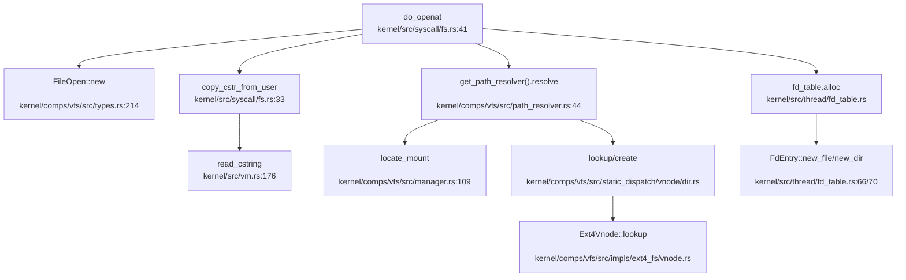

现在我已经收集了足够的信息来编写文件系统章节的分析报告。让我整理所有发现并生成完整的 Markdown 报告。

## 第 6 章：文件系统（VFS + 具体 FS）

### VFS 架构与接口设计

本项目实现了完整的 VFS（Virtual File System）抽象层，位于 `kernel/comps/vfs/` 目录。VFS 通过 trait 定义了统一的文件系统接口，使上层 syscall 能够透明地操作不同的具体文件系统实现。

**核心 Trait 定义**（`kernel/comps/vfs/src/traits.rs`）：

```rust
// FileSystem: 文件系统实例抽象
pub trait FileSystem: Send + Sync {
    type Vnode: Vnode<FS = Self>;
    fn id(&self) -> FilesystemId;
    fn root_vnode(&self) -> VfsResult<Self::Vnode>;
    fn statfs(&self) -> VfsResult<FilesystemStats>;
    fn sync(&self) -> VfsResult<()>;
    // ...
}

// Vnode: 虚拟节点（ inode 抽象）
pub trait Vnode: Send + Sync + Clone + 'static {
    type FS: FileSystem<Vnode = Self>;
    fn id(&self) -> VnodeId;
    fn filesystem(&self) -> Self::FS;
    fn metadata(&self) -> VfsResult<VnodeMetadata>;
    fn cap_type(&self) -> VnodeCapability;
}

// FileHandle: 文件操作句柄
pub trait FileHandle: Send + Sync {
    type Vnode: Vnode;
    fn vnode(&self) -> Self::Vnode;
    fn read_at(&self, offset: u64, buf: &mut [u8]) -> VfsResult<usize>;
    fn write_at(&self, offset: u64, buf: &[u8]) -> VfsResult<usize>;
    fn seek(&self, pos: SeekFrom) -> VfsResult<u64>;
    // ...
}

// DirHandle: 目录操作句柄
pub trait DirHandle: Send + Sync {
    type Vnode: Vnode;
    fn vnode(&self) -> Self::Vnode;
    fn read_dir_chunk(&self, start: u64, max: usize) -> VfsResult<Vec<DirectoryEntry>>;
    fn lookup(&self, name: &OsStr) -> VfsResult<Self::Vnode>;
    fn create(&self, name: &OsStr, kind: VnodeType, perm: FileMode, rdev: Option<u64>) -> VfsResult<Self::Vnode>;
    // ...
}
```

**核心数据结构**（`kernel/comps/vfs/src/types.rs`）：

| 结构体 | 说明 |
|--------|------|
| `VnodeType` | 节点类型枚举（File/Directory/SymbolicLink/BlockDevice/CharDevice/Fifo/Socket） |
| `VnodeMetadata` | 节点元数据（vnode_id, size, permissions, timestamps, uid, gid, nlinks, rdev） |
| `FileOpen` | 文件打开标志封装（access mode + status flags） |
| `DirectoryEntry` | 目录项（name, vnode_id, kind） |
| `FilesystemStats` | 文件系统统计信息（block_size, total_blocks, free_blocks 等） |

VFS 采用**静态派发（Static Dispatch）**设计，通过 `SFile`, `SDir`, `SVnode` 等类型封装具体文件系统的实现，避免动态 trait object 的运行时开销。

### 具体文件系统支持情况（FAT32/Ext4/RamFS）

#### Ext4 文件系统（✅ 已实现）

Ext4 文件系统实现位于 `kernel/comps/vfs/src/impls/ext4_fs/`，基于第三方 crate `another_ext4` 构建。

**实现架构**：
- `filesystem.rs`: `Ext4Fs` 结构体实现 `FileSystem` trait
- `vnode.rs`: `Ext4Vnode` 实现 `Vnode` trait，`Ext4FileHandle`/`Ext4DirHandle` 实现文件/目录操作
- `provider.rs`: 文件系统提供者，负责挂载和实例管理
- `block_dev.rs`: 块设备适配层

**关键代码验证**（`kernel/comps/vfs/src/impls/ext4_fs/vnode.rs:28-35`）：
```rust
fn convert_ftype(ft: FileType) -> VnodeType {
    match ft {
        FileType::RegularFile => VnodeType::File,
        FileType::Directory => VnodeType::Directory,
        FileType::SymLink => VnodeType::SymbolicLink,
        FileType::BlockDev => VnodeType::BlockDevice,
        FileType::CharacterDev => VnodeType::CharDevice,
        FileType::Fifo => VnodeType::Fifo,
        FileType::Socket => VnodeType::Socket,
        FileType::Unknown => VnodeType::File,
    }
}
```

Ext4 支持完整的文件操作（read/write/seek）、目录操作（lookup/create/unlink/rename）、符号链接、硬链接等高级功能。

#### MemFS/RamFS（✅ 已实现）

内存文件系统位于 `kernel/comps/vfs/src/impls/memfs/`，提供纯内存的文件存储，适用于临时文件和测试场景。

**实现特点**：
- 所有数据存储在内存中，重启后数据丢失
- 支持完整的 VFS 接口
- 使用 `BTreeMap` 管理目录结构

#### DevFS（伪文件系统，✅ 已实现）

伪文件系统位于 `kernel/comps/vfs/src/impls/dev_fs/`，提供 `/dev` 目录下的设备文件访问。

**实现内容**：
- `device.rs`: 设备节点抽象
- `filesystem.rs`: `DevFs` 实现
- `vnode.rs`: 设备 vnode 实现
- 支持字符设备和块设备节点

#### FAT32 文件系统（❌ 未实现）

**未发现** FAT32 文件系统的实现代码。搜索 `fat`、`FAT32`、`vfat` 等关键词在 `kernel/comps/vfs/src/impls/` 目录下无匹配结果。

### 文件描述符与进程关联

**文件描述符表结构**（`kernel/src/thread/fd_table.rs`）：

```rust
pub struct FdTable {
    map:      RwLock<BTreeMap<u32, FdEntry>>,  // fd -> 表项映射
    next:     AtomicU32,                        // 下次分配起点
    capacity: usize,                            // 容量上限（默认 1<<20）
}

pub struct FdEntry {
    pub obj:   FdObject,   // 文件/目录句柄
    pub flags: FileOpen,   // 描述符级标志
    pub pos:   u64,        // 文件偏移（每个 FD 独立）
}

pub enum FdObject {
    File(SFileHandle),
    Dir(SDirHandle),
}
```

**关键特性**：
1. **Per-Process 设计**：每个进程（线程组）拥有独立的 `FdTable`，通过 `Arc<FdTable>` 在进程内线程间共享
2. **默认容量**：`OPEN_MAX = 1 << 20`（约 100 万），可通过 `RLIMIT_NOFILE` 调整
3. **标准输入输出**：启动时自动填充 fd 0/1/2，可配置来源（null/console/serial/路径）
4. **偏移独立性**：`dup()` 后新 fd 拥有独立的文件偏移，符合 Linux 语义

**文件打开流程**（`kernel/src/syscall/fs.rs:do_openat`）：



1. 解析用户态传入的路径字符串
2. 通过 `PathResolver` 解析路径，遍历挂载点
3. 若文件不存在且指定 `O_CREATE`，调用 `DirCap::create()` 创建
4. 根据 vnode 类型（文件/目录）调用 `open()` 或 `open_dir()` 获取句柄
5. 在 `FdTable` 中分配新 fd，返回给用户态

### 管道 (Pipe) 与套接字 (Socket) 支持情况

#### 管道（Pipe）支持（🔸 桩函数）

**实现位置**：`kernel/comps/vfs/src/impls/pipe.rs`

```rust
pub struct RingPipe {
    buffer: Mutex<Vec<u8>>,
    // ...
}
pub struct PipeReader(pub Arc<RingPipe>);
pub struct PipeWriter(pub Arc<RingPipe>);
```

**状态分析**：
- `RingPipe` 结构已定义，使用环形缓冲区实现
- `PipeReader::read_at()` 和 `PipeWriter::write_at()` 有基本实现
- **但**在静态派发层（`kernel/comps/vfs/src/static_dispatch/vnode/file.rs:71-140`）中，`PipeReader`/`PipeWriter` 的多数方法返回 `unimplemented!()`：

```rust
SFileHandle::PipeReader(_) | SFileHandle::PipeWriter(_) => unimplemented!(),
// read_at/write_at/seek/flush 等均返回 Err("not supported")
```

**结论**：管道机制有基础框架，但** syscall 层未集成**，用户态无法通过 `pipe()` 系统调用创建管道。

#### 套接字（Socket）支持（❌ 未实现）

**状态分析**：
- `VnodeType::Socket` 枚举值已定义（`kernel/comps/vfs/src/types.rs:24`）
- `Errno::ENOTSOCK`、`EPROTOTYPE`、`ESOCKTNOSUPPORT` 等套接字相关错误码已定义
- **但**未发现 `sys_socket`、`sys_bind`、`sys_connect`、`sys_listen`、`sys_accept` 等系统调用实现
- 搜索 `AF_INET`、`AF_UNIX`、`SOCK_STREAM` 等关键词仅在错误消息和测试脚本中出现，无实际实现

**结论**：套接字功能**完全未实现**，仅预留了 vnode 类型和错误码。

### 缓存机制（Block/Page Cache）

**VFS 层缓存**（`kernel/comps/vfs/src/cache.rs`）：

```rust
pub struct DentryCache {
    cache: RwLock<BTreeMap<PathBuf, BTreeMap<String, SVnode>>>,
}

impl DentryCache {
    pub async fn get(&self, dir_path: &PathBuf, name: &str) -> Option<SVnode>;
    pub async fn put(&self, dir_path: PathBuf, name: &str, vnode: SVnode);
}
```

- **Dentry Cache**：缓存路径到 vnode 的映射，加速路径解析
- 使用 `RwLock<BTreeMap>` 实现，支持并发访问

**块设备缓存**：
- 未发现独立的 block cache 实现
- Ext4 文件系统依赖 `another_ext4` crate 内部的缓存机制
- 内存文件系统（MemFS）直接在内存中存储数据，无需额外缓存

### 零拷贝映射验证（mmap 实现分析）

**系统调用入口**（`kernel/src/syscall.rs:92`）：
```rust
SYS_mmap => do_mmap(state, context).await,
```

**实现分析**（`kernel/src/vm/mmap.rs`）：

```rust
enum MMapType {
    File = 0,
    Shared = 1,      // MAP_SHARED
    Private = 2,     // MAP_PRIVATE
    SharedValidate = 3,
}

bitflags! {
    struct MMapFlags: u32 {
        const MAP_FIXED = 0x10;
        const MAP_ANONYMOUS = 0x20;
        const MAP_32BIT = 0x40;
        const MAP_FIXED_NOREPLACE = 0x100000;
    }
}
```

**共享映射处理**（`kernel/src/vm/mmap.rs:113-118`）：
```rust
// 共享匿名映射应共用同一 VMO
if matches!(typ, MMapType::Shared) {
    let vmo = VmoOptions::<Rights>::new(len).alloc()?.to_dyn();
    map_opt = map_opt.is_shared(true).vmo(vmo);
}
```

**文件映射处理**（`kernel/src/vm/mmap.rs:131-150`）：
```rust
async fn file_mapping(...) -> Result<usize> {
    let entry = state.fd_table.get(fd as u32).await?;
    let inode = entry.obj.as_file().ok_or(...)?;
    
    // 权限检查
    if matches!(typ, MMapType::Shared) && prot.contains(VmPerms::WRITE) && !mode.is_writable() {
        return_errno!(Errno::EACCES);
    }
    
    // 读取文件内容到缓冲区
    let mut file = vec![0; len];
    inode.read_at(offset as u64, &mut file).await?;
    
    // 创建 VMO 并复制数据
    let vmo = VmoOptions::new(len).alloc()?;
    vmo.write(0, &file)?;
    
    map_opt = map_opt.vmo(vmo).build().await?;
}
```

**关键发现**：
1. **共享标志处理**：`MMapType::Shared` 对应 `MAP_SHARED`，会设置 `is_shared(true)`
2. **权限检查**：共享写映射要求文件可写，符合 POSIX 语义
3. **实现方式**：当前实现**先读取整个文件到内核缓冲区**，再复制到 VMO，**不是真正的零拷贝**
4. **写时复制（CoW）**：`MAP_PRIVATE` 映射未实现 CoW 机制，文件内容直接复制到独立 VMO

**结论**：mmap 系统调用**✅ 已实现**，支持 `MAP_SHARED`/`MAP_PRIVATE`/`MAP_ANONYMOUS` 等标志，但**不是零拷贝实现**，文件映射需要先读取到内核缓冲区。

### 高级 I/O 多路复用（poll/select/epoll）

**搜索结果显示**：
- 未发现 `sys_poll`、`sys_select`、`sys_epoll_create`、`sys_epoll_ctl`、`sys_epoll_wait` 等系统调用
- `kernel/src/syscall/fs.rs` 中无相关实现
- 测试目录（`test/apps/epoll/`）中有 epoll 测试程序，但 OS 未实现对应 syscall

**结论**：
- `poll`/`select`/`epoll`：**❌ 未实现**
- 文件状态检查机制缺失，无法实现高效的 I/O 多路复用

### 关键代码验证总结

| 功能 | 状态 | 证据 |
|------|------|------|
| VFS 抽象层 | ✅ 已实现 | `kernel/comps/vfs/src/traits.rs` 定义完整 trait |
| Ext4 文件系统 | ✅ 已实现 | `kernel/comps/vfs/src/impls/ext4_fs/` 完整实现 |
| MemFS/RamFS | ✅ 已实现 | `kernel/comps/vfs/src/impls/memfs/` |
| DevFS 伪文件系统 | ✅ 已实现 | `kernel/comps/vfs/src/impls/dev_fs/` |
| FAT32 文件系统 | ❌ 未实现 | 搜索无结果 |
| 文件描述符表 | ✅ 已实现 | `kernel/src/thread/fd_table.rs`，Per-Process 设计 |
| pipe 管道 | 🔸 桩函数 | `kernel/comps/vfs/src/impls/pipe.rs` 有框架，但 syscall 未集成 |
| socket 套接字 | ❌ 未实现 | 仅预留类型和错误码 |
| mmap 内存映射 | ✅ 已实现 | `kernel/src/vm/mmap.rs`，但非零拷贝 |
| poll/select/epoll | ❌ 未实现 | 搜索无 syscall 实现 |

### 文件系统功能矩阵

| 系统调用 | 状态 | 实现位置 |
|----------|------|----------|
| `open`/`openat` | ✅ | `kernel/src/syscall/fs.rs:do_openat` |
| `close` | ✅ | `kernel/src/syscall/fs.rs:do_close` |
| `read`/`write` | ✅ | `kernel/src/syscall/fs.rs:do_read/do_write` |
| `lseek` | ✅ | `kernel/src/syscall/fs.rs:do_lseek` |
| `stat`/`fstat` | ✅ | `kernel/src/syscall/fs.rs:do_stat_new/do_fstat` |
| `mkdir`/`rmdir` | ✅ | `kernel/src/syscall/fs.rs:do_mkdirat/do_rmdir` |
| `unlink` | ✅ | `kernel/src/syscall/fs.rs:do_unlinkat` |
| `rename` | ✅ | `kernel/src/syscall/fs.rs:do_renameat` |
| `getdents` | ✅ | `kernel/src/syscall/fs.rs:do_getdents` |
| `dup`/`dup2` | ✅ | `kernel/src/syscall/fs.rs:do_dup/do_dup2` |
| `pipe` | 🔸 | 框架存在，syscall 未实现 |
| `socket` | ❌ | 未实现 |
| `mmap` | ✅ | `kernel/src/vm/mmap.rs:do_mmap` |
| `poll`/`select`/`epoll` | ❌ | 未实现 |
