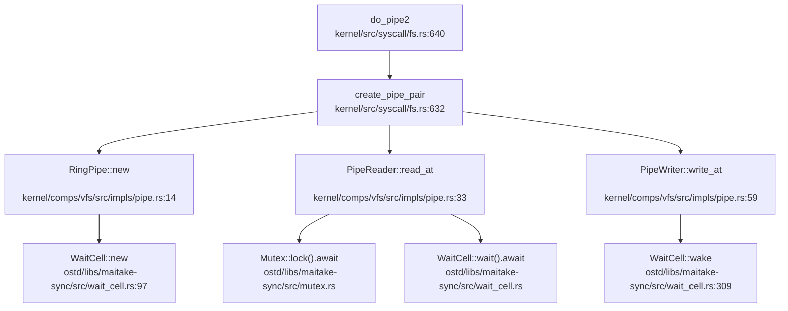

现在我已经收集了足够的信息。让我编写第 8 章的完整报告：

## 第 8 章：同步互斥与进程间通信

本章分析 NexusOS 的同步原语、锁机制实现以及进程间通信（IPC）功能。通过代码验证发现，该操作系统在同步互斥方面使用了成熟的第三方库（`maitake-sync`）和自定义实现，而在 IPC 方面仅实现了管道（Pipe），其他 IPC 机制如消息队列、共享内存、信号量等均未实现或仅有桩代码。

---

## 同步与互斥原语（锁与原子操作）

### 原子操作实现

NexusOS **使用 Rust 标准库的 `core::sync::atomic` 模块**提供原子操作，**未使用自定义汇编实现**。

**证据**：
- 项目中所有原子操作均通过 `use core::sync::atomic::{AtomicUsize, AtomicBool, AtomicU32, AtomicI32, AtomicU64, Ordering}` 导入
- 搜索 `lock xchg`、`ldxr`、`stxr`、`amswap` 等汇编原子指令**未找到任何匹配**
- 搜索 `dbar`（LoongArch 内存屏障指令）也**未找到显式使用**

**使用示例**：
```rust
// kernel/src/thread/id.rs
use core::sync::atomic::{AtomicU64, Ordering::Relaxed};
static NEXT_ID: AtomicU64 = AtomicU64::new(0);
let id = NEXT_ID.fetch_add(1, Relaxed);

// kernel/src/thread/state.rs
use core::sync::atomic::{AtomicI32, AtomicU8, Ordering};
pub struct Lifecycle {
    state:     AtomicU8,
    exit_code: AtomicI32,
    // ...
}
```

**原子操作类型**：
- `AtomicBool`：用于自旋锁状态（`ostd/src/sync/guard_spin.rs`）
- `AtomicUsize`：用于读写锁状态（`ostd/src/sync/guard_rwlock.rs`）
- `AtomicU32`：用于文件描述符分配（`kernel/src/thread/fd_table.rs`）
- `AtomicU64`：用于线程 ID 分配（`kernel/src/thread/id.rs`）
- `AtomicI32`：用于退出码存储（`kernel/src/thread/state.rs`）

### 自旋锁（SpinLock）

**实现位置**：`ostd/src/sync/guard_spin.rs`

**实现方式**：
```rust
pub struct GuardSpinLock<T: ?Sized, G = PreemptDisabled> {
    phantom: PhantomData<G>,
    inner: SpinLockInner<T>,
}

struct SpinLockInner<T: ?Sized> {
    lock: AtomicBool,
    val: UnsafeCell<T>,
}
```

**锁获取逻辑**：
```rust
fn acquire_lock(&self) {
    while !self.try_acquire_lock() {
        core::hint::spin_loop();
    }
}

fn try_acquire_lock(&self) -> bool {
    self.inner
        .lock
        .compare_exchange(false, true, Ordering::Acquire, Ordering::Relaxed)
        .is_ok()
}
```

**特点**：
- ✅ **已实现**：使用 `AtomicBool` + `compare_exchange` 实现 CAS 操作
- 支持两种守卫行为：`PreemptDisabled`（禁用抢占）和 `LocalIrqDisabled`（禁用本地中断）
- 使用 `core::hint::spin_loop()` 进行忙等待
- 通过 `Ordering::Acquire`/`Ordering::Release` 保证内存序

### 读写锁（RwLock）

**实现位置**：`ostd/src/sync/guard_rwlock.rs`

**实现方式**：
```rust
pub struct GuardRwLock<T: ?Sized, Guard = PreemptDisabled> {
    guard: PhantomData<Guard>,
    lock: AtomicUsize,
    val: UnsafeCell<T>,
}
```

**锁状态编码**（位操作）：
- **Bit 63**：写锁标志
- **Bit 62**：可升级读锁标志
- **Bit 61**：正在升级标志
- **Bits 60-0**：读锁计数器

**特点**：
- ✅ **已实现**：支持多读单写语义
- 支持可升级读锁（`upread lock`），可在读取后原子升级到写锁
- 使用位运算和原子操作实现状态管理
- 自旋等待直到锁可用

### 互斥锁（Mutex）

**实现位置**：`ostd/libs/maitake-sync/src/mutex.rs`

**实现方式**：
```rust
pub struct Mutex<T: ?Sized, L: ScopedRawMutex = DefaultMutex> {
    wait: WaitQueue<L>,
    data: UnsafeCell<T>,
}
```

**特点**：
- ✅ **已实现**：基于 `WaitQueue` 的异步互斥锁
- **公平队列**：FIFO 顺序唤醒等待者
- 支持异步 `lock().await`，不会阻塞线程
- 使用侵入式链表实现，无需额外分配

### RCU（Read-Copy Update）

**实现位置**：`ostd/src/sync/rcu/mod.rs`

**实现方式**：
```rust
pub struct Rcu<P: OwnerPtr>(RcuInner<P>);
// 使用 AtomicPtr 实现无锁读取
```

**特点**：
- ✅ **已实现**：读多写少场景的高性能同步机制
- 读操作无锁，写操作通过复制 - 替换实现
- 支持 `compare_exchange` 原子更新

---

## 等待队列实现机制

### WaitCell

**实现位置**：`ostd/libs/maitake-sync/src/wait_cell.rs`

**功能**：单个任务的原子化 Waker 注册

**实现方式**：
```rust
pub struct WaitCell {
    state: CachePadded<AtomicUsize>,
    waker: UnsafeCell<Option<Waker>>,
}
```

**核心方法**：
- `wait().await`：异步等待被唤醒
- `wake()`：唤醒单个等待者
- `close()`：关闭等待单元

**使用场景**：
- `kernel/comps/vfs/src/impls/pipe.rs`：管道读写同步
- `ostd/libs/maitake/src/time/timer/sleep.rs`：定时器等待

### WaitQueue

**实现位置**：`ostd/libs/maitake-sync/src/wait_queue.rs`

**功能**：FIFO 队列，支持唤醒单个或多个任务

**实现方式**：
```rust
pub struct WaitQueue {
    state: CachePadded<AtomicUsize>,
    waiters: Mutex<List<WaiterNode>>,
}
```

**核心方法**：
- `wait().await`：异步入队等待
- `wake()`：唤醒队首任务
- `wake_all()`：唤醒所有等待者

**使用场景**：
```rust
// kernel/src/thread/state.rs
pub struct Lifecycle {
    exit_wait_queue: WaitQueue,  // 父线程 wait4 等待
}

pub async fn wait(&self) -> i32 {
    if self.state.load(Ordering::Acquire) == LifeState::Zombie as u8 {
        return self.exit_code.load(Ordering::Acquire);
    }
    let _ = self.exit_wait_queue.wait().await;
    self.exit_code.load(Ordering::Acquire)
}
```

### 管道中的等待队列应用

**实现位置**：`kernel/comps/vfs/src/impls/pipe.rs`

**调用链分析**（`do_pipe2` → `PipeReader::read_at`）：



**同步流程**：
1. 管道为空时，`PipeReader::read_at` 调用 `WaitCell::wait().await` 阻塞
2. `PipeWriter::write_at` 写入数据后调用 `WaitCell::wake()` 唤醒读端
3. 读端被唤醒后重新尝试获取锁并读取数据

---

## 进程间通信（Pipe/MsgQueue/Sem）

### 管道（Pipe）✅ 已实现

**实现位置**：
- `kernel/comps/vfs/src/impls/pipe.rs`：核心实现
- `kernel/src/syscall/fs.rs:640`：`do_pipe2` 系统调用

**实现方式**：
```rust
pub struct RingPipe {
    pub buf: Mutex<VecDeque<u8>>,    
    notify: WaitCell,
}

pub struct PipeReader(pub Arc<RingPipe>);
pub struct PipeWriter(pub Arc<RingPipe>);
```

**读写逻辑**：
```rust
// 读端实现
impl PipeReader {
    pub async fn read_at(&self, _ofs: u64, dst: &mut [u8]) -> VfsResult<usize> {
        loop {
            {
                let mut b = self.0.buf.lock().await;
                if !b.is_empty() {
                    let n = dst.len().min(b.len());
                    for i in 0..n {
                        dst[i] = b.pop_front().unwrap();
                    }
                    return Ok(n);
                }
                if !RingPipe::has_writer(&self.0) {
                    return Ok(0);  // EOF
                }
            }
            let _ = self.0.notify.wait().await.ok();  // 阻塞等待
        }
    }
}

// 写端实现
impl PipeWriter {
    pub async fn write_at(&self, _ofs: u64, src: &[u8]) -> VfsResult<usize> {
        {
            let mut b = self.0.buf.lock().await;
            for &c in src {
                b.push_back(c);
            }
        }
        self.0.notify.wake();  // 唤醒读端
        Ok(src.len())
    }
}
```

**系统调用**：
```rust
// kernel/src/syscall/fs.rs:640
pub async fn do_pipe2(
    state: &ThreadState,
    cx: &mut UserContext,
) -> Result<ControlFlow<i32, Option<isize>>> {
    let [fd_ptr, _flags, ..] = cx.syscall_arguments();
    let (rd, wr) = create_pipe_pair();
    let fd0 = state.fd_table.alloc(FdEntry::new_file(rd, ...), 0).await?;
    let fd1 = state.fd_table.alloc(FdEntry::new_file(wr, ...), fd0 + 1).await?;
    state.process_vm.write_val(fd_ptr, &fd0)?;
    state.process_vm.write_val(fd_ptr + 4, &fd1)?;
    Ok(ControlFlow::Continue(Some(0)))
}
```

**特点**：
- ✅ **已实现**：使用 `VecDeque` 实现环形缓冲区
- 支持阻塞读/写：无数据时读阻塞，写端关闭时返回 EOF
- 使用 `WaitCell` 实现写端到读端的唤醒通知
- 通过 `Arc::strong_count()` 判断是否还有写端引用

### 消息队列（MessageQueue）❌ 未实现

**验证结果**：
- 搜索 `sys_msgget`、`msgget`、`MessageQueue`、`message_queue` **未找到任何匹配**
- 系统调用表中**无消息队列相关 syscall**

**结论**：❌ **未实现**。文档中未提及，代码中也无相关实现。

### 信号量（Semaphore）🔸 桩函数

**实现位置**：`ostd/libs/maitake-sync/src/semaphore.rs`

**库实现**：
```rust
pub struct Semaphore {
    permits: AtomicUsize,
    waiters: Mutex<List<WaiterNode>>,
}
```

**特点**：
- ✅ **库已实现**：`maitake-sync` 库提供了完整的异步信号量实现
- 支持 `acquire(n).await` 获取多个许可
- 支持 `release(n)` 释放许可
- FIFO 公平唤醒

**系统调用层**：
- 搜索 `sys_semget`、`sys_semop`、`semtimedop` **未找到任何匹配**
- **❌ 系统调用未实现**：用户态无法通过 syscall 使用 POSIX 信号量

**结论**：
- 内核内部可使用 `Semaphore` 进行同步
- ❌ **用户态信号量系统调用未实现**

### 共享内存（SharedMem）❌ 未实现

**验证结果**：
- 搜索 `sys_shmget`、`shmget`、`SharedMem`、`shared_mem` 仅找到 1 个注释：
  ```rust
  // kernel/src/thread.rs:73
  // pub shared_memory: Arc<ostd_UserSpace>,  // 已注释掉
  ```
- 搜索 `shm_open`、`shm_unlink`、`POSIX_SHARED_MEMORY` **未找到任何匹配**

**结论**：❌ **未实现**。无共享内存相关系统调用或数据结构。

### 信号（Signal）🔸 桩函数

**实现位置**：`kernel/src/syscall/signal.rs`

**已实现的系统调用**：
```rust
// rt_sigprocmask：保存/返回信号掩码
pub async fn do_rt_sigprocmask(...) -> Result<...> {
    // 仅存储 mask，不实现派发
    state.sig_mask = new.0;
    Ok(ControlFlow::Continue(Some(0)))
}

// rt_sigaction：接受注册但不派发
pub async fn do_rt_sigaction(...) -> Result<...> {
    // 接受 act 但不存储（最小实现）
    Ok(ControlFlow::Continue(Some(0)))
}

// tgkill：不派发信号
pub async fn do_tgkill(...) -> Result<...> {
    // 当前未实现信号派发，直接返回成功
    Ok(ControlFlow::Continue(Some(0)))
}
```

**特点**：
- 🔸 **桩函数**：仅存储信号掩码，**不实现信号派发机制**
- 搜索 `sys_kill`、`sig_send`、`signal_send`、`do_signal`、`handle_pending_signal` **未找到任何匹配**
- 搜索 `POST_TRAP`、`handle_signal` **未找到任何匹配**

**信号处理时机**：
- ❌ **未实现**：无 Trap 返回用户态前的信号检查逻辑
- 无 `handle_pending_signal` 或类似机制

**结论**：
- 🔸 **仅有接口无实现**：满足 glibc 初始化需求，但无实际信号处理功能

### Futex ❌ 未实现

**验证结果**：
```rust
// kernel/src/thread.rs:63
// 记录 robust futex 链表头（仅存储，不实现 futex 语义）

// kernel/src/thread.rs:72
// pub futex_state: Arc<Futexes>,  // 已注释掉

// kernel/src/syscall/robust.rs
//! 目前内核未实现 futex 语义，这里仅保存用户传来的头指针与长度
```

**系统调用**：
- 搜索 `sys_futex`、`FUTEX_WAIT`、`FUTEX_WAKE` **未找到任何匹配**
- 系统调用表中**无 futex 相关 syscall**

**Robust Futex 处理**：
```rust
// kernel/src/syscall/robust.rs
pub async fn do_set_robust_list(...) -> Result<...> {
    // 仅保存指针，不实现 futex 语义
    state.robust_list_head = head_ptr as usize;
    Ok(ControlFlow::Continue(Some(0)))
}
```

**结论**：❌ **未实现**。仅保存 robust list 头指针以避免 glibc 报错。

---

## 关键代码片段

### 1. 自旋锁获取逻辑
```rust
// ostd/src/sync/guard_spin.rs:125
fn acquire_lock(&self) {
    while !self.try_acquire_lock() {
        core::hint::spin_loop();
    }
}

fn try_acquire_lock(&self) -> bool {
    self.inner
        .lock
        .compare_exchange(false, true, Ordering::Acquire, Ordering::Relaxed)
        .is_ok()
}
```

### 2. 管道读端阻塞等待
```rust
// kernel/comps/vfs/src/impls/pipe.rs:33
pub async fn read_at(&self, _ofs: u64, dst: &mut [u8]) -> VfsResult<usize> {
    loop {
        {
            let mut b = self.0.buf.lock().await;
            if !b.is_empty() {
                let n = dst.len().min(b.len());
                for i in 0..n {
                    dst[i] = b.pop_front().unwrap();
                }
                return Ok(n);
            }
            if !RingPipe::has_writer(&self.0) {
                return Ok(0);  // EOF
            }
        }
        let _ = self.0.notify.wait().await.ok();  // 阻塞等待写端唤醒
    }
}
```

### 3. 线程退出等待队列
```rust
// kernel/src/thread/state.rs:26
pub struct Lifecycle {
    state:           AtomicU8,
    exit_code:       AtomicI32,
    exit_wait_queue: WaitQueue,
}

pub fn exit(&self, code: i32) {
    self.exit_code.store(code, Ordering::Release);
    self.state.store(LifeState::Zombie as u8, Ordering::Release);
    self.exit_wait_queue.wake_all();  // 唤醒所有等待的父线程
}

pub async fn wait(&self) -> i32 {
    if self.state.load(Ordering::Acquire) == LifeState::Zombie as u8 {
        return self.exit_code.load(Ordering::Acquire);
    }
    let _ = self.exit_wait_queue.wait().await;
    self.exit_code.load(Ordering::Acquire)
}
```

### 4. 信号系统调用（桩）
```rust
// kernel/src/syscall/signal.rs:68
/// tgkill(2)：最小实现（不派发信号），成功返回 0
pub async fn do_tgkill(
    _state: &mut ThreadState,
    _uc: &mut ostd::cpu::UserContext,
) -> Result<ControlFlow<i32, Option<isize>>> {
    // 当前未实现信号派发，直接返回成功，避免触发 glibc 错误路径
    Ok(ControlFlow::Continue(Some(0)))
}
```

---

## 未实现/桩函数功能列表

| 功能 | 状态 | 说明 |
|------|------|------|
| **自旋锁（SpinLock）** | ✅ 已实现 | `ostd/src/sync/guard_spin.rs`，基于 `AtomicBool` + CAS |
| **读写锁（RwLock）** | ✅ 已实现 | `ostd/src/sync/guard_rwlock.rs`，支持可升级读锁 |
| **互斥锁（Mutex）** | ✅ 已实现 | `ostd/libs/maitake-sync/src/mutex.rs`，异步公平锁 |
| **RCU** | ✅ 已实现 | `ostd/src/sync/rcu/mod.rs`，读多写少场景 |
| **WaitCell** | ✅ 已实现 | `ostd/libs/maitake-sync/src/wait_cell.rs`，单任务等待 |
| **WaitQueue** | ✅ 已实现 | `ostd/libs/maitake-sync/src/wait_queue.rs`，FIFO 队列 |
| **管道（Pipe）** | ✅ 已实现 | `kernel/comps/vfs/src/impls/pipe.rs` + `do_pipe2` syscall |
| **消息队列（MessageQueue）** | ❌ 未实现 | 无相关代码 |
| **信号量（Semaphore）系统调用** | ❌ 未实现 | 库已实现但无 `sys_semget`/`sys_semop` |
| **共享内存（SharedMem）** | ❌ 未实现 | 无相关代码 |
| **信号（Signal）派发** | 🔸 桩函数 | 仅存储 mask，无派发机制 |
| **Futex** | ❌ 未实现 | 仅保存 robust list 头指针 |
| **kill/tgkill 信号发送** | 🔸 桩函数 | 始终返回 0，无实际派发 |

### 总结

NexusOS 在同步互斥方面**功能完备**，使用了成熟的 `maitake-sync` 库和自定义实现，提供了 SpinLock、RwLock、Mutex、RCU、WaitQueue 等多种同步原语。

在 IPC 方面，**仅实现了管道（Pipe）**，其他 IPC 机制如消息队列、共享内存、System V 信号量、POSIX 信号量、Futex 等均未实现。信号系统调用虽有定义但仅为桩函数，无实际派发逻辑。

这种设计符合"最小可用系统"的原则：实现了满足基本运行需求的同步和 IPC 功能（管道用于 shell 命令的 `|` 操作），而将更复杂的 IPC 机制留待后续实现。
