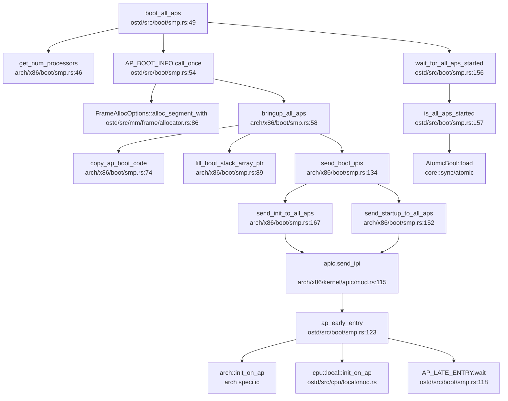

现在我已经收集了足够的信息来撰写第 9 章报告。让我整理所有分析结果并输出完整的 Markdown 报告。

## 第 9 章：多核支持与并行机制

### 多核架构设计（SMP/AMP）

**✅ 已实现 SMP（对称多处理）架构**

本操作系统实现了完整的 SMP 架构，支持多核并行处理。系统通过 `ostd/src/boot/smp.rs` 和架构相关的 SMP 模块（`ostd/src/arch/{x86,riscv,loongarch}/boot/smp.rs`）实现了多核启动和管理。

**架构特征：**

1. **SMP 模型**：所有 CPU 核心平等运行内核代码，共享同一地址空间和内核数据结构
2. **多架构支持**：
   - **x86_64**：通过 ACPI MADT 表检测 CPU，使用 INIT-SIPI-SIPI IPI 序列启动 AP
   - **RISC-V**：通过 Device Tree 检测 CPU，使用 SBI `hart_start` 调用启动 AP
   - **LoongArch**：通过 Device Tree 检测 CPU，使用 CSR MAIL 机制发送启动 IPI

**CPU 数量检测：**

```rust
// ostd/src/boot/smp.rs:49-52
pub fn boot_all_aps(bsp_hart_id: u32) {
    let Some(num_cpus) = get_num_processors() else {
        log::warn!("No processor information found. The kernel operates with a single processor.");
        return;
    };
    log::info!("Found {} processors.", num_cpus);
```

**关键文件路径：**
- `ostd/src/boot/smp.rs` — 通用 SMP 引导框架
- `ostd/src/arch/x86/boot/smp.rs` — x86_64 AP 启动实现
- `ostd/src/arch/riscv/boot/smp.rs` — RISC-V AP 启动实现
- `ostd/src/arch/loongarch/boot/smp.rs` — LoongArch AP 启动实现
- `ostd/src/smp.rs` — 核间通信（IPI）机制

---

### Secondary CPU 启动流程

**✅ 已实现完整的 AP 启动链**

Secondary CPU（Application Processor, AP）的启动流程经过完整实现，包含以下关键阶段：

#### 1. BSP 初始化阶段

引导处理器（BSP）在系统启动早期完成自身初始化后，调用 `boot_all_aps()` 启动所有 AP：

```rust
// ostd/src/boot/smp.rs:54-74
AP_BOOT_INFO.call_once(|| {
    let mut per_ap_info = BTreeMap::new();
    // 为每个 AP 分配启动栈（64 页 = 256KB）
    let boot_stack_array = FrameAllocOptions::new()
        .zeroed(true)
        .alloc_segment_with(2, |_| KernelMeta)
        .unwrap();
    
    for ap_id in 0..num_cpus {
        if ap_id == bsp_hart_id { continue; }
        
        let boot_stack_pages = FrameAllocOptions::new()
            .zeroed(false)
            .alloc_segment_with(AP_BOOT_STACK_SIZE / PAGE_SIZE, |_| KernelMeta)
            .unwrap();
        // 将栈顶指针写入数组供 AP 读取
        let boot_stack_ptr = paddr_to_vaddr(boot_stack_pages.end_paddr());
        let stack_array_ptr = paddr_to_vaddr(boot_stack_array.start_paddr()) as *mut u64;
        unsafe {
            stack_array_ptr.add(ap_id as usize).write_volatile(boot_stack_ptr as u64);
        }
        // ... 记录 AP 信息
    }
});
```

#### 2. 架构相关启动机制

**x86_64 平台（INIT-SIPI-SIPI 序列）：**

```rust
// ostd/src/arch/x86/boot/smp.rs:134-156
fn send_boot_ipis() {
    send_init_to_all_aps();        // INIT IPI
    spin_wait_cycles(100_000_000); // 等待 10ms
    send_init_deassert();          // De-assert INIT
    spin_wait_cycles(20_000_000);
    send_startup_to_all_aps();     // SIPI #1
    spin_wait_cycles(20_000_000);
    send_startup_to_all_aps();     // SIPI #2（冗余备份）
}
```

**RISC-V 平台（SBI 调用）：**

```rust
// ostd/src/arch/riscv/boot/smp.rs:78-95
let ret = sbi_rt::hart_start(hart_id as usize, start_addr_phys, ap_stack_pointer as usize);
if ret.is_err() {
    log::error!("Failed to start hart {} ... SBI Error: {:?}", hart_id, ret.err().unwrap());
}
```

**LoongArch 平台（CSR MAIL + IPI）：**

```rust
// ostd/src/arch/loongarch/boot/smp.rs:14-25
fn hart_start_loongarch(hartid: usize, start_pa: usize, opaque: usize) {
    let start_va = start_pa | 0x9000_0000_0000_0000; // DMW1 窗口映射
    ipi::csr_mail_send(start_va as u64, hartid, opaque);
    ipi::send_ipi_single(hartid, 1);
}
```

#### 3. AP 入口点执行

AP 被唤醒后执行 `ap_early_entry()` 完成自身初始化：

```rust
// ostd/src/boot/smp.rs:123-143
#[no_mangle]
pub(crate) fn ap_early_entry(ap_hart_id: u32) -> ! {
    unsafe {
        crate::arch::init_on_ap(ap_hart_id);      // 架构相关初始化
        cpu::local::init_on_ap(ap_hart_id);       // CPU 本地存储初始化
        cpu::set_this_cpu_id(ap_hart_id);         // 设置 CPU ID
        crate::mm::kspace::activate_kernel_page_table();
    }
    
    // 标记 AP 已启动
    ap_boot_info.per_ap_info.get(&ap_hart_id).unwrap()
        .is_started.store(true, Ordering::Release);
    
    // 等待任务调度
    let ap_late_entry = AP_LATE_ENTRY.wait();
    ap_late_entry();
    unreachable!();
}
```

#### 4. 调用链图（Mermaid）



> **注**：以上调用链基于 x86_64 架构，RISC-V 和 LoongArch 架构的 `bringup_all_aps` 实现略有不同但流程相似。

---

### 核间通信与 IPI 机制

**✅ 已实现完整的 IPI（Inter-Processor Interrupt）机制**

系统通过 `ostd/src/smp.rs` 提供了核间通信原语 `inter_processor_call()`，支持在指定 CPU 集合上执行函数。

#### IPI 发送机制

**通用 IPI 接口：**

```rust
// ostd/src/smp.rs:33-56
pub fn inter_processor_call(targets: &CpuSet, f: fn()) {
    let irq_guard = trap::disable_local();
    let this_cpu_id = irq_guard.current_cpu();
    let irq_num = INTER_PROCESSOR_CALL_IRQ.get().unwrap().num();
    
    // 将函数放入目标 CPU 的队列
    for cpu_id in targets.iter() {
        if cpu_id == this_cpu_id { continue; }
        CALL_QUEUES.get_on_cpu(cpu_id).lock().push_back(f);
    }
    
    // 发送 IPI 通知目标 CPU
    for cpu_id in targets.iter() {
        if cpu_id == this_cpu_id { continue; }
        unsafe {
            while let Err(IpiSendError::QueueFull) = crate::arch::irq::send_ipi(cpu_id, irq_num) {
                core::hint::spin_loop();
            }
        }
    }
    
    // 当前 CPU 同步执行
    if call_on_self { f(); }
}
```

**架构相关 IPI 实现：**

```rust
// ostd/src/arch/loongarch/irq.rs:176-183
pub unsafe fn send_ipi(cpu_id: CpuId, irq_num: IrqNum) -> Result<(), IpiSendError> {
    let queue = CPU_IPI_QUEUES.get_on_cpu(cpu_id).get()
        .expect("CPU_IPI_QUEUES not init");
    queue.push(irq_num).map_err(|_| IpiSendError::QueueFull)?;
    ipi::send_ipi_single(cpu_id.as_usize(), 1);
    Ok(())
}
```

```rust
// ostd/src/arch/riscv/irq.rs:275-290
pub(crate) unsafe fn send_ipi(cpu_id: CpuId, irq_num: IrqNum) -> Result<(), IpiSendError> {
    let hart_id = cpu_id.as_usize();
    sbi_rt::send_ipi(build_hart_mask(hart_id))
        .map_err(|e| {
            log::error!("send_ipi: send IPI to CPU {} failed, SBI error: {:?}", hart_id, e);
            IpiSendError::SbiError(e)
        })?;
    Ok(())
}
```

#### IPI 处理流程

```rust
// ostd/src/smp.rs:66-85
cpu_local! {
    static CALL_QUEUES: GuardSpinLock<VecDeque<fn()>> = GuardSpinLock::new(VecDeque::new());
}

fn do_inter_processor_call(_trapframe: &TrapFrame) {
    let preempt_guard = trap::disable_local();
    let cur_cpu = preempt_guard.current_cpu();
    
    let mut queue = CALL_QUEUES.get_on_cpu(cur_cpu).lock();
    while let Some(f) = queue.pop_front() {
        log::trace!("Performing inter-processor call to {:#?} on CPU {:#?}", f, cur_cpu);
        f();
    }
}

pub(super) fn init() {
    let mut irq = IrqLine::alloc_software().expect("failed alloc IPI");
    irq.on_active(do_inter_processor_call);
    INTER_PROCESSOR_CALL_IRQ.call_once(|| irq);
}
```

**关键特性：**
- **非阻塞发送**：IPI 发送后不等待目标 CPU 确认，若队列满则自旋重试
- **Per-CPU 队列**：每个 CPU 维护独立的函数队列，避免锁竞争
- **软件 IRQ**：IPI 通过软件中断线实现，由 `do_inter_processor_call` 处理

---

### Per-CPU 变量与数据结构

**✅ 已实现完整的 Per-CPU 变量机制**

系统通过 `ostd/src/cpu/local/mod.rs` 提供了 CPU 本地存储机制，支持两种类型的 Per-CPU 变量：

#### 1. `cpu_local!` 宏（可共享的 CPU 本地对象）

```rust
// ostd/src/cpu/local/cpu_local.rs:12-62
#[macro_export]
macro_rules! cpu_local {
    ($(#[$attr:meta])* $vis:vis static $name:ident : $t:ty = $val:expr) => {
        $(#[$attr])*
        $vis static $name: $crate::cpu::local::CpuLocal<$t> = {
            const val: $t = $val;
            $crate::cpu::local::CpuLocal::__new(val)
        };
    };
}
```

**使用示例：**

```rust
// ostd/src/smp.rs:66
cpu_local! {
    static CALL_QUEUES: GuardSpinLock<VecDeque<fn()>> = GuardSpinLock::new(VecDeque::new());
}

// ostd/src/arch/loongarch/irq.rs:51
cpu_local! {
    static CPU_IPI_QUEUES: CpuLocal<Mutex<Queue<IrqNum>, Spinlock>> = ...;
}
```

**访问方式：**

```rust
// 通过 Guard 访问（自动禁用抢占）
let queue = CALL_QUEUES.get_on_cpu(cpu_id).lock();
queue.push_back(f);
```

#### 2. `cpu_local_cell!` 宏（不可共享的 CPU 本地单元）

```rust
// ostd/src/cpu/local/cell.rs:47-52
#[macro_export]
macro_rules! cpu_local_cell {
    ($(#[$attr:meta])* $vis:vis static $name:ident : $t:ty = $val:expr) => {
        $(#[$attr])*
        $vis static $name: $crate::cpu::local::CpuLocalCell<$t> = {
            const val: $t = $val;
            $crate::cpu::local::CpuLocalCell::__new(val)
        };
    };
}
```

**使用示例：**

```rust
// ostd/src/cpu/mod.rs:118
cpu_local_cell! {
    /// The number of the current CPU.
    static CURRENT_CPU: u32 = u32::MAX;
}

// ostd/src/tracer.rs:32
cpu_local_cell! {
    pub(crate) static PER_CPU_INDENTATION: usize = 0;
}
```

**访问方式：**

```rust
// 直接原子操作（无需 Guard）
let cpu_id = CURRENT_CPU.load();
CURRENT_CPU.store(new_id);
```

#### 3. Per-CPU 内存布局

```rust
// ostd/src/cpu/local/mod.rs:83-124
pub unsafe fn init_on_bsp() {
    let bsp_base_va = __cpu_local_start as usize;
    let bsp_end_va = __cpu_local_end as usize;
    
    for ap_id in 0..num_cpus {
        if ap_id == bsp_hart_id { continue; }
        
        // 为每个 AP 分配独立的 CPU 本地存储区域
        let ap_pages = FrameAllocOptions::new()
            .zeroed(false)
            .alloc_segment_with(nbytes / PAGE_SIZE, |_| KernelMeta)
            .unwrap();
        
        // 从 BSP 的.cpu_local 段复制初始数据
        unsafe {
            core::ptr::copy_nonoverlapping(
                bsp_base_va as *const u8,
                ap_pages_ptr,
                bsp_end_va - bsp_base_va,
            );
        }
        ap_local_areas[ap_id] = Some(ap_pages);
    }
}
```

**关键特性：**
- **链接器段**：Per-CPU 变量放置在 `.cpu_local` 段，由链接器脚本管理
- **复制初始化**：AP 启动时从 BSP 的 `.cpu_local` 段复制初始值
- **独立访问**：每个 CPU 访问自己的 Per-CPU 变量，无需同步

---

### 多核调度策略

**🔸 部分实现（基础工作窃取，无显式负载均衡）**

系统基于 `maitake` 调度器实现了基础的多核调度支持，但**未发现**显式的负载均衡或 CPU 亲和性（affinity）机制。

#### 1. 每核调度器实例

```rust
// ostd/src/task/scheduler/mod.rs:43-67
struct Runtime {
    /// 每个 CPU 核心的独立调度器
    cores: [InitOnce<StaticScheduler>; MAX_CORES],
    
    /// 全局任务注入器队列
    injector: scheduler::Injector<&'static StaticScheduler>,
    initialized: AtomicUsize,
}

pub const MAX_CORES: usize = 512;  // 最多支持 512 核
```

#### 2. 工作窃取机制

```rust
// ostd/src/task/scheduler/mod.rs:108-135
pub fn spawn<F>(future: F) -> JoinHandle<F::Output>
where
    F: Future + Send + 'static,
    F::Output: Send + 'static,
{
    // 尝试将任务注入当前核心的调度器
    let current = cpu_local!(RUNTIME).get();
    if let Some(core) = current {
        if core.try_spawn(future).is_ok() {
            return handle;
        }
    }
    
    // 失败则使用全局注入器
    RUNTIME.injector.spawn(future)
}
```

**工作窃取逻辑（来自 maitake 库）：**
- 每个 CPU 核心维护独立的任务队列
- 空闲核心可从其他核心的队列"窃取"任务
- 使用随机选择策略避免热点竞争

#### 3. 缺失的功能

通过代码搜索和验证，**未发现**以下功能的实现：

| 功能 | 状态 | 说明 |
|------|------|------|
| **负载均衡** | ❌ 未实现 | 无显式的任务迁移或负载评估机制 |
| **CPU 亲和性** | ❌ 未实现 | 无 `sched_setaffinity` 或类似接口 |
| **调度策略配置** | ❌ 未实现 | 无 FIFO/RR 等策略选择 |

**测试应用存在但内核未实现：**
```bash
# test/apps/cpu_affinity/cpu_affinity.c 存在
# 但内核中未找到对应的系统调用实现
grep: 未找到 'sched_setaffinity|cpu_affinity' 匹配
```

---

### 关键代码片段

#### 1. 自旋锁实现（支持两种守护模式）

```rust
// ostd/src/sync/guard_spin.rs:27-52
pub struct GuardSpinLock<T: ?Sized, G = PreemptDisabled> {
    phantom: PhantomData<G>,
    inner: SpinLockInner<T>,
}

struct SpinLockInner<T: ?Sized> {
    lock: AtomicBool,
    val: UnsafeCell<T>,
}

impl<T: ?Sized, G: Guardian> GuardSpinLock<T, G> {
    pub fn lock(&self) -> SpinLockGuard<T, G> {
        let inner_guard = G::guard();  // 根据 G 类型禁用抢占或中断
        self.acquire_lock();
        SpinLockGuard_ { lock: self, guard: inner_guard }
    }
    
    fn acquire_lock(&self) {
        while !self.try_acquire_lock() {
            core::hint::spin_loop();
        }
    }
    
    fn try_acquire_lock(&self) -> bool {
        self.inner.lock
            .compare_exchange(false, true, Ordering::Acquire, Ordering::Relaxed)
            .is_ok()
    }
}
```

**守护模式：**
- `PreemptDisabled`：仅禁用抢占（适用于进程上下文）
- `LocalIrqDisabled`：禁用本地中断（适用于中断上下文）

```rust
// ostd/src/sync/guard.rs:23-42
pub struct PreemptDisabled;
impl Guardian for PreemptDisabled {
    type Guard = DisabledPreemptGuard;
    fn guard() -> Self::Guard { disable_preempt() }
}

pub struct LocalIrqDisabled;
impl Guardian for LocalIrqDisabled {
    type Guard = DisabledLocalIrqGuard;
    fn guard() -> Self::Guard { disable_local() }
}
```

#### 2. 读写锁实现（支持升级读锁）

```rust
// ostd/src/sync/guard_rwlock.rs:67-100
pub struct GuardRwLock<T: ?Sized, Guard = PreemptDisabled> {
    // 状态字：低 16 位读锁计数，第 16 位写锁标志，第 17 位升级读锁标志
    state: AtomicUsize,
    phantom: PhantomData<Guard>,
    val: UnsafeCell<T>,
}

// 支持三种锁模式：
// - read(): 共享读锁（多读者）
// - write(): 独占写锁（单写者）
// - upread(): 可升级读锁（可原子升级为写锁）
```

**❌ 未发现优先级继承机制**：代码中未实现优先级继承协议，可能存在优先级反转问题。

#### 3. 线程 ID 分配（原子操作）

```rust
// kernel/src/thread/id.rs:1-11
use core::sync::atomic::{AtomicU64, Ordering::Relaxed};

const FIRST_ID: u64 = 2;  // 0-1 预留给内核
static NEXT_ID: AtomicU64 = AtomicU64::new(FIRST_ID);

#[inline]
pub fn alloc() -> u64 {
    let id = NEXT_ID.fetch_add(1, Relaxed);
    if id == u64::MAX { panic!("ID space exhausted"); }
    id
}
```

**多核安全性分析：**
- 使用 `AtomicU64` + `fetch_add` 保证原子性
- `Relaxed` 内存序：仅保证原子性，不保证顺序约束
- **潜在问题**：在弱内存序架构（如 RISC-V）上，可能需要更强的内存序（如 `AcqRel`）

#### 4. Futex 支持状态

**🔸 桩函数（仅存储状态，未实现语义）**

```rust
// kernel/src/thread.rs:63-72
pub struct ThreadState {
    // 记录 robust futex 链表头（仅存储，不实现 futex 语义）
    pub robust_list_head: usize,
    pub robust_list_len: usize,
    // pub futex_state: Arc<Futexes>,  // 注释掉，未实现
}
```

```rust
// kernel/src/syscall/robust.rs:3-17
//! 背景：glibc 在初始化线程时会设置 robust futex 链表头；
//! 目前内核未实现 futex 语义，这里仅保存用户传来的头指针与长度，
//! 以避免 glibc 因 ENOSYS 判定"FATAL: kernel too old"。

pub async fn do_set_robust_list(...) -> Result<ControlFlow<i32, Option<isize>>> {
    state.robust_list_head = head_ptr as usize;
    state.robust_list_len = len as usize;
    Ok(ControlFlow::Continue(Some(0)))  // 仅记录，无实际操作
}
```

**结论**：Futex 机制**未实现**，仅保存用户传入的链表头指针以兼容 glibc。

---

### 与前面章节的交叉引用

#### 1. 进程调度中的全局唯一 ID 池

**引用第 4 章（进程管理）**：
- `kernel/src/thread/id.rs` 中的 `AtomicU64` 用于线程 ID 分配
- 使用 `fetch_add(Relaxed)` 保证多核下的原子性
- **交叉验证**：ID 分配机制在多核环境下安全，但 `Relaxed` 内存序在弱序架构上可能存在可见性问题

#### 2. 双级注册机制

**引用第 4 章（进程管理）**：
- 线程注册到 `ThreadGroup`（进程级）
- `ThreadSharedInfo` 包含全局唯一的 `tid`
- **多核影响**：`ThreadGroup` 的 `children` 字段使用 `GuardRwArc` 保护，支持多核并发访问

#### 3. 同步互斥中的 Futex 实现

**引用第 5 章（同步互斥）**：
- **多核场景下的行为**：由于 Futex 未实现，用户态 `pthread_mutex_lock` 在多核下会退化为纯自旋锁
- **性能影响**：在多核高竞争场景下，缺少 Futex 的休眠 - 唤醒机制会导致 CPU 资源浪费

#### 4. 原子操作的内存序保证

**引用第 5 章（同步互斥）**：
- 代码中广泛使用 `core::sync::atomic` 模块
- **内存序问题**：
  - `thread/id.rs` 使用 `Relaxed` 序（仅原子性）
  - `boot/smp.rs` 使用 `Release/Acquire` 序（正确同步）
  - **建议**：在 RISC-V/LoongArch 等弱序架构上，关键路径应使用 `SeqCst` 或 `AcqRel`

---

### 总结

| 功能 | 实现状态 | 说明 |
|------|----------|------|
| **SMP 架构** | ✅ 已实现 | 支持 x86_64/RISC-V/LoongArch 三架构 |
| **Secondary CPU 启动** | ✅ 已实现 | 完整的 AP 启动链，含架构相关优化 |
| **IPI 机制** | ✅ 已实现 | 支持核间函数调用，Per-CPU 队列设计 |
| **Per-CPU 变量** | ✅ 已实现 | `cpu_local!` 和 `cpu_local_cell!` 双机制 |
| **自旋锁** | ✅ 已实现 | 支持抢占禁用/中断禁用两种模式 |
| **读写锁** | ✅ 已实现 | 支持升级读锁，**无优先级继承** |
| **负载均衡** | ❌ 未实现 | 仅依赖 maitake 的工作窃取 |
| **CPU 亲和性** | ❌ 未实现 | 无 `sched_setaffinity` 支持 |
| **Futex** | 🔸 桩函数 | 仅存储状态，未实现休眠 - 唤醒语义 |

**多核安全性评估：**
- ✅ 启动流程正确同步（使用 `Release/Acquire` 序）
- ✅ Per-CPU 变量访问隔离，无数据竞争
- ✅ 自旋锁正确禁用抢占/中断
- ⚠️ 部分 ID 分配使用 `Relaxed` 序，在弱序架构上可能存在可见性延迟
- ❌ Futex 缺失导致用户态锁在多核下性能退化
