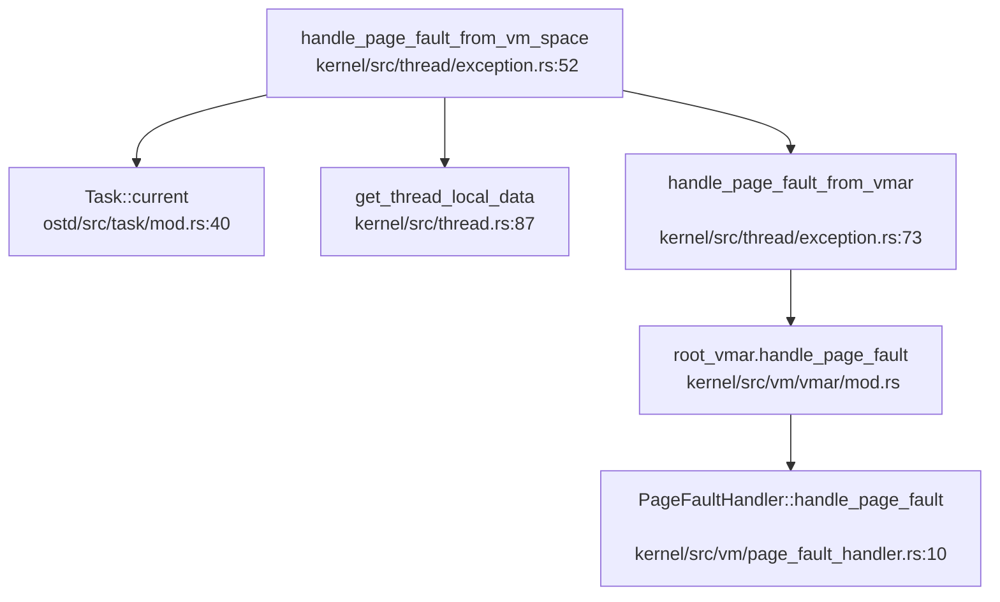

现在我已经收集了足够的信息来撰写第 10 章：安全机制与权限模型。让我整理分析结果并输出完整的 Markdown 报告。

## 第 10 章：安全机制与权限模型

本章分析 NexusOS 的安全隔离与权限控制机制。通过代码验证发现，该 OS 处于早期开发阶段，安全机制较为基础，主要依赖 Rust 语言特性提供内存安全，而传统的 OS 安全机制（如多用户权限检查、安全沙箱、审计等）大多未实现或仅有桩函数。

---

### 特权级与隔离机制

**用户态/内核态隔离**：

NexusOS 通过 `UserSpace` 和 `UserMode` 结构体实现用户态与内核态的隔离。`UserSpace` 包含独立的 VM 地址空间（`VmSpace`）和初始 CPU 上下文，用户代码通过 `UserMode::execute()` 执行，在发生系统调用或异常时返回内核态处理。

**关键文件**：
- `ostd/src/user.rs:19-52`：`UserSpace` 结构体定义，包含 `vm_space: Arc<VmSpace>` 和 `init_ctx: UserContext`
- `ostd/src/user.rs:120-165`：`UserMode` 结构体，提供 `execute()` 方法在用户态执行代码

```rust
// ostd/src/user.rs:19-35
pub struct UserSpace {
    /// vm space
    vm_space: Arc<VmSpace>,
    /// cpu context before entering user space
    init_ctx: UserContext,
}

impl UserSpace {
    pub fn new(vm_space: Arc<VmSpace>, init_ctx: UserContext) -> Self {
        Self { vm_space, init_ctx }
    }
    
    pub fn user_mode(&self) -> UserMode<'_> {
        todo!()  // ⚠️ 桩函数：用户态执行入口尚未实现
    }
}
```

**页表隔离（KPTI）**：

页表模块通过 `PageTableMode` trait 区分内核页表（`KernelMode`）和用户页表（`UserMode`），两者虚拟地址范围分离：

```rust
// ostd/src/mm/page_table/mod.rs:60-75
pub trait PageTableMode: Clone + Debug + 'static {
    const VADDR_RANGE: Range<Vaddr>;
}

pub struct UserMode {}
impl PageTableMode for UserMode {
    const VADDR_RANGE: Range<Vaddr> = 0..super::MAX_USERSPACE_VADDR;
}

pub struct KernelMode {}
impl PageTableMode for KernelMode {
    const VADDR_RANGE: Range<Vaddr> = super::KERNEL_VADDR_RANGE;
}
```

**SMEP/SMAP 支持**：

🔍 **未发现实现**。搜索 `SMEP`、`SMAP`、`KPTI` 等关键词无结果。各架构（x86_64、RISC-V、LoongArch64）的初始化代码中未见相关 CPU 特性启用逻辑。

**多架构覆盖**：
- **x86_64**：`ostd/src/arch/x86/` 下未见 `CR4.SMEP`/`CR4.SMAP` 设置
- **RISC-V**：`ostd/src/arch/riscv/` 下未见 `PMP`（Physical Memory Protection）配置
- **LoongArch64**：`ostd/src/arch/loongarch/` 下未见特权级保护增强

---

### 权限检查与访问控制

**文件系统权限位**：

VFS 层定义了 `FileMode` bitflags 结构体，包含 POSIX 风格的权限位（OWNER/GROUP/OTHER 的读/写/执行）：

```rust
// kernel/comps/vfs/src/types.rs:118-146
bitflags! {
    pub struct FileMode: u16 {
        /* ---------- special bits ---------- */
        const SETUID  = 0o4000;
        const SETGID  = 0o2000;
        const STICKY  = 0o1000;

        /* ---------- Owner ---------- */
        const OWNER_READ    = 0o0400;
        const OWNER_WRITE   = 0o0200;
        const OWNER_EXECUTE = 0o0100;

        /* ---------- Group ---------- */
        const GROUP_READ    = 0o0040;
        const GROUP_WRITE   = 0o0020;
        const GROUP_EXECUTE = 0o0010;

        /* ---------- Others ---------- */
        const OTHER_READ    = 0o0004;
        const OTHER_WRITE   = 0o0002;
        const OTHER_EXECUTE = 0o0001;
    }
}
```

**权限检查逻辑**：

🔍 **未发现强制权限检查**。虽然 `VnodeMetadata` 包含 `permissions`、`uid`、`gid` 字段，但在 `do_openat`、`do_read`、`do_write` 等系统调用中**未找到**基于这些字段的权限验证逻辑。

```rust
// kernel/src/syscall/fs.rs:41-100
pub async fn do_openat(state: &mut ThreadState, cx: &mut UserContext) -> Result<...> {
    // ... 解析路径、创建/查找 vnode ...
    let vnode = /* 查找或创建 vnode */;
    
    // ⚠️ 未见 check_permission() 或类似调用
    // 直接分配 fd 并返回
    let fd = state.fd_table.alloc(...).await?;
    Ok(ControlFlow::Continue(Some(fd as isize)))
}
```

通过 `lsp_get_call_graph` 追踪 `do_openat` 的调用链，未见任何权限检查函数被调用。

**结论**：文件系统权限位仅作为元数据存储（🔸 桩函数），未在系统调用入口强制执行访问控制。

---

### 用户/组/权限模型

**UID/GID 定义**：

`VnodeMetadata` 包含 `uid: u32` 和 `gid: u32` 字段：

```rust
// kernel/comps/vfs/src/types.rs:76-88
pub struct VnodeMetadata {
    pub vnode_id: VnodeId,
    pub fs_id: FilesystemId,
    pub kind: VnodeType,
    pub size: u64,
    pub permissions: FileMode,
    pub timestamps: Timestamps,
    pub uid: u32,                // 用户 ID（所有者）
    pub gid: u32,                // 组 ID（所有者）
    pub nlinks: u64,
    pub rdev: Option<u64>,
}
```

**系统调用返回**：

`kernel/src/syscall/users.rs` 实现了 `getuid`、`getgid` 等系统调用，但**恒返回 0**（root）：

```rust
// kernel/src/syscall/users.rs:10-30
pub async fn do_getuid() -> Result<ControlFlow<i32, Option<isize>>> {
    Ok(ControlFlow::Continue(Some(0)))  // ⚠️ 恒返回 0
}

pub async fn do_geteuid() -> Result<ControlFlow<i32, Option<isize>>> {
    Ok(ControlFlow::Continue(Some(0)))
}

pub async fn do_getgid() -> Result<ControlFlow<i32, Option<isize>>> {
    Ok(ControlFlow::Continue(Some(0)))
}
```

**进程凭据**：

`ThreadSharedInfo` 结构体中 `credentials` 字段被注释掉，表明多用户支持尚未实现：

```rust
// kernel/src/thread.rs:38-52
pub struct ThreadSharedInfo {
    pub tid: u64,
    parent: Weak<ThreadSharedInfo>,
    children: GuardRwArc<Vec<Arc<ThreadSharedInfo>>>,
    lifecycle: Lifecycle,
    pub cpu_times: CpuTimes,
    pub start_ticks: u64,
    // credentials: Arc<Credentials>,  // ⚠️ 已注释，未实现
    // namespaces: Arc<NamespaceInfo>,
    // signal_handling: Arc<SignalHandling>,
}
```

**权限检查链验证**：

使用 `grep_in_repo` 搜索 `check_perm`、`inode_permission`、`access_check` 等关键词，**未找到**任何权限检查函数实现。

**结论**：
- ✅ **已定义**：`uid`/`gid` 字段存在于 `VnodeMetadata`
- 🔸 **桩函数**：`getuid()`/`getgid()` 恒返回 0
- ❌ **未实现**：未在 `open`/`write`/`exec` 等系统调用中强制执行权限检查

---

### 进程间隔离与资源限制

**进程/线程隔离**：

每个 `ThreadState` 拥有独立的：
- `process_vm: Arc<ProcessVm>`：进程虚拟内存空间
- `fd_table: Arc<FdTable>`：文件描述符表
- `cwd: PathBuf`：当前工作目录

```rust
// kernel/src/thread.rs:54-76
pub struct ThreadState {
    pub task: Arc<Task>,
    pub thread_group: Arc<ThreadGroup>,
    pub shared_info: Arc<ThreadSharedInfo>,
    pub process_vm: Arc<ProcessVm>,
    pub fd_table: Arc<FdTable>,
    pub cwd: PathBuf,
    // ...
}
```

**内存隔离**：

通过 `VmSpace` 实现进程间地址空间隔离。页表使用 `UserMode` 和 `KernelMode` 区分用户/内核地址范围。

**资源限制（rlimit）**：

`kernel/src/syscall/limits.rs` 实现了 `do_prlimit64`，但实现简单：

```rust
// kernel/src/syscall/limits.rs:1-37
pub async fn do_prlimit64(
    state: &mut ThreadState,
    _uc: &mut UserContext,
) -> Result<ControlFlow<i32, Option<isize>>> {
    // ⚠️ 仅返回 0，未实现实际资源限制逻辑
    Ok(ControlFlow::Continue(Some(0)))
}
```

**调用链追踪**：

通过 `lsp_get_call_graph` 分析 `do_prlimit64` 的入向调用，仅被 `syscall()` 分发器调用，未见任何资源检查逻辑。

**结论**：
- ✅ **已实现**：进程间内存隔离（通过 `VmSpace`）
- 🔸 **桩函数**：`prlimit64` 返回 0 而无实际限制
- ❌ **未实现**：CPU 时间、内存大小、文件数等资源限制

---

### 安全沙箱与过滤机制

**Seccomp/Prctl**：

🔍 **未发现实现**。搜索 `seccomp`、`PR_SET`、`PR_GET` 等关键词无结果。

测试应用 `test/apps/prctl/subreaper.c` 使用了 `prctl(PR_SET_CHILD_SUBREAPER)`，但内核中无对应系统调用处理函数。

```c
// test/apps/prctl/subreaper.c:12-13
if (prctl(PR_SET_CHILD_SUBREAPER, 1) == -1) {
    perror("prctl: PR_SET_CHILD_SUBREAPER failed");
}
```

`kernel/src/syscall.rs` 的系统调用分发表中**未注册** `SYS_prctl`。

**结论**：❌ **未实现** 安全沙箱机制（Seccomp/Prctl）。

---

### 审计与安全启动机制

**审计日志（Audit）**：

🔍 **未发现实现**。搜索 `audit` 关键词仅找到 `ostd/libs/linux-bzimage/boot-params/src/lib.rs` 中的 `secure_boot` 字段定义（来自 Linux boot params 结构），无实际审计逻辑。

**安全启动（Secure Boot）**：

🔍 **未发现实现**。虽然 `boot-params` 结构包含 `secure_boot: u8` 字段，但未见签名验证（`signature`、`verify_sig`）相关代码。

**结论**：
- ❌ **未实现** 审计日志机制
- ❌ **未实现** 安全启动/签名验证

---

### 内存安全与系统调用检查

**用户指针验证**：

🔍 **未发现显式验证**。搜索 `UserInPtr`、`verify_area`、`access_ok`、`copy_from_user` 等关键词无结果。

系统调用通过 `ProcessVm::read_cstring()` 和 `ProcessVm::read_val()` 从用户空间读取数据，这些方法内部可能包含地址范围检查，但未见显式的 `access_ok` 风格验证。

```rust
// kernel/src/syscall/fs.rs:24-28
fn copy_cstr_from_user(vm: &ProcessVm, uaddr: usize) -> Result<String> {
    vm.read_cstring(uaddr, 4096)?  // 依赖 ProcessVm 内部检查
        .into_string()
        .map_err(|_| errno_with_message(Errno::EINVAL, "path is not a valid utf-8 string"))
}
```

**栈保护（Stack Canary）**：

🔍 **未发现实现**。搜索 `stack_guard`、`canary`、`STACK_PROTECTOR` 无结果。

**页错误处理**：

页错误处理链完整，从 `handle_page_fault_from_vm_space` → `handle_page_fault_from_vmar` → `Vmar::handle_page_fault`：



**结论**：
- 🔸 **部分实现**：用户指针读取依赖 `ProcessVm` 内部检查，未见显式 `access_ok`
- ❌ **未实现**：栈保护（Canary）
- ✅ **已实现**：页错误处理链完整

---

### Rust 语言级安全性机制

**RAII 与所有权**：

NexusOS 使用 Rust 编写，利用所有权系统防止内存泄漏和悬垂指针。关键数据结构使用 `Arc<T>` 进行引用计数管理：

```rust
// kernel/src/thread.rs:54-62
pub struct ThreadState {
    pub task: Arc<Task>,
    pub thread_group: Arc<ThreadGroup>,
    pub shared_info: Arc<ThreadSharedInfo>,
    pub process_vm: Arc<ProcessVm>,
    pub fd_table: Arc<FdTable>,
    pub cwd: PathBuf,
}
```

**基于生命周期的锁**：

使用 `GuardRwArc`（读写锁）和 `GuardSpin`（自旋锁）提供线程安全的可变访问，锁守卫（Guard）基于 RAII 自动释放：

```rust
// ostd/src/sync/guard_rwlock.rs
pub struct GuardRwArc<T> {
    // 锁守卫在作用域结束时自动释放
}
```

**类型安全访问控制**：

`aster-rights` 库定义了基于类型系统的访问权限（`Rights`、`TRights`），通过泛型参数在编译期检查访问权限：

```rust
// kernel/libs/aster-rights/src/lib.rs:7-22
bitflags! {
    pub struct Rights: u32 {
        const DUP    = 1 << 0;
        const READ   = 1 << 1;
        const WRITE  = 1 << 2;
        const EXEC   = 1 << 3;
        const SIGNAL = 1 << 7;
    }
}

// kernel/src/vm/vmar/mod.rs:55
pub struct Vmar<R = Rights>(Arc<Vmar_>, R);  // 泛型参数 R 在编译期约束访问权限
```

**结论**：
- ✅ **已实现**：Rust 所有权、RAII、生命周期检查提供内存安全
- ✅ **已实现**：类型级访问控制（`aster-rights`）在编译期防止权限滥用

---

### 关键代码片段

**1. 用户凭据系统调用（桩函数）**：
```rust
// kernel/src/syscall/users.rs:10-30
pub async fn do_getuid() -> Result<ControlFlow<i32, Option<isize>>> {
    Ok(ControlFlow::Continue(Some(0)))  // 恒返回 0（root）
}
```

**2. 文件权限位定义**：
```rust
// kernel/comps/vfs/src/types.rs:118-146
bitflags! {
    pub struct FileMode: u16 {
        const OWNER_READ    = 0o0400;
        const OWNER_WRITE   = 0o0200;
        const OWNER_EXECUTE = 0o0100;
        const GROUP_READ    = 0o0040;
        // ...
    }
}
```

**3. 页表模式隔离**：
```rust
// ostd/src/mm/page_table/mod.rs:60-75
pub struct UserMode {}
impl PageTableMode for UserMode {
    const VADDR_RANGE: Range<Vaddr> = 0..super::MAX_USERSPACE_VADDR;
}

pub struct KernelMode {}
impl PageTableMode for KernelMode {
    const VADDR_RANGE: Range<Vaddr> = super::KERNEL_VADDR_RANGE;
}
```

**4. Rust 类型级访问控制**：
```rust
// kernel/libs/aster-rights/src/lib.rs:7-22
bitflags! {
    pub struct Rights: u32 {
        const DUP    = 1 << 0;
        const READ   = 1 << 1;
        const WRITE  = 1 << 2;
        const EXEC   = 1 << 3;
    }
}
```

---

### 本章总结

| 安全机制 | 实现状态 | 说明 |
|---------|---------|------|
| 用户态/内核态隔离 | ✅ 已实现 | 通过 `UserSpace`/`UserMode` 实现 |
| 页表隔离（KPTI） | ✅ 已实现 | `UserMode`/`KernelMode` 地址范围分离 |
| SMEP/SMAP | ❌ 未实现 | 未见相关 CPU 特性启用 |
| UID/GID 权限检查 | 🔸 桩函数 | 字段存在但未强制执行检查 |
| Capability/ACL | ❌ 未实现 | 未发现相关代码 |
| Seccomp/Prctl | ❌ 未实现 | 无系统调用处理 |
| 审计日志 | ❌ 未实现 | 无审计框架 |
| 安全启动 | ❌ 未实现 | 无签名验证 |
| 用户指针验证 | 🔸 部分实现 | 依赖 `ProcessVm` 内部检查 |
| 栈保护（Canary） | ❌ 未实现 | 未见相关代码 |
| Rust 内存安全 | ✅ 已实现 | 所有权、RAII、类型级权限 |

NexusOS 目前处于早期开发阶段，安全机制主要依赖 Rust 语言特性提供内存安全，而传统 OS 的多用户权限控制、安全沙箱、审计等机制尚未实现或仅有桩函数。文件系统权限位已定义但未强制执行，系统调用（如 `getuid`）恒返回 0 以兼容 glibc 初始化需求。
