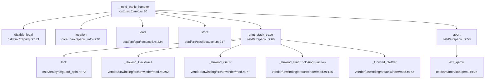

现在我已经收集了足够的信息来撰写第 12 章：调试机制与错误处理。让我整理分析结果并输出完整的 Markdown 报告。

## 第 12 章：调试机制与错误处理

### 日志与打印系统

NexusOS 实现了分层的日志与打印系统，支持从早期启动到正常运行时的控制台输出。

**打印宏实现**：

打印功能位于 `ostd/src/console.rs`，提供了多组宏：

```rust
// ostd/src/console.rs
/// Prints formatted arguments to the console.
pub fn early_print(args: Arguments) {
    crate::arch::serial::print(args);
}

/// Prints to the console with a newline.
#[macro_export]
macro_rules! early_println {
    () => { $crate::early_print!("\n") };
    ($fmt: literal $(, $($arg: tt)+)?) => {
        $crate::console::early_print(format_args!(concat!($fmt, "\n") $(, $($arg)+)?))
    }
}
```

- `early_print!` / `early_println!`：早期打印宏，直接调用串口输出，用于内核初始化阶段
- `print!` / `println!`：正常打印宏，当前实现回退到 `early_print`（VirtIO Console 代码被注释）

**日志系统**：

日志模块位于 `ostd/src/logger.rs`，基于 Rust `log` crate 实现：

```rust
// ostd/src/logger.rs
static LOGGER: Logger = Logger::new();

struct Logger {
    backend: Once<&'static dyn log::Log>,
}

impl log::Log for Logger {
    fn log(&self, record: &Record) {
        if let Some(logger) = self.backend.get() {
            return logger.log(record);
        };
        // 默认实现：使用自旋锁防止日志交错
        use crate::sync::GuardSpinLock;
        static RECORD_LOCK: GuardSpinLock<()> = GuardSpinLock::new(());
        let _lock = RECORD_LOCK.disable_irq().lock();
        crate::console::early_print(format_args!("{}: {}\n", level, record.args()));
    }
}
```

**日志级别设计**：

支持标准日志级别，通过内核命令行参数 `ostd.log_level=` 配置：

```rust
// ostd/src/logger.rs
fn get_log_level() -> Option<LevelFilter> {
    let kcmdline = EARLY_INFO.get().unwrap().kernel_cmdline;
    let value = kcmdline
        .split_whitespace()
        .find_map(|arg| arg.strip_prefix("ostd.log_level="))
        .filter(|v| !v.is_empty())
        .unwrap_or_else(|| option_env!("LOG_LEVEL").unwrap_or("off"));
    LevelFilter::from_str(value).ok()
}
```

支持的级别：`trace`、`debug`、`info`、`warn`、`error`、`off`

**Tracing 支持**：

`ostd/src/tracer.rs` 实现了基于 `tracing` crate 的结构化追踪订阅器 `KernelTracer`：

```rust
// ostd/src/tracer.rs
pub struct KernelTracer {
    max_level: LevelFilter,
}

impl Subscriber for KernelTracer {
    fn event(&self, event: &Event<'_>) {
        let metadata = event.metadata();
        let mut buffer = ArrayString::<LOG_BUFFER_SIZE>::new();
        let mut field_visitor = FieldVisitor::new(&mut buffer);
        event.record(&mut field_visitor);
        let indent_val = Self::get_current_cpu_indent_level() * INDENT_MULTIPLIER;
        println!(
            "{} [{}] {:indent$}{}",
            Self::level_prefix(metadata.level()),
            metadata.target(),
            "",
            buffer.as_str(),
            indent = indent_val
        );
    }
}
```

特点：
- 使用 `ArrayString` 避免堆分配（`no_alloc` 设计）
- 支持每 CPU 缩进级别，便于追踪嵌套 Span
- 通过 `enter()` / `exit()` 实现 Span 进入/退出的缩进打印

### Panic 处理与栈回溯

**Panic Handler 实现**：

默认 Panic 处理程序位于 `ostd/src/panic.rs`：

```rust
// ostd/src/panic.rs:30
#[linkage = "weak"]
#[no_mangle]
pub fn __ostd_panic_handler(info: &core::panic::PanicInfo) -> ! {
    let _irq_guard = crate::trap::disable_local();

    if let Some(location) = info.location() {
        early_println!("Panicked at {}:{}",
            location.file(),
            location.line(),
        );
    }

    crate::cpu_local_cell! {
        static IN_PANIC: bool = false;
    }

    if IN_PANIC.load() {
        early_println!("The panic handler panicked {:#?}", info);
        abort();
    }

    IN_PANIC.store(true);
    early_println!("Non-resettable panic! {:#?}", info);
    print_stack_trace();
    abort();
}
```

处理流程：
1. 禁用本地中断
2. 打印 Panic 位置（文件 + 行号）
3. 检测递归 Panic（通过 CPU 本地变量 `IN_PANIC`）
4. 调用 `print_stack_trace()` 打印栈回溯
5. 调用 `abort()` 退出 QEMU

**Panic 调用链**：

通过 `lsp_get_call_graph` 分析 `__ostd_panic_handler` 的出向调用：



**栈回溯 (Backtrace) 支持**：

✅ **已实现** — 支持基于 DWARF 的栈回溯（非 LoongArch 架构）

```rust
// ostd/src/panic.rs:62-117
#[cfg(not(target_arch = "loongarch64"))]
pub fn print_stack_trace() {
    use crate::sync::GuardSpinLock;
    static BACKTRACE_PRINT_LOCK: GuardSpinLock<()> = GuardSpinLock::new(());
    let _lock = BACKTRACE_PRINT_LOCK.lock();
    early_println!("Printing stack trace:");

    struct CallbackData { counter: usize }
    
    extern "C" fn callback(unwind_ctx: &UnwindContext<'_>, arg: *mut c_void) -> UnwindReasonCode {
        let data = unsafe { &mut *(arg as *mut CallbackData) };
        data.counter += 1;
        let pc = _Unwind_GetIP(unwind_ctx);
        if pc > 0 {
            let fde_initial_address = _Unwind_FindEnclosingFunction(pc as *mut c_void) as usize;
            early_println!(
                "{:4}: fn {:#18x} - pc {:#18x} / registers:",
                data.counter,
                fde_initial_address,
                pc,
            );
        }
        // 打印前 8 个通用寄存器
        for i in 0..8u16 {
            let reg_i = _Unwind_GetGR(unwind_ctx, i as i32);
            // 根据架构获取寄存器名称
            early_print!(" {} {:#18x};", reg_name, reg_i);
        }
        UnwindReasonCode::NO_REASON
    }

    let mut data = CallbackData { counter: 0 };
    _Unwind_Backtrace(callback, &mut data as *mut _ as _);
}
```

实现细节：
- 使用 `unwinding` crate 的 `_Unwind_Backtrace` 进行 DWARF 展开
- 打印每层栈帧的函数起始地址、PC 值
- 打印前 8 个通用寄存器（支持 x86_64、RISC-V 64、ARM64）
- 通过全局自旋锁防止多 CPU 输出交错

**LoongArch 架构限制**：

❌ **未实现完整 Backtrace** — LoongArch 仅支持手动栈帧遍历框架

```rust
// ostd/src/panic.rs:121-130
#[cfg(target_arch = "loongarch64")]
pub fn print_stack_trace() {
    unsafe extern "C" {
        fn __stext();
        fn __etext();
    }
    // [TODO]
}
```

当前 LoongArch 架构的 `print_stack_trace()` 仅有框架，标记为 `[TODO]`，未实现实际的栈回溯逻辑。

**Panic Handler 宏支持**：

`ostd-macros` 提供了 `#[ostd::panic_handler]` 宏，允许用户自定义 Panic 处理程序：

```rust
// ostd/libs/ostd-macros/src/lib.rs:73
#[proc_macro_attribute]
pub fn panic_handler(_attr: TokenStream, item: TokenStream) -> TokenStream {
    let handler_fn = parse_macro_input!(item as ItemFn);
    let handler_fn_name = &handler_fn.sig.ident;
    quote!(
        #[cfg(not(ktest))]
        #[no_mangle]
        extern "Rust" fn __ostd_panic_handler(info: &core::panic::PanicInfo) -> ! {
            #handler_fn_name(info);
        }
        #handler_fn
    ).into()
}
```

### 错误码与 Result 设计

**错误码定义**：

NexusOS 使用 `kernel/libs/nexus-error/src/lib.rs` 定义了一套完整的 Linux 兼容错误码：

```rust
// kernel/libs/nexus-error/src/lib.rs:14
#[repr(i32)]
#[derive(Debug, Clone, Copy, PartialEq, Eq, PartialOrd, num_enum::TryFromPrimitive)]
pub enum Errno {
    EPERM = 1,      /* Operation not permitted */
    ENOENT = 2,     /* No such file or directory */
    ESRCH = 3,      /* No such process */
    EINTR = 4,      /* Interrupted system call */
    EIO = 5,        /* I/O error */
    ENOMEM = 12,    /* Out of memory */
    EACCES = 13,    /* Permission denied */
    EFAULT = 14,    /* Bad address */
    EINVAL = 22,    /* Invalid argument */
    ENOSYS = 38,    /* Invalid system call number */
    // ... 共 133 个错误码
}
```

**Result 类型**：

使用 `error_stack` crate 实现带上下文的错误处理：

```rust
// kernel/libs/nexus-error/src/lib.rs:9
pub type Result<T> = error_stack::Result<T, Error>;

/// error used in this crate
#[derive(Debug, Clone, Copy)]
pub struct Error {
    errno: Errno,
    msg: Option<&'static str>,
}
```

**错误辅助宏**：

```rust
// kernel/libs/nexus-error/src/lib.rs
#[macro_export]
macro_rules! return_errno {
    ($errno: expr) => {
        return Err($crate::error_stack::Report::new($crate::Error::new($errno)))
    };
}

#[macro_export]
macro_rules! return_errno_with_message {
    ($errno: expr, $message: expr) => {
        return Err($crate::error_stack::Report::new(
            $crate::Error::with_message($errno, $message)
        ))
    };
}
```

**OSTD 错误类型**：

底层 `ostd` crate 定义了简化的错误枚举：

```rust
// ostd/src/error.rs:8
#[derive(Clone, Copy, PartialEq, Eq, Debug)]
pub enum Error {
    InvalidArgs,
    NoMemory,
    PageFault,
    AccessDenied,
    IoError,
    NotEnoughResources,
    Overflow,
    MapAlreadyMappedVaddr,
    KVirtAreaAllocError,
}
```

实现了与 `nexus-error` 的双向转换：

```rust
// kernel/libs/nexus-error/src/lib.rs:375
impl From<ostd::Error> for Error {
    fn from(ostd_error: ostd::Error) -> Self {
        match ostd_error {
            ostd::Error::AccessDenied => Error::new(Errno::EFAULT),
            ostd::Error::NoMemory => Error::new(Errno::ENOMEM),
            ostd::Error::InvalidArgs => Error::new(Errno::EINVAL),
            ostd::Error::IoError => Error::new(Errno::EIO),
            // ...
        }
    }
}
```

### 调试接口与交互式 Shell

**交互式 Shell**：

❌ **未实现** — 代码库中未发现内核级交互式 Shell 或 Monitor 实现。

搜索 `monitor`、`shell`、`debug.*console` 等关键词，仅发现：
- QEMU 配置文件中的 `-monitor` 参数（用于 QEMU 自身监控）
- RCU 同步机制中的 `RcuMonitor`（与调试无关）
- 测试脚本中的 shell 命令（如 `test/apps/scripts/shell_cmd.sh`）

**调试控制台**：

❌ **未实现** — 未发现独立的内核调试控制台。

**内核调试选项**：

通过内核命令行参数提供有限的调试配置：
- `ostd.log_level=`：设置日志级别（`trace`/`debug`/`info`/`warn`/`error`/`off`）

**GDB 调试支持**：

✅ **已实现** — OSDK 提供 GDB 调试命令和 VSCode 集成。

`osdk/src/commands/debug.rs` 实现 GDB 远程调试：

```rust
// osdk/src/commands/debug.rs:10
pub fn execute_debug_command(_profile: &str, args: &DebugArgs) {
    let remote = &args.remote;
    let file_path = get_target_directory()
        .join("osdk")
        .join(get_kernel_crate().name)
        .join(bin_file_name());
    
    let gdb_bin = env::var("GDB").unwrap_or_else(|_| "gdb".to_string());
    let mut gdb = Command::new(gdb_bin);
    gdb.args([
        format!("{}", file_path.display()).as_str(),
        "-ex",
        format!("target remote {}", remote).as_str(),
    ]);
    gdb.status().unwrap();
}
```

**GDB Server 配置**：

`osdk/src/commands/run.rs` 支持 QEMU GDB Server 配置：

```rust
// osdk/src/commands/run.rs:272
pub fn check_gdb_config(args: &GdbServerArgs) {
    let gdb_stub_addr = args.host_addr.as_str();
    if gdb_stub_addr.is_empty() {
        error_msg!("GDB server address is required to generate a VSCode launch file");
        exit(Errno::ParseMetadata as _);
    }
    if gdb::stub_type_of(gdb_stub_addr) != gdb::StubAddrType::Tcp {
        error_msg!("Non-TCP GDB server address is not supported under '--gdb-server vscode' currently");
        exit(Errno::ParseMetadata as _);
    }
}
```

支持生成 VSCode `launch.json` 配置文件，实现图形化调试。

### GDB Stub 支持情况

**内核 GDB Stub**：

❌ **未实现** — 代码库中**未发现**内核内置的 GDB Stub 实现。

搜索 `gdbstub`、`handle_gdb_packet`、`gdb_stub` 等关键词，仅发现：
- `osdk/src/commands/run.rs` 中对 QEMU GDB Server 的配置检查
- 无数据包解析循环（如 `handle_gdb_packet`）
- 无 GDB 协议处理逻辑

**结论**：NexusOS 依赖 QEMU 内置的 GDB Server 进行调试（通过 `-s -S` 参数），内核本身未实现 GDB Stub。调试流程为：
1. OSDK 启动 QEMU 并启用 GDB Server
2. 外部 GDB（或 VSCode）连接到 QEMU 的 GDB Server
3. 通过 GDB 协议调试内核

### 断言与运行时检查

**断言宏使用**：

代码库广泛使用 Rust 标准断言宏：

```rust
// 搜索结果显示 269 处 debug_assert 使用
debug_assert!(condition);
debug_assert_eq!(a, b);
```

典型使用场景：

```rust
// kernel/src/thread/init_stack.rs:89
debug_assert!(map_addr % PAGE_SIZE == 0);

// kernel/src/vm/vmar/mod.rs:697-711
debug_assert!(self.align % PAGE_SIZE == 0);
debug_assert!(self.align.is_power_of_two());
debug_assert!(self.size % self.align == 0);
debug_assert!(self.vmo_offset % self.align == 0);
```

**调试模式检查**：

部分代码在调试模式下执行额外检查：

```rust
// kernel/src/syscall/fs.rs:810
if cfg!(any(debug_assertions)) {
    // 调试模式下的额外验证
}
```

**运行时检查**：

- **Panic 递归检测**：通过 CPU 本地变量 `IN_PANIC` 检测 Panic 处理程序中的递归 Panic
- **日志锁**：使用自旋锁防止多 CPU 日志输出交错
- **栈回溯锁**：`BACKTRACE_PRINT_LOCK` 确保栈回溯输出原子性

### 关键代码片段

**Panic Handler 完整流程**：

```rust
// ostd/src/panic.rs:30-56
#[linkage = "weak"]
#[no_mangle]
pub fn __ostd_panic_handler(info: &core::panic::PanicInfo) -> ! {
    let _irq_guard = crate::trap::disable_local();

    if let Some(location) = info.location() {
        early_println!("Panicked at {}:{}",
            location.file(),
            location.line(),
        );
    }

    crate::cpu_local_cell! {
        static IN_PANIC: bool = false;
    }

    if IN_PANIC.load() {
        early_println!("The panic handler panicked {:#?}", info);
        abort();
    }

    IN_PANIC.store(true);
    early_println!("Non-resettable panic! {:#?}", info);
    print_stack_trace();
    abort();
}

pub fn abort() -> ! {
    exit_qemu(QemuExitCode::Failed);
}
```

**栈回溯实现（x86_64/RISC-V 64/ARM64）**：

```rust
// ostd/src/panic.rs:62-117
#[cfg(not(target_arch = "loongarch64"))]
pub fn print_stack_trace() {
    use crate::sync::GuardSpinLock;
    static BACKTRACE_PRINT_LOCK: GuardSpinLock<()> = GuardSpinLock::new(());
    let _lock = BACKTRACE_PRINT_LOCK.lock();
    early_println!("Printing stack trace:");

    struct CallbackData { counter: usize }
    
    extern "C" fn callback(unwind_ctx: &UnwindContext<'_>, arg: *mut c_void) -> UnwindReasonCode {
        let data = unsafe { &mut *(arg as *mut CallbackData) };
        data.counter += 1;
        let pc = _Unwind_GetIP(unwind_ctx);
        if pc > 0 {
            let fde_initial_address = _Unwind_FindEnclosingFunction(pc as *mut c_void) as usize;
            early_println!(
                "{:4}: fn {:#18x} - pc {:#18x} / registers:",
                data.counter,
                fde_initial_address,
                pc,
            );
        }
        for i in 0..8u16 {
            let reg_i = _Unwind_GetGR(unwind_ctx, i as i32);
            cfg_if::cfg_if! {
                if #[cfg(target_arch = "x86_64")] {
                    let reg_name = gimli::X86_64::register_name(Register(i)).unwrap_or("unknown");
                } else if #[cfg(target_arch = "riscv64")] {
                    let reg_name = gimli::RiscV::register_name(Register(i)).unwrap_or("unknown");
                } else if #[cfg(target_arch = "aarch64")] {
                    let reg_name = gimli::AArch64::register_name(Register(i)).unwrap_or("unknown");
                } else {
                    let reg_name = "unknown";
                }
            }
            early_print!(" {} {:#18x};", reg_name, reg_i);
        }
        UnwindReasonCode::NO_REASON
    }

    let mut data = CallbackData { counter: 0 };
    _Unwind_Backtrace(callback, &mut data as *mut _ as _);
}
```

**错误码定义（部分）**：

```rust
// kernel/libs/nexus-error/src/lib.rs:14-133
#[repr(i32)]
pub enum Errno {
    EPERM = 1,      /* Operation not permitted */
    ENOENT = 2,     /* No such file or directory */
    ESRCH = 3,      /* No such process */
    EINTR = 4,      /* Interrupted system call */
    EIO = 5,        /* I/O error */
    ENOMEM = 12,    /* Out of memory */
    EACCES = 13,    /* Permission denied */
    EFAULT = 14,    /* Bad address */
    EINVAL = 22,    /* Invalid argument */
    ENOSYS = 38,    /* Invalid system call number */
    ENOTEMPTY = 39, /* Directory not empty */
    EPIPE = 32,     /* Broken pipe */
    ECONNRESET = 104, /* Connection reset by peer */
    ETIMEDOUT = 110,  /* Connection timed out */
    // ... 共 133 个错误码
}
```

**Tracing 订阅器**：

```rust
// ostd/src/tracer.rs:30-50
pub struct KernelTracer {
    max_level: LevelFilter,
}

impl KernelTracer {
    pub fn new(max_level: LevelFilter) -> Self {
        KernelTracer { max_level }
    }
}

impl Subscriber for KernelTracer {
    fn enabled(&self, metadata: &Metadata<'_>) -> bool {
        metadata.level() <= &self.max_level
    }

    fn event(&self, event: &Event<'_>) {
        let metadata = event.metadata();
        let mut buffer = ArrayString::<LOG_BUFFER_SIZE>::new();
        let mut field_visitor = FieldVisitor::new(&mut buffer);
        event.record(&mut field_visitor);
        let indent_val = Self::get_current_cpu_indent_level() * INDENT_MULTIPLIER;
        println!(
            "{} [{}] {:indent$}{}",
            Self::level_prefix(metadata.level()),
            metadata.target(),
            "",
            buffer.as_str(),
            indent = indent_val
        );
    }
}
```

---

**本章总结**：

| 功能 | 实现状态 | 说明 |
|------|---------|------|
| 日志系统 | ✅ 已实现 | 基于 `log` crate，支持级别过滤，可通过内核命令行配置 |
| Tracing | ✅ 已实现 | `KernelTracer` 支持结构化追踪，每 CPU 缩进，无堆分配 |
| Panic Handler | ✅ 已实现 | 弱链接默认实现，支持自定义，打印位置 + 栈回溯 + 寄存器 |
| 栈回溯 (Backtrace) | ✅ 已实现 (部分) | x86_64/RISC-V 64/ARM64 支持 DWARF 展开；LoongArch 仅框架 |
| 错误码设计 | ✅ 已实现 | 133 个 Linux 兼容错误码，基于 `error_stack` 的 Result 类型 |
| 断言检查 | ✅ 已实现 | 广泛使用 `debug_assert!`，调试模式下额外检查 |
| 交互式 Shell | ❌ 未实现 | 无内核级 Monitor/Shell |
| GDB Stub | ❌ 未实现 | 依赖 QEMU GDB Server，内核无内置 GDB Stub |
| GDB 调试支持 | ✅ 已实现 | OSDK 提供 `debug` 命令和 VSCode 集成 |
| Perf/Ftrace | ❌ 未实现 | 未发现性能分析或函数追踪基础设施 |
