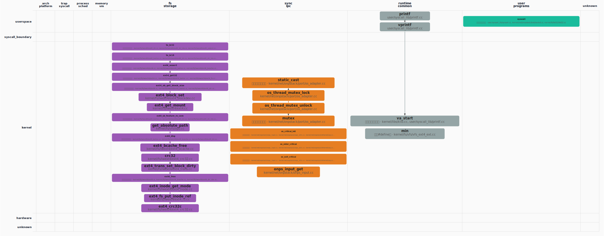

## Call Graph 概览

### 函数级 Call Graph（PageRank Top-30，图示 30 个函数）

*（图：`callgraph_overview.svg`，与报告同目录）*

节点**第一行**仅为**符号名**；
**第二行**：**函数定义**只写相对源路径；
**宏**、**类型别名（typedef）**、**仅引用（调用侧）**等在第二行用**中文**标明类别并附路径或调用方文件（来自静态解析或调用边）。

