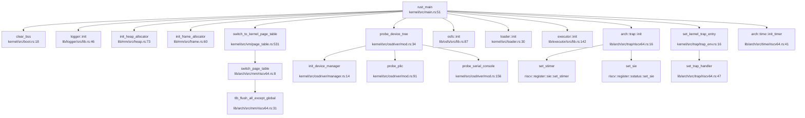

现在我已经收集了足够的信息来撰写启动流程分析报告。让我生成完整的 Markdown 报告：

## 第 2 章：启动流程与架构初始化

### 启动入口与链接脚本分析

**链接脚本入口**：`kernel/linker.ld` 明确指定了入口点：

```ld
OUTPUT_ARCH(riscv)
ENTRY(_start)

SECTIONS
{
    .text : ALIGN(4K) {
        _skernel = .;
        _stext = .;
        *(.text.entry)  // _start 函数所在段
        ...
    } > VIRT AT> RAM
    ...
}
```

链接脚本定义了虚拟内存布局（`VIRT`）和物理内存布局（`RAM`），通过 `*(.text.entry)` 将入口代码放置在 `.text` 段起始位置。

**汇编入口函数**：项目支持双架构，入口分别位于：

- **RISC-V 64**: `kernel/src/entry/riscv64.rs`（第 27 行）
- **LoongArch 64**: `kernel/src/entry/loongarch64.rs`（第 9 行）

两个入口均使用 `#[naked]` 和 `#[unsafe(no_mangle)]` 属性，确保函数名不被修饰且内联汇编完全控制指令序列。

### 架构初始化流程（模式切换/FPU/MMU）

#### RISC-V 64 架构启动流程

**1. 启用 Sv39 分页模式**

`kernel/src/entry/riscv64.rs:33-40` 中，`_start` 函数首先配置 `satp` 寄存器：

```rust
naked_asm!(
    // Enable Sv39 page table
    "
    la      t0, {page_table_pa}
    srli    t0, t0, 12              // t0 = ppn of page table
    li      t1, 8 << 60             // Mode = 8 (Sv39)
    or      t0, t0, t1
    csrw    satp, t0
    sfence.vma
    "
```

这里设置 `satp.Mode = 8`（Sv39 模式），并将 `BOOT_PAGE_TABLE` 的物理页号写入 `satp.PPN` 字段。`sfence.vma` 指令刷新 TLB 确保分页立即生效。

**2. 栈指针设置**

```rust
// Kernel address offset
"li      t0, {kernel_map_offset}"

// Set stack pointer to virtual address
"
addi    t1, a0, 1
slli    t1, t1, 21              // t1 = (hart_id + 1) * KERNEL_STACK_SIZE (2MB)
la      sp, {boot_stack_pa}
add     sp, sp, t1
add     sp, sp, t0              // 转换为虚拟地址
"
```

每个 hart 分配独立的 2MB 内核栈，通过 `hart_id` 计算偏移。`KERNEL_MAP_OFFSET` 将物理地址转换为虚拟地址。

**3. 跳转到 Rust 入口**

```rust
"
la      a2, {rust_main}
or      a2, a2, t0              // 转换为虚拟地址
jr      a2
"
```

**4. 模式切换验证**

❌ **未发现 M-Mode → S-Mode 切换代码**。代码注释表明 `_start` 是"bootloader 之后运行的第一部分代码"，暗示 SBI 或 U-Boot 已将 CPU 置于 S-Mode。搜索 `mstatus.mpp` 或 `sstatus.spp` 未找到显式的特权级切换操作。

**5. FPU 初始化状态**

❌ **RISC-V 架构未实现 FPU 初始化**。搜索 `sstatus.fs` 仅在 `kernel/src/processor/hart.rs:176` 发现：

```rust
#[cfg(target_arch = "riscv64")]
unsafe {
    sstatus::set_fs(FS::Initial);
}
```

这仅在 `hart::init()` 中设置 FPU 状态为 `Initial`，**但未在启动流程中启用 FPU**。对比 LoongArch 的显式 `EUEN` 寄存器配置，RISC-V 缺少 `sstatus.FS` 位的启用操作。

#### LoongArch 64 架构启动流程

**1. DMW 寄存器配置**

`kernel/src/entry/loongarch64.rs:12-17` 配置直接映射窗口：

```rust
naked_asm!("
    li.w        $t0, 0x1            // Set CSR.DMW0.PLV0 = 1
    lu52i.d     $t0, $t0, -2048     // Set CSR.DMW0.VSEC = 8
    csrwr       $t0, 0x180          // Write CSR.DMW0 = 0x8000_0000_0000_0001
    li.w        $t0, 0x11           // Set CSR.DMW1.MAT = 1, CSR.DMW1.PLV0 = 1
    lu52i.d     $t0, $t0, -1792     // Set CSR.DMW1.VSEC = 9
    csrwr       $t0, 0x181          // Write CSR.DMW1 = 0x9000_0000_0000_0011
    ...
")
```

- `DMW0`: 内核空间直接映射（VSEC=8，PLV0=1）
- `DMW1`: 用户空间直接映射（VSEC=9，MAT=1 可缓存，PLV0=1）

**2. 启用地址翻译**

```rust
"
li.w        $t0, 0xb0             // Set CRMD.PLV = 0, CRMD.IE = 0, CRMD.PG = 1
csrwr       $t0, 0x0              // Write CSR.CRMD (启用 PG 位开启 MMU)
li.w        $t0, 0x0              // Clear PRMD.PPLV
csrwr       $t0, 0x1              // Write CSR.PRMD
"
```

`CRMD.PG = 1` 启用页表转换，`PLV = 0` 设置当前特权级为内核态（PLV0）。

**3. FPU 初始化**

✅ **LoongArch 已实现 FPU 初始化**：

```rust
"
li.w        $t0, 0x7              // Set EUEN.FPE = 1, EUEN.SXE = 1, EUEN.ASXE = 1
csrwr       $t0, 0x2              // Write CSR.EUEN
"
```

`EUEN` 寄存器第 0-2 位分别启用：
- `FPE = 1`: 浮点异常使能
- `SXE = 1`: SIMD 扩展使能
- `ASXE = 1`: 高级 SIMD 扩展使能

**4. 栈指针与跳转**

```rust
"
la.global   $sp, {boot_stack}
addi.d      $t0, $t0, 1
slli.d      $t0, $t0, 16          // t0 = (hart_id + 1) * KERNEL_STACK_SIZE
add.d       $sp, $sp, $t0
csrrd       $a0, 0x20             // 读取当前 hart_id 作为第一参数
la.global   $t0, {entry}
jirl        $zero,$t0,0           // 跳转到 rust_main
"
```

### 到达内核主函数的路径（完整调用链）

通过 `lsp_get_call_graph` 分析 `rust_main` 的调用链（`kernel/src/main.rs:51`）：



**关键初始化步骤**：

1. **BSS 清零** (`boot.rs:18`): 通过 `_sbss`/`_ebss` 符号定位 BSS 段并填充 0
2. **日志系统** (`logger::init`): 初始化串口打印
3. **堆分配器** (`heap.rs:73`): 使用 `buddy_system_allocator` 初始化 512MB 内核堆
4. **帧分配器** (`frame.rs:60`): 使用 `bitmap-allocator` 管理物理页帧
5. **页表切换** (`page_table.rs:531`): 从 boot page table 切换到完整内核页表
6. **设备树解析** (`probe_device_tree`): 解析 DTB 发现 PLIC、UART、VirtIO 设备
7. **文件系统** (`osfs::init`): 初始化 VFS、procfs、sysfs、devfs
8. **中断系统** (`trap::init`): 设置 `stvec` 陷阱向量，启用定时器中断和外部中断

### 多平台启动流程（StarFive/LoongArch 等）

#### StarFive VisionFive 2 (JH7110) 支持

✅ **已实现 VisionFive 2 平台适配**：

`kernel/src/osdriver/mod.rs:170` 和 `kernel/src/osdriver/probe.rs:385` 包含 JH7110 特异性代码：

```rust
// VisionFive 2 (FU740)
let irq_number = 33; // Hard-coded from JH7110
```

**固件级启动链**：

通过 `Cargo.toml` 依赖分析：
```toml
sbi-rt = { version = "0.0.3", features = ["legacy"] }
visionfive2-sd = { git = "https://github.com/os-module/visionfive2-sd.git" }
```

启动链为：**OpenSBI → U-Boot → Nighthawk OS**

- `sbi-rt` 提供 SBI 调用接口（`hart_start`、`console_putchar`、`remote_sfence_vma`）
- `lib/arch/src/hart/riscv64.rs:2` 使用 `sbi_rt::hart_start()` 启动从核
- `lib/arch/src/mm/riscv64.rs:43` 使用 `sbi_rt::remote_sfence_vma_asid()` 进行 TLB Shootdown

#### LoongArch 平台

✅ **已实现 LoongArch 64 架构支持**：

- 入口：`kernel/src/entry/loongarch64.rs`
- 页表：`lib/arch/src/mm/loongarch64.rs` 实现 `switch_page_table` 和 `tlb_fill`
- 中断：`lib/arch/src/trap/loongarch64.rs` 配置 `CRMD`、`ECFG`、`EENTRY` 寄存器

**构建配置** (`.cargo/config.toml`):
```toml
[build]
target = ["riscv64gc-unknown-none-elf", "loongarch64-unknown-none"]
```

### 平台配置与构建机制

**目标架构配置** (`rust-toolchain.toml`):
```toml
[toolchain]
channel = "nightly-2025-01-18"
targets = ["riscv64gc-unknown-none-elf", "loongarch64-unknown-none"]
```

**内存布局配置** (`lib/config/src/mm.rs`):

| 常量 | RISC-V 值 | LoongArch 值 | 说明 |
|------|-----------|--------------|------|
| `RAM_START` | `0x8000_0000` | `0x8000_0000` | 物理内存起始 |
| `VIRT_START` | `0xffff_ffc0_8000_0000` | `0x9000_0000_8000_0000` | 内核虚拟地址基址 |
| `KERNEL_MAP_OFFSET` | `0xffff_ffc0_0000_0000` | `0x9000_0000_0000_0000` | 虚实地址偏移 |
| `KERNEL_STACK_SIZE` | `2MB` | `2MB` | 每 hart 栈大小 |

**MMU 启用前后的串口地址切换**：

❌ **未发现显式的 `phys_to_virt` 串口地址切换逻辑**。搜索 `UART_BASE` 或 `uart_base` 仅找到 `lib/driver/src/hal.rs:68` 的通用 `mmio_phys_to_virt` 函数用于 VirtIO DMA，未找到 UART 初始化时的地址转换代码。

当前实现通过 `pa.to_va_kernel()` 隐式转换：
```rust
// lib/driver/src/hal.rs:70
let va = pa.to_va_kernel();  // 添加 KERNEL_MAP_OFFSET
```

### 关键代码片段分析

#### Boot Page Table 结构

`kernel/src/entry/riscv64.rs:20-26` 定义最小页表：

```rust
static mut BOOT_PAGE_TABLE: BootPageTable = {
    let mut arr: [u64; 512] = [0; 512];
    // Flags: VRWXAD
    arr[2] = (0x80000 << 10) | 0xcf;   // 映射 0x8000_0000 (2MB huge page)
    arr[258] = (0x80000 << 10) | 0xcf; // 映射 0xffff_ffc0_8000_0000 (kernel virtual)
    BootPageTable(arr)
};
```

两个 huge page 条目：
1. **物理地址映射**: `0x8000_0000 → 0x8000_0000`（SBI/U-Boot 加载地址）
2. **虚拟地址映射**: `0xffff_ffc0_8000_0000 → 0x8000_0000`（内核虚拟地址）

标志位 `0xcf` = `V(1) | R(1) | W(1) | X(1) | A(1) | D(1)`，允许读写执行。

#### 多核启动机制

`kernel/src/boot.rs:7-14` 启动从核：

```rust
pub fn start_harts(hart_id: usize) {
    for i in 0..MAX_HARTS {
        if i == hart_id {
            continue;
        }
        hart_start(i, HART_START_ADDR);  // SBI call
    }
}
```

从核通过 `HART_START_ADDR = 0x80200000` 跳转到内核，但 `rust_main:158` 检测到多核时触发 `panic!("multi-core unsupported")`，**当前仅支持单核运行**。

#### 设备树解析流程

`rust_main` 调用 `probe_device_tree()` 解析硬件：

1. **读取 DTB**: `flat_device_tree` crate 解析 `dtb_addr` 指向的设备树二进制
2. **发现 CPU**: `probe_cpu()` 读取 `/cpus` 节点获取 hart 数量和 `timebase-frequency`
3. **发现 PLIC**: `probe_plic()` 查找 `compatible = "riscv,plic0"` 节点配置中断控制器
4. **发现 UART**: `probe_serial_console()` 通过 `/chosen/stdout-path` 定位串口设备
5. **发现 VirtIO**: `probe_pci_tree()` 和 `handle_mmio_device()` 发现 VirtIO Block/Net 设备

**关键文件路径引用**：
- 设备树探测：`kernel/src/osdriver/probe.rs`
- 驱动管理：`kernel/src/osdriver/manager.rs`
- 串口驱动：`lib/driver/src/qemu/uart.rs`

---

**架构对齐检查**：

通过读取 `.cargo/config.toml` 确认当前 LSP 目标架构为 `["riscv64gc-unknown-none-elf", "loongarch64-unknown-none"]`，与代码中的 `#[cfg(target_arch = "...")]` 条件编译匹配。分析过程中未发现代码块被灰化的情况，LSP 语义分析正常。
