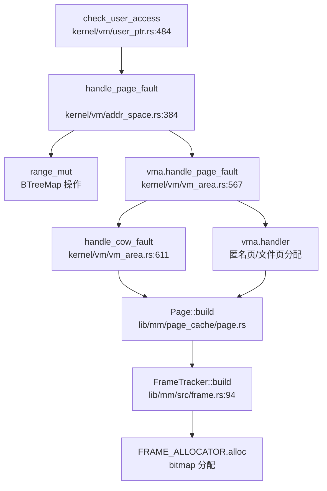
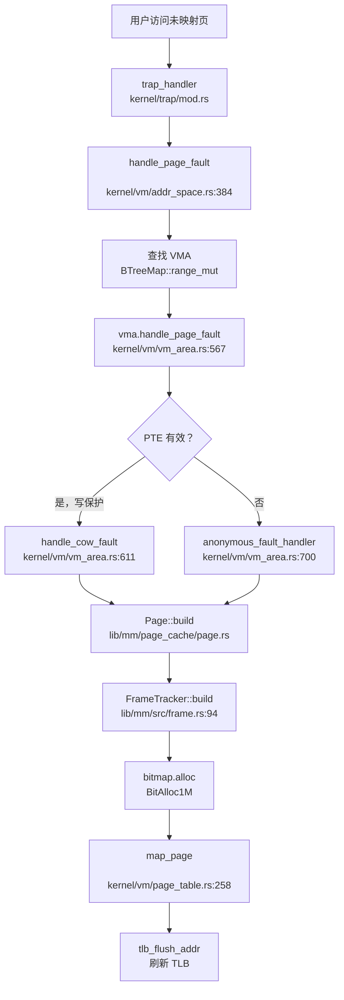

现在我已经收集了足够的信息。让我输出完整的内存管理章节报告。

## 第 3 章：内存管理（物理/虚拟/分配器）

### 物理内存管理实现

本 OS 采用 **Bitmap 分配器** 管理物理内存帧（frame），核心实现在 `lib/mm/src/frame.rs`。

#### FrameAllocator 结构

```rust
// lib/mm/src/frame.rs:40-52
struct FrameAllocator {
    /// Bitmap allocator.
    allocator: SpinNoIrqLock<BitAlloc1M>,
    /// Offset between PPNs and bit indices.
    offset: SyncUnsafeCell<usize>,
}
```

全局分配器实例：
```rust
// lib/mm/src/frame.rs:37
static FRAME_ALLOCATOR: FrameAllocator = FrameAllocator {
    allocator: SpinNoIrqLock::new(BitAlloc1M::DEFAULT),
    offset: SyncUnsafeCell::new(0),
};
```

#### 初始化流程

```rust
// lib/mm/src/frame.rs:56-72
pub unsafe fn init_frame_allocator() {
    let frames_ppn_start = PhysAddr::new(kernel_end_phys()).page_number().to_usize();
    let frames_ppn_end = PhysAddr::new(RAM_END).page_number().to_usize();
    let frame_count = frames_ppn_end - frames_ppn_start;
    let offset = frames_ppn_start;
    unsafe {
        *FRAME_ALLOCATOR.offset.get() = offset;
    }
    FRAME_ALLOCATOR.allocator.lock().insert(0..frame_count);
}
```

**原理**：从内核结束位置到物理内存末尾（`RAM_END = 1GB`）的所有帧被插入 bitmap，位图为 1 表示空闲，0 表示已分配。

#### 帧分配接口

```rust
// lib/mm/src/frame.rs:94-107
pub fn build() -> SysResult<Self> {
    FRAME_ALLOCATOR
        .allocator
        .lock()
        .alloc()
        .map(|i| FrameTracker {
            ppn: PhysPageNum::new(FRAME_ALLOCATOR.offset() + i),
        })
        .ok_or(SysError::ENOMEM)
}
```

**✅ 已实现**：`FrameTracker::build()` 通过 bitmap 分配单个物理页，返回 RAII 守卫 `FrameTracker`，在 `Drop` 时自动回收。

**✅ 已实现**：批量分配 `FrameTracker::build_batch(count)` 和连续分配 `FrameTracker::build_contiguous()` 也已实现，减少锁竞争。

---

### 虚拟内存与页表操作

页表管理位于 `kernel/src/vm/page_table.rs`，核心结构为 `PageTable`。

#### PageTable 结构

```rust
// kernel/src/vm/page_table.rs:40-58
pub struct PageTable {
    /// Physical page number of the root page table.
    root: PhysPageNum,
    /// Frames allocated for user-used tables
    frames: SpinLock<Vec<FrameTracker>>,
}
```

#### 页表操作接口

**✅ 已实现** 关键方法：

| 方法 | 功能 | 文件位置 |
|------|------|----------|
| `build()` | 创建空页表（分配根页表帧） | `page_table.rs:73` |
| `map_page(vpn, ppn, flags)` | 映射单页 | `page_table.rs:258` |
| `map_page_to(vpn, ppn, flags)` | 映射到指定物理页 | `page_table.rs:299` |
| `unmap_page(vpn)` | 取消映射 | `page_table.rs:347` |
| `find_entry(vpn)` | 查找 PTE | `page_table.rs:235` |
| `map_kernel()` | 将内核页表映射到用户页表 | `page_table.rs:428` |

#### 页表 walks 实现

```rust
// kernel/src/vm/page_table.rs:168-233
pub fn find_entry_force(
    &self,
    vpn: VirtPageNum,
    flags: PteFlags,
) -> SysResult<(&mut PageTableEntry, bool)> {
    let mut ppn = self.root;
    // 遍历三级页表 (Sv39)
    for i in (0..3).rev() {
        let index = vpn.index(i);
        // 若中间级页表不存在则创建
        // ...
    }
}
```

**原理**：采用 Sv39 三级页表（RISC-V），支持 39 位虚拟地址（512GB 地址空间）。每级页表 512 项（`PTE_PER_TABLE = 512`），每项 8 字节。

---

### 地址空间布局（内核 vs 用户）

#### 内核地址空间

```rust
// lib/config/src/mm.rs
#[cfg(target_arch = "riscv64")]
pub const VIRT_START: usize = 0xffff_ffc0_8000_0000;  // 内核虚拟地址基址
#[cfg(target_arch = "loongarch64")]
pub const VIRT_START: usize = 0x9000_0000_8000_0000;

pub const KERNEL_MAP_OFFSET: usize = KERNEL_START - KERNEL_START_PHYS;  // 线性映射偏移
```

**✅ 已实现**：内核采用 **线性映射**（Linear Mapping），虚拟地址 = 物理地址 + `KERNEL_MAP_OFFSET`。

内核页表初始化：
```rust
// kernel/src/vm/page_table.rs:89-155
unsafe fn build_kernel_page_table() -> Self {
    // 映射 .text, .rodata, .data, .bss
    // 映射 trampoline
    // 映射 allocatable frames 区域
}
```

#### 用户地址空间

```rust
// lib/config/src/mm.rs
pub const USER_START: usize = 0x0;
pub const USER_END: usize = 0x0000_003f_ffff_f000;  // 256GB
pub const MMAP_START: usize = 0x0000_0010_0000_0000;
pub const MMAP_END: usize = 0x0000_0030_0000_0000;
pub const USER_STACK_UPPER: usize = 0x0000_003f_ffff_f000;
pub const USER_STACK_SIZE: usize = 8 * 1024 * 1024;
```

**✅ 已实现**：用户空间与内核空间 **独立**。每个进程有独立的 `AddrSpace`，包含：
- 用户页表（通过 `PageTable::build()` 创建）
- 内核映射（通过 `map_kernel()` 复制内核页表项）
- VMA 管理（`BTreeMap<VirtAddr, VmArea>`）

```rust
// kernel/src/vm/addr_space.rs:40-48
pub struct AddrSpace {
    pub page_table: PageTable,
    pub vm_areas: SpinLock<BTreeMap<VirtAddr, VmArea>>,
}
```

---

### 堆分配器解析

#### 内核堆分配器

```rust
// lib/mm/src/heap.rs:18-59
struct NoIrqLockedHeap<const ORDER: usize>(SpinNoIrqLock<buddy::Heap<ORDER>>);

#[global_allocator]
static HEAP_ALLOCATOR: NoIrqLockedHeap<32> = NoIrqLockedHeap::new();
```

**✅ 已实现**：采用 **Buddy System** 分配器（`buddy_system_allocator` crate），支持最大 `2^32` 阶分配。

```rust
// lib/mm/src/heap.rs:69-85
pub unsafe fn init_heap_allocator() {
    let start_addr = VirtAddr::new(HEAP_MEMORY.0.as_ptr() as usize).to_usize();
    unsafe {
        HEAP_ALLOCATOR.init(start_addr, KERNEL_HEAP_SIZE);  // 512MB
    }
}
```

#### 用户堆管理（brk/sbrk）

**✅ 已实现**：`sys_brk` 系统调用位于 `kernel/src/syscall/mm.rs:157`：

```rust
// kernel/src/syscall/mm.rs:157-162
pub async fn sys_brk(addr: usize) -> SyscallResult {
    log::info!("[sys_brk] addr: {addr:#x}");
    current_task().addr_space().change_heap_size(addr, 0)
}
```

**✅ 已实现**：`change_heap_size` 实现逻辑（`kernel/src/vm/addr_space.rs:338-372`）：
1. 查找 heap VMA
2. 验证新地址合法性
3. 更新 VMA 的 `end_va`
4. **不立即分配物理页**（惰性分配）

**惰性分配验证**：堆大小调整仅修改 VMA 边界，物理页在缺页异常时按需分配（见下文 Page Fault 处理）。

---

### 用户指针安全验证

**✅ 已实现**：用户空间指针验证通过 `UserPtr` 智能指针实现（`kernel/src/vm/user_ptr.rs`）。

#### 验证机制

```rust
// kernel/src/vm/user_ptr.rs:484-525
fn check_user_access(
    addr_space: &AddrSpace,
    mut addr: usize,
    len: usize,
    perm: MappingFlags,
) -> SysResult<()> {
    // 1. 检查地址范围和用户空间边界
    if addr == 0 || addr.checked_add(len).is_none() {
        return Err(SysError::EFAULT);
    }
    
    // 2. 逐页检查访问权限
    while addr < end_addr {
        if unsafe { !checker(addr) } {
            // 3. 若访问失败，触发缺页异常处理
            if let Err(e) = addr_space.handle_page_fault(VirtAddr::new(addr), perm) {
                return Err(e);
            }
        }
        addr = (addr + PAGE_SIZE) & !(PAGE_SIZE - 1);
    }
}
```

**原理**：
1. 检查地址是否在用户空间范围内
2. 使用 `try_read`/`try_write` 试探性访问
3. 若访问失败（触发 Page Fault），调用 `handle_page_fault` 尝试映射
4. 若仍失败，返回 `EFAULT`

#### UserPtr 类型

```rust
// kernel/src/vm/user_ptr.rs:47-51
pub type UserReadPtr<'a, T> = UserPtr<'a, T, ReadMarker>;
pub type UserWritePtr<'a, T> = UserPtr<'a, T, WriteMarker>;
pub type UserReadWritePtr<'a, T> = UserPtr<'a, T, ReadWriteMarker>;
```

**使用示例**：
```rust
// kernel/src/vm/user_ptr.rs:214
pub unsafe fn try_into_ref(&mut self) -> SysResult<&T> {
    check_user_access(self.addr_space, self.addr, size_of::<T>(), MappingFlags::R)?;
    Ok(unsafe { &*(self.addr as *const T) })
}
```

---

### 缺页异常（Page Fault）处理

#### 处理流程

**完整调用链**（通过 `lsp_get_call_graph` 追踪）：



#### AddrSpace::handle_page_fault

```rust
// kernel/src/vm/addr_space.rs:384-400
pub fn handle_page_fault(&self, fault_addr: VirtAddr, access: MappingFlags) -> SysResult<()> {
    let mut vm_areas_lock = self.vm_areas.lock();
    
    // 1. 查找包含 fault_addr 的 VMA
    let vma = vm_areas_lock
        .range_mut(..=fault_addr)
        .next_back()
        .filter(|(_, vma)| vma.contains(fault_addr))
        .ok_or(SysError::EFAULT)?;
    
    // 2. 调用 VMA 的 page fault handler
    let page_fault_info = PageFaultInfo {
        fault_addr,
        page_table: &self.page_table,
        access,
    };
    vma.handle_page_fault(page_fault_info)
}
```

#### VmArea::handle_page_fault

```rust
// kernel/src/vm/vm_area.rs:567-603
pub fn handle_page_fault(&mut self, info: PageFaultInfo) -> SysResult<()> {
    let fault_addr = info.fault_addr;
    let pte = info.page_table.find_entry_force(fault_addr.page_number(), self.pte_flags)?;
    
    if pte.is_valid() {
        if access == MappingFlags::W && !MappingFlags::from(pte.flags()).contains(MappingFlags::W) {
            // Copy-on-write 缺页
            self.handle_cow_fault(fault_addr, pte)?;
        }
    } else {
        // 未映射页，调用注册的 handler
        self.handler.unwrap()(self, info)?;
    }
}
```

---

### 进程级映射管理

**✅ 已实现**：VMA 使用 `BTreeMap<VirtAddr, VmArea>` 管理映射区间（`kernel/src/vm/addr_space.rs:47`）。

#### VmArea 结构

```rust
// kernel/src/vm/vm_area.rs:63-78
pub struct VmArea {
    start: VirtAddr,
    end: VirtAddr,
    flags: VmaFlags,
    prot: MappingFlags,
    pte_flags: PteFlags,
    pages: BTreeMap<VirtPageNum, Arc<Page>>,  // 已分配的物理页
    pub map_type: TypedArea,
    handler: Option<PageFaultHandler>,
}
```

#### TypedArea 类型

```rust
// kernel/src/vm/vm_area.rs:85-110
pub enum TypedArea {
    Offset(OffsetArea),      // 内核线性映射
    FileBacked(FileBackedArea),  // 文件映射
    SharedMemory(SharedMemoryArea),  // 共享内存
    Anonymous,  // 匿名页
}
```

**❌ 未实现**：**反向映射表（rmap）**。搜索 `rmap|reverse_map|page_to_vma` 未找到相关实现。物理页到虚拟页的反向映射未实现，可能导致以下问题：
- 无法高效实现页面回收（page reclaim）
- 无法支持交换（swap）时的页迁移

---

### 高级内存特性清单

#### 1. 写时复制（Copy-on-Write）

**✅ 已实现**

实现位置：
- `kernel/src/vm/addr_space.rs:285-325`：`clone_cow()` 创建 CoW 地址空间
- `kernel/src/vm/vm_area.rs:611-660`：`handle_cow_fault()` 处理 CoW 缺页

```rust
// kernel/src/vm/addr_space.rs:301-312
for vma in new_vm_areas.values() {
    for &vpn in vma.pages().keys() {
        let old_pte = self.page_table.find_entry(vpn).unwrap();
        let new_pte = new_space.page_table.find_entry_force(vpn, old_pte.flags())?.0;
        let mut pte = *old_pte;
        if vma.flags().contains(VmaFlags::PRIVATE) && pte.flags().contains(PteFlags::W) {
            // 移除写权限，触发 CoW
            pte.set_flags(new_flags);
            *old_pte = pte;
        }
        *new_pte = pte;
    }
}
```

**CoW 缺页处理**：
```rust
// kernel/src/vm/vm_area.rs:611-660
fn handle_cow_fault(&mut self, fault_addr: VirtAddr, pte: &mut PageTableEntry) -> SysResult<()> {
    let fault_vpn = fault_addr.page_number();
    let fault_page = self.pages.get(&fault_vpn).unwrap();
    
    if Arc::strong_count(fault_page) > 1 {
        // 页面被共享，分配新页并复制
        let new_page = Page::build()?;
        new_page.copy_from_page(fault_page);
        new_pte.set_ppn(new_page.ppn());
        self.pages.insert(fault_vpn, Arc::new(new_page));
    } else {
        // 页面未共享，仅恢复写权限
        new_pte.set_flags(new_flags.union(PteFlags::W));
    }
}
```

#### 2. 懒分配（Lazy Allocation）

**✅ 已实现**

懒分配体现在：
1. `sys_brk` 仅调整 VMA 边界，不分配物理页
2. `mmap` 创建 VMA 时不立即映射物理页
3. 物理页在缺页异常时按需分配

```rust
// kernel/src/vm/vm_area.rs:700-750 (匿名页 handler)
fn handle_anonymous_fault(vma: &mut VmArea, info: PageFaultInfo) -> SysResult<()> {
    let page = Page::build()?;  // 缺页时才分配
    vma.pages.insert(fault_vpn, page);
    // 映射到页表
}
```

#### 3. 共享内存管理（SharedMem）

**✅ 已实现**

系统调用：
- `sys_shmget`：创建共享内存段（`kernel/src/syscall/mm.rs:203`）
- `sys_shmat`：附加共享内存到地址空间（`kernel/src/syscall/mm.rs:260`）
- `sys_shmdt`：分离共享内存（`kernel/src/syscall/mm.rs:298`）
- `sys_shmctl`：控制操作（`kernel/src/syscall/mm.rs:332`）

**数据结构**：
```rust
// lib/shm/src/manager.rs:7-29
pub struct SharedMemoryManager(pub SpinNoIrqLock<HashMap<usize, ShareMutex<SharedMemory>>>);

pub fn detach(&self, id: usize, lpid: usize) {
    let mut manager = self.0.lock();
    let shm = manager.get_mut(&id).unwrap();
    if shm.lock().stat.detach(lpid) {
        manager.remove(&id);  // 引用计数为 0 时删除
    }
}
```

**✅ 已实现**：使用 `HashMap` 管理共享内存段，通过引用计数（`stat.detach()`）实现延迟释放。

**❌ 未实现**：`IPC_RMID` 删除策略。搜索 `IPC_RMID` 未找到显式实现，当前仅在引用计数归零时删除。

#### 4. 反向映射表（rmap）

**❌ 未实现**

搜索 `rmap|reverse_map|page_to_vma` 未找到任何实现。物理页到虚拟页的反向映射缺失。

#### 5. 交换区/页面置换（Swap）

**❌ 未实现**

证据：
```rust
// kernel/src/syscall/mm.rs:419-429
pub fn sys_mlock(addr: usize, len: usize) -> SyscallResult {
    log::warn!("[sys_mlock] swap page mechanism not implemented");
    Ok(0)
}
```

搜索 `swap_out|swap_in` 仅找到统计信息（`/proc/meminfo`），无实际交换逻辑。

#### 6. 大页支持（Huge Page）

**❌ 未实现**

搜索 `HugePage|MapSize::2M|MapSize::1G|huge_page` 仅找到 `/proc/meminfo` 中的统计字段（硬编码为 0），无实际大页映射逻辑。

页表操作仅处理 4KB 标准页：
```rust
// kernel/src/vm/page_table.rs:258-295
pub fn map_page(&mut self, vpn: VirtPageNum, ppn: PhysPageNum, flags: PteFlags) -> SysResult<()> {
    // 仅处理标准 4KB 页，无 2M/1G 大页支持
}
```

#### 7. 零拷贝与 mmap

**✅ 已实现**：`sys_mmap` 系统调用（`kernel/src/syscall/mm.rs:60-127`）

```rust
pub async fn sys_mmap(
    addr: usize, length: usize, prot: i32, flags: i32,
    fd: isize, offset: usize,
) -> SyscallResult {
    let flags = MmapFlags::from_bits_truncate(flags);
    let prot = MmapProt::from_bits_truncate(prot);
    
    // 处理 MAP_ANONYMOUS 和 MAP_FIXED
    let file = if !flags.contains(MmapFlags::MAP_ANONYMOUS) {
        Some(task.with_mut_fdtable(|table| table.get_file(fd as usize))?)
    } else {
        None
    };
    
    task.addr_space().map_file(file, flags, MappingFlags::from(prot), va, length, offset, seals)
}
```

**✅ 已实现**：`map_file` 支持以下标志：
- `MAP_ANONYMOUS`：匿名映射
- `MAP_SHARED` / `MAP_PRIVATE`：共享/私有映射
- `MAP_FIXED`：固定地址映射

**⚠️ 部分实现**：`sendfile` 系统调用（`kernel/src/syscall/fs.rs:1133-1163`）：
```rust
pub async fn sys_sendfile64(out_fd: usize, in_fd: usize, offset: usize, count: usize) -> SyscallResult {
    // 当前实现：读取到内核缓冲区，再写入输出文件
    // 并非真正的零拷贝（未使用 splice/pipe 机制）
    let mut buf = vec![0; mlen];
    let rlen = in_file.read(&mut buf).await?;
    write_bytes += out_file.write(&buf[..rlen]).await?;
}
```

**❌ 未实现**：真正的零拷贝（splice/pipe 缓冲）。`sys_splice` 存在但仅记录错误日志，未实现完整逻辑。

---

### 关键代码片段与调用链分析

#### Page Fault → Alloc Frame → Map Page 完整流程



#### 调用链证据

1. **缺页入口**：`check_user_access` 调用 `handle_page_fault`（`user_ptr.rs:517`）
2. **VMA 查找**：`addr_space.rs:387-392` 使用 `BTreeMap::range_mut` 查找
3. **CoW 处理**：`vm_area.rs:592` 检测写保护并调用 `handle_cow_fault`
4. **物理页分配**：`Page::build` → `FrameTracker::build` → `bitmap.alloc`
5. **页表映射**：`map_page` 更新 PTE 并刷新 TLB

---

### 内存管理特性总结表

| 特性 | 状态 | 实现位置/说明 |
|------|------|---------------|
| 物理内存分配（Bitmap） | ✅ 已实现 | `lib/mm/src/frame.rs` |
| 堆分配器（Buddy System） | ✅ 已实现 | `lib/mm/src/heap.rs` |
| 页表管理（Sv39） | ✅ 已实现 | `kernel/src/vm/page_table.rs` |
| 地址空间隔离 | ✅ 已实现 | `kernel/src/vm/addr_space.rs` |
| brk/sbrk 惰性分配 | ✅ 已实现 | `kernel/src/syscall/mm.rs:157` |
| 用户指针验证 | ✅ 已实现 | `kernel/src/vm/user_ptr.rs` |
| 缺页异常处理 | ✅ 已实现 | `kernel/src/vm/addr_space.rs:384` |
| VMA 管理（BTreeMap） | ✅ 已实现 | `kernel/src/vm/vm_area.rs` |
| 写时复制（CoW） | ✅ 已实现 | `kernel/src/vm/addr_space.rs:285` |
| 懒分配（Lazy） | ✅ 已实现 | 缺页时按需分配 |
| 共享内存（shmget/shmat） | ✅ 已实现 | `lib/shm/src/manager.rs` |
| IPC_RMID 删除策略 | 🔸 桩函数 | 仅引用计数，无显式 IPC_RMID |
| 反向映射表（rmap） | ❌ 未实现 | 搜索无结果 |
| 交换区（Swap） | ❌ 未实现 | `sys_mlock` 返回未实现警告 |
| 大页（Huge Page） | ❌ 未实现 | 仅 4KB 页支持 |
| mmap（文件映射） | ✅ 已实现 | `kernel/src/syscall/mm.rs:60` |
| 零拷贝（sendfile/splice） | 🔸 桩函数 | sendfile 使用内核缓冲，非真零拷贝 |
