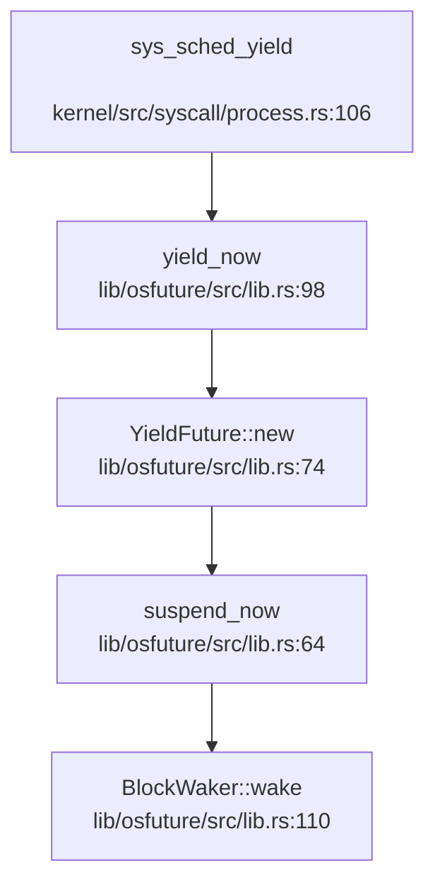
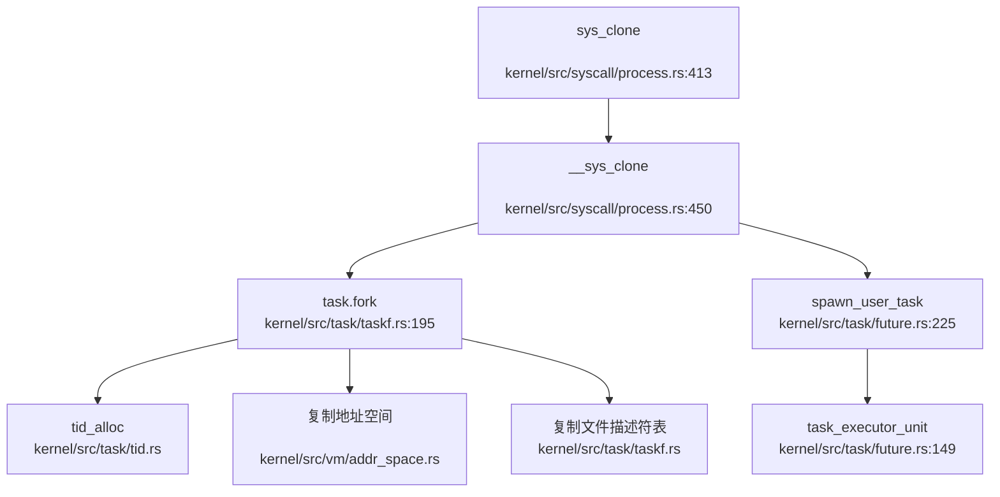
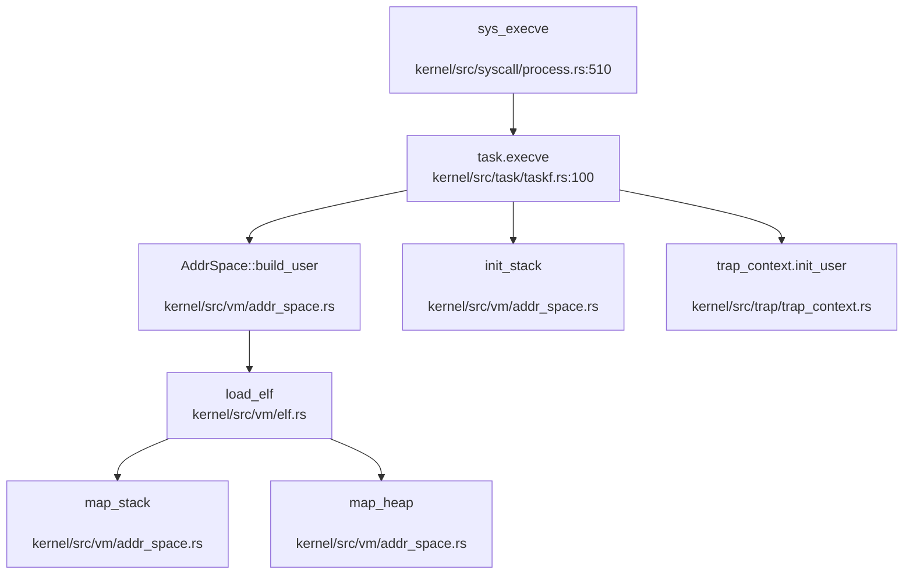
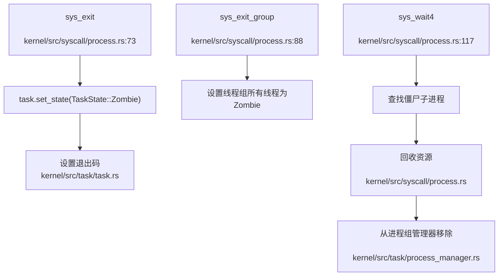

现在我已经收集了足够的信息来生成完整的分析报告。让我整理所有信息并生成最终报告。

## 第 4 章：进程/线程与调度机制

### ## 任务模型与核心数据结构

#### Task 结构体定义
在 `kernel/src/task/task.rs:69` 中定义了核心的 `Task` 结构体，它统一了进程和线程的概念：

```rust
pub struct Task {
    // 标识信息
    tid: TidHandle,                    // 线程ID（如果是进程，则也是PID）
    process: Option<Weak<Task>>,       // 所属进程（线程才有）
    is_process: bool,                  // 是否为进程
    
    // 线程组管理
    threadgroup: ShareMutex<ThreadGroup>, // 线程组（包含所有线程）
    
    // 执行上下文
    trap_context: SyncUnsafeCell<TrapContext>, // 用户/内核切换上下文
    timer: SyncUnsafeCell<TaskTimeStat>,      // 时间统计
    
    // 调度相关
    waker: SyncUnsafeCell<Option<Waker>>,     // 异步唤醒器
    state: SpinNoIrqLock<TaskState>,          // 任务状态
    
    // 内存管理
    addr_space: SyncUnsafeCell<Arc<AddrSpace>>, // 地址空间
    shm_maps: ShareMutex<BTreeMap<VirtAddr, usize>>, // 共享内存映射
    
    // 进程关系
    parent: ShareMutex<Option<Weak<Task>>>,   // 父进程
    children: ShareMutex<BTreeMap<Tid, Arc<Task>>>, // 子进程
    
    // 退出管理
    exit_code: SpinNoIrqLock<i32>,            // 退出码
    pub exit_signal: SpinNoIrqLock<Option<u8>>, // 退出信号
    
    // 信号处理
    sig_mask: SyncUnsafeCell<SigSet>,         // 信号掩码
    sig_handlers: ShareMutex<SigHandlers>,    // 信号处理器
    sig_manager: SyncUnsafeCell<SigManager>,  // 信号管理器
    sig_stack: SyncUnsafeCell<SignalStack>,   // 信号栈
    sig_cx_ptr: AtomicUsize,                  // 信号上下文指针
    
    // 文件系统
    fd_table: ShareMutex<FdTable>,            // 文件描述符表
    cwd: ShareMutex<Arc<dyn Dentry>>,         // 当前工作目录
    root: ShareMutex<Arc<dyn Dentry>>,        // 根目录
    elf: SyncUnsafeCell<Arc<dyn File>>,       // ELF文件
    
    // 其他属性
    is_syscall: AtomicBool,                   // 是否在系统调用中
    is_yield: AtomicBool,                     // 是否主动让出CPU
    itimers: ShareMutex<[ITimer; 3]>,         // 定时器
    caps: SyncUnsafeCell<Capabilities>,       // 能力集
    dumpable: AtomicBool,                     // 可转储标志
    no_new_privs: AtomicBool,                 // 无新权限标志
    pdeathsig: AtomicU32,                     // 父进程死亡信号
    vfork_parent: Option<Weak<Task>>,         // vfork父进程
    cpus_on: SyncUnsafeCell<CpuMask>,         // CPU亲和性掩码
    timers: ShareMutex<Vec<Timer>>,           // 定时器列表
    perm: ShareMutex<TaskPerm>,               // 权限信息
    name: SyncUnsafeCell<String>,             // 任务名称
}
```

#### TaskState 状态枚举
在 `kernel/src/task/task.rs:47` 中定义了任务状态机：

```rust
pub enum TaskState {
    Running,           // 运行中
    Zombie,            // 僵尸状态（已退出但未回收）
    WaitForRecycle,    // 等待回收
    Sleeping,          // 睡眠中
    Interruptible,     // 可中断睡眠
    UnInterruptible,   // 不可中断睡眠
}
```

#### TaskPerm 权限结构体
在 `kernel/src/task/task.rs:57` 中定义了任务权限信息：

```rust
pub struct TaskPerm {
    pub ruid: u32,     // 真实用户ID
    pub euid: u32,     // 有效用户ID
    pub suid: u32,     // 保存用户ID
    pub rgid: u32,     // 真实组ID
    pub egid: u32,     // 有效组ID
    pub sgid: u32,     // 保存组ID
    pub pgid: u32,     // 进程组ID
    pub sid: u32,      // 会话ID
    pub groups: Vec<u32>, // 附加组列表
}
```

#### 进程/线程区分机制
- **进程**：`is_process = true`，`process = None`，拥有独立的地址空间
- **线程**：`is_process = false`，`process = Some(Weak<Task>)`，共享进程地址空间
- **线程组**：通过 `threadgroup` 管理同一进程的所有线程

### ## 调度算法与策略（代码证据）

#### 调度器实现状态
通过分析 `kernel/src/syscall/sche.rs`，发现调度相关的系统调用**均为桩函数**：

1. **`sys_sched_getscheduler()`**：🔸 桩函数 - 仅返回 0，打印警告日志
2. **`sys_sched_getparam()`**：🔸 桩函数 - 仅返回 0，打印警告日志  
3. **`sys_sched_setscheduler()`**：🔸 桩函数 - 仅返回 0，打印警告日志
4. **`sys_sched_setaffinity()`**：✅ 已实现 - 支持 CPU 亲和性设置
5. **`sys_sched_getaffinity()`**：✅ 已实现 - 支持 CPU 亲和性查询

#### 调度策略分析
**❌ 未发现**传统的调度算法实现（FIFO、RR、Priority、Stride、CFS）。系统采用**异步任务调度模型**：

1. **基于 async/await 的协作式调度**：通过 `lib/osfuture/src/lib.rs` 中的 `yield_now()` 实现
2. **Waker 唤醒机制**：每个 Task 包含 `waker: SyncUnsafeCell<Option<Waker>>`
3. **任务执行单元**：在 `kernel/src/task/future.rs:149` 中定义 `task_executor_unit()` 异步函数

#### 调度相关调用链


> ⚠️ 以上为静态 Grep 分析结果，精度有限

### ## 任务状态机

#### 状态流转规则
从 `TaskState` 枚举和代码分析得出以下状态流转：

1. **Running → Sleeping**：通过 `sys_sched_yield()` 或等待 I/O
2. **Running → Zombie**：通过 `sys_exit()` 或 `sys_exit_group()`
3. **Sleeping → Running**：通过 Waker 唤醒或定时器到期
4. **Zombie → WaitForRecycle**：父进程调用 `sys_wait4()` 开始回收
5. **WaitForRecycle → (销毁)**：资源完全回收后任务被销毁

#### 状态设置方法
在 `kernel/src/task/taskf.rs` 中提供了状态管理方法：
- `set_state()`：设置任务状态
- `get_state()`：获取当前状态
- `is_running()`、`is_zombie()` 等状态检查方法

### ## 上下文切换实现（汇编分析）

#### TrapContext 结构体
在 `kernel/src/trap/trap_context.rs` 中定义了完整的陷阱上下文：

```rust
pub struct TrapContext {
    pub user_reg: [usize; 32],  // 通用寄存器 x0-x31
    pub sstatus: usize,         // 特权状态寄存器
    pub sepc: usize,            // 异常程序计数器
    pub k_sp: usize,            // 内核栈指针
    pub k_ra: usize,            // 内核返回地址
    pub k_s: [usize; 12],       // 被调用者保存寄存器 s0-s11
    pub k_fp: usize,            // 内核帧指针
    pub k_tp: usize,            // 线程指针
    pub last_a0: usize,         // 上次系统调用返回值
}
```

#### RISC-V 上下文切换汇编
在 `kernel/src/trap/rv_trap.s` 中实现了完整的上下文切换：

**用户态到内核态切换** (`__trap_from_user`)：
1. 通过 `csrrw sp, sscratch, sp` 交换用户栈和内核栈
2. 保存所有通用寄存器 x1-x31
3. 保存 `sstatus` 和 `sepc` 寄存器
4. 保存用户栈指针到 TrapContext
5. 加载内核栈指针和返回地址
6. 恢复内核被调用者保存寄存器 s0-s11

**内核态到用户态切换** (`__return_to_user`)：
1. 设置 `sscratch` 为 TrapContext 地址
2. 保存内核寄存器到 TrapContext
3. 恢复用户寄存器 x1-x31
4. 恢复 `sstatus` 和 `sepc`
5. 恢复用户栈指针
6. 执行 `sret` 返回用户态

#### 保存的寄存器集合
- **通用寄存器**：x1-x31（x0 恒为 0 不保存）
- **控制状态寄存器**：sstatus、sepc
- **栈指针**：用户栈 sp、内核栈 k_sp
- **返回地址**：内核返回地址 k_ra
- **被调用者保存寄存器**：s0-s11
- **帧指针和线程指针**：k_fp、k_tp

### ## 进程间通信与同步（Signal/Futex）

#### 信号机制 (Signal) ✅ 已实现
在 `kernel/src/syscall/signal.rs` 中实现了完整的信号系统：

**已实现的信号系统调用**：
1. **`sys_kill()`**：向进程发送信号
2. **`sys_sigaction()`**：设置信号处理函数
3. **`sys_sigmask()`**：设置信号掩码
4. **`sys_sigreturn()`**：从信号处理函数返回
5. **`sys_rt_sigaction()`**：实时信号处理
6. **`sys_rt_sigmask()`**：实时信号掩码
7. **`sys_tgkill()`**：向线程组发送信号
8. **`sys_tkill()`**：向特定线程发送信号
9. **`sys_rt_sigtimedwait()`**：等待信号
10. **`sys_rt_sigpending()`**：查询未决信号
11. **`sys_rt_sigsuspend()`**：临时替换信号掩码并挂起

**信号处理流程**：
1. 信号通过 `sys_kill()` 发送到目标任务
2. 信号被添加到任务的 `SigManager` 中
3. 在 `task_executor_unit()` 中调用 `sig_check()` 检查信号
4. 如果信号未被屏蔽，调用相应的信号处理函数
5. 信号处理函数执行后通过 `sys_sigreturn()` 返回

#### Futex（快速用户态互斥锁）✅ 已实现
在 `kernel/src/task/futex.rs` 和 `kernel/src/syscall/signal.rs:35` 中实现了 Futex：

**核心数据结构**：
```rust
pub struct FutexAddr {
    pub addr: VirtAddr,    // Futex 变量地址
    _guard: SumGuard,      // 内存访问保护
}

pub struct FutexManager {
    waiters: SpinNoIrqLock<HashMap<FutexKey, Vec<FutexWaiter>>>,
}
```

**支持的操作**：
1. **FUTEX_WAIT**：在 futex 变量上等待
2. **FUTEX_WAKE**：唤醒等待的线程
3. **FUTEX_REQUEUE**：将等待者重新排队到另一个 futex
4. **FUTEX_CMP_REQUEUE**：带条件检查的重新排队
5. **FUTEX_WAKE_OP**：唤醒并执行操作

**实现特点**：
- 支持私有和共享 futex
- 支持超时等待
- 完整的等待队列管理

#### 等待队列 ✅ 已实现
在 `kernel/src/task/wait_queue.rs` 中实现了通用的等待队列机制，用于 Futex 和其他同步原语。

### ## 关键流程追踪（Fork/Exec/Schedule/Exit）

#### Fork/Clone 流程追踪


**Fork 实现细节**：
1. **地址空间复制**：根据 `CLONE_VM` 标志决定是否共享地址空间
   - 如果 `CLONE_VM` 未设置，使用 Copy-on-Write 复制地址空间
   - 如果 `CLONE_VM` 设置，共享父进程地址空间
2. **文件描述符复制**：根据 `CLONE_FILES` 标志决定是否共享文件表
3. **信号处理复制**：根据 `CLONE_SIGHAND` 标志决定是否共享信号处理器
4. **线程组管理**：线程加入父进程的线程组，进程创建新的线程组
5. **权限继承**：复制父进程的权限信息

#### Exec 流程追踪


**Exec 实现细节**：
1. **ELF 加载**：解析 ELF 文件，加载代码段、数据段
2. **地址空间重建**：创建全新的用户地址空间
3. **栈初始化**：设置用户栈，压入参数和环境变量
4. **堆映射**：建立初始的堆区域
5. **上下文重置**：初始化 TrapContext，设置入口点和栈指针
6. **资源清理**：关闭 close-on-exec 的文件描述符，重置信号处理器

#### Schedule/Yield 流程
**调度触发方式**：
1. **主动让出**：通过 `sys_sched_yield()` 系统调用
2. **异步等待**：通过 `yield_now().await` 在异步上下文中让出
3. **定时器到期**：通过定时器回调唤醒任务
4. **I/O 完成**：通过 Waker 机制唤醒等待 I/O 的任务

**调度决策**：❌ 未发现优先级调度或时间片轮转机制，采用简单的协作式调度。

#### Exit 流程追踪


**退出处理**：
1. **单个线程退出**：`sys_exit()` 仅终止调用线程
2. **线程组退出**：`sys_exit_group()` 终止整个线程组
3. **资源回收**：父进程通过 `sys_wait4()` 回收子进程资源
4. **进程组清理**：从 `PROCESS_GROUP_MANAGER` 中移除已退出的进程

### ## 进程/线程管理模块扩展

#### 进程组管理 ✅ 已实现
在 `kernel/src/task/process_manager.rs` 中实现了进程组管理器：

**核心功能**：
1. **进程组创建**：`add_group()` - 创建以指定任务为组长的进程组
2. **进程加入**：`add_process()` - 将进程添加到现有进程组
3. **进程组查询**：`get_group()` - 获取进程组所有成员
4. **进程移除**：`remove()` - 从进程组中移除进程

**PGID 分配规则**：进程组ID（PGID）等于组长进程的PID。

#### 会话管理 ❌ 未实现
