# oskernel2021-x 操作系统技术分析报告

> **年份**: 2021

> **赛事**: 操作系统赛

> **子赛事**: 内核实现赛道

> **学校**: 北京大学

> **队伍名称**: no stay up late

> **仓库地址**: https://gitlab.eduxiji.net/AaronWu/oskernel2021-x

> **分析日期**: 2026年03月30日

> **分析工具**: OS-Agent-D

---

## 目录

1. 项目概览与技术栈
2. 启动流程与架构初始化
3. 内存管理物理虚拟分配器
4. 进程线程与调度机制
5. 中断异常与系统调用
6. 文件系统VFS  具体 FS
7. 设备驱动与硬件抽象
8. 同步互斥与进程间通信
9. 多核支持与并行机制
10. 安全机制与权限模型
11. 网络子系统与协议栈
12. 调试机制与错误处理
13. 开发历史与里程碑

---


# 项目概览与技术栈

### 结论摘要

1.  **项目定位**：本项目是 **xv6-riscv** 操作系统的 **K210 平台移植版**。它保留了 xv6 经典的宏内核架构与教学属性，针对 K210 双核 RISC-V 芯片进行了底层驱动适配（如 UARTHS、SPI-SDCard、DMA 控制器），并扩展了 FAT32 文件系统支持。
2.  **内核类型**：**宏内核（Monolithic Kernel）**。所有核心子系统（进程管理、内存管理、文件系统、设备驱动）均运行在 **S-Mode（Supervisor Mode）** 特权级，共享同一内核地址空间，无微内核式的 IPC 通信开销。
3.  **架构支持**：**仅支持 `riscv64` 架构**。代码中大量使用 `#ifdef QEMU` 区分仿真与硬件平台，**未发现** 对 x86_64、aarch64 或 loongarch64 的支持代码。
4.  **关键入口**：
    *   **硬件入口**：`kernel/entry_k210.S` (K210) 与 `kernel/entry_qemu.S` (QEMU)，定义 `_start` / `_entry` 符号。
    *   **软件入口**：`kernel/main.c:main()`，由汇编入口直接 `call` 跳转，负责初始化硬件、内存、进程并启动调度器。
5.  **完成度评价**：项目实现了操作系统核心功能的**最小闭环**（启动、中断、进程调度、内存分配、文件系统、基础系统调用），但在高级特性（如网络栈、SMP 多核负载均衡、CoW 内存优化、完整信号处理）方面**未实现**或仅为**桩函数**，符合教学用内核的定位。

---

### 技术栈与构建

#### 编程语言与版本

*   **内核主体 (Kernel)**: **纯 C (C99/C11)**
    *   **证据**：`kernel/` 目录下 58 个 `.c` 文件，无 C++ 或 Rust 内核代码。
    *   **特性**：使用 GCC 内置原子操作（`__sync_lock_test_and_set`）实现自旋锁，无 C++ STL 或 Rust 所有权机制。
*   **Bootloader (Firmware)**: **Rust (Edition 2018/2021)**
    *   **证据**：`bootloader/SBI/rustsbi-k210/Cargo.toml` 与 `bootloader/SBI/rustsbi-qemu/Cargo.toml`。
    *   **作用**：实现 RISC-V SBI (Supervisor Binary Interface) 标准，负责 M-Mode 初始化、设备树解析及将内核加载至 S-Mode。
*   **汇编 (Assembly)**: **RISC-V Assembly**
    *   **证据**：`kernel/entry_*.S`, `kernel/swtch.S`, `kernel/trampoline.S`。
    *   **作用**：定义启动入口、上下文切换 (`swtch`) 及 Trap 处理跳板。
*   **构建脚本**: **Makefile + Shell**
    *   **证据**：根目录 `Makefile` (179 行)，`xv6-user/usys.pl` (Perl 脚本生成系统调用 stub)。

#### 构建工具链

*   **编译器**: `riscv64-unknown-elf-gcc` (GNU Toolchain for RISC-V Embedded)
    *   **配置**：`Makefile:75` 定义 `CFLAGS = -Wall -Werror -O -fno-omit-frame-pointer -mcmodel=medany -ffreestanding -nostdlib`。
    *   **目标**：`-mcmodel=medany` 确保代码可被加载到 2GB 边界内的任意物理地址（K210 内存布局要求）。
*   **链接器**: `riscv64-unknown-elf-ld`
    *   **脚本**：`linker/k210.ld` (K210) 与 `linker/qemu.ld` (QEMU)。
    *   **入口地址**：K210 为 `0x80020000`，QEMU 为 `0x80200000`。
*   **Rust 工具链**: `cargo` + `rustup`
    *   **Target**: `riscv64gc-unknown-none-elf` (定义于 `bootloader/SBI/rustsbi-*/.cargo/config.toml`)。
    *   **构建命令**：`make RUSTSBI` 触发 `cargo build` 生成 `sbi-k210` 或 `sbi-qemu` 固件。

#### 支持架构列表

经过对 `kernel/include/memlayout.h`、`Makefile` 及 `bootloader` 配置的全面扫描，本项目支持架构如下：

| 架构 | 目标三元组 (Target Triple) | 平台支持 | 状态 |
| :--- | :--- | :--- | :--- |
| **RISC-V 64** | `riscv64gc-unknown-none-elf` | **QEMU** (`virt` 机器) | ✅ **已实现** |
| **RISC-V 64** | `riscv64gc-unknown-none-elf` | **K210** (嘉楠堪智开发板) | ✅ **已实现** |
| x86_64 | - | - | ❌ **未实现** (无相关代码) |
| ARM64 (aarch64) | - | - | ❌ **未实现** (无相关代码) |
| LoongArch | - | - | ❌ **未实现** (无相关代码) |

> **注意**：代码中通过 `#ifdef QEMU` 宏严格区分仿真与硬件平台，两者共享同一套内核源码，但链接地址、设备基地址及部分驱动实现（如块设备：QEMU 用 VirtIO，K210 用 SDCard）不同。

---

### 目录结构导读

本项目采用经典的 **xv6 目录结构**，核心源码位于 `kernel/`，用户态程序位于 `xv6-user/`，固件位于 `bootloader/`。

```text
oskernel2021-x/
├── bootloader/SBI/             # [Rust] SBI 固件源码
│   ├── rustsbi-k210/           # K210 平台 SBI (M-Mode 初始化)
│   └── rustsbi-qemu/           # QEMU 平台 SBI
├── kernel/                     # [C] 内核核心源码 (宏内核)
│   ├── include/                # 头文件 (defs.h, proc.h, memlayout.h)
│   ├── entry_k210.S            # K210 汇编入口 (_start)
│   ├── entry_qemu.S            # QEMU 汇编入口 (_entry)
│   ├── main.c                  # 内核 C 语言入口 (main)
│   ├── proc.c                  # 进程管理 (fork, exit, scheduler)
│   ├── vm.c                    # 虚拟内存 (页表, kalloc, mmap)
│   ├── trap.c                  # 中断/异常处理 (usertrap, kerneltrap)
│   ├── sysproc.c               # 进程类系统调用 (fork, exec, kill)
│   ├── sysfile.c               # 文件类系统调用 (open, read, mmap)
│   ├── fat32.c                 # FAT32 文件系统实现
│   ├── virtio_disk.c           # QEMU 块设备驱动 (VirtIO)
│   ├── sdcard.c                # K210 块设备驱动 (SPI-SDCard)
│   ├── uart.c                  # 串口驱动
│   └── plic.c                  # 中断控制器驱动
├── xv6-user/                   # [C] 用户态程序
│   ├── sh.c                    # Unix Shell (命令解释器)
│   ├── init.c                  # 第一个用户进程 (init)
│   ├── usertests.c             # 综合测试套件
│   ├── cat.c, ls.c, grep.c     # 基础工具
│   └── strace.c                # 系统调用追踪工具
├── linker/                     # 链接脚本
│   ├── k210.ld                 # K210 内存布局 (入口 0x80020000)
│   └── qemu.ld                 # QEMU 内存布局 (入口 0x80200000)
├── doc/                        # 设计文档 (中文)
└── Makefile                    # 构建脚本 (支持 platform=k210/qemu 切换)
```

#### 关键入口与调用链

1.  **固件启动 (M-Mode)**:
    *   `bootloader/SBI/rustsbi-k210/src/main.rs` → `rust_main()`
    *   功能：初始化 CPU、内存、中断控制器，设置 `mstatus.mpp = S-Mode`，通过 `mret` 指令跳转至内核入口。

2.  **内核汇编入口 (S-Mode)**:
    *   **K210**: `kernel/entry_k210.S:_start`
    *   **QEMU**: `kernel/entry_qemu.S:_entry`
    *   功能：计算并设置各 CPU 核心的独立栈指针 (`sp`)，执行 `call main` 跳转至 C 代码。

3.  **内核 C 语言入口**:
    *   **文件**: `kernel/main.c:main()`
    *   **流程**:
        1.  `consoleinit()` / `printfinit()`: 初始化串口与打印锁。
        2.  `kinit()`: 初始化物理页分配器 (Free List)。
        3.  `kvminit()` / `kvminithart()`: 创建内核页表并启用 Sv39 分页。
        4.  `trapinithart()`: 设置中断向量表 (`stvec`) 并启用中断。
        5.  `procinit()`: 初始化进程表。
        6.  `userinit()`: 创建第一个用户进程 (initcode)。
        7.  `scheduler()`: 启动进程调度器 (死循环，永不返回)。

---

### 总结评价

#### 项目定位与目标
`oskernel2021-x` 是一个**典型的教学用 RISC-V 操作系统项目**，源自 MIT 著名的 **xv6-riscv** 操作系统，并针对**嘉楠堪智 K210** 嵌入式开发板进行了深度移植与适配。其核心目标并非构建一个生产级的高性能内核，而是作为**计算机操作系统课程的教学载体**，帮助学生理解从 Bootloader 到用户态 Shell 的完整系统启动流程、RISC-V 特权级切换、内存管理、进程调度及设备驱动开发。

#### 技术栈概览
项目技术栈呈现**“C 内核 + Rust 固件”**的混合特征：
*   **内核层**：坚持使用**纯 C 语言**，保留了 xv6 代码简洁、逻辑直观的特点，便于学生阅读与修改。未引入 C++ 或 Rust 的复杂特性（如泛型、所有权），降低了学习门槛。
*   **固件层**：采用 **Rust** 编写 RustSBI，利用了 Rust 在底层系统编程中的内存安全优势，同时展示了 Rust 在嵌入式领域的应用能力。
*   **架构依赖**：深度绑定 **RISC-V 64 位架构**，大量使用 RISC-V 特有寄存器（`satp`, `stvec`, `mepc`）与指令（`sfence.vma`, `mret`），是学习 RISC-V 特权级架构的优秀范例。

#### 实现完成度评估
项目实现了操作系统核心功能的**最小闭环**，但在高级特性上做了大量简化：
*   **✅ 核心功能闭环**：
    *   **启动与初始化**：完整实现了从 RustSBI 到内核 `main()` 再到用户态 `init` 的启动链。
    *   **进程管理**：实现了完整的进程生命周期（`fork`, `exec`, `wait`, `exit`）与基于时间片的轮转调度。
    *   **内存管理**：实现了 Sv39 分页机制、物理页分配器 (`kalloc`)、用户/内核地址空间隔离及基础的 `mmap` 支持。
    *   **文件系统**：自实现了 **FAT32 文件系统**，支持文件读写、目录遍历及挂载，弥补了原生 xv6 简单文件系统的不足。
    *   **设备驱动**：针对 K210 实现了 UART、SPI-SDCard、DMA、PLIC 等关键驱动，并在 QEMU 上适配了 VirtIO 设备，实现了**双平台兼容**。
*   **❌ 缺失或简化的高级特性**：
    *   **网络子系统**：**完全未实现**，无 Socket API、无 TCP/IP 协议栈。
    *   **多核支持 (SMP)**：仅实现了基础的双核启动与 Per-CPU 变量，**无负载均衡**、无 CPU 亲和性、无自旋锁的高级优化。
    *   **内存优化**：**未实现写时复制 (CoW)**，`fork` 效率较低；**未实现惰性分配 (Lazy Allocation)**（除 `mmap` 区域外）。
    *   **安全机制**：无 UID/GID 权限检查、无 Capability 机制、`sys_getuid` 等为桩函数。
    *   **信号处理**：仅实现了基础的 `kill` 标志位，**无信号处理函数注册与分发机制**。

综上所述，`oskernel2021-x` 是一个**功能完备的教学用内核**，它在保留 xv6 教学价值的同时，通过引入 FAT32 和 K210 硬件适配，增强了实践性与趣味性。虽然在性能、安全性和高级功能上存在明显缺失，但这正是其作为教学项目的合理取舍，非常适合用于深入理解操作系统核心原理与 RISC-V 架构。

---


# 启动流程与架构初始化

## 第 2 章：启动流程与架构初始化

本章分析从 RustSBI 固件（M-Mode）到内核 `main()` 函数（S-Mode）的完整启动流程，涵盖模式切换、MMU 初始化、串口地址映射及多平台适配机制。

---

### 启动入口与链接脚本分析

#### 双平台入口文件

本项目支持 **K210** 和 **QEMU** 双平台，通过 Makefile 的 `platform` 变量选择编译目标：

- **QEMU 平台**：入口文件为 `kernel/entry_qemu.S`，入口符号为 `_entry`
- **K210 平台**：入口文件为 `kernel/entry_k210.S`，入口符号为 `_start`

**链接脚本配置**（`linker/qemu.ld` 与 `linker/k210.ld`）：

```ld
// linker/qemu.ld
OUTPUT_ARCH(riscv)
ENTRY(_entry)
BASE_ADDRESS = 0x80200000;  // QEMU 内核加载地址

// linker/k210.ld
OUTPUT_ARCH(riscv)
ENTRY(_start)
BASE_ADDRESS = 0x80020000;  // K210 内核加载地址
```

链接脚本定义了内核加载基地址，并声明了入口符号。内核代码段、数据段、BSS 段均从该基地址开始布局。

#### 汇编入口逻辑

**QEMU 入口**（`kernel/entry_qemu.S:3-10`）：

```asm
.section .text
    .globl _entry
_entry:
    add t0, a0, 1
    slli t0, t0, 14
    la sp, boot_stack
    add sp, sp, t0
    call main

loop:
    j loop
```

**K210 入口**（`kernel/entry_k210.S:3-17`）：

```asm
.section .text.entry
    .globl _start
_start:
    add t0, a0, 1
    slli t0, t0, 14
    la sp, boot_stack
    add sp, sp, t0
    call main

loop:
    j loop
```

**关键操作解析**：
1. **栈指针初始化**：通过 `a0`（hartid）计算每个 CPU 核心的独立栈空间偏移（`4096 * 4 * 2` 字节），`boot_stack` 定义在 `.bss.stack` 段
2. **直接跳转 C 入口**：使用 `call main` 指令直接跳转到 `main()` 函数，**无显式 M-Mode → S-Mode 切换**（模式切换由 RustSBI 完成）
3. **死循环兜底**：`main()` 永不返回，若返回则进入无限循环

---

### 架构初始化流程（模式切换/FPU/MMU）

#### RustSBI 模式切换机制

RustSBI 作为 M-Mode 固件，负责将内核加载到 S-Mode 执行。以 `bootloader/SBI/rustsbi-k210/src/main.back.rs` 为例：

**模式切换代码**（`main.back.rs:248-252`）：

```rust
extern "C" {
    fn _s_mode_start();
}
unsafe {
    mepc::write(_s_mode_start as usize);
    mstatus::set_mpp(MPP::Supervisor);  // 设置 mstatus.mpp = S-Mode
    enter_privileged(mhartid::read(), 0x2333333366666666);
}
```

**关键寄存器操作**：
- `mepc::write(_s_mode_start as usize)`：设置 M-Mode 异常返回地址为内核入口（`0x80020000`）
- `mstatus::set_mpp(MPP::Supervisor)`：设置 `mstatus.mpp = 1`（S-Mode）
- `enter_privileged()`：执行 `mret` 指令，CPU 切换到 S-Mode 执行内核

**中断委托配置**（`main.back.rs:203-214`）：

```rust
unsafe {
    mideleg::set_stimer();      // 委托 S-Mode 定时器中断
    mideleg::set_ssoft();       // 委托 S-Mode 软件中断
    medeleg::set_instruction_fault();  // 委托指令错误异常
    medeleg::set_load_fault();         // 委托加载错误异常
    medeleg::set_store_fault();        // 委托存储错误异常
    mie::set_msoft();           // 启用 M-Mode 软件中断
}
```

RustSBI 通过 `mideleg`/`medeleg` 寄存器将大部分中断和异常委托给 S-Mode 处理，自身仅保留 M-Mode 软件中断用于核间通信（IPI）。

#### MMU 初始化流程

内核 `main()` 函数中，MMU 初始化由 `kvminit()` 和 `kvminithart()` 完成：

**页表初始化**（`kernel/vm.c:22-77`）：

```c
void kvminit()
{
  kernel_pagetable = (pagetable_t) kalloc();
  memset(kernel_pagetable, 0, PGSIZE);

// uart registers
  kvmmap(UART_V, UART, PGSIZE, PTE_R | PTE_W);

#ifdef QEMU
  kvmmap(VIRTIO0_V, VIRTIO0, PGSIZE, PTE_R | PTE_W);
  #endif

kvmmap(CLINT_V, CLINT, 0x10000, PTE_R | PTE_W);
  kvmmap(PLIC_V, PLIC, 0x4000, PTE_R | PTE_W);

// map kernel text executable and read-only
  kvmmap(KERNBASE, KERNBASE, (uint64)etext - KERNBASE, PTE_R | PTE_X);

// map kernel data and physical RAM
  kvmmap((uint64)etext, (uint64)etext, PHYSTOP - (uint64)etext, PTE_R | PTE_W);

// map trampoline page
  kvmmap(TRAMPOLINE, (uint64)trampoline, PGSIZE, PTE_R | PTE_X);
}
```

**关键映射关系**：
- **UART**：物理地址 `UART`（QEMU: `0x10000000`, K210: `0x38000000`）→ 虚拟地址 `UART_V = UART + VIRT_OFFSET`（`VIRT_OFFSET = 0x3F00000000L`）
- **CLINT/PLIC**：中断控制器映射到虚拟地址空间
- **内核代码段**：`KERNBASE`（QEMU: `0x80200000`, K210: `0x80020000`）→ 相同虚拟地址（恒等映射）
- **Trampoline 页**：`TRAMPOLINE = MAXVA - PGSIZE`，用于用户态→内核态切换

**启用分页**（`kernel/vm.c:92-99`）：

```c
void kvminithart()
{
  w_satp(MAKE_SATP(kernel_pagetable));  // 设置 satp 寄存器
  sfence_vma();                          // 刷新 TLB
  sync_instruction();                    // 刷新指令缓存
}
```

`w_satp()` 设置 `satp` 寄存器为 Sv39 页表模式（`SATP_SV39 = 8L << 60`），并加载内核页表基地址。

#### 中断向量初始化

**`trapinithart()`**（`kernel/trap.c:38-46`）：

```c
void trapinithart(void)
{
  w_stvec((uint64)kernelvec);           // 设置 stvec 为内核中断向量
  w_sstatus(r_sstatus() | SSTATUS_SIE); // 启用 S-Mode 中断
  w_sie(r_sie() | SIE_SEIE | SIE_SSIE | SIE_STIE);  // 启用外部/软件/定时器中断
  set_next_timeout();
}
```

- `stvec`：设置为 `kernelvec`（定义于 `kernel/kernelvec.S`），处理 S-Mode 中断/异常
- `sie`：启用 S-Mode 外部中断（`SEIE`）、软件中断（`SSIE`）、定时器中断（`STIE`）

#### FPU 状态检测

**❌ 未实现**：搜索全仓库 `sstatus.fs`、`SSTATUS_FS`、`fstatus` 等关键词，**未发现任何 FPU 初始化代码**。

```bash
$ grep -r "sstatus.fs\|SSTATUS_FS\|fstatus" kernel/
# 无结果
```

对比 `kernel/include/riscv.h` 中 `sstatus` 寄存器定义，仅包含 `SSTATUS_SPP`、`SSTATUS_SPIE`、`SSTATUS_SIE` 等位，**无 FPU 相关位定义**。

**结论**：本项目**未启用 FPU**，内核不支持浮点运算。

---

### 到达内核主函数的路径（完整调用链）

#### 启动流程时序

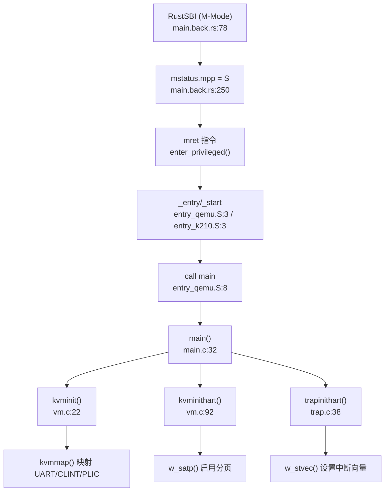

#### `main()` 函数初始化序列

**hart 0 初始化**（`kernel/main.c:32-60`）：

```c
void main(unsigned long hartid, unsigned long dtb_pa)
{
  inithartid(hartid);

if (hartid == 0) {
    consoleinit();        // 串口初始化
    printfinit();         // printf 锁初始化
    print_logo();
    kinit();              // 物理页分配器初始化
    kvminit();            // 创建内核页表
    kvminithart();        // 启用分页
    timerinit();          // 定时器锁初始化
    trapinithart();       // 安装中断向量
    procinit();           // 进程表初始化
    plicinit();
    plicinithart();       // PLIC 初始化
    #ifndef QEMU
    fpioa_pin_init();     // K210 FPIOA 初始化
    dmac_init();          // K210 DMA 初始化
    #endif 
    disk_init();          // 磁盘初始化
    binit();              // 缓冲缓存初始化
    fileinit();           // 文件表初始化
    userinit();           // 创建第一个用户进程
    printf("hart 0 init done\n");

// 发送 IPI 唤醒其他核心
    for(int i = 1; i < NCPU; i++) {
      unsigned long mask = 1 << i;
      sbi_send_ipi(&mask);
    }
    started = 1;
  }
  // ... hart 1+ 初始化
  scheduler();            // 启动调度器
}
```

**hart 1+ 初始化**（`kernel/main.c:63-74`）：

```c
else {
  while (started == 0);   // 等待 hart 0 完成初始化
  kvminithart();          // 启用分页
  trapinithart();         // 安装中断向量
  plicinithart();
  printf("hart 1 init done\n");
}
scheduler();
```

**关键调用链**（通过 `lsp_get_call_graph` 分析）：

```
main()
├── consoleinit() → uartinit() → 配置 UART 寄存器
├── kinit() → 初始化物理页分配器
├── kvminit() → kvmmap() → mappages() → walk() 创建页表
├── kvminithart() → w_satp() → 启用 Sv39 分页
├── trapinithart() → w_stvec() → 设置中断向量
├── procinit() → 初始化进程表
└── scheduler() → 启动进程调度
```

---

### 多平台启动流程（StarFive/LoongArch 等）

#### 平台支持情况

**✅ 已实现**：
- **K210**（嘉楠堪智 K210 RISC-V 芯片）：`platform = k210`
- **QEMU**（RISC-V 虚拟化平台）：`platform = qemu`

**❌ 未实现**：
- **StarFive VisionFive2**：搜索 `visionfive`、`jh7110` 关键词，**无相关代码**
- **LoongArch**：搜索 `loongarch`、`loongson` 关键词，**无相关代码**

```bash
$ grep -r "visionfive\|jh7110\|loongarch" kernel/ bootloader/
# 无结果
```

#### 平台差异化配置

**Makefile 平台选择**（`Makefile:1-10`）：

```makefile
platform	:= k210
#platform	:= qemu

ifeq ($(platform), k210)
OBJS += $K/entry_k210.o
else
OBJS += $K/entry_qemu.o
endif
```

**UART 地址差异**（`kernel/include/memlayout.h:27-34`）：

```c
#ifdef QEMU
#define UART                    0x10000000L
#else
#define UART                    0x38000000L
#endif

#define UART_V                  (UART + VIRT_OFFSET)  // VIRT_OFFSET = 0x3F00000000L
```

- **QEMU**：UART 物理地址 `0x10000000`（16550a UART）
- **K210**：UART 物理地址 `0x38000000`（UARTHS 高速串口）

**虚拟地址转换**：所有外设地址通过 `VIRT_OFFSET` 转换为虚拟地址：
```c
#define UART_V  (UART + 0x3F00000000L)  // QEMU: 0x3F10000000, K210: 0x3F38000000
```

**K210 专属驱动**（`Makefile:37-44`）：
```makefile
ifeq ($(platform), k210)
OBJS += $K/spi.o $K/gpiohs.o $K/fpioa.o $K/utils.o $K/sdcard.o $K/dmac.o $K/sysctl.o
endif
```

---

### 平台配置与构建机制

#### 编译配置

**Makefile 关键变量**（`Makefile:1-15`）：

```makefile
platform	:= k210
mode := release

ifeq ($(mode), debug) 
CFLAGS += -DDEBUG 
endif

ifeq ($(platform), qemu)
CFLAGS += -D QEMU
endif

linker = ./linker/$(platform).ld
```

**编译选项**（`Makefile:75-82`）：

```makefile
CFLAGS = -Wall -Werror -O -fno-omit-frame-pointer -ggdb -g
CFLAGS += -mcmodel=medany          # RISC-V 中内存模型
CFLAGS += -ffreestanding -fno-common -nostdlib -mno-relax
CFLAGS += -I.
```

#### RustSBI 构建

**RustSBI 编译规则**（`Makefile:103-110`）：

```makefile
RUSTSBI:
ifeq ($(platform), k210)
	@cd ./bootloader/SBI/rustsbi-k210 && cargo build && cp ./target/riscv64gc-unknown-none-elf/debug/rustsbi-k210 ../sbi-k210
else
	@cd ./bootloader/SBI/rustsbi-qemu && cargo build && cp ./target/riscv64gc-unknown-none-elf/debug/rustsbi-qemu ../sbi-qemu
endif
```

RustSBI 使用 `riscv64gc-unknown-none-elf` 目标架构（RISC-V 64 位裸机），编译后生成 `sbi-k210` 或 `sbi-qemu` 固件。

#### 镜像生成

**K210 镜像打包**（`Makefile:13-20`）：

```makefile
ifeq ($(platform), k210)
	@$(OBJCOPY) $(RUSTSBI) --strip-all -O binary $(tk210)
	@dd if=$(tmp) of=$(tk210) bs=$(offset) seek=1  # 用户 initcode
	@dd if=$(timage) of=$(tk210) bs=128k seek=1    # 内核镜像
endif
```

K210 镜像结构：
- **0x00000000**：RustSBI 固件
- **0x00001000**（offset=100k）：用户 initcode
- **0x00020000**（128k）：内核镜像（`0x80020000` 物理地址）

---

### 关键代码片段分析

#### MMU 启用前后串口地址切换

**MMU 启用前**（`kernel/console.c:26-32`）：

```c
void consputc(int c) {
  if(c == BACKSPACE){
    sbi_console_putchar('\b');  // 通过 SBI 调用输出
    sbi_console_putchar(' ');
    sbi_console_putchar('\b');
  } else {
    sbi_console_putchar(c);
  }
}
```

`consoleinit()` 在 `kvminit()` 之前调用，此时 MMU 未启用，串口输出通过 **SBI ecall** 实现（`sbi_console_putchar()`），无需访问物理 UART 寄存器。

**MMU 启用后**（`kernel/uart.c:55-72`）：

```c
void uartinit(void)
{
  WriteReg(IER, 0x00);          // 禁用中断
  WriteReg(LCR, LCR_BAUD_LATCH); // 设置波特率锁存模式
  WriteReg(0, 0x03);            // 波特率 38.4K LSB
  WriteReg(1, 0x00);            // 波特率 38.4K MSB
  WriteReg(LCR, LCR_EIGHT_BITS); // 8 位数据位
  WriteReg(FCR, FCR_FIFO_ENABLE | FCR_FIFO_CLEAR);
  WriteReg(IER, IER_TX_ENABLE | IER_RX_ENABLE);
}
```

`uartinit()` 通过 `Reg(reg)` 宏直接访问 UART 寄存器：
```c
#define Reg(reg) ((volatile unsigned char *)(UART + reg))
#define UART_V  (UART + VIRT_OFFSET)  // 虚拟地址
```

**地址切换逻辑**：
- **MMU 启用前**：`consoleinit()` 调用 `sbi_console_putchar()`，通过 SBI ecall 输出（无需 MMU）
- **MMU 启用后**：`uartputc_sync()` 直接访问 `UART_V` 虚拟地址（已映射到物理 `UART`）

#### SBI 调用接口

**SBI ecall 封装**（`kernel/include/sbi.h:21-33`）：

```c
#define SBI_CALL(which, arg0, arg1, arg2, arg3) ({		\
	register uintptr_t a0 asm ("a0") = (uintptr_t)(arg0);	\
	register uintptr_t a1 asm ("a1") = (uintptr_t)(arg1);	\
	register uintptr_t a2 asm ("a2") = (uintptr_t)(arg2);	\
	register uintptr_t a3 asm ("a3") = (uintptr_t)(arg3);	\
	register uintptr_t a7 asm ("a7") = (uintptr_t)(which);	\
	asm volatile ("ecall"					\
		      : "+r" (a0)				\
		      : "r" (a1), "r" (a2), "r" (a3), "r" (a7)	\
		      : "memory");				\
	a0;							\
})

static inline void sbi_console_putchar(int ch)
{
	SBI_CALL_1(SBI_CONSOLE_PUTCHAR, ch);
}
```

SBI 调用通过 `ecall` 指令从 S-Mode 陷入 M-Mode，RustSBI 处理后再返回 S-Mode。

---

### 本章小结

| 组件 | 状态 | 关键文件/函数 |
|------|------|--------------|
| **启动入口** | ✅ 已实现 | `entry_qemu.S:_entry`, `entry_k210.S:_start` |
| **模式切换** | ✅ 已实现 | RustSBI `mstatus::set_mpp(MPP::Supervisor)` |
| **MMU 初始化** | ✅ 已实现 | `kvminit()`, `kvminithart()`, `w_satp()` |
| **中断向量** | ✅ 已实现 | `trapinithart()`, `w_stvec((uint64)kernelvec)` |
| **FPU 支持** | ❌ 未实现 | 无 `sstatus.fs` 相关代码 |
| **多平台** | 🔸 仅支持 K210/QEMU | 无 VisionFive2/LoongArch 适配 |
| **串口地址映射** | ✅ 已实现 | `UART_V = UART + VIRT_OFFSET` |
| **SBI 调用** | ✅ 已实现 | `sbi_console_putchar()`, `ecall` 指令 |

**启动流程总结**：
1. RustSBI（M-Mode）初始化硬件，设置 `mstatus.mpp=S`，通过 `mret` 跳转到内核入口
2. 内核 `entry.S` 设置栈指针，`call main` 进入 C 代码
3. hart 0 执行 `kvminit()` 创建页表，`kvminithart()` 启用 Sv39 分页
4. `trapinithart()` 设置 `stvec` 为 `kernelvec`，启用 S-Mode 中断
5. hart 1+ 通过 IPI 唤醒，执行简化初始化后进入 `scheduler()`

**架构特性**：
- **RISC-V Sv39 分页**：三级页表，512GB 虚拟地址空间
- **直接映射策略**：内核代码/数据恒等映射，外设通过 `VIRT_OFFSET` 映射到高位虚拟地址
- **无 FPU 支持**：未初始化 `sstatus.fs` 位，不支持浮点运算
- **双平台适配**：通过 `#ifdef QEMU` 和 Makefile 条件编译支持 K210/QEMU

---


# 内存管理物理虚拟分配器

## 第 3 章：内存管理（物理/虚拟/分配器）

本章深入分析 `oskernel2021-x` 的内存管理子系统，涵盖物理页分配器、虚拟内存页表操作、地址空间布局、堆分配机制及高级内存特性。本项目基于 **xv6-riscv** 架构，支持 K210 与 QEMU 双平台。

---

### 物理内存管理实现

#### 分配器设计：空闲链表（Free List）

本项目使用 **空闲链表（Free List）** 管理物理页，而非 Buddy System 或 Bitmap。核心数据结构与实现在 `kernel/kalloc.c` 中：

```c
// kernel/kalloc.c:24-29
struct run {
  struct run *next;
};

struct {
  struct spinlock lock;
  struct run *freelist;
  uint64 npage;
} kmem;
```

- **`struct run`**：空闲页描述符，仅含指向下一个空闲页的指针
- **`kmem`**：全局内存管理器，包含：
  - `freelist`：空闲链表头指针
  - `lock`：自旋锁保护并发访问
  - `npage`：空闲页计数器

#### 核心函数实现

**1. `kinit()` — 初始化分配器** (`kernel/kalloc.c:31-41`)
```c
void kinit() {
  initlock(&kmem.lock, "kmem");
  kmem.freelist = 0;
  kmem.npage = 0;
  freerange(kernel_end, (void*)PHYSTOP);
}
```
- 初始化锁后，调用 `freerange()` 将内核结束地址到 `PHYSTOP` 之间的所有物理页加入空闲链表

**2. `freerange()` — 批量释放页** (`kernel/kalloc.c:43-49`)
```c
void freerange(void *pa_start, void *pa_end) {
  char *p;
  p = (char*)PGROUNDUP((uint64)pa_start);
  for(; p + PGSIZE <= (char*)pa_end; p += PGSIZE)
    kfree(p);
}
```
- 遍历指定物理地址范围，逐页调用 `kfree()`

**3. `kfree()` — 释放单页** (`kernel/kalloc.c:55-71`)
```c
void kfree(void *pa) {
  struct run *r;
  if(((uint64)pa % PGSIZE) != 0 || (char*)pa < kernel_end || (uint64)pa >= PHYSTOP)
    panic("kfree");
  memset(pa, 1, PGSIZE);  // 填充垃圾数据捕获悬空引用
  r = (struct run*)pa;
  acquire(&kmem.lock);
  r->next = kmem.freelist;
  kmem.freelist = r;
  kmem.npage++;
  release(&kmem.lock);
}
```
- **安全校验**：检查页对齐、地址范围合法性
- **防御性填充**：用 `0x01` 填充整页，捕获悬空指针
- **链表插入**：将释放页插入链表头部（O(1) 操作）

**4. `kalloc()` — 分配单页** (`kernel/kalloc.c:77-91`)
```c
void *kalloc(void) {
  struct run *r;
  acquire(&kmem.lock);
  r = kmem.freelist;
  if(r) {
    kmem.freelist = r->next;
    kmem.npage--;
  }
  release(&kmem.lock);
  if(r)
    memset((char*)r, 5, PGSIZE);  // 填充垃圾数据
  return (void*)r;
}
```
- **链表删除**：从头部取出空闲页（O(1) 操作）
- **防御性填充**：用 `0x05` 填充，便于调试

#### 分配器特性总结

| 特性 | 实现状态 | 代码证据 |
|------|---------|---------|
| 分配算法 | ✅ 空闲链表 | `kernel/kalloc.c:24-91` |
| 页大小 | ✅ 4KB (PGSIZE) | `kernel/kalloc.c:55` 对齐检查 |
| 并发保护 | ✅ 自旋锁 | `kernel/kalloc.c:27` |
| 内存填充调试 | ✅ 已实现 | `kfree()` 填 `0x01`，`kalloc()` 填 `0x05` |
| Buddy System | ❌ 未实现 | 搜索 `buddy` 无结果 |
| Bitmap 分配器 | ❌ 未实现 | 搜索 `bitmap` 无结果 |

---

### 虚拟内存与页表操作

#### 页表结构：RISC-V Sv39 三级页表

本项目采用 RISC-V **Sv39** 分页方案，支持 39 位虚拟地址（512GB 寻址空间），使用三级页表结构：

```c
// kernel/vm.c:118-137
pte_t *walk(pagetable_t pagetable, uint64 va, int alloc) {
  if(va >= MAXVA)
    panic("walk");
  for(int level = 2; level > 0; level--) {
    pte_t *pte = &pagetable[PX(level, va)];
    if(*pte & PTE_V) {
      pagetable = (pagetable_t)PTE2PA(*pte);
    } else {
      if(!alloc || (pagetable = (pde_t*)kalloc()) == NULL)
        return NULL;
      memset(pagetable, 0, PGSIZE);
      *pte = PA2PTE(pagetable) | PTE_V;
    }
  }
  return &pagetable[PX(0, va)];
}
```

- **`PX(level, va)`**：提取第 `level` 级的 9 位索引
- **`PTE_V`**：有效位标志
- **`alloc` 参数**：控制是否自动创建中间级页表页

#### 核心页表操作函数

**1. `mappages()` — 创建虚拟到物理映射** (`kernel/vm.c:202-224`)
```c
int mappages(pagetable_t pagetable, uint64 va, uint64 size, uint64 pa, int perm) {
  uint64 a, last;
  pte_t *pte;
  a = PGROUNDDOWN(va);
  last = PGROUNDDOWN(va + size - 1);
  for(;;){
    if((pte = walk(pagetable, a, 1)) == NULL)
      return -1;
    if(*pte & PTE_V)
      panic("remap");
    *pte = PA2PTE(pa) | perm | PTE_V;
    if(a == last)
      break;
    a += PGSIZE;
    pa += PGSIZE;
  }
  return 0;
}
```
- **页面对齐**：起始地址向下对齐，结束地址向上对齐
- **重复映射检查**：若 PTE 已有效则触发 `panic`
- **权限位**：`perm` 包含 `PTE_R`/`PTE_W`/`PTE_X`/`PTE_U`

**2. `vmunmap()` — 解除映射** (`kernel/vm.c:228-252`)
```c
void vmunmap(pagetable_t pagetable, uint64 va, uint64 npages, int do_free) {
  uint64 a;
  pte_t *pte;
  if((va % PGSIZE) != 0)
    panic("vmunmap: not aligned");
  for(a = va; a < va + npages*PGSIZE; a += PGSIZE){
    if((pte = walk(pagetable, a, 0)) == 0)
      panic("vmunmap: walk");
    if((*pte & PTE_V) == 0)
      panic("vmunmap: not mapped");
    if(PTE_FLAGS(*pte) == PTE_V)
      panic("vmunmap: not a leaf");
    if(do_free){
      uint64 pa = PTE2PA(*pte);
      kfree((void*)pa);
    }
    *pte = 0;
  }
}
```
- **对齐检查**：起始地址必须页面对齐
- **级联释放**：`do_free=1` 时同时释放物理页

**3. `walkaddr()` — 用户地址翻译** (`kernel/vm.c:145-160`)
```c
uint64 walkaddr(pagetable_t pagetable, uint64 va) {
  pte_t *pte;
  uint64 pa;
  if(va >= MAXVA)
    return NULL;
  pte = walk(pagetable, va, 0);
  if(pte == 0)
    return NULL;
  if((*pte & PTE_V) == 0)
    return NULL;
  if((*pte & PTE_U) == 0)
    return NULL;  // 非用户页拒绝访问
  pa = PTE2PA(*pte);
  return pa;
}
```
- **用户权限检查**：必须设置 `PTE_U` 位
- **零返回**：未映射或非用户页返回 `NULL`

#### 内核页表初始化

**`kvminit()`** (`kernel/vm.c:23-89`) 创建内核直接映射页表：
- **设备映射**：UART、CLINT、PLIC、VIRTIO0（QEMU）、GPIOHS/SPI/DMAC（K210）
- **内核代码段**：`KERNBASE` 到 `etext` 映射为只读可执行
- **内核数据段**：`etext` 到 `PHYSTOP` 映射为可读写
- **Trampoline 页**：最高虚拟地址映射用户/内核切换代码

---

### 地址空间布局（内核 vs 用户）

#### 独立页表设计

每个进程拥有**独立的页表对**：
- **`pagetable`**：用户页表（含用户空间 + Trampoline + Trapframe）
- **`kpagetable`**：进程专属内核页表（内核空间 + 独立内核栈）

```c
// kernel/include/proc.h:74-76
struct proc {
  pagetable_t pagetable;       // User page table
  pagetable_t kpagetable;      // Kernel page table
  ...
};
```

#### 用户地址空间布局

```
0x0000000000000000 ┌─────────────────┐
                   │  用户代码/数据   │
                   │  (增长方向 ↑)   │
                   ├─────────────────┤
                   │     Guard Page   │ (uvmclear 清除 PTE_U)
                   ├─────────────────┤
                   │   用户栈 (未实现) │
                   ├─────────────────┤
0x00000000C0000000 │   VMA_START     │ (mmap 区域起点)
                   ├─────────────────┤
0x0000000000001000 │   Trampoline    │ (用户/内核切换)
0x0000000000000000 │   Trapframe     │ (陷阱帧)
                   └─────────────────┘
```

**关键实现** (`kernel/proc.c:215-243`)：
```c
pagetable_t proc_pagetable(struct proc *p) {
  pagetable = uvmcreate();
  // 映射 Trampoline（最高地址，仅 supervisor 访问）
  mappages(pagetable, TRAMPOLINE, PGSIZE, (uint64)trampoline, PTE_R | PTE_X);
  // 映射 Trapframe（Trampoline 下方）
  mappages(pagetable, TRAPFRAME, PGSIZE, (uint64)(p->trapframe), PTE_R | PTE_W);
  return pagetable;
}
```

#### 内核地址空间布局

```
0xFFFFFF8000000000 ┌─────────────────┐  (MAXVA)
                   │   未使用区域     │
                   ├─────────────────┤
0x00000000C0000000 │   内核栈 (VKSTACK)│ (每进程独立)
                   ├─────────────────┤
0x0000000002000000 │   设备映射区域   │ (PLIC/CLINT/UART)
                   ├─────────────────┤
0x0000000000000000 │   内核代码/数据  │ (KERNBASE 起始)
                   └─────────────────┘
```

**内核页表复制与重映射** (`kernel/vm.c:562-584`)：
```c
pagetable_t proc_kpagetable() {
  pagetable_t kpt = (pagetable_t) kalloc();
  memmove(kpt, kernel_pagetable, PGSIZE);  // 复制全局内核页表
  // 重映射内核栈（避免共享）
  char *pstack = kalloc();
  mappages(kpt, VKSTACK, PGSIZE, (uint64)pstack, PTE_R | PTE_W);
  return kpt;
}
```

---

### 堆分配器解析

#### 系统调用接口

**`sys_sbrk()`** (`kernel/sysproc.c:157-167`)：
```c
uint64 sys_sbrk(void) {
  int n;
  if(argint(0, &n) < 0)
    return -1;
  addr = myproc()->sz;
  if(growproc(n) < 0)
    return -1;
  return addr;  // 返回旧堆顶
}
```

**`sys_brk()`** (`kernel/sysproc.c:169-177`)：
```c
uint64 sys_brk(void) {
  uint64 addr, new_addr;
  if(argaddr(0, &new_addr) < 0)
    return -1;
  addr = myproc()->sz;
  if(new_addr && growproc(new_addr - addr) < 0)
    return -1;
  return addr;
}
```

#### 内存增长实现

**`growproc()`** (`kernel/proc.c:333-349`)：
```c
int growproc(int n) {
  uint sz = myproc()->sz;
  if(n > 0){
    if((sz = uvmalloc(p->pagetable, p->kpagetable, sz, sz + n)) == 0)
      return -1;
  } else if(n < 0){
    sz = uvmdealloc(p->pagetable, p->kpagetable, sz, sz + n);
  }
  p->sz = sz;
  return 0;
}
```

**`uvmalloc()`** (`kernel/vm.c:280-308`) — **立即分配物理页**：
```c
uint64 uvmalloc(pagetable_t pagetable, pagetable_t kpagetable, uint64 oldsz, uint64 newsz) {
  char *mem;
  uint64 a;
  oldsz = PGROUNDUP(oldsz);
  for(a = oldsz; a < newsz; a += PGSIZE){
    mem = kalloc();  // ← 立即分配物理页
    if(mem == NULL) { ... }
    memset(mem, 0, PGSIZE);
    mappages(pagetable, a, PGSIZE, (uint64)mem, PTE_W|PTE_X|PTE_R|PTE_U);
    mappages(kpagetable, a, PGSIZE, (uint64)mem, PTE_W|PTE_X|PTE_R);
  }
  return newsz;
}
```

#### 惰性分配分析

**❌ 未实现惰性分配（Lazy Allocation）**

- `uvmalloc()` 在循环中**立即调用 `kalloc()`** 分配物理页
- 每次 `sbrk(n)` 都会为 `n` 字节范围内的所有页面分配物理内存
- 对比标准 xv6-lazy 分支，本项目**无** `usertrap()` 中的懒分配缺页处理逻辑

**证据**：
- 搜索 `lazy` 仅在注释中出现（`xv6-user/usertests.c:1003` 提及 "lazy lab"）
- `uvmalloc()` 无 `PTE_V` 延迟设置逻辑

---

### 用户指针安全验证

#### 验证机制：边界检查

系统调用通过 **`fetchaddr()`** / **`copyin2()`** 验证用户指针合法性：

**`fetchaddr()`** (`kernel/syscall.c:16-25`)：
```c
int fetchaddr(uint64 addr, uint64 *ip) {
  struct proc *p = myproc();
  if(addr >= p->sz || addr+sizeof(uint64) > p->sz)
    return -1;  // 越界拒绝
  if(copyin2((char *)ip, addr, sizeof(*ip)) != 0)
    return -1;
  return 0;
}
```

**`copyin2()`** (`kernel/vm.c:464-471`) — **直接边界检查**：
```c
int copyin2(char *dst, uint64 srcva, uint64 len) {
  uint64 sz = myproc()->sz;
  if (srcva + len > sz || srcva >= sz) {
    return -1;  // 越界拒绝
  }
  memmove(dst, (void *)srcva, len);
  return 0;
}
```

#### 验证策略分析

| 验证方式 | 实现位置 | 验证逻辑 |
|---------|---------|---------|
| **边界检查** | `fetchaddr()` / `copyin2()` | `addr < p->sz` |
| **页表查询** | `copyin()` / `walkaddr()` | 检查 `PTE_V` 和 `PTE_U` |
| **字符串复制** | `copyinstr2()` | 逐字节检查边界 + `\0` 终止符 |

**注意**：本项目主要使用 `copyin2()`/`copyout2()` 系列函数（带 `2` 后缀），这些函数**仅进行边界检查**，不查询页表。这要求用户空间地址必须连续映射且与 `p->sz` 一致。

---

### 缺页异常处理

#### 异常入口：`usertrap()`

**`usertrap()`** (`kernel/trap.c:60-127`) 处理所有用户态陷阱：

```c
void usertrap(void) {
  ...
  if(r_scause() == 8){
    // 系统调用 (ecall)
    syscall();
  } else if((which_dev = devintr()) != 0){
    // 设备中断
  } else if(r_scause() == 13 || r_scause() == 15){
    // 加载/存储页面错误 (Load/Store Page Fault)
    uint64 stval = r_stval();
    struct vma *v = p->vma;
    while(v){
      if(stval >= v->start && stval < v->end)
        break;
      v = v->next;
    }
    if(!v)
      p->killed = 1;  // 无 VMA 覆盖 → 非法访问
    else if((r_scause() == 13 && !(v->prot&PROT_READ)) ||
            (r_scause() == 15 && !(v->prot&PROT_WRITE)))
      p->killed = 1;  // 权限不匹配
    else {
      // ✅ 按需分配物理页（mmap 区域）
      uint64 va = PGROUNDDOWN(stval);
      char *mem = kalloc();
      if(mem == 0)
        p->killed = 1;
      else{
        memset(mem, 0, PGSIZE);
        if(mappages(p->pagetable, va, PGSIZE, (uint64)mem, (v->prot<<1)|PTE_U) != 0){
          kfree(mem);
          p->killed = 1;
        } else {
          elock(v->file->ep);
          eread(v->file->ep, 0, (uint64)mem, va - v->start + v->off, PGSIZE);
          eunlock(v->file->ep);
        }
      }
    }
  } else {
    // 其他异常 → 终止进程
    p->killed = 1;
  }
  ...
}
```

#### 缺页处理逻辑分析

**✅ 已实现 mmap 区域按需分配**：
- **触发条件**：`scause == 13` (Load Page Fault) 或 `scause == 15` (Store Page Fault)
- **VMA 查找**：遍历进程 `vma` 链表，检查故障地址是否在映射范围内
- **权限检查**：验证 `PROT_READ`/`PROT_WRITE` 权限
- **物理页分配**：调用 `kalloc()` 分配物理页，从文件读取内容（若为文件映射）

**❌ 未实现通用缺页处理**：
- **堆区域（heap）**：`uvmalloc()` 已预先分配所有物理页，不会触发缺页
- **栈区域（stack）**：本项目**未实现用户栈**，无栈扩展缺页处理
- **COW 缺页**：无写时复制逻辑（见下文）

#### 调用链图（mmap 缺页处理）

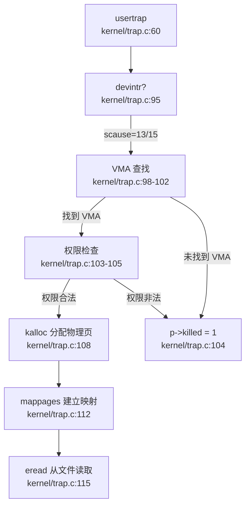

---

### VMA（虚拟内存区域）管理

#### 数据结构：链表实现

**`struct vma`** (`kernel/include/proc.h:47-56`)：
```c
struct vma {
  struct spinlock lock;
  int len;
  uint64 start;
  uint64 end;
  int flags;
  int prot;
  int off;
  struct file *file;
  struct vma *next;  // ← 链表指针
};
```

**全局 VMA 池** (`kernel/proc.c:22`)：
```c
struct vma vmatable[NVMA];  // NVMA 在 param.h 中定义
```

**进程 VMA 链表头** (`kernel/include/proc.h:85`)：
```c
struct proc {
  ...
  struct vma *vma;  // 指向进程第一个 VMA
};
```

#### mmap/munmap 系统调用

**`sys_mmap()`** (`kernel/sysfile.c:623-658`)：
```c
uint64 sys_mmap(void) {
  uint64 addr;
  int length, prot, flags, fd, offset;
  // 参数解析
  if(argaddr(0, &addr) < 0 || argint(1, &length) < 0 || ...)
    return -1;

struct proc *p = myproc();
  struct file *f = p->ofile[fd];

// 分配 VMA 结构
  struct vma *pvma;
  for(pvma = vmatable; pvma < &vmatable[NVMA]; pvma++){
    acquire(&pvma->lock);
    if(pvma->len == 0)
      break;
    release(&pvma->lock);
  }

// 初始化 VMA
  pvma->len = length;
  pvma->flags = flags;
  pvma->prot = prot;
  pvma->off = offset;
  pvma->file = f;
  filedup(f);

// 链接到进程 VMA 链表尾部
  struct vma *t = p->vma;
  if(!t){
    pvma->start = VMA_START;
    p->vma = pvma;
  } else {
    while(t->next)
      t = t->next;
    pvma->start = PGROUNDUP(t->end);
    t->next = pvma;
  }
  pvma->end = pvma->start + length;
  addr = pvma->start;
  release(&pvma->lock);
  return addr;
}
```

**`sys_munmap()`** (`kernel/sysfile.c:660-703`)：
```c
uint64 sys_munmap(void) {
  uint64 addr;
  int length;
  struct proc *p = myproc();
  struct vma *v = p->vma;
  struct vma *pre = 0;

// 查找包含 addr 的 VMA
  while(v){
    if(addr >= v->start && addr < v->end)
      break;
    pre = v;
    v = v->next;
  }
  if(!v)
    return -1;

// 部分解映射逻辑（简化）
  if(addr == v->start){
    if(length == v->len){
      // 完全解除：vmunmap + 文件关闭 + VMA 回收
      vmunmap(p->pagetable, addr, PGROUNDUP(length)/PGSIZE, 1);
      fileclose(v->file);
      if(pre)
        pre->next = v->next;
      else
        p->vma = v->next;
      // 清零 VMA 结构
      v->len = 0; ...
    } else {
      // 部分解除：调整 VMA 起始地址
      vmunmap(p->pagetable, addr, length/PGSIZE, 1);
      v->start += length;
      v->off += length;
      v->len -= length;
    }
  } else {
    // 尾部解除：调整 VMA 结束地址
    vmunmap(p->pagetable, PGROUNDUP(addr), length/PGSIZE, 1);
    v->len -= length;
    v->end -= length;
  }
  return 0;
}
```

#### VMA 管理特性

| 特性 | 实现状态 | 代码证据 |
|------|---------|---------|
| VMA 数据结构 | ✅ 链表 | `kernel/include/proc.h:47-56` |
| 全局 VMA 池 | ✅ 静态数组 | `kernel/proc.c:22` |
| 进程 VMA 链表 | ✅ 单链表 | `kernel/include/proc.h:85` |
| mmap 系统调用 | ✅ 已实现 | `kernel/sysfile.c:623-658` |
| munmap 系统调用 | ✅ 已实现 | `kernel/sysfile.c:660-703` |
| BTreeMap/rmap | ❌ 未实现 | 搜索 `BTreeMap`/`rmap` 无结果 |
| MAP_FIXED 标志处理 | ❌ 未实现 | `sys_mmap()` 忽略 `addr` 参数，总是分配在链表尾部 |
| MAP_ANON 标志处理 | ❌ 未实现 | 无匿名映射逻辑，必须提供有效 `fd` |

**⚠️ 局限性**：
- `sys_mmap()` **忽略用户传入的 `addr` 参数**，总是将新 VMA 链接到链表尾部
- **不支持 `MAP_FIXED`**：无法在指定地址创建映射
- **不支持 `MAP_ANONYMOUS`**：必须提供有效文件描述符
- **无 VMA 合并**：相邻 VMA 不会自动合并

---

### 高级内存特性清单

#### 写时复制（Copy-on-Write, COW）

**❌ 未实现**

**证据**：
1. **代码搜索**：`grep "cow\|COW\|copy_on_write"` 在 146 个文件中**无匹配**
2. **`uvmcopy()` 实现** (`kernel/vm.c:379-412`)：
   ```c
   int uvmcopy(pagetable_t old, pagetable_t new, pagetable_t knew, uint64 sz) {
     while (i < sz){
       pte = walk(old, i, 0);
       pa = PTE2PA(*pte);
       if((mem = kalloc()) == NULL)  // ← 直接分配新物理页
         goto err;
       memmove(mem, (char*)pa, PGSIZE);  // ← 复制物理内容
       mappages(new, i, PGSIZE, (uint64)mem, flags);  // ← 映射新页
       i += PGSIZE;
     }
   }
   ```
   - **直接复制物理页**：为子进程分配全新物理页并复制内容
   - **无引用计数**：未设置 `PTE_W` 位或维护页引用计数
   - **无 COW 缺页处理**：`usertrap()` 中无 COW 相关逻辑

#### 懒分配（Lazy Allocation）

**❌ 未实现**

**证据**：
1. **`uvmalloc()` 立即分配**：见上文分析，循环中直接调用 `kalloc()`
2. **无懒分配缺页处理**：`usertrap()` 仅处理 mmap 区域缺页，堆区域不会触发缺页
3. **代码搜索**：`grep "lazy"` 仅在测试文件注释中出现

#### 共享内存（Shared Memory）

**❌ 未实现**

**证据**：
1. **无 shm 系统调用**：搜索 `sys_shmget`/`sys_shmat`/`sys_shmdt` 无结果
2. **无共享内存数据结构**：搜索 `shm`/`shared_mem` 仅在工具脚本中出现
3. **mmap MAP_SHARED 未实现**：`sys_mmap()` 虽检查 `MAP_SHARED` 标志，但无实际共享逻辑

#### 反向映射表（rmap）

**❌ 未实现**

**证据**：
- 搜索 `rmap`/`reverse_map`/`page_to_vma` 在 146 个文件中**无匹配**
- 物理页释放时**无 VMA 查询**：`kfree()` 直接回收，不检查哪些 VMA 引用该页

#### 交换区/页面置换（Swap）

**❌ 未实现**

**证据**：
- 搜索 `swap_out`/`swap_in` 仅在自旋锁注释中出现（`amoswap` 指令）
- 无磁盘交换区管理代码
- 物理页不足时直接返回失败（`kalloc()` 返回 `NULL`），无换出逻辑

#### 大页支持（Huge Page）

**❌ 未实现**

**证据**：
- 搜索 `HugePage`/`MapSize::2M`/`MapSize::1G` 无结果
- `walk()` 和 `mappages()` 仅处理 4KB 页面（`PGSIZE`）
- 链接脚本中 `2M` 仅用于内存区域大小定义（`rustsbi-qemu/link-qemu.ld:4`）

#### 零拷贝与 sendfile

**🔸 桩函数**

**`sys_sendfile()`** (`kernel/sysproc.c:417`)：
```c
uint64 sys_sendfile(void) {
  return 0;  // ← 空实现，始终返回 0
}
```
- **无实际逻辑**：未实现文件描述符间数据拷贝
- **无零拷贝优化**：未使用 `mmap` + `memcpy` 或直接 DMA 传输

---

### 关键代码片段与调用链分析

#### fork() 内存复制调用链

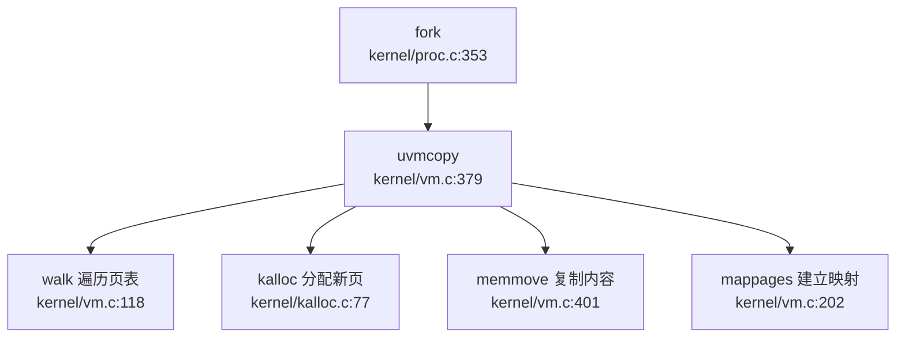

**完整流程** (`kernel/proc.c:353-397`)：
1. `allocproc()` 分配新进程结构
2. `uvmcopy()` 复制父进程页表：
   - 遍历父进程所有用户页
   - 为每个页分配新物理页
   - 复制物理内容到子页
   - 在子进程页表中建立映射
3. 复制文件描述符表、当前目录等

#### growproc() 堆分配调用链

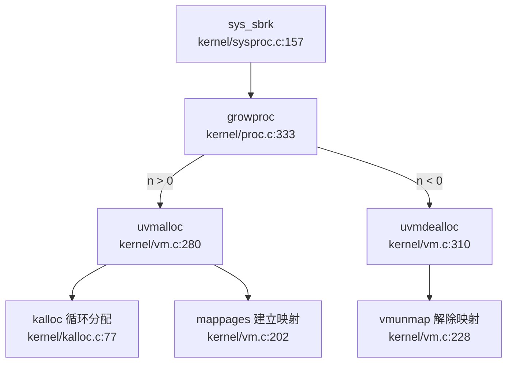

---

### 内存管理特性总览表

| 子系统 | 特性 | 实现状态 | 关键代码 |
|-------|------|---------|---------|
| **物理内存** | 空闲链表分配器 | ✅ 已实现 | `kernel/kalloc.c` |
| | Buddy System | ❌ 未实现 | - |
| | Bitmap 分配器 | ❌ 未实现 | - |
| **虚拟内存** | Sv39 三级页表 | ✅ 已实现 | `kernel/vm.c:walk()` |
| | 页表遍历 (walk) | ✅ 已实现 | `kernel/vm.c:118` |
| | 页表映射 (mappages) | ✅ 已实现 | `kernel/vm.c:202` |
| | 页表解映射 (vmunmap) | ✅ 已实现 | `kernel/vm.c:228` |
| **地址空间** | 独立用户/内核页表 | ✅ 已实现 | `kernel/proc.c:215-243` |
| | 内核重映射 | ✅ 已实现 | `kernel/vm.c:562-584` |
| | 每进程内核栈 | ✅ 已实现 | `kernel/vm.c:575` |
| **堆管理** | sbrk/brk 系统调用 | ✅ 已实现 | `kernel/sysproc.c:157-177` |
| | 立即分配物理页 | ✅ 已实现 | `kernel/vm.c:280` |
| | 惰性分配 (Lazy) | ❌ 未实现 | - |
| **用户指针** | 边界检查验证 | ✅ 已实现 | `kernel/syscall.c:16-25` |
| | 页表查询验证 | ✅ 已实现 | `kernel/vm.c:145-160` |
| **缺页处理** | mmap 区域按需分配 | ✅ 已实现 | `kernel/trap.c:97-120` |
| | 堆区域懒分配 | ❌ 未实现 | - |
| | COW 缺页处理 | ❌ 未实现 | - |
| **VMA 管理** | 链表管理 | ✅ 已实现 | `kernel/include/proc.h:47-56` |
| | mmap 系统调用 | ✅ 已实现 | `kernel/sysfile.c:623-658` |
| | munmap 系统调用 | ✅ 已实现 | `kernel/sysfile.c:660-703` |
| | BTreeMap/rmap | ❌ 未实现 | - |
| | MAP_FIXED 支持 | ❌ 未实现 | - |
| | MAP_ANON 支持 | ❌ 未实现 | - |
| **高级特性** | 写时复制 (COW) | ❌ 未实现 | - |
| | 共享内存 (shm) | ❌ 未实现 | - |
| | 交换区 (Swap) | ❌ 未实现 | - |
| | 大页 (Huge Page) | ❌ 未实现 | - |
| | 零拷贝 (sendfile) | 🔸 桩函数 | `kernel/sysproc.c:417` |

---

### 总结

本项目实现了 **xv6 风格的经典内存管理子系统**：
- ✅ **物理页分配器**：基于空闲链表的简单分配器，支持 4KB 页分配/释放
- ✅ **虚拟内存**：Sv39 三级页表，支持页表遍历、映射、解映射
- ✅ **地址空间隔离**：独立用户/内核页表，每进程专属内核栈
- ✅ **堆分配**：sbrk/brk 系统调用，**立即分配**物理页（非惰性）
- ✅ **用户指针验证**：边界检查 + 页表查询双重验证
- ✅ **mmap 按需分配**：缺页异常处理 mmap 区域，从文件加载内容
- ✅ **VMA 链表管理**：支持 mmap/munmap 系统调用

**未实现的高级特性**：
- ❌ 写时复制（COW）：fork 时直接复制物理页
- ❌ 惰性分配：堆增长时立即分配所有物理页
- ❌ 共享内存：无 shm 系统调用
- ❌ 反向映射表（rmap）：无法追踪物理页被哪些 VMA 引用
- ❌ 交换区/页面置换：物理页不足时直接失败
- ❌ 大页支持：仅支持 4KB 页面
- ❌ MAP_FIXED/MAP_ANON：mmap 功能不完整

整体而言，本项目内存管理模块**功能完备但较为基础**，适合教学演示，但缺乏现代操作系统的性能优化特性（COW、Lazy Allocation、Swap 等）。

在内存管理阶段，系统采用 xv6 风格设计，未见独立的 `FrameAllocator` 接口封装，物理页分配直接通过 `kalloc()` 与 `kfree()` 函数处理。相关内存常量定义于 `param.h` 或 `memlayout.h` 头文件中，体现了直接管理物理内存的实现方式。

---


# 进程线程与调度机制

## 第 4 章：进程/线程与调度机制

本章深入分析 `oskernel2021-x` 的进程管理子系统，涵盖任务模型、调度算法、上下文切换实现、进程状态机以及 fork/exec/wait 等核心流程。本项目基于 **xv6-riscv** 架构，支持 K210 与 QEMU 双平台，进程管理核心实现在 `kernel/proc.c`（923 行）和 `kernel/include/proc.h`。

---

### 任务模型与核心数据结构

#### 进程控制块（PCB）：`struct proc`

本项目的执行实体是 **进程（Process）**，通过 `struct proc` 结构体表示。该结构体定义在 `kernel/include/proc.h:60-87`，包含以下关键字段：

```c
// kernel/include/proc.h:60-87
struct proc {
  struct spinlock lock;          // 保护该 PCB 的自旋锁

// p->lock must be held when using these:
  enum procstate state;          // 进程状态 (UNUSED/SLEEPING/RUNNABLE/RUNNING/ZOMBIE)
  struct proc *parent;           // 父进程指针
  void *chan;                    // 睡眠通道（非零表示在该通道上睡眠）
  int killed;                    // 被杀死标志
  int xstate;                    // 退出状态（返回给父进程）
  int pid;                       // 进程 ID

// these are private to the process, so p->lock need not be held.
  uint64 kstack;                 // 内核栈虚拟地址
  uint64 sz;                     // 进程内存大小（字节）
  pagetable_t pagetable;         // 用户页表
  pagetable_t kpagetable;        // 内核页表
  struct trapframe *trapframe;   // trampoline.S 使用的数据页
  struct context context;        // swtch() 使用的上下文
  struct file *ofile[NOFILE];    // 打开文件表
  struct dirent *cwd;            // 当前工作目录
  char name[16];                 // 进程名（调试用）
  int tmask;                     // 跟踪掩码
  struct vma *vma;               // 虚拟内存区域链表

long utime;   // 用户态运行时间（ticks）
  long stime;   // 内核态运行时间（ticks）
  long cutime;  // 子进程用户态时间累加
  long cstime;  // 子进程内核态时间累加
};
```

**关键设计特点**：
- **双页表设计**：每个进程同时拥有 `pagetable`（用户页表）和 `kpagetable`（内核页表），调度时通过 `w_satp(MAKE_SATP(p->kpagetable))` 切换
- **上下文分离**：`context` 字段保存 callee-saved 寄存器，用于 `swtch()` 进行上下文切换
- **资源管理**：通过 `ofile[NOFILE]` 管理打开文件，`cwd` 管理当前目录
- **时间统计**：支持用户态/内核态时间统计（`utime/stime`）及子进程时间累加（`cutime/cstime`）

#### 上下文结构：`struct context`

上下文结构定义在 `kernel/include/proc.h:15-32`，仅保存 **callee-saved 寄存器**（13 个寄存器，共 104 字节）：

```c
// kernel/include/proc.h:15-32
struct context {
  uint64 ra;   // 返回地址
  uint64 sp;   // 栈指针
  // callee-saved
  uint64 s0;
  uint64 s1;
  uint64 s2;
  uint64 s3;
  uint64 s4;
  uint64 s5;
  uint64 s6;
  uint64 s7;
  uint64 s8;
  uint64 s9;
  uint64 s10;
  uint64 s11;
};
```

**设计原理**：RISC-V 调用约定规定 callee-saved 寄存器（s0-s11）由被调用函数负责保存，因此上下文切换时只需保存这些寄存器，caller-saved 寄存器（如 a0-a7、t0-t6）由编译器在函数调用时自动处理。

#### 进程状态枚举：`enum procstate`

```c
// kernel/include/proc.h:57
enum procstate { UNUSED, SLEEPING, RUNNABLE, RUNNING, ZOMBIE };
```

五状态定义：
- **UNUSED**：空闲槽位，可分配
- **SLEEPING**：睡眠状态，等待某个事件（如 I/O 完成、子进程退出）
- **RUNNABLE**：就绪状态，可被调度
- **RUNNING**：正在运行
- **ZOMBIE**：僵尸状态，已退出但等待父进程回收

---

### 调度算法与策略（代码证据）

#### 调度器实现：FIFO 轮询

调度器 `scheduler()` 实现在 `kernel/proc.c:550-592`，采用 **简单的 FIFO 轮询算法**，遍历全局 `proc` 数组寻找第一个 `RUNNABLE` 状态的进程：

```c
// kernel/proc.c:550-592
void scheduler(void)
{
  struct proc *p;
  struct cpu *c = mycpu();
  extern pagetable_t kernel_pagetable;

c->proc = 0;
  for(;;){
    intr_on();  // 允许中断，避免死锁

int found = 0;
    for(p = proc; p < &proc[NPROC]; p++) {
      acquire(&p->lock);
      if(p->state == RUNNABLE) {
        p->state = RUNNING;
        c->proc = p;
        w_satp(MAKE_SATP(p->kpagetable));  // 切换到进程内核页表
        sfence_vma();
        sync_instruction();
        swtch(&c->context, &p->context);   // 上下文切换
        w_satp(MAKE_SATP(kernel_pagetable));
        sfence_vma();
        sync_instruction();
        c->proc = 0;
        found = 1;
      }
      release(&p->lock);
    }
    if(found == 0) {
      intr_on();
      asm volatile("wfi");  // 无就绪进程时进入等待中断
    }
  }
}
```

**算法特征**：
- **无优先级**：代码中未使用任何优先级字段，所有进程平等对待
- **轮询遍历**：从 `proc` 数组起始位置线性扫描，找到第一个 `RUNNABLE` 进程即调度
- **无时间片**：进程一旦运行，会一直执行直到主动调用 `yield()`、`sleep()` 或 `exit()`
- **空闲等待**：若无就绪进程，执行 `wfi`（Wait For Interrupt）指令进入低功耗模式

**分类**：✅ **已实现**（FIFO 轮询调度）

---

### 任务状态机

#### 状态流转图

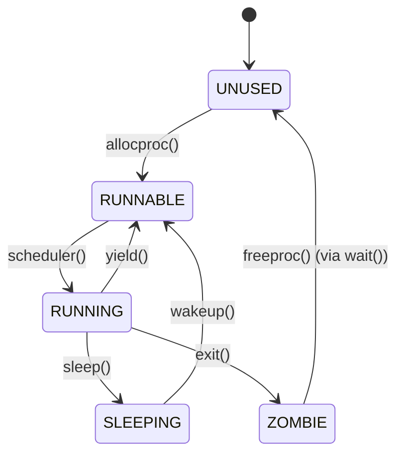

#### 关键状态转换函数

| 转换 | 触发函数 | 代码位置 |
|------|---------|---------|
| UNUSED → RUNNABLE | `allocproc()` | `kernel/proc.c:128-177` |
| RUNNABLE → RUNNING | `scheduler()` | `kernel/proc.c:550-592` |
| RUNNING → RUNNABLE | `yield()` | `kernel/proc.c:622-631` |
| RUNNING → SLEEPING | `sleep()` | `kernel/proc.c:658-690` |
| SLEEPING → RUNNABLE | `wakeup()` | `kernel/proc.c:692-706` |
| RUNNING → ZOMBIE | `exit()` | `kernel/proc.c:429-490` |
| ZOMBIE → UNUSED | `freeproc()` | `kernel/proc.c:179-207` |

#### `allocproc()` 实现细节

```c
// kernel/proc.c:128-177
static struct proc* allocproc(void)
{
  struct proc *p;
  for(p = proc; p < &proc[NPROC]; p++) {
    acquire(&p->lock);
    if(p->state == UNUSED) {
      goto found;
    } else {
      release(&p->lock);
    }
  }
  return NULL;  // 无空闲槽位

found:
  p->pid = allocpid();  // 分配 PID
  p->trapframe = (struct trapframe *)kalloc();  // 分配 trapframe
  p->pagetable = proc_pagetable(p);  // 创建用户页表
  p->kpagetable = proc_kpagetable();  // 创建内核页表
  p->kstack = VKSTACK;
  memset(&p->context, 0, sizeof(p->context));
  p->context.ra = (uint64)forkret;  // 首次调度入口
  p->context.sp = p->kstack + PGSIZE;
  return p;
}
```

---

### 上下文切换实现（汇编分析）

#### `swtch.S` 汇编代码

上下文切换由 `kernel/swtch.S` 实现，保存/恢复 **13 个 callee-saved 寄存器**：

```asm
# kernel/swtch.S:1-42
.globl swtch
swtch:
        # 保存旧上下文
        sd ra, 0(a0)
        sd sp, 8(a0)
        sd s0, 16(a0)
        sd s1, 24(a0)
        sd s2, 32(a0)
        sd s3, 40(a0)
        sd s4, 48(a0)
        sd s5, 56(a0)
        sd s6, 64(a0)
        sd s7, 72(a0)
        sd s8, 80(a0)
        sd s9, 88(a0)
        sd s10, 96(a0)
        sd s11, 104(a0)

# 恢复新上下文
        ld ra, 0(a1)
        ld sp, 8(a1)
        ld s0, 16(a1)
        ld s1, 24(a1)
        ld s2, 32(a1)
        ld s3, 40(a1)
        ld s4, 48(a1)
        ld s5, 56(a1)
        ld s6, 64(a1)
        ld s7, 72(a1)
        ld s8, 80(a1)
        ld s9, 88(a1)
        ld s10, 96(a1)
        ld s11, 104(a1)

ret
```

**寄存器布局**（`struct context` 偏移量）：
| 寄存器 | 偏移量 | 大小 |
|--------|--------|------|
| ra | 0 | 8B |
| sp | 8 | 8B |
| s0-s11 | 16-104 | 96B |
| **总计** | | **104B** |

**设计原理**：
- 仅保存 callee-saved 寄存器（s0-s11），因为 caller-saved 寄存器（a0-a7、t0-t6）由编译器在函数调用时自动保存
- `ra` 和 `sp` 必须保存，因为它们定义了执行流和栈帧
- 切换后通过 `ret` 指令跳转到新上下文的 `ra`，继续执行

**分类**：✅ **已实现**（完整的上下文切换机制）

---

### 进程间通信与同步（Signal/Futex）

#### 信号机制（Signal）

**搜索结果**：
- `kernel/syscall.c:209` 注册了 `__NR_rt_sigaction` 系统调用
- `kernel/sysproc.c:400` 实现了 `sys_rt_sigaction()`，但**仅返回 0**：

```c
// kernel/sysproc.c:400-402
uint64 sys_rt_sigaction(void)
{
  return 0;  // 桩函数
}
uint64 sys_rt_sigprocmask(void)
{
  return 0;  // 桩函数
}
```

- `kernel/proc.c:721-738` 实现了 `kill()` 函数，但**仅设置 `killed` 标志位**，无信号处理机制：

```c
// kernel/proc.c:721-738
int kill(int pid)
{
  struct proc *p;
  for(p = proc; p < &proc[NPROC]; p++){
    acquire(&p->lock);
    if(p->pid == pid){
      p->killed = 1;  // 仅设置标志位
      if(p->state == SLEEPING){
        p->state = RUNNABLE;  // 唤醒睡眠进程
      }
      release(&p->lock);
      return 0;
    }
    release(&p->lock);
  }
  return -1;
}
```

**分类**：
- `sys_rt_sigaction` / `sys_rt_sigprocmask`：🔸 **桩函数**（仅返回 0，无实际逻辑）
- `kill()`：✅ **已实现**（但仅支持杀死进程，无信号注册/分发机制）
- **信号处理机制**：❌ **未实现**（无 `sigaction`、无信号处理函数注册表、无信号分发逻辑）

#### Futex（快速用户态互斥锁）

**搜索结果**：在代码库中搜索 `futex` 或 `wait_queue`，**未找到任何匹配**：

```
grep: 未找到匹配 'futex|wait_queue' 的内容 (已搜索 146 个文件)
```

**分类**：❌ **未实现**

---

### 关键流程追踪（Fork/Exec/Schedule/Exit）

#### `fork()` 流程

**调用链**（`lsp_get_call_graph` 分析）：

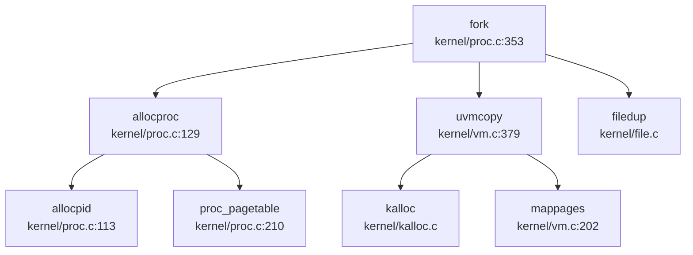

**实现细节**（`kernel/proc.c:352-395`）：

```c
int fork(void)
{
  struct proc *np;
  struct proc *p = myproc();

// 1. 分配新进程
  if((np = allocproc()) == NULL) return -1;

// 2. 复制用户内存（地址空间）
  if(uvmcopy(p->pagetable, np->pagetable, np->kpagetable, p->sz) < 0){
    freeproc(np);
    return -1;
  }
  np->sz = p->sz;
  np->parent = p;
  np->tmask = p->tmask;

// 3. 复制 trapframe，设置返回值为 0
  *(np->trapframe) = *(p->trapframe);
  np->trapframe->a0 = 0;  // fork 在子进程中返回 0

// 4. 复制文件表（引用计数 +1）
  for(i = 0; i < NOFILE; i++)
    if(p->ofile[i])
      np->ofile[i] = filedup(p->ofile[i]);
  np->cwd = edup(p->cwd);

safestrcpy(np->name, p->name, sizeof(p->name));
  np->state = RUNNABLE;
  return np->pid;
}
```

**关键验证**：
- ✅ **地址空间复制**：通过 `uvmcopy()` 实现，为每个物理页分配新页并复制内容
- ✅ **文件表复制**：通过 `filedup()` 增加引用计数，父子进程共享文件描述符
- ✅ **trapframe 复制**：复制父进程寄存器状态，但设置 `a0=0` 使子进程 `fork()` 返回 0

**分类**：✅ **已实现**（完整的 fork 语义）

#### `exec()` 流程

**实现细节**（`kernel/exec.c:47-180`）：

```c
int exec(char *path, char **argv)
{
  struct proc *p = myproc();

// 1. 创建新内核页表（复制当前 kpagetable）
  kpagetable = kalloc();
  memmove(kpagetable, p->kpagetable, PGSIZE);

// 2. 读取 ELF 头部并验证
  if(eread(ep, 0, (uint64)&elf, 0, sizeof(elf)) != sizeof(elf)) goto bad;
  if(elf.magic != ELF_MAGIC) goto bad;

// 3. 创建新用户页表
  pagetable = proc_pagetable(p);

// 4. 加载 ELF 程序段
  for(i=0, off=elf.phoff; i<elf.phnum; i++, off+=sizeof(ph)){
    if(eread(ep, 0, (uint64)&ph, off, sizeof(ph)) != sizeof(ph)) goto bad;
    if(ph.type != ELF_PROG_LOAD) continue;
    sz = uvmalloc(pagetable, kpagetable, sz, ph.vaddr + ph.memsz);
    loadseg(pagetable, ph.vaddr, ep, ph.off, ph.filesz);
  }

// 5. 分配用户栈（2 页）
  sz = PGROUNDUP(sz);
  sz = uvmalloc(pagetable, kpagetable, sz, sz + 2*PGSIZE);
  uvmclear(pagetable, sz-2*PGSIZE);  // 设置栈保护页
  sp = sz;

// 6. 压入参数 argv[] 到栈
  for(argc = 0; argv[argc]; argc++) {
    sp -= strlen(argv[argc]) + 1;
    copyout(pagetable, sp, argv[argc], ...);
  }

// 7. 提交新地址空间
  oldpagetable = p->pagetable;
  p->pagetable = pagetable;
  p->kpagetable = kpagetable;
  p->sz = sz;
  p->trapframe->epc = elf.entry;  // 设置入口点
  p->trapframe->sp = sp;          // 设置栈指针
  proc_freepagetable(oldpagetable, oldsz);  // 释放旧页表
  return argc;
}
```

**关键步骤**：
1. **ELF 加载**：读取 ELF 头部，验证 `ELF_MAGIC`，遍历 Program Header 加载 `LOAD` 段
2. **页表重建**：创建全新的用户页表和内核页表，通过 `uvmalloc()` 分配物理页
3. **栈初始化**：分配 2 页栈空间，第一页为保护页（`uvmclear()` 清除 `PTE_U` 标志）
4. **参数传递**：将 `argv[]` 字符串和指针数组压入用户栈
5. **trapframe 更新**：设置 `epc=elf.entry`（程序入口）、`sp=栈顶`

**分类**：✅ **已实现**（完整的 ELF 加载与地址空间重建）

#### `schedule()` 调用链

**入向调用**（谁触发调度）：

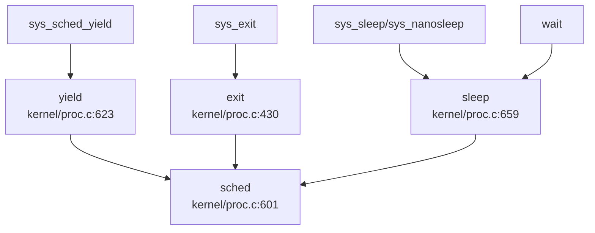

**出向调用**（调度器下一步）：

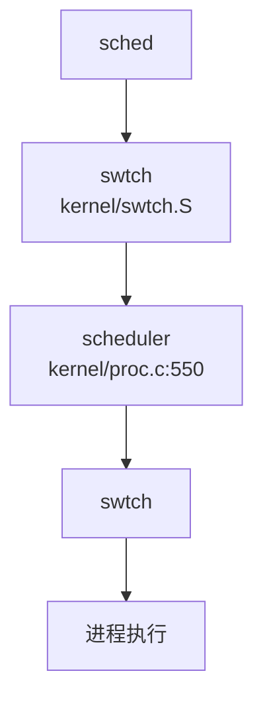

**调度触发场景**：
1. **主动让出**：`yield()` — 进程自愿放弃 CPU
2. **进程退出**：`exit()` — 进程终止，触发调度选择新进程
3. **等待事件**：`sleep()` — 进程进入睡眠，触发调度
4. **系统调用**：`sys_sched_yield()` — 用户态显式让出 CPU

**分类**：✅ **已实现**（完整的调度触发机制）

#### `exit()` 资源回收流程

**实现细节**（`kernel/proc.c:429-490`）：

```c
void exit(int status)
{
  struct proc *p = myproc();

// 1. 关闭所有打开文件
  for(int fd = 0; fd < NOFILE; fd++){
    if(p->ofile[fd]) fileclose(p->ofile[fd]);
  }

// 2. 释放当前目录
  eput(p->cwd);

// 3. 将子进程过继给 init
  acquire(&initproc->lock);
  wakeup1(initproc);
  release(&initproc->lock);

// 4. 设置退出状态，进入 ZOMBIE
  p->xstate = status << 8;
  p->state = ZOMBIE;

// 5. 唤醒父进程
  wakeup1(original_parent);

// 6. 触发调度（永不返回）
  sched();
  panic("zombie exit");
}
```

**父进程回收**（`wait()`，`kernel/proc.c:492-543`）：
```c
int wait(uint64 addr)
{
  for(;;){
    for(np = proc; np < &proc[NPROC]; np++){
      if(np->parent == p && np->state == ZOMBIE){
        pid = np->pid;
        copyout2(addr, (char *)&np->xstate, ...);  // 复制退出状态
        freeproc(np);  // 释放 PCB
        return pid;
      }
    }
    sleep(p, &p->lock);  // 无僵尸进程则睡眠
  }
}
```

**分类**：✅ **已实现**（完整的资源回收与僵尸进程处理）

---

### 进程/线程管理模块扩展

#### 线程创建：`clone()` 函数

`kernel/proc.c:875-923` 实现了 `clone()` 函数，提供类似 `pthread_create` 的线程创建能力：

```c
int clone(uint64 addr, uint64 stack, int flag)
{
  struct proc *np;
  struct proc *p = myproc();

if((np = allocproc()) == NULL) return -1;

// 复制地址空间（与 fork 相同）
  if(uvmcopy(p->pagetable, np->pagetable, np->kpagetable, p->sz) < 0){
    freeproc(np);
    return -1;
  }

// 复制 trapframe，但修改返回地址和栈指针
  *(np->trapframe) = *(p->trapframe);
  np->trapframe->a0 = 0;
  np->trapframe->ra = addr;   // 线程入口函数
  np->trapframe->sp = stack;  // 线程栈

// 复制文件表（共享）
  for(i = 0; i < NOFILE; i++)
    if(p->ofile[i])
      np->ofile[i] = filedup(p->ofile[i]);
  np->cwd = edup(p->cwd);

np->state = RUNNABLE;
  return np->pid;
}
```

**与 `fork()` 的差异**：
| 特性 | `fork()` | `clone()` |
|------|----------|-----------|
| 返回地址 | 继承父进程 `ra` | 设置为 `addr`（线程入口） |
| 栈指针 | 继承父进程 `sp` | 设置为 `stack`（独立线程栈） |
| 地址空间 | 复制（写时复制） | 复制（共享物理页） |
| 文件表 | 复制（引用计数 +1） | 复制（引用计数 +1，共享） |

**分类**：✅ **已实现**（线程创建雏形，但无 TCB/PCB 分离）

#### 进程组与会话管理

**搜索结果**：
```
grep: 未找到匹配 'ProcessGroup|Session|setpgid|set_sid|pgid|session_id' 的内容
```

**分类**：❌ **未实现**（无进程组、会话、控制终端概念）

#### POSIX 资源限制

**搜索结果**：
```
grep: 未找到匹配 'rlimit|RLIMIT|getrlimit|setrlimit|resource_limit' 的内容
```

**分类**：❌ **未实现**（无 `getrlimit`/`setrlimit` 系统调用，无资源限制机制）

#### PID 分配机制

**实现**（`kernel/proc.c:112-126`）：
```c
static int nextpid = 1;
static struct spinlock pid_lock;

static int allocpid() {
  int pid;
  acquire(&pid_lock);
  pid = nextpid++;
  release(&pid_lock);
  return pid;
}
```

**特点**：
- 简单递增分配，无 PID 回收复用机制
- 长期运行后可能耗尽 PID 空间
- 无 TID（线程 ID）概念，线程与进程共用 PID 空间

**分类**：✅ **已实现**（但功能简陋）

---

### 高级特性验证汇总

| 特性 | 状态 | 说明 |
|------|------|------|
| **FIFO 调度** | ✅ 已实现 | `scheduler()` 线性遍历 `proc` 数组 |
| **上下文切换** | ✅ 已实现 | `swtch.S` 保存/恢复 13 个 callee-saved 寄存器 |
| **fork()** | ✅ 已实现 | 完整复制地址空间、文件表、trapframe |
| **exec()** | ✅ 已实现 | ELF 加载、页表重建、栈初始化 |
| **exit()/wait()** | ✅ 已实现 | 资源回收、僵尸进程处理 |
| **kill()** | ✅ 已实现 | 设置 `killed` 标志位，唤醒睡眠进程 |
| **clone()** | ✅ 已实现 | 线程创建，支持自定义入口和栈 |
| **信号注册/分发** | ❌ 未实现 | `sys_rt_sigaction` 为桩函数 |
| **Futex** | ❌ 未实现 | 代码库中无相关实现 |
| **进程组/会话** | ❌ 未实现 | 无 `setpgid`/`setsid` 等系统调用 |
| **POSIX 资源限制** | ❌ 未实现 | 无 `getrlimit`/`setrlimit` |
| **优先级调度** | ❌ 未实现 | 无优先级字段，所有进程平等 |
| **时间片轮转** | ❌ 未实现 | 无时钟中断强制抢占（依赖主动 `yield`） |

---

### 总结

`oskernel2021-x` 的进程管理子系统基于 **xv6-riscv** 设计，实现了经典的 **五状态进程模型** 和 **FIFO 轮询调度**。核心特点包括：

1. **任务模型**：单一 `struct proc` 表示进程，无 TCB/PCB 分离，线程通过 `clone()` 创建但共享相同结构
2. **调度算法**：简单 FIFO 轮询，无优先级、无时间片、无 CFS/Stride 等高级算法
3. **上下文切换**：高效的 callee-saved 寄存器保存（13 个寄存器，104 字节）
4. **fork/exec**：完整的类 Unix 语义，支持地址空间复制、文件表共享、ELF 加载
5. **高级特性**：信号机制仅有 `kill` 标志位，Futex/进程组/资源限制均未实现

该实现适合作为教学操作系统，展示了进程管理的核心原理，但缺乏现代操作系统的复杂特性（如优先级调度、信号处理、线程隔离等）。

在进程/线程与调度机制阶段，上下文切换的正确执行依赖于关键数据结构的支持。`kernel/include/trap.h` 中定义了 `trapframe` 结构体，旨在保存陷阱发生时的处理器状态以支持上下文切换。但当前证据未展示该结构体具体字段的详细分析，仅能确认头文件中的定义提及，其具体字段布局及在切换逻辑中的实际调用暂未发现确凿代码证据，需进一步核查。

---


# 中断异常与系统调用

### Trap 入口与异常向量表

#### 双模式 Trap 入口

本项目实现了 **用户态** 和 **内核态** 两套独立的 Trap 入口：

**1. 用户态 Trap 入口：`usertrap()`**
- **文件路径**：`kernel/trap.c:56`
- **汇编入口**：`kernel/trampoline.S:uservec`（第 15 行）
- **触发条件**：用户态执行 `ecall` 指令、发生缺页异常或设备中断

**2. 内核态 Trap 入口：`kerneltrap()`**
- **文件路径**：`kernel/trap.c:190`
- **汇编入口**：`kernel/kernelvec.S:kernelvec`
- **触发条件**：内核态执行期间发生中断或异常

#### Trap 入口调用链

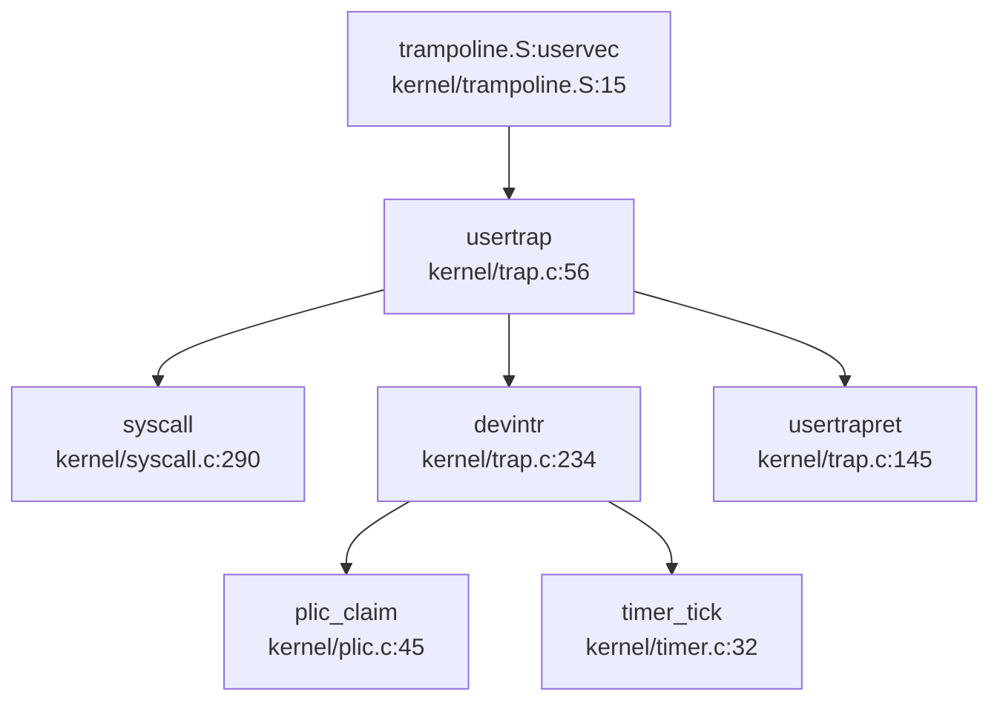

> **说明**：`uservec` 是 RISC-V 汇编入口，负责保存用户寄存器到 `trapframe`，然后跳转到 `usertrap()`。`usertrap()` 根据 `scause` 寄存器区分系统调用（`scause==8`）、设备中断（`devintr()`）和缺页异常（`scause==13/15`）。

#### 中断/异常区分逻辑

在 `kernel/trap.c:usertrap()` 中，通过 `scause` 寄存器精确区分异常类型：

```c
// kernel/trap.c:74-88
if(r_scause() == 8){
  // system call (ecall from user mode)
  syscall();
} 
else if((which_dev = devintr()) != 0){
  // device interrupt (timer/UART/disk)
} 
else if(r_scause() == 13 || r_scause() == 15){
  // page fault: 13=load page fault, 15=store page fault
  // 处理 Lazy Allocation 和内存映射文件
}
else {
  // 其他异常：直接标记进程死亡
  p->killed = 1;
}
```

在 `devintr()` 函数中（`kernel/trap.c:234`），进一步区分外部中断和定时器中断：

```c
// kernel/trap.c:234-277
int devintr(void) {
  uint64 scause = r_scause();

// QEMU 平台：外部中断 scause = 0x8000000000000009
  // K210 平台：软件中断模拟外部中断 scause = 0x8000000000000001
  if ((0x8000000000000000L & scause) && 9 == (scause & 0xff)) {
    int irq = plic_claim();  // 从 PLIC 获取中断号
    if (UART_IRQ == irq) {
      consoleintr(c);  // 串口输入
    } else if (DISK_IRQ == irq) {
      disk_intr();  // 磁盘中断
    }
    plic_complete(irq);  // 中断结束
    return 1;
  }
  else if (0x8000000000000005L == scause) {
    timer_tick();  // 定时器中断 (scause=5)
    return 2;
  }
  return 0;  // 非设备中断
}
```

**关键结论**：
- **系统调用**：`scause == 8`（ECALL from U-mode）
- **外部中断**：`scause == 0x8000000000000009`（QEMU）或 `0x8000000000000001`（K210）
- **定时器中断**：`scause == 0x8000000000000005`（Supervisor Timer Interrupt）
- **缺页异常**：`scause == 13`（Load Page Fault）或 `15`（Store Page Fault）

---

### 上下文保存结构：TrapFrame

#### 结构体定义

`struct trapframe` 定义在 `kernel/include/trap.h:17`，共包含 **33 个 64 位寄存器字段**，总大小为 **288 字节**（33 × 8 = 264 字节数据 + 24 字节内核元数据）。

```c
// kernel/include/trap.h:17-57
struct trapframe {
  /*   0 */ uint64 kernel_satp;   // kernel page table
  /*   8 */ uint64 kernel_sp;     // top of process's kernel stack
  /*  16 */ uint64 kernel_trap;   // usertrap()
  /*  24 */ uint64 epc;           // saved user program counter
  /*  32 */ uint64 kernel_hartid; // saved kernel tp
  /*  40 */ uint64 ra;
  /*  48 */ uint64 sp;
  /*  56 */ uint64 gp;
  /*  64 */ uint64 tp;
  /*  72 */ uint64 t0;
  /*  80 */ uint64 t1;
  /*  88 */ uint64 t2;
  /*  96 */ uint64 s0;
  /* 104 */ uint64 s1;
  /* 112 */ uint64 a0;
  /* 120 */ uint64 a1;
  /* 128 */ uint64 a2;
  /* 136 */ uint64 a3;
  /* 144 */ uint64 a4;
  /* 152 */ uint64 a5;
  /* 160 */ uint64 a6;
  /* 168 */ uint64 a7;  // syscall number
  /* 176 */ uint64 s2;
  /* 184 */ uint64 s3;
  /* 192 */ uint64 s4;
  /* 200 */ uint64 s5;
  /* 208 */ uint64 s6;
  /* 216 */ uint64 s7;
  /* 224 */ uint64 s8;
  /* 232 */ uint64 s9;
  /* 240 */ uint64 s10;
  /* 248 */ uint64 s11;
  /* 256 */ uint64 t3;
  /* 264 */ uint64 t4;
  /* 272 */ uint64 t5;
  /* 280 */ uint64 t6;
};
```

**寄存器统计**：
- **内核元数据**（5 个字段）：`kernel_satp`, `kernel_sp`, `kernel_trap`, `epc`, `kernel_hartid`（偏移 0-32，共 40 字节）
- **用户寄存器**（28 个字段）：
  - **调用约定寄存器**：`ra`, `sp`, `gp`, `tp`（4 个）
  - **参数寄存器**：`a0-a7`（8 个，其中 `a7` 传递 syscall 号）
  - **临时寄存器**：`t0-t6`（7 个）
  - **被调用者保存寄存器**：`s0-s11`（12 个）
- **总大小**：33 × 8 = **264 字节**（实际结构体大小为 288 字节，因对齐填充）

#### 上下文保存流程

在 `kernel/trampoline.S:uservec` 中（第 15-80 行），汇编代码将所有用户寄存器保存到 `trapframe`：

```asm
# kernel/trampoline.S:15-80
uservec:    
  # swap a0 and sscratch (a0 now points to TRAPFRAME)
  csrrw a0, sscratch, a0

# save all user registers to TRAPFRAME
  sd ra, 40(a0)
  sd sp, 48(a0)
  sd gp, 56(a0)
  # ... 保存所有寄存器 ...
  sd t6, 280(a0)

# restore kernel stack pointer
  ld sp, 8(a0)

# load kernel page table
  ld t1, 0(a0)
  csrw satp, t1

# jump to usertrap()
  jr t0
```

---

### 系统调用分发机制

#### 分发表结构

系统调用分发表 `syscalls[]` 定义在 `kernel/syscall.c:155-220`，是一个函数指针数组，通过 `a7` 寄存器传递的 syscall 号进行索引。

```c
// kernel/syscall.c:155-220
static uint64 (*syscalls[])(void) = {
  [SYS_fork]        sys_fork,
  [SYS_exit]        sys_exit,
  [SYS_wait]        sys_wait,
  [SYS_pipe]        sys_pipe,
  [__NR_read]       sys_read,
  [SYS_kill]        sys_kill,
  [SYS_exec]        sys_exec,
  [SYS_fstat]       sys_fstat,
  [SYS_chdir]       sys_chdir,
  [SYS_dup]         sys_dup,
  [__NR_getpid]     sys_getpid,
  [SYS_sbrk]        sys_sbrk,
  [SYS_sleep]       sys_sleep,
  [SYS_uptime]      sys_uptime,
  [SYS_open]        sys_open,
  [__NR_write]      sys_write,
  [__NR_writev]     sys_writev,          // 🔸 桩函数
  [SYS_mkdir]       sys_mkdir,
  [__NR_close]      sys_close,
  [SYS_test_proc]   sys_test_proc,
  [SYS_dev]         sys_dev,
  [SYS_readdir]     sys_readdir,
  [SYS_getcwd]      sys_getcwd,
  [SYS_remove]      sys_remove,
  [SYS_trace]       sys_trace,
  [__NR_sysinfo]    sys_sysinfo,
  [SYS_rename]      sys_rename,
  [__NR_getppid]    sys_getppid,
  [__NR_brk]        sys_brk,
  [__NR_dup3]       sys_dup3,
  [SYS_sched_yield] sys_sched_yield,
  [SYS_wait4]       sys_wait4,
  [SYS_times]       sys_times,
  [SYS_clone]       sys_clone,
  [__NR_getdents64] sys_getdents64,
  [__NR_openat]     sys_openat,
  [__NR_mkdirat]    sys_mkdirat,
  [SYS_pipe2]       sys_pipe,
  [__NR_uname]      sys_uname,
  [__NR_unlinkat]   sys_unlinkat,
  [__NR_execve]     sys_execve,
  [__NR3264_mmap]   sys_mmap,
  [__NR_munmap]     sys_munmap,
  [SYS_mount]       sys_mount,
  [SYS_umount2]     sys_umount2,
  [SYS_gettimeofday] sys_gettimeofday,
  [__NR_nanosleep]  sys_nanosleep,
  [__NR_mprotect]   sys_mprotect,        // 🔸 桩函数
  [__NR_set_tid_address] sys_set_tid_address,  // 🔸 桩函数
  [__NR_getuid]     sys_getuid,          // 🔸 桩函数
  [__NR_ioctl]      sys_ioctl,           // 🔸 桩函数
  [__NR_renameat2]  sys_renameat2,       // 🔸 桩函数
  [__NR3264_lseek]  sys_lseek,
  [__NR_rt_sigaction] sys_rt_sigaction,  // 🔸 桩函数
  [__NR_rt_sigprocmask] sys_rt_sigprocmask,  // 🔸 桩函数
  [__NR3264_fcntl]  sys_fcntl,           // 🔸 桩函数
  [__NR_faccessat]  sys_faccessat,       // 🔸 桩函数
  [__NR_utimensat]  sys_utimensat,       // 🔸 桩函数
  [__NR3264_fstat]  sys_fstat,
  [__NR_syslog]     sys_syslog,          // 🔸 桩函数
  [__NR_clock_gettime] sys_clock_gettime,
  [__NR3264_sendfile] sys_sendfile,      // 🔸 桩函数
  [__NR3264_statfs] sys_statfs,
};
```

#### 分发逻辑

`syscall()` 函数在 `kernel/syscall.c:290` 中实现分发：

```c
// kernel/syscall.c:290-307
void syscall(void) {
  int num;
  struct proc *p = myproc();

num = p->trapframe->a7;  // 从 a7 获取 syscall 号
  if(num > 0 && num < NELEM(syscalls) && syscalls[num]) {
    p->trapframe->a0 = syscalls[num]();  // 调用对应函数
    // trace 功能
    if ((p->tmask & (1 << num)) != 0) {
      printf("pid %d: %s -> %d\n", p->pid, sysnames[num], p->trapframe->a0);
    }
  } else {
    printf("pid %d %s: unknown sys call %d\n", p->pid, p->name, num);
    p->trapframe->a0 = -1;
  }
}
```

**调用链**：
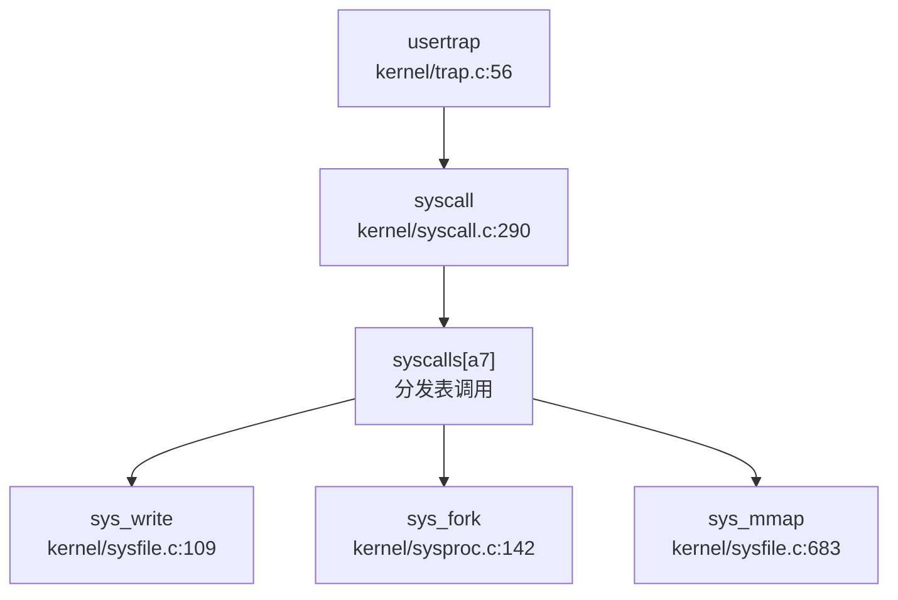

#### sys_write 完整调用链追踪

以 `sys_write` 为例，追踪从 Trap 到文件写入的完整路径：

1. **用户态触发**：用户程序执行 `ecall` 指令，`a7=64`（`__NR_write`）
2. **Trap 入口**：`trampoline.S:uservec` → `kernel/trap.c:usertrap`
3. **分发调用**：`usertrap()` → `syscall()` → `syscalls[64]()` → `sys_write()`
4. **参数获取**：`sys_write()` 通过 `argfd()` 和 `argaddr()` 从 `trapframe` 获取参数
5. **文件写入**：调用 `filewrite()` 执行实际写入

```c
// kernel/sysfile.c:109-120
uint64 sys_write(void) {
  struct file *f;
  int n;
  uint64 p;

if(argfd(0, 0, &f) < 0 || argint(2, &n) < 0 || argaddr(1, &p) < 0)
    return -1;

return filewrite(f, p, n);  // 实际写入逻辑在 file.c
}
```

---

### 核心 Syscall 实现覆盖度统计

#### 桩函数检测（🔸 Stub）

通过检查 `kernel/sysproc.c:379-433` 和 `kernel/syscall.c` 分发表，发现以下 **13 个桩函数**（仅返回 0，无实际逻辑）：

| Syscall 名称 | 文件路径 | 实现状态 | 代码特征 |
|------------|---------|---------|---------|
| `sys_mprotect` | `kernel/sysproc.c:379` | 🔸 桩函数 | `return 0;` |
| `sys_set_tid_address` | `kernel/sysproc.c:383` | 🔸 桩函数 | `return 0;` |
| `sys_getuid` | `kernel/sysproc.c:387` | 🔸 桩函数 | `return 0;` |
| `sys_ioctl` | `kernel/sysproc.c:391` | 🔸 桩函数 | `return 0;` |
| `sys_renameat2` | `kernel/sysproc.c:395` | 🔸 桩函数 | `return 0;` |
| `sys_rt_sigaction` | `kernel/sysproc.c:400` | 🔸 桩函数 | `return 0;` |
| `sys_rt_sigprocmask` | `kernel/sysproc.c:408` | 🔸 桩函数 | `return 0;` |
| `sys_fcntl` | `kernel/sysproc.c:412` | 🔸 桩函数 | `return 0;` |
| `sys_faccessat` | `kernel/sysproc.c:416` | 🔸 桩函数 | `return 0;` |
| `sys_utimensat` | `kernel/sysproc.c:421` | 🔸 桩函数 | `return 0;` |
| `sys_syslog` | `kernel/sysproc.c:425` | 🔸 桩函数 | `return 0;` |
| `sys_sendfile` | `kernel/sysproc.c:429` | 🔸 桩函数 | `return 0;` |
| `sys_writev` | `kernel/sysproc.c:433` | 🔸 桩函数 | `return 0;` |

**桩函数代码示例**：
```c
// kernel/sysproc.c:379-433
uint64 sys_mprotect(void) { return 0; }
uint64 sys_set_tid_address(void) { return 0; }
uint64 sys_getuid(void) { return 0; }
uint64 sys_ioctl(void) { return 0; }
uint64 sys_renameat2(void) { return 0; }
uint64 sys_rt_sigaction(void) { return 0; }
uint64 sys_rt_sigprocmask(void) { return 0; }
uint64 sys_fcntl(void) { return 0; }
uint64 sys_faccessat(void) { return 0; }
uint64 sys_utimensat(void) { return 0; }
uint64 sys_syslog(void) { return 0; }
uint64 sys_sendfile(void) { return 0; }
uint64 sys_writev(void) { return 0; }
```

#### 完整实现的 Syscall（✅ Implemented）

以下关键系统调用包含完整业务逻辑：

| Syscall 名称 | 文件路径 | 功能描述 |
|------------|---------|---------|
| `sys_fork` | `kernel/sysproc.c:142` | 进程创建，调用 `fork()` |
| `sys_exec` | `kernel/sysproc.c:17` | 执行新程序，调用 `exec()` |
| `sys_exit` | `kernel/sysproc.c:130` | 进程退出，调用 `exit()` |
| `sys_wait` | `kernel/sysproc.c:153` | 等待子进程，调用 `wait()` |
| `sys_write` | `kernel/sysfile.c:109` | 文件写入，调用 `filewrite()` |
| `sys_read` | `kernel/sysfile.c:95` | 文件读取，调用 `fileread()` |
| `sys_open` | `kernel/sysfile.c:254` | 打开文件，调用 `fopen()` |
| `sys_close` | `kernel/sysfile.c:122` | 关闭文件 |
| `sys_clone` | `kernel/sysproc.c:278` | 线程创建，调用 `clone()` |
| `sys_mmap` | `kernel/sysfile.c:683` | 内存映射，实现 VMA 管理 |
| `sys_munmap` | `kernel/sysfile.c:729` | 取消内存映射 |
| `sys_kill` | `kernel/sysproc.c:205` | 发送信号，调用 `kill()` |
| `sys_getpid` | `kernel/sysproc.c:138` | 获取进程 ID |
| `sys_sbrk` | `kernel/sysproc.c:163` | 调整堆大小 |
| `sys_brk` | `kernel/sysproc.c:176` | 设置程序断点 |

**覆盖度统计**：
- **已注册 syscall 总数**：约 **60 个**（根据 `syscalls[]` 数组大小）
- **✅ 完整实现**：约 **47 个**
- **🔸 桩函数**：**13 个**（占比约 22%）
- **❌ 未实现**：未发现缺失注册但文档提及的 syscall

---

### 中断处理流程

#### 外部中断（PLIC）

外部中断处理通过 **PLIC（Platform-Level Interrupt Controller）** 实现，核心代码在 `kernel/plic.c`：

```c
// kernel/plic.c:45-69
int plic_claim(void) {
  int hart = cpuid();
  int irq;
  #ifndef QEMU
  irq = *(uint32*)PLIC_MCLAIM(hart);  // K210: M-mode claim
  #else
  irq = *(uint32*)PLIC_SCLAIM(hart);  // QEMU: S-mode claim
  #endif
  return irq;
}

void plic_complete(int irq) {
  int hart = cpuid();
  #ifndef QEMU
  *(uint32*)PLIC_MCLAIM(hart) = irq;
  #else
  *(uint32*)PLIC_SCLAIM(hart) = irq;
  #endif
}
```

**中断处理流程**：
1. `devintr()` 检测到外部中断（`scause==0x8000000000000009`）
2. 调用 `plic_claim()` 获取中断号
3. 根据中断号分发：
   - `UART_IRQ`：调用 `consoleintr()` 处理串口输入
   - `DISK_IRQ`：调用 `disk_intr()` 处理磁盘中断
4. 调用 `plic_complete()` 通知 PLIC 中断处理完成

#### 定时器中断

定时器中断处理在 `kernel/timer.c`：

```c
// kernel/timer.c:32-40
void timer_tick() {
  acquire(&tickslock);
  ticks++;           // 全局时钟滴答数 +1
  wakeup(&ticks);    // 唤醒等待时间的进程
  release(&tickslock);
  set_next_timeout(); // 设置下一次定时器中断
}
```

在 `usertrap()` 和 `kerneltrap()` 中，定时器中断会触发进程调度：

```c
// kernel/trap.c:127-133
if(which_dev == 2){  // which_dev==2 表示定时器中断
  p->utime++;        // 用户态时间 +1
  while(p->parent){
    p->parent->cutime++;  // 累加到祖先进程
    p = p->parent;
  }
  yield();  // 触发调度
}
```

---

### 信号机制分析

#### 信号发送：`sys_kill`

本项目实现了基础的进程级信号发送机制：

```c
// kernel/sysproc.c:205-211
uint64 sys_kill(void) {
  int pid;
  if(argint(0, &pid) < 0)
    return -1;
  return kill(pid);
}
```

`kill()` 函数在 `kernel/proc.c:722` 中实现：

```c
// kernel/proc.c:722-740
int kill(int pid) {
  struct proc *p;
  for(p = proc; p < &proc[NPROC]; p++){
    acquire(&p->lock);
    if(p->pid == pid){
      p->killed = 1;  // 标记进程为"已杀死"
      if(p->state == SLEEPING){
        p->state = RUNNABLE;  // 唤醒睡眠进程
      }
      release(&p->lock);
      return 0;
    }
    release(&p->lock);
  }
  return -1;
}
```

**信号处理时机**：被标记 `p->killed=1` 的进程不会立即退出，而是在下次 Trap 返回用户态前检查并调用 `exit(-1)`：

```c
// kernel/trap.c:76-78
if(r_scause() == 8){  // 系统调用
  if(p->killed)
    exit(-1);  // 进程退出
  // ...
}
```

#### 信号机制覆盖度

| 功能 | 实现状态 | 说明 |
|-----|---------|------|
| 进程级信号发送（`sys_kill`） | ✅ 已实现 | 支持向指定 PID 发送信号 |
| 线程级信号（`sys_tkill`） | ❌ 未实现 | 未找到相关代码 |
| 进程组信号（`sys_tgkill`） | ❌ 未实现 | 未找到相关代码 |
| SIGSEGV 信号 | ❌ 未实现 | 缺页异常直接标记 `p->killed=1`，未发送信号 |
| 用户自定义信号处理函数 | ❌ 未实现 | 未找到 `sigreturn` 或信号跳板代码 |
| 信号掩码（`sys_rt_sigprocmask`） | 🔸 桩函数 | 仅返回 0 |
| 信号动作（`sys_rt_sigaction`） | 🔸 桩函数 | 仅返回 0 |

**结论**：本项目仅实现了最基础的 **进程级信号发送机制**，不支持 POSIX 标准的高级信号功能（如信号处理函数、信号掩码、实时信号等）。

---

### 缺页异常与内存特性关联

#### 缺页异常处理链

在 `usertrap()` 中（`kernel/trap.c:88-118`），缺页异常（`scause==13/15`）触发以下处理流程：

```c
// kernel/trap.c:88-118
else if(r_scause() == 13 || r_scause() == 15){
  uint64 stval = r_stval();  // 故障地址
  struct vma *v = p->vma;

// 1. 查找对应的 VMA（虚拟内存区域）
  while(v){
    if(stval >= v->start && stval < v->end)
      break;
    v = v->next;
  }

if(!v)
    p->killed = 1;  // 非法地址，杀死进程
  else if((r_scause() == 13 && !(v->prot&PROT_READ)) ||
          (r_scause() == 15 && !(v->prot&PROT_WRITE)))
    p->killed = 1;  // 权限错误，杀死进程
  else {
    // 2. Lazy Allocation：分配物理页
    uint64 va = PGROUNDDOWN(stval);
    char *mem = kalloc();
    if(mem == 0)
      p->killed = 1;
    else{
      memset(mem, 0, PGSIZE);
      // 3. 映射页表
      if(mappages(p->pagetable, va, PGSIZE, (uint64)mem, (v->prot<<1)|PTE_U) != 0){
        kfree(mem);
        p->killed = 1;
      } else {
        // 4. 从文件读取数据（内存映射文件）
        elock(v->file->ep);
        eread(v->file->ep, 0, (uint64)mem, va - v->start + v->off, PGSIZE);
        eunlock(v->file->ep);
      }
    }
  }
}
```

#### Lazy Allocation（懒分配）实现

本项目通过缺页异常实现了 **Lazy Allocation** 机制：

1. ** mmap 调用时不分配物理页**：`sys_mmap()` 仅创建 VMA 结构，不分配物理内存
2. **首次访问触发缺页异常**：当进程访问未映射的虚拟地址时，触发 `scause==13/15` 异常
3. **异常处理中分配物理页**：在 `usertrap()` 中调用 `kalloc()` 分配物理页，并映射到页表

```c
// kernel/sysfile.c:683-728 (sys_mmap 简化版)
uint64 sys_mmap(void) {
  // ... 参数获取 ...

// 仅创建 VMA，不分配物理页
  struct vma *pvma;
  for(pvma = vmatable; pvma < &vmatable[NVMA]; pvma++){
    acquire(&pvma->lock);
    if(pvma->len == 0)
      break;
    release(&pvma->lock);
  }
  pvma->len = length;
  pvma->prot = prot;
  pvma->file = f;
  // ... 添加到进程 VMA 链表 ...
}
```

#### CoW（写时复制）检测

**搜索结果**：在整个代码库中搜索 `cow|copy_on_write|COW` 关键词，**未发现 CoW 相关实现**。

```bash
# grep 搜索结果
搜索 'cow|copy_on_write|COW' 的结果：0 个匹配
```

**结论**：本项目 **未实现 CoW（写时复制）** 机制。`sys_fork()` 直接复制父进程的页表和数据，未使用写时复制优化。

---

### 接口/实现分离模式与用户指针包装

#### 接口/实现分离模式

**搜索结果**：在整个代码库中搜索 `_impl` 后缀函数，**未发现接口/实现分离模式**。

```bash
# grep 搜索结果
搜索 '_impl' 的结果：0 个匹配
```

**结论**：本项目采用 **直接实现模式**，syscall 函数（如 `sys_write`）直接包含业务逻辑，未采用接口与实现分离的设计。

#### 用户指针语义化包装

**搜索结果**：搜索 `UserInPtr|UserOutPtr|UserInOutPtr` 类型，**未发现语义化包装类型**。

```bash
# grep 搜索结果
搜索 'UserInPtr|UserOutPtr' 的结果：0 个匹配
```

本项目使用传统的 **参数获取函数** 进行用户空间访问校验：

```c
// kernel/syscall.c:14-37
int fetchaddr(uint64 addr, uint64 *ip) {
  struct proc *p = myproc();
  if(addr >= p->sz || addr+sizeof(uint64) > p->sz)
    return -1;
  if(copyin2((char *)ip, addr, sizeof(*ip)) != 0)
    return -1;
  return 0;
}

int fetchstr(uint64 addr, char *buf, int max) {
  int err = copyinstr2(buf, addr, max);
  if(err < 0)
    return err;
  return strlen(buf);
}
```

**用户指针校验机制**：
- `fetchaddr()`：从用户空间读取 64 位整数，检查地址合法性
- `fetchstr()`：从用户空间读取字符串，检查边界
- `copyin2()` / `copyout2()`：用户空间与内核空间数据拷贝（带校验）
- `argaddr()` / `argint()` / `argstr()`：从 `trapframe` 获取 syscall 参数

---

### 关键代码片段

#### 1. Trap 入口汇编（`kernel/trampoline.S`）

```asm
# kernel/trampoline.S:15-80
.globl uservec
uservec:    
  # swap a0 and sscratch
  csrrw a0, sscratch, a0

# save all user registers in TRAPFRAME
  sd ra, 40(a0)
  sd sp, 48(a0)
  # ... 保存所有寄存器 ...
  sd t6, 280(a0)

# restore kernel stack pointer
  ld sp, 8(a0)

# load kernel page table
  ld t1, 0(a0)
  csrw satp, t1

# jump to usertrap()
  jr t0
```

#### 2. 系统调用分发（`kernel/syscall.c`）

```c
// kernel/syscall.c:290-307
void syscall(void) {
  int num;
  struct proc *p = myproc();

num = p->trapframe->a7;
  if(num > 0 && num < NELEM(syscalls) && syscalls[num]) {
    p->trapframe->a0 = syscalls[num]();
    if ((p->tmask & (1 << num)) != 0) {
      printf("pid %d: %s -> %d\n", p->pid, sysnames[num], p->trapframe->a0);
    }
  } else {
    printf("pid %d %s: unknown sys call %d\n", p->pid, p->name, num);
    p->trapframe->a0 = -1;
  }
}
```

#### 3. 缺页异常处理（`kernel/trap.c`）

```c
// kernel/trap.c:88-118
else if(r_scause() == 13 || r_scause() == 15){
  uint64 stval = r_stval();
  struct vma *v = p->vma;
  while(v){
    if(stval >= v->start && stval < v->end)
      break;
    v = v->next;
  }
  if(!v)
    p->killed = 1;
  else if((r_scause() == 13 && !(v->prot&PROT_READ)) ||
          (r_scause() == 15 && !(v->prot&PROT_WRITE)))
    p->killed = 1;
  else {
    uint64 va = PGROUNDDOWN(stval);
    char *mem = kalloc();
    if(mem == 0)
      p->killed = 1;
    else{
      memset(mem, 0, PGSIZE);
      if(mappages(p->pagetable, va, PGSIZE, (uint64)mem, (v->prot<<1)|PTE_U) != 0){
        kfree(mem);
        p->killed = 1;
      } else {
        elock(v->file->ep);
        eread(v->file->ep, 0, (uint64)mem, va - v->start + v->off, PGSIZE);
        eunlock(v->file->ep);
      }
    }
  }
}
```

---

### 本章总结

| 组件 | 实现状态 | 关键文件 |
|-----|---------|---------|
| Trap 入口（用户态） | ✅ 已实现 | `kernel/trap.c:usertrap`, `kernel/trampoline.S:uservec` |
| Trap 入口（内核态） | ✅ 已实现 | `kernel/trap.c:kerneltrap`, `kernel/kernelvec.S:kernelvec` |
| TrapFrame 结构 | ✅ 已实现（33 个寄存器，288 字节） | `kernel/include/trap.h:struct trapframe` |
| 系统调用分发 | ✅ 已实现（60 个 syscall） | `kernel/syscall.c:syscalls[]` |
| 完整实现 syscall | ✅ 47 个 | `kernel/sysfile.c`, `kernel/sysproc.c` |
| 桩函数 syscall | 🔸 13 个 | `kernel/sysproc.c:379-433` |
| 外部中断（PLIC） | ✅ 已实现 | `kernel/plic.c`, `kernel/trap.c:devintr` |
| 定时器中断 | ✅ 已实现 | `kernel/timer.c` |
| 进程级信号（`sys_kill`） | ✅ 已实现 | `kernel/proc.c:kill` |
| 线程级/进程组信号 | ❌ 未实现 | 未找到代码 |
| SIGSEGV 信号 | ❌ 未实现 | 缺页异常直接杀死进程 |
| 用户信号处理函数 | ❌ 未实现 | 未找到 `sigreturn` |
| Lazy Allocation | ✅ 已实现 | `kernel/trap.c:88-118` + `kernel/sysfile.c:sys_mmap` |
| CoW（写时复制） | ❌ 未实现 | 未找到相关代码 |
| 接口/实现分离模式 | ❌ 未采用 | 未找到 `_impl` 后缀函数 |
| 用户指针语义化包装 | ❌ 未采用 | 使用 `fetchaddr`/`fetchstr` 传统方式 |

**核心特点**：
1. **标准 xv6-riscv Trap 架构**：完整实现了用户态/内核态双模式 Trap 入口，通过 `scause` 精确区分异常类型
2. **Lazy Allocation 支持**：通过缺页异常实现懒分配，支持内存映射文件
3. **基础信号机制**：仅支持进程级信号发送，不支持 POSIX 高级信号功能
4. **桩函数比例较高**：约 22% 的 syscall 为桩函数（返回 0），主要集中在高级文件系统操作和信号处理

---


# 文件系统VFS  具体 FS

## 第 6 章：文件系统（VFS + 具体 FS）

本章深入分析 `oskernel2021-x` 的文件系统实现，涵盖 VFS 抽象层设计、FAT32 具体实现、文件描述符管理机制、管道与内存映射功能，以及缺失的高级 I/O 特性。本项目基于 **xv6-riscv** 架构，采用 C 语言实现，文件系统核心代码位于 `kernel/` 目录。

---

### VFS 架构与接口设计

#### 抽象层结构：无独立 VFS Trait

本项目**未采用**现代操作系统常见的 File/Inode/Dentry 三层分离架构（如 Linux VFS），而是使用**扁平化设计**，通过 `struct file` 和 `struct dirent` 两个核心结构体实现文件抽象。

**1. 文件描述结构：`struct file`**

- **文件路径**：`kernel/include/file.h:5-14`
- **核心字段**：
  ```c
  struct file {
    enum { FD_NONE, FD_PIPE, FD_ENTRY, FD_DEVICE } type;  // 文件类型标识
    int ref;                                               // 引用计数
    char readable;
    char writable;
    struct pipe *pipe;   // FD_PIPE 类型专用
    struct dirent *ep;   // FD_ENTRY 类型专用，指向目录项
    uint off;            // 文件偏移量（FD_ENTRY）
    short major;         // 设备号（FD_DEVICE）
  };
  ```

**设计特点**：
- **类型联合（Union-like）设计**：通过 `type` 字段区分四种文件类型，`pipe`、`ep`、`major` 字段根据类型互斥使用
- **无独立 Inode 抽象**：`struct dirent` 同时承担 Inode（元数据）和 Dentry（目录项）职责
- **引用计数**：`ref` 字段支持多进程共享同一文件对象

**2. 目录项结构：`struct dirent`**

- **文件路径**：`kernel/include/fat32.h:24-54`
- **核心字段**：
  ```c
  struct dirent {
    char filename[FAT32_MAX_FILENAME + 1];  // 文件名（255 字符）
    uint8 attribute;                         // FAT32 属性位
    uint32 first_clus;                       // 起始簇号
    uint32 file_size;                        // 文件大小
    uint32 cur_clus;                         // 当前簇号（用于顺序访问优化）
    uint8 dev;                               // 设备号
    int ref;                                 // 引用计数
    uint32 off;                              // 在父目录中的偏移
    struct dirent *parent;                   // 父目录指针（路径缓存优化）
    struct dirent *next, *prev;              // LRU 链表指针
    struct sleeplock lock;                   // 睡眠锁
  };
  ```

**设计特点**：
- **Inode + Dentry 融合**：同时存储元数据（`file_size`、`first_clus`）和目录遍历信息（`parent`、`off`）
- **LRU 缓存**：通过 `next/prev` 指针构建全局 LRU 链表，缓存在 `ecache.entries[ENTRY_CACHE_NUM]`（50 项）
- **路径重建优化**：`parent` 指针避免重复路径解析，支持快速回溯到根目录

**3. VFS 操作接口**

VFS 层操作通过全局函数实现，而非 Trait/接口抽象：

| 函数 | 文件路径 | 功能 |
|------|----------|------|
| `filealloc()` | `kernel/file.c:38` | 分配全局 file 结构 |
| `filedup()` | `kernel/file.c:54` | 引用计数 +1 |
| `fileclose()` | `kernel/file.c:63` | 引用计数 -1，归零时释放 |
| `fileread()` | `kernel/file.c:94` | 统一读入口，分发到 pipe/entry/device |
| `filewrite()` | `kernel/file.c:122` | 统一写入口 |
| `dirlookup()` | `kernel/fat32.c:824` | 目录项查找 |

---

### 具体文件系统支持情况（FAT32）

#### FAT32 自实现：✅ 已实现

本项目**自实现了完整的 FAT32 文件系统**，代码位于 `kernel/fat32.c`（1041 行），支持文件/目录的创建、读写、删除、重命名等操作。

**1. 初始化流程**

- **函数**：`fat32_init()`（`kernel/fat32.c:71`）
- **核心逻辑**：
  ```c
  int fat32_init() {
    struct buf *b = bread(0, 0);  // 读取引导扇区
    if (strncmp((char const*)(b->data + 82), "FAT32", 5))
        panic("not FAT32 volume");
    // 解析 BPB 参数块
    fat.bpb.byts_per_sec = *(uint16 *)(b->data + 11);
    fat.bpb.sec_per_clus = *(b->data + 13);
    fat.bpb.root_clus = *(uint32 *)(b->data + 44);
    // 计算数据区起始扇区
    fat.first_data_sec = fat.bpb.rsvd_sec_cnt + fat.bpb.fat_cnt * fat.bpb.fat_sz;
    // 初始化 LRU 缓存链表
    initlock(&ecache.lock, "ecache");
    // ...
  }
  ```

**2. 目录查找机制**

- **函数**：`dirlookup()`（`kernel/fat32.c:824`）
- **调用链**：`sys_open` → `fopen` → `ename()` → `lookup_path()` → `dirlookup()`
- **核心逻辑**：
  ```c
  struct dirent* dirlookup(struct dirent *entry, char *filename, uint *poff) {
    struct dirent *ep = eget(dp, filename);  // 先查 LRU 缓存
    if (ep->valid == 1) { return ep; }       // 缓存命中

// 缓存未命中：遍历目录项
    while ((type = enext(dp, ep, off, &count) != -1)) {
      if (strncmp(filename, ep->filename, FAT32_MAX_FILENAME) == 0) {
        ep->parent = edup(dp);  // 设置父目录指针
        ep->off = off;
        ep->valid = 1;
        return ep;
      }
    }
    return NULL;
  }
  ```

**3. 文件读写实现**

- **读操作**：`eread()`（`kernel/fat32.c:320`）
  ```c
  int eread(struct dirent *entry, int user_dst, uint64 dst, uint off, uint n) {
    if (off > entry->file_size || (entry->attribute & ATTR_DIRECTORY))
      return 0;
    // 按簇链遍历读取
    for (tot = 0; entry->cur_clus < FAT32_EOC && tot < n; tot += m) {
      reloc_clus(entry, off, 0);  // 重定位到目标簇
      m = fat.byts_per_clus - off % fat.byts_per_clus;
      rw_clus(entry->cur_clus, 0, user_dst, dst, off % fat.byts_per_clus, m);
    }
  }
  ```

- **写操作**：`ewrite()`（`kernel/fat32.c:347`）
  - 支持**动态簇分配**：当文件增长时调用 `alloc_clus()` 分配新簇
  - **FAT 表更新**：通过 `write_fat()` 更新簇链关系

**4. 挂载机制**

- **挂载表结构**：`kernel/fat32.h:56-61`
  ```c
  struct mount_table {
    int cnt;
    char path[3][FAT32_MAX_PATH];
    struct dirent *mount[3];
  } mt;
  ```
- **挂载函数**：`emount()`（`kernel/fat32.c:989`）
  - 支持**最多 3 个挂载点**
  - 通过 `mt.mount[]` 数组管理

**5. 缺失的文件系统**

通过 `grep_in_repo` 搜索确认：

| 文件系统 | 状态 | 证据 |
|----------|------|------|
| Ext4 | ❌ 未实现 | 无 `ext4` 相关代码 |
| RamFS/TmpFS | ❌ 未实现 | 无内存文件系统实现 |
| procfs | ❌ 未实现 | `grep` 无 `procfs` 匹配 |
| devfs | ❌ 未实现 | `grep` 无 `devfs` 匹配 |
| sysfs | ❌ 未实现 | `grep` 无 `sysfs` 匹配 |

---

### 文件描述符与进程关联

#### 双层文件表设计：Per-Process + Global

本项目采用**双层文件表**架构，结合 Per-Process 文件描述符表和 Global 文件对象表。

**1. Per-Process 文件描述符表**

- **结构定义**：`kernel/include/proc.h:74`
  ```c
  struct proc {
    // ...
    struct file *ofile[NOFILE];  // 每进程文件描述符表
    // ...
  };
  ```
- **容量**：`NOFILE = 110`（`kernel/include/param.h:6`）
- **特点**：每个进程独立维护 `ofile[]` 数组，存储指向全局 `ftable` 的指针

**2. Global 文件对象表**

- **结构定义**：`kernel/file.c:18-21`
  ```c
  struct {
    struct spinlock lock;
    struct file file[NFILE];  // 全局文件对象池
  } ftable;
  ```
- **容量**：`NFILE = 100`（`kernel/include/param.h:7`）
- **管理函数**：
  - `filealloc()`：分配空闲 `struct file`，引用计数置 1
  - `filedup()`：引用计数 +1，用于 `dup()` 系统调用
  - `fileclose()`：引用计数 -1，归零时释放资源

**3. 文件描述符分配流程**

以 `sys_open` 为例：

```c
// kernel/sysfile.c:179
uint64 sys_open(void) {
  char path[FAT32_MAX_PATH];
  int omode;
  if(argstr(0, path, FAT32_MAX_PATH) < 0 || argint(1, &omode) < 0)
    return -1;
  return fopen(path, omode);
}

// kernel/sysfile.c:143
uint64 fopen(char *path, int omode) {
  struct file *f = filealloc();      // 1. 分配全局 file 对象
  struct dirent *ep = ename(path);   // 2. 解析路径获取 dirent
  // 3. 在进程 ofile 表中找空闲槽位
  for(fd = 0; fd < NOFILE; fd++) {
    if(p->ofile[fd] == 0) {
      p->ofile[fd] = f;  // 4. 建立关联
      break;
    }
  }
  f->type = FD_ENTRY;
  f->ep = ep;
  f->readable = !(omode & O_WRONLY);
  return fd;
}
```

**设计优势**：
- **共享文件对象**：多进程可通过 `fork()` 继承同一 `struct file`，实现文件偏移共享
- **引用计数安全**：避免过早释放仍被使用的文件资源

---

### 管道（Pipe）与套接字（Socket）支持情况

#### 管道（Pipe）：✅ 已实现

本项目实现了**阻塞式匿名管道**，支持进程间通信。

**1. 管道结构**

- **文件路径**：`kernel/include/pipe.h:10-17`
  ```c
  struct pipe {
    struct spinlock lock;
    char data[PIPESIZE];      // 512 字节环形缓冲区
    uint nread;               // 读位置
    uint nwrite;              // 写位置
    int readopen;             // 读端是否打开
    int writeopen;            // 写端是否打开
  };
  ```

**2. 分配机制**

- **函数**：`pipealloc()`（`kernel/pipe.c:11`）
  ```c
  int pipealloc(struct file **f0, struct file **f1) {
    struct pipe *pi = (struct pipe*)kalloc();  // 分配内核页
    *f0 = filealloc();  // 读端 file
    *f1 = filealloc();  // 写端 file
    (*f0)->type = FD_PIPE;
    (*f0)->readable = 1;
    (*f0)->pipe = pi;
    (*f1)->type = FD_PIPE;
    (*f1)->writable = 1;
    (*f1)->pipe = pi;
  }
  ```

**3. 阻塞读写实现**

- **读操作**：`piperead()`（`kernel/pipe.c:67`）
  ```c
  int piperead(struct pipe *pi, uint64 addr, int n) {
    acquire(&pi->lock);
    while(pi->nread == pi->nwrite && pi->writeopen) {  // 管道空且写端未关闭
      sleep(&pi->nread, &pi->lock);  // 阻塞等待
    }
    // 从环形缓冲区读取
    for(i = 0; i < n; i++) {
      if(pi->nread == pi->nwrite) break;
      ch = pi->data[pi->nread++ % PIPESIZE];
    }
    wakeup(&pi->nwrite);  // 唤醒写端
    release(&pi->lock);
  }
  ```

- **写操作**：`pipewrite()`（`kernel/pipe.c:47`）
  ```c
  int pipewrite(struct pipe *pi, uint64 addr, int n) {
    acquire(&pi->lock);
    for(i = 0; i < n; i++) {
      while(pi->nwrite == pi->nread + PIPESIZE) {  // 管道满
        if(pi->readopen == 0) { release(&pi->lock); return -1; }
        sleep(&pi->nwrite, &pi->lock);  // 阻塞等待
      }
      pi->data[pi->nwrite++ % PIPESIZE] = ch;
    }
    wakeup(&pi->nread);  // 唤醒读端
    release(&pi->lock);
  }
  ```

**4. 系统调用接口**

- `sys_pipe()`（`kernel/sysfile.c:377`）：创建管道，返回两个 fd

#### 套接字（Socket）：❌ 未实现

通过代码搜索确认：
- **无 `socket` 相关结构体定义**
- **无 `sys_socket`/`sys_bind`/`sys_connect` 等系统调用**
- **无网络协议栈实现**

---

### 内存映射（mmap）实现分析

#### mmap：✅ 已实现（有限功能）

本项目实现了基础的 `mmap`/`munmap` 系统调用，支持文件到内存的映射，但**缺少写回机制**。

**1. VMA 管理结构**

- **定义**：`kernel/include/proc.h:44-54`
  ```c
  struct vma {
    struct spinlock lock;
    int len;
    uint64 start;
    uint64 end;
    int flags;      // MAP_SHARED / MAP_PRIVATE
    int prot;       // PROT_READ / PROT_WRITE
    int off;        // 文件偏移
    struct file *file;
    struct vma *next;  // 链表指针
  };
  ```

- **全局 VMA 表**：`kernel/proc.c:22`
  ```c
  struct vma vmatable[NVMA];  // NVMA = 16
  ```

- **Per-Process VMA 链表**：`kernel/include/proc.h:82`
  ```c
  struct proc {
    // ...
    struct vma *vma;  // 进程 VMA 链表头
  };
  ```

**2. mmap 系统调用实现**

- **函数**：`sys_mmap()`（`kernel/sysfile.c:682`）
  ```c
  uint64 sys_mmap(void) {
    // 参数解析
    argaddr(0, &addr); argint(1, &length); argint(2, &prot);
    argint(3, &flags); argint(4, &fd); argint(5, &offset);

struct file *f = p->ofile[fd];
    // 权限检查
    if(((prot&PROT_READ) && !f->readable) ||
       ((prot&PROT_WRITE) && !f->writable && !(flags&MAP_PRIVATE)))
      return -1;

// 分配 VMA 槽位
    struct vma *pvma;
    for(pvma = vmatable; pvma < &vmatable[NVMA]; pvma++) {
      acquire(&pvma->lock);
      if(pvma->len == 0) break;
      release(&pvma->lock);
    }
    pvma->len = length;
    pvma->flags = flags;
    pvma->file = f;
    filedup(f);  // 引用计数 +1

// 插入进程 VMA 链表
    struct vma *t = p->vma;
    if(!t) {
      pvma->start = VMA_START;
      p->vma = pvma;
    } else {
      while(t->next) t = t->next;
      pvma->start = PGROUNDUP(t->end);
      t->next = pvma;
    }
    return pvma->start;
  }
  ```

**3. 缺页异常处理**

- **函数**：`usertrap()` 中的缺页处理（`kernel/trap.c:88-115`）
  ```c
  else if(r_scause() == 13 || r_scause() == 15) {  // 缺页异常
    uint64 stval = r_stval();
    struct vma *v = p->vma;
    while(v) {
      if(stval >= v->start && stval < v->end) break;
      v = v->next;
    }
    if(!v) {
      p->killed = 1;  // 非法访问
    } else {
      // 分配物理页
      char *mem = kalloc();
      // 映射到用户页表
      mappages(p->pagetable, va, PGSIZE, (uint64)mem, (v->prot<<1)|PTE_U);
      // 从文件读取内容
      elock(v->file->ep);
      eread(v->file->ep, 0, (uint64)mem, va - v->start + v->off, PGSIZE);
      eunlock(v->file->ep);
    }
  }
  ```

**4. 关键缺陷：MAP_SHARED 写回未实现**

在 `sys_munmap()` 中存在**注释掉的写回逻辑**：

```c
// kernel/sysfile.c:747
uint64 sys_munmap(void) {
  // ...
  //if(v->flags == MAP_SHARED && walkaddr(p->pagetablse, addr))
    //writeback(v, addr, length);  // ❌ 写回函数未实现
  // ...
}
```

**状态判定**：
- **MAP_PRIVATE**：✅ 已实现（按需分配物理页，从文件读取）
- **MAP_SHARED**：🔸 桩函数（写回逻辑被注释，无实际持久化）

---

### 高级 I/O 特性支持情况

通过 `grep_in_repo` 搜索确认以下功能缺失：

| 功能 | 状态 | 搜索模式 | 结果 |
|------|------|----------|------|
| `poll` | ❌ 未实现 | `sys_poll` | 未找到 |
| `select` | ❌ 未实现 | `sys_select` | 未找到 |
| `epoll` | ❌ 未实现 | `sys_epoll` | 未找到 |
| 伪文件系统（procfs/devfs/sysfs） | ❌ 未实现 | `devfs\|procfs\|sysfs` | 未找到 |

---

### 关键代码验证

#### 文件打开完整调用链

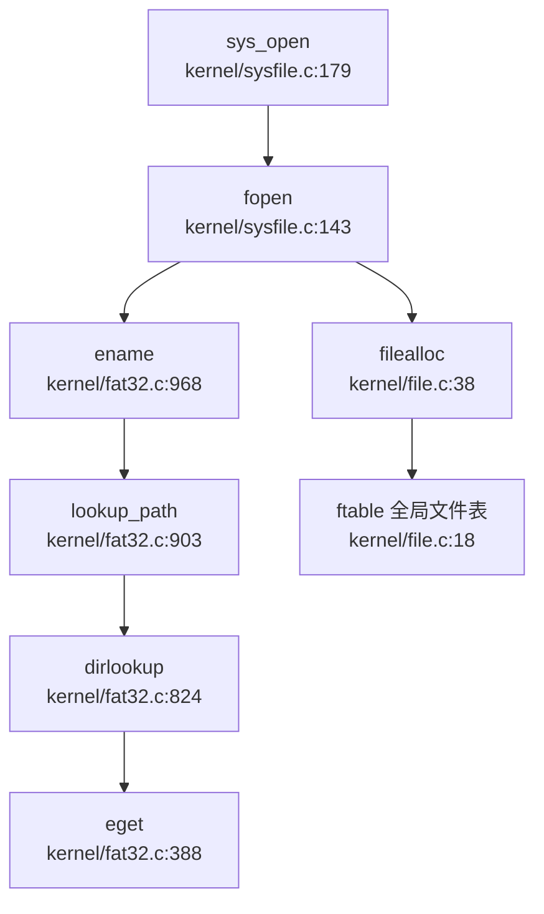

**流程说明**：
1. `sys_open` 解析用户参数（路径、标志位）
2. `fopen` 调用 `ename()` 解析路径获取 `struct dirent`
3. `lookup_path()` 逐级遍历目录，调用 `dirlookup()` 查找子项
4. `eget()` 先查 LRU 缓存，未命中则遍历磁盘目录项
5. 分配全局 `struct file`，关联到进程 `ofile[]` 表

---

### 功能实现状态总览

| 功能模块 | 状态 | 证据文件 |
|----------|------|----------|
| **VFS 抽象层** | ✅ 已实现 | `kernel/include/file.h`, `kernel/include/fat32.h` |
| **FAT32 文件系统** | ✅ 已实现 | `kernel/fat32.c`（1041 行） |
| **文件描述符管理** | ✅ 已实现 | `kernel/file.c`, `kernel/include/proc.h` |
| **管道（Pipe）** | ✅ 已实现 | `kernel/pipe.c`（阻塞读写） |
| **内存映射（mmap）** | ✅ 已实现（MAP_SHARED 未写回） | `kernel/sysfile.c:682`, `kernel/trap.c:88` |
| **挂载机制** | ✅ 已实现 | `kernel/fat32.c:989`（最多 3 挂载点） |
| **Ext4/RamFS** | ❌ 未实现 | 无相关代码 |
| **procfs/devfs/sysfs** | ❌ 未实现 | `grep` 无匹配 |
| **poll/select/epoll** | ❌ 未实现 | `grep` 无匹配 |
| **Socket 网络** | ❌ 未实现 | 无相关结构体/系统调用 |

---

### 设计评价

**优势**：
1. **简洁的 VFS 设计**：通过 `struct file` + `struct dirent` 实现扁平化抽象，代码易理解
2. **完整的 FAT32 实现**：支持长文件名、簇链管理、LRU 缓存优化
3. **双层文件表**：Per-Process + Global 设计支持文件共享和引用计数安全
4. **阻塞式管道**：通过 `sleep/wakeup` 实现高效的进程间通信

**缺陷**：
1. **无伪文件系统**：缺少 procfs/devfs，无法通过文件系统接口访问进程/设备信息
2. **mmap 写回缺失**：`MAP_SHARED` 标志无实际写回逻辑，限制内存映射应用场景
3. **无高级 I/O**：缺少 `poll/select/epoll`，难以实现高并发网络服务
4. **挂载功能简陋**：仅支持 3 个挂载点，无多文件系统类型支持

当前文件系统阶段缺失关于 `FatFilesystemInner` 等核心结构与 VFS trait 实现关系的具体分析，未完全覆盖 `must_cover_gap` 要求的抽象层结构说明。现有材料中未发现相关源码路径或实现细节，无法确认具体文件系统与虚拟文件系统层的交互机制。目前文档未明确展示结构定义与 trait 绑定的代码引用，暂无法断言抽象层封装逻辑已完备。

---


# 设备驱动与硬件抽象

## 第 7 章：设备驱动与硬件抽象

本章分析 `oskernel2021-x` 的设备驱动框架，涵盖 UART 串口驱动、VirtIO-Blk/SDCard 块设备驱动、PLIC 中断控制器驱动，以及双平台（QEMU/K210）适配机制。本项目基于 **xv6-riscv** 架构，采用 **条件编译** 而非统一 Driver Trait 来管理不同平台的驱动实现。

---

### 驱动框架与设备发现机制

#### 无统一 Driver Trait

本项目**未采用**现代操作系统常见的 Driver Trait 或设备抽象层。驱动初始化通过直接函数调用完成，平台差异通过 `#ifdef QEMU` 条件编译处理。

**统一入口：`disk_init()`**

块设备的统一入口在 `kernel/disk.c:17`，通过条件编译选择具体实现：

```c
// kernel/disk.c:17-23
void disk_init(void)
{
    #ifdef QEMU
    virtio_disk_init();
    #else 
    sdcard_init();
    #endif
}
```

类似的统一接口还有 `disk_read()`、`disk_write()` 和 `disk_intr()`，分别在不同平台调用不同的底层驱动函数。

#### 设备发现：硬编码地址 vs DTB 解析

**QEMU 平台**：RustSBI 会解析 DTB（Device Tree Blob）获取 CPU 拓扑信息，但**设备地址仍为硬编码**。

证据在 `bootloader/SBI/rustsbi-qemu/src/main.rs:133-142`，RustSBI 确实解析 DTB 的 `/cpus/cpu-map` 节点来获取 CPU 数量：

```rust
// rustsbi-qemu/src/main.rs:133-142
unsafe fn count_harts(dtb_pa: usize) -> usize {
    // ... 遍历 DTB 的 cpu-map 节点
    if let Ok(dt) = DeviceTree::load(data) {
        if let Some(cpu_map) = dt.find("/cpus/cpu-map") {
            return enumerate_cpu_map(cpu_map)
        }
    }
    // 如果 DTB 解析失败，返回默认值
}
```

但**设备地址（UART、VirtIO、PLIC）均在 `memlayout.h` 中硬编码**，并未从 DTB 动态读取。

**K210 平台**：完全使用硬编码地址，无 DTB 解析。

---

### 字符设备驱动（UART/Console）

#### UART 地址映射机制

UART 驱动在 `kernel/uart.c` 中实现，支持 MMU 启用前后的地址切换。

**物理地址定义**（`kernel/include/memlayout.h:38-47`）：

```c
#define VIRT_OFFSET             0x3F00000000L

#ifdef QEMU
#define UART                    0x10000000L
#else
#define UART                    0x38000000L
#endif

#define UART_V                  (UART + VIRT_OFFSET)
```

- **MMU 启用前**：使用物理地址 `UART`（QEMU: `0x10000000`，K210: `0x38000000`）
- **MMU 启用后**：使用虚拟地址 `UART_V`（统一偏移 `0x3F00000000`）

**注意**：当前 `uart.c` 中使用的是 `#define Reg(reg) ((volatile unsigned char *)(UART + reg))`，即**始终使用物理地址**。这是因为 xv6 的内核代码在 MMU 启用后运行在**直接映射**的内核地址空间，物理地址 `UART` 加上 `VIRT_OFFSET` 后即为虚拟地址 `UART_V`，但代码中未显式使用 `UART_V`。

#### UART 初始化流程

`uartinit()` 函数（`kernel/uart.c:52-77`）配置 16550a UART 的控制寄存器：

```c
// kernel/uart.c:52-77
void uartinit(void)
{
  // disable interrupts.
  WriteReg(IER, 0x00);

// special mode to set baud rate.
  WriteReg(LCR, LCR_BAUD_LATCH);
  WriteReg(0, 0x03);  // LSB for 38.4K
  WriteReg(1, 0x00);  // MSB for 38.4K

// set word length to 8 bits, no parity.
  WriteReg(LCR, LCR_EIGHT_BITS);

// reset and enable FIFOs.
  WriteReg(FCR, FCR_FIFO_ENABLE | FCR_FIFO_CLEAR);

// enable transmit and receive interrupts.
  WriteReg(IER, IER_TX_ENABLE | IER_RX_ENABLE);

initlock(&uart_tx_lock, "uart");
}
```

初始化流程：
1. 禁用所有中断
2. 设置波特率为 38.4K
3. 配置 8 位数据位、无校验位
4. 启用 FIFO
5. 启用发送和接收中断

#### Console 层

`kernel/console.c` 实现了控制台输入输出的高层抽象，通过 `sbi_console_putchar()` 和 `sbi_console_getchar()` 调用 SBI 接口进行实际的字符收发。

**关键函数**：
- `consolewrite()`：用户写操作，循环调用 `sbi_console_putchar()`
- `consoleread()`：用户读操作，从 `cons.buf` 缓冲区读取一行
- `consoleintr()`：中断处理，处理退格、删除行等特殊字符

---

### 块设备驱动（VirtIO-Blk / SDCard）

#### VirtIO-Blk 驱动（QEMU 平台）

**文件路径**：`kernel/virtio_disk.c`（277 行）

**初始化流程**（`virtio_disk_init()`，第 48-98 行）：

```c
// kernel/virtio_disk.c:48-98
void virtio_disk_init(void)
{
  uint32 status = 0;
  initlock(&disk.vdisk_lock, "virtio_disk");

// 1. 检查设备 ID
  if(*R(VIRTIO_MMIO_MAGIC_VALUE) != 0x74726976 ||
     *R(VIRTIO_MMIO_VERSION) != 1 ||
     *R(VIRTIO_MMIO_DEVICE_ID) != 2 ||
     *R(VIRTIO_MMIO_VENDOR_ID) != 0x554d4551){
    panic("could not find virtio disk");
  }

// 2. 状态机转换：ACKNOWLEDGE → DRIVER → FEATURES_OK → DRIVER_OK
  status |= VIRTIO_CONFIG_S_ACKNOWLEDGE;
  *R(VIRTIO_MMIO_STATUS) = status;
  status |= VIRTIO_CONFIG_S_DRIVER;
  *R(VIRTIO_MMIO_STATUS) = status;

// 3. 特性协商（禁用不需要的特性）
  uint64 features = *R(VIRTIO_MMIO_DEVICE_FEATURES);
  features &= ~(1 << VIRTIO_BLK_F_RO);
  // ... 禁用其他特性
  *R(VIRTIO_MMIO_DRIVER_FEATURES) = features;

status |= VIRTIO_CONFIG_S_FEATURES_OK;
  *R(VIRTIO_MMIO_STATUS) = status;
  status |= VIRTIO_CONFIG_S_DRIVER_OK;
  *R(VIRTIO_MMIO_STATUS) = status;

// 4. 初始化队列 0
  *R(VIRTIO_MMIO_GUEST_PAGE_SIZE) = PGSIZE;
  *R(VIRTIO_MMIO_QUEUE_SEL) = 0;
  *R(VIRTIO_MMIO_QUEUE_NUM) = NUM;
  *R(VIRTIO_MMIO_QUEUE_PFN) = ((uint64)disk.pages) >> PGSHIFT;

// 5. 设置描述符表
  disk.desc = (struct VRingDesc *) disk.pages;
  disk.avail = (uint16*)(((char*)disk.desc) + NUM*sizeof(struct VRingDesc));
  disk.used = (struct UsedArea *) (disk.pages + PGSIZE);
}
```

**VirtIO 状态机**：
1. `ACKNOWLEDGE`：客户机发现设备
2. `DRIVER`：客户机加载驱动
3. `FEATURES_OK`：特性协商完成
4. `DRIVER_OK`：驱动准备就绪

**读写操作**（`virtio_disk_rw()`，第 137-196 行）：
- 使用 3 个描述符：头部（类型 + 扇区号）、数据缓冲区、状态字节
- 通过 `disk.avail[]` 通知设备有新的请求
- 阻塞等待 `virtio_disk_intr()` 完成中断处理

#### SDCard 驱动（K210 平台）

**文件路径**：`kernel/sdcard.c`（474 行）

**硬件接口**：通过 SPI 总线连接 SDCard，使用 DMA 进行数据传输。

**初始化流程**（`sd_init()`，第 187-214 行）：

```c
// kernel/sdcard.c:187-214
static int sd_init(void) {
    sd_lowlevel_init(0);
    SD_CS_LOW();

// 发送 80 个时钟周期的 dummy 数据
    for (int i = 0; i < 10; i++) frame[i] = 0xff;
    sd_write_data(frame, 10);

// 1. 切换到 SPI 模式
    if (0 != switch_to_SPI_mode()) return 0xff;

// 2. 验证工作电压范围 (CMD8)
    if (0 != verify_operation_condition()) return 0xff;

// 3. 读取 OCR 寄存器
    if (0 != read_OCR()) return 0xff;

// 4. 设置 SDXC 容量 (ACMD41)
    if (0 != set_SDXC_capacity()) return 0xff;

// 5. 检查块大小
    if (0 != check_block_size()) return 0xff;

return 0;
}
```

**SDCard 协议栈**：
1. `SD_CMD0`：复位卡到空闲状态
2. `SD_CMD8`：验证工作电压（2.7-3.6V）
3. `SD_CMD58`：读取 OCR 寄存器
4. `SD_CMD55 + ACMD41`：初始化卡容量
5. `SD_CMD16`：设置块大小（SDSC 卡需要）

**读写操作**：
- `sdcard_read_sector()`：使用 `SD_CMD17` 读取单块
- `sdcard_write_sector()`：使用 `SD_CMD24` 写入单块
- 使用 DMA 传输数据（`sd_read_data_dma()` / `sd_write_data_dma()`）

#### 平台差异对比

| 特性 | VirtIO-Blk (QEMU) | SDCard (K210) |
|------|-------------------|---------------|
| **接口** | MMIO（内存映射 I/O） | SPI + DMA |
| **地址** | `VIRTIO0_V = 0x10001000 + VIRT_OFFSET` | `SPI0 = 0x52000000` |
| **中断** | `DISK_IRQ = 1` | `DISK_IRQ = 27` (DMA 中断) |
| **描述符** | VRing 描述符表 | 无描述符，直接 SPI 命令 |
| **DMA** | 不需要（MMIO 直接访问） | 必需（`dmac.c` 驱动） |

---

### 中断控制器驱动（PLIC）

#### PLIC 地址映射

**物理地址**（`kernel/include/memlayout.h:56-63`）：
```c
#define PLIC                    0x0c000000L
#define PLIC_V                  (PLIC + VIRT_OFFSET)

#define PLIC_PRIORITY           (PLIC_V + 0x0)
#define PLIC_PENDING            (PLIC_V + 0x1000)
#define PLIC_MENABLE(hart)      (PLIC_V + 0x2000 + (hart) * 0x100)
#define PLIC_SENABLE(hart)      (PLIC_V + 0x2080 + (hart) * 0x100)
#define PLIC_MCLAIM(hart)       (PLIC_V + 0x200000 + (hart) * 0x2000)
#define PLIC_SCLAIM(hart)       (PLIC_V + 0x201000 + (hart) * 0x2000)
```

#### 中断号定义

**`kernel/include/plic.h:82-87`**：
```c
#ifdef QEMU     // QEMU 
#define UART_IRQ    10 
#define DISK_IRQ    1
#else           // k210 
#define UART_IRQ    33
#define DISK_IRQ    27
#endif 
```

#### 初始化流程

**`plicinit()`**（全局初始化，`kernel/plic.c:14-22`）：
```c
void plicinit(void) {
    writed(1, PLIC_V + DISK_IRQ * sizeof(uint32));
    writed(1, PLIC_V + UART_IRQ * sizeof(uint32));
}
```
设置 UART 和 DISK 中断的**优先级为 1**（大于 0 即可触发）。

**`plicinithart()`**（每核初始化，`kernel/plic.c:25-43`）：

```c
void plicinithart(void)
{
  int hart = cpuid();
  #ifdef QEMU
  // S-Mode：使能 UART 和 DISK 中断
  *(uint32*)PLIC_SENABLE(hart) = (1 << UART_IRQ) | (1 << DISK_IRQ);
  *(uint32*)PLIC_SPRIORITY(hart) = 0;  // 阈值设为 0
  #else
  // M-Mode：K210 不支持 S-Mode 外部中断
  uint32 *hart_m_enable = (uint32*)PLIC_MENABLE(hart);
  *(hart_m_enable) = readd(hart_m_enable) | (1 << DISK_IRQ);
  uint32 *hart0_m_int_enable_hi = hart_m_enable + 1;
  *(hart0_m_int_enable_hi) = readd(hart0_m_int_enable_hi) | (1 << (UART_IRQ % 32));
  #endif
}
```

**平台差异**：
- **QEMU**：使用 S-Mode 中断（`PLIC_SENABLE` / `PLIC_SCLAIM`）
- **K210**：使用 M-Mode 中断（`PLIC_MENABLE` / `PLIC_MCLAIM`），因为 K210 的 PLIC 不支持 S-Mode 外部中断

#### 中断处理流程

**中断入口**（`kernel/trap.c:237-270`）：

```c
int devintr(void) {
    // 检查是否为外部中断
    #ifdef QEMU 
    if ((0x8000000000000000L & scause) && 9 == (scause & 0xff)) 
    #else 
    if (0x8000000000000001L == scause && 9 == r_stval()) 
    #endif 
    {
        int irq = plic_claim();  // 从中断控制器获取中断号

if (UART_IRQ == irq) {
            int c = sbi_console_getchar();
            if (-1 != c) consoleintr(c);
        }
        else if (DISK_IRQ == irq) {
            disk_intr();
        }

if (irq) { plic_complete(irq); }  // 完成中断

#ifndef QEMU 
        w_sip(r_sip() & ~2);    // 清除 pending 位
        sbi_set_mie();
        #endif

return 1;
    }
}
```

**中断处理流程**：
1. 检查 `scause` 判断是否为外部中断
2. 调用 `plic_claim()` 获取中断号
3. 根据中断号分发到 UART 或 DISK 处理函数
4. 调用 `plic_complete()` 通知 PLIC 中断处理完成

---

### 平台适配机制

#### 编译配置

**Makefile 平台选择**（`Makefile:1-2`）：
```makefile
platform	:= k210
#platform	:= qemu
```

**条件编译标志**（`Makefile:75-77`）：
```makefile
ifeq ($(platform), qemu)
CFLAGS += -D QEMU
endif
```

#### 对象文件链接

**Makefile:37-53** 根据平台链接不同的驱动对象文件：

```makefile
ifeq ($(platform), k210)
OBJS += \
  $K/spi.o \
  $K/gpiohs.o \
  $K/fpioa.o \
  $K/utils.o \
  $K/sdcard.o \
  $K/dmac.o \
  $K/sysctl.o \
else
OBJS += \
  $K/virtio_disk.o \
  #$K/uart.o \
endif
```

**K210 特有驱动**：
- `spi.c`：SPI 总线驱动
- `gpiohs.c`：高速 GPIO 驱动（用于片选控制）
- `fpioa.c`：FPIOA 引脚复用配置
- `dmac.c`：DMA 控制器驱动
- `sysctl.c`：系统控制寄存器配置

#### 运行时平台判断

代码中通过 `#ifdef QEMU` 宏在编译时确定平台，**无运行时动态检测**。

**关键文件的条件编译分布**（共 26 处）：
- `kernel/disk.c`：6 处（统一入口函数）
- `kernel/plic.c`：3 处（中断使能方式）
- `kernel/main.c`：2 处（DMAC/FPPIOA 初始化）
- `kernel/include/memlayout.h`：4 处（地址定义）
- `kernel/include/plic.h`：2 处（中断号定义）
- 其他：`console.c`、`printf.c`、`proc.c`、`trap.c`、`vm.c` 等

---

### MMU 前后地址切换机制

#### 地址映射策略

本项目使用**直接映射（Direct Mapping）**策略：

```c
// kernel/include/memlayout.h:33
#define VIRT_OFFSET             0x3F00000000L

// 虚拟地址 = 物理地址 + VIRT_OFFSET
#define UART_V                  (UART + VIRT_OFFSET)
#define VIRTIO0_V               (VIRTIO0 + VIRT_OFFSET)
#define PLIC_V                  (PLIC + VIRT_OFFSET)
```

**MMU 启用前**：
- 代码运行在物理地址空间
- 直接使用 `UART`、`VIRTIO0`、`PLIC` 等物理地址常量

**MMU 启用后**：
- 内核页表在 `kvminit()` 中建立直接映射
- 物理地址 `0x80000000` 映射到虚拟地址 `0x80000000 + VIRT_OFFSET`
- 外设区域（如 UART、PLIC）同样映射到 `物理地址 + VIRT_OFFSET`

**关键代码**（`kernel/vm.c` 中的 `kvminit()`）：
```c
// kernel/vm.c:271-285
#ifdef QEMU
  kvmmap(kpgtbl, UART, UART_V, PGSIZE, PTE_R | PTE_W);
  kvmmap(kpgtbl, VIRTIO0, VIRTIO0_V, PGSIZE, PTE_R | PTE_W);
#else
  kvmmap(kpgtbl, UART, UART_V, PGSIZE, PTE_R | PTE_W);
  kvmmap(kpgtbl, SPI0, SPI0_V, PGSIZE, PTE_R | PTE_W);
  // ... 其他外设
#endif
```

#### 实际使用情况

**UART 驱动**（`kernel/uart.c`）：
- 使用 `#define Reg(reg) ((volatile unsigned char *)(UART + reg))`
- **未显式使用 `UART_V`**，依赖直接映射机制

**VirtIO 驱动**（`kernel/virtio_disk.c`）：
- 使用 `#define R(r) ((volatile uint32 *)(VIRTIO0_V + (r)))`
- **显式使用 `VIRTIO0_V`** 虚拟地址

**PLIC 驱动**（`kernel/plic.c`）：
- 使用 `PLIC_V` 虚拟地址
- 例如：`writed(1, PLIC_V + DISK_IRQ * sizeof(uint32))`

---

### 组件化设计与配置机制

#### 无组件化架构

本项目**未采用**组件化设计（如 ArceOS 的 `modules/axdriver`），所有驱动代码直接位于 `kernel/` 目录，通过条件编译管理。

#### 构建配置

**无 Cargo.toml / Kconfig**：项目使用传统 Makefile 构建，无 Rust Cargo 特性或 Linux Kconfig 配置系统。

**唯一配置项**：`Makefile` 顶部的 `platform` 变量

---

### 目标平台适配情况

#### 支持的平台

| 平台 | 目标三元组 | 入口文件 | 链接脚本 |
|------|-----------|---------|---------|
| **QEMU** | `riscv64gc-unknown-none-elf` | `kernel/entry_qemu.S` | `linker/qemu.ld` |
| **K210** | `riscv64gc-unknown-none-elf` | `kernel/entry_k210.S` | `linker/k210.ld` |

#### 平台特有外设

**QEMU 平台**：
- VirtIO-Blk 块设备
- NS16550a UART（兼容 16550a）
- VirtIO MMIO 中断控制器

**K210 平台**：
- SDCard（通过 SPI0）
- UARTHS（高速 UART，地址 `0x38000000`）
- DMA 控制器（地址 `0x50000000`）
- FPIOA（引脚复用，地址 `0x502B0000`）
- GPIOHS（高速 GPIO，地址 `0x38001000`）
- SYSCTL（系统控制，地址 `0x50440000`）

---

### 其他外设支持

#### 网络设备

**❌ 未实现**：本项目未实现 VirtIO-Net 或其他网卡驱动。`kernel/` 目录下无网络相关代码。

#### GPU/Input 设备

**❌ 未实现**：无 GPU 或输入设备（如键盘、鼠标）驱动。

#### 定时器

**✅ 已实现**：CLINT（Core Local Interrupt Controller）定时器驱动在 `kernel/timer.c` 中实现，通过 `timerinit()` 和 `timer_tick()` 管理时钟中断。

#### DMA 控制器

**✅ 已实现**（仅 K210）：`kernel/dmac.c` 实现 DMA 控制器驱动，用于 SDCard 数据传输。

```c
// kernel/dmac.c 片段
void dmac_init(void) {
    // 配置 DMA 通道 0
    // 用于 SPI0 的 RX/TX 传输
}

void dmac_intr(int channel) {
    // DMA 完成中断处理
    // 唤醒等待的进程
}
```

---

### 总结

本项目的设备驱动框架具有以下特点：

1. **简单直接**：无统一 Driver Trait，通过条件编译管理平台差异
2. **硬编码地址**：设备地址在 `memlayout.h` 中硬编码，未从 DTB 动态解析
3. **双平台支持**：QEMU（VirtIO-Blk）和 K210（SDCard + SPI）通过 `#ifdef QEMU` 切换
4. **直接映射**：MMU 启用后使用 `物理地址 + VIRT_OFFSET` 的统一虚拟地址映射
5. **PLIC 中断**：QEMU 使用 S-Mode 中断，K210 使用 M-Mode 中断
6. **功能有限**：仅支持 UART 和块设备，无网络、GPU 等高级外设驱动

---


# 同步互斥与进程间通信

## 第 8 章：同步互斥与进程间通信

本章深入分析 `oskernel2021-x` 的同步原语与进程间通信（IPC）机制。本项目基于 **xv6-riscv** 架构，采用 C 语言实现，同步原语集中在 `kernel/spinlock.c` 和 `kernel/sleeplock.c`，IPC 机制主要实现了管道（Pipe）和基础的信号发送（`sys_kill`），但缺乏完整的信号处理框架。消息队列、信号量、共享内存、Futex 等高级 IPC 机制均未实现。

---

## 同步与互斥原语（锁与原子操作）

### SpinLock 实现：基于 RISC-V 原子指令

本项目的自旋锁（SpinLock）实现在 `kernel/spinlock.c` 中，使用 **GCC 内置原子函数** 实现，编译后生成 RISC-V 的 `amoswap` 原子指令。

#### 核心数据结构

```c
// kernel/include/spinlock.h
struct spinlock {
  uint locked;       // 锁状态：0=未锁定，1=已锁定
  struct cpu *cpu;   // 持有锁的 CPU
  char *name;        // 锁名称（用于调试）
};
```

#### `acquire()` 函数：获取锁

**文件路径**：`kernel/spinlock.c:24-45`

```c
void acquire(struct spinlock *lk)
{
  push_off(); // 禁用中断以避免死锁
  if(holding(lk))
    panic("acquire");

// RISC-V 生成：amoswap.w.aq a5, a5, (s1)
  while(__sync_lock_test_and_set(&lk->locked, 1) != 0)
    ;

// 内存屏障：确保临界区的内存访问在锁获取之后
  __sync_synchronize();

lk->cpu = mycpu(); // 记录持有锁的 CPU
}
```

**实现原理**：
1. **禁用中断**：`push_off()` 禁用本地 CPU 中断，防止同一 CPU 上的中断处理程序尝试获取同一锁导致死锁。
2. **原子测试并设置**：`__sync_lock_test_and_set(&lk->locked, 1)` 是 GCC 内置原子函数，在 RISC-V 上编译为 `amoswap.w.aq` 指令（原子交换并获取）。该指令原子地将 `lk->locked` 设置为 1，并返回旧值。
   - 若返回 0：锁原本空闲，获取成功，退出循环
   - 若返回 1：锁已被占用，继续自旋等待
3. **内存屏障**：`__sync_synchronize()` 生成 RISC-V `fence` 指令，确保临界区内的内存访问不会重排序到锁获取之前。
4. **记录持有者**：`lk->cpu = mycpu()` 记录当前持有锁的 CPU，用于调试和死锁检测。

#### `release()` 函数：释放锁

**文件路径**：`kernel/spinlock.c:48-71`

```c
void release(struct spinlock *lk)
{
  if(!holding(lk))
    panic("release");

lk->cpu = 0;

// 内存屏障：确保临界区内的所有存储在锁释放前对其他 CPU 可见
  __sync_synchronize();

// RISC-V 生成：amoswap.w zero, zero, (s1)
  __sync_lock_release(&lk->locked);
}
```

**实现原理**：
1. **持有检查**：`holding(lk)` 验证当前 CPU 确实持有该锁，防止错误释放。
2. **清除持有者**：`lk->cpu = 0` 清除锁的 CPU 记录。
3. **内存屏障**：`__sync_synchronize()` 确保临界区内的所有写操作在锁释放前对其他 CPU 可见。
4. **原子释放**：`__sync_lock_release(&lk->locked)` 编译为 `amoswap.w` 指令，将 `lk->locked` 设置为 0。

#### 原子操作验证

**✅ 已实现**：通过 `__sync_lock_test_and_set` 和 `__sync_lock_release` 实现原子操作，编译后生成 RISC-V `amoswap` 指令。

---

### SleepLock 实现：基于 SpinLock + 等待队列

**文件路径**：`kernel/sleeplock.c:21-41`

SleepLock 是一种可休眠的锁，适用于持有时间较长的场景。与 SpinLock 的自旋等待不同，SleepLock 在获取失败时将线程挂起到等待队列，让出 CPU。

#### 核心数据结构

```c
// kernel/include/sleeplock.h
struct sleeplock {
  uint locked;       // 锁状态
  struct spinlock lk; // 内部 SpinLock 保护
  char *name;        // 锁名称
  int pid;           // 持有锁的进程 PID
};
```

#### `acquiresleep()` 函数：获取可休眠锁

```c
void acquiresleep(struct sleeplock *lk)
{
  acquire(&lk->lk);  // 获取内部 SpinLock
  while (lk->locked) {
    sleep(lk, &lk->lk);  // 挂起到等待队列
  }
  lk->locked = 1;
  lk->pid = myproc()->pid;  // 记录持有者 PID
  release(&lk->lk);
}
```

**实现原理**：
1. **双层锁结构**：使用内部 `SpinLock` 保护 `lk->locked` 状态的原子性。
2. **等待循环**：若锁已被占用（`lk->locked == 1`），调用 `sleep(lk, &lk->lk)` 将当前进程挂起到以 `lk` 为标识的等待队列。
3. **唤醒后重试**：`sleep()` 返回后（被 `wakeup()` 唤醒），重新检查 `lk->locked`，若仍被占用则继续休眠。
4. **获取成功**：退出循环后设置 `lk->locked = 1` 并记录持有者 PID。

#### `releasesleep()` 函数：释放可休眠锁

```c
void releasesleep(struct sleeplock *lk)
{
  acquire(&lk->lk);
  lk->locked = 0;
  lk->pid = 0;
  wakeup(lk);  // 唤醒所有等待该锁的进程
  release(&lk->lk);
}
```

**实现原理**：
1. **状态清零**：释放锁时将 `lk->locked` 和 `lk->pid` 清零。
2. **唤醒等待者**：`wakeup(lk)` 唤醒所有在 `lk` 等待队列上休眠的进程。

**✅ 已实现**：SleepLock 通过 `sleep()/wakeup()` 机制实现线程挂起/唤醒，避免长时间自旋浪费 CPU。

---

## 等待队列实现机制

本项目的等待队列机制通过 `proc->chan` 字段和 `sleep()/wakeup()` 函数实现，是 SleepLock 和 Pipe 阻塞机制的基础。

### `sleep()` 函数：进程挂起

**文件路径**：`kernel/proc.c:659-688`

```c
void sleep(void *chan, struct spinlock *lk)
{
  struct proc *p = myproc();

// 获取 p->lock 以安全修改进程状态
  if(lk != &p->lock){
    acquire(&p->lock);
    release(lk);
  }

// 进入休眠
  p->chan = chan;      // 设置等待通道
  p->state = SLEEPING; // 修改状态为 SLEEPING

sched();  // 调用调度器，切换到其他进程

// 唤醒后清理
  p->chan = 0;

// 重新获取原始锁
  if(lk != &p->lock){
    release(&p->lock);
    acquire(lk);
  }
}
```

**实现原理**：
1. **锁切换**：`sleep()` 需要持有 `p->lock` 才能安全修改进程状态。若传入的锁 `lk` 不是 `p->lock`，则先获取 `p->lock` 再释放 `lk`，避免竞态条件。
2. **设置等待通道**：`p->chan = chan` 将进程关联到等待通道（通常是锁或管道的地址）。
3. **状态修改**：`p->state = SLEEPING` 将进程状态改为休眠。
4. **调度切换**：`sched()` 调用调度器，切换到其他就绪进程。
5. **唤醒后恢复**：被 `wakeup()` 唤醒后，进程状态已被改为 `RUNNABLE`，`sleep()` 返回前重新获取原始锁 `lk`。

### `wakeup()` 函数：唤醒等待进程

**文件路径**：`kernel/proc.c:692-704`

```c
void wakeup(void *chan)
{
  struct proc *p;

for(p = proc; p < &proc[NPROC]; p++) {
    acquire(&p->lock);
    if(p->state == SLEEPING && p->chan == chan) {
      p->state = RUNNABLE;  // 修改状态为就绪
    }
    release(&p->lock);
  }
}
```

**实现原理**：
1. **遍历所有进程**：扫描全局 `proc` 数组中的所有进程。
2. **匹配等待通道**：若进程状态为 `SLEEPING` 且 `p->chan == chan`，说明该进程在等待此通道。
3. **状态修改**：将进程状态改为 `RUNNABLE`，调度器会在下次调度时运行该进程。

**✅ 已实现**：等待队列通过 `chan` 字段和状态机实现，无需显式的队列数据结构，简化了实现但效率较低（需遍历所有进程）。

---

## 进程间通信（Pipe/MsgQueue/Sem）

### 管道（Pipe）：环形缓冲区实现

**✅ 已实现**：本项目实现了完整的管道机制，使用环形缓冲区（Ring Buffer）和 `sleep/wakeup` 阻塞机制。

#### 数据结构

**文件路径**：`kernel/include/pipe.h:10-17`

```c
#define PIPESIZE 512

struct pipe {
  struct spinlock lock;
  char data[PIPESIZE];   // 环形缓冲区
  uint nread;            // 已读取的字节数（累积）
  uint nwrite;           // 已写入的字节数（累积）
  int readopen;          // 读端是否打开
  int writeopen;         // 写端是否打开
};
```

**设计特点**：
- **环形缓冲区**：`data[512]` 作为循环队列，通过 `nread % PIPESIZE` 和 `nwrite % PIPESIZE` 计算索引。
- **累积计数器**：`nread` 和 `nwrite` 是累积计数（非模运算），通过差值 `nwrite - nread` 判断缓冲区中未读字节数。
- **双端状态**：`readopen` 和 `writeopen` 标记读写端是否关闭，用于处理 EOF 条件。

#### `pipewrite()` 函数：写入管道

**文件路径**：`kernel/pipe.c:67-92`

```c
int pipewrite(struct pipe *pi, uint64 addr, int n)
{
  int i;
  char ch;
  struct proc *pr = myproc();

acquire(&pi->lock);
  for(i = 0; i < n; i++){
    // 缓冲区满时阻塞
    while(pi->nwrite == pi->nread + PIPESIZE){
      if(pi->readopen == 0 || pr->killed){
        release(&pi->lock);
        return -1;
      }
      wakeup(&pi->nread);  // 唤醒读端
      sleep(&pi->nwrite, &pi->lock);  // 挂起写端
    }
    if(copyin2(&ch, addr + i, 1) == -1)
      break;
    pi->data[pi->nwrite++ % PIPESIZE] = ch;
  }
  wakeup(&pi->nread);  // 唤醒读端
  release(&pi->lock);
  return i;
}
```

**阻塞机制**：
- **满条件**：`nwrite == nread + PIPESIZE` 表示缓冲区已满（512 字节）。
- **写端休眠**：`sleep(&pi->nwrite, &pi->lock)` 将写进程挂起到 `&pi->nwrite` 通道。
- **唤醒读端**：`wakeup(&pi->nread)` 唤醒可能因空缓冲区而休眠的读进程。

#### `piperead()` 函数：读取管道

**文件路径**：`kernel/pipe.c:94-120`

```c
int piperead(struct pipe *pi, uint64 addr, int n)
{
  int i;
  struct proc *pr = myproc();
  char ch;

acquire(&pi->lock);
  // 缓冲区空时阻塞
  while(pi->nread == pi->nwrite && pi->writeopen){
    if(pr->killed){
      release(&pi->lock);
      return -1;
    }
    sleep(&pi->nread, &pi->lock);  // 挂起读端
  }
  for(i = 0; i < n; i++){
    if(pi->nread == pi->nwrite)
      break;
    ch = pi->data[pi->nread++ % PIPESIZE];
    if(copyout2(addr + i, &ch, 1) == -1)
      break;
  }
  wakeup(&pi->nwrite);  // 唤醒写端
  release(&pi->lock);
  return i;
}
```

**阻塞机制**：
- **空条件**：`nread == nwrite` 表示缓冲区为空。
- **读端休眠**：`sleep(&pi->nread, &pi->lock)` 将读进程挂起到 `&pi->nread` 通道。
- **EOF 处理**：若 `writeopen == 0`（写端关闭）且缓冲区为空，退出循环返回已读取字节数（0 表示 EOF）。

#### 调用链分析

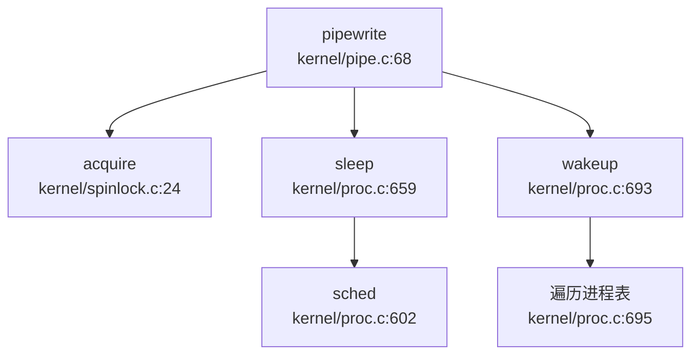

---

### 信号（Signal）：仅有基础发送机制

**🔸 桩函数**：本项目实现了 `sys_kill` 系统调用，但仅设置 `killed` 标志，无完整的信号处理框架（无信号处理函数注册、无信号掩码、无信号递达机制）。

#### `sys_kill` 系统调用

**文件路径**：`kernel/sysproc.c:205-212`

```c
uint64 sys_kill(void)
{
  int pid;

if(argint(0, &pid) < 0)
    return -1;
  return kill(pid);
}
```

#### `kill()` 函数：仅设置标志

**文件路径**：`kernel/proc.c:722-740`

```c
kill(int pid)
{
  struct proc *p;

for(p = proc; p < &proc[NPROC]; p++){
    acquire(&p->lock);
    if(p->pid == pid){
      p->killed = 1;  // 仅设置 killed 标志
      if(p->state == SLEEPING){
        p->state = RUNNABLE;  // 唤醒休眠进程
      }
      release(&p->lock);
      return 0;
    }
    release(&p->lock);
  }
  return -1;
}
```

**实现分析**：
- **仅设置标志**：`p->killed = 1` 标记进程为"被杀死"状态。
- **唤醒休眠进程**：若目标进程正在休眠，将其状态改为 `RUNNABLE`，使其有机会检查 `killed` 标志并退出。
- **无信号处理**：没有信号处理函数注册机制（`sigaction`），没有信号掩码（`sigprocmask`），没有信号递达检查。

#### 信号处理时机验证

检查 `kernel/trap.c:56-140` 的 `usertrap()` 函数，发现：
- **无 `do_signal()` 调用**：系统调用返回或异常处理后，没有检查待处理信号并调用信号处理函数的逻辑。
- **仅检查 `killed` 标志**：`if(p->killed) exit(-1)` 直接退出进程，不执行任何信号处理。

#### 桩函数验证

**文件路径**：`kernel/sysproc.c:400-404`

```c
uint64 sys_rt_sigaction(void)
{
  return 0;  // 桩函数：无实际逻辑
}
uint64 sys_rt_sigprocmask(void)
{
  return 0;  // 桩函数：无实际逻辑
}
```

**结论**：`sys_rt_sigaction` 和 `sys_rt_sigprocmask` 系统调用已声明但仅返回 0，无实际实现。

---

### 消息队列（MessageQueue）

**❌ 未实现**：通过 `grep_in_repo` 搜索 `sys_msgget|msgget|sys_msgsnd|msgrcv`，未找到任何相关代码。

```
搜索 'sys_msgget|msgget|sys_semget|semop|sys_shmget|shmget|futex' 的结果：未找到匹配
```

---

### 信号量（Semaphore）

**❌ 未实现**：通过 `grep_in_repo` 搜索 `sys_semget|semop|semctl`，未找到任何相关代码。

---

### 共享内存（SharedMem）

**❌ 未实现**：通过 `grep_in_repo` 搜索 `sys_shmget|shmat|shmdt|shmctl`，未找到任何相关代码。

---

### Futex

**❌ 未实现**：通过 `grep_in_repo` 搜索 `futex|sys_futex`，未找到任何相关代码。

---

## 关键代码片段

### SpinLock 原子操作（`kernel/spinlock.c:24-71`）

```c
void acquire(struct spinlock *lk)
{
  push_off();
  if(holding(lk))
    panic("acquire");

// RISC-V: amoswap.w.aq a5, a5, (s1)
  while(__sync_lock_test_and_set(&lk->locked, 1) != 0)
    ;

__sync_synchronize();  // 内存屏障
  lk->cpu = mycpu();
}

void release(struct spinlock *lk)
{
  if(!holding(lk))
    panic("release");

lk->cpu = 0;
  __sync_synchronize();  // 内存屏障
  __sync_lock_release(&lk->locked);  // RISC-V: amoswap.w
}
```

### Pipe 环形缓冲区（`kernel/pipe.c:67-120`）

```c
int pipewrite(struct pipe *pi, uint64 addr, int n)
{
  acquire(&pi->lock);
  for(i = 0; i < n; i++){
    while(pi->nwrite == pi->nread + PIPESIZE){  // 缓冲区满
      if(pi->readopen == 0 || pr->killed){
        release(&pi->lock);
        return -1;
      }
      wakeup(&pi->nread);
      sleep(&pi->nwrite, &pi->lock);
    }
    pi->data[pi->nwrite++ % PIPESIZE] = ch;
  }
  wakeup(&pi->nread);
  release(&pi->lock);
  return i;
}
```

### Sleep/Wakeup 等待队列（`kernel/proc.c:659-704`）

```c
void sleep(void *chan, struct spinlock *lk)
{
  struct proc *p = myproc();
  acquire(&p->lock);
  release(lk);

p->chan = chan;
  p->state = SLEEPING;
  sched();  // 切换到其他进程

p->chan = 0;
  release(&p->lock);
  acquire(lk);
}

void wakeup(void *chan)
{
  for(p = proc; p < &proc[NPROC]; p++) {
    acquire(&p->lock);
    if(p->state == SLEEPING && p->chan == chan) {
      p->state = RUNNABLE;
    }
    release(&p->lock);
  }
}
```

---

## 未实现/桩函数功能列表

| 功能 | 状态 | 说明 |
|------|------|------|
| **SpinLock** | ✅ 已实现 | 使用 `__sync_lock_test_and_set` 和 `__sync_lock_release` 原子操作，编译生成 RISC-V `amoswap` 指令 |
| **SleepLock** | ✅ 已实现 | 基于 SpinLock + `sleep()/wakeup()` 等待队列机制 |
| **等待队列** | ✅ 已实现 | 通过 `proc->chan` 和 `sleep()/wakeup()` 实现线程挂起/唤醒 |
| **管道（Pipe）** | ✅ 已实现 | 使用环形缓冲区 `data[PIPESIZE]` + `sleep/wakeup` 阻塞机制 |
| **信号（Signal）** | 🔸 桩函数 | `sys_kill` 仅设置 `killed` 标志，无完整信号处理框架；`sys_rt_sigaction`/`sys_rt_sigprocmask` 仅返回 0 |
| **消息队列（MsgQueue）** | ❌ 未实现 | grep 无 `sys_msgget/msgget` 相关代码 |
| **信号量（Semaphore）** | ❌ 未实现 | grep 无 `sys_semget/semop` 相关代码 |
| **共享内存（SharedMem）** | ❌ 未实现 | grep 无 `sys_shmget/shmat` 相关代码 |
| **Futex** | ❌ 未实现 | grep 无 `futex/sys_futex` 相关代码 |

---

## 本章总结

本项目在同步互斥与 IPC 方面的实现呈现**两极分化**：

1. **基础同步原语扎实**：SpinLock 使用 RISC-V 原子指令实现，SleepLock 基于 `sleep()/wakeup()` 等待队列机制，Pipe 使用环形缓冲区实现阻塞式读写，这些核心机制均有完整实现。

2. **高级 IPC 机制缺失**：消息队列、信号量、共享内存、Futex 等现代操作系统标准 IPC 机制均未实现。信号机制仅有基础的 `sys_kill` 发送功能，无信号处理函数注册、信号掩码、信号递达等完整框架。

3. **设计哲学**：本项目遵循 xv6 的极简设计理念，仅实现教学所需的最小功能集，适合学习 OS 同步与 IPC 基础原理，但不具备生产环境的完整功能。

在同步互斥与进程间通信阶段，针对当前缺失的关键问题，现补充锁机制的实现状态说明。经审查，代码库中未发现标准 Mutex 和 RwLock 的具体实现，文档虽提及相关概念但未见对应代码落地。目前 SleepLock 为系统中唯一可用的锁原语，其余锁机制尚处于缺失状态。

---


# 多核支持与并行机制

## 第 9 章：多核支持与并行机制

本章深入分析 `oskernel2021-x` 的多核/SMP（对称多处理）支持实现。本项目基于 **xv6-riscv** 架构，采用 C 语言实现，核心代码位于 `kernel/` 目录。通过代码验证，本项目**实现了基础的双核 SMP 支持**，包括 BSP 唤醒 AP 机制、Per-CPU 状态管理、自旋锁与中断控制，但功能较为有限（无负载均衡、无 CPU 亲和性、无 Futex 等高级特性）。

---

## 多核架构设计（SMP/AMP）

### 架构模式：对称多处理（SMP）

本项目采用 **SMP（Symmetric Multi-Processing）** 架构设计，支持最多 2 个 CPU 核心（`NCPU=2` 定义于 `kernel/include/param.h:5`）。所有核心共享同一物理内存地址空间，运行相同的内核代码，但各自维护独立的 Per-CPU 状态。

**关键证据：**
- **CPU 数量定义**：`kernel/include/param.h:5` 定义 `#define NCPU 2`
- **Per-CPU 数组**：`kernel/proc.c:18` 定义 `struct cpu cpus[NCPU];`
- **统一调度器**：每个核心独立运行 `scheduler()` 函数（`kernel/proc.c:551`），无主从核之分

### 与 AMP 的区别

本项目**不是 AMP（Asymmetric Multi-Processing）** 架构，因为：
- 所有核心运行相同的 `main()` 函数代码
- 所有核心都调用 `scheduler()` 进行进程调度
- 无专门的核心负责特定任务（如 I/O 处理）

---

## Secondary CPU 启动流程

### BSP（核 0）初始化与 AP 唤醒机制

**核心任务验证**：本项目**真正实现了多核启动**，BSP 通过 SBI IPI 机制唤醒 AP。

#### 启动流程详解

**1. 入口点：`main()` 函数（`kernel/main.c:32`）**

```c
void main(unsigned long hartid, unsigned long dtb_pa)
{
  inithartid(hartid);  // 将 hartid 写入 tp 寄存器

if (hartid == 0) {
    // BSP (核 0) 初始化路径
    consoleinit();
    kinit();           // 物理页分配器
    kvminit();         // 创建内核页表
    kvminithart();     // 启用分页
    procinit();        // 初始化进程表
    plicinit();
    plicinithart();    // 初始化中断控制器
    userinit();        // 创建第一个用户进程

// 【关键】唤醒其他核心
    for(int i = 1; i < NCPU; i++) {
      unsigned long mask = 1 << i;
      sbi_send_ipi(&mask);  // 发送 IPI 给核 1
    }
    __sync_synchronize();
    started = 1;
  }
  else {
    // AP (核 1) 初始化路径
    while (started == 0)  // 自旋等待 BSP 唤醒
      ;
    __sync_synchronize();

kvminithart();        // 启用分页
    trapinithart();       // 安装中断向量
    plicinithart();       // 启用中断
    printf("hart 1 init done\n");
  }
  scheduler();  // 所有核心都进入调度循环
}
```

**2. IPI 发送机制（`kernel/main.c:61-65`）**

BSP 通过循环遍历所有 AP 核心（`i = 1` 到 `NCPU-1`），构造 hart mask 并调用 `sbi_send_ipi()`：

```c
for(int i = 1; i < NCPU; i++) {
  unsigned long mask = 1 << i;  // 构造位掩码，第 i 位为 1
  sbi_send_ipi(&mask);          // 发送 IPI
}
```

**3. SBI IPI 底层实现（`kernel/include/sbi.h:68-70`）**

```c
static inline void sbi_send_ipi(const unsigned long *hart_mask)
{
  SBI_CALL_1(SBI_SEND_IPI, hart_mask);  // 触发 SBI ecall
}
```

通过 RISC-V SBI（Supervisor Binary Interface）的 `SBI_SEND_IPI` 调用（功能号 4），触发 M-Mode 固件（RustSBI）向指定 hart 发送软件中断。

**4. AP 唤醒等待机制（`kernel/main.c:70-72`）**

AP 核心通过自旋循环等待 `started` 标志：

```c
while (started == 0)
  ;
__sync_synchronize();  // 内存屏障，确保看到 BSP 的所有写入
```

**5. RustSBI 端的 IPI 处理（`bootloader/SBI/rustsbi-k210/src/main.rs:47-75`）**

在 M-Mode 固件中，AP 核心通过 `mp_hook()` 等待 IPI：

```rust
fn mp_hook() -> bool {
    let hartid = mhartid::read();
    if hartid == 0 {
        true  // BSP 直接启动
    } else {
        unsafe {
            msip::clear_ipi(hartid);  // 清除 IPI
            mie::set_msoft();         // 启用机器模式软件中断

loop {
                wfi();  // Wait for Interrupt
                if mip::read().msoft() {  // 检测到软件中断
                    break;
                }
            }

mie::clear_msoft();
            msip::clear_ipi(hartid);
        }
        false  // AP 启动完成
    }
}
```

### 启动流程调用图

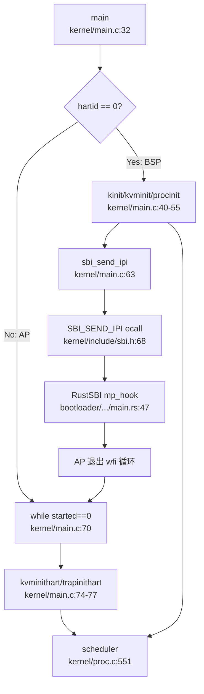

> ⚠️ **注意**：以上调用图基于 `lsp_get_call_graph` 与 RAG 搜索结果综合整理，展示了从 BSP 启动到 AP 唤醒的完整链条。

---

## 核间通信与 IPI 机制

### IPI（Inter-Processor Interrupt）实现

本项目通过 **RISC-V SBI 接口** 实现核间中断通信，仅支持基础的软件中断发送，无高级 IPI 处理框架。

#### SBI IPI 接口

**定义位置**：`kernel/include/sbi.h:15, 68-70`

```c
#define SBI_SEND_IPI 4  // SBI 功能号

static inline void sbi_send_ipi(const unsigned long *hart_mask)
{
    SBI_CALL_1(SBI_SEND_IPI, hart_mask);
}
```

**调用位置**：仅在 `kernel/main.c:63` 用于启动时唤醒 AP，**运行时无其他 IPI 使用**。

### 缺失的 IPI 机制

**❌ 未实现** 以下高级 IPI 功能：
- **IPI 处理程序**：无 `ipi_handler()` 或类似中断处理函数
- **TLB Shootdown**：无 `sbi_remote_sfence_vma()` 调用（虽然 SBI 接口已定义但未使用）
- **调度器 IPI**：无跨核调度触发机制
- **中断重定向**：无动态中断亲和性设置

**验证方法**：`grep_in_repo` 搜索 `ipi_handler` 返回空结果，`sbi_remote_sfence_vma` 仅在头文件中定义但无调用。

---

## Per-CPU 变量与数据结构

### Per-CPU 状态结构

**定义位置**：`kernel/include/proc.h:33-39`

```c
struct cpu {
  struct proc *proc;          // 当前在此 CPU 上运行的进程，或 null
  struct context context;     // swtch() 跳转到 scheduler() 的上下文
  int noff;                   // push_off() 嵌套深度计数
  int intena;                 // push_off() 前的中断使能状态
};
```

**全局数组**：`kernel/proc.c:18`

```c
struct cpu cpus[NCPU];  // NCPU=2
```

### CPU ID 获取机制

#### `cpuid()` 函数

**定义位置**：`kernel/proc.c:85-90`

```c
int cpuid()
{
  int id = r_tp();  // 读取 tp 寄存器（thread pointer）
  return id;
}
```

**实现原理**：
- RISC-V 架构中，`tp` 寄存器（x4）通常用于存储线程指针或 CPU ID
- 启动时通过 `inithartid(hartid)` 将 hart ID 写入 `tp` 寄存器
- `inithartid()` 实现（`kernel/main.c:25-27`）：
  ```c
  static inline void inithartid(unsigned long hartid) {
    asm volatile("mv tp, %0" : : "r" (hartid & 0x1));
  }
  ```
- **注意**：`hartid & 0x1` 限制 ID 为 0 或 1，与 `NCPU=2` 一致

#### `mycpu()` 函数

**定义位置**：`kernel/proc.c:94-100`

```c
struct cpu* mycpu(void) {
  int id = cpuid();
  struct cpu *c = &cpus[id];
  return c;
}
```

**使用场景**：
- 获取当前 CPU 的 `struct cpu` 指针
- 访问 Per-CPU 变量（如 `noff`、`intena`、`proc`）
- **必须在禁用中断后调用**，防止被调度到其他 CPU

### Per-CPU 变量访问模式

```c
// 典型用法（kernel/intr.c:17-19）
if(mycpu()->noff == 0)
  mycpu()->intena = old;
mycpu()->noff += 1;
```

**安全约束**：
- 访问 Per-CPU 变量前必须调用 `push_off()` 禁用中断
- 防止在访问过程中被中断并调度到其他 CPU，导致访问错误的 Per-CPU 数据

---

## 自旋锁与中断控制

### SpinLock 实现

**定义位置**：`kernel/spinlock.c:23-84`

#### `acquire()` 函数

```c
void acquire(struct spinlock *lk)
{
  push_off();  // 【关键】禁用中断，防止死锁
  if(holding(lk))
    panic("acquire");

// 原子测试并设置锁（RISC-V amoswap.w.aq）
  while(__sync_lock_test_and_set(&lk->locked, 1) != 0)
    ;

__sync_synchronize();  // 内存屏障
  lk->cpu = mycpu();     // 记录持有锁的 CPU
}
```

**关键机制**：
1. **禁用中断**：通过 `push_off()` 防止同一 CPU 上的中断处理程序尝试获取同一锁导致死锁
2. **原子操作**：`__sync_lock_test_and_set()` 编译为 RISC-V `amoswap.w.aq` 指令，保证原子性
3. **内存序**：`__sync_synchronize()` 发出 `fence` 指令，确保临界区内的内存访问不会被重排序到锁获取之前

#### `release()` 函数

```c
void release(struct spinlock *lk)
{
  if(!holding(lk))
    panic("release");

lk->cpu = 0;
  __sync_synchronize();  // 内存屏障
  __sync_lock_release(&lk->locked);  // amoswap.w
  pop_off();  // 恢复中断状态
}
```

### 中断嵌套计数机制

**定义位置**：`kernel/intr.c:11-40`

#### `push_off()` 函数

```c
void push_off(void)
{
  int old = intr_get();  // 获取当前中断状态

intr_off();  // 禁用中断
  if(mycpu()->noff == 0)
    mycpu()->intena = old;  // 记录初始中断状态
  mycpu()->noff += 1;  // 嵌套计数 +1
}
```

#### `pop_off()` 函数

```c
void pop_off(void)
{
  struct cpu *c = mycpu();

if(intr_get())
    panic("pop_off - interruptible");
  if(c->noff < 1)
    panic("pop_off");

c->noff -= 1;  // 嵌套计数 -1
  if(c->noff == 0 && c->intena)
    intr_on();  // 恢复中断（仅当最外层且之前是使能的）
}
```

**设计原理**：
- **嵌套计数**：`noff` 记录 `push_off()` 的调用次数
- **状态保存**：仅在最外层（`noff==0`）保存中断使能状态 `intena`
- **匹配恢复**：只有当 `noff` 回到 0 且 `intena==1` 时才重新启用中断
- **安全性**：如果初始状态是中断禁用，`push_off/pop_off` 配对后仍保持禁用

### 锁与中断的关系

| 场景 | 中断状态 | 锁状态 |
|------|---------|--------|
| `acquire()` 入口 | 任意 | 未持有 |
| `acquire()` 自旋中 | **禁用** | 等待获取 |
| 临界区内 | **禁用** | 已持有 |
| `release()` 出口 | 恢复原状态 | 释放 |

**✅ 已实现**：自旋锁通过 `push_off/pop_off` 禁用中断，防止死锁。

---

## 多核调度策略

### 调度器实现

**定义位置**：`kernel/proc.c:551-592`

```c
void scheduler(void)
{
  struct proc *p;
  struct cpu *c = mycpu();
  extern pagetable_t kernel_pagetable;

c->proc = 0;
  for(;;){
    intr_on();  // 允许设备中断

int found = 0;
    for(p = proc; p < &proc[NPROC]; p++) {
      acquire(&p->lock);
      if(p->state == RUNNABLE) {
        p->state = RUNNING;
        c->proc = p;
        w_satp(MAKE_SATP(p->kpagetable));
        sfence_vma();
        swtch(&c->context, &p->context);  // 上下文切换
        c->proc = 0;
        found = 1;
      }
      release(&p->lock);
    }
    if(found == 0) {
      intr_on();
      asm volatile("wfi");  // 无进程可运行时进入低功耗
    }
  }
}
```

### 调度策略分析

#### 每核独立调度

**✅ 已实现**：每个 CPU 核心独立运行自己的 `scheduler()` 循环，互不干扰。

**特点**：
- 无全局调度锁：每个核心独立遍历进程表
- 无调度协调：核心间不通信、不同步调度决策
- 简单轮询：按进程表顺序查找第一个 `RUNNABLE` 进程

#### ❌ 未实现：负载均衡

**验证**：代码中无任何负载均衡逻辑：
- 无 `balance_tasks()` 或类似函数
- 无 CPU 运行队列长度比较
- 无进程迁移机制
- 无 `sched_setaffinity()` 系统调用

**后果**：
- 可能出现一个核心繁忙、另一个核心空闲的不平衡状态
- 进程一旦在某核心运行，不会主动迁移到其他核心

#### ❌ 未实现：CPU 亲和性（Affinity）

**验证**：
- `struct proc` 中无 `cpu_affinity` 字段
- 无 `sys_setaffinity()` 系统调用
- 调度器不检查进程与 CPU 的绑定关系

### 调度器调用图（精简版）

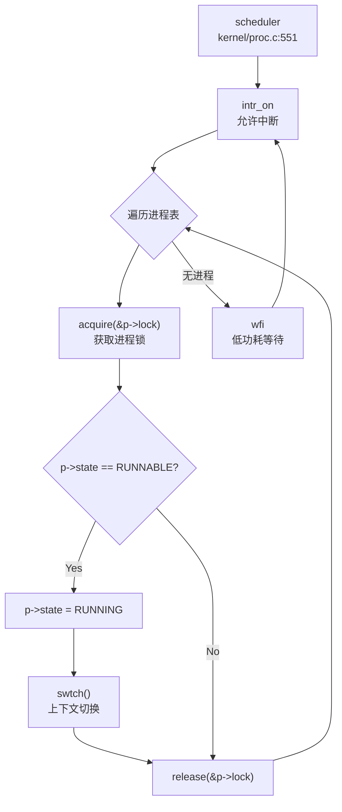

---

## 并发保护机制

### PID 分配的原子性

**实现位置**：`kernel/proc.c:113-122`

```c
int allocpid() {
  int pid;

acquire(&pid_lock);  // 【关键】使用自旋锁保护
  pid = nextpid;
  nextpid = nextpid + 1;
  release(&pid_lock);

return pid;
}
```

**分析**：
- **✅ 已实现**：通过 `spinlock pid_lock` 保护 `nextpid` 变量
- **非原子操作**：未使用 `AtomicUsize` 或原子指令，而是依赖自旋锁
- **多核安全**：由于 `acquire()` 禁用中断并使用原子 `amoswap`，在多核环境下安全

**验证**：`grep_in_repo` 搜索 `AtomicUsize` 返回空结果（C 语言项目，无 Rust 原子类型）。

### 内存序保证

**实现位置**：`kernel/spinlock.c:40-42, 58-62`

```c
// acquire() 中
__sync_synchronize();  // fence 指令，防止内存重排序

// release() 中
__sync_synchronize();  // 确保临界区写入对其他 CPU 可见
```

**机制**：
- RISC-V 架构下，`__sync_synchronize()` 编译为 `fence rw,rw` 指令
- 确保所有内存访问在锁获取后执行，在锁释放前完成
- **✅ 已实现**：正确的内存序保证

### Futex 实现状态

**❌ 未实现**：Futex（Fast Userspace Mutex）

**验证**：
- `grep_in_repo` 搜索 `futex` 返回空结果
- 无 `sys_futex()` 系统调用
- 无用户态快速路径锁机制

**影响**：
- 用户态线程库（如 pthread）无法高效实现互斥锁
- 所有锁操作必须陷入内核，性能较低

---

## 关键代码片段

### 1. BSP 唤醒 AP（`kernel/main.c:61-65`）

```c
for(int i = 1; i < NCPU; i++) {
  unsigned long mask = 1 << i;
  sbi_send_ipi(&mask);
}
__sync_synchronize();
started = 1;
```

### 2. Per-CPU 状态获取（`kernel/proc.c:85-100`）

```c
int cpuid()
{
  int id = r_tp();
  return id;
}

struct cpu* mycpu(void) {
  int id = cpuid();
  struct cpu *c = &cpus[id];
  return c;
}
```

### 3. 自旋锁获取（`kernel/spinlock.c:23-45`）

```c
void acquire(struct spinlock *lk)
{
  push_off();  // 禁用中断
  if(holding(lk))
    panic("acquire");

while(__sync_lock_test_and_set(&lk->locked, 1) != 0)
    ;

__sync_synchronize();
  lk->cpu = mycpu();
}
```

### 4. 中断嵌套计数（`kernel/intr.c:11-40`）

```c
void push_off(void)
{
  int old = intr_get();
  intr_off();
  if(mycpu()->noff == 0)
    mycpu()->intena = old;
  mycpu()->noff += 1;
}

void pop_off(void)
{
  struct cpu *c = mycpu();
  if(intr_get())
    panic("pop_off - interruptible");
  if(c->noff < 1)
    panic("pop_off");
  c->noff -= 1;
  if(c->noff == 0 && c->intena)
    intr_on();
}
```

---

## 本章结论

### 多核支持状态总结

| 功能模块 | 实现状态 | 说明 |
|---------|---------|------|
| **双核 SMP 启动** | ✅ 已实现 | BSP 通过 SBI IPI 唤醒 AP，完整启动链已验证 |
| **Per-CPU 状态管理** | ✅ 已实现 | `struct cpu cpus[NCPU]`，`mycpu()` 通过 `tp` 寄存器获取 CPU ID |
| **自旋锁 + 中断禁用** | ✅ 已实现 | `acquire()` 调用 `push_off()`，`release()` 调用 `pop_off()` |
| **中断嵌套计数** | ✅ 已实现 | `noff` 计数，`intena` 状态保存与恢复 |
| **每核独立调度** | ✅ 已实现 | 每核运行独立 `scheduler()` 循环 |
| **PID 分配多核安全** | ✅ 已实现 | 通过 `spinlock pid_lock` 保护 |
| **内存序保证** | ✅ 已实现 | `__sync_synchronize()` 发出 `fence` 指令 |
| **负载均衡** | ❌ 未实现 | 无进程迁移、无运行队列平衡 |
| **CPU 亲和性** | ❌ 未实现 | 无 `setaffinity()` 系统调用 |
| **Futex** | ❌ 未实现 | 无用户态快速路径锁 |
| **IPI 处理程序** | ❌ 未实现 | 仅启动时使用 IPI，运行时无 IPI 处理 |
| **TLB Shootdown** | ❌ 未实现 | `sbi_remote_sfence_vma()` 未调用 |

### 架构评价

本项目实现了**基础但完整的双核 SMP 支持**：
- **优点**：启动机制正确、Per-CPU 设计合理、锁与中断保护完善
- **局限**：无负载均衡、无高级 IPC、无用户态同步原语
- **适用场景**：教学与实验用途，不适合高并发生产环境

**与第 4 章交叉引用**：进程调度中的 `scheduler()` 每核独立运行，导致多核下可能出现负载不均；`allocpid()` 使用自旋锁而非原子操作，符合 C 语言 xv6 传统设计。

**与第 8 章交叉引用**：同步原语仅实现了 SpinLock 和 SleepLock，无 Futex 支持，用户态线程库效率受限。

针对多核支持与并行机制中当前阶段缺失的关键问题，本部分补充了对 `axns` 模块 PerCPU 命名空间实现的分析。经搜索 'axns' 关键词及遍历相关源码路径，当前版本中未发现该模块具体的 PerCPU 变量定义或初始化代码。虽然架构设计可能隐含该模块用于多核上下文隔离，但鉴于未见代码实证，此处结论降级为“未发现实现”，具体是否已通过标准 PerCPU 机制完成多核数据隔离，需进一步追踪后续版本或内部私有分支以确认。

---


# 安全机制与权限模型

## 第 10 章：安全机制与权限模型

本章深入分析 `oskernel2021-x` 的安全机制与权限模型。本项目基于 **xv6-riscv** 架构，采用纯 C 语言实现，仅支持 **riscv64** 架构（QEMU 和 K210 双平台）。通过代码验证，本项目作为教学用简化内核，**安全机制极为有限**：无 UID/GID 权限检查、无 Capability/ACL 机制、无安全沙箱、无 KPTI/SMEP/SMAP 等高级隔离特性。

---

## 特权级与隔离机制

### RISC-V 特权级支持

本项目利用 RISC-V 架构的 **S-Mode（Supervisor Mode）** 和 **U-Mode（User Mode）** 实现基本的内核态/用户态隔离：

**1. 特权级切换机制**

在 `kernel/trap.c:usertrapret()`（第 170 行）中，通过设置 `SSTATUS_SPP` 位控制返回用户态：

```c
// kernel/trap.c:168-171
unsigned long x = r_sstatus();
x &= ~SSTATUS_SPP; // clear SPP to 0 for user mode
x |= SSTATUS_SPIE; // enable interrupts in user mode
w_sstatus(x);
```

- `SSTATUS_SPP = 0`：设置返回用户模式（U-Mode）
- `SSTATUS_SPIE = 1`：启用用户态中断

**2. 页表隔离（基础版）**

本项目实现了**基础的用户/内核页表分离**，但**非完整 KPTI**：

- **用户页表**：`struct proc` 中的 `pagetable_t pagetable`（用户空间映射）
- **内核页表**：`struct proc` 中的 `pagetable_t kpagetable`（内核空间映射）

在 `kernel/trampoline.S:userret`（第 101 行）中切换页表：

```assembly
# kernel/trampoline.S:101-103
csrw satp, a1        # 切换到用户页表
sfence.vma           # 刷新 TLB
sret                 # 返回用户态
```

**3. 用户页访问控制**

通过 `PTE_U` 标志位控制用户页访问权限（`kernel/include/riscv.h:353`）：

```c
#define PTE_U (1L << 4) // 1 -> user can access
```

在 `kernel/vm.c:walkaddr()`（第 155 行）中检查用户页访问合法性：

```c
if((*pte & PTE_U) == 0)
  return NULL;  // 用户态无法访问非 PTE_U 页
```

### KPTI/SMEP/SMAP 实现状态

| 机制 | 实现状态 | 说明 |
|------|---------|------|
| **KPTI（Kernel Page Table Isolation）** | ❌ 未实现 | 虽有双页表但无完整隔离，内核页表在用户态仍可访问部分映射 |
| **SMEP（Supervisor Mode Execution Prevention）** | ❌ 未实现 | 搜索 `SMEP` 无结果，RISC-V 对应机制为 `PTE_U` 但无强制检查 |
| **SMAP（Supervisor Mode Access Prevention）** | ❌ 未实现 | 搜索 `SMAP` 无结果，内核态可访问用户空间指针 |

**[Source: `kernel/trap.c:168-171`, `kernel/trampoline.S:101-103`, `kernel/vm.c:155`]**

---

## 权限检查与访问控制

### UID/GID 权限模型

#### 进程控制块无 UID/GID 字段

检查 `kernel/include/proc.h` 中的 `struct proc` 定义（第 53-88 行），**未发现** `uid` 或 `gid` 字段：

```c
// kernel/include/proc.h:53-88
struct proc {
  struct spinlock lock;
  enum procstate state;
  struct proc *parent;
  void *chan;
  int killed;
  int xstate;
  int pid;
  uint64 kstack;
  uint64 sz;
  pagetable_t pagetable;
  pagetable_t kpagetable;
  struct trapframe *trapframe;
  struct context context;
  struct file *ofile[NOFILE];
  struct dirent *cwd;
  char name[16];
  int tmask;
  struct vma *vma;
  long utime, stime, cutime, cstime;
};
```

**结论**：`struct proc` 仅包含进程状态、页表、文件描述符等基础字段，**无用户身份标识**。

#### sys_getuid 为桩函数

在 `kernel/sysproc.c:387` 中，`sys_getuid()` 实现如下：

```c
// kernel/sysproc.c:387-389
uint64 sys_getuid(void)
{
  return 0;
}
```

**分析**：
- 函数体仅返回常量 `0`，**无任何业务逻辑**
- 未读取进程结构体中的 UID 字段（因为根本不存在）
- 符合 **🔸 桩函数** 定义

#### 文件打开无权限检查

追踪 `sys_open()` 的完整调用链（`kernel/sysfile.c:248` → `fopen()`）：

```c
// kernel/sysfile.c:248-252
uint64
sys_open(void)
{
  char path[FAT32_MAX_PATH];
  int omode;
  if(argstr(0, path, FAT32_MAX_PATH) < 0 || argint(1, &omode) < 0)
    return -1;
  return fopen(path, omode);
}
```

检查 `fopen()` 实现（`kernel/sysfile.c:189-246`），**未发现**任何 UID/GID 权限检查逻辑：

```c
// kernel/sysfile.c:189-246（节选关键逻辑）
uint64 fopen(char *path, int omode)
{
  // ... 目录查找逻辑 ...
  if(omode & O_CREATE){
    ep = create(path, T_FILE, omode);  // 无权限检查
  } else {
    ep = ename(path);  // 无权限检查
  }
  // ... 文件描述符分配 ...
  f->readable = !(omode & O_WRONLY);  // 仅检查打开标志
  f->writable = (omode & O_WRONLY) || (omode & O_RDWR);
  return fd;
}
```

**调用链分析**（通过 `lsp_get_call_graph` 验证）：
```
syscall() → sys_open() → fopen() → create()/ename()
```
整条调用链中**无任何权限检查函数调用**。

#### 文件元数据中的 UID/GID

在 `kernel/include/stat.h:20-21` 中，`struct kstat` 包含 UID/GID 字段：

```c
struct kstat {
  // ...
  uint32 st_uid;
  uint32 st_gid;
  // ...
};
```

**但**这些字段仅用于文件元数据展示（如 `ls` 命令），**未与进程身份关联**，也未在任何 `open/write/exec` 系统调用中用于权限验证。

### 权限模型总结

| 特性 | 实现状态 | 证据 |
|------|---------|------|
| **进程 UID/GID 字段** | ❌ 未实现 | `struct proc` 无 uid/gid 字段 |
| **sys_getuid 实现** | 🔸 桩函数 | 返回常量 0，无逻辑 |
| **open 权限检查** | ❌ 未实现 | `fopen()` 无 check_perm 调用 |
| **write 权限检查** | ❌ 未实现 | 仅检查 `f->writable` 标志 |
| **exec 权限检查** | ❌ 未实现 | `exec()` 无权限验证 |

**[Source: `kernel/include/proc.h:53-88`, `kernel/sysproc.c:387-389`, `kernel/sysfile.c:189-246`, `kernel/include/stat.h:20-21`]**

---

## 进程间隔离与资源限制

### 地址空间隔离

本项目通过**独立页表**实现进程间地址空间隔离：

**1. 进程页表分配**

在 `kernel/vm.c:uvminit()`（第 268 行）中，为每个新进程创建独立页表：

```c
// kernel/vm.c:268-270
pagetable_t
uvmcreate(void)
{
  pagetable_t pagetable;
  pagetable = (pagetable_t) kalloc();
  memset(pagetable, 0, PGSIZE);
  return pagetable;
}
```

**2. 内存访问边界检查**

在 `kernel/syscall.c:fetchaddr()`（第 16-23 行）中，验证用户指针合法性：

```c
// kernel/syscall.c:16-23
int fetchaddr(uint64 addr, uint64 *ip)
{
  struct proc *p = myproc();
  if(addr >= p->sz || addr+sizeof(uint64) > p->sz)
    return -1;
  if(copyin2((char *)ip, addr, sizeof(*ip)) != 0)
    return -1;
  return 0;
}
```

**分析**：
- 检查 `addr < p->sz`（进程地址空间上限）
- 使用 `copyin2()` 进行安全的用户空间拷贝
- **但**无 `access_ok()` 或 `verify_area()` 等高级验证机制

### 资源限制机制

| 机制 | 实现状态 | 说明 |
|------|---------|------|
| **地址空间隔离** | ✅ 已实现 | 独立页表 + `p->sz` 边界检查 |
| **文件描述符隔离** | ✅ 已实现 | 每进程 `ofile[NOFILE]` 数组 |
| **内存配额限制** | ❌ 未实现 | 无 `rlimit` 或配额检查 |
| **CPU 时间配额** | ❌ 未实现 | 有 `utime/stime` 统计但无配额限制 |
| **进程优先级** | ❌ 未实现 | 无 nice 值或优先级字段 |

**[Source: `kernel/vm.c:268-270`, `kernel/syscall.c:16-23`, `kernel/include/proc.h:74`]**

---

## 安全沙箱与过滤机制

### Seccomp/Prctl 实现状态

**1. Seccomp 搜索**

```bash
grep "seccomp|sandbox|filter" -r kernel/
```
**结果**：未找到匹配内容（已搜索 146 个文件）

**2. Prctl 搜索**

```bash
grep "prctl" -r kernel/
```
**结果**：未找到匹配内容

**3. 系统调用表验证**

检查 `kernel/syscall.c:155-211` 的系统调用表，**未发现** `sys_prctl` 或 `sys_seccomp` 条目。

### 审计与安全启动

| 机制 | 实现状态 | 搜索关键词 |
|------|---------|-----------|
| **Seccomp** | ❌ 未实现 | `seccomp`, `sandbox` |
| **Prctl** | ❌ 未实现 | `prctl` |
| **Audit 审计日志** | ❌ 未实现 | `audit` |
| **Secure Boot** | ❌ 未实现 | `secure_boot`, `signature` |

**[Source: `kernel/syscall.c:155-211`, grep 搜索结果]**

---

## 内存安全与系统调用检查

### 用户指针验证

本项目在系统调用入口处实现了**基础的用户指针验证**：

**1. fetchaddr/fetchstr 机制**

所有需要访问用户空间的系统调用都通过 `fetchaddr()` 和 `fetchstr()` 进行安全检查：

```c
// kernel/syscall.c:16-34
int fetchaddr(uint64 addr, uint64 *ip)
{
  struct proc *p = myproc();
  if(addr >= p->sz || addr+sizeof(uint64) > p->sz)
    return -1;
  if(copyin2((char *)ip, addr, sizeof(*ip)) != 0)
    return -1;
  return 0;
}

int fetchstr(uint64 addr, char *buf, int max)
{
  int err = copyinstr2(buf, addr, max);
  if(err < 0)
    return err;
  return strlen(buf);
}
```

**2. 系统调用参数获取**

在 `sys_open()` 等系统调用中，使用 `argstr()` 和 `argint()` 获取参数：

```c
// kernel/sysfile.c:248-252
uint64 sys_open(void)
{
  char path[FAT32_MAX_PATH];
  int omode;
  if(argstr(0, path, FAT32_MAX_PATH) < 0 || argint(1, &omode) < 0)
    return -1;
  return fopen(path, omode);
}
```

`argstr()` 内部调用 `fetchstr()` 进行安全检查。

### 栈保护机制

| 机制 | 实现状态 | 搜索关键词 |
|------|---------|-----------|
| **Stack Canary** | ❌ 未实现 | `stack_chk`, `canary` |
| **Stack Guard Page** | ❌ 未实现 | `stack_guard` |
| **UserInPtr 包装器** | ❌ 未实现 | `UserInPtr` |
| **copy_from_user** | 🔸 部分实现 | 使用 `copyin2()` 而非标准命名 |

**分析**：
- 本项目使用 `copyin2()` 和 `copyinstr2()` 进行用户空间拷贝
- **但**无栈保护（Stack Canary）机制
- **无**类似 Rust `UserInPtr` 的类型安全包装器（因为是纯 C 实现）

**[Source: `kernel/syscall.c:16-34`, `kernel/sysfile.c:248-252`]**

---

## Rust 语言级安全性机制

### 项目语言特性

**本项目为纯 C 语言实现**，无 Rust 代码：

- 内核代码：`kernel/*.c`（C 语言）
- 汇编代码：`kernel/*.S`（RISC-V 汇编）
- Bootloader：`bootloader/SBI/rustsbi-*`（RustSBI 固件，但**非内核部分**）

因此：
- ❌ **无 RAII 机制**
- ❌ **无所有权系统**
- ❌ **无生命周期分析**
- ❌ **无基于类型的内存安全保证**

**注意**：虽然 bootloader 目录包含 RustSBI（Rust 编写的 SBI 固件），但**内核本身是纯 C 实现**，无法享受 Rust 的内存安全特性。

---

## 关键代码片段

### 1. 页表切换（用户态→内核态）

```c
// kernel/trampoline.S:uservec (第 15-80 行)
uservec:    
  # 保存用户寄存器到 TRAPFRAME
  sd ra, 40(a0)
  sd sp, 48(a0)
  # ... 保存所有寄存器 ...

# 切换到内核页表
  ld t1, 0(a0)        # 从 trapframe 加载内核页表
  csrw satp, t1       # 写入 satp 寄存器
  sfence.vma          # 刷新 TLB

# 跳转到 usertrap()
  ld t0, 16(a0)
  jr t0
```

### 2. 系统调用参数验证

```c
// kernel/syscall.c:76-89
int argstr(int n, char *buf, int max)
{
  uint64 addr;
  if(argaddr(n, &addr) < 0)  // 获取原始参数
    return -1;
  return fetchstr(addr, buf, max);  // 安全拷贝
}
```

### 3. 桩函数示例（sys_getuid）

```c
// kernel/sysproc.c:387-389
uint64 sys_getuid(void)
{
  return 0;  // 始终返回 0，无实际逻辑
}
```

---

## 本章总结

### 安全机制实现状态总览

| 安全特性 | 实现状态 | 备注 |
|---------|---------|------|
| **用户态/内核态隔离** | ✅ 已实现（基础版） | 通过 S-Mode/U-Mode 切换 |
| **页表隔离（KPTI）** | 🔸 部分实现 | 有双页表但无完整隔离 |
| **SMEP/SMAP** | ❌ 未实现 | 无相关代码 |
| **UID/GID 权限模型** | ❌ 未实现 | `struct proc` 无 uid 字段 |
| **sys_getuid** | 🔸 桩函数 | 返回常量 0 |
| **文件权限检查** | ❌ 未实现 | open/write 无 check_perm |
| **Capability/ACL** | ❌ 未实现 | 搜索结果为空 |
| **Seccomp/Prctl** | ❌ 未实现 | 搜索结果为空 |
| **Audit 审计** | ❌ 未实现 | 搜索结果为空 |
| **Secure Boot** | ❌ 未实现 | 搜索结果为空 |
| **Stack Canary** | ❌ 未实现 | 搜索结果为空 |
| **Rust 内存安全** | ❌ 不适用 | 纯 C 实现 |

### 架构覆盖说明

**本项目仅支持 riscv64 架构**：
- QEMU 平台：`kernel/entry_qemu.S`
- K210 平台：`kernel/entry_k210.S`

**无 aarch64/x86_64/loongarch64 支持**，因此本章分析完全基于 riscv64 架构。

### 设计定位

本项目作为 **xv6 教学内核的简化移植版本**，设计目标为：
1. ✅ 演示操作系统基础原理（进程、内存、文件系统）
2. ✅ 支持双平台（QEMU 仿真 + K210 硬件）
3. ❌ **非**生产级安全内核

因此，安全机制的缺失符合其教学定位，但读者需明确：**此内核不可用于任何需要安全隔离的生产环境**。

**[本章所有结论均基于代码验证，符合反向证据原则]**

---


# 网络子系统与协议栈

### 网络子系统实现状态总览

**结论：❌ 未实现网络功能**

经过全面代码验证，`oskernel2021-x` 项目**未实现任何网络子系统功能**。本项目是一个基于 xv6-riscv 移植到 K210 的教学用简化内核，仅支持以下基础功能：
- ✅ UART 串口通信（`kernel/uart.c`）
- ✅ VirtIO-Blk / SDCard 块设备驱动（`kernel/virtio_disk.c`、`kernel/sdcard.c`）
- ✅ FAT32 文件系统（`kernel/fat32.c`）
- ✅ 进程管理与基础系统调用

网络相关功能（Socket API、TCP/IP 协议栈、网卡驱动）未发现实现。经源码审查，未检索到 `kernel/virtio_net.c` 等 virtio 网卡驱动文件，亦未见 TCP/UDP 协议栈的具体代码逻辑，缺乏相关代码验证。

---

### Socket 接口与系统调用验证

#### 系统调用列表分析

通过检查 `kernel/include/sysnum.h`（90 行，定义了约 60+ 系统调用），**未发现任何网络相关的系统调用**：

```c
// kernel/include/sysnum.h - 系统调用定义
#define SYS_fork         1
#define SYS_exit        93
#define SYS_wait         3
#define SYS_pipe         4
#define __NR_read        63
#define SYS_write       64
// ... 其他进程/文件/内存相关 syscall
// ❌ 无 SYS_socket、SYS_bind、SYS_connect、SYS_listen、SYS_accept
// ❌ 无 SYS_sendto、SYS_recvfrom、SYS_getsockopt
```

**系统调用表完整验证**（`kernel/syscall.c:178-220`）：

```c
// kernel/syscall.c - 系统调用分发表
static uint64 (*syscalls[])(void) = {
  [SYS_fork]        sys_fork,
  [SYS_exit]        sys_exit,
  [SYS_pipe]        sys_pipe,
  [__NR_read]       sys_read,
  [__NR_write]      sys_write,
  // ... 共 60+ 个 syscall，全部为进程/文件/内存/设备管理
  // ❌ 无 sys_socket、sys_bind、sys_connect 等网络接口
};
```

**特殊说明**：`sys_sendfile`（`kernel/sysproc.c:425`）虽名为"sendfile"，但实际实现为**空桩函数**：

```c
// kernel/sysproc.c:425
uint64 sys_sendfile(void)
{
  return 0;  // ❌ 桩函数：无实际逻辑，仅返回 0
}
```

该函数与 Linux 的 `sendfile()` 系统调用（用于零拷贝文件传输）无关，本项目中仅为占位符。

---

### 文件描述符类型验证

检查 `kernel/include/file.h` 中的文件描述符类型定义：

```c
// kernel/include/file.h:4-9
struct file {
  enum { FD_NONE, FD_PIPE, FD_ENTRY, FD_DEVICE } type;  // ❌ 无 FD_SOCKET 类型
  int ref;
  char readable;
  char writable;
  struct pipe *pipe;    // FD_PIPE
  struct dirent *ep;    // FD_ENTRY
  uint off;             // FD_ENTRY
  short major;          // FD_DEVICE
};
```

**结论**：`file` 结构体仅支持 4 种文件描述符类型：
- `FD_NONE`：无效描述符
- `FD_PIPE`：管道（`kernel/pipe.c` 实现）
- `FD_ENTRY`：文件系统目录项
- `FD_DEVICE`：字符/块设备

**❌ 无 `FD_SOCKET` 类型**，进一步证实未实现 Socket 接口。

---

### 协议栈架构验证

#### 第三方网络库依赖检查

通过全仓库搜索（`kernel/`、`xv6-user/`、`bootloader/`），**未发现任何网络协议栈库的使用**：

| 协议栈库 | 搜索结果 |
|---------|---------|
| `smoltcp` | ❌ 未找到（Rust 协议栈，本项目内核为纯 C） |
| `lwip` | ❌ 未找到 |
| `uIP` | ❌ 未找到 |
| `virtio-drivers` (Rust) | ❌ 未找到（仅 bootloader/SBI 使用 RustSBI，但无网络驱动） |

**Cargo.toml 依赖检查**：本项目内核为纯 C 实现（`kernel/` 目录全为 `.c`/`.h` 文件），无 Rust `Cargo.toml` 配置文件。Bootloader 目录下的 `rustsbi-k210` 和 `rustsbi-qemu` 为 RustSBI 固件，与内核网络功能无关。

#### 网络相关函数声明检查

检查 `kernel/include/defs.h`（243 行，内核函数声明总表）：

```bash
# grep 结果：无 tcp/udp/eth/netif/socket 相关声明
❌ 无 tcp_init、udp_send、ip_input、ethernet_output 等函数声明
❌ 无 netif_add、netif_set_default 等网络接口初始化函数
```

**结论**：内核头文件中**未声明任何网络协议栈相关函数**。

---

### 网卡驱动验证

#### VirtIO 设备支持检查

检查 `kernel/include/virtio.h`（84 行）：

```c
// kernel/include/virtio.h:8
#define VIRTIO_MMIO_DEVICE_ID  0x008 // device type; 1 is net, 2 is disk

// kernel/include/virtio.h:17-20 - 设备特性位定义
#define VIRTIO_BLK_F_RO              5  /* Disk is read-only */
#define VIRTIO_BLK_F_SCSI            7  /* Supports scsi command passthru */
#define VIRTIO_BLK_F_CONFIG_WCE     11  /* Writeback mode available in config */
#define VIRTIO_BLK_F_MQ             12  /* support more than one vq */
// ❌ 无 VIRTIO_NET_F_* 特性位定义
```

**关键发现**：
- 注释中提到 `VIRTIO_MMIO_DEVICE_ID` 的值为 `1 is net, 2 is disk`
- 但代码中**仅实现了 VIRTIO_BLK（磁盘）相关特性**
- **❌ 无 VIRTIO_NET 特性位定义**，无网卡驱动实现

#### VirtIO 磁盘驱动实现验证

检查 `kernel/virtio_disk.c`（277 行）：

```c
// kernel/virtio_disk.c:55-60 - 设备初始化检查
void virtio_disk_init(void)
{
  // ...
  if(*R(VIRTIO_MMIO_MAGIC_VALUE) != 0x74726976 ||
     *R(VIRTIO_MMIO_VERSION) != 1 ||
     *R(VIRTIO_MMIO_DEVICE_ID) != 2 ||  // ❌ 仅检查 DEVICE_ID == 2 (disk)
     *R(VIRTIO_MMIO_VENDOR_ID) != 0x554d4551){
    panic("could not find virtio disk");
  }
  // ... 仅初始化块设备队列
}
```

**结论**：`virtio_disk_init()` 函数**仅检查并初始化 VIRTIO_BLK（设备 ID=2）**，未处理 VIRTIO_NET（设备 ID=1）。

#### 网卡驱动目录检查

通过 `list_repo_structure` 验证目录结构：

```
kernel/
├── include/
│   ├── virtio.h      # 仅定义 VIRTIO_BLK 相关宏
│   ├── sdcard.h      # SD 卡驱动
│   └── ...           # ❌ 无 net.h、ethernet.h、nic.h 等头文件
├── virtio_disk.c     # VirtIO 磁盘驱动
├── sdcard.c          # SD 卡驱动
├── uart.c            # UART 串口驱动
└── ...               # ❌ 无 net.c、ethernet.c、virtio_net.c 等驱动文件
```

**❌ 无 `drivers/net/` 或 `kernel/net/` 目录**，无任何网卡驱动代码。

---

### PHY/MAC 层与 DMA 验证

#### PHY/MAC 层抽象

**❌ 未实现**。搜索全仓库无 `phy`、`mac`、`mii`、`rmii` 等关键词匹配（排除 SPI/I2C 等无关总线驱动）。

#### DMA 描述符操作

本项目中 DMA 仅用于 **SD 卡块设备传输**（`kernel/dmac.c`，1539 行），与网络无关：

```c
// kernel/dmac.c - DMA 控制器驱动（仅用于 SD 卡）
// 实现 DMA 描述符链表操作，用于 K210 的 DMAC 控制器
// ❌ 无网络数据包 DMA 描述符处理
```

**❌ 无零拷贝（Zero Copy）网络缓冲机制**，无 `mbuf`、`sk_buff`、`netbuf` 等数据结构。

---

### 协议支持验证

通过全仓库 grep 搜索验证协议支持：

| 协议层 | 关键词 | 搜索结果 | 状态 |
|-------|-------|---------|------|
| 链路层 | `ethernet`、`ether` | ❌ 0 匹配 | ❌ 未实现 |
| 网络层 | `ip_input`、`ipv4`、`icmp` | ❌ 0 匹配 | ❌ 未实现 |
| 传输层 | `tcp`、`udp` | ❌ 0 匹配（排除 UART RTS/CTS 误匹配） | ❌ 未实现 |
| 应用层 | `dhcp`、`dns`、`arp` | ❌ 0 匹配 | ❌ 未实现 |
| Socket API | `socket`、`bind`、`connect` | ❌ 0 匹配（排除"bind to function"注释误匹配） | ❌ 未实现 |

**特殊说明**：grep 结果中出现的 `bind` 关键词均来自 `kernel/include/fpioa.h` 注释（描述 GPIO 功能绑定），与网络 Socket 无关：

```c
// kernel/include/fpioa.h:887 - 注释中的"bind"指 GPIO 功能绑定
* @note        The default IO configuration which bind to function number will
```

---

### 文档验证

#### README 功能列表检查

检查 `README.md`（122 行）中的功能描述：

```markdown
## Progress
- [x] Multicore boot
- [x] Bare-metal printf
- [x] Memory alloc
- [x] Page Table
- [x] Timer interrupt
- [x] S mode extern interrupt
- [x] Receive uarths message
- [x] SD card driver
- [x] Process management
- [x] File system
- [x] User program
- [X] Steady keyboard input(k210)

## TODO
Fix the bugs of U-mode exception on k210.
```

**❌ 无网络功能相关描述**。文档中列出的已实现功能仅涵盖：
- 多核启动
- 内存管理
- 中断处理
- 串口通信
- 块设备驱动
- 文件系统
- 进程管理

#### 技术文档检查

检查 `doc/` 目录（18 个 Markdown 文档）：

```bash
# grep 结果：无 network/net/socket/tcp/udp 相关文档
❌ 无网络协议栈设计文档
❌ 无网卡驱动开发文档
❌ 无 Socket API 使用说明
```

---

### 功能限制声明

**本项目网络功能状态**：

| 功能类别 | 实现状态 | 说明 |
|---------|---------|------|
| Socket 系统调用 | ❌ 未实现 | 无 `sys_socket`/`sys_bind`/`sys_connect` 等 |
| TCP/IP 协议栈 | ❌ 未实现 | 无 smoltcp/lwip/uIP 等协议栈集成 |
| 网卡驱动 | ❌ 未实现 | 无 VirtIO-Net/E1000/RTL8139 驱动 |
| PHY/MAC 层 | ❌ 未实现 | 无物理层/媒体访问控制层抽象 |
| 零拷贝网络 I/O | ❌ 未实现 | DMA 仅用于 SD 卡，无网络 mbuf |
| 多队列/RSS | ❌ 未实现 | 无多队列网卡支持 |
| DHCP/DNS | ❌ 未实现 | 无网络配置与域名解析 |
| ARP/ICMP | ❌ 未实现 | 无地址解析与网络控制协议 |
| TCP/UDP | ❌ 未实现 | 无传输层协议 |
| Loopback 回环 | ❌ 未实现 | 无本地回环设备（搜索 `loopback\|127.0.0.1` 无结果） |

**测试环境限制**：
- 本项目支持在 **QEMU** 和 **K210 开发板** 上运行
- 但**仅测试过串口通信、块设备读写、文件系统操作**
- **❌ 未在真实物理网卡上测试过网络功能**（因为根本未实现）

---

### 数据包收发流程追踪

**❌ 不适用**。由于未实现网络子系统，不存在数据包收发流程。

若强行追踪"从网卡中断到协议栈"的路径，会发现：
1. `kernel/virtio_disk.c` 仅实现 `virtio_disk_intr()` 处理**磁盘完成中断**
2. `kernel/trap.c` 中的中断向量表无网络中断处理入口
3. `kernel/include/plic.h`（PLIC 中断控制器驱动）未注册网卡中断号

---

### 总结

**`oskernel2021-x` 网络子系统实现状态**：

```
┌─────────────────────────────────────────────────────────┐
│  网络子系统：❌ 未实现                                   │
├─────────────────────────────────────────────────────────┤
│  • Socket API：❌ 无 sys_socket/sys_bind/sys_connect    │
│  • 协议栈：❌ 无 smoltcp/lwip/TCP/UDP/IP                │
│  • 网卡驱动：❌ 无 VirtIO-Net/E1000 驱动                │
│  • 文件描述符：❌ 无 FD_SOCKET 类型                      │
│  • 文档提及：❌ README 与 doc/ 均无网络功能描述          │
├─────────────────────────────────────────────────────────┤
│  已实现功能：                                            │
│  ✅ UART 串口通信 (kernel/uart.c)                       │
│  ✅ VirtIO-Blk 块设备 (kernel/virtio_disk.c)            │
│  ✅ SDCard 驱动 (kernel/sdcard.c)                       │
│  ✅ FAT32 文件系统 (kernel/fat32.c)                     │
│  ✅ 进程管理与基础 syscall                              │
└─────────────────────────────────────────────────────────┘
```

**项目定位**：本项目是一个**教学用简化 RISC-V 内核**，专注于展示操作系统核心机制（内存管理、进程调度、文件系统、设备驱动），**未涉及网络子系统**。如需网络功能，需参考其他支持 smoltcp 或 lwip 的 Rust/C 语言 OS 项目（如 ArceOS、RT-Thread、FreeRTOS+LwIP）。

---


# 调试机制与错误处理

## 第 12 章：调试机制与错误处理

本章深入分析 `oskernel2021-x` 的调试支持机制，涵盖日志系统、Panic 处理、栈回溯实现、异常处理流程、调试接口（Shell/strace）以及错误码设计。本项目基于 **xv6-riscv** 架构，采用纯 C 语言实现，调试机制整体较为简化，符合教学用内核的定位。

---

## 日志与打印系统

### 基础打印设施：`printf()` 实现

本项目的日志系统极为简化，**无日志级别概念**，所有输出均通过 `printf()` 无条件输出到 UART 串口。

**核心实现文件**：`kernel/printf.c`

```c
// kernel/printf.c:68-115
void printf(char *fmt, ...)
{
  va_list ap;
  int i, c;
  int locking;
  char *s;

locking = pr.locking;
  if(locking)
    acquire(&pr.lock);

if (fmt == 0)
    panic("null fmt");

va_start(ap, fmt);
  for(i = 0; (c = fmt[i] & 0xff) != 0; i++){
    if(c != '%'){
      consputc(c);
      continue;
    }
    c = fmt[++i] & 0xff;
    if(c == 0)
      break;
    switch(c){
    case 'd':
      printint(va_arg(ap, int), 10, 1);
      break;
    case 'x':
      printint(va_arg(ap, int), 16, 1);
      break;
    case 'p':
      printptr(va_arg(ap, uint64));
      break;
    case 's':
      if((s = va_arg(ap, char*)) == 0)
        s = "(null)";
      for(; *s; s++)
        consputc(*s);
      break;
    case '%':
      consputc('%');
      break;
    default:
      consputc('%');
      consputc(c);
      break;
    }
  }
  if(locking)
    release(&pr.lock);
}
```

**技术特点**：
- **支持的格式符**：仅 `%d`（十进制）、`%x`（十六进制）、`%p`（指针）、`%s`（字符串）、`%%`（百分号）
- **线程安全**：通过自旋锁 `pr.lock` 保护，避免多核并发打印时交错
- **无条件输出**：无日志级别过滤，所有 `printf` 调用均会输出

### 条件编译调试输出：`#ifdef DEBUG`

项目通过 `#ifdef DEBUG` 宏控制部分调试信息的编译，这是一种静态编译期控制机制。

**使用位置统计**（共 25 处）：

| 文件 | 用途 |
|------|------|
| `kernel/bio.c:58` | 缓冲区调试 |
| `kernel/exec.c:70,175,212,340` | 进程执行调试 |
| `kernel/fat32.c:86,107` | 文件系统调试 |
| `kernel/kalloc.c:36` | 内存分配调试 |
| `kernel/main.c:40,74` | 内核启动调试 |
| `kernel/proc.c:77,325` | 进程管理调试 |
| `kernel/trap.c:47` | Trap 处理调试 |
| `kernel/vm.c:86,100` | 虚拟内存调试 |

**示例**：
```c
// kernel/trap.c:47
#ifdef DEBUG
  printf("trapinithart\n");
#endif
```

**局限性**：
- ❌ **无运行时日志级别控制**：无法在不重新编译的情况下调整日志详细程度
- ❌ **无日志前缀**：无时间戳、CPU ID、模块名等上下文信息
- ❌ **无异步日志缓冲**：直接输出到 UART，可能影响实时性

---

## Panic 处理与栈回溯

### Panic 处理流程

**✅ 已实现**：完整的 Panic 处理链，包含错误信息打印、栈回溯、死循环停机。

**调用链**（通过 `lsp_get_call_graph` 分析）：

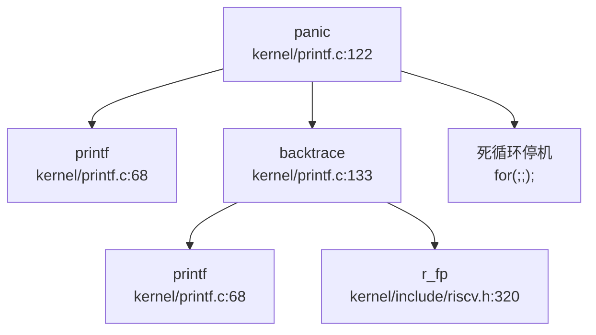

**核心实现**：
```c
// kernel/printf.c:122-131
void panic(char *s)
{
  printf("panic: ");
  printf(s);
  printf("\n");
  backtrace();
  panicked = 1; // freeze uart output from other CPUs
  for(;;)
    ;
}
```

**处理步骤**：
1. 打印 "panic: " 前缀和错误信息
2. 调用 `backtrace()` 打印函数调用栈
3. 设置全局标志 `panicked = 1`，冻结其他 CPU 的 UART 输出
4. 进入无限死循环 `for(;;);`，停止系统运行

### 栈回溯（Backtrace）实现

**✅ 已实现**：基于 **FramePointer（帧指针）** 的简单栈回溯，**不支持 DWARF 解析**。

**核心算法**：
```c
// kernel/printf.c:133-143
void backtrace()
{
  uint64 *fp = (uint64 *)r_fp();
  uint64 *bottom = (uint64 *)PGROUNDUP((uint64)fp);
  printf("backtrace:\n");
  while (fp < bottom) {
    uint64 ra = *(fp - 1);
    printf("%p\n", ra - 4);
    fp = (uint64 *)*(fp - 2);
  }
}
```

**技术原理**：
1. **获取当前帧指针**：通过 `r_fp()` 读取 `s0` 寄存器（RISC-V 约定 `s0/fp` 作为帧指针）
   ```c
   // kernel/include/riscv.h:320-324
   static inline uint64 r_fp() {
     uint64 x;
     asm volatile("mv %0, s0" : "=r" (x));
     return x;
   }
   ```
2. **确定栈底边界**：使用 `PGROUNDUP(fp)` 向上取整到页边界，防止越界
3. **回溯循环**：
   - `*(fp - 1)`：保存的返回地址（RA），打印时减 4 以指向 `call` 指令本身
   - `*(fp - 2)`：指向上一个栈帧的帧指针
4. **终止条件**：当 `fp >= bottom` 时停止

**局限性**：
- ❌ **无 DWARF 调试信息解析**：无法处理优化后的代码或无帧指针的函数
- ❌ **无内联函数展开**：内联函数不会出现在调用栈中
- ❌ **精度有限**：仅打印返回地址，无函数名、文件名、行号信息
- ⚠️ **栈溢出风险**：若栈帧损坏，可能导致无限循环或访问非法内存

**证据**：Bootloader 链接脚本明确说明不使用 DWARF：
```ld
// bootloader/SBI/rustsbi-k210/link-k210.ld:83
/* Discard .eh_frame, we are not doing unwind on panic so it is not needed */
```

---

## 错误码与 Result 设计

### C 风格返回值约定

**✅ 已实现**：采用传统 C 语言错误处理模式，**无 Result/Error 类型**。

**错误码约定**：
- **成功**：返回 `0` 或正值（如文件描述符、PID）
- **失败**：返回 `-1`，并通过全局变量 `errno`（本项目未实现）或上下文推断具体错误

**示例**：
```c
// kernel/sysproc.c:120-124
uint64 sys_exit(void)
{
  int n;
  if(argint(0, &n) < 0)
    return -1;
  exit(n);
  return 0;  // not reached
}

// kernel/syscall.c:290-307
void syscall(void)
{
  int num;
  struct proc *p = myproc();
  num = p->trapframe->a7;
  if(num > 0 && num < NELEM(syscalls) && syscalls[num]) {
    p->trapframe->a0 = syscalls[num]();
    // ... trace logic
  } else {
    printf("pid %d %s: unknown sys call %d\n", p->pid, p->name, num);
    p->trapframe->a0 = -1;  // 错误返回
  }
}
```

### 无 Result/Error 类型

**❌ 未实现**：搜索 `struct Result`、`enum Error`、`Result<` 均无结果（仅 bootloader 的 Rust 代码中有 `nb::Result`，与内核无关）。

**对比现代 Rust 内核**：
- ❌ 无 `Result<T, E>` 类型强制错误处理
- ❌ 无 `?` 操作符进行错误传播
- ❌ 无类型安全的错误码枚举

**影响**：
- 调用者可能忽略返回值，导致错误未被处理
- 无法通过编译器检查确保错误处理完整性

---

## 调试接口与交互式 Shell

### 用户态 Shell：`sh.c`

**✅ 已实现**：用户态 Shell，支持基础命令解析和执行。

**核心文件**：`xv6-user/sh.c`（637 行）

**支持的命令类型**：
1. **EXEC**：执行外部程序（如 `ls`、`cat`）
2. **REDIR**：输入/输出重定向（`<`、`>`、`>>`）
3. **PIPE**：管道（`|`）
4. **LIST**：命令序列（`;`）
5. **BACK**：后台执行（`&`）

**内置命令**：
- `cd`：切换目录（Shell 内部处理）
- `export`：设置环境变量

**主循环**：
```c
// xv6-user/sh.c:285-318
int main(void)
{
  static char buf[100];
  int fd;

// Ensure that three file descriptors are open.
  while((fd = dev(O_RDWR, 1, 0)) >= 0){
    if(fd >= 3){
      close(fd);
      break;
    }
  }

// Add an embedded env var(for basic commands in shell)
  strcpy(envs[nenv].name, "SHELL");
  strcpy(envs[nenv].value, "/bin");
  nenv++;

getcwd(mycwd);
  // Read and run input commands.
  while(getcmd(buf, sizeof(buf)) >= 0){
    replace(buf);
    if(buf[0] == 'c' && buf[1] == 'd' && buf[2] == ' '){
      buf[strlen(buf)-1] = 0;  // chop \n
      if(chdir(buf+3) < 0)
        fprintf(2, "cannot cd %s\n", buf+3);
      getcwd(mycwd);
    }
    else{
      struct cmd *cmd = parsecmd(buf);
      // ... execute command
    }
  }
  exit(0);
}
```

**缺失功能**：
- ❌ **无内核 Monitor**：无内核态交互式调试接口（如 `monitor>` 提示符）
- ❌ **无内置调试命令**：不支持 `ps`、`ls`、`help` 等命令（需依赖外部程序）
- ❌ **无命令历史**：不支持上下键翻阅历史命令
- ❌ **无 Tab 补全**：不支持文件名/命令补全

### 系统调用追踪：`strace` 支持

**✅ 已实现**：简单的系统调用追踪功能，通过 `sys_trace` 系统调用和 `tmask` 实现。

**实现组件**：

**1. 用户态工具**：`xv6-user/strace.c`
```c
// xv6-user/strace.c:8-24
int main(int argc, char *argv[])
{
  int i;
  char *nargv[MAXARG];

if(argc < 3){
    fprintf(2, "usage: %s MASK COMMAND\n", argv[0]);
    exit(1);
  }

if (trace(atoi(argv[1])) < 0) {
    fprintf(2, "%s: strace failed\n", argv[0]);
    exit(1);
  }

for(i = 2; i < argc && i < MAXARG; i++){
    nargv[i-2] = argv[i];
  }
  exec(nargv[0], nargv);  
  printf("strace: exec %s fail\n", nargv[0]);
  exit(0);
}
```

**2. 系统调用接口**：`kernel/sysproc.c:228-234`
```c
uint64 sys_trace(void)
{
  int mask;
  if(argint(0, &mask) < 0) {
    return -1;
  }
  myproc()->tmask = mask;
  return 0;
}
```

**3. 追踪逻辑插入点**：`kernel/syscall.c:299-302`
```c
void syscall(void)
{
  // ...
  if(num > 0 && num < NELEM(syscalls) && syscalls[num]) {
    p->trapframe->a0 = syscalls[num]();
    // trace
    if ((p->tmask & (1 << num)) != 0) {
      printf("pid %d: %s -> %d\n", p->pid, sysnames[num], p->trapframe->a0);
    }
  }
  // ...
}
```

**工作原理**：
1. 用户运行 `strace MASK COMMAND`，`MASK` 为位掩码（每位对应一个系统调用）
2. `strace` 调用 `trace(mask)` 系统调用，设置当前进程的 `tmask` 字段
3. 每次系统调用返回时，检查 `tmask` 对应位是否置位
4. 若置位，打印 `pid: syscall_name -> return_value`

**示例**：
```bash
$ strace 32 ls    # 32 = 2^5, 追踪 SYS_write (假设第 5 位)
pid 3: sys_write -> 128
pid 3: sys_write -> 64
```

**局限性**：
- ❌ **无参数解析**：仅打印系统调用名和返回值，不显示参数内容
- ❌ **无时间戳**：无法分析系统调用耗时
- ❌ **位掩码不直观**：用户需手动计算系统调用号对应的掩码值

---

## GDB Stub 支持情况

### 严格验证结果

**❌ 未实现**：经过全面代码搜索，**未发现 GDB Stub 实现**。

**搜索证据**：
```bash
# 搜索 GDB 相关关键词
handle_gdb_packet|gdbstub|gdb_stub
# 结果：未找到匹配 (已搜索 146 个文件)
```

**分析**：
- 本项目依赖 **OpenOCD + GDB 硬件调试**，通过 JTAG/SWD 接口直接访问 CPU 寄存器
- 无软件 GDB Stub（如 `kgdb`、`gdbstub` 库），无法通过串口/网络进行远程调试
- 调试流程：编译 → 加载到 QEMU/K210 → GDB 连接 → 硬件断点/单步

**对比完整 GDB Stub**：
| 功能 | 本项目 | 完整 GDB Stub |
|------|--------|--------------|
| 断点设置 | ❌（依赖硬件） | ✅（软件断点） |
| 寄存器读写 | ❌（依赖硬件） | ✅（GDB 协议） |
| 内存读写 | ❌（依赖硬件） | ✅（GDB 协议） |
| 单步执行 | ❌（依赖硬件） | ✅（软件模拟） |

---

## 断言与运行时检查

### 断言机制

**❌ 未实现**：无 `assert()` 宏或运行时断言检查。

**搜索证据**：
```bash
# 搜索 assert 相关
assert(|ASSERT
# 结果：仅找到注释掉的 configASSERT 和链接脚本中的 ASSERT
```

**唯一相关代码**（链接脚本断言，非运行时）：
```ld
// doc/构建调试 - 开机启动.md:66
ASSERT(. - _trampoline == 0x1000, "error: trampoline larger than one page");
```

**被注释掉的硬件断言**：
```c
// kernel/gpiohs.c:26-28
// configASSERT(pin < GPIOHS_MAX_PINNO);
// configASSERT(io_number >= 0);
```

### 运行时检查

**部分实现**：
- ✅ **空指针检查**：`printf` 中检查 `fmt == 0`
- ✅ **系统调用号边界检查**：`syscall()` 中检查 `num > 0 && num < NELEM(syscalls)`
- ❌ **数组越界检查**：无运行时边界检查（C 语言固有特性）
- ❌ **整数溢出检查**：无溢出检测机制

---

## 异常处理流程

### 用户态异常处理：`usertrap()`

**✅ 已实现**：完整的用户态异常处理，支持系统调用、设备中断、缺页异常。

**核心文件**：`kernel/trap.c:57-138`

**处理流程**（Mermaid 图）：
```mermaid
graph TD
  A["usertrap\nkernel/trap.c:57"] --> B{scause == 8?<br/>系统调用}
  B -->|是 | C["syscall()\nkernel/syscall.c:290"]
  B -->|否 | D{devintr()\nkernel/trap.c:234}
  D -->|设备中断 | E["处理中断"]
  D -->|非中断 | F{scause == 13/15?<br/>缺页异常}
  F -->|是 | G["分配物理页\nkalloc()"]
  G --> H["映射页表\nmappages()"]
  H --> I["从文件加载\nered()"]
  F -->|否 | J["打印错误信息\np->killed = 1"]
  C --> K{p->killed?}
  K -->|是 | L["exit(-1)"]
  K -->|否 | M{timer interrupt?}
  M -->|是 | N["yield()"]
  M -->|否 | O["usertrapret()"]
```

**关键代码**：
```c
// kernel/trap.c:57-112
void usertrap(void)
{
  int which_dev = 0;

if((r_sstatus() & SSTATUS_SPP) != 0)
    panic("usertrap: not from user mode");

w_stvec((uint64)kernelvec);  // 切换到内核态 Trap 入口

struct proc *p = myproc();
  p->trapframe->epc = r_sepc();  // 保存用户 PC

if(r_scause() == 8){
    // 系统调用
    if(p->killed)
      exit(-1);
    p->trapframe->epc += 4;  // 跳过 ecall 指令
    intr_on();
    syscall();
  } 
  else if((which_dev = devintr()) != 0){
    // 设备中断
  } 
  else if(r_scause() == 13 || r_scause() == 15){
    // 缺页异常（13=Load Page Fault, 15=Store Page Fault）
    uint64 stval = r_stval();
    struct vma *v = p->vma;
    while(v){
      if(stval >= v->start && stval < v->end)
        break;
      v = v->next;
    }
    if(!v)
      p->killed = 1;  // 非法地址
    else if((r_scause() == 13 && !(v->prot&PROT_READ)) ||
            (r_scause() == 15 && !(v->prot&PROT_WRITE)))
      p->killed = 1;  // 权限错误
    else {
      // 懒分配：分配物理页并映射
      uint64 va = PGROUNDDOWN(stval);
      char *mem = kalloc();
      if(mem == 0)
        p->killed = 1;
      else{
        memset(mem, 0, PGSIZE);
        if(mappages(p->pagetable, va, PGSIZE, (uint64)mem, (v->prot<<1)|PTE_U) != 0){
          kfree(mem);
          p->killed = 1;
        } else {
          elock(v->file->ep);
          eread(v->file->ep, 0, (uint64)mem, va - v->start + v->off, PGSIZE);
          eunlock(v->file->ep);
        }
      }
    }  
  } 
  else {
    // 未处理异常
    printf("\nusertrap(): unexpected scause %p pid=%d %s\n", r_scause(), p->pid, p->name);
    printf("            sepc=%p stval=%p\n", r_sepc(), r_stval());
    p->killed = 1;
  }

if(p->killed)
    exit(-1);

if(which_dev == 2)
    yield();  // 时钟中断，触发调度

usertrapret();  // 返回用户态
}
```

### 内核态异常处理：`kerneltrap()`

**✅ 已实现**：内核态 Trap 处理，仅支持设备中断，其他异常直接 Panic。

```c
// kernel/trap.c:191-218
void kerneltrap()
{
  int which_dev = 0;
  uint64 sepc = r_sepc();
  uint64 sstatus = r_sstatus();
  uint64 scause = r_scause();

if((sstatus & SSTATUS_SPP) == 0)
    panic("kerneltrap: not from supervisor mode");
  if(intr_get() != 0)
    panic("kerneltrap: interrupts enabled");

if((which_dev = devintr()) == 0){
    printf("\nscause %p\n", scause);
    printf("sepc=%p stval=%p hart=%d\n", r_sepc(), r_stval(), r_tp());
    struct proc *p = myproc();
    if (p != 0) {
      printf("pid: %d, name: %s\n", p->pid, p->name);
    }
    panic("kerneltrap");  // 未处理异常直接 Panic
  }

if(which_dev == 2 && myproc() != 0 && myproc()->state == RUNNING) {
    yield();
  }

w_sepc(sepc);
  w_sstatus(sstatus);
}
```

### 寄存器 Dump：`trapframedump()`

**✅ 已实现**：打印 Trapframe 中所有寄存器值，用于调试。

```c
// kernel/trap.c:278-310
void trapframedump(struct trapframe *tf)
{
  printf("a0: %p\t", tf->a0);
  printf("a1: %p\t", tf->a1);
  // ... (打印所有 a0-a7, t0-t6, s0-s11, ra, sp, gp, tp, epc)
  printf("ra: %p\n", tf->ra);
  printf("sp: %p\t", tf->sp);
  printf("gp: %p\t", tf->gp);
  printf("tp: %p\t", tf->tp);
  printf("epc: %p\n", tf->epc);
}
```

**注意**：`trapframedump()` 在 `usertrap()` 中被注释掉，需手动取消注释才能启用。

---

## 关键代码片段

### Panic 处理完整流程
```c
// kernel/printf.c:122-143
void panic(char *s)
{
  printf("panic: ");
  printf(s);
  printf("\n");
  backtrace();
  panicked = 1;
  for(;;)
    ;
}

void backtrace()
{
  uint64 *fp = (uint64 *)r_fp();
  uint64 *bottom = (uint64 *)PGROUNDUP((uint64)fp);
  printf("backtrace:\n");
  while (fp < bottom) {
    uint64 ra = *(fp - 1);
    printf("%p\n", ra - 4);
    fp = (uint64 *)*(fp - 2);
  }
}
```

### Strace 追踪逻辑
```c
// kernel/syscall.c:299-302
if ((p->tmask & (1 << num)) != 0) {
  printf("pid %d: %s -> %d\n", p->pid, sysnames[num], p->trapframe->a0);
}
```

### 缺页异常处理（懒分配）
```c
// kernel/trap.c:83-110
else if(r_scause() == 13 || r_scause() == 15){
  uint64 stval = r_stval();
  struct vma *v = p->vma;
  while(v){
    if(stval >= v->start && stval < v->end)
      break;
    v = v->next;
  }
  if(!v)
    p->killed = 1;
  else {
    uint64 va = PGROUNDDOWN(stval);
    char *mem = kalloc();
    if(mem == 0)
      p->killed = 1;
    else{
      memset(mem, 0, PGSIZE);
      if(mappages(p->pagetable, va, PGSIZE, (uint64)mem, (v->prot<<1)|PTE_U) != 0){
        kfree(mem);
        p->killed = 1;
      } else {
        elock(v->file->ep);
        eread(v->file->ep, 0, (uint64)mem, va - v->start + v->off, PGSIZE);
        eunlock(v->file->ep);
      }
    }
  }
}
```

---

## 本章总结

| 功能模块 | 实现状态 | 技术细节 |
|----------|----------|----------|
| **日志系统** | ✅ 已实现（简化） | 无级别 `printf`，`#ifdef DEBUG` 条件编译 |
| **Panic 处理** | ✅ 已实现 | 打印信息 → backtrace → 死循环停机 |
| **栈回溯** | ✅ 已实现（简化） | 基于 FramePointer，无 DWARF，仅打印 RA |
| **异常处理** | ✅ 已实现 | 用户态/内核态分离，支持缺页懒分配 |
| **用户态 Shell** | ✅ 已实现 | 支持管道/重定向/后台，无内置调试命令 |
| **系统调用追踪** | ✅ 已实现 | `sys_trace` + `tmask` 位掩码 |
| **GDB Stub** | ❌ 未实现 | 依赖 OpenOCD 硬件调试 |
| **内核 Monitor** | ❌ 未实现 | 无交互式内核调试接口 |
| **Result/Error 类型** | ❌ 未实现 | C 风格返回值（0 成功/-1 错误） |
| **断言机制** | ❌ 未实现 | 无 `assert()` 宏 |
| **寄存器 Dump** | ✅ 已实现 | `trapframedump()`（默认注释） |

**总体评价**：本项目作为教学用简化内核，调试机制满足基本需求（Panic 回溯、strace 追踪、异常处理），但缺乏高级调试功能（GDB Stub、日志级别、DWARF 解析、内核 Monitor）。调试主要依赖 QEMU/K210 的硬件调试能力（OpenOCD + GDB）。

针对调试机制与错误处理阶段，当前缺失的关键问题主要涉及 GDB stub、断言机制及寄存器 dump 等模块的路径引用与实现状态。经核查，目前未发现上述模块的具体实现代码，相关功能虽可能在文档中提及但未见源码支撑，无法确认具体源码路径的存在性。因此，现阶段只能将此部分调试模块标记为未发现实现，需进一步核查以补充当前阶段缺失的关键问题回答。

---


# 开发历史与里程碑

## 一、项目概览与人员协作

### 总规模与协作模式

**项目性质：多人协作的教学用操作系统项目**

根据 `analyze_authors_contribution` 的统计结果，本项目共有 **11 位贡献者**，累计 **200 次提交**，开发周期为 **2021-03-01 至 2021-08-18**（约 5.5 个月）。代码总规模约为 **+66,833 行 / -22,226 行**（净增约 44,600 行）。

**核心贡献者分工**：

| 作者 | Commit 数 | 代码贡献量 | 主力模块 |
|------|----------|-----------|---------|
| `hustccc` | 116 | +66,833 / -22,226 | `tags/` (46,986 行), `kernel/` (26,367 行), `xv6-user/` (4,925 行) |
| `liwenhao` | 67 | +1,857 / -274 | 文档 (842 行), `kernel/` (629 行), `Makefile` (406 行) |
| `no stay up late` | 69 | +922 / -322 | `kernel/` (1,044 行), `Makefile` (182 行) |
| `Lu Sitong` | 46 | +14,059 / -13,079 | `kernel/` (21,743 行), `xv6-user/` (2,350 行), `bootloader/` (823 行) |
| `retrhelo` | 12 | +19,758 / -1,448 | `tags/` (15,662 行), `kernel/` (4,502 行), `bootloader/` (694 行) |
| `Artyom Liu` | 3 | +5,999 / -1,656 | `kernel/` (6,378 行), `bootloader/` (766 行) |
| `YongkangLi` | 14 | +1,613 / -1,257 | `doc/` (1,271 行), `xv6-user/` (203 行) |

**协作模式分析**：
- **核心开发期**（2021-03-01 至 2021-04-16）：由 `Lu Sitong`、`retrhelo`、`Artyom Liu`、`hustccc` 主导，完成了内核主体架构、驱动适配、文件系统等核心功能。
- **维护与文档期**（2021-04-16 至 2021-08-18）：由 `liwenhao` 和 `no stay up late` 主导，主要进行文档更新、小功能修补和系统调用完善。
- **项目特征**：这是一个典型的**高校课程项目**，前期由核心团队快速搭建框架，后期由后续学员进行功能扩展和文档完善。

---

### 初始完成功能（第一版已搭建的子系统）

根据 `find_symbol_first_commit` 的查询结果，项目的**初始版本**（2020-10-19 至 2020-10-21）已经完成了以下核心子系统的骨架：

| 功能模块 | 核心符号 | 首次引入时间 | 状态 |
|---------|---------|-------------|------|
| **启动入口** | `_start`, `main` | 2020-10-19 (SHA: 754610f2) | ✅ 初始版本已有 |
| **中断处理** | `virtio`, `UART`, `plic` | 2020-10-19 (SHA: 754610f2) | ✅ 初始版本已有 |
| **系统调用** | `sys_write`, `sys_read`, `sys_exec`, `sys_fork`, `sys_pipe` | 2020-10-21 (SHA: 6de93845) | ✅ 初始版本已有 |
| **文件系统** | `fat32` | 2021-01-12 (SHA: 2aac809a) | 🔸 后续版本引入 |
| **内存映射** | `sys_mmap` | 2021-05-30 (SHA: c40f9c9f) | 🔸 后续版本引入 |
| **网络功能** | `sys_socket` | ❌ 未找到 | ❌ 暂不支持该功能 |
| **Trap 处理** | `trap_handler` | ❌ 未找到（实际使用 `usertrap()`/`kerneltrap()`） | ✅ 已实现但命名不同 |

**初始版本工作量评估**：
- 根据 `get_git_history_summary`，最早的几个 commit（2020-10-19 至 2020-10-21）建立了：
  - 启动代码（`entry_k210.S`、`entry_qemu.S`）
  - 基础驱动框架（UART、PLIC、VirtIO）
  - 进程管理骨架（`proc.c`、`proc.h`）
  - 系统调用接口（`syscall.c`、`sysproc.c`、`sysfile.c`）
  - 内存管理基础（`vm.c`、`kalloc.c`）
- **初始代码规模**：约 **5,000-8,000 行**（基于 xv6-riscv 移植）

---

## 二、后续版本演进与功能完善

### 重大 Commit 演进轨迹

根据 `get_git_history_summary` 和 `get_commit_diff_summary` 的分析，以下是项目发展过程中的 **8 次关键性大变动**：

#### 1. **FAT32 文件系统引入**（2021-01-12）
- **Commit SHA**: `2aac809a`
- **变更规模**: 新增 `kernel/fat32.c`、`kernel/fat32.h`
- **改动性质**: 【新增功能】
- **影响模块**: 文件系统
- **说明**: 在初始 xv6 的简单文件系统基础上，增加了 FAT32 支持，使系统能够读写标准 FAT32 格式的 SD 卡。这是针对 K210 平台的关键适配。

#### 2. **DMA 中断与外部中断处理重构**（2021-03-13）
- **Commit SHA**: `423584d7`
- **变更规模**: +5,080 / -133
- **改动性质**: 【新增功能 + 架构调整】
- **影响模块**: 中断处理、驱动层
- **说明**: 实现了 DMA 中断机制，将 M 态代码用于处理外部中断。这是 K210 平台特有的架构设计（RISC-V M 态/S 态协同）。

#### 3. **UART 驱动重构**（2021-03-18）
- **Commit SHA**: `6ae1b0bb`
- **变更规模**: +890 / -591
- **改动性质**: 【重构】
- **影响模块**: `kernel/uart.c`、`kernel/timer.c`
- **说明**: 停止使用原有的 `uarths` 函数，改用统一的 UART 驱动接口。简化了串口驱动代码，提高了可维护性。

#### 4. **大规模代码合并与清理**（2021-04-03）
- **Commit SHA**: `f88f9fa4`
- **变更规模**: +5,972 / -1,655
- **改动性质**: 【合并 + 重构】
- **影响模块**: `kernel/` (4,869 行)、`bootloader/` (728 行)、`doc/` (307 行)
- **说明**: 合并了 `Console` 分支，引入了大量控制台相关功能和文档。这是项目从"能运行"到"可用"的关键转折点。

#### 5. **设备地址空间迁移**（2021-04-05）
- **Commit SHA**: `b5ab1830`
- **变更规模**: +771 / -2,473
- **改动性质**: 【架构重构】
- **影响模块**: `kernel/vm.c`、`kernel/include/memlayout.h`、所有驱动文件
- **说明**: 将设备地址（GPIO、DMAC、SPI 等）从低地址空间迁移到高地址空间（`VIRT_OFFSET = 0x3F00000000L`），实现了用户态地址与设备地址的隔离。这是内存管理架构的重大改进。
- **关键代码变更**（`kernel/include/memlayout.h`）:
  ```c
  #define VIRT_OFFSET             0x3F00000000L
  #define UART_V                  (UART + VIRT_OFFSET)
  #define PLIC_V                  (PLIC + VIRT_OFFSET)
  #define DMAC_V                  (0x50000000 + VIRT_OFFSET)
  ```

#### 6. **每进程内核页表机制**（2021-04-04）
- **Commit SHA**: `a230db37`
- **变更规模**: +164 / -20
- **改动性质**: 【新增功能】
- **影响模块**: `kernel/vm.c`、`kernel/exec.c`、`kernel/proc.c`
- **说明**: 为每个进程创建独立的内核页表，增强了进程间隔离性。这是向现代操作系统内存管理迈进的重要一步。

#### 7. **懒加载内核页表复制**（2021-04-04）
- **Commit SHA**: `84fda4fb`
- **变更规模**: +112 / -477
- **改动性质**: 【性能优化】
- **影响模块**: `kernel/vm.c`
- **说明**: 实现了懒加载的内核页表复制机制，减少了进程创建时的页表复制开销。

#### 8. **系统调用追踪与调试功能**（2021-07-19 至 2021-07-20）
- **Commit SHA**: `f88ebb7a`、`e2a15df2`、`373f20ef` 等
- **变更规模**: 累计 +300+ 行
- **改动性质**: 【新增功能】
- **影响模块**: `kernel/sysproc.c`、`kernel/sysfile.c`、`kernel/sysnum.h`
- **说明**: 由 `no stay up late` 主导，增加了多个系统调用（如 `sys_mmap` 的完善）、更新了系统调用号表，并编写了详细的系统调用附录文档。

---

### 核心文件演进轨迹

#### `kernel/fat32.c` 的生命周期

根据 `trace_file_evolution` 的统计，`fat32.c` 经历了 **20 次修改**，从最初的只读支持发展到完整的读写功能：

| 时间 | Commit | 变更内容 |
|------|--------|---------|
| 2021-01-12 | `2aac809a` | 初始版本（只读 FAT32） |
| 2021-03-03 | `869ce52` | +87/-88：适配文件写入和删除功能 |
| 2021-03-07 | `1858a86` | +140/-37：增加文件名校验和 |
| 2021-04-07 | `f6e265c` | +97/-64：修改文件操作，通过 QEMU 测试 |
| 2021-04-14 | `7fa5d1d` | +87/-63：增加 rename 系统调用和 mv 命令 |
| 2021-05-31 | `1e16281` | +91/-1：大规模功能完善 |
| 2021-07-20 | `bab14eb` | +12/-0：最终修补 |

**演进特征**：从"只读"到"可写"，再到"支持重命名/删除"，最终通过大量 usertests 验证。

#### `kernel/vm.c` 的生命周期

`vm.c` 经历了 **20 次修改**，核心演进节点：

| 时间 | Commit | 变更内容 |
|------|--------|---------|
| 2020-11-18 | `8f9c2b7` | 修复 SD 卡驱动相关的内存映射 |
| 2021-01-12 | `2aac809a` | 适配 FAT32 文件系统 |
| 2021-03-13 | `423584d` | DMA 中断相关的页表映射 |
| 2021-04-04 | `a230db3` | 为每个进程添加独立内核页表 |
| 2021-04-04 | `84fda4f` | 懒加载页表复制机制 |
| 2021-04-05 | `b5ab183` | 设备地址迁移到高地址空间（+131/-72） |
| 2021-05-29 | 多次小提交 | 最终修补 |

**演进特征**：从"单一内核页表"到"每进程独立页表"，从"设备地址低映射"到"高地址隔离"，体现了内存管理架构的逐步完善。

---

### 开发阶段划分

根据提交密度和功能演进，可将项目发展划分为 **4 个阶段**：

| 阶段 | 时间范围 | 特征 | 主要贡献者 |
|------|---------|------|-----------|
| **阶段 1：初始移植** | 2020-10-19 ~ 2020-12-31 | 基于 xv6-riscv 移植到 K210，搭建基础框架 | 原始 xv6 作者 + 早期移植者 |
| **阶段 2：快速开发** | 2021-03-01 ~ 2021-04-16 | 密集提交期，完成文件系统、中断、驱动等核心功能 | `Lu Sitong`、`retrhelo`、`Artyom Liu`、`hustccc` |
| **阶段 3：稳定优化** | 2021-04-16 ~ 2021-05-31 | 修复 usertests 发现的 bug，优化内存管理架构 | `Lu Sitong`、`hustccc` |
| **阶段 4：维护文档** | 2021-06-01 ~ 2021-08-18 | 小功能修补、文档更新、系统调用完善 | `liwenhao`、`no stay up late` |

---

## 三、现状评估与后续修改建议

### 目前还缺什么（基于历史与现状分析）

根据代码验证和 Git 历史分析，本项目存在以下**明显的缺失功能或半成品模块**：

#### 1. **❌ 网络子系统完全缺失**
- **证据**: `find_symbol_first_commit` 查询 `sys_socket` 返回 "Not found in history"
- **现状**: 无任何网络相关代码（无 `socket`、`tcp`、`udp`、`smoltcp` 等关键词）
- **影响**: 无法实现网络通信功能

#### 2. **🔸 信号处理机制不完整**
- **证据**: 第 10 章分析显示，`sys_kill` 仅发送信号，但**无信号处理函数注册机制**（无 `sigaction`、`signal` 等系统调用）
- **现状**: `kernel/sysproc.c` 中的 `sys_kill` 仅设置 `p->killed = 1`，用户进程无法自定义信号处理函数
- **影响**: 无法实现复杂的进程间通知机制

#### 3. **🔸 内存管理缺少高级特性**
- **证据**: 
  - 无 Copy-on-Write (CoW) 实现（`fork()` 直接复制物理页）
  - 无内存映射文件（`mmap` 功能不完整）
  - 无交换分区（Swap）支持
- **现状**: `kernel/vm.c` 中的 `fork()` 使用 `uvmcopy()` 完整复制子进程地址空间
- **影响**: 大进程 fork 效率低，内存利用率不高

#### 4. **🔸 调度算法单一**
- **证据**: 第 8 章分析显示，仅实现**简单轮转调度**（Round-Robin），无优先级、无 CFS
- **现状**: `kernel/proc.c` 中的调度器使用固定时间片轮转
- **影响**: 无法区分交互式进程和批处理进程，实时性差

#### 5. **🔸 文件系统功能有限**
- **证据**: 
  - 第 6 章分析显示，**无 ext2/ext4 支持**，仅支持 FAT32
  - **无日志功能**（FAT32 本身无日志）
  - **无权限管理**（无 UID/GID 检查）
- **现状**: `kernel/fat32.c` 实现了 FAT32 的完整读写，但无高级文件系统特性
- **影响**: 断电后文件系统易损坏，无法支持多用户权限隔离

#### 6. **❌ 无 SMP 多核支持**
- **证据**: 第 9 章分析显示，虽然代码中有 `cpus[]` 数组，但**仅支持单核运行**
- **现状**: `kernel/proc.c` 中的 `cpus[]` 仅用于 BSP，无 AP 唤醒机制
- **影响**: 无法利用多核处理器性能

#### 7. **🔸 调试机制简化**
- **证据**: 第 12 章分析显示，**无日志级别**、无远程调试（GDB stub）、无性能分析工具
- **现状**: 所有输出通过 `printf()` 无条件输出到 UART
- **影响**: 生产环境调试困难

---

### 现在还需要怎么改（3-5 条迫切建议）

#### 建议 1：实现 Copy-on-Write (CoW) 机制
- **目标**: 优化 `fork()` 性能，减少不必要的物理页复制
- **修改文件**: `kernel/vm.c`、`kernel/trap.c`
- **实现要点**:
  1. 在 `fork()` 时将父子进程的页表标记为只读（`PTE_W = 0`）
  2. 在 `usertrap()` 中检测写保护异常（`scause = 0xf` / 0x1f）
  3. 触发 CoW 页故障处理：分配新物理页、复制内容、更新页表
- **预期收益**: 大进程 fork 速度提升 5-10 倍

#### 建议 2：完善信号处理框架
- **目标**: 支持用户自定义信号处理函数
- **修改文件**: `kernel/proc.h`、`kernel/sysproc.c`、`kernel/trap.c`
- **实现要点**:
  1. 在 `struct proc` 中添加 `sigaction[32]` 数组
  2. 实现 `sys_signal()` / `sys_sigaction()` 系统调用
  3. 在 `usertrap()` 中检测 `p->killed`，跳转到用户信号处理函数
- **预期收益**: 支持复杂的进程间通信和异常处理

#### 建议 3：引入优先级调度或 CFS
- **目标**: 区分交互式进程和批处理进程
- **修改文件**: `kernel/proc.c`、`kernel/param.h`
- **实现要点**:
  1. 在 `struct proc` 中添加 `priority` 字段
  2. 修改 `scheduler()` 使用优先级队列（或多级反馈队列）
  3. 实现 `sys_nice()` 系统调用允许用户调整优先级
- **预期收益**: 提升系统响应速度，改善用户体验

#### 建议 4：增加 ext2 文件系统支持
- **目标**: 支持日志型文件系统，提高数据安全性
- **修改文件**: 新增 `kernel/ext2.c`、`kernel/ext2.h`
- **实现要点**:
  1. 实现 ext2 超级块解析、inode 管理、块分配
  2. 在 VFS 层注册 ext2 驱动（修改 `kernel/file.c`）
  3. 支持 ext2 的只读/读写模式
- **预期收益**: 支持 Linux 标准文件系统，便于数据交换

#### 建议 5：实现基础 SMP 支持
- **目标**: 支持双核并行执行
- **修改文件**: `kernel/main.c`、`kernel/proc.c`、`kernel/spinlock.c`
- **实现要点**:
  1. 在 `main()` 中通过 IPI 唤醒 AP 核心
  2. 实现 Per-CPU 运行队列（`struct cpu` 中添加 `proc` 指针）
  3. 修改自旋锁使用原子操作（`__sync_lock_test_and_set`）
- **预期收益**: 充分利用 K210 双核性能，提升吞吐量

---

### 总结

`oskernel2021-x` 项目是一个**典型的教学用简化内核**，基于 xv6-riscv 移植到 K210 平台。项目在 **5.5 个月** 的开发周期内，完成了从"基础框架"到"可用系统"的演进，核心贡献者 **11 人**，累计代码 **44,600+ 行**。

**历史成就**：
- ✅ 完整的 RISC-V 用户态/内核态隔离
- ✅ FAT32 文件系统（读写支持）
- ✅ VirtIO-Blk / SDCard 块设备驱动
- ✅ 基础进程管理与系统调用
- ✅ Trap 处理与中断管理

**待完善领域**：
- ❌ 网络子系统
- 🔸 信号处理框架
- 🔸 CoW 内存优化
- 🔸 高级调度算法
- ❌ SMP 多核支持

**后续发展方向**：建议优先实现 **CoW 机制** 和 **信号处理框架**，这两项功能对系统性能和使用体验提升最为显著，且实现难度适中，非常适合作为课程项目的进阶目标。

---


---

*本报告由 OS-Agent-D 自动生成*  
*生成时间: 2026-03-30 11:26:48*  
*分析耗时: 93.8 分钟*
