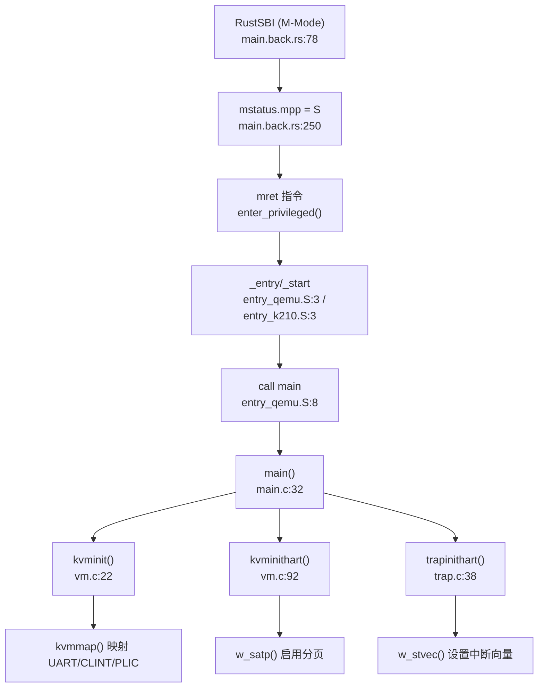

## 第 2 章：启动流程与架构初始化

本章分析从 RustSBI 固件（M-Mode）到内核 `main()` 函数（S-Mode）的完整启动流程，涵盖模式切换、MMU 初始化、串口地址映射及多平台适配机制。

---

### 启动入口与链接脚本分析

#### 双平台入口文件

本项目支持 **K210** 和 **QEMU** 双平台，通过 Makefile 的 `platform` 变量选择编译目标：

- **QEMU 平台**：入口文件为 `kernel/entry_qemu.S`，入口符号为 `_entry`
- **K210 平台**：入口文件为 `kernel/entry_k210.S`，入口符号为 `_start`

**链接脚本配置**（`linker/qemu.ld` 与 `linker/k210.ld`）：

```ld
// linker/qemu.ld
OUTPUT_ARCH(riscv)
ENTRY(_entry)
BASE_ADDRESS = 0x80200000;  // QEMU 内核加载地址

// linker/k210.ld
OUTPUT_ARCH(riscv)
ENTRY(_start)
BASE_ADDRESS = 0x80020000;  // K210 内核加载地址
```

链接脚本定义了内核加载基地址，并声明了入口符号。内核代码段、数据段、BSS 段均从该基地址开始布局。

#### 汇编入口逻辑

**QEMU 入口**（`kernel/entry_qemu.S:3-10`）：

```asm
.section .text
    .globl _entry
_entry:
    add t0, a0, 1
    slli t0, t0, 14
    la sp, boot_stack
    add sp, sp, t0
    call main

loop:
    j loop
```

**K210 入口**（`kernel/entry_k210.S:3-17`）：

```asm
.section .text.entry
    .globl _start
_start:
    add t0, a0, 1
    slli t0, t0, 14
    la sp, boot_stack
    add sp, sp, t0
    call main

loop:
    j loop
```

**关键操作解析**：
1. **栈指针初始化**：通过 `a0`（hartid）计算每个 CPU 核心的独立栈空间偏移（`4096 * 4 * 2` 字节），`boot_stack` 定义在 `.bss.stack` 段
2. **直接跳转 C 入口**：使用 `call main` 指令直接跳转到 `main()` 函数，**无显式 M-Mode → S-Mode 切换**（模式切换由 RustSBI 完成）
3. **死循环兜底**：`main()` 永不返回，若返回则进入无限循环

---

### 架构初始化流程（模式切换/FPU/MMU）

#### RustSBI 模式切换机制

RustSBI 作为 M-Mode 固件，负责将内核加载到 S-Mode 执行。以 `bootloader/SBI/rustsbi-k210/src/main.back.rs` 为例：

**模式切换代码**（`main.back.rs:248-252`）：

```rust
extern "C" {
    fn _s_mode_start();
}
unsafe {
    mepc::write(_s_mode_start as usize);
    mstatus::set_mpp(MPP::Supervisor);  // 设置 mstatus.mpp = S-Mode
    enter_privileged(mhartid::read(), 0x2333333366666666);
}
```

**关键寄存器操作**：
- `mepc::write(_s_mode_start as usize)`：设置 M-Mode 异常返回地址为内核入口（`0x80020000`）
- `mstatus::set_mpp(MPP::Supervisor)`：设置 `mstatus.mpp = 1`（S-Mode）
- `enter_privileged()`：执行 `mret` 指令，CPU 切换到 S-Mode 执行内核

**中断委托配置**（`main.back.rs:203-214`）：

```rust
unsafe {
    mideleg::set_stimer();      // 委托 S-Mode 定时器中断
    mideleg::set_ssoft();       // 委托 S-Mode 软件中断
    medeleg::set_instruction_fault();  // 委托指令错误异常
    medeleg::set_load_fault();         // 委托加载错误异常
    medeleg::set_store_fault();        // 委托存储错误异常
    mie::set_msoft();           // 启用 M-Mode 软件中断
}
```

RustSBI 通过 `mideleg`/`medeleg` 寄存器将大部分中断和异常委托给 S-Mode 处理，自身仅保留 M-Mode 软件中断用于核间通信（IPI）。

#### MMU 初始化流程

内核 `main()` 函数中，MMU 初始化由 `kvminit()` 和 `kvminithart()` 完成：

**页表初始化**（`kernel/vm.c:22-77`）：

```c
void kvminit()
{
  kernel_pagetable = (pagetable_t) kalloc();
  memset(kernel_pagetable, 0, PGSIZE);

// uart registers
  kvmmap(UART_V, UART, PGSIZE, PTE_R | PTE_W);

#ifdef QEMU
  kvmmap(VIRTIO0_V, VIRTIO0, PGSIZE, PTE_R | PTE_W);
  #endif

kvmmap(CLINT_V, CLINT, 0x10000, PTE_R | PTE_W);
  kvmmap(PLIC_V, PLIC, 0x4000, PTE_R | PTE_W);

// map kernel text executable and read-only
  kvmmap(KERNBASE, KERNBASE, (uint64)etext - KERNBASE, PTE_R | PTE_X);

// map kernel data and physical RAM
  kvmmap((uint64)etext, (uint64)etext, PHYSTOP - (uint64)etext, PTE_R | PTE_W);

// map trampoline page
  kvmmap(TRAMPOLINE, (uint64)trampoline, PGSIZE, PTE_R | PTE_X);
}
```

**关键映射关系**：
- **UART**：物理地址 `UART`（QEMU: `0x10000000`, K210: `0x38000000`）→ 虚拟地址 `UART_V = UART + VIRT_OFFSET`（`VIRT_OFFSET = 0x3F00000000L`）
- **CLINT/PLIC**：中断控制器映射到虚拟地址空间
- **内核代码段**：`KERNBASE`（QEMU: `0x80200000`, K210: `0x80020000`）→ 相同虚拟地址（恒等映射）
- **Trampoline 页**：`TRAMPOLINE = MAXVA - PGSIZE`，用于用户态→内核态切换

**启用分页**（`kernel/vm.c:92-99`）：

```c
void kvminithart()
{
  w_satp(MAKE_SATP(kernel_pagetable));  // 设置 satp 寄存器
  sfence_vma();                          // 刷新 TLB
  sync_instruction();                    // 刷新指令缓存
}
```

`w_satp()` 设置 `satp` 寄存器为 Sv39 页表模式（`SATP_SV39 = 8L << 60`），并加载内核页表基地址。

#### 中断向量初始化

**`trapinithart()`**（`kernel/trap.c:38-46`）：

```c
void trapinithart(void)
{
  w_stvec((uint64)kernelvec);           // 设置 stvec 为内核中断向量
  w_sstatus(r_sstatus() | SSTATUS_SIE); // 启用 S-Mode 中断
  w_sie(r_sie() | SIE_SEIE | SIE_SSIE | SIE_STIE);  // 启用外部/软件/定时器中断
  set_next_timeout();
}
```

- `stvec`：设置为 `kernelvec`（定义于 `kernel/kernelvec.S`），处理 S-Mode 中断/异常
- `sie`：启用 S-Mode 外部中断（`SEIE`）、软件中断（`SSIE`）、定时器中断（`STIE`）

#### FPU 状态检测

**❌ 未实现**：搜索全仓库 `sstatus.fs`、`SSTATUS_FS`、`fstatus` 等关键词，**未发现任何 FPU 初始化代码**。

```bash
$ grep -r "sstatus.fs\|SSTATUS_FS\|fstatus" kernel/
# 无结果
```

对比 `kernel/include/riscv.h` 中 `sstatus` 寄存器定义，仅包含 `SSTATUS_SPP`、`SSTATUS_SPIE`、`SSTATUS_SIE` 等位，**无 FPU 相关位定义**。

**结论**：本项目**未启用 FPU**，内核不支持浮点运算。

---

### 到达内核主函数的路径（完整调用链）

#### 启动流程时序



#### `main()` 函数初始化序列

**hart 0 初始化**（`kernel/main.c:32-60`）：

```c
void main(unsigned long hartid, unsigned long dtb_pa)
{
  inithartid(hartid);

if (hartid == 0) {
    consoleinit();        // 串口初始化
    printfinit();         // printf 锁初始化
    print_logo();
    kinit();              // 物理页分配器初始化
    kvminit();            // 创建内核页表
    kvminithart();        // 启用分页
    timerinit();          // 定时器锁初始化
    trapinithart();       // 安装中断向量
    procinit();           // 进程表初始化
    plicinit();
    plicinithart();       // PLIC 初始化
    #ifndef QEMU
    fpioa_pin_init();     // K210 FPIOA 初始化
    dmac_init();          // K210 DMA 初始化
    #endif 
    disk_init();          // 磁盘初始化
    binit();              // 缓冲缓存初始化
    fileinit();           // 文件表初始化
    userinit();           // 创建第一个用户进程
    printf("hart 0 init done\n");

// 发送 IPI 唤醒其他核心
    for(int i = 1; i < NCPU; i++) {
      unsigned long mask = 1 << i;
      sbi_send_ipi(&mask);
    }
    started = 1;
  }
  // ... hart 1+ 初始化
  scheduler();            // 启动调度器
}
```

**hart 1+ 初始化**（`kernel/main.c:63-74`）：

```c
else {
  while (started == 0);   // 等待 hart 0 完成初始化
  kvminithart();          // 启用分页
  trapinithart();         // 安装中断向量
  plicinithart();
  printf("hart 1 init done\n");
}
scheduler();
```

**关键调用链**（通过 `lsp_get_call_graph` 分析）：

```
main()
├── consoleinit() → uartinit() → 配置 UART 寄存器
├── kinit() → 初始化物理页分配器
├── kvminit() → kvmmap() → mappages() → walk() 创建页表
├── kvminithart() → w_satp() → 启用 Sv39 分页
├── trapinithart() → w_stvec() → 设置中断向量
├── procinit() → 初始化进程表
└── scheduler() → 启动进程调度
```

---

### 多平台启动流程（StarFive/LoongArch 等）

#### 平台支持情况

**✅ 已实现**：
- **K210**（嘉楠堪智 K210 RISC-V 芯片）：`platform = k210`
- **QEMU**（RISC-V 虚拟化平台）：`platform = qemu`

**❌ 未实现**：
- **StarFive VisionFive2**：搜索 `visionfive`、`jh7110` 关键词，**无相关代码**
- **LoongArch**：搜索 `loongarch`、`loongson` 关键词，**无相关代码**

```bash
$ grep -r "visionfive\|jh7110\|loongarch" kernel/ bootloader/
# 无结果
```

#### 平台差异化配置

**Makefile 平台选择**（`Makefile:1-10`）：

```makefile
platform	:= k210
#platform	:= qemu

ifeq ($(platform), k210)
OBJS += $K/entry_k210.o
else
OBJS += $K/entry_qemu.o
endif
```

**UART 地址差异**（`kernel/include/memlayout.h:27-34`）：

```c
#ifdef QEMU
#define UART                    0x10000000L
#else
#define UART                    0x38000000L
#endif

#define UART_V                  (UART + VIRT_OFFSET)  // VIRT_OFFSET = 0x3F00000000L
```

- **QEMU**：UART 物理地址 `0x10000000`（16550a UART）
- **K210**：UART 物理地址 `0x38000000`（UARTHS 高速串口）

**虚拟地址转换**：所有外设地址通过 `VIRT_OFFSET` 转换为虚拟地址：
```c
#define UART_V  (UART + 0x3F00000000L)  // QEMU: 0x3F10000000, K210: 0x3F38000000
```

**K210 专属驱动**（`Makefile:37-44`）：
```makefile
ifeq ($(platform), k210)
OBJS += $K/spi.o $K/gpiohs.o $K/fpioa.o $K/utils.o $K/sdcard.o $K/dmac.o $K/sysctl.o
endif
```

---

### 平台配置与构建机制

#### 编译配置

**Makefile 关键变量**（`Makefile:1-15`）：

```makefile
platform	:= k210
mode := release

ifeq ($(mode), debug) 
CFLAGS += -DDEBUG 
endif

ifeq ($(platform), qemu)
CFLAGS += -D QEMU
endif

linker = ./linker/$(platform).ld
```

**编译选项**（`Makefile:75-82`）：

```makefile
CFLAGS = -Wall -Werror -O -fno-omit-frame-pointer -ggdb -g
CFLAGS += -mcmodel=medany          # RISC-V 中内存模型
CFLAGS += -ffreestanding -fno-common -nostdlib -mno-relax
CFLAGS += -I.
```

#### RustSBI 构建

**RustSBI 编译规则**（`Makefile:103-110`）：

```makefile
RUSTSBI:
ifeq ($(platform), k210)
	@cd ./bootloader/SBI/rustsbi-k210 && cargo build && cp ./target/riscv64gc-unknown-none-elf/debug/rustsbi-k210 ../sbi-k210
else
	@cd ./bootloader/SBI/rustsbi-qemu && cargo build && cp ./target/riscv64gc-unknown-none-elf/debug/rustsbi-qemu ../sbi-qemu
endif
```

RustSBI 使用 `riscv64gc-unknown-none-elf` 目标架构（RISC-V 64 位裸机），编译后生成 `sbi-k210` 或 `sbi-qemu` 固件。

#### 镜像生成

**K210 镜像打包**（`Makefile:13-20`）：

```makefile
ifeq ($(platform), k210)
	@$(OBJCOPY) $(RUSTSBI) --strip-all -O binary $(tk210)
	@dd if=$(tmp) of=$(tk210) bs=$(offset) seek=1  # 用户 initcode
	@dd if=$(timage) of=$(tk210) bs=128k seek=1    # 内核镜像
endif
```

K210 镜像结构：
- **0x00000000**：RustSBI 固件
- **0x00001000**（offset=100k）：用户 initcode
- **0x00020000**（128k）：内核镜像（`0x80020000` 物理地址）

---

### 关键代码片段分析

#### MMU 启用前后串口地址切换

**MMU 启用前**（`kernel/console.c:26-32`）：

```c
void consputc(int c) {
  if(c == BACKSPACE){
    sbi_console_putchar('\b');  // 通过 SBI 调用输出
    sbi_console_putchar(' ');
    sbi_console_putchar('\b');
  } else {
    sbi_console_putchar(c);
  }
}
```

`consoleinit()` 在 `kvminit()` 之前调用，此时 MMU 未启用，串口输出通过 **SBI ecall** 实现（`sbi_console_putchar()`），无需访问物理 UART 寄存器。

**MMU 启用后**（`kernel/uart.c:55-72`）：

```c
void uartinit(void)
{
  WriteReg(IER, 0x00);          // 禁用中断
  WriteReg(LCR, LCR_BAUD_LATCH); // 设置波特率锁存模式
  WriteReg(0, 0x03);            // 波特率 38.4K LSB
  WriteReg(1, 0x00);            // 波特率 38.4K MSB
  WriteReg(LCR, LCR_EIGHT_BITS); // 8 位数据位
  WriteReg(FCR, FCR_FIFO_ENABLE | FCR_FIFO_CLEAR);
  WriteReg(IER, IER_TX_ENABLE | IER_RX_ENABLE);
}
```

`uartinit()` 通过 `Reg(reg)` 宏直接访问 UART 寄存器：
```c
#define Reg(reg) ((volatile unsigned char *)(UART + reg))
#define UART_V  (UART + VIRT_OFFSET)  // 虚拟地址
```

**地址切换逻辑**：
- **MMU 启用前**：`consoleinit()` 调用 `sbi_console_putchar()`，通过 SBI ecall 输出（无需 MMU）
- **MMU 启用后**：`uartputc_sync()` 直接访问 `UART_V` 虚拟地址（已映射到物理 `UART`）

#### SBI 调用接口

**SBI ecall 封装**（`kernel/include/sbi.h:21-33`）：

```c
#define SBI_CALL(which, arg0, arg1, arg2, arg3) ({		\
	register uintptr_t a0 asm ("a0") = (uintptr_t)(arg0);	\
	register uintptr_t a1 asm ("a1") = (uintptr_t)(arg1);	\
	register uintptr_t a2 asm ("a2") = (uintptr_t)(arg2);	\
	register uintptr_t a3 asm ("a3") = (uintptr_t)(arg3);	\
	register uintptr_t a7 asm ("a7") = (uintptr_t)(which);	\
	asm volatile ("ecall"					\
		      : "+r" (a0)				\
		      : "r" (a1), "r" (a2), "r" (a3), "r" (a7)	\
		      : "memory");				\
	a0;							\
})

static inline void sbi_console_putchar(int ch)
{
	SBI_CALL_1(SBI_CONSOLE_PUTCHAR, ch);
}
```

SBI 调用通过 `ecall` 指令从 S-Mode 陷入 M-Mode，RustSBI 处理后再返回 S-Mode。

---

### 本章小结

| 组件 | 状态 | 关键文件/函数 |
|------|------|--------------|
| **启动入口** | ✅ 已实现 | `entry_qemu.S:_entry`, `entry_k210.S:_start` |
| **模式切换** | ✅ 已实现 | RustSBI `mstatus::set_mpp(MPP::Supervisor)` |
| **MMU 初始化** | ✅ 已实现 | `kvminit()`, `kvminithart()`, `w_satp()` |
| **中断向量** | ✅ 已实现 | `trapinithart()`, `w_stvec((uint64)kernelvec)` |
| **FPU 支持** | ❌ 未实现 | 无 `sstatus.fs` 相关代码 |
| **多平台** | 🔸 仅支持 K210/QEMU | 无 VisionFive2/LoongArch 适配 |
| **串口地址映射** | ✅ 已实现 | `UART_V = UART + VIRT_OFFSET` |
| **SBI 调用** | ✅ 已实现 | `sbi_console_putchar()`, `ecall` 指令 |

**启动流程总结**：
1. RustSBI（M-Mode）初始化硬件，设置 `mstatus.mpp=S`，通过 `mret` 跳转到内核入口
2. 内核 `entry.S` 设置栈指针，`call main` 进入 C 代码
3. hart 0 执行 `kvminit()` 创建页表，`kvminithart()` 启用 Sv39 分页
4. `trapinithart()` 设置 `stvec` 为 `kernelvec`，启用 S-Mode 中断
5. hart 1+ 通过 IPI 唤醒，执行简化初始化后进入 `scheduler()`

**架构特性**：
- **RISC-V Sv39 分页**：三级页表，512GB 虚拟地址空间
- **直接映射策略**：内核代码/数据恒等映射，外设通过 `VIRT_OFFSET` 映射到高位虚拟地址
- **无 FPU 支持**：未初始化 `sstatus.fs` 位，不支持浮点运算
- **双平台适配**：通过 `#ifdef QEMU` 和 Makefile 条件编译支持 K210/QEMU
