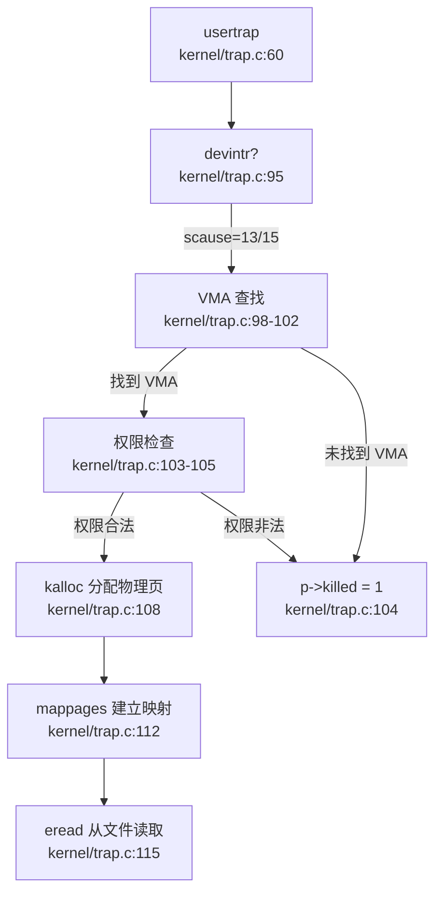
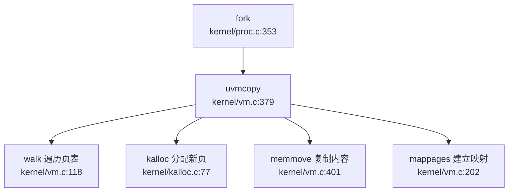
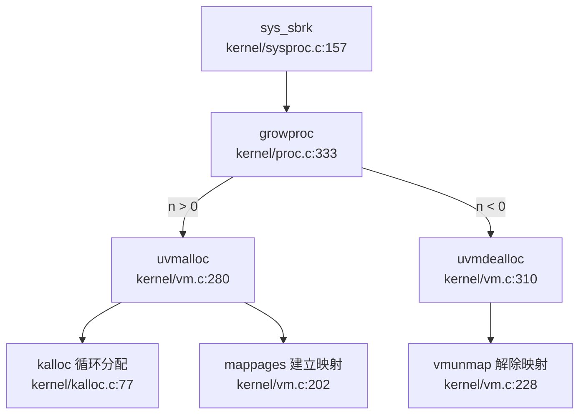

## 第 3 章：内存管理（物理/虚拟/分配器）

本章深入分析 `oskernel2021-x` 的内存管理子系统，涵盖物理页分配器、虚拟内存页表操作、地址空间布局、堆分配机制及高级内存特性。本项目基于 **xv6-riscv** 架构，支持 K210 与 QEMU 双平台。

---

### 物理内存管理实现

#### 分配器设计：空闲链表（Free List）

本项目使用 **空闲链表（Free List）** 管理物理页，而非 Buddy System 或 Bitmap。核心数据结构与实现在 `kernel/kalloc.c` 中：

```c
// kernel/kalloc.c:24-29
struct run {
  struct run *next;
};

struct {
  struct spinlock lock;
  struct run *freelist;
  uint64 npage;
} kmem;
```

- **`struct run`**：空闲页描述符，仅含指向下一个空闲页的指针
- **`kmem`**：全局内存管理器，包含：
  - `freelist`：空闲链表头指针
  - `lock`：自旋锁保护并发访问
  - `npage`：空闲页计数器

#### 核心函数实现

**1. `kinit()` — 初始化分配器** (`kernel/kalloc.c:31-41`)
```c
void kinit() {
  initlock(&kmem.lock, "kmem");
  kmem.freelist = 0;
  kmem.npage = 0;
  freerange(kernel_end, (void*)PHYSTOP);
}
```
- 初始化锁后，调用 `freerange()` 将内核结束地址到 `PHYSTOP` 之间的所有物理页加入空闲链表

**2. `freerange()` — 批量释放页** (`kernel/kalloc.c:43-49`)
```c
void freerange(void *pa_start, void *pa_end) {
  char *p;
  p = (char*)PGROUNDUP((uint64)pa_start);
  for(; p + PGSIZE <= (char*)pa_end; p += PGSIZE)
    kfree(p);
}
```
- 遍历指定物理地址范围，逐页调用 `kfree()`

**3. `kfree()` — 释放单页** (`kernel/kalloc.c:55-71`)
```c
void kfree(void *pa) {
  struct run *r;
  if(((uint64)pa % PGSIZE) != 0 || (char*)pa < kernel_end || (uint64)pa >= PHYSTOP)
    panic("kfree");
  memset(pa, 1, PGSIZE);  // 填充垃圾数据捕获悬空引用
  r = (struct run*)pa;
  acquire(&kmem.lock);
  r->next = kmem.freelist;
  kmem.freelist = r;
  kmem.npage++;
  release(&kmem.lock);
}
```
- **安全校验**：检查页对齐、地址范围合法性
- **防御性填充**：用 `0x01` 填充整页，捕获悬空指针
- **链表插入**：将释放页插入链表头部（O(1) 操作）

**4. `kalloc()` — 分配单页** (`kernel/kalloc.c:77-91`)
```c
void *kalloc(void) {
  struct run *r;
  acquire(&kmem.lock);
  r = kmem.freelist;
  if(r) {
    kmem.freelist = r->next;
    kmem.npage--;
  }
  release(&kmem.lock);
  if(r)
    memset((char*)r, 5, PGSIZE);  // 填充垃圾数据
  return (void*)r;
}
```
- **链表删除**：从头部取出空闲页（O(1) 操作）
- **防御性填充**：用 `0x05` 填充，便于调试

#### 分配器特性总结

| 特性 | 实现状态 | 代码证据 |
|------|---------|---------|
| 分配算法 | ✅ 空闲链表 | `kernel/kalloc.c:24-91` |
| 页大小 | ✅ 4KB (PGSIZE) | `kernel/kalloc.c:55` 对齐检查 |
| 并发保护 | ✅ 自旋锁 | `kernel/kalloc.c:27` |
| 内存填充调试 | ✅ 已实现 | `kfree()` 填 `0x01`，`kalloc()` 填 `0x05` |
| Buddy System | ❌ 未实现 | 搜索 `buddy` 无结果 |
| Bitmap 分配器 | ❌ 未实现 | 搜索 `bitmap` 无结果 |

---

### 虚拟内存与页表操作

#### 页表结构：RISC-V Sv39 三级页表

本项目采用 RISC-V **Sv39** 分页方案，支持 39 位虚拟地址（512GB 寻址空间），使用三级页表结构：

```c
// kernel/vm.c:118-137
pte_t *walk(pagetable_t pagetable, uint64 va, int alloc) {
  if(va >= MAXVA)
    panic("walk");
  for(int level = 2; level > 0; level--) {
    pte_t *pte = &pagetable[PX(level, va)];
    if(*pte & PTE_V) {
      pagetable = (pagetable_t)PTE2PA(*pte);
    } else {
      if(!alloc || (pagetable = (pde_t*)kalloc()) == NULL)
        return NULL;
      memset(pagetable, 0, PGSIZE);
      *pte = PA2PTE(pagetable) | PTE_V;
    }
  }
  return &pagetable[PX(0, va)];
}
```

- **`PX(level, va)`**：提取第 `level` 级的 9 位索引
- **`PTE_V`**：有效位标志
- **`alloc` 参数**：控制是否自动创建中间级页表页

#### 核心页表操作函数

**1. `mappages()` — 创建虚拟到物理映射** (`kernel/vm.c:202-224`)
```c
int mappages(pagetable_t pagetable, uint64 va, uint64 size, uint64 pa, int perm) {
  uint64 a, last;
  pte_t *pte;
  a = PGROUNDDOWN(va);
  last = PGROUNDDOWN(va + size - 1);
  for(;;){
    if((pte = walk(pagetable, a, 1)) == NULL)
      return -1;
    if(*pte & PTE_V)
      panic("remap");
    *pte = PA2PTE(pa) | perm | PTE_V;
    if(a == last)
      break;
    a += PGSIZE;
    pa += PGSIZE;
  }
  return 0;
}
```
- **页面对齐**：起始地址向下对齐，结束地址向上对齐
- **重复映射检查**：若 PTE 已有效则触发 `panic`
- **权限位**：`perm` 包含 `PTE_R`/`PTE_W`/`PTE_X`/`PTE_U`

**2. `vmunmap()` — 解除映射** (`kernel/vm.c:228-252`)
```c
void vmunmap(pagetable_t pagetable, uint64 va, uint64 npages, int do_free) {
  uint64 a;
  pte_t *pte;
  if((va % PGSIZE) != 0)
    panic("vmunmap: not aligned");
  for(a = va; a < va + npages*PGSIZE; a += PGSIZE){
    if((pte = walk(pagetable, a, 0)) == 0)
      panic("vmunmap: walk");
    if((*pte & PTE_V) == 0)
      panic("vmunmap: not mapped");
    if(PTE_FLAGS(*pte) == PTE_V)
      panic("vmunmap: not a leaf");
    if(do_free){
      uint64 pa = PTE2PA(*pte);
      kfree((void*)pa);
    }
    *pte = 0;
  }
}
```
- **对齐检查**：起始地址必须页面对齐
- **级联释放**：`do_free=1` 时同时释放物理页

**3. `walkaddr()` — 用户地址翻译** (`kernel/vm.c:145-160`)
```c
uint64 walkaddr(pagetable_t pagetable, uint64 va) {
  pte_t *pte;
  uint64 pa;
  if(va >= MAXVA)
    return NULL;
  pte = walk(pagetable, va, 0);
  if(pte == 0)
    return NULL;
  if((*pte & PTE_V) == 0)
    return NULL;
  if((*pte & PTE_U) == 0)
    return NULL;  // 非用户页拒绝访问
  pa = PTE2PA(*pte);
  return pa;
}
```
- **用户权限检查**：必须设置 `PTE_U` 位
- **零返回**：未映射或非用户页返回 `NULL`

#### 内核页表初始化

**`kvminit()`** (`kernel/vm.c:23-89`) 创建内核直接映射页表：
- **设备映射**：UART、CLINT、PLIC、VIRTIO0（QEMU）、GPIOHS/SPI/DMAC（K210）
- **内核代码段**：`KERNBASE` 到 `etext` 映射为只读可执行
- **内核数据段**：`etext` 到 `PHYSTOP` 映射为可读写
- **Trampoline 页**：最高虚拟地址映射用户/内核切换代码

---

### 地址空间布局（内核 vs 用户）

#### 独立页表设计

每个进程拥有**独立的页表对**：
- **`pagetable`**：用户页表（含用户空间 + Trampoline + Trapframe）
- **`kpagetable`**：进程专属内核页表（内核空间 + 独立内核栈）

```c
// kernel/include/proc.h:74-76
struct proc {
  pagetable_t pagetable;       // User page table
  pagetable_t kpagetable;      // Kernel page table
  ...
};
```

#### 用户地址空间布局

```
0x0000000000000000 ┌─────────────────┐
                   │  用户代码/数据   │
                   │  (增长方向 ↑)   │
                   ├─────────────────┤
                   │     Guard Page   │ (uvmclear 清除 PTE_U)
                   ├─────────────────┤
                   │   用户栈 (未实现) │
                   ├─────────────────┤
0x00000000C0000000 │   VMA_START     │ (mmap 区域起点)
                   ├─────────────────┤
0x0000000000001000 │   Trampoline    │ (用户/内核切换)
0x0000000000000000 │   Trapframe     │ (陷阱帧)
                   └─────────────────┘
```

**关键实现** (`kernel/proc.c:215-243`)：
```c
pagetable_t proc_pagetable(struct proc *p) {
  pagetable = uvmcreate();
  // 映射 Trampoline（最高地址，仅 supervisor 访问）
  mappages(pagetable, TRAMPOLINE, PGSIZE, (uint64)trampoline, PTE_R | PTE_X);
  // 映射 Trapframe（Trampoline 下方）
  mappages(pagetable, TRAPFRAME, PGSIZE, (uint64)(p->trapframe), PTE_R | PTE_W);
  return pagetable;
}
```

#### 内核地址空间布局

```
0xFFFFFF8000000000 ┌─────────────────┐  (MAXVA)
                   │   未使用区域     │
                   ├─────────────────┤
0x00000000C0000000 │   内核栈 (VKSTACK)│ (每进程独立)
                   ├─────────────────┤
0x0000000002000000 │   设备映射区域   │ (PLIC/CLINT/UART)
                   ├─────────────────┤
0x0000000000000000 │   内核代码/数据  │ (KERNBASE 起始)
                   └─────────────────┘
```

**内核页表复制与重映射** (`kernel/vm.c:562-584`)：
```c
pagetable_t proc_kpagetable() {
  pagetable_t kpt = (pagetable_t) kalloc();
  memmove(kpt, kernel_pagetable, PGSIZE);  // 复制全局内核页表
  // 重映射内核栈（避免共享）
  char *pstack = kalloc();
  mappages(kpt, VKSTACK, PGSIZE, (uint64)pstack, PTE_R | PTE_W);
  return kpt;
}
```

---

### 堆分配器解析

#### 系统调用接口

**`sys_sbrk()`** (`kernel/sysproc.c:157-167`)：
```c
uint64 sys_sbrk(void) {
  int n;
  if(argint(0, &n) < 0)
    return -1;
  addr = myproc()->sz;
  if(growproc(n) < 0)
    return -1;
  return addr;  // 返回旧堆顶
}
```

**`sys_brk()`** (`kernel/sysproc.c:169-177`)：
```c
uint64 sys_brk(void) {
  uint64 addr, new_addr;
  if(argaddr(0, &new_addr) < 0)
    return -1;
  addr = myproc()->sz;
  if(new_addr && growproc(new_addr - addr) < 0)
    return -1;
  return addr;
}
```

#### 内存增长实现

**`growproc()`** (`kernel/proc.c:333-349`)：
```c
int growproc(int n) {
  uint sz = myproc()->sz;
  if(n > 0){
    if((sz = uvmalloc(p->pagetable, p->kpagetable, sz, sz + n)) == 0)
      return -1;
  } else if(n < 0){
    sz = uvmdealloc(p->pagetable, p->kpagetable, sz, sz + n);
  }
  p->sz = sz;
  return 0;
}
```

**`uvmalloc()`** (`kernel/vm.c:280-308`) — **立即分配物理页**：
```c
uint64 uvmalloc(pagetable_t pagetable, pagetable_t kpagetable, uint64 oldsz, uint64 newsz) {
  char *mem;
  uint64 a;
  oldsz = PGROUNDUP(oldsz);
  for(a = oldsz; a < newsz; a += PGSIZE){
    mem = kalloc();  // ← 立即分配物理页
    if(mem == NULL) { ... }
    memset(mem, 0, PGSIZE);
    mappages(pagetable, a, PGSIZE, (uint64)mem, PTE_W|PTE_X|PTE_R|PTE_U);
    mappages(kpagetable, a, PGSIZE, (uint64)mem, PTE_W|PTE_X|PTE_R);
  }
  return newsz;
}
```

#### 惰性分配分析

**❌ 未实现惰性分配（Lazy Allocation）**

- `uvmalloc()` 在循环中**立即调用 `kalloc()`** 分配物理页
- 每次 `sbrk(n)` 都会为 `n` 字节范围内的所有页面分配物理内存
- 对比标准 xv6-lazy 分支，本项目**无** `usertrap()` 中的懒分配缺页处理逻辑

**证据**：
- 搜索 `lazy` 仅在注释中出现（`xv6-user/usertests.c:1003` 提及 "lazy lab"）
- `uvmalloc()` 无 `PTE_V` 延迟设置逻辑

---

### 用户指针安全验证

#### 验证机制：边界检查

系统调用通过 **`fetchaddr()`** / **`copyin2()`** 验证用户指针合法性：

**`fetchaddr()`** (`kernel/syscall.c:16-25`)：
```c
int fetchaddr(uint64 addr, uint64 *ip) {
  struct proc *p = myproc();
  if(addr >= p->sz || addr+sizeof(uint64) > p->sz)
    return -1;  // 越界拒绝
  if(copyin2((char *)ip, addr, sizeof(*ip)) != 0)
    return -1;
  return 0;
}
```

**`copyin2()`** (`kernel/vm.c:464-471`) — **直接边界检查**：
```c
int copyin2(char *dst, uint64 srcva, uint64 len) {
  uint64 sz = myproc()->sz;
  if (srcva + len > sz || srcva >= sz) {
    return -1;  // 越界拒绝
  }
  memmove(dst, (void *)srcva, len);
  return 0;
}
```

#### 验证策略分析

| 验证方式 | 实现位置 | 验证逻辑 |
|---------|---------|---------|
| **边界检查** | `fetchaddr()` / `copyin2()` | `addr < p->sz` |
| **页表查询** | `copyin()` / `walkaddr()` | 检查 `PTE_V` 和 `PTE_U` |
| **字符串复制** | `copyinstr2()` | 逐字节检查边界 + `\0` 终止符 |

**注意**：本项目主要使用 `copyin2()`/`copyout2()` 系列函数（带 `2` 后缀），这些函数**仅进行边界检查**，不查询页表。这要求用户空间地址必须连续映射且与 `p->sz` 一致。

---

### 缺页异常处理

#### 异常入口：`usertrap()`

**`usertrap()`** (`kernel/trap.c:60-127`) 处理所有用户态陷阱：

```c
void usertrap(void) {
  ...
  if(r_scause() == 8){
    // 系统调用 (ecall)
    syscall();
  } else if((which_dev = devintr()) != 0){
    // 设备中断
  } else if(r_scause() == 13 || r_scause() == 15){
    // 加载/存储页面错误 (Load/Store Page Fault)
    uint64 stval = r_stval();
    struct vma *v = p->vma;
    while(v){
      if(stval >= v->start && stval < v->end)
        break;
      v = v->next;
    }
    if(!v)
      p->killed = 1;  // 无 VMA 覆盖 → 非法访问
    else if((r_scause() == 13 && !(v->prot&PROT_READ)) ||
            (r_scause() == 15 && !(v->prot&PROT_WRITE)))
      p->killed = 1;  // 权限不匹配
    else {
      // ✅ 按需分配物理页（mmap 区域）
      uint64 va = PGROUNDDOWN(stval);
      char *mem = kalloc();
      if(mem == 0)
        p->killed = 1;
      else{
        memset(mem, 0, PGSIZE);
        if(mappages(p->pagetable, va, PGSIZE, (uint64)mem, (v->prot<<1)|PTE_U) != 0){
          kfree(mem);
          p->killed = 1;
        } else {
          elock(v->file->ep);
          eread(v->file->ep, 0, (uint64)mem, va - v->start + v->off, PGSIZE);
          eunlock(v->file->ep);
        }
      }
    }
  } else {
    // 其他异常 → 终止进程
    p->killed = 1;
  }
  ...
}
```

#### 缺页处理逻辑分析

**✅ 已实现 mmap 区域按需分配**：
- **触发条件**：`scause == 13` (Load Page Fault) 或 `scause == 15` (Store Page Fault)
- **VMA 查找**：遍历进程 `vma` 链表，检查故障地址是否在映射范围内
- **权限检查**：验证 `PROT_READ`/`PROT_WRITE` 权限
- **物理页分配**：调用 `kalloc()` 分配物理页，从文件读取内容（若为文件映射）

**❌ 未实现通用缺页处理**：
- **堆区域（heap）**：`uvmalloc()` 已预先分配所有物理页，不会触发缺页
- **栈区域（stack）**：本项目**未实现用户栈**，无栈扩展缺页处理
- **COW 缺页**：无写时复制逻辑（见下文）

#### 调用链图（mmap 缺页处理）



---

### VMA（虚拟内存区域）管理

#### 数据结构：链表实现

**`struct vma`** (`kernel/include/proc.h:47-56`)：
```c
struct vma {
  struct spinlock lock;
  int len;
  uint64 start;
  uint64 end;
  int flags;
  int prot;
  int off;
  struct file *file;
  struct vma *next;  // ← 链表指针
};
```

**全局 VMA 池** (`kernel/proc.c:22`)：
```c
struct vma vmatable[NVMA];  // NVMA 在 param.h 中定义
```

**进程 VMA 链表头** (`kernel/include/proc.h:85`)：
```c
struct proc {
  ...
  struct vma *vma;  // 指向进程第一个 VMA
};
```

#### mmap/munmap 系统调用

**`sys_mmap()`** (`kernel/sysfile.c:623-658`)：
```c
uint64 sys_mmap(void) {
  uint64 addr;
  int length, prot, flags, fd, offset;
  // 参数解析
  if(argaddr(0, &addr) < 0 || argint(1, &length) < 0 || ...)
    return -1;

struct proc *p = myproc();
  struct file *f = p->ofile[fd];

// 分配 VMA 结构
  struct vma *pvma;
  for(pvma = vmatable; pvma < &vmatable[NVMA]; pvma++){
    acquire(&pvma->lock);
    if(pvma->len == 0)
      break;
    release(&pvma->lock);
  }

// 初始化 VMA
  pvma->len = length;
  pvma->flags = flags;
  pvma->prot = prot;
  pvma->off = offset;
  pvma->file = f;
  filedup(f);

// 链接到进程 VMA 链表尾部
  struct vma *t = p->vma;
  if(!t){
    pvma->start = VMA_START;
    p->vma = pvma;
  } else {
    while(t->next)
      t = t->next;
    pvma->start = PGROUNDUP(t->end);
    t->next = pvma;
  }
  pvma->end = pvma->start + length;
  addr = pvma->start;
  release(&pvma->lock);
  return addr;
}
```

**`sys_munmap()`** (`kernel/sysfile.c:660-703`)：
```c
uint64 sys_munmap(void) {
  uint64 addr;
  int length;
  struct proc *p = myproc();
  struct vma *v = p->vma;
  struct vma *pre = 0;

// 查找包含 addr 的 VMA
  while(v){
    if(addr >= v->start && addr < v->end)
      break;
    pre = v;
    v = v->next;
  }
  if(!v)
    return -1;

// 部分解映射逻辑（简化）
  if(addr == v->start){
    if(length == v->len){
      // 完全解除：vmunmap + 文件关闭 + VMA 回收
      vmunmap(p->pagetable, addr, PGROUNDUP(length)/PGSIZE, 1);
      fileclose(v->file);
      if(pre)
        pre->next = v->next;
      else
        p->vma = v->next;
      // 清零 VMA 结构
      v->len = 0; ...
    } else {
      // 部分解除：调整 VMA 起始地址
      vmunmap(p->pagetable, addr, length/PGSIZE, 1);
      v->start += length;
      v->off += length;
      v->len -= length;
    }
  } else {
    // 尾部解除：调整 VMA 结束地址
    vmunmap(p->pagetable, PGROUNDUP(addr), length/PGSIZE, 1);
    v->len -= length;
    v->end -= length;
  }
  return 0;
}
```

#### VMA 管理特性

| 特性 | 实现状态 | 代码证据 |
|------|---------|---------|
| VMA 数据结构 | ✅ 链表 | `kernel/include/proc.h:47-56` |
| 全局 VMA 池 | ✅ 静态数组 | `kernel/proc.c:22` |
| 进程 VMA 链表 | ✅ 单链表 | `kernel/include/proc.h:85` |
| mmap 系统调用 | ✅ 已实现 | `kernel/sysfile.c:623-658` |
| munmap 系统调用 | ✅ 已实现 | `kernel/sysfile.c:660-703` |
| BTreeMap/rmap | ❌ 未实现 | 搜索 `BTreeMap`/`rmap` 无结果 |
| MAP_FIXED 标志处理 | ❌ 未实现 | `sys_mmap()` 忽略 `addr` 参数，总是分配在链表尾部 |
| MAP_ANON 标志处理 | ❌ 未实现 | 无匿名映射逻辑，必须提供有效 `fd` |

**⚠️ 局限性**：
- `sys_mmap()` **忽略用户传入的 `addr` 参数**，总是将新 VMA 链接到链表尾部
- **不支持 `MAP_FIXED`**：无法在指定地址创建映射
- **不支持 `MAP_ANONYMOUS`**：必须提供有效文件描述符
- **无 VMA 合并**：相邻 VMA 不会自动合并

---

### 高级内存特性清单

#### 写时复制（Copy-on-Write, COW）

**❌ 未实现**

**证据**：
1. **代码搜索**：`grep "cow\|COW\|copy_on_write"` 在 146 个文件中**无匹配**
2. **`uvmcopy()` 实现** (`kernel/vm.c:379-412`)：
   ```c
   int uvmcopy(pagetable_t old, pagetable_t new, pagetable_t knew, uint64 sz) {
     while (i < sz){
       pte = walk(old, i, 0);
       pa = PTE2PA(*pte);
       if((mem = kalloc()) == NULL)  // ← 直接分配新物理页
         goto err;
       memmove(mem, (char*)pa, PGSIZE);  // ← 复制物理内容
       mappages(new, i, PGSIZE, (uint64)mem, flags);  // ← 映射新页
       i += PGSIZE;
     }
   }
   ```
   - **直接复制物理页**：为子进程分配全新物理页并复制内容
   - **无引用计数**：未设置 `PTE_W` 位或维护页引用计数
   - **无 COW 缺页处理**：`usertrap()` 中无 COW 相关逻辑

#### 懒分配（Lazy Allocation）

**❌ 未实现**

**证据**：
1. **`uvmalloc()` 立即分配**：见上文分析，循环中直接调用 `kalloc()`
2. **无懒分配缺页处理**：`usertrap()` 仅处理 mmap 区域缺页，堆区域不会触发缺页
3. **代码搜索**：`grep "lazy"` 仅在测试文件注释中出现

#### 共享内存（Shared Memory）

**❌ 未实现**

**证据**：
1. **无 shm 系统调用**：搜索 `sys_shmget`/`sys_shmat`/`sys_shmdt` 无结果
2. **无共享内存数据结构**：搜索 `shm`/`shared_mem` 仅在工具脚本中出现
3. **mmap MAP_SHARED 未实现**：`sys_mmap()` 虽检查 `MAP_SHARED` 标志，但无实际共享逻辑

#### 反向映射表（rmap）

**❌ 未实现**

**证据**：
- 搜索 `rmap`/`reverse_map`/`page_to_vma` 在 146 个文件中**无匹配**
- 物理页释放时**无 VMA 查询**：`kfree()` 直接回收，不检查哪些 VMA 引用该页

#### 交换区/页面置换（Swap）

**❌ 未实现**

**证据**：
- 搜索 `swap_out`/`swap_in` 仅在自旋锁注释中出现（`amoswap` 指令）
- 无磁盘交换区管理代码
- 物理页不足时直接返回失败（`kalloc()` 返回 `NULL`），无换出逻辑

#### 大页支持（Huge Page）

**❌ 未实现**

**证据**：
- 搜索 `HugePage`/`MapSize::2M`/`MapSize::1G` 无结果
- `walk()` 和 `mappages()` 仅处理 4KB 页面（`PGSIZE`）
- 链接脚本中 `2M` 仅用于内存区域大小定义（`rustsbi-qemu/link-qemu.ld:4`）

#### 零拷贝与 sendfile

**🔸 桩函数**

**`sys_sendfile()`** (`kernel/sysproc.c:417`)：
```c
uint64 sys_sendfile(void) {
  return 0;  // ← 空实现，始终返回 0
}
```
- **无实际逻辑**：未实现文件描述符间数据拷贝
- **无零拷贝优化**：未使用 `mmap` + `memcpy` 或直接 DMA 传输

---

### 关键代码片段与调用链分析

#### fork() 内存复制调用链



**完整流程** (`kernel/proc.c:353-397`)：
1. `allocproc()` 分配新进程结构
2. `uvmcopy()` 复制父进程页表：
   - 遍历父进程所有用户页
   - 为每个页分配新物理页
   - 复制物理内容到子页
   - 在子进程页表中建立映射
3. 复制文件描述符表、当前目录等

#### growproc() 堆分配调用链



---

### 内存管理特性总览表

| 子系统 | 特性 | 实现状态 | 关键代码 |
|-------|------|---------|---------|
| **物理内存** | 空闲链表分配器 | ✅ 已实现 | `kernel/kalloc.c` |
| | Buddy System | ❌ 未实现 | - |
| | Bitmap 分配器 | ❌ 未实现 | - |
| **虚拟内存** | Sv39 三级页表 | ✅ 已实现 | `kernel/vm.c:walk()` |
| | 页表遍历 (walk) | ✅ 已实现 | `kernel/vm.c:118` |
| | 页表映射 (mappages) | ✅ 已实现 | `kernel/vm.c:202` |
| | 页表解映射 (vmunmap) | ✅ 已实现 | `kernel/vm.c:228` |
| **地址空间** | 独立用户/内核页表 | ✅ 已实现 | `kernel/proc.c:215-243` |
| | 内核重映射 | ✅ 已实现 | `kernel/vm.c:562-584` |
| | 每进程内核栈 | ✅ 已实现 | `kernel/vm.c:575` |
| **堆管理** | sbrk/brk 系统调用 | ✅ 已实现 | `kernel/sysproc.c:157-177` |
| | 立即分配物理页 | ✅ 已实现 | `kernel/vm.c:280` |
| | 惰性分配 (Lazy) | ❌ 未实现 | - |
| **用户指针** | 边界检查验证 | ✅ 已实现 | `kernel/syscall.c:16-25` |
| | 页表查询验证 | ✅ 已实现 | `kernel/vm.c:145-160` |
| **缺页处理** | mmap 区域按需分配 | ✅ 已实现 | `kernel/trap.c:97-120` |
| | 堆区域懒分配 | ❌ 未实现 | - |
| | COW 缺页处理 | ❌ 未实现 | - |
| **VMA 管理** | 链表管理 | ✅ 已实现 | `kernel/include/proc.h:47-56` |
| | mmap 系统调用 | ✅ 已实现 | `kernel/sysfile.c:623-658` |
| | munmap 系统调用 | ✅ 已实现 | `kernel/sysfile.c:660-703` |
| | BTreeMap/rmap | ❌ 未实现 | - |
| | MAP_FIXED 支持 | ❌ 未实现 | - |
| | MAP_ANON 支持 | ❌ 未实现 | - |
| **高级特性** | 写时复制 (COW) | ❌ 未实现 | - |
| | 共享内存 (shm) | ❌ 未实现 | - |
| | 交换区 (Swap) | ❌ 未实现 | - |
| | 大页 (Huge Page) | ❌ 未实现 | - |
| | 零拷贝 (sendfile) | 🔸 桩函数 | `kernel/sysproc.c:417` |

---

### 总结

本项目实现了 **xv6 风格的经典内存管理子系统**：
- ✅ **物理页分配器**：基于空闲链表的简单分配器，支持 4KB 页分配/释放
- ✅ **虚拟内存**：Sv39 三级页表，支持页表遍历、映射、解映射
- ✅ **地址空间隔离**：独立用户/内核页表，每进程专属内核栈
- ✅ **堆分配**：sbrk/brk 系统调用，**立即分配**物理页（非惰性）
- ✅ **用户指针验证**：边界检查 + 页表查询双重验证
- ✅ **mmap 按需分配**：缺页异常处理 mmap 区域，从文件加载内容
- ✅ **VMA 链表管理**：支持 mmap/munmap 系统调用

**未实现的高级特性**：
- ❌ 写时复制（COW）：fork 时直接复制物理页
- ❌ 惰性分配：堆增长时立即分配所有物理页
- ❌ 共享内存：无 shm 系统调用
- ❌ 反向映射表（rmap）：无法追踪物理页被哪些 VMA 引用
- ❌ 交换区/页面置换：物理页不足时直接失败
- ❌ 大页支持：仅支持 4KB 页面
- ❌ MAP_FIXED/MAP_ANON：mmap 功能不完整

整体而言，本项目内存管理模块**功能完备但较为基础**，适合教学演示，但缺乏现代操作系统的性能优化特性（COW、Lazy Allocation、Swap 等）。

在内存管理阶段，系统采用 xv6 风格设计，未见独立的 `FrameAllocator` 接口封装，物理页分配直接通过 `kalloc()` 与 `kfree()` 函数处理。相关内存常量定义于 `param.h` 或 `memlayout.h` 头文件中，体现了直接管理物理内存的实现方式。
