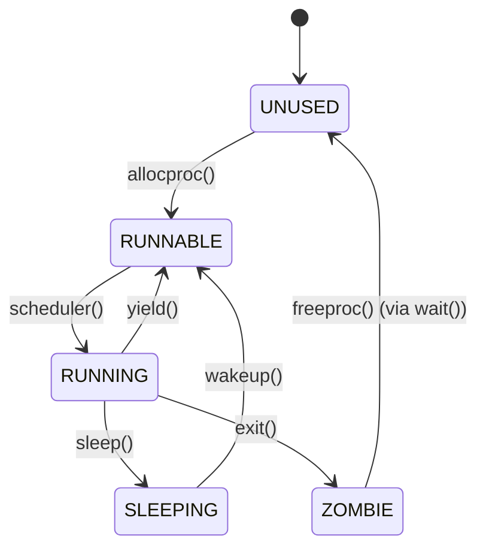
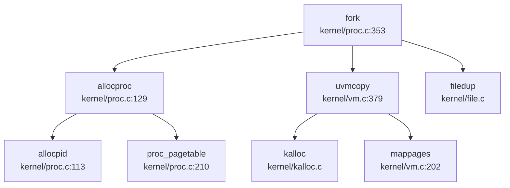
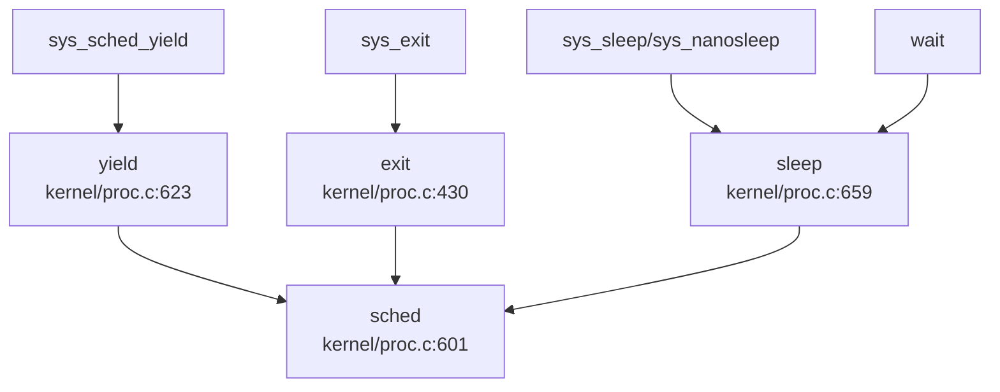
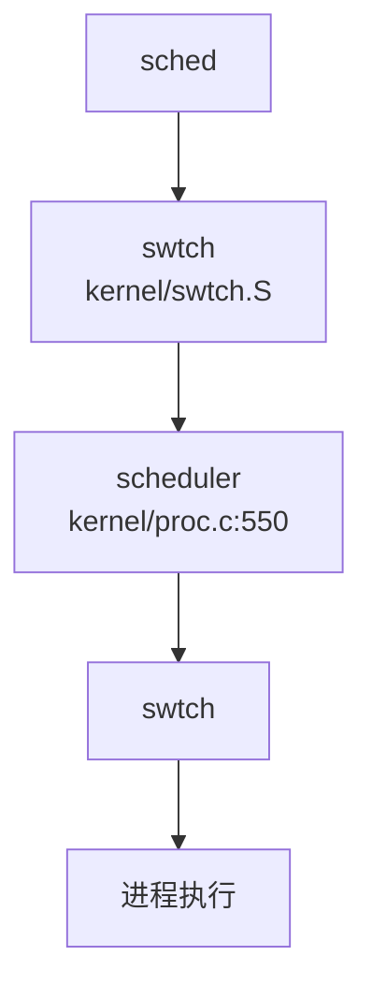

## 第 4 章：进程/线程与调度机制

本章深入分析 `oskernel2021-x` 的进程管理子系统，涵盖任务模型、调度算法、上下文切换实现、进程状态机以及 fork/exec/wait 等核心流程。本项目基于 **xv6-riscv** 架构，支持 K210 与 QEMU 双平台，进程管理核心实现在 `kernel/proc.c`（923 行）和 `kernel/include/proc.h`。

---

### 任务模型与核心数据结构

#### 进程控制块（PCB）：`struct proc`

本项目的执行实体是 **进程（Process）**，通过 `struct proc` 结构体表示。该结构体定义在 `kernel/include/proc.h:60-87`，包含以下关键字段：

```c
// kernel/include/proc.h:60-87
struct proc {
  struct spinlock lock;          // 保护该 PCB 的自旋锁

// p->lock must be held when using these:
  enum procstate state;          // 进程状态 (UNUSED/SLEEPING/RUNNABLE/RUNNING/ZOMBIE)
  struct proc *parent;           // 父进程指针
  void *chan;                    // 睡眠通道（非零表示在该通道上睡眠）
  int killed;                    // 被杀死标志
  int xstate;                    // 退出状态（返回给父进程）
  int pid;                       // 进程 ID

// these are private to the process, so p->lock need not be held.
  uint64 kstack;                 // 内核栈虚拟地址
  uint64 sz;                     // 进程内存大小（字节）
  pagetable_t pagetable;         // 用户页表
  pagetable_t kpagetable;        // 内核页表
  struct trapframe *trapframe;   // trampoline.S 使用的数据页
  struct context context;        // swtch() 使用的上下文
  struct file *ofile[NOFILE];    // 打开文件表
  struct dirent *cwd;            // 当前工作目录
  char name[16];                 // 进程名（调试用）
  int tmask;                     // 跟踪掩码
  struct vma *vma;               // 虚拟内存区域链表

long utime;   // 用户态运行时间（ticks）
  long stime;   // 内核态运行时间（ticks）
  long cutime;  // 子进程用户态时间累加
  long cstime;  // 子进程内核态时间累加
};
```

**关键设计特点**：
- **双页表设计**：每个进程同时拥有 `pagetable`（用户页表）和 `kpagetable`（内核页表），调度时通过 `w_satp(MAKE_SATP(p->kpagetable))` 切换
- **上下文分离**：`context` 字段保存 callee-saved 寄存器，用于 `swtch()` 进行上下文切换
- **资源管理**：通过 `ofile[NOFILE]` 管理打开文件，`cwd` 管理当前目录
- **时间统计**：支持用户态/内核态时间统计（`utime/stime`）及子进程时间累加（`cutime/cstime`）

#### 上下文结构：`struct context`

上下文结构定义在 `kernel/include/proc.h:15-32`，仅保存 **callee-saved 寄存器**（13 个寄存器，共 104 字节）：

```c
// kernel/include/proc.h:15-32
struct context {
  uint64 ra;   // 返回地址
  uint64 sp;   // 栈指针
  // callee-saved
  uint64 s0;
  uint64 s1;
  uint64 s2;
  uint64 s3;
  uint64 s4;
  uint64 s5;
  uint64 s6;
  uint64 s7;
  uint64 s8;
  uint64 s9;
  uint64 s10;
  uint64 s11;
};
```

**设计原理**：RISC-V 调用约定规定 callee-saved 寄存器（s0-s11）由被调用函数负责保存，因此上下文切换时只需保存这些寄存器，caller-saved 寄存器（如 a0-a7、t0-t6）由编译器在函数调用时自动处理。

#### 进程状态枚举：`enum procstate`

```c
// kernel/include/proc.h:57
enum procstate { UNUSED, SLEEPING, RUNNABLE, RUNNING, ZOMBIE };
```

五状态定义：
- **UNUSED**：空闲槽位，可分配
- **SLEEPING**：睡眠状态，等待某个事件（如 I/O 完成、子进程退出）
- **RUNNABLE**：就绪状态，可被调度
- **RUNNING**：正在运行
- **ZOMBIE**：僵尸状态，已退出但等待父进程回收

---

### 调度算法与策略（代码证据）

#### 调度器实现：FIFO 轮询

调度器 `scheduler()` 实现在 `kernel/proc.c:550-592`，采用 **简单的 FIFO 轮询算法**，遍历全局 `proc` 数组寻找第一个 `RUNNABLE` 状态的进程：

```c
// kernel/proc.c:550-592
void scheduler(void)
{
  struct proc *p;
  struct cpu *c = mycpu();
  extern pagetable_t kernel_pagetable;

c->proc = 0;
  for(;;){
    intr_on();  // 允许中断，避免死锁

int found = 0;
    for(p = proc; p < &proc[NPROC]; p++) {
      acquire(&p->lock);
      if(p->state == RUNNABLE) {
        p->state = RUNNING;
        c->proc = p;
        w_satp(MAKE_SATP(p->kpagetable));  // 切换到进程内核页表
        sfence_vma();
        sync_instruction();
        swtch(&c->context, &p->context);   // 上下文切换
        w_satp(MAKE_SATP(kernel_pagetable));
        sfence_vma();
        sync_instruction();
        c->proc = 0;
        found = 1;
      }
      release(&p->lock);
    }
    if(found == 0) {
      intr_on();
      asm volatile("wfi");  // 无就绪进程时进入等待中断
    }
  }
}
```

**算法特征**：
- **无优先级**：代码中未使用任何优先级字段，所有进程平等对待
- **轮询遍历**：从 `proc` 数组起始位置线性扫描，找到第一个 `RUNNABLE` 进程即调度
- **无时间片**：进程一旦运行，会一直执行直到主动调用 `yield()`、`sleep()` 或 `exit()`
- **空闲等待**：若无就绪进程，执行 `wfi`（Wait For Interrupt）指令进入低功耗模式

**分类**：✅ **已实现**（FIFO 轮询调度）

---

### 任务状态机

#### 状态流转图



#### 关键状态转换函数

| 转换 | 触发函数 | 代码位置 |
|------|---------|---------|
| UNUSED → RUNNABLE | `allocproc()` | `kernel/proc.c:128-177` |
| RUNNABLE → RUNNING | `scheduler()` | `kernel/proc.c:550-592` |
| RUNNING → RUNNABLE | `yield()` | `kernel/proc.c:622-631` |
| RUNNING → SLEEPING | `sleep()` | `kernel/proc.c:658-690` |
| SLEEPING → RUNNABLE | `wakeup()` | `kernel/proc.c:692-706` |
| RUNNING → ZOMBIE | `exit()` | `kernel/proc.c:429-490` |
| ZOMBIE → UNUSED | `freeproc()` | `kernel/proc.c:179-207` |

#### `allocproc()` 实现细节

```c
// kernel/proc.c:128-177
static struct proc* allocproc(void)
{
  struct proc *p;
  for(p = proc; p < &proc[NPROC]; p++) {
    acquire(&p->lock);
    if(p->state == UNUSED) {
      goto found;
    } else {
      release(&p->lock);
    }
  }
  return NULL;  // 无空闲槽位

found:
  p->pid = allocpid();  // 分配 PID
  p->trapframe = (struct trapframe *)kalloc();  // 分配 trapframe
  p->pagetable = proc_pagetable(p);  // 创建用户页表
  p->kpagetable = proc_kpagetable();  // 创建内核页表
  p->kstack = VKSTACK;
  memset(&p->context, 0, sizeof(p->context));
  p->context.ra = (uint64)forkret;  // 首次调度入口
  p->context.sp = p->kstack + PGSIZE;
  return p;
}
```

---

### 上下文切换实现（汇编分析）

#### `swtch.S` 汇编代码

上下文切换由 `kernel/swtch.S` 实现，保存/恢复 **13 个 callee-saved 寄存器**：

```asm
# kernel/swtch.S:1-42
.globl swtch
swtch:
        # 保存旧上下文
        sd ra, 0(a0)
        sd sp, 8(a0)
        sd s0, 16(a0)
        sd s1, 24(a0)
        sd s2, 32(a0)
        sd s3, 40(a0)
        sd s4, 48(a0)
        sd s5, 56(a0)
        sd s6, 64(a0)
        sd s7, 72(a0)
        sd s8, 80(a0)
        sd s9, 88(a0)
        sd s10, 96(a0)
        sd s11, 104(a0)

# 恢复新上下文
        ld ra, 0(a1)
        ld sp, 8(a1)
        ld s0, 16(a1)
        ld s1, 24(a1)
        ld s2, 32(a1)
        ld s3, 40(a1)
        ld s4, 48(a1)
        ld s5, 56(a1)
        ld s6, 64(a1)
        ld s7, 72(a1)
        ld s8, 80(a1)
        ld s9, 88(a1)
        ld s10, 96(a1)
        ld s11, 104(a1)

ret
```

**寄存器布局**（`struct context` 偏移量）：
| 寄存器 | 偏移量 | 大小 |
|--------|--------|------|
| ra | 0 | 8B |
| sp | 8 | 8B |
| s0-s11 | 16-104 | 96B |
| **总计** | | **104B** |

**设计原理**：
- 仅保存 callee-saved 寄存器（s0-s11），因为 caller-saved 寄存器（a0-a7、t0-t6）由编译器在函数调用时自动保存
- `ra` 和 `sp` 必须保存，因为它们定义了执行流和栈帧
- 切换后通过 `ret` 指令跳转到新上下文的 `ra`，继续执行

**分类**：✅ **已实现**（完整的上下文切换机制）

---

### 进程间通信与同步（Signal/Futex）

#### 信号机制（Signal）

**搜索结果**：
- `kernel/syscall.c:209` 注册了 `__NR_rt_sigaction` 系统调用
- `kernel/sysproc.c:400` 实现了 `sys_rt_sigaction()`，但**仅返回 0**：

```c
// kernel/sysproc.c:400-402
uint64 sys_rt_sigaction(void)
{
  return 0;  // 桩函数
}
uint64 sys_rt_sigprocmask(void)
{
  return 0;  // 桩函数
}
```

- `kernel/proc.c:721-738` 实现了 `kill()` 函数，但**仅设置 `killed` 标志位**，无信号处理机制：

```c
// kernel/proc.c:721-738
int kill(int pid)
{
  struct proc *p;
  for(p = proc; p < &proc[NPROC]; p++){
    acquire(&p->lock);
    if(p->pid == pid){
      p->killed = 1;  // 仅设置标志位
      if(p->state == SLEEPING){
        p->state = RUNNABLE;  // 唤醒睡眠进程
      }
      release(&p->lock);
      return 0;
    }
    release(&p->lock);
  }
  return -1;
}
```

**分类**：
- `sys_rt_sigaction` / `sys_rt_sigprocmask`：🔸 **桩函数**（仅返回 0，无实际逻辑）
- `kill()`：✅ **已实现**（但仅支持杀死进程，无信号注册/分发机制）
- **信号处理机制**：❌ **未实现**（无 `sigaction`、无信号处理函数注册表、无信号分发逻辑）

#### Futex（快速用户态互斥锁）

**搜索结果**：在代码库中搜索 `futex` 或 `wait_queue`，**未找到任何匹配**：

```
grep: 未找到匹配 'futex|wait_queue' 的内容 (已搜索 146 个文件)
```

**分类**：❌ **未实现**

---

### 关键流程追踪（Fork/Exec/Schedule/Exit）

#### `fork()` 流程

**调用链**（`lsp_get_call_graph` 分析）：



**实现细节**（`kernel/proc.c:352-395`）：

```c
int fork(void)
{
  struct proc *np;
  struct proc *p = myproc();

// 1. 分配新进程
  if((np = allocproc()) == NULL) return -1;

// 2. 复制用户内存（地址空间）
  if(uvmcopy(p->pagetable, np->pagetable, np->kpagetable, p->sz) < 0){
    freeproc(np);
    return -1;
  }
  np->sz = p->sz;
  np->parent = p;
  np->tmask = p->tmask;

// 3. 复制 trapframe，设置返回值为 0
  *(np->trapframe) = *(p->trapframe);
  np->trapframe->a0 = 0;  // fork 在子进程中返回 0

// 4. 复制文件表（引用计数 +1）
  for(i = 0; i < NOFILE; i++)
    if(p->ofile[i])
      np->ofile[i] = filedup(p->ofile[i]);
  np->cwd = edup(p->cwd);

safestrcpy(np->name, p->name, sizeof(p->name));
  np->state = RUNNABLE;
  return np->pid;
}
```

**关键验证**：
- ✅ **地址空间复制**：通过 `uvmcopy()` 实现，为每个物理页分配新页并复制内容
- ✅ **文件表复制**：通过 `filedup()` 增加引用计数，父子进程共享文件描述符
- ✅ **trapframe 复制**：复制父进程寄存器状态，但设置 `a0=0` 使子进程 `fork()` 返回 0

**分类**：✅ **已实现**（完整的 fork 语义）

#### `exec()` 流程

**实现细节**（`kernel/exec.c:47-180`）：

```c
int exec(char *path, char **argv)
{
  struct proc *p = myproc();

// 1. 创建新内核页表（复制当前 kpagetable）
  kpagetable = kalloc();
  memmove(kpagetable, p->kpagetable, PGSIZE);

// 2. 读取 ELF 头部并验证
  if(eread(ep, 0, (uint64)&elf, 0, sizeof(elf)) != sizeof(elf)) goto bad;
  if(elf.magic != ELF_MAGIC) goto bad;

// 3. 创建新用户页表
  pagetable = proc_pagetable(p);

// 4. 加载 ELF 程序段
  for(i=0, off=elf.phoff; i<elf.phnum; i++, off+=sizeof(ph)){
    if(eread(ep, 0, (uint64)&ph, off, sizeof(ph)) != sizeof(ph)) goto bad;
    if(ph.type != ELF_PROG_LOAD) continue;
    sz = uvmalloc(pagetable, kpagetable, sz, ph.vaddr + ph.memsz);
    loadseg(pagetable, ph.vaddr, ep, ph.off, ph.filesz);
  }

// 5. 分配用户栈（2 页）
  sz = PGROUNDUP(sz);
  sz = uvmalloc(pagetable, kpagetable, sz, sz + 2*PGSIZE);
  uvmclear(pagetable, sz-2*PGSIZE);  // 设置栈保护页
  sp = sz;

// 6. 压入参数 argv[] 到栈
  for(argc = 0; argv[argc]; argc++) {
    sp -= strlen(argv[argc]) + 1;
    copyout(pagetable, sp, argv[argc], ...);
  }

// 7. 提交新地址空间
  oldpagetable = p->pagetable;
  p->pagetable = pagetable;
  p->kpagetable = kpagetable;
  p->sz = sz;
  p->trapframe->epc = elf.entry;  // 设置入口点
  p->trapframe->sp = sp;          // 设置栈指针
  proc_freepagetable(oldpagetable, oldsz);  // 释放旧页表
  return argc;
}
```

**关键步骤**：
1. **ELF 加载**：读取 ELF 头部，验证 `ELF_MAGIC`，遍历 Program Header 加载 `LOAD` 段
2. **页表重建**：创建全新的用户页表和内核页表，通过 `uvmalloc()` 分配物理页
3. **栈初始化**：分配 2 页栈空间，第一页为保护页（`uvmclear()` 清除 `PTE_U` 标志）
4. **参数传递**：将 `argv[]` 字符串和指针数组压入用户栈
5. **trapframe 更新**：设置 `epc=elf.entry`（程序入口）、`sp=栈顶`

**分类**：✅ **已实现**（完整的 ELF 加载与地址空间重建）

#### `schedule()` 调用链

**入向调用**（谁触发调度）：



**出向调用**（调度器下一步）：



**调度触发场景**：
1. **主动让出**：`yield()` — 进程自愿放弃 CPU
2. **进程退出**：`exit()` — 进程终止，触发调度选择新进程
3. **等待事件**：`sleep()` — 进程进入睡眠，触发调度
4. **系统调用**：`sys_sched_yield()` — 用户态显式让出 CPU

**分类**：✅ **已实现**（完整的调度触发机制）

#### `exit()` 资源回收流程

**实现细节**（`kernel/proc.c:429-490`）：

```c
void exit(int status)
{
  struct proc *p = myproc();

// 1. 关闭所有打开文件
  for(int fd = 0; fd < NOFILE; fd++){
    if(p->ofile[fd]) fileclose(p->ofile[fd]);
  }

// 2. 释放当前目录
  eput(p->cwd);

// 3. 将子进程过继给 init
  acquire(&initproc->lock);
  wakeup1(initproc);
  release(&initproc->lock);

// 4. 设置退出状态，进入 ZOMBIE
  p->xstate = status << 8;
  p->state = ZOMBIE;

// 5. 唤醒父进程
  wakeup1(original_parent);

// 6. 触发调度（永不返回）
  sched();
  panic("zombie exit");
}
```

**父进程回收**（`wait()`，`kernel/proc.c:492-543`）：
```c
int wait(uint64 addr)
{
  for(;;){
    for(np = proc; np < &proc[NPROC]; np++){
      if(np->parent == p && np->state == ZOMBIE){
        pid = np->pid;
        copyout2(addr, (char *)&np->xstate, ...);  // 复制退出状态
        freeproc(np);  // 释放 PCB
        return pid;
      }
    }
    sleep(p, &p->lock);  // 无僵尸进程则睡眠
  }
}
```

**分类**：✅ **已实现**（完整的资源回收与僵尸进程处理）

---

### 进程/线程管理模块扩展

#### 线程创建：`clone()` 函数

`kernel/proc.c:875-923` 实现了 `clone()` 函数，提供类似 `pthread_create` 的线程创建能力：

```c
int clone(uint64 addr, uint64 stack, int flag)
{
  struct proc *np;
  struct proc *p = myproc();

if((np = allocproc()) == NULL) return -1;

// 复制地址空间（与 fork 相同）
  if(uvmcopy(p->pagetable, np->pagetable, np->kpagetable, p->sz) < 0){
    freeproc(np);
    return -1;
  }

// 复制 trapframe，但修改返回地址和栈指针
  *(np->trapframe) = *(p->trapframe);
  np->trapframe->a0 = 0;
  np->trapframe->ra = addr;   // 线程入口函数
  np->trapframe->sp = stack;  // 线程栈

// 复制文件表（共享）
  for(i = 0; i < NOFILE; i++)
    if(p->ofile[i])
      np->ofile[i] = filedup(p->ofile[i]);
  np->cwd = edup(p->cwd);

np->state = RUNNABLE;
  return np->pid;
}
```

**与 `fork()` 的差异**：
| 特性 | `fork()` | `clone()` |
|------|----------|-----------|
| 返回地址 | 继承父进程 `ra` | 设置为 `addr`（线程入口） |
| 栈指针 | 继承父进程 `sp` | 设置为 `stack`（独立线程栈） |
| 地址空间 | 复制（写时复制） | 复制（共享物理页） |
| 文件表 | 复制（引用计数 +1） | 复制（引用计数 +1，共享） |

**分类**：✅ **已实现**（线程创建雏形，但无 TCB/PCB 分离）

#### 进程组与会话管理

**搜索结果**：
```
grep: 未找到匹配 'ProcessGroup|Session|setpgid|set_sid|pgid|session_id' 的内容
```

**分类**：❌ **未实现**（无进程组、会话、控制终端概念）

#### POSIX 资源限制

**搜索结果**：
```
grep: 未找到匹配 'rlimit|RLIMIT|getrlimit|setrlimit|resource_limit' 的内容
```

**分类**：❌ **未实现**（无 `getrlimit`/`setrlimit` 系统调用，无资源限制机制）

#### PID 分配机制

**实现**（`kernel/proc.c:112-126`）：
```c
static int nextpid = 1;
static struct spinlock pid_lock;

static int allocpid() {
  int pid;
  acquire(&pid_lock);
  pid = nextpid++;
  release(&pid_lock);
  return pid;
}
```

**特点**：
- 简单递增分配，无 PID 回收复用机制
- 长期运行后可能耗尽 PID 空间
- 无 TID（线程 ID）概念，线程与进程共用 PID 空间

**分类**：✅ **已实现**（但功能简陋）

---

### 高级特性验证汇总

| 特性 | 状态 | 说明 |
|------|------|------|
| **FIFO 调度** | ✅ 已实现 | `scheduler()` 线性遍历 `proc` 数组 |
| **上下文切换** | ✅ 已实现 | `swtch.S` 保存/恢复 13 个 callee-saved 寄存器 |
| **fork()** | ✅ 已实现 | 完整复制地址空间、文件表、trapframe |
| **exec()** | ✅ 已实现 | ELF 加载、页表重建、栈初始化 |
| **exit()/wait()** | ✅ 已实现 | 资源回收、僵尸进程处理 |
| **kill()** | ✅ 已实现 | 设置 `killed` 标志位，唤醒睡眠进程 |
| **clone()** | ✅ 已实现 | 线程创建，支持自定义入口和栈 |
| **信号注册/分发** | ❌ 未实现 | `sys_rt_sigaction` 为桩函数 |
| **Futex** | ❌ 未实现 | 代码库中无相关实现 |
| **进程组/会话** | ❌ 未实现 | 无 `setpgid`/`setsid` 等系统调用 |
| **POSIX 资源限制** | ❌ 未实现 | 无 `getrlimit`/`setrlimit` |
| **优先级调度** | ❌ 未实现 | 无优先级字段，所有进程平等 |
| **时间片轮转** | ❌ 未实现 | 无时钟中断强制抢占（依赖主动 `yield`） |

---

### 总结

`oskernel2021-x` 的进程管理子系统基于 **xv6-riscv** 设计，实现了经典的 **五状态进程模型** 和 **FIFO 轮询调度**。核心特点包括：

1. **任务模型**：单一 `struct proc` 表示进程，无 TCB/PCB 分离，线程通过 `clone()` 创建但共享相同结构
2. **调度算法**：简单 FIFO 轮询，无优先级、无时间片、无 CFS/Stride 等高级算法
3. **上下文切换**：高效的 callee-saved 寄存器保存（13 个寄存器，104 字节）
4. **fork/exec**：完整的类 Unix 语义，支持地址空间复制、文件表共享、ELF 加载
5. **高级特性**：信号机制仅有 `kill` 标志位，Futex/进程组/资源限制均未实现

该实现适合作为教学操作系统，展示了进程管理的核心原理，但缺乏现代操作系统的复杂特性（如优先级调度、信号处理、线程隔离等）。

在进程/线程与调度机制阶段，上下文切换的正确执行依赖于关键数据结构的支持。`kernel/include/trap.h` 中定义了 `trapframe` 结构体，旨在保存陷阱发生时的处理器状态以支持上下文切换。但当前证据未展示该结构体具体字段的详细分析，仅能确认头文件中的定义提及，其具体字段布局及在切换逻辑中的实际调用暂未发现确凿代码证据，需进一步核查。
