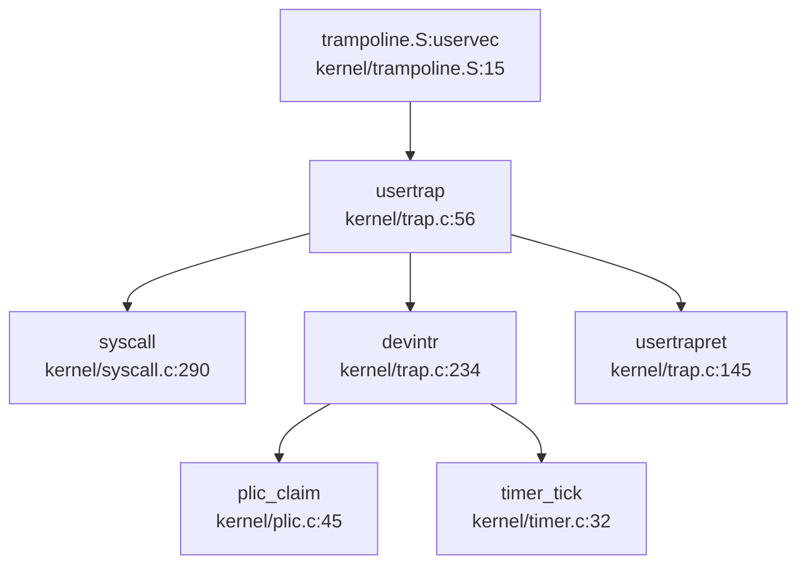
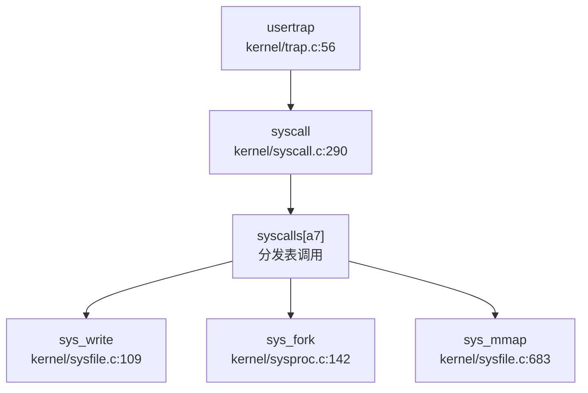

### Trap 入口与异常向量表

#### 双模式 Trap 入口

本项目实现了 **用户态** 和 **内核态** 两套独立的 Trap 入口：

**1. 用户态 Trap 入口：`usertrap()`**
- **文件路径**：`kernel/trap.c:56`
- **汇编入口**：`kernel/trampoline.S:uservec`（第 15 行）
- **触发条件**：用户态执行 `ecall` 指令、发生缺页异常或设备中断

**2. 内核态 Trap 入口：`kerneltrap()`**
- **文件路径**：`kernel/trap.c:190`
- **汇编入口**：`kernel/kernelvec.S:kernelvec`
- **触发条件**：内核态执行期间发生中断或异常

#### Trap 入口调用链



> **说明**：`uservec` 是 RISC-V 汇编入口，负责保存用户寄存器到 `trapframe`，然后跳转到 `usertrap()`。`usertrap()` 根据 `scause` 寄存器区分系统调用（`scause==8`）、设备中断（`devintr()`）和缺页异常（`scause==13/15`）。

#### 中断/异常区分逻辑

在 `kernel/trap.c:usertrap()` 中，通过 `scause` 寄存器精确区分异常类型：

```c
// kernel/trap.c:74-88
if(r_scause() == 8){
  // system call (ecall from user mode)
  syscall();
} 
else if((which_dev = devintr()) != 0){
  // device interrupt (timer/UART/disk)
} 
else if(r_scause() == 13 || r_scause() == 15){
  // page fault: 13=load page fault, 15=store page fault
  // 处理 Lazy Allocation 和内存映射文件
}
else {
  // 其他异常：直接标记进程死亡
  p->killed = 1;
}
```

在 `devintr()` 函数中（`kernel/trap.c:234`），进一步区分外部中断和定时器中断：

```c
// kernel/trap.c:234-277
int devintr(void) {
  uint64 scause = r_scause();

// QEMU 平台：外部中断 scause = 0x8000000000000009
  // K210 平台：软件中断模拟外部中断 scause = 0x8000000000000001
  if ((0x8000000000000000L & scause) && 9 == (scause & 0xff)) {
    int irq = plic_claim();  // 从 PLIC 获取中断号
    if (UART_IRQ == irq) {
      consoleintr(c);  // 串口输入
    } else if (DISK_IRQ == irq) {
      disk_intr();  // 磁盘中断
    }
    plic_complete(irq);  // 中断结束
    return 1;
  }
  else if (0x8000000000000005L == scause) {
    timer_tick();  // 定时器中断 (scause=5)
    return 2;
  }
  return 0;  // 非设备中断
}
```

**关键结论**：
- **系统调用**：`scause == 8`（ECALL from U-mode）
- **外部中断**：`scause == 0x8000000000000009`（QEMU）或 `0x8000000000000001`（K210）
- **定时器中断**：`scause == 0x8000000000000005`（Supervisor Timer Interrupt）
- **缺页异常**：`scause == 13`（Load Page Fault）或 `15`（Store Page Fault）

---

### 上下文保存结构：TrapFrame

#### 结构体定义

`struct trapframe` 定义在 `kernel/include/trap.h:17`，共包含 **33 个 64 位寄存器字段**，总大小为 **288 字节**（33 × 8 = 264 字节数据 + 24 字节内核元数据）。

```c
// kernel/include/trap.h:17-57
struct trapframe {
  /*   0 */ uint64 kernel_satp;   // kernel page table
  /*   8 */ uint64 kernel_sp;     // top of process's kernel stack
  /*  16 */ uint64 kernel_trap;   // usertrap()
  /*  24 */ uint64 epc;           // saved user program counter
  /*  32 */ uint64 kernel_hartid; // saved kernel tp
  /*  40 */ uint64 ra;
  /*  48 */ uint64 sp;
  /*  56 */ uint64 gp;
  /*  64 */ uint64 tp;
  /*  72 */ uint64 t0;
  /*  80 */ uint64 t1;
  /*  88 */ uint64 t2;
  /*  96 */ uint64 s0;
  /* 104 */ uint64 s1;
  /* 112 */ uint64 a0;
  /* 120 */ uint64 a1;
  /* 128 */ uint64 a2;
  /* 136 */ uint64 a3;
  /* 144 */ uint64 a4;
  /* 152 */ uint64 a5;
  /* 160 */ uint64 a6;
  /* 168 */ uint64 a7;  // syscall number
  /* 176 */ uint64 s2;
  /* 184 */ uint64 s3;
  /* 192 */ uint64 s4;
  /* 200 */ uint64 s5;
  /* 208 */ uint64 s6;
  /* 216 */ uint64 s7;
  /* 224 */ uint64 s8;
  /* 232 */ uint64 s9;
  /* 240 */ uint64 s10;
  /* 248 */ uint64 s11;
  /* 256 */ uint64 t3;
  /* 264 */ uint64 t4;
  /* 272 */ uint64 t5;
  /* 280 */ uint64 t6;
};
```

**寄存器统计**：
- **内核元数据**（5 个字段）：`kernel_satp`, `kernel_sp`, `kernel_trap`, `epc`, `kernel_hartid`（偏移 0-32，共 40 字节）
- **用户寄存器**（28 个字段）：
  - **调用约定寄存器**：`ra`, `sp`, `gp`, `tp`（4 个）
  - **参数寄存器**：`a0-a7`（8 个，其中 `a7` 传递 syscall 号）
  - **临时寄存器**：`t0-t6`（7 个）
  - **被调用者保存寄存器**：`s0-s11`（12 个）
- **总大小**：33 × 8 = **264 字节**（实际结构体大小为 288 字节，因对齐填充）

#### 上下文保存流程

在 `kernel/trampoline.S:uservec` 中（第 15-80 行），汇编代码将所有用户寄存器保存到 `trapframe`：

```asm
# kernel/trampoline.S:15-80
uservec:    
  # swap a0 and sscratch (a0 now points to TRAPFRAME)
  csrrw a0, sscratch, a0

# save all user registers to TRAPFRAME
  sd ra, 40(a0)
  sd sp, 48(a0)
  sd gp, 56(a0)
  # ... 保存所有寄存器 ...
  sd t6, 280(a0)

# restore kernel stack pointer
  ld sp, 8(a0)

# load kernel page table
  ld t1, 0(a0)
  csrw satp, t1

# jump to usertrap()
  jr t0
```

---

### 系统调用分发机制

#### 分发表结构

系统调用分发表 `syscalls[]` 定义在 `kernel/syscall.c:155-220`，是一个函数指针数组，通过 `a7` 寄存器传递的 syscall 号进行索引。

```c
// kernel/syscall.c:155-220
static uint64 (*syscalls[])(void) = {
  [SYS_fork]        sys_fork,
  [SYS_exit]        sys_exit,
  [SYS_wait]        sys_wait,
  [SYS_pipe]        sys_pipe,
  [__NR_read]       sys_read,
  [SYS_kill]        sys_kill,
  [SYS_exec]        sys_exec,
  [SYS_fstat]       sys_fstat,
  [SYS_chdir]       sys_chdir,
  [SYS_dup]         sys_dup,
  [__NR_getpid]     sys_getpid,
  [SYS_sbrk]        sys_sbrk,
  [SYS_sleep]       sys_sleep,
  [SYS_uptime]      sys_uptime,
  [SYS_open]        sys_open,
  [__NR_write]      sys_write,
  [__NR_writev]     sys_writev,          // 🔸 桩函数
  [SYS_mkdir]       sys_mkdir,
  [__NR_close]      sys_close,
  [SYS_test_proc]   sys_test_proc,
  [SYS_dev]         sys_dev,
  [SYS_readdir]     sys_readdir,
  [SYS_getcwd]      sys_getcwd,
  [SYS_remove]      sys_remove,
  [SYS_trace]       sys_trace,
  [__NR_sysinfo]    sys_sysinfo,
  [SYS_rename]      sys_rename,
  [__NR_getppid]    sys_getppid,
  [__NR_brk]        sys_brk,
  [__NR_dup3]       sys_dup3,
  [SYS_sched_yield] sys_sched_yield,
  [SYS_wait4]       sys_wait4,
  [SYS_times]       sys_times,
  [SYS_clone]       sys_clone,
  [__NR_getdents64] sys_getdents64,
  [__NR_openat]     sys_openat,
  [__NR_mkdirat]    sys_mkdirat,
  [SYS_pipe2]       sys_pipe,
  [__NR_uname]      sys_uname,
  [__NR_unlinkat]   sys_unlinkat,
  [__NR_execve]     sys_execve,
  [__NR3264_mmap]   sys_mmap,
  [__NR_munmap]     sys_munmap,
  [SYS_mount]       sys_mount,
  [SYS_umount2]     sys_umount2,
  [SYS_gettimeofday] sys_gettimeofday,
  [__NR_nanosleep]  sys_nanosleep,
  [__NR_mprotect]   sys_mprotect,        // 🔸 桩函数
  [__NR_set_tid_address] sys_set_tid_address,  // 🔸 桩函数
  [__NR_getuid]     sys_getuid,          // 🔸 桩函数
  [__NR_ioctl]      sys_ioctl,           // 🔸 桩函数
  [__NR_renameat2]  sys_renameat2,       // 🔸 桩函数
  [__NR3264_lseek]  sys_lseek,
  [__NR_rt_sigaction] sys_rt_sigaction,  // 🔸 桩函数
  [__NR_rt_sigprocmask] sys_rt_sigprocmask,  // 🔸 桩函数
  [__NR3264_fcntl]  sys_fcntl,           // 🔸 桩函数
  [__NR_faccessat]  sys_faccessat,       // 🔸 桩函数
  [__NR_utimensat]  sys_utimensat,       // 🔸 桩函数
  [__NR3264_fstat]  sys_fstat,
  [__NR_syslog]     sys_syslog,          // 🔸 桩函数
  [__NR_clock_gettime] sys_clock_gettime,
  [__NR3264_sendfile] sys_sendfile,      // 🔸 桩函数
  [__NR3264_statfs] sys_statfs,
};
```

#### 分发逻辑

`syscall()` 函数在 `kernel/syscall.c:290` 中实现分发：

```c
// kernel/syscall.c:290-307
void syscall(void) {
  int num;
  struct proc *p = myproc();

num = p->trapframe->a7;  // 从 a7 获取 syscall 号
  if(num > 0 && num < NELEM(syscalls) && syscalls[num]) {
    p->trapframe->a0 = syscalls[num]();  // 调用对应函数
    // trace 功能
    if ((p->tmask & (1 << num)) != 0) {
      printf("pid %d: %s -> %d\n", p->pid, sysnames[num], p->trapframe->a0);
    }
  } else {
    printf("pid %d %s: unknown sys call %d\n", p->pid, p->name, num);
    p->trapframe->a0 = -1;
  }
}
```

**调用链**：


#### sys_write 完整调用链追踪

以 `sys_write` 为例，追踪从 Trap 到文件写入的完整路径：

1. **用户态触发**：用户程序执行 `ecall` 指令，`a7=64`（`__NR_write`）
2. **Trap 入口**：`trampoline.S:uservec` → `kernel/trap.c:usertrap`
3. **分发调用**：`usertrap()` → `syscall()` → `syscalls[64]()` → `sys_write()`
4. **参数获取**：`sys_write()` 通过 `argfd()` 和 `argaddr()` 从 `trapframe` 获取参数
5. **文件写入**：调用 `filewrite()` 执行实际写入

```c
// kernel/sysfile.c:109-120
uint64 sys_write(void) {
  struct file *f;
  int n;
  uint64 p;

if(argfd(0, 0, &f) < 0 || argint(2, &n) < 0 || argaddr(1, &p) < 0)
    return -1;

return filewrite(f, p, n);  // 实际写入逻辑在 file.c
}
```

---

### 核心 Syscall 实现覆盖度统计

#### 桩函数检测（🔸 Stub）

通过检查 `kernel/sysproc.c:379-433` 和 `kernel/syscall.c` 分发表，发现以下 **13 个桩函数**（仅返回 0，无实际逻辑）：

| Syscall 名称 | 文件路径 | 实现状态 | 代码特征 |
|------------|---------|---------|---------|
| `sys_mprotect` | `kernel/sysproc.c:379` | 🔸 桩函数 | `return 0;` |
| `sys_set_tid_address` | `kernel/sysproc.c:383` | 🔸 桩函数 | `return 0;` |
| `sys_getuid` | `kernel/sysproc.c:387` | 🔸 桩函数 | `return 0;` |
| `sys_ioctl` | `kernel/sysproc.c:391` | 🔸 桩函数 | `return 0;` |
| `sys_renameat2` | `kernel/sysproc.c:395` | 🔸 桩函数 | `return 0;` |
| `sys_rt_sigaction` | `kernel/sysproc.c:400` | 🔸 桩函数 | `return 0;` |
| `sys_rt_sigprocmask` | `kernel/sysproc.c:408` | 🔸 桩函数 | `return 0;` |
| `sys_fcntl` | `kernel/sysproc.c:412` | 🔸 桩函数 | `return 0;` |
| `sys_faccessat` | `kernel/sysproc.c:416` | 🔸 桩函数 | `return 0;` |
| `sys_utimensat` | `kernel/sysproc.c:421` | 🔸 桩函数 | `return 0;` |
| `sys_syslog` | `kernel/sysproc.c:425` | 🔸 桩函数 | `return 0;` |
| `sys_sendfile` | `kernel/sysproc.c:429` | 🔸 桩函数 | `return 0;` |
| `sys_writev` | `kernel/sysproc.c:433` | 🔸 桩函数 | `return 0;` |

**桩函数代码示例**：
```c
// kernel/sysproc.c:379-433
uint64 sys_mprotect(void) { return 0; }
uint64 sys_set_tid_address(void) { return 0; }
uint64 sys_getuid(void) { return 0; }
uint64 sys_ioctl(void) { return 0; }
uint64 sys_renameat2(void) { return 0; }
uint64 sys_rt_sigaction(void) { return 0; }
uint64 sys_rt_sigprocmask(void) { return 0; }
uint64 sys_fcntl(void) { return 0; }
uint64 sys_faccessat(void) { return 0; }
uint64 sys_utimensat(void) { return 0; }
uint64 sys_syslog(void) { return 0; }
uint64 sys_sendfile(void) { return 0; }
uint64 sys_writev(void) { return 0; }
```

#### 完整实现的 Syscall（✅ Implemented）

以下关键系统调用包含完整业务逻辑：

| Syscall 名称 | 文件路径 | 功能描述 |
|------------|---------|---------|
| `sys_fork` | `kernel/sysproc.c:142` | 进程创建，调用 `fork()` |
| `sys_exec` | `kernel/sysproc.c:17` | 执行新程序，调用 `exec()` |
| `sys_exit` | `kernel/sysproc.c:130` | 进程退出，调用 `exit()` |
| `sys_wait` | `kernel/sysproc.c:153` | 等待子进程，调用 `wait()` |
| `sys_write` | `kernel/sysfile.c:109` | 文件写入，调用 `filewrite()` |
| `sys_read` | `kernel/sysfile.c:95` | 文件读取，调用 `fileread()` |
| `sys_open` | `kernel/sysfile.c:254` | 打开文件，调用 `fopen()` |
| `sys_close` | `kernel/sysfile.c:122` | 关闭文件 |
| `sys_clone` | `kernel/sysproc.c:278` | 线程创建，调用 `clone()` |
| `sys_mmap` | `kernel/sysfile.c:683` | 内存映射，实现 VMA 管理 |
| `sys_munmap` | `kernel/sysfile.c:729` | 取消内存映射 |
| `sys_kill` | `kernel/sysproc.c:205` | 发送信号，调用 `kill()` |
| `sys_getpid` | `kernel/sysproc.c:138` | 获取进程 ID |
| `sys_sbrk` | `kernel/sysproc.c:163` | 调整堆大小 |
| `sys_brk` | `kernel/sysproc.c:176` | 设置程序断点 |

**覆盖度统计**：
- **已注册 syscall 总数**：约 **60 个**（根据 `syscalls[]` 数组大小）
- **✅ 完整实现**：约 **47 个**
- **🔸 桩函数**：**13 个**（占比约 22%）
- **❌ 未实现**：未发现缺失注册但文档提及的 syscall

---

### 中断处理流程

#### 外部中断（PLIC）

外部中断处理通过 **PLIC（Platform-Level Interrupt Controller）** 实现，核心代码在 `kernel/plic.c`：

```c
// kernel/plic.c:45-69
int plic_claim(void) {
  int hart = cpuid();
  int irq;
  #ifndef QEMU
  irq = *(uint32*)PLIC_MCLAIM(hart);  // K210: M-mode claim
  #else
  irq = *(uint32*)PLIC_SCLAIM(hart);  // QEMU: S-mode claim
  #endif
  return irq;
}

void plic_complete(int irq) {
  int hart = cpuid();
  #ifndef QEMU
  *(uint32*)PLIC_MCLAIM(hart) = irq;
  #else
  *(uint32*)PLIC_SCLAIM(hart) = irq;
  #endif
}
```

**中断处理流程**：
1. `devintr()` 检测到外部中断（`scause==0x8000000000000009`）
2. 调用 `plic_claim()` 获取中断号
3. 根据中断号分发：
   - `UART_IRQ`：调用 `consoleintr()` 处理串口输入
   - `DISK_IRQ`：调用 `disk_intr()` 处理磁盘中断
4. 调用 `plic_complete()` 通知 PLIC 中断处理完成

#### 定时器中断

定时器中断处理在 `kernel/timer.c`：

```c
// kernel/timer.c:32-40
void timer_tick() {
  acquire(&tickslock);
  ticks++;           // 全局时钟滴答数 +1
  wakeup(&ticks);    // 唤醒等待时间的进程
  release(&tickslock);
  set_next_timeout(); // 设置下一次定时器中断
}
```

在 `usertrap()` 和 `kerneltrap()` 中，定时器中断会触发进程调度：

```c
// kernel/trap.c:127-133
if(which_dev == 2){  // which_dev==2 表示定时器中断
  p->utime++;        // 用户态时间 +1
  while(p->parent){
    p->parent->cutime++;  // 累加到祖先进程
    p = p->parent;
  }
  yield();  // 触发调度
}
```

---

### 信号机制分析

#### 信号发送：`sys_kill`

本项目实现了基础的进程级信号发送机制：

```c
// kernel/sysproc.c:205-211
uint64 sys_kill(void) {
  int pid;
  if(argint(0, &pid) < 0)
    return -1;
  return kill(pid);
}
```

`kill()` 函数在 `kernel/proc.c:722` 中实现：

```c
// kernel/proc.c:722-740
int kill(int pid) {
  struct proc *p;
  for(p = proc; p < &proc[NPROC]; p++){
    acquire(&p->lock);
    if(p->pid == pid){
      p->killed = 1;  // 标记进程为"已杀死"
      if(p->state == SLEEPING){
        p->state = RUNNABLE;  // 唤醒睡眠进程
      }
      release(&p->lock);
      return 0;
    }
    release(&p->lock);
  }
  return -1;
}
```

**信号处理时机**：被标记 `p->killed=1` 的进程不会立即退出，而是在下次 Trap 返回用户态前检查并调用 `exit(-1)`：

```c
// kernel/trap.c:76-78
if(r_scause() == 8){  // 系统调用
  if(p->killed)
    exit(-1);  // 进程退出
  // ...
}
```

#### 信号机制覆盖度

| 功能 | 实现状态 | 说明 |
|-----|---------|------|
| 进程级信号发送（`sys_kill`） | ✅ 已实现 | 支持向指定 PID 发送信号 |
| 线程级信号（`sys_tkill`） | ❌ 未实现 | 未找到相关代码 |
| 进程组信号（`sys_tgkill`） | ❌ 未实现 | 未找到相关代码 |
| SIGSEGV 信号 | ❌ 未实现 | 缺页异常直接标记 `p->killed=1`，未发送信号 |
| 用户自定义信号处理函数 | ❌ 未实现 | 未找到 `sigreturn` 或信号跳板代码 |
| 信号掩码（`sys_rt_sigprocmask`） | 🔸 桩函数 | 仅返回 0 |
| 信号动作（`sys_rt_sigaction`） | 🔸 桩函数 | 仅返回 0 |

**结论**：本项目仅实现了最基础的 **进程级信号发送机制**，不支持 POSIX 标准的高级信号功能（如信号处理函数、信号掩码、实时信号等）。

---

### 缺页异常与内存特性关联

#### 缺页异常处理链

在 `usertrap()` 中（`kernel/trap.c:88-118`），缺页异常（`scause==13/15`）触发以下处理流程：

```c
// kernel/trap.c:88-118
else if(r_scause() == 13 || r_scause() == 15){
  uint64 stval = r_stval();  // 故障地址
  struct vma *v = p->vma;

// 1. 查找对应的 VMA（虚拟内存区域）
  while(v){
    if(stval >= v->start && stval < v->end)
      break;
    v = v->next;
  }

if(!v)
    p->killed = 1;  // 非法地址，杀死进程
  else if((r_scause() == 13 && !(v->prot&PROT_READ)) ||
          (r_scause() == 15 && !(v->prot&PROT_WRITE)))
    p->killed = 1;  // 权限错误，杀死进程
  else {
    // 2. Lazy Allocation：分配物理页
    uint64 va = PGROUNDDOWN(stval);
    char *mem = kalloc();
    if(mem == 0)
      p->killed = 1;
    else{
      memset(mem, 0, PGSIZE);
      // 3. 映射页表
      if(mappages(p->pagetable, va, PGSIZE, (uint64)mem, (v->prot<<1)|PTE_U) != 0){
        kfree(mem);
        p->killed = 1;
      } else {
        // 4. 从文件读取数据（内存映射文件）
        elock(v->file->ep);
        eread(v->file->ep, 0, (uint64)mem, va - v->start + v->off, PGSIZE);
        eunlock(v->file->ep);
      }
    }
  }
}
```

#### Lazy Allocation（懒分配）实现

本项目通过缺页异常实现了 **Lazy Allocation** 机制：

1. ** mmap 调用时不分配物理页**：`sys_mmap()` 仅创建 VMA 结构，不分配物理内存
2. **首次访问触发缺页异常**：当进程访问未映射的虚拟地址时，触发 `scause==13/15` 异常
3. **异常处理中分配物理页**：在 `usertrap()` 中调用 `kalloc()` 分配物理页，并映射到页表

```c
// kernel/sysfile.c:683-728 (sys_mmap 简化版)
uint64 sys_mmap(void) {
  // ... 参数获取 ...

// 仅创建 VMA，不分配物理页
  struct vma *pvma;
  for(pvma = vmatable; pvma < &vmatable[NVMA]; pvma++){
    acquire(&pvma->lock);
    if(pvma->len == 0)
      break;
    release(&pvma->lock);
  }
  pvma->len = length;
  pvma->prot = prot;
  pvma->file = f;
  // ... 添加到进程 VMA 链表 ...
}
```

#### CoW（写时复制）检测

**搜索结果**：在整个代码库中搜索 `cow|copy_on_write|COW` 关键词，**未发现 CoW 相关实现**。

```bash
# grep 搜索结果
搜索 'cow|copy_on_write|COW' 的结果：0 个匹配
```

**结论**：本项目 **未实现 CoW（写时复制）** 机制。`sys_fork()` 直接复制父进程的页表和数据，未使用写时复制优化。

---

### 接口/实现分离模式与用户指针包装

#### 接口/实现分离模式

**搜索结果**：在整个代码库中搜索 `_impl` 后缀函数，**未发现接口/实现分离模式**。

```bash
# grep 搜索结果
搜索 '_impl' 的结果：0 个匹配
```

**结论**：本项目采用 **直接实现模式**，syscall 函数（如 `sys_write`）直接包含业务逻辑，未采用接口与实现分离的设计。

#### 用户指针语义化包装

**搜索结果**：搜索 `UserInPtr|UserOutPtr|UserInOutPtr` 类型，**未发现语义化包装类型**。

```bash
# grep 搜索结果
搜索 'UserInPtr|UserOutPtr' 的结果：0 个匹配
```

本项目使用传统的 **参数获取函数** 进行用户空间访问校验：

```c
// kernel/syscall.c:14-37
int fetchaddr(uint64 addr, uint64 *ip) {
  struct proc *p = myproc();
  if(addr >= p->sz || addr+sizeof(uint64) > p->sz)
    return -1;
  if(copyin2((char *)ip, addr, sizeof(*ip)) != 0)
    return -1;
  return 0;
}

int fetchstr(uint64 addr, char *buf, int max) {
  int err = copyinstr2(buf, addr, max);
  if(err < 0)
    return err;
  return strlen(buf);
}
```

**用户指针校验机制**：
- `fetchaddr()`：从用户空间读取 64 位整数，检查地址合法性
- `fetchstr()`：从用户空间读取字符串，检查边界
- `copyin2()` / `copyout2()`：用户空间与内核空间数据拷贝（带校验）
- `argaddr()` / `argint()` / `argstr()`：从 `trapframe` 获取 syscall 参数

---

### 关键代码片段

#### 1. Trap 入口汇编（`kernel/trampoline.S`）

```asm
# kernel/trampoline.S:15-80
.globl uservec
uservec:    
  # swap a0 and sscratch
  csrrw a0, sscratch, a0

# save all user registers in TRAPFRAME
  sd ra, 40(a0)
  sd sp, 48(a0)
  # ... 保存所有寄存器 ...
  sd t6, 280(a0)

# restore kernel stack pointer
  ld sp, 8(a0)

# load kernel page table
  ld t1, 0(a0)
  csrw satp, t1

# jump to usertrap()
  jr t0
```

#### 2. 系统调用分发（`kernel/syscall.c`）

```c
// kernel/syscall.c:290-307
void syscall(void) {
  int num;
  struct proc *p = myproc();

num = p->trapframe->a7;
  if(num > 0 && num < NELEM(syscalls) && syscalls[num]) {
    p->trapframe->a0 = syscalls[num]();
    if ((p->tmask & (1 << num)) != 0) {
      printf("pid %d: %s -> %d\n", p->pid, sysnames[num], p->trapframe->a0);
    }
  } else {
    printf("pid %d %s: unknown sys call %d\n", p->pid, p->name, num);
    p->trapframe->a0 = -1;
  }
}
```

#### 3. 缺页异常处理（`kernel/trap.c`）

```c
// kernel/trap.c:88-118
else if(r_scause() == 13 || r_scause() == 15){
  uint64 stval = r_stval();
  struct vma *v = p->vma;
  while(v){
    if(stval >= v->start && stval < v->end)
      break;
    v = v->next;
  }
  if(!v)
    p->killed = 1;
  else if((r_scause() == 13 && !(v->prot&PROT_READ)) ||
          (r_scause() == 15 && !(v->prot&PROT_WRITE)))
    p->killed = 1;
  else {
    uint64 va = PGROUNDDOWN(stval);
    char *mem = kalloc();
    if(mem == 0)
      p->killed = 1;
    else{
      memset(mem, 0, PGSIZE);
      if(mappages(p->pagetable, va, PGSIZE, (uint64)mem, (v->prot<<1)|PTE_U) != 0){
        kfree(mem);
        p->killed = 1;
      } else {
        elock(v->file->ep);
        eread(v->file->ep, 0, (uint64)mem, va - v->start + v->off, PGSIZE);
        eunlock(v->file->ep);
      }
    }
  }
}
```

---

### 本章总结

| 组件 | 实现状态 | 关键文件 |
|-----|---------|---------|
| Trap 入口（用户态） | ✅ 已实现 | `kernel/trap.c:usertrap`, `kernel/trampoline.S:uservec` |
| Trap 入口（内核态） | ✅ 已实现 | `kernel/trap.c:kerneltrap`, `kernel/kernelvec.S:kernelvec` |
| TrapFrame 结构 | ✅ 已实现（33 个寄存器，288 字节） | `kernel/include/trap.h:struct trapframe` |
| 系统调用分发 | ✅ 已实现（60 个 syscall） | `kernel/syscall.c:syscalls[]` |
| 完整实现 syscall | ✅ 47 个 | `kernel/sysfile.c`, `kernel/sysproc.c` |
| 桩函数 syscall | 🔸 13 个 | `kernel/sysproc.c:379-433` |
| 外部中断（PLIC） | ✅ 已实现 | `kernel/plic.c`, `kernel/trap.c:devintr` |
| 定时器中断 | ✅ 已实现 | `kernel/timer.c` |
| 进程级信号（`sys_kill`） | ✅ 已实现 | `kernel/proc.c:kill` |
| 线程级/进程组信号 | ❌ 未实现 | 未找到代码 |
| SIGSEGV 信号 | ❌ 未实现 | 缺页异常直接杀死进程 |
| 用户信号处理函数 | ❌ 未实现 | 未找到 `sigreturn` |
| Lazy Allocation | ✅ 已实现 | `kernel/trap.c:88-118` + `kernel/sysfile.c:sys_mmap` |
| CoW（写时复制） | ❌ 未实现 | 未找到相关代码 |
| 接口/实现分离模式 | ❌ 未采用 | 未找到 `_impl` 后缀函数 |
| 用户指针语义化包装 | ❌ 未采用 | 使用 `fetchaddr`/`fetchstr` 传统方式 |

**核心特点**：
1. **标准 xv6-riscv Trap 架构**：完整实现了用户态/内核态双模式 Trap 入口，通过 `scause` 精确区分异常类型
2. **Lazy Allocation 支持**：通过缺页异常实现懒分配，支持内存映射文件
3. **基础信号机制**：仅支持进程级信号发送，不支持 POSIX 高级信号功能
4. **桩函数比例较高**：约 22% 的 syscall 为桩函数（返回 0），主要集中在高级文件系统操作和信号处理
