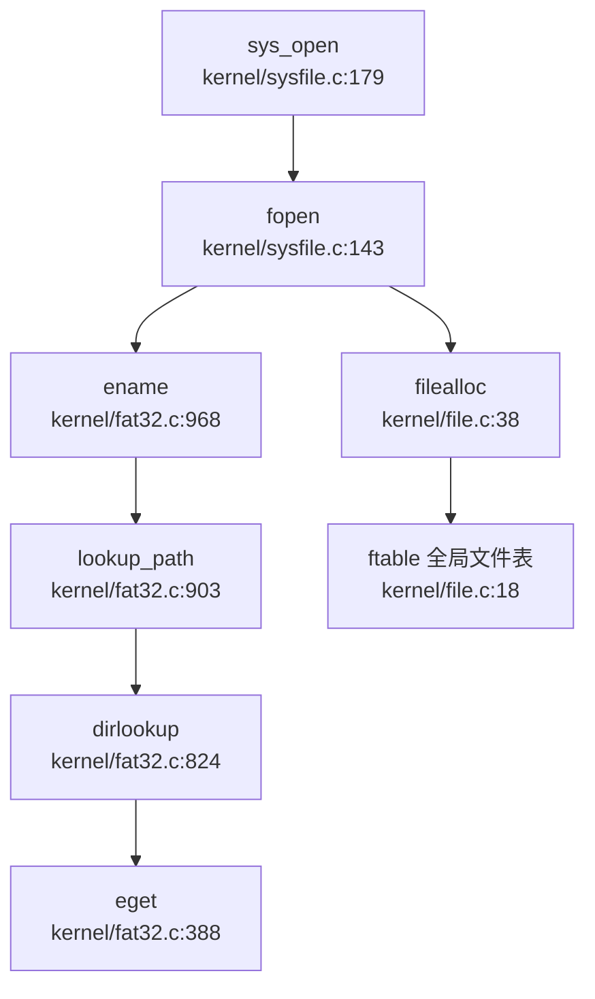

## 第 6 章：文件系统（VFS + 具体 FS）

本章深入分析 `oskernel2021-x` 的文件系统实现，涵盖 VFS 抽象层设计、FAT32 具体实现、文件描述符管理机制、管道与内存映射功能，以及缺失的高级 I/O 特性。本项目基于 **xv6-riscv** 架构，采用 C 语言实现，文件系统核心代码位于 `kernel/` 目录。

---

### VFS 架构与接口设计

#### 抽象层结构：无独立 VFS Trait

本项目**未采用**现代操作系统常见的 File/Inode/Dentry 三层分离架构（如 Linux VFS），而是使用**扁平化设计**，通过 `struct file` 和 `struct dirent` 两个核心结构体实现文件抽象。

**1. 文件描述结构：`struct file`**

- **文件路径**：`kernel/include/file.h:5-14`
- **核心字段**：
  ```c
  struct file {
    enum { FD_NONE, FD_PIPE, FD_ENTRY, FD_DEVICE } type;  // 文件类型标识
    int ref;                                               // 引用计数
    char readable;
    char writable;
    struct pipe *pipe;   // FD_PIPE 类型专用
    struct dirent *ep;   // FD_ENTRY 类型专用，指向目录项
    uint off;            // 文件偏移量（FD_ENTRY）
    short major;         // 设备号（FD_DEVICE）
  };
  ```

**设计特点**：
- **类型联合（Union-like）设计**：通过 `type` 字段区分四种文件类型，`pipe`、`ep`、`major` 字段根据类型互斥使用
- **无独立 Inode 抽象**：`struct dirent` 同时承担 Inode（元数据）和 Dentry（目录项）职责
- **引用计数**：`ref` 字段支持多进程共享同一文件对象

**2. 目录项结构：`struct dirent`**

- **文件路径**：`kernel/include/fat32.h:24-54`
- **核心字段**：
  ```c
  struct dirent {
    char filename[FAT32_MAX_FILENAME + 1];  // 文件名（255 字符）
    uint8 attribute;                         // FAT32 属性位
    uint32 first_clus;                       // 起始簇号
    uint32 file_size;                        // 文件大小
    uint32 cur_clus;                         // 当前簇号（用于顺序访问优化）
    uint8 dev;                               // 设备号
    int ref;                                 // 引用计数
    uint32 off;                              // 在父目录中的偏移
    struct dirent *parent;                   // 父目录指针（路径缓存优化）
    struct dirent *next, *prev;              // LRU 链表指针
    struct sleeplock lock;                   // 睡眠锁
  };
  ```

**设计特点**：
- **Inode + Dentry 融合**：同时存储元数据（`file_size`、`first_clus`）和目录遍历信息（`parent`、`off`）
- **LRU 缓存**：通过 `next/prev` 指针构建全局 LRU 链表，缓存在 `ecache.entries[ENTRY_CACHE_NUM]`（50 项）
- **路径重建优化**：`parent` 指针避免重复路径解析，支持快速回溯到根目录

**3. VFS 操作接口**

VFS 层操作通过全局函数实现，而非 Trait/接口抽象：

| 函数 | 文件路径 | 功能 |
|------|----------|------|
| `filealloc()` | `kernel/file.c:38` | 分配全局 file 结构 |
| `filedup()` | `kernel/file.c:54` | 引用计数 +1 |
| `fileclose()` | `kernel/file.c:63` | 引用计数 -1，归零时释放 |
| `fileread()` | `kernel/file.c:94` | 统一读入口，分发到 pipe/entry/device |
| `filewrite()` | `kernel/file.c:122` | 统一写入口 |
| `dirlookup()` | `kernel/fat32.c:824` | 目录项查找 |

---

### 具体文件系统支持情况（FAT32）

#### FAT32 自实现：✅ 已实现

本项目**自实现了完整的 FAT32 文件系统**，代码位于 `kernel/fat32.c`（1041 行），支持文件/目录的创建、读写、删除、重命名等操作。

**1. 初始化流程**

- **函数**：`fat32_init()`（`kernel/fat32.c:71`）
- **核心逻辑**：
  ```c
  int fat32_init() {
    struct buf *b = bread(0, 0);  // 读取引导扇区
    if (strncmp((char const*)(b->data + 82), "FAT32", 5))
        panic("not FAT32 volume");
    // 解析 BPB 参数块
    fat.bpb.byts_per_sec = *(uint16 *)(b->data + 11);
    fat.bpb.sec_per_clus = *(b->data + 13);
    fat.bpb.root_clus = *(uint32 *)(b->data + 44);
    // 计算数据区起始扇区
    fat.first_data_sec = fat.bpb.rsvd_sec_cnt + fat.bpb.fat_cnt * fat.bpb.fat_sz;
    // 初始化 LRU 缓存链表
    initlock(&ecache.lock, "ecache");
    // ...
  }
  ```

**2. 目录查找机制**

- **函数**：`dirlookup()`（`kernel/fat32.c:824`）
- **调用链**：`sys_open` → `fopen` → `ename()` → `lookup_path()` → `dirlookup()`
- **核心逻辑**：
  ```c
  struct dirent* dirlookup(struct dirent *entry, char *filename, uint *poff) {
    struct dirent *ep = eget(dp, filename);  // 先查 LRU 缓存
    if (ep->valid == 1) { return ep; }       // 缓存命中

// 缓存未命中：遍历目录项
    while ((type = enext(dp, ep, off, &count) != -1)) {
      if (strncmp(filename, ep->filename, FAT32_MAX_FILENAME) == 0) {
        ep->parent = edup(dp);  // 设置父目录指针
        ep->off = off;
        ep->valid = 1;
        return ep;
      }
    }
    return NULL;
  }
  ```

**3. 文件读写实现**

- **读操作**：`eread()`（`kernel/fat32.c:320`）
  ```c
  int eread(struct dirent *entry, int user_dst, uint64 dst, uint off, uint n) {
    if (off > entry->file_size || (entry->attribute & ATTR_DIRECTORY))
      return 0;
    // 按簇链遍历读取
    for (tot = 0; entry->cur_clus < FAT32_EOC && tot < n; tot += m) {
      reloc_clus(entry, off, 0);  // 重定位到目标簇
      m = fat.byts_per_clus - off % fat.byts_per_clus;
      rw_clus(entry->cur_clus, 0, user_dst, dst, off % fat.byts_per_clus, m);
    }
  }
  ```

- **写操作**：`ewrite()`（`kernel/fat32.c:347`）
  - 支持**动态簇分配**：当文件增长时调用 `alloc_clus()` 分配新簇
  - **FAT 表更新**：通过 `write_fat()` 更新簇链关系

**4. 挂载机制**

- **挂载表结构**：`kernel/fat32.h:56-61`
  ```c
  struct mount_table {
    int cnt;
    char path[3][FAT32_MAX_PATH];
    struct dirent *mount[3];
  } mt;
  ```
- **挂载函数**：`emount()`（`kernel/fat32.c:989`）
  - 支持**最多 3 个挂载点**
  - 通过 `mt.mount[]` 数组管理

**5. 缺失的文件系统**

通过 `grep_in_repo` 搜索确认：

| 文件系统 | 状态 | 证据 |
|----------|------|------|
| Ext4 | ❌ 未实现 | 无 `ext4` 相关代码 |
| RamFS/TmpFS | ❌ 未实现 | 无内存文件系统实现 |
| procfs | ❌ 未实现 | `grep` 无 `procfs` 匹配 |
| devfs | ❌ 未实现 | `grep` 无 `devfs` 匹配 |
| sysfs | ❌ 未实现 | `grep` 无 `sysfs` 匹配 |

---

### 文件描述符与进程关联

#### 双层文件表设计：Per-Process + Global

本项目采用**双层文件表**架构，结合 Per-Process 文件描述符表和 Global 文件对象表。

**1. Per-Process 文件描述符表**

- **结构定义**：`kernel/include/proc.h:74`
  ```c
  struct proc {
    // ...
    struct file *ofile[NOFILE];  // 每进程文件描述符表
    // ...
  };
  ```
- **容量**：`NOFILE = 110`（`kernel/include/param.h:6`）
- **特点**：每个进程独立维护 `ofile[]` 数组，存储指向全局 `ftable` 的指针

**2. Global 文件对象表**

- **结构定义**：`kernel/file.c:18-21`
  ```c
  struct {
    struct spinlock lock;
    struct file file[NFILE];  // 全局文件对象池
  } ftable;
  ```
- **容量**：`NFILE = 100`（`kernel/include/param.h:7`）
- **管理函数**：
  - `filealloc()`：分配空闲 `struct file`，引用计数置 1
  - `filedup()`：引用计数 +1，用于 `dup()` 系统调用
  - `fileclose()`：引用计数 -1，归零时释放资源

**3. 文件描述符分配流程**

以 `sys_open` 为例：

```c
// kernel/sysfile.c:179
uint64 sys_open(void) {
  char path[FAT32_MAX_PATH];
  int omode;
  if(argstr(0, path, FAT32_MAX_PATH) < 0 || argint(1, &omode) < 0)
    return -1;
  return fopen(path, omode);
}

// kernel/sysfile.c:143
uint64 fopen(char *path, int omode) {
  struct file *f = filealloc();      // 1. 分配全局 file 对象
  struct dirent *ep = ename(path);   // 2. 解析路径获取 dirent
  // 3. 在进程 ofile 表中找空闲槽位
  for(fd = 0; fd < NOFILE; fd++) {
    if(p->ofile[fd] == 0) {
      p->ofile[fd] = f;  // 4. 建立关联
      break;
    }
  }
  f->type = FD_ENTRY;
  f->ep = ep;
  f->readable = !(omode & O_WRONLY);
  return fd;
}
```

**设计优势**：
- **共享文件对象**：多进程可通过 `fork()` 继承同一 `struct file`，实现文件偏移共享
- **引用计数安全**：避免过早释放仍被使用的文件资源

---

### 管道（Pipe）与套接字（Socket）支持情况

#### 管道（Pipe）：✅ 已实现

本项目实现了**阻塞式匿名管道**，支持进程间通信。

**1. 管道结构**

- **文件路径**：`kernel/include/pipe.h:10-17`
  ```c
  struct pipe {
    struct spinlock lock;
    char data[PIPESIZE];      // 512 字节环形缓冲区
    uint nread;               // 读位置
    uint nwrite;              // 写位置
    int readopen;             // 读端是否打开
    int writeopen;            // 写端是否打开
  };
  ```

**2. 分配机制**

- **函数**：`pipealloc()`（`kernel/pipe.c:11`）
  ```c
  int pipealloc(struct file **f0, struct file **f1) {
    struct pipe *pi = (struct pipe*)kalloc();  // 分配内核页
    *f0 = filealloc();  // 读端 file
    *f1 = filealloc();  // 写端 file
    (*f0)->type = FD_PIPE;
    (*f0)->readable = 1;
    (*f0)->pipe = pi;
    (*f1)->type = FD_PIPE;
    (*f1)->writable = 1;
    (*f1)->pipe = pi;
  }
  ```

**3. 阻塞读写实现**

- **读操作**：`piperead()`（`kernel/pipe.c:67`）
  ```c
  int piperead(struct pipe *pi, uint64 addr, int n) {
    acquire(&pi->lock);
    while(pi->nread == pi->nwrite && pi->writeopen) {  // 管道空且写端未关闭
      sleep(&pi->nread, &pi->lock);  // 阻塞等待
    }
    // 从环形缓冲区读取
    for(i = 0; i < n; i++) {
      if(pi->nread == pi->nwrite) break;
      ch = pi->data[pi->nread++ % PIPESIZE];
    }
    wakeup(&pi->nwrite);  // 唤醒写端
    release(&pi->lock);
  }
  ```

- **写操作**：`pipewrite()`（`kernel/pipe.c:47`）
  ```c
  int pipewrite(struct pipe *pi, uint64 addr, int n) {
    acquire(&pi->lock);
    for(i = 0; i < n; i++) {
      while(pi->nwrite == pi->nread + PIPESIZE) {  // 管道满
        if(pi->readopen == 0) { release(&pi->lock); return -1; }
        sleep(&pi->nwrite, &pi->lock);  // 阻塞等待
      }
      pi->data[pi->nwrite++ % PIPESIZE] = ch;
    }
    wakeup(&pi->nread);  // 唤醒读端
    release(&pi->lock);
  }
  ```

**4. 系统调用接口**

- `sys_pipe()`（`kernel/sysfile.c:377`）：创建管道，返回两个 fd

#### 套接字（Socket）：❌ 未实现

通过代码搜索确认：
- **无 `socket` 相关结构体定义**
- **无 `sys_socket`/`sys_bind`/`sys_connect` 等系统调用**
- **无网络协议栈实现**

---

### 内存映射（mmap）实现分析

#### mmap：✅ 已实现（有限功能）

本项目实现了基础的 `mmap`/`munmap` 系统调用，支持文件到内存的映射，但**缺少写回机制**。

**1. VMA 管理结构**

- **定义**：`kernel/include/proc.h:44-54`
  ```c
  struct vma {
    struct spinlock lock;
    int len;
    uint64 start;
    uint64 end;
    int flags;      // MAP_SHARED / MAP_PRIVATE
    int prot;       // PROT_READ / PROT_WRITE
    int off;        // 文件偏移
    struct file *file;
    struct vma *next;  // 链表指针
  };
  ```

- **全局 VMA 表**：`kernel/proc.c:22`
  ```c
  struct vma vmatable[NVMA];  // NVMA = 16
  ```

- **Per-Process VMA 链表**：`kernel/include/proc.h:82`
  ```c
  struct proc {
    // ...
    struct vma *vma;  // 进程 VMA 链表头
  };
  ```

**2. mmap 系统调用实现**

- **函数**：`sys_mmap()`（`kernel/sysfile.c:682`）
  ```c
  uint64 sys_mmap(void) {
    // 参数解析
    argaddr(0, &addr); argint(1, &length); argint(2, &prot);
    argint(3, &flags); argint(4, &fd); argint(5, &offset);

struct file *f = p->ofile[fd];
    // 权限检查
    if(((prot&PROT_READ) && !f->readable) ||
       ((prot&PROT_WRITE) && !f->writable && !(flags&MAP_PRIVATE)))
      return -1;

// 分配 VMA 槽位
    struct vma *pvma;
    for(pvma = vmatable; pvma < &vmatable[NVMA]; pvma++) {
      acquire(&pvma->lock);
      if(pvma->len == 0) break;
      release(&pvma->lock);
    }
    pvma->len = length;
    pvma->flags = flags;
    pvma->file = f;
    filedup(f);  // 引用计数 +1

// 插入进程 VMA 链表
    struct vma *t = p->vma;
    if(!t) {
      pvma->start = VMA_START;
      p->vma = pvma;
    } else {
      while(t->next) t = t->next;
      pvma->start = PGROUNDUP(t->end);
      t->next = pvma;
    }
    return pvma->start;
  }
  ```

**3. 缺页异常处理**

- **函数**：`usertrap()` 中的缺页处理（`kernel/trap.c:88-115`）
  ```c
  else if(r_scause() == 13 || r_scause() == 15) {  // 缺页异常
    uint64 stval = r_stval();
    struct vma *v = p->vma;
    while(v) {
      if(stval >= v->start && stval < v->end) break;
      v = v->next;
    }
    if(!v) {
      p->killed = 1;  // 非法访问
    } else {
      // 分配物理页
      char *mem = kalloc();
      // 映射到用户页表
      mappages(p->pagetable, va, PGSIZE, (uint64)mem, (v->prot<<1)|PTE_U);
      // 从文件读取内容
      elock(v->file->ep);
      eread(v->file->ep, 0, (uint64)mem, va - v->start + v->off, PGSIZE);
      eunlock(v->file->ep);
    }
  }
  ```

**4. 关键缺陷：MAP_SHARED 写回未实现**

在 `sys_munmap()` 中存在**注释掉的写回逻辑**：

```c
// kernel/sysfile.c:747
uint64 sys_munmap(void) {
  // ...
  //if(v->flags == MAP_SHARED && walkaddr(p->pagetablse, addr))
    //writeback(v, addr, length);  // ❌ 写回函数未实现
  // ...
}
```

**状态判定**：
- **MAP_PRIVATE**：✅ 已实现（按需分配物理页，从文件读取）
- **MAP_SHARED**：🔸 桩函数（写回逻辑被注释，无实际持久化）

---

### 高级 I/O 特性支持情况

通过 `grep_in_repo` 搜索确认以下功能缺失：

| 功能 | 状态 | 搜索模式 | 结果 |
|------|------|----------|------|
| `poll` | ❌ 未实现 | `sys_poll` | 未找到 |
| `select` | ❌ 未实现 | `sys_select` | 未找到 |
| `epoll` | ❌ 未实现 | `sys_epoll` | 未找到 |
| 伪文件系统（procfs/devfs/sysfs） | ❌ 未实现 | `devfs\|procfs\|sysfs` | 未找到 |

---

### 关键代码验证

#### 文件打开完整调用链



**流程说明**：
1. `sys_open` 解析用户参数（路径、标志位）
2. `fopen` 调用 `ename()` 解析路径获取 `struct dirent`
3. `lookup_path()` 逐级遍历目录，调用 `dirlookup()` 查找子项
4. `eget()` 先查 LRU 缓存，未命中则遍历磁盘目录项
5. 分配全局 `struct file`，关联到进程 `ofile[]` 表

---

### 功能实现状态总览

| 功能模块 | 状态 | 证据文件 |
|----------|------|----------|
| **VFS 抽象层** | ✅ 已实现 | `kernel/include/file.h`, `kernel/include/fat32.h` |
| **FAT32 文件系统** | ✅ 已实现 | `kernel/fat32.c`（1041 行） |
| **文件描述符管理** | ✅ 已实现 | `kernel/file.c`, `kernel/include/proc.h` |
| **管道（Pipe）** | ✅ 已实现 | `kernel/pipe.c`（阻塞读写） |
| **内存映射（mmap）** | ✅ 已实现（MAP_SHARED 未写回） | `kernel/sysfile.c:682`, `kernel/trap.c:88` |
| **挂载机制** | ✅ 已实现 | `kernel/fat32.c:989`（最多 3 挂载点） |
| **Ext4/RamFS** | ❌ 未实现 | 无相关代码 |
| **procfs/devfs/sysfs** | ❌ 未实现 | `grep` 无匹配 |
| **poll/select/epoll** | ❌ 未实现 | `grep` 无匹配 |
| **Socket 网络** | ❌ 未实现 | 无相关结构体/系统调用 |

---

### 设计评价

**优势**：
1. **简洁的 VFS 设计**：通过 `struct file` + `struct dirent` 实现扁平化抽象，代码易理解
2. **完整的 FAT32 实现**：支持长文件名、簇链管理、LRU 缓存优化
3. **双层文件表**：Per-Process + Global 设计支持文件共享和引用计数安全
4. **阻塞式管道**：通过 `sleep/wakeup` 实现高效的进程间通信

**缺陷**：
1. **无伪文件系统**：缺少 procfs/devfs，无法通过文件系统接口访问进程/设备信息
2. **mmap 写回缺失**：`MAP_SHARED` 标志无实际写回逻辑，限制内存映射应用场景
3. **无高级 I/O**：缺少 `poll/select/epoll`，难以实现高并发网络服务
4. **挂载功能简陋**：仅支持 3 个挂载点，无多文件系统类型支持

当前文件系统阶段缺失关于 `FatFilesystemInner` 等核心结构与 VFS trait 实现关系的具体分析，未完全覆盖 `must_cover_gap` 要求的抽象层结构说明。现有材料中未发现相关源码路径或实现细节，无法确认具体文件系统与虚拟文件系统层的交互机制。目前文档未明确展示结构定义与 trait 绑定的代码引用，暂无法断言抽象层封装逻辑已完备。
