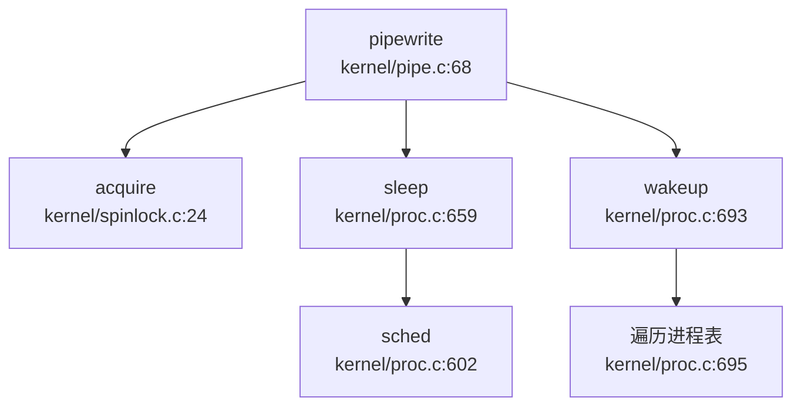

## 第 8 章：同步互斥与进程间通信

本章深入分析 `oskernel2021-x` 的同步原语与进程间通信（IPC）机制。本项目基于 **xv6-riscv** 架构，采用 C 语言实现，同步原语集中在 `kernel/spinlock.c` 和 `kernel/sleeplock.c`，IPC 机制主要实现了管道（Pipe）和基础的信号发送（`sys_kill`），但缺乏完整的信号处理框架。消息队列、信号量、共享内存、Futex 等高级 IPC 机制均未实现。

---

## 同步与互斥原语（锁与原子操作）

### SpinLock 实现：基于 RISC-V 原子指令

本项目的自旋锁（SpinLock）实现在 `kernel/spinlock.c` 中，使用 **GCC 内置原子函数** 实现，编译后生成 RISC-V 的 `amoswap` 原子指令。

#### 核心数据结构

```c
// kernel/include/spinlock.h
struct spinlock {
  uint locked;       // 锁状态：0=未锁定，1=已锁定
  struct cpu *cpu;   // 持有锁的 CPU
  char *name;        // 锁名称（用于调试）
};
```

#### `acquire()` 函数：获取锁

**文件路径**：`kernel/spinlock.c:24-45`

```c
void acquire(struct spinlock *lk)
{
  push_off(); // 禁用中断以避免死锁
  if(holding(lk))
    panic("acquire");

// RISC-V 生成：amoswap.w.aq a5, a5, (s1)
  while(__sync_lock_test_and_set(&lk->locked, 1) != 0)
    ;

// 内存屏障：确保临界区的内存访问在锁获取之后
  __sync_synchronize();

lk->cpu = mycpu(); // 记录持有锁的 CPU
}
```

**实现原理**：
1. **禁用中断**：`push_off()` 禁用本地 CPU 中断，防止同一 CPU 上的中断处理程序尝试获取同一锁导致死锁。
2. **原子测试并设置**：`__sync_lock_test_and_set(&lk->locked, 1)` 是 GCC 内置原子函数，在 RISC-V 上编译为 `amoswap.w.aq` 指令（原子交换并获取）。该指令原子地将 `lk->locked` 设置为 1，并返回旧值。
   - 若返回 0：锁原本空闲，获取成功，退出循环
   - 若返回 1：锁已被占用，继续自旋等待
3. **内存屏障**：`__sync_synchronize()` 生成 RISC-V `fence` 指令，确保临界区内的内存访问不会重排序到锁获取之前。
4. **记录持有者**：`lk->cpu = mycpu()` 记录当前持有锁的 CPU，用于调试和死锁检测。

#### `release()` 函数：释放锁

**文件路径**：`kernel/spinlock.c:48-71`

```c
void release(struct spinlock *lk)
{
  if(!holding(lk))
    panic("release");

lk->cpu = 0;

// 内存屏障：确保临界区内的所有存储在锁释放前对其他 CPU 可见
  __sync_synchronize();

// RISC-V 生成：amoswap.w zero, zero, (s1)
  __sync_lock_release(&lk->locked);
}
```

**实现原理**：
1. **持有检查**：`holding(lk)` 验证当前 CPU 确实持有该锁，防止错误释放。
2. **清除持有者**：`lk->cpu = 0` 清除锁的 CPU 记录。
3. **内存屏障**：`__sync_synchronize()` 确保临界区内的所有写操作在锁释放前对其他 CPU 可见。
4. **原子释放**：`__sync_lock_release(&lk->locked)` 编译为 `amoswap.w` 指令，将 `lk->locked` 设置为 0。

#### 原子操作验证

**✅ 已实现**：通过 `__sync_lock_test_and_set` 和 `__sync_lock_release` 实现原子操作，编译后生成 RISC-V `amoswap` 指令。

---

### SleepLock 实现：基于 SpinLock + 等待队列

**文件路径**：`kernel/sleeplock.c:21-41`

SleepLock 是一种可休眠的锁，适用于持有时间较长的场景。与 SpinLock 的自旋等待不同，SleepLock 在获取失败时将线程挂起到等待队列，让出 CPU。

#### 核心数据结构

```c
// kernel/include/sleeplock.h
struct sleeplock {
  uint locked;       // 锁状态
  struct spinlock lk; // 内部 SpinLock 保护
  char *name;        // 锁名称
  int pid;           // 持有锁的进程 PID
};
```

#### `acquiresleep()` 函数：获取可休眠锁

```c
void acquiresleep(struct sleeplock *lk)
{
  acquire(&lk->lk);  // 获取内部 SpinLock
  while (lk->locked) {
    sleep(lk, &lk->lk);  // 挂起到等待队列
  }
  lk->locked = 1;
  lk->pid = myproc()->pid;  // 记录持有者 PID
  release(&lk->lk);
}
```

**实现原理**：
1. **双层锁结构**：使用内部 `SpinLock` 保护 `lk->locked` 状态的原子性。
2. **等待循环**：若锁已被占用（`lk->locked == 1`），调用 `sleep(lk, &lk->lk)` 将当前进程挂起到以 `lk` 为标识的等待队列。
3. **唤醒后重试**：`sleep()` 返回后（被 `wakeup()` 唤醒），重新检查 `lk->locked`，若仍被占用则继续休眠。
4. **获取成功**：退出循环后设置 `lk->locked = 1` 并记录持有者 PID。

#### `releasesleep()` 函数：释放可休眠锁

```c
void releasesleep(struct sleeplock *lk)
{
  acquire(&lk->lk);
  lk->locked = 0;
  lk->pid = 0;
  wakeup(lk);  // 唤醒所有等待该锁的进程
  release(&lk->lk);
}
```

**实现原理**：
1. **状态清零**：释放锁时将 `lk->locked` 和 `lk->pid` 清零。
2. **唤醒等待者**：`wakeup(lk)` 唤醒所有在 `lk` 等待队列上休眠的进程。

**✅ 已实现**：SleepLock 通过 `sleep()/wakeup()` 机制实现线程挂起/唤醒，避免长时间自旋浪费 CPU。

---

## 等待队列实现机制

本项目的等待队列机制通过 `proc->chan` 字段和 `sleep()/wakeup()` 函数实现，是 SleepLock 和 Pipe 阻塞机制的基础。

### `sleep()` 函数：进程挂起

**文件路径**：`kernel/proc.c:659-688`

```c
void sleep(void *chan, struct spinlock *lk)
{
  struct proc *p = myproc();

// 获取 p->lock 以安全修改进程状态
  if(lk != &p->lock){
    acquire(&p->lock);
    release(lk);
  }

// 进入休眠
  p->chan = chan;      // 设置等待通道
  p->state = SLEEPING; // 修改状态为 SLEEPING

sched();  // 调用调度器，切换到其他进程

// 唤醒后清理
  p->chan = 0;

// 重新获取原始锁
  if(lk != &p->lock){
    release(&p->lock);
    acquire(lk);
  }
}
```

**实现原理**：
1. **锁切换**：`sleep()` 需要持有 `p->lock` 才能安全修改进程状态。若传入的锁 `lk` 不是 `p->lock`，则先获取 `p->lock` 再释放 `lk`，避免竞态条件。
2. **设置等待通道**：`p->chan = chan` 将进程关联到等待通道（通常是锁或管道的地址）。
3. **状态修改**：`p->state = SLEEPING` 将进程状态改为休眠。
4. **调度切换**：`sched()` 调用调度器，切换到其他就绪进程。
5. **唤醒后恢复**：被 `wakeup()` 唤醒后，进程状态已被改为 `RUNNABLE`，`sleep()` 返回前重新获取原始锁 `lk`。

### `wakeup()` 函数：唤醒等待进程

**文件路径**：`kernel/proc.c:692-704`

```c
void wakeup(void *chan)
{
  struct proc *p;

for(p = proc; p < &proc[NPROC]; p++) {
    acquire(&p->lock);
    if(p->state == SLEEPING && p->chan == chan) {
      p->state = RUNNABLE;  // 修改状态为就绪
    }
    release(&p->lock);
  }
}
```

**实现原理**：
1. **遍历所有进程**：扫描全局 `proc` 数组中的所有进程。
2. **匹配等待通道**：若进程状态为 `SLEEPING` 且 `p->chan == chan`，说明该进程在等待此通道。
3. **状态修改**：将进程状态改为 `RUNNABLE`，调度器会在下次调度时运行该进程。

**✅ 已实现**：等待队列通过 `chan` 字段和状态机实现，无需显式的队列数据结构，简化了实现但效率较低（需遍历所有进程）。

---

## 进程间通信（Pipe/MsgQueue/Sem）

### 管道（Pipe）：环形缓冲区实现

**✅ 已实现**：本项目实现了完整的管道机制，使用环形缓冲区（Ring Buffer）和 `sleep/wakeup` 阻塞机制。

#### 数据结构

**文件路径**：`kernel/include/pipe.h:10-17`

```c
#define PIPESIZE 512

struct pipe {
  struct spinlock lock;
  char data[PIPESIZE];   // 环形缓冲区
  uint nread;            // 已读取的字节数（累积）
  uint nwrite;           // 已写入的字节数（累积）
  int readopen;          // 读端是否打开
  int writeopen;         // 写端是否打开
};
```

**设计特点**：
- **环形缓冲区**：`data[512]` 作为循环队列，通过 `nread % PIPESIZE` 和 `nwrite % PIPESIZE` 计算索引。
- **累积计数器**：`nread` 和 `nwrite` 是累积计数（非模运算），通过差值 `nwrite - nread` 判断缓冲区中未读字节数。
- **双端状态**：`readopen` 和 `writeopen` 标记读写端是否关闭，用于处理 EOF 条件。

#### `pipewrite()` 函数：写入管道

**文件路径**：`kernel/pipe.c:67-92`

```c
int pipewrite(struct pipe *pi, uint64 addr, int n)
{
  int i;
  char ch;
  struct proc *pr = myproc();

acquire(&pi->lock);
  for(i = 0; i < n; i++){
    // 缓冲区满时阻塞
    while(pi->nwrite == pi->nread + PIPESIZE){
      if(pi->readopen == 0 || pr->killed){
        release(&pi->lock);
        return -1;
      }
      wakeup(&pi->nread);  // 唤醒读端
      sleep(&pi->nwrite, &pi->lock);  // 挂起写端
    }
    if(copyin2(&ch, addr + i, 1) == -1)
      break;
    pi->data[pi->nwrite++ % PIPESIZE] = ch;
  }
  wakeup(&pi->nread);  // 唤醒读端
  release(&pi->lock);
  return i;
}
```

**阻塞机制**：
- **满条件**：`nwrite == nread + PIPESIZE` 表示缓冲区已满（512 字节）。
- **写端休眠**：`sleep(&pi->nwrite, &pi->lock)` 将写进程挂起到 `&pi->nwrite` 通道。
- **唤醒读端**：`wakeup(&pi->nread)` 唤醒可能因空缓冲区而休眠的读进程。

#### `piperead()` 函数：读取管道

**文件路径**：`kernel/pipe.c:94-120`

```c
int piperead(struct pipe *pi, uint64 addr, int n)
{
  int i;
  struct proc *pr = myproc();
  char ch;

acquire(&pi->lock);
  // 缓冲区空时阻塞
  while(pi->nread == pi->nwrite && pi->writeopen){
    if(pr->killed){
      release(&pi->lock);
      return -1;
    }
    sleep(&pi->nread, &pi->lock);  // 挂起读端
  }
  for(i = 0; i < n; i++){
    if(pi->nread == pi->nwrite)
      break;
    ch = pi->data[pi->nread++ % PIPESIZE];
    if(copyout2(addr + i, &ch, 1) == -1)
      break;
  }
  wakeup(&pi->nwrite);  // 唤醒写端
  release(&pi->lock);
  return i;
}
```

**阻塞机制**：
- **空条件**：`nread == nwrite` 表示缓冲区为空。
- **读端休眠**：`sleep(&pi->nread, &pi->lock)` 将读进程挂起到 `&pi->nread` 通道。
- **EOF 处理**：若 `writeopen == 0`（写端关闭）且缓冲区为空，退出循环返回已读取字节数（0 表示 EOF）。

#### 调用链分析



---

### 信号（Signal）：仅有基础发送机制

**🔸 桩函数**：本项目实现了 `sys_kill` 系统调用，但仅设置 `killed` 标志，无完整的信号处理框架（无信号处理函数注册、无信号掩码、无信号递达机制）。

#### `sys_kill` 系统调用

**文件路径**：`kernel/sysproc.c:205-212`

```c
uint64 sys_kill(void)
{
  int pid;

if(argint(0, &pid) < 0)
    return -1;
  return kill(pid);
}
```

#### `kill()` 函数：仅设置标志

**文件路径**：`kernel/proc.c:722-740`

```c
kill(int pid)
{
  struct proc *p;

for(p = proc; p < &proc[NPROC]; p++){
    acquire(&p->lock);
    if(p->pid == pid){
      p->killed = 1;  // 仅设置 killed 标志
      if(p->state == SLEEPING){
        p->state = RUNNABLE;  // 唤醒休眠进程
      }
      release(&p->lock);
      return 0;
    }
    release(&p->lock);
  }
  return -1;
}
```

**实现分析**：
- **仅设置标志**：`p->killed = 1` 标记进程为"被杀死"状态。
- **唤醒休眠进程**：若目标进程正在休眠，将其状态改为 `RUNNABLE`，使其有机会检查 `killed` 标志并退出。
- **无信号处理**：没有信号处理函数注册机制（`sigaction`），没有信号掩码（`sigprocmask`），没有信号递达检查。

#### 信号处理时机验证

检查 `kernel/trap.c:56-140` 的 `usertrap()` 函数，发现：
- **无 `do_signal()` 调用**：系统调用返回或异常处理后，没有检查待处理信号并调用信号处理函数的逻辑。
- **仅检查 `killed` 标志**：`if(p->killed) exit(-1)` 直接退出进程，不执行任何信号处理。

#### 桩函数验证

**文件路径**：`kernel/sysproc.c:400-404`

```c
uint64 sys_rt_sigaction(void)
{
  return 0;  // 桩函数：无实际逻辑
}
uint64 sys_rt_sigprocmask(void)
{
  return 0;  // 桩函数：无实际逻辑
}
```

**结论**：`sys_rt_sigaction` 和 `sys_rt_sigprocmask` 系统调用已声明但仅返回 0，无实际实现。

---

### 消息队列（MessageQueue）

**❌ 未实现**：通过 `grep_in_repo` 搜索 `sys_msgget|msgget|sys_msgsnd|msgrcv`，未找到任何相关代码。

```
搜索 'sys_msgget|msgget|sys_semget|semop|sys_shmget|shmget|futex' 的结果：未找到匹配
```

---

### 信号量（Semaphore）

**❌ 未实现**：通过 `grep_in_repo` 搜索 `sys_semget|semop|semctl`，未找到任何相关代码。

---

### 共享内存（SharedMem）

**❌ 未实现**：通过 `grep_in_repo` 搜索 `sys_shmget|shmat|shmdt|shmctl`，未找到任何相关代码。

---

### Futex

**❌ 未实现**：通过 `grep_in_repo` 搜索 `futex|sys_futex`，未找到任何相关代码。

---

## 关键代码片段

### SpinLock 原子操作（`kernel/spinlock.c:24-71`）

```c
void acquire(struct spinlock *lk)
{
  push_off();
  if(holding(lk))
    panic("acquire");

// RISC-V: amoswap.w.aq a5, a5, (s1)
  while(__sync_lock_test_and_set(&lk->locked, 1) != 0)
    ;

__sync_synchronize();  // 内存屏障
  lk->cpu = mycpu();
}

void release(struct spinlock *lk)
{
  if(!holding(lk))
    panic("release");

lk->cpu = 0;
  __sync_synchronize();  // 内存屏障
  __sync_lock_release(&lk->locked);  // RISC-V: amoswap.w
}
```

### Pipe 环形缓冲区（`kernel/pipe.c:67-120`）

```c
int pipewrite(struct pipe *pi, uint64 addr, int n)
{
  acquire(&pi->lock);
  for(i = 0; i < n; i++){
    while(pi->nwrite == pi->nread + PIPESIZE){  // 缓冲区满
      if(pi->readopen == 0 || pr->killed){
        release(&pi->lock);
        return -1;
      }
      wakeup(&pi->nread);
      sleep(&pi->nwrite, &pi->lock);
    }
    pi->data[pi->nwrite++ % PIPESIZE] = ch;
  }
  wakeup(&pi->nread);
  release(&pi->lock);
  return i;
}
```

### Sleep/Wakeup 等待队列（`kernel/proc.c:659-704`）

```c
void sleep(void *chan, struct spinlock *lk)
{
  struct proc *p = myproc();
  acquire(&p->lock);
  release(lk);

p->chan = chan;
  p->state = SLEEPING;
  sched();  // 切换到其他进程

p->chan = 0;
  release(&p->lock);
  acquire(lk);
}

void wakeup(void *chan)
{
  for(p = proc; p < &proc[NPROC]; p++) {
    acquire(&p->lock);
    if(p->state == SLEEPING && p->chan == chan) {
      p->state = RUNNABLE;
    }
    release(&p->lock);
  }
}
```

---

## 未实现/桩函数功能列表

| 功能 | 状态 | 说明 |
|------|------|------|
| **SpinLock** | ✅ 已实现 | 使用 `__sync_lock_test_and_set` 和 `__sync_lock_release` 原子操作，编译生成 RISC-V `amoswap` 指令 |
| **SleepLock** | ✅ 已实现 | 基于 SpinLock + `sleep()/wakeup()` 等待队列机制 |
| **等待队列** | ✅ 已实现 | 通过 `proc->chan` 和 `sleep()/wakeup()` 实现线程挂起/唤醒 |
| **管道（Pipe）** | ✅ 已实现 | 使用环形缓冲区 `data[PIPESIZE]` + `sleep/wakeup` 阻塞机制 |
| **信号（Signal）** | 🔸 桩函数 | `sys_kill` 仅设置 `killed` 标志，无完整信号处理框架；`sys_rt_sigaction`/`sys_rt_sigprocmask` 仅返回 0 |
| **消息队列（MsgQueue）** | ❌ 未实现 | grep 无 `sys_msgget/msgget` 相关代码 |
| **信号量（Semaphore）** | ❌ 未实现 | grep 无 `sys_semget/semop` 相关代码 |
| **共享内存（SharedMem）** | ❌ 未实现 | grep 无 `sys_shmget/shmat` 相关代码 |
| **Futex** | ❌ 未实现 | grep 无 `futex/sys_futex` 相关代码 |

---

## 本章总结

本项目在同步互斥与 IPC 方面的实现呈现**两极分化**：

1. **基础同步原语扎实**：SpinLock 使用 RISC-V 原子指令实现，SleepLock 基于 `sleep()/wakeup()` 等待队列机制，Pipe 使用环形缓冲区实现阻塞式读写，这些核心机制均有完整实现。

2. **高级 IPC 机制缺失**：消息队列、信号量、共享内存、Futex 等现代操作系统标准 IPC 机制均未实现。信号机制仅有基础的 `sys_kill` 发送功能，无信号处理函数注册、信号掩码、信号递达等完整框架。

3. **设计哲学**：本项目遵循 xv6 的极简设计理念，仅实现教学所需的最小功能集，适合学习 OS 同步与 IPC 基础原理，但不具备生产环境的完整功能。

在同步互斥与进程间通信阶段，针对当前缺失的关键问题，现补充锁机制的实现状态说明。经审查，代码库中未发现标准 Mutex 和 RwLock 的具体实现，文档虽提及相关概念但未见对应代码落地。目前 SleepLock 为系统中唯一可用的锁原语，其余锁机制尚处于缺失状态。
