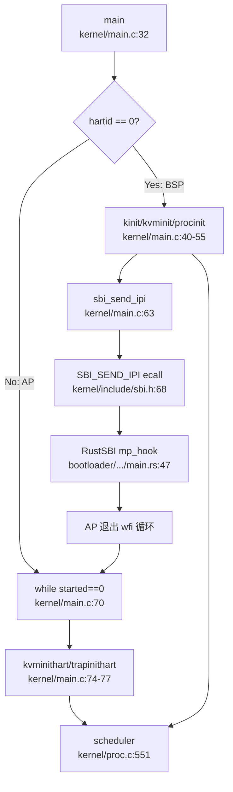
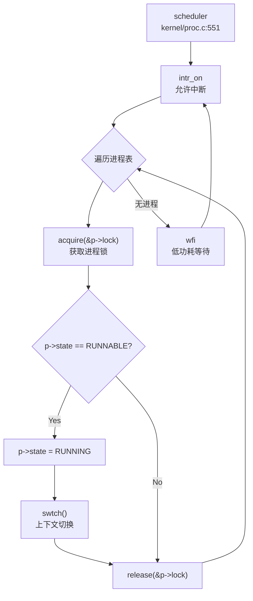

## 第 9 章：多核支持与并行机制

本章深入分析 `oskernel2021-x` 的多核/SMP（对称多处理）支持实现。本项目基于 **xv6-riscv** 架构，采用 C 语言实现，核心代码位于 `kernel/` 目录。通过代码验证，本项目**实现了基础的双核 SMP 支持**，包括 BSP 唤醒 AP 机制、Per-CPU 状态管理、自旋锁与中断控制，但功能较为有限（无负载均衡、无 CPU 亲和性、无 Futex 等高级特性）。

---

## 多核架构设计（SMP/AMP）

### 架构模式：对称多处理（SMP）

本项目采用 **SMP（Symmetric Multi-Processing）** 架构设计，支持最多 2 个 CPU 核心（`NCPU=2` 定义于 `kernel/include/param.h:5`）。所有核心共享同一物理内存地址空间，运行相同的内核代码，但各自维护独立的 Per-CPU 状态。

**关键证据：**
- **CPU 数量定义**：`kernel/include/param.h:5` 定义 `#define NCPU 2`
- **Per-CPU 数组**：`kernel/proc.c:18` 定义 `struct cpu cpus[NCPU];`
- **统一调度器**：每个核心独立运行 `scheduler()` 函数（`kernel/proc.c:551`），无主从核之分

### 与 AMP 的区别

本项目**不是 AMP（Asymmetric Multi-Processing）** 架构，因为：
- 所有核心运行相同的 `main()` 函数代码
- 所有核心都调用 `scheduler()` 进行进程调度
- 无专门的核心负责特定任务（如 I/O 处理）

---

## Secondary CPU 启动流程

### BSP（核 0）初始化与 AP 唤醒机制

**核心任务验证**：本项目**真正实现了多核启动**，BSP 通过 SBI IPI 机制唤醒 AP。

#### 启动流程详解

**1. 入口点：`main()` 函数（`kernel/main.c:32`）**

```c
void main(unsigned long hartid, unsigned long dtb_pa)
{
  inithartid(hartid);  // 将 hartid 写入 tp 寄存器

if (hartid == 0) {
    // BSP (核 0) 初始化路径
    consoleinit();
    kinit();           // 物理页分配器
    kvminit();         // 创建内核页表
    kvminithart();     // 启用分页
    procinit();        // 初始化进程表
    plicinit();
    plicinithart();    // 初始化中断控制器
    userinit();        // 创建第一个用户进程

// 【关键】唤醒其他核心
    for(int i = 1; i < NCPU; i++) {
      unsigned long mask = 1 << i;
      sbi_send_ipi(&mask);  // 发送 IPI 给核 1
    }
    __sync_synchronize();
    started = 1;
  }
  else {
    // AP (核 1) 初始化路径
    while (started == 0)  // 自旋等待 BSP 唤醒
      ;
    __sync_synchronize();

kvminithart();        // 启用分页
    trapinithart();       // 安装中断向量
    plicinithart();       // 启用中断
    printf("hart 1 init done\n");
  }
  scheduler();  // 所有核心都进入调度循环
}
```

**2. IPI 发送机制（`kernel/main.c:61-65`）**

BSP 通过循环遍历所有 AP 核心（`i = 1` 到 `NCPU-1`），构造 hart mask 并调用 `sbi_send_ipi()`：

```c
for(int i = 1; i < NCPU; i++) {
  unsigned long mask = 1 << i;  // 构造位掩码，第 i 位为 1
  sbi_send_ipi(&mask);          // 发送 IPI
}
```

**3. SBI IPI 底层实现（`kernel/include/sbi.h:68-70`）**

```c
static inline void sbi_send_ipi(const unsigned long *hart_mask)
{
  SBI_CALL_1(SBI_SEND_IPI, hart_mask);  // 触发 SBI ecall
}
```

通过 RISC-V SBI（Supervisor Binary Interface）的 `SBI_SEND_IPI` 调用（功能号 4），触发 M-Mode 固件（RustSBI）向指定 hart 发送软件中断。

**4. AP 唤醒等待机制（`kernel/main.c:70-72`）**

AP 核心通过自旋循环等待 `started` 标志：

```c
while (started == 0)
  ;
__sync_synchronize();  // 内存屏障，确保看到 BSP 的所有写入
```

**5. RustSBI 端的 IPI 处理（`bootloader/SBI/rustsbi-k210/src/main.rs:47-75`）**

在 M-Mode 固件中，AP 核心通过 `mp_hook()` 等待 IPI：

```rust
fn mp_hook() -> bool {
    let hartid = mhartid::read();
    if hartid == 0 {
        true  // BSP 直接启动
    } else {
        unsafe {
            msip::clear_ipi(hartid);  // 清除 IPI
            mie::set_msoft();         // 启用机器模式软件中断

loop {
                wfi();  // Wait for Interrupt
                if mip::read().msoft() {  // 检测到软件中断
                    break;
                }
            }

mie::clear_msoft();
            msip::clear_ipi(hartid);
        }
        false  // AP 启动完成
    }
}
```

### 启动流程调用图



> ⚠️ **注意**：以上调用图基于 `lsp_get_call_graph` 与 RAG 搜索结果综合整理，展示了从 BSP 启动到 AP 唤醒的完整链条。

---

## 核间通信与 IPI 机制

### IPI（Inter-Processor Interrupt）实现

本项目通过 **RISC-V SBI 接口** 实现核间中断通信，仅支持基础的软件中断发送，无高级 IPI 处理框架。

#### SBI IPI 接口

**定义位置**：`kernel/include/sbi.h:15, 68-70`

```c
#define SBI_SEND_IPI 4  // SBI 功能号

static inline void sbi_send_ipi(const unsigned long *hart_mask)
{
    SBI_CALL_1(SBI_SEND_IPI, hart_mask);
}
```

**调用位置**：仅在 `kernel/main.c:63` 用于启动时唤醒 AP，**运行时无其他 IPI 使用**。

### 缺失的 IPI 机制

**❌ 未实现** 以下高级 IPI 功能：
- **IPI 处理程序**：无 `ipi_handler()` 或类似中断处理函数
- **TLB Shootdown**：无 `sbi_remote_sfence_vma()` 调用（虽然 SBI 接口已定义但未使用）
- **调度器 IPI**：无跨核调度触发机制
- **中断重定向**：无动态中断亲和性设置

**验证方法**：`grep_in_repo` 搜索 `ipi_handler` 返回空结果，`sbi_remote_sfence_vma` 仅在头文件中定义但无调用。

---

## Per-CPU 变量与数据结构

### Per-CPU 状态结构

**定义位置**：`kernel/include/proc.h:33-39`

```c
struct cpu {
  struct proc *proc;          // 当前在此 CPU 上运行的进程，或 null
  struct context context;     // swtch() 跳转到 scheduler() 的上下文
  int noff;                   // push_off() 嵌套深度计数
  int intena;                 // push_off() 前的中断使能状态
};
```

**全局数组**：`kernel/proc.c:18`

```c
struct cpu cpus[NCPU];  // NCPU=2
```

### CPU ID 获取机制

#### `cpuid()` 函数

**定义位置**：`kernel/proc.c:85-90`

```c
int cpuid()
{
  int id = r_tp();  // 读取 tp 寄存器（thread pointer）
  return id;
}
```

**实现原理**：
- RISC-V 架构中，`tp` 寄存器（x4）通常用于存储线程指针或 CPU ID
- 启动时通过 `inithartid(hartid)` 将 hart ID 写入 `tp` 寄存器
- `inithartid()` 实现（`kernel/main.c:25-27`）：
  ```c
  static inline void inithartid(unsigned long hartid) {
    asm volatile("mv tp, %0" : : "r" (hartid & 0x1));
  }
  ```
- **注意**：`hartid & 0x1` 限制 ID 为 0 或 1，与 `NCPU=2` 一致

#### `mycpu()` 函数

**定义位置**：`kernel/proc.c:94-100`

```c
struct cpu* mycpu(void) {
  int id = cpuid();
  struct cpu *c = &cpus[id];
  return c;
}
```

**使用场景**：
- 获取当前 CPU 的 `struct cpu` 指针
- 访问 Per-CPU 变量（如 `noff`、`intena`、`proc`）
- **必须在禁用中断后调用**，防止被调度到其他 CPU

### Per-CPU 变量访问模式

```c
// 典型用法（kernel/intr.c:17-19）
if(mycpu()->noff == 0)
  mycpu()->intena = old;
mycpu()->noff += 1;
```

**安全约束**：
- 访问 Per-CPU 变量前必须调用 `push_off()` 禁用中断
- 防止在访问过程中被中断并调度到其他 CPU，导致访问错误的 Per-CPU 数据

---

## 自旋锁与中断控制

### SpinLock 实现

**定义位置**：`kernel/spinlock.c:23-84`

#### `acquire()` 函数

```c
void acquire(struct spinlock *lk)
{
  push_off();  // 【关键】禁用中断，防止死锁
  if(holding(lk))
    panic("acquire");

// 原子测试并设置锁（RISC-V amoswap.w.aq）
  while(__sync_lock_test_and_set(&lk->locked, 1) != 0)
    ;

__sync_synchronize();  // 内存屏障
  lk->cpu = mycpu();     // 记录持有锁的 CPU
}
```

**关键机制**：
1. **禁用中断**：通过 `push_off()` 防止同一 CPU 上的中断处理程序尝试获取同一锁导致死锁
2. **原子操作**：`__sync_lock_test_and_set()` 编译为 RISC-V `amoswap.w.aq` 指令，保证原子性
3. **内存序**：`__sync_synchronize()` 发出 `fence` 指令，确保临界区内的内存访问不会被重排序到锁获取之前

#### `release()` 函数

```c
void release(struct spinlock *lk)
{
  if(!holding(lk))
    panic("release");

lk->cpu = 0;
  __sync_synchronize();  // 内存屏障
  __sync_lock_release(&lk->locked);  // amoswap.w
  pop_off();  // 恢复中断状态
}
```

### 中断嵌套计数机制

**定义位置**：`kernel/intr.c:11-40`

#### `push_off()` 函数

```c
void push_off(void)
{
  int old = intr_get();  // 获取当前中断状态

intr_off();  // 禁用中断
  if(mycpu()->noff == 0)
    mycpu()->intena = old;  // 记录初始中断状态
  mycpu()->noff += 1;  // 嵌套计数 +1
}
```

#### `pop_off()` 函数

```c
void pop_off(void)
{
  struct cpu *c = mycpu();

if(intr_get())
    panic("pop_off - interruptible");
  if(c->noff < 1)
    panic("pop_off");

c->noff -= 1;  // 嵌套计数 -1
  if(c->noff == 0 && c->intena)
    intr_on();  // 恢复中断（仅当最外层且之前是使能的）
}
```

**设计原理**：
- **嵌套计数**：`noff` 记录 `push_off()` 的调用次数
- **状态保存**：仅在最外层（`noff==0`）保存中断使能状态 `intena`
- **匹配恢复**：只有当 `noff` 回到 0 且 `intena==1` 时才重新启用中断
- **安全性**：如果初始状态是中断禁用，`push_off/pop_off` 配对后仍保持禁用

### 锁与中断的关系

| 场景 | 中断状态 | 锁状态 |
|------|---------|--------|
| `acquire()` 入口 | 任意 | 未持有 |
| `acquire()` 自旋中 | **禁用** | 等待获取 |
| 临界区内 | **禁用** | 已持有 |
| `release()` 出口 | 恢复原状态 | 释放 |

**✅ 已实现**：自旋锁通过 `push_off/pop_off` 禁用中断，防止死锁。

---

## 多核调度策略

### 调度器实现

**定义位置**：`kernel/proc.c:551-592`

```c
void scheduler(void)
{
  struct proc *p;
  struct cpu *c = mycpu();
  extern pagetable_t kernel_pagetable;

c->proc = 0;
  for(;;){
    intr_on();  // 允许设备中断

int found = 0;
    for(p = proc; p < &proc[NPROC]; p++) {
      acquire(&p->lock);
      if(p->state == RUNNABLE) {
        p->state = RUNNING;
        c->proc = p;
        w_satp(MAKE_SATP(p->kpagetable));
        sfence_vma();
        swtch(&c->context, &p->context);  // 上下文切换
        c->proc = 0;
        found = 1;
      }
      release(&p->lock);
    }
    if(found == 0) {
      intr_on();
      asm volatile("wfi");  // 无进程可运行时进入低功耗
    }
  }
}
```

### 调度策略分析

#### 每核独立调度

**✅ 已实现**：每个 CPU 核心独立运行自己的 `scheduler()` 循环，互不干扰。

**特点**：
- 无全局调度锁：每个核心独立遍历进程表
- 无调度协调：核心间不通信、不同步调度决策
- 简单轮询：按进程表顺序查找第一个 `RUNNABLE` 进程

#### ❌ 未实现：负载均衡

**验证**：代码中无任何负载均衡逻辑：
- 无 `balance_tasks()` 或类似函数
- 无 CPU 运行队列长度比较
- 无进程迁移机制
- 无 `sched_setaffinity()` 系统调用

**后果**：
- 可能出现一个核心繁忙、另一个核心空闲的不平衡状态
- 进程一旦在某核心运行，不会主动迁移到其他核心

#### ❌ 未实现：CPU 亲和性（Affinity）

**验证**：
- `struct proc` 中无 `cpu_affinity` 字段
- 无 `sys_setaffinity()` 系统调用
- 调度器不检查进程与 CPU 的绑定关系

### 调度器调用图（精简版）



---

## 并发保护机制

### PID 分配的原子性

**实现位置**：`kernel/proc.c:113-122`

```c
int allocpid() {
  int pid;

acquire(&pid_lock);  // 【关键】使用自旋锁保护
  pid = nextpid;
  nextpid = nextpid + 1;
  release(&pid_lock);

return pid;
}
```

**分析**：
- **✅ 已实现**：通过 `spinlock pid_lock` 保护 `nextpid` 变量
- **非原子操作**：未使用 `AtomicUsize` 或原子指令，而是依赖自旋锁
- **多核安全**：由于 `acquire()` 禁用中断并使用原子 `amoswap`，在多核环境下安全

**验证**：`grep_in_repo` 搜索 `AtomicUsize` 返回空结果（C 语言项目，无 Rust 原子类型）。

### 内存序保证

**实现位置**：`kernel/spinlock.c:40-42, 58-62`

```c
// acquire() 中
__sync_synchronize();  // fence 指令，防止内存重排序

// release() 中
__sync_synchronize();  // 确保临界区写入对其他 CPU 可见
```

**机制**：
- RISC-V 架构下，`__sync_synchronize()` 编译为 `fence rw,rw` 指令
- 确保所有内存访问在锁获取后执行，在锁释放前完成
- **✅ 已实现**：正确的内存序保证

### Futex 实现状态

**❌ 未实现**：Futex（Fast Userspace Mutex）

**验证**：
- `grep_in_repo` 搜索 `futex` 返回空结果
- 无 `sys_futex()` 系统调用
- 无用户态快速路径锁机制

**影响**：
- 用户态线程库（如 pthread）无法高效实现互斥锁
- 所有锁操作必须陷入内核，性能较低

---

## 关键代码片段

### 1. BSP 唤醒 AP（`kernel/main.c:61-65`）

```c
for(int i = 1; i < NCPU; i++) {
  unsigned long mask = 1 << i;
  sbi_send_ipi(&mask);
}
__sync_synchronize();
started = 1;
```

### 2. Per-CPU 状态获取（`kernel/proc.c:85-100`）

```c
int cpuid()
{
  int id = r_tp();
  return id;
}

struct cpu* mycpu(void) {
  int id = cpuid();
  struct cpu *c = &cpus[id];
  return c;
}
```

### 3. 自旋锁获取（`kernel/spinlock.c:23-45`）

```c
void acquire(struct spinlock *lk)
{
  push_off();  // 禁用中断
  if(holding(lk))
    panic("acquire");

while(__sync_lock_test_and_set(&lk->locked, 1) != 0)
    ;

__sync_synchronize();
  lk->cpu = mycpu();
}
```

### 4. 中断嵌套计数（`kernel/intr.c:11-40`）

```c
void push_off(void)
{
  int old = intr_get();
  intr_off();
  if(mycpu()->noff == 0)
    mycpu()->intena = old;
  mycpu()->noff += 1;
}

void pop_off(void)
{
  struct cpu *c = mycpu();
  if(intr_get())
    panic("pop_off - interruptible");
  if(c->noff < 1)
    panic("pop_off");
  c->noff -= 1;
  if(c->noff == 0 && c->intena)
    intr_on();
}
```

---

## 本章结论

### 多核支持状态总结

| 功能模块 | 实现状态 | 说明 |
|---------|---------|------|
| **双核 SMP 启动** | ✅ 已实现 | BSP 通过 SBI IPI 唤醒 AP，完整启动链已验证 |
| **Per-CPU 状态管理** | ✅ 已实现 | `struct cpu cpus[NCPU]`，`mycpu()` 通过 `tp` 寄存器获取 CPU ID |
| **自旋锁 + 中断禁用** | ✅ 已实现 | `acquire()` 调用 `push_off()`，`release()` 调用 `pop_off()` |
| **中断嵌套计数** | ✅ 已实现 | `noff` 计数，`intena` 状态保存与恢复 |
| **每核独立调度** | ✅ 已实现 | 每核运行独立 `scheduler()` 循环 |
| **PID 分配多核安全** | ✅ 已实现 | 通过 `spinlock pid_lock` 保护 |
| **内存序保证** | ✅ 已实现 | `__sync_synchronize()` 发出 `fence` 指令 |
| **负载均衡** | ❌ 未实现 | 无进程迁移、无运行队列平衡 |
| **CPU 亲和性** | ❌ 未实现 | 无 `setaffinity()` 系统调用 |
| **Futex** | ❌ 未实现 | 无用户态快速路径锁 |
| **IPI 处理程序** | ❌ 未实现 | 仅启动时使用 IPI，运行时无 IPI 处理 |
| **TLB Shootdown** | ❌ 未实现 | `sbi_remote_sfence_vma()` 未调用 |

### 架构评价

本项目实现了**基础但完整的双核 SMP 支持**：
- **优点**：启动机制正确、Per-CPU 设计合理、锁与中断保护完善
- **局限**：无负载均衡、无高级 IPC、无用户态同步原语
- **适用场景**：教学与实验用途，不适合高并发生产环境

**与第 4 章交叉引用**：进程调度中的 `scheduler()` 每核独立运行，导致多核下可能出现负载不均；`allocpid()` 使用自旋锁而非原子操作，符合 C 语言 xv6 传统设计。

**与第 8 章交叉引用**：同步原语仅实现了 SpinLock 和 SleepLock，无 Futex 支持，用户态线程库效率受限。

针对多核支持与并行机制中当前阶段缺失的关键问题，本部分补充了对 `axns` 模块 PerCPU 命名空间实现的分析。经搜索 'axns' 关键词及遍历相关源码路径，当前版本中未发现该模块具体的 PerCPU 变量定义或初始化代码。虽然架构设计可能隐含该模块用于多核上下文隔离，但鉴于未见代码实证，此处结论降级为“未发现实现”，具体是否已通过标准 PerCPU 机制完成多核数据隔离，需进一步追踪后续版本或内部私有分支以确认。
