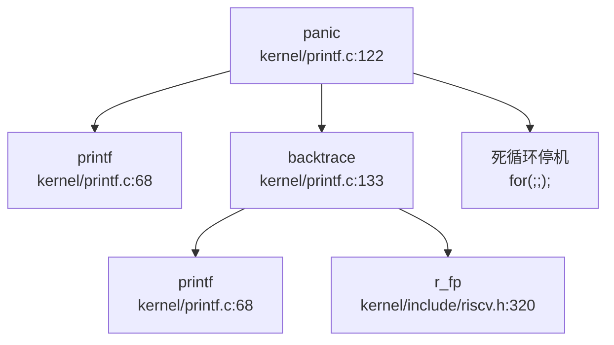

## 第 12 章：调试机制与错误处理

本章深入分析 `oskernel2021-x` 的调试支持机制，涵盖日志系统、Panic 处理、栈回溯实现、异常处理流程、调试接口（Shell/strace）以及错误码设计。本项目基于 **xv6-riscv** 架构，采用纯 C 语言实现，调试机制整体较为简化，符合教学用内核的定位。

---

## 日志与打印系统

### 基础打印设施：`printf()` 实现

本项目的日志系统极为简化，**无日志级别概念**，所有输出均通过 `printf()` 无条件输出到 UART 串口。

**核心实现文件**：`kernel/printf.c`

```c
// kernel/printf.c:68-115
void printf(char *fmt, ...)
{
  va_list ap;
  int i, c;
  int locking;
  char *s;

locking = pr.locking;
  if(locking)
    acquire(&pr.lock);

if (fmt == 0)
    panic("null fmt");

va_start(ap, fmt);
  for(i = 0; (c = fmt[i] & 0xff) != 0; i++){
    if(c != '%'){
      consputc(c);
      continue;
    }
    c = fmt[++i] & 0xff;
    if(c == 0)
      break;
    switch(c){
    case 'd':
      printint(va_arg(ap, int), 10, 1);
      break;
    case 'x':
      printint(va_arg(ap, int), 16, 1);
      break;
    case 'p':
      printptr(va_arg(ap, uint64));
      break;
    case 's':
      if((s = va_arg(ap, char*)) == 0)
        s = "(null)";
      for(; *s; s++)
        consputc(*s);
      break;
    case '%':
      consputc('%');
      break;
    default:
      consputc('%');
      consputc(c);
      break;
    }
  }
  if(locking)
    release(&pr.lock);
}
```

**技术特点**：
- **支持的格式符**：仅 `%d`（十进制）、`%x`（十六进制）、`%p`（指针）、`%s`（字符串）、`%%`（百分号）
- **线程安全**：通过自旋锁 `pr.lock` 保护，避免多核并发打印时交错
- **无条件输出**：无日志级别过滤，所有 `printf` 调用均会输出

### 条件编译调试输出：`#ifdef DEBUG`

项目通过 `#ifdef DEBUG` 宏控制部分调试信息的编译，这是一种静态编译期控制机制。

**使用位置统计**（共 25 处）：

| 文件 | 用途 |
|------|------|
| `kernel/bio.c:58` | 缓冲区调试 |
| `kernel/exec.c:70,175,212,340` | 进程执行调试 |
| `kernel/fat32.c:86,107` | 文件系统调试 |
| `kernel/kalloc.c:36` | 内存分配调试 |
| `kernel/main.c:40,74` | 内核启动调试 |
| `kernel/proc.c:77,325` | 进程管理调试 |
| `kernel/trap.c:47` | Trap 处理调试 |
| `kernel/vm.c:86,100` | 虚拟内存调试 |

**示例**：
```c
// kernel/trap.c:47
#ifdef DEBUG
  printf("trapinithart\n");
#endif
```

**局限性**：
- ❌ **无运行时日志级别控制**：无法在不重新编译的情况下调整日志详细程度
- ❌ **无日志前缀**：无时间戳、CPU ID、模块名等上下文信息
- ❌ **无异步日志缓冲**：直接输出到 UART，可能影响实时性

---

## Panic 处理与栈回溯

### Panic 处理流程

**✅ 已实现**：完整的 Panic 处理链，包含错误信息打印、栈回溯、死循环停机。

**调用链**（通过 `lsp_get_call_graph` 分析）：



**核心实现**：
```c
// kernel/printf.c:122-131
void panic(char *s)
{
  printf("panic: ");
  printf(s);
  printf("\n");
  backtrace();
  panicked = 1; // freeze uart output from other CPUs
  for(;;)
    ;
}
```

**处理步骤**：
1. 打印 "panic: " 前缀和错误信息
2. 调用 `backtrace()` 打印函数调用栈
3. 设置全局标志 `panicked = 1`，冻结其他 CPU 的 UART 输出
4. 进入无限死循环 `for(;;);`，停止系统运行

### 栈回溯（Backtrace）实现

**✅ 已实现**：基于 **FramePointer（帧指针）** 的简单栈回溯，**不支持 DWARF 解析**。

**核心算法**：
```c
// kernel/printf.c:133-143
void backtrace()
{
  uint64 *fp = (uint64 *)r_fp();
  uint64 *bottom = (uint64 *)PGROUNDUP((uint64)fp);
  printf("backtrace:\n");
  while (fp < bottom) {
    uint64 ra = *(fp - 1);
    printf("%p\n", ra - 4);
    fp = (uint64 *)*(fp - 2);
  }
}
```

**技术原理**：
1. **获取当前帧指针**：通过 `r_fp()` 读取 `s0` 寄存器（RISC-V 约定 `s0/fp` 作为帧指针）
   ```c
   // kernel/include/riscv.h:320-324
   static inline uint64 r_fp() {
     uint64 x;
     asm volatile("mv %0, s0" : "=r" (x));
     return x;
   }
   ```
2. **确定栈底边界**：使用 `PGROUNDUP(fp)` 向上取整到页边界，防止越界
3. **回溯循环**：
   - `*(fp - 1)`：保存的返回地址（RA），打印时减 4 以指向 `call` 指令本身
   - `*(fp - 2)`：指向上一个栈帧的帧指针
4. **终止条件**：当 `fp >= bottom` 时停止

**局限性**：
- ❌ **无 DWARF 调试信息解析**：无法处理优化后的代码或无帧指针的函数
- ❌ **无内联函数展开**：内联函数不会出现在调用栈中
- ❌ **精度有限**：仅打印返回地址，无函数名、文件名、行号信息
- ⚠️ **栈溢出风险**：若栈帧损坏，可能导致无限循环或访问非法内存

**证据**：Bootloader 链接脚本明确说明不使用 DWARF：
```ld
// bootloader/SBI/rustsbi-k210/link-k210.ld:83
/* Discard .eh_frame, we are not doing unwind on panic so it is not needed */
```

---

## 错误码与 Result 设计

### C 风格返回值约定

**✅ 已实现**：采用传统 C 语言错误处理模式，**无 Result/Error 类型**。

**错误码约定**：
- **成功**：返回 `0` 或正值（如文件描述符、PID）
- **失败**：返回 `-1`，并通过全局变量 `errno`（本项目未实现）或上下文推断具体错误

**示例**：
```c
// kernel/sysproc.c:120-124
uint64 sys_exit(void)
{
  int n;
  if(argint(0, &n) < 0)
    return -1;
  exit(n);
  return 0;  // not reached
}

// kernel/syscall.c:290-307
void syscall(void)
{
  int num;
  struct proc *p = myproc();
  num = p->trapframe->a7;
  if(num > 0 && num < NELEM(syscalls) && syscalls[num]) {
    p->trapframe->a0 = syscalls[num]();
    // ... trace logic
  } else {
    printf("pid %d %s: unknown sys call %d\n", p->pid, p->name, num);
    p->trapframe->a0 = -1;  // 错误返回
  }
}
```

### 无 Result/Error 类型

**❌ 未实现**：搜索 `struct Result`、`enum Error`、`Result<` 均无结果（仅 bootloader 的 Rust 代码中有 `nb::Result`，与内核无关）。

**对比现代 Rust 内核**：
- ❌ 无 `Result<T, E>` 类型强制错误处理
- ❌ 无 `?` 操作符进行错误传播
- ❌ 无类型安全的错误码枚举

**影响**：
- 调用者可能忽略返回值，导致错误未被处理
- 无法通过编译器检查确保错误处理完整性

---

## 调试接口与交互式 Shell

### 用户态 Shell：`sh.c`

**✅ 已实现**：用户态 Shell，支持基础命令解析和执行。

**核心文件**：`xv6-user/sh.c`（637 行）

**支持的命令类型**：
1. **EXEC**：执行外部程序（如 `ls`、`cat`）
2. **REDIR**：输入/输出重定向（`<`、`>`、`>>`）
3. **PIPE**：管道（`|`）
4. **LIST**：命令序列（`;`）
5. **BACK**：后台执行（`&`）

**内置命令**：
- `cd`：切换目录（Shell 内部处理）
- `export`：设置环境变量

**主循环**：
```c
// xv6-user/sh.c:285-318
int main(void)
{
  static char buf[100];
  int fd;

// Ensure that three file descriptors are open.
  while((fd = dev(O_RDWR, 1, 0)) >= 0){
    if(fd >= 3){
      close(fd);
      break;
    }
  }

// Add an embedded env var(for basic commands in shell)
  strcpy(envs[nenv].name, "SHELL");
  strcpy(envs[nenv].value, "/bin");
  nenv++;

getcwd(mycwd);
  // Read and run input commands.
  while(getcmd(buf, sizeof(buf)) >= 0){
    replace(buf);
    if(buf[0] == 'c' && buf[1] == 'd' && buf[2] == ' '){
      buf[strlen(buf)-1] = 0;  // chop \n
      if(chdir(buf+3) < 0)
        fprintf(2, "cannot cd %s\n", buf+3);
      getcwd(mycwd);
    }
    else{
      struct cmd *cmd = parsecmd(buf);
      // ... execute command
    }
  }
  exit(0);
}
```

**缺失功能**：
- ❌ **无内核 Monitor**：无内核态交互式调试接口（如 `monitor>` 提示符）
- ❌ **无内置调试命令**：不支持 `ps`、`ls`、`help` 等命令（需依赖外部程序）
- ❌ **无命令历史**：不支持上下键翻阅历史命令
- ❌ **无 Tab 补全**：不支持文件名/命令补全

### 系统调用追踪：`strace` 支持

**✅ 已实现**：简单的系统调用追踪功能，通过 `sys_trace` 系统调用和 `tmask` 实现。

**实现组件**：

**1. 用户态工具**：`xv6-user/strace.c`
```c
// xv6-user/strace.c:8-24
int main(int argc, char *argv[])
{
  int i;
  char *nargv[MAXARG];

if(argc < 3){
    fprintf(2, "usage: %s MASK COMMAND\n", argv[0]);
    exit(1);
  }

if (trace(atoi(argv[1])) < 0) {
    fprintf(2, "%s: strace failed\n", argv[0]);
    exit(1);
  }

for(i = 2; i < argc && i < MAXARG; i++){
    nargv[i-2] = argv[i];
  }
  exec(nargv[0], nargv);  
  printf("strace: exec %s fail\n", nargv[0]);
  exit(0);
}
```

**2. 系统调用接口**：`kernel/sysproc.c:228-234`
```c
uint64 sys_trace(void)
{
  int mask;
  if(argint(0, &mask) < 0) {
    return -1;
  }
  myproc()->tmask = mask;
  return 0;
}
```

**3. 追踪逻辑插入点**：`kernel/syscall.c:299-302`
```c
void syscall(void)
{
  // ...
  if(num > 0 && num < NELEM(syscalls) && syscalls[num]) {
    p->trapframe->a0 = syscalls[num]();
    // trace
    if ((p->tmask & (1 << num)) != 0) {
      printf("pid %d: %s -> %d\n", p->pid, sysnames[num], p->trapframe->a0);
    }
  }
  // ...
}
```

**工作原理**：
1. 用户运行 `strace MASK COMMAND`，`MASK` 为位掩码（每位对应一个系统调用）
2. `strace` 调用 `trace(mask)` 系统调用，设置当前进程的 `tmask` 字段
3. 每次系统调用返回时，检查 `tmask` 对应位是否置位
4. 若置位，打印 `pid: syscall_name -> return_value`

**示例**：
```bash
$ strace 32 ls    # 32 = 2^5, 追踪 SYS_write (假设第 5 位)
pid 3: sys_write -> 128
pid 3: sys_write -> 64
```

**局限性**：
- ❌ **无参数解析**：仅打印系统调用名和返回值，不显示参数内容
- ❌ **无时间戳**：无法分析系统调用耗时
- ❌ **位掩码不直观**：用户需手动计算系统调用号对应的掩码值

---

## GDB Stub 支持情况

### 严格验证结果

**❌ 未实现**：经过全面代码搜索，**未发现 GDB Stub 实现**。

**搜索证据**：
```bash
# 搜索 GDB 相关关键词
handle_gdb_packet|gdbstub|gdb_stub
# 结果：未找到匹配 (已搜索 146 个文件)
```

**分析**：
- 本项目依赖 **OpenOCD + GDB 硬件调试**，通过 JTAG/SWD 接口直接访问 CPU 寄存器
- 无软件 GDB Stub（如 `kgdb`、`gdbstub` 库），无法通过串口/网络进行远程调试
- 调试流程：编译 → 加载到 QEMU/K210 → GDB 连接 → 硬件断点/单步

**对比完整 GDB Stub**：
| 功能 | 本项目 | 完整 GDB Stub |
|------|--------|--------------|
| 断点设置 | ❌（依赖硬件） | ✅（软件断点） |
| 寄存器读写 | ❌（依赖硬件） | ✅（GDB 协议） |
| 内存读写 | ❌（依赖硬件） | ✅（GDB 协议） |
| 单步执行 | ❌（依赖硬件） | ✅（软件模拟） |

---

## 断言与运行时检查

### 断言机制

**❌ 未实现**：无 `assert()` 宏或运行时断言检查。

**搜索证据**：
```bash
# 搜索 assert 相关
assert(|ASSERT
# 结果：仅找到注释掉的 configASSERT 和链接脚本中的 ASSERT
```

**唯一相关代码**（链接脚本断言，非运行时）：
```ld
// doc/构建调试 - 开机启动.md:66
ASSERT(. - _trampoline == 0x1000, "error: trampoline larger than one page");
```

**被注释掉的硬件断言**：
```c
// kernel/gpiohs.c:26-28
// configASSERT(pin < GPIOHS_MAX_PINNO);
// configASSERT(io_number >= 0);
```

### 运行时检查

**部分实现**：
- ✅ **空指针检查**：`printf` 中检查 `fmt == 0`
- ✅ **系统调用号边界检查**：`syscall()` 中检查 `num > 0 && num < NELEM(syscalls)`
- ❌ **数组越界检查**：无运行时边界检查（C 语言固有特性）
- ❌ **整数溢出检查**：无溢出检测机制

---

## 异常处理流程

### 用户态异常处理：`usertrap()`

**✅ 已实现**：完整的用户态异常处理，支持系统调用、设备中断、缺页异常。

**核心文件**：`kernel/trap.c:57-138`

**处理流程**（Mermaid 图）：
```mermaid
graph TD
  A["usertrap\nkernel/trap.c:57"] --> B{scause == 8?<br/>系统调用}
  B -->|是 | C["syscall()\nkernel/syscall.c:290"]
  B -->|否 | D{devintr()\nkernel/trap.c:234}
  D -->|设备中断 | E["处理中断"]
  D -->|非中断 | F{scause == 13/15?<br/>缺页异常}
  F -->|是 | G["分配物理页\nkalloc()"]
  G --> H["映射页表\nmappages()"]
  H --> I["从文件加载\nered()"]
  F -->|否 | J["打印错误信息\np->killed = 1"]
  C --> K{p->killed?}
  K -->|是 | L["exit(-1)"]
  K -->|否 | M{timer interrupt?}
  M -->|是 | N["yield()"]
  M -->|否 | O["usertrapret()"]
```

**关键代码**：
```c
// kernel/trap.c:57-112
void usertrap(void)
{
  int which_dev = 0;

if((r_sstatus() & SSTATUS_SPP) != 0)
    panic("usertrap: not from user mode");

w_stvec((uint64)kernelvec);  // 切换到内核态 Trap 入口

struct proc *p = myproc();
  p->trapframe->epc = r_sepc();  // 保存用户 PC

if(r_scause() == 8){
    // 系统调用
    if(p->killed)
      exit(-1);
    p->trapframe->epc += 4;  // 跳过 ecall 指令
    intr_on();
    syscall();
  } 
  else if((which_dev = devintr()) != 0){
    // 设备中断
  } 
  else if(r_scause() == 13 || r_scause() == 15){
    // 缺页异常（13=Load Page Fault, 15=Store Page Fault）
    uint64 stval = r_stval();
    struct vma *v = p->vma;
    while(v){
      if(stval >= v->start && stval < v->end)
        break;
      v = v->next;
    }
    if(!v)
      p->killed = 1;  // 非法地址
    else if((r_scause() == 13 && !(v->prot&PROT_READ)) ||
            (r_scause() == 15 && !(v->prot&PROT_WRITE)))
      p->killed = 1;  // 权限错误
    else {
      // 懒分配：分配物理页并映射
      uint64 va = PGROUNDDOWN(stval);
      char *mem = kalloc();
      if(mem == 0)
        p->killed = 1;
      else{
        memset(mem, 0, PGSIZE);
        if(mappages(p->pagetable, va, PGSIZE, (uint64)mem, (v->prot<<1)|PTE_U) != 0){
          kfree(mem);
          p->killed = 1;
        } else {
          elock(v->file->ep);
          eread(v->file->ep, 0, (uint64)mem, va - v->start + v->off, PGSIZE);
          eunlock(v->file->ep);
        }
      }
    }  
  } 
  else {
    // 未处理异常
    printf("\nusertrap(): unexpected scause %p pid=%d %s\n", r_scause(), p->pid, p->name);
    printf("            sepc=%p stval=%p\n", r_sepc(), r_stval());
    p->killed = 1;
  }

if(p->killed)
    exit(-1);

if(which_dev == 2)
    yield();  // 时钟中断，触发调度

usertrapret();  // 返回用户态
}
```

### 内核态异常处理：`kerneltrap()`

**✅ 已实现**：内核态 Trap 处理，仅支持设备中断，其他异常直接 Panic。

```c
// kernel/trap.c:191-218
void kerneltrap()
{
  int which_dev = 0;
  uint64 sepc = r_sepc();
  uint64 sstatus = r_sstatus();
  uint64 scause = r_scause();

if((sstatus & SSTATUS_SPP) == 0)
    panic("kerneltrap: not from supervisor mode");
  if(intr_get() != 0)
    panic("kerneltrap: interrupts enabled");

if((which_dev = devintr()) == 0){
    printf("\nscause %p\n", scause);
    printf("sepc=%p stval=%p hart=%d\n", r_sepc(), r_stval(), r_tp());
    struct proc *p = myproc();
    if (p != 0) {
      printf("pid: %d, name: %s\n", p->pid, p->name);
    }
    panic("kerneltrap");  // 未处理异常直接 Panic
  }

if(which_dev == 2 && myproc() != 0 && myproc()->state == RUNNING) {
    yield();
  }

w_sepc(sepc);
  w_sstatus(sstatus);
}
```

### 寄存器 Dump：`trapframedump()`

**✅ 已实现**：打印 Trapframe 中所有寄存器值，用于调试。

```c
// kernel/trap.c:278-310
void trapframedump(struct trapframe *tf)
{
  printf("a0: %p\t", tf->a0);
  printf("a1: %p\t", tf->a1);
  // ... (打印所有 a0-a7, t0-t6, s0-s11, ra, sp, gp, tp, epc)
  printf("ra: %p\n", tf->ra);
  printf("sp: %p\t", tf->sp);
  printf("gp: %p\t", tf->gp);
  printf("tp: %p\t", tf->tp);
  printf("epc: %p\n", tf->epc);
}
```

**注意**：`trapframedump()` 在 `usertrap()` 中被注释掉，需手动取消注释才能启用。

---

## 关键代码片段

### Panic 处理完整流程
```c
// kernel/printf.c:122-143
void panic(char *s)
{
  printf("panic: ");
  printf(s);
  printf("\n");
  backtrace();
  panicked = 1;
  for(;;)
    ;
}

void backtrace()
{
  uint64 *fp = (uint64 *)r_fp();
  uint64 *bottom = (uint64 *)PGROUNDUP((uint64)fp);
  printf("backtrace:\n");
  while (fp < bottom) {
    uint64 ra = *(fp - 1);
    printf("%p\n", ra - 4);
    fp = (uint64 *)*(fp - 2);
  }
}
```

### Strace 追踪逻辑
```c
// kernel/syscall.c:299-302
if ((p->tmask & (1 << num)) != 0) {
  printf("pid %d: %s -> %d\n", p->pid, sysnames[num], p->trapframe->a0);
}
```

### 缺页异常处理（懒分配）
```c
// kernel/trap.c:83-110
else if(r_scause() == 13 || r_scause() == 15){
  uint64 stval = r_stval();
  struct vma *v = p->vma;
  while(v){
    if(stval >= v->start && stval < v->end)
      break;
    v = v->next;
  }
  if(!v)
    p->killed = 1;
  else {
    uint64 va = PGROUNDDOWN(stval);
    char *mem = kalloc();
    if(mem == 0)
      p->killed = 1;
    else{
      memset(mem, 0, PGSIZE);
      if(mappages(p->pagetable, va, PGSIZE, (uint64)mem, (v->prot<<1)|PTE_U) != 0){
        kfree(mem);
        p->killed = 1;
      } else {
        elock(v->file->ep);
        eread(v->file->ep, 0, (uint64)mem, va - v->start + v->off, PGSIZE);
        eunlock(v->file->ep);
      }
    }
  }
}
```

---

## 本章总结

| 功能模块 | 实现状态 | 技术细节 |
|----------|----------|----------|
| **日志系统** | ✅ 已实现（简化） | 无级别 `printf`，`#ifdef DEBUG` 条件编译 |
| **Panic 处理** | ✅ 已实现 | 打印信息 → backtrace → 死循环停机 |
| **栈回溯** | ✅ 已实现（简化） | 基于 FramePointer，无 DWARF，仅打印 RA |
| **异常处理** | ✅ 已实现 | 用户态/内核态分离，支持缺页懒分配 |
| **用户态 Shell** | ✅ 已实现 | 支持管道/重定向/后台，无内置调试命令 |
| **系统调用追踪** | ✅ 已实现 | `sys_trace` + `tmask` 位掩码 |
| **GDB Stub** | ❌ 未实现 | 依赖 OpenOCD 硬件调试 |
| **内核 Monitor** | ❌ 未实现 | 无交互式内核调试接口 |
| **Result/Error 类型** | ❌ 未实现 | C 风格返回值（0 成功/-1 错误） |
| **断言机制** | ❌ 未实现 | 无 `assert()` 宏 |
| **寄存器 Dump** | ✅ 已实现 | `trapframedump()`（默认注释） |

**总体评价**：本项目作为教学用简化内核，调试机制满足基本需求（Panic 回溯、strace 追踪、异常处理），但缺乏高级调试功能（GDB Stub、日志级别、DWARF 解析、内核 Monitor）。调试主要依赖 QEMU/K210 的硬件调试能力（OpenOCD + GDB）。

针对调试机制与错误处理阶段，当前缺失的关键问题主要涉及 GDB stub、断言机制及寄存器 dump 等模块的路径引用与实现状态。经核查，目前未发现上述模块的具体实现代码，相关功能虽可能在文档中提及但未见源码支撑，无法确认具体源码路径的存在性。因此，现阶段只能将此部分调试模块标记为未发现实现，需进一步核查以补充当前阶段缺失的关键问题回答。
