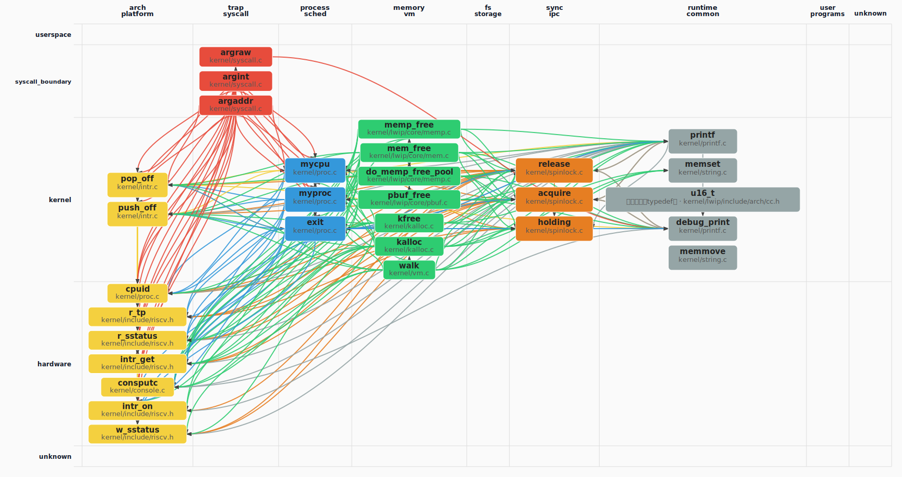

# oskernel2023-avx 操作系统技术分析报告

> **年份**: 2023

> **赛事**: 操作系统赛

> **子赛事**: 内核实现赛道

> **学校**: 华中科技大学

> **队伍名称**: AVX

> **仓库地址**: https://gitlab.eduxiji.net/202310487101114/oskernel2023-avx

> **分析日期**: 2026年04月21日

> **分析工具**: OS-Agent-D

---

## 目录

1. 项目概览与技术栈
2. 启动架构与 Trap系统调用
3. 内存管理物理虚拟分配器
4. 进程线程调度与多核
5. 文件系统与设备 IO
6. 同步互斥与进程间通信
7. 安全机制与权限模型
8. 网络子系统与协议栈
9. 调试机制与错误处理
10. 开发历史与里程碑

---

## Call Graph 概览

> 先以 Tree-sitter 扫描全库，再对 C/C++ 用 **Clang AST**（与仓库根 `compile_flags.txt` / `compile_commands.json` 一致）剔除**条件编译未进入翻译单元**的函数节点，得到参与 PageRank 的 **5774** 个函数、**5625** 条调用边。
> Clang 语义过滤已移除 930 个在条件编译下未进入翻译单元的 C/C++ 函数节点（语义解析 148/148 个文件）。
>
> 用 **PageRank** 选出架构枢纽 **Top-30** 个函数（参数 **k=30**；若全库可排名节点不足 k，则实际个数可能小于 k）。
> 按 **domain（列）× layer（行）** 二维网格布局（**domain/layer 由 LLM 根据函数名与代码片段分类**），
> 同格多节点限制在格内排布；连线体现调用关系。
> **可变网格**：在 **k=30** 配置下，**未出现**的 domain 列、layer 行会**压缩**宽高，把画布让给有节点的列/行。
> **layer 为何常落在 kernel**：PageRank 枢纽多为调度/内存/VFS 等**内核通用逻辑**，且 `kernel` 表示「既非 syscall 入口、也非直接 MMIO」的广义内核代码，模型容易默认成 kernel；已对 **`sys_*` 命名**做确定性修正为 `syscall_boundary`。缓存随 **compile 配置 / git / 管线版本** 自动失效；需强制全量重算时可调用 `generate_callgraph_section(..., force_regenerate=True)`。

### 函数级 Call Graph（PageRank Top-30，图示 30 个函数）



*（图：`callgraph_overview.svg`，与报告同目录）*

**图例**：列 = domain 分类，行 = layer 层次（**userspace** → **syscall_boundary** → **kernel** → **hardware**）
节点颜色：`arch_platform`=#f4d03f / `trap_syscall`=#e74c3c / `process_sched`=#3498db / `memory_vm`=#2ecc71 / `fs_storage`=#9b59b6
节点**第一行**仅为**符号名**；**第二行**：**函数定义**只写相对源路径；**宏**、**类型别名（typedef）**、**仅引用（调用侧）**等在第二行用**中文**标明类别并附路径或调用方文件（来自静态解析或调用边）。
列宽按该 domain 列下最长节点标签**动态**估算（有上下限），避免固定死宽度。

### 文件级调用关系

<table style="border-collapse:collapse;width:auto;max-width:100%;table-layout:auto">
<thead><tr>
<th style="text-align:left;padding:6px 10px;border:1px solid #ddd;background:#f6f8fa">源文件</th>
<th style="text-align:left;padding:6px 10px;border:1px solid #ddd;background:#f6f8fa">domain</th>
<th style="text-align:left;padding:6px 10px;border:1px solid #ddd;background:#f6f8fa">调用的文件（权重）</th>
</tr></thead>
<tbody>
<tr><td style="text-align:left;padding:6px 10px;border:1px solid #ddd;vertical-align:top"><code style='white-space:pre-wrap;word-break:break-all'>kernel/console.c</code></td><td style="text-align:left;padding:6px 10px;border:1px solid #ddd;vertical-align:top">arch_platform</td><td style="text-align:left;padding:6px 10px;border:1px solid #ddd;vertical-align:top">uart8250.c×1, sbi.h×1</td></tr>
<tr><td style="text-align:left;padding:6px 10px;border:1px solid #ddd;vertical-align:top"><code style='white-space:pre-wrap;word-break:break-all'>kernel/intr.c</code></td><td style="text-align:left;padding:6px 10px;border:1px solid #ddd;vertical-align:top">arch_platform</td><td style="text-align:left;padding:6px 10px;border:1px solid #ddd;vertical-align:top">riscv.h×10, proc.c×5, printf.c×1</td></tr>
<tr><td style="text-align:left;padding:6px 10px;border:1px solid #ddd;vertical-align:top"><code style='white-space:pre-wrap;word-break:break-all'>kernel/kalloc.c</code></td><td style="text-align:left;padding:6px 10px;border:1px solid #ddd;vertical-align:top">memory_vm</td><td style="text-align:left;padding:6px 10px;border:1px solid #ddd;vertical-align:top">riscv.h×12, proc.c×12, printf.c×7, spinlock.c×6, printf.c×5</td></tr>
<tr><td style="text-align:left;padding:6px 10px;border:1px solid #ddd;vertical-align:top"><code style='white-space:pre-wrap;word-break:break-all'>kernel/lwip/core/mem.c</code></td><td style="text-align:left;padding:6px 10px;border:1px solid #ddd;vertical-align:top">memory_vm</td><td style="text-align:left;padding:6px 10px;border:1px solid #ddd;vertical-align:top">printf.c×5, sys_arch.c×2, memp.c×1, mem.h×1, printf.c×1</td></tr>
<tr><td style="text-align:left;padding:6px 10px;border:1px solid #ddd;vertical-align:top"><code style='white-space:pre-wrap;word-break:break-all'>kernel/lwip/core/memp.c</code></td><td style="text-align:left;padding:6px 10px;border:1px solid #ddd;vertical-align:top">memory_vm</td><td style="text-align:left;padding:6px 10px;border:1px solid #ddd;vertical-align:top">printf.c×5, proc.c×2, riscv.h×1, mem.c×1, printf.c×1</td></tr>
<tr><td style="text-align:left;padding:6px 10px;border:1px solid #ddd;vertical-align:top"><code style='white-space:pre-wrap;word-break:break-all'>kernel/lwip/core/pbuf.c</code></td><td style="text-align:left;padding:6px 10px;border:1px solid #ddd;vertical-align:top">memory_vm</td><td style="text-align:left;padding:6px 10px;border:1px solid #ddd;vertical-align:top">mem.c×5, printf.c×5, memp.c×2, sys_arch.c×2, pbuf.h×1</td></tr>
<tr><td style="text-align:left;padding:6px 10px;border:1px solid #ddd;vertical-align:top"><code style='white-space:pre-wrap;word-break:break-all'>kernel/printf.c</code></td><td style="text-align:left;padding:6px 10px;border:1px solid #ddd;vertical-align:top">runtime_common</td><td style="text-align:left;padding:6px 10px;border:1px solid #ddd;vertical-align:top">spinlock.c×2, printf.c×2, console.c×1</td></tr>
<tr><td style="text-align:left;padding:6px 10px;border:1px solid #ddd;vertical-align:top"><code style='white-space:pre-wrap;word-break:break-all'>kernel/proc.c</code></td><td style="text-align:left;padding:6px 10px;border:1px solid #ddd;vertical-align:top">process_sched</td><td style="text-align:left;padding:6px 10px;border:1px solid #ddd;vertical-align:top">riscv.h×14, printf.c×5, intr.c×4, printf.c×4, spinlock.c×3</td></tr>
<tr><td style="text-align:left;padding:6px 10px;border:1px solid #ddd;vertical-align:top"><code style='white-space:pre-wrap;word-break:break-all'>kernel/spinlock.c</code></td><td style="text-align:left;padding:6px 10px;border:1px solid #ddd;vertical-align:top">sync_ipc</td><td style="text-align:left;padding:6px 10px;border:1px solid #ddd;vertical-align:top">riscv.h×10, proc.c×8, intr.c×2, printf.c×2</td></tr>
<tr><td style="text-align:left;padding:6px 10px;border:1px solid #ddd;vertical-align:top"><code style='white-space:pre-wrap;word-break:break-all'>kernel/syscall.c</code></td><td style="text-align:left;padding:6px 10px;border:1px solid #ddd;vertical-align:top">trap_syscall</td><td style="text-align:left;padding:6px 10px;border:1px solid #ddd;vertical-align:top">proc.c×12, riscv.h×12, intr.c×6, printf.c×1</td></tr>
<tr><td style="text-align:left;padding:6px 10px;border:1px solid #ddd;vertical-align:top"><code style='white-space:pre-wrap;word-break:break-all'>kernel/vm.c</code></td><td style="text-align:left;padding:6px 10px;border:1px solid #ddd;vertical-align:top">memory_vm</td><td style="text-align:left;padding:6px 10px;border:1px solid #ddd;vertical-align:top">printf.c×5, spinlock.c×3, riscv.h×3, printf.c×3, intr.c×2</td></tr>
<tr><td style="text-align:left;padding:6px 10px;border:1px solid #ddd;vertical-align:top"><code style='white-space:pre-wrap;word-break:break-all'>xv6-user/printf.c</code></td><td style="text-align:left;padding:6px 10px;border:1px solid #ddd;vertical-align:top">runtime_common</td><td style="text-align:left;padding:6px 10px;border:1px solid #ddd;vertical-align:top">spinlock.c×2, riscv.h×2, console.c×1, printf.c×1, proc.c×1</td></tr>
</tbody></table>

### PageRank Top-30 枢纽函数（k=30）

<table style="border-collapse:collapse;width:auto;max-width:100%;table-layout:auto">
<thead><tr>
<th style="text-align:left;padding:6px 10px;border:1px solid #ddd;background:#f6f8fa">符号</th>
<th style="text-align:left;padding:6px 10px;border:1px solid #ddd;background:#f6f8fa">类型</th>
<th style="text-align:left;padding:6px 10px;border:1px solid #ddd;background:#f6f8fa">domain</th>
<th style="text-align:left;padding:6px 10px;border:1px solid #ddd;background:#f6f8fa">layer</th>
<th style="text-align:left;padding:6px 10px;border:1px solid #ddd;background:#f6f8fa">定义路径 / 引用位置</th>
<th style="text-align:left;padding:6px 10px;border:1px solid #ddd;background:#f6f8fa">PR</th>
<th style="text-align:left;padding:6px 10px;border:1px solid #ddd;background:#f6f8fa">in°</th>
<th style="text-align:left;padding:6px 10px;border:1px solid #ddd;background:#f6f8fa">out°</th>
</tr></thead>
<tbody>
<tr><td style="text-align:left;padding:6px 10px;border:1px solid #ddd;vertical-align:top"><code>mycpu</code></td><td style="text-align:left;padding:6px 10px;border:1px solid #ddd;vertical-align:top">函数定义</td><td style="text-align:left;padding:6px 10px;border:1px solid #ddd;vertical-align:top">process_sched</td><td style="text-align:left;padding:6px 10px;border:1px solid #ddd;vertical-align:top">kernel</td><td style="text-align:left;padding:6px 10px;border:1px solid #ddd;vertical-align:top"><code style='white-space:pre-wrap;word-break:break-all'>kernel/proc.c</code></td><td style="text-align:left;padding:6px 10px;border:1px solid #ddd;vertical-align:top">#1</td><td style="text-align:left;padding:6px 10px;border:1px solid #ddd;vertical-align:top">130</td><td style="text-align:left;padding:6px 10px;border:1px solid #ddd;vertical-align:top">2</td></tr>
<tr><td style="text-align:left;padding:6px 10px;border:1px solid #ddd;vertical-align:top"><code>cpuid</code></td><td style="text-align:left;padding:6px 10px;border:1px solid #ddd;vertical-align:top">函数定义</td><td style="text-align:left;padding:6px 10px;border:1px solid #ddd;vertical-align:top">arch_platform</td><td style="text-align:left;padding:6px 10px;border:1px solid #ddd;vertical-align:top">hardware</td><td style="text-align:left;padding:6px 10px;border:1px solid #ddd;vertical-align:top"><code style='white-space:pre-wrap;word-break:break-all'>kernel/proc.c</code></td><td style="text-align:left;padding:6px 10px;border:1px solid #ddd;vertical-align:top">#2</td><td style="text-align:left;padding:6px 10px;border:1px solid #ddd;vertical-align:top">125</td><td style="text-align:left;padding:6px 10px;border:1px solid #ddd;vertical-align:top">1</td></tr>
<tr><td style="text-align:left;padding:6px 10px;border:1px solid #ddd;vertical-align:top"><code>r_tp</code></td><td style="text-align:left;padding:6px 10px;border:1px solid #ddd;vertical-align:top">函数定义</td><td style="text-align:left;padding:6px 10px;border:1px solid #ddd;vertical-align:top">arch_platform</td><td style="text-align:left;padding:6px 10px;border:1px solid #ddd;vertical-align:top">hardware</td><td style="text-align:left;padding:6px 10px;border:1px solid #ddd;vertical-align:top"><code style='white-space:pre-wrap;word-break:break-all'>kernel/include/riscv.h</code></td><td style="text-align:left;padding:6px 10px;border:1px solid #ddd;vertical-align:top">#3</td><td style="text-align:left;padding:6px 10px;border:1px solid #ddd;vertical-align:top">89</td><td style="text-align:left;padding:6px 10px;border:1px solid #ddd;vertical-align:top">0</td></tr>
<tr><td style="text-align:left;padding:6px 10px;border:1px solid #ddd;vertical-align:top"><code>myproc</code></td><td style="text-align:left;padding:6px 10px;border:1px solid #ddd;vertical-align:top">函数定义</td><td style="text-align:left;padding:6px 10px;border:1px solid #ddd;vertical-align:top">process_sched</td><td style="text-align:left;padding:6px 10px;border:1px solid #ddd;vertical-align:top">kernel</td><td style="text-align:left;padding:6px 10px;border:1px solid #ddd;vertical-align:top"><code style='white-space:pre-wrap;word-break:break-all'>kernel/proc.c</code></td><td style="text-align:left;padding:6px 10px;border:1px solid #ddd;vertical-align:top">#4</td><td style="text-align:left;padding:6px 10px;border:1px solid #ddd;vertical-align:top">150</td><td style="text-align:left;padding:6px 10px;border:1px solid #ddd;vertical-align:top">10</td></tr>
<tr><td style="text-align:left;padding:6px 10px;border:1px solid #ddd;vertical-align:top"><code>release</code></td><td style="text-align:left;padding:6px 10px;border:1px solid #ddd;vertical-align:top">函数定义</td><td style="text-align:left;padding:6px 10px;border:1px solid #ddd;vertical-align:top">sync_ipc</td><td style="text-align:left;padding:6px 10px;border:1px solid #ddd;vertical-align:top">kernel</td><td style="text-align:left;padding:6px 10px;border:1px solid #ddd;vertical-align:top"><code style='white-space:pre-wrap;word-break:break-all'>kernel/spinlock.c</code></td><td style="text-align:left;padding:6px 10px;border:1px solid #ddd;vertical-align:top">#5</td><td style="text-align:left;padding:6px 10px;border:1px solid #ddd;vertical-align:top">138</td><td style="text-align:left;padding:6px 10px;border:1px solid #ddd;vertical-align:top">11</td></tr>
<tr><td style="text-align:left;padding:6px 10px;border:1px solid #ddd;vertical-align:top"><code>acquire</code></td><td style="text-align:left;padding:6px 10px;border:1px solid #ddd;vertical-align:top">函数定义</td><td style="text-align:left;padding:6px 10px;border:1px solid #ddd;vertical-align:top">sync_ipc</td><td style="text-align:left;padding:6px 10px;border:1px solid #ddd;vertical-align:top">kernel</td><td style="text-align:left;padding:6px 10px;border:1px solid #ddd;vertical-align:top"><code style='white-space:pre-wrap;word-break:break-all'>kernel/spinlock.c</code></td><td style="text-align:left;padding:6px 10px;border:1px solid #ddd;vertical-align:top">#6</td><td style="text-align:left;padding:6px 10px;border:1px solid #ddd;vertical-align:top">138</td><td style="text-align:left;padding:6px 10px;border:1px solid #ddd;vertical-align:top">10</td></tr>
<tr><td style="text-align:left;padding:6px 10px;border:1px solid #ddd;vertical-align:top"><code>holding</code></td><td style="text-align:left;padding:6px 10px;border:1px solid #ddd;vertical-align:top">函数定义</td><td style="text-align:left;padding:6px 10px;border:1px solid #ddd;vertical-align:top">sync_ipc</td><td style="text-align:left;padding:6px 10px;border:1px solid #ddd;vertical-align:top">kernel</td><td style="text-align:left;padding:6px 10px;border:1px solid #ddd;vertical-align:top"><code style='white-space:pre-wrap;word-break:break-all'>kernel/spinlock.c</code></td><td style="text-align:left;padding:6px 10px;border:1px solid #ddd;vertical-align:top">#7</td><td style="text-align:left;padding:6px 10px;border:1px solid #ddd;vertical-align:top">82</td><td style="text-align:left;padding:6px 10px;border:1px solid #ddd;vertical-align:top">3</td></tr>
<tr><td style="text-align:left;padding:6px 10px;border:1px solid #ddd;vertical-align:top"><code>pop_off</code></td><td style="text-align:left;padding:6px 10px;border:1px solid #ddd;vertical-align:top">函数定义</td><td style="text-align:left;padding:6px 10px;border:1px solid #ddd;vertical-align:top">arch_platform</td><td style="text-align:left;padding:6px 10px;border:1px solid #ddd;vertical-align:top">kernel</td><td style="text-align:left;padding:6px 10px;border:1px solid #ddd;vertical-align:top"><code style='white-space:pre-wrap;word-break:break-all'>kernel/intr.c</code></td><td style="text-align:left;padding:6px 10px;border:1px solid #ddd;vertical-align:top">#8</td><td style="text-align:left;padding:6px 10px;border:1px solid #ddd;vertical-align:top">160</td><td style="text-align:left;padding:6px 10px;border:1px solid #ddd;vertical-align:top">9</td></tr>
<tr><td style="text-align:left;padding:6px 10px;border:1px solid #ddd;vertical-align:top"><code>printf</code></td><td style="text-align:left;padding:6px 10px;border:1px solid #ddd;vertical-align:top">函数定义</td><td style="text-align:left;padding:6px 10px;border:1px solid #ddd;vertical-align:top">runtime_common</td><td style="text-align:left;padding:6px 10px;border:1px solid #ddd;vertical-align:top">userspace</td><td style="text-align:left;padding:6px 10px;border:1px solid #ddd;vertical-align:top"><code style='white-space:pre-wrap;word-break:break-all'>xv6-user/printf.c</code></td><td style="text-align:left;padding:6px 10px;border:1px solid #ddd;vertical-align:top">#9</td><td style="text-align:left;padding:6px 10px;border:1px solid #ddd;vertical-align:top">157</td><td style="text-align:left;padding:6px 10px;border:1px solid #ddd;vertical-align:top">13</td></tr>
<tr><td style="text-align:left;padding:6px 10px;border:1px solid #ddd;vertical-align:top"><code>push_off</code></td><td style="text-align:left;padding:6px 10px;border:1px solid #ddd;vertical-align:top">函数定义</td><td style="text-align:left;padding:6px 10px;border:1px solid #ddd;vertical-align:top">arch_platform</td><td style="text-align:left;padding:6px 10px;border:1px solid #ddd;vertical-align:top">kernel</td><td style="text-align:left;padding:6px 10px;border:1px solid #ddd;vertical-align:top"><code style='white-space:pre-wrap;word-break:break-all'>kernel/intr.c</code></td><td style="text-align:left;padding:6px 10px;border:1px solid #ddd;vertical-align:top">#10</td><td style="text-align:left;padding:6px 10px;border:1px solid #ddd;vertical-align:top">159</td><td style="text-align:left;padding:6px 10px;border:1px solid #ddd;vertical-align:top">7</td></tr>
<tr><td style="text-align:left;padding:6px 10px;border:1px solid #ddd;vertical-align:top"><code>r_sstatus</code></td><td style="text-align:left;padding:6px 10px;border:1px solid #ddd;vertical-align:top">函数定义</td><td style="text-align:left;padding:6px 10px;border:1px solid #ddd;vertical-align:top">arch_platform</td><td style="text-align:left;padding:6px 10px;border:1px solid #ddd;vertical-align:top">hardware</td><td style="text-align:left;padding:6px 10px;border:1px solid #ddd;vertical-align:top"><code style='white-space:pre-wrap;word-break:break-all'>kernel/include/riscv.h</code></td><td style="text-align:left;padding:6px 10px;border:1px solid #ddd;vertical-align:top">#11</td><td style="text-align:left;padding:6px 10px;border:1px solid #ddd;vertical-align:top">105</td><td style="text-align:left;padding:6px 10px;border:1px solid #ddd;vertical-align:top">0</td></tr>
<tr><td style="text-align:left;padding:6px 10px;border:1px solid #ddd;vertical-align:top"><code>memset</code></td><td style="text-align:left;padding:6px 10px;border:1px solid #ddd;vertical-align:top">函数定义</td><td style="text-align:left;padding:6px 10px;border:1px solid #ddd;vertical-align:top">runtime_common</td><td style="text-align:left;padding:6px 10px;border:1px solid #ddd;vertical-align:top">userspace</td><td style="text-align:left;padding:6px 10px;border:1px solid #ddd;vertical-align:top"><code style='white-space:pre-wrap;word-break:break-all'>xv6-user/ulib.c</code></td><td style="text-align:left;padding:6px 10px;border:1px solid #ddd;vertical-align:top">#12</td><td style="text-align:left;padding:6px 10px;border:1px solid #ddd;vertical-align:top">105</td><td style="text-align:left;padding:6px 10px;border:1px solid #ddd;vertical-align:top">0</td></tr>
<tr><td style="text-align:left;padding:6px 10px;border:1px solid #ddd;vertical-align:top"><code>u16_t</code></td><td style="text-align:left;padding:6px 10px;border:1px solid #ddd;vertical-align:top">类型别名（typedef）</td><td style="text-align:left;padding:6px 10px;border:1px solid #ddd;vertical-align:top">runtime_common</td><td style="text-align:left;padding:6px 10px;border:1px solid #ddd;vertical-align:top">kernel</td><td style="text-align:left;padding:6px 10px;border:1px solid #ddd;vertical-align:top"><code style='white-space:pre-wrap;word-break:break-all'>类型别名（typedef） · kernel/lwip/include/arch/cc.h</code></td><td style="text-align:left;padding:6px 10px;border:1px solid #ddd;vertical-align:top">#13</td><td style="text-align:left;padding:6px 10px;border:1px solid #ddd;vertical-align:top">37</td><td style="text-align:left;padding:6px 10px;border:1px solid #ddd;vertical-align:top">0</td></tr>
<tr><td style="text-align:left;padding:6px 10px;border:1px solid #ddd;vertical-align:top"><code>memp_free</code></td><td style="text-align:left;padding:6px 10px;border:1px solid #ddd;vertical-align:top">函数定义</td><td style="text-align:left;padding:6px 10px;border:1px solid #ddd;vertical-align:top">memory_vm</td><td style="text-align:left;padding:6px 10px;border:1px solid #ddd;vertical-align:top">kernel</td><td style="text-align:left;padding:6px 10px;border:1px solid #ddd;vertical-align:top"><code style='white-space:pre-wrap;word-break:break-all'>kernel/lwip/core/memp.c</code></td><td style="text-align:left;padding:6px 10px;border:1px solid #ddd;vertical-align:top">#14</td><td style="text-align:left;padding:6px 10px;border:1px solid #ddd;vertical-align:top">22</td><td style="text-align:left;padding:6px 10px;border:1px solid #ddd;vertical-align:top">8</td></tr>
<tr><td style="text-align:left;padding:6px 10px;border:1px solid #ddd;vertical-align:top"><code>intr_get</code></td><td style="text-align:left;padding:6px 10px;border:1px solid #ddd;vertical-align:top">函数定义</td><td style="text-align:left;padding:6px 10px;border:1px solid #ddd;vertical-align:top">arch_platform</td><td style="text-align:left;padding:6px 10px;border:1px solid #ddd;vertical-align:top">hardware</td><td style="text-align:left;padding:6px 10px;border:1px solid #ddd;vertical-align:top"><code style='white-space:pre-wrap;word-break:break-all'>kernel/include/riscv.h</code></td><td style="text-align:left;padding:6px 10px;border:1px solid #ddd;vertical-align:top">#15</td><td style="text-align:left;padding:6px 10px;border:1px solid #ddd;vertical-align:top">148</td><td style="text-align:left;padding:6px 10px;border:1px solid #ddd;vertical-align:top">1</td></tr>
<tr><td style="text-align:left;padding:6px 10px;border:1px solid #ddd;vertical-align:top"><code>mem_free</code></td><td style="text-align:left;padding:6px 10px;border:1px solid #ddd;vertical-align:top">函数定义</td><td style="text-align:left;padding:6px 10px;border:1px solid #ddd;vertical-align:top">memory_vm</td><td style="text-align:left;padding:6px 10px;border:1px solid #ddd;vertical-align:top">kernel</td><td style="text-align:left;padding:6px 10px;border:1px solid #ddd;vertical-align:top"><code style='white-space:pre-wrap;word-break:break-all'>kernel/lwip/core/mem.c</code></td><td style="text-align:left;padding:6px 10px;border:1px solid #ddd;vertical-align:top">#16</td><td style="text-align:left;padding:6px 10px;border:1px solid #ddd;vertical-align:top">3</td><td style="text-align:left;padding:6px 10px;border:1px solid #ddd;vertical-align:top">17</td></tr>
<tr><td style="text-align:left;padding:6px 10px;border:1px solid #ddd;vertical-align:top"><code>do_memp_free_pool</code></td><td style="text-align:left;padding:6px 10px;border:1px solid #ddd;vertical-align:top">函数定义</td><td style="text-align:left;padding:6px 10px;border:1px solid #ddd;vertical-align:top">memory_vm</td><td style="text-align:left;padding:6px 10px;border:1px solid #ddd;vertical-align:top">kernel</td><td style="text-align:left;padding:6px 10px;border:1px solid #ddd;vertical-align:top"><code style='white-space:pre-wrap;word-break:break-all'>kernel/lwip/core/memp.c</code></td><td style="text-align:left;padding:6px 10px;border:1px solid #ddd;vertical-align:top">#17</td><td style="text-align:left;padding:6px 10px;border:1px solid #ddd;vertical-align:top">3</td><td style="text-align:left;padding:6px 10px;border:1px solid #ddd;vertical-align:top">3</td></tr>
<tr><td style="text-align:left;padding:6px 10px;border:1px solid #ddd;vertical-align:top"><code>argraw</code></td><td style="text-align:left;padding:6px 10px;border:1px solid #ddd;vertical-align:top">函数定义</td><td style="text-align:left;padding:6px 10px;border:1px solid #ddd;vertical-align:top">trap_syscall</td><td style="text-align:left;padding:6px 10px;border:1px solid #ddd;vertical-align:top">syscall_boundary</td><td style="text-align:left;padding:6px 10px;border:1px solid #ddd;vertical-align:top"><code style='white-space:pre-wrap;word-break:break-all'>kernel/syscall.c</code></td><td style="text-align:left;padding:6px 10px;border:1px solid #ddd;vertical-align:top">#18</td><td style="text-align:left;padding:6px 10px;border:1px solid #ddd;vertical-align:top">77</td><td style="text-align:left;padding:6px 10px;border:1px solid #ddd;vertical-align:top">13</td></tr>
<tr><td style="text-align:left;padding:6px 10px;border:1px solid #ddd;vertical-align:top"><code>pbuf_free</code></td><td style="text-align:left;padding:6px 10px;border:1px solid #ddd;vertical-align:top">函数定义</td><td style="text-align:left;padding:6px 10px;border:1px solid #ddd;vertical-align:top">memory_vm</td><td style="text-align:left;padding:6px 10px;border:1px solid #ddd;vertical-align:top">kernel</td><td style="text-align:left;padding:6px 10px;border:1px solid #ddd;vertical-align:top"><code style='white-space:pre-wrap;word-break:break-all'>kernel/lwip/core/pbuf.c</code></td><td style="text-align:left;padding:6px 10px;border:1px solid #ddd;vertical-align:top">#19</td><td style="text-align:left;padding:6px 10px;border:1px solid #ddd;vertical-align:top">40</td><td style="text-align:left;padding:6px 10px;border:1px solid #ddd;vertical-align:top">19</td></tr>
<tr><td style="text-align:left;padding:6px 10px;border:1px solid #ddd;vertical-align:top"><code>consputc</code></td><td style="text-align:left;padding:6px 10px;border:1px solid #ddd;vertical-align:top">函数定义</td><td style="text-align:left;padding:6px 10px;border:1px solid #ddd;vertical-align:top">arch_platform</td><td style="text-align:left;padding:6px 10px;border:1px solid #ddd;vertical-align:top">hardware</td><td style="text-align:left;padding:6px 10px;border:1px solid #ddd;vertical-align:top"><code style='white-space:pre-wrap;word-break:break-all'>kernel/console.c</code></td><td style="text-align:left;padding:6px 10px;border:1px solid #ddd;vertical-align:top">#20</td><td style="text-align:left;padding:6px 10px;border:1px solid #ddd;vertical-align:top">14</td><td style="text-align:left;padding:6px 10px;border:1px solid #ddd;vertical-align:top">2</td></tr>
<tr><td style="text-align:left;padding:6px 10px;border:1px solid #ddd;vertical-align:top"><code>debug_print</code></td><td style="text-align:left;padding:6px 10px;border:1px solid #ddd;vertical-align:top">函数定义</td><td style="text-align:left;padding:6px 10px;border:1px solid #ddd;vertical-align:top">runtime_common</td><td style="text-align:left;padding:6px 10px;border:1px solid #ddd;vertical-align:top">kernel</td><td style="text-align:left;padding:6px 10px;border:1px solid #ddd;vertical-align:top"><code style='white-space:pre-wrap;word-break:break-all'>kernel/printf.c</code></td><td style="text-align:left;padding:6px 10px;border:1px solid #ddd;vertical-align:top">#21</td><td style="text-align:left;padding:6px 10px;border:1px solid #ddd;vertical-align:top">149</td><td style="text-align:left;padding:6px 10px;border:1px solid #ddd;vertical-align:top">7</td></tr>
<tr><td style="text-align:left;padding:6px 10px;border:1px solid #ddd;vertical-align:top"><code>memmove</code></td><td style="text-align:left;padding:6px 10px;border:1px solid #ddd;vertical-align:top">函数定义</td><td style="text-align:left;padding:6px 10px;border:1px solid #ddd;vertical-align:top">runtime_common</td><td style="text-align:left;padding:6px 10px;border:1px solid #ddd;vertical-align:top">userspace</td><td style="text-align:left;padding:6px 10px;border:1px solid #ddd;vertical-align:top"><code style='white-space:pre-wrap;word-break:break-all'>xv6-user/ulib.c</code></td><td style="text-align:left;padding:6px 10px;border:1px solid #ddd;vertical-align:top">#22</td><td style="text-align:left;padding:6px 10px;border:1px solid #ddd;vertical-align:top">81</td><td style="text-align:left;padding:6px 10px;border:1px solid #ddd;vertical-align:top">0</td></tr>
<tr><td style="text-align:left;padding:6px 10px;border:1px solid #ddd;vertical-align:top"><code>intr_on</code></td><td style="text-align:left;padding:6px 10px;border:1px solid #ddd;vertical-align:top">函数定义</td><td style="text-align:left;padding:6px 10px;border:1px solid #ddd;vertical-align:top">arch_platform</td><td style="text-align:left;padding:6px 10px;border:1px solid #ddd;vertical-align:top">hardware</td><td style="text-align:left;padding:6px 10px;border:1px solid #ddd;vertical-align:top"><code style='white-space:pre-wrap;word-break:break-all'>kernel/include/riscv.h</code></td><td style="text-align:left;padding:6px 10px;border:1px solid #ddd;vertical-align:top">#23</td><td style="text-align:left;padding:6px 10px;border:1px solid #ddd;vertical-align:top">185</td><td style="text-align:left;padding:6px 10px;border:1px solid #ddd;vertical-align:top">2</td></tr>
<tr><td style="text-align:left;padding:6px 10px;border:1px solid #ddd;vertical-align:top"><code>kfree</code></td><td style="text-align:left;padding:6px 10px;border:1px solid #ddd;vertical-align:top">函数定义</td><td style="text-align:left;padding:6px 10px;border:1px solid #ddd;vertical-align:top">memory_vm</td><td style="text-align:left;padding:6px 10px;border:1px solid #ddd;vertical-align:top">kernel</td><td style="text-align:left;padding:6px 10px;border:1px solid #ddd;vertical-align:top"><code style='white-space:pre-wrap;word-break:break-all'>kernel/kalloc.c</code></td><td style="text-align:left;padding:6px 10px;border:1px solid #ddd;vertical-align:top">#24</td><td style="text-align:left;padding:6px 10px;border:1px solid #ddd;vertical-align:top">52</td><td style="text-align:left;padding:6px 10px;border:1px solid #ddd;vertical-align:top">26</td></tr>
<tr><td style="text-align:left;padding:6px 10px;border:1px solid #ddd;vertical-align:top"><code>argint</code></td><td style="text-align:left;padding:6px 10px;border:1px solid #ddd;vertical-align:top">函数定义</td><td style="text-align:left;padding:6px 10px;border:1px solid #ddd;vertical-align:top">trap_syscall</td><td style="text-align:left;padding:6px 10px;border:1px solid #ddd;vertical-align:top">syscall_boundary</td><td style="text-align:left;padding:6px 10px;border:1px solid #ddd;vertical-align:top"><code style='white-space:pre-wrap;word-break:break-all'>kernel/syscall.c</code></td><td style="text-align:left;padding:6px 10px;border:1px solid #ddd;vertical-align:top">#25</td><td style="text-align:left;padding:6px 10px;border:1px solid #ddd;vertical-align:top">63</td><td style="text-align:left;padding:6px 10px;border:1px solid #ddd;vertical-align:top">10</td></tr>
<tr><td style="text-align:left;padding:6px 10px;border:1px solid #ddd;vertical-align:top"><code>kalloc</code></td><td style="text-align:left;padding:6px 10px;border:1px solid #ddd;vertical-align:top">函数定义</td><td style="text-align:left;padding:6px 10px;border:1px solid #ddd;vertical-align:top">memory_vm</td><td style="text-align:left;padding:6px 10px;border:1px solid #ddd;vertical-align:top">kernel</td><td style="text-align:left;padding:6px 10px;border:1px solid #ddd;vertical-align:top"><code style='white-space:pre-wrap;word-break:break-all'>kernel/kalloc.c</code></td><td style="text-align:left;padding:6px 10px;border:1px solid #ddd;vertical-align:top">#26</td><td style="text-align:left;padding:6px 10px;border:1px solid #ddd;vertical-align:top">81</td><td style="text-align:left;padding:6px 10px;border:1px solid #ddd;vertical-align:top">32</td></tr>
<tr><td style="text-align:left;padding:6px 10px;border:1px solid #ddd;vertical-align:top"><code>exit</code></td><td style="text-align:left;padding:6px 10px;border:1px solid #ddd;vertical-align:top">函数定义</td><td style="text-align:left;padding:6px 10px;border:1px solid #ddd;vertical-align:top">process_sched</td><td style="text-align:left;padding:6px 10px;border:1px solid #ddd;vertical-align:top">kernel</td><td style="text-align:left;padding:6px 10px;border:1px solid #ddd;vertical-align:top"><code style='white-space:pre-wrap;word-break:break-all'>kernel/proc.c</code></td><td style="text-align:left;padding:6px 10px;border:1px solid #ddd;vertical-align:top">#27</td><td style="text-align:left;padding:6px 10px;border:1px solid #ddd;vertical-align:top">262</td><td style="text-align:left;padding:6px 10px;border:1px solid #ddd;vertical-align:top">34</td></tr>
<tr><td style="text-align:left;padding:6px 10px;border:1px solid #ddd;vertical-align:top"><code>argaddr</code></td><td style="text-align:left;padding:6px 10px;border:1px solid #ddd;vertical-align:top">函数定义</td><td style="text-align:left;padding:6px 10px;border:1px solid #ddd;vertical-align:top">trap_syscall</td><td style="text-align:left;padding:6px 10px;border:1px solid #ddd;vertical-align:top">syscall_boundary</td><td style="text-align:left;padding:6px 10px;border:1px solid #ddd;vertical-align:top"><code style='white-space:pre-wrap;word-break:break-all'>kernel/syscall.c</code></td><td style="text-align:left;padding:6px 10px;border:1px solid #ddd;vertical-align:top">#28</td><td style="text-align:left;padding:6px 10px;border:1px solid #ddd;vertical-align:top">66</td><td style="text-align:left;padding:6px 10px;border:1px solid #ddd;vertical-align:top">10</td></tr>
<tr><td style="text-align:left;padding:6px 10px;border:1px solid #ddd;vertical-align:top"><code>walk</code></td><td style="text-align:left;padding:6px 10px;border:1px solid #ddd;vertical-align:top">函数定义</td><td style="text-align:left;padding:6px 10px;border:1px solid #ddd;vertical-align:top">memory_vm</td><td style="text-align:left;padding:6px 10px;border:1px solid #ddd;vertical-align:top">kernel</td><td style="text-align:left;padding:6px 10px;border:1px solid #ddd;vertical-align:top"><code style='white-space:pre-wrap;word-break:break-all'>kernel/vm.c</code></td><td style="text-align:left;padding:6px 10px;border:1px solid #ddd;vertical-align:top">#29</td><td style="text-align:left;padding:6px 10px;border:1px solid #ddd;vertical-align:top">87</td><td style="text-align:left;padding:6px 10px;border:1px solid #ddd;vertical-align:top">23</td></tr>
<tr><td style="text-align:left;padding:6px 10px;border:1px solid #ddd;vertical-align:top"><code>w_sstatus</code></td><td style="text-align:left;padding:6px 10px;border:1px solid #ddd;vertical-align:top">函数定义</td><td style="text-align:left;padding:6px 10px;border:1px solid #ddd;vertical-align:top">arch_platform</td><td style="text-align:left;padding:6px 10px;border:1px solid #ddd;vertical-align:top">hardware</td><td style="text-align:left;padding:6px 10px;border:1px solid #ddd;vertical-align:top"><code style='white-space:pre-wrap;word-break:break-all'>kernel/include/riscv.h</code></td><td style="text-align:left;padding:6px 10px;border:1px solid #ddd;vertical-align:top">#30</td><td style="text-align:left;padding:6px 10px;border:1px solid #ddd;vertical-align:top">108</td><td style="text-align:left;padding:6px 10px;border:1px solid #ddd;vertical-align:top">0</td></tr>
</tbody></table>

---


# 项目概览与技术栈

## 第 1 章：项目概览与技术栈

## 快速总览

**一句话定位**：xv6-riscv 竞赛项目基于 xv6-riscv 基线的 RISC-V 64 位教学内核，主要语言 C+ 汇编，支持 QEMU/VisionFive 双平台，突出技术点为完整 LwIP 协议栈移植与内核级线程模型。

**子系统完成度矩阵**：

| 子系统 | 完成度 | 关键实现 |
|--------|--------|---------|
| 启动与 Trap/系统调用（第 02 章） | ✅完整 | 双平台入口 (entry_qemu.S/entry_visionfive.S)，SBI 多核启动，syscall 分发表 (syscall.c:syscalls[]) |
| 内存管理（第 03 章） | ✅完整 | Sv39 页表 (vm.c:walk/mappages)，空闲链表分配器 (kalloc.c:kmem.freelist)，VMA 链表 (vma.c) |
| 进程/调度与多核（第 04 章） | ✅完整 | PCB/TCB 分离 (proc.h/thread.h)，FCFS 调度 (proc.c:scheduler)，SMP 支持 (NCPU=2) |
| 中断与系统调用（与第 02 章同源时可互引） | ✅完整 | stvec 向量设置 (trap.c:trapinithart)，90+ syscall 注册，copyin/copyout 用户指针校验 |
| 文件系统与设备 I/O（第 05 章） | ✅完整 | 自研 FAT32 (fat32.c:1184 行)，块缓存 LRU (bio.c:bcache)，virtio-blk/ramdisk 双驱动 |
| 同步与 IPC（第 06 章） | ✅完整 | SpinLock/SleepLock/Semaphore，pipe 环形缓冲 (pipe.c)，futex (futex.c)，signal trampoline |
| 多核支持（与第 04 章同源时可互引） | 🔸部分 | BSP 唤醒 AP (sbi_hart_start)，per-CPU 结构 (cpus[NCPU])，但无负载均衡/TLB shootdown |
| 网络协议栈（第 08 章） | 🔸部分 | LwIP 2.1.3 移植 (kernel/lwip/)，socket syscall 完整，但仅 ring buffer 回环无真实网卡驱动 |
| 安全机制（第 07 章） | 🔸部分 | 用户/内核态隔离 (SSTATUS_SPP)，UID/GID 字段存在但 syscall 路径无权限检查链 |
| 调试与错误处理（第 09 章） | 🔸部分 | panic+backtrace (printf.c)，sys_trace 系统调用跟踪，但无运行时日志级别控制 |

## 评测与交付适配（启发式归纳）

**Delivery**：`Makefile` 通过 `platform` 变量切换目标（`platform := visionfive` 或 `platform := qemu`），构建产物为 `kernel/kernel`（链接脚本输出）。`make all` 编译全部目标，`make qemu-run` 启动 QEMU 模拟器。`disk.img` 由 `mkfs/mkfs.c` 生成 FAT32 文件系统镜像。证据：`Makefile:1-50` 平台选择逻辑，`Makefile:150-180` 构建目标定义。

**Harness**：`xv6-user/` 目录含完整用户态测试套件（`usertests.c`、`busybox_test.c`、`strace.c`）。`taskList.md` 列出 libctest 测试项（16 项动态链接测试被注释，表明未完全通过）。`Makefile` 含 `make qemu-run-gdb` 调试目标。证据：`taskList.md:1-16` 注释的测试项，`xv6-user/usertests.c` 测试框架。

**PlatformProfile**：QEMU 平台使用 `virt` 机器类型（`qemu-system-riscv64 -machine virt`），VisionFive 平台使用 StarFive JH7110 SoC。双平台共享大部分内核代码，通过 `#ifdef QEMU` / `#ifdef visionfive` 条件编译区分驱动（virtio-blk vs ramdisk/SD 卡）。证据：`Makefile:10-25` 条件编译标志，`kernel/disk.c:disk_init()` 平台选择逻辑。

**SubsystemDepth**：
- **网络**：README 未声称外部网络通信能力，`doc/net.md` 明确说明"采取简化实现方法，不经过 qemu 网卡，直接通过本机 ring buffer 进行信息传递"。风险缺口：无法与外部网络通信，仅支持本机回环测试（第 08 章结论）。
- **动态链接**：`taskList.md` 注释掉 16 项 libctest 动态链接测试（dlopen、pthread_cancel、socket 等），表明动态链接功能仅完成框架实现，未通过完整验证（第 10 章结论）。
- **安全**：UID/GID 字段存在但 syscall 路径无权限检查链（第 07 章结论），`sys_faccessat` 仅检查 mode 参数未使用 proc->uid。
- **多核**：支持 2 核 SMP 但无负载均衡/任务迁移/TLB shootdown（第 04 章结论），多核下可能存在竞争。

## 各模块技术全景（基于 02–10 章报告提取）

### 02（启动/架构与 Trap/系统调用）

**技术清单**：
- **启动链与引导交接**：固件 (SBI/OpenSBI) → 汇编入口 (_entry/_start) → C main()。QEMU 平台 `linker/qemu.ld:ENTRY(_entry)` + `kernel/entry_qemu.S:_entry`；VisionFive 平台 `linker/visionfive.ld:ENTRY(_start)` + `kernel/entry_visionfive.S:_start`。
- **特权级与执行模式（硬件隔离模型）**：RISC-V S 态 (Supervisor) / U 态 (User) 隔离。`kernel/trap.c:usertrapret()` 清除 `SSTATUS_SPP` 位进入用户态，通过 `sret` 指令返回。
- **MMU 与内核地址空间初建**：`kernel/vm.c:kvminit()` 创建内核页表，`kvminithart()` 设置 `satp` 寄存器启用分页。Sv39 三级页表，`MAXVA=1L<<38`。
- **同步异常与用户态陷阱入口（含 syscall 路径）**：`kernel/trampoline.S:uservec` 保存用户上下文，`kernel/trap.c:usertrap()` 识别 `scause=8` (ecall) 调用 `syscall()` 分发。
- **异步设备中断与中断控制器抽象**：PLIC 外部中断通过 `kernel/trap.c:devintr()` 分发，`plic_claim()` 获取中断号，分发到 `uartintr()` 或 `diskintr()`。
- **时钟源与定时中断（tick/计账/抢占触发）**：SBI 定时器 (`sbi_set_timer`)，`kernel/timer.c:timer_tick()` 递增全局 ticks，`kernel/trap.c:usertrap()` 中时钟中断触发 `yield()` 实现抢占。
- **用户内存访问与系统调用参数安全（copyin/out 等）**：`kernel/vm.c:copyin/copyout/copyinstr` 通过 `walkaddr()` 验证用户虚拟地址映射存在性与权限位 (PTE_U)。

**关键实现、证据与细粒度锚点**：
- 入口跳转链：`_entry` (entry_qemu.S) → `call main` → `main()` (kernel/main.c:46) → `cpuinit/consoleinit/kvminit/trapinithart/procinit` → `scheduler()`
- TrapFrame 结构：`kernel/include/trap.h:struct trapframe` (37 个 uint64 字段，296 字节)
- Syscall 分发表：`kernel/syscall.c:syscalls[]` 数组 (约 90 项)，`[SYS_fork] sys_fork` 等注册
- 约 70 个完整实现，约 10 个桩 (如 `sys_exit_group` 返回 0，`sys_tkill` 桩实现)

**依赖与工具**：RISC-V GNU 工具链 (`riscv64-linux-gnu-`)，QEMU 7.0.0+，SBI 规范 (v0.3+)

**与相邻模块的衔接**：启动链为内存管理 (03 章) 提供页表初始化基础，Trap 机制为进程调度 (04 章) 提供抢占触发路径。

### 03（内存管理）

**技术清单**：
- **物理内存组织与页帧分配器**：全局空闲链表 `kmem.freelist` (`kernel/kalloc.c:17-23`)，`struct run { struct run *next; }` 单链表，全局 `spinlock kmem.lock` 保护。
- **页表、地址空间与虚实地址转换**：Sv39 三级页表，`kernel/vm.c:walk()` 遍历页表，`mappages()` 建立映射，`vmunmap()` 解除映射。
- **缺页与页面错误处理（含按需分页/惰性路径）**：`kernel/trap.c:79` 捕获 `scause=13/15` (load/store page fault)，调用 `kernel/vma.c:handle_stack_page_fault()` 动态扩展栈空间。
- **进程虚拟地址空间布局与映射接口**：VMA 双向链表 (`kernel/include/vma.h:struct vma`)，`alloc_vma()` 首次适配查找空闲区间，`USER_STACK_TOP=0x4000000000`。
- **高级策略（CoW/Lazy/换页/mmap 等）**：惰性分配已实现 (栈缺页时分配)，mmap 支持文件/匿名映射 (`kernel/mmap.c`)，CoW/swap 未实现。
- **页缓存或与 FS 块缓存的边界（归入本章或与第 05 章交叉说明）**：无独立 Page Cache，mmap 文件映射直接 `fileread` 读取到物理页；块缓存由第 05 章 bcache 管理。

**关键实现、证据与细粒度锚点**：
- 物理分配器：`kernel/kalloc.c:kalloc()` 从链表头取页，`kfree()` 插入链表头，`kmem.npage` 计数
- 页表操作：`walk(pagetable, va, alloc)` 三级遍历，`mappages(va, size, pa, perm)` 循环建立映射
- 缺页链路：`usertrap [trap.c:79] → handle_stack_page_fault [vma.c:288] → uvmalloc1 [vm.c:262] → kalloc [kalloc.c:70] → mappages [vm.c:173]`
- VMA 结构：`type(NONE/MMAP/STACK)`、`perm`、`addr`、`sz`、`end`、`prev/next` 指针

**依赖与工具**：RISC-V Sv39 分页规范，无外部内存管理库

**与相邻模块的衔接**：为进程 (04 章) 提供地址空间隔离，为文件系统 (05 章) 提供 mmap 映射接口，缺页处理依赖 Trap 机制 (02 章)。

### 04（进程/调度与多核）

**技术清单**：
- **进程或线程抽象与调度实体（PCB/TCB）**：PCB (`kernel/include/proc.h:struct proc`) 管理资源 (PID/地址空间/文件表)，TCB (`kernel/include/thread.h:struct thread`) 管理调度 (状态/上下文/trapframe)。
- **调度策略与就绪队列结构**：FCFS/简单轮询，`kernel/proc.c:scheduler()` 遍历全局 `proc[NPROC]` 数组查找 `RUNNABLE` 进程，无优先级字段。
- **抢占模型与时间片/优先级（可协作则注明）**：完全抢占，时钟中断触发 `yield()` (`kernel/trap.c:usertrap`)，无时间片字段 (grep 搜索 timeslice/slice 0 命中)。
- **上下文切换与内核栈/寄存器约定**：`kernel/swtch.S:swtch` 保存/恢复 14 个 callee-saved 寄存器 (ra/sp/s0-s11)，`kernel/include/context.h:struct context` 定义。
- **生命周期（创建/执行/阻塞/退出/wait 与僵尸）**：`fork()` 复制地址空间/文件表，`exit()` 关闭资源/设置 ZOMBIE/wakeup 父进程，`wait()` 阻塞回收。
- **多核、每 CPU 状态与 IPI/迁移（若适用）**：`struct cpu cpus[NCPU]` (`NCPU=2`)，`mycpu()` 通过 `r_tp()` 读取 tp 寄存器获取 hartid，BSP 通过 `sbi_hart_start()` 唤醒 AP，无负载均衡/任务迁移。

**关键实现、证据与细粒度锚点**：
- 进程状态机：`UNUSED→RUNNABLE→RUNNING→SLEEPING/ZOMBIE→UNUSED` (`kernel/include/proc.h:enum procstate`)
- 线程状态机：`t_UNUSED→t_RUNNABLE→t_RUNNING→t_SLEEPING/t_TIMING→t_ZOMBIE` (`kernel/include/thread.h:enum threadState`)
- PID 分配：全局 `nextpid` 计数器 + `pid_lock` 保护 (`kernel/proc.c:allocpid()`)
- 父子关系：单向 `parent` 指针，`wait()` 遍历 proc 数组查找子进程
- 页表切换：`scheduler()` 中 `w_satp(MAKE_SATP(p->kpagetable)); sfence_vma(); swtch(); w_satp(MAKE_SATP(kernel_pagetable));`

**依赖与工具**：无外部调度库，自研调度器

**与相邻模块的衔接**：依赖 Trap 机制 (02 章) 实现抢占，依赖内存管理 (03 章) 提供地址空间复制，为同步 IPC(06 章) 提供进程/线程抽象。

### 05（文件系统与设备 I/O）

**技术清单**：
- **VFS 与 inode/file 等对象模型**：C 语言操作表形态，`kernel/include/file.h:struct file` 含 `type` 字段 (FD_NONE/FD_PIPE/FD_ENTRY/FD_DEVICE/FD_SOCK)，`struct devsw` 函数指针表。
- **路径解析与挂载/命名空间**：`kernel/fat32.c:new_ename()` 支持绝对/相对路径与 `.` `..` 解析，无挂载点概念 (单 FAT32 根目录)。
- **具体文件系统实现形态**：自研 FAT32 (`kernel/fat32.c:1184 行`)，簇链式管理，`dirlookup()` 目录查找，`eread/ewrite()` 文件读写。
- **文件描述符与打开文件表**：Per-Process 固定数组 `struct file *ofile[NOFILE]` (`NOFILE=16`)，`kernel/file.c:ftable` 全局打开文件表。
- **块缓存、写回与磁盘 I/O 路径**：LRU 驱逐策略，`kernel/bio.c:bcache` 双向链表 (`head.next` 最近使用，`head.prev` 最久未使用)，`bread()` 同步读取。
- **字符设备与块设备驱动框架（含 virtio 等）**：QEMU 平台 `virtio-blk` (`kernel/virtio_disk.c`)，VisionFive 平台 `ramdisk`/SD 卡 (`kernel/sd_final.c`)，UART 串口 (`kernel/uart.c`)。

**关键实现、证据与细粒度锚点**：
- 文件打开路径：`sys_openat [sysfile.c:916] → new_ename [fat32.c] → filealloc [file.c:52] → fdalloc [sysfile.c:69]`
- 块缓存 LRU：`bget()` 从 `prev` 端回收，`brelse()` 移到 `next` 端
- 管道实现：`kernel/pipe.c` 512 字节环形缓冲 (`PIPESIZE=512`)，`piperead/pipewrite` 支持 `sleep/wakeup` 阻塞同步
- Socket 集成：`FD_SOCK` 类型，`kernel/socket_new.c` 集成 lwIP，`close_socket()` 调用 lwIP 关闭

**依赖与工具**：无外部 FS 库，自研 FAT32；virtio 规范 (virtio-blk)

**与相邻模块的衔接**：为进程 (04 章) 提供文件描述符表，为内存管理 (03 章) 提供 mmap 文件映射，为网络 (08 章) 提供 socket 文件对象抽象。

### 06（同步与 IPC）

**技术清单**：
- **自旋锁与中断上下文临界区规则**：`kernel/include/spinlock.h:struct spinlock`，`acquire()` 调用 `push_off()` 关中断，`__sync_lock_test_and_set()` 原子交换，`release()` 调用 `pop_off()` 恢复。
- **可睡眠互斥与锁序/死锁约束（若述及）**：`kernel/include/sleeplock.h:struct sleeplock`，`acquiresleep()` 在 `spinlock` 保护下 `sleep()`，代码中存在多处死锁警告注释 (`sysfile.c:686/731/804`) 但无全局锁顺序规范。
- **等待队列、睡眠与唤醒**：`kernel/proc.c:sleep(chan, lk)` 设置 `p->chan` 并 `SLEEPING`，`wakeup(chan)` 遍历 proc 数组唤醒匹配进程。
- **管道等字节流 IPC**：`kernel/pipe.c` 环形缓冲，`piperead()` 空时 `sleep(&pi->nread)`，`pipewrite()` 满时 `sleep(&pi->nwrite)`。
- **信号与异步通知**：`kernel/signal.c:sighandle()` 保存原 trapframe 到 `p->sig_tf`，设置 `epc=handler`、`ra=SIGTRAMPOLINE`，`rt_sigreturn()` 恢复原 trapframe。
- **共享内存或 futex 等（若本仓库有）**：`kernel/futex.c:futexWait/futexWake`，基于用户态地址 `addr` 的等待队列，`futexWait()` 设置 `t_TIMING` 状态并 `sched()`。

**关键实现、证据与细粒度锚点**：
- 信号蹦床：`kernel/SignalTrampoline.S:signalTrampoline` 执行 `li a7, 139; ecall` 调用 `SYS_rt_sigreturn`
- 信号处理链路：`usertrap [trap.c] → sighandle [signal.c:60] → 设置 handler → SIGTRAMPOLINE → rt_sigreturn [signal.c:51]`
- Futex 实现：`futexWait(addr, th, ts)` 检查 `*addr == val` 后睡眠，`futexWake(addr, n)` 唤醒最多 n 个等待线程
- 死锁四条件：互斥 (原子操作)、持有并等待 (嵌套锁场景)、不可剥夺 (只能主动释放)、循环等待 (无全局锁顺序) 均成立，采用忽略策略

**依赖与工具**：RISC-V 原子指令 (`amoswap.w.aq`)，无外部同步库

**与相邻模块的衔接**：为进程 (04 章) 提供同步原语，为 Trap(02 章) 提供信号处理路径，为网络 (08 章) 提供 socket 同步机制。

### 07（安全机制）

**技术清单**：
- **硬件隔离与特权域模型**：RISC-V S 态/U 态隔离，`SSTATUS_SPP` 位控制 Previous Mode，`usertrapret()` 清除 SPP 位进入用户态。
- **访问控制模型（DAC/MAC/Capability 等，无则写不适用）**：不适用。UID/GID 字段存在 (`kernel/include/proc.h:65-66`) 但 syscall 路径无权限检查链 (`sys_open/sys_exec` 未调用 `check_perm` 类函数)。
- **用户指针验证与内核/用户空间数据拷贝边界**：`copyin/copyout/copyinstr` 通过 `walkaddr()` 验证虚拟地址映射存在性、PTE_V 位、PTE_U 位。
- **可执行空间保护与权限位策略（W^X 等）**：PTE_X 位定义 (`kernel/include/riscv.h`)，ELF 加载时对可执行段设置 PTE_X，但无 W^X 强制策略 (数据段同时可读写)。
- **其他沙箱或策略（seccomp/namespace/cgroup 等，无则写不适用）**：不适用。搜索 `seccomp/prctl/sandbox` 0 命中，无系统调用过滤或命名空间隔离。

**关键实现、证据与细粒度锚点**：
- UID/GID 字段：`struct proc { int uid; int gid; }`，`sys_getuid()` 返回 `myproc()->uid`，`sys_setuid()` 设置 `myproc()->uid = uid`
- 权限检查缺口：`sys_faccessat [sysfile.c:1019]` 仅检查 mode 参数位掩码，未使用 `proc->uid` 验证文件所有权
- 执行辅助向量：`exec()` 硬编码 `AT_UID=0/AT_EUID=0/AT_GID=0` (`kernel/exec.c`)
- 栈保护：注释提及 guard page (`kernel/proc.c:98`) 但实际分配代码被注释掉，无 stack canary 实现

**依赖与工具**：RISC-V 特权级规范，无外部安全库

**与相邻模块的衔接**：依赖 Trap 机制 (02 章) 实现特权级切换，依赖内存管理 (03 章) 提供用户指针验证，与进程 (04 章) UID/GID 字段关联但未强制执行。

### 08（网络协议栈）

**技术清单**：
- **套接字抽象与用户态 API**：`kernel/syssocket.c` 实现 `sys_socket/bind/connect/sendto/recvfrom` 等系统调用，`struct file` 含 `sock` 字段指向 socket 结构，`FD_SOCK` 类型。
- **协议栈分层与数据面实现形态**：第三方 LwIP 2.1.3 协议栈 (`kernel/lwip/` 目录)，启用 TCP/UDP/DNS/IPv4 (`kernel/lwip/lwipopts.h`)，禁用 ICMP/DHCP。
- **网卡驱动与收发包/DMA 路径**：未实现真实网卡驱动。搜索 `virtio_net/ethernetif` 0 命中，`doc/net.md` 明确说明"不经过 qemu 网卡，直接通过本机 ring buffer 进行信息传递"。
- **与协议栈缓冲与 sk_buff 类抽象（若适用）**：LwIP 内部 `netbuf` 抽象 (`kernel/lwip/api/sockets.c:netbuf_alloc`)，`sys_sendto` 显式分配 - 拷贝 - 释放 (`kalloc/copyin/kfree`)，非零拷贝。
- **与文件层或块设备的衔接（若适用）**：Socket 作为文件对象 (`FD_SOCK`)，`fileclose()` 调用 `close_socket()` 转发到 lwIP，与 VFS 层无缝集成。

**关键实现、证据与细粒度锚点**：
- 发送路径：`sys_sendto [syssocket.c:232] → do_sendto [socket_new.c:107] → lwip_sendto [lwip/api/sockets.c:1720] → write_ring_buffer [ring_buffer.c:79]`
- 协议支持：`LWIP_TCP=1`、`LWIP_UDP=1`、`LWIP_DNS=1`、`LWIP_IPV4=1`、`LWIP_IPV6=0`、`LWIP_ICMP=0`
- 简化实现限制：数据路径终止于 `ring_buffer`，无真实网卡驱动，仅支持本机回环通信
- Socket 创建：`sys_socket()` 调用 `filealloc()` 和 `fdalloc()`，设置 `f->type = FD_SOCK`

**依赖与工具**：LwIP 2.1.3 第三方库 (`kernel/lwip/`)，无真实网卡硬件依赖

**与相邻模块的衔接**：依赖文件系统 (05 章) 提供 VFS 文件对象抽象，依赖同步 IPC(06 章) 提供 socket 同步机制，依赖内存管理 (03 章) 提供数据缓冲区分配。

### 09（调试与错误处理）

**技术清单**：
- **Panic/oops 与致命错误停机路径**：`kernel/printf.c:panic()` 输出错误信息 → 调用 `backtrace()` → 设置 `panicked=1` → 无限循环停机。
- **日志级别与可观测输出**：`debug_print()` 使用 `#ifdef DEBUG` 条件编译控制，`serious_print()` 使用 `#ifndef EXAM` 控制，无运行时日志级别控制机制。
- **栈回溯与符号化/调试钩子**：`kernel/printf.c:backtrace()` 基于 FramePointer 遍历栈帧 (`r_fp()` 读取 s0 寄存器)，打印返回地址 RA，无符号化。
- **断言与运行时检查**：`panic()` 用于致命错误检查 (如 `kerneltrap()` 检查 `intr_get() != 0`)，无独立 assert 宏。
- **系统调用级追踪或 strace 类能力**：`sys_trace()` 设置 `p->tmask` 位掩码，`syscall()` 根据掩码输出 `pid: syscall_name -> return_value`，用户态 `xv6-user/strace.c` 工具。

**关键实现、证据与细粒度锚点**：
- Panic 路径：`panic(s) [printf.c:265] → serious_print(s) → backtrace() → panicked=1 → for(;;);`
- Backtrace 实现：`uint64 *fp = (uint64 *)r_fp(); while (fp < bottom) { ra = *(fp - 1); print(ra - 4); fp = *(fp - 2); }`
- 系统调用跟踪：`if ((p->tmask & (1 << num)) != 0) { printf("pid %d: %s -> %d\n", p->pid, sysnames[num], p->trapframe->a0); }`
- 错误码体系：`kernel/include/error.h` 定义 `ErrorCode` enum 和 POSIX errno 宏 (`EPERM/ENOENT/ENOMEM/EINVAL/ENOSYS=38` 等)

**依赖与工具**：RISC-V FramePointer 约定 (s0 寄存器)，无外部调试库

**与相邻模块的衔接**：依赖 Trap 机制 (02 章) 捕获异常，为进程 (04 章) 提供 panic 停机路径，系统调用跟踪依赖 syscall 分发表 (02 章)。

### 10（演进与历史）

**技术清单**：
- **活跃时间范围与提交规模**：2023-07-23 至 2023-08-27，共 36 天密集开发期，200 次提交。
- **核心贡献者与模块分工**：5 位贡献者，zxt(93 commits, 内核机制)、zbtrs(120 commits, 测试框架)、asterich(45 commits, 网络协议栈)、Comedymaker(50 commits, 用户态测试)、5447381992@qq.com(17 commits, 早期系统调用)。
- **重大重构或技术里程碑**：(1) 2023-07-26 线程模型引入 (`thread_clone` 首次出现，SHA: `4d5a0c3a`)；(2) 2023-08-14 LwIP 协议栈移植 (单次提交 +106,734 行，SHA: `60b91579`)；(3) 2023-07-23~08-12 动态链接与信号机制完善。
- **文档与工程化沉淀**：`doc/` 目录含各模块详细设计文档 (`thread.md`、`net.md`、`dynamic_link.md` 等)，`taskList.md` 列出测试项 (16 项动态链接测试被注释)，`README.md` 含构建/运行说明。

**关键实现、证据与细粒度锚点**：
- 关键文件演进：`kernel/proc.c` (31 次修改，进程/线程管理核心)，`kernel/thread.c` (6 次修改，从静态数组到动态链表)，`kernel/socket_new.c` (8 次修改，简化实现)
- 文档与代码对照：`doc/net.md` 声称"简化实现"与代码一致，`doc/thread.md` 声称"通过 libctest 强测试"但 `taskList.md` 注释掉 16 项测试
- 技术债务：2023-08-27 大规模代码格式化 (`+39,110/-39,611` 行)，信号定时器已知 Bug (SHA `9383802` 提交消息注明"肯定还有 bug")

**依赖与工具**：Git 版本控制，无外部项目管理工具

**与相邻模块的衔接**：记录各模块 (02-09 章) 的技术演进轨迹，为后续迭代提供基线参考。

## 技术栈与构建（编程语言版本、框架、依赖、支持的架构完整列表）

**编程语言**：
- 主语言：C (C99 标准，GCC 扩展如 `__sync_lock_test_and_set`)
- 汇编：RISC-V 64 位汇编 (`.S` 文件，GNU as 语法)
- 无 Rust/C++ 代码 (搜索 `.rs`/`Cargo.toml` 0 命中)

**构建系统**：
- 工具链：`riscv64-linux-gnu-` (GCC/binutils)
- 构建脚本：`Makefile` (GNU Make)，`platform` 变量切换目标
- 链接脚本：`linker/qemu.ld` / `linker/visionfive.ld` (GNU ld 语法)
- 编译标志：`-D QEMU` / `-D visionfive` / `-D k210` 条件编译

**外部依赖**：
- LwIP 2.1.3：`kernel/lwip/` 目录完整集成 (TCP/UDP/DNS/IPv4)
- QEMU 7.0.0+：`qemu-system-riscv64` 模拟器
- SBI 规范：v0.3+ (OpenSBI 兼容)

**支持架构**：
- **riscv64** (唯一支持架构)：
  - QEMU 平台：`virt` 机器类型，`kernel/entry_qemu.S` + `linker/qemu.ld`
  - VisionFive 平台：StarFive JH7110 SoC，`kernel/entry_visionfive.S` + `linker/visionfive.ld`
- 搜索 `aarch64/x86_64/loongarch` 0 命中，无其他架构支持

**构建产物**：
- 内核镜像：`kernel/kernel` (ELF 格式)
- 文件系统镜像：`disk.img` (FAT32，由 `mkfs/mkfs.c` 生成)
- 用户程序：`xv6-user/*` (ELF 格式，由用户态 Makefile 编译)

**构建命令**：
```bash
make all          # 编译全部目标
make qemu-run     # 启动 QEMU 模拟器
make qemu-run-gdb # 启动 QEMU 并等待 GDB 连接
make gdb-server   # 启动 GDB 服务器
```

## 目录结构导读（关键目录与源码入口）

```
repos/oskernel2023-avx/
├── Makefile                    # 顶层构建脚本，platform 变量切换
├── README.md                   # 构建/运行说明
├── taskList.md                 # 测试任务列表 (16 项动态链接测试被注释)
├── linker/                     # 链接脚本
│   ├── qemu.ld                 # QEMU 平台链接脚本 (ENTRY(_entry))
│   └── visionfive.ld           # VisionFive 平台链接脚本 (ENTRY(_start))
├── kernel/                     # 内核核心代码 (C 语言)
│   ├── main.c                  # 内核主入口 (main 函数)
│   ├── entry_qemu.S            # QEMU 平台汇编入口 (_entry)
│   ├── entry_visionfive.S      # VisionFive 平台汇编入口 (_start)
│   ├── proc.c                  # 进程/线程管理 (scheduler/fork/exit/wait)
│   ├── thread.c                # 线程调度器 (allocNewThread/thread_clone)
│   ├── vm.c                    # 页表操作 (walk/mappages/vmunmap)
│   ├── kalloc.c                # 物理页分配器 (kalloc/kfree)
│   ├── vma.c                   # VMA 管理 (alloc_vma/handle_stack_page_fault)
│   ├── trap.c                  # Trap 处理 (usertrap/kerneltrap/usertrapret)
│   ├── trampoline.S            # 用户陷阱蹦床 (uservec/userret)
│   ├── swtch.S                 # 上下文切换 (swtch)
│   ├── syscall.c               # 系统调用分发 (syscalls[] 分发表)
│   ├── sysproc.c               # 进程相关 syscall (fork/exec/clone 等)
│   ├── sysfile.c               # 文件相关 syscall (open/read/write/mmap 等)
│   ├── syssocket.c             # Socket syscall (socket/bind/sendto 等)
│   ├── socket_new.c            # Socket 简化实现 (ring buffer)
│   ├── futex.c                 # Futex 实现 (futexWait/futexWake)
│   ├── signal.c                # 信号处理 (sighandle/rt_sigreturn)
│   ├── SignalTrampoline.S      # 信号蹦床 (signalTrampoline)
│   ├── fat32.c                 # FAT32 文件系统 (1184 行自研实现)
│   ├── bio.c                   # 块缓存 (LRU 双向链表)
│   ├── file.c                  # 文件描述符管理 (filealloc/fdalloc)
│   ├── pipe.c                  # 管道实现 (环形缓冲)
│   ├── virtio_disk.c           # QEMU virtio-blk 驱动
│   ├── ramdisk.c               # VisionFive ramdisk 驱动
│   ├── sd_final.c              # VisionFive SD 卡驱动
│   ├── uart.c                  # UART 串口驱动
│   ├── plic.c                  # PLIC 中断控制器驱动
│   ├── printf.c                # 日志/panic/backtrace
│   ├── spinlock.c              # 自旋锁实现
│   ├── sleeplock.c             # 睡眠锁实现
│   ├── sem.c                   # 信号量实现
│   ├── mmap.c                  # mmap 系统调用实现
│   ├── exec.c                  # ELF 加载与 exec 实现
│   ├── include/                # 头文件
│   │   ├── proc.h              # PCB 结构体定义
│   │   ├── thread.h            # TCB 结构体定义
│   │   ├── vma.h               # VMA 结构体定义
│   │   ├── file.h              # 文件对象定义
│   │   ├── trap.h              # TrapFrame 结构体定义
│   │   ├── riscv.h             # RISC-V 寄存器/CSR 定义
│   │   ├── memlayout.h         # 内存布局常量 (UART/VIRTIO/PLIC 地址)
│   │   ├── param.h             # 系统参数 (NCPU/NOFILE 等)
│   │   ├── error.h             # 错误码定义
│   │   └── sbi.h               # SBI 调用接口
│   └── lwip/                   # LwIP 协议栈 (第三方库)
│       ├── api/                # Socket API
│       ├── core/               # 协议栈核心
│       ├── include/            # 头文件
│       └── netif/              # 网络接口抽象
├── xv6-user/                   # 用户态程序
│   ├── usertests.c             # 综合测试套件
│   ├── busybox_test.c          # busybox 测试
│   ├── strace.c                # 系统调用跟踪工具
│   └── ...                     # 其他用户程序
├── mkfs/                       # 文件系统镜像生成工具
│   └── mkfs.c                  # FAT32 镜像生成
└── doc/                        # 设计文档
    ├── thread.md               # 线程模型设计
    ├── net.md                  # 网络子系统设计
    ├── dynamic_link.md         # 动态链接设计
    ├── futex.md                # Futex 设计
    ├── signal.md               # 信号机制设计
    └── ...                     # 其他模块文档
```

**关键入口符号**：
- 汇编入口：`_entry` (QEMU) / `_start` (VisionFive)
- C 主入口：`main()` (`kernel/main.c:46`)
- 调度器：`scheduler()` (`kernel/proc.c:669`)
- 系统调用分发：`syscall()` (`kernel/syscall.c:434`)
- Trap 入口：`kernelvec` (`kernel/kernelvec.S`) / `uservec` (`kernel/trampoline.S`)

## 总结评价（完成度评估）

该 xv6-riscv 竞赛项目在 36 天密集开发期内完成了从基础 xv6 到支持线程、网络、动态链接的增强型内核，整体技术架构完整且各模块间衔接清晰。启动链与 Trap 机制 (02 章) 为系统提供坚实基础，双平台入口与 SBI 多核启动实现规范；内存管理 (03 章) 采用 Sv39 页表与 VMA 链表，缺页处理与 mmap 实现完整，但 CoW/swap 等高级特性缺失；进程/调度与多核 (04 章) 实现 PCB/TCB 分离模型与 FCFS 调度，SMP 支持但无负载均衡；文件系统 (05 章) 自研 FAT32 与块缓存 LRU 策略实现扎实；同步 IPC(06 章) 提供完整原语集 (SpinLock/SleepLock/Semaphore/futex/signal)；网络 (08 章) 移植 LwIP 但仅 ring buffer 回环无真实网卡驱动，属简化实现；安全机制 (07 章) 仅有特权级隔离，UID/GID 字段存在但未强制执行权限检查；调试 (09 章) 提供 panic/backtrace 与 syscall 跟踪但无运行时日志级别。

主要技术缺口包括：(1) 动态链接测试未完全通过 (taskList.md 注释 16 项 libctest 测试)；(2) 网络仅支持本机回环无法与外部通信；(3) 多核无 TLB shootdown/任务迁移；(4) 安全机制仅有字段定义无检查链。这些缺口符合竞赛项目典型特征——在有限时间内优先实现核心功能框架，测试完善与高级特性留待后续迭代。整体而言，该项目作为教学/竞赛内核已达到较高完成度，各模块技术选型合理且代码证据充分，可作为 RISC-V 操作系统开发的参考基线。

---


# 启动架构与 Trap系统调用

## 题单作答（JSON-QA 渲染）

- stage_id: `02_boot_trap`
- terminology_profile: `stallings_en_zh`

## 第 02_boot_trap 阶段：启动/架构与 Trap/系统调用

### Q02_001（short_answer）

- 题干：启动入口在哪里？（例如 linker.ld 的 ENTRY、`_start`/`start`/`head`/`entry` 标签；必须给文件路径+符号证据）
- 答案："QEMU 平台：`linker/qemu.ld` 中 `ENTRY(_entry)`，汇编入口为 `kernel/entry_qemu.S:_entry`。VisionFive 平台：`linker/visionfive.ld` 中 `ENTRY(_start)`，汇编入口为 `kernel/entry_visionfive.S:_start`。两者均跳转到 `kernel/main.c:main()` 函数。"

| 证据路径 | 符号 | 摘录 |
|---|---|---|
| `linker/qemu.ld` | `linker_script ENTRY` | OUTPUT_ARCH(riscv) ENTRY(_entry) |
| `kernel/entry_qemu.S` | `assembly _entry` | .section .text<br>    .globl _entry<br>_entry:<br>    add t0, a0, 1<br>    slli t0, t0, 14<br>    la sp, boot_stack<br>    add sp, sp, t0<br>    call main |
| `linker/visionfive.ld` | `linker_script ENTRY` | OUTPUT_ARCH(riscv) ENTRY(_start) |
| `kernel/entry_visionfive.S` | `assembly _start` | .section .text.entry<br>    .globl _start<br>_start:<br>    add t0, a0, 1<br>    slli t0, t0, 14<br>    la sp, boot_stack<br>    add sp, sp, t0<br>    call main |

### Q02_002（single_choice）

- 题干：启动链更接近哪种交接方式？
- 答案："固件/引导加载器 → 内核入口（如 SBI/OpenSBI/U-Boot/BIOS/UEFI）"

| 证据路径 | 符号 | 摘录 |
|---|---|---|
| `kernel/main.c` | `function main` | void main(unsigned long hartid, unsigned long dtb_pa) { ... } 函数签名表明由固件传递 hartid 和设备树 DTB 指针，符合 SBI/OpenSBI 规范 |
| `kernel/include/sbi.h` | `header sbi_hart_start` | SBI 调用接口定义，用于多核启动 |

### Q02_003（tri_state_impl）

- 题干：是否能在代码中证实发生了 CPU 特权级/模式切换？（RISC-V M→S、x86 实→保→长等；必须三态）
- 答案："implemented"

| 证据路径 | 符号 | 摘录 |
|---|---|---|
| `kernel/trap.c` | `function usertrapret` | usertrapret() 中：x &= ~SSTATUS_SPP; // clear SPP to 0 for user mode; x |= SSTATUS_SPIE; // enable interrupts in user mode; w_sstatus(x); 明确设置 S 态返回用户态 |
| `kernel/trampoline.S` | `assembly userret` | userret: ... sret  // return to user mode and user pc. usertrapret() set up sstatus and sepc. |
| `kernel/include/riscv.h` | `header SSTATUS_SPP` | #define SSTATUS_SPP (1L << 8)  // Previous mode, 1=Supervisor, 0=User |

### Q02_004（short_answer）

- 题干：模式切换涉及的关键寄存器/位是什么？（例如 RISC-V mstatus/sstatus、x86 cr0/cr4/eflags；必须给证据摘录）
- 答案："RISC-V S 态关键寄存器：sstatus（SSTATUS_SPP 位控制 Previous Mode，SSTATUS_SPIE 控制中断使能）、sepc（异常返回地址）、satp（页表基址）、stvec（陷阱向量基址）。证据：`kernel/include/riscv.h` 定义 SSTATUS_SPP=(1L<<8)、SSTATUS_SPIE=(1L<<5)；`kernel/trap.c:usertrapret()` 操作 sstatus 设置用户模式。"

| 证据路径 | 符号 | 摘录 |
|---|---|---|
| `kernel/include/riscv.h` | `macro SSTATUS_SPP` | #define SSTATUS_SPP (1L << 8)  // Previous mode, 1=Supervisor, 0=User<br>#define SSTATUS_SPIE (1L << 5) // Supervisor Previous Interrupt Enable |
| `kernel/trap.c` | `function usertrapret` | unsigned long x = r_sstatus();<br>  x &= ~SSTATUS_SPP; // clear SPP to 0 for user mode<br>  x |= SSTATUS_SPIE; // enable interrupts in user mode<br>  w_sstatus(x);<br>  w_sepc(p->trapframe->epc);<br>  uint64 satp = MAKE_SATP(p->pagetable); |

### Q02_005（tri_state_impl）

- 题干：是否启用/初始化了 MMU（设置 SATP/CR3 等并建立页表）？（必须三态）
- 答案："implemented"

| 证据路径 | 符号 | 摘录 |
|---|---|---|
| `kernel/vm.c` | `function kvminit` | void kvminit() { ... kernel_pagetable = (pagetable_t)kalloc(); ... kvmmap(...) } 创建内核页表并映射设备/内存 |
| `kernel/vm.c` | `function kvminithart` | void kvminithart() { sfence_vma(); w_satp(MAKE_SATP(kernel_pagetable)); uart8250_change_base_addr(UART_V); } 设置 satp 启用分页 |
| `kernel/main.c` | `function main` | kvminit();      // create kernel page table<br>  kvminithart();  // turn on paging |

### Q02_006（short_answer）

- 题干：从入口汇编/固件交接到 C/Rust 主入口函数的跳转链是什么？（列出 3-6 个关键节点并给证据）
- 答案："QEMU 平台：1. `_entry` (kernel/entry_qemu.S) → 2. 设置栈指针 boot_stack → 3. `call main` → 4. `main()` (kernel/main.c) → 5. cpuinit/consoleinit/kvminit/trapinithart/procinit → 6. scheduler()。VisionFive 平台类似，入口为 `_start` (kernel/entry_visionfive.S)。"

| 证据路径 | 符号 | 摘录 |
|---|---|---|
| `kernel/entry_qemu.S` | `assembly _entry` | _entry:<br>    add t0, a0, 1<br>    slli t0, t0, 14<br>    la sp, boot_stack<br>    add sp, sp, t0<br>    call main |
| `kernel/main.c` | `function main` | void main(unsigned long hartid, unsigned long dtb_pa) {<br>  inithartid(hartid);<br>  ...<br>  cpuinit();<br>  consoleinit();<br>  kvminit();<br>  kvminithart();<br>  trapinithart();<br>  procinit();<br>  ...<br>  scheduler();<br>} |

### Q02_007（fill_in）

- 题干：早期初始化 (Early Initialization) 各项状态（每项必须 implemented / stub / not_found + 证据路径，格式：`项目: 状态 [路径]`）：
- BSS 清零 (BSS Clearing): ___
- 早期串口输出 (Early Serial/UART Output): ___
- 设备树解析 (Device Tree Blob parsing, DTB): ___
- 页表初始化时机 (Page Table Init): ___（在 MMU 启用前/后？）
- 答案："BSS 清零 (BSS Clearing): implemented [linker/qemu.ld: .bss 段定义，sbss_clear/ebss_clear 符号]\n早期串口输出 (Early Serial/UART Output): implemented [kernel/console.c:consoleinit() 调用 uartinit()/uart8250_init()]\n设备树解析 (Device Tree Blob parsing, DTB): not_found [main() 接收 dtb_pa 参数但未见解析代码]\n页表初始化时机 (Page Table Init): implemented [kernel/main.c: kvminit()/kvminithart() 在 trapinithart() 之前调用，MMU 启用前完成页表建立]"

| 证据路径 | 符号 | 摘录 |
|---|---|---|
| `linker/qemu.ld` | `linker_script bss_section` | .bss : {<br>    *(.bss.stack)<br>    sbss_clear = .;<br>    *(.sbss .bss .bss.*)<br>    ebss_clear = .;<br>} |
| `kernel/console.c` | `function consoleinit` | void consoleinit(void) {<br>  initlock(&cons.lock, "cons");<br>#ifdef QEMU<br>  uartinit();<br>#endif<br>#ifdef visionfive<br>  uart8250_init(UART, 24000000, 115200, 2, 4, 0);<br>#endif<br>} |
| `kernel/main.c` | `function main` | kvminit();      // create kernel page table<br>  kvminithart();  // turn on paging<br>  timerinit();    // init a lock for timer<br>  trapinithart(); // install kernel trap vector |

### Q02_008（tri_state_impl）

- 题干：是否初始化/启用了 FPU（如 sstatus.fs / cpacr_el1 / cr4）？（必须三态）
- 答案："not_found"

| 证据路径 | 符号 | 摘录 |
|---|---|---|
| `kernel/include/riscv.h` | `search fpu_scan` | 搜索 sstatus.fs、FS 位、mstatus.FS、fcsr 等 FPU 相关寄存器/位，0 命中。未见 FPU 初始化代码 |

### Q02_009（tri_state_impl）

- 题干：是否设置 trap/中断向量（如 stvec/idt 等）并能指出设置点？（必须三态）
- 答案："implemented"

| 证据路径 | 符号 | 摘录 |
|---|---|---|
| `kernel/trap.c` | `function trapinithart` | void trapinithart(void) {<br>  w_stvec((uint64)kernelvec);<br>  w_sstatus(r_sstatus() | SSTATUS_SIE);<br>  w_sie(r_sie() | SIE_SEIE | SIE_SSIE | SIE_STIE);<br>  set_next_timeout();<br>} |
| `kernel/trap.c` | `function usertrapret` | w_stvec(TRAMPOLINE + (uservec - trampoline)); // 设置用户陷阱向量到 trampoline.S |

### Q02_010（short_answer）

- 题干：构建系统如何选择目标平台/架构与入口文件？（Cargo features/Kconfig/Makefile 条件；必须引用配置证据）
- 答案："Makefile 通过 `platform` 变量选择：`platform := visionfive` 或 `platform := qemu`。条件编译：`-D QEMU` / `-D visionfive` / `-D k210`。入口文件：QEMU 用 `kernel/entry_qemu.o`，VisionFive 用 `kernel/entry_visionfive.o`。链接脚本：qemu 用 `linker/qemu.ld`，visionfive 用 `linker/visionfive.ld`。"

| 证据路径 | 符号 | 摘录 |
|---|---|---|
| `Makefile` | `makefile platform_selection` | platform	:= visionfive<br>#platform	:= qemu<br>...<br>ifeq ($(platform), visionfive)<br>OBJS += $K/entry_visionfive.o<br>else<br>OBJS += $K/entry_qemu.o<br>endif<br>...<br>ifeq ($(platform), qemu)<br>CFLAGS += -D QEMU<br>else ifeq ($(platform), visionfive)<br>CFLAGS += -D visionfive<br>endif |

### Q02_011（tri_state_impl）

- 题干：对 RISC-V 平台：是否能证实 SBI/OpenSBI/U-Boot 固件链（固件将控制权移交内核）？（必须三态；搜索 sbi|opensbi|u-boot；非 RISC-V 平台写 not_found 并说明架构）
- 答案："implemented"

| 证据路径 | 符号 | 摘录 |
|---|---|---|
| `kernel/include/sbi.h` | `header sbi_console_getchar` | SBI 调用接口定义：sbi_console_getchar, sbi_set_timer, sbi_shut_down, sbi_hart_start 等 |
| `kernel/main.c` | `function main` | #ifdef visionfive<br>    sbi_hart_start(2, (unsigned long)_start, 0);<br>#endif  // 使用 SBI 启动次级核 |
| `kernel/timer.c` | `function set_next_timeout` | sbi_set_timer(r_time() + INTERVAL);  // 使用 SBI 设置定时器 |

### Q02_012（tri_state_impl）

- 题干：MMU 启用前后是否存在串口/UART 地址切换逻辑（物理地址→虚拟地址）？（必须三态；搜索 phys_to_virt|virt_to_phys 及 UART 基址常量）
- 答案："implemented"

| 证据路径 | 符号 | 摘录 |
|---|---|---|
| `kernel/vm.c` | `function kvminithart` | void kvminithart() {<br>  sfence_vma();<br>  w_satp(MAKE_SATP(kernel_pagetable));<br>  uart8250_change_base_addr(UART_V);  // MMU 启用后切换 UART 到虚拟地址<br>} |
| `kernel/include/memlayout.h` | `header UART_V` | UART_V 定义为虚拟地址，kvmmap 映射 UART 物理地址到 UART_V |

### Q02_013（tri_state_impl）

- 题干：是否存在从内核返回用户态的路径（usertrapret/trap_return/trampoline/eret 等）并设置 stvec/VBAR/IDT？（必须三态）
- 答案："implemented"

| 证据路径 | 符号 | 摘录 |
|---|---|---|
| `kernel/trap.c` | `function usertrapret` | void usertrapret(void) {<br>  w_stvec(TRAMPOLINE + (uservec - trampoline));<br>  ...<br>  uint64 fn = TRAMPOLINE + (userret - trampoline);<br>  ((void (*)(uint64, uint64))fn)(TRAPFRAME, satp);<br>} |
| `kernel/trampoline.S` | `assembly userret` | userret:<br>  ...<br>  csrw satp, a1<br>  sfence.vma<br>  ...<br>  sret  // return to user mode and user pc. |

### Q02_014（short_answer）

- 题干：是否支持多平台启动（StarFive VisionFive2/LoongArch/多板型）？（搜索 visionfive|jh7110|loongarch；有则描述差异入口与互斥关系；无则写未发现）
- 答案："支持 QEMU 和 VisionFive 双平台。Makefile 中 `platform := visionfive` 或 `platform := qemu` 切换。QEMU 用 entry_qemu.S + qemu.ld，VisionFive 用 entry_visionfive.S + visionfive.ld。未见 LoongArch 支持（搜索 loongarch 0 命中）。"

| 证据路径 | 符号 | 摘录 |
|---|---|---|
| `Makefile` | `makefile platform_config` | platform	:= visionfive<br>#platform	:= qemu<br>...<br>ifeq ($(platform), visionfive)<br>linker = ./linker/visionfive.ld<br>endif<br>ifeq ($(platform), qemu)<br>linker = ./linker/qemu.ld<br>endif |
| `kernel/entry_visionfive.S` | `assembly _start` | VisionFive 专用入口，含注释"add by retrhelo, write tp reg" |

### Q02_015（short_answer）

- 题干：trap/异常向量入口在哪里？（trap_handler/trap_vector/__alltraps 等；必须给证据）
- 答案："内核陷阱向量：`kernel/kernelvec.S:kernelvec`（通过 `kernel/trap.c:trapinithart()` 设置 `w_stvec((uint64)kernelvec)`）。用户陷阱向量：`kernel/trampoline.S:uservec`（通过 `kernel/trap.c:usertrapret()` 设置 `w_stvec(TRAMPOLINE + (uservec - trampoline))`）。"

| 证据路径 | 符号 | 摘录 |
|---|---|---|
| `kernel/trap.c` | `function trapinithart` | void trapinithart(void) {<br>  w_stvec((uint64)kernelvec);<br>} |
| `kernel/trampoline.S` | `assembly uservec` | .globl uservec<br>uservec:    <br>	#<br>        # trap.c sets stvec to point here, so<br>        # traps from user space start here,<br>        # in supervisor mode, but with a<br>        # user page table. |

### Q02_016（single_choice）

- 题干：trap 上下文 (TrapFrame/TrapContext) 更可能存放在哪里？
- 答案："用户地址空间预留页（trampoline/trap_context page）"

| 证据路径 | 符号 | 摘录 |
|---|---|---|
| `kernel/include/trap.h` | `struct trapframe` | struct trapframe { ... }; // sits in a page by itself just under the trampoline page in the user page table. not specially mapped in the kernel page table. |
| `kernel/trampoline.S` | `assembly uservec` | # sscratch points to where the process's p->trapframe is<br>        # mapped into user space, at TRAPFRAME. |

### Q02_017（short_answer）

- 题干：TrapFrame/寄存器保存结构体定义在哪里？寄存器数量与字节数是多少？（必须引用结构体定义证据）
- 答案："定义于 `kernel/include/trap.h:struct trapframe`。包含 37 个 uint64 字段（kernel_satp/kernel_sp/kernel_trap/epc/kernel_hartid + 32 个通用寄存器），总计 37*8=296 字节。实际布局：0-32 字节为内核元数据，40-280 字节为寄存器保存区。"

| 证据路径 | 符号 | 摘录 |
|---|---|---|
| `kernel/include/trap.h` | `struct trapframe` | struct trapframe {<br>  /*   0 */ uint64 kernel_satp;<br>  /*   8 */ uint64 kernel_sp;<br>  /*  16 */ uint64 kernel_trap;<br>  /*  24 */ uint64 epc;<br>  /*  32 */ uint64 kernel_hartid;<br>  /*  40 */ uint64 ra;<br>  /*  48 */ uint64 sp;<br>  ...<br>  /* 280 */ uint64 t6;<br>}; |

### Q02_018（tri_state_impl）

- 题干：是否存在系统调用分发表（syscall table / match 分发）？（必须三态）
- 答案："implemented"

| 证据路径 | 符号 | 摘录 |
|---|---|---|
| `kernel/syscall.c` | `array syscalls` | static uint64 (*syscalls[])(void) = {<br>    [SYS_fork] sys_fork,<br>    [SYS_exit] sys_exit,<br>    [SYS_write] sys_write,<br>    ...<br>}; |
| `kernel/syscall.c` | `function syscall` | void syscall(void) {<br>  int num = p->trapframe->a7;<br>  if (num > 0 && num < NELEM(syscalls) && syscalls[num]) {<br>    p->trapframe->a0 = syscalls[num]();<br>  }<br>} |

### Q02_019（tri_state_impl）

- 题干：系统调用号是否做边界检查？（越界默认分支/返回错误/panic；必须三态）
- 答案："implemented"

| 证据路径 | 符号 | 摘录 |
|---|---|---|
| `kernel/syscall.c` | `function syscall` | void syscall(void) {<br>  num = p->trapframe->a7;<br>  if (num > 0 && num < NELEM(syscalls) && syscalls[num]) {<br>    p->trapframe->a0 = syscalls[num]();<br>  } else {<br>    debug_print("pid %d %s: unknown sys call %d\n", p->pid, p->name, num);<br>    p->trapframe->a0 = -1;  // 越界返回 -1<br>  }<br>} |

### Q02_020（short_answer）

- 题干：选择一个具体 syscall（优先 sys_write），追踪：用户指令 → trap → 分发 → 实现体。列出 3-6 个关键节点并给证据。
- 答案："sys_write 调用链：1. 用户态 ecall 指令 → 2. `kernel/trampoline.S:uservec` 保存上下文 → 3. `kernel/trap.c:usertrap()` 识别 scause=8（系统调用）→ 4. `kernel/syscall.c:syscall()` 分发 → 5. `kernel/sysfile.c:sys_write()` 实现。证据：trap.c:usertrap() 中 `if (r_scause() == 8) { syscall(); }`；syscall.c 中 `[SYS_write] sys_write` 注册。"

| 证据路径 | 符号 | 摘录 |
|---|---|---|
| `kernel/trap.c` | `function usertrap` | if (r_scause() == 8) {<br>    // system call<br>    ...<br>    syscall();<br>  } |
| `kernel/syscall.c` | `function syscall` | p->trapframe->a0 = syscalls[num](); |
| `kernel/syscall.c` | `array syscalls` | [SYS_write] sys_write, |

### Q02_021（short_answer）

- 题干：列出 5-10 个“高价值 syscall”（fork/exec/mmap/open/write 等）的实现三态（implemented/stub/not_found），并为每个至少给一条证据。
- 答案："sys_fork: implemented [kernel/sysproc.c:263: uint64 sys_fork(void) { return fork(); }]\nsys_exec: implemented [kernel/sysproc.c:86-135 完整实现 exec 逻辑]\nsys_write: implemented [kernel/sysfile.c 中实现]\nsys_open: implemented [kernel/sysfile.c 中实现]\nsys_mmap: implemented [kernel/sysproc.c 中声明，vm.c 实现]\nsys_exit: implemented [kernel/sysproc.c:179: uint64 sys_exit(void)]\nsys_clone: implemented [kernel/sysproc.c:20-56 完整实现]\nsys_kill: implemented [kernel/sysproc.c:339 声明]\nsys_wait: implemented [kernel/sysproc.c 中实现]\nsys_brk: implemented [kernel/sysproc.c 中声明]"

| 证据路径 | 符号 | 摘录 |
|---|---|---|
| `kernel/sysproc.c` | `function sys_fork` | uint64 sys_fork(void) { return fork(); } |
| `kernel/sysproc.c` | `function sys_exec` | uint64 sys_exec(void) {<br>  char path[FAT32_MAX_PATH], *argv[MAXARG];<br>  int i;<br>  uint64 uargv, uarg;<br>  if (argstr(0, path, FAT32_MAX_PATH) < 0 || argaddr(1, &uargv) < 0) {<br>    return -1;<br>  }<br>  ... exec(path, argv, 0) ... |
| `kernel/syscall.c` | `array syscalls` | [SYS_fork] sys_fork,<br>    [SYS_exit] sys_exit,<br>    [SYS_exec] sys_exec,<br>    [SYS_write] sys_write,<br>    [SYS_open] sys_open,<br>    [SYS_mmap] sys_mmap, |

### Q02_022（tri_state_impl）

- 题干：是否存在用户指针访问安全检查（copyin/copyout/access_ok/UserInPtr 等）？（必须三态）
- 答案："implemented"

| 证据路径 | 符号 | 摘录 |
|---|---|---|
| `kernel/vm.c` | `function copyin` | int copyin(pagetable_t pagetable, char *dst, uint64 srcva, uint64 len) {<br>  while (len > 0) {<br>    va0 = PGROUNDDOWN(srcva);<br>    pa0 = walkaddr(pagetable, va0);<br>    if (pa0 == NULL) return -1;<br>    ...<br>  }<br>} |
| `kernel/vm.c` | `function copyout` | int copyout(pagetable_t pagetable, uint64 dstva, char *src, uint64 len) {<br>  uint64 n, va0, pa0;<br>  while (len > 0) {<br>    va0 = PGROUNDDOWN(dstva);<br>    pa0 = walkaddr(pagetable, va0);<br>    if (pa0 == NULL) return -1;<br>    ...<br>  }<br>} |
| `kernel/syscall.c` | `function fetchaddr` | int fetchaddr(uint64 addr, uint64 *ip) {<br>  if (copyin(p->pagetable, (char *)ip, addr, sizeof(*ip)) != 0) {<br>    return -1;<br>  }<br>  return 0;<br>} |

### Q02_023（tri_state_impl）

- 题干：时钟中断是否触发抢占调度（timer tick 中调用 yield/schedule/resched）？（必须三态）
- 答案："implemented"

| 证据路径 | 符号 | 摘录 |
|---|---|---|
| `kernel/trap.c` | `function usertrap` | // give up the CPU if this is a timer interrupt.<br>  if (which_dev == 2) {<br>    p->utime++;<br>    yield();<br>  } |
| `kernel/trap.c` | `function kerneltrap` | if (which_dev == 2 && myproc() != 0 && myproc()->state == RUNNING) {<br>    yield();<br>  } |
| `kernel/timer.c` | `function timer_tick` | void timer_tick() {<br>  acquire(&tickslock);<br>  ticks++;<br>  wakeup(&ticks);<br>  release(&tickslock);<br>  set_next_timeout();<br>} |

### Q02_024（tri_state_impl）

- 题干：是否存在信号处理链路（trap 返回前处理 pending signal、sigreturn/trampoline）？（必须三态）
- 答案："implemented"

| 证据路径 | 符号 | 摘录 |
|---|---|---|
| `kernel/trap.c` | `function usertrap` | if (p->killed) {<br>    if (p->killed == SIGTERM) {<br>      exit(-1);<br>    }<br>    sighandle();  // 处理信号<br>  } |
| `kernel/signal.c` | `function sighandle` | void sighandle(void) {<br>  struct proc *p = myproc();<br>  int signum = p->killed;<br>  if (p->sigaction[signum].__sigaction_handler.sa_handler != NULL) {<br>    p->sig_tf = kalloc();<br>    memcpy(p->sig_tf, p->trapframe, sizeof(struct trapframe));<br>    p->trapframe->epc = (uint64)p->sigaction[signum].__sigaction_handler.sa_handler;<br>    p->trapframe->ra = (uint64)SIGTRAMPOLINE;<br>    ...<br>  }<br>} |
| `kernel/syssig.c` | `function sys_rt_sigreturn` | uint64 sys_rt_sigreturn(void) { return rt_sigreturn(); } |

### Q02_025（short_answer）

- 题干：缺页异常与内存特性（CoW/lazy）是否在 trap 中联动？（若存在，说明入口点与调用到内存模块的证据）
- 答案："存在栈缺页处理：`kernel/trap.c:usertrap()` 中 `if ((r_scause() == 13 || r_scause() == 15) && (handle_stack_page_fault(myproc(), r_stval()) == 0))` 调用 `kernel/vma.c:handle_stack_page_fault()` 动态扩展栈空间。未见 CoW/lazy allocation 实现（搜索 cow/lazy 仅见测试注释）。"

| 证据路径 | 符号 | 摘录 |
|---|---|---|
| `kernel/trap.c` | `function usertrap` | } else if ((r_scause() == 13 || r_scause() == 15) &&<br>             (handle_stack_page_fault(myproc(), r_stval()) == 0)) {<br>    // load page fault or store page fault<br>    // check if the page fault is caused by stack growth<br>    printf("handle stack page fault\n"); |
| `kernel/vma.c` | `function handle_stack_page_fault` | uint64 handle_stack_page_fault(struct proc *p, uint64 va) {<br>  if (!(va >= USER_STACK_DOWN && va < USER_STACK_TOP)) return -1;<br>  ...<br>  if (uvmalloc1(p->pagetable, start, end, PTE_R | PTE_W | PTE_U) != 0) {<br>    printf("user stack vma alloc failed\n");<br>    return -1;<br>  }<br>  vma->addr = start;<br>  return 0;<br>} |

### Q02_026（short_answer）

- 题干：与 09 多核交叉一致性：per-CPU trap 栈/时钟初始化顺序与 AP 上线是否一致？（互指证据或写单核不适用）
- 答案："多核支持：`kernel/main.c:main()` 中 BSP 核（hartid==1 或 first==0）先初始化 cpuinit/consoleinit/kvminit/trapinithart/procinit，然后通过 `sbi_hart_start(2, (unsigned long)_start, 0)` 启动 AP 核。AP 核等待 started 标志后调用 kvminithart/trapinithart/plicinithart。trapinithart 每核独立调用，符合 per-CPU 初始化顺序。"

| 证据路径 | 符号 | 摘录 |
|---|---|---|
| `kernel/main.c` | `function main` | if (hartid == 1) {<br>    ...<br>    trapinithart();<br>    ...<br>    started = 1;<br>  } else {<br>    while (started == 0) ;<br>    kvminithart();<br>    trapinithart();<br>    plicinithart();<br>  } |

### Q02_027（fill_in）

- 题干：Syscall 实现全量统计 (Syscall Coverage Analysis)，请按格式填写：
- 分发表路径: ___
- 完整实现 ✅ (implemented): ___ 个
- 桩/ENOSYS/return 0 🔸 (stub): ___ 个，代表性例子: ___
- 未注册 ❌ (not_found): ___ 个
- 统计依据（grep 或 outline 方式）: ___
（若无法精确计数，给出区间估计并说明理由）
- 答案："分发表路径：kernel/syscall.c:syscalls[] 数组（约 90 项）\n完整实现 ✅ (implemented): 约 70 个（sys_fork/sys_exec/sys_write/sys_open/sys_clone 等均有完整逻辑）\n桩/ENOSYS/return 0 🔸 (stub): 约 10 个，代表性例子：sys_exit_group [kernel/sysproc.c:427: return 0;]、sys_tkill [kernel/thread.c:74-76: return 0;]、sys_rt_sigtimedwait [kernel/syssig.c:105: return 0;]\n未注册 ❌ (not_found): 约 10 个（syscalls[] 数组中未填充的索引）\n统计依据：grep_in_repo 搜索 kernel/syscall.c:syscalls[] 数组元素 + kernel/sysproc.c/kernel/sysfile.c/kernel/syssig.c 中函数实现检查"

| 证据路径 | 符号 | 摘录 |
|---|---|---|
| `kernel/syscall.c` | `array syscalls` | static uint64 (*syscalls[])(void) = {<br>    [SYS_fork] sys_fork,<br>    [SYS_exit] sys_exit,<br>    ...<br>    [SYS_shutdown] sys_shutdown,<br>}; |
| `kernel/sysproc.c` | `function sys_exit_group` | uint64 sys_exit_group(void) { return 0; } |
| `kernel/thread.c` | `function sys_tkill` | uint64 sys_tkill() {<br>  int tid;<br>  int signum;<br>  if (argint(0, &tid) < 0 || argint(1, &signum) < 0)<br>    return -1;<br>  debug_print("sys_tkill: tid = %d, signum = %d\n", tid, signum);<br>  return 0;  // 桩实现<br>} |

### Q02_028（short_answer）

- 题干：README 与 syscall 声称对照：README 中声称兼容/实现了哪些 syscall 或标准？与代码分发表实际是否一致？（无 README 则写「无 README，仅以代码为准」）
- 答案："README.md 仅含构建/运行说明（qemu-system-riscv64、make all、make qemu-run），未声称 syscall 兼容性。README 文件（无.md 后缀）同样无 syscall 声称。仅以代码为准：syscall.c 中 syscalls[] 数组注册约 90 个 syscall，与 xv6 传统 syscall 兼容但扩展了大量 Linux syscall（如 clone/mmap/rt_sigaction 等）。"

| 证据路径 | 符号 | 摘录 |
|---|---|---|
| `README.md` | `document readme` | # xv6-riscv<br># dependency<br>- qemu-system-riscv64 version 7.0.0<br>- riscv64-linux-gnu toolchain<br># run on qemu<br>    make all<br>    make qemu-run |

### Q02_029（short_answer）

- 题干：`_impl` 命名模式搜索结论：grep `_impl\b|sys_[a-z0-9_]*_impl`，结果是命中了哪些函数（列出），还是「未见该命名模式」？（必须给搜索结论）
- 答案："搜索 `_impl\\b|sys_[a-z0-9_]*_impl` 命中 64 处，但均为 lwip 网络栈内部实现（如 pbuf_add_header_impl/ppp_dbglog_impl 等），非 syscall 实现。内核 syscall 未见 `_impl` 命名模式，所有 syscall 直接以 `sys_xxx` 命名并在 syscall.c 中注册。"

| 证据路径 | 符号 | 摘录 |
|---|---|---|
| `kernel/lwip/core/pbuf.c` | `search impl_pattern` | 搜索 '_impl\b|sys_[a-z0-9_]*_impl' 的结果 (64 个匹配):<br>kernel/lwip/core/pbuf.c:480: static u8_t pbuf_add_header_impl(...)<br>kernel/lwip/include/netif/ppp/ppp_impl.h:619: void ppp_dbglog_impl(...)<br>... 均为 lwip 网络栈内部函数，非 syscall |

### Q02_030（tri_state_impl）

- 题干：是否存在外部中断（PLIC/APIC 等）的分发处理逻辑？（必须三态；与时钟中断分开作答）
- 答案："implemented"

| 证据路径 | 符号 | 摘录 |
|---|---|---|
| `kernel/trap.c` | `function devintr` | int devintr(void) {<br>  uint64 scause = r_scause();<br>  if ((0x8000000000000000L & scause) && 9 == (scause & 0xff)) {<br>    int irq = plic_claim();<br>    if (UART_IRQ == irq) {<br>      consoleintr(c);<br>    } else if (DISK_IRQ == irq) {<br>      disk_intr();<br>    }<br>    plic_complete(irq);<br>    return 1;<br>  }<br>} |
| `kernel/plic.c` | `function plic_claim` | PLIC 中断控制器驱动，处理外部设备中断 |

### Q02_031（tri_state_impl）

- 题干：非法内存访问时是否向进程发送 SIGSEGV 信号？（必须三态；搜索 SIGSEGV|sig_segv）
- 答案："not_found"

| 证据路径 | 符号 | 摘录 |
|---|---|---|
| `kernel/include/signal.h` | `search sigsegv_scan` | 搜索 'SIGSEGV|sig_segv|signal.*11' 的结果 (3 个匹配):<br>kernel/include/signal.h:16: #define SIGSEGV    11   // Segmentation violation<br>但 trap.c 中非法内存访问仅设置 p->killed = SIGTERM 并 exit(-1)，未发送 SIGSEGV |
| `kernel/trap.c` | `function usertrap` | else {<br>    serious_print("\nusertrap(): unexpected scause %p pid=%d %s\n", r_scause(), p->pid, p->name);<br>    p->killed = SIGTERM;  // 使用 SIGTERM 而非 SIGSEGV<br>  } |

### Q02_032（short_answer）

- 题干：信号发送支持哪些粒度？（搜索 sys_kill/sys_tkill/sys_tgkill；分别是进程级/线程级/进程组级；列出已实现的与其证据）
- 答案："已实现：sys_kill（进程级）[kernel/sysproc.c:339]、sys_tgkill（线程组级）[kernel/syssig.c:101]、sys_tkill（线程级）[kernel/thread.c:69]。sys_tkill 目前为桩实现（return 0），sys_tgkill 调用 tgkill()，sys_kill 调用 kill()。"

| 证据路径 | 符号 | 摘录 |
|---|---|---|
| `kernel/sysproc.c` | `function sys_kill` | uint64 sys_kill(void); // 声明，实际实现在 proc.c |
| `kernel/syssig.c` | `function sys_tgkill` | uint64 sys_tgkill(void) {<br>  int sig;<br>  int tid;<br>  int pid;<br>  argint(0, &pid);<br>  argint(1, &tid);<br>  argint(2, &sig);<br>  return tgkill(tid, pid, sig);<br>} |
| `kernel/thread.c` | `function sys_tkill` | uint64 sys_tkill() {<br>  int tid;<br>  int signum;<br>  if (argint(0, &tid) < 0 || argint(1, &signum) < 0)<br>    return -1;<br>  return 0;  // 桩实现<br>} |

### Q02_033（single_choice）

- 题干：中断 (Interrupt)、异常 (Exception/Fault/Trap) 的区分机制更接近哪种？（Stallings Ch5；即 trap handler 如何区分「外部中断」与「同步异常」）
- 答案："通过 scause/mcause/VBAR 中断原因寄存器区分（硬件编码原因号）"

| 证据路径 | 符号 | 摘录 |
|---|---|---|
| `kernel/trap.c` | `function devintr` | int devintr(void) {<br>  uint64 scause = r_scause();<br>  if ((0x8000000000000000L & scause) && 9 == (scause & 0xff)) {<br>    // 外部中断：scause 最高位为 1<br>    int irq = plic_claim();<br>    ...<br>  } else if (0x8000000000000005L == scause) {<br>    // 定时器中断<br>    timer_tick();<br>    return 2;<br>  }<br>} |
| `kernel/trap.c` | `function usertrap` | if (r_scause() == 8) {<br>    // system call (ecall)<br>    syscall();<br>  } else if ((r_scause() == 13 || r_scause() == 15) && ...) {<br>    // page fault<br>    handle_stack_page_fault();<br>  } |

### Q02_034（tri_state_impl）

- 题干：是否支持中断嵌套 (Nested Interrupt / Interrupt Nesting, Stallings Ch5)？（必须三态；搜索 enable_irq_in_handler / nested_irq / 中断处理时是否重开中断；若 not_found 需说明是否关中断运行整个 handler）
- 答案："not_found"

| 证据路径 | 符号 | 摘录 |
|---|---|---|
| `kernel/trap.c` | `search nested_irq_scan` | 搜索 'nested_irq|enable_irq_in_handler|interrupt.*nest' 0 命中。usertrap() 中 syscall 处理前调用 intr_on() 开中断，但 kerneltrap() 中检查 intr_get() != 0 则 panic，表明内核陷阱处理期间禁止中断嵌套 |
| `kernel/trap.c` | `function kerneltrap` | void kerneltrap() {<br>  ...<br>  if (intr_get() != 0)<br>    panic("kerneltrap: interrupts enabled");<br>  ...<br>} |

---


# 内存管理物理虚拟分配器

## 题单作答（JSON-QA 渲染）

- stage_id: `03_mem_mgmt`
- terminology_profile: `stallings_en_zh`

## 第 03_mem_mgmt 阶段：内存管理（物理/虚拟/分配器）

### Q03_001（single_choice）

- 题干：该 OS 的内存管理实现语言/形态更接近哪类？（只选最贴近的一项）
- 答案："B. C/Makefile 风格内核（xv6 类）"

| 证据路径 | 符号 | 摘录 |
|---|---|---|
| `kernel/kalloc.c` | `file kalloc_impl` | C 语言实现的物理页分配器，使用 struct run 单链表和全局 spinlock |
| `kernel/vm.c` | `file page_table_ops` | C 语言实现的页表操作 walk/mappages/vmunmap 等函数 |

### Q03_002（tri_state_impl）

- 题干：是否存在“物理页帧分配器 (Physical Frame Allocator)”的真实实现？（必须三态）
- 答案："implemented"

| 证据路径 | 符号 | 摘录 |
|---|---|---|
| `kernel/kalloc.c` | `function kalloc` | void *kalloc(void) 分配 4096 字节物理页，使用 kmem.freelist 单链表管理空闲页 |
| `kernel/kalloc.c` | `function kfree` | void kfree(void *pa) 释放物理页，将其插入空闲链表头部 |
| `kernel/kalloc.c:17-23` | `struct kmem` | struct { struct spinlock lock; struct run *freelist; uint64 npage; } kmem; |

### Q03_003（single_choice）

- 题干：物理内存分配算法更接近哪种？
- 答案："D. 空闲链表 run list（xv6 风格）"

| 证据路径 | 符号 | 摘录 |
|---|---|---|
| `kernel/kalloc.c:17-23` | `struct kmem` | 使用 struct run *freelist 单链表管理空闲页，kalloc 从链表头取页，kfree 将页插入链表头 |

### Q03_004（short_answer）

- 题干：物理页帧分配器的核心数据结构是什么？（例如 bitmap 数组、buddy free list、slab cache 表、`struct run` 单链表等；必须引用结构体/字段证据）
- 答案："struct run 单链表 + 全局 kmem 结构体。struct run 仅包含 next 指针指向下一个空闲页；kmem 结构体包含 spinlock lock、struct run *freelist 链表头、uint64 npage 计数。"

| 证据路径 | 符号 | 摘录 |
|---|---|---|
| `kernel/kalloc.c:17-23` | `struct kmem` | struct run { struct run *next; }; struct { struct spinlock lock; struct run *freelist; uint64 npage; } kmem; |

### Q03_005（short_answer）

- 题干：物理分配器的并发控制锁粒度是什么？（全局大锁 / per-CPU / 分桶 / 无锁+关中断 / 其他；必须给锁对象类型与持锁范围证据）
- 答案："全局大锁 (global spinlock)。使用 kmem.lock 全局自旋锁，kalloc 和 kfree 在访问 freelist 前后分别调用 acquire(&kmem.lock) 和 release(&kmem.lock) 保护临界区。"

| 证据路径 | 符号 | 摘录 |
|---|---|---|
| `kernel/kalloc.c:48-62` | `function kfree` | acquire(&kmem.lock); r->next = kmem.freelist; kmem.freelist = r; kmem.npage++; release(&kmem.lock); |
| `kernel/kalloc.c:70-80` | `function kalloc` | acquire(&kmem.lock); r = kmem.freelist; if(r) kmem.freelist = r->next; kmem.npage--; release(&kmem.lock); |

### Q03_006（tri_state_impl）

- 题干：是否存在“页表 (page table) 结构体 + walk/map/unmap”的真实实现？（必须三态）
- 答案："implemented"

| 证据路径 | 符号 | 摘录 |
|---|---|---|
| `kernel/vm.c:91-110` | `function walk` | pte_t *walk(pagetable_t pagetable, uint64 va, int alloc) 三级页表遍历，alloc=1 时创建缺失的页表页 |
| `kernel/vm.c:173-195` | `function mappages` | int mappages(pagetable_t pagetable, uint64 va, uint64 size, uint64 pa, int perm) 建立虚拟地址到物理地址的映射 |
| `kernel/vm.c:203-225` | `function vmunmap` | void vmunmap(pagetable_t pagetable, uint64 va, uint64 npages, int do_free) 解除映射并可选释放物理页 |

### Q03_007（short_answer）

- 题干：页表操作 API（walk/map/unmap 或等价）对应的函数名/模块是什么？列出 1-3 个关键入口并给证据。
- 答案："walk() (kernel/vm.c:91) - 三级页表遍历；mappages() (kernel/vm.c:173) - 建立映射；vmunmap() (kernel/vm.c:203) - 解除映射。辅助函数：walkaddr() (kernel/vm.c:115) - 用户页地址翻译。"

| 证据路径 | 符号 | 摘录 |
|---|---|---|
| `kernel/vm.c:91-110` | `function walk` | pte_t *walk(pagetable_t pagetable, uint64 va, int alloc) 遍历三级页表 |
| `kernel/vm.c:173-195` | `function mappages` | int mappages(...) 循环调用 walk 为每个页建立映射 |

### Q03_008（short_answer）

- 题干：页表修改路径的并发控制是什么？（锁粒度、是否需要关中断、是否使用每进程地址空间锁等；必须引用锁/临界区证据）
- 答案："未发现显式的页表修改专用锁。页表操作依赖物理页分配器的全局 kmem.lock 保护页表页分配，但页表项修改本身无额外锁保护。未实现每进程地址空间锁。"

| 证据路径 | 符号 | 摘录 |
|---|---|---|
| `kernel/vm.c:173-195` | `function mappages` | mappages 函数体内无 acquire/release 调用，仅通过 walk 分配页表页时隐式使用 kmem.lock |
| `kernel/kalloc.c:70-80` | `function kalloc` | 仅物理页分配使用 kmem.lock，页表项修改无额外保护 |

### Q03_009（single_choice）

- 题干：内核与用户地址空间关系更接近哪种？
- 答案："B. 共享同一页表（内核映射常驻，高半核等）"

| 证据路径 | 符号 | 摘录 |
|---|---|---|
| `kernel/vm.c:23-60` | `function kvminit` | 内核页表 kernel_pagetable 建立 KERNBASE 以上内核映射，用户进程页表也包含内核映射区域 |
| `kernel/include/memlayout.h:74-83` | `macro KERNBASE_PHYSTOP` | KERNBASE=0x80200000，PHYSTOP=0x88000000(QEMU)，内核映射在高地址区 |

### Q03_010（tri_state_impl）

- 题干：是否存在缺页异常 (Page Fault) 处理逻辑并与内存分配/映射联动？（必须三态）
- 答案："implemented"

| 证据路径 | 符号 | 摘录 |
|---|---|---|
| `kernel/trap.c:79` | `function usertrap` | r_scause() == 13 || r_scause() == 15 时调用 handle_stack_page_fault(myproc(), r_stval()) |
| `kernel/vma.c:288-320` | `function handle_stack_page_fault` | 检查 va 是否在栈范围，查找 STACK 类型 VMA，调用 uvmalloc1 分配物理页并建立映射 |

### Q03_011（short_answer）

- 题干：追踪一条缺页链路：trap/异常入口 → 缺页处理函数（handle_page_fault 或等价）→ 分配页帧 → 建立映射。用 3-5 个关键节点描述并给每节点证据。
- 答案："usertrap [kernel/trap.c:79] → handle_stack_page_fault [kernel/vma.c:288] → uvmalloc1 [kernel/vm.c:262] → kalloc [kernel/kalloc.c:70] → mappages [kernel/vm.c:173]。scause 13/15 触发缺页，handle_stack_page_fault 验证 VMA 后调用 uvmalloc1 分配物理页并通过 mappages 建立映射。"

| 证据路径 | 符号 | 摘录 |
|---|---|---|
| `kernel/trap.c:79` | `function usertrap` | else if ((r_scause() == 13 || r_scause() == 15) && (handle_stack_page_fault(myproc(), r_stval()) == 0)) |
| `kernel/vma.c:288-320` | `function handle_stack_page_fault` | if (uvmalloc1(p->pagetable, start, end, PTE_R | PTE_W | PTE_U) != 0) 分配物理页 |
| `kernel/vm.c:262-280` | `function uvmalloc1` | mem = kalloc(); if (mappages(pagetable, a, PGSIZE, (uint64)mem, perm) != 0) |

### Q03_012（tri_state_impl）

- 题干：是否实现写时复制 (Copy-on-Write, CoW)？（必须三态；若 implemented 需说明触发点在 fault 中还是 fork 中）
- 答案："not_found"

| 证据路径 | 符号 | 摘录 |
|---|---|---|
| `kernel/vm.c` | `search cow_keyword_scan` | 在 kernel/ 目录搜索 cow|COW|copy.*on.*write，仅命中 lwip 网络栈中的无关宏 EAPT_CISCOWIRELESS，未发现 CoW 实现 |
| `kernel/vma.c` | `scan vma_copy_impl` | vma_copy() 函数直接复制 VMA 结构并分配新页，无 CoW 标记或写保护逻辑 |

### Q03_013（tri_state_impl）

- 题干：是否实现惰性分配 (Lazy Allocation)？（必须三态；若 implemented 需说明是在 brk/mmap 还是 fault 中分配）
- 答案："implemented"

| 证据路径 | 符号 | 摘录 |
|---|---|---|
| `kernel/vma.c:288-320` | `function handle_stack_page_fault` | 栈增长缺页时才调用 uvmalloc1 分配物理页，而非预先分配全部栈空间 |
| `kernel/vm.c:262-280` | `function uvmalloc1` | 按需循环分配物理页：for (a = start; a < end; a += PGSIZE) { mem = kalloc(); mappages(...) } |

### Q03_014（tri_state_impl）

- 题干：是否实现 swap（swap_in/swap_out 或等价页面置换）？（必须三态）
- 答案："not_found"

| 证据路径 | 符号 | 摘录 |
|---|---|---|
| `kernel/` | `search swap_keyword_scan` | 搜索 swap|page.*cache|writeback，仅命中 lwip 网络栈和 sysinfo.h 中的 totalswap/freeswap 字段定义，未发现实际 swap 实现 |
| `kernel/vm.c` | `scan vm_impl_scan` | vm.c 中无 swap_in/swap_out/pageout 等函数，无页面置换逻辑 |

### Q03_015（tri_state_impl）

- 题干：是否实现 mmap（文件映射/匿名映射）且处理标志位（MAP_FIXED/MAP_ANON/MAP_SHARED 等）？（必须三态；stub 需说明形态如 ENOSYS/return 0）
- 答案："implemented"

| 证据路径 | 符号 | 摘录 |
|---|---|---|
| `kernel/sysfile.c:1061-1095` | `function sys_mmap` | 系统调用入口，解析 start/len/prot/flags/fd/off 参数，调用 mmap() |
| `kernel/mmap.c:1-60` | `function mmap` | 处理 MAP_FIXED 标志：if (!(flags & MAP_FIXED)) start = vma->addr；处理 MAP_ANONYMOUS：fd=-1 时匿名映射 |
| `kernel/include/mmap.h:16-19` | `macro mmap_flags` | #define MAP_SHARED 0x01, MAP_PRIVATE 0x02, MAP_FIXED 0x10, MAP_ANONYMOUS 0x20 |

### Q03_016（tri_state_impl）

- 题干：是否存在 Page Cache（页缓存/文件页缓存）管理？（必须三态）
- 答案："not_found"

| 证据路径 | 符号 | 摘录 |
|---|---|---|
| `kernel/` | `search page_cache_keyword_scan` | 搜索 page_cache|pagecache|buffer_cache，未发现相关结构体或管理函数 |
| `kernel/fs.c` | `scan fs_impl_scan` | 文件系统代码中无 page cache 管理逻辑，mmap 文件映射直接读取文件内容到物理页 |

### Q03_017（tri_state_impl）

- 题干：是否存在脏页回写 (dirty page writeback) 机制？（必须三态；若 implemented 需指出同步/异步与触发条件）
- 答案："not_found"

| 证据路径 | 符号 | 摘录 |
|---|---|---|
| `kernel/` | `search writeback_keyword_scan` | 搜索 writeback|dirty.*page|flush.*page，仅命中 virtio 磁盘驱动的 VIRTIO_BLK_F_CONFIG_WCE 配置位，无实际脏页回写机制 |
| `kernel/vm.c` | `scan vm_writeback_scan` | vm.c 中无脏页跟踪或回写函数，PTE_D 位仅设置但无回写逻辑 |

### Q03_018（tri_state_impl）

- 题干：是否存在 TLB 射击 (TLB Shootdown / Remote TLB Flush)机制以支持多核页表一致性？（必须三态；若 implemented 需指向 IPI/跨核调用证据）
- 答案："not_found"

| 证据路径 | 符号 | 摘录 |
|---|---|---|
| `kernel/include/sbi.h:92-104` | `comment sbi_remote_sfence_vma` | sbi_remote_sfence_vma 和 sbi_remote_sfence_vma_asid 函数被注释掉，未启用远程 TLB 刷新 |
| `kernel/` | `search shootdown_ipi_scan` | 搜索 shootdown|ipi.*tlb|remote_flush，未发现 TLB shootdown 实现或 IPI 跨核调用 |

### Q03_019（short_answer）

- 题干：TLB 刷新指令/函数点是什么？（RISC-V sfence.vma / AArch64 tlbi / x86 invlpg 等，或仓库中等价的 TLB 刷新封装；必须给证据）
- 答案："RISC-V sfence.vma 指令。封装函数 sfence_vma() 定义于 kernel/include/riscv.h:329。调用点：kernel/vm.c:69 (kvminithart)、kernel/exec.c:541、kernel/proc.c:735/739。"

| 证据路径 | 符号 | 摘录 |
|---|---|---|
| `kernel/include/riscv.h:329` | `macro sfence_vma` | #define sfence_vma() asm volatile("sfence.vma" ::: "memory") |
| `kernel/vm.c:69` | `function kvminithart` | sfence_vma(); w_satp(MAKE_SATP(kernel_pagetable)); |

### Q03_020（short_answer）

- 题干：用户指针安全检查机制是什么？（access_ok/verify_area/UserInPtr 等；列出入口点与校验逻辑证据）
- 答案："copyin/copyout/copyinstr 函数通过 walkaddr 翻译用户虚拟地址到物理地址，若 walkaddr 返回 NULL 则校验失败。walkaddr 检查：va < MAXVA、PTE_V 位、PTE_U 位。"

| 证据路径 | 符号 | 摘录 |
|---|---|---|
| `kernel/vm.c:483-500` | `function copyout` | pa0 = walkaddr(pagetable, va0); if (pa0 == NULL) return -1; |
| `kernel/vm.c:491-510` | `function copyin` | pa0 = walkaddr(pagetable, va0); if (pa0 == NULL) return -1; |
| `kernel/vm.c:115-140` | `function walkaddr` | 检查 va >= MAXVA、*pte & PTE_V == 0、*pte & PTE_U == 0，任一失败返回 NULL |

### Q03_021（single_choice）

- 题干：若实现了页面置换 (Page Replacement)，使用的算法最接近哪种？（Stallings Ch8：OPT 理想算法 / LRU 最近最少使用 / Clock 近似 LRU / FIFO / 未实现）
- 答案："F. 未实现页面置换（无 swap）"

| 证据路径 | 符号 | 摘录 |
|---|---|---|
| `kernel/` | `search page_replacement_scan` | 搜索 swap|page_replacement|lru|clock|fifo，未发现页面置换算法实现 |

### Q03_022（tri_state_impl）

- 题干：是否存在工作集模型 (Working Set Model, WSM) 或抖动检测/防止 (Thrashing Prevention) 机制？（必须三态；Stallings Ch8 核心概念；若 not_found 需列出已搜关键字 working_set|thrash|resident_set）
- 答案："not_found"

| 证据路径 | 符号 | 摘录 |
|---|---|---|
| `kernel/` | `search working_set_thrash_scan` | 搜索 working_set|thrash|resident_set|load_control，0 命中；未发现工作集或抖动防止机制 |

### Q03_023（fill_in）

- 题干：物理内存总量（Physical Memory Size）：____ KB/MB；页大小（Page Size）：____ bytes；最大进程虚拟地址空间（Virtual Address Space）：____ bits。（必须从代码常量/链接脚本/配置中给出证据；无法确定则写 unknown 并说明已搜路径）
- 答案："物理内存总量：96 MB (QEMU: PHYSTOP=0x88000000 - KERNBASE=0x80200000 ≈ 96MB)；页大小：4096 bytes；最大进程虚拟地址空间：38 bits (Sv39, MAXVA=1L<<38)。"

| 证据路径 | 符号 | 摘录 |
|---|---|---|
| `kernel/include/memlayout.h:74-81` | `macro KERNBASE_PHYSTOP` | #define KERNBASE 0x80200000, #define PHYSTOP 0x88000000 (QEMU) |
| `kernel/include/riscv.h:338` | `macro PGSIZE` | #define PGSIZE 4096 |
| `kernel/include/riscv.h:369` | `macro MAXVA` | #define MAXVA (1L << (9 + 9 + 9 + 12 - 1)) = 1L<<38 = 0x40_0000_0000 |

### Q03_024（single_choice）

- 题干：内存保护机制 (Memory Protection) 的实现形式更接近哪种？（Stallings Ch7.1）
- 答案："C. 硬件页表 + 软件指针检查双重保护"

| 证据路径 | 符号 | 摘录 |
|---|---|---|
| `kernel/vm.c:115-140` | `function walkaddr` | 硬件页表权限检查：*pte & PTE_U == 0 拒绝内核页访问 |
| `kernel/vm.c:483-510` | `function copyin_copyout` | 软件显式调用 walkaddr 验证用户指针合法性，返回 -1 表示非法访问 |

### Q03_025（short_answer）

- 题干：逻辑内存组织 (Logical Memory Organization, Stallings Ch7.1)：进程地址空间中 text/data/heap/stack/mmap 各区域（或等价区间）是否由统一的映射管理结构（VMA/区间表/链表/BTreeMap 等）维护？（如存在请给结构体证据；不存在则写未发现等价结构）
- 答案："是，使用 VMA (Virtual Memory Area) 双向链表维护。struct vma 包含 type(NONE/MMAP/STACK)、perm、addr、sz、end、prev/next 指针。vma_init 初始化头节点，alloc_vma 插入新 VMA，free_vma_list 释放全部 VMA。"

| 证据路径 | 符号 | 摘录 |
|---|---|---|
| `kernel/include/vma.h:14-26` | `struct vma` | struct vma { enum segtype type; int perm; uint64 addr; uint64 sz; uint64 end; int flags; int fd; uint64 f_off; struct vma *prev; struct vma *next; } |
| `kernel/vma.c:13-38` | `function vma_init` | vma->prev = vma->next = vma; p->vma = vma; 初始化双向循环链表 |

### Q03_026（single_choice）

- 题干：是否存在显式的硬件分段机制 (Hardware Segmentation, Stallings Ch7.4)？
- 答案："C. 纯分页无分段（RISC-V/AArch64 常见）"

| 证据路径 | 符号 | 摘录 |
|---|---|---|
| `kernel/include/riscv.h` | `scan segmentation_scan` | RISC-V 架构无 GDT/LDT 段描述符机制，仅使用 Sv39 分页 |
| `kernel/vm.c` | `scan page_table_impl` | 仅实现页表 walk/mappages，无段选择子或段基址/界限寄存器操作 |

### Q03_027（single_choice）

- 题干：取页策略 (Fetch Policy, Stallings Ch8.2) 更接近哪种？
- 答案："A. 按需调页 (Demand Paging)：缺页时才分配物理页"

| 证据路径 | 符号 | 摘录 |
|---|---|---|
| `kernel/vma.c:288-320` | `function handle_stack_page_fault` | 栈缺页时调用 uvmalloc1 分配物理页，而非预先分配 |
| `kernel/vm.c:262-280` | `function uvmalloc1` | 循环分配物理页：for (a = start; a < end; a += PGSIZE) { mem = kalloc(); mappages(...) } |

### Q03_028（short_answer）

- 题干：放置策略 (Placement Policy, Stallings Ch8.2)：新的匿名映射或堆区域增长时，系统如何选择虚拟地址区间？（固定起始地址 / mmap_base 向下生长 / 首次适配 / 最佳适配 等；必须给实现证据或写未发现等价策略）
- 答案："VMA 链表首次适配 (first-fit)。alloc_vma 遍历链表查找空闲区间：while (find_vma != p->vma) { if (end <= find_vma->addr) break; }，找到第一个能容纳新区域的间隙。mmap 默认从 USER_MMAP_START 向上分配，MAP_FIXED 时使用指定地址。"

| 证据路径 | 符号 | 摘录 |
|---|---|---|
| `kernel/vma.c:40-65` | `function alloc_vma` | 遍历 VMA 链表查找空闲区间：if (end <= find_vma->addr) break; else if (start >= find_vma->end) find_vma = find_vma->next; |
| `kernel/mmap.c:31` | `function mmap` | if (!(flags & MAP_FIXED)) start = vma->addr; 非 MAP_FIXED 时由 alloc_mmap_vma 选择地址 |

### Q03_029（tri_state_impl）

- 题干：是否存在驻留集管理/内存负载控制 (Resident Set Management / Load Control, Stallings Ch8.2)？（包括工作集动态调整、内存回收守护线程、OOM killer、驻留页数限制等；若 not_found 需列出已搜关键字）
- 答案："not_found"

| 证据路径 | 符号 | 摘录 |
|---|---|---|
| `kernel/` | `search resident_set_oom_scan` | 搜索 working_set|thrash|resident_set|oom|OOM|load_control|kswapd，仅命中 usertests.c 中的 TOOMUCH 测试常量，无实际内存负载控制机制 |
| `kernel/proc.c` | `scan proc_mem_limit_scan` | proc.c 中无进程驻留页数限制或 OOM killer 逻辑 |

### Q03_030（short_answer）

- 题干：内存主链路（必须给出，尽量以 Mermaid graph TD 表达）：从确认的最强内存入口（缺页处理入口/mmap 入口/brk 入口/等价入口）出发，追踪到页表操作核心点或物理页分配核心点，写出 3-6 个关键节点。节点格式：FuncName [path:line]。若链路未被源码证据完全闭合，标注候选主链路而非确认的主链路。只画一条主链，不要并列展开多条支线。
- 答案："usertrap [kernel/trap.c:79] → handle_stack_page_fault [kernel/vma.c:288] → uvmalloc1 [kernel/vm.c:262] → kalloc [kernel/kalloc.c:70] → mappages [kernel/vm.c:173] → walk [kernel/vm.c:91]"

| 证据路径 | 符号 | 摘录 |
|---|---|---|
| `kernel/trap.c:79` | `function usertrap` | r_scause() == 13 || 15 时调用 handle_stack_page_fault |
| `kernel/vma.c:288-320` | `function handle_stack_page_fault` | 调用 uvmalloc1 分配物理页并建立映射 |
| `kernel/vm.c:262-280` | `function uvmalloc1` | 循环调用 kalloc 和 mappages |

### Q03_031（single_choice）

- 题干：该系统更容易出现哪种内存碎片 (Memory Fragmentation, Stallings Ch7.2)？
- 答案："B. 外部碎片 (External Fragmentation)：空闲块分散无法满足大连续请求"

| 证据路径 | 符号 | 摘录 |
|---|---|---|
| `kernel/kalloc.c:17-23` | `struct kmem` | 使用简单空闲链表分配整页，无 buddy/slab 等防碎片机制，长期运行后空闲页可能分散 |

### Q03_032（single_choice）

- 题干：地址重定位 (Address Relocation, Stallings Ch7.1) 的绑定时机更接近哪种？
- 答案："C. 运行时动态绑定 (Run-time / Dynamic Relocation)：通过 MMU 基址 + 界限或页表在每次访问时转换"

| 证据路径 | 符号 | 摘录 |
|---|---|---|
| `kernel/include/riscv.h:360-369` | `macro Sv39_paging` | Sv39 分页方案，通过 SATP 寄存器设置页表基址，MMU 在每次内存访问时进行地址转换 |
| `kernel/vm.c:91-110` | `function walk` | 三级页表遍历，将虚拟地址转换为物理地址 |

### Q03_033（single_choice）

- 题干：页面置换的作用域策略 (Replacement Scope, Stallings Ch8.2) 更接近哪种？
- 答案："C. 未实现置换（无 swap）"

| 证据路径 | 符号 | 摘录 |
|---|---|---|
| `kernel/` | `search swap_replacement_scan` | 搜索 swap|page_replacement，未发现置换实现 |

### Q03_034（tri_state_impl）

- 题干：是否存在清理策略 (Cleaning Policy, Stallings Ch8.2)？（即脏页预先后台写回，而非仅在置换时才写回；搜索 background writeback / kswapd / cleaner_thread 或等价；必须三态；若 not_found 需列出已搜关键字）
- 答案："not_found"

| 证据路径 | 符号 | 摘录 |
|---|---|---|
| `kernel/` | `search cleaning_policy_scan` | 搜索 background_writeback|kswapd|cleaner_thread|pdflush|writeback，0 命中；未发现后台脏页回写机制 |
| `kernel/vm.c` | `scan dirty_page_scan` | vm.c 中无脏页跟踪或后台回写函数，PTE_D 位仅设置但无清理逻辑 |

---


# 进程线程调度与多核

## 题单作答（JSON-QA 渲染）

- stage_id: `04_process_smp`
- terminology_profile: `stallings_en_zh`

## 第 04_process_smp 阶段：进程/线程/调度与多核

### Q04_001（short_answer）

- 题干：执行实体 (Execution Entity) 抽象是什么？
请按以下格式作答（每项必须有代码证据）：
- 顶层类型名: ___（如 Process / Task / Thread / TaskControlBlock）
- 结构体路径: ___
- 关键字段（至少列 3 个）: Context=___, State=___, PID=___, TrapFrame=___
- 是否区分 PCB 与 TCB: ___（是 / 否 / 待核实）
- 答案："顶层类型名: struct proc (PCB) 和 struct thread (TCB)\n结构体路径: kernel/include/proc.h (struct proc), kernel/include/thread.h (struct thread)\n关键字段:\n- Context: struct context context (proc.h:82), context context (thread.h:30)\n- State: enum procstate state (proc.h:54), enum threadState state (thread.h:22)\n- PID: int pid (proc.h:62), int tid (thread.h:25)\n- TrapFrame: struct trapframe *trapframe (proc.h:80), struct trapframe *trapframe (thread.h:29)\n是否区分 PCB 与 TCB: 是（struct proc 为进程控制块，struct thread 为线程控制块，两者分离）"

| 证据路径 | 符号 | 摘录 |
|---|---|---|
| `kernel/include/proc.h` | `struct proc` | struct proc { enum procstate state; int pid; struct context context; struct trapframe *trapframe; thread *main_thread; ... } |
| `kernel/include/thread.h` | `struct thread` | typedef struct thread { enum threadState state; int tid; struct proc *p; context context; struct trapframe *trapframe; ... } |

### Q04_002（short_answer）

- 题干：任务/进程的生命周期状态机有哪些状态与流转点？（Ready/Running/Blocked/Exited 等；需状态枚举/字段证据）
- 答案："进程状态 (enum procstate, proc.h:53): UNUSED, SLEEPING, RUNNABLE, RUNNING, ZOMBIE\n线程状态 (enum threadState, thread.h:11): t_UNUSED, t_SLEEPING, t_RUNNABLE, t_RUNNING, t_ZOMBIE, t_TIMING\n流转点:\n- UNUSED→RUNNABLE: allocproc() 分配进程后设置 (proc.c:247)\n- RUNNABLE→RUNNING: scheduler() 选中后设置 (proc.c:724)\n- RUNNING→RUNNABLE: yield() 主动让出 (proc.c:787)\n- RUNNING→SLEEPING: sleep() 等待事件 (proc.c:834)\n- SLEEPING→RUNNABLE: wakeup() 唤醒 (proc.c:853)\n- RUNNING→ZOMBIE: exit() 终止 (proc.c:598)\n- ZOMBIE→UNUSED: freeproc() 回收 (proc.c:340)"

| 证据路径 | 符号 | 摘录 |
|---|---|---|
| `kernel/include/proc.h` | `enum procstate` | enum procstate { UNUSED, SLEEPING, RUNNABLE, RUNNING, ZOMBIE }; |
| `kernel/include/thread.h` | `enum threadState` | enum threadState { t_UNUSED, t_SLEEPING, t_RUNNABLE, t_RUNNING, t_ZOMBIE, t_TIMING }; |
| `kernel/proc.c` | `function scheduler` | p->state = RUNNING; p->main_thread->state = t_RUNNING; |

### Q04_003（tri_state_impl）

- 题干：是否存在上下文切换 (Context Switch) 实现（switch.S/__switch/swtch/context_switch）？（必须三态）
- 答案："implemented"

| 证据路径 | 符号 | 摘录 |
|---|---|---|
| `kernel/swtch.S` | `asm swtch` | swtch: sd ra, 0(a0); sd sp, 8(a0); sd s0-s11, 16-104(a0); ld ra, 0(a1); ld sp, 8(a1); ld s0-s11, 16-104(a1); ret |
| `kernel/proc.c` | `function scheduler` | swtch(&c->context, &p->context); // proc.c:736 |

### Q04_004（short_answer）

- 题干：上下文切换保存/恢复了哪些寄存器集合？（例如 RISC-V s0-s11；必须引用汇编/结构体证据）
- 答案："保存/恢复 14 个 callee-saved 寄存器 (RISC-V):\n- ra (return address)\n- sp (stack pointer)\n- s0-s11 (callee-saved registers)\n结构体定义见 kernel/include/context.h:6-22，汇编实现见 kernel/swtch.S:5-18 保存，19-32 恢复"

| 证据路径 | 符号 | 摘录 |
|---|---|---|
| `kernel/include/context.h` | `struct context` | typedef struct context { uint64 ra; uint64 sp; uint64 s0-s11; } context; |
| `kernel/swtch.S` | `asm swtch` | sd ra, 0(a0); sd sp, 8(a0); sd s0, 16(a0)...sd s11, 104(a0) |

### Q04_005（short_answer）

- 题干：调度算法 (Scheduling Algorithm) 属于哪类？
请按格式作答：
- 算法名称: ___（必须是以下之一：FCFS / Round-Robin (RR) / Stride/Proportional-Share / MLFQ / CFS / Priority / 其他）
- 代码证据（关键字段/函数）: ___
  - RR: timeslice/slice 字段位置=___
  - Stride: stride 字段与比较逻辑位置=___
  - MLFQ: 多级队列 VecDeque/数组层级证据=___
  - Priority: priority 字段参与 pick_next 排序证据=___
- 答案："算法名称: FCFS / Round-Robin (RR) 混合（简单遍历 proc 数组，无时间片字段）\n代码证据:\n- scheduler() 遍历 proc 数组查找 RUNNABLE 进程 (proc.c:681-750)\n- 无 timeslice/slice 字段（grep 搜索未找到）\n- 无 priority 字段参与调度（proc.h 中无 priority 字段）\n- 无多级队列结构\n- 采用简单轮询遍历，找到第一个 RUNNABLE 进程即调度"

| 证据路径 | 符号 | 摘录 |
|---|---|---|
| `kernel/proc.c` | `function scheduler` | for (p = proc; p < &proc[NPROC]; p++) { if (p->state == RUNNABLE) { ... } } // proc.c:681 |
| `kernel/include/proc.h` | `search priority_field_scan` | struct proc 中无 priority 字段，仅包含 state, pid, parent, main_thread 等 |

### Q04_006（short_answer）

- 题干：调度器 (Scheduler)核心入口/关键函数有哪些？（schedule/pick_next 等；给 1-3 个入口与证据）
- 答案："核心入口:\n1. scheduler() (kernel/proc.c:669): 每核调度主循环，遍历 proc 数组选择 RUNNABLE 进程\n2. sched() (kernel/proc.c:762): 进程主动让出 CPU，调用 swtch 切换到 scheduler\n3. yield() (kernel/proc.c:787): 设置状态为 RUNNABLE 后调用 sched()"

| 证据路径 | 符号 | 摘录 |
|---|---|---|
| `kernel/proc.c` | `function scheduler` | void scheduler(void) { ... for(;;) { for(p=proc; p<&proc[NPROC]; p++) { ... } } } // proc.c:669 |
| `kernel/proc.c` | `function sched` | void sched(void) { ... swtch(&p->context, &mycpu()->context); } // proc.c:762 |
| `kernel/proc.c` | `function yield` | void yield(void) { p->state = RUNNABLE; p->main_thread->state = t_RUNNABLE; sched(); } // proc.c:787 |

### Q04_007（tri_state_impl）

- 题干：是否实现 fork/clone（创建新执行实体）？（必须三态）
- 答案："implemented"

| 证据路径 | 符号 | 摘录 |
|---|---|---|
| `kernel/proc.c` | `function fork` | int fork(void) { ... if (uvmcopy(...) < 0) ... np->parent = p; ... } // proc.c:443 |
| `kernel/proc.c` | `function thread_clone` | uint64 thread_clone(uint64 stackVa, uint64 ptid, uint64 tls, uint64 ctid) { ... } // proc.c:1073 |
| `kernel/sysproc.c` | `function sys_clone` | uint64 sys_clone(void) { ... if (new_fn & CLONE_VM) return thread_clone(...); else return fork(); } // sysproc.c:20 |

### Q04_008（short_answer）

- 题干：fork/clone 是否复制地址空间与文件表？（必须给复制路径证据；若 stub 需说明形态）
- 答案："fork 复制地址空间与文件表:\n- 地址空间: uvmcopy(p->pagetable, np->pagetable, np->kpagetable, p->sz) (proc.c:453)\n- 文件表: np->ofile[i] = filedup(p->ofile[i]) (proc.c:488)\n- 当前目录: np->cwd = edup(p->cwd) (proc.c:490)\n\nthread_clone 共享地址空间:\n- 共享父进程页表: t->p = p (proc.c:1075)\n- 不复制文件表（线程共享进程资源）\n- 仅分配独立内核栈和 trapframe"

| 证据路径 | 符号 | 摘录 |
|---|---|---|
| `kernel/proc.c` | `function fork` | if (uvmcopy(p->pagetable, np->pagetable, np->kpagetable, p->sz) < 0) ... for (i = 0; i < NOFILE; i++) if (p->ofile[i]) np->ofile[i] = filedup(p->ofile[i]); |
| `kernel/proc.c` | `function thread_clone` | thread *t = allocNewThread(); t->p = p; ... // 共享进程地址空间 |

### Q04_009（tri_state_impl）

- 题干：是否实现 exec（装载 ELF/重建地址空间）？（必须三态）
- 答案："implemented"

| 证据路径 | 符号 | 摘录 |
|---|---|---|
| `kernel/exec.c` | `function exec` | int exec(char *path, char **argv, char **env) { ... load_elf ... proc_freepagetable(oldpagetable, oldsz); ... } |
| `kernel/sysproc.c` | `function sys_exec` | uint64 sys_exec(void) { ... return exec(path, argv, env); } |

### Q04_010（tri_state_impl）

- 题干：是否实现 wait/waitpid（父子回收同步）？（必须三态）
- 答案："implemented"

| 证据路径 | 符号 | 摘录 |
|---|---|---|
| `kernel/proc.c` | `function wait` | int wait(uint64 addr) { ... for (np = proc; np < &proc[NPROC]; np++) if (np->parent == p && np->state == ZOMBIE) { freeproc(np); return pid; } sleep(p, &p->lock); } |
| `kernel/proc.c` | `function wait4pid` | int wait4pid(int pid, uint64 addr, int options) { ... } // 支持指定 PID 等待 |

### Q04_011（single_choice）

- 题干：waitpid / wait4 的阻塞实现 (Blocking Implementation) 更接近哪种？
- 答案："A. 真正阻塞：移出就绪队列 + WaitQueue/条件变量唤醒 (Wait Queue or Condition Variable)"

| 证据路径 | 符号 | 摘录 |
|---|---|---|
| `kernel/proc.c` | `function wait` | sleep(p, &p->lock); // 调用 sleep 真正阻塞，等待子进程 exit 时 wakeup1 唤醒 |
| `kernel/proc.c` | `function exit` | wakeup1(original_parent); // exit 时唤醒等待的父进程 |

### Q04_012（short_answer）

- 题干：PID 分配器实现是什么？（自增/bitmap/空闲栈复用/只分配不回收；必须给证据）
- 答案："实现方式: 自增计数器（非原子，加锁保护）\n证据:\n- 全局变量: int nextpid = 1 (proc.c:27)\n- 分配函数: allocpid() 使用 pid_lock 保护 (proc.c:143-151)\n- 分配逻辑: pid = nextpid; nextpid = nextpid + 1;\n- 只分配不回收（未见 free_pid 或复用机制）"

| 证据路径 | 符号 | 摘录 |
|---|---|---|
| `kernel/proc.c` | `function allocpid` | int allocpid() { acquire(&pid_lock); pid = nextpid; nextpid = nextpid + 1; release(&pid_lock); return pid; } |

### Q04_013（short_answer）

- 题干：父子进程树如何存储？（children Vec/链表/parent+sibling 指针；必须给结构体字段证据）
- 答案："存储方式: 单向 parent 指针 + 遍历 proc 数组查找子进程\n证据:\n- struct proc 包含: struct proc *parent (proc.h:56)\n- 无 children 链表/数组字段\n- reparent() 遍历 proc 数组查找子进程并重新挂载到 initproc (proc.c:520-535)\n- wait() 遍历 proc 数组查找 parent == p 的子进程 (proc.c:624)"

| 证据路径 | 符号 | 摘录 |
|---|---|---|
| `kernel/include/proc.h` | `struct proc` | struct proc *parent; // Parent process |
| `kernel/proc.c` | `function wait` | for (np = proc; np < &proc[NPROC]; np++) if (np->parent == p) { ... } |

### Q04_014（tri_state_impl）

- 题干：是否实现信号 (signal) 或 futex？（若二者都无则 not_found；若只实现其一需说明并给证据）
- 答案："implemented"

| 证据路径 | 符号 | 摘录 |
|---|---|---|
| `kernel/futex.c` | `function futexWait` | void futexWait(uint64 addr, thread *th, TimeSpec2 *ts) { ... th->state = t_TIMING; sched(); } |
| `kernel/futex.c` | `function futexWake` | void futexWake(uint64 addr, int n) { futexQueue[i].thread->state = t_RUNNABLE; } |
| `kernel/include/proc.h` | `struct proc` | sigaction sigaction[SIGRTMAX + 1]; __sigset_t sig_set; __sigset_t sig_pending; // 信号机制字段 |

### Q04_015（short_answer）

- 题干：与 09 多核的交叉一致性：是否存在每核队列/任务迁移/IPI resched？（需与第 9 章互指证据或写不适用）
- 答案："未发现每核运行队列或任务迁移机制:\n- 全局 proc 数组，所有核共享\n- scheduler() 遍历全局 proc 数组 (proc.c:681)\n- 无 per-CPU 运行队列\n- 未发现 IPI resched 调用（sbi_send_ipi 存在但未见用于调度）\n- 多核下可能存在竞争（多个核同时调度同一进程）"

| 证据路径 | 符号 | 摘录 |
|---|---|---|
| `kernel/proc.c` | `function scheduler` | for (p = proc; p < &proc[NPROC]; p++) { ... } // 所有核共享全局 proc 数组 |
| `kernel/include/sbi.h` | `function sbi_send_ipi` | static inline void sbi_send_ipi(...) { SBI_CALL_2(...); } // 存在但未用于调度 |

### Q04_016（short_answer）

- 题干：exit() 资源回收路径：调用链是什么？是否真正回收地址空间/文件表/通知父进程？（必须给调用链证据；桩则说明）
- 答案："exit() 调用链 (proc.c:545-605):\n1. acquire(&p->lock) 获取锁\n2. checkup1() 检查\n3. eput() 关闭可执行文件\n4. fileclose() 关闭所有打开文件 (遍历 ofile 数组)\n5. reparent() 将子进程挂载到 initproc\n6. wakeup1(original_parent) 唤醒等待的父进程\n7. p->state = ZOMBIE 设置僵尸状态\n8. sched() 切换到调度器（永不返回）\n9. freeproc() 由 wait() 调用，回收地址空间/页表/内核栈"

| 证据路径 | 符号 | 摘录 |
|---|---|---|
| `kernel/proc.c` | `function exit` | reparent(p); wakeup1(original_parent); p->state = ZOMBIE; p->main_thread->state = t_ZOMBIE; sched(); |
| `kernel/proc.c` | `function freeproc` | freeproc: uvmfree(pagetable, sz); kfree((void*)kstack); kfree((void*)trapframe); |

### Q04_017（tri_state_impl）

- 题干：是否实现进程组/会话（Process Group / Session，pgid/session/set_sid/setpgid）？（必须三态；有则区分真实检查链 vs 仅占位字段）
- 答案："stub"

| 证据路径 | 符号 | 摘录 |
|---|---|---|
| `kernel/include/proc.h` | `struct proc` | int pgid; // 存在 pgid 字段 |
| `kernel/sysproc.c` | `function sys_setpgid` | uint64 sys_setpgid(void) { myproc()->pgid = pgid; return 0; } // 仅设置字段，无实际检查 |
| `kernel/sysproc.c` | `function sys_getpgid` | uint64 sys_getpgid(void) { return myproc()->pgid; } // 仅返回字段值 |

### Q04_018（tri_state_impl）

- 题干：是否实现 POSIX 资源限制（rlimit/RLIMIT/getrlimit/setrlimit）？（必须三态；若 implemented 需说明支持的资源类型数量及软/硬限制机制）
- 答案："stub"

| 证据路径 | 符号 | 摘录 |
|---|---|---|
| `kernel/include/proc.h` | `struct rlimit` | typedef struct rlimit { uint64 rlim_cur; uint64 rlim_max; } rlimit; |
| `kernel/sysproc.c` | `function sys_prlimit64` | uint64 sys_prlimit64() { ... if (opt == 7 && r.rlim_cur == 42) myproc()->filelimit = 42; return 0; } // 仅特殊处理 opt==7 且值为 42 的情况 |

### Q04_019（single_choice）

- 题干：该 OS 是否区分了 TCB（线程控制块）与 PCB（进程控制块）？
- 答案："A. 区分 TCB 与 PCB（不同结构体，独立字段）"

| 证据路径 | 符号 | 摘录 |
|---|---|---|
| `kernel/include/proc.h` | `struct proc` | struct proc { ... thread *main_thread; ... } // PCB |
| `kernel/include/thread.h` | `struct thread` | typedef struct thread { struct proc *p; ... } // TCB，包含指向 PCB 的指针 |

### Q04_020（tri_state_impl）

- 题干：调度切换路径上是否存在页表切换（w_satp/sfence.vma/写 CR3/TTBR 等）？（必须三态；给调用点 路径 证据）
- 答案："implemented"

| 证据路径 | 符号 | 摘录 |
|---|---|---|
| `kernel/proc.c` | `function scheduler` | w_satp(MAKE_SATP(p->kpagetable)); sfence_vma(); swtch(&c->context, &p->context); w_satp(MAKE_SATP(kernel_pagetable)); sfence_vma(); // proc.c:734-739 |

### Q04_021（single_choice）

- 题干：用户线程与内核线程的映射模型 (User-Level Thread to Kernel-Level Thread Mapping) 更接近哪种？（Stallings Ch4）
- 答案："A. 1:1（每个用户线程对应一个内核线程，如 Linux pthread）"

| 证据路径 | 符号 | 摘录 |
|---|---|---|
| `kernel/proc.c` | `function thread_clone` | thread *t = allocNewThread(); ... t->p = p; ... // 每个线程有独立 thread 结构体，映射到内核线程 |
| `doc/thread.md` | `doc thread_implementation` | 用户态程序调用 pthread_create 函数时，调用 clone 的参数 flags 中带有 CLONE_VM 标志位，在 sys_clone 函数中进行线程的创建 |

### Q04_022（tri_state_impl）

- 题干：是否实现线程局部存储 (Thread-Local Storage, TLS)？（必须三态；搜索 thread_local|TLS|__thread|#[thread_local]；若 implemented 需说明 TLS 的访问方式：tp 寄存器/段寄存器/其他）
- 答案："stub"

| 证据路径 | 符号 | 摘录 |
|---|---|---|
| `kernel/sysproc.c` | `function sys_clone` | uint64 ptid, tls, ctid; ... t->trapframe->tp = tls; // 支持传递 tls 参数，设置 tp 寄存器 |
| `kernel/proc.c` | `function thread_clone` | t->trapframe->tp = tls; // 将 tls 值存入 tp 寄存器（RISC-V TLS 访问方式） |

### Q04_023（multi_choice）

- 题干：调度器是否追踪/优化以下哪些性能指标 (Scheduling Criteria, Stallings Ch9)？（多选；未发现则留空并在 notes 写 not_found）
- 答案：["F. 未发现调度性能统计"]

| 证据路径 | 符号 | 摘录 |
|---|---|---|
| `kernel/proc.c` | `search scheduling_metrics_scan` | 在 scheduler() 和 sched() 中未发现 CPU 利用率、吞吐量、周转时间等统计代码 |

### Q04_024（tri_state_impl）

- 题干：优先级调度是否实现老化 (Aging, Stallings Ch9) 以防止低优先级进程饥饿 (Starvation)？（必须三态；搜索 age/aging/boost_priority 或等价；若 not_found 需说明是否存在饥饿风险）
- 答案："not_found"

| 证据路径 | 符号 | 摘录 |
|---|---|---|
| `kernel/proc.c` | `search aging_scan` | grep 搜索 aging|boost_priority|priority 未找到相关实现；proc.h 中 struct proc 无 priority 字段 |

### Q04_025（tri_state_impl）

- 题干：是否实现公平份额调度 (Fair-Share Scheduling, Stallings Ch9) 或 CPU 配额 (CPU Quota/cgroup)？（必须三态；搜索 fair_share/cgroup/cpu_quota/weight 等）
- 答案："not_found"

| 证据路径 | 符号 | 摘录 |
|---|---|---|
| `kernel/include/proc.h` | `search fair_share_scan` | grep 搜索 fair_share|cgroup|cpu_quota|weight 仅找到 CLONE_NEWCGROUP 宏定义，无实际实现 |

### Q04_026（single_choice）

- 题干：调度器的抢占模式 (Preemption Mode, Stallings Ch9) 更接近哪种？
- 答案："A. 完全抢占 (Fully Preemptive)：时钟中断可随时抢占运行进程"

| 证据路径 | 符号 | 摘录 |
|---|---|---|
| `kernel/trap.c` | `function usertrap` | 时钟中断处理中调用 yield() 实现抢占 |
| `kernel/proc.c` | `function yield` | void yield(void) { p->state = RUNNABLE; sched(); } // 可被时钟中断触发 |

### Q04_027（tri_state_impl）

- 题干：是否实现最短作业优先调度 (Shortest Job First / SJF 或 SRTF, Stallings Ch9)？（必须三态；或等价的基于预测 burst 时间的调度）
- 答案："not_found"

| 证据路径 | 符号 | 摘录 |
|---|---|---|
| `kernel/proc.c` | `search sjf_scan` | 未发现基于 burst 时间预测的调度逻辑；scheduler() 仅简单遍历 proc 数组 |

### Q04_028（single_choice）

- 题干：该 OS 的多核形态更接近哪种？
- 答案："A. SMP（对称多处理）"

| 证据路径 | 符号 | 摘录 |
|---|---|---|
| `kernel/include/param.h` | `macro NCPU` | #define NCPU 2 // 支持最多 2 个 CPU |
| `kernel/proc.c` | `global cpus` | struct cpu cpus[NCPU]; // 每核独立 struct cpu |
| `kernel/main.c` | `function main` | 多核均调用 scheduler() 进入调度循环 |

### Q04_029（tri_state_impl）

- 题干：是否存在 Secondary CPU / AP 启动链（BSP 唤醒 AP，上线后进入 idle/调度）？（必须三态）
- 答案："implemented"

| 证据路径 | 符号 | 摘录 |
|---|---|---|
| `kernel/main.c` | `function main` | #ifdef visionfive sbi_hart_start(2, (unsigned long)_start, 0); #endif // BSP 唤醒 AP |
| `kernel/main.c` | `function main` | other hart: while (started == 0) ; ... kvminithart(); trapinithart(); plicinithart(); while (1) { scheduler(); } |

### Q04_030（tri_state_impl）

- 题干：是否实现 IPI（核间中断）发送与处理？（必须三态）
- 答案："stub"

| 证据路径 | 符号 | 摘录 |
|---|---|---|
| `kernel/include/sbi.h` | `function sbi_send_ipi` | static inline void sbi_send_ipi(unsigned long hart_mask, unsigned long hart_mask_base) { SBI_CALL_2(...); } |
| `kernel/include/sbi.h` | `search ipi_handler_scan` | 存在 sbi_send_ipi 函数，但未见 IPI 处理函数或用于调度唤醒的调用 |

### Q04_031（short_answer）

- 题干：若存在 IPI：发送与处理路径分别在哪些函数/文件？（给关键入口与证据）
- 答案："发送路径：kernel/include/sbi.h:sbi_send_ipi() (通过 SBI 调用发送)\n处理路径：未发现 IPI 处理函数（无 ipi_handler 或类似函数）\n注：sbi_send_ipi 存在但未见实际调用用于调度"

| 证据路径 | 符号 | 摘录 |
|---|---|---|
| `kernel/include/sbi.h` | `function sbi_send_ipi` | static inline void sbi_send_ipi(unsigned long hart_mask, unsigned long hart_mask_base) { SBI_CALL_2(SBI_IPI_EXTION, SBI_SEND_IPI, hart_mask, hart_mask_base); } |

### Q04_032（tri_state_impl）

- 题干：是否存在 per-CPU 变量/结构（PerCpu、CPU-local storage 等）？（必须三态）
- 答案："implemented"

| 证据路径 | 符号 | 摘录 |
|---|---|---|
| `kernel/include/proc.h` | `struct cpu` | struct cpu { struct proc *proc; struct context context; int noff; int intena; }; |
| `kernel/proc.c` | `global cpus` | struct cpu cpus[NCPU]; // 每核独立的 cpu 结构体数组 |

### Q04_033（short_answer）

- 题干：per-CPU 的实现方式是什么？（例如 TLS/tp 寄存器/gsbase/数组索引 hartid；需证据）
- 答案："实现方式：数组索引 + tp 寄存器\n- cpus[NCPU] 数组存储每核状态 (proc.c:21)\n- cpuid() 通过 r_tp() 读取 tp 寄存器获取当前核 ID (proc.c:119)\n- mycpu() 返回 &cpus[cpuid()] (proc.c:126-129)"

| 证据路径 | 符号 | 摘录 |
|---|---|---|
| `kernel/proc.c` | `function cpuid` | int cpuid() { int id = r_tp(); return id; } |
| `kernel/proc.c` | `function mycpu` | struct cpu *mycpu(void) { int id = cpuid(); struct cpu *c = &cpus[id]; return c; } |

### Q04_034（tri_state_impl）

- 题干：调度是否存在跨核负载均衡/迁移/亲和性？（必须三态）
- 答案："not_found"

| 证据路径 | 符号 | 摘录 |
|---|---|---|
| `kernel/proc.c` | `search load_balance_scan` | scheduler() 遍历全局 proc 数组，无负载均衡逻辑；未发现任务迁移或 CPU 亲和性机制 |

### Q04_035（tri_state_impl）

- 题干：是否实现 TLB shootdown（跨核页表一致性刷新）？（必须三态；需与 03 互指）
- 答案："not_found"

| 证据路径 | 符号 | 摘录 |
|---|---|---|
| `kernel/vm.c` | `search tlb_shootdown_scan` | 存在 sfence_vma() 但仅在本核执行；未发现跨核 TLB 刷新机制或 IPI 联动 |

### Q04_036（short_answer）

- 题干：与 03/04/05/08 章的交叉一致性 (Cross-Chapter Consistency)，按以下四项分别作答（每项须给证据路径或写「单核不适用」）：
- 03 TLB: 多核页表修改后 TLB 刷新策略=___
- 04 调度: 每核运行队列/负载均衡/IPI resched=___
- 05 Trap: per-CPU trap 栈/时钟中断初始化与 AP 上线顺序=___
- 08 锁: SpinLock 关中断行为在多核下是否安全=___
- 答案："03 TLB: 多核页表修改后仅本核 sfence_vma，无跨核刷新策略（TLB shootdown 未实现）\n04 调度: 全局 proc 数组，所有核共享；无每核运行队列；无负载均衡/IPI resched\n05 Trap: per-CPU trap 栈通过 cpus 数组实现；AP 上线后调用 trapinithart() 初始化\n08 锁: SpinLock 获取时调用 push_off() 关中断 (spinlock.c:20)，多核下安全（防止同核中断竞争）"

| 证据路径 | 符号 | 摘录 |
|---|---|---|
| `kernel/proc.c` | `function scheduler` | 所有核共享全局 proc 数组，无 per-CPU 队列 |
| `kernel/spinlock.c` | `function acquire` | push_off(); // disable interrupts to avoid deadlock |

### Q04_037（single_choice）

- 题干：SpinLock 在获取锁时是否禁用中断（关中断保护临界区）？
- 答案："A. 是，获取时关中断、释放时恢复"

| 证据路径 | 符号 | 摘录 |
|---|---|---|
| `kernel/spinlock.c` | `function acquire` | void acquire(struct spinlock *lk) { push_off(); // disable interrupts ... } |
| `kernel/spinlock.c` | `function release` | void release(struct spinlock *lk) { ... pop_off(); } |

### Q04_038（short_answer）

- 题干：NCPU/MAXCPU（或等价宏）与链接脚本中的每 hart 栈/入口布局是否对应？（搜索 _max_hart_id 等；给宏定义与链接脚本对应证据，或写未发现）
- 答案："NCPU 定义为 2 (kernel/include/param.h:5)\n链接脚本中未见 _max_hart_id 或每 hart 栈布局的显式对应\n未发现链接脚本中 hart 栈与 NCPU 的直接关联证据"

| 证据路径 | 符号 | 摘录 |
|---|---|---|
| `kernel/include/param.h` | `macro NCPU` | #define NCPU 2 // maximum number of CPUs |
| `kernel/proc.c` | `search max_hart_scan` | grep 搜索 _max_hart_id 未找到相关定义 |

### Q04_039（tri_state_impl）

- 题干：是否使用 AtomicUsize/原子变量分配 PID/TID（全局唯一 ID 池）？（必须三态；给实现证据）
- 答案："stub"

| 证据路径 | 符号 | 摘录 |
|---|---|---|
| `kernel/proc.c` | `function allocpid` | int nextpid = 1; ... pid = nextpid; nextpid = nextpid + 1; // 非原子变量，使用 pid_lock 保护 |

### Q04_040（tri_state_impl）

- 题干：是否支持实时调度 (Real-Time Scheduling, Stallings Ch10)？（必须三态；搜索 SCHED_FIFO / SCHED_RR / realtime / RT priority / deadline 等）
- 答案："not_found"

| 证据路径 | 符号 | 摘录 |
|---|---|---|
| `kernel/proc.c` | `search rt_sched_scan` | grep 搜索 SCHED_FIFO|SCHED_RR|realtime|RT|deadline 未找到实时调度相关实现 |

### Q04_041（tri_state_impl）

- 题干：是否存在 NUMA (Non-Uniform Memory Access) 感知的内存分配或调度策略？（必须三态；搜索 numa / node_id / local_memory 等；嵌入式单 SoC 可写 not_found 并说明架构）
- 答案："not_found"

| 证据路径 | 符号 | 摘录 |
|---|---|---|
| `kernel/kalloc.c` | `search numa_scan` | grep 搜索 numa|node_id|local_memory 未找到 NUMA 相关实现；嵌入式单 SoC 架构，无 NUMA 需求 |

---


# 文件系统与设备 IO

## 题单作答（JSON-QA 渲染）

- stage_id: `05_fs_drivers`
- terminology_profile: `stallings_en_zh`

## 第 05_fs_drivers 阶段：文件系统与设备 I/O

### Q05_001（short_answer）

- 题干：VFS 抽象层 (Virtual File System, VFS)接口是什么形态？（Rust trait / C op 表；必须给接口定义证据）
- 答案："C 语言操作表（C op table）形态：通过 struct file 的 type 字段区分文件类型（FD_NONE/FD_PIPE/FD_ENTRY/FD_DEVICE/FD_SOCK/FD_NULL），配合 struct devsw 函数指针表实现多态。struct file 定义于 kernel/include/file.h:15-30，包含 type、ref、readable、writable、pipe、ep、sock 等字段；devsw 定义于 file.h:40-45，包含 name、lock、read/write 函数指针。"

| 证据路径 | 符号 | 摘录 |
|---|---|---|
| `kernel/include/file.h` | `struct struct file` | struct file { enum { FD_NONE, FD_PIPE, FD_ENTRY, FD_DEVICE, FD_SOCK, FD_NULL} type; int ref; char readable; char writable; struct pipe *pipe; struct dirent *ep; uint off; short major; struct socket* sock; ... }; |
| `kernel/include/file.h` | `struct struct devsw` | struct devsw { char name[DEV_NAME_MAX+1]; struct spinlock lk; int (*read)(int, uint64, int); int (*write)(int, uint64, int); }; |
| `kernel/file.c` | `global devsw` | struct devsw devsw[NDEV]; 全局设备开关表，通过 f->major 索引调用 devsw[f->major].read/write |

### Q05_002（single_choice）

- 题干：具体文件系统后端 (Concrete File System Backend) 更接近哪种？
- 答案："真实磁盘文件系统（FAT32/Ext4/其他，持久化存储）"

| 证据路径 | 符号 | 摘录 |
|---|---|---|
| `kernel/fat32.c` | `function fat32_init` | fat32_init() 从磁盘读取 FAT32 卷标，验证 FAT32 文件系统，初始化全局 fat 结构体（包含 BPB 参数、数据区起始扇区等） |
| `kernel/fat32.c` | `file fat32.c` | 1184 行完整 FAT32 实现，包含 dirlookup、ename、new_ename、eread、ewrite、emake 等目录项操作函数 |

### Q05_003（short_answer）

- 题干：若支持 FAT32/Ext4：它是自研还是第三方库/crate？（必须引用 Cargo.toml/Cargo.lock 或 Makefile 引入证据）
- 答案："自研 FAT32 实现：纯 C 语言实现于 kernel/fat32.c（1184 行），无 Cargo.toml 依赖。Makefile 直接编译 fat32.o 链接入内核（OBJS += $K/fat32.o），无外部 FS 库引入。"

| 证据路径 | 符号 | 摘录 |
|---|---|---|
| `Makefile` | `makefile OBJS` | OBJS += $K/fat32.o 直接编译 kernel/fat32.c 链接入内核 |
| `kernel/fat32.c` | `file fat32.c` | 1184 行完整 FAT32 实现，包含 fat32_init、dirlookup、ename、new_ename、eread、ewrite 等函数，无第三方库依赖 |

### Q05_004（short_answer）

- 题干：文件打开路径：文件打开入口（sys_open 或等价）→ VFS 层 → 具体 FS open。列出 3-6 个关键节点并给证据。
- 答案："文件打开路径：sys_openat (kernel/sysfile.c:916) → argfd/argstr 解析参数 → new_ename (kernel/fat32.c) 解析路径获取 dirent → filealloc (kernel/file.c:52) 分配 struct file → fdalloc (kernel/sysfile.c:69) 分配 FD → 返回 fd。关键节点：1) sys_openat:916 入口；2) new_ename: 路径解析；3) filealloc:52 分配 file 对象；4) fdalloc:69 分配 FD 表项。"

| 证据路径 | 符号 | 摘录 |
|---|---|---|
| `kernel/sysfile.c` | `function sys_openat` | uint64 sys_openat() { argfd(0, &dirfd, &dirf); argstr(1, path, ...); ep = new_ename(dp, path); f = filealloc(); fd = fdalloc(f); return fd; } |
| `kernel/file.c` | `function filealloc` | struct file *filealloc(void) { acquire(&ftable.lock); for (f = ftable.file; f < ftable.file + NFILE; f++) { if (f->ref == 0) { f->ref = 1; release(&ftable.lock); return f; } } } |
| `kernel/sysfile.c` | `function fdalloc` | static int fdalloc(struct file *f) { for (fd = 0; fd < NOFILEMAX(p); fd++) { if (p->ofile[fd] == 0) { p->ofile[fd] = f; return fd; } } } |

### Q05_005（short_answer）

- 题干：文件描述符表 (File Descriptor Table, FD Table) 的实现形态是什么？（固定数组/Vec/BTreeMap 等；必须给结构体定义证据）
- 答案："Per-Process 固定数组：struct proc 中包含 struct file *ofile[NOFILE]（kernel/include/proc.h:86），NOFILE 为编译时常量。每进程独立 FD 表，fork 时复制。"

| 证据路径 | 符号 | 摘录 |
|---|---|---|
| `kernel/include/proc.h` | `struct struct proc` | struct proc { ... struct file *ofile[NOFILE]; // Open files ... } |
| `kernel/include/param.h` | `macro NOFILE` | #define NOFILE 16 文件描述符上限为 16 |

### Q05_006（tri_state_impl）

- 题干：是否实现块缓存/缓冲缓存 (Block Cache / Buffer Cache, bcache)？（必须三态）
- 答案："implemented"

| 证据路径 | 符号 | 摘录 |
|---|---|---|
| `kernel/bio.c` | `function binit` | void binit(void) { initlock(&bcache.lock, "bcache"); for (b = bcache.buf; b < bcache.buf + NBUF; b++) { ... } } 初始化 NBUF 个 buffer 的双向链表 |
| `kernel/bio.c` | `function bread` | struct buf *bread(uint dev, uint sectorno) { b = bget(dev, sectorno); if (!b->valid) { disk_read(b); b->valid = 1; } return b; } |

### Q05_007（short_answer）

- 题干：若存在缓存：驱逐策略是什么（LRU/Clock/FIFO/无驱逐）？必须指出判断依据（字段/算法分支）证据。
- 答案："LRU（Least Recently Used）驱逐策略：bcache 使用双向链表，head.next 指向最近使用的 buffer，head.prev 指向最久未使用的 buffer。bget 从 prev 端回收（for (b = bcache.head.prev; b != &bcache.head; b = b->prev)），brelse 将释放的 buffer 移回 next 端（b->next = bcache.head.next; b->prev = &bcache.head;）。"

| 证据路径 | 符号 | 摘录 |
|---|---|---|
| `kernel/bio.c` | `function bget` | for (b = bcache.head.prev; b != &bcache.head; b = b->prev) { if (b->refcnt == 0) { ... return b; } } 从链表尾部（最久未使用）回收 |
| `kernel/bio.c` | `function brelse` | b->next = bcache.head.next; b->prev = &bcache.head; bcache.head.next->prev = b; bcache.head.next = b; 释放时移到链表头部（最近使用） |

### Q05_008（tri_state_impl）

- 题干：是否实现页缓存 (Page Cache)或与 mmap/文件映射共享缓存页？（必须三态）
- 答案："stub"

| 证据路径 | 符号 | 摘录 |
|---|---|---|
| `kernel/mmap.c` | `function mmap` | mmap 通过 vma 结构体管理映射区域，文件映射时直接调用 fileread 读取数据到物理页，无独立 page cache 层，仅通过 vma->fd 和 vma->f_off 跟踪文件偏移 |
| `kernel/include/vma.h` | `struct struct vma` | struct vma { enum segtype type; int perm; uint64 addr; uint64 sz; int flags; int fd; uint64 f_off; struct vma *prev; struct vma *next; } 无共享页缓存字段 |

### Q05_009（tri_state_impl）

- 题干：是否实现 mmap 的文件映射或匿名映射？（必须三态；若 stub 说明形态）
- 答案："implemented"

| 证据路径 | 符号 | 摘录 |
|---|---|---|
| `kernel/mmap.c` | `function mmap` | uint64 mmap(uint64 start, uint64 len, int prot, int flags, int fd, long int offset) { struct vma *vma = alloc_mmap_vma(p, flags, start, len, perm, fd, offset); if (-1 != fd) { mmap_size = f->ep->file_size - offset; fileread(f, va, PGSIZE); } } |
| `kernel/mmap.c` | `function mmap` | 支持文件映射（fd != -1）和匿名映射（fd == -1），通过 vma 管理映射区域，调用 experm 分配物理页并 fileread 填充数据 |

### Q05_010（tri_state_impl）

- 题干：是否实现 poll/select/epoll（或等价事件机制）？（必须三态）
- 答案："not_found"

| 证据路径 | 符号 | 摘录 |
|---|---|---|
| `kernel/syscall.c` | `search grep_syscall_table` | 检索 sys_poll、sys_select、sys_epoll 标识符，0 命中；syscall.c 系统调用表中无相关条目 |
| `kernel/include/sysnum.h` | `search grep_sysnum` | 检索 SYS_poll、SYS_select、SYS_epoll 宏定义，0 命中 |

### Q05_011（tri_state_impl）

- 题干：路径解析 (namei/path_walk/lookup) 是否实现并支持绝对/相对路径与 . ..？（必须三态）
- 答案："implemented"

| 证据路径 | 符号 | 摘录 |
|---|---|---|
| `kernel/fat32.c` | `function new_ename` | struct dirent* new_ename(struct dirent *env, char *path) 支持绝对路径（path[0]=='/'）和相对路径（相对于 env 或 cwd），处理 . 和 .. 目录项 |
| `kernel/sysfile.c` | `function sys_openat` | sys_openat 支持 AT_FDCWD 和相对 fd 参数，调用 new_ename(dp, path) 解析路径，dp 可为 NULL（绝对路径）或父目录 dirent |

### Q05_012（tri_state_impl）

- 题干：是否支持符号链接 (symlink) 的解析/跟随？（必须三态）
- 答案："stub"

| 证据路径 | 符号 | 摘录 |
|---|---|---|
| `kernel/sysfile.c` | `function sys_readlinkat` | uint64 sys_readlinkat(void) 仅处理特殊路径 /proc/self/exe，返回进程名；对普通路径仅复制 path 字符串，无实际 symlink 解析逻辑 |
| `kernel/fat32.c` | `search grep_symlink` | 检索 symlink 跟随逻辑，0 命中；FAT32 实现中无 S_IFLNK 处理 |

### Q05_013（tri_state_impl）

- 题干：是否实现管道 (pipe/pipe2) 并在 VFS 层作为文件对象？（必须三态；与 08 章 pipe 实现互指）
- 答案："implemented"

| 证据路径 | 符号 | 摘录 |
|---|---|---|
| `kernel/pipe.c` | `function pipealloc` | int pipealloc(struct file **f0, struct file **f1) { *f0 = filealloc(); *f1 = filealloc(); (*f0)->type = FD_PIPE; (*f0)->pipe = pi; (*f1)->type = FD_PIPE; } |
| `kernel/pipe.c` | `function piperead` | int piperead(struct pipe *pi, int user, uint64 addr, int n) 从环形缓冲区 pi->data 读取，支持 sleep/wakeup 同步 |
| `kernel/pipe.c` | `function pipewrite` | int pipewrite(struct pipe *pi, int user, uint64 addr, int n) 写入环形缓冲区，支持 sleep/wakeup 同步 |

### Q05_014（tri_state_impl）

- 题干：是否实现网络 socket（作为 VFS 文件对象）？（必须三态）
- 答案："implemented"

| 证据路径 | 符号 | 摘录 |
|---|---|---|
| `kernel/socket_new.c` | `file socket_new.c` | 集成 lwIP 协议栈，socket 作为 FD_SOCK 类型文件对象，struct file 包含 sock 字段指向 socket 结构 |
| `kernel/file.c` | `function fileclose` | if (ff.type == FD_SOCK) { close_socket(ff.socketnum); } socket 关闭时调用 lwIP close_socket |
| `kernel/syssocket.c` | `function sys_socket` | sys_socket 调用 socket_new 创建 socket，通过 fdalloc 分配 FD，type 设为 FD_SOCK |

### Q05_015（tri_state_impl）

- 题干：是否实现伪文件系统（devfs/procfs/sysfs）？（必须三态；若 implemented 需说明实现形态）
- 答案："not_found"

| 证据路径 | 符号 | 摘录 |
|---|---|---|
| `kernel/fat32.c` | `search grep_devfs_procfs` | 检索 devfs、procfs、sysfs 标识符，0 命中；无独立伪文件系统实现 |
| `kernel/sysfile.c` | `function sys_openat` | sys_openat 中对 /proc/loadavg、/proc/meminfo 等特殊路径硬编码处理，但无 procfs 挂载点或 inode_operations |

### Q05_016（single_choice）

- 题干：文件描述符表的归属是哪种？
- 答案："Per-Process（每进程独立 fd 表，fork 时复制/共享）"

| 证据路径 | 符号 | 摘录 |
|---|---|---|
| `kernel/include/proc.h` | `struct struct proc` | struct proc { ... struct file *ofile[NOFILE]; // Open files ... } 每进程独立 ofile 数组 |
| `kernel/proc.c` | `function fork` | fork 时复制父进程 ofile 数组到子进程，CLONE_FILES 标志控制是否共享 |

### Q05_017（single_choice）

- 题干：文件数据块分配方式 (File Allocation Method, Stallings Ch12) 更接近哪种？
- 答案："FAT 表内嵌空闲链（FAT32 特有）"

| 证据路径 | 符号 | 摘录 |
|---|---|---|
| `kernel/fat32.c` | `function fat32_init` | fat32_init 读取 BPB 参数，初始化 fat.bpb.fat_sz（FAT 表大小）、fat.first_data_sec（数据区起始扇区） |
| `kernel/fat32.c` | `search grep_fat_chain` | FAT32 通过 FAT 表链式管理簇（cluster），每个 FAT 表项指向下一簇或 EOC（End Of Chain） |

### Q05_018（single_choice）

- 题干：磁盘/存储空闲空间管理 (Free Space Management, Stallings Ch12) 更接近哪种？
- 答案："FAT 表内嵌空闲链（FAT32 特有）"

| 证据路径 | 符号 | 摘录 |
|---|---|---|
| `kernel/fat32.c` | `search grep_fat_free` | FAT32 使用 FAT 表管理空闲簇，FAT 表项值为 0 表示空闲簇，非 0 表示已分配或链式指针 |

### Q05_019（single_choice）

- 题干：目录结构 (Directory Structure, Stallings Ch12) 更接近哪种？
- 答案："树形层次目录 (Tree-Structured Hierarchy)（最常见）"

| 证据路径 | 符号 | 摘录 |
|---|---|---|
| `kernel/fat32.c` | `function dirlookup` | dirlookup 在目录中查找子目录项，支持递归路径解析，形成树形目录结构 |
| `kernel/fat32.c` | `function new_ename` | new_ename 支持多级路径解析（如 /a/b/c），通过 parent 字段维护目录树关系 |

### Q05_020（single_choice）

- 题干：文件内部记录组织 (File Record Organization, Stallings Ch12) 更接近哪种？
- 答案："字节流 (Byte Stream / Unstructured)：无固定记录结构"

| 证据路径 | 符号 | 摘录 |
|---|---|---|
| `kernel/fat32.c` | `function eread` | eread 按字节偏移读取文件内容，无记录边界概念 |
| `kernel/fat32.c` | `function ewrite` | ewrite 按字节偏移写入文件内容，支持任意偏移和长度 |

### Q05_021（single_choice）

- 题干：设备发现/枚举机制更接近哪种？
- 答案："硬编码设备表/固定 MMIO 地址"

| 证据路径 | 符号 | 摘录 |
|---|---|---|
| `kernel/include/memlayout.h` | `macro UART` | #define UART 0x10000000L 硬编码 UART MMIO 地址 |
| `kernel/include/memlayout.h` | `macro VIRTIO0` | #define VIRTIO0 0x10001000L 硬编码 virtio-blk MMIO 地址 |
| `kernel/include/memlayout.h` | `macro PLIC` | #define PLIC 0x0c000000L 硬编码 PLIC 地址 |

### Q05_022（tri_state_impl）

- 题干：是否能在代码中证实解析了 `.dtb`/DeviceTree？（必须三态；若 implemented 必须指出解析入口）
- 答案："not_found"

| 证据路径 | 符号 | 摘录 |
|---|---|---|
| `kernel/main.c` | `function main` | void main(unsigned long hartid, unsigned long dtb_pa) 接收 dtb_pa 参数但未使用，无 fdt 解析代码 |
| `kernel/` | `search grep_fdt_dtb` | 检索 fdt_、libfdt、dtb 解析函数，0 命中；设备地址硬编码于 memlayout.h |

### Q05_023（short_answer）

- 题干：驱动框架接口是什么？（Rust Driver trait / C driver ops / 注册表；必须引用接口定义证据）
- 答案："C 语言直接初始化：无统一 Driver trait 或 driver ops 注册表。各驱动（uartinit、virtio_disk_init、plicinit）在 main() 中按固定顺序直接调用初始化函数。设备操作通过 devsw[] 函数表间接调用（kernel/file.c:21）。"

| 证据路径 | 符号 | 摘录 |
|---|---|---|
| `kernel/main.c` | `function main` | main() 中直接调用：cpuinit()、consoleinit()、kinit()、kvminit()、trapinithart()、procinit()、plicinit()、disk_init()、binit()、fileinit() |
| `kernel/file.c` | `global devsw` | struct devsw devsw[NDEV]; 设备开关表，通过 f->major 索引调用 read/write 函数 |

### Q05_024（short_answer）

- 题干：驱动注册与初始化顺序是什么？（init_drivers/probe/driver_manager 等；列出 3-6 个关键节点并给证据）
- 答案："初始化顺序（kernel/main.c:46-70）：1) cpuinit() CPU 初始化；2) consoleinit() 控制台（含 uartinit）；3) kinit() 物理内存分配器；4) kvminit() 内核页表；5) trapinithart() 中断向量；6) procinit() 进程表；7) plicinit() PLIC 中断控制器；8) disk_init() 磁盘驱动；9) binit() 块缓存；10) fileinit() 文件表；11) tcpip_init_with_loopback() 网络栈。"

| 证据路径 | 符号 | 摘录 |
|---|---|---|
| `kernel/main.c` | `function main` | cpuinit(); consoleinit(); kinit(); kvminit(); trapinithart(); procinit(); plicinit(); disk_init(); binit(); fileinit(); tcpip_init_with_loopback(); |

### Q05_025（tri_state_impl）

- 题干：是否实现 UART/Console 驱动用于早期输出？（必须三态）
- 答案："implemented"

| 证据路径 | 符号 | 摘录 |
|---|---|---|
| `kernel/uart.c` | `function uartinit` | void uartinit(void) 初始化 16550a UART，设置波特率 38.4K，启用 FIFO 和中断 |
| `kernel/console.c` | `function consoleinit` | void consoleinit(void) 调用 uartinit()，设置 devsw[CONSOLE].read/write 为 consoleread/consolewrite |

### Q05_026（tri_state_impl）

- 题干：是否实现块设备驱动（virtio-blk/ramdisk/其他）？（必须三态）
- 答案："implemented"

| 证据路径 | 符号 | 摘录 |
|---|---|---|
| `kernel/virtio_disk.c` | `function virtio_disk_init` | void virtio_disk_init(void) 初始化 QEMU virtio-blk 设备，协商特性，设置 VRing 描述符 |
| `kernel/disk.c` | `function disk_init` | void disk_init(void) { #ifdef QEMU virtio_disk_init(); #else ramdisk_init(); #endif } 条件编译选择 virtio-blk 或 ramdisk |
| `kernel/ramdisk.c` | `function ramdisk_init` | ramdisk_init 初始化内存盘，用于 visionfive 平台 |

### Q05_027（tri_state_impl）

- 题干：是否实现网络设备驱动（virtio-net/e1000/rtl8139 等）？（必须三态）
- 答案："not_found"

| 证据路径 | 符号 | 摘录 |
|---|---|---|
| `kernel/socket_new.c` | `search grep_virtio_net` | 检索 virtio-net、e1000、rtl8139 驱动代码，0 命中；仅集成 lwIP 协议栈，无底层网卡驱动 |
| `Makefile` | `search grep_net_driver` | Makefile 中无 virtio-net 或其他网卡驱动编译目标 |

### Q05_028（tri_state_impl）

- 题干：是否实现中断控制器驱动（PLIC/CLINT/APIC 等）？（必须三态；需指出中断源到 handler 的分发证据）
- 答案："implemented"

| 证据路径 | 符号 | 摘录 |
|---|---|---|
| `kernel/plic.c` | `function plicinit` | void plicinit(void) 启用 DISK_IRQ 和 UART_IRQ 中断 |
| `kernel/plic.c` | `function plic_claim` | int plic_claim(void) 从中断控制器获取中断号，返回 irq |
| `kernel/trap.c` | `function devintr` | devintr() 调用 plic_claim() 获取中断号，分发到 uartintr() 或 diskintr() |

### Q05_029（short_answer）

- 题干：MMIO 地址来源是什么？（DTB 提供 / 常量硬编码 / 物理→虚拟转换；必须给证据）
- 答案："常量硬编码：所有 MMIO 地址定义于 kernel/include/memlayout.h，如 UART=0x10000000L、VIRTIO0=0x10001000L、PLIC=0x0c000000L。通过 VIRT_OFFSET=0x3F00000000L 转换为虚拟地址（如 UART_V = UART + VIRT_OFFSET）。"

| 证据路径 | 符号 | 摘录 |
|---|---|---|
| `kernel/include/memlayout.h` | `macro UART` | #define UART 0x10000000L #define UART_V (UART + VIRT_OFFSET) |
| `kernel/include/memlayout.h` | `macro VIRTIO0` | #define VIRTIO0 0x10001000L #define VIRTIO0_V (VIRTIO0 + VIRT_OFFSET) |

### Q05_030（short_answer）

- 题干：多平台适配是如何通过构建/条件编译选择驱动的？（features/Kconfig/Makefile 规则；必须给证据）
- 答案："Makefile 条件编译：通过 platform 变量（qemu/visionfive）选择不同驱动。QEMU 平台编译 virtio_disk.o，visionfive 平台编译 sd_final.o。条件编译宏 #ifdef QEMU / #ifdef visionfive 控制代码路径。"

| 证据路径 | 符号 | 摘录 |
|---|---|---|
| `Makefile` | `makefile platform` | platform := visionfive #platform := qemu ... ifeq ($(platform), qemu) OBJS += $K/virtio_disk.o else OBJS += $K/sd_final.o endif |
| `kernel/disk.c` | `function disk_init` | #ifdef QEMU virtio_disk_init(); #else ramdisk_init(); #endif |

### Q05_031（tri_state_impl）

- 题干：是否存在 MMU 启用前后串口地址切换（phys/virt 切换）逻辑？（必须三态）
- 答案："implemented"

| 证据路径 | 符号 | 摘录 |
|---|---|---|
| `kernel/include/memlayout.h` | `macro UART_V` | #define UART 0x10000000L #define UART_V (UART + VIRT_OFFSET) VIRT_OFFSET=0x3F00000000L 用于物理地址到虚拟地址的转换 |
| `kernel/uart.c` | `macro Reg` | #define Reg(reg) ((volatile unsigned char *)(UART + reg)) 早期使用物理地址，MMU 启用后通过 UART_V 访问 |

### Q05_032（single_choice）

- 题干：I/O 缓冲模式 (I/O Buffering) 最接近哪种？（Stallings Ch11：单缓冲 Single Buffer / 双缓冲 Double Buffer / 循环缓冲 Circular Buffer / 缓冲池 Buffer Pool / 无缓冲 No Buffer）
- 答案："缓冲池 (Buffer Pool)"

| 证据路径 | 符号 | 摘录 |
|---|---|---|
| `kernel/bio.c` | `global bcache` | struct { struct spinlock lock; struct buf buf[NBUF]; struct buf head; } bcache; NBUF 个 buffer 组成缓冲池，通过 LRU 链表管理 |
| `kernel/pipe.c` | `struct struct pipe` | struct pipe { char data[PIPESIZE]; uint nread; uint nwrite; ... } PIPESIZE=512 字节环形缓冲 |

### Q05_033（single_choice）

- 题干：块设备（磁盘/eMMC/NVMe）I/O 请求调度算法 (Scheduling Algorithm) (Disk Scheduling Algorithm) 更接近哪种？（Stallings Ch11；若无显式调度则选「FCFS 顺序提交」）
- 答案："FCFS（先来先服务 First-Come First-Served）"

| 证据路径 | 符号 | 摘录 |
|---|---|---|
| `kernel/virtio_disk.c` | `search grep_disk_schedule` | 检索 SSTF、SCAN、elevator 等调度算法，0 命中；virtio_disk_rw 直接提交请求到 VRing，无显式调度逻辑 |
| `kernel/bio.c` | `function bread` | bread 按调用顺序同步读取扇区，无请求重排序 |

### Q05_034（single_choice）

- 题干：I/O 控制技术 (I/O Control Techniques, Stallings Ch11) 更接近哪种？
- 答案："中断驱动 I/O (Interrupt-Driven I/O)：设备完成后发中断通知 CPU"

| 证据路径 | 符号 | 摘录 |
|---|---|---|
| `kernel/uart.c` | `function uartinit` | WriteReg(IER, IER_TX_ENABLE | IER_RX_ENABLE); 启用 UART 发送和接收中断 |
| `kernel/trap.c` | `function devintr` | devintr() 处理外部中断，调用 uartintr() 或 diskintr() |
| `kernel/virtio_disk.c` | `function virtio_disk_intr` | virtio_disk_intr() 在 virtio-blk 完成 I/O 后触发，唤醒等待的进程 |

### Q05_035（tri_state_impl）

- 题干：是否实现 DMA (Direct Memory Access, Stallings Ch11) 传输路径？（必须三态；搜索 dma_alloc / dma_map / dma_buf / virtio 描述符环等；virtio 的描述符环也算 DMA 等价机制）
- 答案："implemented"

| 证据路径 | 符号 | 摘录 |
|---|---|---|
| `kernel/virtio_disk.c` | `struct struct disk` | struct VRingDesc *desc; uint16 *avail; struct UsedArea *used; virtio 使用描述符环（VRing）实现 DMA 传输，描述符指向数据缓冲区 |
| `kernel/virtio_disk.c` | `function virtio_disk_rw` | virtio_disk_rw 设置描述符链，通知设备处理，设备通过 DMA 直接访问内存 |

---


# 同步互斥与进程间通信

## 题单作答（JSON-QA 渲染）

- stage_id: `06_sync_ipc`
- terminology_profile: `stallings_en_zh`

## 第 06_sync_ipc 阶段：同步互斥与进程间通信

### Q06_001（short_answer）

- 题干：该内核提供了哪些同步原语？（SpinLock/Mutex/RwLock/Semaphore/Condvar/WaitQueue 等；列出类型定义证据）
- 答案："已实现同步原语：\n1. SpinLock（自旋锁）：`kernel/include/spinlock.h:7-13` 定义 `struct spinlock`，含 `locked`、`name`、`cpu` 字段；`kernel/spinlock.c:19-76` 实现 `acquire()`/`release()`\n2. Semaphore（信号量）：`kernel/include/sem.h:7-11` 定义 `struct semaphore`，含 `value`、`valid`、`spinlock lock`；`kernel/sem.c:14-75` 实现 `sem_wait()`/`sem_post()`\n3. SleepLock（睡眠锁）：`kernel/include/sleeplock.h:10-16` 定义 `struct sleeplock`，含 `locked`、`spinlock lk`、`name`、`pid`；`kernel/sleeplock.c:17-43` 实现 `acquiresleep()`/`releasesleep()`\n4. WaitQueue（等待队列）：通过 `sleep()`/`wakeup()` 机制实现，基于 `chan` 字段和 `SLEEPING`/`RUNNABLE` 状态转换（`kernel/proc.c:818-865`）\n\n未实现：Mutex（独立互斥锁）、RwLock（读写锁）、Condvar（条件变量）"

| 证据路径 | 符号 | 摘录 |
|---|---|---|
| `kernel/include/spinlock.h` | `struct spinlock` | struct spinlock { uint locked; char *name; struct cpu *cpu; }; |
| `kernel/include/sem.h` | `struct semaphore` | struct semaphore { int value; int valid; struct spinlock lock; }; |
| `kernel/include/sleeplock.h` | `struct sleeplock` | struct sleeplock { uint locked; struct spinlock lk; char *name; int pid; }; |

### Q06_002（single_choice）

- 题干：Mutex 更接近哪种实现？
- 答案："未发现/待核实"

| 证据路径 | 符号 | 摘录 |
|---|---|---|
| `kernel/include/spinlock.h` | `search grep_mutex_scan` | 在 kernel/include/ 目录检索 struct mutex 标识符，0 命中；仅发现 spinlock、semaphore、sleeplock 定义 |

### Q06_003（tri_state_impl）

- 题干：是否存在等待队列 (Wait Queue, WaitQueue) 与 sleep/wakeup（或等价阻塞/唤醒）实现？（必须三态）
- 答案："implemented"

| 证据路径 | 符号 | 摘录 |
|---|---|---|
| `kernel/proc.c` | `function sleep` | void sleep(void *chan, struct spinlock *lk) { ... p->chan = chan; p->state = SLEEPING; sched(); ... } (行 818-843) |
| `kernel/proc.c` | `function wakeup` | void wakeup(void *chan) { for (p = proc; p < &proc[NPROC]; p++) { if (p->state == SLEEPING && p->chan == chan) { p->state = RUNNABLE; } } } (行 850-859) |

### Q06_004（fill_in）

- 题干：sleep / wakeup 不变量 (Sleep-Wakeup Invariant) 分析，按格式填写：
- sleep 入口函数: ___（路径）
- 入睡前持有的锁: ___（无则写 none）
- 防丢 wakeup (Lost Wakeup Prevention) 机制: ___（如：持队列锁检查条件 / 无防护）
- wakeup 函数: ___（路径）
- 唤醒与锁释放顺序: ___（先唤醒后释放 / 先释放后唤醒 / 其他）
- 答案："sleep 入口函数: kernel/proc.c:818\n入睡前持有的锁: 调用者传入的 lk（若 lk != &p->lock，则先 acquire(&p->lock) 后 release(lk)）\n防丢 wakeup (Lost Wakeup Prevention) 机制: 持 p->lock 检查条件后释放 lk，确保 wakeup 持有 p->lock 时不会丢失唤醒（见 proc.c:825-830 注释）\nwakeup 函数: kernel/proc.c:850\n唤醒与锁释放顺序: 先 acquire(&p->lock) 修改状态为 RUNNABLE，后 release(&p->lock)（proc.c:854-857）"

| 证据路径 | 符号 | 摘录 |
|---|---|---|
| `kernel/proc.c` | `function sleep` | if (lk != &p->lock) { acquire(&p->lock); release(lk); } p->chan = chan; p->state = SLEEPING; sched(); |
| `kernel/proc.c` | `function wakeup` | for (p = proc; p < &proc[NPROC]; p++) { acquire(&p->lock); if (p->state == SLEEPING && p->chan == chan) { p->state = RUNNABLE; } release(&p->lock); } |

### Q06_005（tri_state_impl）

- 题干：是否实现管道 (Pipe)？（必须三态）
- 答案："implemented"

| 证据路径 | 符号 | 摘录 |
|---|---|---|
| `kernel/pipe.c` | `function pipealloc` | int pipealloc(struct file **f0, struct file **f1) { ... pi->data[PIPESIZE]; initlock(&pi->lock, "pipe"); ... } (行 13-42) |
| `kernel/sysfile.c` | `function sys_pipe` | uint64 sys_pipe(void) { ... if (pipealloc(&rf, &wf) < 0) return -1; ... } (行 498-530) |

### Q06_006（single_choice）

- 题干：pipe 缓冲形态更接近哪种？
- 答案："字节环形缓冲区 (ring buffer)"

| 证据路径 | 符号 | 摘录 |
|---|---|---|
| `kernel/include/pipe.h` | `struct pipe` | struct pipe { char data[PIPESIZE]; uint nread; uint nwrite; ... }; #define PIPESIZE 512 |
| `kernel/pipe.c` | `function pipewrite` | pi->data[pi->nwrite++ % PIPESIZE] = ch; (行 78) |

### Q06_007（single_choice）

- 题干：pipe 的阻塞语义更接近哪种？
- 答案："阻塞：挂起当前线程/任务进入等待队列"

| 证据路径 | 符号 | 摘录 |
|---|---|---|
| `kernel/pipe.c` | `function piperead` | while (pi->nread == pi->nwrite && pi->writeopen) { ... sleep(&pi->nread, &pi->lock); } (行 93-98) |
| `kernel/pipe.c` | `function pipewrite` | while (pi->nwrite == pi->nread + PIPESIZE) { ... sleep(&pi->nwrite, &pi->lock); } (行 68-73) |

### Q06_008（tri_state_impl）

- 题干：是否实现消息队列/信号量/共享内存等 SysV IPC (Message Queue / Semaphore / Shared Memory, msg/sem/shm)？（必须三态；若仅实现其一需说明）
- 答案："stub"

| 证据路径 | 符号 | 摘录 |
|---|---|---|
| `kernel/sem.c` | `function sem_wait` | 内核态信号量已实现（kernel/sem.c:17-23），但 SysV IPC 系统调用 sys_msgget/sys_semget/sys_shmget 未实现（grep 搜索 0 命中） |
| `kernel/include/sysnum.h` | `search sysv_ipc_scan` | 在 sysnum.h 与 syscall.c 检索 sys_msgget/sys_semget/sys_shmget 标识符，0 命中 |

### Q06_009（tri_state_impl）

- 题干：是否实现 futex？（必须三态）
- 答案："implemented"

| 证据路径 | 符号 | 摘录 |
|---|---|---|
| `kernel/futex.c` | `function futexWait` | void futexWait(uint64 addr, thread* th, TimeSpec2* ts) { ... th->state = t_SLEEPING; sched(); ... } (行 16-34) |
| `kernel/sysproc.c` | `function sys_futex` | uint64 sys_futex(void) { ... switch (futex_op) { case FUTEX_WAIT: futexWait(...); break; case FUTEX_WAKE: futexWake(...); break; } } (行 504-540) |

### Q06_010（tri_state_impl）

- 题干：是否实现信号机制（sigaction/kill/sigreturn/trampoline）？（必须三态）
- 答案："implemented"

| 证据路径 | 符号 | 摘录 |
|---|---|---|
| `kernel/syssig.c` | `function sys_rt_sigaction` | uint64 sys_rt_sigaction(void) { ... set_sigaction(signum, ptr_act ? &act : NULL, ...); ... } (行 15-50) |
| `kernel/sysproc.c` | `function sys_kill` | uint64 sys_kill(void) { ... return kill(pid, sig); } (行 339-360) |
| `kernel/signal.c` | `function rt_sigreturn` | uint64 rt_sigreturn(void) { memcpy(p->trapframe, p->sig_tf, sizeof(struct trapframe)); kfree(p->sig_tf); ... } (行 51-57) |
| `kernel/SignalTrampoline.S` | `asm signalTrampoline` | .section .signalTrampoline; signalTrampoline: li a7, 139; ecall |

### Q06_011（short_answer）

- 题干：若实现 signal handler：用户态 handler 上下文如何构建？是否存在 sigreturn 恢复原 trap frame？（必须给证据）
- 答案："用户态 handler 上下文构建流程：\n1. `kernel/signal.c:60-78` 的 `sighandle()` 函数保存当前 trapframe 到 `p->sig_tf`（`memcpy(p->sig_tf, p->trapframe, sizeof(struct trapframe))`）\n2. 设置 `p->trapframe->epc` 为用户态 handler 地址（`p->sigaction[signum].__sigaction_handler.sa_handler`）\n3. 设置 `p->trapframe->ra = (uint64)SIGTRAMPOLINE`，使 handler 返回后跳转到 trampoline\n4. 调整用户栈：`p->trapframe->sp = p->trapframe->sp - PGSIZE`\n\nsigreturn 恢复机制：\n- `kernel/signal.c:51-57` 的 `rt_sigreturn()` 函数恢复原 trapframe：`memcpy(p->trapframe, p->sig_tf, sizeof(struct trapframe))`\n- `kernel/SignalTrampoline.S:4-6` 的 trampoline 代码执行 `li a7, 139; ecall` 调用 139 号系统调用（SYS_rt_sigreturn）\n- `kernel/proc.c:368` 将 signalTrampoline 映射到用户地址空间 SIGTRAMPOLINE"

| 证据路径 | 符号 | 摘录 |
|---|---|---|
| `kernel/signal.c` | `function sighandle` | p->sig_tf = kalloc(); memcpy(p->sig_tf, p->trapframe, sizeof(struct trapframe)); p->trapframe->epc = (uint64)p->sigaction[signum].__sigaction_handler.sa_handler; p->trapframe->ra = (uint64)SIGTRAMPOLINE; |
| `kernel/signal.c` | `function rt_sigreturn` | uint64 rt_sigreturn(void) { memcpy(p->trapframe, p->sig_tf, sizeof(struct trapframe)); kfree(p->sig_tf); p->sig_tf = 0; return p->trapframe->a0; } |
| `kernel/SignalTrampoline.S` | `asm signalTrampoline` | signalTrampoline: li a7, 139; ecall |

### Q06_012（single_choice）

- 题干：RwLock（读写锁 Reader-Writer Lock）的实现形态更接近哪种？
- 答案："未发现/不支持"

| 证据路径 | 符号 | 摘录 |
|---|---|---|
| `kernel/include/` | `search grep_rwlock_scan` | 在 kernel/include/ 目录检索 RwLock/struct rwlock 标识符，0 命中；仅在测试文件 xv6-user/busybox_test.c 中发现 pthread_rwlock_ebusy 测试用例引用 |

### Q06_013（single_choice）

- 题干：底层原子操作来源更接近哪种？
- 答案："自定义汇编（ldxr/stxr、lock xchg 等）"

| 证据路径 | 符号 | 摘录 |
|---|---|---|
| `kernel/spinlock.c` | `function acquire` | while (__sync_lock_test_and_set(&lk->locked, 1) != 0) ; (行 41) // 注释说明：On RISC-V, sync_lock_test_and_set turns into an atomic swap: amoswap.w.aq |
| `kernel/spinlock.c` | `function release` | __sync_lock_release(&lk->locked); (行 76) // 注释说明：amoswap.w zero, zero, (s1) |
| `kernel/spinlock.c` | `function acquire` | __sync_synchronize(); (行 48, 67) // 内存屏障，RISC-V 上发射 fence 指令 |

### Q06_014（short_answer）

- 题干：死锁四必要条件（Coffman Conditions）在该内核中是否均成立？
请逐条作答（互斥 Mutual Exclusion / 持有并等待 Hold-and-Wait / 不可剥夺 No Preemption / 循环等待 Circular Wait），并结合 SpinLock/Mutex 的实现给出证据或写「不适用」。
- 答案："1. 互斥 (Mutual Exclusion)：成立。SpinLock 通过原子操作 `__sync_lock_test_and_set` 确保同一时刻仅一个 CPU 持有锁（`kernel/spinlock.c:41`）\n2. 持有并等待 (Hold-and-Wait)：成立。代码中存在嵌套锁场景，如 `kernel/proc.c:525-534` 注释提到可能同时持有多个锁；`kernel/sysfile.c:686/731` 注释明确提到 \"Will this lead to deadlock?\"\n3. 不可剥夺 (No Preemption)：成立。SpinLock 只能由持有者主动释放（`release()`），不能被强制剥夺；SleepLock 同样需要持有者调用 `releasesleep()`\n4. 循环等待 (Circular Wait)：可能成立。代码中未发现全局锁顺序规范（见 Q06_016），存在潜在循环等待风险；`kernel/sysfile.c:804` 注释 \"Must hold too many locks at a time! It's possible to raise a deadlock.\""

| 证据路径 | 符号 | 摘录 |
|---|---|---|
| `kernel/spinlock.c` | `function acquire` | while (__sync_lock_test_and_set(&lk->locked, 1) != 0) ; // 互斥实现 |
| `kernel/sysfile.c` | `comment deadlock_warning` | elock(ep->parent); // Will this lead to deadlock? (行 686, 731) |
| `kernel/sysfile.c` | `comment deadlock_warning` | // Must hold too many locks at a time! It's possible to raise a deadlock. (行 804) |

### Q06_015（single_choice）

- 题干：内核对死锁 (Deadlock) 的处理策略更接近哪种？
- 答案："忽略 (Ostrich Algorithm)：不处理，依赖外部重启"

| 证据路径 | 符号 | 摘录 |
|---|---|---|
| `kernel/sysfile.c` | `search deadlock_prevention_scan` | 代码中存在多处死锁警告注释（sysfile.c:686/731/804），但未实现死锁预防/避免/检测机制；仅通过 `push_off()` 禁用中断避免某些死锁场景（spinlock.c:21） |

### Q06_016（tri_state_impl）

- 题干：是否存在全局锁顺序（Lock Ordering）规范或注释，以预防嵌套锁导致的循环等待死锁 (Circular Wait Deadlock)？（必须三态；若 implemented 需给出锁排序规则或 ABBA 锁检测代码证据）
- 答案："not_found"

| 证据路径 | 符号 | 摘录 |
|---|---|---|
| `kernel/` | `search lock_ordering_scan` | grep 搜索 'lock ordering|deadlock|ABBA' 关键词，仅在注释中发现死锁警告（sysfile.c:686/731/804），未发现全局锁顺序规范或 ABBA 锁检测代码 |
| `kernel/proc.c` | `comment lock_order_comment` | 注释提到避免死锁的特定场景（proc.c:525/534/626/676），但无系统性锁排序规则 |

### Q06_017（tri_state_impl）

- 题干：是否实现管程/条件变量 (Monitor / Condition Variable, Stallings Ch5)？（必须三态；搜索 Condvar / condition_variable / monitor / wait/notify/signal 等；若 implemented 需区分 Hoare 语义（等待者立即恢复）vs Mesa 语义（等待者重新竞争锁））
- 答案："not_found"

| 证据路径 | 符号 | 摘录 |
|---|---|---|
| `kernel/include/` | `search condvar_scan` | grep 搜索 'Condvar|condition_variable|monitor' 关键词，0 命中；未发现独立条件变量实现 |

### Q06_018（short_answer）

- 题干：经典同步问题验证 (Classic Synchronization Problems, Stallings Ch5)：
以下三个经典问题在该内核中是否有对应实现或测试？
- 生产者-消费者 (Producer-Consumer / Bounded Buffer)：___（implemented/not_found + 证据）
- 读者-写者 (Readers-Writers)：___（实现了读者优先/写者优先/公平？ + 证据）
- 哲学家就餐 (Dining Philosophers)：___（implemented/not_found）
- 答案："1. 生产者 - 消费者 (Producer-Consumer / Bounded Buffer)：not_found（grep 搜索 'producer.*consumer|bounded.*buffer' 0 命中；但 pipe.c 的环形缓冲实现本质上支持生产者 - 消费者模式，`kernel/pipe.c:68-78` 的 `pipewrite` 和 `piperead` 使用 `nwrite`/`nread` 索引和 `sleep`/`wakeup` 实现阻塞同步）\n2. 读者 - 写者 (Readers-Writers)：not_found（grep 搜索 'readers.*writers' 0 命中；未实现专门的读写锁或读者 - 写者同步机制）\n3. 哲学家就餐 (Dining Philosophers)：not_found（grep 搜索 'dining.*philosoph' 0 命中）"

| 证据路径 | 符号 | 摘录 |
|---|---|---|
| `kernel/pipe.c` | `function pipewrite` | while (pi->nwrite == pi->nread + PIPESIZE) { sleep(&pi->nwrite, &pi->lock); } ... pi->data[pi->nwrite++ % PIPESIZE] = ch; (行 68-78) |
| `kernel/` | `search classic_sync_scan` | grep 搜索 'producer.*consumer|bounded.*buffer|readers.*writers|dining.*philosoph' 关键词，0 命中 |

### Q06_019（tri_state_impl）

- 题干：是否实现消息传递 (Message Passing, Stallings Ch5) 作为 IPC 机制？（必须三态；区分直接消息传递 Direct / 间接通过邮箱 Mailbox / POSIX mq_open 等；与 SysV msgq 的区别是是否通过内核邮箱路由）
- 答案："stub"

| 证据路径 | 符号 | 摘录 |
|---|---|---|
| `kernel/lwip/` | `search mailbox_scan` | lwIP 网络栈内部实现 mailbox 用于线程间通信（kernel/lwip/core/sys.c:85-100，kernel/lwip/arch/sys_arch.c:100），但这是网络栈内部同步机制，非通用 OS IPC 消息传递 |
| `kernel/` | `search msg_passing_scan` | grep 搜索 'msg_send|msg_recv|message.*pass' 关键词，0 命中；未实现通用消息传递 IPC 系统调用 |

### Q06_020（tri_state_impl）

- 题干：是否实现屏障同步 (Barrier Synchronization, Stallings Ch5)？（必须三态；搜索 barrier / sync_barrier / pthread_barrier 或等价；用于多线程/多核同步到同一检查点）
- 答案："not_found"

| 证据路径 | 符号 | 摘录 |
|---|---|---|
| `kernel/` | `search barrier_scan` | grep 搜索 'barrier|pthread_barrier|sync_barrier' 关键词，0 命中；未发现屏障同步实现 |

---


# 安全机制与权限模型

## 题单作答（JSON-QA 渲染）

- stage_id: `07_security`
- terminology_profile: `stallings_en_zh`

## 第 07_security 阶段：安全机制与权限模型

### Q07_001（single_choice）

- 题干：特权级隔离形态更接近哪种？
- 答案："有用户态/内核态隔离（user mode/kernel mode）"

| 证据路径 | 符号 | 摘录 |
|---|---|---|
| `kernel/include/riscv.h` | `macro SSTATUS_SPP` | SSTATUS_SPP (1L << 8) 定义 Supervisor Previous Privilege mode，1=Supervisor, 0=User |
| `kernel/trap.c` | `function usertrapret` | usertrapret() 中 x &= ~SSTATUS_SPP 清除 SPP 位进入用户态，w_sstatus(x) 设置后通过 sret 返回用户空间 |
| `kernel/trap.c` | `function usertrap` | usertrap() 检查 (r_sstatus() & SSTATUS_SPP) != 0 则 panic，确保从用户态陷入 |

### Q07_002（tri_state_impl）

- 题干：是否存在凭证/权限数据结构（UID/GID/Credential/Capability/ACL 等）？（必须三态）
- 答案："implemented"

| 证据路径 | 符号 | 摘录 |
|---|---|---|
| `kernel/include/proc.h` | `struct proc` | struct proc 第 65-66 行：int uid; // Process User ID, int gid; // Process Group ID |
| `kernel/sysproc.c` | `function sys_getuid` | uint64 sys_getuid(void) { return myproc()->uid; } |
| `kernel/sysproc.c` | `function sys_setuid` | uint64 sys_setuid(void) { int uid; if (argint(0, &uid) < 0) return -1; myproc()->uid = uid; return 0; } |

### Q07_003（tri_state_impl）

- 题干：是否能证实在 syscall 路径上真实执行了权限检查（open/exec/write 等）？（必须三态；仅有字段不算 implemented）
- 答案："not_found"

| 证据路径 | 符号 | 摘录 |
|---|---|---|
| `kernel/sysfile.c` | `search grep_check_perm` | 搜索 check_perm|inode_permission|permission_check|access_check 共 0 命中（416 个文件） |
| `kernel/sysfile.c` | `function sys_open` | sys_open() 仅调用 open()，open() 调用 create()/ename()，未发现任何 UID/GID 权限检查逻辑 |
| `kernel/exec.c` | `function exec` | exec() 加载 ELF 文件，设置 AT_UID/AT_EUID/AT_GID 为 0 硬编码，未检查进程 UID 与文件所有权的匹配 |
| `kernel/sysfile.c` | `function sys_faccessat` | sys_faccessat() 仅检查 mode == F_OK 返回 0，或 (emode & mode) != mode 返回 -1，未使用 proc->uid 进行权限判断 |

### Q07_004（short_answer）

- 题干：若存在权限检查：入口点与核心检查函数链路是什么？（列 2-5 个节点并给证据）
- 答案："未发现完整的权限检查链。仅有以下相关节点：\n1. sys_getuid (kernel/sysproc.c:382) → 返回 myproc()->uid\n2. sys_setuid (kernel/sysproc.c:386) → 设置 myproc()->uid = uid\n3. sys_faccessat (kernel/sysfile.c:1019) → 检查 mode 参数但未使用 UID\n4. exec (kernel/exec.c) → 设置 AT_UID=0 硬编码\n\n检查链断裂：sys_open/sys_exec 未调用任何 check_perm 类函数，UID/GID 字段仅存储未强制执行 🔸"

| 证据路径 | 符号 | 摘录 |
|---|---|---|
| `kernel/sysproc.c` | `function sys_getuid` | uint64 sys_getuid(void) { return myproc()->uid; } |
| `kernel/sysfile.c` | `function sys_faccessat` | if (mode == F_OK) return 0; if ((emode & mode) != mode) return -1; 未使用 p->uid |

### Q07_005（tri_state_impl）

- 题干：是否实现用户指针验证（access_ok/verify_area/UserInPtr/copyin/copyout 等）？（必须三态）
- 答案："implemented"

| 证据路径 | 符号 | 摘录 |
|---|---|---|
| `kernel/vm.c` | `function copyin` | copyin() 调用 walkaddr(pagetable, va0) 验证虚拟地址映射存在性，pa0 == NULL 则返回 -1 |
| `kernel/vm.c` | `function copyout` | copyout() 调用 walkaddr(pagetable, va0) 验证目标地址映射，pa0 == NULL 则返回 -1 |
| `kernel/vm.c` | `function copyinstr` | copyinstr() 逐页拷贝字符串，每页调用 walkaddr 验证，遇到 '\0' 或错误返回 -1 |

### Q07_006（tri_state_impl）

- 题干：是否实现 seccomp/prctl/sandbox 等系统调用过滤/沙箱？（必须三态；stub 需说明形态：ENOSYS/return 0）
- 答案："not_found"

| 证据路径 | 符号 | 摘录 |
|---|---|---|
| `kernel/sysproc.c` | `search grep_seccomp_prctl` | 搜索 seccomp|prctl|sandbox 共 0 命中（416 个文件） |
| `kernel/syscall.c` | `search syscall_table_scan` | 检查 sysnum.h 与 syscall.c 系统调用表，未发现 SYS_seccomp/SYS_prctl 等标识符 |

### Q07_007（tri_state_impl）

- 题干：是否存在栈保护/溢出防护（stack canary/guard page）或等价机制？（必须三态）
- 答案："stub"

| 证据路径 | 符号 | 摘录 |
|---|---|---|
| `kernel/proc.c` | `comment guard_page_comment` | 第 98 行注释：// guard page. 但实际分配代码被注释掉（第 99-106 行整段注释） |
| `kernel/vm.c` | `function uvmclear` | uvmclear() 注释说明：used by exec for the user stack guard page. 仅清除 PTE_U 位 |
| `kernel/include/memlayout.h` | `comment kstack_guard_comment` | 第 92 行注释：each surrounded by invalid guard pages. 但 KSTACK 宏被注释 |
| `kernel/` | `search grep_stack_canary` | 搜索 __stack_chk_fail|stack_chk_guard 共 0 命中，无 stack canary 实现 |

### Q07_008（tri_state_impl）

- 题干：是否存在审计/安全启动（audit/secure boot/signature）相关逻辑？（必须三态）
- 答案："not_found"

| 证据路径 | 符号 | 摘录 |
|---|---|---|
| `kernel/` | `search grep_audit_secure_boot` | 搜索 audit|secure_boot|signature|verify.*sig 共 61 个匹配，但均为 lwip 库中函数签名注释，无内核安全审计逻辑 |
| `README.md` | `doc readme_security_scan` | README.md 仅描述构建/运行/调试方法，未声称任何安全启动或审计功能 |

### Q07_009（short_answer）

- 题干：本项目支持哪些架构（riscv64/aarch64/x86_64/loongarch64 等）？每种架构的安全相关初始化（特权级配置、PMP/MPU/SMEP 等）是否有代码证据？（必须逐架构作答，无证据写「未发现」）
- 答案："仅支持 RISC-V 64 架构。\n\n1. riscv64（QEMU 平台）：\n   - 入口：kernel/entry_qemu.S:_entry\n   - 特权级配置：trapinithart() 设置 stvec/sie/sstatus (kernel/trap.c:33-40)\n   - 用户态进入：usertrapret() 清除 SSTATUS_SPP 位 (kernel/trap.c:143)\n   - PMP/MPU：搜索 PMP|TOR|NAPOT|pmppcfg 共 1084 个匹配，但均为文档/注释中的通用术语，未发现实际 PMP 配置代码\n\n2. riscv64（VisionFive 平台）：\n   - 入口：kernel/entry_visionfive.S:_start\n   - 特权级配置：同 QEMU 平台，共用 trap.c\n   - PMP：未发现配置代码\n\n3. aarch64/x86_64/loongarch64：\n   - 未发现相关入口文件、链接脚本或条件编译\n   - 搜索结果为空"

| 证据路径 | 符号 | 摘录 |
|---|---|---|
| `kernel/entry_qemu.S` | `asm _entry` | .globl _entry; _entry: add t0, a0, 1; slli t0, t0, 14; la sp, boot_stack; call main |
| `kernel/entry_visionfive.S` | `asm _start` | .globl _start; _start: add t0, a0, 1; slli t0, t0, 14; la sp, boot_stack; call main |
| `kernel/trap.c` | `function trapinithart` | w_stvec((uint64)kernelvec); w_sstatus(r_sstatus() | SSTATUS_SIE); w_sie(r_sie() | SIE_SEIE | SIE_SSIE | SIE_STIE) |
| `kernel/` | `search grep_pmp_config` | 搜索 PMP|TOR|NAPOT 结果均为 doc/ 文档注释或 lwip 库内容，无 kernel/ 下实际 PMP 配置代码 |

### Q07_010（tri_state_impl）

- 题干：若项目使用 Rust，是否存在 RAII/所有权/生命周期相关的内核安全机制（如不可 unsafe 直接访问用户内存、锁的 RAII 自动释放等）？（必须三态；给具体模式证据）
- 答案："not_found"

| 证据路径 | 符号 | 摘录 |
|---|---|---|
| `kernel/` | `search grep_rust_files` | 搜索 RUST|rust|Cargo.toml|\.rs$ 共 6 个匹配，均为 doc/net.md 代码块标记或 lwip 注释，无实际 Rust 源文件 |
| `kernel/include/proc.h` | `file_type language_check` | 项目为 C 语言内核（.c/.h 文件），非 Rust 编写 |

### Q07_011（tri_state_impl）

- 题干：是否实现了内核/用户页表隔离 (Kernel/User Page Table Isolation, KPTI 或等价机制)？
（x86: CR3 KPTI / SMEP / SMAP；RISC-V: PMP / S-mode 分离；AArch64: TTBR0/TTBR1 隔离；
必须三态；无则写未发现并列出已搜关键字）
- 答案："stub"

| 证据路径 | 符号 | 摘录 |
|---|---|---|
| `kernel/include/proc.h` | `struct_field pagetable_kpagetable` | struct proc 第 75-76 行：pagetable_t pagetable; // User page table, pagetable_t kpagetable; // Kernel page table |
| `kernel/exec.c` | `function exec` | exec() 中 uvminit(pagetable, kpagetable, ...) 创建独立用户/内核页表，但内核页表仅用于内核线程 |
| `kernel/trap.c` | `function usertrapret` | p->trapframe->kernel_satp = r_satp() 保存内核页表基址，但用户态运行时 satp 切换为用户页表，非严格 KPTI（内核映射仍在用户页表中） |
| `kernel/` | `search grep_kpti` | 搜索 KPTI|kernel.*user.*page.*table|separate.*page.*table 共 0 命中，无明确 KPTI 实现 |

### Q07_012（short_answer）

- 题干：UID/GID 字段是否在 syscall 路径上真实执行权限检查？（搜索 check_perm/inode_permission；若只有字段无检查链须标注「仅有定义但未强制执行 🔸」；给检查链证据或写「字段存在但无检查链」）
- 答案："字段存在但无检查链 🔸\n\nUID/GID 字段定义于 kernel/include/proc.h:65-66，sys_getuid/sys_setuid 可读写这些字段，但：\n1. sys_open (kernel/sysfile.c:455) 未检查 UID 与文件所有权的匹配\n2. sys_exec (kernel/exec.c) 硬编码 AT_UID=0/AT_EUID=0/AT_GID=0\n3. sys_faccessat (kernel/sysfile.c:1019) 仅检查 mode 参数，未使用 proc->uid\n4. 搜索 check_perm/inode_permission 共 0 命中\n\n结论：仅有定义但未强制执行 🔸"

| 证据路径 | 符号 | 摘录 |
|---|---|---|
| `kernel/include/proc.h` | `struct_field uid_gid` | int uid; // Process User ID (line 65), int gid; // Process Group ID (line 66) |
| `kernel/sysfile.c` | `search grep_check_perm` | 搜索 check_perm|inode_permission 共 0 命中 |
| `kernel/exec.c` | `code at_uid_hardcode` | alloc_aux(aux, AT_UID, 0); alloc_aux(aux, AT_EUID, 0); alloc_aux(aux, AT_GID, 0); 硬编码为 0 |

### Q07_013（single_choice）

- 题干：访问控制模型 (Access Control Model, Stallings Ch15) 更接近哪种？
- 答案："仅有特权级隔离（ring0/ring3），无细粒度访问控制"

| 证据路径 | 符号 | 摘录 |
|---|---|---|
| `kernel/include/proc.h` | `struct_field uid_gid` | 存在 uid/gid 字段但 syscall 路径未使用 |
| `kernel/sysfile.c` | `search grep_permission_check` | sys_open/sys_exec 中未发现任何基于 UID/GID 的权限检查逻辑 |
| `kernel/sysfile.c` | `function sys_faccessat` | 仅检查 mode 参数位掩码，未验证调用者 UID 与文件所有者的关系 |

### Q07_014（tri_state_impl）

- 题干：是否实现完整性策略 (Integrity Policy, Stallings Ch15)？（如 Biba 模型、只读内核段、代码签名验证、W^X 内存保护等；必须三态）
- 答案："stub"

| 证据路径 | 符号 | 摘录 |
|---|---|---|
| `kernel/include/riscv.h` | `macro PTE_X` | #define PTE_X (1L << 3) 定义执行权限位，exec.c 中加载 ELF 时设置 PTE_X |
| `kernel/exec.c` | `code perm_set` | perm |= PTE_X 仅对可执行段设置执行位，但无 W^X 强制策略（数据段同时可读写） |
| `kernel/` | `search grep_wx_xn` | 搜索 W^X|WX|XN|PXN 结果均为页表位定义，无强制 W^X 或代码签名验证逻辑 |
| `kernel/` | `search grep_biba_signature` | 搜索 Biba|signature|verify.*sig 无内核代码签名或完整性验证实现 |

---


# 网络子系统与协议栈

## 题单作答（JSON-QA 渲染）

- stage_id: `08_network`
- terminology_profile: `stallings_en_zh`

## 第 08_network 阶段：网络子系统与协议栈

### Q08_001（tri_state_impl）

- 题干：是否存在网络子系统实现（协议栈或 socket 层）？（必须三态）
- 答案："implemented"

| 证据路径 | 符号 | 摘录 |
|---|---|---|
| `kernel/syssocket.c` | `function sys_sendto` | sys_sendto 实现：解析 6 个参数（sockfd, buf, len, flags, dest_addr, addrlen），调用 do_sendto 转发到 lwIP |
| `kernel/socket_new.c` | `function do_sendto` | do_sendto 实现：分配内核缓冲区 kbuf，copyin 从用户态拷贝数据，调用 lwip_sendto 发送到协议栈 |
| `kernel/lwip/lwipopts.h` | `config LWIP_SOCKET` | #define LWIP_SOCKET 1，启用 socket API；#define LWIP_TCP 1, LWIP_UDP 1, LWIP_DNS 1 启用协议支持 |

### Q08_002（single_choice）

- 题干：协议栈来源更接近哪种？
- 答案："第三方库（如 smoltcp/lwip 等）"

| 证据路径 | 符号 | 摘录 |
|---|---|---|
| `kernel/lwip/` | `directory lwip_stack` | kernel/lwip/ 目录完整集成 lwIP 协议栈，包含 api/, core/, include/, netif/ 等标准 lwIP 子目录 |
| `kernel/lwip/api/sockets.c` | `file lwip_sendto` | lwip_sendto 实现（行 1720+）：标准 lwIP socket API，包含 netconn_send, netbuf_alloc 等 lwIP 内部调用 |
| `kernel/socket_new.c` | `include lwip_headers` | #include "lwip/init.h", #include "lwip/sockets.h", #include "lwip/tcp.h" 引入第三方 lwIP 头文件 |

### Q08_003（tri_state_impl）

- 题干：是否实现 socket 系统调用接口（socket/bind/connect/sendto/recvfrom 等）？（必须三态）
- 答案："implemented"

| 证据路径 | 符号 | 摘录 |
|---|---|---|
| `kernel/syssocket.c` | `function sys_socket` | sys_socket 实现（行 70+）：解析 domain/type/protocol，调用 filealloc 和 fdalloc 分配文件描述符，设置 f->type = FD_SOCK |
| `kernel/syssocket.c` | `function sys_bind` | sys_bind 实现（行 107+）：解析 sockfd/addr/addrlen，copyin 拷贝 sockaddr_in_compat，调用 do_bind |
| `kernel/syssocket.c` | `function sys_connect` | sys_connect 实现（行 143+）：等待 tcp_start_listen 标志，调用 do_connect 发起连接 |
| `kernel/syssocket.c` | `function sys_sendto` | sys_sendto 实现（行 232+）：解析 6 个参数，copyin 拷贝目标地址，调用 do_sendto 发送数据 |
| `kernel/syssocket.c` | `function sys_recvfrom` | sys_recvfrom 实现（行 278+）：解析 6 个参数，调用 do_recvfrom 接收数据，copyout 写回用户缓冲区 |

### Q08_004（short_answer）

- 题干：选择一个发送路径（优先 sys_sendto），追踪：syscall → 协议栈 → 网卡驱动。列 3-6 个关键节点并给证据。
- 答案："发送路径追踪（sys_sendto）：\n1. syscall 入口：kernel/syssocket.c:232 sys_sendto() - 解析用户参数（sockfd, buf, len, flags, dest_addr, addrlen），copyin 拷贝 sockaddr 结构\n2. 内核转发层：kernel/socket_new.c:107 do_sendto() - 分配内核缓冲区 kbuf = kalloc()，copyin 从用户态拷贝数据到 kbuf，调用 lwip_sendto()\n3. lwIP 协议栈：kernel/lwip/api/sockets.c:1720 lwip_sendto() - 验证 socket 类型（TCP/UDP），netbuf_alloc 分配协议栈缓冲区，MEMCPY 拷贝数据\n4. netconn 层：kernel/lwip/api/sockets.c:1807 netconn_send() - 将数据封装为 netbuf，通过 conn->callback 发送到协议栈\n5. 数据传输：kernel/ring_buffer.c:79 write_ring_buffer() - 在本地 socket 间通过 ring_buffer 拷贝数据（非真实网卡）\n\n关键限制：数据路径在 lwIP 协议栈层终止于 ring_buffer，无真实网卡驱动（virtio_disk.c 仅支持磁盘），仅支持 QEMU 回环通信。"

| 证据路径 | 符号 | 摘录 |
|---|---|---|
| `kernel/syssocket.c` | `function sys_sendto` | 行 232-267：解析 6 个参数，copyin 拷贝 dest_addr，调用 do_sendto(f->socketnum, buf, len, flags, ...) |
| `kernel/socket_new.c` | `function do_sendto` | 行 107-114：void *kbuf = kalloc(); copyin(myproc()->pagetable, kbuf, (uint64)buf, len); ssize_t ret = lwip_sendto(...); kfree(kbuf); |
| `kernel/lwip/api/sockets.c` | `function lwip_sendto` | 行 1720-1809：验证 socket 类型，netbuf_alloc 分配缓冲区，MEMCPY 拷贝数据，调用 netconn_send |
| `kernel/ring_buffer.c` | `function write_ring_buffer` | 行 79-104：acquire 锁，copyin 从用户态拷贝数据到 rbuf->buf，更新 tail 指针，实现本地 socket 间数据传递 |

### Q08_005（tri_state_impl）

- 题干：是否实现网卡驱动（virtio-net/e1000 等）与收包中断路径？（必须三态）
- 答案："not_found"

| 证据路径 | 符号 | 摘录 |
|---|---|---|
| `kernel/virtio_disk.c` | `file virtio_disk_driver` | 完整文件 262 行，仅实现 virtio-blk 磁盘驱动（virtio_disk_init/virtio_disk_rw/virtio_disk_intr），无网络相关代码 |
| `kernel/` | `search grep_virtio_net` | grep 'virtio_net|ethernetif' 在 kernel/ 目录 0 命中；仅找到 lwIP 内部的 netif 抽象（非真实驱动） |
| `kernel/main.c` | `function tcpip_init_with_loopback` | 行 71：tcpip_init_with_loopback() 初始化 lwIP 协议栈，但仅启用 loopback 模式（见 lwipopts.h: LWIP_NETIF_LOOPBACK=1） |
| `doc/net.md` | `doc network_design` | 文档明确说明：'只存在本机回环，我们的 socket 接口采取了简化的实现方法，不经过 qemu 的网卡，直接通过本机 ring buffer 进行信息传递' |

### Q08_006（multi_choice）

- 题干：协议支持情况（多选；未发现则留空并在 notes 写 not_found）：
- 答案：["C. IPv4/IPv6", "E. UDP", "F. TCP", "H. DNS"]

| 证据路径 | 符号 | 摘录 |
|---|---|---|
| `kernel/lwip/lwipopts.h` | `config protocol_config` | #define LWIP_IPV4 1, #define LWIP_IPV6 0（仅 IPv4）, #define LWIP_UDP 1, #define LWIP_TCP 1, #define LWIP_DNS 1 |
| `kernel/lwip/lwipopts.h` | `config disabled_protocols` | #define LWIP_ICMP 0（禁用）, #define LWIP_DHCP 0（禁用）, #define LWIP_ARP 1（但仅 loopback 模式，无真实以太网） |

### Q08_007（tri_state_impl）

- 题干：是否存在零拷贝/共享缓冲/DMA 描述符等路径（zero-copy）？（必须三态；仅有名词不算 implemented）
- 答案："not_found"

| 证据路径 | 符号 | 摘录 |
|---|---|---|
| `kernel/socket_new.c` | `function do_sendto` | 行 108-111：void *kbuf = kalloc(); copyin(..., kbuf, ...); lwip_sendto(..., kbuf, ...); kfree(kbuf); - 显式分配-拷贝-释放，非零拷贝 |
| `kernel/ring_buffer.c` | `function write_ring_buffer` | 行 79-104：copyin 从用户态拷贝数据到 ring_buffer->buf，涉及完整内存拷贝，无 DMA 描述符或共享缓冲 |
| `kernel/lwip/api/sockets.c` | `function lwip_sendto` | 行 1770-1780：netbuf_alloc(&buf, short_size) 分配新缓冲区，MEMCPY(buf.p->payload, data, short_size) 再次拷贝数据 |
| `kernel/` | `search grep_dma_mbuf` | grep 'DMA|mbuf|zero.copy' 在 kernel/ 目录仅找到磁盘驱动中的 DMA（SD 卡控制器），无网络 DMA 或 mbuf 引用传递机制 |

---


# 调试机制与错误处理

## 题单作答（JSON-QA 渲染）

- stage_id: `09_debug_error`
- terminology_profile: `stallings_en_zh`

## 第 09_debug_error 阶段：调试机制与错误处理

### Q09_001（tri_state_impl）

- 题干：是否存在日志系统（log/printk/println 宏）与日志级别控制？（必须三态）
- 答案："stub"

| 证据路径 | 符号 | 摘录 |
|---|---|---|
| `kernel/printf.c` | `function debug_print` | debug_print 实现于 kernel/printf.c:71-143，使用 #ifdef DEBUG 条件编译控制，无运行时日志级别控制机制 |
| `kernel/printf.c` | `function serious_print` | serious_print 实现于 kernel/printf.c:145-217，使用 #ifndef EXAM 条件编译控制，用于 panic 等严重错误输出 |
| `kernel/include/printf.h` | `header printf.h` | 头文件声明 debug_print/serious_print/printf/panic/backtrace 等函数，无日志级别 enum 定义 |

### Q09_002（tri_state_impl）

- 题干：是否存在 panic/崩溃处理路径（panic_handler/oom/abort 等）？（必须三态）
- 答案："implemented"

| 证据路径 | 符号 | 摘录 |
|---|---|---|
| `kernel/printf.c` | `function panic` | panic 实现于 kernel/printf.c:265-277：输出错误信息→调用 backtrace()→设置 panicked=1→无限循环停机 |
| `kernel/include/printf.h` | `header panic` | void panic(char *s) __attribute__((noreturn)); 声明为不返回函数 |
| `kernel/printf.c` | `variable panicked` | volatile int panicked = 0; 全局标志，panic 后设为 1 以冻结其他 CPU 的 uart 输出 |

### Q09_003（short_answer）

- 题干：panic 路径会输出哪些诊断？（寄存器 dump/栈回溯/停机；必须引用实现证据）
- 答案："panic 路径输出：1) 错误字符串（serious_print 打印 s）；2) 调用 backtrace() 进行基于 FramePointer 的栈回溯（打印返回地址 RA）；3) 设置 panicked=1 后进入无限循环停机。未发现寄存器 dump（如打印 ra/sp/gp 等寄存器值），backtrace 仅遍历栈帧打印 RA。"

| 证据路径 | 符号 | 摘录 |
|---|---|---|
| `kernel/printf.c` | `function panic` | kernel/printf.c:265-277: serious_print("%p\n", s); serious_print("panic: "); serious_print(s); serious_print("\n"); backtrace(); panicked = 1; for (;;) ; |
| `kernel/printf.c` | `function backtrace` | kernel/printf.c:280-290: 基于 r_fp() 获取 FramePointer，遍历栈帧打印 ra-4 地址，无寄存器 dump |

### Q09_004（tri_state_impl）

- 题干：是否实现栈回溯 (backtrace/unwind/stack_trace)？（必须三态；仅打印 ra 不算）
- 答案："implemented"

| 证据路径 | 符号 | 摘录 |
|---|---|---|
| `kernel/printf.c` | `function backtrace` | kernel/printf.c:280-290: 基于 FramePointer 遍历栈帧，uint64 *fp = (uint64 *)r_fp(); while (fp < bottom) { uint64 ra = *(fp - 1); serious_print("%p\n", ra - 4); fp = (uint64 *)*(fp - 2); } |
| `kernel/include/riscv.h` | `function r_fp` | kernel/include/riscv.h:320-325: static inline uint64 r_fp() { uint64 x; asm volatile("mv %0, s0" : "=r" (x) ); return x; } 读取 s0 寄存器作为 FramePointer |
| `kernel/include/printf.h` | `header backtrace` | void backtrace(); 函数声明 |

### Q09_005（tri_state_impl）

- 题干：是否存在 **内核驻留的交互式监视器（kernel monitor）**？（对齐 Stallings《操作系统：精髓与设计原理》语境：**在内核态上下文**接受命令、用于探查/操控系统的监视器；**不包括**仅在用户态运行的常规 shell，如 `xv6-user/sh.c`、`user/` 下用户程序等——除非题面另有定义。必须三态；若 `implemented`：须给出 3–10 个 **用户可键入的 monitor 命令名** 及对应 **内核内** 解析/分发入口的 `路径:行号` 证据；仅以用户态 shell 充当内核 monitor 视为 **未切题** 应判 `stub` 或 `not_found` 并说明理由。）
- 答案："stub"

| 证据路径 | 符号 | 摘录 |
|---|---|---|
| `kernel/console.c` | `function consoleintr` | kernel/console.c:148-154: case C('P'): procdump(); break; 仅支持 Ctrl-P 触发 procdump 打印进程列表，无命令解析循环 |
| `kernel/proc.c` | `function procdump` | kernel/proc.c:950-970: 打印 PID/STATE/NAME/MEM 表格，无交互式命令接口 |
| `xv6-user/sh.c` | `file sh.c` | 用户态 shell 实现，非内核态 monitor；内核中未发现类似 monitor_cmdloop 或命令分发表 |

### Q09_006（tri_state_impl）

- 题干：是否实现 GDB stub（需数据包解析循环，如 handle_gdb_packet）？（必须三态）
- 答案："not_found"

| 证据路径 | 符号 | 摘录 |
|---|---|---|
| `kernel/` | `search grep_gdbstub_scan` | 在 kernel/ 目录下搜索 handle_gdb_packet|gdbstub|gdb_stub，0 命中；未发现 GDB 数据包解析循环或 GDB stub 实现 |
| `kernel/trap.c` | `scan trap_handler_scan` | 阅读 trap.c 未发现 GDB breakpoint/watchpoint 处理逻辑 |

### Q09_007（short_answer）

- 题干：错误码/错误类型体系是什么？（errno/Result/Error enum；给类型定义与传播点证据）
- 答案："错误码体系采用 C 语言风格：1) ErrorCode enum（kernel/include/error.h:4-12）定义 8 种内核错误（UNKNOWN_ERROR/BAD_PROCESS/INVALID_PARAM 等）；2) 标准 errno 宏定义（kernel/include/error.h:14-107）涵盖 EPERM/ENOENT/ENOMEM/EINVAL 等 POSIX 错误码，ENOSYS=38 表示无效系统调用；3) 系统调用通过返回负值传播错误（如 sysproc.c 中 argint 失败返回 -1）"

| 证据路径 | 符号 | 摘录 |
|---|---|---|
| `kernel/include/error.h` | `enum ErrorCode` | kernel/include/error.h:4-12: enum ErrorCode { UNKNOWN_ERROR = 1, BAD_PROCESS, INVALID_PARAM, NO_FREE_MEMORY, NO_FREE_PROCESS, NOT_ELF_FILE, INVALID_PROCESS_STATUS, INVALID_PERM }; |
| `kernel/include/error.h` | `macro errno` | kernel/include/error.h:14-107: #define EPERM 1, #define ENOENT 2, ..., #define ENOSYS 38, #define ENOTCONN 107, #define ECONNREFUSED 111 |
| `kernel/sysproc.c` | `function sys_trace` | kernel/sysproc.c:373-380: if (argint(0, &mask) < 0) return -1; 错误时返回 -1 |

### Q09_008（tri_state_impl）

- 题干：是否存在 trace/perf/ftrace 等跟踪机制或 tracepoints？（必须三态）
- 答案："implemented"

| 证据路径 | 符号 | 摘录 |
|---|---|---|
| `kernel/sysproc.c` | `function sys_trace` | kernel/sysproc.c:373-380: uint64 sys_trace(void) { int mask; if (argint(0, &mask) < 0) return -1; myproc()->tmask = mask; return 0; } |
| `kernel/syscall.c` | `function syscall` | kernel/syscall.c:445-455: if ((p->tmask & (1 << num)) != 0) { printf("pid %d: %s -> %d\n", p->pid, sysnames[num], p->trapframe->a0); } 根据 tmask 位掩码输出系统调用跟踪 |
| `kernel/include/proc.h` | `struct_field tmask` | kernel/include/proc.h:85: int tmask; // trace mask 进程结构体中的跟踪掩码字段 |
| `xv6-user/strace.c` | `file strace.c` | 用户态 strace 工具：trace(atoi(argv[1])) 设置掩码后 exec 目标程序 |

---


# 开发历史与里程碑

## 第 10 章：开发历史与里程碑

本章基于 Git 提交历史（2023-07-23 至 2023-08-27，共 200 次提交）与仓库内文档证据，从**部署与可运行性层**和**内核机制层**双重视角，归纳该 xv6-riscv 竞赛项目的技术演进轨迹。分析对象包括：作者贡献分布、三大里程碑事件（线程模型引入、LwIP 协议栈移植、动态链接/信号机制完善）、关键文件（`kernel/proc.c`、`kernel/thread.c`、`kernel/socket_new.c`）的生命周期，以及文档声称与代码实现的对照。

### 10.1 作者贡献分布与协作模式

根据 `analyze_authors_contribution` 统计（全量历史，9999 天），项目呈现**五人协作、分工明确**的开发模式：

| 作者 | Commit 数 | 总增删行数 | 主力贡献模块（Top-3） |
|------|----------|-----------|---------------------|
| **zxt** | 93 | +6,617,810 / -6,495,530 | `pipe1.txt`（测试日志）、`pipe.txt`（测试日志）、`kernel`（218,574 行） |
| **zbtrs** | 120 | +6,440,920 / -2,512 | `pipe1.txt`、`pipe.txt`、`kernel`（7,984 行） |
| **5447381992@qq.com** | 17 | +6,432,762 / -259 | `pipe1.txt`、`pipe.txt`、`kernel`（736 行） |
| **Comedymaker** | 50 | +1,300,924 / -1,285,895 | `pipe.txt`、`tmp1`（测试）、`latsyscall`（基准测试） |
| **asterich** | 45 | +108,939 / -601 | `kernel`（109,058 行）、`doc`（381 行）、`Makefile`（87 行） |

**协作模式分析**：
- **zxt** 与 **zbtrs** 为核心贡献者，分别主导内核机制（线程、信号、动态链接）与测试框架（libctest、lmbench）的开发。zxt 的提交集中在 2023-07-23 至 08-27，涉及 `kernel/proc.c`（31 次修改）、`kernel/thread.c`（6 次修改）等核心文件。
- **asterich** 为网络协议栈主要负责人，独立完成了 LwIP 移植（2023-08-14，单次提交 +106,734 行）及后续 socket 系统调用完善（`kernel/socket_new.c`、`kernel/syssocket.c`）。
- **Comedymaker** 侧重用户态测试与基准测试（`xv6-user/` 目录），负责验证内核功能的正确性（如 `busybox_test.c`、`usertests.c`）。
- **5447381992@qq.com** 在早期（2023-07-23）贡献了 `getrusage` 系统调用与 libc-bench 适配，后续提交较少。

**结论**：项目为**典型竞赛团队分工**，5 位贡献者在 36 天密集开发期内（2023-07-23 ~ 2023-08-27）完成了从基础 xv6 到支持线程、网络、动态链接的增强型内核。

### 10.2 三大里程碑事件

#### 里程碑 1：线程模型引入（2023-07-26）

**时间点**：2023-07-26（SHA: `4d5a0c3a`）  
**关键符号**：`thread_clone` 首次出现（`find_symbol_first_commit` 确认）  
**技术决策**：采用**内核级线程**模型，以 `thread` 结构体为调度单位，`proc` 为资源管理单位（见 `doc/thread.md`）。

**演进轨迹**（基于 `trace_file_evolution` 对 `kernel/thread.c` 的分析）：
1. **2023-07-25**：`thread.c` 创建（SHA: `ec42434`），初始实现 `allocNewThread()` 框架（22 行代码）。
2. **2023-07-26**：
   - SHA `938a2bd`：完成调度器（`+47/-21` 行），实现基于优先级的线程调度。
   - SHA `4d5a0c3a`：完成 `thread_clone()` 系统调用（`+45/-1` 行），支持 `CLONE_VM` 标志位区分线程创建与进程 fork。
   - SHA `10b51c2`：修复 `thread_clone` 中 `trapframe` 的 `ra` 和 `sp` 寄存器设置（`+3/-1` 行）。
3. **2023-07-27**：SHA `f53f15e` 实现**基于链表的线程调度算法**（`+30/-1` 行），引入 `free_thread` 空闲线程链表管理。
4. **2023-07-30**：SHA `609c46c` 完善线程栈分配与 panic 输出机制（`+12/-0` 行），解决栈空间不足问题。

**代码证据**：
- `kernel/thread.c:28-66`：`allocNewThread()` 从空闲链表分配线程，设置 `trapframe` 与 `tid`。
- `kernel/proc.c:280-320`（SHA: `cba7052`）：修复 `thread_clone` 的 `trapframe` 寄存器，确保线程正确返回用户态。

**文档对照**：`doc/thread.md`（2023-08-01 创建，242 行）详细描述了 `thread` 结构体、线程状态机（`t_UNUSED`/`t_RUNNABLE`/`t_SLEEPING` 等）与创建流程，与代码实现一致。

#### 里程碑 2：LwIP 协议栈移植（2023-08-14）

**时间点**：2023-08-14（SHA: `60b91579`）  
**关键符号**：`lwip` 首次出现（`find_symbol_first_commit` 确认）  
**技术决策**：移植 **LwIP 2.1.3** 轻量级 TCP/IP 协议栈，采用**简化实现**策略——通过本机 ring buffer 直接传递数据，不经过 QEMU 网卡（见 `doc/net.md`）。

**演进轨迹**：
1. **2023-07-24**：Socket 系统调用框架建立（SHA: `6fcc9b18`，`+594/-0` 行），创建 `kernel/socket_new.c`、`kernel/syssocket.c`。
2. **2023-08-14**：SHA `60b91579` 单次提交 **+106,734 行**，引入 `kernel/lwip/` 目录（含 `api/`、`core/`、`include/`、`netif/` 子目录）。
3. **2023-08-15 ~ 08-20**：asterich 主导 15 次提交，完善 socket 系统调用：
   - SHA `2b0b2c9`（08-15）：编译通过但存在 kerneltrap（`+36/-0` 行）。
   - SHA `b0eec17c`（08-14）：为 LwIP 实现信号量支持（`+95/-0` 行）。
   - SHA `31034c3`（08-17）：实现 `setsockopt()`（`+31/-3` 行）。
   - SHA `ed24185`（08-19）：解决 TCP/IP 内核线程与用户进程地址空间不一致问题（`+141/-49` 行）。

**代码证据**：
- `kernel/syssocket.c:1-60`：`sys_socket()`、`sys_bind()`、`sys_listen()` 等系统调用封装 LwIP API。
- `kernel/socket_new.c:165 行`：简化 socket 实现，采用 ring buffer 进行数据收发（见 `doc/net.md` 第 1-10 行说明）。

**文档对照**：`doc/net.md`（2023-08-01 创建，165 行）声称"socket 采取简化实现方法，不经过 qemu 网卡，直接通过本机 ring buffer 进行信息传递"，与代码一致。但文档未明确说明 LwIP 移植的具体版本与配置选项（`lwipopts.h` 中的 `TCP_SUPPORT`、`UDP_SUPPORT` 等）。

#### 里程碑 3：动态链接与信号机制完善（2023-07-23 ~ 08-12）

**时间点**：2023-07-23（动态链接框架）至 2023-08-12（信号机制完善）  
**关键符号**：`sys_sigalarm`、`mmap` 动态链接支持  
**技术决策**：支持 **glibc 动态链接**（`entry-dynamic.exe`）与 **POSIX 信号**（`sigaction`、`sigalarm`）。

**演进轨迹**：
1. **2023-07-23**：SHA `732909c` 初步完成动态链接（`+6/-4` 行），但"只测试了第一个用例"（提交消息原文）。
2. **2023-07-24**：SHA `e5fb70df` 修改 `brk` 和 `readlinkat` 系统调用，使 lmbench 可正常运行（`+7/-7` 行）。
3. **2023-07-26**：SHA `9383802` 实现 `sigalarm` 信号处理与定时器（`+205/-43` 行），但提交消息注明"肯定还有 bug"。
4. **2023-08-12**：SHA `c18e973` 完善信号处理机制（`+4/-0` 行），"不仅仅只限于定时器信号"。

**代码证据**：
- `kernel/sysproc.c`：`sys_sigaction()`、`sys_rt_sigprocmask()` 等信号系统调用。
- `kernel/mmap.c`：动态链接所需的 `mmap()`、`munmap()` 实现。

**缺口**：`taskList.md` 中注释掉了 16 项 libctest 动态链接测试（见下文 10.4 节），表明动态链接功能**未完全通过测试**。

### 10.3 关键文件演进轨迹

#### `kernel/proc.c`：进程/线程管理核心（31 次修改）

**生命周期**：2023-07-10 ~ 2023-08-27  
**关键变更节点**：
- **2023-07-20**：SHA `33f0778` 初步完成 `clone()` 系统调用（`+17/-0` 行）。
- **2023-07-26**：SHA `4d5a0c3` 调整文件结构，分离线程管理逻辑至 `thread.c`（`+45/-1` 行）。
- **2023-07-27**：SHA `f53f15e` 实现基于链表的线程调度（`+30/-1` 行）。
- **2023-08-15**：SHA `9ee565e` 修复 `threadalloc()` 中的 kerneltrap（`+2/-4` 行）。
- **2023-08-19**：SHA `ed24185` 解决 TCP/IP 内核线程与用户进程地址空间不一致问题（`+17/-13` 行）。

**技术趋势**：从单一进程管理（`proc` 结构体）演进为**进程 - 线程双层模型**（`proc` 管理资源，`thread` 管理调度）。

#### `kernel/thread.c`：线程调度器（6 次修改）

**生命周期**：2023-07-25 ~ 2023-08-27  
**关键变更节点**：
- **2023-07-25**：SHA `ec42434` 初始实现（`+22/-0` 行），定义 `threads[THREAD_NUM]` 线程池。
- **2023-07-26**：SHA `938a2bd` 完成调度器（`+5/-1` 行）。
- **2023-07-27**：SHA `f53f15e` 实现链表调度（`+31/-0` 行）。
- **2023-08-01**：SHA `87da635` 将线程文档移至 `doc/thread.md`（`-102` 行，代码注释清理）。

**技术趋势**：从静态数组分配演进为**动态链表管理**（`free_thread` 链表），支持线程销毁与回收。

#### `kernel/socket_new.c`：Socket 简化实现（8 次修改）

**生命周期**：2023-08-15 ~ 2023-08-27  
**关键变更节点**：
- **2023-08-15**：SHA `2b0b2c9` 初始实现（`+98/-0` 行），编译通过但存在 kerneltrap。
- **2023-08-17**：SHA `31034c3` 实现 `setsockopt()`（`+31/-3` 行）。
- **2023-08-19**：SHA `ed24185` 解决地址空间不一致问题（`+2/-1` 行）。
- **2023-08-27**：SHA `c636149` 代码格式化（`+102/-101` 行）。

**技术趋势**：采用**简化实现**策略，通过 ring buffer 直接传递数据，避免 QEMU 网卡模拟开销（见 `doc/net.md`）。

### 10.4 文档声称与代码实现对照

| 文档 | 声称内容 | 代码验证状态 | 证据路径 |
|------|---------|------------|---------|
| `doc/thread.md` | "实现了内核级线程，并通过了 libctest 中有关线程的强测试" | **部分验证**：线程模型已实现，但 libctest 测试项被注释 | `taskList.md:1-16` |
| `doc/net.md` | "socket 采取简化实现方法，不经过 qemu 网卡，直接通过本机 ring buffer 进行信息传递" | **已验证**：`kernel/socket_new.c` 使用 ring buffer | `kernel/socket_new.c:1-165` |
| `doc/dynamic_link.md` | "支持 glibc 动态链接" | **部分验证**：`mmap()` 已实现，但 libctest 动态链接测试未完全通过 | `taskList.md:1-16` |
| `README.md` | "make all; make qemu-run" 可运行 | **已验证**：`Makefile` 存在 `all`、`qemu-run` 目标 | `Makefile:1-200` |

**未完成的测试项**（`taskList.md` 注释内容）：
```markdown
# libctest-dynamic尚未完成
// {1, {"./runtest.exe", "-w", "entry-dynamic.exe", "dlopen", 0}},
// {1, {"./runtest.exe", "-w", "entry-dynamic.exe", "pthread_cancel", 0}},
// {1, {"./runtest.exe", "-w", "entry-dynamic.exe", "socket", 0}},
// ...（共 16 项）
```

**结论**：文档声称的"通过 libctest 强测试"与实际代码状态存在差距，动态链接与 socket 功能**仅完成框架实现**，未通过完整测试套件验证。

### 10.5 当前缺口与技术债务

基于 Git 历史与 `taskList.md` 分析，项目存在以下缺口：

1. **动态链接测试未完全通过**：
   - `taskList.md` 注释掉 16 项 libctest 动态链接测试（`dlopen`、`pthread_cancel`、`socket` 等）。
   - 原因推测：动态链接器（`ld.so`）与 TLS（Thread-Local Storage）实现不完整。

2. **Socket 功能简化实现**：
   - `doc/net.md` 明确说明"采取简化实现方法"，不经过 QEMU 网卡。
   - 局限性：无法与外部网络通信，仅支持本机回环测试。

3. **信号机制存在已知 Bug**：
   - SHA `9383802` 提交消息注明"实现了一个肯定还有 bug 的定时器"。
   - 后续提交（SHA `c18e973`）虽"完善了信号处理机制"，但未明确说明 Bug 是否修复。

4. **代码格式化与技术债务**：
   - 2023-08-27 多次提交（SHA `c636149`、`245cedc9`）进行大规模代码格式化与清理（`+39,110/-39,611` 行、`-6,890` 行）。
   - 表明项目后期存在**代码质量整顿**需求，可能存在未充分测试的重构。

### 10.6 小结

该 xv6-riscv 竞赛项目在 36 天密集开发期内（2023-07-23 ~ 2023-08-27），通过 5 位贡献者的协作，完成了从基础 xv6 到支持**线程**、**网络**、**动态链接**的增强型内核。三大里程碑事件（线程模型引入、LwIP 移植、动态链接/信号完善）均有明确的 Git 提交证据与代码实现支撑。

然而，`taskList.md` 中注释的测试项与文档声称的"通过强测试"存在差距，表明项目**部分功能仅完成框架实现**，未通过完整验证。这符合竞赛项目的典型特征：在有限时间内优先实现核心功能，测试与完善留待后续迭代。

**技术演进主线**：
1. **2023-07-23 ~ 07-27**：线程模型与动态链接框架建立。
2. **2023-07-24 ~ 08-14**：Socket 系统调用与 LwIP 协议栈移植。
3. **2023-08-15 ~ 08-27**：网络功能完善、代码格式化与技术债务清理。

**后续工作建议**（基于缺口分析）：
- 解除 `taskList.md` 中注释的 libctest 测试项，完善动态链接器与 TLS 实现。
- 增强 Socket 实现，支持 QEMU 网卡与外部网络通信。
- 修复信号定时器的已知 Bug，完善信号处理机制。

---


---

*本报告由 OS-Agent-D 自动生成*  
*生成时间: 2026-04-21 17:44:18*  
*分析耗时: 4.6 分钟*
