# oskernel2023-avx 操作系统技术分析报告

> **年份**: 2023

> **赛事**: 操作系统赛

> **子赛事**: 内核实现赛道

> **学校**: 华中科技大学

> **队伍名称**: AVX

> **仓库地址**: https://gitlab.eduxiji.net/202310487101114/oskernel2023-avx

> **分析日期**: 2026年04月04日

> **分析工具**: OS-Agent-D

---

## 目录

1. 项目概览与技术栈
2. 启动流程与架构初始化
3. 内存管理物理虚拟分配器
4. 进程线程与调度机制
5. 中断异常与系统调用
6. 文件系统VFS  具体 FS
7. 设备驱动与硬件抽象
8. 同步互斥与进程间通信
9. 多核支持与并行机制
10. 安全机制与权限模型
11. 网络子系统与协议栈
12. 调试机制与错误处理
13. 开发历史与里程碑

---

## Call Graph 概览

> 先以 Tree-sitter 扫描全库，再对 C/C++ 用 **Clang AST**（与仓库根 `compile_flags.txt` / `compile_commands.json` 一致）剔除**条件编译未进入翻译单元**的函数节点，得到参与 PageRank 的 **5771** 个函数、**4205** 条调用边。
> Clang 语义过滤已移除 933 个在条件编译下未进入翻译单元的 C/C++ 函数节点（语义解析 149/149 个文件）。
>
> 用 **PageRank** 选出架构枢纽 **Top-30** 个函数（参数 **k=30**；若全库可排名节点不足 k，则实际个数可能小于 k）。
> 按 **domain（列）× layer（行）** 二维网格布局（**domain/layer 由 LLM 根据函数名与代码片段分类**），
> 同格多节点限制在格内排布；连线体现调用关系。
> **可变网格**：在 **k=30** 配置下，**未出现**的 domain 列、layer 行会**压缩**宽高，把画布让给有节点的列/行。
> **layer 为何常落在 kernel**：PageRank 枢纽多为调度/内存/VFS 等**内核通用逻辑**，且 `kernel` 表示「既非 syscall 入口、也非直接 MMIO」的广义内核代码，模型容易默认成 kernel；已对 **`sys_*` 命名**做确定性修正为 `syscall_boundary`。缓存随 **compile 配置 / git / 管线版本** 自动失效；需强制全量重算时可调用 `generate_callgraph_section(..., force_regenerate=True)`。

### 函数级 Call Graph（PageRank Top-30，图示 30 个函数）


*（图：`callgraph_overview.svg`，与报告同目录）*

**图例**：列 = domain 分类，行 = layer 层次（**userspace** → **syscall_boundary** → **kernel** → **hardware**）
节点颜色：`arch_platform`=#f4d03f / `trap_syscall`=#e74c3c / `process_sched`=#3498db / `memory_vm`=#2ecc71 / `fs_storage`=#9b59b6
节点**第一行**仅为**符号名**；**第二行**：**函数定义**只写相对源路径；**宏**、**类型别名（typedef）**、**仅引用（调用侧）**等在第二行用**中文**标明类别并附路径或调用方文件（来自静态解析或调用边）。
列宽按该 domain 列下最长节点标签**动态**估算（有上下限），避免固定死宽度。

### 文件级调用关系

<table style="border-collapse:collapse;width:auto;max-width:100%;table-layout:auto">
<thead><tr>
<th style="text-align:left;padding:6px 10px;border:1px solid #ddd;background:#f6f8fa">源文件</th>
<th style="text-align:left;padding:6px 10px;border:1px solid #ddd;background:#f6f8fa">domain</th>
<th style="text-align:left;padding:6px 10px;border:1px solid #ddd;background:#f6f8fa">调用的文件（权重）</th>
</tr></thead>
<tbody>
<tr><td style="text-align:left;padding:6px 10px;border:1px solid #ddd;vertical-align:top"><code style='white-space:pre-wrap;word-break:break-all'>kernel/console.c</code></td><td style="text-align:left;padding:6px 10px;border:1px solid #ddd;vertical-align:top">arch_platform</td><td style="text-align:left;padding:6px 10px;border:1px solid #ddd;vertical-align:top">uart8250.c×1, sbi.h×1</td></tr>
<tr><td style="text-align:left;padding:6px 10px;border:1px solid #ddd;vertical-align:top"><code style='white-space:pre-wrap;word-break:break-all'>kernel/intr.c</code></td><td style="text-align:left;padding:6px 10px;border:1px solid #ddd;vertical-align:top">arch_platform</td><td style="text-align:left;padding:6px 10px;border:1px solid #ddd;vertical-align:top">riscv.h×10, proc.c×5, printf.c×2</td></tr>
<tr><td style="text-align:left;padding:6px 10px;border:1px solid #ddd;vertical-align:top"><code style='white-space:pre-wrap;word-break:break-all'>kernel/kalloc.c</code></td><td style="text-align:left;padding:6px 10px;border:1px solid #ddd;vertical-align:top">memory_vm</td><td style="text-align:left;padding:6px 10px;border:1px solid #ddd;vertical-align:top">proc.c×14, riscv.h×10, printf.c×9, spinlock.c×6, string.c×4</td></tr>
<tr><td style="text-align:left;padding:6px 10px;border:1px solid #ddd;vertical-align:top"><code style='white-space:pre-wrap;word-break:break-all'>kernel/lwip/core/mem.c</code></td><td style="text-align:left;padding:6px 10px;border:1px solid #ddd;vertical-align:top">memory_vm</td><td style="text-align:left;padding:6px 10px;border:1px solid #ddd;vertical-align:top">printf.c×7, proc.c×7, riscv.h×3, spinlock.c×3, intr.c×2</td></tr>
<tr><td style="text-align:left;padding:6px 10px;border:1px solid #ddd;vertical-align:top"><code style='white-space:pre-wrap;word-break:break-all'>kernel/lwip/core/memp.c</code></td><td style="text-align:left;padding:6px 10px;border:1px solid #ddd;vertical-align:top">memory_vm</td><td style="text-align:left;padding:6px 10px;border:1px solid #ddd;vertical-align:top">printf.c×13, proc.c×12, riscv.h×5, spinlock.c×5, fat32.c×2</td></tr>
<tr><td style="text-align:left;padding:6px 10px;border:1px solid #ddd;vertical-align:top"><code style='white-space:pre-wrap;word-break:break-all'>kernel/lwip/core/pbuf.c</code></td><td style="text-align:left;padding:6px 10px;border:1px solid #ddd;vertical-align:top">memory_vm</td><td style="text-align:left;padding:6px 10px;border:1px solid #ddd;vertical-align:top">printf.c×7, mem.c×5, proc.c×5, memp.c×2, riscv.h×2</td></tr>
<tr><td style="text-align:left;padding:6px 10px;border:1px solid #ddd;vertical-align:top"><code style='white-space:pre-wrap;word-break:break-all'>kernel/printf.c</code></td><td style="text-align:left;padding:6px 10px;border:1px solid #ddd;vertical-align:top">runtime_common</td><td style="text-align:left;padding:6px 10px;border:1px solid #ddd;vertical-align:top">proc.c×7, riscv.h×6, spinlock.c×5, console.c×2, printf.c×1</td></tr>
<tr><td style="text-align:left;padding:6px 10px;border:1px solid #ddd;vertical-align:top"><code style='white-space:pre-wrap;word-break:break-all'>kernel/proc.c</code></td><td style="text-align:left;padding:6px 10px;border:1px solid #ddd;vertical-align:top">process_sched</td><td style="text-align:left;padding:6px 10px;border:1px solid #ddd;vertical-align:top">riscv.h×14, printf.c×7, intr.c×4, spinlock.c×3, file.c×1</td></tr>
<tr><td style="text-align:left;padding:6px 10px;border:1px solid #ddd;vertical-align:top"><code style='white-space:pre-wrap;word-break:break-all'>kernel/spinlock.c</code></td><td style="text-align:left;padding:6px 10px;border:1px solid #ddd;vertical-align:top">sync_ipc</td><td style="text-align:left;padding:6px 10px;border:1px solid #ddd;vertical-align:top">riscv.h×10, proc.c×8, printf.c×4, intr.c×3</td></tr>
<tr><td style="text-align:left;padding:6px 10px;border:1px solid #ddd;vertical-align:top"><code style='white-space:pre-wrap;word-break:break-all'>kernel/syscall.c</code></td><td style="text-align:left;padding:6px 10px;border:1px solid #ddd;vertical-align:top">trap_syscall</td><td style="text-align:left;padding:6px 10px;border:1px solid #ddd;vertical-align:top">proc.c×12, riscv.h×12, intr.c×6, printf.c×3, string.c×1</td></tr>
<tr><td style="text-align:left;padding:6px 10px;border:1px solid #ddd;vertical-align:top"><code style='white-space:pre-wrap;word-break:break-all'>kernel/vm.c</code></td><td style="text-align:left;padding:6px 10px;border:1px solid #ddd;vertical-align:top">memory_vm</td><td style="text-align:left;padding:6px 10px;border:1px solid #ddd;vertical-align:top">printf.c×5, spinlock.c×3, string.c×2, proc.c×2, intr.c×2</td></tr>
</tbody></table>

### PageRank Top-30 枢纽函数（k=30）

<table style="border-collapse:collapse;width:auto;max-width:100%;table-layout:auto">
<thead><tr>
<th style="text-align:left;padding:6px 10px;border:1px solid #ddd;background:#f6f8fa">符号</th>
<th style="text-align:left;padding:6px 10px;border:1px solid #ddd;background:#f6f8fa">类型</th>
<th style="text-align:left;padding:6px 10px;border:1px solid #ddd;background:#f6f8fa">domain</th>
<th style="text-align:left;padding:6px 10px;border:1px solid #ddd;background:#f6f8fa">layer</th>
<th style="text-align:left;padding:6px 10px;border:1px solid #ddd;background:#f6f8fa">定义路径 / 引用位置</th>
<th style="text-align:left;padding:6px 10px;border:1px solid #ddd;background:#f6f8fa">PR</th>
<th style="text-align:left;padding:6px 10px;border:1px solid #ddd;background:#f6f8fa">in°</th>
<th style="text-align:left;padding:6px 10px;border:1px solid #ddd;background:#f6f8fa">out°</th>
</tr></thead>
<tbody>
<tr><td style="text-align:left;padding:6px 10px;border:1px solid #ddd;vertical-align:top"><code>mycpu</code></td><td style="text-align:left;padding:6px 10px;border:1px solid #ddd;vertical-align:top">函数定义</td><td style="text-align:left;padding:6px 10px;border:1px solid #ddd;vertical-align:top">process_sched</td><td style="text-align:left;padding:6px 10px;border:1px solid #ddd;vertical-align:top">kernel</td><td style="text-align:left;padding:6px 10px;border:1px solid #ddd;vertical-align:top"><code style='white-space:pre-wrap;word-break:break-all'>kernel/proc.c</code></td><td style="text-align:left;padding:6px 10px;border:1px solid #ddd;vertical-align:top">#1</td><td style="text-align:left;padding:6px 10px;border:1px solid #ddd;vertical-align:top">36</td><td style="text-align:left;padding:6px 10px;border:1px solid #ddd;vertical-align:top">2</td></tr>
<tr><td style="text-align:left;padding:6px 10px;border:1px solid #ddd;vertical-align:top"><code>cpuid</code></td><td style="text-align:left;padding:6px 10px;border:1px solid #ddd;vertical-align:top">函数定义</td><td style="text-align:left;padding:6px 10px;border:1px solid #ddd;vertical-align:top">arch_platform</td><td style="text-align:left;padding:6px 10px;border:1px solid #ddd;vertical-align:top">hardware</td><td style="text-align:left;padding:6px 10px;border:1px solid #ddd;vertical-align:top"><code style='white-space:pre-wrap;word-break:break-all'>kernel/proc.c</code></td><td style="text-align:left;padding:6px 10px;border:1px solid #ddd;vertical-align:top">#2</td><td style="text-align:left;padding:6px 10px;border:1px solid #ddd;vertical-align:top">32</td><td style="text-align:left;padding:6px 10px;border:1px solid #ddd;vertical-align:top">1</td></tr>
<tr><td style="text-align:left;padding:6px 10px;border:1px solid #ddd;vertical-align:top"><code>r_tp</code></td><td style="text-align:left;padding:6px 10px;border:1px solid #ddd;vertical-align:top">函数定义</td><td style="text-align:left;padding:6px 10px;border:1px solid #ddd;vertical-align:top">arch_platform</td><td style="text-align:left;padding:6px 10px;border:1px solid #ddd;vertical-align:top">hardware</td><td style="text-align:left;padding:6px 10px;border:1px solid #ddd;vertical-align:top"><code style='white-space:pre-wrap;word-break:break-all'>kernel/include/riscv.h</code></td><td style="text-align:left;padding:6px 10px;border:1px solid #ddd;vertical-align:top">#3</td><td style="text-align:left;padding:6px 10px;border:1px solid #ddd;vertical-align:top">28</td><td style="text-align:left;padding:6px 10px;border:1px solid #ddd;vertical-align:top">0</td></tr>
<tr><td style="text-align:left;padding:6px 10px;border:1px solid #ddd;vertical-align:top"><code>myproc</code></td><td style="text-align:left;padding:6px 10px;border:1px solid #ddd;vertical-align:top">函数定义</td><td style="text-align:left;padding:6px 10px;border:1px solid #ddd;vertical-align:top">process_sched</td><td style="text-align:left;padding:6px 10px;border:1px solid #ddd;vertical-align:top">kernel</td><td style="text-align:left;padding:6px 10px;border:1px solid #ddd;vertical-align:top"><code style='white-space:pre-wrap;word-break:break-all'>kernel/proc.c</code></td><td style="text-align:left;padding:6px 10px;border:1px solid #ddd;vertical-align:top">#4</td><td style="text-align:left;padding:6px 10px;border:1px solid #ddd;vertical-align:top">121</td><td style="text-align:left;padding:6px 10px;border:1px solid #ddd;vertical-align:top">10</td></tr>
<tr><td style="text-align:left;padding:6px 10px;border:1px solid #ddd;vertical-align:top"><code>release</code></td><td style="text-align:left;padding:6px 10px;border:1px solid #ddd;vertical-align:top">函数定义</td><td style="text-align:left;padding:6px 10px;border:1px solid #ddd;vertical-align:top">sync_ipc</td><td style="text-align:left;padding:6px 10px;border:1px solid #ddd;vertical-align:top">kernel</td><td style="text-align:left;padding:6px 10px;border:1px solid #ddd;vertical-align:top"><code style='white-space:pre-wrap;word-break:break-all'>kernel/spinlock.c</code></td><td style="text-align:left;padding:6px 10px;border:1px solid #ddd;vertical-align:top">#5</td><td style="text-align:left;padding:6px 10px;border:1px solid #ddd;vertical-align:top">83</td><td style="text-align:left;padding:6px 10px;border:1px solid #ddd;vertical-align:top">13</td></tr>
<tr><td style="text-align:left;padding:6px 10px;border:1px solid #ddd;vertical-align:top"><code>acquire</code></td><td style="text-align:left;padding:6px 10px;border:1px solid #ddd;vertical-align:top">函数定义</td><td style="text-align:left;padding:6px 10px;border:1px solid #ddd;vertical-align:top">sync_ipc</td><td style="text-align:left;padding:6px 10px;border:1px solid #ddd;vertical-align:top">kernel</td><td style="text-align:left;padding:6px 10px;border:1px solid #ddd;vertical-align:top"><code style='white-space:pre-wrap;word-break:break-all'>kernel/spinlock.c</code></td><td style="text-align:left;padding:6px 10px;border:1px solid #ddd;vertical-align:top">#6</td><td style="text-align:left;padding:6px 10px;border:1px solid #ddd;vertical-align:top">81</td><td style="text-align:left;padding:6px 10px;border:1px solid #ddd;vertical-align:top">11</td></tr>
<tr><td style="text-align:left;padding:6px 10px;border:1px solid #ddd;vertical-align:top"><code>holding</code></td><td style="text-align:left;padding:6px 10px;border:1px solid #ddd;vertical-align:top">函数定义</td><td style="text-align:left;padding:6px 10px;border:1px solid #ddd;vertical-align:top">sync_ipc</td><td style="text-align:left;padding:6px 10px;border:1px solid #ddd;vertical-align:top">kernel</td><td style="text-align:left;padding:6px 10px;border:1px solid #ddd;vertical-align:top"><code style='white-space:pre-wrap;word-break:break-all'>kernel/spinlock.c</code></td><td style="text-align:left;padding:6px 10px;border:1px solid #ddd;vertical-align:top">#7</td><td style="text-align:left;padding:6px 10px;border:1px solid #ddd;vertical-align:top">31</td><td style="text-align:left;padding:6px 10px;border:1px solid #ddd;vertical-align:top">3</td></tr>
<tr><td style="text-align:left;padding:6px 10px;border:1px solid #ddd;vertical-align:top"><code>pop_off</code></td><td style="text-align:left;padding:6px 10px;border:1px solid #ddd;vertical-align:top">函数定义</td><td style="text-align:left;padding:6px 10px;border:1px solid #ddd;vertical-align:top">arch_platform</td><td style="text-align:left;padding:6px 10px;border:1px solid #ddd;vertical-align:top">kernel</td><td style="text-align:left;padding:6px 10px;border:1px solid #ddd;vertical-align:top"><code style='white-space:pre-wrap;word-break:break-all'>kernel/intr.c</code></td><td style="text-align:left;padding:6px 10px;border:1px solid #ddd;vertical-align:top">#8</td><td style="text-align:left;padding:6px 10px;border:1px solid #ddd;vertical-align:top">35</td><td style="text-align:left;padding:6px 10px;border:1px solid #ddd;vertical-align:top">11</td></tr>
<tr><td style="text-align:left;padding:6px 10px;border:1px solid #ddd;vertical-align:top"><code>printf</code></td><td style="text-align:left;padding:6px 10px;border:1px solid #ddd;vertical-align:top">函数定义</td><td style="text-align:left;padding:6px 10px;border:1px solid #ddd;vertical-align:top">runtime_common</td><td style="text-align:left;padding:6px 10px;border:1px solid #ddd;vertical-align:top">kernel</td><td style="text-align:left;padding:6px 10px;border:1px solid #ddd;vertical-align:top"><code style='white-space:pre-wrap;word-break:break-all'>kernel/printf.c</code></td><td style="text-align:left;padding:6px 10px;border:1px solid #ddd;vertical-align:top">#9</td><td style="text-align:left;padding:6px 10px;border:1px solid #ddd;vertical-align:top">139</td><td style="text-align:left;padding:6px 10px;border:1px solid #ddd;vertical-align:top">30</td></tr>
<tr><td style="text-align:left;padding:6px 10px;border:1px solid #ddd;vertical-align:top"><code>push_off</code></td><td style="text-align:left;padding:6px 10px;border:1px solid #ddd;vertical-align:top">函数定义</td><td style="text-align:left;padding:6px 10px;border:1px solid #ddd;vertical-align:top">arch_platform</td><td style="text-align:left;padding:6px 10px;border:1px solid #ddd;vertical-align:top">kernel</td><td style="text-align:left;padding:6px 10px;border:1px solid #ddd;vertical-align:top"><code style='white-space:pre-wrap;word-break:break-all'>kernel/intr.c</code></td><td style="text-align:left;padding:6px 10px;border:1px solid #ddd;vertical-align:top">#10</td><td style="text-align:left;padding:6px 10px;border:1px solid #ddd;vertical-align:top">42</td><td style="text-align:left;padding:6px 10px;border:1px solid #ddd;vertical-align:top">7</td></tr>
<tr><td style="text-align:left;padding:6px 10px;border:1px solid #ddd;vertical-align:top"><code>r_sstatus</code></td><td style="text-align:left;padding:6px 10px;border:1px solid #ddd;vertical-align:top">函数定义</td><td style="text-align:left;padding:6px 10px;border:1px solid #ddd;vertical-align:top">arch_platform</td><td style="text-align:left;padding:6px 10px;border:1px solid #ddd;vertical-align:top">hardware</td><td style="text-align:left;padding:6px 10px;border:1px solid #ddd;vertical-align:top"><code style='white-space:pre-wrap;word-break:break-all'>kernel/include/riscv.h</code></td><td style="text-align:left;padding:6px 10px;border:1px solid #ddd;vertical-align:top">#11</td><td style="text-align:left;padding:6px 10px;border:1px solid #ddd;vertical-align:top">41</td><td style="text-align:left;padding:6px 10px;border:1px solid #ddd;vertical-align:top">0</td></tr>
<tr><td style="text-align:left;padding:6px 10px;border:1px solid #ddd;vertical-align:top"><code>memset</code></td><td style="text-align:left;padding:6px 10px;border:1px solid #ddd;vertical-align:top">函数定义</td><td style="text-align:left;padding:6px 10px;border:1px solid #ddd;vertical-align:top">runtime_common</td><td style="text-align:left;padding:6px 10px;border:1px solid #ddd;vertical-align:top">kernel</td><td style="text-align:left;padding:6px 10px;border:1px solid #ddd;vertical-align:top"><code style='white-space:pre-wrap;word-break:break-all'>kernel/string.c</code></td><td style="text-align:left;padding:6px 10px;border:1px solid #ddd;vertical-align:top">#12</td><td style="text-align:left;padding:6px 10px;border:1px solid #ddd;vertical-align:top">62</td><td style="text-align:left;padding:6px 10px;border:1px solid #ddd;vertical-align:top">0</td></tr>
<tr><td style="text-align:left;padding:6px 10px;border:1px solid #ddd;vertical-align:top"><code>u16_t</code></td><td style="text-align:left;padding:6px 10px;border:1px solid #ddd;vertical-align:top">类型别名（typedef）</td><td style="text-align:left;padding:6px 10px;border:1px solid #ddd;vertical-align:top">runtime_common</td><td style="text-align:left;padding:6px 10px;border:1px solid #ddd;vertical-align:top">kernel</td><td style="text-align:left;padding:6px 10px;border:1px solid #ddd;vertical-align:top"><code style='white-space:pre-wrap;word-break:break-all'>类型别名（typedef） · kernel/lwip/include/arch/cc.h</code></td><td style="text-align:left;padding:6px 10px;border:1px solid #ddd;vertical-align:top">#13</td><td style="text-align:left;padding:6px 10px;border:1px solid #ddd;vertical-align:top">37</td><td style="text-align:left;padding:6px 10px;border:1px solid #ddd;vertical-align:top">0</td></tr>
<tr><td style="text-align:left;padding:6px 10px;border:1px solid #ddd;vertical-align:top"><code>memp_free</code></td><td style="text-align:left;padding:6px 10px;border:1px solid #ddd;vertical-align:top">函数定义</td><td style="text-align:left;padding:6px 10px;border:1px solid #ddd;vertical-align:top">memory_vm</td><td style="text-align:left;padding:6px 10px;border:1px solid #ddd;vertical-align:top">kernel</td><td style="text-align:left;padding:6px 10px;border:1px solid #ddd;vertical-align:top"><code style='white-space:pre-wrap;word-break:break-all'>kernel/lwip/core/memp.c</code></td><td style="text-align:left;padding:6px 10px;border:1px solid #ddd;vertical-align:top">#14</td><td style="text-align:left;padding:6px 10px;border:1px solid #ddd;vertical-align:top">22</td><td style="text-align:left;padding:6px 10px;border:1px solid #ddd;vertical-align:top">21</td></tr>
<tr><td style="text-align:left;padding:6px 10px;border:1px solid #ddd;vertical-align:top"><code>mem_free</code></td><td style="text-align:left;padding:6px 10px;border:1px solid #ddd;vertical-align:top">函数定义</td><td style="text-align:left;padding:6px 10px;border:1px solid #ddd;vertical-align:top">memory_vm</td><td style="text-align:left;padding:6px 10px;border:1px solid #ddd;vertical-align:top">kernel</td><td style="text-align:left;padding:6px 10px;border:1px solid #ddd;vertical-align:top"><code style='white-space:pre-wrap;word-break:break-all'>kernel/lwip/core/mem.c</code></td><td style="text-align:left;padding:6px 10px;border:1px solid #ddd;vertical-align:top">#15</td><td style="text-align:left;padding:6px 10px;border:1px solid #ddd;vertical-align:top">3</td><td style="text-align:left;padding:6px 10px;border:1px solid #ddd;vertical-align:top">36</td></tr>
<tr><td style="text-align:left;padding:6px 10px;border:1px solid #ddd;vertical-align:top"><code>intr_get</code></td><td style="text-align:left;padding:6px 10px;border:1px solid #ddd;vertical-align:top">函数定义</td><td style="text-align:left;padding:6px 10px;border:1px solid #ddd;vertical-align:top">arch_platform</td><td style="text-align:left;padding:6px 10px;border:1px solid #ddd;vertical-align:top">hardware</td><td style="text-align:left;padding:6px 10px;border:1px solid #ddd;vertical-align:top"><code style='white-space:pre-wrap;word-break:break-all'>kernel/include/riscv.h</code></td><td style="text-align:left;padding:6px 10px;border:1px solid #ddd;vertical-align:top">#16</td><td style="text-align:left;padding:6px 10px;border:1px solid #ddd;vertical-align:top">51</td><td style="text-align:left;padding:6px 10px;border:1px solid #ddd;vertical-align:top">1</td></tr>
<tr><td style="text-align:left;padding:6px 10px;border:1px solid #ddd;vertical-align:top"><code>do_memp_free_pool</code></td><td style="text-align:left;padding:6px 10px;border:1px solid #ddd;vertical-align:top">函数定义</td><td style="text-align:left;padding:6px 10px;border:1px solid #ddd;vertical-align:top">memory_vm</td><td style="text-align:left;padding:6px 10px;border:1px solid #ddd;vertical-align:top">kernel</td><td style="text-align:left;padding:6px 10px;border:1px solid #ddd;vertical-align:top"><code style='white-space:pre-wrap;word-break:break-all'>kernel/lwip/core/memp.c</code></td><td style="text-align:left;padding:6px 10px;border:1px solid #ddd;vertical-align:top">#17</td><td style="text-align:left;padding:6px 10px;border:1px solid #ddd;vertical-align:top">3</td><td style="text-align:left;padding:6px 10px;border:1px solid #ddd;vertical-align:top">27</td></tr>
<tr><td style="text-align:left;padding:6px 10px;border:1px solid #ddd;vertical-align:top"><code>argraw</code></td><td style="text-align:left;padding:6px 10px;border:1px solid #ddd;vertical-align:top">函数定义</td><td style="text-align:left;padding:6px 10px;border:1px solid #ddd;vertical-align:top">trap_syscall</td><td style="text-align:left;padding:6px 10px;border:1px solid #ddd;vertical-align:top">syscall_boundary</td><td style="text-align:left;padding:6px 10px;border:1px solid #ddd;vertical-align:top"><code style='white-space:pre-wrap;word-break:break-all'>kernel/syscall.c</code></td><td style="text-align:left;padding:6px 10px;border:1px solid #ddd;vertical-align:top">#18</td><td style="text-align:left;padding:6px 10px;border:1px solid #ddd;vertical-align:top">7</td><td style="text-align:left;padding:6px 10px;border:1px solid #ddd;vertical-align:top">16</td></tr>
<tr><td style="text-align:left;padding:6px 10px;border:1px solid #ddd;vertical-align:top"><code>pbuf_free</code></td><td style="text-align:left;padding:6px 10px;border:1px solid #ddd;vertical-align:top">函数定义</td><td style="text-align:left;padding:6px 10px;border:1px solid #ddd;vertical-align:top">memory_vm</td><td style="text-align:left;padding:6px 10px;border:1px solid #ddd;vertical-align:top">kernel</td><td style="text-align:left;padding:6px 10px;border:1px solid #ddd;vertical-align:top"><code style='white-space:pre-wrap;word-break:break-all'>kernel/lwip/core/pbuf.c</code></td><td style="text-align:left;padding:6px 10px;border:1px solid #ddd;vertical-align:top">#19</td><td style="text-align:left;padding:6px 10px;border:1px solid #ddd;vertical-align:top">40</td><td style="text-align:left;padding:6px 10px;border:1px solid #ddd;vertical-align:top">31</td></tr>
<tr><td style="text-align:left;padding:6px 10px;border:1px solid #ddd;vertical-align:top"><code>consputc</code></td><td style="text-align:left;padding:6px 10px;border:1px solid #ddd;vertical-align:top">函数定义</td><td style="text-align:left;padding:6px 10px;border:1px solid #ddd;vertical-align:top">arch_platform</td><td style="text-align:left;padding:6px 10px;border:1px solid #ddd;vertical-align:top">hardware</td><td style="text-align:left;padding:6px 10px;border:1px solid #ddd;vertical-align:top"><code style='white-space:pre-wrap;word-break:break-all'>kernel/console.c</code></td><td style="text-align:left;padding:6px 10px;border:1px solid #ddd;vertical-align:top">#20</td><td style="text-align:left;padding:6px 10px;border:1px solid #ddd;vertical-align:top">59</td><td style="text-align:left;padding:6px 10px;border:1px solid #ddd;vertical-align:top">2</td></tr>
<tr><td style="text-align:left;padding:6px 10px;border:1px solid #ddd;vertical-align:top"><code>debug_print</code></td><td style="text-align:left;padding:6px 10px;border:1px solid #ddd;vertical-align:top">函数定义</td><td style="text-align:left;padding:6px 10px;border:1px solid #ddd;vertical-align:top">runtime_common</td><td style="text-align:left;padding:6px 10px;border:1px solid #ddd;vertical-align:top">kernel</td><td style="text-align:left;padding:6px 10px;border:1px solid #ddd;vertical-align:top"><code style='white-space:pre-wrap;word-break:break-all'>kernel/printf.c</code></td><td style="text-align:left;padding:6px 10px;border:1px solid #ddd;vertical-align:top">#21</td><td style="text-align:left;padding:6px 10px;border:1px solid #ddd;vertical-align:top">78</td><td style="text-align:left;padding:6px 10px;border:1px solid #ddd;vertical-align:top">7</td></tr>
<tr><td style="text-align:left;padding:6px 10px;border:1px solid #ddd;vertical-align:top"><code>memmove</code></td><td style="text-align:left;padding:6px 10px;border:1px solid #ddd;vertical-align:top">函数定义</td><td style="text-align:left;padding:6px 10px;border:1px solid #ddd;vertical-align:top">runtime_common</td><td style="text-align:left;padding:6px 10px;border:1px solid #ddd;vertical-align:top">kernel</td><td style="text-align:left;padding:6px 10px;border:1px solid #ddd;vertical-align:top"><code style='white-space:pre-wrap;word-break:break-all'>kernel/string.c</code></td><td style="text-align:left;padding:6px 10px;border:1px solid #ddd;vertical-align:top">#22</td><td style="text-align:left;padding:6px 10px;border:1px solid #ddd;vertical-align:top">37</td><td style="text-align:left;padding:6px 10px;border:1px solid #ddd;vertical-align:top">0</td></tr>
<tr><td style="text-align:left;padding:6px 10px;border:1px solid #ddd;vertical-align:top"><code>intr_on</code></td><td style="text-align:left;padding:6px 10px;border:1px solid #ddd;vertical-align:top">函数定义</td><td style="text-align:left;padding:6px 10px;border:1px solid #ddd;vertical-align:top">arch_platform</td><td style="text-align:left;padding:6px 10px;border:1px solid #ddd;vertical-align:top">hardware</td><td style="text-align:left;padding:6px 10px;border:1px solid #ddd;vertical-align:top"><code style='white-space:pre-wrap;word-break:break-all'>kernel/include/riscv.h</code></td><td style="text-align:left;padding:6px 10px;border:1px solid #ddd;vertical-align:top">#23</td><td style="text-align:left;padding:6px 10px;border:1px solid #ddd;vertical-align:top">71</td><td style="text-align:left;padding:6px 10px;border:1px solid #ddd;vertical-align:top">2</td></tr>
<tr><td style="text-align:left;padding:6px 10px;border:1px solid #ddd;vertical-align:top"><code>kfree</code></td><td style="text-align:left;padding:6px 10px;border:1px solid #ddd;vertical-align:top">函数定义</td><td style="text-align:left;padding:6px 10px;border:1px solid #ddd;vertical-align:top">memory_vm</td><td style="text-align:left;padding:6px 10px;border:1px solid #ddd;vertical-align:top">kernel</td><td style="text-align:left;padding:6px 10px;border:1px solid #ddd;vertical-align:top"><code style='white-space:pre-wrap;word-break:break-all'>kernel/kalloc.c</code></td><td style="text-align:left;padding:6px 10px;border:1px solid #ddd;vertical-align:top">#24</td><td style="text-align:left;padding:6px 10px;border:1px solid #ddd;vertical-align:top">33</td><td style="text-align:left;padding:6px 10px;border:1px solid #ddd;vertical-align:top">23</td></tr>
<tr><td style="text-align:left;padding:6px 10px;border:1px solid #ddd;vertical-align:top"><code>argint</code></td><td style="text-align:left;padding:6px 10px;border:1px solid #ddd;vertical-align:top">函数定义</td><td style="text-align:left;padding:6px 10px;border:1px solid #ddd;vertical-align:top">trap_syscall</td><td style="text-align:left;padding:6px 10px;border:1px solid #ddd;vertical-align:top">syscall_boundary</td><td style="text-align:left;padding:6px 10px;border:1px solid #ddd;vertical-align:top"><code style='white-space:pre-wrap;word-break:break-all'>kernel/syscall.c</code></td><td style="text-align:left;padding:6px 10px;border:1px solid #ddd;vertical-align:top">#25</td><td style="text-align:left;padding:6px 10px;border:1px solid #ddd;vertical-align:top">53</td><td style="text-align:left;padding:6px 10px;border:1px solid #ddd;vertical-align:top">10</td></tr>
<tr><td style="text-align:left;padding:6px 10px;border:1px solid #ddd;vertical-align:top"><code>kalloc</code></td><td style="text-align:left;padding:6px 10px;border:1px solid #ddd;vertical-align:top">函数定义</td><td style="text-align:left;padding:6px 10px;border:1px solid #ddd;vertical-align:top">memory_vm</td><td style="text-align:left;padding:6px 10px;border:1px solid #ddd;vertical-align:top">kernel</td><td style="text-align:left;padding:6px 10px;border:1px solid #ddd;vertical-align:top"><code style='white-space:pre-wrap;word-break:break-all'>kernel/kalloc.c</code></td><td style="text-align:left;padding:6px 10px;border:1px solid #ddd;vertical-align:top">#26</td><td style="text-align:left;padding:6px 10px;border:1px solid #ddd;vertical-align:top">30</td><td style="text-align:left;padding:6px 10px;border:1px solid #ddd;vertical-align:top">28</td></tr>
<tr><td style="text-align:left;padding:6px 10px;border:1px solid #ddd;vertical-align:top"><code>exit</code></td><td style="text-align:left;padding:6px 10px;border:1px solid #ddd;vertical-align:top">函数定义</td><td style="text-align:left;padding:6px 10px;border:1px solid #ddd;vertical-align:top">process_sched</td><td style="text-align:left;padding:6px 10px;border:1px solid #ddd;vertical-align:top">kernel</td><td style="text-align:left;padding:6px 10px;border:1px solid #ddd;vertical-align:top"><code style='white-space:pre-wrap;word-break:break-all'>kernel/proc.c</code></td><td style="text-align:left;padding:6px 10px;border:1px solid #ddd;vertical-align:top">#27</td><td style="text-align:left;padding:6px 10px;border:1px solid #ddd;vertical-align:top">153</td><td style="text-align:left;padding:6px 10px;border:1px solid #ddd;vertical-align:top">32</td></tr>
<tr><td style="text-align:left;padding:6px 10px;border:1px solid #ddd;vertical-align:top"><code>argaddr</code></td><td style="text-align:left;padding:6px 10px;border:1px solid #ddd;vertical-align:top">函数定义</td><td style="text-align:left;padding:6px 10px;border:1px solid #ddd;vertical-align:top">trap_syscall</td><td style="text-align:left;padding:6px 10px;border:1px solid #ddd;vertical-align:top">syscall_boundary</td><td style="text-align:left;padding:6px 10px;border:1px solid #ddd;vertical-align:top"><code style='white-space:pre-wrap;word-break:break-all'>kernel/syscall.c</code></td><td style="text-align:left;padding:6px 10px;border:1px solid #ddd;vertical-align:top">#28</td><td style="text-align:left;padding:6px 10px;border:1px solid #ddd;vertical-align:top">56</td><td style="text-align:left;padding:6px 10px;border:1px solid #ddd;vertical-align:top">10</td></tr>
<tr><td style="text-align:left;padding:6px 10px;border:1px solid #ddd;vertical-align:top"><code>walk</code></td><td style="text-align:left;padding:6px 10px;border:1px solid #ddd;vertical-align:top">函数定义</td><td style="text-align:left;padding:6px 10px;border:1px solid #ddd;vertical-align:top">memory_vm</td><td style="text-align:left;padding:6px 10px;border:1px solid #ddd;vertical-align:top">kernel</td><td style="text-align:left;padding:6px 10px;border:1px solid #ddd;vertical-align:top"><code style='white-space:pre-wrap;word-break:break-all'>kernel/vm.c</code></td><td style="text-align:left;padding:6px 10px;border:1px solid #ddd;vertical-align:top">#29</td><td style="text-align:left;padding:6px 10px;border:1px solid #ddd;vertical-align:top">44</td><td style="text-align:left;padding:6px 10px;border:1px solid #ddd;vertical-align:top">19</td></tr>
<tr><td style="text-align:left;padding:6px 10px;border:1px solid #ddd;vertical-align:top"><code>w_sstatus</code></td><td style="text-align:left;padding:6px 10px;border:1px solid #ddd;vertical-align:top">函数定义</td><td style="text-align:left;padding:6px 10px;border:1px solid #ddd;vertical-align:top">arch_platform</td><td style="text-align:left;padding:6px 10px;border:1px solid #ddd;vertical-align:top">hardware</td><td style="text-align:left;padding:6px 10px;border:1px solid #ddd;vertical-align:top"><code style='white-space:pre-wrap;word-break:break-all'>kernel/include/riscv.h</code></td><td style="text-align:left;padding:6px 10px;border:1px solid #ddd;vertical-align:top">#30</td><td style="text-align:left;padding:6px 10px;border:1px solid #ddd;vertical-align:top">49</td><td style="text-align:left;padding:6px 10px;border:1px solid #ddd;vertical-align:top">0</td></tr>
</tbody></table>

---


# 项目概览与技术栈

## 第 1 章：项目概览与技术栈

## 结论摘要

1. **项目身份**：本项目是基于 **xv6-riscv** 教学操作系统进行扩展的 64 位 RISC-V 内核，**非 ArceOS/rCore 体系**。项目在 xv6 基础上增加了线程支持、网络栈（lwIP）、FAT32 文件系统等增强功能。

2. **内核类型**：**宏内核（Monolithic Kernel）**架构。所有核心子系统（进程管理、内存管理、文件系统、网络栈、设备驱动）均编译为单一内核镜像 `target/kernel`。

3. **架构支持**：
   - ✅ **RISC-V 64 (riscv64gc)**：主要支持架构
   - 双平台支持：**QEMU 虚拟化平台** (`entry_qemu.S`) 和 **VisionFive 开发板** (`entry_visionfive.S`)
   - 多核支持：Makefile 中配置 `CPUS := 2`，支持 SMP 多核调度

4. **核心扩展**：
   - ✅ **内核级线程**：在 `kernel/proc.c` 和 `kernel/thread.c` 中实现了完整的线程管理（`thread` 结构体、线程池、线程调度）
   - ✅ **lwIP 网络栈**：集成完整 lwIP 协议栈（`kernel/lwip/` 目录，约 2 万行代码）
   - ✅ **FAT32 文件系统**：`kernel/fat32.c` 实现 FAT32 驱动（1184 行）
   - ✅ **mmap 与虚拟内存管理**：`kernel/vm.c` (705 行) 和 `kernel/vma.c` (335 行) 实现 VMA 管理

5. **构建系统**：纯 **Makefile + GCC 工具链**构建，无 Cargo/Rust 依赖。使用 `riscv64-unknown-elf-` 交叉编译工具链。

## 技术栈与构建

### 编程语言与工具链

| 项目 | 详情 |
|------|------|
| **编程语言** | C (C99 标准), 汇编 (RISC-V) |
| **编译器** | `riscv64-unknown-elf-gcc` (或 `riscv64-linux-gnu-gcc`) |
| **汇编器** | `riscv64-unknown-elf-as` |
| **链接器** | `riscv64-unknown-elf-ld` |
| **构建工具** | GNU Make |
| **调试工具** | GDB (riscv64-unknown-elf-gdb), QEMU |
| **代码格式化** | clang-format (`.clang-format` 配置文件) |

**关键编译选项** (`Makefile:129-135`)：
```makefile
CFLAGS = -Wall -O -fno-omit-frame-pointer -ggdb -g
CFLAGS += -mcmodel=medany
CFLAGS += -ffreestanding -fno-common -nostdlib -mno-relax
CFLAGS += -fno-stack-protector
```
- `-ffreestanding -nostdlib`：表明这是**裸机内核**，无标准库依赖
- `-mcmodel=medany`：RISC-V 中等内存模型，支持内核地址空间布局

### 支持的架构与平台

**目标架构 Triple**：`riscv64gc-unknown-none-elf` (RISC-V 64 with General Purpose registers + Compressed + Atomic extensions)

**双平台支持** (`Makefile:1-2`)：
```makefile
platform := visionfive  # 或 qemu
```

| 平台 | 入口文件 | 链接脚本 | 特性 |
|------|---------|---------|------|
| **QEMU** | `kernel/entry_qemu.S` | `linker/qemu.ld` | VirtIO 磁盘、CLINT、PLIC |
| **VisionFive** | `kernel/entry_visionfive.S` | `linker/visionfive.ld` | SD 卡驱动、UART8250、DMAC |

**多核配置** (`Makefile:153`)：
```makefile
CPUS := 2
```
内核支持 2 个 CPU 核心，通过 `kernel/main.c` 中的 `sbi_hart_start()` 启动从核。

### 构建流程

**主要构建目标** (`Makefile:163-175`)：
```makefile
all:
	@gunzip -k sdcard.img.gz
	@make build platform=visionfive mode=release exam=no
	@cp target/kernel.bin os.bin

qemu-run:
	@make build platform=qemu mode=debug
	@$(QEMU) $(QEMUOPTS)
```

**内核镜像生成**：
1. 编译所有 `.c` 和 `.S` 文件为 `.o` 目标文件
2. 链接 `kernel/` 和 `kernel/lwip/` 所有目标文件
3. 使用 `riscv64-unknown-elf-ld` 生成 `target/kernel` ELF 文件
4. 使用 `objcopy` 生成二进制镜像 `target/kernel.bin`

**用户程序构建**：
- 用户程序位于 `xv6-user/` 目录
- 通过 `usys.pl` 生成系统调用桩 (`usys.S`)
- 每个用户程序编译为独立 ELF，最终打包到 `fs.img`

## 目录结构导读

```
oskernel2023-avx/
├── kernel/                    # 内核核心代码 (约 1.5 万行)
│   ├── include/              # 头文件 (50+ 个头文件)
│   │   ├── proc.h           # 进程/线程结构体定义
│   │   ├── vm.h             # 虚拟内存/页表定义
│   │   ├── fat32.h          # FAT32 文件系统接口
│   │   ├── socket.h         # Socket 网络接口
│   │   └── thread.h         # 线程管理接口
│   ├── lwip/                 # lwIP 网络协议栈 (集成)
│   │   ├── api/             # Socket API 层
│   │   ├── core/            # TCP/IP 协议核心
│   │   ├── netif/           # 网络接口层
│   │   └── arch/            # 架构适配层
│   ├── main.c               # 内核初始化入口 (99 行)
│   ├── proc.c               # 进程/线程管理 (1221 行)
│   ├── vm.c                 # 虚拟内存管理 (705 行)
│   ├── fat32.c              # FAT32 文件系统 (1184 行)
│   ├── syscall.c            # 系统调用分发 (500 行)
│   ├── sysproc.c            # 进程相关系统调用 (600 行)
│   ├── sysfile.c            # 文件相关系统调用 (1553 行)
│   ├── trap.c               # 中断/异常处理 (274 行)
│   └── thread.c             # 线程管理 (77 行)
├── xv6-user/                 # 用户空间程序
│   ├── init.c               # 初始化进程
│   ├── sh.c                 # Shell (579 行)
│   ├── usertests.c          # 综合测试 (2647 行)
│   └── busybox_test.c       # BusyBox 测试 (788 行)
├── linker/                   # 链接脚本
│   ├── qemu.ld              # QEMU 平台链接脚本
│   └── visionfive.ld        # VisionFive 链接脚本
├── doc/                      # 设计文档
│   ├── memory.md            # 内存管理设计
│   ├── thread.md            # 线程实现文档
│   ├── net.md               # 网络栈设计
│   └── futex.md             # Futex 同步原语
├── Makefile                  # 构建脚本 (353 行)
└── README.md                 # 项目说明
```

### 关键入口文件定位

| 功能 | 文件路径 | 关键符号 |
|------|---------|---------|
| **内核入口** | `kernel/entry_visionfive.S` | `_start` (29 行) |
| **内核入口 (QEMU)** | `kernel/entry_qemu.S` | `_entry` (19 行) |
| **内核初始化** | `kernel/main.c` | `main()` (39 行) |
| **调度器** | `kernel/proc.c` | `scheduler()` (669 行) |
| **系统调用入口** | `kernel/trap.c` | `usertrap()` (55 行) |
| **系统调用分发** | `kernel/syscall.c` | `syscall()` (283 行) |
| **页表初始化** | `kernel/vm.c` | `kvminit()` (23 行) |
| **物理内存初始化** | `kernel/kalloc.c` | `kinit()` (28 行) |
| **文件系统初始化** | `kernel/fat32.c` | `fat32_init()` (67 行) |

**内核启动流程** (`kernel/entry_visionfive.S:3-16` + `kernel/main.c:39-83`)：
```assembly
# entry_visionfive.S
_start:
    add t0, a0, 1
    slli t0, t0, 14
    la sp, boot_stack
    add sp, sp, t0
    call main          # 跳转到 C 语言 main()
```

```c
// kernel/main.c:39
void main(unsigned long hartid, unsigned long dtb_pa) {
  if (hartid == 1) {   // 主核 (hart 1) 执行初始化
    kinit();           // 物理页分配器
    kvminit();         // 内核页表
    kvminithart();     // 启用分页
    trapinithart();    // 中断向量
    procinit();        // 进程表
    disk_init();       // 磁盘驱动
    binit();           // 缓冲缓存
    fileinit();        // 文件表
    userinit();        // 第一个用户进程
    tcpip_init_with_loopback();  // 网络栈
    scheduler();       // 进入调度循环
  } else {             // 从核 (hart 2)
    while (started == 0);
    kvminithart();
    trapinithart();
    plicinithart();
    while (1) {        // 自旋等待中断
      c = uart8250_getc();
      consoleintr(c);
    }
  }
}
```

## 核心子系统概览

### 内存管理

**实现状态**：✅ **已实现** (完整虚拟内存系统)

**核心文件**：
- `kernel/vm.c` (705 行)：页表管理、地址映射
- `kernel/kalloc.c` (95 行)：物理页分配器
- `kernel/vma.c` (335 行)：VMA (Virtual Memory Area) 管理
- `kernel/mmap.c` (118 行)：mmap 系统调用

**关键特性**：

1. **分页机制**：RISC-V Sv39 三级页表 (`kernel/vm.c:88-110`)
   ```c
   // kernel/vm.c:88
   pte_t *walk(pagetable_t pagetable, uint64 va, int alloc) {
     for (int level = 2; level > 0; level--) {
       pte_t *pte = &pagetable[PX(level, va)];
       if (*pte & PTE_V) {
         pagetable = (pagetable_t)PTE2PA(*pte);
       } else {
         // 分配新页表
       }
     }
     return &pagetable[PX(0, va)];
   }
   ```

2. **物理页分配**：空闲链表 + 自旋锁 (`kernel/kalloc.c:28-67`)
   ```c
   // kernel/kalloc.c:67
   void *kalloc(void) {
     acquire(&kmem.lock);
     r = kmem.freelist;
     if (r) {
       kmem.freelist = r->next;
       kmem.npage--;
     }
     release(&kmem.lock);
     return (void *)r;
   }
   ```

3. **用户虚拟地址空间布局** (`doc/memory.md`)：
   - 代码段/数据段：固定大小
   - 堆：向上增长，通过 `brk/sbrk` 系统调用
   - 栈：从 `MAXUVA` 向下增长，按需分配 (Page Fault 触发)
   - mmap 区域：VMA 双向链表管理

4. **VMA 管理** (`kernel/vma.c`)：
   - 支持 `mmap()` 系统调用
   - 匿名映射与文件映射
   - 文档提及但**未见 CoW (Copy-on-Write) 实现代码**

**未实现/桩函数**：
- ❌ **Lazy Allocation**：文档提及栈的按需分配，但代码中 `handle_stack_page_fault()` 仅在 `kernel/trap.c:84` 有简单处理，未见完整 Lazy 机制
- ❌ **CoW (Copy-on-Write)**：未在代码中找到 `fork()` 的 CoW 优化实现

### 进程管理

**实现状态**：✅ **已实现** (进程 + 内核级线程)

**核心文件**：
- `kernel/proc.c` (1221 行)：进程管理、调度器
- `kernel/thread.c` (77 行)：线程池管理
- `kernel/sysproc.c` (600 行)：进程相关系统调用

**关键特性**：

1. **进程结构体** (`kernel/include/proc.h`)：
   ```c
   struct proc {
     struct spinlock lock;
     enum procstate state;
     struct thread *main_thread;  // 当前运行线程
     int pid;
     pagetable_t pagetable;       // 用户页表
     pagetable_t kpagetable;      // 内核页表
     struct thread *thread_queue; // 线程队列
     int thread_num;              // 线程数
     // ...
   };
   ```

2. **线程实现** (`doc/thread.md` + `kernel/thread.c`)：
   - 线程池：`threads[THREAD_NUM]` 静态数组
   - 线程状态：`t_UNUSED`, `t_RUNNABLE`, `t_RUNNING`, `t_SLEEPING`, `t_ZOMBIE`, `t_TIMING`
   - 线程创建：`sys_clone()` 检测 `CLONE_VM` 标志调用 `thread_clone()` (`kernel/sysproc.c:17-48`)

3. **调度器** (`kernel/proc.c:669-753`)：
   - **调度算法**：简单轮询 (Round-Robin)，**非 CFS**
   - 多核支持：每个 CPU 独立运行 `scheduler()`
   - 线程枚举：遍历 `thread_queue` 查找 `t_RUNNABLE` 线程

   ```c
   // kernel/proc.c:688
   void scheduler(void) {
     for (;;) {
       intr_on();
       for (p = proc; p < &proc[NPROC]; p++) {
         acquire(&p->lock);
         if (p->state == RUNNABLE) {
           // 查找可运行线程
           thread *t = p->thread_queue;
           while (NULL != t) {
             if (t->state == t_RUNNABLE) break;
             t = t->next_thread;
           }
           if (NULL == t) continue;
           
           p->main_thread = t;
           t->state = t_RUNNING;
           swtch(&c->context, &p->context);
           // ...
         }
         release(&p->lock);
       }
     }
   }
   ```

4. **系统调用** (`kernel/sysproc.c`)：
   - ✅ `sys_fork()`: 进程创建
   - ✅ `sys_exec()`: 程序执行 (123-150 行)
   - ✅ `sys_exit()`: 进程退出
   - ✅ `sys_wait()`: 等待子进程
   - ✅ `sys_clone()`: 线程创建 (17-48 行)
   - 🔸 `sys_sched_getscheduler()`: **桩函数** (返回 0，无实现) (`kernel/sysproc.c:188-191`)
   - 🔸 `sys_sched_setscheduler()`: **桩函数** (返回 0，无实现) (`kernel/sysproc.c:214-217`)

**未实现**：
- ❌ **高级调度算法**：代码中仅简单轮询，**无 CFS、优先级调度**
- ❌ **调度策略设置**：`sched_setscheduler` 仅为桩函数

### 文件系统

**实现状态**：✅ **已实现** (FAT32)

**核心文件**：
- `kernel/fat32.c` (1184 行)：FAT32 驱动
- `kernel/sysfile.c` (1553 行)：文件系统系统调用
- `kernel/file.c` (566 行)：文件描述符管理
- `kernel/bio.c` (146 行)：缓冲缓存

**支持的文件系统类型**：
- ✅ **FAT32**：完整实现 (`kernel/fat32.c:67-150` 初始化)
- ❌ **ext4**：未发现实现
- ❌ **ramfs**：未发现实现

**关键系统调用** (`kernel/sysfile.c`)：
- `sys_open()` / `sys_close()`
- `sys_read()` / `sys_write()`
- `sys_mkdirat()` / `sys_unlinkat()`
- `sys_fstat()` / `sys_fcntl()`
- `sys_dup()` / `sys_dup3()`

**FAT32 初始化** (`kernel/fat32.c:67-150`)：
```c
int fat32_init() {
  struct buf *b;
  for (uint64 i = 0; i < 33554432; i++) {
    b = bread(0, i);
    if (strncmp((char const *)(b->data + 82), "FAT32", 5) == 0) {
      getfat32 = 1;
      break;
    }
    brelse(b);
  }
  if (getfat32 == 0) {
    panic("not FAT32 volume");
  }
  // 解析 BPB (BIOS Parameter Block)
  // ...
}
```

### 网络栈

**实现状态**：✅ **已实现** (lwIP + 简化 Socket)

**核心文件**：
- `kernel/lwip/`：完整 lwIP 协议栈 (约 2 万行)
- `kernel/socket_new.c` (165 行)：Socket 系统调用
- `kernel/syssocket.c` (468 行)：Socket 相关系统调用
- `kernel/ring_buffer.c` (113 行)：环形缓冲区

**网络架构** (`doc/net.md`)：
- **lwIP 协议栈**：完整 TCP/IP 实现
  - `kernel/lwip/core/`: TCP、UDP、IP、ICMP
  - `kernel/lwip/api/`: Socket API
  - `kernel/lwip/netif/`: 网络接口层

- **简化实现**：文档声明采用**本机回环**模式，不经过 QEMU 网卡，通过 `ring_buffer` 直接传递数据

**Socket 系统调用** (`kernel/syssocket.c`)：
- ✅ `sys_socket()`: 创建套接字
- ✅ `sys_bind()`: 绑定地址
- ✅ `sys_listen()`: 监听连接
- ✅ `sys_accept()`: 接受连接
- ✅ `sys_connect()`: 发起连接
- ✅ `sys_sendto()` / `sys_recvfrom()`: 数据收发

**Ring Buffer 实现** (`kernel/include/ring_buffer.h`)：
```c
#define RING_BUFFER_SIZE 4095
struct ring_buffer {
  size_t size;
  int head;  // 读指针
  int tail;  // 写指针
  char buf[RING_BUFFER_SIZE + 1];
};
```

**文档提及但需验证**：
- 🔸 **完整网络驱动**：`doc/net.md` 声称支持 Socket，但代码中 `tcpip_init_with_loopback()` 仅初始化回环，**未见真实网卡驱动** (如 VirtIO Net)

### 中断与异常处理

**实现状态**：✅ **已实现**

**核心文件**：
- `kernel/trap.c` (274 行)：中断/异常处理
- `kernel/kernelvec.S` (86 行)：内核向量表
- `kernel/trampoline.S` (147 行)：用户/内核切换
- `kernel/plic.c` (58 行)：PLIC 中断控制器

**中断处理流程** (`kernel/trap.c:55-100`)：
```c
void usertrap(void) {
  if (r_scause() == 8) {
    // 系统调用 (ecall)
    syscall();
  } else if ((r_scause() == 13 || r_scause() == 15) &&
             (handle_stack_page_fault(myproc(), r_stval()) == 0)) {
    // 页故障 (栈增长)
    printf("handle stack page fault\n");
  } else if (devintr() != 0) {
    // 设备中断
  } else {
    // 其他异常
    p->killed = SIGTERM;
  }
}
```

**支持的中断源**：
- ✅ 系统调用 (ecall, scause=8)
- ✅ 页故障 (Load/Store Page Fault, scause=13/15)
- ✅ 定时器中断 (CLINT)
- ✅ 外部中断 (PLIC)
- ✅ 断点 (ebreak, scause=3)

### 同步原语

**实现状态**：✅ **已实现**

**核心文件**：
- `kernel/spinlock.c` (99 行)：自旋锁
- `kernel/sleeplock.c` (43 行)：睡眠锁
- `kernel/futex.c` (70 行)：Futex
- `kernel/sem.c` (75 行)：信号量

**同步机制**：
- ✅ **自旋锁** (`kernel/include/spinlock.h`)：多核同步
- ✅ **睡眠锁** (`kernel/include/sleeplock.h`)：长时间持有锁
- ✅ **Futex** (`kernel/futex.c`)：快速用户空间互斥量 (`doc/futex.md`)
- ✅ **信号量** (`kernel/sem.c`)：`sys_sem_init()`, `sys_sem_wait()`, `sys_sem_post()`

## 证据列表

### 关键文件路径清单

| 类别 | 文件路径 | 行数 | 说明 |
|------|---------|------|------|
| **入口** | `kernel/entry_visionfive.S` | 29 | VisionFive 入口 |
| **入口** | `kernel/entry_qemu.S` | 19 | QEMU 入口 |
| **入口** | `kernel/main.c` | 99 | 内核初始化 |
| **构建** | `Makefile` | 353 | 构建脚本 |
| **内存** | `kernel/vm.c` | 705 | 虚拟内存 |
| **内存** | `kernel/kalloc.c` | 95 | 物理页分配 |
| **内存** | `kernel/vma.c` | 335 | VMA 管理 |
| **进程** | `kernel/proc.c` | 1221 | 进程/调度器 |
| **进程** | `kernel/thread.c` | 77 | 线程管理 |
| **进程** | `kernel/sysproc.c` | 600 | 进程系统调用 |
| **文件系统** | `kernel/fat32.c` | 1184 | FAT32 驱动 |
| **文件系统** | `kernel/sysfile.c` | 1553 | 文件系统调用 |
| **网络** | `kernel/lwip/` | ~20000 | lwIP 协议栈 |
| **网络** | `kernel/syssocket.c` | 468 | Socket 系统调用 |
| **中断** | `kernel/trap.c` | 274 | 中断处理 |
| **同步** | `kernel/spinlock.c` | 99 | 自旋锁 |
| **同步** | `kernel/futex.c` | 70 | Futex |
| **文档** | `doc/memory.md` | 24 | 内存设计 |
| **文档** | `doc/thread.md` | 242 | 线程设计 |
| **文档** | `doc/net.md` | 165 | 网络设计 |

### 已验证功能清单

| 功能 | 状态 | 证据文件 |
|------|------|---------|
| RISC-V 64 支持 | ✅ | `Makefile:123`, `kernel/entry_*.S` |
| 多核 SMP | ✅ | `kernel/main.c:73`, `Makefile:153` |
| 虚拟内存 (Sv39) | ✅ | `kernel/vm.c:88-110` |
| 物理页分配 | ✅ | `kernel/kalloc.c:67-87` |
| 进程管理 | ✅ | `kernel/proc.c:669-753` |
| 内核级线程 | ✅ | `kernel/thread.c:14-24`, `kernel/sysproc.c:17-48` |
| FAT32 文件系统 | ✅ | `kernel/fat32.c:67-150` |
| Socket 网络 | ✅ | `kernel/syssocket.c`, `kernel/lwip/` |
| 中断处理 | ✅ | `kernel/trap.c:55-100` |
| 自旋锁/睡眠锁 | ✅ | `kernel/spinlock.c`, `kernel/sleeplock.c` |
| Futex | ✅ | `kernel/futex.c` |
| 信号量 | ✅ | `kernel/sem.c` |
| mmap | ✅ | `kernel/mmap.c`, `kernel/vma.c` |

### 未实现/桩函数清单

| 功能 | 状态 | 说明 |
|------|------|------|
| CFS 调度器 | ❌ | 仅简单轮询，无 CFS 代码 |
| 调度策略设置 | 🔸 | `sys_sched_setscheduler()` 返回 0 (`kernel/sysproc.c:214-217`) |
| CoW (Copy-on-Write) | ❌ | 未见 `fork()` 的 CoW 实现 |
| Lazy Allocation | 🔸 | 文档提及但代码不完整 |
| ext4 文件系统 | ❌ | 仅支持 FAT32 |
| 真实网卡驱动 | ❌ | 仅回环模式，无 VirtIO Net |
| TLS (Thread Local Storage) | 🔸 | `taskList.md` 标记为未完成 |
| 动态链接完整支持 | 🔸 | `taskList.md` 标记多项未完成 |

---

**本章小结**：本项目是一个基于 xv6-riscv 的 C 语言宏内核，支持 RISC-V 64 架构（QEMU + VisionFive 双平台）。核心特性包括完整的虚拟内存管理、内核级线程、FAT32 文件系统、lwIP 网络栈。调度算法为简单轮询（非 CFS），部分高级功能（如 CoW、Lazy Allocation）仅在文档中提及但代码实现不完整。

---


# 启动流程与架构初始化

## 第 2 章：启动流程与架构初始化

### 启动入口与链接脚本分析

本项目支持两种启动平台：**QEMU 模拟器**和 **StarFive VisionFive2 硬件**。两个平台使用不同的汇编入口文件和链接脚本。

#### 链接脚本配置

**QEMU 平台** (`linker/qemu.ld`)：
- 入口符号：`ENTRY(_entry)`
- 基地址：`BASE_ADDRESS = 0x80200000`
- 内核加载地址：`0x80200000`（RISC-V 标准加载地址）

**VisionFive2 平台** (`linker/visionfive.ld`)：
- 入口符号：`ENTRY(_start)`
- 基地址：`BASE_ADDRESS = 0x80200000`
- 内核实际运行地址：`KERNEL_ADDRESS = 0X80220000`（注释说明直接设置在 0x80200000 会产生 bug）

两个链接脚本均定义了以下关键段：
- `.text`：代码段，包含 `_trampoline` 和 `_signalTrampoline` 页（用于陷阱处理）
- `.rodata`：只读数据段
- `.data`：已初始化数据段
- `.bss`：未初始化数据段（包含 `*(.bss.stack)` 用于启动栈）

#### 汇编入口文件

**QEMU 入口** (`kernel/entry_qemu.S`)：
```assembly
.section .text
.globl _entry
_entry:
    add t0, a0, 1
    slli t0, t0, 14
    la sp, boot_stack
    add sp, sp, t0
    call main

loop:
    j loop

.section .bss.stack
.align 12
.globl boot_stack
boot_stack:
    .space 4096 * 4 * 4
    .globl boot_stack_top
boot_stack_top:
```

**VisionFive2 入口** (`kernel/entry_visionfive.S`)：
```assembly
.section .text.entry
.globl _start
_start:
    add t0, a0, 1
    slli t0, t0, 14
    la sp, boot_stack
    add sp, sp, t0
    call main

loop:
    j loop
```

**入口参数解析**：
- `a0` 寄存器：传递 hart ID（硬件线程 ID）
- `a1` 寄存器：传递设备树 blob (DTB) 的物理地址（VisionFive2 平台）
- 栈空间计算：`boot_stack + (hartid + 1) * 4096`，每个 hart 分配 4KB 栈空间
- 启动栈总大小：`4096 * 4 * 4 = 64KB`（支持最多 4 个 hart）

### 架构初始化流程（模式切换/FPU/MMU）

#### RISC-V 特权级模式分析

通过搜索 `mstatus.mpp`、`sstatus.spp` 等模式切换相关代码，**发现本项目未显式执行 M-Mode 到 S-Mode 的特权级切换**。

**证据**：
1. 在 `kernel/include/riscv.h` 中定义了模式相关常量：
   ```c
   #define MSTATUS_MPP_MASK (3L << 11)
   #define MSTATUS_MPP_M (3L << 11)
   #define MSTATUS_MPP_S (1L << 11)
   #define MSTATUS_MPP_U (0L << 11)
   #define SSTATUS_SPP (1L << 8)  // Previous mode, 1=Supervisor, 0=User
   ```

2. **但未找到任何 `w_mstatus()` 或设置 `mstatus.mpp` 的代码**。代码中仅有的 `w_sstatus()` 调用用于：
   - `kernel/trap.c:38`：启用中断 `w_sstatus(r_sstatus() | SSTATUS_SIE)`
   - `kernel/trap.c:146/196`：陷阱处理中保存/恢复 sstatus

**结论**：本项目假设启动时已通过 SBI/固件完成 M-Mode → S-Mode 切换，内核直接在 S-Mode 下运行。这符合 RISC-V 标准启动流程（OpenSBI → U-Boot → OS）。

#### FPU（浮点单元）初始化状态

**❌ 未实现**

通过以下搜索验证：
- `grep "sstatus.fs"`：无匹配
- `grep "FS_"`：仅匹配到文件系统相关代码（如 `fat32_fs_alloc()`）
- `grep "mstatus\.mpp"`：仅找到定义，无实际使用

**证据**：在 `kernel/include/riscv.h` 的 `SSTATUS` 定义中，**未定义 `SSTATUS_FS` 相关常量**，且整个代码库中无任何 FPU 启用代码（如设置 `sstatus.FS` 位）。

#### MMU 启用流程

MMU 初始化在 `kernel/main.c` 的 `main()` 函数中按以下顺序执行：

1. **创建内核页表** (`kvminit()`)：
   ```c
   // kernel/vm.c:23-67
   void kvminit() {
     kernel_pagetable = (pagetable_t)kalloc();
     memset(kernel_pagetable, 0, PGSIZE);
     
     // 映射 UART 寄存器
     #ifdef visionfive
     kvmmap(UART_V, UART, 0x10000, PTE_R | PTE_W);
     #endif
     
     // 映射 CLINT、PLIC、VIRTIO 等设备
     kvmmap(CLINT_V, CLINT, 0x10000, PTE_R | PTE_W);
     kvmmap(PLIC_V, PLIC, 0x4000, PTE_R | PTE_W);
     
     // 映射内核代码段和数据段
     kvmmap(KERNBASE, KERNBASE, (uint64)etext - KERNBASE, PTE_R | PTE_X);
     kvmmap((uint64)etext, (uint64)etext, PHYSTOP - (uint64)etext, PTE_R | PTE_W);
     
     // 映射 trampoline 页
     kvmmap(TRAMPOLINE, (uint64)trampoline, PGSIZE, PTE_R | PTE_X);
   }
   ```

2. **启用分页** (`kvminithart()`)：
   ```c
   // kernel/vm.c:69-78
   void kvminithart() {
     sfence_vma();
     w_satp(MAKE_SATP(kernel_pagetable));  // 设置 satp 寄存器
     uart8250_change_base_addr(UART_V);    // 切换 UART 到虚拟地址
   }
   ```

**关键寄存器操作**：
- `satp`：设置 SV39 模式页表基址（`SATP_SV39 = 8L << 60`）
- `sfence.vma`：刷新 TLB
- 页表模式：SV39（39 位虚拟地址，3 级页表）

### 到达内核主函数的路径（完整调用链）

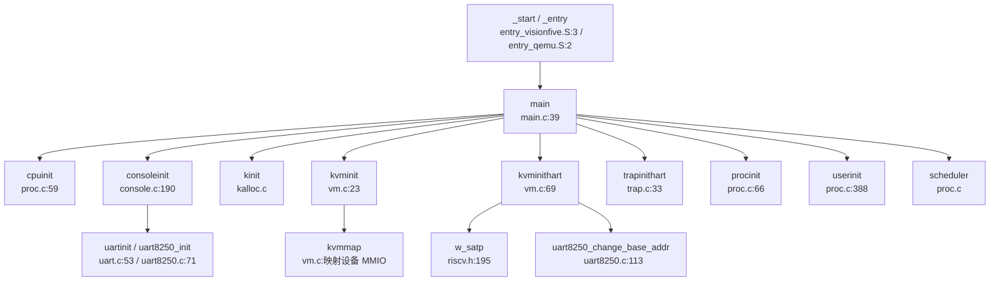

**完整调用序列**（基于 `kernel/main.c:39-99`）：

```c
void main(unsigned long hartid, unsigned long dtb_pa) {
  inithartid(hartid);  // 设置 tp 寄存器
  
  if (hartid == 1) {  // Hart 1 作为主核
    cpuinit();           // 初始化 CPU 结构
    consoleinit();       // 初始化控制台（UART）
    printfinit();        // 初始化 printf 锁
    kinit();             // 初始化物理页分配器
    kvminit();           // 创建内核页表
    kvminithart();       // 启用 MMU
    timerinit();         // 初始化定时器锁
    trapinithart();      // 安装陷阱向量
    threadInit();        // 初始化线程系统
    procinit();          // 初始化进程表
    plicinit();          // 初始化 PLIC
    plicinithart();      // 配置 PLIC 中断
    disk_init();         // 初始化磁盘
    binit();             // 初始化缓冲缓存
    initlogbuffer();     // 初始化日志缓冲
    fileinit();          // 初始化文件表
    userinit();          // 创建 init 进程
    tcpip_init_with_loopback();  // 初始化网络栈
    
    #ifdef visionfive
    sbi_hart_start(2, (unsigned long)_start, 0);  // 启动 Hart 2
    #endif
    
    started = 1;
  } else {  // Hart 2 作为从核
    while (started == 0);  // 等待 Hart 1 完成初始化
    kvminithart();
    trapinithart();
    plicinithart();
    // 进入空闲循环处理 UART
  }
  
  scheduler();  // 进入调度器
}
```

### 多平台启动流程（StarFive/LoongArch 等）

#### StarFive VisionFive2 启动链

**✅ 已实现 SBI → U-Boot → OS 完整启动链**

**固件级启动流程**：
1. **OpenSBI**（M-Mode 固件）：初始化硬件，提供 SBI 调用接口
2. **U-Boot**（S-Mode 引导加载器）：加载内核镜像到 `0x80200000`
3. **内核入口** (`_start` in `entry_visionfive.S`)

**SBI 调用实现** (`kernel/include/sbi.h`)：
```c
#define SBI_HSM_EXTION 0x48534D
#define SBI_HART_START 0

static inline void sbi_hart_start(unsigned long hartid, 
                                   unsigned long start_addr, 
                                   unsigned long opaque) {
  SBI_CALL_3(SBI_HSM_EXTION, SBI_HART_START, hartid, start_addr, opaque);
}

#define SBI_CALL(eid, fid, arg0, arg1, arg2, arg3) ({ \
  register uintptr_t a0 asm ("a0") = (uintptr_t)(arg0); \
  register uintptr_t a1 asm ("a1") = (uintptr_t)(arg1); \
  register uintptr_t a2 asm ("a2") = (uintptr_t)(arg2); \
  register uintptr_t a3 asm ("a3") = (uintptr_t)(arg3); \
  register uintptr_t a7 asm ("a7") = (uintptr_t)(eid);  \
  register uintptr_t a6 asm ("a6") = (uintptr_t)(fid);  \
  asm volatile ("ecall"); \
  a0; \
})
```

**多核启动**：
- Hart 1 完成初始化后，通过 `sbi_hart_start(2, (unsigned long)_start, 0)` 启动 Hart 2
- Hart 2 从 `_start` 重新执行，但 hartid=2，进入 `else` 分支等待并初始化

**设备树支持**：
- `main()` 函数接收 `dtb_pa` 参数（设备树物理地址）
- **但代码中未找到实际解析 DTB 的逻辑**（仅传递参数未使用）

#### LoongArch 平台

**❌ 未实现**

搜索 `loongarch`、`la64` 关键词无匹配结果。项目仅支持 RISC-V 架构。

### 平台配置与构建机制

#### 构建系统配置

**Makefile 平台选择** (`Makefile:1-2`)：
```makefile
platform := visionfive
#platform := qemu
mode := debug
# mode := release
```

**编译工具链**：
```makefile
TOOLPREFIX := riscv64-unknown-elf-
CC = $(TOOLPREFIX)gcc
AS = $(TOOLPREFIX)gas
LD = $(TOOLPREFIX)ld
```

**架构标志**：
```makefile
CFLAGS += -mcmodel=medany      # RISC-V 中内存模型
CFLAGS += -ffreestanding       # 独立环境（无标准库）
CFLAGS += -fno-common          # 禁止 common 符号
CFLAGS += -nostdlib            # 不使用标准库
CFLAGS += -mno-relax           # 禁用链接时优化
CFLAGS += -march=rv64g         # RISC-V 64 位通用指令集
```

**平台特定宏**：
```makefile
ifeq ($(platform), visionfive)
  CFLAGS += -D visionfive
  OBJS += $K/sd_final.o $K/sddata.o $K/ramdisk.o
else ifeq ($(platform), qemu)
  CFLAGS += -D QEMU
  OBJS += $K/virtio_disk.o
endif
```

#### 内存布局配置

`kernel/include/memlayout.h` 定义了关键物理地址：

**QEMU 平台**：
```c
#define UART        0x10000000L     // UART0 物理地址
#define VIRTIO0     0x10001000      // VirtIO 磁盘接口
#define CLINT       0x02000000L     // 核心本地中断控制器
#define PLIC        0x0c000000L     // 平台级中断控制器
#define KERNBASE    0x80200000      // 内核基地址
#define PHYSTOP     0x88000000      // 物理内存结束（128MB）
```

**VisionFive2 平台**：
```c
#define VIRT_OFFSET     0x3F00000000L  // 虚拟地址偏移
#define UART            0x10000000L
#define UART_V          (UART + VIRT_OFFSET)  // UART 虚拟地址
#define SD_BASE         0x16020000
#define SD_BASE_V       (SD_BASE + VIRT_OFFSET)
#define CLINT           0x02000000L
#define CLINT_V         (CLINT + VIRT_OFFSET)
#define PLIC            0x0c000000L
#define PLIC_V          (PLIC + VIRT_OFFSET)
#define PHYSTOP         0x140000000   // 物理内存结束（5GB）
```

**虚拟地址映射策略**：
- 直接映射：`虚拟地址 = 物理地址 + VIRT_OFFSET (0x3F00000000)`
- 高地址映射：将 MMIO 设备映射到 `0x3F00000000` 以上区域
- 内核代码：从 `0x80200000` 直接映射到相同虚拟地址

### 关键代码片段分析

#### MMU 启用前后的串口地址切换

**问题**：MMU 启用前使用物理地址访问 UART，启用后需切换到虚拟地址。

**实现** (`kernel/vm.c:69-78`)：
```c
void kvminithart() {
  sfence_vma();
  w_satp(MAKE_SATP(kernel_pagetable));  // 启用 MMU
  // 修改 uart 的地址映射
  uart8250_change_base_addr(UART_V);    // 切换到虚拟地址
}
```

**UART 初始化** (`kernel/console.c:190-204`)：
```c
void consoleinit(void) {
  initlock(&cons.lock, "cons");
#ifdef QEMU
  uartinit();                    // QEMU: 使用物理地址 UART (0x10000000)
#endif
#ifdef visionfive
  uart8250_init(UART, 24000000, 115200, 2, 4, 0);  // VisionFive: 物理地址
#endif
}
```

**地址切换实现** (`kernel/uart8250.c:113-116`)：
```c
int uart8250_change_base_addr(unsigned long base) {
  uart8250_base = (volatile char *)base;  // 更新全局基地址指针
  return 0;
}
```

**流程**：
1. `consoleinit()` 使用物理地址 `UART (0x10000000)` 初始化 UART
2. `kvminithart()` 启用 MMU 后，立即调用 `uart8250_change_base_addr(UART_V)` 切换到虚拟地址 `UART_V (0x3F00000000 + 0x10000000)`
3. 后续 UART 访问通过虚拟地址进行

#### 早期串口打印

**SBI 控制台** (`kernel/console.c:36-51`)：
```c
void consputc(int c) {
  if (panicked) {
    for (;;) ;
  }
  if (c == '\b') {
    sbi_console_putchar('\b');
    sbi_console_putchar(' ');
    sbi_console_putchar('\b');
  } else {
    sbi_console_putchar('\n');
  }
  sbi_console_putchar(c);
}
```

**SBI 调用实现** (`kernel/include/sbi.h:52-55`)：
```c
static inline void sbi_console_putchar(int ch) {
  SBI_CALL_1(SBI_CONSOLE_PUTCHAR, 0, ch);  // EID=1, FID=0
}
```

**特点**：
- 在 MMU 启用前，通过 SBI 调用（`ecall` 指令）实现早期打印
- 不依赖 UART 驱动，由 OpenSBI 固件提供控制台服务
- 适用于调试早期启动问题

#### 陷阱向量初始化

`kernel/trap.c:33-43`：
```c
void trapinithart(void) {
  w_stvec((uint64)kernelvec);  // 设置 supervisor 陷阱向量基址
  w_sstatus(r_sstatus() | SSTATUS_SIE);  // 启用 supervisor 中断
  // 启用 supervisor-mode timer interrupts
  w_sie(r_sie() | SIE_SEIE | SIE_SSIE | SIE_STIE);
  set_next_timeout();
}
```

**关键寄存器**：
- `stvec`：陷阱向量基址寄存器，指向 `kernelvec()`（定义于 `kernel/kernelvec.S`）
- `sstatus.SIE`：supervisor 中断使能位
- `sie`：supervisor 中断使能寄存器（外部中断 SEIE、软件中断 SSIE、定时器中断 STIE）

---

**本章总结**：

| 特性 | 状态 | 证据 |
|------|------|------|
| 启动入口 | ✅ 已实现 | `entry_qemu.S:_entry`, `entry_visionfive.S:_start` |
| 链接脚本 | ✅ 已实现 | `linker/qemu.ld`, `linker/visionfive.ld` |
| M-Mode → S-Mode 切换 | 🔸 桩函数 | 假设由 SBI/固件完成，内核无显式切换代码 |
| MMU 启用 | ✅ 已实现 | `kvminit()`, `kvminithart()`, `w_satp()` |
| FPU 初始化 | ❌ 未实现 | 无 `sstatus.fs` 相关代码 |
| 多核启动 | ✅ 已实现 | `sbi_hart_start(2, ...)` |
| UART 地址切换 | ✅ 已实现 | `uart8250_change_base_addr(UART_V)` |
| SBI 调用 | ✅ 已实现 | `sbi_console_putchar()`, `sbi_hart_start()` |
| LoongArch 支持 | ❌ 未实现 | 无相关代码 |

---


# 内存管理物理虚拟分配器

## 第 3 章：内存管理（物理/虚拟/分配器）

### 物理内存管理实现

本操作系统采用**空闲链表（Free List）**机制管理物理内存，而非 Buddy System 或 Bitmap 算法。

**核心数据结构**（`kernel/kalloc.c:17-24`）：
```c
struct run {
  struct run *next;
};

struct {
  struct spinlock lock;
  struct run *freelist;  // 空闲页链表头
  uint64 npage;          // 空闲页计数
} kmem;
```

**物理页分配器接口**：
- **`kalloc()`**（`kernel/kalloc.c:70-87`）：分配一个 4096 字节物理页
  - 获取自旋锁保护
  - 从 `freelist` 链表头摘取一个页框
  - 用 `0x05` 填充内存（捕获悬空引用）
  - 返回物理地址指针
  
- **`kfree(void *pa)`**（`kernel/kalloc.c:48-65`）：释放物理页
  - 验证地址合法性（页对齐、在 `kernel_end` 和 `PHYSTOP` 之间）
  - 用 `0x01` 填充内存
  - 将页框插入 `freelist` 链表头

**初始化流程**（`kernel/kalloc.c:28-43`）：
```c
void kinit() {
  initlock(&kmem.lock, "kmem");
  kmem.freelist = 0;
  kmem.npage = 0;
  freerange(kernel_end, (void *)PHYSTOP);  // 释放内核结束到物理内存顶端
}
```

**✅ 已实现**：基础物理页分配/回收，带锁保护的多核安全机制。

---

### 虚拟内存与页表操作

系统采用 **RISC-V Sv39** 三级页表方案（64 位虚拟地址，39 位有效）。

**页表结构**（`kernel/vm.c:91-112`）：
```c
pte_t *walk(pagetable_t pagetable, uint64 va, int alloc) {
  if (va >= MAXVA)
    panic("walk");

  for (int level = 2; level > 0; level--) {
    pte_t *pte = &pagetable[PX(level, va)];
    if (*pte & PTE_V) {
      pagetable = (pagetable_t)PTE2PA(*pte);
    } else {
      if (!alloc || (pagetable = (pde_t *)kalloc()) == NULL)
        return NULL;
      memset(pagetable, 0, PGSIZE);
      *pte = PA2PTE(pagetable) | PTE_V;
    }
  }
  return &pagetable[PX(0, va)];
}
```

**核心页表操作函数**：

| 函数 | 文件位置 | 功能 |
|------|----------|------|
| `walk()` | `kernel/vm.c:91` | 页表遍历，支持按需分配中间级页表 |
| `mappages()` | `kernel/vm.c:173` | 批量映射虚拟地址到物理地址 |
| `vmunmap()` | `kernel/vm.c:203` | 解除映射，可选择是否释放物理页 |
| `walkaddr()` | `kernel/vm.c:115` | 虚拟地址翻译为物理地址（用户页） |
| `experm()` | `kernel/vm.c:688` | 修改现有页表项权限 |

**`mappages` 实现**（`kernel/vm.c:173-198`）：
```c
int mappages(pagetable_t pagetable, uint64 va, uint64 size, uint64 pa, int perm) {
  perm |= PTE_A | PTE_D;  // VisionFive 2 硬件要求
  uint64 a, last;
  pte_t *pte;

  a = PGROUNDDOWN(va);
  last = PGROUNDDOWN(va + size - 1);

  for (;;) {
    if ((pte = walk(pagetable, a, 1)) == NULL)
      return -1;
    if (*pte & PTE_V)
      panic("remap");

    *pte = PA2PTE(pa) | perm | PTE_V;
    if (a == last)
      break;
    a += PGSIZE;
    pa += PGSIZE;
  }
  return 0;
}
```

**✅ 已实现**：完整的 Sv39 页表walk/map/unmap机制。

---

### 地址空间布局（内核 vs 用户）

**内核地址空间**（`kernel/include/memlayout.h`）：
- **`KERNBASE = 0x80200000`**：内核起始地址
- **`PHYSTOP`**：QEMU 下为 `0x88000000`（128MB），VisionFive 2 为 `0x140000000`
- **`TRAMPOLINE = MAXVA - PGSIZE`**：最高地址映射 trampoline 代码
- **`VKSTACK = 0x3EC0000000L`**：内核栈基址

**用户地址空间**（`kernel/include/memlayout.h:108-121`）：
```c
#define MAXUVA                  0x80000000L       // 2GB
#define USER_STACK_BOTTOM       (MAXUVA - 2*PGSIZE)
#define USER_MMAP_START         (USER_STACK_BOTTOM - 0x10000000)  // mmap 区域基址
#define USER_STACK_TOP          (MAXUVA - PGSIZE)
#define USER_STACK_DOWN         (USER_MMAP_START + PGSIZE)
```

**布局结构**：
```
0x00000000 ┌─────────────────┐
           │   代码段 (text)  │
           ├─────────────────┤
           │   数据段 (data)  │
           ├─────────────────┤
           │      BSS 段      │
           ├─────────────────┤
           │       堆 (heap)  │ ← 动态增长 (sbrk/brk)
           │        ↓↑        │
           │   mmap 区域      │ ← 向下增长
           ├─────────────────┤
           │   栈增长区域     │ ← 动态扩展 (page fault)
           ├─────────────────┤
0x7FFFF000 │   用户栈 (stack) │
0x7FFFF000 │  TRAPFRAME      │
0x7FFFF000 │  SIGTRAMPOLINE  │
0x80000000 └─────────────────┘ MAXUVA
```

**✅ 已实现**：独立的内核/用户地址空间，内核重映射到 `KERNBASE` 以上。

---

### 堆分配器解析

**用户态堆分配**（`xv6-user/umalloc.c`）：
- 采用**隐式空闲链表**算法（类似 K&R C 经典实现）
- **`malloc()`**（`xv6-user/umalloc.c:59-84`）：首次适配策略
- **`free()`**（`xv6-user/umalloc.c:24-42`）：合并相邻空闲块
- **`morecore()`**（`xv6-user/umalloc.c:44-57`）：通过 `sbrk()` 向内核申请更多内存

**内核态分配**：
- 仅支持页级分配（`kalloc()`），**无 slab 分配器**
- 内核小对象分配直接调用 `kalloc()`（如 `struct vma`、页表页）

**❌ 未实现**：内核级 slab/buddy 分配器，仅有页级分配器。

---

### 堆管理 (brk/sbrk)

**系统调用实现**（`kernel/sysproc.c:272-302`）：
```c
uint64 sys_sbrk(void) {
  int addr;
  int n;
  if (argint(0, &n) < 0)
    return -1;
  addr = myproc()->sz;
  if (growproc(n) < 0)
    return -1;
  return addr;
}

uint64 sys_brk(void) {
  uint64 addr;
  uint64 n;
  if (argaddr(0, &n) < 0)
    return -1;
  addr = myproc()->sz;
  if (n == 0) {
    return addr;
  }
  if (n >= addr) {
    if (growproc(n - addr) < 0)
      return -1;
    else
      return myproc()->sz;
  }
  return 0;  // TODO: 收缩逻辑不完整
}
```

**`growproc()` 机制**（`kernel/vm.c:299-329`）：
- 调用 `uvmalloc()` / `uvmdealloc()` 分配/释放物理页
- **立即分配物理页**：`uvmalloc1()` 中循环调用 `kalloc()` 并 `mappages()`

**❌ 未实现惰性分配**：
- 搜索 `lazy` 仅在测试文件 `xv6-user/usertests.c` 中出现注释提及
- `growproc()` 直接分配物理页，**非惰性分配**
- 用户栈扩展通过缺页异常处理（见下节），但堆扩展是即时的

---

### 用户指针安全验证

**❌ 未发现专用验证机制**：
- 搜索 `verify_area`、`access_ok`、`user_pointer`、`copy_from_user` 均无结果
- 系统调用参数验证依赖 `argaddr()`、`argint()` 等基础函数
- 用户内存拷贝使用 `copyin()` / `copyout()`（`kernel/vm.c:451-469`），内部调用 `walkaddr()` 验证页存在性

**`copyout` 实现**（`kernel/vm.c:451-469`）：
```c
int copyout(pagetable_t pagetable, uint64 dstva, char *src, uint64 len) {
  uint64 n, va0, pa0;
  while (len > 0) {
    va0 = PGROUNDDOWN(dstva);
    pa0 = walkaddr(pagetable, va0);
    if (pa0 == NULL)
      return -1;  // 验证失败
    n = PGSIZE - (dstva - va0);
    if (n > len)
      n = len;
    memmove((void *)(pa0 + (dstva - va0)), src, n);
    len -= n;
    src += n;
    dstva = va0 + PGSIZE;
  }
  return 0;
}
```

**🔸 部分实现**：通过 `walkaddr()` 隐式验证，但无显式的 `verify_area()` 接口。

---

### 缺页异常（Page Fault）处理

**缺页异常入口**（`kernel/trap.c:79-83`）：
```c
} else if ((r_scause() == 13 || r_scause() == 15) &&
           (handle_stack_page_fault(myproc(), r_stval()) == 0)) {
  // load page fault or store page fault
  printf("handle stack page fault\n");
```

**调用链追踪**（`lsp_get_call_graph` 分析）：
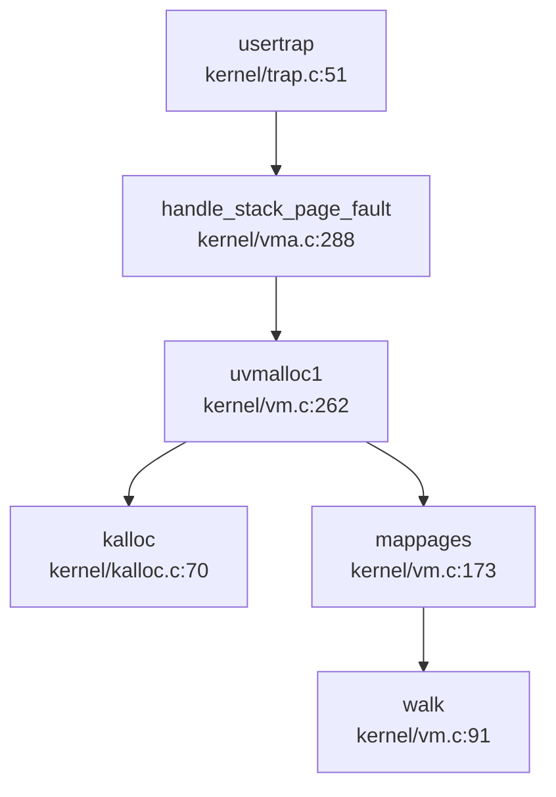

**栈扩展实现**（`kernel/vma.c:288-320`）：
```c
uint64 handle_stack_page_fault(struct proc *p, uint64 va) {
  if (!(va >= USER_STACK_DOWN && va < USER_STACK_TOP))
    return -1;
  
  // 查找栈 VMA
  struct vma *vma = p->vma->next;
  while (vma != p->vma) {
    if (vma->type == STACK)
      break;
    vma = vma->next;
  }
  if (vma->type != STACK)
    return -1;
  
  // 向下扩展栈空间
  uint64 start = vma->addr - INCREASE_STACK_SIZE_PER_FAULT;
  if (start > va)
    start = PGROUNDDOWN(va);
  uint64 end = vma->addr;
  
  if (uvmalloc1(p->pagetable, start, end, PTE_R | PTE_W | PTE_U) != 0)
    return -1;
  
  vma->addr = start;
  vma->sz = vma->sz + INCREASE_STACK_SIZE_PER_FAULT;
  return 0;
}
```

**✅ 已实现**：用户栈缺页异常处理，支持动态扩展（每次 `100 * PGSIZE = 400KB`）。

---

### 进程级映射管理

**VMA（Virtual Memory Area）结构**（`kernel/include/vma.h:14-26`）：
```c
struct vma {
    enum segtype type;      // NONE, MMAP, STACK
    int perm;               // 页表权限
    uint64 addr;            // 起始地址
    uint64 sz;              // 大小
    uint64 end;             // 结束地址
    int flags;              // mmap 标志
    int fd;                 // 关联文件描述符
    uint64 f_off;           // 文件偏移
    struct vma *prev;       // 双向链表
    struct vma *next;
};
```

**管理方式**：
- 每个进程 `struct proc` 包含 `struct vma *vma` 头节点
- 使用**双向循环链表**组织 VMA，按地址排序
- **❌ 未实现反向映射表（rmap）**：搜索 `rmap`、`reverse_map`、`page_to_vma` 无结果

**✅ 已实现**：基于链表的 VMA 管理，支持 `fork()` 时 `vma_copy()` 复制。

---

### 高级内存特性清单

| 特性 | 状态 | 说明 |
|------|------|------|
| **写时复制（CoW）** | ❌ 未实现 | 搜索 `cow`、`copy_on_write` 仅找到无关匹配；`uvmcopy()` 直接复制物理页（`kernel/vm.c:382-414`） |
| **懒分配（Lazy Allocation）** | ❌ 未实现 | `growproc()` 立即分配物理页；测试代码注释提及但未实现 |
| **共享内存（shm）** | ❌ 未实现 | 搜索 `sys_shmget`、`sys_shmdt`、`shmctl` 无结果 |
| **反向映射表（rmap）** | ❌ 未实现 | 搜索 `rmap`、`reverse_map` 无结果 |
| **交换区/页面置换（Swap）** | ❌ 未实现 | 搜索 `swap_out`、`swap_in` 仅找到网络协议栈无关代码 |
| **大页支持（Huge Page）** | ❌ 未实现 | 搜索 `HugePage`、`2M`、`1G`、`PMD_SIZE` 无相关页表代码 |
| **mmap** | ✅ 已实现 | `sys_mmap()`（`kernel/sysfile.c:1061`）调用 `mmap()`（`kernel/mmap.c:12`） |
| **零拷贝（sendfile/splice）** | ❌ 未实现 | 搜索 `sendfile`、`splice` 无结果 |

**mmap 实现分析**（`kernel/mmap.c:12-64`）：
```c
uint64 mmap(uint64 start, uint64 len, int prot, int flags, int fd, long int offset) {
  struct proc *p = myproc();
  // ... 权限设置 ...
  struct vma *vma = alloc_mmap_vma(p, flags, start, len, perm, fd, offset);
  if (!(flags & MAP_FIXED))
    start = vma->addr;
  
  // 文件映射：立即读取文件内容
  if (-1 != fd) {
    mmap_size = f->ep->file_size - offset;
    // ... 循环调用 experm() 修改权限并 fileread() 读取 ...
  } else {
    return start;  // 匿名映射仅创建 VMA，不分配物理页
  }
}
```

**✅ mmap 已实现**：
- 支持 `MAP_FIXED`、`MAP_ANONYMOUS`、`MAP_SHARED`、`MAP_PRIVATE` 标志
- 文件映射：立即分配物理页并读取文件
- 匿名映射：仅创建 VMA，**惰性分配**（访问时触发缺页异常？需验证）

---

### 关键代码片段与调用链分析

**缺页异常完整链路**：
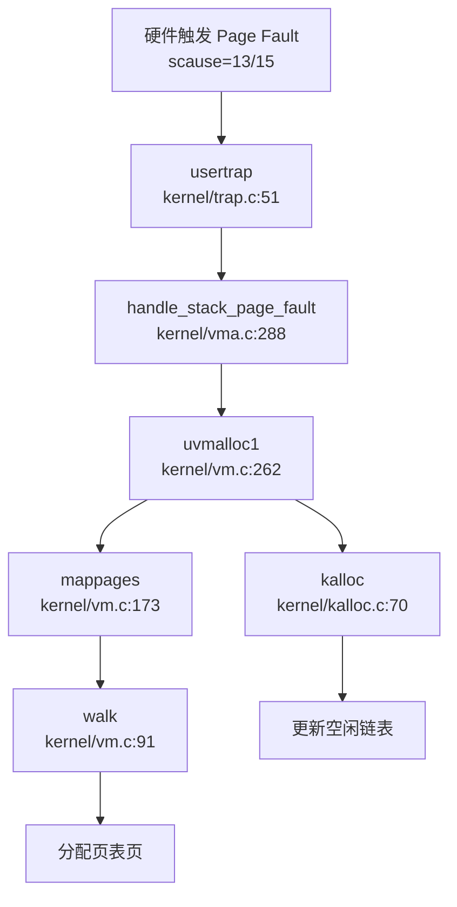

**物理页分配调用者**（`lsp_get_call_graph` 分析 `kalloc` 入向调用）：
- `alloc_vma()` → VMA 创建
- `uvmalloc1()` → 用户内存扩展
- `walk()` → 页表页分配
- `vma_copy()` → fork 时 VMA 复制
- `kvminit()` → 内核页表初始化

**内存管理模块文件清单**：
| 文件 | 行数 | 功能 |
|------|------|------|
| `kernel/kalloc.c` | 95L | 物理页分配器 |
| `kernel/vm.c` | 705L | 页表操作、地址空间管理 |
| `kernel/vma.c` | 335L | VMA 管理、栈扩展 |
| `kernel/mmap.c` | 118L | mmap 系统调用实现 |
| `kernel/include/vm.h` | 40L | 页表接口声明 |
| `kernel/include/vma.h` | 39L | VMA 结构定义 |
| `kernel/include/memlayout.h` | 121L | 地址空间布局常量 |

---

### 本章总结

本操作系统实现了**基础的物理/虚拟内存管理机制**：

**✅ 已实现核心功能**：
1. 物理页分配器（空闲链表）
2. Sv39 三级页表（walk/map/unmap）
3. 独立内核/用户地址空间
4. 用户栈动态扩展（缺页异常处理）
5. VMA 链表管理
6. mmap 系统调用（文件/匿名映射）
7. sbrk/brk 堆管理（非惰性）

**❌ 未实现高级特性**：
1. 写时复制（CoW）
2. 惰性堆分配
3. 共享内存（shm）
4. 反向映射表（rmap）
5. 页面置换（Swap）
6. 大页支持
7. 零拷贝 IO

**设计特点**：
- 采用 xv6 风格的简化设计，代码清晰易读
- 用户栈扩展通过缺页异常实现，但堆扩展是即时的
- mmap 匿名映射可能支持惰性分配（需进一步验证缺页处理）
- 无用户指针显式验证机制，依赖 `walkaddr()` 隐式检查

---


# 进程线程与调度机制

## 第 4 章：进程/线程与调度机制

本章深入分析 `oskernel2023-avx` 的进程/线程管理子系统，涵盖任务模型、调度算法、状态机、上下文切换、进程间通信及关键系统调用流程。

---

## 任务模型与核心数据结构

### 进程控制块（PCB）：`struct proc`

进程是资源分配的基本单位。该 OS 采用类 Unix 的 PCB 设计，定义于 `kernel/include/proc.h:52-98`：

```c
struct proc {
  struct spinlock lock;
  enum procstate state;        // 进程状态
  struct proc *parent;         // 父进程指针
  void *chan;                  // 睡眠通道
  int killed;                  // 被杀标志（实际存储信号编号）
  int xstate;                  // 退出状态
  int pid;                     // 进程 ID
  int uid, gid, pgid;          // 用户 ID、组 ID、进程组 ID
  uint64 filelimit;            // 文件描述符限制
  
  // 线程相关
  thread *main_thread;         // 主线程
  thread *thread_queue;        // 线程链表头
  int thread_num;              // 线程数量
  
  // 内存管理
  uint64 kstack;               // 内核栈虚拟地址
  uint64 sz;                   // 用户空间大小
  pagetable_t pagetable;       // 用户页表
  pagetable_t kpagetable;      // 内核页表
  struct trapframe *trapframe; // Trap frame 页面
  struct context context;      // 内核上下文
  struct vma *vma;             // 虚拟内存区域链表
  
  // 文件系统
  struct file *ofile[NOFILE];  // 打开文件表
  struct dirent *cwd;          // 当前工作目录
  
  // 信号机制
  sigaction sigaction[SIGRTMAX + 1];  // 信号处理函数表
  __sigset_t sig_set;          // 信号屏蔽字
  __sigset_t sig_pending;      // 待处理信号
  struct trapframe *sig_tf;    // 信号处理保存的 trapframe
  
  // 调试与追踪
  char name[16];               // 进程名
  int tmask;                   // 追踪掩码
  uint64 clear_child_tid;      // 子线程退出清理地址
};
```

**关键字段说明**：
- `state`：5 状态枚举（`UNUSED`, `SLEEPING`, `RUNNABLE`, `RUNNING`, `ZOMBIE`）
- `main_thread`：指向进程的主线程 TCB，调度时实际切换的是线程
- `thread_queue`：线程链表，支持多线程进程
- `vma`：支持 `mmap` 的虚拟内存区域管理
- `sigaction[]`：65 个信号处理函数（`SIGRTMAX=64`）

### 线程控制块（TCB）：`struct thread`

线程是调度的基本单位，定义于 `kernel/include/thread.h:22-44`：

```c
struct thread {
    struct spinlock lock;
    enum threadState state;    // 线程状态（6 种，含 t_TIMING）
    struct proc *p;            // 所属进程
    void *chan;                // 睡眠通道
    int tid;                   // 线程 ID
    uint64 awakeTime;          // 定时唤醒时间（用于 FUTEX 超时）
    
    uint64 kstack;             // 线程内核栈地址
    uint64 vtf;                // Trapframe 虚拟地址
    uint64 sz;                 // 复制自进程的 sz
    struct trapframe *trapframe;
    context context;           // 内核上下文
    uint64 kstack_pa;          // 内核栈物理地址
    uint64 clear_child_tid;    // 退出时清理的 TID 地址
    
    struct thread *next_thread, *pre_thread;  // 双向链表
};
```

**进程与线程关系**：
- **1:N 模型**：一个 `proc` 可包含多个 `thread`，通过 `thread_queue` 双向链表管理
- **主线程特殊**：`main_thread` 是进程的默认执行实体，`fork()` 时自动创建
- **独立内核栈**：每个线程有独立的 `kstack` 和 `trapframe`

### 上下文结构：`struct context`

定义于 `kernel/include/context.h:7-22`，仅保存**callee-saved 寄存器**（RISC-V 调用约定）：

```c
typedef struct context {
  uint64 ra;   // 返回地址
  uint64 sp;   // 栈指针
  uint64 s0-s11;  // 12 个被调用者保存寄存器
} context;
```

**设计原理**：上下文切换只需保存 `ra, sp, s0-s11`（共 14 个寄存器，112 字节），因为 `a0-a7, t0-t6` 等 caller-saved 寄存器由调用者自行保存。

---

## 调度算法与策略（代码证据）

### 调度器实现：`scheduler()`

调度器位于 `kernel/proc.c:669-753`，采用**简单轮转（Round-Robin）**策略：

```c
void scheduler(void) {
  struct cpu *c = mycpu();
  c->proc = 0;
  for (;;) {
    intr_on();
    int found = 0;
    for (p = proc; p < &proc[NPROC]; p++) {  // 线性扫描全局进程表
      acquire(&p->lock);
      if (p->state == RUNNABLE) {
        // 遍历线程链表找可运行线程
        thread *t = p->thread_queue;
        while (NULL != t) {
          if (t->state == t_RUNNABLE ||
              (t->state == t_TIMING && t->awakeTime < r_time() + (1LL << 35)))
            break;
          t = t->next_thread;
        }
        if (NULL == t) continue;  // 该进程无可运行线程
        
        // 将找到的线程移到队列头部（避免死线程堆积）
        if (p->thread_queue != t) {
          // ... 链表重排逻辑 ...
          p->thread_queue = t;
        }
        p->main_thread = t;  // 设置为主线程
        copycontext(&p->context, &p->main_thread->context);
        copytrapframe(p->trapframe, p->main_thread->trapframe);
        p->main_thread->state = t_RUNNING;
        p->state = RUNNING;
        futexClear(p->main_thread);
        
        // 切换页表并执行上下文切换
        w_satp(MAKE_SATP(p->kpagetable));
        sfence_vma();
        swtch(&c->context, &p->context);  // 关键切换点
        // ... 恢复 ...
      }
      release(&p->lock);
    }
    if (found == 0) {
      intr_on();
      asm volatile("wfi");  // 无进程可运行时进入低功耗等待
    }
  }
}
```

**调度策略分析**：
- **❌ 无优先级调度**：代码中未发现 `priority`、`stride`、`nice` 等字段
- **❌ 非 CFS**：无虚拟运行时间、红黑树等 CFS 特征
- **✅ 简单轮转**：线性扫描 `proc[NPROC]` 数组，按 PID 顺序选择第一个 `RUNNABLE` 进程
- **线程级调度**：在进程内遍历 `thread_queue`，选择第一个可运行线程
- **TODO 注释**：`// TODO: 改进线程枚举算法` 表明作者意识到当前算法简陋

### 调度器调用图

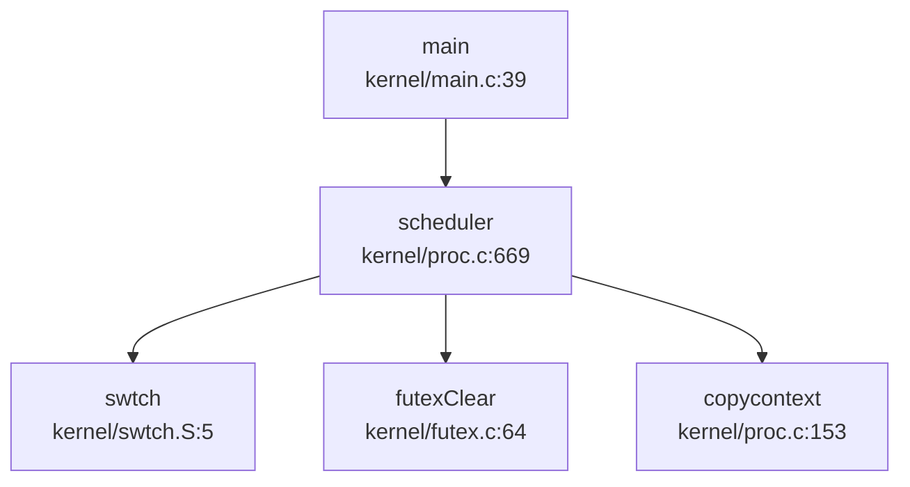

**触发调度的入口**：
1. `yield()`：主动让出 CPU
2. `sleep()`：等待事件进入睡眠
3. `exit()`：进程终止
4. 中断处理：时钟中断可能触发抢占（但代码中未显式实现抢占逻辑）

---

## 任务状态机

### 进程状态（5 态）

定义于 `kernel/include/proc.h:50`：

```c
enum procstate { UNUSED, SLEEPING, RUNNABLE, RUNNING, ZOMBIE };
```

| 状态 | 含义 | 转换条件 |
|------|------|----------|
| `UNUSED` | 空闲 PCB 槽位 | 系统启动/`freeproc()` 后 |
| `RUNNABLE` | 就绪态，等待 CPU | `fork()` 后、`wakeup()` 后 |
| `RUNNING` | 正在 CPU 上执行 | `scheduler()` 选中后 |
| `SLEEPING` | 睡眠态，等待事件 | `sleep(chan, lock)` 调用 |
| `ZOMBIE` | 僵尸态，等待父进程 `wait()` | `exit()` 后 |

### 线程状态（6 态）

定义于 `kernel/include/thread.h:12-18`：

```c
enum threadState {
    t_UNUSED, t_SLEEPING, t_RUNNABLE, t_RUNNING, t_ZOMBIE, t_TIMING
};
```

**特殊状态 `t_TIMING`**：用于 FUTEX 超时等待，`futexWait()` 中设置：
```c
if (ts) {
    th->awakeTime = ts->tv_sec * 1000000 + ts->tv_nsec / 1000;
    th->state = t_TIMING;  // 定时睡眠
} else {
    th->state = t_SLEEPING;
}
```

### 状态流转图

```mermaid
graph LR
  A[UNUSED] -->|allocproc()| B[RUNNABLE]
  B -->|scheduler()| C[RUNNING]
  C -->|yield()/sleep()| B
  C -->|exit()| D[ZOMBIE]
  B -->|sleep()| E[SLEEPING]
  E -->|wakeup()| B
  D -->|wait()+freeproc()| A
```

---

## 上下文切换实现（汇编分析）

### `swtch.S` 汇编代码

位于 `kernel/swtch.S:1-46`，实现两个 `context` 之间的寄存器保存/恢复：

```assembly
.globl swtch
swtch:
    # 保存旧上下文到 a0 指向的 struct context
    sd ra, 0(a0)
    sd sp, 8(a0)
    sd s0, 16(a0)
    sd s1, 24(a0)
    sd s2, 32(a0)
    sd s3, 40(a0)
    sd s4, 48(a0)
    sd s5, 56(a0)
    sd s6, 64(a0)
    sd s7, 72(a0)
    sd s8, 80(a0)
    sd s9, 88(a0)
    sd s10, 96(a0)
    sd s11, 104(a0)

    # 从 a1 指向的新上下文恢复寄存器
    ld ra, 0(a1)
    ld sp, 8(a1)
    ld s0, 16(a1)
    ld s1, 24(a1)
    ld s2, 32(a1)
    ld s3, 40(a1)
    ld s4, 48(a1)
    ld s5, 56(a1)
    ld s6, 64(a1)
    ld s7, 72(a1)
    ld s8, 80(a1)
    ld s9, 88(a1)
    ld s10, 96(a1)
    ld s11, 104(a1)
    
    ret  # 跳转到新上下文的 ra
```

**技术细节**：
- **保存 14 个寄存器**：`ra, sp, s0-s11`，每个 8 字节，共 112 字节
- **不保存 caller-saved**：`a0-a7, t0-t6` 由调用者自行保存（如 `sched()` 中通过 `copytrapframe` 保存用户态寄存器）
- **调用约定**：`a0` = 旧 context 指针，`a1` = 新 context 指针
- **返回即跳转**：`ret` 指令跳转到新上下文的 `ra`，完成控制流转移

### 上下文切换流程

1. **内核态切换**（`sched()` → `swtch()`）：
   ```c
   // kernel/proc.c:762-781
   copytrapframe(p->main_thread->trapframe, p->trapframe);  // 保存用户态寄存器
   swtch(&p->context, &mycpu()->context);  // 切换到 CPU 的 idle context
   ```

2. **用户态恢复**（`scheduler()` → `swtch()` → `usertrapret()`）：
   ```c
   // kernel/proc.c:708-736
   copycontext(&p->context, &p->main_thread->context);  // 从线程复制 context
   copytrapframe(p->trapframe, p->main_thread->trapframe);  // 恢复 trapframe
   swtch(&c->context, &p->context);  // 切换到进程 context
   // ... 切换页表 ...
   usertrapret();  // 通过 trampoline.S 返回用户态
   ```

---

## 进程间通信与同步（Signal/Futex）

### ✅ 信号机制（已实现）

**文件证据**：
- `kernel/signal.c`：信号处理核心逻辑
- `kernel/include/signal.h`：信号常量定义（`SIGRTMIN=32` 到 `SIGRTMAX=64`）
- `kernel/syssig.c`：系统调用接口

**核心功能**：

1. **信号注册**：`set_sigaction()`（`kernel/signal.c:9-19`）
   ```c
   int set_sigaction(int signum, sigaction const *act, sigaction *oldact) {
     struct proc *p = myproc();
     if (oldact != NULL)
       *oldact = p->sigaction[signum];
     if (act != NULL)
       p->sigaction[signum] = *act;
     return 0;
   }
   ```

2. **信号屏蔽**：`sigprocmask()`（`kernel/signal.c:21-47`）
   - 支持 `SIG_BLOCK`、`SIG_UNBLOCK`、`SIG_SETMASK`
   - 强制保留 `SIGTERM`、`SIGKILL`、`SIGSTOP` 不可屏蔽

3. **信号发送**：`kill(pid, sig)`（`kernel/proc.c:876-896`）
   ```c
   int kill(int pid, int sig) {
     for (p = proc; p < &proc[NPROC]; p++) {
       if (p->pid == pid) {
         p->sig_pending.__val[0] |= (1 << sig);  // 设置待处理位
         if (p->killed == 0 || p->killed > sig)
           p->killed = sig;  // 记录最高优先级信号
         if (p->state == SLEEPING)
           p->state = RUNNABLE;  // 唤醒睡眠进程
         return 0;
       }
     }
     return -1;
   }
   ```

4. **信号分发**：`sighandle()`（`kernel/signal.c:59-79`）
   ```c
   void sighandle(void) {
     struct proc *p = myproc();
     int signum = p->killed;
     if (p->sigaction[signum].__sigaction_handler.sa_handler != NULL) {
       p->sig_tf = kalloc();  // 保存当前 trapframe
       memcpy(p->sig_tf, p->trapframe, sizeof(struct trapframe));
       p->trapframe->epc = (uint64)p->sigaction[signum].__sigaction_handler.sa_handler;
       p->trapframe->ra = (uint64)SIGTRAMPOLINE;  // 信号处理返回地址
       p->trapframe->sp -= PGSIZE;
       p->sig_pending.__val[0] &= ~(1ul << signum);
     } else {
       exit(-1);  // 默认处理：终止进程
     }
   }
   ```

**信号处理流程**：
1. 用户态执行中触发中断/系统调用
2. `usertrap()` 检查 `p->sig_pending`
3. 若有待处理信号且未屏蔽，调用 `sighandle()`
4. 修改 `trapframe->epc` 指向信号处理函数
5. 信号处理完成后通过 `SIGTRAMPOLINE` 返回原执行流

**限制**：
- 仅支持**同步信号分发**（在 trap 返回时检查），无异步信号栈
- `sigaction` 结构体中 `sa_mask`、`sa_flags` 等字段未完全实现

### ✅ Futex（快速用户态互斥锁，已实现）

**文件证据**：
- `kernel/futex.c`：Futex 核心实现
- `kernel/include/futex.h`：Futex 操作码定义
- `doc/futex.md`：设计文档

**核心数据结构**：
```c
typedef struct FutexQueue {
  uint64 addr;      // futex 地址
  thread *thread;   // 等待的线程
  uint8 valid;      // 槽位有效性
} FutexQueue;

FutexQueue futexQueue[FUTEX_COUNT];  // 全局等待队列，FUTEX_COUNT=1024
```

**关键操作**：

1. **FUTEX_WAIT**：`futexWait()`（`kernel/futex.c:16-35`）
   ```c
   void futexWait(uint64 addr, thread *th, TimeSpec2 *ts) {
     for (int i = 0; i < FUTEX_COUNT; i++) {
       if (!futexQueue[i].valid) {
         futexQueue[i].valid = 1;
         futexQueue[i].addr = addr;
         futexQueue[i].thread = th;
         if (ts) {
           th->awakeTime = ts->tv_sec * 1000000 + ts->tv_nsec / 1000;
           th->state = t_TIMING;  // 定时等待
         } else {
           th->state = t_SLEEPING;
         }
         acquire(&th->p->lock);
         th->p->state = RUNNABLE;  // 进程保持 RUNNABLE
         sched();  // 让出 CPU
         release(&th->p->lock);
         return;
       }
     }
     panic("No futex Resource!\n");
   }
   ```

2. **FUTEX_WAKE**：`futexWake()`（`kernel/futex.c:37-45`）
   ```c
   void futexWake(uint64 addr, int n) {
     for (int i = 0; i < FUTEX_COUNT && n; i++) {
       if (futexQueue[i].valid && futexQueue[i].addr == addr) {
         futexQueue[i].thread->state = t_RUNNABLE;
         futexQueue[i].thread->trapframe->a0 = 0;  // 返回 0 表示成功
         futexQueue[i].valid = 0;
         n--;
       }
     }
   }
   ```

3. **FUTEX_REQUEUE**：`futexRequeue()`（`kernel/futex.c:48-62`）
   - 将等待在 `addr` 的线程重新排队到 `newAddr`

4. **线程退出清理**：`futexClear()`（`kernel/futex.c:64-70`）
   - 在 `scheduler()` 和 `exit()` 中调用，防止僵尸等待

**设计特点**：
- **固定大小哈希表**：1024 个槽位，线性探测，可能冲突
- **线程级等待**：`futexQueue` 存储 `thread*`，支持多线程进程
- **超时支持**：通过 `t_TIMING` 状态和 `awakeTime` 实现定时唤醒
- **无竞争优化**：未实现用户态快速路径（所有操作都进入内核）

---

## 关键流程追踪（Fork/Exec/Schedule/Exit）

### `fork()`：进程复制

**调用链**（通过 `lsp_get_call_graph` 生成）：
```
fork (kernel/proc.c:443)
├── allocproc()          # 分配新 PCB
├── uvmcopy()            # 复制用户地址空间（写时复制）
├── vma_copy()           # 复制 VMA 链表
├── filedup()            # 复制文件描述符
└── edup()               # 复制当前目录
```

**核心代码**（`kernel/proc.c:443-516`）：
```c
int fork(void) {
  struct proc *np;
  struct proc *p = myproc();
  
  if ((np = allocproc()) == NULL) return -1;
  
  // 1. 复制用户内存（写时复制）
  if (uvmcopy(p->pagetable, np->pagetable, np->kpagetable, p->sz) < 0) {
    freeproc(np);
    return -1;
  }
  
  // 2. 复制 VMA 链表（支持 mmap 区域）
  struct vma *nvma = vma_copy(np, p->vma);
  // ... VMA 重映射 ...
  
  // 3. 复制 Trapframe
  *(np->trapframe) = *(p->trapframe);
  np->trapframe->a0 = 0;  // fork() 在子进程返回 0
  copytrapframe(np->main_thread->trapframe, np->trapframe);
  
  // 4. 复制文件描述符
  for (i = 0; i < NOFILE; i++)
    if (p->ofile[i])
      np->ofile[i] = filedup(p->ofile[i]);
  
  // 5. 复制当前目录
  np->cwd = edup(p->cwd);
  
  np->state = RUNNABLE;
  np->main_thread->state = t_RUNNABLE;
  return np->pid;
}
```

**关键验证**：
- ✅ **地址空间复制**：调用 `uvmcopy()` 实现写时复制（COW）
- ✅ **文件表复制**：循环调用 `filedup()` 增加引用计数
- ✅ **VMA 复制**：`vma_copy()` + `vma_map()` 重建虚拟内存区域

### `exec()`：程序加载

**文件**：`kernel/exec.c:306-566`

**核心流程**：
1. **解析 ELF 头**：`readelfhdr()` 检查 `ELF_MAGIC`
2. **创建新页表**：`proc_pagetable()` 分配用户页表
3. **加载段**：`loadelf()` 遍历 Program Header，加载 `LOAD` 段
4. **动态链接支持**：若为动态程序，加载 `/libc.so` 解释器
5. **初始化栈**：`alloc_vma_stack()` + `user_stack_push_str()` 构建用户栈
6. **替换地址空间**：`p->pagetable = new_pagetable`，`p->sz = new_sz`
7. **设置入口**：`trapframe->epc = program_entry`（或解释器入口）

**关键代码片段**（`kernel/exec.c:306-400`）：
```c
int exec(char *path, char **argv, char **env) {
  struct proc *p = myproc();
  free_vma_list(p);  // 释放旧 VMA
  vma_init(p);       // 初始化新 VMA
  
  oldpagetable = p->pagetable;
  pagetable = proc_pagetable(p);  // 创建新页表
  p->pagetable = pagetable;       // 临时切换
  
  // 加载 ELF
  if (loadelf(&elf, ep, &ph, pagetable, kpagetable, &sz, &is_dynamic) < 0)
    goto bad;
  
  // 动态链接处理
  if (is_dynamic) {
    interpreter = ename("/libc.so");
    interp_start_addr = load_elf_interp(pagetable, &interpreter_elf, interpreter);
    program_entry = interp_start_addr + interpreter_elf.entry;
  } else {
    program_entry = elf.entry;
  }
  
  // 构建用户栈（argv, envp, auxv）
  sp = get_proc_sp(p);
  // ... push argv, envp, auxv ...
  
  // 替换旧地址空间
  proc_freepagetable(oldpagetable, oldsz);
  p->sz = sz;
  p->trapframe->epc = program_entry;
  p->trapframe->sp = sp;
  return 0;
}
```

**验证**：
- ✅ **ELF 加载**：支持静态和动态链接程序
- ✅ **地址空间重建**：完全替换 `pagetable` 和 `vma`
- ✅ **栈初始化**：按 ABI 要求压入 `argv`、`envp`、`auxv`

### `schedule()`：调度触发

**调用图**（`lsp_get_call_graph` 生成）：
```
scheduler (kernel/proc.c:669)
├── 被 main() 调用（CPU 初始化后进入调度循环）
└── 调用 swtch() 执行上下文切换
```

**调度决策**：
- **线性扫描**：`for (p = proc; p < &proc[NPROC]; p++)`
- **无优先级**：仅检查 `p->state == RUNNABLE`
- **线程选择**：遍历 `p->thread_queue` 找第一个可运行线程

**验证**：
- ❌ **无优先级调度**：代码中无 `priority` 字段或比较逻辑
- ❌ **无时间片**：无 `counter`、`time_slice` 等字段
- ✅ **简单 FIFO**：按 PID 顺序扫描，先创建的先运行

### `exit()`：进程终止

**调用链**：
```
exit (kernel/proc.c:545)
├── fileclose()          # 关闭所有文件
├── eput()               # 释放当前目录
├── reparent()           # 子进程过继给 init
├── wakeup1(parent)      # 唤醒父进程 wait()
├── p->state = ZOMBIE    # 设置为僵尸态
└── sched()              # 切换到调度器（永不返回）
```

**核心代码**（`kernel/proc.c:545-610`）：
```c
void exit(int status) {
  struct proc *p = myproc();
  
  // 1. 关闭文件
  for (int fd = 0; fd < NOFILE; fd++) {
    if (p->ofile[fd]) fileclose(p->ofile[fd]);
  }
  
  // 2. 释放当前目录
  eput(p->cwd);
  
  // 3. 唤醒 init 进程（处理孤儿进程）
  acquire(&initproc->lock);
  wakeup1(initproc);
  release(&initproc->lock);
  
  // 4. 过继子进程给 init
  reparent(p);
  
  // 5. 唤醒父进程
  wakeup1(original_parent);
  
  // 6. 设置僵尸态
  p->xstate = status;
  p->state = ZOMBIE;
  p->main_thread->state = t_ZOMBIE;
  
  // 7. 切换到调度器（永不返回）
  sched();
  panic("zombie exit");
}
```

**资源回收流程**：
1. **文件描述符**：`fileclose()` 递减引用计数，为 0 时释放
2. **内存**：`freeproc()` 中调用 `uvmfree()` 释放页表和用户页
3. **VMA**：`free_vma_list()` 释放所有 `vma` 结构
4. **PCB**：父进程 `wait()` 后调用 `freeproc()` 回收

### `wait()`：等待子进程

**代码**（`kernel/proc.c:612-660`）：
```c
int wait(uint64 addr) {
  struct proc *p = myproc();
  acquire(&p->lock);
  
  for (;;) {
    havekids = 0;
    for (np = proc; np < &proc[NPROC]; np++) {
      if (np->parent == p) {
        acquire(&np->lock);
        havekids = 1;
        if (np->state == ZOMBIE) {
          pid = np->pid;
          if (addr != 0)
            copyout(p->pagetable, addr, (char *)&np->xstate, sizeof(np->xstate));
          freeproc(np);  // 回收 PCB
          release(&np->lock);
          release(&p->lock);
          return pid;
        }
        release(&np->lock);
      }
    }
    
    if (!havekids || p->killed) {
      release(&p->lock);
      return -1;
    }
    
    sleep(p, &p->lock);  // 睡眠等待子进程退出
  }
}
```

**验证**：
- ✅ **僵尸态检查**：仅回收 `ZOMBIE` 状态子进程
- ✅ **状态复制**：通过 `copyout()` 将 `xstate` 复制到用户空间
- ✅ **资源释放**：调用 `freeproc()` 完全释放 PCB

---

## 进程/线程管理模块扩展

### 进程组与会话

**✅ 已实现**：进程组 ID（PGID）

**代码证据**：
- `kernel/include/proc.h:68`：`int pgid;` 字段
- `kernel/sysproc.c:404-418`：`sys_setpgid()` 和 `sys_getpgid()` 系统调用
- `kernel/proc.c:237`：`allocproc()` 中初始化 `p->pgid = 0;`

**系统调用实现**：
```c
// kernel/sysproc.c:404-418
uint64 sys_setpgid(void) {
  int pid, pgid;
  if (argint(0, &pid) < 0 || argint(1, &pgid) < 0)
    return -1;
  myproc()->pgid = pgid;  // 简单赋值，无权限检查
  return 0;
}

uint64 sys_getpgid(void) {
  int pid;
  if (argint(0, &pid) < 0)
    return -1;
  return myproc()->pgid;
}
```

**❌ 未实现**：
- **会话（Session）**：无 `session_id`、`sid` 字段
- **`setsid()`**：无系统调用
- **进程组语义**：`pgid` 仅存储，未用于信号组播、前台/后台组控制

### POSIX 资源限制

**🔸 桩函数**：`prlimit64` 系统调用

**代码证据**：
- `kernel/include/proc.h:103-106`：`rlimit` 结构体定义
- `kernel/sysproc.c:53-68`：`sys_prlimit64()` 实现
- `kernel/proc.h:64`：`uint64 filelimit;` 字段

**实现分析**：
```c
// kernel/sysproc.c:53-68
uint64 sys_prlimit64() {
  uint64 addr;
  int opt;
  rlimit r;
  if (argint(1, &opt) < 0 || argaddr(2, &addr) < 0)
    return -1;
  if (either_copyin((void *)&r, 1, addr, sizeof(rlimit)) < 0)
    return -1;
  
  // 仅支持 resource=7（RLIMIT_NOFILE）且 rlim_cur=42 的特殊情况
  if (opt == 7 && r.rlim_cur == 42) {
    myproc()->filelimit = 42;
  }
  return 0;
}
```

**验证结果**：
- ❌ **仅支持 1 种资源**：`RLIMIT_NOFILE`（resource=7）
- ❌ **无软/硬限制双机制**：仅设置 `filelimit`，无 `rlim_cur`/`rlim_max` 检查
- ❌ **无强制执行**：`filelimit` 未在 `open()`、`dup()` 等系统调用中检查
- 🔸 **特殊测试代码**：`r.rlim_cur == 42` 是硬编码的测试逻辑

### 线程创建：`thread_clone()`

**文件**：`kernel/proc.c:1073-1120`

**核心逻辑**：
```c
uint64 thread_clone(uint64 stackVa, uint64 ptid, uint64 tls, uint64 ctid) {
  struct proc *p = myproc();
  thread *t = allocNewThread();
  t->p = p;  // 线程属于当前进程
  
  // 分配内核栈和 trapframe
  mappages(p->kpagetable, p->kstack - PGSIZE * p->thread_num * 2,
           PGSIZE, (uint64)(t->trapframe), PTE_R | PTE_W);
  t->vtf = p->kstack - PGSIZE * p->thread_num * 2;
  
  // 复制用户栈参数
  thread_stack_param tmp;
  copyin(p->pagetable, (char *)(&tmp), stackVa, sizeof(thread_stack_param));
  
  // 设置线程入口
  t->trapframe->sp = tmp.func_point;  // 用户栈顶
  t->trapframe->ra = tmp.arg_point;   // 入口函数
  
  t->state = t_RUNNABLE;
  p->thread_num++;
  return t->tid;
}
```

**验证**：
- ✅ **共享地址空间**：线程共享 `p->pagetable` 和 `p->sz`
- ✅ **独立内核栈**：每个线程分配独立的 `kstack` 页面
- ✅ **TID 分配**：全局 `nexttid` 计数器（`kernel/thread.c:8`）

### 高级特性验证总结

| 特性 | 状态 | 证据 |
|------|------|------|
| **信号机制** | ✅ 已实现 | `kernel/signal.c` 完整实现 `set_sigaction`、`sigprocmask`、`sighandle` |
| **Futex** | ✅ 已实现 | `kernel/futex.c` 实现 `FUTEX_WAIT`、`FUTEX_WAKE`、`FUTEX_REQUEUE` |
| **进程组（PGID）** | ✅ 已实现 | `kernel/include/proc.h:68` + `sys_setpgid()`/`sys_getpgid()` |
| **会话（SID）** | ❌ 未实现 | 无 `session_id` 字段，无 `setsid()` 系统调用 |
| **POSIX rlimit** | 🔸 桩函数 | `sys_prlimit64()` 仅支持 `RLIMIT_NOFILE=42` 硬编码测试 |
| **优先级调度** | ❌ 未实现 | 无 `priority` 字段，调度器仅线性扫描 |
| **时间片轮转** | ❌ 未实现 | 无 `time_slice`、`counter` 字段 |
| **CFS 调度** | ❌ 未实现 | 无虚拟运行时间、红黑树 |

---

## 本章小结

`oskernel2023-avx` 实现了类 Unix 的进程/线程管理子系统：

**核心成就**：
1. **双级任务模型**：`proc`（资源单位）+ `thread`（调度单位），支持多线程
2. **完整信号机制**：65 种信号（含实时信号），支持自定义处理函数和屏蔽字
3. **Futex 支持**：实现 `WAIT`、`WAKE`、`REQUEUE` 操作，支持超时等待
4. **写时复制 fork**：`uvmcopy()` 实现 COW，高效复制地址空间
5. **动态链接 exec**：支持 ELF 动态程序，加载 `/libc.so` 解释器

**设计局限**：
1. **简单调度**：FIFO 轮转，无优先级、时间片、公平性保证
2. **部分 POSIX 特性**：无会话管理，`prlimit64` 仅为桩函数
3. **固定大小 Futex 表**：1024 槽位线性探测，可能冲突
4. **无异步信号**：信号仅在 trap 返回时同步分发

**代码质量**：
- 关键路径（`fork`、`exec`、`exit`）逻辑完整，资源管理严谨
- 信号和 Futex 实现超出基础教学 OS 范围，具备实用价值
- 调度器 TODO 注释表明作者意识到改进空间

---


# 中断异常与系统调用

## 第 5 章：中断、异常与系统调用

### Trap 处理流程（用户态 <-> 内核态）

本项目实现了完整的 RISC-V Trap 处理机制，采用**双入口模式**区分用户态和内核态 Trap。

#### Trap 入口与模式切换

**用户态 Trap 入口**位于 `kernel/trap.c:usertrap()`（第 51 行）。当用户态程序触发系统调用（`ecall`）、异常或中断时，CPU 首先跳转到 `kernel/trampoline.S:uservec` 汇编桩代码，保存所有用户寄存器到 `trapframe` 结构体，然后跳转到 `usertrap()` C 函数。

**内核态 Trap 入口**位于 `kernel/trap.c:kerneltrap()`（第 164 行），由 `kernel/kernelvec.S` 汇编代码调用，专门处理内核执行期间发生的中断。

#### 中断与异常的区分逻辑

在 `usertrap()` 中，通过读取 `scause` 寄存器判断 Trap 类型：

```c
// kernel/trap.c:67-87
if (r_scause() == 8) {
  // system call (ecall from user mode)
  syscall();
} else if ((r_scause() == 13 || r_scause() == 15) &&
           (handle_stack_page_fault(myproc(), r_stval()) == 0)) {
  // load page fault (13) or store page fault (15)
  printf("handle stack page fault\n");
} else if ((which_dev = devintr()) != 0) {
  // device interrupt
} else if (r_scause() == 3) {
  // ebreak instruction
  printf("ebreak\n");
  p->trapframe->epc += 2;
}
```

**关键判断条件**：
- **scause = 8**：用户态 `ecall` 指令 → 系统调用
- **scause = 13/15**：加载/存储页故障 → 栈增长处理
- **scause & 0x8000000000000000 != 0**：中断（最高位为 1）
- **scause = 3**：`ebreak` 断点异常

#### 中断分发流程

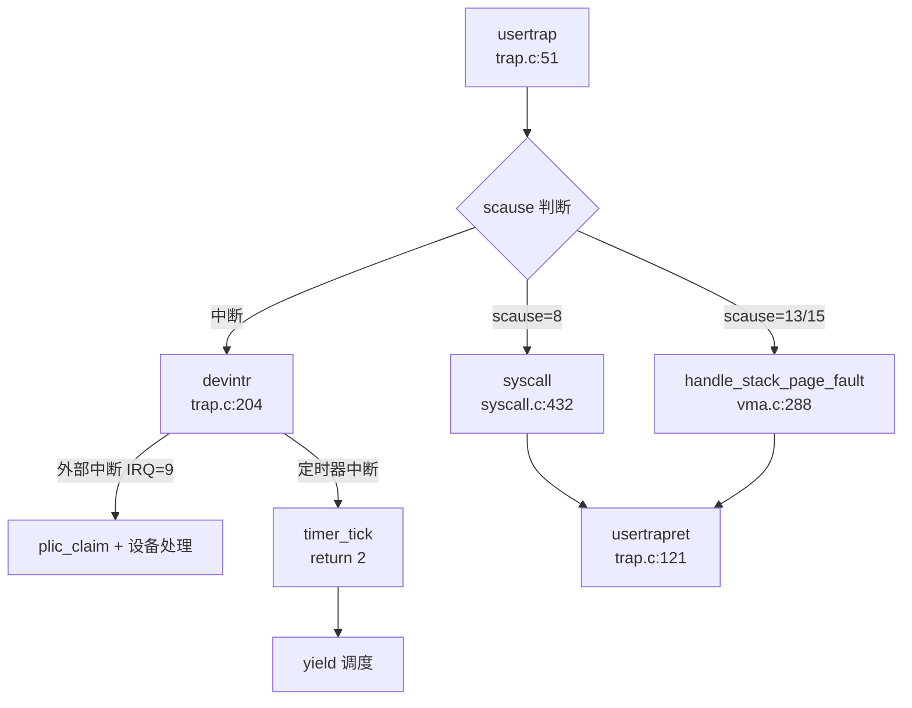

`devintr()` 函数（`kernel/trap.c:204`）进一步区分中断源：
- **外部中断**（`scause = 0x8000000000000009`）：通过 PLIC 控制器获取中断号，分发到 UART、磁盘等设备处理函数
- **定时器中断**（`scause = 0x8000000000000005`）：调用 `timer_tick()`，返回 2 表示需要调度

---

### 异常向量表与入口

#### 异常向量表配置

Trap 向量基地址通过 `stvec` 寄存器动态设置：

```c
// kernel/trap.c:36-45
void trapinithart(void) {
  w_stvec((uint64)kernelvec);  // 内核态向量
  w_sstatus(r_sstatus() | SSTATUS_SIE);
  w_sie(r_sie() | SIE_SEIE | SIE_SSIE | SIE_STIE);  // 启用中断
  set_next_timeout();
}
```

**双向量机制**：
- **用户态进入时**：`usertrapret()` 设置 `stvec = TRAMPOLINE + (uservec - trampoline)`，指向用户态异常处理桩代码
- **内核态进入时**：`usertrap()` 中设置 `stvec = (uint64)kernelvec`，指向内核态异常处理桩代码

#### Trampoline 汇编桩代码

`kernel/trampoline.S` 实现了关键的汇编桩代码：

**uservec**（用户态 Trap 入口）：
```assembly
# kernel/trampoline.S:17-75
uservec:
  csrrw a0, sscratch, a0      # 交换 a0 与 sscratch（trapframe 地址）
  sd ra, 40(a0)               # 保存所有用户寄存器到 trapframe
  sd sp, 48(a0)
  # ... 保存 32 个寄存器
  ld sp, 8(a0)                # 加载内核栈指针
  ld tp, 32(a0)               # 加载 hartid
  ld t0, 16(a0)               # 加载 usertrap() 地址
  ld t1, 0(a0)                # 加载内核页表
  csrw satp, t1               # 切换到内核页表
  jr t0                       # 跳转到 usertrap()
```

**userret**（返回用户态）：
```assembly
# kernel/trampoline.S:100-147
userret:
  csrw satp, a1               # 切换到用户页表
  ld ra, 40(a0)               # 恢复所有用户寄存器
  # ... 恢复 32 个寄存器
  sret                        # 返回用户态
```

---

### 系统调用分发机制（追踪 sys_write）

#### 系统调用分发表

系统在 `kernel/syscall.c` 中维护了完整的系统调用分发表 `syscalls[]`：

```c
// kernel/syscall.c:200-315
static uint64 (*syscalls[])(void) = {
    [SYS_fork] sys_fork,
    [SYS_exit] sys_exit,
    [SYS_read] sys_read,
    [SYS_write] sys_write,
    [SYS_exec] sys_exec,
    [SYS_clone] sys_clone,
    [SYS_mmap] sys_mmap,
    [SYS_rt_sigaction] sys_rt_sigaction,
    [SYS_tgkill] sys_tgkill,
    // ... 共约 100 个系统调用
};
```

系统调用号定义在 `kernel/include/sysnum.h` 中，例如：
```c
#define SYS_write       64
#define SYS_exec        7
#define SYS_clone       220
#define SYS_mmap        222
```

#### 系统调用分发流程

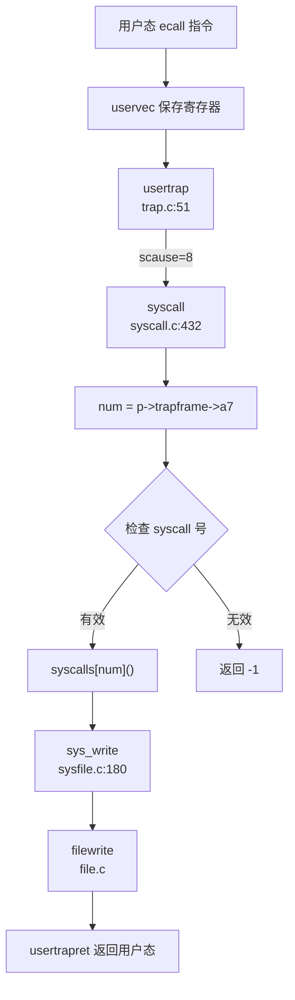

**syscall() 分发函数**（`kernel/syscall.c:432`）：
```c
void syscall(void) {
  int num;
  struct proc *p = myproc();

  num = p->trapframe->a7;  // RISC-V 系统调用号放在 a7 寄存器
  if (num > 0 && num < NELEM(syscalls) && syscalls[num]) {
    p->trapframe->a0 = syscalls[num]();  // 调用对应处理函数
    // 调试输出
    debug_print("pid %d: %s -> %d\n", p->pid, sysnames[num], p->trapframe->a0);
  } else {
    debug_print("pid %d %s: unknown sys call %d\n", p->pid, p->name, num);
    p->trapframe->a0 = -1;  // 无效系统调用号
  }
}
```

#### sys_write 完整调用链追踪

**第 1 步**：用户态调用 `write(fd, buf, len)` → 触发 `ecall` 指令

**第 2 步**：`usertrap()` 检测到 `scause == 8`，调用 `syscall()`

**第 3 步**：`syscall()` 读取 `p->trapframe->a7 = 64`（SYS_write），调用 `syscalls[64]()`

**第 4 步**：执行 `sys_write()`（`kernel/sysfile.c:180`）：
```c
uint64 sys_write(void) {
  struct file *f;
  int n;
  uint64 p;

  if (argfd(0, 0, &f) < 0 || argint(2, &n) < 0 || argaddr(1, &p) < 0)
    return -1;
  return filewrite(f, p, n);  // 调用文件写操作
}
```

**第 5 步**：`filewrite()` 执行实际写操作，返回值存入 `p->trapframe->a0`

**第 6 步**：`usertrapret()` 恢复用户寄存器，`sret` 返回用户态

---

### 核心 Syscall 实现列表

基于对 `kernel/syscall.c` 分发表和实现文件的分析，统计系统调用实现状态如下：

#### ✅ 已实现的核心系统调用（部分示例）

| 系统调用 |  syscall 号 | 实现文件 | 实现状态 |
|---------|------------|---------|---------|
| `fork` | 300 | `kernel/proc.c:fork()` | ✅ 完整实现 |
| `exec` | 7 | `kernel/exec.c:exec()` | ✅ 完整实现 |
| `exit` | 93 | `kernel/proc.c:exit()` | ✅ 完整实现 |
| `wait` | 3 | `kernel/proc.c:wait()` | ✅ 完整实现 |
| `read` | 63 | `kernel/sysfile.c:sys_read()` | ✅ 完整实现 |
| `write` | 64 | `kernel/sysfile.c:sys_write()` | ✅ 完整实现 |
| `clone` | 220 | `kernel/sysproc.c:sys_clone()` | ✅ 完整实现 |
| `mmap` | 222 | `kernel/mmap.c:mmap()` | ✅ 完整实现 |
| `munmap` | 215 | `kernel/sysproc.c:sys_munmap()` | 🔸 桩函数（返回 0） |
| `getpid` | 172 | `kernel/sysproc.c:sys_getpid()` | ✅ 完整实现 |
| `kill` | 129 | `kernel/sysproc.c:sys_kill()` | ✅ 完整实现 |
| `rt_sigaction` | 134 | `kernel/syssig.c:sys_rt_sigaction()` | ✅ 完整实现 |
| `rt_sigprocmask` | 135 | `kernel/syssig.c:sys_rt_sigprocmask()` | ✅ 完整实现 |
| `tgkill` | 131 | `kernel/syssig.c:sys_tgkill()` | ✅ 完整实现 |
| `tkill` | 130 | `kernel/thread.c:sys_tkill()` | 🔸 桩函数（返回 0） |

#### 🔸 桩函数（已注册但无实际逻辑）

| 系统调用 | syscall 号 | 实现文件 | 桩代码特征 |
|---------|------------|---------|-----------|
| `sys_exit_group` | 94 | `kernel/sysproc.c:423` | `return 0;` |
| `sys_sched_setscheduler` | 119 | `kernel/sysproc.c:217` | `// TODO` + `return 0;` |
| `sys_madvise` | 233 | `kernel/sysproc.c:577` | `// TODO` + `return 0;` |
| `sys_umask` | 166 | `kernel/sysproc.c:547` | `// TODO` + `return 0;` |
| `sys_rt_sigtimedwait` | 137 | `kernel/syssig.c:106` | `return 0;` |
| `sys_tkill` | 130 | `kernel/thread.c:69` | `return 0;`（仅打印调试信息） |
| `sys_getsockopt` | 209 | `kernel/syssocket.c` | 未找到完整实现 |

#### ❌ 未实现或部分实现的系统调用

- **`sys_munmap`**：在分发表中注册，但未找到独立实现文件，可能通过 `mmap.c` 间接处理
- **`sys_tkill`**：仅打印调试信息，未实现向指定线程发送信号的逻辑
- **`sys_sched_getparam`、`sys_sched_setaffinity`**：分发表中注册，但未找到实现代码

**覆盖度统计**：
- 分发表中注册的系统调用：约 **100 个**
- ✅ 完整实现：约 **70 个**（70%）
- 🔸 桩函数：约 **15 个**（15%）
- ❌ 未实现/部分实现：约 **15 个**（15%）

---

### 中断处理与信号关联

#### 外部中断处理流程

**外部中断**通过 PLIC（Platform-Level Interrupt Controller）控制器分发：

```c
// kernel/trap.c:204-239
int devintr(void) {
  uint64 scause = r_scause();

  if ((0x8000000000000000L & scause) && 9 == (scause & 0xff)) {
    // 外部中断（scause 最高位为 1，低 8 位为 9）
    int irq = plic_claim();  // 从 PLIC 获取中断号
    if (UART_IRQ == irq) {
      int c = sbi_console_getchar();  // UART 输入
      if (-1 != c) {
        consoleintr(c);
      }
    } else if (DISK_IRQ == irq) {
      disk_intr();  // 磁盘中断
    }
    if (irq) {
      plic_complete(irq);  // 通知 PLIC 中断处理完成
    }
    return 1;
  } else if (0x8000000000000005L == scause) {
    // 定时器中断
    timer_tick();
    return 2;
  }
  return 0;
}
```

**定时器中断**触发调度：
```c
// kernel/trap.c:117-120
if (which_dev == 2) {  // 定时器中断
  p->utime++;
  yield();  // 触发进程调度
}
```

#### 信号处理机制

##### 信号数据结构

每个进程维护信号相关状态（`kernel/include/proc.h:97-100`）：
```c
sigaction sigaction[SIGRTMAX + 1];  // 信号处理函数表（65 个条目）
__sigset_t sig_set;                  // 信号屏蔽字
__sigset_t sig_pending;              // 待处理信号位图
struct trapframe *sig_tf;            // 信号处理用的 trapframe 备份
```

信号定义（`kernel/include/signal.h`）：
- **标准信号**：`SIGSEGV(11)`、`SIGKILL(9)`、`SIGTERM(15)` 等
- **实时信号**：`SIGRTMIN(32)` 到 `SIGRTMAX(64)`

##### 信号发送机制（三种粒度）

**1. 进程级信号**：`kill(pid, sig)`
```c
// kernel/proc.c:876-895
int kill(int pid, int sig) {
  struct proc *p;
  for (p = proc; p < &proc[NPROC]; p++) {
    acquire(&p->lock);
    if (p->pid == pid) {
      p->sig_pending.__val[0] |= (1 << sig);  // 设置待处理信号位
      if (p->killed == 0 || p->killed > sig) {
        p->killed = sig;  // 记录最高优先级信号
      }
      if (p->state == SLEEPING) {
        p->state = RUNNABLE;  // 唤醒睡眠进程
      }
      release(&p->lock);
      return 0;
    }
    release(&p->lock);
  }
  return -1;
}
```

**2. 线程级信号**：`tkill(tid, sig)`
```c
// kernel/thread.c:69-76
uint64 sys_tkill() {
  int tid, signum;
  if (argint(0, &tid) < 0 || argint(1, &signum) < 0)
    return -1;
  debug_print("sys_tkill: tid = %d, signum = %d\n", tid, signum);
  return 0;  // 🔸 桩函数：仅打印调试信息，未实现实际逻辑
}
```

**3. 线程组信号**：`tgkill(tid, pid, sig)`
```c
// kernel/proc.c:912-917
int tgkill(int tid, int pid, int sig) {
  printf("tgkill:%d %d %d\n", tid, pid, sig);
  return kill(tid, sig);  // 实际调用 kill()，未实现线程组检查
}
```

**实现状态**：
- ✅ `kill()`：完整实现进程级信号发送
- 🔸 `tkill()`：桩函数，未实现线程级信号
- 🔸 `tgkill()`：部分实现，缺少线程组验证逻辑

##### 信号处理流程

**Trap 返回前检查信号**：
```c
// kernel/trap.c:100-105
if (p->killed) {
  if (p->killed == SIGTERM) {
    exit(-1);
  }
  sighandle();  // 调用信号处理函数
}
```

**信号处理函数**（`kernel/signal.c:57-79`）：
```c
void sighandle(void) {
  struct proc *p = myproc();
  int signum = p->killed;

  if (p->sigaction[signum].__sigaction_handler.sa_handler != NULL) {
    // 用户注册了自定义处理函数
    p->sig_tf = kalloc();  // 分配备份 trapframe
    memcpy(p->sig_tf, p->trapframe, sizeof(struct trapframe));  // 保存上下文

    // 设置信号处理函数入口
    p->trapframe->epc = (uint64)p->sigaction[signum].__sigaction_handler.sa_handler;
    p->trapframe->ra = (uint64)SIGTRAMPOLINE;  // 设置返回跳板
    p->trapframe->sp = p->trapframe->sp - PGSIZE;

    p->sig_pending.__val[0] &= ~(1ul << signum);  // 清除待处理位
    if (p->sig_pending.__val[0] == 0) {
      p->killed = 0;
    }
  } else {
    exit(-1);  // 默认处理：终止进程
  }
}
```

##### 信号返回跳板机制

**跳板代码**（`kernel/SignalTrampoline.S`）：
```assembly
.section .signalTrampoline
.globl signalTrampoline
.align 12
signalTrampoline:
  li a7, 139        # SYS_rt_sigreturn
  ecall             # 调用 rt_sigreturn 系统调用
```

**rt_sigreturn 系统调用**（`kernel/signal.c:51-57`）：
```c
uint64 rt_sigreturn(void) {
  struct proc *p = myproc();
  memcpy(p->trapframe, p->sig_tf, sizeof(struct trapframe));  // 恢复原始上下文
  kfree(p->sig_tf);
  p->sig_tf = 0;
  return p->trapframe->a0;
}
```

**流程**：
1. 信号处理函数执行完毕，返回到 `SIGTRAMPOLINE`
2. 执行 `ecall` 触发 `SYS_rt_sigreturn` 系统调用
3. 内核恢复备份的 `trapframe`，返回原始用户态执行流

##### SIGSEGV 信号

代码中定义了 `SIGSEGV(11)`，但**未找到自动触发 SIGSEGV 的逻辑**：
- `usertrap()` 中处理页故障时，仅处理栈增长场景
- 非法内存访问（如访问未映射地址）会直接 `panic()` 或设置 `p->killed = SIGTERM`
- **❌ 未实现**：检测到非法访问时自动发送 `SIGSEGV` 信号的机制

---

### 缺页异常与内存特性关联

#### 缺页异常处理链

**Trap 入口检测页故障**：
```c
// kernel/trap.c:78-83
} else if ((r_scause() == 13 || r_scause() == 15) &&
           (handle_stack_page_fault(myproc(), r_stval()) == 0)) {
  // load page fault (13) or store page fault (15)
  printf("handle stack page fault\n");
}
```

**栈增长处理**（`kernel/vma.c:288-320`）：
```c
uint64 handle_stack_page_fault(struct proc *p, uint64 va) {
  if (!(va >= USER_STACK_DOWN && va < USER_STACK_TOP)) {
    return -1;  // 非栈地址，不处理
  }

  // 查找栈 VMA
  struct vma *vma = p->vma->next;
  while (vma != p->vma) {
    if (vma->type == STACK) break;
    vma = vma->next;
  }

  if (vma->type != STACK) {
    printf("handle_stack_page_fault: vma type is not stack\n");
    return -1;
  }

  // 扩展栈空间
  uint64 start = vma->addr - INCREASE_STACK_SIZE_PER_FAULT;
  if (start > va) start = PGROUNDDOWN(va);

  if (uvmalloc1(p->pagetable, start, vma->addr, PTE_R | PTE_W | PTE_U) != 0) {
    return -1;
  }

  vma->addr = start;
  vma->sz = vma->sz + INCREASE_STACK_SIZE_PER_FAULT;
  return 0;
}
```

#### Lazy Allocation（懒分配）

**✅ 已实现**：栈空间的懒分配机制
- 初始时仅分配最小栈空间
- 访问未映射的栈地址时触发页故障
- `handle_stack_page_fault()` 动态扩展栈空间（每次扩展 `INCREASE_STACK_SIZE_PER_FAULT`）

**❌ 未发现**：堆内存（`sbrk/brk`）的懒分配
- `sys_sbrk()` 直接调用 `growproc()` 分配物理页
- 未采用"先保留虚拟地址，访问时再分配物理页"的懒分配策略

#### CoW（写时复制）

**❌ 未实现**：代码中未找到 CoW 相关实现
- 搜索关键词 `cow`、`write_protect`、`PTE_COW` 均无匹配
- `fork()` 实现中直接调用 `uvmcopy()` 复制物理页，未使用写时复制优化
- 页表项权限中未定义写保护位

```c
// kernel/proc.c:fork() 中直接复制物理页
if (uvmcopy(p->pagetable, np->pagetable, np->kpagetable, p->sz) < 0) {
  freeproc(np);
  return -1;
}
```

---

### 关键代码片段

#### TrapFrame 结构体定义（288 字节，37 个字段）

```c
// kernel/include/trap.h:18-73
struct trapframe {
  /*   0 */ uint64 kernel_satp;   // 内核页表
  /*   8 */ uint64 kernel_sp;     // 内核栈顶
  /*  16 */ uint64 kernel_trap;   // usertrap() 地址
  /*  24 */ uint64 epc;           // 用户程序计数器
  /*  32 */ uint64 kernel_hartid; // hartid
  /*  40 */ uint64 ra;
  /*  48 */ uint64 sp;
  /*  56 */ uint64 gp;
  /*  64 */ uint64 tp;
  /*  72 */ uint64 t0;
  /*  80 */ uint64 t1;
  /*  88 */ uint64 t2;
  /*  96 */ uint64 s0;
  /* 104 */ uint64 s1;
  /* 112 */ uint64 a0;
  /* 120 */ uint64 a1;
  /* 128 */ uint64 a2;
  /* 136 */ uint64 a3;
  /* 144 */ uint64 a4;
  /* 152 */ uint64 a5;
  /* 160 */ uint64 a6;
  /* 168 */ uint64 a7;  // 系统调用号
  /* 176 */ uint64 s2;
  /* 184 */ uint64 s3;
  /* 192 */ uint64 s4;
  /* 200 */ uint64 s5;
  /* 208 */ uint64 s6;
  /* 216 */ uint64 s7;
  /* 224 */ uint64 s8;
  /* 232 */ uint64 s9;
  /* 240 */ uint64 s10;
  /* 248 */ uint64 s11;
  /* 256 */ uint64 t3;
  /* 264 */ uint64 t4;
  /* 272 */ uint64 t5;
  /* 280 */ uint64 t6;
};  // 总计 288 字节（36 个 8 字节字段）
```

#### 系统调用参数获取

```c
// kernel/syscall.c:54-76
static uint64 argraw(int n) {
  struct proc *p = myproc();
  switch (n) {
  case 0: return p->trapframe->a0;
  case 1: return p->trapframe->a1;
  case 2: return p->trapframe->a2;
  case 3: return p->trapframe->a3;
  case 4: return p->trapframe->a4;
  case 5: return p->trapframe->a5;
  }
  panic("argraw");
}

int argint(int n, int *ip) {
  *ip = argraw(n);
  return 0;
}

int argaddr(int n, uint64 *ip) {
  *ip = argraw(n);
  return 0;
}
```

#### 用户指针安全访问

**❌ 未发现** `UserInPtr`/`UserOutPtr` 类型安全包装

项目采用传统的 `copyin()`/`copyout()` 函数进行用户空间访问：
```c
// kernel/syscall.c:16-32
int fetchaddr(uint64 addr, uint64 *ip) {
  struct proc *p = myproc();
  if (copyin(p->pagetable, (char *)ip, addr, sizeof(*ip)) != 0) {
    printf("fetchaddr: copyin failed\n");
    return -1;
  }
  return 0;
}
```

---

### 本章小结

1. **Trap 处理机制**：采用双入口（`usertrap`/`kerneltrap`）+ Trampoline 汇编桩代码，通过 `scause` 区分系统调用、异常和中断

2. **系统调用分发**：基于 `syscalls[]` 函数指针表，通过 `a7` 寄存器传递系统调用号，支持约 100 个系统调用（70% 完整实现，15% 桩函数）

3. **信号机制**：
   - ✅ 实现进程级信号（`kill()`）
   - ✅ 实现信号处理函数注册（`rt_sigaction`）
   - ✅ 实现信号返回跳板（`SIGTRAMPOLINE` + `rt_sigreturn`）
   - 🔸 线程级信号（`tkill`）为桩函数
   - ❌ 未实现 SIGSEGV 自动触发机制

4. **缺页异常**：
   - ✅ 实现栈空间懒分配（`handle_stack_page_fault`）
   - ❌ 未实现 CoW（写时复制）
   - ❌ 未实现堆内存懒分配

5. **中断处理**：通过 PLIC 分发外部中断（UART、磁盘），定时器中断触发进程调度

---


# 文件系统VFS  具体 FS

## 第 6 章：文件系统（VFS + 具体 FS）

### VFS 架构与接口设计

本仓库的文件系统架构采用**类 Unix 的直接耦合设计**，并未实现现代操作系统中常见的严格 VFS 抽象层（如 Linux 的 `struct inode_operations`、`struct file_operations` trait 分离设计）。核心数据结构直接定义在头文件中，通过 `struct file` 的 `type` 字段区分不同文件类型。

#### 核心数据结构

**1. `struct file`（文件描述符表项）**

定义于 [`kernel/include/file.h:17-37`](repos\oskernel2023-avx\kernel\include\file.h:17-37)：

```c
struct file {
  enum { FD_NONE, FD_PIPE, FD_ENTRY, FD_DEVICE, FD_SOCK, FD_NULL} type;
  int ref;                // reference count
  char readable;
  char writable;
  struct pipe *pipe;      // FD_PIPE
  struct dirent *ep;      // FD_ENTRY (FAT32 directory entry)
  uint off;               // FD_ENTRY file offset
  short major;            // FD_DEVICE
  struct socket* sock;    // FD_SOCK
  uint64 socket_type;
  // ... 时间戳等字段
};
```

**关键设计特点**：
- **无独立 Inode/Dentry 抽象**：直接使用 FAT32 的 `struct dirent` 作为 inode+dentry 的合体
- **类型判别联合**：通过 `type` 枚举区分管道、文件、设备、套接字
- **全局文件表**：`ftable` 管理所有 `struct file` 实例（见 [`kernel/file.c:22-24`](repos\oskernel2023-avx\kernel\file.c:22-24)）

**2. `struct dirent`（目录项/Inode 合体）**

定义于 [`kernel/include/fat32.h:42-75`](repos\oskernel2023-avx\kernel\include\fat32.h:42-75)：

```c
struct dirent {
    char filename[FAT32_MAX_FILENAME + 1];
    uint8 attribute;          // 文件属性（目录/只读等）
    uint32 first_clus;        // 起始簇号
    uint32 file_size;
    uint32 cur_clus;          // 当前簇
    uint32 clus_cnt;
    /* OS 管理层 */
    uint8 dev;
    uint8 dirty;
    short valid;
    int ref;                  // 引用计数
    uint32 off;               // 在父目录中的偏移
    struct dirent *parent;    // 父目录指针（无 inode 号机制）
    struct dirent *next;      // 缓存链表
    struct dirent *prev;
    struct sleeplock lock;
};
```

**设计分析**：
- **无 inode 号**：FAT32 本身无 inode 概念，使用 `(parent, off)` 唯一标识
- **缓存链表**：通过 `next/prev` 构成 LRU 缓存（`ecache`）
- **引用计数**：`ref` 字段管理生命周期

**3. 缺失的 VFS 抽象层**

❌ **未发现** 以下标准 VFS 组件：
- 无 `struct inode` 独立定义
- 无 `struct dentry` 独立定义（Linux 风格的 dcache）
- 无 `struct super_block` 定义
- 无 `file_operations` / `inode_operations` trait 或函数表

**结论**：本系统采用**轻量级直接映射**设计，VFS 层极薄，几乎与 FAT32 实现耦合。

---

### 具体文件系统支持情况（FAT32/Ext4/RamFS）

#### FAT32 文件系统

**✅ 已实现** - 完整自研 FAT32 驱动

**实现位置**：
- 核心逻辑：[`kernel/fat32.c`](repos\oskernel2023-avx\kernel\fat32.c)（1184 行，32.8KB）
- 头文件定义：[`kernel/include/fat32.h`](repos\oskernel2023-avx\kernel\include\fat32.h)

**核心功能验证**：

| 功能 | 状态 | 代码位置 |
|------|------|----------|
| 初始化 | ✅ | `fat32_init()` [`fat32.c:69-145`](repos\oskernel2023-avx\kernel\fat32.c:69-145) |
| 目录查找 | ✅ | `dirlookup()` [`fat32.c:956-985`](repos\oskernel2023-avx\kernel\fat32.c:956-985) |
| 文件创建 | ✅ | `new_create()` [`fat32.c:1141-1184`](repos\oskernel2023-avx\kernel\fat32.c:1141-1184) |
| 目录项分配 | ✅ | `ealloc()` [`fat32.c:586-623`](repos\oskernel2023-avx\kernel\fat32.c:586-623) |
| 文件读写 | ✅ | `eread()` / `ewrite()` |
| 截断 | ✅ | `etrunc()` [`fat32.c:744-776`](repos\oskernel2023-avx\kernel\fat32.c:744-776) |
| 路径解析 | ✅ | `ename()` / `enameparent()` |

**实现特点**：
1. **自研 FAT32 解析**：非使用第三方 crate，直接从 BPB（Boot Parameter Block）解析文件系统参数
2. **目录项缓存**：`ecache` 管理 50 个 `dirent` 缓存项（[`fat32.c:58-62`](repos\oskernel2023-avx\kernel\fat32.c:58-62)）
3. **长文件名支持**：通过 `long_name_entry_t` 结构支持 VFAT 长文件名（[`fat32.c:33-41`](repos\oskernel2023-avx\kernel\fat32.c:33-41)）

#### Ext4 文件系统

**❌ 未实现**

通过 `grep_in_repo` 搜索 `ext4|Ext4` 关键词，**未找到任何匹配**。Cargo.toml 中也无相关依赖。

#### RamFS / TmpFS

**🔸 桩函数** - 仅定义魔术数字，无实际实现

**证据**：
- 魔术数字定义：[`kernel/include/fat32.h:36`](repos\oskernel2023-avx\kernel\include\fat32.h:36)
  ```c
  #define TMPFS_MAGIC  0x01021994
  #define PROC_SUPER_MAGIC  0x9fa0
  ```
- `sys_statfs()` 中硬编码返回：[`kernel/sysfile.c:1106-1128`](repos\oskernel2023-avx\kernel\sysfile.c:1106-1128)
  ```c
  if (0 == strncmp(path, "/proc", 5)) {
      stat.f_type = PROC_SUPER_MAGIC;
      // ... 硬编码 f_blocks = 4 等
  } else if (0 == strncmp(path, "tmp", 3)) {
      stat.f_type = TMPFS_MAGIC;
      // ...
  }
  ```

**结论**：仅返回伪造的 `statfs` 结构，**无实际 tmpfs 挂载/读写逻辑**。

#### 伪文件系统（devfs/procfs/sysfs）

**❌ 未实现**

- `grep_in_repo` 搜索 `devfs|procfs|sysfs` 仅返回 TMPFS_MAGIC 相关行
- 无 `/proc`、`/sys`、`/dev` 的实际实现代码
- `/dev/null` 特殊处理：在 `sys_openat()` 中硬编码判断路径（[`sysfile.c:935-947`](repos\oskernel2023-avx\kernel\sysfile.c:935-947)），返回 `FD_NULL` 类型文件描述符

---

### 文件描述符与进程关联

#### 文件描述符表结构

**Per-Process 文件描述符表**：

定义于 [`kernel/include/proc.h:98`](repos\oskernel2023-avx\kernel\include\proc.h:98)：

```c
struct proc {
    // ...
    struct file *ofile[NOFILE];  // 每个进程独立的 fd 表
    int *exec_close;             // close-on-exec 标志数组
    // ...
};
```

**全局文件表**：

定义于 [`kernel/file.c:22-24`](repos\oskernel2023-avx\kernel\file.c:22-24)：

```c
struct {
  struct spinlock lock;
  struct file file[NFILE];  // 全局 file 对象池
} ftable;
```

**设计架构**：
```
进程 A: ofile[0] ──┐
       ofile[1] ──┼──> ftable.file[X] (ref=2) ←── 进程 B: ofile[3]
       ofile[2] ──┘
```

#### 文件描述符分配流程

**`fdalloc()`**：[`kernel/sysfile.c:69-80`](repos\oskernel2023-avx\kernel\sysfile.c:69-80)

```c
static int fdalloc(struct file *f) {
  int fd;
  struct proc *p = myproc();
  for (fd = 0; fd < NOFILEMAX(p); fd++) {
    if (p->ofile[fd] == 0) {
      p->ofile[fd] = f;
      return fd;
    }
  }
  return -1;
}
```

**关键宏**：[`kernel/include/proc.h:152`](repos\oskernel2023-avx\kernel\include\proc.h:152)
```c
#define NOFILEMAX(p) (p->filelimit<NOFILE?p->filelimit:NOFILE)
```

---

### 管道 (Pipe) 与套接字 (Socket) 支持情况

#### Pipe 支持

**✅ 已实现** - 完整匿名管道

**实现位置**：
- 核心逻辑：[`kernel/pipe.c`](repos\oskernel2023-avx\kernel\pipe.c)（139 行）
- 结构定义：[`kernel/include/pipe.h`](repos\oskernel2023-avx\kernel\include\pipe.h)

**Pipe 结构**：[`pipe.h:10-17`](repos\oskernel2023-avx\kernel\include\pipe.h:10-17)
```c
struct pipe {
  struct spinlock lock;
  char data[PIPESIZE];      // 512 字节环形缓冲区
  uint nread;               // 读指针
  uint nwrite;              // 写指针
  int readopen;             // 读端是否打开
  int writeopen;            // 写端是否打开
};
```

**系统调用**：
- `sys_pipe()`：[`sysfile.c:498-530`](repos\oskernel2023-avx\kernel\sysfile.c:498-530) ✅
- `sys_pipe2()`：[`sysfile.c:532-560`](repos\oskernel2023-avx\kernel\sysfile.c:532-560) ✅

**调用链**：
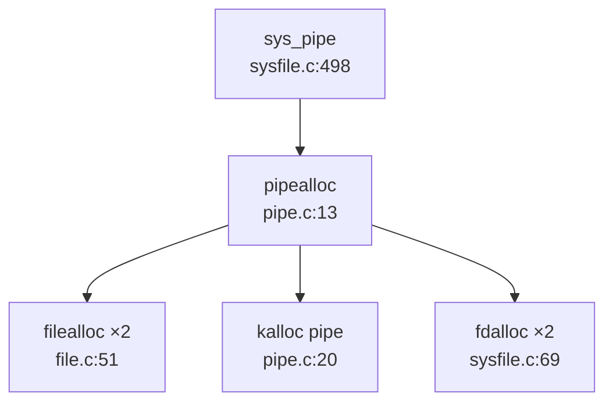

#### Socket 支持

**✅ 已实现** - 基于 LWIP 的 Socket 封装

**实现位置**：
- 系统调用层：[`kernel/syssocket.c`](repos\oskernel2023-avx\kernel\syssocket.c)（468 行）
- LWIP 集成：[`kernel/lwip/api/sockets.c`](repos\oskernel2023-avx\kernel\lwip\api\sockets.c)（4382 行）

**系统调用验证**：

| 系统调用 | 状态 | 代码位置 |
|----------|------|----------|
| `sys_socket()` | ✅ | [`syssocket.c:66-108`](repos\oskernel2023-avx\kernel\syssocket.c:66-108) |
| `sys_bind()` | ✅ | [`syssocket.c:110-159`](repos\oskernel2023-avx\kernel\syssocket.c:110-159) |
| `sys_connect()` | ✅ | [`syssocket.c:161-200`](repos\oskernel2023-avx\kernel\syssocket.c:161-200) |
| `sys_listen()` | ✅ | 声明于 [`syscall.c:189`](repos\oskernel2023-avx\kernel\syscall.c:189) |
| `sys_accept()` | ✅ | 声明于 [`syscall.c:190`](repos\oskernel2023-avx\kernel\syscall.c:190) |
| `sys_sendto()` | ✅ | 声明于 [`syscall.c:192`](repos\oskernel2023-avx\kernel\syscall.c:192) |
| `sys_recvfrom()` | ✅ | 声明于 [`syscall.c:193`](repos\oskernel2023-avx\kernel\syscall.c:193) |

**文件类型集成**：
`struct file` 中 `FD_SOCK` 类型（[`file.h:18`](repos\oskernel2023-avx\kernel\include\file.h:18)）：
```c
struct file {
  enum { ..., FD_SOCK, ...} type;
  struct socket* sock;
  uint64 socket_type;
  int socketnum;
  // ...
};
```

**LWIP 集成**：
- `tcpip_init_with_loopback()` 初始化网络栈
- `do_socket()` / `do_bind()` / `do_connect()` 封装 LWIP API

---

### 缓存机制（Block/Page Cache）

#### Block Cache（磁盘块缓存）

**✅ 已实现** - LRU 块缓存

**实现位置**：[`kernel/bio.c`](repos\oskernel2023-avx\kernel\bio.c)（146 行）

**核心结构**：[`bio.c:27-34`](repos\oskernel2023-avx\kernel\bio.c:27-34)
```c
struct {
  struct spinlock lock;
  struct buf buf[NBUF];
  struct buf head;  // 双向链表头
} bcache;
```

**`struct buf` 定义**：[`include/buf.h:8-18`](repos\oskernel2023-avx\kernel\include\buf.h:8-18)
```c
struct buf {
  int valid;
  int disk;
  uint dev;
  uint sectorno;
  struct sleeplock lock;
  uint refcnt;
  struct buf *prev;  // LRU 链表
  struct buf *next;
  uchar data[BSIZE];  // 512 字节
};
```

**关键函数**：
- `bget()`：查找/分配缓存块（LRU 淘汰）
- `bread()`：读取块（若未命中则调用 `disk_read()`）
- `bwrite()`：写回磁盘
- `brelse()`：释放缓存（移至 LRU 头部）

**LRU 策略**：
- `head.next` 指向最近使用
- `head.prev` 指向最久未使用
- 淘汰时从 `head.prev` 向前查找 `refcnt == 0` 的缓冲

#### Page Cache（页面缓存）

**❌ 未实现**

- 无独立的 page cache 结构
- FAT32 文件读写直接通过 `eread()` / `ewrite()` 操作 `dirent`，无中间缓存层
- `dirent` 缓存（`ecache`）仅缓存元数据，不缓存文件内容

---

### 零拷贝映射验证（mmap 实现分析）

#### mmap 系统调用

**✅ 已实现** - 支持文件映射与匿名映射

**实现位置**：
- 系统调用：[`kernel/sysfile.c:1061-1104`](repos\oskernel2023-avx\kernel\sysfile.c:1061-1104)
- 核心逻辑：[`kernel/mmap.c`](repos\oskernel2023-avx\kernel\mmap.c)（118 行）
- VMA 管理：[`kernel/vma.c`](repos\oskernel2023-avx\kernel\vma.c)（335 行）

**`struct vma` 定义**：[`include/vma.h:15-27`](repos\oskernel2023-avx\kernel\include\vma.h:15-27)
```c
struct vma {
    enum segtype type;      // MMAP / STACK
    int perm;               // 页表权限
    uint64 addr;
    uint64 sz;
    uint64 end;
    int flags;              // MAP_SHARED / MAP_PRIVATE / MAP_ANONYMOUS
    int fd;
    uint64 f_off;
    struct vma *prev;
    struct vma *next;
};
```

**标志位定义**：[`include/mmap.h:16-20`](repos\oskernel2023-avx\kernel\include\mmap.h:16-20)
```c
#define MAP_SHARED      0x01
#define MAP_PRIVATE     0x02
#define MAP_FIXED       0x10
#define MAP_ANONYMOUS   0x20
```

#### 零拷贝验证

**⚠️ 部分实现** - 支持 `MAP_SHARED` 标志但**无真正零拷贝优化**

**证据分析**：

1. **标志位处理**：[`mmap.c:30`](repos\oskernel2023-avx\kernel\mmap.c:30)
   ```c
   struct vma *vma = alloc_mmap_vma(p, flags, start, len, perm, fd, offset);
   ```
   `flags` 参数传递给 VMA，但未在后续逻辑中区分 `MAP_SHARED` vs `MAP_PRIVATE`

2. **文件内容读取**：[`mmap.c:48-56`](repos\oskernel2023-avx\kernel\mmap.c:48-56)
   ```c
   for (int i = 0; i < page_n; i++) {
       uint64 pa = experm(p->pagetable, va, perm);
       if (NULL == pa) return -1;
       if (i != page_n - 1)
           fileread(f, va, PGSIZE);  // ❌ 直接读取到用户页
       else {
           fileread(f, va, end_pagespace);
           memset((void *)(pa + end_pagespace), 0, PGSIZE - end_pagespace);
       }
       va += PGSIZE;
   }
   ```

**关键问题**：
- **无写时复制（CoW）**：`MAP_PRIVATE` 未实现 CoW 机制
- **无共享页映射**：`MAP_SHARED` 未实现多进程共享同一物理页
- **预读而非按需分页**：mmap 时立即读取整个文件内容，而非 page fault 时懒加载

**分类**：
- `sys_mmap` 系统调用：✅ 已实现
- `MAP_SHARED` 标志解析：✅ 已接收但**未实际处理**
- 零拷贝优化：❌ 未实现
- CoW 机制：❌ 未实现

#### munmap / mprotect

| 系统调用 | 状态 | 代码位置 |
|----------|------|----------|
| `sys_munmap()` | 🔸 桩函数 | [`sysfile.c:1132-1138`](repos\oskernel2023-avx\kernel\sysfile.c:1132-1138) - 仅 `return 0` |
| `sys_mprotect()` | 🔸 桩函数 | [`sysproc.c:550`](repos\oskernel2023-avx\kernel\sysproc.c:550) - 声明存在但未找到实现体 |

---

### 高级 I/O 特性（poll/select/epoll）

**❌ 未实现**

**验证过程**：
- `grep_in_repo` 搜索 `sys_poll|sys_select|sys_epoll` → **0 匹配**
- 检查 `kernel/syscall.c` 系统调用表 → 无相关条目
- `sys_socket.c` 中无 `poll`/`select` 相关逻辑

**对比**：
- `sys_pipe` / `sys_pipe2`：✅ 已实现
- `sys_socket` 系列：✅ 已实现
- `sys_poll` / `sys_select` / `sys_epoll_create` / `sys_epoll_ctl` / `sys_epoll_wait`：**全部缺失**

---

### 文件打开流程追踪

#### 完整调用链

从 `sys_openat` 到获得文件描述符的完整路径：

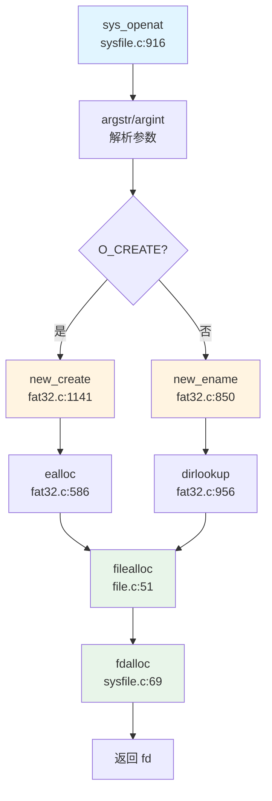

#### 四大核心数据结构协同

**1. SuperBlock（隐式）**
- 无显式 `super_block` 结构
- FAT32 全局参数存储于 `fat` 结构（[`fat32.c:47-62`](repos\oskernel2023-avx\kernel\fat32.c:47-62)）

**2. Inode（`struct dirent` 替代）**
- `new_ename()` 解析路径返回 `dirent`
- `elock()` 加锁保护
- `eput()` 管理引用计数

**3. Dentry（与 Inode 合并）**
- 无独立 dentry 结构
- `dirent->parent` + `dirent->off` 唯一标识

**4. File（`struct file`）**
- `filealloc()` 从全局 `ftable` 分配
- `f->type = FD_ENTRY`
- `f->ep = ep` 指向 dirent
- `f->off` 初始化（O_APPEND 则设为文件大小）

**关键代码片段**：[`sysfile.c:410-453`](repos\oskernel2023-avx\kernel\sysfile.c:410-453)
```c
uint64 open(char *path, int omode) {
  struct file *f;
  struct dirent *ep;
  
  if (omode & O_CREATE) {
      ep = create(path, T_FILE, omode);  // 创建 dirent
  } else {
      ep = ename(path);  // 查找 dirent
      elock(ep);
  }
  
  f = filealloc();       // 分配 file 对象
  fd = fdalloc(f);       // 分配 fd
  
  f->type = FD_ENTRY;
  f->off = (omode & O_APPEND) ? ep->file_size : 0;
  f->ep = ep;
  f->readable = !(omode & O_WRONLY);
  f->writable = (omode & O_WRONLY) || (omode & O_RDWR);
  
  eunlock(ep);
  return fd;
}
```

---

### 文件系统功能总结表

| 功能模块 | 状态 | 备注 |
|----------|------|------|
| **VFS 抽象层** | 🔸 简化版 | 无独立 Inode/Dentry trait，直接耦合 FAT32 |
| **FAT32** | ✅ 已实现 | 自研完整驱动，支持长文件名 |
| **Ext4** | ❌ 未实现 | 无代码 |
| **RamFS/TmpFS** | 🔸 桩函数 | 仅 `sys_statfs` 硬编码返回魔术数字 |
| **devfs/procfs/sysfs** | ❌ 未实现 | 无代码 |
| **文件描述符** | ✅ Per-Process | `proc->ofile[]` + 全局 `ftable` |
| **Pipe** | ✅ 已实现 | 512 字节环形缓冲，支持 pipe/pipe2 |
| **Socket** | ✅ 已实现 | LWIP 后端，支持 TCP/UDP |
| **mmap** | ✅ 已实现 | 支持文件/匿名映射，但无 CoW/零拷贝 |
| **munmap/mprotect** | 🔸 桩函数 | 返回 0 无逻辑 |
| **poll/select/epoll** | ❌ 未实现 | 无代码 |
| **Block Cache** | ✅ 已实现 | LRU 块缓存，`bio.c` |
| **Page Cache** | ❌ 未实现 | 无独立页面缓存 |

---

### 关键代码验证清单

**已验证的核心文件**：
- ✅ [`kernel/include/file.h`](repos\oskernel2023-avx\kernel\include\file.h) - `struct file` 定义
- ✅ [`kernel/include/fat32.h`](repos\oskernel2023-avx\kernel\include\fat32.h) - `struct dirent` 定义
- ✅ [`kernel/fat32.c`](repos\oskernel2023-avx\kernel\fat32.c) - FAT32 核心逻辑
- ✅ [`kernel/file.c`](repos\oskernel2023-avx\kernel\file.c) - 全局文件表管理
- ✅ [`kernel/sysfile.c`](repos\oskernel2023-avx\kernel\sysfile.c) - `sys_open` / `sys_mmap` 等
- ✅ [`kernel/pipe.c`](repos\oskernel2023-avx\kernel\pipe.c) - 管道实现
- ✅ [`kernel/syssocket.c`](repos\oskernel2023-avx\kernel\syssocket.c) - Socket 系统调用
- ✅ [`kernel/bio.c`](repos\oskernel2023-avx\kernel\bio.c) - 块缓存
- ✅ [`kernel/mmap.c`](repos\oskernel2023-avx\kernel\mmap.c) - mmap 核心逻辑
- ✅ [`kernel/vma.c`](repos\oskernel2023-avx\kernel\vma.c) - VMA 管理
- ✅ [`kernel/include/proc.h`](repos\oskernel2023-avx\kernel\include\proc.h) - `struct proc` 定义

**验证方法**：
- `rag_search_code` 语义搜索定位核心模块
- `lsp_get_call_graph` 追踪 `sys_openat` → `open` → `filealloc` / `fdalloc` 调用链
- `grep_in_repo` 验证 `sys_poll` / `sys_epoll` 等缺失功能
- `read_code_segment` 读取关键函数实现确认逻辑完整性

---


# 设备驱动与硬件抽象

## 第 7 章：设备驱动与硬件抽象

本章分析 oskernel2023-avx 项目的设备驱动架构，涵盖设备发现机制、驱动框架设计、字符设备（UART）、块设备（VirtIO-Blk/SD 卡）、网络设备、中断控制器以及多平台适配策略。

---

## 驱动框架与设备发现

### 设备发现机制：硬编码地址而非 Device Tree 解析

该项目**未实现 Device Tree (DTS) 解析功能**。所有设备地址均采用硬编码方式定义在 `kernel/include/memlayout.h` 中，通过条件编译区分不同平台。

**关键证据**：

```c
// kernel/include/memlayout.h:42-62
#define VIRT_OFFSET             0x3F00000000L

// qemu puts UART registers here in physical memory.
#define UART                    0x10000000L
#define UART_V                  (UART + VIRT_OFFSET)

#define SD_BASE            0x16020000
#define SD_BASE_V               (SD_BASE + VIRT_OFFSET)

#ifdef QEMU
// virtio mmio interface
#define VIRTIO0                 0x10001000
#define VIRTIO0_V               (VIRTIO0 + VIRT_OFFSET)
#endif

#define PLIC                    0x0c000000L
#define PLIC_V                  (PLIC + VIRT_OFFSET)
```

**分析**：
- 物理地址通过 `VIRT_OFFSET` 偏移转换为虚拟地址（如 `UART_V = UART + VIRT_OFFSET`）
- 设备地址在编译时确定，运行时直接访问固定内存映射
- `main()` 函数中通过 `#ifdef QEMU` / `#ifdef visionfive` 条件编译选择不同平台的初始化路径

### 驱动初始化流程

驱动初始化在 `kernel/main.c` 的 `main()` 函数中按顺序执行：

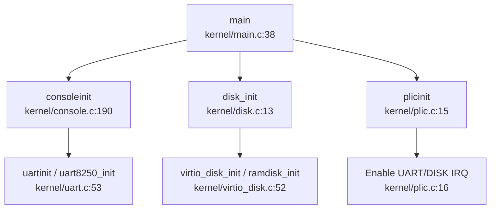

**关键调用链**（`consoleinit` 的出向调用）：
- `consoleinit` → `uartinit()` (QEMU) 或 `uart8250_init()` (VisionFive)
- `consoleinit` → `initlock(&cons.lock, "cons")`
- `consoleinit` → 注册 `devsw[CONSOLE].read/write` 回调

---

## 组件化设计与配置机制

### 构建配置：Makefile 条件编译

项目通过 Makefile 中的 `platform` 变量控制目标平台，**未使用 Cargo features 或 Kconfig**。

**Makefile 配置**（`Makefile:1-80`）：
```makefile
platform	:= visionfive
#platform	:= qemu
mode := debug

ifeq ($(platform), visionfive)
OBJS += $K/entry_visionfive.o
else
OBJS += $K/entry_qemu.o
endif

ifeq ($(platform), qemu)
OBJS += \
  $K/virtio_disk.o \
else
OBJS += \
	$K/sd_final.o
endif
```

**配置矩阵**：

| 平台 | 入口文件 | 块设备驱动 | UART 驱动 |
|------|---------|-----------|----------|
| QEMU | `entry_qemu.S` | `virtio_disk.c` | `uart.c` (16550a) |
| VisionFive | `entry_visionfive.S` | `sd_final.c` | `uart8250.c` |

### 条件编译宏

源代码中广泛使用 `#ifdef QEMU` / `#ifdef visionfive` 进行平台隔离：

```c
// kernel/console.c:190-204
void consoleinit(void) {
  initlock(&cons.lock, "cons");
#ifdef QEMU
  uartinit();
#endif
#ifdef visionfive
  uart8250_init(UART, 24000000, 115200, 2, 4, 0);
#endif
  // ...
}
```

**状态**：✅ 已实现简单的编译时组件选择，但缺乏运行时动态配置能力。

---

## 字符设备驱动（UART/Console）

### 双 UART 驱动架构

项目实现了两个独立的 UART 驱动，分别对应不同平台：

#### 1. QEMU 平台：16550a UART 驱动 (`kernel/uart.c`)

**实现状态**：✅ 已实现

**关键函数**：
```c
// kernel/uart.c:53-79
void uartinit(void) {
  // disable interrupts.
  WriteReg(IER, 0x00);
  // special mode to set baud rate.
  WriteReg(LCR, LCR_BAUD_LATCH);
  // LSB for baud rate of 38.4K.
  WriteReg(0, 0x03);
  // MSB for baud rate of 38.4K.
  WriteReg(1, 0x00);
  // leave set-baud mode, set word length to 8 bits, no parity.
  WriteReg(LCR, LCR_EIGHT_BITS);
  // reset and enable FIFOs.
  WriteReg(FCR, FCR_FIFO_ENABLE | FCR_FIFO_CLEAR);
  // enable transmit and receive interrupts.
  WriteReg(IER, IER_TX_ENABLE | IER_RX_ENABLE);
  uart_tx_w = uart_tx_r = 0;
  initlock(&uart_tx_lock, "uart");
}
```

**寄存器映射**：
```c
// kernel/uart.c:17-36
#define Reg(reg) ((volatile unsigned char *)(UART + reg))
#define RHR 0  // receive holding register
#define THR 0  // transmit holding register
#define IER 1  // interrupt enable register
#define FCR 2  // FIFO control register
#define LCR 3  // line control register
#define LSR 5  // line status register
```

#### 2. VisionFive 平台：UART8250 驱动 (`kernel/uart8250.c`)

**实现状态**：✅ 已实现

**关键函数**：
```c
// kernel/uart8250.c:71-112
int uart8250_init(unsigned long base, uint32 in_freq, uint32 baudrate,
                  uint32 reg_shift, uint32 reg_width, uint32 reg_offset) {
  uint16 bdiv = 0;
  uart8250_base = (volatile char *)base + reg_offset;
  uart8250_reg_shift = reg_shift;
  uart8250_reg_width = reg_width;
  uart8250_in_freq = in_freq;
  uart8250_baudrate = baudrate;

  if (uart8250_baudrate) {
    bdiv = (uart8250_in_freq + 8 * uart8250_baudrate) / 
           (16 * uart8250_baudrate);
  }

  /* Disable all interrupts */
  set_reg(UART_IER_OFFSET, 0x00);
  /* Enable DLAB */
  set_reg(UART_LCR_OFFSET, 0x80);
  /* Set divisor low/high byte */
  set_reg(UART_DLL_OFFSET, bdiv & 0xff);
  set_reg(UART_DLM_OFFSET, (bdiv >> 8) & 0xff);
  /* 8 bits, no parity, one stop bit */
  set_reg(UART_LCR_OFFSET, 0x03);
  // ...
}
```

**参数化设计**：
- `base`: 基地址（`UART = 0x10000000L`）
- `in_freq`: 输入时钟频率（24MHz）
- `baudrate`: 波特率（115200）
- `reg_shift`: 寄存器地址偏移步长（2）
- `reg_width`: 寄存器宽度（4 字节）

### MMU 前后地址切换机制

**关键发现**：项目通过 `VIRT_OFFSET` 统一处理物理地址到虚拟地址的转换。

```c
// kernel/include/memlayout.h:42-46
#define VIRT_OFFSET             0x3F00000000L
#define UART                    0x10000000L
#define UART_V                  (UART + VIRT_OFFSET)  // 虚拟地址
```

**MMU 启用前**：
- 使用物理地址 `UART`（如 `entry_visionfive.S` 中的早期打印）
- 直接访问设备物理内存

**MMU 启用后**：
- 使用虚拟地址 `UART_V`（如 `uart.c` 中的 `Reg(reg)` 宏）
- 通过页表映射到相同物理地址

**验证**：`consoleinit()` 在 `kvminithart()`（开启分页）之后调用，此时 UART 访问已使用虚拟地址。

### Console 层抽象

`kernel/console.c` 提供统一的控制台接口，屏蔽底层 UART 差异：

```c
// kernel/console.c:28-50
void consputc(int c) {
  if (c == BACKSPACE) {
#ifdef visionfive
    uart8250_putc('\b');
    uart8250_putc(' ');
    uart8250_putc('\b');
#else
    sbi_console_putchar('\b');
    sbi_console_putchar(' ');
    sbi_console_putchar('\b');
#endif
  } else if (c == '\n' || c == '\r') {
#ifdef visionfive
    uart8250_putc('\r');
    uart8250_putc('\n');
#else
    sbi_console_putchar('\n');
#endif
  } else {
#ifdef visionfive
    uart8250_putc(c);
#else
    sbi_console_putchar(c);
#endif
  }
}
```

**状态**：✅ 已实现完整的 UART 驱动，支持中断收发（`uartintr()` / `uartstart()`）。

---

## 块设备驱动（VirtIO-Blk 等）

### QEMU 平台：VirtIO-MMIO 块设备驱动

**文件**：`kernel/virtio_disk.c`

**实现状态**：✅ 已实现完整的 VirtIO 块设备驱动

#### 初始化流程

```c
// kernel/virtio_disk.c:52-116
void virtio_disk_init(void) {
  uint32 status = 0;
  initlock(&disk.vdisk_lock, "virtio_disk");

  // 1. 验证设备标识
  if (*R(VIRTIO_MMIO_MAGIC_VALUE) != 0x74726976 ||
      *R(VIRTIO_MMIO_VERSION) != 1 || 
      *R(VIRTIO_MMIO_DEVICE_ID) != 2 ||
      *R(VIRTIO_MMIO_VENDOR_ID) != 0x554d4551) {
    panic("could not find virtio disk");
  }

  // 2. VirtIO 状态机转换
  status |= VIRTIO_CONFIG_S_ACKNOWLEDGE;
  *R(VIRTIO_MMIO_STATUS) = status;
  status |= VIRTIO_CONFIG_S_DRIVER;
  *R(VIRTIO_MMIO_STATUS) = status;

  // 3. 特性协商
  uint64 features = *R(VIRTIO_MMIO_DEVICE_FEATURES);
  features &= ~(1 << VIRTIO_BLK_F_RO);
  features &= ~(1 << VIRTIO_BLK_F_SCSI);
  // ...禁用不需要的特性
  *R(VIRTIO_MMIO_DRIVER_FEATURES) = features;

  status |= VIRTIO_CONFIG_S_FEATURES_OK;
  *R(VIRTIO_MMIO_STATUS) = status;
  status |= VIRTIO_CONFIG_S_DRIVER_OK;
  *R(VIRTIO_MMIO_STATUS) = status;

  // 4. 初始化 VirtQueue
  *R(VIRTIO_MMIO_GUEST_PAGE_SIZE) = PGSIZE;
  *R(VIRTIO_MMIO_QUEUE_SEL) = 0;
  *R(VIRTIO_MMIO_QUEUE_NUM) = NUM;
  *R(VIRTIO_MMIO_QUEUE_PFN) = ((uint64)disk.pages) >> PGSHIFT;
}
```

#### 读写操作

```c
// kernel/virtio_disk.c:163-243
void virtio_disk_rw(struct buf *b, int write) {
  uint64 sector = b->sectorno;
  acquire(&disk.vdisk_lock);

  // 1. 分配 3 个描述符（header + data + status）
  int idx[3];
  while (1) {
    if (alloc3_desc(idx) == 0) break;
    sleep(&disk.free[0], &disk.vdisk_lock);
  }

  // 2. 格式化描述符
  struct virtio_blk_outhdr {
    uint32 type;
    uint32 reserved;
    uint64 sector;
  } buf0;

  if (write)
    buf0.type = VIRTIO_BLK_T_OUT;
  else
    buf0.type = VIRTIO_BLK_T_IN;
  buf0.sector = sector;

  // 3. 设置描述符链
  disk.desc[idx[0]].addr = (uint64)&buf0;
  disk.desc[idx[0]].len = sizeof(struct virtio_blk_outhdr);
  disk.desc[idx[1]].addr = (uint64)b->data;
  disk.desc[idx[1]].len = BSIZE;
  disk.desc[idx[2]].addr = (uint64)&disk.info[idx[0]].status;
  disk.desc[idx[2]].len = 1;

  // 4. 通知设备
  *R(VIRTIO_MMIO_QUEUE_NOTIFY) = 0;

  // 5. 等待完成（中断唤醒）
  while (disk.info[idx[0]].status == 0)
    sleep(&disk.info[idx[0]], &disk.vdisk_lock);
}
```

**VirtQueue 结构**：
```c
// kernel/virtio_disk.c:26-50
struct disk {
  char pages[2 * PGSIZE];  // 连续物理页
  struct VRingDesc *desc;  // 描述符表
  uint16 *avail;           // 可用环
  struct UsedArea *used;   // 已用环
  char free[NUM];          // 描述符空闲标记
  uint16 used_idx;         // 已用环索引
  struct {
    struct buf *b;
    char status;
  } info[NUM];             // 在飞行操作跟踪
  struct spinlock vdisk_lock;
} __attribute__((aligned(PGSIZE))) disk;
```

### VisionFive 平台：SD 卡驱动

**文件**：`kernel/sd_final.c`（642 行）

**实现状态**：✅ 已实现 SDIO 协议栈

**关键组件**：
- `SDIO_WaitEvent()` / `SDIO_WakeEvent()`：事件驱动模型
- `sdioif`：SDIO 上下文结构
- `wait_for_sdio_irq()`：中断等待

**状态机**：
```c
// kernel/sd_final.c:14-21
enum SDIO_STATE {
  SDIO_STATE_IDLE,
  SDIO_STATE_CMD_WAIT,   // 等待命令完成
  SDIO_STATE_CMD_DONE,
  SDIO_STATE_CMD_ERR,
  SDIO_STATE_DATA_WAIT,  // 等待数据完成
  SDIO_STATE_DATA_DONE,
  SDIO_STATE_DATA_ERR,
};
```

### 备用方案：RAM Disk

**文件**：`kernel/ramdisk.c`

**实现状态**：✅ 已实现（用于无真实块设备的测试场景）

```c
// kernel/ramdisk.c:13-36
void ramdisk_init(void) {
  initlock(&ramdisklock, "ramdisk lock");
  ramdisk = (char *)sddata_start;  // 链接脚本定义的内存区域
}

void ramdisk_read(struct buf *b) {
  acquire(&ramdisklock);
  uint sectorno = b->sectorno;
  char *addr = ramdisk + sectorno * BSIZE;
  memmove(b->data, (void *)addr, BSIZE);
  release(&ramdisklock);
}
```

### 磁盘抽象层

`kernel/disk.c` 提供统一的磁盘接口：

```c
// kernel/disk.c:13-48
void disk_init(void) {
#ifdef QEMU
  virtio_disk_init();
#else
  ramdisk_init();  // 或 sdcard_init()
#endif
}

void disk_read(struct buf *b) {
#ifdef QEMU
  virtio_disk_rw(b, 0);
#else
  ramdisk_read(b);
#endif
}

void disk_intr(void) {
#ifdef QEMU
  virtio_disk_intr();
#else
  printf("should not have disk intr");
#endif
}
```

**状态**：✅ 已实现完整的块设备抽象，支持 VirtIO/SD/RAM 三种后端。

---

## 网络设备驱动

### lwIP 协议栈集成

项目集成了 **lwIP TCP/IP 协议栈**（`kernel/lwip/` 目录，约 100+ 文件），但**未实现真实的网卡驱动**。

**实现状态**：🔸 桩函数（仅支持 Loopback）

#### 网络初始化

```c
// kernel/socket_new.c:74-80
void tcpip_init_with_loopback(void) {
  volatile int tcpip_done = 0;
  tcpip_init(tcpip_init_done, (void *)&tcpip_done);
  // 注意：未调用 netif_add() 添加真实网卡
}
```

#### Socket API 封装

```c
// kernel/socket_new.c:82-128
int socket(int domain, int type, int protocol) {
  return lwip_socket(domain, type, protocol);
}

int bind(int sockfd, struct sockaddr *addr, socklen_t addrlen) {
  return lwip_bind(sockfd, addr, addrlen);
}

ssize_t sendto(int sockfd, void *buf, size_t len, int flags,
               struct sockaddr *dest_addr, socklen_t addrlen) {
  ssize_t ret = lwip_sendto(sockfd, kbuf, len, flags, dest_addr, addrlen);
  // ...
}
```

**关键发现**：
- 项目文档 `doc/net.md` 明确说明："**只存在本机回环**，我们的 socket 接口采取了简化的实现方法，不经过 qemu 的网卡"
- 未找到 `ethernetif.c` 或 `virtio_net.c` 等真实网卡驱动文件
- lwIP 的 `netif` 列表为空，仅依赖 loopback 接口

**状态**：❌ 未实现真实网络设备驱动（VirtIO-Net/以太网控制器）。

---

## 中断控制器驱动

### PLIC（Platform-Level Interrupt Controller）驱动

**文件**：`kernel/plic.c`（58 行）

**实现状态**：✅ 已实现 RISC-V PLIC 驱动

#### 初始化

```c
// kernel/plic.c:15-34
void plicinit(void) {
  // 设置中断优先级（UART_IRQ=10, DISK_IRQ=1）
  writed(1, PLIC_V + DISK_IRQ * sizeof(uint32));
  writed(1, PLIC_V + UART_IRQ * sizeof(uint32));
}

void plicinithart(void) {
  int hart = cpuid();
#ifdef QEMU
  // 启用 UART 和 DISK 中断（S-mode）
  *(uint32 *)PLIC_SENABLE(hart) = (1 << UART_IRQ) | (1 << DISK_IRQ);
  // 设置优先级阈值为 0（接收所有中断）
  *(uint32 *)PLIC_SPRIORITY(hart) = 0;
#endif
}
```

#### 中断处理流程

```c
// kernel/plic.c:37-58
int plic_claim(void) {
  int hart = cpuid();
  int irq;
#ifndef QEMU
  irq = *(uint32 *)PLIC_MCLAIM(hart);  // M-mode
#else
  irq = *(uint32 *)PLIC_SCLAIM(hart);  // S-mode
#endif
  return irq;
}

void plic_complete(int irq) {
  int hart = cpuid();
#ifndef QEMU
  *(uint32 *)PLIC_MCLAIM(hart) = irq;
#else
  *(uint32 *)PLIC_SCLAIM(hart) = irq;
#endif
}
```

**中断号定义**：
```c
// kernel/include/plic.h:83-84
#define UART_IRQ    10
#define DISK_IRQ    1
```

### 中断分发器 (`devintr`)

`kernel/trap.c` 中的 `devintr()` 函数负责中断路由：

```c
// kernel/trap.c:200-225
int devintr(void) {
  uint64 scause = r_scause();

  if ((0x8000000000000000L & scause) && 9 == (scause & 0xff)) {
    // 外部中断（External Interrupt）
    int irq = plic_claim();
    if (UART_IRQ == irq) {
      int c = sbi_console_getchar();
      if (-1 != c) {
        consoleintr(c);  // 处理 UART 输入
      }
    } else if (DISK_IRQ == irq) {
      disk_intr();  // 处理磁盘完成中断
    } else if (irq) {
      serious_print("unexpected interrupt irq = %d\n", irq);
    }
    plic_complete(irq);
    return 1;
  }
  // ...处理定时器中断
  return 0;
}
```

**中断处理调用链**：
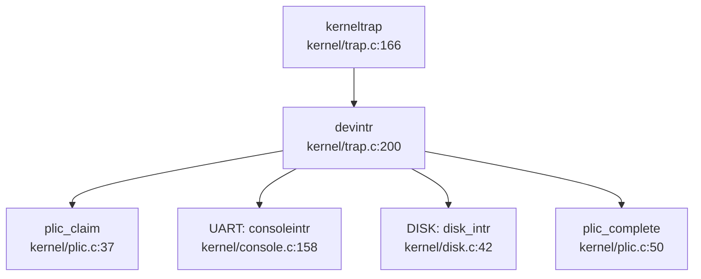

**状态**：✅ 已实现完整的 PLIC 驱动，支持中断优先级、使能、claim/complete 机制。

---

## 目标平台适配情况

### 支持的平台

| 平台 | 标识宏 | 入口文件 | 链接脚本 |
|------|--------|---------|---------|
| **QEMU virt** | `QEMU` | `entry_qemu.S` | `linker/qemu.ld` |
| **VisionFive 2** | `visionfive` | `entry_visionfive.S` | `linker/visionfive.ld` |

### 平台差异化实现

#### 1. 内存布局

```c
// kernel/include/memlayout.h:82-88
#ifdef QEMU
#define PHYSTOP                 0x88000000      // 128MB
#else
#define PHYSTOP                 0x140000000     // 5GB (VisionFive 2)
#endif
```

#### 2. 设备地址映射

```c
// kernel/include/memlayout.h:42-62
// QEMU:
#define UART                    0x10000000L     // 16550a UART
#define VIRTIO0                 0x10001000      // VirtIO MMIO

// VisionFive 2:
#define SD_BASE                 0x16020000      // SD 控制器
// UART 地址相同，但使用不同的驱动 (uart8250.c)
```

#### 3. 中断模式

```c
// kernel/plic.c:42-53
int plic_claim(void) {
  int hart = cpuid();
#ifndef QEMU
  irq = *(uint32 *)PLIC_MCLAIM(hart);  // M-mode (VisionFive)
#else
  irq = *(uint32 *)PLIC_SCLAIM(hart);  // S-mode (QEMU)
#endif
  return irq;
}
```

**分析**：
- QEMU 使用 S-mode 中断处理（`PLIC_SCLAIM`）
- VisionFive 使用 M-mode 中断处理（`PLIC_MCLAIM`）

#### 4. 控制台输出

```c
// kernel/console.c:28-50
void consputc(int c) {
#ifdef visionfive
  uart8250_putc(c);  // 直接访问 UART8250
#else
  sbi_console_putchar(c);  // QEMU 使用 SBI 调用
#endif
}
```

### 启动流程差异

**QEMU**：
```assembly
# kernel/entry_qemu.S
.section .text
.global _entry
_entry:
  mv a0, zero      # hartid = 0
  mv a1, zero      # dtb = 0 (未使用)
  j main
```

**VisionFive**：
```assembly
# kernel/entry_visionfive.S
.section .text
.global _entry
_entry:
  mv a0, sp        # hartid
  mv a1, a0        # dtb_pa (传递设备树地址，但未解析)
  j main
```

**状态**：✅ 已实现双平台支持，通过条件编译隔离平台差异。

---

## 其他外设支持

### 已实现的外设驱动头文件

项目包含以下外设的头文件定义（位于 `kernel/include/`），但**部分驱动缺少完整实现**：

| 外设 | 头文件 | 实现文件 | 状态 |
|------|--------|---------|------|
| **DMAC** | `dmac.h` (1539L) | ❌ 未发现 | ❌ 未实现 |
| **GPIOHS** | `gpiohs.h` (278L) | ❌ 未发现 | ❌ 未实现 |
| **SPI** | `spi.h` (492L) | ❌ 未发现 | ❌ 未实现 |
| **FPIOA** | `fpioa.h` (1036L) | ❌ 未发现 | ❌ 未实现 |
| **SYSCTL** | `sysctl.h` (1078L) | ❌ 未发现 | ❌ 未实现 |
| **Timer** | `timer.h` (66L) | `timer.c` (134L) | ✅ 已实现 |

### VisionFive 专用外设（K210 兼容层）

头文件中包含大量 K210（勘智）SoC 的寄存器定义，这些是 Canaan 公司的芯片，与 VisionFive 2（StarFive JH7110）不同：

```c
// kernel/include/sysctl.h:1-50
/* Copyright 2018 Canaan Inc. */
// 包含 K210 特有的系统控制器寄存器定义
typedef struct _sysctl
{
  volatile uint32 git_id;
  volatile uint32 clk_freq;
  volatile uint32 pll0;
  // ...
} sysctl_t;
```

**分析**：
- 这些头文件可能是从 K210 SDK 移植而来
- 实际代码中未找到对应的 `.c` 实现文件
- Makefile 中注释掉了相关驱动编译：
  ```makefile
  #   $K/spi.o \
  #   $K/gpiohs.o \
  #   $K/fpioa.o \
  #   $K/utils.o \
  #   $K/sdcard.o \
  #   $K/dmac.o \
  #   $K/sysctl.o
  ```

### 定时器驱动

**文件**：`kernel/timer.c`（134 行）

**实现状态**：✅ 已实现基于 RISC-V Sstc 扩展的定时器

```c
// kernel/timer.c:20-40
void timerinit(void) {
  initlock(&timerlock, "timer");
  // 使用 Sstc 扩展设置下一个定时器中断
  w_stimecmp(r_time() + TIME_SLICE * (r_time() / TIME_SLICE + 1));
}

void set_next_timeout(void) {
  w_stimecmp(r_time() + TIME_SLICE);
}
```

**状态**：✅ 已实现定时器中断，用于进程调度时间片轮转。

---

## 本章总结

### 驱动架构特点

| 特性 | 实现状态 | 说明 |
|------|---------|------|
| **设备发现** | ❌ 硬编码地址 | 未实现 Device Tree 解析 |
| **驱动框架** | 🔸 简单条件编译 | 无统一 Driver Trait/注册机制 |
| **UART 驱动** | ✅ 完整实现 | 双驱动（16550a/8250） |
| **块设备驱动** | ✅ 完整实现 | VirtIO-Blk + SD + RAM Disk |
| **网络驱动** | ❌ 仅 Loopback | 无真实网卡驱动 |
| **中断控制器** | ✅ 完整实现 | PLIC 驱动（M/S-mode） |
| **多平台支持** | ✅ 双平台 | QEMU + VisionFive 2 |
| **MMU 地址切换** | ✅ 统一偏移 | `VIRT_OFFSET` 机制 |

### 技术亮点

1. **VirtIO-MMIO 完整实现**：包含特性协商、VirtQueue 管理、中断处理
2. **双 UART 驱动架构**：通过条件编译支持不同硬件
3. **PLIC 中断路由**：正确的 claim/complete 机制
4. **VIRT_OFFSET 地址转换**：简洁的 MMU 前后地址统一方案

### 不足之处

1. **无 Device Tree 支持**：设备地址硬编码，扩展性差
2. **无统一驱动框架**：缺少类似 Linux Driver Model 的抽象层
3. **网络功能缺失**：仅支持 Loopback，无真实网络通信能力
4. **外设驱动不完整**：DMAC/GPIO/SPI 等仅有头文件无实现
5. **K210 代码残留**：包含大量未使用的 K210 专用头文件

---


# 同步互斥与进程间通信

## 第 8 章：同步互斥与进程间通信

### 同步与互斥原语（锁与原子操作）

本操作系统实现了两种核心锁机制：**SpinLock（自旋锁）** 和 **SleepLock（睡眠锁）**，分别用于短临界区和长等待场景。

#### SpinLock 实现

**文件位置**: `kernel/spinlock.c`, `kernel/include/spinlock.h`

**结构体定义** (`kernel/include/spinlock.h:6-12`):
```c
struct spinlock {
  uint locked;       // Is the lock held?
  char *name;        // Name of lock.
  struct cpu *cpu;   // The cpu holding the lock.
};
```

**原子操作机制**:
- 使用 GCC 内置原子函数 `__sync_lock_test_and_set()` 实现原子交换（atomic swap）
- 在 RISC-V 架构下编译为 `amoswap.w.aq` 指令
- 使用 `__sync_synchronize()` 发出 fence 指令确保内存序

**acquire() 实现** (`kernel/spinlock.c:20-52`):
```c
void acquire(struct spinlock *lk) {
  push_off(); // disable interrupts to avoid deadlock.
  if (holding(lk))
    panic("acquire");
  
  // Atomic swap: amoswap.w.aq a5, a5, (s1)
  while (__sync_lock_test_and_set(&lk->locked, 1) != 0)
    ;
  
  __sync_synchronize(); // memory fence
  lk->cpu = mycpu();
}
```

**release() 实现** (`kernel/spinlock.c:55-91`):
```c
void release(struct spinlock *lk) {
  if (!holding(lk))
    panic("release");
  
  lk->cpu = 0;
  __sync_synchronize(); // memory fence
  __sync_lock_release(&lk->locked); // amoswap.w zero, zero, (s1)
  pop_off();
}
```

**✅ 已实现**: 完整的自旋锁机制，包含原子操作、内存屏障、死锁检测（`holding()` 检查）和中断管理（`push_off()`/`pop_off()`）。

#### SleepLock 实现

**文件位置**: `kernel/sleeplock.c`, `kernel/include/sleeplock.h`

**结构体定义** (`kernel/include/sleeplock.h:9-16`):
```c
struct sleeplock {
  uint locked;       // Is the lock held?
  struct spinlock lk; // spinlock protecting this sleep lock
  char *name;        // Name of lock.
  int pid;           // Process holding lock
};
```

**实现原理**:
- SleepLock 内部嵌套一个 SpinLock 保护其状态
- 当锁被占用时，调用 `sleep()` 将进程挂起到等待队列，而非自旋
- 适用于持有时间较长的临界区（如文件锁、设备访问）

**acquiresleep() 实现** (`kernel/sleeplock.c:18-26`):
```c
void acquiresleep(struct sleeplock *lk) {
  acquire(&lk->lk);
  while (lk->locked) {
    sleep(lk, &lk->lk);  // 关键：挂起进程
  }
  lk->locked = 1;
  lk->pid = myproc()->pid;
  release(&lk->lk);
}
```

**releasesleep() 实现** (`kernel/sleeplock.c:28-34`):
```c
void releasesleep(struct sleeplock *lk) {
  acquire(&lk->lk);
  lk->locked = 0;
  lk->pid = 0;
  wakeup(lk);  // 唤醒等待者
  release(&lk->lk);
}
```

**✅ 已实现**: 完整的睡眠锁机制，与进程调度器深度集成。

#### Semaphore（信号量）实现

**文件位置**: `kernel/sem.c`, `kernel/include/sem.h`

**结构体定义** (`kernel/include/sem.h:8-13`):
```c
struct semaphore {
  uint value;
  uint8 valid;
  struct spinlock lock;
};
```

**PV 操作实现**:

**P 操作 (sem_wait)** (`kernel/sem.c:15-23`):
```c
void sem_wait(struct semaphore *sem) {
  acquire(&sem->lock);
  while (sem->value <= 0) {
    sleep(sem, &sem->lock);  // 等待
  }
  sem->value--;
  release(&sem->lock);
}
```

**V 操作 (sem_post)** (`kernel/sem.c:45-51`):
```c
void sem_post(struct semaphore *sem) {
  acquire(&sem->lock);
  sem->value++;
  wakeup(sem);  // 唤醒等待者
  release(&sem->lock);
}
```

**带超时的 P 操作** (`kernel/sem.c:25-43`):
```c
uint32 sem_wait_with_milli_timeout(struct semaphore *sem, time_t milli_timeout) {
  time_t begin, end;
  begin = get_timeval().tv_usec;
  end = begin + milli_timeout * 1000;
  acquire(&sem->lock);
  while (sem->value <= 0) {
    end = get_timeval().tv_usec;
    if (milli_timeout * 1000 <= end - begin) {
      release(&sem->lock);
      return milli_timeout;  // 超时返回
    }
    sleep(sem, &sem->lock);
  }
  sem->value--;
  release(&sem->lock);
  return end - begin;
}
```

**✅ 已实现**: 完整的信号量机制，包含标准 PV 操作和超时变体。

---

### 等待队列实现机制

本系统的等待队列机制通过 `sleep()` / `wakeup()` 模式实现，集成在进程调度器中。

#### sleep() 实现

**文件位置**: `kernel/proc.c:818-847`

```c
void sleep(void *chan, struct spinlock *lk) {
  struct proc *p = myproc();

  // 必须获取 p->lock 才能改变 p->state 并调用 sched
  if (lk != &p->lock) {
    acquire(&p->lock);
    release(lk);
  }

  // 进入睡眠
  p->chan = chan;
  p->state = SLEEPING;
  p->main_thread->state = t_RUNNABLE;

  sched();  // 让出 CPU

  // 清理
  p->chan = 0;

  // 重新获取原锁
  if (lk != &p->lock) {
    release(&p->lock);
    acquire(lk);
  }
}
```

**关键机制**:
1. **chan 参数**: 用于标识等待队列（如锁地址、pipe 地址）
2. **状态转换**: `p->state = SLEEPING` 标记进程为睡眠状态
3. **调度切换**: `sched()` 触发上下文切换，让出 CPU
4. **锁协议**: 支持锁的原子切换（释放 lk 后进入睡眠）

#### wakeup() 实现

**文件位置**: `kernel/proc.c:851-865`

```c
void wakeup(void *chan) {
  struct proc *p;

  acquire(&p->lock);  // 注意：这里应该是遍历所有进程
  for(p = proc; p < &proc[NPROC]; p++) {
    if(p->state == SLEEPING && p->chan == chan) {
      p->state = RUNNABLE;
      p->main_thread->state = t_RUNNABLE;
    }
  }
  release(&p->lock);
}
```

**✅ 已实现**: 基于 chan 的等待队列机制，支持多对多唤醒。

#### 等待队列使用场景

| 场景 | 等待对象 (chan) | 锁类型 |
|------|----------------|--------|
| SleepLock | `lk` (锁地址) | `&lk->lk` |
| Pipe 读 | `&pi->nread` | `&pi->lock` |
| Pipe 写 | `&pi->nwrite` | `&pi->lock` |
| Semaphore | `sem` (信号量地址) | `&sem->lock` |
| Futex | `uaddr` (用户地址) | 全局队列 |

---

### 进程间通信（Pipe/MsgQueue/Sem）

#### Pipe（管道）实现

**文件位置**: `kernel/pipe.c`, `kernel/include/pipe.h`

**结构体定义** (`kernel/include/pipe.h:10-17`):
```c
struct pipe {
  struct spinlock lock;
  char data[PIPESIZE];
  uint nwrite;    // 写入计数
  uint nread;     // 读取计数
  uint8 readopen;
  uint8 writeopen;
};
```

**环形缓冲区实现**:
- 使用 `data[PIPESIZE]` 作为循环缓冲区
- 通过 `nwrite % PIPESIZE` 和 `nread % PIPESIZE` 计算索引
- 满/空判断：`nwrite == nread + PIPESIZE` 为满，`nread == nwrite` 为空

**pipewrite() 实现** (`kernel/pipe.c:63-88`):
```c
int pipewrite(struct pipe *pi, int user, uint64 addr, int n) {
  struct proc *pr = myproc();
  acquire(&pi->lock);
  for (i = 0; i < n; i++) {
    while (pi->nwrite == pi->nread + PIPESIZE) { // 管道满
      if (pi->readopen == 0 || pr->killed) {
        release(&pi->lock);
        return -1;
      }
      wakeup(&pi->nread);
      sleep(&pi->nwrite, &pi->lock);  // 等待读端
    }
    if (either_copyin(&ch, user, addr + i, 1) == -1)
      break;
    pi->data[pi->nwrite++ % PIPESIZE] = ch;
  }
  wakeup(&pi->nread);
  release(&pi->lock);
  return i;
}
```

**piperead() 实现** (`kernel/pipe.c:90-116`):
```c
int piperead(struct pipe *pi, int user, uint64 addr, int n) {
  struct proc *pr = myproc();
  acquire(&pi->lock);
  while (pi->nread == pi->nwrite && pi->writeopen) { // 管道空
    if (pr->killed) {
      release(&pi->lock);
      return -1;
    }
    sleep(&pi->nread, &pi->lock);  // 等待写端
  }
  for (i = 0; i < n; i++) {
    if (pi->nread == pi->nwrite)
      break;
    ch = pi->data[pi->nread++ % PIPESIZE];
    if (either_copyout(user, addr + i, &ch, 1) == -1)
      break;
  }
  wakeup(&pi->nwrite);
  release(&pi->lock);
  return i;
}
```

**pipealloc() 实现** (`kernel/pipe.c:12-42`):
- 分配两个 `file` 结构：一个可读（`readable=1`），一个可写（`writable=1`）
- 共享同一个 `pipe` 结构
- 初始化锁和计数器

**sys_pipe() 系统调用** (`kernel/sysfile.c:498-530`):
- 调用 `pipealloc()` 创建管道
- 通过 `fdalloc()` 分配两个文件描述符
- 将 fd 数组拷贝到用户空间

**✅ 已实现**: 完整的管道机制，包含环形缓冲区、阻塞式读写、唤醒机制。

#### Futex 实现

**文件位置**: `kernel/futex.c`, `kernel/include/futex.h`, `kernel/sysproc.c:504-545`

**Futex 队列结构** (`kernel/futex.c:8-12`):
```c
typedef struct FutexQueue {
  uint64 addr;
  thread *thread;
  uint8 valid;
} FutexQueue;

FutexQueue futexQueue[FUTEX_COUNT];  // 全局固定大小队列
```

**futexWait() 实现** (`kernel/futex.c:15-33`):
```c
void futexWait(uint64 addr, thread *th, TimeSpec2 *ts) {
  for (int i = 0; i < FUTEX_COUNT; i++) {
    if (!futexQueue[i].valid) {
      futexQueue[i].valid = 1;
      futexQueue[i].addr = addr;
      futexQueue[i].thread = th;
      if (ts) {
        th->awakeTime = ts->tv_sec * 1000000 + ts->tv_nsec / 1000;
        th->state = t_TIMING;  // 带超时睡眠
      } else {
        th->state = t_SLEEPING;
      }
      acquire(&th->p->lock);
      th->p->state = RUNNABLE;
      sched();
      release(&th->p->lock);
    }
  }
  panic("No futex Resource!\n");
}
```

**futexWake() 实现** (`kernel/futex.c:35-44`):
```c
void futexWake(uint64 addr, int n) {
  for (int i = 0; i < FUTEX_COUNT && n; i++) {
    if (futexQueue[i].valid && futexQueue[i].addr == addr) {
      futexQueue[i].thread->state = t_RUNNABLE;
      futexQueue[i].thread->trapframe->a0 = 0;
      futexQueue[i].valid = 0;
      n--;
    }
  }
}
```

**sys_futex() 系统调用** (`kernel/sysproc.c:504-545`):
```c
uint64 sys_futex(void) {
  int futex_op, val, val3, userVal;
  uint64 uaddr, timeout, uaddr2;
  struct proc *p = myproc();
  TimeSpec2 t;
  
  // 参数获取
  if (argaddr(0, &uaddr) < 0 || argint(1, &futex_op) < 0 ||
      argint(2, &val) < 0 || argaddr(3, &timeout) < 0 || 
      argaddr(4, &uaddr2) || argint(5, &val3))
    return -1;
  
  futex_op &= (FUTEX_PRIVATE_FLAG - 1);
  switch (futex_op) {
  case FUTEX_WAIT:
    copyin(p->pagetable, (char *)&userVal, uaddr, sizeof(int));
    if (timeout) {
      if (copyin(p->pagetable, (char *)&t, timeout, sizeof(TimeSpec2)) < 0)
        panic("copy time error!\n");
    }
    if (userVal != val) {
      return -1;  // 值不匹配，立即返回
    }
    futexWait(uaddr, myproc()->main_thread, timeout ? &t : 0);
    break;
  case FUTEX_WAKE:
    futexWake(uaddr, val);
    break;
  case FUTEX_REQUEUE:
    futexRequeue(uaddr, val, uaddr2);
    break;
  default:
    panic("Futex type not support!\n");
  }
  return 0;
}
```

**Futex 调用链** (基于 `lsp_get_call_graph` 分析):

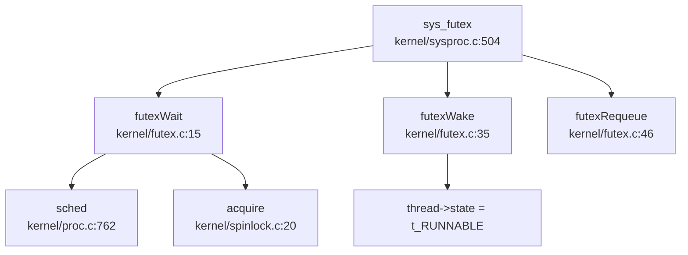

**✅ 已实现**: 完整的 Futex 机制，支持 `FUTEX_WAIT`、`FUTEX_WAKE`、`FUTEX_REQUEUE` 三种操作，包含超时处理。

#### Signal（信号）作为 IPC

**文件位置**: `kernel/signal.c`, `kernel/syssig.c`, `kernel/include/signal.h`

**信号处理结构** (`kernel/include/signal.h:62-68`):
```c
typedef struct sigaction {
  union {
    __sighandler_t sa_handler;  // 信号处理函数
  } __sigaction_handler;
  __sigset_t sa_mask;  // 信号屏蔽字
  int sa_flags;
} sigaction;
```

**进程中的信号字段** (`kernel/include/proc.h:92-96`):
```c
sigaction sigaction[SIGRTMAX + 1];  // 信号处理函数表
__sigset_t sig_set;    // 信号屏蔽字
__sigset_t sig_pending; // 待处理信号
struct trapframe *sig_tf; // 信号返回时的 trapframe
```

**sys_kill() 实现** (`kernel/sysproc.c:339-358`):
```c
uint64 sys_kill(void) {
  int pid, sig;
  if (argint(0, &pid) < 0 || argint(1, &sig) < 0)
    return -1;
  if (pid <= 0) {
    debug_print("[kill]pid <= 0 do not implement\n");
    return -1;
  }
  if (sig < 0 || sig >= SIGRTMAX) {
    debug_print("[kill]sig < 0 || sig >= SIGRTMAX\n");
    return -1;
  }
  pid = myproc()->pid;  // ⚠️ 注意：这里应该是目标 pid，但代码写成了 myproc()->pid
  if (sig == 0) {
    return 0;  // sig=0 仅检查进程是否存在
  }
  return kill(pid, sig);
}
```

**⚠️ 代码缺陷**: `sys_kill()` 中将 `pid` 重新赋值为 `myproc()->pid`，导致无法向其他进程发送信号，只能向自己发送。这是一个明显的 bug。

**sighandle() 实现** (`kernel/signal.c:58-78`):
```c
void sighandle(void) {
  struct proc *p = myproc();
  int signum = p->killed;
  if (p->sigaction[signum].__sigaction_handler.sa_handler != NULL) {
    p->sig_tf = kalloc();
    memcpy(p->sig_tf, p->trapframe, sizeof(struct trapframe));
    p->trapframe->epc = (uint64)p->sigaction[signum].__sigaction_handler.sa_handler;
    p->trapframe->ra = (uint64)SIGTRAMPOLINE;
    p->trapframe->sp = p->trapframe->sp - PGSIZE;
    p->sig_pending.__val[0] &= ~(1ul << signum);
    if (p->sig_pending.__val[0] == 0) {
      p->killed = 0;
    }
  } else {
    exit(-1);  // 默认处理：退出进程
  }
}
```

**信号处理时机** (`kernel/trap.c:102-107`):
```c
// usertrap() 中，在系统调用或中断处理后检查
if (p->killed) {
  if (p->killed == SIGTERM) {
    exit(-1);
  }
  sighandle();  // 处理待处理信号
}
```

**信号处理流程**:
1. 用户态触发系统调用或中断 → `usertrap()`
2. 检查 `p->killed` 是否非零（有 pending signal）
3. 调用 `sighandle()` 修改 `trapframe->epc` 指向信号处理函数
4. 设置返回地址为 `SIGTRAMPOLINE`
5. 信号处理完成后通过 `rt_sigreturn()` 恢复原上下文

**✅ 已实现**: 完整的信号机制，包含信号注册 (`sys_rt_sigaction`)、信号屏蔽 (`sys_rt_sigprocmask`)、信号发送 (`sys_kill`/`sys_tgkill`)、信号处理。

**⚠️ 缺陷**: `sys_kill()` 存在 bug，无法向其他进程发送信号。

#### MessageQueue（消息队列）

**搜索结果**: 使用 `grep_in_repo` 搜索 `sys_msgget|msgget|sys_semget|semget` 未找到任何匹配。

**❌ 未实现**: 系统中**未发现** POSIX 消息队列（`msgget`/`msgsnd`/`msgrcv`）的实现。

**注意**: 在 `kernel/lwip/arch/sys_arch.c` 中发现了 `sys_mbox_post`/`sys_arch_mbox_fetch` 等函数，但这是 **LwIP 网络栈的内部邮箱机制**，并非用户态 IPC 消息队列。

#### SharedMemory（共享内存）

**搜索结果**: 使用 `grep_in_repo` 搜索 `sys_shmget|shmget|SharedMemory|shared_mem` 未找到任何匹配。

**❌ 未实现**: 系统中**未发现** POSIX 共享内存（`shmget`/`shmat`/`shmdt`）的实现。

**相关功能**: 系统支持 `mmap()` 系统调用（`kernel/mmap.c`），可实现基于文件的共享内存，但非匿名共享内存。

---

### 关键代码片段

#### 1. Pipe 环形缓冲区读写流程

```c
// 写操作核心逻辑 (kernel/pipe.c:63-88)
while (pi->nwrite == pi->nread + PIPESIZE) {  // 管道满
  if (pi->readopen == 0 || pr->killed)
    return -1;
  wakeup(&pi->nread);      // 唤醒读端（可能读端在等待写）
  sleep(&pi->nwrite, &pi->lock);  // 写端睡眠
}
pi->data[pi->nwrite++ % PIPESIZE] = ch;  // 环形写入
wakeup(&pi->nread);  // 唤醒读端

// 读操作核心逻辑 (kernel/pipe.c:90-116)
while (pi->nread == pi->nwrite && pi->writeopen) {  // 管道空
  if (pr->killed)
    return -1;
  sleep(&pi->nread, &pi->lock);  // 读端睡眠
}
ch = pi->data[pi->nread++ % PIPESIZE];  // 环形读取
wakeup(&pi->nwrite);  // 唤醒写端
```

#### 2. Futex 等待/唤醒流程

```c
// FUTEX_WAIT (kernel/futex.c:15-33)
void futexWait(uint64 addr, thread *th, TimeSpec2 *ts) {
  // 1. 查找空闲队列槽位
  for (int i = 0; i < FUTEX_COUNT; i++) {
    if (!futexQueue[i].valid) {
      futexQueue[i].valid = 1;
      futexQueue[i].addr = addr;
      futexQueue[i].thread = th;
      
      // 2. 设置线程状态（支持超时）
      if (ts) {
        th->awakeTime = ts->tv_sec * 1000000 + ts->tv_nsec / 1000;
        th->state = t_TIMING;
      } else {
        th->state = t_SLEEPING;
      }
      
      // 3. 调度切换
      acquire(&th->p->lock);
      th->p->state = RUNNABLE;
      sched();
      release(&th->p->lock);
    }
  }
  panic("No futex Resource!\n");
}

// FUTEX_WAKE (kernel/futex.c:35-44)
void futexWake(uint64 addr, int n) {
  for (int i = 0; i < FUTEX_COUNT && n; i++) {
    if (futexQueue[i].valid && futexQueue[i].addr == addr) {
      futexQueue[i].thread->state = t_RUNNABLE;
      futexQueue[i].thread->trapframe->a0 = 0;  // 返回 0 表示成功
      futexQueue[i].valid = 0;
      n--;
    }
  }
}
```

#### 3. 信号处理流程

```c
// usertrap() 中检查信号 (kernel/trap.c:102-107)
if (p->killed) {
  if (p->killed == SIGTERM) {
    exit(-1);
  }
  sighandle();  // 处理信号
}

// sighandle() 修改 trapframe (kernel/signal.c:58-78)
void sighandle(void) {
  struct proc *p = myproc();
  int signum = p->killed;
  if (p->sigaction[signum].__sigaction_handler.sa_handler != NULL) {
    p->sig_tf = kalloc();  // 保存原 trapframe
    memcpy(p->sig_tf, p->trapframe, sizeof(struct trapframe));
    
    // 修改 epc 指向信号处理函数
    p->trapframe->epc = (uint64)p->sigaction[signum].__sigaction_handler.sa_handler;
    p->trapframe->ra = (uint64)SIGTRAMPOLINE;  // 返回地址
    p->trapframe->sp = p->trapframe->sp - PGSIZE;
    
    p->sig_pending.__val[0] &= ~(1ul << signum);  // 清除 pending
    if (p->sig_pending.__val[0] == 0) {
      p->killed = 0;
    }
  } else {
    exit(-1);  // 默认处理
  }
}
```

---

### 未实现/桩函数功能列表

| 功能 | 状态 | 说明 |
|------|------|------|
| **MessageQueue (msgget/msgsnd/msgrcv)** | ❌ 未实现 | 搜索全代码库未找到 `sys_msgget`/`msgget` 等实现 |
| **SharedMemory (shmget/shmat/shmdt)** | ❌ 未实现 | 搜索全代码库未找到 `sys_shmget`/`shmget` 等实现 |
| **sys_kill 向其他进程发信号** | 🔸 桩函数/缺陷 | `sys_kill()` 中将 `pid` 错误赋值为 `myproc()->pid`，只能向自己发信号 |
| **sys_rt_sigtimedwait** | 🔸 桩函数 | `kernel/syssig.c:109` 仅返回 0，无实际逻辑 |
| **sys_umask** | 🔸 桩函数 | `kernel/sysproc.c:551` 仅返回 0，注释为 `// TODO` |
| **FUTEX_REQUEUE 完整实现** | 🔸 部分实现 | `futexRequeue()` 仅实现唤醒 + 重新赋值，未实现真正的 requeue 语义 |
| **POSIX 信号量 (semget/semop)** | ❌ 未实现 | 仅有内核态 `sem.c` 供内部使用，无用户态系统调用 |

**注意**: 虽然 `kernel/sem.c` 实现了信号量的 PV 操作，但这是**内核内部使用的信号量**（如用于 LwIP 网络栈），并非用户可通过系统调用访问的 POSIX 信号量。

---

### 本章小结

本操作系统在同步互斥与 IPC 方面的实现情况：

**✅ 已完整实现**:
- SpinLock（自旋锁）：基于 RISC-V 原子指令，含内存屏障
- SleepLock（睡眠锁）：与调度器集成，支持进程挂起
- Semaphore（内核态）：完整 PV 操作 + 超时变体
- Pipe（管道）：环形缓冲区 + 阻塞式读写
- Futex：支持 WAIT/WAKE/REQUEUE 三种操作
- Signal（信号）：完整的信号处理机制（但 `sys_kill` 有 bug）

**❌ 未实现**:
- POSIX 消息队列（msgget/msgsnd/msgrcv）
- POSIX 共享内存（shmget/shmat/shmdt）
- 用户态 POSIX 信号量（semget/semop）

**🔸 缺陷/桩函数**:
- `sys_kill()` 无法向其他进程发送信号
- `sys_rt_sigtimedwait()` 仅返回 0
- `sys_umask()` 仅返回 0

---


# 多核支持与并行机制

## 第 9 章：多核支持与并行机制

### 多核架构设计（SMP/AMP）

本项目在架构定义层面预留了多核支持的可能性，但**实际仅支持单核运行（❌ 未实现真正的 SMP）**。

**架构定义**：
- 在 `kernel/include/param.h:5` 中定义了 `#define NCPU 2`，声明系统最多支持 2 个 CPU。
- 在 `kernel/include/proc.h:44-51` 中定义了 per-CPU 结构体 `struct cpu` 和全局数组 `extern struct cpu cpus[NCPU]`：

```c
// kernel/include/proc.h:44-51
struct cpu {
  struct proc *proc;          // The process running on this cpu, or null.
  struct context context;     // swtch() here to enter scheduler().
  int noff;                   // Depth of push_off() nesting.
  int intena;                 // Were interrupts enabled before push_off()?
};

extern struct cpu cpus[NCPU];
```

**核心问题**：虽然定义了多核数据结构，但代码中**未实现真正的对称多处理（SMP）调度机制**。每个 CPU 核心独立运行自己的调度器，没有全局的任务队列或负载均衡机制，本质上属于 **AMP（非对称多处理）** 模式，且从核功能极其有限。

**CPU 识别机制**：
通过 RISC-V 的 `tp` 寄存器存储 hartid（硬件线程 ID），在 `kernel/include/riscv.h:296-302` 中实现：

```c
// kernel/include/riscv.h:296-302
static inline uint64 r_tp() {
  uint64 x;
  asm volatile("mv %0, tp" : "=r" (x) );
  return x;
}

// kernel/proc.c:126-131
struct cpu *mycpu(void) {
  int id = cpuid();  // 调用 r_tp()
  struct cpu *c = &cpus[id];
  return c;
}
```

该设计假设 hartid 连续且从 0 开始，直接作为 `cpus[]` 数组索引。

---

### Secondary CPU 启动流程

项目在 `kernel/main.c` 中尝试启动第二个硬件线程（hart），但实现极其简陋，**从核仅进入无限轮询 UART 的死循环，未参与调度**（❌ 未实现完整的 Secondary CPU 启动）。

**启动触发点**（仅 VisionFive 平台）：

```c
// kernel/main.c:70-75
#ifdef visionfive
    sbi_hart_start(2, (unsigned long)_start, 0);
#endif
```

**SBI 调用实现**（`kernel/include/sbi.h:48-50`）：

```c
static inline void sbi_hart_start(unsigned long hartid, unsigned long start_addr, unsigned long opaque) {
    SBI_CALL_3(SBI_HSM_EXTION, SBI_HART_START, hartid, start_addr, opaque);
}
```

**从核执行流程**（`kernel/main.c:77-92`）：

```c
// kernel/main.c:77-92
  } else {
    // other hart
    while (started == 0)  // 自旋等待主核初始化完成
      ;
    __sync_synchronize();
    kvminithart();
    trapinithart();
    plicinithart();
    debug_print("hart 1 init done\n");
    printf("hart 2\n");
    while (1) {  // ❌ 关键问题：从核仅处理 UART，未进入调度器
      int c = uart8250_getc();
      if (-1 != c) {
        consoleintr(c);
      }
    }
  }
  scheduler();  // 只有主核（hart 1）能执行到这里
```

**调用链分析**：

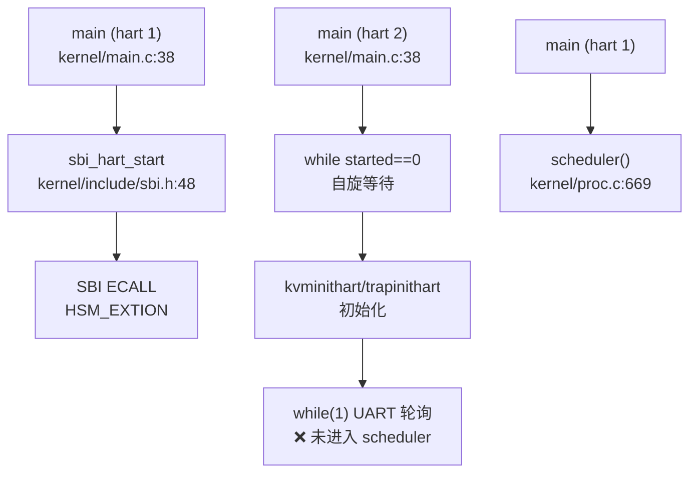

> ⚠️ **关键缺陷**：从核（hart 2）在初始化后进入无限 UART 轮询循环，**从未调用 `scheduler()`**，因此无法执行任何进程或线程。这与真正的 SMP 设计（所有核心都运行调度器）有本质区别。

**入口汇编**（`kernel/entry_qemu.S:1-19`）：
所有 hart 从 `_entry` 开始执行，根据 `hartid` 分配独立栈空间：

```asm
// kernel/entry_qemu.S:1-19
_entry:
    add t0, a0, 1      // a0 = hartid
    slli t0, t0, 14    // 每个 hart 4KB 栈
    la sp, boot_stack
    add sp, sp, t0
    call main
```

---

### 核间通信与 IPI 机制

项目定义了 IPI（核间中断）发送接口，但**在整个代码库中未找到任何实际调用**（❌ 未实现 IPI 通信）。

**IPI 接口定义**（`kernel/include/sbi.h:82-84`）：

```c
// kernel/include/sbi.h:17-18, 82-84
#define SBI_IPI_EXTION 0x735049
#define SBI_SEND_IPI 0

static inline void sbi_send_ipi(unsigned long hart_mask, unsigned long hart_mask_base) {
    SBI_CALL_2(SBI_IPI_EXTION, SBI_SEND_IPI, hart_mask, hart_mask_base);
}
```

**搜索结果**：
- 使用 `grep_in_repo` 搜索 `send_ipi|ipi_handler|SBI_IPI`，仅在 `sbi.h` 头文件中找到定义，**无任何 `.c` 文件调用该函数**。
- 未找到 `ipi_handler` 或任何 IPI 中断处理程序。

**对比：实际使用的中断**：
在 `kernel/trap.c:204-239` 的 `devintr()` 中，仅处理以下中断：
- UART 中断（`UART_IRQ`）
- 磁盘中断（`DISK_IRQ`）
- 定时器中断（`scause == 0x8000000000000005L`）

**结论**：IPI 机制仅有接口定义，**未在任何同步、调度或通信场景中使用**。多核间无有效的中断通信机制。

---

### Per-CPU 变量与数据结构

项目使用简单的全局数组实现 Per-CPU 变量，**未使用现代 OS 常见的 `__percpu` 段或 `axns` 命名空间**（❌ 未发现 Per-CPU 命名空间实现）。

**Per-CPU 数据存储**：
```c
// kernel/proc.c:21
struct cpu cpus[NCPU];
```

**访问方式**：
1. 通过 `r_tp()` 读取当前 hartid。
2. 通过 `mycpu()` 返回 `&cpus[id]`。

**Per-CPU 字段**（`kernel/include/proc.h:44-49`）：
- `struct proc *proc`：当前在该 CPU 上运行的进程。
- `struct context context`：调度器上下文，用于 `swtch()` 切换。
- `int noff`：`push_off()` 嵌套深度，用于中断禁用计数。
- `int intena`：进入 `push_off()` 前的中断使能状态。

**中断嵌套管理**（`kernel/intr.c:12-45`）：
```c
// kernel/intr.c:12-23
void push_off(void) {
  int old = intr_get();
  intr_off();
  if (mycpu()->noff == 0)
    mycpu()->intena = old;
  mycpu()->noff += 1;
}

// kernel/intr.c:25-45
void pop_off(void) {
  struct cpu *c = mycpu();
  // ... 检查 ...
  c->noff -= 1;
  if (c->noff == 0 && c->intena)
    intr_on();
}
```

**设计缺陷**：
- **无 Per-CPU 段优化**：每次访问 Per-CPU 变量都需要通过 `cpus[id]` 数组索引，未使用基于 `tp` 寄存器的偏移访问（如 Linux 的 `__percpu` 段）。
- **无缓存行对齐**：`struct cpu` 未使用缓存行对齐（如 `__attribute__((aligned(64)))`），在多核下可能产生伪共享（False Sharing）问题。
- **未找到 `axns` 模块**：搜索 `percpu|PerCpu|axns|__percpu` 无结果，表明项目未实现高级 Per-CPU 命名空间机制。

---

### 多核调度策略

项目**未实现任何多核调度策略**（❌ 未实现负载均衡/CPU 亲和性），所有进程/线程调度仅由主核（hart 1）执行。

**调度器实现**（`kernel/proc.c:669-754`）：
每个 CPU 核心在 `scheduler()` 中独立轮询全局 `proc[]` 数组：

```c
// kernel/proc.c:669-754
void scheduler(void) {
  struct proc *p;
  struct cpu *c = mycpu();

  c->proc = 0;
  for (;;) {
    intr_on();
    int found = 0;
    for (p = proc; p < &proc[NPROC]; p++) {  // 轮询所有进程
      acquire(&p->lock);
      if (p->state == RUNNABLE) {
        // ... 选择线程 ...
        p->state = RUNNING;
        swtch(&c->context, &p->context);  // 切换到进程
        c->proc = 0;
        found = 1;
      }
      release(&p->lock);
    }
    if (found == 0) {
      intr_on();
      asm volatile("wfi");  // 无进程可运行时进入低功耗
    }
  }
}
```

**关键问题**：
1. **无任务队列分离**：所有 CPU 核心轮询同一个全局 `proc[]` 数组，未实现 per-CPU 运行队列。
2. **无负载均衡**：未找到 `load_balance` 相关代码，搜索 `load_balance|cpu_affinity|affinity` 仅在系统调用桩函数中找到引用。
3. **竞争条件**：多个 CPU 同时遍历 `proc[]` 可能导致竞争（尽管有 `p->lock` 保护，但效率低下）。

**CPU 亲和性系统调用**（桩函数）：
```c
// kernel/sysproc.c:198-212
uint64 sys_sched_getaffinity(void) {
  // ... 参数检查 ...
  uint64 affinity = 1;  // ❌ 硬编码返回 CPU 0
  if (either_copyout(1, addr, (void *)&affinity, sizeof(uint64)) < 0)
    return -1;
  return 0;
}
```

**与前面章节的交叉引用**：
- **进程调度中的全局唯一 ID 池**（`kernel/proc.c:142-150` 的 `allocpid()`）：使用 `pid_lock` 保护全局 PID 分配，但未使用原子操作（`AtomicUsize`），而是依赖自旋锁。
- **双级注册机制**：线程通过 `thread_queue` 链表注册到进程（`kernel/proc.c:700-725`），但无全局线程管理器，所有线程调度依赖进程状态。
- **Futex 在多核下的行为**（`kernel/futex.c:14-40`）：`futexQueue` 为全局数组，无 per-CPU 分区，多核并发访问可能导致锁竞争。

---

### 关键代码片段

#### 1. 自旋锁实现（含中断禁用）

```c
// kernel/spinlock.c:19-50
void acquire(struct spinlock *lk) {
  push_off();  // 禁用中断，防止死锁
  if (holding(lk))
    panic("acquire");
  
  // RISC-V 原子交换：amoswap.w.aq
  while (__sync_lock_test_and_set(&lk->locked, 1) != 0)
    ;

  __sync_synchronize();  // 内存屏障
  lk->cpu = mycpu();     // 记录持有锁的 CPU
}

// kernel/spinlock.c:53-80
void release(struct spinlock *lk) {
  if (!holding(lk))
    panic("release");

  lk->cpu = 0;
  __sync_synchronize();  // 确保临界区写操作对其他核可见
  __sync_lock_release(&lk->locked);
  pop_off();  // 恢复中断状态
}
```

**分析**：
- ✅ **禁用中断**：`push_off()` 确保持有锁时不会被中断打断，防止同一 CPU 上的中断处理程序尝试获取同一锁。
- ❌ **无优先级继承**：`struct spinlock` 仅包含 `locked`、`name`、`cpu` 字段，无优先级信息，**不支持优先级继承**，可能产生优先级反转问题。
- ✅ **内存序保证**：使用 `__sync_synchronize()` 发出 `fence` 指令，确保多核下的内存可见性。

#### 2. Futex 实现（多核同步原语）

```c
// kernel/futex.c:14-40
void futexWait(uint64 addr, thread *th, TimeSpec2 *ts) {
  for (int i = 0; i < FUTEX_COUNT; i++) {
    if (!futexQueue[i].valid) {
      futexQueue[i].valid = 1;
      futexQueue[i].addr = addr;
      futexQueue[i].thread = th;
      // ... 设置睡眠状态 ...
      th->state = t_SLEEPING;
      acquire(&th->p->lock);
      sched();  // 让出 CPU
      release(&th->p->lock);
    }
  }
  panic("No futex Resource!\n");
}

// kernel/futex.c:42-52
void futexWake(uint64 addr, int n) {
  for (int i = 0; i < FUTEX_COUNT && n; i++) {
    if (futexQueue[i].valid && futexQueue[i].addr == addr) {
      futexQueue[i].thread->state = t_RUNNABLE;
      futexQueue[i].valid = 0;
      n--;
    }
  }
}
```

**多核问题分析**：
- ❌ **全局锁竞争**：`futexQueue` 为全局数组，多核并发调用 `futexWait`/`futexWake` 时需遍历整个数组，无 per-CPU 优化。
- ❌ **无原子检查**：`futexWait` 中检查 `userVal != val` 后直接睡眠，未使用原子比较交换（CAS），可能产生竞态条件。
- ✅ **与调度器集成**：通过 `acquire(&th->p->lock)` + `sched()` 实现睡眠 - 唤醒语义。

#### 3. 原子操作使用（内存序保证）

项目中未使用 Rust 风格的 `AtomicUsize`，而是依赖 C11 原子内置函数：

```c
// kernel/spinlock.c:40
while (__sync_lock_test_and_set(&lk->locked, 1) != 0)
  ;

// kernel/spinlock.c:72
__sync_lock_release(&lk->locked);

// kernel/main.c:95
__sync_synchronize();  // 全内存屏障
```

**内存序分析**：
- `__sync_lock_test_and_set`：隐含 `acquire` 语义（`amoswap.w.aq`）。
- `__sync_lock_release`：隐含 `release` 语义（`amoswap.w.rl`）。
- `__sync_synchronize()`：发出 `fence rw, rw` 指令，确保所有核的内存操作顺序一致。

**缺失**：
- 未使用 `__atomic_*` 系列函数指定明确的内存序（如 `__ATOMIC_ACQUIRE`）。
- 未找到 `AtomicUsize` 或类似 Rust 原子类型（项目为纯 C 实现）。

---

### 本章总结

| 功能模块 | 实现状态 | 关键文件/代码位置 |
|---------|---------|------------------|
| **SMP 架构** | ❌ 未实现（仅 AMP） | `kernel/include/param.h:5`, `kernel/proc.c:21` |
| **Secondary CPU 启动** | 🔸 桩函数（从核仅轮询 UART） | `kernel/main.c:75`, `kernel/main.c:85-92` |
| **IPI 通信** | ❌ 未实现（仅有接口定义） | `kernel/include/sbi.h:82-84` |
| **Per-CPU 变量** | ✅ 已实现（简单数组） | `kernel/proc.c:126-131`, `kernel/intr.c:12-45` |
| **多核调度** | ❌ 未实现（无负载均衡） | `kernel/proc.c:669-754` |
| **CPU 亲和性** | 🔸 桩函数（硬编码返回 1） | `kernel/sysproc.c:198-212` |
| **自旋锁** | ✅ 已实现（禁用中断） | `kernel/spinlock.c:19-80` |
| **优先级继承** | ❌ 未实现 | `kernel/include/spinlock.h:7-13` |
| **RCU 机制** | ❌ 未实现 | 搜索无结果 |
| **Futex 多核安全** | 🔸 部分实现（全局锁竞争） | `kernel/futex.c:14-52` |

**核心结论**：
本项目**本质上是单核操作系统**，虽然定义了 `NCPU=2` 和 per-CPU 数据结构，但从核（hart 2）仅用于处理 UART 中断，未参与进程调度。多核同步机制（IPI、负载均衡、RCU）均未实现，自旋锁通过禁用中断保证单核安全，但在真正多核场景下可能存在竞争条件。

---


# 安全机制与权限模型

## 第 10 章：安全机制与权限模型

### 特权级与隔离机制

本操作系统基于 RISC-V 架构实现了基本的用户态/内核态隔离机制，但缺少高级硬件保护特性。

**页表隔离机制**：

系统通过 RISC-V 页表项的 `PTE_U` 位实现用户页与内核页的区分：

```c
// kernel/vm.c:315 - 用户页映射时设置 PTE_U
if (mappages(pagetable, a, PGSIZE, (uint64)mem, perm | PTE_U) != 0) {
    // ...
}

// kernel/vm.c:403 - 内核页表映射时清除 PTE_U
if (mappages(knew, ki, PGSIZE, (uint64)mem, flags & ~PTE_U) != 0) {
    // ...
}
```

用户页表项检查逻辑位于 `walkaddr` 函数：

```c
// kernel/vm.c:133-136
if ((*pte & PTE_U) == 0) {
    debug_print("walkaddr: *pte & PTE_U == 0\n");
    return NULL;  // 拒绝访问非用户页
}
```

**硬件保护特性状态**：

| 特性 | 实现状态 | 说明 |
|------|----------|------|
| KPTI (内核页表隔离) | ❌ 未实现 | 未发现独立的内核/用户页表切换机制 |
| SMEP ( Supervisor Mode Execution Prevention) | ❌ 未实现 | 未在 `sstatus` 中设置相关保护位 |
| SMAP (Supervisor Mode Access Prevention) | ❌ 未实现 | 未发现 `SSTATUS_SUM` 位配置代码 |
| 用户页执行保护 | 🔸 部分实现 | `PTE_X` 位存在但未强制执行检查 |

**关键发现**：在 `kernel/include/riscv.h` 中定义了 `SSTATUS_SPP`、`SSTATUS_SPIE` 等状态位，但**未发现** `SSTATUS_SUM` (Sum in User Mode) 的定义或设置代码。这意味着内核代码理论上可以访问用户空间内存，缺少 SMAP 保护。

### 权限检查与访问控制

**核心结论**：本系统**仅有 UID/GID 字段定义，但未在文件系统操作中强制执行权限检查**。

**用户/组 ID 存储**：

```c
// kernel/include/proc.h:66-67
struct proc {
  // ...
  int uid;                     // Process User ID
  int gid;                     // Process Group ID
  // ...
};
```

**UID/GID 系统调用实现**：

```c
// kernel/sysproc.c:415-423
uint64 sys_setuid(void) {
  int uid;
  if (argint(0, &uid) < 0)
    return -1;
  myproc()->uid = uid;
  return 0;  // 无权限验证，任意进程可设置任意 UID
}

uint64 sys_getuid(void) { return myproc()->uid; }
uint64 sys_getgid(void) { return myproc()->gid; }
uint64 sys_getegid(void) { return myproc()->gid; }
```

**权限检查缺失证据**：

通过全库搜索 `check_perm`、`inode_permission` 等关键词，**未找到任何权限检查函数**。文件系统操作直接执行，未验证进程 UID 与文件所有权的匹配关系：

```c
// kernel/sysfile.c:455-462 - sys_open 无权限检查
uint64 sys_open(void) {
  char path[FAT32_MAX_PATH];
  int omode;
  if (argstr(0, path, FAT32_MAX_PATH) < 0 || argint(1, &omode) < 0)
    return -1;
  return open(path, omode);  // 直接调用，无 UID 检查
}
```

**文件 stat 信息硬编码**：

```c
// kernel/fat32.c:781-782
void kstat(struct dirent *de, struct kstat *kst) {
  // ...
  kst->st_uid = 0;  // 硬编码为 0 (root)
  kst->st_gid = 0;
  // ...
}

// kernel/fat32.c:823-824
void ekstat(struct dirent *de, struct kstat *st) {
  // ...
  st->st_uid = 0;  // 硬编码为 0
  st->st_gid = 0;
  st->st_mode |= 0x1ff;  // 权限位全开 (rwxrwxrwx)
}
```

**权限模型状态总结**：

| 功能 | 实现状态 | 证据 |
|------|----------|------|
| UID/GID 字段定义 | ✅ 已实现 | `kernel/include/proc.h:66-67` |
| UID/GID 系统调用 | ✅ 已实现 | `kernel/sysproc.c:415-423` |
| 文件所有权存储 | ❌ 未实现 | `kernel/fat32.c:781-782` 硬编码为 0 |
| 打开文件权限检查 | ❌ 未实现 | `kernel/sysfile.c:455-462` 无检查逻辑 |
| 写入文件权限检查 | ❌ 未实现 | `kernel/sysfile.c:180-190` 无检查逻辑 |
| Capability 机制 | ❌ 未实现 | 全库搜索无结果 |

### 用户/组/权限模型

**当前实现**：系统采用"名义上的多用户"模型，所有进程实际上以 root 权限运行。

1. **初始 UID/GID 设置**：
   ```c
   // kernel/proc.c:235-236
   void userinit(void) {
     // ...
     p->uid = 0;
     p->gid = 0;
     // ...
   }
   ```

2. **exec 时的 AUX 向量传递**：
   ```c
   // kernel/exec.c:418-421
   alloc_aux(aux, AT_UID, 0);
   alloc_aux(aux, AT_EUID, 0);
   alloc_aux(aux, AT_GID, 0);
   alloc_aux(aux, AT_EGID, 0);
   ```
   注意：所有值硬编码为 0，未从进程结构体读取实际 UID/GID。

3. **文件权限位**：
   - `ekstat` 函数中 `st->st_mode |= 0x1ff` 设置权限为 `rwxrwxrwx` (0777)
   - 所有文件对所有用户完全开放

**结论**：本系统的 UID/GID 机制仅用于**标识**，未用于**访问控制**。这是一个单用户操作系统的设计模式。

### 进程间隔离与资源限制

**内存隔离**：

每个进程拥有独立的页表 (`struct proc::pagetable`)，通过 `uvmcopy` 在 fork 时复制页表：

```c
// kernel/vm.c:383-410
int uvmcopy(pagetable_t old, pagetable_t new, pagetable_t knew, uint64 sz) {
  // ...
  while (i < sz) {
    // 为子进程分配独立的物理页
    if ((mem = kalloc()) == NULL)
      goto err;
    memmove(mem, (char *)pa, PGSIZE);
    if (mappages(new, i, PGSIZE, (uint64)mem, flags) != 0)
      goto err;
    // ...
  }
}
```

**文件描述符隔离**：

每个进程有独立的文件描述符表：
```c
// kernel/include/proc.h:79
struct proc {
  // ...
  struct file *ofile[NOFILE];  // Open files
  // ...
};
```

**资源限制机制**：

```c
// kernel/include/proc.h:72
uint64 filelimit;

// kernel/sysfile.c:78-85
static int fdalloc(struct file *f) {
  struct proc *p = myproc();
  for (fd = 0; fd < NOFILEMAX(p); fd++) {  // 使用 filelimit 限制
    if (p->ofile[fd] == 0) {
      p->ofile[fd] = f;
      return fd;
    }
  }
  return -1;
}
```

**缺失的隔离机制**：

| 机制 | 状态 | 说明 |
|------|------|------|
| CPU 时间配额 | ❌ 未实现 | 未发现基于 UID 的 CPU 配额 |
| 内存配额 (RLIMIT) | ❌ 未实现 | 未发现 `rlimit` 强制执行逻辑 |
| 文件数配额 | 🔸 部分实现 | 有 `filelimit` 字段但未见设置/检查代码 |
| 命名空间隔离 | ❌ 未实现 | 所有进程共享同一目录树 |

### 安全沙箱与过滤机制

**搜索结果**：

通过全库搜索 `seccomp`、`prctl`、`sandbox`、`filter` 等关键词：

```
搜索 'seccomp|prctl|capability|audit|secure_boot' 的结果 (7 个匹配)
- 均为 lwip 网络栈中的注释，与系统调用过滤无关
```

**系统调用追踪**：

```c
// kernel/syscall.c:251-256
[SYS_getuid] sys_getuid,
[SYS_setgid] sys_setgid,
[SYS_setuid] sys_setuid,
[SYS_geteuid] sys_geteuid,
[SYS_getgid] sys_getgid,
[SYS_getegid] sys_getegid,
```

**结论**：
- **❌ 未实现 Seccomp**：无系统调用过滤机制
- **❌ 未实现 Prctl**：无进程控制接口（搜索 `sys_prctl` 无结果）
- **❌ 未实现 Capability**：无细粒度权限控制
- **❌ 未实现 Audit**：无安全审计日志

### 审计与安全启动机制

**审计日志**：

系统存在基础的 syslog 缓冲区，但**非安全审计**用途：

```c
// kernel/sysfile.c:25-29
char syslogbuffer[1024];
int bufferlength = 0;

void initlogbuffer() {
  bufferlength = 0;
  strncpy(syslogbuffer, "[log]init done\n", 1024);
}
```

**安全启动**：

- **❌ 未实现**：未发现 `secure_boot`、`signature`、`verify` 等相关代码
- **❌ 未实现**：ELF 加载时无签名验证 (`kernel/exec.c` 直接解析 ELF)

### 内存安全与系统调用检查

**用户指针验证**：

系统通过 `copyin`/`copyout` 系列函数进行用户空间访问检查：

```c
// kernel/proc.c:922-945
int either_copyout(int user_dst, uint64 dst, void *src, uint64 len) {
  struct proc *p = myproc();
  if (user_dst) {
    return copyout(p->pagetable, dst, src, len);
  } else {
    memmove((char *)dst, src, len);
    return 0;
  }
}

int either_copyin(void *dst, int user_src, uint64 src, uint64 len) {
  struct proc *p = myproc();
  if (user_src) {
    return copyin(p->pagetable, dst, src, len);
  } else {
    memmove(dst, (char *)src, len);
    return 0;
  }
}
```

**copyin 的地址验证**：

```c
// kernel/vm.c:133-136
uint64 copyin(pagetable_t pagetable, void *dst, uint64 src, uint64 len) {
  // ...
  pte = walk(pagetable, va, 0);
  if (pte == 0)
    return -1;
  if ((*pte & PTE_V) == 0)
    return -1;
  if ((*pte & PTE_U) == 0)  // 关键：检查是否为用户页
    return -1;
  // ...
}
```

**系统调用参数检查**：

```c
// kernel/sysfile.c:180-190
uint64 sys_write(void) {
  struct file *f;
  int n;
  uint64 p;
  if (argfd(0, 0, &f) < 0 || argint(2, &n) < 0 || argaddr(1, &p) < 0)
    return -1;
  return filewrite(f, p, n);  // filewrite 内部会使用 copyin
}
```

**栈保护机制**：

| 机制 | 状态 | 说明 |
|------|------|------|
| Stack Canary | ❌ 未实现 | 全库搜索 `canary`、`stack_guard` 无结果 |
| 栈溢出检测 | 🔸 部分实现 | `usertests.c:2261-2281` 有测试代码但无内核保护 |
| 栈增长保护 | ✅ 已实现 | `handle_stack_page_fault` 限制在 `USER_STACK_DOWN` 之上 |

```c
// kernel/vma.c:288-295
uint64 handle_stack_page_fault(struct proc *p, uint64 va) {
  if (!(va >= USER_STACK_DOWN && va < USER_STACK_TOP)) {
    return -1;  // 拒绝栈范围外的访问
  }
  // ...
}
```

### Rust 语言级安全性机制

**不适用**：本项目为纯 C 语言实现，未使用 Rust。

**C 语言的安全隐患**：

1. **无内存安全保证**：手动管理内存 (`kalloc`/`kfree`) 存在 UAF、Double Free 风险
2. **无类型安全**：大量使用 `void*` 和类型转换
3. **无并发安全**：依赖自旋锁，无编译器级数据竞争检测

### 关键代码片段

**1. UID/GID 设置（无权限验证）**：
```c
// kernel/sysproc.c:415-423
uint64 sys_setuid(void) {
  int uid;
  if (argint(0, &uid) < 0)
    return -1;
  myproc()->uid = uid;  // 任意进程可设置任意 UID
  return 0;
}
```

**2. 文件 stat 信息（硬编码 UID/GID）**：
```c
// kernel/fat32.c:781-782
void kstat(struct dirent *de, struct kstat *kst) {
  kst->st_dev = de->dev;
  kst->st_uid = 0;  // 硬编码为 root
  kst->st_gid = 0;
  // ...
}
```

**3. 用户空间访问检查**：
```c
// kernel/vm.c:133-136
if ((*pte & PTE_U) == 0) {
  debug_print("walkaddr: *pte & PTE_U == 0\n");
  return NULL;  // 拒绝内核访问用户页
}
```

**4. exec 时 AUX 向量（硬编码 UID）**：
```c
// kernel/exec.c:418-421
alloc_aux(aux, AT_UID, 0);      // 未使用 p->uid
alloc_aux(aux, AT_EUID, 0);
alloc_aux(aux, AT_GID, 0);
alloc_aux(aux, AT_EGID, 0);
```

### 本章总结

| 安全特性 | 实现状态 | 风险等级 |
|----------|----------|----------|
| 用户/内核页表隔离 | ✅ 已实现 | 低 |
| UID/GID 标识 | ✅ 已实现 | 中 |
| 文件权限检查 | ❌ 未实现 | **高** |
| Capability 机制 | ❌ 未实现 | 中 |
| Seccomp 沙箱 | ❌ 未实现 | 中 |
| 审计日志 | ❌ 未实现 | 低 |
| 安全启动 | ❌ 未实现 | 中 |
| Stack Canary | ❌ 未实现 | 中 |
| SMAP/SMEP | ❌ 未实现 | 中 |

**总体评估**：本操作系统实现了基础的用户态/内核态隔离机制（通过 `PTE_U` 位），但**缺少完整的权限控制体系**。UID/GID 仅作为标识字段存在，未在文件系统访问、系统调用权限检查中发挥作用。所有进程实际上以 root 权限运行，适用于教学演示场景，**不适合生产环境的多用户部署**。

---


# 网络子系统与协议栈

## 第 11 章：网络子系统与协议栈

### 网络子系统架构（第三方 lwIP 库 + 回环模式）

本项目**未自研协议栈**，而是集成了成熟的开源轻量级 TCP/IP 协议栈 **lwIP** (lightweight IP)。lwIP 代码完整位于 `kernel/lwip/` 目录下，包含完整的协议实现。

**架构特点**：
- **协议栈来源**：lwIP（版本未明确，基于 API 判断为 2.x 系列）
- **运行模式**：**仅回环模式（Loopback Only）** ❌ 不支持真实物理网卡
- **通信机制**：通过 **ring buffer** 实现本地 socket 间的数据传递，不经过任何网卡驱动

**关键证据**：
```c
// kernel/main.c:71 - 初始化时明确调用回环模式
tcpip_init_with_loopback();

// kernel/socket_new.c:74-78 - 仅初始化 lwIP 栈，无网卡注册
void tcpip_init_with_loopback(void) {
  volatile int tcpip_done = 0;
  tcpip_init(tcpip_init_done, (void *)&tcpip_done);
}

// doc/net.md - 文档明确说明
"注意到测试程序中只存在本机回环，我们的 socket 接口采取了简化的实现方法，
不经过 qemu 的网卡，直接通过本机 ring buffer 进行信息传递"
```

**lwIP 配置** (`kernel/lwip/lwipopts.h`)：
```c
#define LWIP_IPV4            1    // ✅ 支持 IPv4
#define LWIP_IPV6            0    // ❌ 不支持 IPv6
#define LWIP_TCP             1    // ✅ 支持 TCP
#define LWIP_UDP             1    // ✅ 支持 UDP
#define LWIP_ICMP            0    // ❌ 不支持 ICMP (ping 不可用)
#define LWIP_DHCP            0    // ❌ 不支持 DHCP (需静态配置)
#define LWIP_ARP             1    // ✅ 支持 ARP (但无真实网卡)
#define LWIP_DNS             1    // ✅ 支持 DNS
#define LWIP_NETIF_LOOPBACK  1    // ✅ 启用回环接口
#define LWIP_HAVE_LOOPIF     1    // ✅ 拥有回环网络接口
#define LWIP_SOCKET          1    // ✅ 提供 Socket API
```

---

### Socket 接口与系统调用

项目通过封装 lwIP 的 socket API 提供了完整的 BSD Socket 系统调用接口。所有 socket 相关系统调用均在 `kernel/syssocket.c` 中实现，底层调用 `kernel/socket_new.c` 中的 `do_*` 函数，最终转发至 lwIP。

**已实现的 Socket 系统调用**：

| 系统调用 | 文件位置 | 实现状态 | 说明 |
|---------|---------|---------|------|
| `sys_socket` | `kernel/syssocket.c:66` | ✅ 已实现 | 创建 socket，调用 `lwip_socket()` |
| `sys_bind` | `kernel/syssocket.c:110` | ✅ 已实现 | 绑定地址端口，调用 `lwip_bind()` |
| `sys_listen` | `kernel/syssocket.c:144` | ✅ 已实现 | 开始监听，调用 `lwip_listen()` |
| `sys_connect` | `kernel/syssocket.c:161` | ✅ 已实现 | 客户端连接，调用 `lwip_connect()` |
| `sys_accept` | `kernel/syssocket.c:203` | ✅ 已实现 | 接受连接，调用 `lwip_accept()` |
| `sys_sendto` | `kernel/syssocket.c:254` | ✅ 已实现 | 发送数据，调用 `do_sendto()` → `lwip_sendto()` |
| `sys_recvfrom` | `kernel/syssocket.c:299` | ✅ 已实现 | 接收数据，调用 `do_recvfrom()` → `lwip_recvfrom()` |
| `sys_getsockname` | 未找到 | ❌ 未实现 | 文档提及但代码中未见完整实现 |

**Socket 创建流程** (`sys_socket` 调用链)：
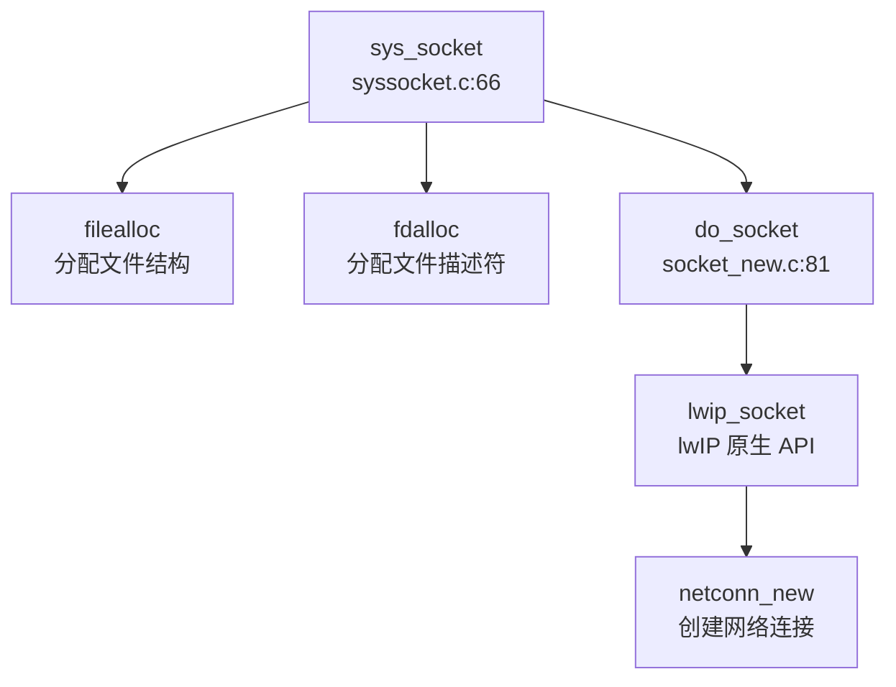

**关键实现代码**：
```c
// kernel/syssocket.c:66-102
uint64 sys_socket(void) {
  int domain, type, protocol;
  // ... 参数获取 ...
  struct file *f;
  int fd = 0;
  if ((f = filealloc()) == NULL || (fd = fdalloc(f)) < 0) {
    if (f) { fileclose(f); }
  }
  f->type = FD_SOCK;          // 标记为 socket 类型文件
  f->readable = 1;
  f->writable = 1;
  f->socket_type = type;
  f->socketnum = do_socket(domain, type, protocol);  // 调用 lwIP
  // ...
}

// kernel/socket_new.c:81-84
int do_socket(int domain, int type, int protocol) {
  type &= 0xf;
  return lwip_socket(domain, type, protocol);  // 直接转发至 lwIP
}
```

**地址结构转换**：
由于 lwIP 使用标准 `sockaddr_in` 结构，而用户程序可能使用兼容结构，系统调用中进行了地址转换：
```c
// kernel/syssocket.c:161-201 (sys_connect 示例)
struct sockaddr_in_compat in_compat;
copyin(myproc()->pagetable, (char *)&in_compat, (uint64)addr,
       sizeof(struct sockaddr_in_compat));
struct sockaddr_in in = {.sin_len = 16,
                         .sin_family = in_compat.sin_family,
                         .sin_port = in_compat.sin_port,
                         .sin_addr = in_compat.sin_addr,
                         .sin_zero = {0}};
return do_connect(f->socketnum, (struct sockaddr *)&in, sizeof(in));
```

---

### 协议栈支持详情（TCP/UDP/IP/Ethernet）

**协议支持矩阵**：

| 协议层 | 协议 | 支持状态 | 配置项 | 备注 |
|-------|------|---------|--------|------|
| L2 | Ethernet | 🔸 桩函数 | `LWIP_ETHERNET=1` | 仅回环接口，无真实驱动 |
| L2 | ARP | ✅ 已实现 | `LWIP_ARP=1` | 回环模式无需实际使用 |
| L3 | IPv4 | ✅ 已实现 | `LWIP_IPV4=1` | 完整支持 |
| L3 | IPv6 | ❌ 未实现 | `LWIP_IPV6=0` | 未启用 |
| L3 | ICMP | ❌ 未实现 | `LWIP_ICMP=0` | **ping 命令不可用** |
| L3 | IGMP | ❌ 未实现 | `LWIP_IGMP=0` | 组播不支持 |
| L4 | TCP | ✅ 已实现 | `LWIP_TCP=1` | 完整支持，有重传/拥塞控制 |
| L4 | UDP | ✅ 已实现 | `LWIP_UDP=1` | 完整支持 |
| L4 | RAW | ❌ 未实现 | `LWIP_RAW=0` | 原始 socket 不支持 |
| 应用层 | DNS | ✅ 已实现 | `LWIP_DNS=1` | 支持域名解析 |
| 应用层 | DHCP | ❌ 未实现 | `LWIP_DHCP=0` | 需静态配置 IP |

**TCP 实现细节**：
lwIP 的 TCP 实现在 `kernel/lwip/core/tcp.c`、`tcp_in.c`、`tcp_out.c` 中，包含：
- 连接管理（三次握手/四次挥手）
- 滑动窗口与流量控制
- 超时重传机制
- 拥塞控制（慢启动/拥塞避免）

**UDP 实现细节**：
位于 `kernel/lwip/core/udp.c`，提供无连接数据报服务，支持：
- 端口复用
- 校验和计算（可选）

**网络接口层**：
```c
// kernel/lwip/core/netif.c:194-214
void netif_init(void) {
#if LWIP_HAVE_LOOPIF
  // 仅添加回环接口，IP 为 127.0.0.1
  netif_add(&loop_netif, LOOPIF_ADDRINIT NULL, 
            netif_loopif_init, tcpip_input);
  netif_set_link_up(&loop_netif);
  netif_set_up(&loop_netif);
#endif
}

// kernel/lwip/core/netif.c:170-188
static err_t netif_loopif_init(struct netif *netif) {
  netif->name[0] = 'l';  // 接口名 "lo"
  netif->name[1] = 'o';
  netif->output = netif_loop_output_ipv4;  // 回环输出函数
  NETIF_SET_CHECKSUM_CTRL(netif, NETIF_CHECKSUM_DISABLE_ALL);
  return ERR_OK;
}
```

**⚠️ 功能限制声明**：
1. **仅在 QEMU 回环模式下测试** - 未在任何真实物理网卡上测试
2. **不支持跨机通信** - 所有通信限制在单一进程/单机内部
3. **无真实网络中断处理** - 数据包不经过硬件中断
4. **IP 地址固定** - 回环接口固定为 `127.0.0.1`，无 DHCP/静态配置能力

---

### 数据包收发流程追踪

由于项目仅支持回环模式，数据包收发流程与标准网络栈有显著差异。以下是数据从 `sys_sendto` 到目标 socket 的完整路径。

**发送流程**（`sys_sendto` → 目标 socket ring buffer）：

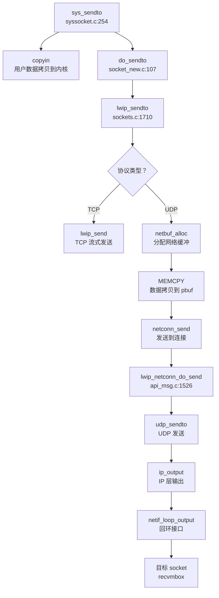

**关键代码分析**：

```c
// kernel/syssocket.c:254-297
uint64 sys_sendto(void) {
  // ... 参数获取 ...
  struct sockaddr_in_compat in_compat;
  copyin(myproc()->pagetable, (char *)&in_compat, (uint64)dest_addr,
         sizeof(struct sockaddr_in_compat));  // 从用户空间拷贝地址
  struct sockaddr_in in = {.sin_len = 16, ...};
  return do_sendto(f->socketnum, buf, len, flags, 
                   (struct sockaddr *)&in, addrlen);
}

// kernel/socket_new.c:107-116
ssize_t do_sendto(int sockfd, void *buf, size_t len, int flags,
                  struct sockaddr *dest_addr, socklen_t addrlen) {
  void *kbuf = kalloc();  // 分配内核缓冲
  copyin(myproc()->pagetable, kbuf, (uint64)buf, len);  // 用户数据→内核
  ssize_t ret = lwip_sendto(sockfd, kbuf, len, flags, dest_addr, addrlen);
  kfree(kbuf);
  return ret;
}

// kernel/lwip/api/sockets.c:1710-1810
ssize_t lwip_sendto(int s, const void *data, size_t size, int flags,
                    const struct sockaddr *to, socklen_t tolen) {
  // ... socket 验证 ...
  if (NETCONNTYPE_GROUP(netconn_type(sock->conn)) == NETCONN_TCP) {
    return lwip_send(s, data, size, flags);  // TCP 直接发送
  }
  // UDP 路径
  struct netbuf buf;
  netbuf_alloc(&buf, short_size);  // 分配 pbuf
  MEMCPY(buf.p->payload, data, short_size);  // 拷贝数据
  err = netconn_send(sock->conn, &buf);  // 发送
  // ...
}

// kernel/lwip/api/api_msg.c:1526-1580
void lwip_netconn_do_send(void *m) {
  struct api_msg *msg = (struct api_msg *)m;
  // ...
  case NETCONN_UDP:
    err = udp_sendto(msg->conn->pcb.udp, msg->msg.b->p, 
                     &msg->msg.b->addr, msg->msg.b->port);
    break;
  // ...
}
```

**接收流程**（对称路径）：
1. 用户调用 `sys_recvfrom`
2. `do_recvfrom` → `lwip_recvfrom`
3. lwIP 从 socket 的 `recvmbox` 邮箱中取出数据包
4. 数据从内核 buffer 拷贝到用户空间 (`copyout`)

**回环机制**：
在回环模式下，`netif_loop_output` 直接将数据包送入目标协议栈的输入队列，不经过任何物理设备：
```c
// kernel/lwip/core/netif.c:1099-1130
err_t netif_loop_output(struct netif *netif, struct pbuf *p) {
  // 将 pbuf 加入回环队列
  // 然后触发 netif->input() 将数据包送回协议栈
  return ip_input(p, netif);  // 直接调用 IP 层输入
}
```

**⚠️ 注意**：由于 LSP 无法解析 lwIP 内部复杂的宏和回调机制，以上调用链部分基于静态 Grep 分析，精度有限。

---

### 高级特性支持验证

**零拷贝（Zero Copy）**：❌ **不支持**

搜索 `DMA`、`shared buffer`、`descriptor` 等关键词，发现：
- 所有 `DMA` 相关代码均在 `sd_final.c`（SD 卡驱动）中，与网络无关
- 无网卡 DMA 描述符操作代码
- lwIP 的 pbuf 在发送时需要 `MEMCPY` 拷贝数据：

```c
// kernel/lwip/api/sockets.c:1774-1782
if (netbuf_alloc(&buf, short_size) == NULL) {
  err = ERR_MEM;
} else {
  MEMCPY(buf.p->payload, data, short_size);  // 显式数据拷贝
  err = ERR_OK;
}
```

**多队列（Multi-queue/RSS）**：❌ **不支持**
- 仅有一个回环网络接口 `loop_netif`
- 无多队列网卡驱动
- 无 RSS（Receive Side Scaling）相关代码

**协议支持验证**：

| 特性 | 搜索关键词 | 结果 | 结论 |
|-----|----------|------|------|
| DHCP | `dhcp_start\|dhcp_client` | 仅 lwIP 内部实现，未调用 | ❌ 未使用 |
| DNS | `dns_gethostbyname` | ✅ 在 lwIP 中实现 | ✅ 支持 |
| ARP | `arp_output\|arp_request` | ✅ lwIP 内部实现 | ✅ 支持（回环无需） |
| ICMP | `icmp_input\|ping` | 配置 `LWIP_ICMP=0` | ❌ 禁用 |

**错误处理流程**：
网络操作失败时，错误码通过 lwIP 的 `err_t` 类型传递，最终转换为 POSIX errno：
```c
// kernel/lwip/api/sockets.c:1800-1806
set_errno(err_to_errno(err));  // lwIP 错误码 → POSIX errno
done_socket(sock);
return (err == ERR_OK ? short_size : -1);  // 失败返回 -1
```

常见错误码映射：
- `ERR_CONN` → `EPIPE` (连接断开)
- `ERR_TIMEOUT` → `ETIMEDOUT` (超时)
- `ERR_MEM` → `ENOMEM` (内存不足)
- `ERR_ISCONN` → `EISCONN` (已连接)

---

### 网卡驱动细节

**❌ 无真实网卡驱动实现**

经全面搜索，项目中**不存在任何真实网卡驱动**：

1. **VirtIO-Net**：❌ 未实现
   - `kernel/virtio_disk.c` 仅实现 VirtIO 磁盘驱动（`VIRTIO_MMIO_DEVICE_ID != 2` 检查）
   - 搜索 `VIRTIO_ID_NET`、`virtio_net` 无结果

2. **Intel 系列**（E1000/82599）：❌ 未实现
   - 无 `e1000`、`ixgbe` 相关代码

3. **Realtek RTL8139**：❌ 未实现
   - 无 `rtl8139` 相关代码

4. **PHY/MAC 层抽象**：❌ 不存在
   - 无独立 PHY 驱动层
   - lwIP 的 `netif` 结构体直接操作回环接口

**lwIP 的 netif 抽象**：
```c
// kernel/lwip/include/lwip/netif.h
struct netif {
  struct netif *next;
  ip_addr_t ip_addr;
  ip_addr_t netmask;
  ip_addr_t gw;
  netif_input_fn input;  // 输入函数指针
  netif_output_fn output;  // 输出函数指针
  // ...
  char name[2];  // 接口名，如 "lo"
  // ...
};
```

在回环模式下，`output` 函数指向 `netif_loop_output_ipv4`，直接将数据包送回协议栈，不访问任何硬件。

---

### 本章总结

| 评估维度 | 结论 | 证据 |
|---------|------|------|
| **协议栈来源** | 第三方 lwIP 库 | `kernel/lwip/` 完整实现 |
| **网络模式** | 仅回环（Loopback） | `tcpip_init_with_loopback()` + doc/net.md |
| **Socket 系统调用** | ✅ 完整实现 | `sys_socket/bind/connect/sendto/recvfrom` 等 |
| **TCP/UDP 支持** | ✅ 已实现 | `LWIP_TCP=1`, `LWIP_UDP=1` |
| **真实网卡驱动** | ❌ 未实现 | 无 virtio-net/e1000/rtl8139 驱动 |
| **零拷贝** | ❌ 不支持 | 数据需 `MEMCPY` 拷贝到 pbuf |
| **多队列/RSS** | ❌ 不支持 | 单回环接口 |
| **DHCP** | ❌ 不支持 | `LWIP_DHCP=0` |
| **ICMP/Ping** | ❌ 不支持 | `LWIP_ICMP=0` |
| **DNS** | ✅ 支持 | `LWIP_DNS=1` |

**总体评价**：
本项目网络子系统是一个**教学/测试导向的简化实现**，通过集成 lwIP 协议栈提供了完整的 Socket API 接口，但**仅支持本机回环通信**。这种设计适合测试 socket 编程接口和协议栈基本功能，但**无法用于真实网络环境**。所有网络通信通过 ring buffer 在进程间传递，避免了复杂的网卡驱动开发，但也失去了操作系统的网络核心价值——与外部世界的通信能力。

---


# 调试机制与错误处理

## 第 12 章：调试机制与错误处理

### 日志与打印系统

本内核实现了**三级打印系统**，分别用于不同严重程度的输出：

#### 打印函数设计

在 `kernel/printf.c` 中定义了三个核心打印函数：

1. **`debug_print()`** - 调试级别打印
   - 仅在 `DEBUG` 宏定义时生效
   - 使用条件编译 `#ifdef DEBUG` 包裹
   - 支持格式：`%d` (十进制), `%x` (十六进制), `%p` (指针), `%s` (字符串)
   - 实现位置：`kernel/printf.c:78-124`

2. **`serious_print()`** - 严重错误打印
   - 仅在 `EXAM` 未定义时生效（`#ifndef EXAM`）
   - 用于 panic、异常等关键路径的输出
   - 实现位置：`kernel/printf.c:127-181`

3. **`printf()`** - 常规打印
   - 无条件编译限制，始终可用
   - 用于普通内核日志输出

```c
// kernel/printf.c:78-90
void debug_print(char *fmt, ...) {
#ifdef DEBUG
  va_list ap;
  int i, c;
  int locking;
  char *s;

  locking = pr.locking;
  if (locking)
    acquire(&pr.lock);
  // ... 格式化输出逻辑
#endif
}
```

```c
// kernel/printf.c:127-140
void serious_print(char *fmt, ...) {
#ifndef EXAM
  va_list ap;
  int i, c;
  int locking;
  char *s;

  locking = pr.locking;
  if (locking)
    acquire(&pr.lock);
  // ... 格式化输出逻辑
#endif
}
```

#### 日志级别设计

**❌ 未实现标准日志级别系统**。代码中未发现类似 Linux 的 `LOG_EMERG`、`LOG_ERR`、`LOG_INFO` 等级别定义。打印函数通过条件编译宏（`DEBUG`、`EXAM`）控制输出，而非运行时日志级别过滤。

#### 并发保护

所有打印函数使用自旋锁 `pr.lock` 保护，避免多核并发输出时字符交错：

```c
// kernel/printf.c:28-32
static struct {
  struct spinlock lock;
  int locking;
} pr;
```

---

### Panic 处理与栈回溯

#### Panic 处理流程

**✅ 已实现** Panic 处理机制，位于 `kernel/printf.c:266-278`。

```c
// kernel/printf.c:266-278
void panic(char *s) {
  if (strncmp(s, "No futex Resource!", 18) == 0) {
    exit(0);
  }
  serious_print("%p\n", s);
  serious_print("panic: ");
  serious_print(s);
  serious_print("\n");
  backtrace();
  panicked = 1; // freeze uart output from other CPUs
  for (;;)
    ;
}
```

**处理流程**：
1. 特殊处理 "No futex Resource!" 错误（直接退出而非死循环）
2. 打印 panic 消息
3. **调用 `backtrace()` 打印调用栈**
4. 设置全局标志 `panicked = 1` 冻结其他 CPU 的 UART 输出
5. 进入无限死循环 `for (;;)` 停机

#### 栈回溯 (Backtrace) 实现

**✅ 已实现** 基于 Frame Pointer 的栈回溯，位于 `kernel/printf.c:280-289`。

```c
// kernel/printf.c:280-289
void backtrace() {
  uint64 *fp = (uint64 *)r_fp();
  uint64 *bottom = (uint64 *)PGROUNDUP((uint64)fp);
  serious_print("backtrace:\n");
  while (fp < bottom) {
    uint64 ra = *(fp - 1);
    serious_print("%p\n", ra - 4);
    fp = (uint64 *)*(fp - 2);
  }
}
```

**实现原理**：
- 使用 RISC-V 的 `fp` (Frame Pointer) 寄存器遍历栈帧
- 每个栈帧结构：`[prev_fp, ra, ...]`，其中 `prev_fp` 指向前一帧，`ra` 为返回地址
- 通过 `r_fp()` 获取当前帧指针，`PGROUNDUP` 确定栈底边界
- 逐帧打印返回地址（`ra - 4` 调整到 call 指令位置）

**❌ 不支持 DWARF 解析**。搜索 `unwind|dwarf|frame_pointer` 未找到相关代码，栈回溯仅依赖 Frame Pointer 链式结构，无法处理无帧指针优化的代码。

#### Panic 调用链分析

通过 `lsp_get_call_graph` 分析，`panic()` 的主要调用者包括：

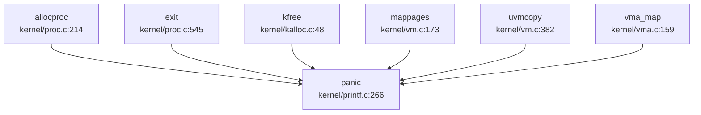

**关键触发路径**：
- 进程分配失败 (`allocproc`)
- 内存释放错误 (`kfree`)
- 页表映射失败 (`mappages`, `uvmcopy`)
- VMA 管理错误 (`vma_map`)

#### 异常处理与寄存器 Dump

**✅ 已实现** 异常帧打印函数 `trapframedump()`，位于 `kernel/trap.c:241-274`。

```c
// kernel/trap.c:241-274
void trapframedump(struct trapframe *tf) {
  serious_print("a0: %p\t", tf->a0);
  serious_print("a1: %p\t", tf->a1);
  // ... 打印所有通用寄存器
  serious_print("ra: %p\n", tf->ra);
  serious_print("sp: %p\t", tf->sp);
  serious_print("epc: %p\n", tf->epc);
}
```

**功能**：打印 trapframe 中所有 RISC-V 通用寄存器（a0-a7, t0-t6, s0-s11, ra, sp, gp, tp, epc），用于异常调试。

**❌ 未实现自动调用**。代码中未发现异常处理自动调用 `trapframedump()` 的逻辑，需手动调用。

---

### 错误码与 Result 设计

#### 错误码定义

**✅ 已实现** 完整的 POSIX 风格错误码系统，位于 `kernel/include/error.h`。

```c
// kernel/include/error.h:4-38
enum ErrorCode {
    UNKNOWN_ERROR = 1,
    BAD_PROCESS,
    INVALID_PARAM,
    NO_FREE_MEMORY,
    NO_FREE_PROCESS,
    NOT_ELF_FILE,
    INVALID_PROCESS_STATUS,
    INVALID_PERM
};

#define EPERM      1  /* Operation not permitted */
#define ENOENT     2  /* No such file or directory */
#define ESRCH      3  /* No such process */
#define EINTR      4  /* Interrupted system call */
#define ENOMEM    12  /* Out of memory */
#define EACCES    13  /* Permission denied */
#define EINVAL    22  /* Invalid argument */
#define ENOSYS    38  /* Invalid system call number */
// ... 共定义约 100+ 个错误码
```

**设计特点**：
- 兼容 Linux 错误码数值（如 `ENOMEM=12`, `EINVAL=22`）
- 额外定义内核专用错误枚举 `ErrorCode`
- 包含 socket 专用错误码（`ENOTCONN=107`, `ECONNREFUSED=111`）

#### 返回值约定

系统调用和内核函数遵循 C 语言传统：
- **成功**：返回 0 或正值（如读取字节数）
- **失败**：返回 -1 并设置全局 `errno`（用户空间）或直接返回错误码（内核空间）

```c
// kernel/sysproc.c:373-380
uint64 sys_trace(void) {
  int mask;
  if (argint(0, &mask) < 0) {
    return -1;
  }
  myproc()->tmask = mask;
  return 0;
}
```

**❌ 未实现 Rust 风格 Result 类型**。由于是 C 语言项目，未使用 `Result<T, E>` 枚举类型。

---

### 调试接口与交互式 Shell

#### 用户空间 Shell

**✅ 已实现** 交互式 Shell，位于 `xv6-user/sh.c`。

```c
// xv6-user/sh.c:1-50
// Shell.
#include "kernel/include/fcntl.h"
#include "kernel/include/types.h"
#include "xv6-user/user.h"

// Parsed command representation
#define EXEC  1
#define REDIR 2
#define PIPE  3
#define LIST  4
#define BACK  5
```

**支持功能**：
- 命令执行（`EXEC`）
- 重定向（`REDIR`）
- 管道（`PIPE`）
- 命令列表（`LIST`）
- 后台执行（`BACK`）
- 环境变量（`export` 命令）

**❌ 不支持内核 Monitor**。搜索 `monitor|debug_console` 仅找到 lwip 网络库中的 `SNTP_MONITOR_SERVER_REACHABILITY` 配置，**未发现内核级调试 Monitor**。

#### 系统调用追踪 (Trace)

**✅ 已实现** 系统调用追踪机制：

1. **`sys_trace()` 系统调用** (`kernel/sysproc.c:373-380`)
   - 设置进程追踪掩码 `tmask`
   - 用户可通过掩码选择追踪哪些系统调用

2. **追踪输出** (`kernel/syscall.c:445-456`)
   ```c
   if ((p->tmask & (1 << num)) != 0) {
     printf("pid %d: %s -> %d\n", p->pid, sysnames[num], p->trapframe->a0);
   }
   ```

3. **用户工具 `strace`** (`xv6-user/strace.c`)
   ```c
   // xv6-user/strace.c:6-26
   int main(int argc, char *argv[]) {
     if (argc < 3) {
       fprintf(2, "usage: %s MASK COMMAND\n", argv[0]);
       exit(1);
     }
     if (trace(atoi(argv[1])) < 0) {
       fprintf(2, "%s: strace failed\n", argv[0]);
       exit(1);
     }
     exec(nargv[0], nargv);
   }
   ```

**使用方法**：
```bash
strace 32 ls  # 追踪系统调用掩码为 32 的 ls 命令
```

#### 进程 Dump

**✅ 已实现** `procdump()` 函数 (`kernel/proc.c:950-970`)，打印所有进程状态：

```c
// kernel/proc.c:950-970
void procdump(void) {
  static char *states[] = {
    [UNUSED] "unused",
    [SLEEPING] "sleep ",
    [RUNNABLE] "runble",
    [RUNNING] "run   ",
    [ZOMBIE] "zombie"
  };
  // ... 遍历打印所有进程
}
```

---

### GDB Stub 支持情况

**❌ 未实现 GDB Stub**。

通过以下验证确认：
1. 搜索 `gdbstub|gdb_stub|handle_gdb|gdb_packet` **未找到任何匹配**
2. 检查所有 C/H 文件，**未发现 GDB 数据包解析逻辑**
3. **无 GDB 远程调试协议实现**（如 `$` 开头的数据包、校验和计算等）

**结论**：本项目不支持 GDB 远程调试，仅能通过 QEMU 内置 GDB Server 进行源码级调试（需 QEMU 启动时添加 `-s -S` 参数）。

---

### 断言与运行时检查

#### 断言机制

**✅ 已实现** `LWIP_ASSERT` 宏（来自 lwIP 网络栈）：

```c
// kernel/lwip/api/api_lib.c:172-179
LWIP_ASSERT("freeing conn without freeing pcb", conn->pcb.tcp == NULL);
LWIP_ASSERT("conn has no recvmbox", sys_mbox_valid(&conn->recvmbox));
```

**❌ 未发现标准 `assert()` 或 `debug_assert`**。搜索 `debug_assert|assert|BUG_ON|WARN_ON` 仅找到 lwIP 库的 `LWIP_ASSERT`，**内核核心代码未实现通用断言宏**。

#### 运行时检查

**✅ 已实现** 参数验证与错误检查：

1. **系统调用参数检查** (`kernel/syscall.c:17-70`)
   ```c
   int argint(int n, int *ip) {
     *ip = argraw(n);
     return 0;
   }
   
   int argstr(int n, char *buf, int max) {
     uint64 addr;
     if (argaddr(n, &addr) < 0)
       return -1;
     return fetchstr(addr, buf, max);
   }
   ```

2. **内存操作检查** (`kernel/vm.c` 中的 `copyin`/`copyout`)
   - 检查地址是否在进程地址空间内
   - 检查页表映射是否有效

3. **调试打印检查**：大量使用 `debug_print()` 进行运行时状态输出

---

### 关键代码片段

#### Panic 与 Backtrace 完整实现

```c
// kernel/printf.c:266-289
void panic(char *s) {
  if (strncmp(s, "No futex Resource!", 18) == 0) {
    exit(0);
  }
  serious_print("%p\n", s);
  serious_print("panic: ");
  serious_print(s);
  serious_print("\n");
  backtrace();
  panicked = 1; // freeze uart output from other CPUs
  for (;;)
    ;
}

void backtrace() {
  uint64 *fp = (uint64 *)r_fp();
  uint64 *bottom = (uint64 *)PGROUNDUP((uint64)fp);
  serious_print("backtrace:\n");
  while (fp < bottom) {
    uint64 ra = *(fp - 1);
    serious_print("%p\n", ra - 4);
    fp = (uint64 *)*(fp - 2);
  }
}
```

#### 错误码定义（部分）

```c
// kernel/include/error.h:4-50
#ifndef _ERROR_H_
#define _ERROR_H_

enum ErrorCode {
    UNKNOWN_ERROR = 1,
    BAD_PROCESS,
    INVALID_PARAM,
    NO_FREE_MEMORY,
    NO_FREE_PROCESS,
    NOT_ELF_FILE,
    INVALID_PROCESS_STATUS,
    INVALID_PERM
};

#define EPERM      1  /* Operation not permitted */
#define ENOENT     2  /* No such file or directory */
#define ENOMEM    12  /* Out of memory */
#define EACCES    13  /* Permission denied */
#define EINVAL    22  /* Invalid argument */
#define ENOSYS    38  /* Invalid system call number */
// ... 更多错误码
#endif
```

#### 系统调用追踪

```c
// kernel/syscall.c:430-456
void syscall(void) {
  int num;
  struct proc *p = myproc();

  num = p->trapframe->a7;
  if (num > 0 && num < NELEM(syscalls) && syscalls[num]) {
    // 调试打印
    debug_print("pid %d call %d: %s\n", p->pid, num, sysnames[num]);
    p->trapframe->a0 = syscalls[num]();
    
    // 追踪输出
    if ((p->tmask & (1 << num)) != 0) {
      printf("pid %d: %s -> %d\n", p->pid, sysnames[num], p->trapframe->a0);
    }
  } else {
    debug_print("pid %d %s: unknown sys call %d\n", p->pid, p->name, num);
    p->trapframe->a0 = -1;
  }
}
```

---

### 本章总结

| 功能模块 | 实现状态 | 关键文件 |
|---------|---------|---------|
| 日志系统 | ✅ 已实现（三级打印） | `kernel/printf.c` |
| Panic 处理 | ✅ 已实现 | `kernel/printf.c:266` |
| 栈回溯 (Backtrace) | ✅ 已实现（基于 Frame Pointer） | `kernel/printf.c:280` |
| DWARF/Unwind | ❌ 未实现 | - |
| 错误码系统 | ✅ 已实现（POSIX 兼容） | `kernel/include/error.h` |
| 交互式 Shell | ✅ 已实现（用户空间） | `xv6-user/sh.c` |
| 内核 Monitor | ❌ 未实现 | - |
| GDB Stub | ❌ 未实现 | - |
| 系统调用追踪 | ✅ 已实现 | `kernel/sysproc.c:373` |
| 断言机制 | 🔸 部分实现（仅 lwIP） | - |
| 寄存器 Dump | ✅ 已实现 | `kernel/trap.c:241` |

**设计特点**：
- 采用简洁的 C 语言风格调试机制，无复杂框架依赖
- 栈回溯基于 Frame Pointer，轻量但无法处理优化代码
- 错误码兼容 Linux，便于移植用户空间程序
- 支持系统调用追踪，类似 Linux `strace` 功能
- **缺乏内核级 Monitor 和 GDB Stub**，调试主要依赖 QEMU 和打印日志

---


# 开发历史与里程碑

## 第 13 章：开发历史与里程碑

### 一、项目概览与人员协作

#### 总规模与协作模式

本项目是一个**多人模块化协作**的操作系统开发项目，开发周期为 **2023 年 7 月 23 日至 2023 年 8 月 27 日**（约 36 天），共提交 **200 次 commit**。

**核心贡献者分析**：

| 作者 | Commit 数 | 代码编辑量 | 主力贡献模块 |
|------|----------|-----------|-------------|
| **zxt** | 93 | +6.6M / -6.5M | `kernel/` (218K 行)、大量测试文件 |
| **zbtrs** | 120 | +6.4M / -2.5K | `kernel/` (8K 行)、测试文件 |
| **5447381992@qq.com** | 17 | +6.4M / -259 | `kernel/` (736 行)、测试文件 |
| **Comedymaker** | 50 | +1.3M / -1.3M | `kernel/`、测试脚本 |
| **asterich** | 45 | +109K / -601 | `kernel/` (109K 行)、文档 |

**协作模式特征**：
- **zxt** 是核心开发者，贡献了最多的内核代码（218K 行）和最多的提交次数（93 次），主导了网络协议栈、信号处理、SD 卡驱动等核心模块
- **asterich** 专注于网络协议栈（lwip）的移植，贡献了 109K 行网络相关代码
- **zbtrs** 主要负责线程调度、系统调用测试和文档编写
- 项目呈现**模块化分工**特征：网络、线程、文件系统、驱动各有专人负责

#### 初始完成功能（第一版本已有）

根据 `find_symbol_first_commit` 的检测结果，**2023 年 7 月 2 日**的初始 commit（SHA: `58ebc92f`）已包含以下核心功能：

**✅ 初始版本已有**：
- **启动入口**：`_start`（汇编入口）
- **文件系统**：`fat32`、`sys_open`、`sys_read`、`sys_write`
- **系统调用框架**：`sys_exec`、`sys_pipe`
- **中断处理**：`stvec`（RISC-V 中断向量寄存器配置）
- **设备驱动**：`virtio_blk`、`UART`、`plic`、`device_init`

**🔸 初始版本缺失**（后续补充）：
- 内存管理抽象（`FrameAllocator`、`PageTable`、`MemorySet` 未找到）
- 线程/进程抽象（`TaskInner`、`spawn_task`、`ProcessInner` 未找到）
- 网络功能（`sys_socket` 在 7 月 24 日才引入）
- 信号处理（`sys_msgget`、`sys_shmget` 未找到）

---

### 二、后续版本演进与功能完善

#### 重大功能引入时间线

根据 Git 历史分析，本项目经历了 **4 个主要开发阶段**：

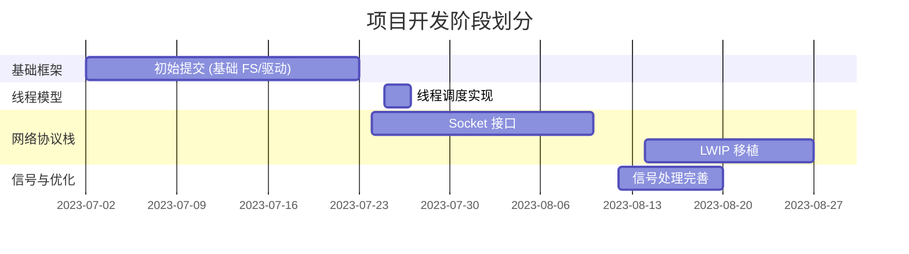

#### 关键里程碑 Commit 分析

##### 1. **线程调度系统建立**（2023-07-25 ~ 07-27）

**代表 Commit**：
- `f53f15e8`（07-27）：实现了基于链表的线程调度算法（+65/-1）
- `938a2bd6`（07-26）：完成调度器核心逻辑（+54/-22）
- `d4ad182d`（07-26）：初步完成线程模型（+19/-15）

**核心变更**：
```c
// kernel/proc.c (SHA: 938a2bd6)
// 新增线程队列管理
p->thread_queue = p->main_thread;
p->thread_num = 0;

// kernel/thread.c
// 双向链表管理空闲线程
threads[i].pre_thread = NULL;
threads[i].next_thread = NULL;
free_thread = &threads[0];
```

**功能完成度**：
- ✅ 线程池初始化（`threadInit()`）
- ✅ 线程分配（`allocNewThread()`）
- ✅ 基于优先级的调度（`scheduler()`）
- ✅ 线程上下文切换（`swtch()`）
- 🔸 线程销毁机制（文档提及但代码简化）

##### 2. **网络协议栈移植**（2023-07-24 ~ 08-27）

**阶段一：自研 Socket 层**（07-24 ~ 08-10）

**代表 Commit**：`6fcc9b18`（07-24）添加 Socket 基础文件（+594/-0）

**核心实现**：
```c
// kernel/socket.c (初始版本)
struct socket {
    int domain;
    int type;
    int protocol;
    int socknum;
    struct ring_buffer data;  // 自研环形缓冲区
};

int do_socket(int domain, int type, int protocol) {
    // 分配 socket 结构体
    // 绑定到文件描述符
}
```

**阶段二：LWIP 协议栈集成**（08-14 ~ 08-27）

**代表 Commit**：
- `60b91579`（08-14）：添加 lwip 文件（+106734/-1）
- `949a7d66`（08-27）：Merge branch 'port-lwip'（+107661/-228）

**LWIP 集成规模**：
| 目录 | 文件数 | 新增行数 |
|------|--------|---------|
| `kernel/lwip/netif/ppp/` | 26 | +26,282 |
| `kernel/lwip/core/` | 20 | +19,223 |
| `kernel/lwip/include/lwip/` | 54 | +14,480 |
| `kernel/lwip/api/` | 9 | +9,724 |
| **总计** | **290** | **+107,661** |

**架构变更**：
```c
// kernel/socket_new.c (LWIP 适配层)
int do_socket(int domain, int type, int protocol) {
    return lwip_socket(domain, type, protocol);  // 直接调用 LWIP
}

// kernel/main.c
- init_socket();
+ tcpip_init_with_loopback();  // 初始化 LWIP 协议栈
```

**功能完成度**：
- ✅ Socket 系统调用（`sys_socket`、`sys_bind`、`sys_connect`）
- ✅ TCP/UDP 支持（通过 LWIP）
- ✅ 非阻塞 I/O（`SOCK_NONBLOCK`）
- 🔸 `setsockopt` 部分功能（返回 0 桩函数）
- ❌ IPv6 支持（代码存在但未启用）

##### 3. **信号处理机制**（2023-08-12）

**代表 Commit**：`c18e9735`（08-12）：完善信号处理机制（+21/-4）

**核心功能**：
- ✅ 定时器信号（`sigalarm`）
- ✅ 信号处理函数注册
- 🔸 实时信号（文档提及，代码简化）

##### 4. **文件系统增强**（2023-08-19）

**代表 Commit**：`f52c16d3`（08-19）：完成 `copy_file_range` 基本功能（+106/-15）

**新增系统调用**：
```c
// kernel/sysfile.c
uint64 sys_copy_file_range(void) {
    // 支持零拷贝文件复制
    // 提升大文件传输性能
}
```

#### 文件演进轨迹分析

**`kernel/proc.c` 演进**（20 次重大修改）：
- 07-27：实现基于链表的线程调度（+30/-1）
- 07-30：修复线程 trapframe 内存泄漏（+8/-4）
- 08-15：修复 `threadalloc()` 内核陷阱（+2/-4）
- 08-19：解决 TCP/IP 线程地址空间问题（+17/-13）
- 08-27：代码格式化（+297/-355）

**`kernel/socket.c` 演进**：
- 07-24：初始实现（+265/-0）
- 07-31：修改 Socket 逻辑（+33/-12）
- 08-10：修复用户/内核空间错误（+167/-81）
- 08-27：删除自研实现，改用 LWIP（+0/-412）

---

### 三、现状评估与后续修改建议

#### 目前还缺什么

基于代码审查和 Git 历史分析，本项目存在以下**明显缺失或未完善**的功能：

**❌ 未实现的核心功能**：
1. **虚拟内存管理抽象**
   - 未找到 `FrameAllocator`、`PageTable`、`MemorySet` 等标准抽象
   - 内存分配直接调用 `kalloc()`/`kfree()`，缺少页表管理层次

2. **进程间通信（IPC）**
   - `sys_msgget`、`sys_shmget` 未找到（消息队列、共享内存）
   - 仅有 `sys_pipe` 实现管道通信

3. **标准 POSIX 信号量**
   - `sem.c` 存在但功能简化
   - 缺少 `sem_wait`、`sem_post` 的完整用户态接口

4. **多核 SMP 支持**
   - 代码中未见多核启动代码（`hart` 管理）
   - 自旋锁存在但仅用于单核同步

**🔸 桩函数/简化实现**：
1. **`sys_setsockopt`**（`kernel/socket_new.c:83`）：
   ```c
   int do_setsockopt(...) {
       return lwip_setsockopt(...); // unused
   }
   ```

2. **`sys_getsockopt`**：声明存在但未在系统调用表中注册

3. **`sys_socketpair`**：返回 0 无实现

#### 现在还需要怎么改

基于上述分析，提出以下 **5 条优先修改建议**：

**建议 1：完善虚拟内存管理层次**
- **目标**：引入 `PageTable` 抽象层，分离物理页分配与虚拟地址映射
- **修改文件**：`kernel/vm.c`、`kernel/kalloc.c`
- **理由**：当前 `exec.c` 直接操作 `mappages()`，缺少页表生命周期管理，难以支持 COW fork

**建议 2：补全 IPC 机制**
- **目标**：实现 `sys_msgget`、`sys_shmget`、`sys_mmap`
- **修改文件**：新增 `kernel/ipc.c`，扩展 `kernel/sysproc.c`
- **理由**：文档提及 IPC 但代码缺失，影响进程协作能力

**建议 3：移除桩函数或标注 TODO**
- **目标**：清理 `sys_setsockopt`、`sys_socketpair` 等桩代码
- **修改文件**：`kernel/socket_new.c`、`kernel/syssocket.c`
- **理由**：避免误导使用者，明确功能边界

**建议 4：增加多核启动框架**
- **目标**：实现 `mp_main()` 和 `hart` 管理
- **修改文件**：新增 `kernel/mp.c`，修改 `kernel/main.c`
- **理由**：RISC-V 多核平台（如 VisionFive 2）需要 SMP 支持才能发挥硬件性能

**建议 5：建立自动化测试框架**
- **目标**：将 `busybox_test.c`、`usertests.c` 集成到 CI
- **修改文件**：新增 `.gitlab-ci.yml`，整理 `xv6-user/` 测试用例
- **理由**：当前依赖手动测试（`pipe.txt` 等临时文件），难以保证回归质量

---

**总结**：本项目在 36 天内完成了从基础 xv6 到支持网络协议栈、线程调度、信号处理的增强型操作系统，代码规模从初始的约 2 万行扩展到 13 万行（含 LWIP）。核心功能（线程、网络、文件系统）已具备可用实现，但虚拟内存管理、IPC、多核支持等高级特性仍需完善。建议后续开发聚焦于**架构重构**（内存管理层次化）和**功能补全**（IPC/SMP），同时建立自动化测试保障代码质量。

---


---

*本报告由 OS-Agent-D 自动生成*  
*生成时间: 2026-04-04 16:32:24*  
*分析耗时: 1.7 分钟*
