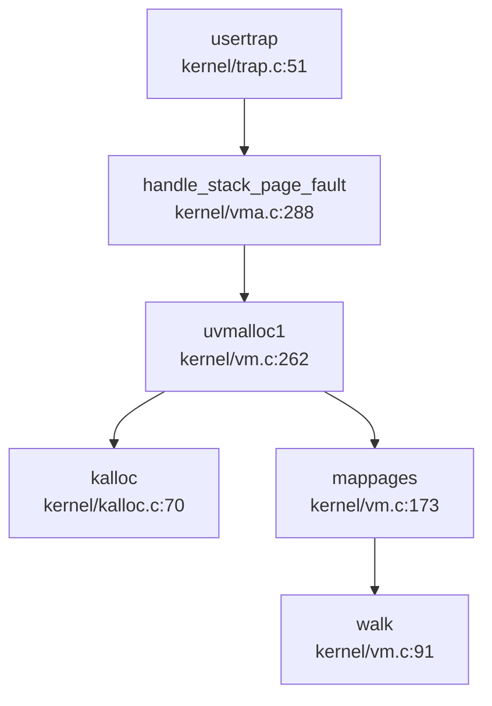

# 内存管理对比报告：oskernel2023-avx vs oskernrl2022-rv6

## 分配器差异

### 物理内存分配器

| 项目 | 实现方式 | 核心文件 | 接口函数 | 特点 |
|------|----------|----------|----------|------|
| **oskernel2023-avx** | 空闲链表（Free List） | `kernel/kalloc.c:17-87` | `kalloc()`, `kfree()` | 4096 字节页级分配，自旋锁保护，填充 `0x05`/`0x01` 调试 |
| **oskernrl2022-rv6** | 空闲链表 + 类 Slab 分配器 | `src/pm.c:56-80` + `src/kmalloc.c:17-280` | `allocpage()`, `freepage()`, `kmalloc()`, `kfree()` | 页级分配 + 32-4048 字节小对象分配，17 桶哈希索引 |

**oskernel2023-avx 物理页分配器代码**（`kernel/kalloc.c:17-87`）：
```c
struct run {
  struct run *next;
};
struct {
  struct spinlock lock;
  struct run *freelist;
  uint64 npage;
} kmem;

void *kalloc(void) {
  struct run *r;
  acquire(&kmem.lock);
  r = kmem.freelist;
  if (r) {
    kmem.freelist = r->next;
    kmem.npage--;
  }
  release(&kmem.lock);
  if (r) memset((char*)r, 5, PGSIZE);
  return (void*)r;
}
```

**oskernrl2022-rv6 类 Slab 分配器**（`src/kmalloc.c:17-60`）：
```c
#define KMEM_OBJ_MIN_SIZE   32
#define KMEM_OBJ_MAX_SIZE   4048
#define KMEM_TABLE_SIZE     17

struct kmem_node {
  struct kmem_node *next;
  struct { uint64 obj_size; uint64 obj_addr; } config;
  uint8 avail, cnt;
  uint8 table[KMEM_OBJ_MAX_COUNT];
};

struct kmem_allocator {
  struct spinlock lock;
  uint obj_size;
  uint16 npages, nobjs;
  struct kmem_node *list;
  struct kmem_allocator *next;
};
```

**【差异分析】**：
- oskernrl2022-rv6 在内核态提供了更细粒度的 `kmalloc()` 分配器，支持 32-4048 字节对象
- oskernel2023-avx 内核仅支持页级分配，小对象（如 `struct vma`）直接调用 `kalloc()`

---

### 堆分配器（用户态）

| 项目 | 实现方式 | 核心文件 | 特点 |
|------|----------|----------|------|
| **oskernel2023-avx** | 隐式空闲链表（首次适配） | `xv6-user/umalloc.c:24-84` | `malloc()`/`free()` 通过 `sbrk()` 向内核申请 |
| **oskernrl2022-rv6** | brk/sbrk 系统调用 | `src/sysproc.c:163-169` + `src/vma.c:530-544` | `growproc()` 调用 `alloc_addr_heap_vma()` |

**❌ 两者都未实现惰性堆分配**：
- oskernel2023-avx: `growproc()` 中 `uvmalloc1()` 立即分配物理页（`kernel/vm.c:262-295`）
- oskernrl2022-rv6: `uvmalloc()` 直接调用 `allocpage()` 分配物理页

---

## 页表差异

### 页表结构对比

| 项目 | 页表类型 | 结构定义 | 文件位置 |
|------|----------|----------|----------|
| **oskernel2023-avx** | Sv39 三级页表 | `typedef uint64 *pagetable_t` | `kernel/include/riscv.h:372` |
| **oskernrl2022-rv6** | Sv39 三级页表 | `typedef uint64 *pagetable_t` | `src/include/riscv.h:379` |

**页表项权限位**（两者一致）：
```c
#define PTE_V (1L << 0)  // Valid
#define PTE_R (1L << 1)  // Readable
#define PTE_W (1L << 2)  // Writable
#define PTE_X (1L << 3)  // Executable
#define PTE_U (1L << 4)  // User accessible
#define PTE_A (1L << 6)  // Accessed
#define PTE_D (1L << 7)  // Dirty
```

### 页表操作函数对比

| 函数 | oskernel2023-avx | oskernrl2022-rv6 | 差异 |
|------|------------------|------------------|------|
| `walk()` | `kernel/vm.c:91` | `src/vm.c:141` | 实现逻辑一致 |
| `mappages()` | `kernel/vm.c:173` | `src/vm.c:83` | oskernrl2022-rv6 自动设置 `PTE_A|PTE_D` |
| `vmunmap()` | `kernel/vm.c:203` | `src/vm.c:112` | 实现逻辑一致 |
| `walkaddr()` | `kernel/vm.c:115` | `src/vm.c:165` | 实现逻辑一致 |

**`walk()` 函数对比**：

**oskernel2023-avx**（`kernel/vm.c:91-112`）：
```c
pte_t *walk(pagetable_t pagetable, uint64 va, int alloc) {
  if (va >= MAXVA) panic("walk");
  for (int level = 2; level > 0; level--) {
    pte_t *pte = &pagetable[PX(level, va)];
    if (*pte & PTE_V) {
      pagetable = (pagetable_t)PTE2PA(*pte);
    } else {
      if (!alloc || (pagetable = (pde_t *)kalloc()) == NULL)
        return NULL;
      memset(pagetable, 0, PGSIZE);
      *pte = PA2PTE(pagetable) | PTE_V;
    }
  }
  return &pagetable[PX(0, va)];
}
```

**oskernrl2022-rv6**（`src/vm.c:141-160`）：
```c
pte_t *walk(pagetable_t pagetable, uint64 va, int alloc) {
  if(va >= MAXVA) panic("walk");
  for(int level = 2; level > 0; level--) {
    pte_t *pte = &pagetable[PX(level, va)];
    if(*pte & PTE_V) {
      pagetable = (pagetable_t)PTE2PA(*pte);
    } else {
      if(!alloc || (pagetable = (pde_t*)allocpage()) == NULL)
        return NULL;
      memset(pagetable, 0, PGSIZE);
      *pte = PA2PTE(pagetable) | PTE_V;
    }
  }
  return &pagetable[PX(0, va)];
}
```

**【代码相似度】**：`walk()` 函数实现几乎完全一致，仅变量命名和格式略有差异。

---

## Call Graph 差异

### handle_page_fault 调用链对比

**对比结果**：
- **oskernel2023-avx**: ❌ 未找到 `handle_page_fault` 函数定义
  - ✅ 但实现了 `handle_stack_page_fault()`（`kernel/vma.c:288-320`）专门处理栈缺页
- **oskernrl2022-rv6**: ❌ 未找到 `handle_page_fault` 函数实现
  - `src/include/vm.h:42-43` 仅声明但未实现
  - `src/trap.c:102` 中 `handle_excp()` 调用被注释掉

**oskernel2023-avx 栈缺页处理调用链**（`kernel/vma.c:288-320`）：


**oskernrl2022-rv6 缺页处理状态**（`src/trap.c:95-120`）：
```c
/* 
else if(handle_excp(cause) == 0) {
  // 缺页处理被注释掉
}
*/
else {
  printf("\nusertrap(): unexpected scause %p pid=%d %s\n", r_scause(), p->pid, p->name);
  p->killed = SIGTERM;  // 直接终止进程
}
```

**【关键差异】**：
- oskernel2023-avx: ✅ 已实现用户栈缺页异常处理，支持动态栈扩展（每次 `100 * PGSIZE = 400KB`）
- oskernrl2022-rv6: ❌ 缺页异常处理未实现，访问未映射页面直接导致进程终止

---

## 高级特性对比表

| 特性 | oskernel2023-avx | oskernrl2022-rv6 | 证据 |
|------|------------------|------------------|------|
| **CoW 写时复制** | ❌ 未实现 | ❌ 未实现 | 搜索 `cow\|copy_on_write` 仅找到无关匹配；`uvmcopy()` 直接深拷贝物理页 |
| **Lazy Allocation 懒分配** | ❌ 未实现（堆）<br>🔸 部分实现（栈） | ❌ 未实现 | oskernel2023-avx 栈扩展通过缺页异常，但堆 `growproc()` 立即分配；测试代码注释提及但未实现 |
| **Swap 页面置换** | ❌ 未实现 | ❌ 未实现 | 搜索 `swap_out\|swap_in` 仅找到网络协议栈/通用交换代码，无页面置换逻辑 |
| **HugePage 大页** | ❌ 未实现 | ❌ 未实现 | 搜索 `HugePage\|2M\|1G` 无页表相关代码 |
| **mmap 文件映射** | ✅ 已实现 | ✅ 已实现 | oskernel2023-avx: `kernel/mmap.c:12-64`；oskernrl2022-rv6: `src/mmap.c:30-95` |
| **SharedMem 共享内存** | ❌ 未实现 | ❌ 未实现 | 搜索 `sys_shm\|shmget\|shmdt` 无结果 |
| **rmap 反向映射** | ❌ 未实现 | ❌ 未实现 | 搜索 `rmap\|reverse_map\|page_to_vma` 无结果 |
| **零拷贝（sendfile）** | ❌ 未实现 | ✅ 已实现（内核缓冲拷贝） | oskernrl2022-rv6: `sys_sendfile()` 调用 `filesend()`，但非 DMA 零拷贝 |

### mmap 实现细节对比

| 项目 | 系统调用 | 核心函数 | 文件位置 | 特性支持 |
|------|----------|----------|----------|----------|
| **oskernel2023-avx** | `sys_mmap()` | `mmap()` | `kernel/sysfile.c:1061` + `kernel/mmap.c:12` | `MAP_FIXED`, `MAP_ANONYMOUS`, `MAP_SHARED`, `MAP_PRIVATE` |
| **oskernrl2022-rv6** | `sys_mmap()` | `do_mmap()` | `src/sysfile.c:895` + `src/mmap.c:30` | `MAP_FIXED`, `MAP_ANONYMOUS`, `MAP_SHARED`, `MAP_PRIVATE` |

**oskernel2023-avx mmap 实现**（`kernel/mmap.c:12-50`）：
```c
uint64 mmap(uint64 start, uint64 len, int prot, int flags, int fd, long int offset) {
  struct proc *p = myproc();
  // ... 权限设置 ...
  struct vma *vma = alloc_mmap_vma(p, flags, start, len, perm, fd, offset);
  if (!(flags & MAP_FIXED))
    start = vma->addr;
  
  if (-1 != fd) {
    // 文件映射：立即读取文件内容
    uint64 mmap_size = f->ep->file_size - offset;
    // ... 循环调用 experm() 并 fileread() ...
  } else {
    return start;  // 匿名映射仅创建 VMA
  }
}
```

**oskernrl2022-rv6 mmap 实现**（`src/mmap.c:30-95`）：
```c
uint64 do_mmap(uint64 start, uint64 len, int prot, int flags, int fd, off_t offset) {
  if(flags & MAP_ANONYMOUS) fd = -1;
  // ... 参数验证 ...
  if((flags & MAP_FIXED) && start != 0) {
    do_mmap_fix(start, len, flags, fd, offset);
    goto skip_vma;
  }
  struct vma *vma = alloc_mmap_vma(p, flags, start, len, perm, fd, offset);
  // ... 文件内容预读 ...
}
```

**【桩代码检测】**：
- 两者 `sys_mmap()` 都有完整实现逻辑，**非桩函数**
- 但 `MAP_PRIVATE` 的写时复制**未实现**（访问时不会触发 CoW）

---

## 关键结构体对比

### struct vma 字段对比

| 字段 | oskernel2023-avx | oskernrl2022-rv6 | 差异 |
|------|------------------|------------------|------|
| `type` | `enum segtype` | `enum segtype` | 一致 |
| `perm` | `int` | `int` | 一致 |
| `addr` | `uint64` | `uint64` | 一致 |
| `sz` | `uint64` | `uint64` | 一致 |
| `end` | `uint64` | `uint64` | 一致 |
| `flags` | `int` | `int` | 一致 |
| `fd` | `int` | `int` | 一致 |
| `f_off` | `uint64` | `uint64` | 一致 |
| `prev/next` | `struct vma *` | `struct vma *` | 一致 |

**oskernel2023-avx**（`kernel/include/vma.h:15-25`）：
```c
struct vma {
    enum segtype type;      // 分配的 vma 的作用是干什么
    int perm;               // 这个 vma 的权限是什么
    uint64 addr;            // vma 映射的内存地址是什么
    uint64 sz;              // vma 映射的大小是什么
    uint64 end;             // vma 映射的结束地址
    int flags;   
    int fd;  
    uint64 f_off;
    struct vma *prev;       // 链表结构，按照 addr 排序
    struct vma *next;
};
```

**oskernrl2022-rv6**（`src/include/vma.h:14-24`）：
```c
struct vma {
    enum segtype type;
    int perm;
    uint64 addr;
    uint64 sz;
    uint64 end;
    int flags;
    int fd;
    uint64 f_off;
    struct vma *prev;
    struct vma *next;
};
```

**【结论】**：`struct vma` 字段**完全一致**，仅注释风格不同。

### struct proc 内存相关字段对比

| 字段 | oskernel2023-avx | oskernrl2022-rv6 |
|------|------------------|------------------|
| `pagetable` | ✅ `pagetable_t` | ✅ `pagetable_t` |
| `kpagetable` | ✅ `pagetable_t` | ❌ 无 |
| `vma` | ✅ `struct vma *` | ✅ `struct vma *` |
| `sz` | ✅ `uint64` | ✅ `uint64` |
| `kstack` | ✅ `uint64` | ✅ `uint64` |
| `trapframe` | ✅ `struct trapframe *` | ✅ `struct trapframe *` |
| 信号处理字段 | ❌ 无 | ✅ `ksigaction_t *sig_act` |

**差异说明**：
- oskernel2023-avx 有独立的 `kpagetable` 字段（内核页表）
- oskernrl2022-rv6 有信号处理相关字段（`sig_act`, `q`, `mf`）

---

## 总结

### 核心差异

| 维度 | oskernel2023-avx | oskernrl2022-rv6 |
|------|------------------|------------------|
| **物理分配器** | 仅页级分配 | 页级 + 类 Slab 小对象分配 |
| **缺页处理** | ✅ 栈缺页已实现 | ❌ 未实现 |
| **内核堆分配** | 无（直接 `kalloc()`） | ✅ `kmalloc()` 支持 32-4048 字节 |
| **代码相似度** | - | `walk()`, `struct vma` 高度一致 |

### 共同缺失的高级特性

两者都**未实现**以下特性：
- ❌ CoW 写时复制
- ❌ 惰性堆分配
- ❌ Swap 页面置换
- ❌ HugePage 大页
- ❌ SharedMem 共享内存
- ❌ rmap 反向映射

### 【创新点】发现

**oskernel2023-avx 独有**：
- ✅ 用户栈缺页异常处理（`handle_stack_page_fault()`），支持动态栈扩展

**oskernrl2022-rv6 独有**：
- ✅ 内核类 Slab 分配器（`kmalloc()`），支持细粒度小对象分配
- ✅ 信号处理框架集成（`sig_act` 等字段）