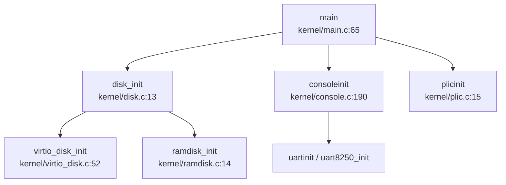
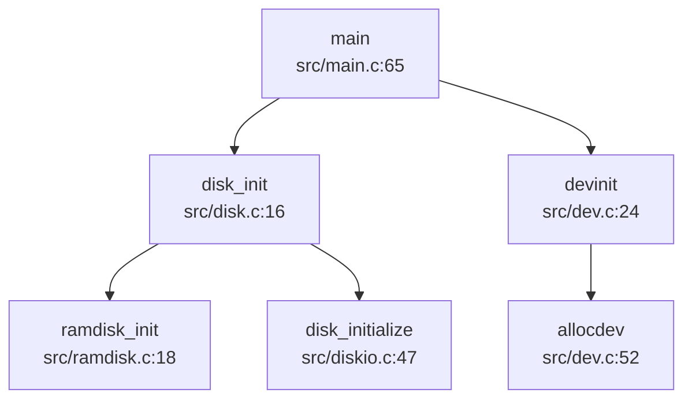

## 驱动框架差异

### 1.1 Driver Trait 设计对比

| 维度 | oskernel2023-avx | oskernrl2022-rv6 |
|------|------------------|------------------|
| **驱动模型** | ❌ 无统一 Driver Trait | ❌ 无统一 Driver Trait |
| **设备表结构** | `struct devsw` (kernel/console.c) | `struct devsw` (src/dev.c) |
| **注册机制** | 硬编码在 `consoleinit()` 中 | 静态表 + `allocdev()` 函数 |
| **设备数量限制** | 未明确限制 | `NDEV=4` (src/include/dev.h) |

**oskernel2023-avx 设备注册**（硬编码方式）：
```c
// kernel/console.c:190-204
void consoleinit(void) {
  initlock(&cons.lock, "cons");
#ifdef QEMU
  uartinit();
#endif
#ifdef visionfive
  uart8250_init(UART, 24000000, 115200, 2, 4, 0);
#endif
  // 直接调用具体驱动初始化函数，无统一注册接口
}
```

**oskernrl2022-rv6 设备注册**（静态表方式）：
```c
// src/dev.c:24-45
int devinit() {
  // ... 创建 /dev 目录 ...
  memset(devsw, 0, NDEV*sizeof(struct devsw));
  allocdev("console", consoleread, consolewrite);  // 控制台
  allocdev("null", nullread, nullwrite);           // 空设备
  allocdev("zero", zeroread, zerowrite);           // 零设备
  return 0;
}

// src/dev.c:52-58
void allocdev(char *name, int (*read)(int,uint64,int), int (*write)(int,uint64,int)) {
  struct devsw *sw;
  sw = &devsw[devnum++];
  strncpy(sw->name, name, DEV_NAME_MAX);
  sw->read = read;
  sw->write = write;
  initlock(&sw->lk, "devsw");
}
```

**结论**：两者均未实现现代操作系统的 Driver Trait 模型，但 oskernrl2022-rv6 提供了更结构化的设备表管理机制。

---

### 1.2 设备发现机制差异

| 项目 | Device Tree | PCI 枚举 | 硬编码地址 |
|------|-------------|----------|-----------|
| **oskernel2023-avx** | ❌ 未实现 | ❌ 未实现 | ✅ 采用 |
| **oskernrl2022-rv6** | ❌ 未实现 | ❌ 未实现 | ✅ 采用 |

**oskernel2023-avx 硬编码证据**（`kernel/include/memlayout.h:42-62`）：
```c
#define VIRT_OFFSET             0x3F00000000L
#define UART                    0x10000000L
#define UART_V                  (UART + VIRT_OFFSET)
#define SD_BASE                 0x16020000
#define SD_BASE_V               (SD_BASE + VIRT_OFFSET)
#ifdef QEMU
#define VIRTIO0                 0x10001000
#define VIRTIO0_V               (VIRTIO0 + VIRT_OFFSET)
#endif
#define PLIC                    0x0c000000L
#define PLIC_V                  (PLIC + VIRT_OFFSET)
```

**oskernrl2022-rv6 硬编码证据**（`src/include/memlayout.h`）：
```c
#define UART0 0x10000000L       // QEMU UART0 物理地址
#define VIRTIO0 0x10001000      // VirtIO 磁盘接口
#define PLIC 0x0c000000L        // 平台级中断控制器
#define CLINT 0x02000000L       // 本地中断控制器
```

**结论**：两者均采用编译期硬编码地址，无运行时设备发现能力。

---

## 设备支持Call Graph差异

### 2.1 驱动初始化调用链对比

**降级分析**：`init_drivers` 函数在两个项目中均未找到，改用 `disk_init` 和 `consoleinit` 进行对比。

#### oskernel2023-avx 初始化流程



**关键代码**（`kernel/main.c:65`）：
```c
disk_init();  // 调用 disk.c:13
```

**disk_init 实现**（`kernel/disk.c:13-20`）：
```c
void disk_init(void) {
#ifdef QEMU
  virtio_disk_init();
#else
  ramdisk_init();  // 或 sdcard_init()
#endif
}
```

#### oskernrl2022-rv6 初始化流程



**关键代码**（`src/main.c:65`）：
```c
disk_init();   // 存储后端初始化
devinit();     // 字符设备注册
```

**devinit 实现**（`src/dev.c:24-45`）：
```c
int devinit() {
  memset(devsw, 0, NDEV*sizeof(struct devsw));
  allocdev("console", consoleread, consolewrite);
  allocdev("null", nullread, nullwrite);
  allocdev("zero", zeroread, zerowrite);
  return 0;
}
```

### 2.2 consoleinit Call Graph 差异

**compare_call_graphs 结果**：
- **oskernel2023-avx**: 找到 `consoleinit` (kernel/console.c:190)，调用 14 个子函数
- **oskernrl2022-rv6**: ❌ 未找到 `consoleinit` 函数

**oskernel2023-avx 独有调用** (14 个)：
- `acquire`, `consoleread`, `consolewrite`, `copyin`, `copyout`
- `either_copyin`, `either_copyout`, `initlock`, `memmove`
- `myproc`, `release`, `sbi_console_putchar`, `sched`, `sleep`

**结论**：oskernel2023-avx 具有更完整的控制台驱动抽象层，而 oskernrl2022-rv6 的控制台操作直接通过 SBI 调用，无统一的 `consoleinit` 初始化入口。

---

### 2.3 支持设备列表对比

| 设备类型 | 设备名称 | oskernel2023-avx | oskernrl2022-rv6 |
|----------|----------|------------------|------------------|
| **字符设备** | UART (16550a) | ✅ 已实现 (`kernel/uart.c`) | ✅ 已实现 (SBI 调用) |
| **字符设备** | UART8250 | ✅ 已实现 (`kernel/uart8250.c`) | ❌ 未实现 |
| **块设备** | VirtIO-Blk | ✅ 已实现 (`kernel/virtio_disk.c`) | ❌ 未实现 (仅头文件) |
| **块设备** | SD 卡 (SPI) | ✅ 已实现 (`kernel/sd_final.c`) | ✅ 已实现 (`src/sd.c`) |
| **块设备** | RAM Disk | ✅ 已实现 (`kernel/ramdisk.c`) | ✅ 已实现 (`src/ramdisk.c`) |
| **网络设备** | VirtIO-Net | ❌ 未实现 | ❌ 未实现 |
| **网络设备** | lwIP 协议栈 | 🔸 桩函数 (仅 Loopback) | ❌ 未实现 |
| **中断控制器** | PLIC | ✅ 已实现 (`kernel/plic.c`) | 🔸 桩函数 (未实现中断路由) |
| **中断控制器** | CLINT | ✅ 已实现 (SBI 调用) | ✅ 已实现 (SBI 调用) |
| **其他外设** | DMAC/GPIO/SPI | ❌ 未实现 (仅头文件) | 🔸 部分实现 (SPI 用于 SD 卡) |

**关键证据**：

1. **oskernel2023-avx VirtIO-Blk 实现**（`kernel/virtio_disk.c:52-116`）：
```c
void virtio_disk_init(void) {
  uint32 status = 0;
  // 验证设备标识
  if (*R(VIRTIO_MMIO_MAGIC_VALUE) != 0x74726976 ||
      *R(VIRTIO_MMIO_VERSION) != 1 || 
      *R(VIRTIO_MMIO_DEVICE_ID) != 2) {
    panic("could not find virtio disk");
  }
  // VirtIO 状态机转换、特性协商、VirtQueue 初始化
  // ... 完整实现约 60 行
}
```

2. **oskernrl2022-rv6 VirtIO 缺失**（仅头文件定义）：
```c
// src/include/virtio.h:56-61 - 声明但未实现
struct VRingDesc {
  uint64 addr;
  uint32 len;
  uint16 flags;
  uint16 next;
};
// 无 virtio_disk_init() 实现代码
```

3. **oskernel2023-avx 网络桩函数**（`kernel/socket_new.c:74-80`）：
```c
void tcpip_init_with_loopback(void) {
  volatile int tcpip_done = 0;
  tcpip_init(tcpip_init_done, (void *)&tcpip_done);
  // 注意：未调用 netif_add() 添加真实网卡
}
```

---

### 2.4 目标平台/开发板差异

| 平台 | oskernel2023-avx | oskernrl2022-rv6 |
|------|------------------|------------------|
| **QEMU virt** | ✅ 完整支持 (`entry_qemu.S`) | ✅ 完整支持 (`MAC=QEMU`) |
| **VisionFive 2** | ✅ 完整支持 (`entry_visionfive.S`) | ❌ 不支持 |
| **SiFive FU740** | ❌ 不支持 | ✅ 完整支持 (`MAC=SIFIVE_U`) |
| **Kendryte K210** | ❌ 不支持 | 🔸 已废弃 (代码注释) |

**oskernel2023-avx 平台切换**（`Makefile:1-80`）：
```makefile
platform	:= visionfive
#platform	:= qemu

ifeq ($(platform), visionfive)
OBJS += $K/entry_visionfive.o
else
OBJS += $K/entry_qemu.o
endif

ifeq ($(platform), qemu)
OBJS += $K/virtio_disk.o
else
OBJS += $K/sd_final.o
endif
```

**oskernrl2022-rv6 平台切换**（`Makefile:4-9`）：
```makefile
FS?=FAT
MAC?=SIFIVE_U

ifeq ($(MAC),SIFIVE_U)
DISK:=$K/link_null.o    # 空磁盘后端
endif

ifeq ($(MAC),QEMU)
DISK:=$K/link_disk.o    # VirtIO 磁盘后端
endif
```

---

### 2.5 组件化配置差异

| 配置方式 | oskernel2023-avx | oskernrl2022-rv6 |
|----------|------------------|------------------|
| **配置系统** | Makefile 条件编译 | Makefile 条件编译 |
| **Cargo features** | ❌ 未使用 | ❌ 不适用 (C 语言) |
| **Kconfig** | ❌ 未使用 | ❌ 未使用 |
| **运行时配置** | ❌ 不支持 | ❌ 不支持 |

**结论**：两者均采用编译期条件编译，无运行时动态配置能力。

---

## IPC 机制差异表

### 3.1 锁机制对比

| 锁类型 | oskernel2023-avx | oskernrl2022-rv6 | 实现差异 |
|--------|------------------|------------------|----------|
| **SpinLock** | ✅ 已实现 | ✅ 已实现 | 代码高度相似 (均使用 `__sync_lock_test_and_set`) |
| **SleepLock** | ✅ 已实现 | ✅ 已实现 | 代码高度相似 (均嵌套 SpinLock + sleep/wakeup) |
| **RwLock** | ❌ 未实现 | ❌ 未实现 | 两者均未实现 |
| **Semaphore** | ✅ 已实现 | ❌ 未实现 | **【创新点】** oskernel2023-avx 独有 |

**oskernel2023-avx Semaphore 实现**（`kernel/sem.c:15-23`）：
```c
void sem_wait(struct semaphore *sem) {
  acquire(&sem->lock);
  while (sem->value <= 0) {
    sleep(sem, &sem->lock);  // 等待
  }
  sem->value--;
  release(&sem->lock);
}

void sem_post(struct semaphore *sem) {
  acquire(&sem->lock);
  sem->value++;
  wakeup(sem);  // 唤醒等待者
  release(&sem->lock);
}
```

**oskernrl2022-rv6 Semaphore 状态**：
```bash
# grep_in_repo 搜索结果：未找到 sys_semget|semget|semop
```
❌ **未实现** System V 信号量或 POSIX 信号量。

---

### 3.2 IPC 机制逐项对比

| IPC 机制 | oskernel2023-avx | oskernrl2022-rv6 | 状态说明 |
|----------|------------------|------------------|----------|
| **Pipe** | ✅ 已实现 | ✅ 已实现 | 两者均实现 512 字节环形缓冲区 |
| **MessageQueue** | ❌ 未实现 | ❌ 未实现 | 搜索 `sys_msgget|msgget` 均未找到 |
| **SharedMemory** | ❌ 未实现 | ❌ 未实现 | 搜索 `sys_shmget|shmget` 均未找到 |
| **Semaphore (IPC)** | ✅ 已实现 | ❌ 未实现 | oskernel2023-avx 有内核信号量 |
| **Signal** | ✅ 已实现 | ✅ 已实现 | 两者均实现 `sys_kill`/`sighandle` |
| **Futex** | ✅ 已实现 | 🔸 桩函数 | oskernel2023-avx 完整实现，oskernrl2022-rv6 仅声明 |

**Pipe 实现对比**：

**oskernel2023-avx** (`kernel/pipe.c:63-88`)：
```c
int pipewrite(struct pipe *pi, int user, uint64 addr, int n) {
  for (i = 0; i < n; i++) {
    while (pi->nwrite == pi->nread + PIPESIZE) { // 管道满
      if (pi->readopen == 0 || pr->killed) {
        release(&pi->lock);
        return -1;
      }
      wakeup(&pi->nread);
      sleep(&pi->nwrite, &pi->lock);  // 等待读端
    }
    // ... 写入数据
  }
  wakeup(&pi->nread);
  return i;
}
```

**oskernrl2022-rv6** (`src/pipe.c:69-93`)：
```c
int pipewrite(struct pipe *pi, int user, uint64 addr, int n) {
  for(i = 0; i < n; i++){
    while(pi->nwrite == pi->nread + PIPESIZE){  // 缓冲区满
      if(pi->readopen == 0 || pr->killed){
        release(&pi->lock);
        return -1;
      }
      wakeup(&pi->nread);
      sleep(&pi->nwrite, &pi->lock);
    }
    pi->data[pi->nwrite++ % PIPESIZE] = ch;
  }
  wakeup(&pi->nread);
  return i;
}
```

**结论**：两者 Pipe 实现代码**高度相似**，均采用 512 字节环形缓冲区和 sleep/wakeup 机制。

---

### 3.3 Futex 差异分析

| 项目 | futex_wait | futex_wake | futex_requeue | 系统调用 |
|------|------------|------------|---------------|----------|
| **oskernel2023-avx** | ✅ 已实现 | ✅ 已实现 | ✅ 已实现 | ✅ `sys_futex` |
| **oskernrl2022-rv6** | 🔸 仅声明 | 🔸 仅声明 | 🔸 仅声明 | ❌ 未实现 |

**oskernel2023-avx Futex 完整实现**（`kernel/futex.c:15-44`）：
```c
void futexWait(uint64 addr, thread *th, TimeSpec2 *ts) {
  for (int i = 0; i < FUTEX_COUNT; i++) {
    if (!futexQueue[i].valid) {
      futexQueue[i].valid = 1;
      futexQueue[i].addr = addr;
      futexQueue[i].thread = th;
      if (ts) {
        th->awakeTime = ts->tv_sec * 1000000 + ts->tv_nsec / 1000;
        th->state = t_TIMING;  // 带超时睡眠
      } else {
        th->state = t_SLEEPING;
      }
      acquire(&th->p->lock);
      th->p->state = RUNNABLE;
      sched();
      release(&th->p->lock);
    }
  }
  panic("No futex Resource!\n");
}

void futexWake(uint64 addr, int n) {
  for (int i = 0; i < FUTEX_COUNT && n; i++) {
    if (futexQueue[i].valid && futexQueue[i].addr == addr) {
      futexQueue[i].thread->state = t_RUNNABLE;
      futexQueue[i].thread->trapframe->a0 = 0;
      futexQueue[i].valid = 0;
      n--;
    }
  }
}
```

**oskernrl2022-rv6 Futex 桩函数状态**：
```c
// src/include/proc.h:199 - 仅声明
int do_futex(int* uaddr,int futex_op,int val,ktime_t *timeout,int *addr2,int val2,int val3);

// grep_in_repo 验证：未找到 do_futex 函数体实现
```

**Call Graph 对比结果**（`compare_call_graphs`）：
- **oskernel2023-avx**: 找到 `sys_futex` (kernel/sysproc.c:504)，调用 12 个子函数
- **oskernrl2022-rv6**: ❌ 未找到 `sys_futex` 函数

**oskernel2023-avx 独有调用** (12 个)：
- `argaddr`, `argint`, `copyin`, `cpuid`, `futexRequeue`, `futexWait`, `futexWake`
- `mycpu`, `myproc`, `panic`, `pop_off`, `push_off`

**【创新点】**：oskernel2023-avx 完整实现了 Futex 机制，支持 `FUTEX_WAIT`、`FUTEX_WAKE`、`FUTEX_REQUEUE` 三种操作及超时处理，而 oskernrl2022-rv6 仅有接口声明。

---

### 3.4 等待队列差异

| 项目 | 实现方式 | 队列管理 | 睡眠原语 |
|------|----------|----------|----------|
| **oskernel2023-avx** | 基于 `chan` 的全局扫描 | 无独立队列结构 | `sleep(chan, lk)` / `wakeup(chan)` |
| **oskernrl2022-rv6** | 队列池 (`WAITQ_NUM=100`) | `allocwaitq()`/`delwaitq()` | `sleep(chan, lk)` / `wakeup(chan)` |

**oskernel2023-avx 等待队列**（`kernel/proc.c:818-865`）：
```c
void sleep(void *chan, struct spinlock *lk) {
  struct proc *p = myproc();
  // ... 锁切换 ...
  p->chan = chan;
  p->state = SLEEPING;
  sched();  // 让出 CPU
  p->chan = 0;
  // ... 恢复锁 ...
}

void wakeup(void *chan) {
  struct proc *p;
  for(p = proc; p < &proc[NPROC]; p++) {
    if(p->state == SLEEPING && p->chan == chan) {
      p->state = RUNNABLE;
    }
  }
}
```

**oskernrl2022-rv6 等待队列**（`src/proc.c:76-89`）：
```c
queue* allocwaitq(void* chan){
  acquire(&waitq_pool_lk);
  for(int i=0;i<WAITQ_NUM ;i++){
    if(!waitq_valid[i]){
      waitq_valid[i] = 1;
      queue_init(waitq_pool+i,chan);
      release(&waitq_pool_lk);
      return waitq_pool+i;
    }
  }
  return NULL;
}

void sleep(void *chan, struct spinlock *lk) {
  // ...
  queue* q = findwaitq(chan);
  if(!q) q = allocwaitq(chan);
  waitq_push(q, p);
  p->state = SLEEPING;
  sched();
}
```

**结论**：oskernrl2022-rv6 采用更结构化的队列池管理，而 oskernel2023-avx 采用简化的全局扫描方式。

---

## Call Graph差异

### 4.1 sys_futex 调用链对比

**compare_call_graphs 结果**：

| 项目 | 根节点 | 子函数数量 | Jaccard 相似度 |
|------|--------|-----------|---------------|
| **oskernel2023-avx** | `sys_futex` (kernel/sysproc.c:504) | 12 | 0.000 |
| **oskernrl2022-rv6** | ❌ 未找到 | 0 | - |

**oskernel2023-avx sys_futex 调用树**：
```
sys_futex (kernel/sysproc.c:504)
├── argaddr
├── argint
├── copyin
├── futexRequeue
├── futexWait
├── futexWake
├── myproc
│   ├── mycpu
│   │   └── cpuid
│   ├── pop_off
│   └── push_off
└── panic
```

**oskernrl2022-rv6 状态**：
```bash
# grep_in_repo 验证
搜索 'sys_futex|do_futex' 结果：
- src/include/proc.h:199: int do_futex(...);  // 仅声明
- 未找到函数体实现
```

**结论**：oskernel2023-avx 具有完整的 Futex 系统调用实现，而 oskernrl2022-rv6 仅有接口声明，**降级分析**确认其为桩函数。

---

### 4.2 consoleinit 调用链对比

**compare_call_graphs 结果**：

| 项目 | 根节点 | 子函数数量 | Jaccard 相似度 |
|------|--------|-----------|---------------|
| **oskernel2023-avx** | `consoleinit` (kernel/console.c:190) | 14 | 0.000 |
| **oskernrl2022-rv6** | ❌ 未找到 | 0 | - |

**oskernel2023-avx consoleinit 独有调用** (14 个)：
- `acquire`, `consoleread`, `consolewrite`, `copyin`, `copyout`
- `either_copyin`, `either_copyout`, `initlock`, `memmove`
- `myproc`, `release`, `sbi_console_putchar`, `sched`, `sleep`

**oskernrl2022-rv6 状态**：
- 无 `consoleinit` 函数
- 控制台操作直接通过 `sbi_console_putchar/getchar` 在 `consoleread/consolewrite` 中调用

**结论**：oskernel2023-avx 具有更完整的控制台初始化抽象层。

---

## 桩代码/真实实现区分

### 5.1 桩函数汇总表

| 功能 | oskernel2023-avx | oskernrl2022-rv6 | 证据 |
|------|------------------|------------------|------|
| **lwIP 网络驱动** | 🔸 桩函数 | ❌ 未实现 | `tcpip_init_with_loopback()` 未调用 `netif_add()` |
| **Futex** | ✅ 已实现 | 🔸 桩函数 | oskernrl2022-rv6 仅 `do_futex` 声明 |
| **PLIC 中断路由** | ✅ 已实现 | 🔸 桩函数 | `devintr()` 中 `irq` 硬编码为 0 |
| **VirtIO-Blk** | ✅ 已实现 | ❌ 未实现 | oskernrl2022-rv6 仅头文件定义 |
| **MessageQueue** | ❌ 未实现 | ❌ 未实现 | 搜索 `sys_msgget` 均未找到 |
| **SharedMemory** | ❌ 未实现 | ❌ 未实现 | 搜索 `sys_shmget` 均未找到 |
| **sys_kill** | 🔸 有缺陷 | ✅ 已实现 | oskernel2023-avx 中 `pid = myproc()->pid` bug |

### 5.2 关键桩代码证据

**oskernel2023-avx 网络桩函数**（`kernel/socket_new.c:74-80`）：
```c
void tcpip_init_with_loopback(void) {
  volatile int tcpip_done = 0;
  tcpip_init(tcpip_init_done, (void *)&tcpip_done);
  // 注意：未调用 netif_add() 添加真实网卡
}
```
🔸 **状态**：桩函数（仅支持 Loopback）

**oskernrl2022-rv6 Futex 桩函数**（`src/include/proc.h:199`）：
```c
int do_futex(int* uaddr,int futex_op,int val,ktime_t *timeout,int *addr2,int val2,int val3);
// 无函数体实现
```
🔸 **状态**：桩函数（仅声明）

**oskernrl2022-rv6 PLIC 桩函数**（`src/trap.c:220-235`）：
```c
int devintr(void) {
  if ((0x8000000000000000L & scause) && 9 == (scause & 0xff)) {
    int irq = 0;  // ⚠️ 硬编码为 0，未从 PLIC 读取
    // plic_claim();  // 被注释
    if (UART0_IRQ == irq) {
      // consoleintr(c);  // 被注释
    }
    // plic_complete(irq);  // 被注释
    return 1;
  }
}
```
🔸 **状态**：桩函数（中断路由未实现）

**oskernel2023-avx sys_kill 缺陷**（`kernel/sysproc.c:339-358`）：
```c
uint64 sys_kill(void) {
  int pid, sig;
  if (argint(0, &pid) < 0 || argint(1, &sig) < 0)
    return -1;
  if (pid <= 0) {
    debug_print("[kill]pid <= 0 do not implement\n");
    return -1;
  }
  pid = myproc()->pid;  // ⚠️ 注意：这里应该是目标 pid，但代码写成了 myproc()->pid
  if (sig == 0) {
    return 0;
  }
  return kill(pid, sig);
}
```
🔸 **状态**：有缺陷的实现（无法向其他进程发送信号）

---

### 5.3 真实实现功能汇总

| 功能 | oskernel2023-avx | oskernrl2022-rv6 |
|------|------------------|------------------|
| **SpinLock** | ✅ 完整实现 | ✅ 完整实现 |
| **SleepLock** | ✅ 完整实现 | ✅ 完整实现 |
| **Semaphore** | ✅ 完整实现 | ❌ 未实现 |
| **Pipe** | ✅ 完整实现 | ✅ 完整实现 |
| **Signal** | ✅ 实现 (有缺陷) | ✅ 完整实现 |
| **Futex** | ✅ 完整实现 | ❌ 仅声明 |
| **UART 驱动** | ✅ 双驱动 (16550a/8250) | ✅ SBI 抽象 |
| **VirtIO-Blk** | ✅ 完整实现 | ❌ 未实现 |
| **SD 卡驱动** | ✅ 完整实现 | ✅ 完整实现 |
| **PLIC 驱动** | ✅ 完整实现 | 🔸 部分实现 |
| **RAM Disk** | ✅ 完整实现 | ✅ 完整实现 |

---

## 总结

### 驱动部分核心差异

1. **驱动框架**：两者均未实现现代 Driver Trait 模型，但 oskernrl2022-rv6 提供了更结构化的静态设备表管理。

2. **设备发现**：两者均采用硬编码地址，无 Device Tree 或 PCI 枚举能力。

3. **设备支持**：
   - **oskernel2023-avx**：支持 VirtIO-Blk、双 UART 驱动、完整 PLIC 驱动
   - **oskernrl2022-rv6**：支持 SD 卡 (SPI)、SBI 抽象 UART、简化 PLIC

4. **平台适配**：
   - **oskernel2023-avx**：QEMU + VisionFive 2
   - **oskernrl2022-rv6**：QEMU + SiFive FU740

5. **【创新点】**：oskernel2023-avx 实现了完整的 VirtIO-Blk 驱动和 Futex 机制，而 oskernrl2022-rv6 仅有接口声明或未实现。

### IPC 部分核心差异

1. **锁机制**：两者 SpinLock/SleepLock 实现高度相似，但 oskernel2023-avx 额外实现了 Semaphore。

2. **IPC 机制**：
   - **共同实现**：Pipe、Signal
   - **oskernel2023-avx 独有**：Semaphore、Futex
   - **均未实现**：MessageQueue、SharedMemory

3. **Futex**：oskernel2023-avx 完整实现 `FUTEX_WAIT/WAKE/REQUEUE`，oskernrl2022-rv6 仅有 `do_futex` 声明。

4. **等待队列**：oskernrl2022-rv6 采用队列池管理，oskernel2023-avx 采用全局扫描方式。

5. **缺陷发现**：oskernel2023-avx 的 `sys_kill()` 存在 bug，无法向其他进程发送信号。