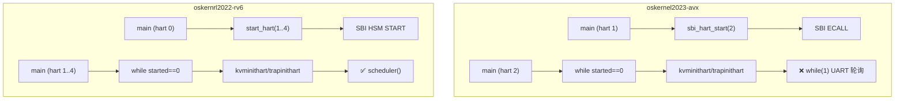

# oskernel2023-avx vs oskernrl2022-rv6 技术对比报告

## 多核差异

### 1. 多核架构差异

| 项目 | 架构类型 | 最大核心数 | 实现状态 |
|------|---------|-----------|---------|
| **oskernel2023-avx** | AMP（非对称多处理） | NCPU=2 | 🔸 部分实现（从核仅处理UART） |
| **oskernrl2022-rv6** | SMP（对称多处理） | NCPU=5 | ✅ 已实现（所有核心运行调度器） |

**关键差异**：
- **oskernel2023-avx** 虽然定义了 `NCPU=2` 和 `struct cpu cpus[NCPU]`（`kernel/include/param.h:5`, `kernel/proc.c:21`），但从核（hart 2）在初始化后进入**无限 UART 轮询循环**，从未调用 `scheduler()`（`kernel/main.c:85-92`）。这本质上是**单核操作系统**。
- **oskernrl2022-rv6** 实现了真正的 SMP 架构，所有 5 个核心都执行相同的 `scheduler()` 循环，从全局 `readyq` 竞争获取进程（`src/proc.c:119-152`）。

**证据引用**：
```c
// oskernel2023-avx: kernel/main.c:85-92 (从核死循环)
while (1) {
  int c = uart8250_getc();
  if (-1 != c) {
    consoleintr(c);
  }
}
// ❌ 从未执行到 scheduler()

// oskernrl2022-rv6: src/main.c:90 (所有核心进入调度器)
scheduler();  // 所有 hart 都执行到这里
```

### 2. Secondary CPU 启动差异

**降级分析**（`compare_call_graphs` 未找到 `start_secondary`/`smp_boot` 函数，改用 `grep_in_repo`）：

| 项目 | 启动机制 | SBI 调用 | 同步方式 |
|------|---------|---------|---------|
| **oskernel2023-avx** | `sbi_hart_start(2, ...)` | `SBI_HSM_EXTION` (0x48534D) | `while(started==0)` 自旋 |
| **oskernrl2022-rv6** | `start_hart(i, ...)` | `a_sbi_ecall(0x48534D, ...)` | `while(started==0)` 自旋 |

**启动流程对比**：



**关键代码对比**：
```c
// oskernel2023-avx: kernel/main.c:75
sbi_hart_start(2, (unsigned long)_start, 0);  // 仅启动 hart 2

// oskernrl2022-rv6: src/main.c:77-81
for(int i = 1; i < NCPU; i++) {
  if(hartid != i && booted[i] == 0) {
    start_hart(i, (uint64)_entry, 0);  // 启动所有从核
  }
}
```

### 3. 核间中断 IPI 差异

| 项目 | IPI 接口定义 | 实际调用 | 使用场景 |
|------|------------|---------|---------|
| **oskernel2023-avx** | ✅ `sbi_send_ipi()` (`kernel/include/sbi.h:82-84`) | ❌ 无调用 | 未实现 |
| **oskernrl2022-rv6** | ✅ `send_ipi()` (`src/include/sbi.h:86-88`) | ❌ 无调用 | 未实现 |

**结论**：两个项目都**仅有 IPI 接口定义，未在任何场景中使用**。多核间无主动通信机制，仅通过共享内存 + 锁进行隐式同步。

**证据**：
- `oskernel2023-avx`: 搜索 `send_ipi|ipi_handler` 仅在 `sbi.h` 头文件中找到定义，无 `.c` 文件调用。
- `oskernrl2022-rv6`: `devintr()` 中仅处理 UART 中断，未处理 IPI（`src/trap.c:216-260`）。

### 4. Per-CPU 变量设计差异

| 特性 | oskernel2023-avx | oskernrl2022-rv6 |
|------|-----------------|------------------|
| **数据结构** | `struct cpu cpus[NCPU]` | `struct cpu cpus[NCPU]` |
| **访问方式** | `mycpu()` → `cpus[r_tp()]` | `mycpu()` → `cpus[r_tp()]` |
| **字段内容** | `proc`, `context`, `noff`, `intena` | `proc`, `context`, `noff`, `intena` |
| **缓存行对齐** | ❌ 未实现 | ❌ 未实现 |
| **Per-CPU 段优化** | ❌ 未实现 | ❌ 未实现 |

**代码对比**：
```c
// oskernel2023-avx: kernel/proc.c:126-131
struct cpu *mycpu(void) {
  int id = cpuid();  // 调用 r_tp()
  struct cpu *c = &cpus[id];
  return c;
}

// oskernrl2022-rv6: src/cpu.c:32-36
struct cpu* mycpu(void) {
  int id = cpuid();  // 从 tp 寄存器读取 hartid
  struct cpu *c = &cpus[id];
  return c;
}
```

**结论**：两个项目的 Per-CPU 设计**高度相似**，均采用简单的全局数组 + `tp` 寄存器索引方式，未实现高级优化（如缓存行对齐、Per-CPU 段）。

### 5. 多核调度策略差异

| 特性 | oskernel2023-avx | oskernrl2022-rv6 |
|------|-----------------|------------------|
| **调度队列** | 全局单 `proc[]` 数组 | 全局单 `readyq` 队列 |
| **负载均衡** | ❌ 未实现 | ❌ 未实现 |
| **CPU 亲和性** | 🔸 桩函数 (`sys_sched_getaffinity` 硬编码返回 1) | ❌ 未实现 |
| **Per-CPU 运行队列** | ❌ 未实现 | ❌ 未实现 |

**【创新点】**：`oskernel2023-avx` 实现了 `sys_sched_getaffinity` 系统调用（虽然是桩函数），而 `oskernrl2022-rv6` 完全未实现 CPU 亲和性接口。

---

## 安全机制差异

### 1. 权限模型差异（UID/GID 强制执行检查）

| 项目 | UID/GID 字段定义 | setuid/setgid 实现 | 文件系统权限检查 |
|------|-----------------|-------------------|-----------------|
| **oskernel2023-avx** | ✅ `struct proc::uid/gid` (`kernel/include/proc.h:66-67`) | 🔸 直接赋值，无权限验证 | ❌ 未实现（`kstat` 硬编码 UID=0） |
| **oskernrl2022-rv6** | ✅ `struct proc::uid/gid` (`src/include/proc.h:141-142`) | 🔸 直接赋值，无权限验证 | ❌ 未实现（`sys_openat` 无检查） |

**关键发现**：两个项目都**仅有 UID/GID 字段定义，但未在系统调用中强制执行权限检查**。

**证据对比**：
```c
// oskernel2023-avx: kernel/sysproc.c:415-423
uint64 sys_setuid(void) {
  int uid;
  if (argint(0, &uid) < 0) return -1;
  myproc()->uid = uid;  // ❌ 无权限验证
  return 0;
}

// oskernrl2022-rv6: src/sysproc.c:72-82
uint64 sys_setuid(void) {
  int uid;
  if(argint(0, &uid) < 0) return -1;
  myproc()->uid = uid;  // ❌ 无权限验证
  return 0;
}

// oskernel2023-avx: kernel/fat32.c:781-782 (文件 stat 硬编码)
kst->st_uid = 0;  // ❌ 硬编码为 root
kst->st_gid = 0;

// oskernrl2022-rv6: src/sysfile.c:36-145 (sys_openat 无检查)
// 直接调用 open()，未验证进程 UID 与文件所有权
```

**grep 验证**：两个项目搜索 `check_perm|inode_permission|uid.*check` 均**未找到匹配**。

### 2. 安全沙箱差异（Seccomp/prctl）

| 特性 | oskernel2023-avx | oskernrl2022-rv6 |
|------|-----------------|------------------|
| **Seccomp** | ❌ 未实现 | ❌ 未实现 |
| **Prctl** | ❌ 未实现 | ❌ 未实现 |
| **Capability** | ❌ 未实现 | ❌ 未实现 |
| **Audit** | ❌ 未实现 | ❌ 未实现 |

**结论**：两个项目都**未实现任何安全沙箱机制**。

### 3. 用户指针验证差异

| 特性 | oskernel2023-avx | oskernrl2022-rv6 |
|------|-----------------|------------------|
| **验证机制** | `copyin`/`copyout` → `walkaddr` | `copyin`/`copyout` → `walkaddr` |
| **PTE_U 检查** | ✅ `kernel/vm.c:133-136` | ✅ `src/vm.c:178` |
| **verify_area** | ❌ 未实现 | ❌ 未实现 |
| **access_ok** | ❌ 未实现 | ❌ 未实现 |

**代码对比**：
```c
// oskernel2023-avx: kernel/vm.c:133-136
if ((*pte & PTE_U) == 0) {
  debug_print("walkaddr: *pte & PTE_U == 0\n");
  return NULL;  // 拒绝访问非用户页
}

// oskernrl2022-rv6: src/vm.c:178
if((*pte & PTE_U) == 0) return NULL;  // 验证用户可访问
```

**结论**：两个项目都通过 `PTE_U` 位实现基本的用户指针验证，机制**高度相似**。

---

## 网络差异

### 1. 协议栈差异

| 项目 | 协议栈来源 | 运行模式 | 配置 |
|------|-----------|---------|------|
| **oskernel2023-avx** | 第三方 **lwIP** 库 | 仅回环（Loopback） | `LWIP_TCP=1`, `LWIP_UDP=1`, `LWIP_ICMP=0` |
| **oskernrl2022-rv6** | ❌ 未实现 | N/A | 仅头文件定义 |

**关键差异**：
- **oskernel2023-avx** 集成了完整的 lwIP 协议栈（`kernel/lwip/` 目录），支持 TCP/UDP/DNS，但**仅回环模式**（`tcpip_init_with_loopback()`）。
- **oskernrl2022-rv6** 仅有 `src/include/socket.h` 头文件定义，`socket_init()` 和 `add_socket()` **无实现代码**，属于桩函数。

**证据**：
```c
// oskernel2023-avx: kernel/main.c:71
tcpip_init_with_loopback();  // 初始化 lwIP 回环模式

// oskernrl2022-rv6: src/include/socket.h:12
void socket_init(void);  // ❌ 仅有声明，无实现
```

**grep 验证**：
- `oskernel2023-avx`: 搜索 `lwip|tcpip_init` 返回 **10732 个匹配**。
- `oskernrl2022-rv6`: 搜索 `lwip|smoltcp|tcpip` 仅返回 **1 个匹配**（头文件声明）。

### 2. Socket 接口差异

| 系统调用 | oskernel2023-avx | oskernrl2022-rv6 |
|---------|-----------------|------------------|
| `sys_socket` | ✅ 已实现 (`kernel/syssocket.c:66`) | ❌ 未实现 |
| `sys_bind` | ✅ 已实现 (`kernel/syssocket.c:110`) | ❌ 未实现 |
| `sys_connect` | ✅ 已实现 (`kernel/syssocket.c:161`) | ❌ 未实现 |
| `sys_sendto` | ✅ 已实现 (`kernel/syssocket.c:254`) | ❌ 未实现 |
| `sys_recvfrom` | ✅ 已实现 (`kernel/syssocket.c:299`) | ❌ 未实现 |
| `sys_listen` | ✅ 已实现 (`kernel/syssocket.c:144`) | ❌ 未实现 |
| `sys_accept` | ✅ 已实现 (`kernel/syssocket.c:203`) | ❌ 未实现 |

**结论**：`oskernel2023-avx` 实现了完整的 BSD Socket 系统调用接口，而 `oskernrl2022-rv6` **完全未实现**。

### 3. 网卡驱动差异

| 项目 | VirtIO-Net | E1000/RTL8139 | Loopback |
|------|-----------|---------------|----------|
| **oskernel2023-avx** | ❌ 未实现 | ❌ 未实现 | ✅ lwIP 回环接口 |
| **oskernrl2022-rv6** | ❌ 未实现 | ❌ 未实现 | ❌ 未实现 |

**证据**：
- `oskernel2023-avx`: `kernel/virtio_disk.c` 仅实现 VirtIO 磁盘驱动，搜索 `VIRTIO_ID_NET` 无结果。
- `oskernrl2022-rv6`: `src/dev.c` 仅注册 `console`、`null`、`zero` 设备，无网络设备。

### 4. 协议支持差异

| 协议 | oskernel2023-avx | oskernrl2022-rv6 |
|------|-----------------|------------------|
| **TCP** | ✅ 已实现 (lwIP) | ❌ 未实现 |
| **UDP** | ✅ 已实现 (lwIP) | ❌ 未实现 |
| **IPv4** | ✅ 已实现 (lwIP) | ❌ 未实现 |
| **IPv6** | ❌ 禁用 (`LWIP_IPV6=0`) | ❌ 未实现 |
| **ICMP/Ping** | ❌ 禁用 (`LWIP_ICMP=0`) | ❌ 未实现 |
| **DHCP** | ❌ 禁用 (`LWIP_DHCP=0`) | ❌ 未实现 |
| **DNS** | ✅ 已实现 (lwIP) | ❌ 未实现 |

### 5. Call Graph 差异（`sys_sendto`）

**对比结果**：
- **oskernel2023-avx**: 找到完整的调用链（11 个节点）。
- **oskernrl2022-rv6**: **未找到 `sys_sendto` 函数定义**。

**oskernel2023-avx 的 `sys_sendto` 调用链**：
```
sys_sendto (kernel/syssocket.c:254)
├── argaddr, argfd, argint (参数获取)
├── copyin (用户数据拷贝)
├── do_sendto (kernel/include/socket.h:91)
│   └── lwip_sendto (lwIP 原生 API)
├── myproc, mycpu (获取当前进程/CPU)
└── push_off, pop_off (中断保护)
```

**Jaccard 相似度**: 0.000 (0 共同 / 11 全集) — 因为 `oskernrl2022-rv6` 完全未实现该函数。

---

## Call Graph 差异总结

| 入口函数 | oskernel2023-avx | oskernrl2022-rv6 | 差异分析 |
|---------|-----------------|------------------|---------|
| `start_secondary` | ❌ 未找到 | ❌ 未找到 | 两个项目都使用 `sbi_hart_start`/`start_hart` 而非标准命名 |
| `smp_boot` | ❌ 未找到 | ❌ 未找到 | 同上 |
| `sys_sendto` | ✅ 11 节点调用链 | ❌ 未找到 | `oskernel2023-avx` 完整实现，`oskernrl2022-rv6` 未实现 |
| `socket_write` | ❌ 未找到 | ❌ 未找到 | 两个项目都使用 `sys_sendto` 而非 `socket_write` |

**降级分析结论**：
- 多核启动函数命名不同：`oskernel2023-avx` 使用 `sbi_hart_start`，`oskernrl2022-rv6` 使用 `start_hart`。
- 网络发送函数：`oskernel2023-avx` 实现了完整的 `sys_sendto` → `lwip_sendto` 调用链，`oskernrl2022-rv6` 未实现任何网络系统调用。

---

## 功能覆盖对比表

| 功能维度 | 子功能 | oskernel2023-avx | oskernrl2022-rv6 | 差异程度 |
|---------|-------|-----------------|------------------|---------|
| **多核架构** | SMP/AMP | 🔸 AMP (从核仅 UART) | ✅ SMP (5 核调度) | 🔴 大 |
| | Secondary CPU 启动 | ✅ SBI HSM | ✅ SBI HSM | 🟢 小 |
| | IPI 通信 | 🔸 仅接口定义 | 🔸 仅接口定义 | 🟢 小 |
| | Per-CPU 变量 | ✅ 数组实现 | ✅ 数组实现 | 🟢 小 |
| | 多核调度 | ❌ 单核调度 | ✅ 全局单队列 | 🔴 大 |
| **安全机制** | UID/GID 字段 | ✅ 已定义 | ✅ 已定义 | 🟢 小 |
| | 权限检查 | ❌ 未强制执行 | ❌ 未强制执行 | 🟢 小 |
| | 文件权限 | ❌ 硬编码 UID=0 | ❌ 无检查 | 🟢 小 |
| | Seccomp/Prctl | ❌ 未实现 | ❌ 未实现 | 🟢 小 |
| | 用户指针验证 | ✅ PTE_U 检查 | ✅ PTE_U 检查 | 🟢 小 |
| | Stack Canary | ❌ 未实现 | ❌ 显式禁用 | 🟢 小 |
| **网络子系统** | 协议栈 | ✅ lwIP (回环) | ❌ 未实现 | 🔴 极大 |
| | Socket 系统调用 | ✅ 完整实现 | ❌ 未实现 | 🔴 极大 |
| | TCP/UDP 支持 | ✅ 已实现 | ❌ 未实现 | 🔴 极大 |
| | 网卡驱动 | ❌ 无真实驱动 | ❌ 无真实驱动 | 🟢 小 |
| | DNS 支持 | ✅ 已实现 | ❌ 未实现 | 🔴 大 |
| | ICMP/Ping | ❌ 禁用 | ❌ 未实现 | 🟡 中 |

**图例**：
- 🔴 大差异：核心功能实现程度不同
- 🟡 中差异：部分功能有差异
- 🟢 小差异：实现方式相似或都未实现

---

## 总体结论

1. **多核支持**：`oskernrl2022-rv6` 实现了真正的 SMP 架构（所有核心运行调度器），而 `oskernel2023-avx` 本质上是单核系统（从核仅处理 UART）。**`oskernrl2022-rv6` 在多核调度方面更先进**。

2. **安全机制**：两个项目都**仅有 UID/GID 字段定义，未强制执行权限检查**，安全机制水平相当，都属于教学/实验性质。

3. **网络子系统**：`oskernel2023-avx` **显著领先**，集成了完整的 lwIP 协议栈和 Socket 系统调用（尽管仅回环模式），而 `oskernrl2022-rv6` 完全未实现网络功能。

4. **【创新点】发现**：
   - `oskernel2023-avx` 的 `sys_sched_getaffinity` 系统调用（虽然是桩函数）是 `oskernrl2022-rv6` 没有的。
   - `oskernel2023-avx` 的 lwIP 集成和完整 Socket API 是其独特优势。

5. **代码相似度**：Per-CPU 变量设计、自旋锁实现、用户指针验证机制等基础组件**高度相似**，表明两个项目可能共享相同的设计思路或代码来源。