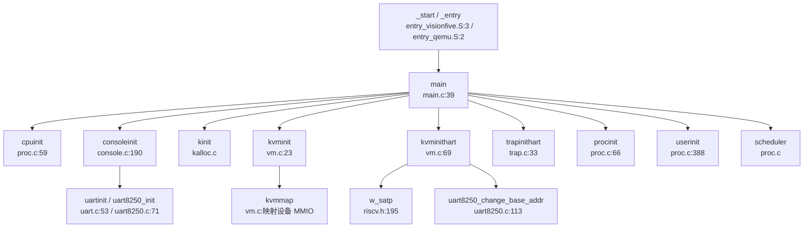

## 第 2 章：启动流程与架构初始化

### 启动入口与链接脚本分析

本项目支持两种启动平台：**QEMU 模拟器**和 **StarFive VisionFive2 硬件**。两个平台使用不同的汇编入口文件和链接脚本。

#### 链接脚本配置

**QEMU 平台** (`linker/qemu.ld`)：
- 入口符号：`ENTRY(_entry)`
- 基地址：`BASE_ADDRESS = 0x80200000`
- 内核加载地址：`0x80200000`（RISC-V 标准加载地址）

**VisionFive2 平台** (`linker/visionfive.ld`)：
- 入口符号：`ENTRY(_start)`
- 基地址：`BASE_ADDRESS = 0x80200000`
- 内核实际运行地址：`KERNEL_ADDRESS = 0X80220000`（注释说明直接设置在 0x80200000 会产生 bug）

两个链接脚本均定义了以下关键段：
- `.text`：代码段，包含 `_trampoline` 和 `_signalTrampoline` 页（用于陷阱处理）
- `.rodata`：只读数据段
- `.data`：已初始化数据段
- `.bss`：未初始化数据段（包含 `*(.bss.stack)` 用于启动栈）

#### 汇编入口文件

**QEMU 入口** (`kernel/entry_qemu.S`)：
```assembly
.section .text
.globl _entry
_entry:
    add t0, a0, 1
    slli t0, t0, 14
    la sp, boot_stack
    add sp, sp, t0
    call main

loop:
    j loop

.section .bss.stack
.align 12
.globl boot_stack
boot_stack:
    .space 4096 * 4 * 4
    .globl boot_stack_top
boot_stack_top:
```

**VisionFive2 入口** (`kernel/entry_visionfive.S`)：
```assembly
.section .text.entry
.globl _start
_start:
    add t0, a0, 1
    slli t0, t0, 14
    la sp, boot_stack
    add sp, sp, t0
    call main

loop:
    j loop
```

**入口参数解析**：
- `a0` 寄存器：传递 hart ID（硬件线程 ID）
- `a1` 寄存器：传递设备树 blob (DTB) 的物理地址（VisionFive2 平台）
- 栈空间计算：`boot_stack + (hartid + 1) * 4096`，每个 hart 分配 4KB 栈空间
- 启动栈总大小：`4096 * 4 * 4 = 64KB`（支持最多 4 个 hart）

### 架构初始化流程（模式切换/FPU/MMU）

#### RISC-V 特权级模式分析

通过搜索 `mstatus.mpp`、`sstatus.spp` 等模式切换相关代码，**发现本项目未显式执行 M-Mode 到 S-Mode 的特权级切换**。

**证据**：
1. 在 `kernel/include/riscv.h` 中定义了模式相关常量：
   ```c
   #define MSTATUS_MPP_MASK (3L << 11)
   #define MSTATUS_MPP_M (3L << 11)
   #define MSTATUS_MPP_S (1L << 11)
   #define MSTATUS_MPP_U (0L << 11)
   #define SSTATUS_SPP (1L << 8)  // Previous mode, 1=Supervisor, 0=User
   ```

2. **但未找到任何 `w_mstatus()` 或设置 `mstatus.mpp` 的代码**。代码中仅有的 `w_sstatus()` 调用用于：
   - `kernel/trap.c:38`：启用中断 `w_sstatus(r_sstatus() | SSTATUS_SIE)`
   - `kernel/trap.c:146/196`：陷阱处理中保存/恢复 sstatus

**结论**：本项目假设启动时已通过 SBI/固件完成 M-Mode → S-Mode 切换，内核直接在 S-Mode 下运行。这符合 RISC-V 标准启动流程（OpenSBI → U-Boot → OS）。

#### FPU（浮点单元）初始化状态

**❌ 未实现**

通过以下搜索验证：
- `grep "sstatus.fs"`：无匹配
- `grep "FS_"`：仅匹配到文件系统相关代码（如 `fat32_fs_alloc()`）
- `grep "mstatus\.mpp"`：仅找到定义，无实际使用

**证据**：在 `kernel/include/riscv.h` 的 `SSTATUS` 定义中，**未定义 `SSTATUS_FS` 相关常量**，且整个代码库中无任何 FPU 启用代码（如设置 `sstatus.FS` 位）。

#### MMU 启用流程

MMU 初始化在 `kernel/main.c` 的 `main()` 函数中按以下顺序执行：

1. **创建内核页表** (`kvminit()`)：
   ```c
   // kernel/vm.c:23-67
   void kvminit() {
     kernel_pagetable = (pagetable_t)kalloc();
     memset(kernel_pagetable, 0, PGSIZE);
     
     // 映射 UART 寄存器
     #ifdef visionfive
     kvmmap(UART_V, UART, 0x10000, PTE_R | PTE_W);
     #endif
     
     // 映射 CLINT、PLIC、VIRTIO 等设备
     kvmmap(CLINT_V, CLINT, 0x10000, PTE_R | PTE_W);
     kvmmap(PLIC_V, PLIC, 0x4000, PTE_R | PTE_W);
     
     // 映射内核代码段和数据段
     kvmmap(KERNBASE, KERNBASE, (uint64)etext - KERNBASE, PTE_R | PTE_X);
     kvmmap((uint64)etext, (uint64)etext, PHYSTOP - (uint64)etext, PTE_R | PTE_W);
     
     // 映射 trampoline 页
     kvmmap(TRAMPOLINE, (uint64)trampoline, PGSIZE, PTE_R | PTE_X);
   }
   ```

2. **启用分页** (`kvminithart()`)：
   ```c
   // kernel/vm.c:69-78
   void kvminithart() {
     sfence_vma();
     w_satp(MAKE_SATP(kernel_pagetable));  // 设置 satp 寄存器
     uart8250_change_base_addr(UART_V);    // 切换 UART 到虚拟地址
   }
   ```

**关键寄存器操作**：
- `satp`：设置 SV39 模式页表基址（`SATP_SV39 = 8L << 60`）
- `sfence.vma`：刷新 TLB
- 页表模式：SV39（39 位虚拟地址，3 级页表）

### 到达内核主函数的路径（完整调用链）



**完整调用序列**（基于 `kernel/main.c:39-99`）：

```c
void main(unsigned long hartid, unsigned long dtb_pa) {
  inithartid(hartid);  // 设置 tp 寄存器
  
  if (hartid == 1) {  // Hart 1 作为主核
    cpuinit();           // 初始化 CPU 结构
    consoleinit();       // 初始化控制台（UART）
    printfinit();        // 初始化 printf 锁
    kinit();             // 初始化物理页分配器
    kvminit();           // 创建内核页表
    kvminithart();       // 启用 MMU
    timerinit();         // 初始化定时器锁
    trapinithart();      // 安装陷阱向量
    threadInit();        // 初始化线程系统
    procinit();          // 初始化进程表
    plicinit();          // 初始化 PLIC
    plicinithart();      // 配置 PLIC 中断
    disk_init();         // 初始化磁盘
    binit();             // 初始化缓冲缓存
    initlogbuffer();     // 初始化日志缓冲
    fileinit();          // 初始化文件表
    userinit();          // 创建 init 进程
    tcpip_init_with_loopback();  // 初始化网络栈
    
    #ifdef visionfive
    sbi_hart_start(2, (unsigned long)_start, 0);  // 启动 Hart 2
    #endif
    
    started = 1;
  } else {  // Hart 2 作为从核
    while (started == 0);  // 等待 Hart 1 完成初始化
    kvminithart();
    trapinithart();
    plicinithart();
    // 进入空闲循环处理 UART
  }
  
  scheduler();  // 进入调度器
}
```

### 多平台启动流程（StarFive/LoongArch 等）

#### StarFive VisionFive2 启动链

**✅ 已实现 SBI → U-Boot → OS 完整启动链**

**固件级启动流程**：
1. **OpenSBI**（M-Mode 固件）：初始化硬件，提供 SBI 调用接口
2. **U-Boot**（S-Mode 引导加载器）：加载内核镜像到 `0x80200000`
3. **内核入口** (`_start` in `entry_visionfive.S`)

**SBI 调用实现** (`kernel/include/sbi.h`)：
```c
#define SBI_HSM_EXTION 0x48534D
#define SBI_HART_START 0

static inline void sbi_hart_start(unsigned long hartid, 
                                   unsigned long start_addr, 
                                   unsigned long opaque) {
  SBI_CALL_3(SBI_HSM_EXTION, SBI_HART_START, hartid, start_addr, opaque);
}

#define SBI_CALL(eid, fid, arg0, arg1, arg2, arg3) ({ \
  register uintptr_t a0 asm ("a0") = (uintptr_t)(arg0); \
  register uintptr_t a1 asm ("a1") = (uintptr_t)(arg1); \
  register uintptr_t a2 asm ("a2") = (uintptr_t)(arg2); \
  register uintptr_t a3 asm ("a3") = (uintptr_t)(arg3); \
  register uintptr_t a7 asm ("a7") = (uintptr_t)(eid);  \
  register uintptr_t a6 asm ("a6") = (uintptr_t)(fid);  \
  asm volatile ("ecall"); \
  a0; \
})
```

**多核启动**：
- Hart 1 完成初始化后，通过 `sbi_hart_start(2, (unsigned long)_start, 0)` 启动 Hart 2
- Hart 2 从 `_start` 重新执行，但 hartid=2，进入 `else` 分支等待并初始化

**设备树支持**：
- `main()` 函数接收 `dtb_pa` 参数（设备树物理地址）
- **但代码中未找到实际解析 DTB 的逻辑**（仅传递参数未使用）

#### LoongArch 平台

**❌ 未实现**

搜索 `loongarch`、`la64` 关键词无匹配结果。项目仅支持 RISC-V 架构。

### 平台配置与构建机制

#### 构建系统配置

**Makefile 平台选择** (`Makefile:1-2`)：
```makefile
platform := visionfive
#platform := qemu
mode := debug
# mode := release
```

**编译工具链**：
```makefile
TOOLPREFIX := riscv64-unknown-elf-
CC = $(TOOLPREFIX)gcc
AS = $(TOOLPREFIX)gas
LD = $(TOOLPREFIX)ld
```

**架构标志**：
```makefile
CFLAGS += -mcmodel=medany      # RISC-V 中内存模型
CFLAGS += -ffreestanding       # 独立环境（无标准库）
CFLAGS += -fno-common          # 禁止 common 符号
CFLAGS += -nostdlib            # 不使用标准库
CFLAGS += -mno-relax           # 禁用链接时优化
CFLAGS += -march=rv64g         # RISC-V 64 位通用指令集
```

**平台特定宏**：
```makefile
ifeq ($(platform), visionfive)
  CFLAGS += -D visionfive
  OBJS += $K/sd_final.o $K/sddata.o $K/ramdisk.o
else ifeq ($(platform), qemu)
  CFLAGS += -D QEMU
  OBJS += $K/virtio_disk.o
endif
```

#### 内存布局配置

`kernel/include/memlayout.h` 定义了关键物理地址：

**QEMU 平台**：
```c
#define UART        0x10000000L     // UART0 物理地址
#define VIRTIO0     0x10001000      // VirtIO 磁盘接口
#define CLINT       0x02000000L     // 核心本地中断控制器
#define PLIC        0x0c000000L     // 平台级中断控制器
#define KERNBASE    0x80200000      // 内核基地址
#define PHYSTOP     0x88000000      // 物理内存结束（128MB）
```

**VisionFive2 平台**：
```c
#define VIRT_OFFSET     0x3F00000000L  // 虚拟地址偏移
#define UART            0x10000000L
#define UART_V          (UART + VIRT_OFFSET)  // UART 虚拟地址
#define SD_BASE         0x16020000
#define SD_BASE_V       (SD_BASE + VIRT_OFFSET)
#define CLINT           0x02000000L
#define CLINT_V         (CLINT + VIRT_OFFSET)
#define PLIC            0x0c000000L
#define PLIC_V          (PLIC + VIRT_OFFSET)
#define PHYSTOP         0x140000000   // 物理内存结束（5GB）
```

**虚拟地址映射策略**：
- 直接映射：`虚拟地址 = 物理地址 + VIRT_OFFSET (0x3F00000000)`
- 高地址映射：将 MMIO 设备映射到 `0x3F00000000` 以上区域
- 内核代码：从 `0x80200000` 直接映射到相同虚拟地址

### 关键代码片段分析

#### MMU 启用前后的串口地址切换

**问题**：MMU 启用前使用物理地址访问 UART，启用后需切换到虚拟地址。

**实现** (`kernel/vm.c:69-78`)：
```c
void kvminithart() {
  sfence_vma();
  w_satp(MAKE_SATP(kernel_pagetable));  // 启用 MMU
  // 修改 uart 的地址映射
  uart8250_change_base_addr(UART_V);    // 切换到虚拟地址
}
```

**UART 初始化** (`kernel/console.c:190-204`)：
```c
void consoleinit(void) {
  initlock(&cons.lock, "cons");
#ifdef QEMU
  uartinit();                    // QEMU: 使用物理地址 UART (0x10000000)
#endif
#ifdef visionfive
  uart8250_init(UART, 24000000, 115200, 2, 4, 0);  // VisionFive: 物理地址
#endif
}
```

**地址切换实现** (`kernel/uart8250.c:113-116`)：
```c
int uart8250_change_base_addr(unsigned long base) {
  uart8250_base = (volatile char *)base;  // 更新全局基地址指针
  return 0;
}
```

**流程**：
1. `consoleinit()` 使用物理地址 `UART (0x10000000)` 初始化 UART
2. `kvminithart()` 启用 MMU 后，立即调用 `uart8250_change_base_addr(UART_V)` 切换到虚拟地址 `UART_V (0x3F00000000 + 0x10000000)`
3. 后续 UART 访问通过虚拟地址进行

#### 早期串口打印

**SBI 控制台** (`kernel/console.c:36-51`)：
```c
void consputc(int c) {
  if (panicked) {
    for (;;) ;
  }
  if (c == '\b') {
    sbi_console_putchar('\b');
    sbi_console_putchar(' ');
    sbi_console_putchar('\b');
  } else {
    sbi_console_putchar('\n');
  }
  sbi_console_putchar(c);
}
```

**SBI 调用实现** (`kernel/include/sbi.h:52-55`)：
```c
static inline void sbi_console_putchar(int ch) {
  SBI_CALL_1(SBI_CONSOLE_PUTCHAR, 0, ch);  // EID=1, FID=0
}
```

**特点**：
- 在 MMU 启用前，通过 SBI 调用（`ecall` 指令）实现早期打印
- 不依赖 UART 驱动，由 OpenSBI 固件提供控制台服务
- 适用于调试早期启动问题

#### 陷阱向量初始化

`kernel/trap.c:33-43`：
```c
void trapinithart(void) {
  w_stvec((uint64)kernelvec);  // 设置 supervisor 陷阱向量基址
  w_sstatus(r_sstatus() | SSTATUS_SIE);  // 启用 supervisor 中断
  // 启用 supervisor-mode timer interrupts
  w_sie(r_sie() | SIE_SEIE | SIE_SSIE | SIE_STIE);
  set_next_timeout();
}
```

**关键寄存器**：
- `stvec`：陷阱向量基址寄存器，指向 `kernelvec()`（定义于 `kernel/kernelvec.S`）
- `sstatus.SIE`：supervisor 中断使能位
- `sie`：supervisor 中断使能寄存器（外部中断 SEIE、软件中断 SSIE、定时器中断 STIE）

---

**本章总结**：

| 特性 | 状态 | 证据 |
|------|------|------|
| 启动入口 | ✅ 已实现 | `entry_qemu.S:_entry`, `entry_visionfive.S:_start` |
| 链接脚本 | ✅ 已实现 | `linker/qemu.ld`, `linker/visionfive.ld` |
| M-Mode → S-Mode 切换 | 🔸 桩函数 | 假设由 SBI/固件完成，内核无显式切换代码 |
| MMU 启用 | ✅ 已实现 | `kvminit()`, `kvminithart()`, `w_satp()` |
| FPU 初始化 | ❌ 未实现 | 无 `sstatus.fs` 相关代码 |
| 多核启动 | ✅ 已实现 | `sbi_hart_start(2, ...)` |
| UART 地址切换 | ✅ 已实现 | `uart8250_change_base_addr(UART_V)` |
| SBI 调用 | ✅ 已实现 | `sbi_console_putchar()`, `sbi_hart_start()` |
| LoongArch 支持 | ❌ 未实现 | 无相关代码 |
