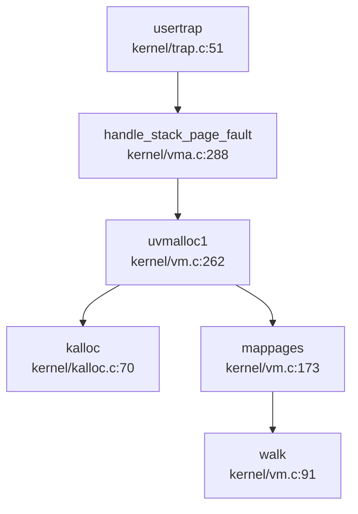
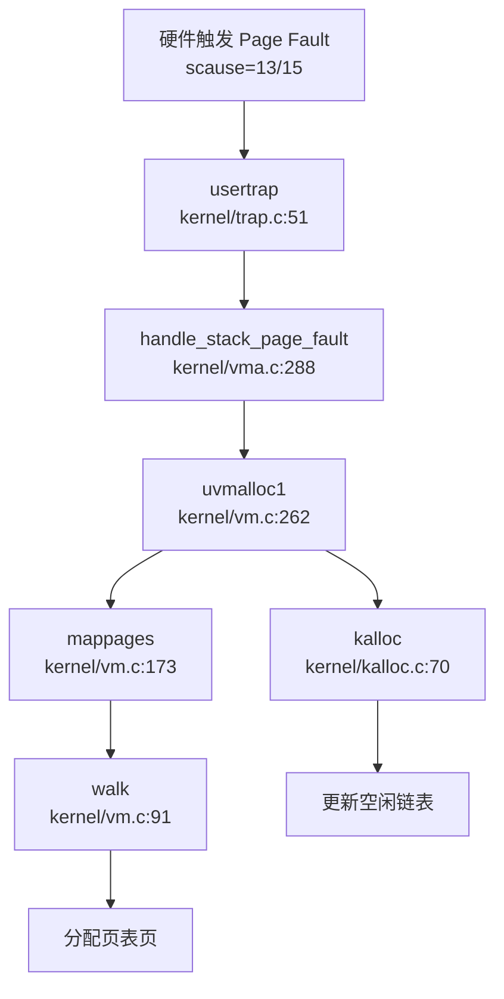

## 第 3 章：内存管理（物理/虚拟/分配器）

### 物理内存管理实现

本操作系统采用**空闲链表（Free List）**机制管理物理内存，而非 Buddy System 或 Bitmap 算法。

**核心数据结构**（`kernel/kalloc.c:17-24`）：
```c
struct run {
  struct run *next;
};

struct {
  struct spinlock lock;
  struct run *freelist;  // 空闲页链表头
  uint64 npage;          // 空闲页计数
} kmem;
```

**物理页分配器接口**：
- **`kalloc()`**（`kernel/kalloc.c:70-87`）：分配一个 4096 字节物理页
  - 获取自旋锁保护
  - 从 `freelist` 链表头摘取一个页框
  - 用 `0x05` 填充内存（捕获悬空引用）
  - 返回物理地址指针
  
- **`kfree(void *pa)`**（`kernel/kalloc.c:48-65`）：释放物理页
  - 验证地址合法性（页对齐、在 `kernel_end` 和 `PHYSTOP` 之间）
  - 用 `0x01` 填充内存
  - 将页框插入 `freelist` 链表头

**初始化流程**（`kernel/kalloc.c:28-43`）：
```c
void kinit() {
  initlock(&kmem.lock, "kmem");
  kmem.freelist = 0;
  kmem.npage = 0;
  freerange(kernel_end, (void *)PHYSTOP);  // 释放内核结束到物理内存顶端
}
```

**✅ 已实现**：基础物理页分配/回收，带锁保护的多核安全机制。

---

### 虚拟内存与页表操作

系统采用 **RISC-V Sv39** 三级页表方案（64 位虚拟地址，39 位有效）。

**页表结构**（`kernel/vm.c:91-112`）：
```c
pte_t *walk(pagetable_t pagetable, uint64 va, int alloc) {
  if (va >= MAXVA)
    panic("walk");

  for (int level = 2; level > 0; level--) {
    pte_t *pte = &pagetable[PX(level, va)];
    if (*pte & PTE_V) {
      pagetable = (pagetable_t)PTE2PA(*pte);
    } else {
      if (!alloc || (pagetable = (pde_t *)kalloc()) == NULL)
        return NULL;
      memset(pagetable, 0, PGSIZE);
      *pte = PA2PTE(pagetable) | PTE_V;
    }
  }
  return &pagetable[PX(0, va)];
}
```

**核心页表操作函数**：

| 函数 | 文件位置 | 功能 |
|------|----------|------|
| `walk()` | `kernel/vm.c:91` | 页表遍历，支持按需分配中间级页表 |
| `mappages()` | `kernel/vm.c:173` | 批量映射虚拟地址到物理地址 |
| `vmunmap()` | `kernel/vm.c:203` | 解除映射，可选择是否释放物理页 |
| `walkaddr()` | `kernel/vm.c:115` | 虚拟地址翻译为物理地址（用户页） |
| `experm()` | `kernel/vm.c:688` | 修改现有页表项权限 |

**`mappages` 实现**（`kernel/vm.c:173-198`）：
```c
int mappages(pagetable_t pagetable, uint64 va, uint64 size, uint64 pa, int perm) {
  perm |= PTE_A | PTE_D;  // VisionFive 2 硬件要求
  uint64 a, last;
  pte_t *pte;

  a = PGROUNDDOWN(va);
  last = PGROUNDDOWN(va + size - 1);

  for (;;) {
    if ((pte = walk(pagetable, a, 1)) == NULL)
      return -1;
    if (*pte & PTE_V)
      panic("remap");

    *pte = PA2PTE(pa) | perm | PTE_V;
    if (a == last)
      break;
    a += PGSIZE;
    pa += PGSIZE;
  }
  return 0;
}
```

**✅ 已实现**：完整的 Sv39 页表walk/map/unmap机制。

---

### 地址空间布局（内核 vs 用户）

**内核地址空间**（`kernel/include/memlayout.h`）：
- **`KERNBASE = 0x80200000`**：内核起始地址
- **`PHYSTOP`**：QEMU 下为 `0x88000000`（128MB），VisionFive 2 为 `0x140000000`
- **`TRAMPOLINE = MAXVA - PGSIZE`**：最高地址映射 trampoline 代码
- **`VKSTACK = 0x3EC0000000L`**：内核栈基址

**用户地址空间**（`kernel/include/memlayout.h:108-121`）：
```c
#define MAXUVA                  0x80000000L       // 2GB
#define USER_STACK_BOTTOM       (MAXUVA - 2*PGSIZE)
#define USER_MMAP_START         (USER_STACK_BOTTOM - 0x10000000)  // mmap 区域基址
#define USER_STACK_TOP          (MAXUVA - PGSIZE)
#define USER_STACK_DOWN         (USER_MMAP_START + PGSIZE)
```

**布局结构**：
```
0x00000000 ┌─────────────────┐
           │   代码段 (text)  │
           ├─────────────────┤
           │   数据段 (data)  │
           ├─────────────────┤
           │      BSS 段      │
           ├─────────────────┤
           │       堆 (heap)  │ ← 动态增长 (sbrk/brk)
           │        ↓↑        │
           │   mmap 区域      │ ← 向下增长
           ├─────────────────┤
           │   栈增长区域     │ ← 动态扩展 (page fault)
           ├─────────────────┤
0x7FFFF000 │   用户栈 (stack) │
0x7FFFF000 │  TRAPFRAME      │
0x7FFFF000 │  SIGTRAMPOLINE  │
0x80000000 └─────────────────┘ MAXUVA
```

**✅ 已实现**：独立的内核/用户地址空间，内核重映射到 `KERNBASE` 以上。

---

### 堆分配器解析

**用户态堆分配**（`xv6-user/umalloc.c`）：
- 采用**隐式空闲链表**算法（类似 K&R C 经典实现）
- **`malloc()`**（`xv6-user/umalloc.c:59-84`）：首次适配策略
- **`free()`**（`xv6-user/umalloc.c:24-42`）：合并相邻空闲块
- **`morecore()`**（`xv6-user/umalloc.c:44-57`）：通过 `sbrk()` 向内核申请更多内存

**内核态分配**：
- 仅支持页级分配（`kalloc()`），**无 slab 分配器**
- 内核小对象分配直接调用 `kalloc()`（如 `struct vma`、页表页）

**❌ 未实现**：内核级 slab/buddy 分配器，仅有页级分配器。

---

### 堆管理 (brk/sbrk)

**系统调用实现**（`kernel/sysproc.c:272-302`）：
```c
uint64 sys_sbrk(void) {
  int addr;
  int n;
  if (argint(0, &n) < 0)
    return -1;
  addr = myproc()->sz;
  if (growproc(n) < 0)
    return -1;
  return addr;
}

uint64 sys_brk(void) {
  uint64 addr;
  uint64 n;
  if (argaddr(0, &n) < 0)
    return -1;
  addr = myproc()->sz;
  if (n == 0) {
    return addr;
  }
  if (n >= addr) {
    if (growproc(n - addr) < 0)
      return -1;
    else
      return myproc()->sz;
  }
  return 0;  // TODO: 收缩逻辑不完整
}
```

**`growproc()` 机制**（`kernel/vm.c:299-329`）：
- 调用 `uvmalloc()` / `uvmdealloc()` 分配/释放物理页
- **立即分配物理页**：`uvmalloc1()` 中循环调用 `kalloc()` 并 `mappages()`

**❌ 未实现惰性分配**：
- 搜索 `lazy` 仅在测试文件 `xv6-user/usertests.c` 中出现注释提及
- `growproc()` 直接分配物理页，**非惰性分配**
- 用户栈扩展通过缺页异常处理（见下节），但堆扩展是即时的

---

### 用户指针安全验证

**❌ 未发现专用验证机制**：
- 搜索 `verify_area`、`access_ok`、`user_pointer`、`copy_from_user` 均无结果
- 系统调用参数验证依赖 `argaddr()`、`argint()` 等基础函数
- 用户内存拷贝使用 `copyin()` / `copyout()`（`kernel/vm.c:451-469`），内部调用 `walkaddr()` 验证页存在性

**`copyout` 实现**（`kernel/vm.c:451-469`）：
```c
int copyout(pagetable_t pagetable, uint64 dstva, char *src, uint64 len) {
  uint64 n, va0, pa0;
  while (len > 0) {
    va0 = PGROUNDDOWN(dstva);
    pa0 = walkaddr(pagetable, va0);
    if (pa0 == NULL)
      return -1;  // 验证失败
    n = PGSIZE - (dstva - va0);
    if (n > len)
      n = len;
    memmove((void *)(pa0 + (dstva - va0)), src, n);
    len -= n;
    src += n;
    dstva = va0 + PGSIZE;
  }
  return 0;
}
```

**🔸 部分实现**：通过 `walkaddr()` 隐式验证，但无显式的 `verify_area()` 接口。

---

### 缺页异常（Page Fault）处理

**缺页异常入口**（`kernel/trap.c:79-83`）：
```c
} else if ((r_scause() == 13 || r_scause() == 15) &&
           (handle_stack_page_fault(myproc(), r_stval()) == 0)) {
  // load page fault or store page fault
  printf("handle stack page fault\n");
```

**调用链追踪**（`lsp_get_call_graph` 分析）：


**栈扩展实现**（`kernel/vma.c:288-320`）：
```c
uint64 handle_stack_page_fault(struct proc *p, uint64 va) {
  if (!(va >= USER_STACK_DOWN && va < USER_STACK_TOP))
    return -1;
  
  // 查找栈 VMA
  struct vma *vma = p->vma->next;
  while (vma != p->vma) {
    if (vma->type == STACK)
      break;
    vma = vma->next;
  }
  if (vma->type != STACK)
    return -1;
  
  // 向下扩展栈空间
  uint64 start = vma->addr - INCREASE_STACK_SIZE_PER_FAULT;
  if (start > va)
    start = PGROUNDDOWN(va);
  uint64 end = vma->addr;
  
  if (uvmalloc1(p->pagetable, start, end, PTE_R | PTE_W | PTE_U) != 0)
    return -1;
  
  vma->addr = start;
  vma->sz = vma->sz + INCREASE_STACK_SIZE_PER_FAULT;
  return 0;
}
```

**✅ 已实现**：用户栈缺页异常处理，支持动态扩展（每次 `100 * PGSIZE = 400KB`）。

---

### 进程级映射管理

**VMA（Virtual Memory Area）结构**（`kernel/include/vma.h:14-26`）：
```c
struct vma {
    enum segtype type;      // NONE, MMAP, STACK
    int perm;               // 页表权限
    uint64 addr;            // 起始地址
    uint64 sz;              // 大小
    uint64 end;             // 结束地址
    int flags;              // mmap 标志
    int fd;                 // 关联文件描述符
    uint64 f_off;           // 文件偏移
    struct vma *prev;       // 双向链表
    struct vma *next;
};
```

**管理方式**：
- 每个进程 `struct proc` 包含 `struct vma *vma` 头节点
- 使用**双向循环链表**组织 VMA，按地址排序
- **❌ 未实现反向映射表（rmap）**：搜索 `rmap`、`reverse_map`、`page_to_vma` 无结果

**✅ 已实现**：基于链表的 VMA 管理，支持 `fork()` 时 `vma_copy()` 复制。

---

### 高级内存特性清单

| 特性 | 状态 | 说明 |
|------|------|------|
| **写时复制（CoW）** | ❌ 未实现 | 搜索 `cow`、`copy_on_write` 仅找到无关匹配；`uvmcopy()` 直接复制物理页（`kernel/vm.c:382-414`） |
| **懒分配（Lazy Allocation）** | ❌ 未实现 | `growproc()` 立即分配物理页；测试代码注释提及但未实现 |
| **共享内存（shm）** | ❌ 未实现 | 搜索 `sys_shmget`、`sys_shmdt`、`shmctl` 无结果 |
| **反向映射表（rmap）** | ❌ 未实现 | 搜索 `rmap`、`reverse_map` 无结果 |
| **交换区/页面置换（Swap）** | ❌ 未实现 | 搜索 `swap_out`、`swap_in` 仅找到网络协议栈无关代码 |
| **大页支持（Huge Page）** | ❌ 未实现 | 搜索 `HugePage`、`2M`、`1G`、`PMD_SIZE` 无相关页表代码 |
| **mmap** | ✅ 已实现 | `sys_mmap()`（`kernel/sysfile.c:1061`）调用 `mmap()`（`kernel/mmap.c:12`） |
| **零拷贝（sendfile/splice）** | ❌ 未实现 | 搜索 `sendfile`、`splice` 无结果 |

**mmap 实现分析**（`kernel/mmap.c:12-64`）：
```c
uint64 mmap(uint64 start, uint64 len, int prot, int flags, int fd, long int offset) {
  struct proc *p = myproc();
  // ... 权限设置 ...
  struct vma *vma = alloc_mmap_vma(p, flags, start, len, perm, fd, offset);
  if (!(flags & MAP_FIXED))
    start = vma->addr;
  
  // 文件映射：立即读取文件内容
  if (-1 != fd) {
    mmap_size = f->ep->file_size - offset;
    // ... 循环调用 experm() 修改权限并 fileread() 读取 ...
  } else {
    return start;  // 匿名映射仅创建 VMA，不分配物理页
  }
}
```

**✅ mmap 已实现**：
- 支持 `MAP_FIXED`、`MAP_ANONYMOUS`、`MAP_SHARED`、`MAP_PRIVATE` 标志
- 文件映射：立即分配物理页并读取文件
- 匿名映射：仅创建 VMA，**惰性分配**（访问时触发缺页异常？需验证）

---

### 关键代码片段与调用链分析

**缺页异常完整链路**：


**物理页分配调用者**（`lsp_get_call_graph` 分析 `kalloc` 入向调用）：
- `alloc_vma()` → VMA 创建
- `uvmalloc1()` → 用户内存扩展
- `walk()` → 页表页分配
- `vma_copy()` → fork 时 VMA 复制
- `kvminit()` → 内核页表初始化

**内存管理模块文件清单**：
| 文件 | 行数 | 功能 |
|------|------|------|
| `kernel/kalloc.c` | 95L | 物理页分配器 |
| `kernel/vm.c` | 705L | 页表操作、地址空间管理 |
| `kernel/vma.c` | 335L | VMA 管理、栈扩展 |
| `kernel/mmap.c` | 118L | mmap 系统调用实现 |
| `kernel/include/vm.h` | 40L | 页表接口声明 |
| `kernel/include/vma.h` | 39L | VMA 结构定义 |
| `kernel/include/memlayout.h` | 121L | 地址空间布局常量 |

---

### 本章总结

本操作系统实现了**基础的物理/虚拟内存管理机制**：

**✅ 已实现核心功能**：
1. 物理页分配器（空闲链表）
2. Sv39 三级页表（walk/map/unmap）
3. 独立内核/用户地址空间
4. 用户栈动态扩展（缺页异常处理）
5. VMA 链表管理
6. mmap 系统调用（文件/匿名映射）
7. sbrk/brk 堆管理（非惰性）

**❌ 未实现高级特性**：
1. 写时复制（CoW）
2. 惰性堆分配
3. 共享内存（shm）
4. 反向映射表（rmap）
5. 页面置换（Swap）
6. 大页支持
7. 零拷贝 IO

**设计特点**：
- 采用 xv6 风格的简化设计，代码清晰易读
- 用户栈扩展通过缺页异常实现，但堆扩展是即时的
- mmap 匿名映射可能支持惰性分配（需进一步验证缺页处理）
- 无用户指针显式验证机制，依赖 `walkaddr()` 隐式检查
