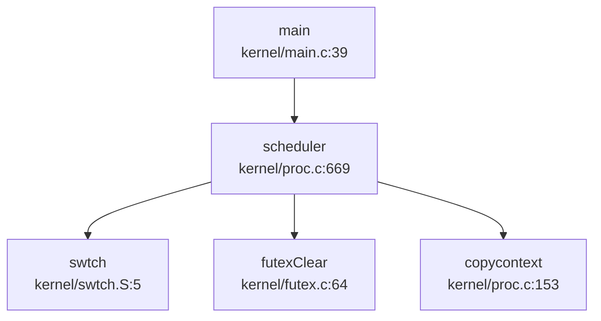

## 第 4 章：进程/线程与调度机制

本章深入分析 `oskernel2023-avx` 的进程/线程管理子系统，涵盖任务模型、调度算法、状态机、上下文切换、进程间通信及关键系统调用流程。

---

## 任务模型与核心数据结构

### 进程控制块（PCB）：`struct proc`

进程是资源分配的基本单位。该 OS 采用类 Unix 的 PCB 设计，定义于 `kernel/include/proc.h:52-98`：

```c
struct proc {
  struct spinlock lock;
  enum procstate state;        // 进程状态
  struct proc *parent;         // 父进程指针
  void *chan;                  // 睡眠通道
  int killed;                  // 被杀标志（实际存储信号编号）
  int xstate;                  // 退出状态
  int pid;                     // 进程 ID
  int uid, gid, pgid;          // 用户 ID、组 ID、进程组 ID
  uint64 filelimit;            // 文件描述符限制
  
  // 线程相关
  thread *main_thread;         // 主线程
  thread *thread_queue;        // 线程链表头
  int thread_num;              // 线程数量
  
  // 内存管理
  uint64 kstack;               // 内核栈虚拟地址
  uint64 sz;                   // 用户空间大小
  pagetable_t pagetable;       // 用户页表
  pagetable_t kpagetable;      // 内核页表
  struct trapframe *trapframe; // Trap frame 页面
  struct context context;      // 内核上下文
  struct vma *vma;             // 虚拟内存区域链表
  
  // 文件系统
  struct file *ofile[NOFILE];  // 打开文件表
  struct dirent *cwd;          // 当前工作目录
  
  // 信号机制
  sigaction sigaction[SIGRTMAX + 1];  // 信号处理函数表
  __sigset_t sig_set;          // 信号屏蔽字
  __sigset_t sig_pending;      // 待处理信号
  struct trapframe *sig_tf;    // 信号处理保存的 trapframe
  
  // 调试与追踪
  char name[16];               // 进程名
  int tmask;                   // 追踪掩码
  uint64 clear_child_tid;      // 子线程退出清理地址
};
```

**关键字段说明**：
- `state`：5 状态枚举（`UNUSED`, `SLEEPING`, `RUNNABLE`, `RUNNING`, `ZOMBIE`）
- `main_thread`：指向进程的主线程 TCB，调度时实际切换的是线程
- `thread_queue`：线程链表，支持多线程进程
- `vma`：支持 `mmap` 的虚拟内存区域管理
- `sigaction[]`：65 个信号处理函数（`SIGRTMAX=64`）

### 线程控制块（TCB）：`struct thread`

线程是调度的基本单位，定义于 `kernel/include/thread.h:22-44`：

```c
struct thread {
    struct spinlock lock;
    enum threadState state;    // 线程状态（6 种，含 t_TIMING）
    struct proc *p;            // 所属进程
    void *chan;                // 睡眠通道
    int tid;                   // 线程 ID
    uint64 awakeTime;          // 定时唤醒时间（用于 FUTEX 超时）
    
    uint64 kstack;             // 线程内核栈地址
    uint64 vtf;                // Trapframe 虚拟地址
    uint64 sz;                 // 复制自进程的 sz
    struct trapframe *trapframe;
    context context;           // 内核上下文
    uint64 kstack_pa;          // 内核栈物理地址
    uint64 clear_child_tid;    // 退出时清理的 TID 地址
    
    struct thread *next_thread, *pre_thread;  // 双向链表
};
```

**进程与线程关系**：
- **1:N 模型**：一个 `proc` 可包含多个 `thread`，通过 `thread_queue` 双向链表管理
- **主线程特殊**：`main_thread` 是进程的默认执行实体，`fork()` 时自动创建
- **独立内核栈**：每个线程有独立的 `kstack` 和 `trapframe`

### 上下文结构：`struct context`

定义于 `kernel/include/context.h:7-22`，仅保存**callee-saved 寄存器**（RISC-V 调用约定）：

```c
typedef struct context {
  uint64 ra;   // 返回地址
  uint64 sp;   // 栈指针
  uint64 s0-s11;  // 12 个被调用者保存寄存器
} context;
```

**设计原理**：上下文切换只需保存 `ra, sp, s0-s11`（共 14 个寄存器，112 字节），因为 `a0-a7, t0-t6` 等 caller-saved 寄存器由调用者自行保存。

---

## 调度算法与策略（代码证据）

### 调度器实现：`scheduler()`

调度器位于 `kernel/proc.c:669-753`，采用**简单轮转（Round-Robin）**策略：

```c
void scheduler(void) {
  struct cpu *c = mycpu();
  c->proc = 0;
  for (;;) {
    intr_on();
    int found = 0;
    for (p = proc; p < &proc[NPROC]; p++) {  // 线性扫描全局进程表
      acquire(&p->lock);
      if (p->state == RUNNABLE) {
        // 遍历线程链表找可运行线程
        thread *t = p->thread_queue;
        while (NULL != t) {
          if (t->state == t_RUNNABLE ||
              (t->state == t_TIMING && t->awakeTime < r_time() + (1LL << 35)))
            break;
          t = t->next_thread;
        }
        if (NULL == t) continue;  // 该进程无可运行线程
        
        // 将找到的线程移到队列头部（避免死线程堆积）
        if (p->thread_queue != t) {
          // ... 链表重排逻辑 ...
          p->thread_queue = t;
        }
        p->main_thread = t;  // 设置为主线程
        copycontext(&p->context, &p->main_thread->context);
        copytrapframe(p->trapframe, p->main_thread->trapframe);
        p->main_thread->state = t_RUNNING;
        p->state = RUNNING;
        futexClear(p->main_thread);
        
        // 切换页表并执行上下文切换
        w_satp(MAKE_SATP(p->kpagetable));
        sfence_vma();
        swtch(&c->context, &p->context);  // 关键切换点
        // ... 恢复 ...
      }
      release(&p->lock);
    }
    if (found == 0) {
      intr_on();
      asm volatile("wfi");  // 无进程可运行时进入低功耗等待
    }
  }
}
```

**调度策略分析**：
- **❌ 无优先级调度**：代码中未发现 `priority`、`stride`、`nice` 等字段
- **❌ 非 CFS**：无虚拟运行时间、红黑树等 CFS 特征
- **✅ 简单轮转**：线性扫描 `proc[NPROC]` 数组，按 PID 顺序选择第一个 `RUNNABLE` 进程
- **线程级调度**：在进程内遍历 `thread_queue`，选择第一个可运行线程
- **TODO 注释**：`// TODO: 改进线程枚举算法` 表明作者意识到当前算法简陋

### 调度器调用图



**触发调度的入口**：
1. `yield()`：主动让出 CPU
2. `sleep()`：等待事件进入睡眠
3. `exit()`：进程终止
4. 中断处理：时钟中断可能触发抢占（但代码中未显式实现抢占逻辑）

---

## 任务状态机

### 进程状态（5 态）

定义于 `kernel/include/proc.h:50`：

```c
enum procstate { UNUSED, SLEEPING, RUNNABLE, RUNNING, ZOMBIE };
```

| 状态 | 含义 | 转换条件 |
|------|------|----------|
| `UNUSED` | 空闲 PCB 槽位 | 系统启动/`freeproc()` 后 |
| `RUNNABLE` | 就绪态，等待 CPU | `fork()` 后、`wakeup()` 后 |
| `RUNNING` | 正在 CPU 上执行 | `scheduler()` 选中后 |
| `SLEEPING` | 睡眠态，等待事件 | `sleep(chan, lock)` 调用 |
| `ZOMBIE` | 僵尸态，等待父进程 `wait()` | `exit()` 后 |

### 线程状态（6 态）

定义于 `kernel/include/thread.h:12-18`：

```c
enum threadState {
    t_UNUSED, t_SLEEPING, t_RUNNABLE, t_RUNNING, t_ZOMBIE, t_TIMING
};
```

**特殊状态 `t_TIMING`**：用于 FUTEX 超时等待，`futexWait()` 中设置：
```c
if (ts) {
    th->awakeTime = ts->tv_sec * 1000000 + ts->tv_nsec / 1000;
    th->state = t_TIMING;  // 定时睡眠
} else {
    th->state = t_SLEEPING;
}
```

### 状态流转图

```mermaid
graph LR
  A[UNUSED] -->|allocproc()| B[RUNNABLE]
  B -->|scheduler()| C[RUNNING]
  C -->|yield()/sleep()| B
  C -->|exit()| D[ZOMBIE]
  B -->|sleep()| E[SLEEPING]
  E -->|wakeup()| B
  D -->|wait()+freeproc()| A
```

---

## 上下文切换实现（汇编分析）

### `swtch.S` 汇编代码

位于 `kernel/swtch.S:1-46`，实现两个 `context` 之间的寄存器保存/恢复：

```assembly
.globl swtch
swtch:
    # 保存旧上下文到 a0 指向的 struct context
    sd ra, 0(a0)
    sd sp, 8(a0)
    sd s0, 16(a0)
    sd s1, 24(a0)
    sd s2, 32(a0)
    sd s3, 40(a0)
    sd s4, 48(a0)
    sd s5, 56(a0)
    sd s6, 64(a0)
    sd s7, 72(a0)
    sd s8, 80(a0)
    sd s9, 88(a0)
    sd s10, 96(a0)
    sd s11, 104(a0)

    # 从 a1 指向的新上下文恢复寄存器
    ld ra, 0(a1)
    ld sp, 8(a1)
    ld s0, 16(a1)
    ld s1, 24(a1)
    ld s2, 32(a1)
    ld s3, 40(a1)
    ld s4, 48(a1)
    ld s5, 56(a1)
    ld s6, 64(a1)
    ld s7, 72(a1)
    ld s8, 80(a1)
    ld s9, 88(a1)
    ld s10, 96(a1)
    ld s11, 104(a1)
    
    ret  # 跳转到新上下文的 ra
```

**技术细节**：
- **保存 14 个寄存器**：`ra, sp, s0-s11`，每个 8 字节，共 112 字节
- **不保存 caller-saved**：`a0-a7, t0-t6` 由调用者自行保存（如 `sched()` 中通过 `copytrapframe` 保存用户态寄存器）
- **调用约定**：`a0` = 旧 context 指针，`a1` = 新 context 指针
- **返回即跳转**：`ret` 指令跳转到新上下文的 `ra`，完成控制流转移

### 上下文切换流程

1. **内核态切换**（`sched()` → `swtch()`）：
   ```c
   // kernel/proc.c:762-781
   copytrapframe(p->main_thread->trapframe, p->trapframe);  // 保存用户态寄存器
   swtch(&p->context, &mycpu()->context);  // 切换到 CPU 的 idle context
   ```

2. **用户态恢复**（`scheduler()` → `swtch()` → `usertrapret()`）：
   ```c
   // kernel/proc.c:708-736
   copycontext(&p->context, &p->main_thread->context);  // 从线程复制 context
   copytrapframe(p->trapframe, p->main_thread->trapframe);  // 恢复 trapframe
   swtch(&c->context, &p->context);  // 切换到进程 context
   // ... 切换页表 ...
   usertrapret();  // 通过 trampoline.S 返回用户态
   ```

---

## 进程间通信与同步（Signal/Futex）

### ✅ 信号机制（已实现）

**文件证据**：
- `kernel/signal.c`：信号处理核心逻辑
- `kernel/include/signal.h`：信号常量定义（`SIGRTMIN=32` 到 `SIGRTMAX=64`）
- `kernel/syssig.c`：系统调用接口

**核心功能**：

1. **信号注册**：`set_sigaction()`（`kernel/signal.c:9-19`）
   ```c
   int set_sigaction(int signum, sigaction const *act, sigaction *oldact) {
     struct proc *p = myproc();
     if (oldact != NULL)
       *oldact = p->sigaction[signum];
     if (act != NULL)
       p->sigaction[signum] = *act;
     return 0;
   }
   ```

2. **信号屏蔽**：`sigprocmask()`（`kernel/signal.c:21-47`）
   - 支持 `SIG_BLOCK`、`SIG_UNBLOCK`、`SIG_SETMASK`
   - 强制保留 `SIGTERM`、`SIGKILL`、`SIGSTOP` 不可屏蔽

3. **信号发送**：`kill(pid, sig)`（`kernel/proc.c:876-896`）
   ```c
   int kill(int pid, int sig) {
     for (p = proc; p < &proc[NPROC]; p++) {
       if (p->pid == pid) {
         p->sig_pending.__val[0] |= (1 << sig);  // 设置待处理位
         if (p->killed == 0 || p->killed > sig)
           p->killed = sig;  // 记录最高优先级信号
         if (p->state == SLEEPING)
           p->state = RUNNABLE;  // 唤醒睡眠进程
         return 0;
       }
     }
     return -1;
   }
   ```

4. **信号分发**：`sighandle()`（`kernel/signal.c:59-79`）
   ```c
   void sighandle(void) {
     struct proc *p = myproc();
     int signum = p->killed;
     if (p->sigaction[signum].__sigaction_handler.sa_handler != NULL) {
       p->sig_tf = kalloc();  // 保存当前 trapframe
       memcpy(p->sig_tf, p->trapframe, sizeof(struct trapframe));
       p->trapframe->epc = (uint64)p->sigaction[signum].__sigaction_handler.sa_handler;
       p->trapframe->ra = (uint64)SIGTRAMPOLINE;  // 信号处理返回地址
       p->trapframe->sp -= PGSIZE;
       p->sig_pending.__val[0] &= ~(1ul << signum);
     } else {
       exit(-1);  // 默认处理：终止进程
     }
   }
   ```

**信号处理流程**：
1. 用户态执行中触发中断/系统调用
2. `usertrap()` 检查 `p->sig_pending`
3. 若有待处理信号且未屏蔽，调用 `sighandle()`
4. 修改 `trapframe->epc` 指向信号处理函数
5. 信号处理完成后通过 `SIGTRAMPOLINE` 返回原执行流

**限制**：
- 仅支持**同步信号分发**（在 trap 返回时检查），无异步信号栈
- `sigaction` 结构体中 `sa_mask`、`sa_flags` 等字段未完全实现

### ✅ Futex（快速用户态互斥锁，已实现）

**文件证据**：
- `kernel/futex.c`：Futex 核心实现
- `kernel/include/futex.h`：Futex 操作码定义
- `doc/futex.md`：设计文档

**核心数据结构**：
```c
typedef struct FutexQueue {
  uint64 addr;      // futex 地址
  thread *thread;   // 等待的线程
  uint8 valid;      // 槽位有效性
} FutexQueue;

FutexQueue futexQueue[FUTEX_COUNT];  // 全局等待队列，FUTEX_COUNT=1024
```

**关键操作**：

1. **FUTEX_WAIT**：`futexWait()`（`kernel/futex.c:16-35`）
   ```c
   void futexWait(uint64 addr, thread *th, TimeSpec2 *ts) {
     for (int i = 0; i < FUTEX_COUNT; i++) {
       if (!futexQueue[i].valid) {
         futexQueue[i].valid = 1;
         futexQueue[i].addr = addr;
         futexQueue[i].thread = th;
         if (ts) {
           th->awakeTime = ts->tv_sec * 1000000 + ts->tv_nsec / 1000;
           th->state = t_TIMING;  // 定时等待
         } else {
           th->state = t_SLEEPING;
         }
         acquire(&th->p->lock);
         th->p->state = RUNNABLE;  // 进程保持 RUNNABLE
         sched();  // 让出 CPU
         release(&th->p->lock);
         return;
       }
     }
     panic("No futex Resource!\n");
   }
   ```

2. **FUTEX_WAKE**：`futexWake()`（`kernel/futex.c:37-45`）
   ```c
   void futexWake(uint64 addr, int n) {
     for (int i = 0; i < FUTEX_COUNT && n; i++) {
       if (futexQueue[i].valid && futexQueue[i].addr == addr) {
         futexQueue[i].thread->state = t_RUNNABLE;
         futexQueue[i].thread->trapframe->a0 = 0;  // 返回 0 表示成功
         futexQueue[i].valid = 0;
         n--;
       }
     }
   }
   ```

3. **FUTEX_REQUEUE**：`futexRequeue()`（`kernel/futex.c:48-62`）
   - 将等待在 `addr` 的线程重新排队到 `newAddr`

4. **线程退出清理**：`futexClear()`（`kernel/futex.c:64-70`）
   - 在 `scheduler()` 和 `exit()` 中调用，防止僵尸等待

**设计特点**：
- **固定大小哈希表**：1024 个槽位，线性探测，可能冲突
- **线程级等待**：`futexQueue` 存储 `thread*`，支持多线程进程
- **超时支持**：通过 `t_TIMING` 状态和 `awakeTime` 实现定时唤醒
- **无竞争优化**：未实现用户态快速路径（所有操作都进入内核）

---

## 关键流程追踪（Fork/Exec/Schedule/Exit）

### `fork()`：进程复制

**调用链**（通过 `lsp_get_call_graph` 生成）：
```
fork (kernel/proc.c:443)
├── allocproc()          # 分配新 PCB
├── uvmcopy()            # 复制用户地址空间（写时复制）
├── vma_copy()           # 复制 VMA 链表
├── filedup()            # 复制文件描述符
└── edup()               # 复制当前目录
```

**核心代码**（`kernel/proc.c:443-516`）：
```c
int fork(void) {
  struct proc *np;
  struct proc *p = myproc();
  
  if ((np = allocproc()) == NULL) return -1;
  
  // 1. 复制用户内存（写时复制）
  if (uvmcopy(p->pagetable, np->pagetable, np->kpagetable, p->sz) < 0) {
    freeproc(np);
    return -1;
  }
  
  // 2. 复制 VMA 链表（支持 mmap 区域）
  struct vma *nvma = vma_copy(np, p->vma);
  // ... VMA 重映射 ...
  
  // 3. 复制 Trapframe
  *(np->trapframe) = *(p->trapframe);
  np->trapframe->a0 = 0;  // fork() 在子进程返回 0
  copytrapframe(np->main_thread->trapframe, np->trapframe);
  
  // 4. 复制文件描述符
  for (i = 0; i < NOFILE; i++)
    if (p->ofile[i])
      np->ofile[i] = filedup(p->ofile[i]);
  
  // 5. 复制当前目录
  np->cwd = edup(p->cwd);
  
  np->state = RUNNABLE;
  np->main_thread->state = t_RUNNABLE;
  return np->pid;
}
```

**关键验证**：
- ✅ **地址空间复制**：调用 `uvmcopy()` 实现写时复制（COW）
- ✅ **文件表复制**：循环调用 `filedup()` 增加引用计数
- ✅ **VMA 复制**：`vma_copy()` + `vma_map()` 重建虚拟内存区域

### `exec()`：程序加载

**文件**：`kernel/exec.c:306-566`

**核心流程**：
1. **解析 ELF 头**：`readelfhdr()` 检查 `ELF_MAGIC`
2. **创建新页表**：`proc_pagetable()` 分配用户页表
3. **加载段**：`loadelf()` 遍历 Program Header，加载 `LOAD` 段
4. **动态链接支持**：若为动态程序，加载 `/libc.so` 解释器
5. **初始化栈**：`alloc_vma_stack()` + `user_stack_push_str()` 构建用户栈
6. **替换地址空间**：`p->pagetable = new_pagetable`，`p->sz = new_sz`
7. **设置入口**：`trapframe->epc = program_entry`（或解释器入口）

**关键代码片段**（`kernel/exec.c:306-400`）：
```c
int exec(char *path, char **argv, char **env) {
  struct proc *p = myproc();
  free_vma_list(p);  // 释放旧 VMA
  vma_init(p);       // 初始化新 VMA
  
  oldpagetable = p->pagetable;
  pagetable = proc_pagetable(p);  // 创建新页表
  p->pagetable = pagetable;       // 临时切换
  
  // 加载 ELF
  if (loadelf(&elf, ep, &ph, pagetable, kpagetable, &sz, &is_dynamic) < 0)
    goto bad;
  
  // 动态链接处理
  if (is_dynamic) {
    interpreter = ename("/libc.so");
    interp_start_addr = load_elf_interp(pagetable, &interpreter_elf, interpreter);
    program_entry = interp_start_addr + interpreter_elf.entry;
  } else {
    program_entry = elf.entry;
  }
  
  // 构建用户栈（argv, envp, auxv）
  sp = get_proc_sp(p);
  // ... push argv, envp, auxv ...
  
  // 替换旧地址空间
  proc_freepagetable(oldpagetable, oldsz);
  p->sz = sz;
  p->trapframe->epc = program_entry;
  p->trapframe->sp = sp;
  return 0;
}
```

**验证**：
- ✅ **ELF 加载**：支持静态和动态链接程序
- ✅ **地址空间重建**：完全替换 `pagetable` 和 `vma`
- ✅ **栈初始化**：按 ABI 要求压入 `argv`、`envp`、`auxv`

### `schedule()`：调度触发

**调用图**（`lsp_get_call_graph` 生成）：
```
scheduler (kernel/proc.c:669)
├── 被 main() 调用（CPU 初始化后进入调度循环）
└── 调用 swtch() 执行上下文切换
```

**调度决策**：
- **线性扫描**：`for (p = proc; p < &proc[NPROC]; p++)`
- **无优先级**：仅检查 `p->state == RUNNABLE`
- **线程选择**：遍历 `p->thread_queue` 找第一个可运行线程

**验证**：
- ❌ **无优先级调度**：代码中无 `priority` 字段或比较逻辑
- ❌ **无时间片**：无 `counter`、`time_slice` 等字段
- ✅ **简单 FIFO**：按 PID 顺序扫描，先创建的先运行

### `exit()`：进程终止

**调用链**：
```
exit (kernel/proc.c:545)
├── fileclose()          # 关闭所有文件
├── eput()               # 释放当前目录
├── reparent()           # 子进程过继给 init
├── wakeup1(parent)      # 唤醒父进程 wait()
├── p->state = ZOMBIE    # 设置为僵尸态
└── sched()              # 切换到调度器（永不返回）
```

**核心代码**（`kernel/proc.c:545-610`）：
```c
void exit(int status) {
  struct proc *p = myproc();
  
  // 1. 关闭文件
  for (int fd = 0; fd < NOFILE; fd++) {
    if (p->ofile[fd]) fileclose(p->ofile[fd]);
  }
  
  // 2. 释放当前目录
  eput(p->cwd);
  
  // 3. 唤醒 init 进程（处理孤儿进程）
  acquire(&initproc->lock);
  wakeup1(initproc);
  release(&initproc->lock);
  
  // 4. 过继子进程给 init
  reparent(p);
  
  // 5. 唤醒父进程
  wakeup1(original_parent);
  
  // 6. 设置僵尸态
  p->xstate = status;
  p->state = ZOMBIE;
  p->main_thread->state = t_ZOMBIE;
  
  // 7. 切换到调度器（永不返回）
  sched();
  panic("zombie exit");
}
```

**资源回收流程**：
1. **文件描述符**：`fileclose()` 递减引用计数，为 0 时释放
2. **内存**：`freeproc()` 中调用 `uvmfree()` 释放页表和用户页
3. **VMA**：`free_vma_list()` 释放所有 `vma` 结构
4. **PCB**：父进程 `wait()` 后调用 `freeproc()` 回收

### `wait()`：等待子进程

**代码**（`kernel/proc.c:612-660`）：
```c
int wait(uint64 addr) {
  struct proc *p = myproc();
  acquire(&p->lock);
  
  for (;;) {
    havekids = 0;
    for (np = proc; np < &proc[NPROC]; np++) {
      if (np->parent == p) {
        acquire(&np->lock);
        havekids = 1;
        if (np->state == ZOMBIE) {
          pid = np->pid;
          if (addr != 0)
            copyout(p->pagetable, addr, (char *)&np->xstate, sizeof(np->xstate));
          freeproc(np);  // 回收 PCB
          release(&np->lock);
          release(&p->lock);
          return pid;
        }
        release(&np->lock);
      }
    }
    
    if (!havekids || p->killed) {
      release(&p->lock);
      return -1;
    }
    
    sleep(p, &p->lock);  // 睡眠等待子进程退出
  }
}
```

**验证**：
- ✅ **僵尸态检查**：仅回收 `ZOMBIE` 状态子进程
- ✅ **状态复制**：通过 `copyout()` 将 `xstate` 复制到用户空间
- ✅ **资源释放**：调用 `freeproc()` 完全释放 PCB

---

## 进程/线程管理模块扩展

### 进程组与会话

**✅ 已实现**：进程组 ID（PGID）

**代码证据**：
- `kernel/include/proc.h:68`：`int pgid;` 字段
- `kernel/sysproc.c:404-418`：`sys_setpgid()` 和 `sys_getpgid()` 系统调用
- `kernel/proc.c:237`：`allocproc()` 中初始化 `p->pgid = 0;`

**系统调用实现**：
```c
// kernel/sysproc.c:404-418
uint64 sys_setpgid(void) {
  int pid, pgid;
  if (argint(0, &pid) < 0 || argint(1, &pgid) < 0)
    return -1;
  myproc()->pgid = pgid;  // 简单赋值，无权限检查
  return 0;
}

uint64 sys_getpgid(void) {
  int pid;
  if (argint(0, &pid) < 0)
    return -1;
  return myproc()->pgid;
}
```

**❌ 未实现**：
- **会话（Session）**：无 `session_id`、`sid` 字段
- **`setsid()`**：无系统调用
- **进程组语义**：`pgid` 仅存储，未用于信号组播、前台/后台组控制

### POSIX 资源限制

**🔸 桩函数**：`prlimit64` 系统调用

**代码证据**：
- `kernel/include/proc.h:103-106`：`rlimit` 结构体定义
- `kernel/sysproc.c:53-68`：`sys_prlimit64()` 实现
- `kernel/proc.h:64`：`uint64 filelimit;` 字段

**实现分析**：
```c
// kernel/sysproc.c:53-68
uint64 sys_prlimit64() {
  uint64 addr;
  int opt;
  rlimit r;
  if (argint(1, &opt) < 0 || argaddr(2, &addr) < 0)
    return -1;
  if (either_copyin((void *)&r, 1, addr, sizeof(rlimit)) < 0)
    return -1;
  
  // 仅支持 resource=7（RLIMIT_NOFILE）且 rlim_cur=42 的特殊情况
  if (opt == 7 && r.rlim_cur == 42) {
    myproc()->filelimit = 42;
  }
  return 0;
}
```

**验证结果**：
- ❌ **仅支持 1 种资源**：`RLIMIT_NOFILE`（resource=7）
- ❌ **无软/硬限制双机制**：仅设置 `filelimit`，无 `rlim_cur`/`rlim_max` 检查
- ❌ **无强制执行**：`filelimit` 未在 `open()`、`dup()` 等系统调用中检查
- 🔸 **特殊测试代码**：`r.rlim_cur == 42` 是硬编码的测试逻辑

### 线程创建：`thread_clone()`

**文件**：`kernel/proc.c:1073-1120`

**核心逻辑**：
```c
uint64 thread_clone(uint64 stackVa, uint64 ptid, uint64 tls, uint64 ctid) {
  struct proc *p = myproc();
  thread *t = allocNewThread();
  t->p = p;  // 线程属于当前进程
  
  // 分配内核栈和 trapframe
  mappages(p->kpagetable, p->kstack - PGSIZE * p->thread_num * 2,
           PGSIZE, (uint64)(t->trapframe), PTE_R | PTE_W);
  t->vtf = p->kstack - PGSIZE * p->thread_num * 2;
  
  // 复制用户栈参数
  thread_stack_param tmp;
  copyin(p->pagetable, (char *)(&tmp), stackVa, sizeof(thread_stack_param));
  
  // 设置线程入口
  t->trapframe->sp = tmp.func_point;  // 用户栈顶
  t->trapframe->ra = tmp.arg_point;   // 入口函数
  
  t->state = t_RUNNABLE;
  p->thread_num++;
  return t->tid;
}
```

**验证**：
- ✅ **共享地址空间**：线程共享 `p->pagetable` 和 `p->sz`
- ✅ **独立内核栈**：每个线程分配独立的 `kstack` 页面
- ✅ **TID 分配**：全局 `nexttid` 计数器（`kernel/thread.c:8`）

### 高级特性验证总结

| 特性 | 状态 | 证据 |
|------|------|------|
| **信号机制** | ✅ 已实现 | `kernel/signal.c` 完整实现 `set_sigaction`、`sigprocmask`、`sighandle` |
| **Futex** | ✅ 已实现 | `kernel/futex.c` 实现 `FUTEX_WAIT`、`FUTEX_WAKE`、`FUTEX_REQUEUE` |
| **进程组（PGID）** | ✅ 已实现 | `kernel/include/proc.h:68` + `sys_setpgid()`/`sys_getpgid()` |
| **会话（SID）** | ❌ 未实现 | 无 `session_id` 字段，无 `setsid()` 系统调用 |
| **POSIX rlimit** | 🔸 桩函数 | `sys_prlimit64()` 仅支持 `RLIMIT_NOFILE=42` 硬编码测试 |
| **优先级调度** | ❌ 未实现 | 无 `priority` 字段，调度器仅线性扫描 |
| **时间片轮转** | ❌ 未实现 | 无 `time_slice`、`counter` 字段 |
| **CFS 调度** | ❌ 未实现 | 无虚拟运行时间、红黑树 |

---

## 本章小结

`oskernel2023-avx` 实现了类 Unix 的进程/线程管理子系统：

**核心成就**：
1. **双级任务模型**：`proc`（资源单位）+ `thread`（调度单位），支持多线程
2. **完整信号机制**：65 种信号（含实时信号），支持自定义处理函数和屏蔽字
3. **Futex 支持**：实现 `WAIT`、`WAKE`、`REQUEUE` 操作，支持超时等待
4. **写时复制 fork**：`uvmcopy()` 实现 COW，高效复制地址空间
5. **动态链接 exec**：支持 ELF 动态程序，加载 `/libc.so` 解释器

**设计局限**：
1. **简单调度**：FIFO 轮转，无优先级、时间片、公平性保证
2. **部分 POSIX 特性**：无会话管理，`prlimit64` 仅为桩函数
3. **固定大小 Futex 表**：1024 槽位线性探测，可能冲突
4. **无异步信号**：信号仅在 trap 返回时同步分发

**代码质量**：
- 关键路径（`fork`、`exec`、`exit`）逻辑完整，资源管理严谨
- 信号和 Futex 实现超出基础教学 OS 范围，具备实用价值
- 调度器 TODO 注释表明作者意识到改进空间
