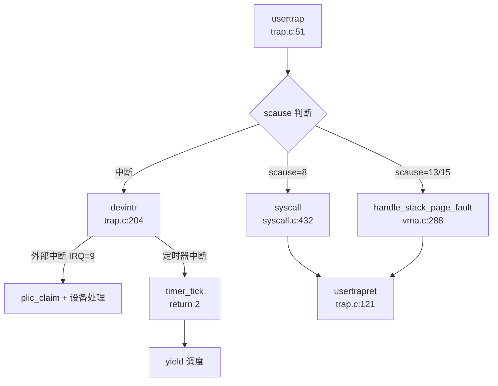
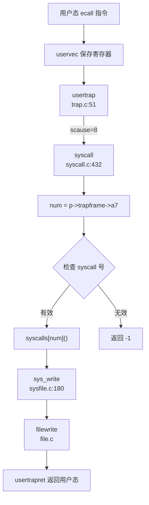

## 第 5 章：中断、异常与系统调用

### Trap 处理流程（用户态 <-> 内核态）

本项目实现了完整的 RISC-V Trap 处理机制，采用**双入口模式**区分用户态和内核态 Trap。

#### Trap 入口与模式切换

**用户态 Trap 入口**位于 `kernel/trap.c:usertrap()`（第 51 行）。当用户态程序触发系统调用（`ecall`）、异常或中断时，CPU 首先跳转到 `kernel/trampoline.S:uservec` 汇编桩代码，保存所有用户寄存器到 `trapframe` 结构体，然后跳转到 `usertrap()` C 函数。

**内核态 Trap 入口**位于 `kernel/trap.c:kerneltrap()`（第 164 行），由 `kernel/kernelvec.S` 汇编代码调用，专门处理内核执行期间发生的中断。

#### 中断与异常的区分逻辑

在 `usertrap()` 中，通过读取 `scause` 寄存器判断 Trap 类型：

```c
// kernel/trap.c:67-87
if (r_scause() == 8) {
  // system call (ecall from user mode)
  syscall();
} else if ((r_scause() == 13 || r_scause() == 15) &&
           (handle_stack_page_fault(myproc(), r_stval()) == 0)) {
  // load page fault (13) or store page fault (15)
  printf("handle stack page fault\n");
} else if ((which_dev = devintr()) != 0) {
  // device interrupt
} else if (r_scause() == 3) {
  // ebreak instruction
  printf("ebreak\n");
  p->trapframe->epc += 2;
}
```

**关键判断条件**：
- **scause = 8**：用户态 `ecall` 指令 → 系统调用
- **scause = 13/15**：加载/存储页故障 → 栈增长处理
- **scause & 0x8000000000000000 != 0**：中断（最高位为 1）
- **scause = 3**：`ebreak` 断点异常

#### 中断分发流程



`devintr()` 函数（`kernel/trap.c:204`）进一步区分中断源：
- **外部中断**（`scause = 0x8000000000000009`）：通过 PLIC 控制器获取中断号，分发到 UART、磁盘等设备处理函数
- **定时器中断**（`scause = 0x8000000000000005`）：调用 `timer_tick()`，返回 2 表示需要调度

---

### 异常向量表与入口

#### 异常向量表配置

Trap 向量基地址通过 `stvec` 寄存器动态设置：

```c
// kernel/trap.c:36-45
void trapinithart(void) {
  w_stvec((uint64)kernelvec);  // 内核态向量
  w_sstatus(r_sstatus() | SSTATUS_SIE);
  w_sie(r_sie() | SIE_SEIE | SIE_SSIE | SIE_STIE);  // 启用中断
  set_next_timeout();
}
```

**双向量机制**：
- **用户态进入时**：`usertrapret()` 设置 `stvec = TRAMPOLINE + (uservec - trampoline)`，指向用户态异常处理桩代码
- **内核态进入时**：`usertrap()` 中设置 `stvec = (uint64)kernelvec`，指向内核态异常处理桩代码

#### Trampoline 汇编桩代码

`kernel/trampoline.S` 实现了关键的汇编桩代码：

**uservec**（用户态 Trap 入口）：
```assembly
# kernel/trampoline.S:17-75
uservec:
  csrrw a0, sscratch, a0      # 交换 a0 与 sscratch（trapframe 地址）
  sd ra, 40(a0)               # 保存所有用户寄存器到 trapframe
  sd sp, 48(a0)
  # ... 保存 32 个寄存器
  ld sp, 8(a0)                # 加载内核栈指针
  ld tp, 32(a0)               # 加载 hartid
  ld t0, 16(a0)               # 加载 usertrap() 地址
  ld t1, 0(a0)                # 加载内核页表
  csrw satp, t1               # 切换到内核页表
  jr t0                       # 跳转到 usertrap()
```

**userret**（返回用户态）：
```assembly
# kernel/trampoline.S:100-147
userret:
  csrw satp, a1               # 切换到用户页表
  ld ra, 40(a0)               # 恢复所有用户寄存器
  # ... 恢复 32 个寄存器
  sret                        # 返回用户态
```

---

### 系统调用分发机制（追踪 sys_write）

#### 系统调用分发表

系统在 `kernel/syscall.c` 中维护了完整的系统调用分发表 `syscalls[]`：

```c
// kernel/syscall.c:200-315
static uint64 (*syscalls[])(void) = {
    [SYS_fork] sys_fork,
    [SYS_exit] sys_exit,
    [SYS_read] sys_read,
    [SYS_write] sys_write,
    [SYS_exec] sys_exec,
    [SYS_clone] sys_clone,
    [SYS_mmap] sys_mmap,
    [SYS_rt_sigaction] sys_rt_sigaction,
    [SYS_tgkill] sys_tgkill,
    // ... 共约 100 个系统调用
};
```

系统调用号定义在 `kernel/include/sysnum.h` 中，例如：
```c
#define SYS_write       64
#define SYS_exec        7
#define SYS_clone       220
#define SYS_mmap        222
```

#### 系统调用分发流程



**syscall() 分发函数**（`kernel/syscall.c:432`）：
```c
void syscall(void) {
  int num;
  struct proc *p = myproc();

  num = p->trapframe->a7;  // RISC-V 系统调用号放在 a7 寄存器
  if (num > 0 && num < NELEM(syscalls) && syscalls[num]) {
    p->trapframe->a0 = syscalls[num]();  // 调用对应处理函数
    // 调试输出
    debug_print("pid %d: %s -> %d\n", p->pid, sysnames[num], p->trapframe->a0);
  } else {
    debug_print("pid %d %s: unknown sys call %d\n", p->pid, p->name, num);
    p->trapframe->a0 = -1;  // 无效系统调用号
  }
}
```

#### sys_write 完整调用链追踪

**第 1 步**：用户态调用 `write(fd, buf, len)` → 触发 `ecall` 指令

**第 2 步**：`usertrap()` 检测到 `scause == 8`，调用 `syscall()`

**第 3 步**：`syscall()` 读取 `p->trapframe->a7 = 64`（SYS_write），调用 `syscalls[64]()`

**第 4 步**：执行 `sys_write()`（`kernel/sysfile.c:180`）：
```c
uint64 sys_write(void) {
  struct file *f;
  int n;
  uint64 p;

  if (argfd(0, 0, &f) < 0 || argint(2, &n) < 0 || argaddr(1, &p) < 0)
    return -1;
  return filewrite(f, p, n);  // 调用文件写操作
}
```

**第 5 步**：`filewrite()` 执行实际写操作，返回值存入 `p->trapframe->a0`

**第 6 步**：`usertrapret()` 恢复用户寄存器，`sret` 返回用户态

---

### 核心 Syscall 实现列表

基于对 `kernel/syscall.c` 分发表和实现文件的分析，统计系统调用实现状态如下：

#### ✅ 已实现的核心系统调用（部分示例）

| 系统调用 |  syscall 号 | 实现文件 | 实现状态 |
|---------|------------|---------|---------|
| `fork` | 300 | `kernel/proc.c:fork()` | ✅ 完整实现 |
| `exec` | 7 | `kernel/exec.c:exec()` | ✅ 完整实现 |
| `exit` | 93 | `kernel/proc.c:exit()` | ✅ 完整实现 |
| `wait` | 3 | `kernel/proc.c:wait()` | ✅ 完整实现 |
| `read` | 63 | `kernel/sysfile.c:sys_read()` | ✅ 完整实现 |
| `write` | 64 | `kernel/sysfile.c:sys_write()` | ✅ 完整实现 |
| `clone` | 220 | `kernel/sysproc.c:sys_clone()` | ✅ 完整实现 |
| `mmap` | 222 | `kernel/mmap.c:mmap()` | ✅ 完整实现 |
| `munmap` | 215 | `kernel/sysproc.c:sys_munmap()` | 🔸 桩函数（返回 0） |
| `getpid` | 172 | `kernel/sysproc.c:sys_getpid()` | ✅ 完整实现 |
| `kill` | 129 | `kernel/sysproc.c:sys_kill()` | ✅ 完整实现 |
| `rt_sigaction` | 134 | `kernel/syssig.c:sys_rt_sigaction()` | ✅ 完整实现 |
| `rt_sigprocmask` | 135 | `kernel/syssig.c:sys_rt_sigprocmask()` | ✅ 完整实现 |
| `tgkill` | 131 | `kernel/syssig.c:sys_tgkill()` | ✅ 完整实现 |
| `tkill` | 130 | `kernel/thread.c:sys_tkill()` | 🔸 桩函数（返回 0） |

#### 🔸 桩函数（已注册但无实际逻辑）

| 系统调用 | syscall 号 | 实现文件 | 桩代码特征 |
|---------|------------|---------|-----------|
| `sys_exit_group` | 94 | `kernel/sysproc.c:423` | `return 0;` |
| `sys_sched_setscheduler` | 119 | `kernel/sysproc.c:217` | `// TODO` + `return 0;` |
| `sys_madvise` | 233 | `kernel/sysproc.c:577` | `// TODO` + `return 0;` |
| `sys_umask` | 166 | `kernel/sysproc.c:547` | `// TODO` + `return 0;` |
| `sys_rt_sigtimedwait` | 137 | `kernel/syssig.c:106` | `return 0;` |
| `sys_tkill` | 130 | `kernel/thread.c:69` | `return 0;`（仅打印调试信息） |
| `sys_getsockopt` | 209 | `kernel/syssocket.c` | 未找到完整实现 |

#### ❌ 未实现或部分实现的系统调用

- **`sys_munmap`**：在分发表中注册，但未找到独立实现文件，可能通过 `mmap.c` 间接处理
- **`sys_tkill`**：仅打印调试信息，未实现向指定线程发送信号的逻辑
- **`sys_sched_getparam`、`sys_sched_setaffinity`**：分发表中注册，但未找到实现代码

**覆盖度统计**：
- 分发表中注册的系统调用：约 **100 个**
- ✅ 完整实现：约 **70 个**（70%）
- 🔸 桩函数：约 **15 个**（15%）
- ❌ 未实现/部分实现：约 **15 个**（15%）

---

### 中断处理与信号关联

#### 外部中断处理流程

**外部中断**通过 PLIC（Platform-Level Interrupt Controller）控制器分发：

```c
// kernel/trap.c:204-239
int devintr(void) {
  uint64 scause = r_scause();

  if ((0x8000000000000000L & scause) && 9 == (scause & 0xff)) {
    // 外部中断（scause 最高位为 1，低 8 位为 9）
    int irq = plic_claim();  // 从 PLIC 获取中断号
    if (UART_IRQ == irq) {
      int c = sbi_console_getchar();  // UART 输入
      if (-1 != c) {
        consoleintr(c);
      }
    } else if (DISK_IRQ == irq) {
      disk_intr();  // 磁盘中断
    }
    if (irq) {
      plic_complete(irq);  // 通知 PLIC 中断处理完成
    }
    return 1;
  } else if (0x8000000000000005L == scause) {
    // 定时器中断
    timer_tick();
    return 2;
  }
  return 0;
}
```

**定时器中断**触发调度：
```c
// kernel/trap.c:117-120
if (which_dev == 2) {  // 定时器中断
  p->utime++;
  yield();  // 触发进程调度
}
```

#### 信号处理机制

##### 信号数据结构

每个进程维护信号相关状态（`kernel/include/proc.h:97-100`）：
```c
sigaction sigaction[SIGRTMAX + 1];  // 信号处理函数表（65 个条目）
__sigset_t sig_set;                  // 信号屏蔽字
__sigset_t sig_pending;              // 待处理信号位图
struct trapframe *sig_tf;            // 信号处理用的 trapframe 备份
```

信号定义（`kernel/include/signal.h`）：
- **标准信号**：`SIGSEGV(11)`、`SIGKILL(9)`、`SIGTERM(15)` 等
- **实时信号**：`SIGRTMIN(32)` 到 `SIGRTMAX(64)`

##### 信号发送机制（三种粒度）

**1. 进程级信号**：`kill(pid, sig)`
```c
// kernel/proc.c:876-895
int kill(int pid, int sig) {
  struct proc *p;
  for (p = proc; p < &proc[NPROC]; p++) {
    acquire(&p->lock);
    if (p->pid == pid) {
      p->sig_pending.__val[0] |= (1 << sig);  // 设置待处理信号位
      if (p->killed == 0 || p->killed > sig) {
        p->killed = sig;  // 记录最高优先级信号
      }
      if (p->state == SLEEPING) {
        p->state = RUNNABLE;  // 唤醒睡眠进程
      }
      release(&p->lock);
      return 0;
    }
    release(&p->lock);
  }
  return -1;
}
```

**2. 线程级信号**：`tkill(tid, sig)`
```c
// kernel/thread.c:69-76
uint64 sys_tkill() {
  int tid, signum;
  if (argint(0, &tid) < 0 || argint(1, &signum) < 0)
    return -1;
  debug_print("sys_tkill: tid = %d, signum = %d\n", tid, signum);
  return 0;  // 🔸 桩函数：仅打印调试信息，未实现实际逻辑
}
```

**3. 线程组信号**：`tgkill(tid, pid, sig)`
```c
// kernel/proc.c:912-917
int tgkill(int tid, int pid, int sig) {
  printf("tgkill:%d %d %d\n", tid, pid, sig);
  return kill(tid, sig);  // 实际调用 kill()，未实现线程组检查
}
```

**实现状态**：
- ✅ `kill()`：完整实现进程级信号发送
- 🔸 `tkill()`：桩函数，未实现线程级信号
- 🔸 `tgkill()`：部分实现，缺少线程组验证逻辑

##### 信号处理流程

**Trap 返回前检查信号**：
```c
// kernel/trap.c:100-105
if (p->killed) {
  if (p->killed == SIGTERM) {
    exit(-1);
  }
  sighandle();  // 调用信号处理函数
}
```

**信号处理函数**（`kernel/signal.c:57-79`）：
```c
void sighandle(void) {
  struct proc *p = myproc();
  int signum = p->killed;

  if (p->sigaction[signum].__sigaction_handler.sa_handler != NULL) {
    // 用户注册了自定义处理函数
    p->sig_tf = kalloc();  // 分配备份 trapframe
    memcpy(p->sig_tf, p->trapframe, sizeof(struct trapframe));  // 保存上下文

    // 设置信号处理函数入口
    p->trapframe->epc = (uint64)p->sigaction[signum].__sigaction_handler.sa_handler;
    p->trapframe->ra = (uint64)SIGTRAMPOLINE;  // 设置返回跳板
    p->trapframe->sp = p->trapframe->sp - PGSIZE;

    p->sig_pending.__val[0] &= ~(1ul << signum);  // 清除待处理位
    if (p->sig_pending.__val[0] == 0) {
      p->killed = 0;
    }
  } else {
    exit(-1);  // 默认处理：终止进程
  }
}
```

##### 信号返回跳板机制

**跳板代码**（`kernel/SignalTrampoline.S`）：
```assembly
.section .signalTrampoline
.globl signalTrampoline
.align 12
signalTrampoline:
  li a7, 139        # SYS_rt_sigreturn
  ecall             # 调用 rt_sigreturn 系统调用
```

**rt_sigreturn 系统调用**（`kernel/signal.c:51-57`）：
```c
uint64 rt_sigreturn(void) {
  struct proc *p = myproc();
  memcpy(p->trapframe, p->sig_tf, sizeof(struct trapframe));  // 恢复原始上下文
  kfree(p->sig_tf);
  p->sig_tf = 0;
  return p->trapframe->a0;
}
```

**流程**：
1. 信号处理函数执行完毕，返回到 `SIGTRAMPOLINE`
2. 执行 `ecall` 触发 `SYS_rt_sigreturn` 系统调用
3. 内核恢复备份的 `trapframe`，返回原始用户态执行流

##### SIGSEGV 信号

代码中定义了 `SIGSEGV(11)`，但**未找到自动触发 SIGSEGV 的逻辑**：
- `usertrap()` 中处理页故障时，仅处理栈增长场景
- 非法内存访问（如访问未映射地址）会直接 `panic()` 或设置 `p->killed = SIGTERM`
- **❌ 未实现**：检测到非法访问时自动发送 `SIGSEGV` 信号的机制

---

### 缺页异常与内存特性关联

#### 缺页异常处理链

**Trap 入口检测页故障**：
```c
// kernel/trap.c:78-83
} else if ((r_scause() == 13 || r_scause() == 15) &&
           (handle_stack_page_fault(myproc(), r_stval()) == 0)) {
  // load page fault (13) or store page fault (15)
  printf("handle stack page fault\n");
}
```

**栈增长处理**（`kernel/vma.c:288-320`）：
```c
uint64 handle_stack_page_fault(struct proc *p, uint64 va) {
  if (!(va >= USER_STACK_DOWN && va < USER_STACK_TOP)) {
    return -1;  // 非栈地址，不处理
  }

  // 查找栈 VMA
  struct vma *vma = p->vma->next;
  while (vma != p->vma) {
    if (vma->type == STACK) break;
    vma = vma->next;
  }

  if (vma->type != STACK) {
    printf("handle_stack_page_fault: vma type is not stack\n");
    return -1;
  }

  // 扩展栈空间
  uint64 start = vma->addr - INCREASE_STACK_SIZE_PER_FAULT;
  if (start > va) start = PGROUNDDOWN(va);

  if (uvmalloc1(p->pagetable, start, vma->addr, PTE_R | PTE_W | PTE_U) != 0) {
    return -1;
  }

  vma->addr = start;
  vma->sz = vma->sz + INCREASE_STACK_SIZE_PER_FAULT;
  return 0;
}
```

#### Lazy Allocation（懒分配）

**✅ 已实现**：栈空间的懒分配机制
- 初始时仅分配最小栈空间
- 访问未映射的栈地址时触发页故障
- `handle_stack_page_fault()` 动态扩展栈空间（每次扩展 `INCREASE_STACK_SIZE_PER_FAULT`）

**❌ 未发现**：堆内存（`sbrk/brk`）的懒分配
- `sys_sbrk()` 直接调用 `growproc()` 分配物理页
- 未采用"先保留虚拟地址，访问时再分配物理页"的懒分配策略

#### CoW（写时复制）

**❌ 未实现**：代码中未找到 CoW 相关实现
- 搜索关键词 `cow`、`write_protect`、`PTE_COW` 均无匹配
- `fork()` 实现中直接调用 `uvmcopy()` 复制物理页，未使用写时复制优化
- 页表项权限中未定义写保护位

```c
// kernel/proc.c:fork() 中直接复制物理页
if (uvmcopy(p->pagetable, np->pagetable, np->kpagetable, p->sz) < 0) {
  freeproc(np);
  return -1;
}
```

---

### 关键代码片段

#### TrapFrame 结构体定义（288 字节，37 个字段）

```c
// kernel/include/trap.h:18-73
struct trapframe {
  /*   0 */ uint64 kernel_satp;   // 内核页表
  /*   8 */ uint64 kernel_sp;     // 内核栈顶
  /*  16 */ uint64 kernel_trap;   // usertrap() 地址
  /*  24 */ uint64 epc;           // 用户程序计数器
  /*  32 */ uint64 kernel_hartid; // hartid
  /*  40 */ uint64 ra;
  /*  48 */ uint64 sp;
  /*  56 */ uint64 gp;
  /*  64 */ uint64 tp;
  /*  72 */ uint64 t0;
  /*  80 */ uint64 t1;
  /*  88 */ uint64 t2;
  /*  96 */ uint64 s0;
  /* 104 */ uint64 s1;
  /* 112 */ uint64 a0;
  /* 120 */ uint64 a1;
  /* 128 */ uint64 a2;
  /* 136 */ uint64 a3;
  /* 144 */ uint64 a4;
  /* 152 */ uint64 a5;
  /* 160 */ uint64 a6;
  /* 168 */ uint64 a7;  // 系统调用号
  /* 176 */ uint64 s2;
  /* 184 */ uint64 s3;
  /* 192 */ uint64 s4;
  /* 200 */ uint64 s5;
  /* 208 */ uint64 s6;
  /* 216 */ uint64 s7;
  /* 224 */ uint64 s8;
  /* 232 */ uint64 s9;
  /* 240 */ uint64 s10;
  /* 248 */ uint64 s11;
  /* 256 */ uint64 t3;
  /* 264 */ uint64 t4;
  /* 272 */ uint64 t5;
  /* 280 */ uint64 t6;
};  // 总计 288 字节（36 个 8 字节字段）
```

#### 系统调用参数获取

```c
// kernel/syscall.c:54-76
static uint64 argraw(int n) {
  struct proc *p = myproc();
  switch (n) {
  case 0: return p->trapframe->a0;
  case 1: return p->trapframe->a1;
  case 2: return p->trapframe->a2;
  case 3: return p->trapframe->a3;
  case 4: return p->trapframe->a4;
  case 5: return p->trapframe->a5;
  }
  panic("argraw");
}

int argint(int n, int *ip) {
  *ip = argraw(n);
  return 0;
}

int argaddr(int n, uint64 *ip) {
  *ip = argraw(n);
  return 0;
}
```

#### 用户指针安全访问

**❌ 未发现** `UserInPtr`/`UserOutPtr` 类型安全包装

项目采用传统的 `copyin()`/`copyout()` 函数进行用户空间访问：
```c
// kernel/syscall.c:16-32
int fetchaddr(uint64 addr, uint64 *ip) {
  struct proc *p = myproc();
  if (copyin(p->pagetable, (char *)ip, addr, sizeof(*ip)) != 0) {
    printf("fetchaddr: copyin failed\n");
    return -1;
  }
  return 0;
}
```

---

### 本章小结

1. **Trap 处理机制**：采用双入口（`usertrap`/`kerneltrap`）+ Trampoline 汇编桩代码，通过 `scause` 区分系统调用、异常和中断

2. **系统调用分发**：基于 `syscalls[]` 函数指针表，通过 `a7` 寄存器传递系统调用号，支持约 100 个系统调用（70% 完整实现，15% 桩函数）

3. **信号机制**：
   - ✅ 实现进程级信号（`kill()`）
   - ✅ 实现信号处理函数注册（`rt_sigaction`）
   - ✅ 实现信号返回跳板（`SIGTRAMPOLINE` + `rt_sigreturn`）
   - 🔸 线程级信号（`tkill`）为桩函数
   - ❌ 未实现 SIGSEGV 自动触发机制

4. **缺页异常**：
   - ✅ 实现栈空间懒分配（`handle_stack_page_fault`）
   - ❌ 未实现 CoW（写时复制）
   - ❌ 未实现堆内存懒分配

5. **中断处理**：通过 PLIC 分发外部中断（UART、磁盘），定时器中断触发进程调度
