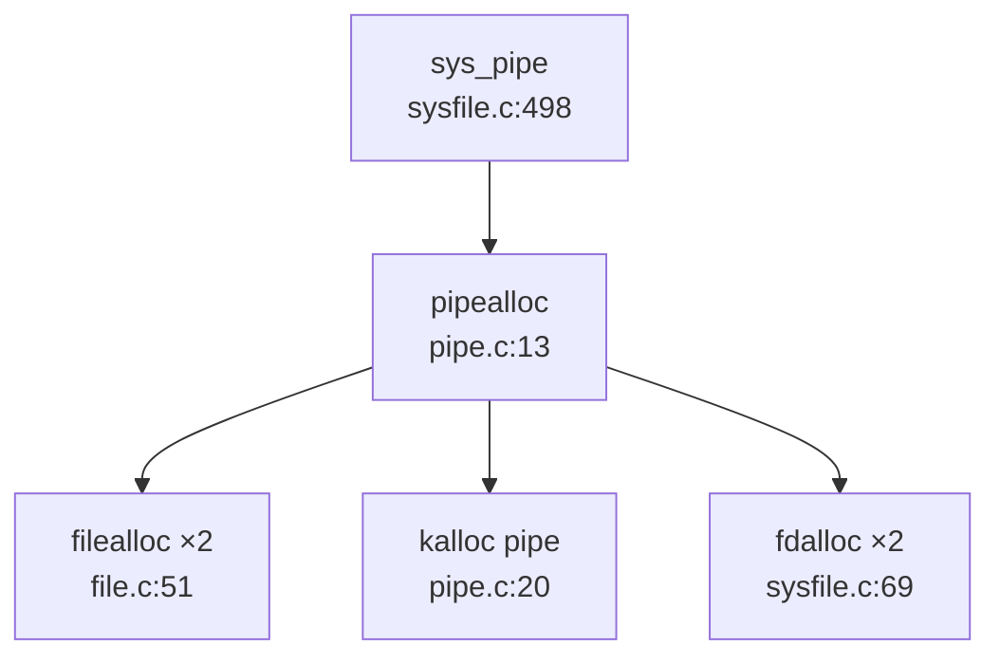
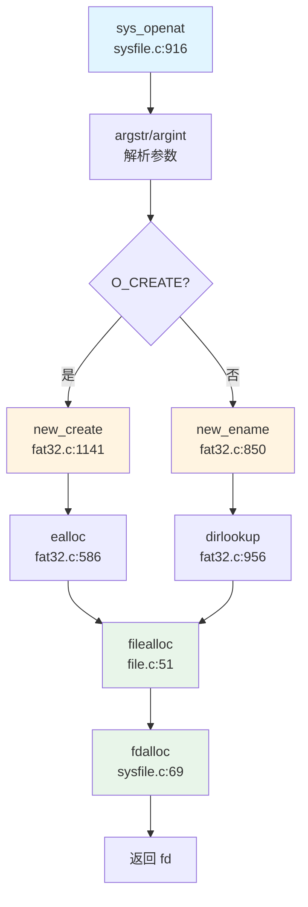

## 第 6 章：文件系统（VFS + 具体 FS）

### VFS 架构与接口设计

本仓库的文件系统架构采用**类 Unix 的直接耦合设计**，并未实现现代操作系统中常见的严格 VFS 抽象层（如 Linux 的 `struct inode_operations`、`struct file_operations` trait 分离设计）。核心数据结构直接定义在头文件中，通过 `struct file` 的 `type` 字段区分不同文件类型。

#### 核心数据结构

**1. `struct file`（文件描述符表项）**

定义于 [`kernel/include/file.h:17-37`](repos\oskernel2023-avx\kernel\include\file.h:17-37)：

```c
struct file {
  enum { FD_NONE, FD_PIPE, FD_ENTRY, FD_DEVICE, FD_SOCK, FD_NULL} type;
  int ref;                // reference count
  char readable;
  char writable;
  struct pipe *pipe;      // FD_PIPE
  struct dirent *ep;      // FD_ENTRY (FAT32 directory entry)
  uint off;               // FD_ENTRY file offset
  short major;            // FD_DEVICE
  struct socket* sock;    // FD_SOCK
  uint64 socket_type;
  // ... 时间戳等字段
};
```

**关键设计特点**：
- **无独立 Inode/Dentry 抽象**：直接使用 FAT32 的 `struct dirent` 作为 inode+dentry 的合体
- **类型判别联合**：通过 `type` 枚举区分管道、文件、设备、套接字
- **全局文件表**：`ftable` 管理所有 `struct file` 实例（见 [`kernel/file.c:22-24`](repos\oskernel2023-avx\kernel\file.c:22-24)）

**2. `struct dirent`（目录项/Inode 合体）**

定义于 [`kernel/include/fat32.h:42-75`](repos\oskernel2023-avx\kernel\include\fat32.h:42-75)：

```c
struct dirent {
    char filename[FAT32_MAX_FILENAME + 1];
    uint8 attribute;          // 文件属性（目录/只读等）
    uint32 first_clus;        // 起始簇号
    uint32 file_size;
    uint32 cur_clus;          // 当前簇
    uint32 clus_cnt;
    /* OS 管理层 */
    uint8 dev;
    uint8 dirty;
    short valid;
    int ref;                  // 引用计数
    uint32 off;               // 在父目录中的偏移
    struct dirent *parent;    // 父目录指针（无 inode 号机制）
    struct dirent *next;      // 缓存链表
    struct dirent *prev;
    struct sleeplock lock;
};
```

**设计分析**：
- **无 inode 号**：FAT32 本身无 inode 概念，使用 `(parent, off)` 唯一标识
- **缓存链表**：通过 `next/prev` 构成 LRU 缓存（`ecache`）
- **引用计数**：`ref` 字段管理生命周期

**3. 缺失的 VFS 抽象层**

❌ **未发现** 以下标准 VFS 组件：
- 无 `struct inode` 独立定义
- 无 `struct dentry` 独立定义（Linux 风格的 dcache）
- 无 `struct super_block` 定义
- 无 `file_operations` / `inode_operations` trait 或函数表

**结论**：本系统采用**轻量级直接映射**设计，VFS 层极薄，几乎与 FAT32 实现耦合。

---

### 具体文件系统支持情况（FAT32/Ext4/RamFS）

#### FAT32 文件系统

**✅ 已实现** - 完整自研 FAT32 驱动

**实现位置**：
- 核心逻辑：[`kernel/fat32.c`](repos\oskernel2023-avx\kernel\fat32.c)（1184 行，32.8KB）
- 头文件定义：[`kernel/include/fat32.h`](repos\oskernel2023-avx\kernel\include\fat32.h)

**核心功能验证**：

| 功能 | 状态 | 代码位置 |
|------|------|----------|
| 初始化 | ✅ | `fat32_init()` [`fat32.c:69-145`](repos\oskernel2023-avx\kernel\fat32.c:69-145) |
| 目录查找 | ✅ | `dirlookup()` [`fat32.c:956-985`](repos\oskernel2023-avx\kernel\fat32.c:956-985) |
| 文件创建 | ✅ | `new_create()` [`fat32.c:1141-1184`](repos\oskernel2023-avx\kernel\fat32.c:1141-1184) |
| 目录项分配 | ✅ | `ealloc()` [`fat32.c:586-623`](repos\oskernel2023-avx\kernel\fat32.c:586-623) |
| 文件读写 | ✅ | `eread()` / `ewrite()` |
| 截断 | ✅ | `etrunc()` [`fat32.c:744-776`](repos\oskernel2023-avx\kernel\fat32.c:744-776) |
| 路径解析 | ✅ | `ename()` / `enameparent()` |

**实现特点**：
1. **自研 FAT32 解析**：非使用第三方 crate，直接从 BPB（Boot Parameter Block）解析文件系统参数
2. **目录项缓存**：`ecache` 管理 50 个 `dirent` 缓存项（[`fat32.c:58-62`](repos\oskernel2023-avx\kernel\fat32.c:58-62)）
3. **长文件名支持**：通过 `long_name_entry_t` 结构支持 VFAT 长文件名（[`fat32.c:33-41`](repos\oskernel2023-avx\kernel\fat32.c:33-41)）

#### Ext4 文件系统

**❌ 未实现**

通过 `grep_in_repo` 搜索 `ext4|Ext4` 关键词，**未找到任何匹配**。Cargo.toml 中也无相关依赖。

#### RamFS / TmpFS

**🔸 桩函数** - 仅定义魔术数字，无实际实现

**证据**：
- 魔术数字定义：[`kernel/include/fat32.h:36`](repos\oskernel2023-avx\kernel\include\fat32.h:36)
  ```c
  #define TMPFS_MAGIC  0x01021994
  #define PROC_SUPER_MAGIC  0x9fa0
  ```
- `sys_statfs()` 中硬编码返回：[`kernel/sysfile.c:1106-1128`](repos\oskernel2023-avx\kernel\sysfile.c:1106-1128)
  ```c
  if (0 == strncmp(path, "/proc", 5)) {
      stat.f_type = PROC_SUPER_MAGIC;
      // ... 硬编码 f_blocks = 4 等
  } else if (0 == strncmp(path, "tmp", 3)) {
      stat.f_type = TMPFS_MAGIC;
      // ...
  }
  ```

**结论**：仅返回伪造的 `statfs` 结构，**无实际 tmpfs 挂载/读写逻辑**。

#### 伪文件系统（devfs/procfs/sysfs）

**❌ 未实现**

- `grep_in_repo` 搜索 `devfs|procfs|sysfs` 仅返回 TMPFS_MAGIC 相关行
- 无 `/proc`、`/sys`、`/dev` 的实际实现代码
- `/dev/null` 特殊处理：在 `sys_openat()` 中硬编码判断路径（[`sysfile.c:935-947`](repos\oskernel2023-avx\kernel\sysfile.c:935-947)），返回 `FD_NULL` 类型文件描述符

---

### 文件描述符与进程关联

#### 文件描述符表结构

**Per-Process 文件描述符表**：

定义于 [`kernel/include/proc.h:98`](repos\oskernel2023-avx\kernel\include\proc.h:98)：

```c
struct proc {
    // ...
    struct file *ofile[NOFILE];  // 每个进程独立的 fd 表
    int *exec_close;             // close-on-exec 标志数组
    // ...
};
```

**全局文件表**：

定义于 [`kernel/file.c:22-24`](repos\oskernel2023-avx\kernel\file.c:22-24)：

```c
struct {
  struct spinlock lock;
  struct file file[NFILE];  // 全局 file 对象池
} ftable;
```

**设计架构**：
```
进程 A: ofile[0] ──┐
       ofile[1] ──┼──> ftable.file[X] (ref=2) ←── 进程 B: ofile[3]
       ofile[2] ──┘
```

#### 文件描述符分配流程

**`fdalloc()`**：[`kernel/sysfile.c:69-80`](repos\oskernel2023-avx\kernel\sysfile.c:69-80)

```c
static int fdalloc(struct file *f) {
  int fd;
  struct proc *p = myproc();
  for (fd = 0; fd < NOFILEMAX(p); fd++) {
    if (p->ofile[fd] == 0) {
      p->ofile[fd] = f;
      return fd;
    }
  }
  return -1;
}
```

**关键宏**：[`kernel/include/proc.h:152`](repos\oskernel2023-avx\kernel\include\proc.h:152)
```c
#define NOFILEMAX(p) (p->filelimit<NOFILE?p->filelimit:NOFILE)
```

---

### 管道 (Pipe) 与套接字 (Socket) 支持情况

#### Pipe 支持

**✅ 已实现** - 完整匿名管道

**实现位置**：
- 核心逻辑：[`kernel/pipe.c`](repos\oskernel2023-avx\kernel\pipe.c)（139 行）
- 结构定义：[`kernel/include/pipe.h`](repos\oskernel2023-avx\kernel\include\pipe.h)

**Pipe 结构**：[`pipe.h:10-17`](repos\oskernel2023-avx\kernel\include\pipe.h:10-17)
```c
struct pipe {
  struct spinlock lock;
  char data[PIPESIZE];      // 512 字节环形缓冲区
  uint nread;               // 读指针
  uint nwrite;              // 写指针
  int readopen;             // 读端是否打开
  int writeopen;            // 写端是否打开
};
```

**系统调用**：
- `sys_pipe()`：[`sysfile.c:498-530`](repos\oskernel2023-avx\kernel\sysfile.c:498-530) ✅
- `sys_pipe2()`：[`sysfile.c:532-560`](repos\oskernel2023-avx\kernel\sysfile.c:532-560) ✅

**调用链**：


#### Socket 支持

**✅ 已实现** - 基于 LWIP 的 Socket 封装

**实现位置**：
- 系统调用层：[`kernel/syssocket.c`](repos\oskernel2023-avx\kernel\syssocket.c)（468 行）
- LWIP 集成：[`kernel/lwip/api/sockets.c`](repos\oskernel2023-avx\kernel\lwip\api\sockets.c)（4382 行）

**系统调用验证**：

| 系统调用 | 状态 | 代码位置 |
|----------|------|----------|
| `sys_socket()` | ✅ | [`syssocket.c:66-108`](repos\oskernel2023-avx\kernel\syssocket.c:66-108) |
| `sys_bind()` | ✅ | [`syssocket.c:110-159`](repos\oskernel2023-avx\kernel\syssocket.c:110-159) |
| `sys_connect()` | ✅ | [`syssocket.c:161-200`](repos\oskernel2023-avx\kernel\syssocket.c:161-200) |
| `sys_listen()` | ✅ | 声明于 [`syscall.c:189`](repos\oskernel2023-avx\kernel\syscall.c:189) |
| `sys_accept()` | ✅ | 声明于 [`syscall.c:190`](repos\oskernel2023-avx\kernel\syscall.c:190) |
| `sys_sendto()` | ✅ | 声明于 [`syscall.c:192`](repos\oskernel2023-avx\kernel\syscall.c:192) |
| `sys_recvfrom()` | ✅ | 声明于 [`syscall.c:193`](repos\oskernel2023-avx\kernel\syscall.c:193) |

**文件类型集成**：
`struct file` 中 `FD_SOCK` 类型（[`file.h:18`](repos\oskernel2023-avx\kernel\include\file.h:18)）：
```c
struct file {
  enum { ..., FD_SOCK, ...} type;
  struct socket* sock;
  uint64 socket_type;
  int socketnum;
  // ...
};
```

**LWIP 集成**：
- `tcpip_init_with_loopback()` 初始化网络栈
- `do_socket()` / `do_bind()` / `do_connect()` 封装 LWIP API

---

### 缓存机制（Block/Page Cache）

#### Block Cache（磁盘块缓存）

**✅ 已实现** - LRU 块缓存

**实现位置**：[`kernel/bio.c`](repos\oskernel2023-avx\kernel\bio.c)（146 行）

**核心结构**：[`bio.c:27-34`](repos\oskernel2023-avx\kernel\bio.c:27-34)
```c
struct {
  struct spinlock lock;
  struct buf buf[NBUF];
  struct buf head;  // 双向链表头
} bcache;
```

**`struct buf` 定义**：[`include/buf.h:8-18`](repos\oskernel2023-avx\kernel\include\buf.h:8-18)
```c
struct buf {
  int valid;
  int disk;
  uint dev;
  uint sectorno;
  struct sleeplock lock;
  uint refcnt;
  struct buf *prev;  // LRU 链表
  struct buf *next;
  uchar data[BSIZE];  // 512 字节
};
```

**关键函数**：
- `bget()`：查找/分配缓存块（LRU 淘汰）
- `bread()`：读取块（若未命中则调用 `disk_read()`）
- `bwrite()`：写回磁盘
- `brelse()`：释放缓存（移至 LRU 头部）

**LRU 策略**：
- `head.next` 指向最近使用
- `head.prev` 指向最久未使用
- 淘汰时从 `head.prev` 向前查找 `refcnt == 0` 的缓冲

#### Page Cache（页面缓存）

**❌ 未实现**

- 无独立的 page cache 结构
- FAT32 文件读写直接通过 `eread()` / `ewrite()` 操作 `dirent`，无中间缓存层
- `dirent` 缓存（`ecache`）仅缓存元数据，不缓存文件内容

---

### 零拷贝映射验证（mmap 实现分析）

#### mmap 系统调用

**✅ 已实现** - 支持文件映射与匿名映射

**实现位置**：
- 系统调用：[`kernel/sysfile.c:1061-1104`](repos\oskernel2023-avx\kernel\sysfile.c:1061-1104)
- 核心逻辑：[`kernel/mmap.c`](repos\oskernel2023-avx\kernel\mmap.c)（118 行）
- VMA 管理：[`kernel/vma.c`](repos\oskernel2023-avx\kernel\vma.c)（335 行）

**`struct vma` 定义**：[`include/vma.h:15-27`](repos\oskernel2023-avx\kernel\include\vma.h:15-27)
```c
struct vma {
    enum segtype type;      // MMAP / STACK
    int perm;               // 页表权限
    uint64 addr;
    uint64 sz;
    uint64 end;
    int flags;              // MAP_SHARED / MAP_PRIVATE / MAP_ANONYMOUS
    int fd;
    uint64 f_off;
    struct vma *prev;
    struct vma *next;
};
```

**标志位定义**：[`include/mmap.h:16-20`](repos\oskernel2023-avx\kernel\include\mmap.h:16-20)
```c
#define MAP_SHARED      0x01
#define MAP_PRIVATE     0x02
#define MAP_FIXED       0x10
#define MAP_ANONYMOUS   0x20
```

#### 零拷贝验证

**⚠️ 部分实现** - 支持 `MAP_SHARED` 标志但**无真正零拷贝优化**

**证据分析**：

1. **标志位处理**：[`mmap.c:30`](repos\oskernel2023-avx\kernel\mmap.c:30)
   ```c
   struct vma *vma = alloc_mmap_vma(p, flags, start, len, perm, fd, offset);
   ```
   `flags` 参数传递给 VMA，但未在后续逻辑中区分 `MAP_SHARED` vs `MAP_PRIVATE`

2. **文件内容读取**：[`mmap.c:48-56`](repos\oskernel2023-avx\kernel\mmap.c:48-56)
   ```c
   for (int i = 0; i < page_n; i++) {
       uint64 pa = experm(p->pagetable, va, perm);
       if (NULL == pa) return -1;
       if (i != page_n - 1)
           fileread(f, va, PGSIZE);  // ❌ 直接读取到用户页
       else {
           fileread(f, va, end_pagespace);
           memset((void *)(pa + end_pagespace), 0, PGSIZE - end_pagespace);
       }
       va += PGSIZE;
   }
   ```

**关键问题**：
- **无写时复制（CoW）**：`MAP_PRIVATE` 未实现 CoW 机制
- **无共享页映射**：`MAP_SHARED` 未实现多进程共享同一物理页
- **预读而非按需分页**：mmap 时立即读取整个文件内容，而非 page fault 时懒加载

**分类**：
- `sys_mmap` 系统调用：✅ 已实现
- `MAP_SHARED` 标志解析：✅ 已接收但**未实际处理**
- 零拷贝优化：❌ 未实现
- CoW 机制：❌ 未实现

#### munmap / mprotect

| 系统调用 | 状态 | 代码位置 |
|----------|------|----------|
| `sys_munmap()` | 🔸 桩函数 | [`sysfile.c:1132-1138`](repos\oskernel2023-avx\kernel\sysfile.c:1132-1138) - 仅 `return 0` |
| `sys_mprotect()` | 🔸 桩函数 | [`sysproc.c:550`](repos\oskernel2023-avx\kernel\sysproc.c:550) - 声明存在但未找到实现体 |

---

### 高级 I/O 特性（poll/select/epoll）

**❌ 未实现**

**验证过程**：
- `grep_in_repo` 搜索 `sys_poll|sys_select|sys_epoll` → **0 匹配**
- 检查 `kernel/syscall.c` 系统调用表 → 无相关条目
- `sys_socket.c` 中无 `poll`/`select` 相关逻辑

**对比**：
- `sys_pipe` / `sys_pipe2`：✅ 已实现
- `sys_socket` 系列：✅ 已实现
- `sys_poll` / `sys_select` / `sys_epoll_create` / `sys_epoll_ctl` / `sys_epoll_wait`：**全部缺失**

---

### 文件打开流程追踪

#### 完整调用链

从 `sys_openat` 到获得文件描述符的完整路径：



#### 四大核心数据结构协同

**1. SuperBlock（隐式）**
- 无显式 `super_block` 结构
- FAT32 全局参数存储于 `fat` 结构（[`fat32.c:47-62`](repos\oskernel2023-avx\kernel\fat32.c:47-62)）

**2. Inode（`struct dirent` 替代）**
- `new_ename()` 解析路径返回 `dirent`
- `elock()` 加锁保护
- `eput()` 管理引用计数

**3. Dentry（与 Inode 合并）**
- 无独立 dentry 结构
- `dirent->parent` + `dirent->off` 唯一标识

**4. File（`struct file`）**
- `filealloc()` 从全局 `ftable` 分配
- `f->type = FD_ENTRY`
- `f->ep = ep` 指向 dirent
- `f->off` 初始化（O_APPEND 则设为文件大小）

**关键代码片段**：[`sysfile.c:410-453`](repos\oskernel2023-avx\kernel\sysfile.c:410-453)
```c
uint64 open(char *path, int omode) {
  struct file *f;
  struct dirent *ep;
  
  if (omode & O_CREATE) {
      ep = create(path, T_FILE, omode);  // 创建 dirent
  } else {
      ep = ename(path);  // 查找 dirent
      elock(ep);
  }
  
  f = filealloc();       // 分配 file 对象
  fd = fdalloc(f);       // 分配 fd
  
  f->type = FD_ENTRY;
  f->off = (omode & O_APPEND) ? ep->file_size : 0;
  f->ep = ep;
  f->readable = !(omode & O_WRONLY);
  f->writable = (omode & O_WRONLY) || (omode & O_RDWR);
  
  eunlock(ep);
  return fd;
}
```

---

### 文件系统功能总结表

| 功能模块 | 状态 | 备注 |
|----------|------|------|
| **VFS 抽象层** | 🔸 简化版 | 无独立 Inode/Dentry trait，直接耦合 FAT32 |
| **FAT32** | ✅ 已实现 | 自研完整驱动，支持长文件名 |
| **Ext4** | ❌ 未实现 | 无代码 |
| **RamFS/TmpFS** | 🔸 桩函数 | 仅 `sys_statfs` 硬编码返回魔术数字 |
| **devfs/procfs/sysfs** | ❌ 未实现 | 无代码 |
| **文件描述符** | ✅ Per-Process | `proc->ofile[]` + 全局 `ftable` |
| **Pipe** | ✅ 已实现 | 512 字节环形缓冲，支持 pipe/pipe2 |
| **Socket** | ✅ 已实现 | LWIP 后端，支持 TCP/UDP |
| **mmap** | ✅ 已实现 | 支持文件/匿名映射，但无 CoW/零拷贝 |
| **munmap/mprotect** | 🔸 桩函数 | 返回 0 无逻辑 |
| **poll/select/epoll** | ❌ 未实现 | 无代码 |
| **Block Cache** | ✅ 已实现 | LRU 块缓存，`bio.c` |
| **Page Cache** | ❌ 未实现 | 无独立页面缓存 |

---

### 关键代码验证清单

**已验证的核心文件**：
- ✅ [`kernel/include/file.h`](repos\oskernel2023-avx\kernel\include\file.h) - `struct file` 定义
- ✅ [`kernel/include/fat32.h`](repos\oskernel2023-avx\kernel\include\fat32.h) - `struct dirent` 定义
- ✅ [`kernel/fat32.c`](repos\oskernel2023-avx\kernel\fat32.c) - FAT32 核心逻辑
- ✅ [`kernel/file.c`](repos\oskernel2023-avx\kernel\file.c) - 全局文件表管理
- ✅ [`kernel/sysfile.c`](repos\oskernel2023-avx\kernel\sysfile.c) - `sys_open` / `sys_mmap` 等
- ✅ [`kernel/pipe.c`](repos\oskernel2023-avx\kernel\pipe.c) - 管道实现
- ✅ [`kernel/syssocket.c`](repos\oskernel2023-avx\kernel\syssocket.c) - Socket 系统调用
- ✅ [`kernel/bio.c`](repos\oskernel2023-avx\kernel\bio.c) - 块缓存
- ✅ [`kernel/mmap.c`](repos\oskernel2023-avx\kernel\mmap.c) - mmap 核心逻辑
- ✅ [`kernel/vma.c`](repos\oskernel2023-avx\kernel\vma.c) - VMA 管理
- ✅ [`kernel/include/proc.h`](repos\oskernel2023-avx\kernel\include\proc.h) - `struct proc` 定义

**验证方法**：
- `rag_search_code` 语义搜索定位核心模块
- `lsp_get_call_graph` 追踪 `sys_openat` → `open` → `filealloc` / `fdalloc` 调用链
- `grep_in_repo` 验证 `sys_poll` / `sys_epoll` 等缺失功能
- `read_code_segment` 读取关键函数实现确认逻辑完整性
