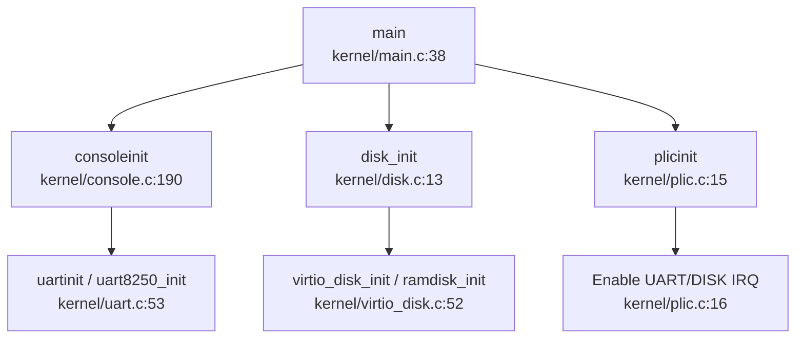
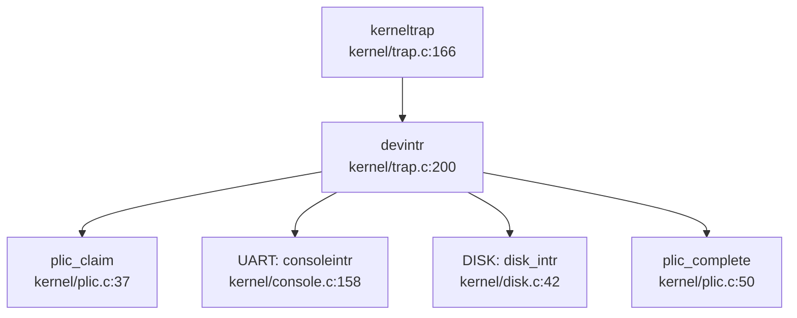

## 第 7 章：设备驱动与硬件抽象

本章分析 oskernel2023-avx 项目的设备驱动架构，涵盖设备发现机制、驱动框架设计、字符设备（UART）、块设备（VirtIO-Blk/SD 卡）、网络设备、中断控制器以及多平台适配策略。

---

## 驱动框架与设备发现

### 设备发现机制：硬编码地址而非 Device Tree 解析

该项目**未实现 Device Tree (DTS) 解析功能**。所有设备地址均采用硬编码方式定义在 `kernel/include/memlayout.h` 中，通过条件编译区分不同平台。

**关键证据**：

```c
// kernel/include/memlayout.h:42-62
#define VIRT_OFFSET             0x3F00000000L

// qemu puts UART registers here in physical memory.
#define UART                    0x10000000L
#define UART_V                  (UART + VIRT_OFFSET)

#define SD_BASE            0x16020000
#define SD_BASE_V               (SD_BASE + VIRT_OFFSET)

#ifdef QEMU
// virtio mmio interface
#define VIRTIO0                 0x10001000
#define VIRTIO0_V               (VIRTIO0 + VIRT_OFFSET)
#endif

#define PLIC                    0x0c000000L
#define PLIC_V                  (PLIC + VIRT_OFFSET)
```

**分析**：
- 物理地址通过 `VIRT_OFFSET` 偏移转换为虚拟地址（如 `UART_V = UART + VIRT_OFFSET`）
- 设备地址在编译时确定，运行时直接访问固定内存映射
- `main()` 函数中通过 `#ifdef QEMU` / `#ifdef visionfive` 条件编译选择不同平台的初始化路径

### 驱动初始化流程

驱动初始化在 `kernel/main.c` 的 `main()` 函数中按顺序执行：



**关键调用链**（`consoleinit` 的出向调用）：
- `consoleinit` → `uartinit()` (QEMU) 或 `uart8250_init()` (VisionFive)
- `consoleinit` → `initlock(&cons.lock, "cons")`
- `consoleinit` → 注册 `devsw[CONSOLE].read/write` 回调

---

## 组件化设计与配置机制

### 构建配置：Makefile 条件编译

项目通过 Makefile 中的 `platform` 变量控制目标平台，**未使用 Cargo features 或 Kconfig**。

**Makefile 配置**（`Makefile:1-80`）：
```makefile
platform	:= visionfive
#platform	:= qemu
mode := debug

ifeq ($(platform), visionfive)
OBJS += $K/entry_visionfive.o
else
OBJS += $K/entry_qemu.o
endif

ifeq ($(platform), qemu)
OBJS += \
  $K/virtio_disk.o \
else
OBJS += \
	$K/sd_final.o
endif
```

**配置矩阵**：

| 平台 | 入口文件 | 块设备驱动 | UART 驱动 |
|------|---------|-----------|----------|
| QEMU | `entry_qemu.S` | `virtio_disk.c` | `uart.c` (16550a) |
| VisionFive | `entry_visionfive.S` | `sd_final.c` | `uart8250.c` |

### 条件编译宏

源代码中广泛使用 `#ifdef QEMU` / `#ifdef visionfive` 进行平台隔离：

```c
// kernel/console.c:190-204
void consoleinit(void) {
  initlock(&cons.lock, "cons");
#ifdef QEMU
  uartinit();
#endif
#ifdef visionfive
  uart8250_init(UART, 24000000, 115200, 2, 4, 0);
#endif
  // ...
}
```

**状态**：✅ 已实现简单的编译时组件选择，但缺乏运行时动态配置能力。

---

## 字符设备驱动（UART/Console）

### 双 UART 驱动架构

项目实现了两个独立的 UART 驱动，分别对应不同平台：

#### 1. QEMU 平台：16550a UART 驱动 (`kernel/uart.c`)

**实现状态**：✅ 已实现

**关键函数**：
```c
// kernel/uart.c:53-79
void uartinit(void) {
  // disable interrupts.
  WriteReg(IER, 0x00);
  // special mode to set baud rate.
  WriteReg(LCR, LCR_BAUD_LATCH);
  // LSB for baud rate of 38.4K.
  WriteReg(0, 0x03);
  // MSB for baud rate of 38.4K.
  WriteReg(1, 0x00);
  // leave set-baud mode, set word length to 8 bits, no parity.
  WriteReg(LCR, LCR_EIGHT_BITS);
  // reset and enable FIFOs.
  WriteReg(FCR, FCR_FIFO_ENABLE | FCR_FIFO_CLEAR);
  // enable transmit and receive interrupts.
  WriteReg(IER, IER_TX_ENABLE | IER_RX_ENABLE);
  uart_tx_w = uart_tx_r = 0;
  initlock(&uart_tx_lock, "uart");
}
```

**寄存器映射**：
```c
// kernel/uart.c:17-36
#define Reg(reg) ((volatile unsigned char *)(UART + reg))
#define RHR 0  // receive holding register
#define THR 0  // transmit holding register
#define IER 1  // interrupt enable register
#define FCR 2  // FIFO control register
#define LCR 3  // line control register
#define LSR 5  // line status register
```

#### 2. VisionFive 平台：UART8250 驱动 (`kernel/uart8250.c`)

**实现状态**：✅ 已实现

**关键函数**：
```c
// kernel/uart8250.c:71-112
int uart8250_init(unsigned long base, uint32 in_freq, uint32 baudrate,
                  uint32 reg_shift, uint32 reg_width, uint32 reg_offset) {
  uint16 bdiv = 0;
  uart8250_base = (volatile char *)base + reg_offset;
  uart8250_reg_shift = reg_shift;
  uart8250_reg_width = reg_width;
  uart8250_in_freq = in_freq;
  uart8250_baudrate = baudrate;

  if (uart8250_baudrate) {
    bdiv = (uart8250_in_freq + 8 * uart8250_baudrate) / 
           (16 * uart8250_baudrate);
  }

  /* Disable all interrupts */
  set_reg(UART_IER_OFFSET, 0x00);
  /* Enable DLAB */
  set_reg(UART_LCR_OFFSET, 0x80);
  /* Set divisor low/high byte */
  set_reg(UART_DLL_OFFSET, bdiv & 0xff);
  set_reg(UART_DLM_OFFSET, (bdiv >> 8) & 0xff);
  /* 8 bits, no parity, one stop bit */
  set_reg(UART_LCR_OFFSET, 0x03);
  // ...
}
```

**参数化设计**：
- `base`: 基地址（`UART = 0x10000000L`）
- `in_freq`: 输入时钟频率（24MHz）
- `baudrate`: 波特率（115200）
- `reg_shift`: 寄存器地址偏移步长（2）
- `reg_width`: 寄存器宽度（4 字节）

### MMU 前后地址切换机制

**关键发现**：项目通过 `VIRT_OFFSET` 统一处理物理地址到虚拟地址的转换。

```c
// kernel/include/memlayout.h:42-46
#define VIRT_OFFSET             0x3F00000000L
#define UART                    0x10000000L
#define UART_V                  (UART + VIRT_OFFSET)  // 虚拟地址
```

**MMU 启用前**：
- 使用物理地址 `UART`（如 `entry_visionfive.S` 中的早期打印）
- 直接访问设备物理内存

**MMU 启用后**：
- 使用虚拟地址 `UART_V`（如 `uart.c` 中的 `Reg(reg)` 宏）
- 通过页表映射到相同物理地址

**验证**：`consoleinit()` 在 `kvminithart()`（开启分页）之后调用，此时 UART 访问已使用虚拟地址。

### Console 层抽象

`kernel/console.c` 提供统一的控制台接口，屏蔽底层 UART 差异：

```c
// kernel/console.c:28-50
void consputc(int c) {
  if (c == BACKSPACE) {
#ifdef visionfive
    uart8250_putc('\b');
    uart8250_putc(' ');
    uart8250_putc('\b');
#else
    sbi_console_putchar('\b');
    sbi_console_putchar(' ');
    sbi_console_putchar('\b');
#endif
  } else if (c == '\n' || c == '\r') {
#ifdef visionfive
    uart8250_putc('\r');
    uart8250_putc('\n');
#else
    sbi_console_putchar('\n');
#endif
  } else {
#ifdef visionfive
    uart8250_putc(c);
#else
    sbi_console_putchar(c);
#endif
  }
}
```

**状态**：✅ 已实现完整的 UART 驱动，支持中断收发（`uartintr()` / `uartstart()`）。

---

## 块设备驱动（VirtIO-Blk 等）

### QEMU 平台：VirtIO-MMIO 块设备驱动

**文件**：`kernel/virtio_disk.c`

**实现状态**：✅ 已实现完整的 VirtIO 块设备驱动

#### 初始化流程

```c
// kernel/virtio_disk.c:52-116
void virtio_disk_init(void) {
  uint32 status = 0;
  initlock(&disk.vdisk_lock, "virtio_disk");

  // 1. 验证设备标识
  if (*R(VIRTIO_MMIO_MAGIC_VALUE) != 0x74726976 ||
      *R(VIRTIO_MMIO_VERSION) != 1 || 
      *R(VIRTIO_MMIO_DEVICE_ID) != 2 ||
      *R(VIRTIO_MMIO_VENDOR_ID) != 0x554d4551) {
    panic("could not find virtio disk");
  }

  // 2. VirtIO 状态机转换
  status |= VIRTIO_CONFIG_S_ACKNOWLEDGE;
  *R(VIRTIO_MMIO_STATUS) = status;
  status |= VIRTIO_CONFIG_S_DRIVER;
  *R(VIRTIO_MMIO_STATUS) = status;

  // 3. 特性协商
  uint64 features = *R(VIRTIO_MMIO_DEVICE_FEATURES);
  features &= ~(1 << VIRTIO_BLK_F_RO);
  features &= ~(1 << VIRTIO_BLK_F_SCSI);
  // ...禁用不需要的特性
  *R(VIRTIO_MMIO_DRIVER_FEATURES) = features;

  status |= VIRTIO_CONFIG_S_FEATURES_OK;
  *R(VIRTIO_MMIO_STATUS) = status;
  status |= VIRTIO_CONFIG_S_DRIVER_OK;
  *R(VIRTIO_MMIO_STATUS) = status;

  // 4. 初始化 VirtQueue
  *R(VIRTIO_MMIO_GUEST_PAGE_SIZE) = PGSIZE;
  *R(VIRTIO_MMIO_QUEUE_SEL) = 0;
  *R(VIRTIO_MMIO_QUEUE_NUM) = NUM;
  *R(VIRTIO_MMIO_QUEUE_PFN) = ((uint64)disk.pages) >> PGSHIFT;
}
```

#### 读写操作

```c
// kernel/virtio_disk.c:163-243
void virtio_disk_rw(struct buf *b, int write) {
  uint64 sector = b->sectorno;
  acquire(&disk.vdisk_lock);

  // 1. 分配 3 个描述符（header + data + status）
  int idx[3];
  while (1) {
    if (alloc3_desc(idx) == 0) break;
    sleep(&disk.free[0], &disk.vdisk_lock);
  }

  // 2. 格式化描述符
  struct virtio_blk_outhdr {
    uint32 type;
    uint32 reserved;
    uint64 sector;
  } buf0;

  if (write)
    buf0.type = VIRTIO_BLK_T_OUT;
  else
    buf0.type = VIRTIO_BLK_T_IN;
  buf0.sector = sector;

  // 3. 设置描述符链
  disk.desc[idx[0]].addr = (uint64)&buf0;
  disk.desc[idx[0]].len = sizeof(struct virtio_blk_outhdr);
  disk.desc[idx[1]].addr = (uint64)b->data;
  disk.desc[idx[1]].len = BSIZE;
  disk.desc[idx[2]].addr = (uint64)&disk.info[idx[0]].status;
  disk.desc[idx[2]].len = 1;

  // 4. 通知设备
  *R(VIRTIO_MMIO_QUEUE_NOTIFY) = 0;

  // 5. 等待完成（中断唤醒）
  while (disk.info[idx[0]].status == 0)
    sleep(&disk.info[idx[0]], &disk.vdisk_lock);
}
```

**VirtQueue 结构**：
```c
// kernel/virtio_disk.c:26-50
struct disk {
  char pages[2 * PGSIZE];  // 连续物理页
  struct VRingDesc *desc;  // 描述符表
  uint16 *avail;           // 可用环
  struct UsedArea *used;   // 已用环
  char free[NUM];          // 描述符空闲标记
  uint16 used_idx;         // 已用环索引
  struct {
    struct buf *b;
    char status;
  } info[NUM];             // 在飞行操作跟踪
  struct spinlock vdisk_lock;
} __attribute__((aligned(PGSIZE))) disk;
```

### VisionFive 平台：SD 卡驱动

**文件**：`kernel/sd_final.c`（642 行）

**实现状态**：✅ 已实现 SDIO 协议栈

**关键组件**：
- `SDIO_WaitEvent()` / `SDIO_WakeEvent()`：事件驱动模型
- `sdioif`：SDIO 上下文结构
- `wait_for_sdio_irq()`：中断等待

**状态机**：
```c
// kernel/sd_final.c:14-21
enum SDIO_STATE {
  SDIO_STATE_IDLE,
  SDIO_STATE_CMD_WAIT,   // 等待命令完成
  SDIO_STATE_CMD_DONE,
  SDIO_STATE_CMD_ERR,
  SDIO_STATE_DATA_WAIT,  // 等待数据完成
  SDIO_STATE_DATA_DONE,
  SDIO_STATE_DATA_ERR,
};
```

### 备用方案：RAM Disk

**文件**：`kernel/ramdisk.c`

**实现状态**：✅ 已实现（用于无真实块设备的测试场景）

```c
// kernel/ramdisk.c:13-36
void ramdisk_init(void) {
  initlock(&ramdisklock, "ramdisk lock");
  ramdisk = (char *)sddata_start;  // 链接脚本定义的内存区域
}

void ramdisk_read(struct buf *b) {
  acquire(&ramdisklock);
  uint sectorno = b->sectorno;
  char *addr = ramdisk + sectorno * BSIZE;
  memmove(b->data, (void *)addr, BSIZE);
  release(&ramdisklock);
}
```

### 磁盘抽象层

`kernel/disk.c` 提供统一的磁盘接口：

```c
// kernel/disk.c:13-48
void disk_init(void) {
#ifdef QEMU
  virtio_disk_init();
#else
  ramdisk_init();  // 或 sdcard_init()
#endif
}

void disk_read(struct buf *b) {
#ifdef QEMU
  virtio_disk_rw(b, 0);
#else
  ramdisk_read(b);
#endif
}

void disk_intr(void) {
#ifdef QEMU
  virtio_disk_intr();
#else
  printf("should not have disk intr");
#endif
}
```

**状态**：✅ 已实现完整的块设备抽象，支持 VirtIO/SD/RAM 三种后端。

---

## 网络设备驱动

### lwIP 协议栈集成

项目集成了 **lwIP TCP/IP 协议栈**（`kernel/lwip/` 目录，约 100+ 文件），但**未实现真实的网卡驱动**。

**实现状态**：🔸 桩函数（仅支持 Loopback）

#### 网络初始化

```c
// kernel/socket_new.c:74-80
void tcpip_init_with_loopback(void) {
  volatile int tcpip_done = 0;
  tcpip_init(tcpip_init_done, (void *)&tcpip_done);
  // 注意：未调用 netif_add() 添加真实网卡
}
```

#### Socket API 封装

```c
// kernel/socket_new.c:82-128
int socket(int domain, int type, int protocol) {
  return lwip_socket(domain, type, protocol);
}

int bind(int sockfd, struct sockaddr *addr, socklen_t addrlen) {
  return lwip_bind(sockfd, addr, addrlen);
}

ssize_t sendto(int sockfd, void *buf, size_t len, int flags,
               struct sockaddr *dest_addr, socklen_t addrlen) {
  ssize_t ret = lwip_sendto(sockfd, kbuf, len, flags, dest_addr, addrlen);
  // ...
}
```

**关键发现**：
- 项目文档 `doc/net.md` 明确说明："**只存在本机回环**，我们的 socket 接口采取了简化的实现方法，不经过 qemu 的网卡"
- 未找到 `ethernetif.c` 或 `virtio_net.c` 等真实网卡驱动文件
- lwIP 的 `netif` 列表为空，仅依赖 loopback 接口

**状态**：❌ 未实现真实网络设备驱动（VirtIO-Net/以太网控制器）。

---

## 中断控制器驱动

### PLIC（Platform-Level Interrupt Controller）驱动

**文件**：`kernel/plic.c`（58 行）

**实现状态**：✅ 已实现 RISC-V PLIC 驱动

#### 初始化

```c
// kernel/plic.c:15-34
void plicinit(void) {
  // 设置中断优先级（UART_IRQ=10, DISK_IRQ=1）
  writed(1, PLIC_V + DISK_IRQ * sizeof(uint32));
  writed(1, PLIC_V + UART_IRQ * sizeof(uint32));
}

void plicinithart(void) {
  int hart = cpuid();
#ifdef QEMU
  // 启用 UART 和 DISK 中断（S-mode）
  *(uint32 *)PLIC_SENABLE(hart) = (1 << UART_IRQ) | (1 << DISK_IRQ);
  // 设置优先级阈值为 0（接收所有中断）
  *(uint32 *)PLIC_SPRIORITY(hart) = 0;
#endif
}
```

#### 中断处理流程

```c
// kernel/plic.c:37-58
int plic_claim(void) {
  int hart = cpuid();
  int irq;
#ifndef QEMU
  irq = *(uint32 *)PLIC_MCLAIM(hart);  // M-mode
#else
  irq = *(uint32 *)PLIC_SCLAIM(hart);  // S-mode
#endif
  return irq;
}

void plic_complete(int irq) {
  int hart = cpuid();
#ifndef QEMU
  *(uint32 *)PLIC_MCLAIM(hart) = irq;
#else
  *(uint32 *)PLIC_SCLAIM(hart) = irq;
#endif
}
```

**中断号定义**：
```c
// kernel/include/plic.h:83-84
#define UART_IRQ    10
#define DISK_IRQ    1
```

### 中断分发器 (`devintr`)

`kernel/trap.c` 中的 `devintr()` 函数负责中断路由：

```c
// kernel/trap.c:200-225
int devintr(void) {
  uint64 scause = r_scause();

  if ((0x8000000000000000L & scause) && 9 == (scause & 0xff)) {
    // 外部中断（External Interrupt）
    int irq = plic_claim();
    if (UART_IRQ == irq) {
      int c = sbi_console_getchar();
      if (-1 != c) {
        consoleintr(c);  // 处理 UART 输入
      }
    } else if (DISK_IRQ == irq) {
      disk_intr();  // 处理磁盘完成中断
    } else if (irq) {
      serious_print("unexpected interrupt irq = %d\n", irq);
    }
    plic_complete(irq);
    return 1;
  }
  // ...处理定时器中断
  return 0;
}
```

**中断处理调用链**：


**状态**：✅ 已实现完整的 PLIC 驱动，支持中断优先级、使能、claim/complete 机制。

---

## 目标平台适配情况

### 支持的平台

| 平台 | 标识宏 | 入口文件 | 链接脚本 |
|------|--------|---------|---------|
| **QEMU virt** | `QEMU` | `entry_qemu.S` | `linker/qemu.ld` |
| **VisionFive 2** | `visionfive` | `entry_visionfive.S` | `linker/visionfive.ld` |

### 平台差异化实现

#### 1. 内存布局

```c
// kernel/include/memlayout.h:82-88
#ifdef QEMU
#define PHYSTOP                 0x88000000      // 128MB
#else
#define PHYSTOP                 0x140000000     // 5GB (VisionFive 2)
#endif
```

#### 2. 设备地址映射

```c
// kernel/include/memlayout.h:42-62
// QEMU:
#define UART                    0x10000000L     // 16550a UART
#define VIRTIO0                 0x10001000      // VirtIO MMIO

// VisionFive 2:
#define SD_BASE                 0x16020000      // SD 控制器
// UART 地址相同，但使用不同的驱动 (uart8250.c)
```

#### 3. 中断模式

```c
// kernel/plic.c:42-53
int plic_claim(void) {
  int hart = cpuid();
#ifndef QEMU
  irq = *(uint32 *)PLIC_MCLAIM(hart);  // M-mode (VisionFive)
#else
  irq = *(uint32 *)PLIC_SCLAIM(hart);  // S-mode (QEMU)
#endif
  return irq;
}
```

**分析**：
- QEMU 使用 S-mode 中断处理（`PLIC_SCLAIM`）
- VisionFive 使用 M-mode 中断处理（`PLIC_MCLAIM`）

#### 4. 控制台输出

```c
// kernel/console.c:28-50
void consputc(int c) {
#ifdef visionfive
  uart8250_putc(c);  // 直接访问 UART8250
#else
  sbi_console_putchar(c);  // QEMU 使用 SBI 调用
#endif
}
```

### 启动流程差异

**QEMU**：
```assembly
# kernel/entry_qemu.S
.section .text
.global _entry
_entry:
  mv a0, zero      # hartid = 0
  mv a1, zero      # dtb = 0 (未使用)
  j main
```

**VisionFive**：
```assembly
# kernel/entry_visionfive.S
.section .text
.global _entry
_entry:
  mv a0, sp        # hartid
  mv a1, a0        # dtb_pa (传递设备树地址，但未解析)
  j main
```

**状态**：✅ 已实现双平台支持，通过条件编译隔离平台差异。

---

## 其他外设支持

### 已实现的外设驱动头文件

项目包含以下外设的头文件定义（位于 `kernel/include/`），但**部分驱动缺少完整实现**：

| 外设 | 头文件 | 实现文件 | 状态 |
|------|--------|---------|------|
| **DMAC** | `dmac.h` (1539L) | ❌ 未发现 | ❌ 未实现 |
| **GPIOHS** | `gpiohs.h` (278L) | ❌ 未发现 | ❌ 未实现 |
| **SPI** | `spi.h` (492L) | ❌ 未发现 | ❌ 未实现 |
| **FPIOA** | `fpioa.h` (1036L) | ❌ 未发现 | ❌ 未实现 |
| **SYSCTL** | `sysctl.h` (1078L) | ❌ 未发现 | ❌ 未实现 |
| **Timer** | `timer.h` (66L) | `timer.c` (134L) | ✅ 已实现 |

### VisionFive 专用外设（K210 兼容层）

头文件中包含大量 K210（勘智）SoC 的寄存器定义，这些是 Canaan 公司的芯片，与 VisionFive 2（StarFive JH7110）不同：

```c
// kernel/include/sysctl.h:1-50
/* Copyright 2018 Canaan Inc. */
// 包含 K210 特有的系统控制器寄存器定义
typedef struct _sysctl
{
  volatile uint32 git_id;
  volatile uint32 clk_freq;
  volatile uint32 pll0;
  // ...
} sysctl_t;
```

**分析**：
- 这些头文件可能是从 K210 SDK 移植而来
- 实际代码中未找到对应的 `.c` 实现文件
- Makefile 中注释掉了相关驱动编译：
  ```makefile
  #   $K/spi.o \
  #   $K/gpiohs.o \
  #   $K/fpioa.o \
  #   $K/utils.o \
  #   $K/sdcard.o \
  #   $K/dmac.o \
  #   $K/sysctl.o
  ```

### 定时器驱动

**文件**：`kernel/timer.c`（134 行）

**实现状态**：✅ 已实现基于 RISC-V Sstc 扩展的定时器

```c
// kernel/timer.c:20-40
void timerinit(void) {
  initlock(&timerlock, "timer");
  // 使用 Sstc 扩展设置下一个定时器中断
  w_stimecmp(r_time() + TIME_SLICE * (r_time() / TIME_SLICE + 1));
}

void set_next_timeout(void) {
  w_stimecmp(r_time() + TIME_SLICE);
}
```

**状态**：✅ 已实现定时器中断，用于进程调度时间片轮转。

---

## 本章总结

### 驱动架构特点

| 特性 | 实现状态 | 说明 |
|------|---------|------|
| **设备发现** | ❌ 硬编码地址 | 未实现 Device Tree 解析 |
| **驱动框架** | 🔸 简单条件编译 | 无统一 Driver Trait/注册机制 |
| **UART 驱动** | ✅ 完整实现 | 双驱动（16550a/8250） |
| **块设备驱动** | ✅ 完整实现 | VirtIO-Blk + SD + RAM Disk |
| **网络驱动** | ❌ 仅 Loopback | 无真实网卡驱动 |
| **中断控制器** | ✅ 完整实现 | PLIC 驱动（M/S-mode） |
| **多平台支持** | ✅ 双平台 | QEMU + VisionFive 2 |
| **MMU 地址切换** | ✅ 统一偏移 | `VIRT_OFFSET` 机制 |

### 技术亮点

1. **VirtIO-MMIO 完整实现**：包含特性协商、VirtQueue 管理、中断处理
2. **双 UART 驱动架构**：通过条件编译支持不同硬件
3. **PLIC 中断路由**：正确的 claim/complete 机制
4. **VIRT_OFFSET 地址转换**：简洁的 MMU 前后地址统一方案

### 不足之处

1. **无 Device Tree 支持**：设备地址硬编码，扩展性差
2. **无统一驱动框架**：缺少类似 Linux Driver Model 的抽象层
3. **网络功能缺失**：仅支持 Loopback，无真实网络通信能力
4. **外设驱动不完整**：DMAC/GPIO/SPI 等仅有头文件无实现
5. **K210 代码残留**：包含大量未使用的 K210 专用头文件
