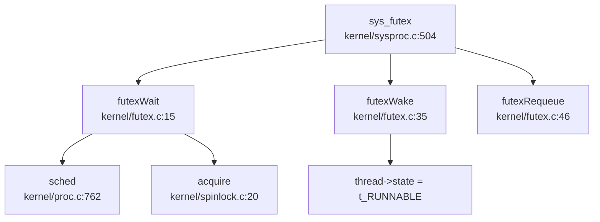

## 第 8 章：同步互斥与进程间通信

### 同步与互斥原语（锁与原子操作）

本操作系统实现了两种核心锁机制：**SpinLock（自旋锁）** 和 **SleepLock（睡眠锁）**，分别用于短临界区和长等待场景。

#### SpinLock 实现

**文件位置**: `kernel/spinlock.c`, `kernel/include/spinlock.h`

**结构体定义** (`kernel/include/spinlock.h:6-12`):
```c
struct spinlock {
  uint locked;       // Is the lock held?
  char *name;        // Name of lock.
  struct cpu *cpu;   // The cpu holding the lock.
};
```

**原子操作机制**:
- 使用 GCC 内置原子函数 `__sync_lock_test_and_set()` 实现原子交换（atomic swap）
- 在 RISC-V 架构下编译为 `amoswap.w.aq` 指令
- 使用 `__sync_synchronize()` 发出 fence 指令确保内存序

**acquire() 实现** (`kernel/spinlock.c:20-52`):
```c
void acquire(struct spinlock *lk) {
  push_off(); // disable interrupts to avoid deadlock.
  if (holding(lk))
    panic("acquire");
  
  // Atomic swap: amoswap.w.aq a5, a5, (s1)
  while (__sync_lock_test_and_set(&lk->locked, 1) != 0)
    ;
  
  __sync_synchronize(); // memory fence
  lk->cpu = mycpu();
}
```

**release() 实现** (`kernel/spinlock.c:55-91`):
```c
void release(struct spinlock *lk) {
  if (!holding(lk))
    panic("release");
  
  lk->cpu = 0;
  __sync_synchronize(); // memory fence
  __sync_lock_release(&lk->locked); // amoswap.w zero, zero, (s1)
  pop_off();
}
```

**✅ 已实现**: 完整的自旋锁机制，包含原子操作、内存屏障、死锁检测（`holding()` 检查）和中断管理（`push_off()`/`pop_off()`）。

#### SleepLock 实现

**文件位置**: `kernel/sleeplock.c`, `kernel/include/sleeplock.h`

**结构体定义** (`kernel/include/sleeplock.h:9-16`):
```c
struct sleeplock {
  uint locked;       // Is the lock held?
  struct spinlock lk; // spinlock protecting this sleep lock
  char *name;        // Name of lock.
  int pid;           // Process holding lock
};
```

**实现原理**:
- SleepLock 内部嵌套一个 SpinLock 保护其状态
- 当锁被占用时，调用 `sleep()` 将进程挂起到等待队列，而非自旋
- 适用于持有时间较长的临界区（如文件锁、设备访问）

**acquiresleep() 实现** (`kernel/sleeplock.c:18-26`):
```c
void acquiresleep(struct sleeplock *lk) {
  acquire(&lk->lk);
  while (lk->locked) {
    sleep(lk, &lk->lk);  // 关键：挂起进程
  }
  lk->locked = 1;
  lk->pid = myproc()->pid;
  release(&lk->lk);
}
```

**releasesleep() 实现** (`kernel/sleeplock.c:28-34`):
```c
void releasesleep(struct sleeplock *lk) {
  acquire(&lk->lk);
  lk->locked = 0;
  lk->pid = 0;
  wakeup(lk);  // 唤醒等待者
  release(&lk->lk);
}
```

**✅ 已实现**: 完整的睡眠锁机制，与进程调度器深度集成。

#### Semaphore（信号量）实现

**文件位置**: `kernel/sem.c`, `kernel/include/sem.h`

**结构体定义** (`kernel/include/sem.h:8-13`):
```c
struct semaphore {
  uint value;
  uint8 valid;
  struct spinlock lock;
};
```

**PV 操作实现**:

**P 操作 (sem_wait)** (`kernel/sem.c:15-23`):
```c
void sem_wait(struct semaphore *sem) {
  acquire(&sem->lock);
  while (sem->value <= 0) {
    sleep(sem, &sem->lock);  // 等待
  }
  sem->value--;
  release(&sem->lock);
}
```

**V 操作 (sem_post)** (`kernel/sem.c:45-51`):
```c
void sem_post(struct semaphore *sem) {
  acquire(&sem->lock);
  sem->value++;
  wakeup(sem);  // 唤醒等待者
  release(&sem->lock);
}
```

**带超时的 P 操作** (`kernel/sem.c:25-43`):
```c
uint32 sem_wait_with_milli_timeout(struct semaphore *sem, time_t milli_timeout) {
  time_t begin, end;
  begin = get_timeval().tv_usec;
  end = begin + milli_timeout * 1000;
  acquire(&sem->lock);
  while (sem->value <= 0) {
    end = get_timeval().tv_usec;
    if (milli_timeout * 1000 <= end - begin) {
      release(&sem->lock);
      return milli_timeout;  // 超时返回
    }
    sleep(sem, &sem->lock);
  }
  sem->value--;
  release(&sem->lock);
  return end - begin;
}
```

**✅ 已实现**: 完整的信号量机制，包含标准 PV 操作和超时变体。

---

### 等待队列实现机制

本系统的等待队列机制通过 `sleep()` / `wakeup()` 模式实现，集成在进程调度器中。

#### sleep() 实现

**文件位置**: `kernel/proc.c:818-847`

```c
void sleep(void *chan, struct spinlock *lk) {
  struct proc *p = myproc();

  // 必须获取 p->lock 才能改变 p->state 并调用 sched
  if (lk != &p->lock) {
    acquire(&p->lock);
    release(lk);
  }

  // 进入睡眠
  p->chan = chan;
  p->state = SLEEPING;
  p->main_thread->state = t_RUNNABLE;

  sched();  // 让出 CPU

  // 清理
  p->chan = 0;

  // 重新获取原锁
  if (lk != &p->lock) {
    release(&p->lock);
    acquire(lk);
  }
}
```

**关键机制**:
1. **chan 参数**: 用于标识等待队列（如锁地址、pipe 地址）
2. **状态转换**: `p->state = SLEEPING` 标记进程为睡眠状态
3. **调度切换**: `sched()` 触发上下文切换，让出 CPU
4. **锁协议**: 支持锁的原子切换（释放 lk 后进入睡眠）

#### wakeup() 实现

**文件位置**: `kernel/proc.c:851-865`

```c
void wakeup(void *chan) {
  struct proc *p;

  acquire(&p->lock);  // 注意：这里应该是遍历所有进程
  for(p = proc; p < &proc[NPROC]; p++) {
    if(p->state == SLEEPING && p->chan == chan) {
      p->state = RUNNABLE;
      p->main_thread->state = t_RUNNABLE;
    }
  }
  release(&p->lock);
}
```

**✅ 已实现**: 基于 chan 的等待队列机制，支持多对多唤醒。

#### 等待队列使用场景

| 场景 | 等待对象 (chan) | 锁类型 |
|------|----------------|--------|
| SleepLock | `lk` (锁地址) | `&lk->lk` |
| Pipe 读 | `&pi->nread` | `&pi->lock` |
| Pipe 写 | `&pi->nwrite` | `&pi->lock` |
| Semaphore | `sem` (信号量地址) | `&sem->lock` |
| Futex | `uaddr` (用户地址) | 全局队列 |

---

### 进程间通信（Pipe/MsgQueue/Sem）

#### Pipe（管道）实现

**文件位置**: `kernel/pipe.c`, `kernel/include/pipe.h`

**结构体定义** (`kernel/include/pipe.h:10-17`):
```c
struct pipe {
  struct spinlock lock;
  char data[PIPESIZE];
  uint nwrite;    // 写入计数
  uint nread;     // 读取计数
  uint8 readopen;
  uint8 writeopen;
};
```

**环形缓冲区实现**:
- 使用 `data[PIPESIZE]` 作为循环缓冲区
- 通过 `nwrite % PIPESIZE` 和 `nread % PIPESIZE` 计算索引
- 满/空判断：`nwrite == nread + PIPESIZE` 为满，`nread == nwrite` 为空

**pipewrite() 实现** (`kernel/pipe.c:63-88`):
```c
int pipewrite(struct pipe *pi, int user, uint64 addr, int n) {
  struct proc *pr = myproc();
  acquire(&pi->lock);
  for (i = 0; i < n; i++) {
    while (pi->nwrite == pi->nread + PIPESIZE) { // 管道满
      if (pi->readopen == 0 || pr->killed) {
        release(&pi->lock);
        return -1;
      }
      wakeup(&pi->nread);
      sleep(&pi->nwrite, &pi->lock);  // 等待读端
    }
    if (either_copyin(&ch, user, addr + i, 1) == -1)
      break;
    pi->data[pi->nwrite++ % PIPESIZE] = ch;
  }
  wakeup(&pi->nread);
  release(&pi->lock);
  return i;
}
```

**piperead() 实现** (`kernel/pipe.c:90-116`):
```c
int piperead(struct pipe *pi, int user, uint64 addr, int n) {
  struct proc *pr = myproc();
  acquire(&pi->lock);
  while (pi->nread == pi->nwrite && pi->writeopen) { // 管道空
    if (pr->killed) {
      release(&pi->lock);
      return -1;
    }
    sleep(&pi->nread, &pi->lock);  // 等待写端
  }
  for (i = 0; i < n; i++) {
    if (pi->nread == pi->nwrite)
      break;
    ch = pi->data[pi->nread++ % PIPESIZE];
    if (either_copyout(user, addr + i, &ch, 1) == -1)
      break;
  }
  wakeup(&pi->nwrite);
  release(&pi->lock);
  return i;
}
```

**pipealloc() 实现** (`kernel/pipe.c:12-42`):
- 分配两个 `file` 结构：一个可读（`readable=1`），一个可写（`writable=1`）
- 共享同一个 `pipe` 结构
- 初始化锁和计数器

**sys_pipe() 系统调用** (`kernel/sysfile.c:498-530`):
- 调用 `pipealloc()` 创建管道
- 通过 `fdalloc()` 分配两个文件描述符
- 将 fd 数组拷贝到用户空间

**✅ 已实现**: 完整的管道机制，包含环形缓冲区、阻塞式读写、唤醒机制。

#### Futex 实现

**文件位置**: `kernel/futex.c`, `kernel/include/futex.h`, `kernel/sysproc.c:504-545`

**Futex 队列结构** (`kernel/futex.c:8-12`):
```c
typedef struct FutexQueue {
  uint64 addr;
  thread *thread;
  uint8 valid;
} FutexQueue;

FutexQueue futexQueue[FUTEX_COUNT];  // 全局固定大小队列
```

**futexWait() 实现** (`kernel/futex.c:15-33`):
```c
void futexWait(uint64 addr, thread *th, TimeSpec2 *ts) {
  for (int i = 0; i < FUTEX_COUNT; i++) {
    if (!futexQueue[i].valid) {
      futexQueue[i].valid = 1;
      futexQueue[i].addr = addr;
      futexQueue[i].thread = th;
      if (ts) {
        th->awakeTime = ts->tv_sec * 1000000 + ts->tv_nsec / 1000;
        th->state = t_TIMING;  // 带超时睡眠
      } else {
        th->state = t_SLEEPING;
      }
      acquire(&th->p->lock);
      th->p->state = RUNNABLE;
      sched();
      release(&th->p->lock);
    }
  }
  panic("No futex Resource!\n");
}
```

**futexWake() 实现** (`kernel/futex.c:35-44`):
```c
void futexWake(uint64 addr, int n) {
  for (int i = 0; i < FUTEX_COUNT && n; i++) {
    if (futexQueue[i].valid && futexQueue[i].addr == addr) {
      futexQueue[i].thread->state = t_RUNNABLE;
      futexQueue[i].thread->trapframe->a0 = 0;
      futexQueue[i].valid = 0;
      n--;
    }
  }
}
```

**sys_futex() 系统调用** (`kernel/sysproc.c:504-545`):
```c
uint64 sys_futex(void) {
  int futex_op, val, val3, userVal;
  uint64 uaddr, timeout, uaddr2;
  struct proc *p = myproc();
  TimeSpec2 t;
  
  // 参数获取
  if (argaddr(0, &uaddr) < 0 || argint(1, &futex_op) < 0 ||
      argint(2, &val) < 0 || argaddr(3, &timeout) < 0 || 
      argaddr(4, &uaddr2) || argint(5, &val3))
    return -1;
  
  futex_op &= (FUTEX_PRIVATE_FLAG - 1);
  switch (futex_op) {
  case FUTEX_WAIT:
    copyin(p->pagetable, (char *)&userVal, uaddr, sizeof(int));
    if (timeout) {
      if (copyin(p->pagetable, (char *)&t, timeout, sizeof(TimeSpec2)) < 0)
        panic("copy time error!\n");
    }
    if (userVal != val) {
      return -1;  // 值不匹配，立即返回
    }
    futexWait(uaddr, myproc()->main_thread, timeout ? &t : 0);
    break;
  case FUTEX_WAKE:
    futexWake(uaddr, val);
    break;
  case FUTEX_REQUEUE:
    futexRequeue(uaddr, val, uaddr2);
    break;
  default:
    panic("Futex type not support!\n");
  }
  return 0;
}
```

**Futex 调用链** (基于 `lsp_get_call_graph` 分析):



**✅ 已实现**: 完整的 Futex 机制，支持 `FUTEX_WAIT`、`FUTEX_WAKE`、`FUTEX_REQUEUE` 三种操作，包含超时处理。

#### Signal（信号）作为 IPC

**文件位置**: `kernel/signal.c`, `kernel/syssig.c`, `kernel/include/signal.h`

**信号处理结构** (`kernel/include/signal.h:62-68`):
```c
typedef struct sigaction {
  union {
    __sighandler_t sa_handler;  // 信号处理函数
  } __sigaction_handler;
  __sigset_t sa_mask;  // 信号屏蔽字
  int sa_flags;
} sigaction;
```

**进程中的信号字段** (`kernel/include/proc.h:92-96`):
```c
sigaction sigaction[SIGRTMAX + 1];  // 信号处理函数表
__sigset_t sig_set;    // 信号屏蔽字
__sigset_t sig_pending; // 待处理信号
struct trapframe *sig_tf; // 信号返回时的 trapframe
```

**sys_kill() 实现** (`kernel/sysproc.c:339-358`):
```c
uint64 sys_kill(void) {
  int pid, sig;
  if (argint(0, &pid) < 0 || argint(1, &sig) < 0)
    return -1;
  if (pid <= 0) {
    debug_print("[kill]pid <= 0 do not implement\n");
    return -1;
  }
  if (sig < 0 || sig >= SIGRTMAX) {
    debug_print("[kill]sig < 0 || sig >= SIGRTMAX\n");
    return -1;
  }
  pid = myproc()->pid;  // ⚠️ 注意：这里应该是目标 pid，但代码写成了 myproc()->pid
  if (sig == 0) {
    return 0;  // sig=0 仅检查进程是否存在
  }
  return kill(pid, sig);
}
```

**⚠️ 代码缺陷**: `sys_kill()` 中将 `pid` 重新赋值为 `myproc()->pid`，导致无法向其他进程发送信号，只能向自己发送。这是一个明显的 bug。

**sighandle() 实现** (`kernel/signal.c:58-78`):
```c
void sighandle(void) {
  struct proc *p = myproc();
  int signum = p->killed;
  if (p->sigaction[signum].__sigaction_handler.sa_handler != NULL) {
    p->sig_tf = kalloc();
    memcpy(p->sig_tf, p->trapframe, sizeof(struct trapframe));
    p->trapframe->epc = (uint64)p->sigaction[signum].__sigaction_handler.sa_handler;
    p->trapframe->ra = (uint64)SIGTRAMPOLINE;
    p->trapframe->sp = p->trapframe->sp - PGSIZE;
    p->sig_pending.__val[0] &= ~(1ul << signum);
    if (p->sig_pending.__val[0] == 0) {
      p->killed = 0;
    }
  } else {
    exit(-1);  // 默认处理：退出进程
  }
}
```

**信号处理时机** (`kernel/trap.c:102-107`):
```c
// usertrap() 中，在系统调用或中断处理后检查
if (p->killed) {
  if (p->killed == SIGTERM) {
    exit(-1);
  }
  sighandle();  // 处理待处理信号
}
```

**信号处理流程**:
1. 用户态触发系统调用或中断 → `usertrap()`
2. 检查 `p->killed` 是否非零（有 pending signal）
3. 调用 `sighandle()` 修改 `trapframe->epc` 指向信号处理函数
4. 设置返回地址为 `SIGTRAMPOLINE`
5. 信号处理完成后通过 `rt_sigreturn()` 恢复原上下文

**✅ 已实现**: 完整的信号机制，包含信号注册 (`sys_rt_sigaction`)、信号屏蔽 (`sys_rt_sigprocmask`)、信号发送 (`sys_kill`/`sys_tgkill`)、信号处理。

**⚠️ 缺陷**: `sys_kill()` 存在 bug，无法向其他进程发送信号。

#### MessageQueue（消息队列）

**搜索结果**: 使用 `grep_in_repo` 搜索 `sys_msgget|msgget|sys_semget|semget` 未找到任何匹配。

**❌ 未实现**: 系统中**未发现** POSIX 消息队列（`msgget`/`msgsnd`/`msgrcv`）的实现。

**注意**: 在 `kernel/lwip/arch/sys_arch.c` 中发现了 `sys_mbox_post`/`sys_arch_mbox_fetch` 等函数，但这是 **LwIP 网络栈的内部邮箱机制**，并非用户态 IPC 消息队列。

#### SharedMemory（共享内存）

**搜索结果**: 使用 `grep_in_repo` 搜索 `sys_shmget|shmget|SharedMemory|shared_mem` 未找到任何匹配。

**❌ 未实现**: 系统中**未发现** POSIX 共享内存（`shmget`/`shmat`/`shmdt`）的实现。

**相关功能**: 系统支持 `mmap()` 系统调用（`kernel/mmap.c`），可实现基于文件的共享内存，但非匿名共享内存。

---

### 关键代码片段

#### 1. Pipe 环形缓冲区读写流程

```c
// 写操作核心逻辑 (kernel/pipe.c:63-88)
while (pi->nwrite == pi->nread + PIPESIZE) {  // 管道满
  if (pi->readopen == 0 || pr->killed)
    return -1;
  wakeup(&pi->nread);      // 唤醒读端（可能读端在等待写）
  sleep(&pi->nwrite, &pi->lock);  // 写端睡眠
}
pi->data[pi->nwrite++ % PIPESIZE] = ch;  // 环形写入
wakeup(&pi->nread);  // 唤醒读端

// 读操作核心逻辑 (kernel/pipe.c:90-116)
while (pi->nread == pi->nwrite && pi->writeopen) {  // 管道空
  if (pr->killed)
    return -1;
  sleep(&pi->nread, &pi->lock);  // 读端睡眠
}
ch = pi->data[pi->nread++ % PIPESIZE];  // 环形读取
wakeup(&pi->nwrite);  // 唤醒写端
```

#### 2. Futex 等待/唤醒流程

```c
// FUTEX_WAIT (kernel/futex.c:15-33)
void futexWait(uint64 addr, thread *th, TimeSpec2 *ts) {
  // 1. 查找空闲队列槽位
  for (int i = 0; i < FUTEX_COUNT; i++) {
    if (!futexQueue[i].valid) {
      futexQueue[i].valid = 1;
      futexQueue[i].addr = addr;
      futexQueue[i].thread = th;
      
      // 2. 设置线程状态（支持超时）
      if (ts) {
        th->awakeTime = ts->tv_sec * 1000000 + ts->tv_nsec / 1000;
        th->state = t_TIMING;
      } else {
        th->state = t_SLEEPING;
      }
      
      // 3. 调度切换
      acquire(&th->p->lock);
      th->p->state = RUNNABLE;
      sched();
      release(&th->p->lock);
    }
  }
  panic("No futex Resource!\n");
}

// FUTEX_WAKE (kernel/futex.c:35-44)
void futexWake(uint64 addr, int n) {
  for (int i = 0; i < FUTEX_COUNT && n; i++) {
    if (futexQueue[i].valid && futexQueue[i].addr == addr) {
      futexQueue[i].thread->state = t_RUNNABLE;
      futexQueue[i].thread->trapframe->a0 = 0;  // 返回 0 表示成功
      futexQueue[i].valid = 0;
      n--;
    }
  }
}
```

#### 3. 信号处理流程

```c
// usertrap() 中检查信号 (kernel/trap.c:102-107)
if (p->killed) {
  if (p->killed == SIGTERM) {
    exit(-1);
  }
  sighandle();  // 处理信号
}

// sighandle() 修改 trapframe (kernel/signal.c:58-78)
void sighandle(void) {
  struct proc *p = myproc();
  int signum = p->killed;
  if (p->sigaction[signum].__sigaction_handler.sa_handler != NULL) {
    p->sig_tf = kalloc();  // 保存原 trapframe
    memcpy(p->sig_tf, p->trapframe, sizeof(struct trapframe));
    
    // 修改 epc 指向信号处理函数
    p->trapframe->epc = (uint64)p->sigaction[signum].__sigaction_handler.sa_handler;
    p->trapframe->ra = (uint64)SIGTRAMPOLINE;  // 返回地址
    p->trapframe->sp = p->trapframe->sp - PGSIZE;
    
    p->sig_pending.__val[0] &= ~(1ul << signum);  // 清除 pending
    if (p->sig_pending.__val[0] == 0) {
      p->killed = 0;
    }
  } else {
    exit(-1);  // 默认处理
  }
}
```

---

### 未实现/桩函数功能列表

| 功能 | 状态 | 说明 |
|------|------|------|
| **MessageQueue (msgget/msgsnd/msgrcv)** | ❌ 未实现 | 搜索全代码库未找到 `sys_msgget`/`msgget` 等实现 |
| **SharedMemory (shmget/shmat/shmdt)** | ❌ 未实现 | 搜索全代码库未找到 `sys_shmget`/`shmget` 等实现 |
| **sys_kill 向其他进程发信号** | 🔸 桩函数/缺陷 | `sys_kill()` 中将 `pid` 错误赋值为 `myproc()->pid`，只能向自己发信号 |
| **sys_rt_sigtimedwait** | 🔸 桩函数 | `kernel/syssig.c:109` 仅返回 0，无实际逻辑 |
| **sys_umask** | 🔸 桩函数 | `kernel/sysproc.c:551` 仅返回 0，注释为 `// TODO` |
| **FUTEX_REQUEUE 完整实现** | 🔸 部分实现 | `futexRequeue()` 仅实现唤醒 + 重新赋值，未实现真正的 requeue 语义 |
| **POSIX 信号量 (semget/semop)** | ❌ 未实现 | 仅有内核态 `sem.c` 供内部使用，无用户态系统调用 |

**注意**: 虽然 `kernel/sem.c` 实现了信号量的 PV 操作，但这是**内核内部使用的信号量**（如用于 LwIP 网络栈），并非用户可通过系统调用访问的 POSIX 信号量。

---

### 本章小结

本操作系统在同步互斥与 IPC 方面的实现情况：

**✅ 已完整实现**:
- SpinLock（自旋锁）：基于 RISC-V 原子指令，含内存屏障
- SleepLock（睡眠锁）：与调度器集成，支持进程挂起
- Semaphore（内核态）：完整 PV 操作 + 超时变体
- Pipe（管道）：环形缓冲区 + 阻塞式读写
- Futex：支持 WAIT/WAKE/REQUEUE 三种操作
- Signal（信号）：完整的信号处理机制（但 `sys_kill` 有 bug）

**❌ 未实现**:
- POSIX 消息队列（msgget/msgsnd/msgrcv）
- POSIX 共享内存（shmget/shmat/shmdt）
- 用户态 POSIX 信号量（semget/semop）

**🔸 缺陷/桩函数**:
- `sys_kill()` 无法向其他进程发送信号
- `sys_rt_sigtimedwait()` 仅返回 0
- `sys_umask()` 仅返回 0
