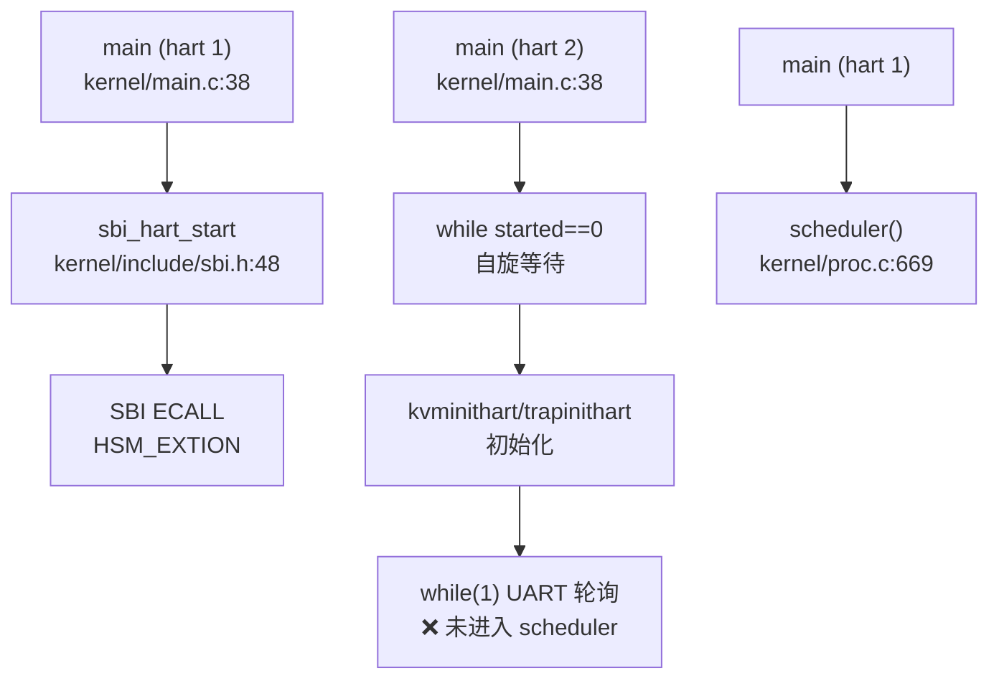

## 第 9 章：多核支持与并行机制

### 多核架构设计（SMP/AMP）

本项目在架构定义层面预留了多核支持的可能性，但**实际仅支持单核运行（❌ 未实现真正的 SMP）**。

**架构定义**：
- 在 `kernel/include/param.h:5` 中定义了 `#define NCPU 2`，声明系统最多支持 2 个 CPU。
- 在 `kernel/include/proc.h:44-51` 中定义了 per-CPU 结构体 `struct cpu` 和全局数组 `extern struct cpu cpus[NCPU]`：

```c
// kernel/include/proc.h:44-51
struct cpu {
  struct proc *proc;          // The process running on this cpu, or null.
  struct context context;     // swtch() here to enter scheduler().
  int noff;                   // Depth of push_off() nesting.
  int intena;                 // Were interrupts enabled before push_off()?
};

extern struct cpu cpus[NCPU];
```

**核心问题**：虽然定义了多核数据结构，但代码中**未实现真正的对称多处理（SMP）调度机制**。每个 CPU 核心独立运行自己的调度器，没有全局的任务队列或负载均衡机制，本质上属于 **AMP（非对称多处理）** 模式，且从核功能极其有限。

**CPU 识别机制**：
通过 RISC-V 的 `tp` 寄存器存储 hartid（硬件线程 ID），在 `kernel/include/riscv.h:296-302` 中实现：

```c
// kernel/include/riscv.h:296-302
static inline uint64 r_tp() {
  uint64 x;
  asm volatile("mv %0, tp" : "=r" (x) );
  return x;
}

// kernel/proc.c:126-131
struct cpu *mycpu(void) {
  int id = cpuid();  // 调用 r_tp()
  struct cpu *c = &cpus[id];
  return c;
}
```

该设计假设 hartid 连续且从 0 开始，直接作为 `cpus[]` 数组索引。

---

### Secondary CPU 启动流程

项目在 `kernel/main.c` 中尝试启动第二个硬件线程（hart），但实现极其简陋，**从核仅进入无限轮询 UART 的死循环，未参与调度**（❌ 未实现完整的 Secondary CPU 启动）。

**启动触发点**（仅 VisionFive 平台）：

```c
// kernel/main.c:70-75
#ifdef visionfive
    sbi_hart_start(2, (unsigned long)_start, 0);
#endif
```

**SBI 调用实现**（`kernel/include/sbi.h:48-50`）：

```c
static inline void sbi_hart_start(unsigned long hartid, unsigned long start_addr, unsigned long opaque) {
    SBI_CALL_3(SBI_HSM_EXTION, SBI_HART_START, hartid, start_addr, opaque);
}
```

**从核执行流程**（`kernel/main.c:77-92`）：

```c
// kernel/main.c:77-92
  } else {
    // other hart
    while (started == 0)  // 自旋等待主核初始化完成
      ;
    __sync_synchronize();
    kvminithart();
    trapinithart();
    plicinithart();
    debug_print("hart 1 init done\n");
    printf("hart 2\n");
    while (1) {  // ❌ 关键问题：从核仅处理 UART，未进入调度器
      int c = uart8250_getc();
      if (-1 != c) {
        consoleintr(c);
      }
    }
  }
  scheduler();  // 只有主核（hart 1）能执行到这里
```

**调用链分析**：



> ⚠️ **关键缺陷**：从核（hart 2）在初始化后进入无限 UART 轮询循环，**从未调用 `scheduler()`**，因此无法执行任何进程或线程。这与真正的 SMP 设计（所有核心都运行调度器）有本质区别。

**入口汇编**（`kernel/entry_qemu.S:1-19`）：
所有 hart 从 `_entry` 开始执行，根据 `hartid` 分配独立栈空间：

```asm
// kernel/entry_qemu.S:1-19
_entry:
    add t0, a0, 1      // a0 = hartid
    slli t0, t0, 14    // 每个 hart 4KB 栈
    la sp, boot_stack
    add sp, sp, t0
    call main
```

---

### 核间通信与 IPI 机制

项目定义了 IPI（核间中断）发送接口，但**在整个代码库中未找到任何实际调用**（❌ 未实现 IPI 通信）。

**IPI 接口定义**（`kernel/include/sbi.h:82-84`）：

```c
// kernel/include/sbi.h:17-18, 82-84
#define SBI_IPI_EXTION 0x735049
#define SBI_SEND_IPI 0

static inline void sbi_send_ipi(unsigned long hart_mask, unsigned long hart_mask_base) {
    SBI_CALL_2(SBI_IPI_EXTION, SBI_SEND_IPI, hart_mask, hart_mask_base);
}
```

**搜索结果**：
- 使用 `grep_in_repo` 搜索 `send_ipi|ipi_handler|SBI_IPI`，仅在 `sbi.h` 头文件中找到定义，**无任何 `.c` 文件调用该函数**。
- 未找到 `ipi_handler` 或任何 IPI 中断处理程序。

**对比：实际使用的中断**：
在 `kernel/trap.c:204-239` 的 `devintr()` 中，仅处理以下中断：
- UART 中断（`UART_IRQ`）
- 磁盘中断（`DISK_IRQ`）
- 定时器中断（`scause == 0x8000000000000005L`）

**结论**：IPI 机制仅有接口定义，**未在任何同步、调度或通信场景中使用**。多核间无有效的中断通信机制。

---

### Per-CPU 变量与数据结构

项目使用简单的全局数组实现 Per-CPU 变量，**未使用现代 OS 常见的 `__percpu` 段或 `axns` 命名空间**（❌ 未发现 Per-CPU 命名空间实现）。

**Per-CPU 数据存储**：
```c
// kernel/proc.c:21
struct cpu cpus[NCPU];
```

**访问方式**：
1. 通过 `r_tp()` 读取当前 hartid。
2. 通过 `mycpu()` 返回 `&cpus[id]`。

**Per-CPU 字段**（`kernel/include/proc.h:44-49`）：
- `struct proc *proc`：当前在该 CPU 上运行的进程。
- `struct context context`：调度器上下文，用于 `swtch()` 切换。
- `int noff`：`push_off()` 嵌套深度，用于中断禁用计数。
- `int intena`：进入 `push_off()` 前的中断使能状态。

**中断嵌套管理**（`kernel/intr.c:12-45`）：
```c
// kernel/intr.c:12-23
void push_off(void) {
  int old = intr_get();
  intr_off();
  if (mycpu()->noff == 0)
    mycpu()->intena = old;
  mycpu()->noff += 1;
}

// kernel/intr.c:25-45
void pop_off(void) {
  struct cpu *c = mycpu();
  // ... 检查 ...
  c->noff -= 1;
  if (c->noff == 0 && c->intena)
    intr_on();
}
```

**设计缺陷**：
- **无 Per-CPU 段优化**：每次访问 Per-CPU 变量都需要通过 `cpus[id]` 数组索引，未使用基于 `tp` 寄存器的偏移访问（如 Linux 的 `__percpu` 段）。
- **无缓存行对齐**：`struct cpu` 未使用缓存行对齐（如 `__attribute__((aligned(64)))`），在多核下可能产生伪共享（False Sharing）问题。
- **未找到 `axns` 模块**：搜索 `percpu|PerCpu|axns|__percpu` 无结果，表明项目未实现高级 Per-CPU 命名空间机制。

---

### 多核调度策略

项目**未实现任何多核调度策略**（❌ 未实现负载均衡/CPU 亲和性），所有进程/线程调度仅由主核（hart 1）执行。

**调度器实现**（`kernel/proc.c:669-754`）：
每个 CPU 核心在 `scheduler()` 中独立轮询全局 `proc[]` 数组：

```c
// kernel/proc.c:669-754
void scheduler(void) {
  struct proc *p;
  struct cpu *c = mycpu();

  c->proc = 0;
  for (;;) {
    intr_on();
    int found = 0;
    for (p = proc; p < &proc[NPROC]; p++) {  // 轮询所有进程
      acquire(&p->lock);
      if (p->state == RUNNABLE) {
        // ... 选择线程 ...
        p->state = RUNNING;
        swtch(&c->context, &p->context);  // 切换到进程
        c->proc = 0;
        found = 1;
      }
      release(&p->lock);
    }
    if (found == 0) {
      intr_on();
      asm volatile("wfi");  // 无进程可运行时进入低功耗
    }
  }
}
```

**关键问题**：
1. **无任务队列分离**：所有 CPU 核心轮询同一个全局 `proc[]` 数组，未实现 per-CPU 运行队列。
2. **无负载均衡**：未找到 `load_balance` 相关代码，搜索 `load_balance|cpu_affinity|affinity` 仅在系统调用桩函数中找到引用。
3. **竞争条件**：多个 CPU 同时遍历 `proc[]` 可能导致竞争（尽管有 `p->lock` 保护，但效率低下）。

**CPU 亲和性系统调用**（桩函数）：
```c
// kernel/sysproc.c:198-212
uint64 sys_sched_getaffinity(void) {
  // ... 参数检查 ...
  uint64 affinity = 1;  // ❌ 硬编码返回 CPU 0
  if (either_copyout(1, addr, (void *)&affinity, sizeof(uint64)) < 0)
    return -1;
  return 0;
}
```

**与前面章节的交叉引用**：
- **进程调度中的全局唯一 ID 池**（`kernel/proc.c:142-150` 的 `allocpid()`）：使用 `pid_lock` 保护全局 PID 分配，但未使用原子操作（`AtomicUsize`），而是依赖自旋锁。
- **双级注册机制**：线程通过 `thread_queue` 链表注册到进程（`kernel/proc.c:700-725`），但无全局线程管理器，所有线程调度依赖进程状态。
- **Futex 在多核下的行为**（`kernel/futex.c:14-40`）：`futexQueue` 为全局数组，无 per-CPU 分区，多核并发访问可能导致锁竞争。

---

### 关键代码片段

#### 1. 自旋锁实现（含中断禁用）

```c
// kernel/spinlock.c:19-50
void acquire(struct spinlock *lk) {
  push_off();  // 禁用中断，防止死锁
  if (holding(lk))
    panic("acquire");
  
  // RISC-V 原子交换：amoswap.w.aq
  while (__sync_lock_test_and_set(&lk->locked, 1) != 0)
    ;

  __sync_synchronize();  // 内存屏障
  lk->cpu = mycpu();     // 记录持有锁的 CPU
}

// kernel/spinlock.c:53-80
void release(struct spinlock *lk) {
  if (!holding(lk))
    panic("release");

  lk->cpu = 0;
  __sync_synchronize();  // 确保临界区写操作对其他核可见
  __sync_lock_release(&lk->locked);
  pop_off();  // 恢复中断状态
}
```

**分析**：
- ✅ **禁用中断**：`push_off()` 确保持有锁时不会被中断打断，防止同一 CPU 上的中断处理程序尝试获取同一锁。
- ❌ **无优先级继承**：`struct spinlock` 仅包含 `locked`、`name`、`cpu` 字段，无优先级信息，**不支持优先级继承**，可能产生优先级反转问题。
- ✅ **内存序保证**：使用 `__sync_synchronize()` 发出 `fence` 指令，确保多核下的内存可见性。

#### 2. Futex 实现（多核同步原语）

```c
// kernel/futex.c:14-40
void futexWait(uint64 addr, thread *th, TimeSpec2 *ts) {
  for (int i = 0; i < FUTEX_COUNT; i++) {
    if (!futexQueue[i].valid) {
      futexQueue[i].valid = 1;
      futexQueue[i].addr = addr;
      futexQueue[i].thread = th;
      // ... 设置睡眠状态 ...
      th->state = t_SLEEPING;
      acquire(&th->p->lock);
      sched();  // 让出 CPU
      release(&th->p->lock);
    }
  }
  panic("No futex Resource!\n");
}

// kernel/futex.c:42-52
void futexWake(uint64 addr, int n) {
  for (int i = 0; i < FUTEX_COUNT && n; i++) {
    if (futexQueue[i].valid && futexQueue[i].addr == addr) {
      futexQueue[i].thread->state = t_RUNNABLE;
      futexQueue[i].valid = 0;
      n--;
    }
  }
}
```

**多核问题分析**：
- ❌ **全局锁竞争**：`futexQueue` 为全局数组，多核并发调用 `futexWait`/`futexWake` 时需遍历整个数组，无 per-CPU 优化。
- ❌ **无原子检查**：`futexWait` 中检查 `userVal != val` 后直接睡眠，未使用原子比较交换（CAS），可能产生竞态条件。
- ✅ **与调度器集成**：通过 `acquire(&th->p->lock)` + `sched()` 实现睡眠 - 唤醒语义。

#### 3. 原子操作使用（内存序保证）

项目中未使用 Rust 风格的 `AtomicUsize`，而是依赖 C11 原子内置函数：

```c
// kernel/spinlock.c:40
while (__sync_lock_test_and_set(&lk->locked, 1) != 0)
  ;

// kernel/spinlock.c:72
__sync_lock_release(&lk->locked);

// kernel/main.c:95
__sync_synchronize();  // 全内存屏障
```

**内存序分析**：
- `__sync_lock_test_and_set`：隐含 `acquire` 语义（`amoswap.w.aq`）。
- `__sync_lock_release`：隐含 `release` 语义（`amoswap.w.rl`）。
- `__sync_synchronize()`：发出 `fence rw, rw` 指令，确保所有核的内存操作顺序一致。

**缺失**：
- 未使用 `__atomic_*` 系列函数指定明确的内存序（如 `__ATOMIC_ACQUIRE`）。
- 未找到 `AtomicUsize` 或类似 Rust 原子类型（项目为纯 C 实现）。

---

### 本章总结

| 功能模块 | 实现状态 | 关键文件/代码位置 |
|---------|---------|------------------|
| **SMP 架构** | ❌ 未实现（仅 AMP） | `kernel/include/param.h:5`, `kernel/proc.c:21` |
| **Secondary CPU 启动** | 🔸 桩函数（从核仅轮询 UART） | `kernel/main.c:75`, `kernel/main.c:85-92` |
| **IPI 通信** | ❌ 未实现（仅有接口定义） | `kernel/include/sbi.h:82-84` |
| **Per-CPU 变量** | ✅ 已实现（简单数组） | `kernel/proc.c:126-131`, `kernel/intr.c:12-45` |
| **多核调度** | ❌ 未实现（无负载均衡） | `kernel/proc.c:669-754` |
| **CPU 亲和性** | 🔸 桩函数（硬编码返回 1） | `kernel/sysproc.c:198-212` |
| **自旋锁** | ✅ 已实现（禁用中断） | `kernel/spinlock.c:19-80` |
| **优先级继承** | ❌ 未实现 | `kernel/include/spinlock.h:7-13` |
| **RCU 机制** | ❌ 未实现 | 搜索无结果 |
| **Futex 多核安全** | 🔸 部分实现（全局锁竞争） | `kernel/futex.c:14-52` |

**核心结论**：
本项目**本质上是单核操作系统**，虽然定义了 `NCPU=2` 和 per-CPU 数据结构，但从核（hart 2）仅用于处理 UART 中断，未参与进程调度。多核同步机制（IPI、负载均衡、RCU）均未实现，自旋锁通过禁用中断保证单核安全，但在真正多核场景下可能存在竞争条件。
