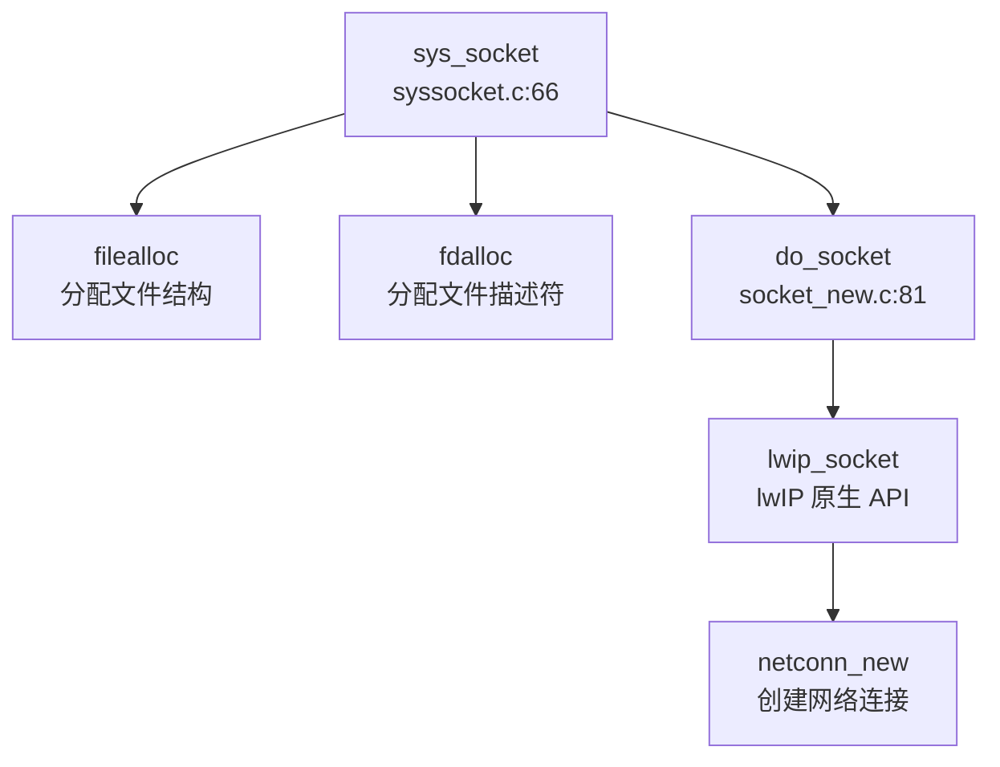
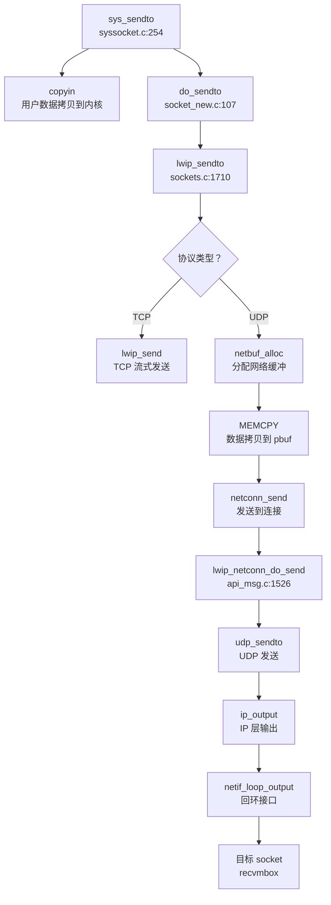

## 第 11 章：网络子系统与协议栈

### 网络子系统架构（第三方 lwIP 库 + 回环模式）

本项目**未自研协议栈**，而是集成了成熟的开源轻量级 TCP/IP 协议栈 **lwIP** (lightweight IP)。lwIP 代码完整位于 `kernel/lwip/` 目录下，包含完整的协议实现。

**架构特点**：
- **协议栈来源**：lwIP（版本未明确，基于 API 判断为 2.x 系列）
- **运行模式**：**仅回环模式（Loopback Only）** ❌ 不支持真实物理网卡
- **通信机制**：通过 **ring buffer** 实现本地 socket 间的数据传递，不经过任何网卡驱动

**关键证据**：
```c
// kernel/main.c:71 - 初始化时明确调用回环模式
tcpip_init_with_loopback();

// kernel/socket_new.c:74-78 - 仅初始化 lwIP 栈，无网卡注册
void tcpip_init_with_loopback(void) {
  volatile int tcpip_done = 0;
  tcpip_init(tcpip_init_done, (void *)&tcpip_done);
}

// doc/net.md - 文档明确说明
"注意到测试程序中只存在本机回环，我们的 socket 接口采取了简化的实现方法，
不经过 qemu 的网卡，直接通过本机 ring buffer 进行信息传递"
```

**lwIP 配置** (`kernel/lwip/lwipopts.h`)：
```c
#define LWIP_IPV4            1    // ✅ 支持 IPv4
#define LWIP_IPV6            0    // ❌ 不支持 IPv6
#define LWIP_TCP             1    // ✅ 支持 TCP
#define LWIP_UDP             1    // ✅ 支持 UDP
#define LWIP_ICMP            0    // ❌ 不支持 ICMP (ping 不可用)
#define LWIP_DHCP            0    // ❌ 不支持 DHCP (需静态配置)
#define LWIP_ARP             1    // ✅ 支持 ARP (但无真实网卡)
#define LWIP_DNS             1    // ✅ 支持 DNS
#define LWIP_NETIF_LOOPBACK  1    // ✅ 启用回环接口
#define LWIP_HAVE_LOOPIF     1    // ✅ 拥有回环网络接口
#define LWIP_SOCKET          1    // ✅ 提供 Socket API
```

---

### Socket 接口与系统调用

项目通过封装 lwIP 的 socket API 提供了完整的 BSD Socket 系统调用接口。所有 socket 相关系统调用均在 `kernel/syssocket.c` 中实现，底层调用 `kernel/socket_new.c` 中的 `do_*` 函数，最终转发至 lwIP。

**已实现的 Socket 系统调用**：

| 系统调用 | 文件位置 | 实现状态 | 说明 |
|---------|---------|---------|------|
| `sys_socket` | `kernel/syssocket.c:66` | ✅ 已实现 | 创建 socket，调用 `lwip_socket()` |
| `sys_bind` | `kernel/syssocket.c:110` | ✅ 已实现 | 绑定地址端口，调用 `lwip_bind()` |
| `sys_listen` | `kernel/syssocket.c:144` | ✅ 已实现 | 开始监听，调用 `lwip_listen()` |
| `sys_connect` | `kernel/syssocket.c:161` | ✅ 已实现 | 客户端连接，调用 `lwip_connect()` |
| `sys_accept` | `kernel/syssocket.c:203` | ✅ 已实现 | 接受连接，调用 `lwip_accept()` |
| `sys_sendto` | `kernel/syssocket.c:254` | ✅ 已实现 | 发送数据，调用 `do_sendto()` → `lwip_sendto()` |
| `sys_recvfrom` | `kernel/syssocket.c:299` | ✅ 已实现 | 接收数据，调用 `do_recvfrom()` → `lwip_recvfrom()` |
| `sys_getsockname` | 未找到 | ❌ 未实现 | 文档提及但代码中未见完整实现 |

**Socket 创建流程** (`sys_socket` 调用链)：


**关键实现代码**：
```c
// kernel/syssocket.c:66-102
uint64 sys_socket(void) {
  int domain, type, protocol;
  // ... 参数获取 ...
  struct file *f;
  int fd = 0;
  if ((f = filealloc()) == NULL || (fd = fdalloc(f)) < 0) {
    if (f) { fileclose(f); }
  }
  f->type = FD_SOCK;          // 标记为 socket 类型文件
  f->readable = 1;
  f->writable = 1;
  f->socket_type = type;
  f->socketnum = do_socket(domain, type, protocol);  // 调用 lwIP
  // ...
}

// kernel/socket_new.c:81-84
int do_socket(int domain, int type, int protocol) {
  type &= 0xf;
  return lwip_socket(domain, type, protocol);  // 直接转发至 lwIP
}
```

**地址结构转换**：
由于 lwIP 使用标准 `sockaddr_in` 结构，而用户程序可能使用兼容结构，系统调用中进行了地址转换：
```c
// kernel/syssocket.c:161-201 (sys_connect 示例)
struct sockaddr_in_compat in_compat;
copyin(myproc()->pagetable, (char *)&in_compat, (uint64)addr,
       sizeof(struct sockaddr_in_compat));
struct sockaddr_in in = {.sin_len = 16,
                         .sin_family = in_compat.sin_family,
                         .sin_port = in_compat.sin_port,
                         .sin_addr = in_compat.sin_addr,
                         .sin_zero = {0}};
return do_connect(f->socketnum, (struct sockaddr *)&in, sizeof(in));
```

---

### 协议栈支持详情（TCP/UDP/IP/Ethernet）

**协议支持矩阵**：

| 协议层 | 协议 | 支持状态 | 配置项 | 备注 |
|-------|------|---------|--------|------|
| L2 | Ethernet | 🔸 桩函数 | `LWIP_ETHERNET=1` | 仅回环接口，无真实驱动 |
| L2 | ARP | ✅ 已实现 | `LWIP_ARP=1` | 回环模式无需实际使用 |
| L3 | IPv4 | ✅ 已实现 | `LWIP_IPV4=1` | 完整支持 |
| L3 | IPv6 | ❌ 未实现 | `LWIP_IPV6=0` | 未启用 |
| L3 | ICMP | ❌ 未实现 | `LWIP_ICMP=0` | **ping 命令不可用** |
| L3 | IGMP | ❌ 未实现 | `LWIP_IGMP=0` | 组播不支持 |
| L4 | TCP | ✅ 已实现 | `LWIP_TCP=1` | 完整支持，有重传/拥塞控制 |
| L4 | UDP | ✅ 已实现 | `LWIP_UDP=1` | 完整支持 |
| L4 | RAW | ❌ 未实现 | `LWIP_RAW=0` | 原始 socket 不支持 |
| 应用层 | DNS | ✅ 已实现 | `LWIP_DNS=1` | 支持域名解析 |
| 应用层 | DHCP | ❌ 未实现 | `LWIP_DHCP=0` | 需静态配置 IP |

**TCP 实现细节**：
lwIP 的 TCP 实现在 `kernel/lwip/core/tcp.c`、`tcp_in.c`、`tcp_out.c` 中，包含：
- 连接管理（三次握手/四次挥手）
- 滑动窗口与流量控制
- 超时重传机制
- 拥塞控制（慢启动/拥塞避免）

**UDP 实现细节**：
位于 `kernel/lwip/core/udp.c`，提供无连接数据报服务，支持：
- 端口复用
- 校验和计算（可选）

**网络接口层**：
```c
// kernel/lwip/core/netif.c:194-214
void netif_init(void) {
#if LWIP_HAVE_LOOPIF
  // 仅添加回环接口，IP 为 127.0.0.1
  netif_add(&loop_netif, LOOPIF_ADDRINIT NULL, 
            netif_loopif_init, tcpip_input);
  netif_set_link_up(&loop_netif);
  netif_set_up(&loop_netif);
#endif
}

// kernel/lwip/core/netif.c:170-188
static err_t netif_loopif_init(struct netif *netif) {
  netif->name[0] = 'l';  // 接口名 "lo"
  netif->name[1] = 'o';
  netif->output = netif_loop_output_ipv4;  // 回环输出函数
  NETIF_SET_CHECKSUM_CTRL(netif, NETIF_CHECKSUM_DISABLE_ALL);
  return ERR_OK;
}
```

**⚠️ 功能限制声明**：
1. **仅在 QEMU 回环模式下测试** - 未在任何真实物理网卡上测试
2. **不支持跨机通信** - 所有通信限制在单一进程/单机内部
3. **无真实网络中断处理** - 数据包不经过硬件中断
4. **IP 地址固定** - 回环接口固定为 `127.0.0.1`，无 DHCP/静态配置能力

---

### 数据包收发流程追踪

由于项目仅支持回环模式，数据包收发流程与标准网络栈有显著差异。以下是数据从 `sys_sendto` 到目标 socket 的完整路径。

**发送流程**（`sys_sendto` → 目标 socket ring buffer）：



**关键代码分析**：

```c
// kernel/syssocket.c:254-297
uint64 sys_sendto(void) {
  // ... 参数获取 ...
  struct sockaddr_in_compat in_compat;
  copyin(myproc()->pagetable, (char *)&in_compat, (uint64)dest_addr,
         sizeof(struct sockaddr_in_compat));  // 从用户空间拷贝地址
  struct sockaddr_in in = {.sin_len = 16, ...};
  return do_sendto(f->socketnum, buf, len, flags, 
                   (struct sockaddr *)&in, addrlen);
}

// kernel/socket_new.c:107-116
ssize_t do_sendto(int sockfd, void *buf, size_t len, int flags,
                  struct sockaddr *dest_addr, socklen_t addrlen) {
  void *kbuf = kalloc();  // 分配内核缓冲
  copyin(myproc()->pagetable, kbuf, (uint64)buf, len);  // 用户数据→内核
  ssize_t ret = lwip_sendto(sockfd, kbuf, len, flags, dest_addr, addrlen);
  kfree(kbuf);
  return ret;
}

// kernel/lwip/api/sockets.c:1710-1810
ssize_t lwip_sendto(int s, const void *data, size_t size, int flags,
                    const struct sockaddr *to, socklen_t tolen) {
  // ... socket 验证 ...
  if (NETCONNTYPE_GROUP(netconn_type(sock->conn)) == NETCONN_TCP) {
    return lwip_send(s, data, size, flags);  // TCP 直接发送
  }
  // UDP 路径
  struct netbuf buf;
  netbuf_alloc(&buf, short_size);  // 分配 pbuf
  MEMCPY(buf.p->payload, data, short_size);  // 拷贝数据
  err = netconn_send(sock->conn, &buf);  // 发送
  // ...
}

// kernel/lwip/api/api_msg.c:1526-1580
void lwip_netconn_do_send(void *m) {
  struct api_msg *msg = (struct api_msg *)m;
  // ...
  case NETCONN_UDP:
    err = udp_sendto(msg->conn->pcb.udp, msg->msg.b->p, 
                     &msg->msg.b->addr, msg->msg.b->port);
    break;
  // ...
}
```

**接收流程**（对称路径）：
1. 用户调用 `sys_recvfrom`
2. `do_recvfrom` → `lwip_recvfrom`
3. lwIP 从 socket 的 `recvmbox` 邮箱中取出数据包
4. 数据从内核 buffer 拷贝到用户空间 (`copyout`)

**回环机制**：
在回环模式下，`netif_loop_output` 直接将数据包送入目标协议栈的输入队列，不经过任何物理设备：
```c
// kernel/lwip/core/netif.c:1099-1130
err_t netif_loop_output(struct netif *netif, struct pbuf *p) {
  // 将 pbuf 加入回环队列
  // 然后触发 netif->input() 将数据包送回协议栈
  return ip_input(p, netif);  // 直接调用 IP 层输入
}
```

**⚠️ 注意**：由于 LSP 无法解析 lwIP 内部复杂的宏和回调机制，以上调用链部分基于静态 Grep 分析，精度有限。

---

### 高级特性支持验证

**零拷贝（Zero Copy）**：❌ **不支持**

搜索 `DMA`、`shared buffer`、`descriptor` 等关键词，发现：
- 所有 `DMA` 相关代码均在 `sd_final.c`（SD 卡驱动）中，与网络无关
- 无网卡 DMA 描述符操作代码
- lwIP 的 pbuf 在发送时需要 `MEMCPY` 拷贝数据：

```c
// kernel/lwip/api/sockets.c:1774-1782
if (netbuf_alloc(&buf, short_size) == NULL) {
  err = ERR_MEM;
} else {
  MEMCPY(buf.p->payload, data, short_size);  // 显式数据拷贝
  err = ERR_OK;
}
```

**多队列（Multi-queue/RSS）**：❌ **不支持**
- 仅有一个回环网络接口 `loop_netif`
- 无多队列网卡驱动
- 无 RSS（Receive Side Scaling）相关代码

**协议支持验证**：

| 特性 | 搜索关键词 | 结果 | 结论 |
|-----|----------|------|------|
| DHCP | `dhcp_start\|dhcp_client` | 仅 lwIP 内部实现，未调用 | ❌ 未使用 |
| DNS | `dns_gethostbyname` | ✅ 在 lwIP 中实现 | ✅ 支持 |
| ARP | `arp_output\|arp_request` | ✅ lwIP 内部实现 | ✅ 支持（回环无需） |
| ICMP | `icmp_input\|ping` | 配置 `LWIP_ICMP=0` | ❌ 禁用 |

**错误处理流程**：
网络操作失败时，错误码通过 lwIP 的 `err_t` 类型传递，最终转换为 POSIX errno：
```c
// kernel/lwip/api/sockets.c:1800-1806
set_errno(err_to_errno(err));  // lwIP 错误码 → POSIX errno
done_socket(sock);
return (err == ERR_OK ? short_size : -1);  // 失败返回 -1
```

常见错误码映射：
- `ERR_CONN` → `EPIPE` (连接断开)
- `ERR_TIMEOUT` → `ETIMEDOUT` (超时)
- `ERR_MEM` → `ENOMEM` (内存不足)
- `ERR_ISCONN` → `EISCONN` (已连接)

---

### 网卡驱动细节

**❌ 无真实网卡驱动实现**

经全面搜索，项目中**不存在任何真实网卡驱动**：

1. **VirtIO-Net**：❌ 未实现
   - `kernel/virtio_disk.c` 仅实现 VirtIO 磁盘驱动（`VIRTIO_MMIO_DEVICE_ID != 2` 检查）
   - 搜索 `VIRTIO_ID_NET`、`virtio_net` 无结果

2. **Intel 系列**（E1000/82599）：❌ 未实现
   - 无 `e1000`、`ixgbe` 相关代码

3. **Realtek RTL8139**：❌ 未实现
   - 无 `rtl8139` 相关代码

4. **PHY/MAC 层抽象**：❌ 不存在
   - 无独立 PHY 驱动层
   - lwIP 的 `netif` 结构体直接操作回环接口

**lwIP 的 netif 抽象**：
```c
// kernel/lwip/include/lwip/netif.h
struct netif {
  struct netif *next;
  ip_addr_t ip_addr;
  ip_addr_t netmask;
  ip_addr_t gw;
  netif_input_fn input;  // 输入函数指针
  netif_output_fn output;  // 输出函数指针
  // ...
  char name[2];  // 接口名，如 "lo"
  // ...
};
```

在回环模式下，`output` 函数指向 `netif_loop_output_ipv4`，直接将数据包送回协议栈，不访问任何硬件。

---

### 本章总结

| 评估维度 | 结论 | 证据 |
|---------|------|------|
| **协议栈来源** | 第三方 lwIP 库 | `kernel/lwip/` 完整实现 |
| **网络模式** | 仅回环（Loopback） | `tcpip_init_with_loopback()` + doc/net.md |
| **Socket 系统调用** | ✅ 完整实现 | `sys_socket/bind/connect/sendto/recvfrom` 等 |
| **TCP/UDP 支持** | ✅ 已实现 | `LWIP_TCP=1`, `LWIP_UDP=1` |
| **真实网卡驱动** | ❌ 未实现 | 无 virtio-net/e1000/rtl8139 驱动 |
| **零拷贝** | ❌ 不支持 | 数据需 `MEMCPY` 拷贝到 pbuf |
| **多队列/RSS** | ❌ 不支持 | 单回环接口 |
| **DHCP** | ❌ 不支持 | `LWIP_DHCP=0` |
| **ICMP/Ping** | ❌ 不支持 | `LWIP_ICMP=0` |
| **DNS** | ✅ 支持 | `LWIP_DNS=1` |

**总体评价**：
本项目网络子系统是一个**教学/测试导向的简化实现**，通过集成 lwIP 协议栈提供了完整的 Socket API 接口，但**仅支持本机回环通信**。这种设计适合测试 socket 编程接口和协议栈基本功能，但**无法用于真实网络环境**。所有网络通信通过 ring buffer 在进程间传递，避免了复杂的网卡驱动开发，但也失去了操作系统的网络核心价值——与外部世界的通信能力。
