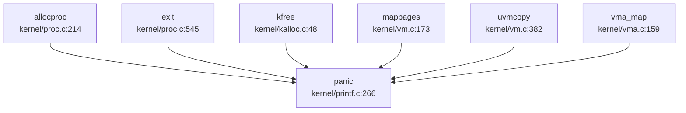

## 第 12 章：调试机制与错误处理

### 日志与打印系统

本内核实现了**三级打印系统**，分别用于不同严重程度的输出：

#### 打印函数设计

在 `kernel/printf.c` 中定义了三个核心打印函数：

1. **`debug_print()`** - 调试级别打印
   - 仅在 `DEBUG` 宏定义时生效
   - 使用条件编译 `#ifdef DEBUG` 包裹
   - 支持格式：`%d` (十进制), `%x` (十六进制), `%p` (指针), `%s` (字符串)
   - 实现位置：`kernel/printf.c:78-124`

2. **`serious_print()`** - 严重错误打印
   - 仅在 `EXAM` 未定义时生效（`#ifndef EXAM`）
   - 用于 panic、异常等关键路径的输出
   - 实现位置：`kernel/printf.c:127-181`

3. **`printf()`** - 常规打印
   - 无条件编译限制，始终可用
   - 用于普通内核日志输出

```c
// kernel/printf.c:78-90
void debug_print(char *fmt, ...) {
#ifdef DEBUG
  va_list ap;
  int i, c;
  int locking;
  char *s;

  locking = pr.locking;
  if (locking)
    acquire(&pr.lock);
  // ... 格式化输出逻辑
#endif
}
```

```c
// kernel/printf.c:127-140
void serious_print(char *fmt, ...) {
#ifndef EXAM
  va_list ap;
  int i, c;
  int locking;
  char *s;

  locking = pr.locking;
  if (locking)
    acquire(&pr.lock);
  // ... 格式化输出逻辑
#endif
}
```

#### 日志级别设计

**❌ 未实现标准日志级别系统**。代码中未发现类似 Linux 的 `LOG_EMERG`、`LOG_ERR`、`LOG_INFO` 等级别定义。打印函数通过条件编译宏（`DEBUG`、`EXAM`）控制输出，而非运行时日志级别过滤。

#### 并发保护

所有打印函数使用自旋锁 `pr.lock` 保护，避免多核并发输出时字符交错：

```c
// kernel/printf.c:28-32
static struct {
  struct spinlock lock;
  int locking;
} pr;
```

---

### Panic 处理与栈回溯

#### Panic 处理流程

**✅ 已实现** Panic 处理机制，位于 `kernel/printf.c:266-278`。

```c
// kernel/printf.c:266-278
void panic(char *s) {
  if (strncmp(s, "No futex Resource!", 18) == 0) {
    exit(0);
  }
  serious_print("%p\n", s);
  serious_print("panic: ");
  serious_print(s);
  serious_print("\n");
  backtrace();
  panicked = 1; // freeze uart output from other CPUs
  for (;;)
    ;
}
```

**处理流程**：
1. 特殊处理 "No futex Resource!" 错误（直接退出而非死循环）
2. 打印 panic 消息
3. **调用 `backtrace()` 打印调用栈**
4. 设置全局标志 `panicked = 1` 冻结其他 CPU 的 UART 输出
5. 进入无限死循环 `for (;;)` 停机

#### 栈回溯 (Backtrace) 实现

**✅ 已实现** 基于 Frame Pointer 的栈回溯，位于 `kernel/printf.c:280-289`。

```c
// kernel/printf.c:280-289
void backtrace() {
  uint64 *fp = (uint64 *)r_fp();
  uint64 *bottom = (uint64 *)PGROUNDUP((uint64)fp);
  serious_print("backtrace:\n");
  while (fp < bottom) {
    uint64 ra = *(fp - 1);
    serious_print("%p\n", ra - 4);
    fp = (uint64 *)*(fp - 2);
  }
}
```

**实现原理**：
- 使用 RISC-V 的 `fp` (Frame Pointer) 寄存器遍历栈帧
- 每个栈帧结构：`[prev_fp, ra, ...]`，其中 `prev_fp` 指向前一帧，`ra` 为返回地址
- 通过 `r_fp()` 获取当前帧指针，`PGROUNDUP` 确定栈底边界
- 逐帧打印返回地址（`ra - 4` 调整到 call 指令位置）

**❌ 不支持 DWARF 解析**。搜索 `unwind|dwarf|frame_pointer` 未找到相关代码，栈回溯仅依赖 Frame Pointer 链式结构，无法处理无帧指针优化的代码。

#### Panic 调用链分析

通过 `lsp_get_call_graph` 分析，`panic()` 的主要调用者包括：



**关键触发路径**：
- 进程分配失败 (`allocproc`)
- 内存释放错误 (`kfree`)
- 页表映射失败 (`mappages`, `uvmcopy`)
- VMA 管理错误 (`vma_map`)

#### 异常处理与寄存器 Dump

**✅ 已实现** 异常帧打印函数 `trapframedump()`，位于 `kernel/trap.c:241-274`。

```c
// kernel/trap.c:241-274
void trapframedump(struct trapframe *tf) {
  serious_print("a0: %p\t", tf->a0);
  serious_print("a1: %p\t", tf->a1);
  // ... 打印所有通用寄存器
  serious_print("ra: %p\n", tf->ra);
  serious_print("sp: %p\t", tf->sp);
  serious_print("epc: %p\n", tf->epc);
}
```

**功能**：打印 trapframe 中所有 RISC-V 通用寄存器（a0-a7, t0-t6, s0-s11, ra, sp, gp, tp, epc），用于异常调试。

**❌ 未实现自动调用**。代码中未发现异常处理自动调用 `trapframedump()` 的逻辑，需手动调用。

---

### 错误码与 Result 设计

#### 错误码定义

**✅ 已实现** 完整的 POSIX 风格错误码系统，位于 `kernel/include/error.h`。

```c
// kernel/include/error.h:4-38
enum ErrorCode {
    UNKNOWN_ERROR = 1,
    BAD_PROCESS,
    INVALID_PARAM,
    NO_FREE_MEMORY,
    NO_FREE_PROCESS,
    NOT_ELF_FILE,
    INVALID_PROCESS_STATUS,
    INVALID_PERM
};

#define EPERM      1  /* Operation not permitted */
#define ENOENT     2  /* No such file or directory */
#define ESRCH      3  /* No such process */
#define EINTR      4  /* Interrupted system call */
#define ENOMEM    12  /* Out of memory */
#define EACCES    13  /* Permission denied */
#define EINVAL    22  /* Invalid argument */
#define ENOSYS    38  /* Invalid system call number */
// ... 共定义约 100+ 个错误码
```

**设计特点**：
- 兼容 Linux 错误码数值（如 `ENOMEM=12`, `EINVAL=22`）
- 额外定义内核专用错误枚举 `ErrorCode`
- 包含 socket 专用错误码（`ENOTCONN=107`, `ECONNREFUSED=111`）

#### 返回值约定

系统调用和内核函数遵循 C 语言传统：
- **成功**：返回 0 或正值（如读取字节数）
- **失败**：返回 -1 并设置全局 `errno`（用户空间）或直接返回错误码（内核空间）

```c
// kernel/sysproc.c:373-380
uint64 sys_trace(void) {
  int mask;
  if (argint(0, &mask) < 0) {
    return -1;
  }
  myproc()->tmask = mask;
  return 0;
}
```

**❌ 未实现 Rust 风格 Result 类型**。由于是 C 语言项目，未使用 `Result<T, E>` 枚举类型。

---

### 调试接口与交互式 Shell

#### 用户空间 Shell

**✅ 已实现** 交互式 Shell，位于 `xv6-user/sh.c`。

```c
// xv6-user/sh.c:1-50
// Shell.
#include "kernel/include/fcntl.h"
#include "kernel/include/types.h"
#include "xv6-user/user.h"

// Parsed command representation
#define EXEC  1
#define REDIR 2
#define PIPE  3
#define LIST  4
#define BACK  5
```

**支持功能**：
- 命令执行（`EXEC`）
- 重定向（`REDIR`）
- 管道（`PIPE`）
- 命令列表（`LIST`）
- 后台执行（`BACK`）
- 环境变量（`export` 命令）

**❌ 不支持内核 Monitor**。搜索 `monitor|debug_console` 仅找到 lwip 网络库中的 `SNTP_MONITOR_SERVER_REACHABILITY` 配置，**未发现内核级调试 Monitor**。

#### 系统调用追踪 (Trace)

**✅ 已实现** 系统调用追踪机制：

1. **`sys_trace()` 系统调用** (`kernel/sysproc.c:373-380`)
   - 设置进程追踪掩码 `tmask`
   - 用户可通过掩码选择追踪哪些系统调用

2. **追踪输出** (`kernel/syscall.c:445-456`)
   ```c
   if ((p->tmask & (1 << num)) != 0) {
     printf("pid %d: %s -> %d\n", p->pid, sysnames[num], p->trapframe->a0);
   }
   ```

3. **用户工具 `strace`** (`xv6-user/strace.c`)
   ```c
   // xv6-user/strace.c:6-26
   int main(int argc, char *argv[]) {
     if (argc < 3) {
       fprintf(2, "usage: %s MASK COMMAND\n", argv[0]);
       exit(1);
     }
     if (trace(atoi(argv[1])) < 0) {
       fprintf(2, "%s: strace failed\n", argv[0]);
       exit(1);
     }
     exec(nargv[0], nargv);
   }
   ```

**使用方法**：
```bash
strace 32 ls  # 追踪系统调用掩码为 32 的 ls 命令
```

#### 进程 Dump

**✅ 已实现** `procdump()` 函数 (`kernel/proc.c:950-970`)，打印所有进程状态：

```c
// kernel/proc.c:950-970
void procdump(void) {
  static char *states[] = {
    [UNUSED] "unused",
    [SLEEPING] "sleep ",
    [RUNNABLE] "runble",
    [RUNNING] "run   ",
    [ZOMBIE] "zombie"
  };
  // ... 遍历打印所有进程
}
```

---

### GDB Stub 支持情况

**❌ 未实现 GDB Stub**。

通过以下验证确认：
1. 搜索 `gdbstub|gdb_stub|handle_gdb|gdb_packet` **未找到任何匹配**
2. 检查所有 C/H 文件，**未发现 GDB 数据包解析逻辑**
3. **无 GDB 远程调试协议实现**（如 `$` 开头的数据包、校验和计算等）

**结论**：本项目不支持 GDB 远程调试，仅能通过 QEMU 内置 GDB Server 进行源码级调试（需 QEMU 启动时添加 `-s -S` 参数）。

---

### 断言与运行时检查

#### 断言机制

**✅ 已实现** `LWIP_ASSERT` 宏（来自 lwIP 网络栈）：

```c
// kernel/lwip/api/api_lib.c:172-179
LWIP_ASSERT("freeing conn without freeing pcb", conn->pcb.tcp == NULL);
LWIP_ASSERT("conn has no recvmbox", sys_mbox_valid(&conn->recvmbox));
```

**❌ 未发现标准 `assert()` 或 `debug_assert`**。搜索 `debug_assert|assert|BUG_ON|WARN_ON` 仅找到 lwIP 库的 `LWIP_ASSERT`，**内核核心代码未实现通用断言宏**。

#### 运行时检查

**✅ 已实现** 参数验证与错误检查：

1. **系统调用参数检查** (`kernel/syscall.c:17-70`)
   ```c
   int argint(int n, int *ip) {
     *ip = argraw(n);
     return 0;
   }
   
   int argstr(int n, char *buf, int max) {
     uint64 addr;
     if (argaddr(n, &addr) < 0)
       return -1;
     return fetchstr(addr, buf, max);
   }
   ```

2. **内存操作检查** (`kernel/vm.c` 中的 `copyin`/`copyout`)
   - 检查地址是否在进程地址空间内
   - 检查页表映射是否有效

3. **调试打印检查**：大量使用 `debug_print()` 进行运行时状态输出

---

### 关键代码片段

#### Panic 与 Backtrace 完整实现

```c
// kernel/printf.c:266-289
void panic(char *s) {
  if (strncmp(s, "No futex Resource!", 18) == 0) {
    exit(0);
  }
  serious_print("%p\n", s);
  serious_print("panic: ");
  serious_print(s);
  serious_print("\n");
  backtrace();
  panicked = 1; // freeze uart output from other CPUs
  for (;;)
    ;
}

void backtrace() {
  uint64 *fp = (uint64 *)r_fp();
  uint64 *bottom = (uint64 *)PGROUNDUP((uint64)fp);
  serious_print("backtrace:\n");
  while (fp < bottom) {
    uint64 ra = *(fp - 1);
    serious_print("%p\n", ra - 4);
    fp = (uint64 *)*(fp - 2);
  }
}
```

#### 错误码定义（部分）

```c
// kernel/include/error.h:4-50
#ifndef _ERROR_H_
#define _ERROR_H_

enum ErrorCode {
    UNKNOWN_ERROR = 1,
    BAD_PROCESS,
    INVALID_PARAM,
    NO_FREE_MEMORY,
    NO_FREE_PROCESS,
    NOT_ELF_FILE,
    INVALID_PROCESS_STATUS,
    INVALID_PERM
};

#define EPERM      1  /* Operation not permitted */
#define ENOENT     2  /* No such file or directory */
#define ENOMEM    12  /* Out of memory */
#define EACCES    13  /* Permission denied */
#define EINVAL    22  /* Invalid argument */
#define ENOSYS    38  /* Invalid system call number */
// ... 更多错误码
#endif
```

#### 系统调用追踪

```c
// kernel/syscall.c:430-456
void syscall(void) {
  int num;
  struct proc *p = myproc();

  num = p->trapframe->a7;
  if (num > 0 && num < NELEM(syscalls) && syscalls[num]) {
    // 调试打印
    debug_print("pid %d call %d: %s\n", p->pid, num, sysnames[num]);
    p->trapframe->a0 = syscalls[num]();
    
    // 追踪输出
    if ((p->tmask & (1 << num)) != 0) {
      printf("pid %d: %s -> %d\n", p->pid, sysnames[num], p->trapframe->a0);
    }
  } else {
    debug_print("pid %d %s: unknown sys call %d\n", p->pid, p->name, num);
    p->trapframe->a0 = -1;
  }
}
```

---

### 本章总结

| 功能模块 | 实现状态 | 关键文件 |
|---------|---------|---------|
| 日志系统 | ✅ 已实现（三级打印） | `kernel/printf.c` |
| Panic 处理 | ✅ 已实现 | `kernel/printf.c:266` |
| 栈回溯 (Backtrace) | ✅ 已实现（基于 Frame Pointer） | `kernel/printf.c:280` |
| DWARF/Unwind | ❌ 未实现 | - |
| 错误码系统 | ✅ 已实现（POSIX 兼容） | `kernel/include/error.h` |
| 交互式 Shell | ✅ 已实现（用户空间） | `xv6-user/sh.c` |
| 内核 Monitor | ❌ 未实现 | - |
| GDB Stub | ❌ 未实现 | - |
| 系统调用追踪 | ✅ 已实现 | `kernel/sysproc.c:373` |
| 断言机制 | 🔸 部分实现（仅 lwIP） | - |
| 寄存器 Dump | ✅ 已实现 | `kernel/trap.c:241` |

**设计特点**：
- 采用简洁的 C 语言风格调试机制，无复杂框架依赖
- 栈回溯基于 Frame Pointer，轻量但无法处理优化代码
- 错误码兼容 Linux，便于移植用户空间程序
- 支持系统调用追踪，类似 Linux `strace` 功能
- **缺乏内核级 Monitor 和 GDB Stub**，调试主要依赖 QEMU 和打印日志
