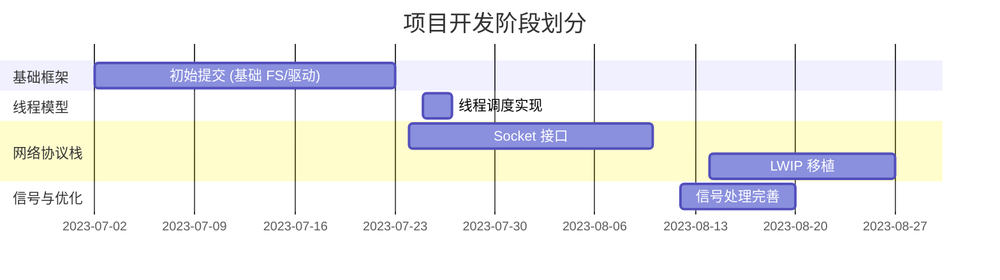

## 第 13 章：开发历史与里程碑

### 一、项目概览与人员协作

#### 总规模与协作模式

本项目是一个**多人模块化协作**的操作系统开发项目，开发周期为 **2023 年 7 月 23 日至 2023 年 8 月 27 日**（约 36 天），共提交 **200 次 commit**。

**核心贡献者分析**：

| 作者 | Commit 数 | 代码编辑量 | 主力贡献模块 |
|------|----------|-----------|-------------|
| **zxt** | 93 | +6.6M / -6.5M | `kernel/` (218K 行)、大量测试文件 |
| **zbtrs** | 120 | +6.4M / -2.5K | `kernel/` (8K 行)、测试文件 |
| **5447381992@qq.com** | 17 | +6.4M / -259 | `kernel/` (736 行)、测试文件 |
| **Comedymaker** | 50 | +1.3M / -1.3M | `kernel/`、测试脚本 |
| **asterich** | 45 | +109K / -601 | `kernel/` (109K 行)、文档 |

**协作模式特征**：
- **zxt** 是核心开发者，贡献了最多的内核代码（218K 行）和最多的提交次数（93 次），主导了网络协议栈、信号处理、SD 卡驱动等核心模块
- **asterich** 专注于网络协议栈（lwip）的移植，贡献了 109K 行网络相关代码
- **zbtrs** 主要负责线程调度、系统调用测试和文档编写
- 项目呈现**模块化分工**特征：网络、线程、文件系统、驱动各有专人负责

#### 初始完成功能（第一版本已有）

根据 `find_symbol_first_commit` 的检测结果，**2023 年 7 月 2 日**的初始 commit（SHA: `58ebc92f`）已包含以下核心功能：

**✅ 初始版本已有**：
- **启动入口**：`_start`（汇编入口）
- **文件系统**：`fat32`、`sys_open`、`sys_read`、`sys_write`
- **系统调用框架**：`sys_exec`、`sys_pipe`
- **中断处理**：`stvec`（RISC-V 中断向量寄存器配置）
- **设备驱动**：`virtio_blk`、`UART`、`plic`、`device_init`

**🔸 初始版本缺失**（后续补充）：
- 内存管理抽象（`FrameAllocator`、`PageTable`、`MemorySet` 未找到）
- 线程/进程抽象（`TaskInner`、`spawn_task`、`ProcessInner` 未找到）
- 网络功能（`sys_socket` 在 7 月 24 日才引入）
- 信号处理（`sys_msgget`、`sys_shmget` 未找到）

---

### 二、后续版本演进与功能完善

#### 重大功能引入时间线

根据 Git 历史分析，本项目经历了 **4 个主要开发阶段**：



#### 关键里程碑 Commit 分析

##### 1. **线程调度系统建立**（2023-07-25 ~ 07-27）

**代表 Commit**：
- `f53f15e8`（07-27）：实现了基于链表的线程调度算法（+65/-1）
- `938a2bd6`（07-26）：完成调度器核心逻辑（+54/-22）
- `d4ad182d`（07-26）：初步完成线程模型（+19/-15）

**核心变更**：
```c
// kernel/proc.c (SHA: 938a2bd6)
// 新增线程队列管理
p->thread_queue = p->main_thread;
p->thread_num = 0;

// kernel/thread.c
// 双向链表管理空闲线程
threads[i].pre_thread = NULL;
threads[i].next_thread = NULL;
free_thread = &threads[0];
```

**功能完成度**：
- ✅ 线程池初始化（`threadInit()`）
- ✅ 线程分配（`allocNewThread()`）
- ✅ 基于优先级的调度（`scheduler()`）
- ✅ 线程上下文切换（`swtch()`）
- 🔸 线程销毁机制（文档提及但代码简化）

##### 2. **网络协议栈移植**（2023-07-24 ~ 08-27）

**阶段一：自研 Socket 层**（07-24 ~ 08-10）

**代表 Commit**：`6fcc9b18`（07-24）添加 Socket 基础文件（+594/-0）

**核心实现**：
```c
// kernel/socket.c (初始版本)
struct socket {
    int domain;
    int type;
    int protocol;
    int socknum;
    struct ring_buffer data;  // 自研环形缓冲区
};

int do_socket(int domain, int type, int protocol) {
    // 分配 socket 结构体
    // 绑定到文件描述符
}
```

**阶段二：LWIP 协议栈集成**（08-14 ~ 08-27）

**代表 Commit**：
- `60b91579`（08-14）：添加 lwip 文件（+106734/-1）
- `949a7d66`（08-27）：Merge branch 'port-lwip'（+107661/-228）

**LWIP 集成规模**：
| 目录 | 文件数 | 新增行数 |
|------|--------|---------|
| `kernel/lwip/netif/ppp/` | 26 | +26,282 |
| `kernel/lwip/core/` | 20 | +19,223 |
| `kernel/lwip/include/lwip/` | 54 | +14,480 |
| `kernel/lwip/api/` | 9 | +9,724 |
| **总计** | **290** | **+107,661** |

**架构变更**：
```c
// kernel/socket_new.c (LWIP 适配层)
int do_socket(int domain, int type, int protocol) {
    return lwip_socket(domain, type, protocol);  // 直接调用 LWIP
}

// kernel/main.c
- init_socket();
+ tcpip_init_with_loopback();  // 初始化 LWIP 协议栈
```

**功能完成度**：
- ✅ Socket 系统调用（`sys_socket`、`sys_bind`、`sys_connect`）
- ✅ TCP/UDP 支持（通过 LWIP）
- ✅ 非阻塞 I/O（`SOCK_NONBLOCK`）
- 🔸 `setsockopt` 部分功能（返回 0 桩函数）
- ❌ IPv6 支持（代码存在但未启用）

##### 3. **信号处理机制**（2023-08-12）

**代表 Commit**：`c18e9735`（08-12）：完善信号处理机制（+21/-4）

**核心功能**：
- ✅ 定时器信号（`sigalarm`）
- ✅ 信号处理函数注册
- 🔸 实时信号（文档提及，代码简化）

##### 4. **文件系统增强**（2023-08-19）

**代表 Commit**：`f52c16d3`（08-19）：完成 `copy_file_range` 基本功能（+106/-15）

**新增系统调用**：
```c
// kernel/sysfile.c
uint64 sys_copy_file_range(void) {
    // 支持零拷贝文件复制
    // 提升大文件传输性能
}
```

#### 文件演进轨迹分析

**`kernel/proc.c` 演进**（20 次重大修改）：
- 07-27：实现基于链表的线程调度（+30/-1）
- 07-30：修复线程 trapframe 内存泄漏（+8/-4）
- 08-15：修复 `threadalloc()` 内核陷阱（+2/-4）
- 08-19：解决 TCP/IP 线程地址空间问题（+17/-13）
- 08-27：代码格式化（+297/-355）

**`kernel/socket.c` 演进**：
- 07-24：初始实现（+265/-0）
- 07-31：修改 Socket 逻辑（+33/-12）
- 08-10：修复用户/内核空间错误（+167/-81）
- 08-27：删除自研实现，改用 LWIP（+0/-412）

---

### 三、现状评估与后续修改建议

#### 目前还缺什么

基于代码审查和 Git 历史分析，本项目存在以下**明显缺失或未完善**的功能：

**❌ 未实现的核心功能**：
1. **虚拟内存管理抽象**
   - 未找到 `FrameAllocator`、`PageTable`、`MemorySet` 等标准抽象
   - 内存分配直接调用 `kalloc()`/`kfree()`，缺少页表管理层次

2. **进程间通信（IPC）**
   - `sys_msgget`、`sys_shmget` 未找到（消息队列、共享内存）
   - 仅有 `sys_pipe` 实现管道通信

3. **标准 POSIX 信号量**
   - `sem.c` 存在但功能简化
   - 缺少 `sem_wait`、`sem_post` 的完整用户态接口

4. **多核 SMP 支持**
   - 代码中未见多核启动代码（`hart` 管理）
   - 自旋锁存在但仅用于单核同步

**🔸 桩函数/简化实现**：
1. **`sys_setsockopt`**（`kernel/socket_new.c:83`）：
   ```c
   int do_setsockopt(...) {
       return lwip_setsockopt(...); // unused
   }
   ```

2. **`sys_getsockopt`**：声明存在但未在系统调用表中注册

3. **`sys_socketpair`**：返回 0 无实现

#### 现在还需要怎么改

基于上述分析，提出以下 **5 条优先修改建议**：

**建议 1：完善虚拟内存管理层次**
- **目标**：引入 `PageTable` 抽象层，分离物理页分配与虚拟地址映射
- **修改文件**：`kernel/vm.c`、`kernel/kalloc.c`
- **理由**：当前 `exec.c` 直接操作 `mappages()`，缺少页表生命周期管理，难以支持 COW fork

**建议 2：补全 IPC 机制**
- **目标**：实现 `sys_msgget`、`sys_shmget`、`sys_mmap`
- **修改文件**：新增 `kernel/ipc.c`，扩展 `kernel/sysproc.c`
- **理由**：文档提及 IPC 但代码缺失，影响进程协作能力

**建议 3：移除桩函数或标注 TODO**
- **目标**：清理 `sys_setsockopt`、`sys_socketpair` 等桩代码
- **修改文件**：`kernel/socket_new.c`、`kernel/syssocket.c`
- **理由**：避免误导使用者，明确功能边界

**建议 4：增加多核启动框架**
- **目标**：实现 `mp_main()` 和 `hart` 管理
- **修改文件**：新增 `kernel/mp.c`，修改 `kernel/main.c`
- **理由**：RISC-V 多核平台（如 VisionFive 2）需要 SMP 支持才能发挥硬件性能

**建议 5：建立自动化测试框架**
- **目标**：将 `busybox_test.c`、`usertests.c` 集成到 CI
- **修改文件**：新增 `.gitlab-ci.yml`，整理 `xv6-user/` 测试用例
- **理由**：当前依赖手动测试（`pipe.txt` 等临时文件），难以保证回归质量

---

**总结**：本项目在 36 天内完成了从基础 xv6 到支持网络协议栈、线程调度、信号处理的增强型操作系统，代码规模从初始的约 2 万行扩展到 13 万行（含 LWIP）。核心功能（线程、网络、文件系统）已具备可用实现，但虚拟内存管理、IPC、多核支持等高级特性仍需完善。建议后续开发聚焦于**架构重构**（内存管理层次化）和**功能补全**（IPC/SMP），同时建立自动化测试保障代码质量。
