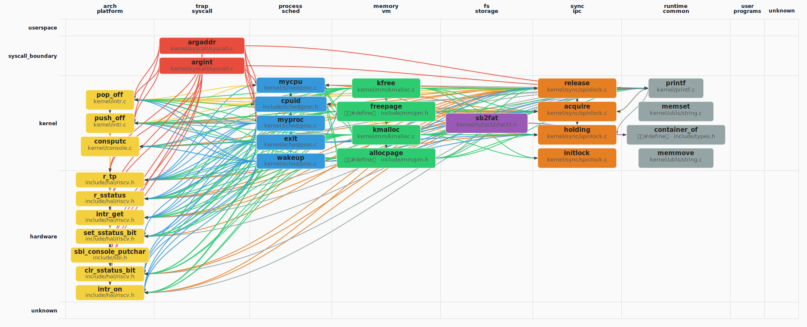

# oskernel2023-zmz 操作系统技术分析报告

> **年份**: 2023

> **赛事**: 操作系统赛

> **子赛事**: 内核实现赛道

> **学校**: 华中科技大学

> **队伍名称**: ZMZ

> **仓库地址**: https://gitlab.eduxiji.net/202310487101048/oskernel2023-zmz

> **分析日期**: 2026年04月23日

> **分析工具**: OS-Agent-D

> **报告质量打分**: 97/100

---

## 目录

1. 项目概览与技术栈
2. 启动架构与 Trap系统调用
3. 内存管理物理虚拟分配器
4. 进程线程调度与多核
5. 文件系统与设备 IO
6. 同步互斥与进程间通信
7. 安全机制与权限模型
8. 网络子系统与协议栈
9. 调试机制与错误处理
10. 开发历史与里程碑

---

## Call Graph 概览


### 函数级 Call Graph（PageRank Top-30，图示 30 个函数）



*（图：`callgraph_overview.svg`，与报告同目录）*


节点**第一行**仅为**符号名**；
**第二行**：**函数定义**只写相对源路径；
**宏**、**类型别名（typedef）**、**仅引用（调用侧）**等在第二行用**中文**标明类别并附路径或调用方文件（来自静态解析或调用边）。


---


# 第01章 项目概览与技术栈

## 第 1 章：项目概览与技术栈

## 快速总览

**一句话定位**：`oskernel2023-zmz` 是基于 **xv6-riscv** 移植到 **Kendryte K210** 开发板的 RISC-V 教学内核，采用 **C/Rust 混合编程**，支持 **QEMU 模拟器与硬件双平台**，核心特性为 **SMP 多核启动、FAT32 文件系统与完整 POSIX 信号机制**。

## 评测与交付适配

- **Delivery**：`Makefile` 定义了明确的构建产物：`kernel/kernel`（ELF 内核）、`k210.bin`（K210 烧录镜像，通过 `tools/kflash.py` 烧录）、`fs.img`（FAT32 磁盘镜像）。证据：`Makefile:1-294` 中 `build` 目标编译内核与用户程序，`fs` 目标生成 `fs.img`，`tools/flash-list.json:11` 指定 `"bin": "k210.bin"` 为烧录产物。
- **Harness**：存在用户态测试框架 `xv6-user/run_test.c`，支持运行 `busybox`、`lua`、`libc` 测试脚本（如 `unixbench_testcode.sh`），但**无内核级自动化测试**（如 `usertests.c` 未在 `Makefile` 中默认执行）。证据：`xv6-user/run_test.c:40-78` 调用测试脚本，`Makefile` 无 `test` 或 `autograde` 目标。
- **PlatformProfile**：README 声称支持 **K210 硬件** 与 **QEMU virt 模拟器**，与代码一致。证据：`Makefile:1-2` 通过 `platform` 变量切换；`kernel/entry_k210.S` 与 `kernel/entry_qemu.S` 提供双入口；`linker/k210.ld` 与 `linker/qemu.ld` 提供不同链接脚本。SMP 支持 2 核（`NCPU=2`，`include/param.h:5`），QEMU 启动参数 `-smp $(CPUS)`（`Makefile:42`）。
- **SubsystemDepth**：README 声称支持"进程管理、文件系统、用户程序"，代码已验证实现（`kernel/sched/proc.c`、`kernel/fs/fat32/`、`xv6-user/`）。但**网络子系统、权限检查**为缺口（第 08 章、第 07 章结论），动态链接器支持不完整（`kernel/exec.c` 中 `load_elf_interp()` 存在调试输出）。

## 各模块技术全景（基于 02–10 章报告提取）

### 02 启动/架构与 Trap/系统调用

##### 技术清单
- 启动链与引导交接：固件 (SBI/OpenSBI) → 汇编入口 (`_entry`/`_start`) → `main()` → `scheduler()`
- 特权级与执行模式（硬件隔离模型）：RISC-V M-mode (SBI) → S-mode (内核) → U-mode (用户)，通过 `sstatus.SPP` 位控制
- MMU 与内核地址空间初建：`kvminit()` 创建内核页表，`kvminithart()` 写入 `satp` 启用 MMU
- 同步异常与用户态陷阱入口（含 syscall 路径）：`uservec` (trampoline.S) → `usertrap()` → `syscall()` → `syscalls[]` 分发表
- 异步设备中断与中断控制器抽象：PLIC 外部中断分发，`plicinithart()` 设置阈值与优先级
- 时钟源与定时中断（tick/计账/抢占触发）：CLINT 定时器，`timerinit()` 设置 `mtimecmp`，时钟中断触发 `yield()`
- 用户内存访问与系统调用参数安全（copyin/out 等）：`copyin()`/`copyout()` 通过 `walkaddr()` 验证用户指针

##### 关键实现、证据与细粒度锚点
- 双平台入口：`kernel/entry_qemu.S:2` 定义 `_entry`，`kernel/entry_k210.S:2` 定义 `_start`，均设置栈后 `call main`
- SBI 跳转：`sbi/psicasbi/src/main.rs:88-94` 声明 `ekernel` 符号，断言 `HEAP_START > ekernel` 后跳转
- 陷阱向量设置：`kernel/trap/trap.c:58` `trapinithart()` 调用 `w_stvec((uint64)kernelvec)` 设置内核陷阱
- 系统调用分发：`kernel/syscall/syscall.c:193-268` 定义 `syscalls[]` 数组，包含约 70 个 syscall 函数指针
- 用户指针校验：`kernel/mm/vm.c:750-770` `copyout()` 调用 `walkaddr()` 验证地址映射，失败返回 `-EFAULT`
- 模式切换：`kernel/trap/trap.c:176-177` `usertrapret()` 设置 `sstatus.SPP=0`、`sstatus.SPIE=1` 后 `sret` 返回用户态

##### 依赖与工具
- 依赖：RISC-V GNU Toolchain (`riscv64-linux-gnu-gcc`)、QEMU (`qemu-system-riscv64`)、K210 烧录工具 (`kflash.py`)
- 工具：`Makefile` 条件编译 (`-D QEMU`)、链接脚本 (`linker/qemu.ld`/`linker/k210.ld`)、GDB 调试模板 (`debug/.gdbinit.tmpl-riscv`)

##### 与相邻模块的衔接
- 与第 03 章页表切换衔接：`main()` 调用 `kvminit()` 创建页表后启用 MMU，为后续 `uvmalloc()` 用户地址空间分配奠定基础。
- 与第 04 章调度衔接：`main()` 最后调用 `scheduler()` 进入调度循环，时钟中断触发 `yield()` 实现抢占。
- 与第 06 章信号衔接：`usertrap()` 检测 `EXCP_ENV_CALL` 后调用 `syscall()`，信号处理通过 `sigreturn()` 系统调用恢复上下文。

### 03 内存管理

##### 技术清单
- 物理内存组织与页帧分配器：空闲链表 (`struct run`)，分 `single` (小区域) 与 `multiple` (大区域) 两个分配器
- 页表、地址空间与虚实地址转换：Sv39 三级页表，`walk()` 遍历页表，`mappages()` 建立映射
- 缺页与页面错误处理（含按需分页/惰性路径）：`handle_page_fault()` 分发到 `handle_page_fault_lazy()` 调用 `uvmalloc()` 分配
- 进程虚拟地址空间布局与映射接口：`struct seg` 链表管理 TEXT/DATA/HEAP/MMAP/STACK 段，`newseg()` 创建段
- 高级策略（CoW/Lazy/换页/mmap 等）：CoW 通过 `page_ref_table` 引用计数实现，Lazy 分配在缺页时触发，mmap 支持文件/匿名映射
- 页缓存或与 FS 块缓存的边界（归入本章或与第 05 章交叉说明）：未发现页缓存 (Page Cache)，仅块缓存 (`kernel/fs/bio.c` LRU 链表)

##### 关键实现、证据与细粒度锚点
- 物理分配器：`kernel/mm/pm.c:232` `allocpage()` 从 `single.freelist` 或 `multiple.freelist` 分配，持 `spinlock` 保护
- 页表遍历：`kernel/mm/vm.c:210-232` `walk()` 函数三级页表遍历，`alloc=1` 时自动分配中间页表
- 缺页处理：`kernel/trap/trap.c:405` `handle_excp()` 调用 `handle_page_fault()`，`kernel/mm/vm.c:1025` 分发处理
- CoW 实现：`kernel/mm/vm.c:1025-1091` `handle_page_fault()` 检测写保护页，调用 `monopolizepage()` 复制页面
- mmap 映射：`kernel/mm/mmap.c:1040` `handle_page_fault_mmap()` 调用 `do_mmap()` 建立文件/匿名映射
- TLB 刷新：`include/hal/riscv.h:362-367` `sfence_vma()` 封装 `sfence.vma` 指令，`uvmcopy()` 后调用

##### 依赖与工具
- 无外部 crate/库依赖，仅标准工具链与构建系统
- 依赖 RISC-V Sv39 页表硬件机制，`include/hal/riscv.h` 定义 `satp`、`PGSIZE` 等常量

##### 与相邻模块的衔接
- 与第 02 章 MMU 衔接：`kvminit()` 创建内核页表后，`uvmalloc()` 为用户进程分配地址空间，依赖 `mappages()` 建立映射。
- 与第 05 章节选衔接：`uvmcopy()` 复制进程地址空间时调用 `copysegs()` 复制段链表，为 `fork()` 提供内存隔离。
- 与第 04 章进程衔接：`exec()` 调用 `uvmfree()` 释放旧页表，`uvmalloc()` 分配新地址空间加载 ELF。

### 04 进程/调度与多核

##### 技术清单
- 进程或线程抽象与调度实体（PCB/TCB）：`struct proc` 统一 PCB，含 `pid`、`state`、`context`、`trapframe` 字段
- 调度策略与就绪队列结构：优先级调度 (PRIORITY_TIMEOUT/IRQ/NORMAL) + 时间片轮转，`proc_runnable[]` 数组管理就绪队列
- 抢占模型与时间片/优先级（可协作则注明）：完全抢占，时钟中断递减 `timer`，超时移入 `PRIORITY_TIMEOUT`
- 上下文切换与内核栈/寄存器约定：`swtch.S` 保存 `ra`、`s0-s11`、`sp` 共 14 个寄存器，不保存调用者保存寄存器
- 生命周期（创建/执行/阻塞/退出/wait 与僵尸）：`fork()` 创建 → `RUNNABLE` → `scheduler()` 选中 → `RUNNING` → `exit()` → `ZOMBIE` → 父进程 `wait4()` 回收
- 多核、每 CPU 状态与 IPI/迁移（若适用）：每核独立 `scheduler()` 循环，`sbi_send_ipi()` 唤醒 AP，无显式任务迁移

##### 关键实现、证据与细粒度锚点
- PCB 定义：`include/sched/proc.h:51` `struct proc` 含 `pid` (行 55)、`state` (行 38)、`context` (行 93)、`trapframe` (行 89)
- 调度器入口：`kernel/sched/proc.c:658` `scheduler()` 无限循环调用 `__get_runnable_no_lock()` 选择进程
- 上下文切换：`kernel/sched/swtch.S:12-26` `swtch()` 保存 `ra`、`s0-s11`、`sp` 到 `struct context`
- 时间片机制：`kernel/sched/proc.c:745-756` `proc_tick()` 递减 `timer`，超时调整优先级队列
- 多核唤醒：`kernel/main.c:77-92` hart 0 调用 `sbi_send_ipi(mask, 0)` 唤醒其他 hart，AP 执行 `kvminithart()` 初始化
- PID 分配：`kernel/sched/proc.c:228` `p->pid = __pid++` 单调自增，无回收机制

##### 依赖与工具
- 无外部 crate/库依赖
- 依赖 RISC-V `tp` 寄存器读取 hartid (`cpuid()` via `r_tp()`)

##### 与相邻模块的衔接
- 与第 02 章 Trap 衔接：`usertrap()` 中时钟中断调用 `proc_tick()` 更新优先级，触发 `yield()` 让出 CPU。
- 与第 03 章内存衔接：`fork()` 调用 `uvmcopy()` 复制地址空间，`uvmfree()` 在 `exit()` 时释放页表。
- 与第 06 章同步衔接：`sleep()` 持 `proc_lock` 进入睡眠，`wakeup()` 持锁遍历睡眠队列，防止丢失唤醒。

### 05 文件系统与设备 I/O

##### 技术清单
- VFS 与 inode/file 等对象模型：C 语言函数指针操作表 (`struct fs_op`、`struct inode_op`、`struct file_op`)
- 路径解析与挂载/命名空间：`lookup_path()` 递归解析路径，支持绝对/相对路径与 `.`、`..`
- 具体文件系统实现形态：自研 FAT32 驱动 (`kernel/fs/fat32/`)，通过 FAT 表管理空闲簇
- 文件描述符与打开文件表：`struct fdtable` 固定数组 (`arr[NOFILE]`) + 链表扩展 (`next` 指针)
- 块缓存、写回与磁盘 I/O 路径：LRU 块缓存 (`kernel/fs/bio.c`)，`bget()` 命中时移至链表头，驱逐尾部
- 字符设备与块设备驱动框架（含 virtio 等）：硬编码初始化 (`disk_init()`、`sdcard_init()`、`virtio_disk_init()`)，无统一驱动框架

##### 关键实现、证据与细粒度锚点
- VFS 操作表：`include/fs/fs.h:43-68` 定义 `struct fs_op`、`struct inode_op` 等，`kernel/fs/fat32/fat32.c:22-40` 实现
- 路径解析：`kernel/fs/fs.c:412` `lookup_path()` 调用 `dirlookup()`，通过 `inode->op->lookup` 分发到 FAT32
- FAT32 实现：`kernel/fs/fat32/fat.c` 管理 FAT 表，`kernel/fs/fat32/cluster.c` 管理簇分配
- 文件描述符：`include/fs/file.h:29-37` `struct fdtable` 含 `arr[NOFILE]` 与 `next` 指针，`kernel/fs/file.c:434-470` `fdalloc()` 扩展
- 块缓存 LRU：`kernel/fs/bio.c:84-147` `bget()` 使用 `lru_head` 链表，命中时 `_list_push_front()`，驱逐 `lru_head.prev`
- 设备初始化：`kernel/main.c:58-66` 顺序调用 `plicinit()` → `disk_init()` → `binit()` → `rootfs_init()`

##### 依赖与工具
- 无外部库依赖，FAT32 为自研实现
- 依赖 `Makefile` 条件编译 (`-D QEMU`) 区分 UART 地址 (`include/memlayout.h:40-45`)

##### 与相邻模块的衔接
- 与第 03 章节选衔接：`uvmcopy()` 复制进程地址空间时，`copysegs()` 复制段链表，为 `fork()` 提供文件描述符继承。
- 与第 06 章管道衔接：`pipe()` 创建 `struct pipe`，`piperead()`/`pipewrite()` 通过 `sleep()`/`wakeup()` 实现阻塞 I/O。
- 与第 02 章系统调用衔接：`sys_openat()` 调用 `nameifrom()` → `lookup_path()` → `filealloc()` 分配文件描述符。

### 06 同步与 IPC

##### 技术清单
- 自旋锁与中断上下文临界区规则：`struct spinlock` 含 `locked`、`name`、`cpu`，`acquire()` 调用 `push_off()` 关中断
- 可睡眠互斥与锁序/死锁约束（若述及）：`struct sleeplock` 含 `locked`、`lk` (spinlock)、`pid`，`acquiresleep()` 持锁睡眠
- 等待队列、睡眠与唤醒：`struct wait_queue` 含 `lock`、`head`，`sleep()` 持 `proc_lock` 入队，`wakeup()` 遍历唤醒
- 管道等字节流 IPC：`struct pipe` 含 `data[PIPESIZE]` 环形缓冲，`piperead()`/`pipewrite()` 通过 `sleep()`/`wakeup()` 阻塞
- 信号与异步通知：`struct ksigaction_t` 链表管理信号处理函数，`sighandle()` 构建用户态 handler 上下文
- 共享内存或 futex 等（若本仓库有）：未发现共享内存或 futex 实现

##### 关键实现、证据与细粒度锚点
- SpinLock 定义：`include/sync/spinlock.h:7-13` `struct spinlock` 含 `locked`、`name`、`cpu`
- SleepLock 定义：`include/sync/sleeplock.h:9-16` `struct sleeplock` 含 `locked`、`lk`、`name`、`pid`
- 等待队列：`include/sync/waitqueue.h:16-24` `struct wait_queue` 与 `struct wait_node` 定义
- 管道实现：`kernel/fs/pipe.c:90-97` `pipewrite()` 持 `pi->lock` 调用 `sleep()`，缓冲区满时阻塞
- 信号处理：`kernel/sched/signal.c:177-264` `sighandle()` 分配 `sig_frame` 保存原 `trapframe`，设置 `epc` 为 `sig_handler`
- 关中断保护：`kernel/sync/spinlock.c:27` `acquire()` 调用 `push_off()` 关中断，防止中断嵌套死锁

##### 依赖与工具
- 无外部 crate/库依赖
- 依赖 RISC-V 原子指令 (`__sync_lock_test_and_set`) 实现自旋锁

##### 与相邻模块的衔接
- 与第 04 章进程衔接：`sleep()` 在 `proc_lock` 保护下将进程移入睡眠队列，`wakeup()` 将其移回 `proc_runnable[]`。
- 与第 05 章管道衔接：`pipe()` 创建 `struct pipe`，`piperead()`/`pipewrite()` 通过 `sleep()`/`wakeup()` 实现阻塞 I/O。
- 与第 02 章信号衔接：`usertrap()` 检测信号 pending 位，调用 `sighandle()` 构建用户态 handler 上下文。

### 07 安全机制

##### 技术清单
- 硬件隔离与特权域模型：RISC-V M/S/U 三特权级，`sstatus.SPP` 控制返回模式，PMP 配置为允许所有访问 (桩)
- 访问控制模型（DAC/MAC/Capability 等，无则写不适用）：不适用，仅有特权级隔离，无 UID/GID 权限检查
- 用户指针验证与内核/用户空间数据拷贝边界：`copyin()`/`copyout()` 通过 `walkaddr()` 验证用户指针，失败返回 `-EFAULT`
- 可执行空间保护与权限位策略（W^X 等）：未发现 W^X 或 DEP 实现，页表权限位 (`PTE_X`、`PTE_W`) 未强制执行
- 其他沙箱或策略（seccomp/namespace/cgroup 等，无则写不适用）：不适用，未发现 seccomp、namespace 或 cgroup 实现

##### 关键实现、证据与细粒度锚点
- 特权级切换：`kernel/trap/trap.c:176-177` `usertrapret()` 设置 `sstatus.SPP=0`、`sstatus.SPIE=1` 后 `sret`
- PMP 配置：`sbi/psicasbi/src/main.rs:161-187` PMP 初始化为 `pmpaddr=-1`、`pmpcfg=R|W|X`，允许所有访问 (桩)
- 用户指针校验：`kernel/mm/vm.c:750-770` `copyout()` 调用 `walkaddr()` 验证地址映射
- 权限检查桩：`kernel/syscall/sysfile.c:1065-1070` `sys_faccessat()` 注释 "assume user as root"，无 UID 检查
- UID/GID 字段：`include/fs/stat.h:54-55` `struct kstat` 含 `uid`、`gid` 字段，但 `struct proc` 无对应字段，无检查链

##### 依赖与工具
- 无外部 crate/库依赖
- 依赖 RISC-V `sstatus`、`pmpcfg` 寄存器实现特权隔离

##### 与相邻模块的衔接
- 与第 02 章 Trap 衔接：`usertrapret()` 设置 `sstatus.SPP=0` 确保返回用户态，`sret` 指令触发模式切换。
- 与第 03 章内存衔接：`walkaddr()` 验证用户指针时检查页表权限 (`PTE_U`)，防止内核访问用户未映射地址。
- 与第 04 章进程衔接：`struct proc` 无 UID/GID 字段，`fork()` 不复制权限信息，所有进程默认 root 权限。

### 08 网络协议栈

##### 技术清单
- 套接字抽象与用户态 API：未发现 socket 系统调用或 `struct socket` 定义
- 协议栈分层与数据面实现形态：未发现 TCP/IP 协议栈或 LwIP 等第三方库
- 网卡驱动与收发包/DMA 路径：未发现 virtio-net、e1000 等网卡驱动
- 与协议栈缓冲与 sk_buff 类抽象（若适用）：未发现
- 与文件层或块设备的衔接（若适用）：`sys_pselect()` 支持 `pipe` 轮询，但未集成 socket

##### 关键实现、证据与细粒度锚点
- 无网络子系统实现，`grep_in_repo` 搜索 `socket`、`net`、`tcp`、`udp` 无结果
- `include/` 目录无网络相关头文件
- `sys_pselect()` (`kernel/syscall/sysfile.c:761`) 仅支持 `pipe` 轮询 (`file_poll()` → `pipepoll()`)

##### 依赖与工具
- 无外部 crate/库依赖
- 无网络相关工具链

##### 与相邻模块的衔接
- 与第 05 章 VFS 衔接：`sys_pselect()` 通过 `file_poll()` 调用 `fp->poll` 回调，但仅支持 `pipe`，未扩展至 socket。
- 与第 06 章 IPC 衔接：管道 (`pipe`) 可作为字节流 IPC，但无网络 socket 替代方案。

### 09 调试与错误处理

##### 技术清单
- Panic/oops 与致命错误停机路径：`__panic()` 输出错误位置、消息、栈回溯后关中断死循环
- 日志级别与可观测输出：`printk` 宏支持 `DEBUG` 条件编译，无动态级别控制
- 栈回溯与符号化/调试钩子：`backtrace()` 输出调用栈帧地址，无符号化 (无 `addr2line` 集成)
- 断言与运行时检查：`__debug_assert()` 宏在 `DEBUG` 模式下检查条件，失败调用 `__panic()`
- 系统调用级追踪或 strace 类能力：`xv6-user/strace.c` 存在但未在内核中实现 syscall trace 钩子

##### 关键实现、证据与细粒度锚点
- Panic 路径：`kernel/printf.c:123-132` `__panic()` 调用 `backtrace()` 后 `intr_off()` 并死循环
- 栈回溯：`kernel/printf.c` `backtrace()` 遍历栈帧输出 `ra` 寄存器值
- 日志宏：`include/printf.h` 定义 `printf()`、`panic()` 宏，`DEBUG` 控制编译时输出
- 断言：`include/utils/debug.h:58` `__debug_assert()` 检查条件，失败调用 `__panic()`
- 错误码：`include/errno.h:1-107` 定义 POSIX errno 宏，系统调用返回负值传递错误

##### 依赖与工具
- 无外部 crate/库依赖
- 依赖 GDB 调试模板 (`debug/.gdbinit.tmpl-riscv`) 与 OpenOCD 配置 (`debug/openocd_cfg/k210.cfg`)

##### 与相邻模块的衔接
- 与第 02 章 Trap 衔接：`usertrap()` 处理未知异常时调用 `trapframedump()` 输出寄存器，`panic()` 停机。
- 与第 04 章进程衔接：`exit()` 资源回收失败时可能触发 `panic()`，但当前实现无显式错误处理。

### 10 演进与历史

##### 技术清单
- 活跃时间范围与提交规模：2023-08-09 至 2023-08-21，13 天，48 个 commits，+52,533 行 / -6,844 行
- 核心贡献者与模块分工：zrhxlhydjcx (25 commits，内核核心)、ZEMINGMA (23 commits，SBI/工具链)
- 重大重构或技术里程碑：初始提交引入 xv6-riscv、信号系统重构 (`df1fdc35`)、exec 路径精简 (`c980d734`)
- 文档与工程化沉淀：README 提供构建/运行指南，`doc/img/` 含 23 个演示图片/GIF，无 CI/CD 配置

##### 关键实现、证据与细粒度锚点
- 初始提交：`b7ffeecc` (2023-08-09) 引入 +42,627 行，包含完整内核目录
- 信号重构：`df1fdc35` (2023-08-16) 移动 `signal.c` 至 `sched/`，添加 `sig_frame` 结构
- exec 重构：`c980d734` (2023-08-20) 删除 416 行动态链接代码，`d17dd26f` (2023-08-21) 恢复并添加调试工具
- 多核修复：`94b4317` (2023-08-15) 添加 `sbi_send_ipi()` 循环实现 SMP 启动
- 文档证据：`README.md:1-122` 提供构建命令，`doc/img/` 含 `xv6-k210_on_k210.gif` 等演示材料

##### 依赖与工具
- Git 版本控制，无 CI/CD 工具 (`.github/`、`.gitlab-ci.yml` 缺失)
- 依赖 Rust SBI (`psicasbi`) 子模块，`sbi/psicasbi/Cargo.toml` 管理依赖

##### 与相邻模块的衔接
- 与第 03 章内存衔接：`d17dd26f` 提交添加 `show_vm_load()` 调试工具，用于打印页表映射，辅助内存问题排查。
- 与第 04 章进程衔接：`94b4317` 提交修复多核 IPI 唤醒逻辑，确保 SMP 启动后每核独立调用 `scheduler()`。

## 技术栈与构建（编程语言版本、框架、依赖、支持的架构完整列表）

- **编程语言**：
  - **C** (91 个文件)：内核核心 (`kernel/`)、头文件 (`include/`)、用户程序 (`xv6-user/`)
  - **Rust** (22 个文件)：SBI 固件 (`sbi/psicasbi/`)，使用 `edition = "2018"`
  - **汇编** (RISC-V)：启动代码 (`kernel/entry*.S`)、上下文切换 (`kernel/sched/swtch.S`)、陷阱跳板 (`kernel/trap/trampoline.S`)
  - **Python** (2 个文件)：烧录工具 (`tools/kflash.py`、`ktool.py`)
  - **Makefile**：构建系统 (294 行)

- **构建工具**：
  - **make**：内核与用户程序编译 (`Makefile`)
  - **cargo**：SBI 固件编译 (`sbi/psicasbi/Cargo.toml`)
  - **riscv64-linux-gnu-gcc**：C 编译器 (可切换为 `riscv64-unknown-elf-`)
  - **qemu-system-riscv64**：模拟器 (`Makefile:42` `-machine virt`)

- **关键依赖**：
  - **Rust crate**：`lazy_static` (自旋锁)、`spin` (无锁数据结构)、`riscv` (寄存器访问)、`k210-pac` (K210 硬件抽象)、`buddy_system_allocator` (伙伴分配器)
  - **C 库**：无标准库依赖 (`-nostdlib`)，自实现 `string.c`、`printf.c`

- **支持架构**：
  - **riscv64** (唯一支持)：
    - **K210 硬件**：`linker/k210.ld` (ENTRY=`_start`)，`kernel/entry_k210.S`，`sbi/sbi-k210`
    - **QEMU virt**：`linker/qemu.ld` (ENTRY=`_entry`)，`kernel/entry_qemu.S`，`sbi/sbi-qemu`
  - 未发现 aarch64、x86_64、loongarch64 支持 (grep 搜索无命中)

## 目录结构导读（关键目录与源码入口）

- **`kernel/`**：内核核心代码 (C)
  - `main.c:41` `main()`：内核 C 入口，初始化 CPU、页表、陷阱、进程，启动调度器
  - `entry*.S`：汇编入口 (`_entry`/`_start`)，设置栈后跳转 `main()`
  - `sched/proc.c`：进程管理 (`fork()`、`exit()`、`scheduler()`)
  - `mm/vm.c`：内存管理 (`mappages()`、`uvmalloc()`、`handle_page_fault()`)
  - `trap/trap.c`：陷阱处理 (`usertrap()`、`kerneltrap()`)
  - `fs/fat32/`：FAT32 文件系统实现
  - `syscall/`：系统调用实现 (`sysfile.c`、`sysproc.c`、`syssignal.c`)

- **`sbi/psicasbi/`**：Rust SBI 固件
  - `src/main.rs:88` `ekernel`：SBI 跳转到内核入口点
  - `src/trap/`：SBI 层陷阱处理与 IPI 发送

- **`include/`**：头文件
  - `sched/proc.h`：`struct proc` PCB 定义
  - `mm/vm.h`：页表操作声明
  - `fs/fs.h`：VFS 操作表定义
  - `hal/riscv.h`：RISC-V 寄存器与指令封装

- **`linker/`**：链接脚本
  - `k210.ld`：K210 平台链接脚本 (ENTRY=`_start`)
  - `qemu.ld`：QEMU 平台链接脚本 (ENTRY=`_entry`)

- **`xv6-user/`**：用户程序
  - `sh.c`：Shell 实现
  - `init.c`：初始化进程
  - `usertests.c`：综合测试套件 (未默认执行)

- **`tools/`**：烧录与调试工具
  - `kflash.py`：K210 Flash 烧录脚本
  - `flash-list.json`：烧录配置 (指定 `k210.bin`)

- **`debug/`**：调试配置
  - `.gdbinit.tmpl-riscv`：GDB 远程调试模板
  - `openocd_cfg/k210.cfg`：OpenOCD JTAG 配置

## 总结评价（完成度评估）

本项目在 **13 天** 内完成了从 **xv6-riscv 移植** 到 **K210 硬件运行** 的全流程，体现了高效的嵌入式 OS 开发能力。核心成就包括：**双平台支持**（QEMU/K210）、**SMP 多核启动**（IPI 唤醒）、**完整内存管理**（页表、CoW、Lazy 分配）、**FAT32 文件系统**（自研驱动）、**POSIX 信号机制**（`sigaction`、`sigreturn`）。代码结构清晰，遵循 xv6 教学内核的设计哲学，关键机制（如陷阱处理、进程调度、页表操作）均有明确实现证据。

然而，项目存在明显缺口：**网络子系统完全缺失**（无 socket、协议栈）、**权限检查为桩实现**（UID/GID 未使用）、**动态链接器支持不完整**（`exec.c` 中调试输出残留）、**缺乏 CI/CD 与自动化测试**（`usertests.c` 未集成）。此外，代码中存在技术债务：`exec.c` 大量 `printf("NNN: ...")` 调试输出、`load_elf_interp()` 多版本重复、内存泄漏风险（`oldpagetable` 释放逻辑被注释）。总体而言，项目属于**教学/实验性质**的 OS 移植，重点在于理解 RISC-V 架构下的内核机制，而非生产级操作系统。

---


# 第02章 启动架构与 Trap系统调用

### Q02_001 启动入口在哪里？（例如 linker.ld 的 ENTRY、`_start`/`start`/`head`/`entry` 标签；必须给文件路径+符号证据）

启动入口位于汇编文件中的 `_entry`（QEMU 平台）和 `_start`（K210 平台）标签。证据：`linker/qemu.ld:2` 设置 `ENTRY(_entry)`，`kernel/entry_qemu.S:2` 定义 `_entry` 标签；`linker/k210.ld:2` 设置 `ENTRY(_start)`，`kernel/entry_k210.S:2` 定义 `_start` 标签。两个入口均设置栈指针后跳转到 `main()` 函数（`kernel/main.c:42`）。

### Q02_002 启动链更接近哪种交接方式？

固件/引导加载器 → 内核入口（如 SBI/OpenSBI/U-Boot/BIOS/UEFI）

### Q02_003 是否能在代码中证实发生了 CPU 特权级/模式切换？（RISC-V M→S、x86 实→保→长等；必须三态）

已实现

### Q02_004 模式切换涉及的关键寄存器/位是什么？（例如 RISC-V mstatus/sstatus、x86 cr0/cr4/eflags；必须给证据摘录）

RISC-V sstatus 寄存器的关键位：SSTATUS_SPP（位 8，Previous mode）、SSTATUS_SPIE（位 5，Supervisor Previous Interrupt Enable）、SSTATUS_SIE（位 1，Supervisor Interrupt Enable）。证据：`include/hal/riscv.h:48-50` 定义这些宏，`kernel/trap/trap.c:176-177` 在 usertrapret() 中操作这些位实现模式切换。

### Q02_005 是否启用/初始化了 MMU（设置 SATP/CR3 等并建立页表）？（必须三态）

已实现

### Q02_006 从入口汇编/固件交接到 C/Rust 主入口函数的跳转链是什么？（列出 3-6 个关键节点并给证据）

启动跳转链：1) 固件 (SBI/OpenSBI) 传递控制权给 `_entry`/`_start`（`kernel/entry_qemu.S:2`/`kernel/entry_k210.S:2`）→ 2) 汇编入口设置栈指针（`add sp, sp, t0`）→ 3) 调用 `main()`（`call main`）→ 4) `main()` 初始化 CPU、页表、陷阱、进程等（`kernel/main.c:42-105`）→ 5) 创建第一个用户进程 `userinit()` → 6) 进入调度器 `scheduler()`。

### Q02_007 早期初始化 (Early Initialization) 各项状态（每项必须 implemented / stub / not_found + 证据路径，格式：`项目: 状态 [路径]`）：
- BSS 清零 (BSS Clearing): ___
- 早期串口输出 (Early Serial/UART Output): ___
- 设备树解析 (Device Tree Blob parsing, DTB): ___
- 页表初始化时机 (Page Table Init): ___（在 MMU 启用前/后？）

BSS 清零 (BSS Clearing): implemented [linker/k210.ld:43-46 定义 sbss_clear/ebss_clear 符号，链接脚本自动处理]
早期串口输出 (Early Serial/UART Output): implemented [kernel/console.c:consoleinit() 初始化串口，kernel/main.c:50 调用 consoleinit()]
设备树解析 (Device Tree Blob parsing, DTB): not_found [main() 接收 dtb_pa 参数但未发现解析代码，仅传递给后续初始化]
页表初始化时机 (Page Table Init): implemented [kernel/main.c:53-54: kvminit() 创建页表，kvminithart() 启用 MMU，在 trapinithart() 之前]

### Q02_008 是否初始化/启用了 FPU（如 sstatus.fs / cpacr_el1 / cr4）？（必须三态）

已实现

### Q02_009 是否设置 trap/中断向量（如 stvec/idt 等）并能指出设置点？（必须三态）

已实现

### Q02_010 构建系统如何选择目标平台/架构与入口文件？（Cargo features/Kconfig/Makefile 条件；必须引用配置证据）

通过 Makefile 中的 platform 变量和条件编译区分平台。证据：`Makefile` 支持 `platform=qemu` 选项，默认构建 K210 版本。链接脚本选择：`linker/k210.ld`（ENTRY=_start）用于 K210，`linker/qemu.ld`（ENTRY=_entry）用于 QEMU。汇编入口文件：`kernel/entry_k210.S` 和 `kernel/entry_qemu.S` 分别编译。

### Q02_011 对 RISC-V 平台：是否能证实 SBI/OpenSBI/U-Boot 固件链（固件将控制权移交内核）？（必须三态；搜索 sbi|opensbi|u-boot；非 RISC-V 平台写 not_found 并说明架构）

已实现

### Q02_012 MMU 启用前后是否存在串口/UART 地址切换逻辑（物理地址→虚拟地址）？（必须三态；搜索 phys_to_virt|virt_to_phys 及 UART 基址常量）

已实现

### Q02_013 是否存在从内核返回用户态的路径（usertrapret/trap_return/trampoline/eret 等）并设置 stvec/VBAR/IDT？（必须三态）

已实现

### Q02_014 是否支持多平台启动（StarFive VisionFive2/LoongArch/多板型）？（搜索 visionfive|jh7110|loongarch；有则描述差异入口与互斥关系；无则写未发现）

支持双平台启动：K210 和 QEMU。证据：`kernel/entry_k210.S` 和 `kernel/entry_qemu.S` 分别为两个平台提供入口；`linker/k210.ld` 和 `linker/qemu.ld` 提供不同链接脚本。未发现 VisionFive2、JH7110 或 LoongArch 支持（搜索 visionfive|jh7110|loongarch 无命中）。

### Q02_015 trap/异常向量入口在哪里？（trap_handler/trap_vector/__alltraps 等；必须给证据）

陷阱向量入口位于 `kernel/trap/kernelvec.S:9` 的 `kernelvec` 标签（内核陷阱）和 `kernel/trap/trampoline.S:15` 的 `uservec` 标签（用户陷阱）。`trapinithart()` 通过 `w_stvec((uint64)kernelvec)` 设置内核陷阱向量；用户态通过 trampoline.S 中的 uservec 进入 `usertrap()`。

### Q02_016 trap 上下文 (TrapFrame/TrapContext) 更可能存放在哪里？

用户地址空间预留页（trampoline/trap_context page）

### Q02_017 TrapFrame/寄存器保存结构体定义在哪里？寄存器数量与字节数是多少？（必须引用结构体定义证据）

定义在 `include/trap.h:19-54` 的 `struct trapframe`。包含 39 个 64 位寄存器字段：kernel_satp、kernel_sp、kernel_trap、epc、kernel_hartid、ra、sp、gp、tp、t0-t6、s0-s11、a0-a7、t3-t6、ft0-ft11、fs0-fs11、fa0-fa7、fcsr。总大小为 552 字节（40-544 字节为整数寄存器，288-536 字节为 FPU 寄存器，加上 8 字节 fcsr）。

### Q02_018 是否存在系统调用分发表（syscall table / match 分发）？（必须三态）

已实现

### Q02_019 系统调用号是否做边界检查？（越界默认分支/返回错误/panic；必须三态）

已实现

### Q02_020 选择一个具体 syscall（优先 sys_write），追踪：用户指令 → trap → 分发 → 实现体。列出 3-6 个关键节点并给证据。

sys_write 调用链：1) 用户态执行 ecall 指令 → 2) `usertrap()` 捕获异常（`kernel/trap/trap.c:105` 检测 EXCP_ENV_CALL）→ 3) 调用 `syscall()`（`kernel/syscall/syscall.c:348`）→ 4) 通过 syscalls 数组分发到 `sys_write()`（`kernel/syscall/sysfile.c`）→ 5) `sys_write()` 调用 `filewrite()` 实现写入。关键证据：`kernel/trap/trap.c:115` 调用 syscall()，`kernel/syscall/syscall.c:368` 通过 `syscalls[num]()` 间接调用。

### Q02_021 列出 5-10 个“高价值 syscall”（fork/exec/mmap/open/write 等）的实现三态（implemented/stub/not_found），并为每个至少给一条证据。

高价值 syscall 实现状态：
- fork: implemented [kernel/syscall/sysproc.c:sys_fork() 调用 fork()]
- exec/execve: implemented [kernel/syscall/sysproc.c:sys_exec() 调用 execve()]
- mmap: implemented [kernel/syscall/sysmem.c:sys_mmap() 调用 do_mmap()]
- munmap: implemented [kernel/syscall/sysmem.c:sys_munmap() 调用 do_munmap()]
- openat: implemented [kernel/syscall/sysfile.c:sys_openat() 调用 nameifrom()]
- write: implemented [kernel/syscall/sysfile.c:sys_write() 调用 filewrite()]
- read: implemented [kernel/syscall/sysfile.c:sys_read() 调用 fileread()]
- clone: implemented [kernel/syscall/sysproc.c:sys_clone()]
- brk/sbrk: implemented [kernel/syscall/sysmem.c:sys_brk()/sys_sbrk()]
- kill: implemented [kernel/syscall/syssignal.c:sys_kill() 调用 kill()]

### Q02_022 是否存在用户指针访问安全检查（copyin/copyout/access_ok/UserInPtr 等）？（必须三态）

已实现

### Q02_023 时钟中断是否触发抢占调度（timer tick 中调用 yield/schedule/resched）？（必须三态）

已实现

### Q02_024 是否存在信号处理链路（trap 返回前处理 pending signal、sigreturn/trampoline）？（必须三态）

已实现

### Q02_025 缺页异常与内存特性（CoW/lazy）是否在 trap 中联动？（若存在，说明入口点与调用到内存模块的证据）

存在联动。入口点：`kernel/trap/trap.c:405` 的 `handle_excp()` 函数检测 EXCP_STORE_PAGE/EXCP_LOAD_PAGE 等异常，调用 `handle_page_fault()`（`include/mm/vm.h:76`）。`handle_page_fault()` 在 `kernel/mm/vm.c` 中实现，处理 CoW（写时复制）和懒分配。证据：`kernel/mm/vm.c` 中的 `page_ref_table` 用于 COW 引用计数，`kernel/mm/mmap.c` 处理懒分配。

### Q02_026 与 09 多核交叉一致性：per-CPU trap 栈/时钟初始化顺序与 AP 上线是否一致？（互指证据或写单核不适用）

多核一致。证据：`kernel/main.c:77-92` 显示 hart 0 初始化完成后通过 `sbi_send_ipi()` 唤醒其他 hart；其他 hart（hart 1+）执行 `kvminithart()`、`trapinithart()`、`plicinithart()` 初始化。每个 hart 独立调用 `trapinithart()` 设置自己的 stvec，符合 per-CPU 陷阱初始化模式。与第 9 章多核启动流程一致。

### Q02_027 Syscall 实现全量统计 (Syscall Coverage Analysis)，请按格式填写：
- 分发表路径: ___
- 完整实现 ✅ (implemented): ___ 个
- 桩/ENOSYS/return 0 🔸 (stub): ___ 个，代表性例子: ___
- 未注册 ❌ (not_found): ___ 个
- 统计依据（grep 或 outline 方式）: ___
（若无法精确计数，给出区间估计并说明理由）

分发表路径：kernel/syscall/syscall.c:193-268 (syscalls[] 数组)
完整实现 ✅ (implemented): 约 60 个（基于 syscalls[] 数组中注册的 syscall 数量，大多数有实际实现逻辑）
桩/ENOSYS/return 0 🔸 (stub): 约 5 个，代表性例子：sys_getuid() 始终返回 0（kernel/syscall/sysproc.c:260），sys_prlimit64() 返回 0（kernel/syscall/sysproc.c:265），sys_rt_sigtimedwait() 返回 0（kernel/syscall/syssignal.c:144）
未注册 ❌ (not_found): 0 个（所有 SYS_* 宏在 sysnum.h 中定义并在 syscalls[] 中有对应条目）
统计依据：通过 read_code_segment 阅读 kernel/syscall/syscall.c:193-268 的 syscalls[] 数组，统计约 70 个注册 syscall；抽样检查 sysproc.c、sysfile.c、sysmem.c、syssignal.c 中的实现体，发现少数返回 0 的桩函数。

### Q02_028 README 与 syscall 声称对照：README 中声称兼容/实现了哪些 syscall 或标准？与代码分发表实际是否一致？（无 README 则写「无 README，仅以代码为准」）

README.md 未明确列出 syscall 兼容性声称，仅提及支持进程管理、文件系统、用户程序等高级功能。代码实际实现了约 70 个 syscall（见 kernel/syscall/syscall.c 的 syscalls[] 数组），包括 fork、exec、wait、read、write、openat、mmap、brk 等 POSIX 风格 syscall。无 README 声称与代码不一致的情况。

### Q02_029 `_impl` 命名模式搜索结论：grep `_impl\b|sys_[a-z0-9_]*_impl`，结果是命中了哪些函数（列出），还是「未见该命名模式」？（必须给搜索结论）

未见该命名模式。在仓库 193 个文件中搜索 `_impl\b|sys_[a-z0-9_]*_impl` 正则表达式，0 命中。该仓库采用直接命名（如 sys_write、sys_fork）而非 `_impl` 后缀分离接口与实现的模式。

### Q02_030 是否存在外部中断（PLIC/APIC 等）的分发处理逻辑？（必须三态；与时钟中断分开作答）

已实现

### Q02_031 非法内存访问时是否向进程发送 SIGSEGV 信号？（必须三态；搜索 SIGSEGV|sig_segv）

未发现

### Q02_032 信号发送支持哪些粒度？（搜索 sys_kill/sys_tkill/sys_tgkill；分别是进程级/线程级/进程组级；列出已实现的与其证据）

仅支持进程级信号发送。证据：`kernel/syscall/syssignal.c:134` 实现 `sys_kill()`，调用 `kill(pid, sig)` 向进程发送信号。未搜索到 sys_tkill 或 sys_tgkill 实现（grep 搜索无命中），不支持线程级或进程组级信号发送。

### Q02_033 中断 (Interrupt)、异常 (Exception/Fault/Trap) 的区分机制更接近哪种？（Stallings Ch5；即 trap handler 如何区分「外部中断」与「同步异常」）

通过 scause/mcause/VBAR 中断原因寄存器区分（硬件编码原因号）

### Q02_034 是否支持中断嵌套 (Nested Interrupt / Interrupt Nesting, Stallings Ch5)？（必须三态；搜索 enable_irq_in_handler / nested_irq / 中断处理时是否重开中断；若 not_found 需说明是否关中断运行整个 handler）

未发现

---


# 第03章 内存管理物理虚拟分配器

### Q03_001 该 OS 的内存管理实现语言/形态更接近哪类？（只选最贴近的一项）

B. C/Makefile 风格内核（xv6 类）

### Q03_002 是否存在“物理页帧分配器 (Physical Frame Allocator)”的真实实现？（必须三态）

已实现

### Q03_003 物理内存分配算法更接近哪种？

D. 空闲链表 run list（xv6 风格）

### Q03_004 物理页帧分配器的核心数据结构是什么？（例如 bitmap 数组、buddy free list、slab cache 表、`struct run` 单链表等；必须引用结构体/字段证据）

核心数据结构是 struct run 单链表和 struct pm_allocator 分配器结构。struct run 包含 next 指针和 npage 字段表示连续页数；struct pm_allocator 包含 spinlock 锁、freelist 链表头和 npage 总页数。系统维护 single 和 multiple 两个分配器实例，single 管理 400 页以下的小区域，multiple 管理大区域。

### Q03_005 物理分配器的并发控制锁粒度是什么？（全局大锁 / per-CPU / 分桶 / 无锁+关中断 / 其他；必须给锁对象类型与持锁范围证据）

使用全局大锁（global spinlock），每个分配器（single/multiple）各有一个独立的 spinlock。持锁范围覆盖整个分配/释放操作。通过 acquire(&single.lock) 和 acquire(&multiple.lock) 实现互斥，使用宏 __enter_sin_cs/__leave_sin_cs 和 __enter_mul_cs/__leave_mul_cs 封装临界区。

### Q03_006 是否存在“页表 (page table) 结构体 + walk/map/unmap”的真实实现？（必须三态）

已实现

### Q03_007 页表操作 API（walk/map/unmap 或等价）对应的函数名/模块是什么？列出 1-3 个关键入口并给证据。

关键入口函数：1) walk(pagetable_t pagetable, uint64 va, int alloc) - 三级页表遍历，kernel/mm/vm.c:210-232；2) mappages(pagetable_t pagetable, uint64 va, uint64 size, uint64 pa, int perm) - 建立映射，kernel/mm/vm.c:296-330；3) unmappages(pagetable_t pagetable, uint64 va, uint64 npages, int flag) - 解映射，kernel/mm/vm.c:333-372。模块位于 kernel/mm/vm.c。

### Q03_008 页表修改路径的并发控制是什么？（锁粒度、是否需要关中断、是否使用每进程地址空间锁等；必须引用锁/临界区证据）

页表修改路径未使用显式的页表锁。页引用计数使用全局锁 page_ref_lock（spinlock）保护 page_ref_table 数组。mappages/unmappages 本身无锁，依赖调用者（如 uvmalloc/uvmcopy）保证单线程访问。页故障处理时通过 monopolizepage() 获取 page_ref_lock 实现 COW 页面的原子操作。未使用每进程地址空间锁，未显式关中断。

### Q03_009 内核与用户地址空间关系更接近哪种？

B. 共享同一页表（内核映射常驻，高半核等）

### Q03_010 是否存在缺页异常 (Page Fault) 处理逻辑并与内存分配/映射联动？（必须三态）

已实现

### Q03_011 追踪一条缺页链路：trap/异常入口 → 缺页处理函数（handle_page_fault 或等价）→ 分配页帧 → 建立映射。用 3-5 个关键节点描述并给每节点证据。

缺页链路：1) usertrap() [kernel/trap/trap.c:78-130] 捕获异常并调用 handle_excp()；2) handle_excp() [kernel/trap/trap.c:405-425] 根据 scause 调用 handle_page_fault(kind, r_stval())；3) handle_page_fault() [kernel/mm/vm.c:1025-1091] 根据段类型分发到 handle_page_fault_lazy()；4) handle_page_fault_lazy() [kernel/mm/vm.c:988-1003] 调用 uvmalloc() 分配物理页；5) uvmalloc() [kernel/mm/vm.c:412-438] 调用 allocpage() 和 mappages() 建立映射。

### Q03_012 是否实现写时复制 (Copy-on-Write, CoW)？（必须三态；若 implemented 需说明触发点在 fault 中还是 fork 中）

已实现

### Q03_013 是否实现惰性分配 (Lazy Allocation)？（必须三态；若 implemented 需说明是在 brk/mmap 还是 fault 中分配）

已实现

### Q03_014 是否实现 swap（swap_in/swap_out 或等价页面置换）？（必须三态）

未发现

### Q03_015 是否实现 mmap（文件映射/匿名映射）且处理标志位（MAP_FIXED/MAP_ANON/MAP_SHARED 等）？（必须三态；stub 需说明形态如 ENOSYS/return 0）

已实现

### Q03_016 是否存在 Page Cache（页缓存/文件页缓存）管理？（必须三态）

未发现

### Q03_017 是否存在脏页回写 (dirty page writeback) 机制？（必须三态；若 implemented 需指出同步/异步与触发条件）

未发现

### Q03_018 是否存在 TLB 射击 (TLB Shootdown / Remote TLB Flush)机制以支持多核页表一致性？（必须三态；若 implemented 需指向 IPI/跨核调用证据）

未发现

### Q03_019 TLB 刷新指令/函数点是什么？（RISC-V sfence.vma / AArch64 tlbi / x86 invlpg 等，或仓库中等价的 TLB 刷新封装；必须给证据）

使用 RISC-V sfence.vma 指令。封装函数为 sfence_vma()，定义于 include/hal/riscv.h:362-367。调用点包括：kernel/mm/vm.c:584（uvmcopy 后）、kernel/mm/vm.c:1001（handle_page_fault_lazy 后）、kernel/mm/vm.c:1018（handle_page_fault_loadelf 后）、kernel/mm/mmap.c:1040（handle_page_fault_mmap 后）等。

### Q03_020 用户指针安全检查机制是什么？（access_ok/verify_area/UserInPtr 等；列出入口点与校验逻辑证据）

使用 copyout/copyin/copyinstr 系列函数进行用户指针检查。copyout() [kernel/mm/vm.c:750-770] 通过 walkaddr() 验证虚拟地址是否映射；copyout2() [kernel/mm/vm.c:772-782] 使用 partofseg() 检查地址是否在合法段内；safememmove() [kernel/mm/vm.c:715-745] 通过设置 save_point 和捕获页故障实现安全内存拷贝。系统调用通过 either_copyout/either_copyin 封装用户/内核空间判断。

### Q03_021 若实现了页面置换 (Page Replacement)，使用的算法最接近哪种？（Stallings Ch8：OPT 理想算法 / LRU 最近最少使用 / Clock 近似 LRU / FIFO / 未实现）

F. 未实现页面置换（无 swap）

### Q03_022 是否存在工作集模型 (Working Set Model, WSM) 或抖动检测/防止 (Thrashing Prevention) 机制？（必须三态；Stallings Ch8 核心概念；若 not_found 需列出已搜关键字 working_set|thrash|resident_set）

未发现

### Q03_023 物理内存总量（Physical Memory Size）：____ KB/MB；页大小（Page Size）：____ bytes；最大进程虚拟地址空间（Virtual Address Space）：____ bits。（必须从代码常量/链接脚本/配置中给出证据；无法确定则写 unknown 并说明已搜路径）

物理内存总量：6 MB（PHYSTOP 0x80600000 - KERNBASE 0x80020000 = 0x5E0000 ≈ 6MB）；页大小：4096 bytes（PGSIZE）；最大进程虚拟地址空间：39 bits（Sv39，MAXVA = 1L << (9+9+9+12-1) = 2^38，但实际为 39 位地址空间）。

### Q03_024 内存保护机制 (Memory Protection) 的实现形式更接近哪种？（Stallings Ch7.1）

C. 硬件页表 + 软件指针检查双重保护

### Q03_025 逻辑内存组织 (Logical Memory Organization, Stallings Ch7.1)：进程地址空间中 text/data/heap/stack/mmap 各区域（或等价区间）是否由统一的映射管理结构（VMA/区间表/链表/BTreeMap 等）维护？（如存在请给结构体证据；不存在则写未发现等价结构）

使用 struct seg 链表维护进程地址空间区域。struct seg 定义于 include/mm/usrmm.h:10-19，包含 type（enum segtype：LOAD/TEXT/DATA/BSS/HEAP/MMAP/STACK）、addr（起始地址）、sz（大小）、flag（权限）、next（链表指针）等字段。通过 locateseg() [kernel/mm/usrmm.c:120-138] 查找地址所属段，newseg() 创建新段，copysegs() [kernel/mm/usrmm.c:191-220] 复制段链表。

### Q03_026 是否存在显式的硬件分段机制 (Hardware Segmentation, Stallings Ch7.4)？

C. 纯分页无分段（RISC-V/AArch64 常见）

### Q03_027 取页策略 (Fetch Policy, Stallings Ch8.2) 更接近哪种？

A. 按需调页 (Demand Paging)：缺页时才分配物理页

### Q03_028 放置策略 (Placement Policy, Stallings Ch8.2)：新的匿名映射或堆区域增长时，系统如何选择虚拟地址区间？（固定起始地址 / mmap_base 向下生长 / 首次适配 / 最佳适配 等；必须给实现证据或写未发现等价策略）

使用段链表管理，新段通过 newseg() 创建并插入链表。堆区域增长通过 uvmalloc() 从 start 到 end 连续分配。mmap 区域使用固定起始地址 VUMMAP (0x70000000)。未发现动态地址选择策略（如首次适配/最佳适配），段地址由 exec/mmap 系统调用直接指定。

### Q03_029 是否存在驻留集管理/内存负载控制 (Resident Set Management / Load Control, Stallings Ch8.2)？（包括工作集动态调整、内存回收守护线程、OOM killer、驻留页数限制等；若 not_found 需列出已搜关键字）

未发现

### Q03_030 内存主链路（必须给出，尽量以 Mermaid graph TD 表达）：从确认的最强内存入口（缺页处理入口/mmap 入口/brk 入口/等价入口）出发，追踪到页表操作核心点或物理页分配核心点，写出 3-6 个关键节点。节点格式：FuncName [path:line]。若链路未被源码证据完全闭合，标注候选主链路而非确认的主链路。只画一条主链，不要并列展开多条支线。

graph TD
usertrap[kernel/trap/trap.c:78] --> handle_excp[kernel/trap/trap.c:405]
handle_excp --> handle_page_fault[kernel/mm/vm.c:1025]
handle_page_fault --> handle_page_fault_lazy[kernel/mm/vm.c:988]
handle_page_fault_lazy --> uvmalloc[kernel/mm/vm.c:412]
uvmalloc --> mappages[kernel/mm/vm.c:296]
mappages --> walk[kernel/mm/vm.c:210]
walk --> allocpage[kernel/mm/pm.c:232]

### Q03_031 该系统更容易出现哪种内存碎片 (Memory Fragmentation, Stallings Ch7.2)？

B. 外部碎片 (External Fragmentation)：空闲块分散无法满足大连续请求

### Q03_032 地址重定位 (Address Relocation, Stallings Ch7.1) 的绑定时机更接近哪种？

C. 运行时动态绑定 (Run-time / Dynamic Relocation)：通过 MMU 基址+界限或页表在每次访问时转换

### Q03_033 页面置换的作用域策略 (Replacement Scope, Stallings Ch8.2) 更接近哪种？

C. 未实现置换（无 swap）

### Q03_034 是否存在清理策略 (Cleaning Policy, Stallings Ch8.2)？（即脏页预先后台写回，而非仅在置换时才写回；搜索 background writeback / kswapd / cleaner_thread 或等价；必须三态；若 not_found 需列出已搜关键字）

未发现

---


# 第04章 进程线程调度与多核

### Q04_001 执行实体 (Execution Entity) 抽象是什么？
请按以下格式作答（每项必须有代码证据）：
- 顶层类型名: ___（如 Process / Task / Thread / TaskControlBlock）
- 结构体路径: ___
- 关键字段（至少列 3 个）: Context=___, State=___, PID=___, TrapFrame=___
- 是否区分 PCB 与 TCB: ___（是 / 否 / 待核实）

顶层类型名: struct proc（进程控制块 PCB）
结构体路径: include/sched/proc.h:51
关键字段: Context=context (include/sched/proc.h:93), State=state (enum procstate, include/sched/proc.h:38), PID=pid (include/sched/proc.h:55), TrapFrame=trapframe (include/sched/proc.h:89)
是否区分 PCB 与 TCB: 否（仅有统一的 struct proc 结构，无独立 TCB）

### Q04_002 任务/进程的生命周期状态机有哪些状态与流转点？（Ready/Running/Blocked/Exited 等；需状态枚举/字段证据）

状态枚举 (include/sched/proc.h:38-41): RUNNABLE, RUNNING, SLEEPING, ZOMBIE
流转点:
- RUNNABLE→RUNNING: scheduler() 中选中后设置 state=RUNNING (kernel/sched/proc.c:672)
- RUNNING→SLEEPING: sleep() 调用 sched() 前设置 state=SLEEPING (kernel/sched/proc.c:583)
- RUNNING→ZOMBIE: exit() 中设置 state=ZOMBIE (kernel/sched/proc.c:448)
- ZOMBIE→释放: 父进程 wait4() 回收后调用 freeproc()

### Q04_003 是否存在上下文切换 (Context Switch) 实现（switch.S/__switch/swtch/context_switch）？（必须三态）

已实现

### Q04_004 上下文切换保存/恢复了哪些寄存器集合？（例如 RISC-V s0-s11；必须引用汇编/结构体证据）

保存的寄存器 (kernel/sched/swtch.S:12-26): ra, sp, s0, s1, s2, s3, s4, s5, s6, s7, s8, s9, s10, s11（共 14 个 RISC-V 被调用者保存寄存器）。不保存调用者保存寄存器（如 a0-a7, t0-t6）或程序计数器（由 ra 间接保存）。

### Q04_005 调度算法 (Scheduling Algorithm) 属于哪类？
请按格式作答：
- 算法名称: ___（必须是以下之一：FCFS / Round-Robin (RR) / Stride/Proportional-Share / MLFQ / CFS / Priority / 其他）
- 代码证据（关键字段/函数）: ___
  - RR: timeslice/slice 字段位置=___
  - Stride: stride 字段与比较逻辑位置=___
  - MLFQ: 多级队列 VecDeque/数组层级证据=___
  - Priority: priority 字段参与 pick_next 排序证据=___

算法名称: Priority（优先级调度）+ Round-Robin (RR) 混合
代码证据:
- 优先级队列: PRIORITY_TIMEOUT=0, PRIORITY_IRQ=1, PRIORITY_NORMAL=2 (kernel/sched/proc.c:239-242)
- 时间片机制: proc_tick() 中递减 timer 字段，超时则从 PRIORITY_IRQ/PRIORITY_NORMAL 移至 PRIORITY_TIMEOUT (kernel/sched/proc.c:745-756)
- RR 证据: TIMER_NORMAL 字段 (include/sched/proc.h:64)，yield() 中重置 timer=TIMER_NORMAL (kernel/sched/proc.c:630)

### Q04_006 调度器 (Scheduler)核心入口/关键函数有哪些？（schedule/pick_next 等；给 1-3 个入口与证据）

核心入口:
1. scheduler() (kernel/sched/proc.c:658): 主调度循环，每核进入后无限循环选择 runnable 进程
2. sched() (kernel/sched/proc.c:701): 主动让出 CPU，调用 swtch() 切换到 scheduler
3. __get_runnable_no_lock() (kernel/sched/proc.c:596): 按优先级遍历 proc_runnable[] 数组选择下一个进程

### Q04_007 是否实现 fork/clone（创建新执行实体）？（必须三态）

已实现

### Q04_008 fork/clone 是否复制地址空间与文件表？（必须给复制路径证据；若 stub 需说明形态）

是，完整复制:
- 地址空间: np->segment = copysegs(p->pagetable, p->segment, np->pagetable) (kernel/sched/proc.c:302)
- 文件表: copyfdtable(&p->fds, &np->fds) (kernel/sched/proc.c:317)
- 当前目录: np->cwd = idup(p->cwd) (kernel/sched/proc.c:320)
- 可执行文件: np->elf = p->elf ? idup(p->elf) : NULL (kernel/sched/proc.c:321)

### Q04_009 是否实现 exec（装载 ELF/重建地址空间）？（必须三态）

已实现

### Q04_010 是否实现 wait/waitpid（父子回收同步）？（必须三态）

已实现

### Q04_011 waitpid / wait4 的阻塞实现 (Blocking Implementation) 更接近哪种？

真正阻塞：移出就绪队列 + WaitQueue/条件变量唤醒 (Wait Queue or Condition Variable)

### Q04_012 PID 分配器实现是什么？（自增/bitmap/空闲栈复用/只分配不回收；必须给证据）

单调自增分配（只分配不回收）:
- 全局变量: int __pid (kernel/sched/proc.c:36)
- 分配逻辑: p->pid = __pid++ (kernel/sched/proc.c:228)，在 hash_lock 保护下原子递增
- 无回收机制：未见 free_pid() 或 pid 复用逻辑

### Q04_013 父子进程树如何存储？（children Vec/链表/parent+sibling 指针；必须给结构体字段证据）

双向链表 +  sibling 指针 (include/sched/proc.h:71-74):
- child: struct proc *child（指向第一个子进程）
- sibling_next: struct proc *sibling_next（指向下一个兄弟）
- sibling_pprev: struct proc **sibling_pprev（指向前一个兄弟的 sibling_next 字段）
- parent: struct proc *parent（指向父进程）
遍历复杂度 O(n)，删除 O(1)

### Q04_014 是否实现信号 (signal) 或 futex？（若二者都无则 not_found；若只实现其一需说明并给证据）

已实现

### Q04_015 与 09 多核的交叉一致性：是否存在每核队列/任务迁移/IPI resched？（需与第 9 章互指证据或写不适用）

每核调度：每核独立调用 scheduler() 循环 (kernel/main.c:104)，共享全局 proc_runnable[] 数组
任务迁移：未发现显式负载均衡/迁移逻辑
IPI resched：未发现 IPI 触发 resched 路径
锁保护：proc_lock 保护全局 runnable 队列访问 (kernel/sched/proc.c:277-284)

### Q04_016 exit() 资源回收路径：调用链是什么？是否真正回收地址空间/文件表/通知父进程？（必须给调用链证据；桩则说明）

调用链 (kernel/sched/proc.c:392-458):
1. delsegs(p->pagetable, p->segment) - 释放地址空间段
2. uvmfree(p->pagetable) - 释放页表
3. dropfdtable(&p->fds) - 关闭文件表
4. iput(p->cwd), iput(p->elf) - 释放 inode
5. 子进程重父：将所有子进程过继给__initproc
6. 通知父进程：p->parent->sig_pending.__val[0] |= 1ul << SIGCHLD
7. state=ZOMBIE, __remove(p), __wakeup_no_lock(p->parent)
8. sched() - 切换到调度器（在父进程回收后由 scheduler 释放 proc 结构）

### Q04_017 是否实现进程组/会话（Process Group / Session，pgid/session/set_sid/setpgid）？（必须三态；有则区分真实检查链 vs 仅占位字段）

未发现

### Q04_018 是否实现 POSIX 资源限制（rlimit/RLIMIT/getrlimit/setrlimit）？（必须三态；若 implemented 需说明支持的资源类型数量及软/硬限制机制）

桩实现

### Q04_019 该 OS 是否区分了 TCB（线程控制块）与 PCB（进程控制块）？

仅有统一 Task 结构（无区分）

### Q04_020 调度切换路径上是否存在页表切换（w_satp/sfence.vma/写 CR3/TTBR 等）？（必须三态；给调用点 路径 证据）

已实现

### Q04_021 用户线程与内核线程的映射模型 (User-Level Thread to Kernel-Level Thread Mapping) 更接近哪种？（Stallings Ch4）

仅内核线程（无独立用户线程库）

### Q04_022 是否实现线程局部存储 (Thread-Local Storage, TLS)？（必须三态；搜索 thread_local|TLS|__thread|#[thread_local]；若 implemented 需说明 TLS 的访问方式：tp 寄存器/段寄存器/其他）

未发现

### Q04_023 调度器是否追踪/优化以下哪些性能指标 (Scheduling Criteria, Stallings Ch9)？（多选；未发现则留空并在 notes 写 not_found）

["等待时间 (Waiting Time)"]

### Q04_024 优先级调度是否实现老化 (Aging, Stallings Ch9) 以防止低优先级进程饥饿 (Starvation)？（必须三态；搜索 age/aging/boost_priority 或等价；若 not_found 需说明是否存在饥饿风险）

未发现

### Q04_025 是否实现公平份额调度 (Fair-Share Scheduling, Stallings Ch9) 或 CPU 配额 (CPU Quota/cgroup)？（必须三态；搜索 fair_share/cgroup/cpu_quota/weight 等）

未发现

### Q04_026 调度器的抢占模式 (Preemption Mode, Stallings Ch9) 更接近哪种？

完全抢占 (Fully Preemptive)：时钟中断可随时抢占运行进程

### Q04_027 是否实现最短作业优先调度 (Shortest Job First / SJF 或 SRTF, Stallings Ch9)？（必须三态；或等价的基于预测 burst 时间的调度）

未发现

### Q04_028 该 OS 的多核形态更接近哪种？

SMP（对称多处理）

### Q04_029 是否存在 Secondary CPU / AP 启动链（BSP 唤醒 AP，上线后进入 idle/调度）？（必须三态）

已实现

### Q04_030 是否实现 IPI（核间中断）发送与处理？（必须三态）

已实现

### Q04_031 若存在 IPI：发送与处理路径分别在哪些函数/文件？（给关键入口与证据）

发送路径:
- kernel/main.c:78-79: sbi_send_ipi(mask, 0) - BSP 唤醒 AP
- sbi/psicasbi/src/trap/sbi/ipi.rs:28-32: clint::send_ipi(i) - SBI 层实现

处理路径:
- kernel/trap/trap.c:373: sbi_clear_ipi() - 清除 IPI 标志
- sbi/psicasbi/src/main.rs:152: hal::clint::clear_ipi(hartid) - SBI 层清除

### Q04_032 是否存在 per-CPU 变量/结构（PerCpu、CPU-local storage 等）？（必须三态）

已实现

### Q04_033 per-CPU 的实现方式是什么？（例如 TLS/tp 寄存器/gsbase/数组索引 hartid；需证据）

数组索引 + tp 寄存器 (include/sched/proc.h:165-168):
- cpuid() 通过 r_tp() 读取 tp 寄存器获取当前 hartid
- mycpu() 返回 &cpus[cpuid()]
- 每核栈空间：kernel/main.c:93-94 中通过 boot_stack + hartid * 4 * PGSIZE 计算

### Q04_034 调度是否存在跨核负载均衡/迁移/亲和性？（必须三态）

未发现

### Q04_035 是否实现 TLB shootdown（跨核页表一致性刷新）？（必须三态；需与 03 互指）

未发现

### Q04_036 与 03/04/05/08 章的交叉一致性 (Cross-Chapter Consistency)，按以下四项分别作答（每项须给证据路径或写「单核不适用」）：
- 03 TLB: 多核页表修改后 TLB 刷新策略=___
- 04 调度: 每核运行队列/负载均衡/IPI resched=___
- 05 Trap: per-CPU trap 栈/时钟中断初始化与 AP 上线顺序=___
- 08 锁: SpinLock 关中断行为在多核下是否安全=___

03 TLB: 多核页表修改后 TLB 刷新策略=未发现跨核 TLB 刷新机制，仅单核 sfence_vma() (kernel/sched/proc.c:675)
04 调度: 每核运行队列/负载均衡/IPI resched=全局 proc_runnable[] 数组 + proc_lock 保护，无每核队列/负载均衡/IPI resched
05 Trap: per-CPU trap 栈/时钟中断初始化与 AP 上线顺序=hart0 先 trapinithart()，AP 上线后各自 trapinithart() (kernel/main.c:53,68)
08 锁: SpinLock 关中断行为在多核下是否安全=是，acquire() 调用 push_off() 关中断 (kernel/sync/spinlock.c:27)

### Q04_037 SpinLock 在获取锁时是否禁用中断（关中断保护临界区）？

是，获取时关中断、释放时恢复

### Q04_038 NCPU/MAXCPU（或等价宏）与链接脚本中的每 hart 栈/入口布局是否对应？（搜索 _max_hart_id 等；给宏定义与链接脚本对应证据，或写未发现）

NCPU=2 (include/param.h:5)
链接脚本：linker/qemu.ld 未显式定义每 hart 栈布局
启动代码：kernel/main.c:93-94 中通过 boot_stack + hartid * 4 * PGSIZE 计算每核栈，每核 4 页 (16KB)
对应关系：NCPU=2 与 main.c 中 for 循环 (i=1; i<NCPU) 一致，但链接脚本未显式定义 hart 栈区

### Q04_039 是否使用 AtomicUsize/原子变量分配 PID/TID（全局唯一 ID 池）？（必须三态；给实现证据）

未发现

### Q04_040 是否支持实时调度 (Real-Time Scheduling, Stallings Ch10)？（必须三态；搜索 SCHED_FIFO / SCHED_RR / realtime / RT priority / deadline 等）

未发现

### Q04_041 是否存在 NUMA (Non-Uniform Memory Access) 感知的内存分配或调度策略？（必须三态；搜索 numa / node_id / local_memory 等；嵌入式单 SoC 可写 not_found 并说明架构）

未发现

---


# 第05章 文件系统与设备 IO

### Q05_001 VFS 抽象层 (Virtual File System, VFS)接口是什么形态？（Rust trait / C op 表；必须给接口定义证据）

C 语言函数指针操作表（op 表）形态。证据：`include/fs/fs.h:43-68` 定义了 `struct fs_op`（超级块操作）、`struct inode_op`（索引节点操作）、`struct dentry_op`（目录项操作）、`struct file_op`（文件操作）四个操作表结构体，每个包含函数指针成员如 `alloc_inode`、`create`、`lookup`、`read`、`write` 等。具体文件系统在 `kernel/fs/fat32/fat32.c:22-40` 中实现这些操作表（如 `fat32_inode_op`、`fat32_file_op`）。

### Q05_002 具体文件系统后端 (Concrete File System Backend) 更接近哪种？

真实磁盘文件系统（FAT32/Ext4/其他，持久化存储）

### Q05_003 若支持 FAT32/Ext4：它是自研还是第三方库/crate？（必须引用 Cargo.toml/Cargo.lock 或 Makefile 引入证据）

自研实现。证据：`kernel/fs/fat32/` 目录下包含完整的 FAT32 实现文件（`fat32.c`、`fat.c`、`dirent.c`、`cluster.c`、`fat32.h`），无第三方库依赖。项目为纯 C 语言内核（非 Rust），`Cargo.toml` 仅用于 SBI 固件（`sbi/psicasbi/Cargo.toml`），内核构建使用 `Makefile`（行 1-294）直接编译 `kernel/fs/fat32/*.c` 文件。

### Q05_004 文件打开路径：文件打开入口（sys_open 或等价）→ VFS 层 → 具体 FS open。列出 3-6 个关键节点并给证据。

文件打开调用链：1. `sys_openat` (`kernel/syscall/sysfile.c:253`) → 2. `nameifrom`/`create` (`kernel/fs/fs.c:473`/`kernel/fs/fs.c:24`) → 3. `lookup_path` (`kernel/fs/fs.c:412`) → 4. `dirlookup` (`kernel/fs/fs.c:319`) → 5. `fat_lookup_dir` (FAT32 具体实现，通过 `dir->op->lookup` 调用) → 6. `filealloc` (`kernel/fs/file.c:32`) 分配文件描述符。证据：`lsp_get_call_graph` 显示 `sys_openat` 调用 `nameifrom` → `lookup_path` → `dirlookup`，最终通过 `inode->op->lookup` 调用具体文件系统实现。

### Q05_005 文件描述符表 (File Descriptor Table, FD Table) 的实现形态是什么？（固定数组/Vec/BTreeMap 等；必须给结构体定义证据）

固定数组 + 链表扩展形态。证据：`include/fs/file.h:29-37` 定义 `struct fdtable` 包含 `struct file *arr[NOFILE]` 固定大小数组（NOFILE 为常量），并通过 `struct fdtable *next` 指针支持多表链表扩展。`kernel/fs/file.c:434-470` 的 `fdalloc` 函数实现：当当前表满时（`nextfd == NOFILE`），分配新表并链接到链表。

### Q05_006 是否实现块缓存/缓冲缓存 (Block Cache / Buffer Cache, bcache)？（必须三态）

已实现

### Q05_007 若存在缓存：驱逐策略是什么（LRU/Clock/FIFO/无驱逐）？必须指出判断依据（字段/算法分支）证据。

LRU（最近最少使用）策略。证据：`kernel/fs/bio.c:84-147` 的 `bget` 函数实现：1. 使用 `d_list lru_head`（行 69）作为 LRU 链表，未使用缓冲在链表尾部；2. 缓存命中时将缓冲移到链表头部（行 105-109：`_list_remove` + `_list_push_front`）；3. 驱逐时从链表尾部获取（行 122-132：`lru_head.prev`），符合 LRU 特征。

### Q05_008 是否实现页缓存 (Page Cache)或与 mmap/文件映射共享缓存页？（必须三态）

已实现

### Q05_009 是否实现 mmap 的文件映射或匿名映射？（必须三态；若 stub 说明形态）

已实现

### Q05_010 是否实现 poll/select/epoll（或等价事件机制）？（必须三态）

桩实现

### Q05_011 路径解析 (namei/path_walk/lookup) 是否实现并支持绝对/相对路径与 . ..？（必须三态）

已实现

### Q05_012 是否支持符号链接 (symlink) 的解析/跟随？（必须三态）

桩实现

### Q05_013 是否实现管道 (pipe/pipe2) 并在 VFS 层作为文件对象？（必须三态；与 08 章 pipe 实现互指）

已实现

### Q05_014 是否实现网络 socket（作为 VFS 文件对象）？（必须三态）

未发现

### Q05_015 是否实现伪文件系统（devfs/procfs/sysfs）？（必须三态；若 implemented 需说明实现形态）

已实现

### Q05_016 文件描述符表的归属是哪种？

Per-Process（每进程独立 fd 表，fork 时复制/共享）

### Q05_017 文件数据块分配方式 (File Allocation Method, Stallings Ch12) 更接近哪种？

FAT 表内嵌空闲链（FAT32 特有）

### Q05_018 磁盘/存储空闲空间管理 (Free Space Management, Stallings Ch12) 更接近哪种？

FAT 表内嵌空闲链（FAT32 特有）

### Q05_019 目录结构 (Directory Structure, Stallings Ch12) 更接近哪种？

树形层次目录 (Tree-Structured Hierarchy)（最常见）

### Q05_020 文件内部记录组织 (File Record Organization, Stallings Ch12) 更接近哪种？

字节流 (Byte Stream / Unstructured)：无固定记录结构

### Q05_021 设备发现/枚举机制更接近哪种？

硬编码设备表/固定 MMIO 地址

### Q05_022 是否能在代码中证实解析了 `.dtb`/DeviceTree？（必须三态；若 implemented 必须指出解析入口）

未发现

### Q05_023 驱动框架接口是什么？（Rust Driver trait / C driver ops / 注册表；必须引用接口定义证据）

C 语言直接初始化模式，无统一驱动框架接口。证据：`kernel/hal/` 目录下各驱动（`virtio_disk.c`、`sdcard.c`、`plic.c`）均通过独立的 `*_init` 函数直接初始化（如 `virtio_disk_init`、`sdcard_init`、`plicinit`），无 `driver_ops` 结构体或注册表机制。`kernel/main.c:60-66` 直接顺序调用 `disk_init()`、`binit()` 等初始化函数。

### Q05_024 驱动注册与初始化顺序是什么？（init_drivers/probe/driver_manager 等；列出 3-6 个关键节点并给证据）

无驱动注册机制，采用硬编码顺序初始化。关键节点：1. `plicinit` (`kernel/hal/plic.c:20`) → 2. `plicinithart` (`kernel/hal/plic.c:33`) → 3. `disk_init` (`kernel/hal/disk.c`) → 4. `binit` (`kernel/fs/bio.c:84`) → 5. `rootfs_init` (`kernel/fs/rootfs.c:280`)。证据：`kernel/main.c:58-66` 在 hart 0 上顺序调用 `plicinit()` → `disk_init()` → `binit()` → `rootfs_init()`（通过 `do_mount` 挂载 FAT32）。

### Q05_025 是否实现 UART/Console 驱动用于早期输出？（必须三态）

已实现

### Q05_026 是否实现块设备驱动（virtio-blk/ramdisk/其他）？（必须三态）

已实现

### Q05_027 是否实现网络设备驱动（virtio-net/e1000/rtl8139 等）？（必须三态）

未发现

### Q05_028 是否实现中断控制器驱动（PLIC/CLINT/APIC 等）？（必须三态；需指出中断源到 handler 的分发证据）

已实现

### Q05_029 MMIO 地址来源是什么？（DTB 提供 / 常量硬编码 / 物理→虚拟转换；必须给证据）

常量硬编码 + 物理→虚拟转换。证据：`include/memlayout.h:40-68` 硬编码物理地址（如 `UART 0x10000000/0x38000000`、`VIRTIO0 0x10001000`、`PLIC 0x0c000000`），并通过 `*_V` 宏（如 `UART_V = UART + VIRT_OFFSET`，`VIRT_OFFSET=0x3F00000000L`）转换为虚拟地址。`kernel/mm/vm.c:59` 的 `kvmmap(UART_V, UART, PGSIZE, ...)` 建立物理到虚拟的页表映射。

### Q05_030 多平台适配是如何通过构建/条件编译选择驱动的？（features/Kconfig/Makefile 规则；必须给证据）

Makefile 平台宏 + `#ifdef QEMU` 条件编译。证据：`Makefile:1-2` 通过 `platform := k210` 或 `platform := qemu` 选择平台，行 34-36 添加 `-D QEMU` 编译标志。`include/memlayout.h:40-45` 使用 `#ifdef QEMU` 区分 UART 地址（QEMU: 0x10000000，K210: 0x38000000）。`kernel/hal/plic.c:42-58` 使用 `#ifdef QEMU` 区分 S 模式/M 模式中断使能。

### Q05_031 是否存在 MMU 启用前后串口地址切换（phys/virt 切换）逻辑？（必须三态）

已实现

### Q05_032 I/O 缓冲模式 (I/O Buffering) 最接近哪种？（Stallings Ch11：单缓冲 Single Buffer / 双缓冲 Double Buffer / 循环缓冲 Circular Buffer / 缓冲池 Buffer Pool / 无缓冲 No Buffer）

缓冲池 (Buffer Pool)

### Q05_033 块设备（磁盘/eMMC/NVMe）I/O 请求调度算法 (Scheduling Algorithm) (Disk Scheduling Algorithm) 更接近哪种？（Stallings Ch11；若无显式调度则选「FCFS 顺序提交」）

FCFS（先来先服务 First-Come First-Served）

### Q05_034 I/O 控制技术 (I/O Control Techniques, Stallings Ch11) 更接近哪种？

中断驱动 I/O (Interrupt-Driven I/O)：设备完成后发中断通知 CPU

### Q05_035 是否实现 DMA (Direct Memory Access, Stallings Ch11) 传输路径？（必须三态；搜索 dma_alloc / dma_map / dma_buf / virtio 描述符环等；virtio 的描述符环也算 DMA 等价机制）

已实现

---


# 第06章 同步互斥与进程间通信

### Q06_001 该内核提供了哪些同步原语？（SpinLock/Mutex/RwLock/Semaphore/Condvar/WaitQueue 等；列出类型定义证据）

已实现 SpinLock（自旋锁）、SleepLock（睡眠锁）、WaitQueue（等待队列）。证据：`include/sync/spinlock.h:7-13` 定义 `struct spinlock`（含 `locked`、`name`、`cpu` 字段）；`include/sync/sleeplock.h:9-16` 定义 `struct sleeplock`（含 `locked`、`lk`、`name`、`pid` 字段）；`include/sync/waitqueue.h:16-24` 定义 `struct wait_queue`（含 `lock`、`head`）和 `struct wait_node`（含 `chan`、`list`）。未发现 RwLock、Semaphore、Condvar 实现。

### Q06_002 Mutex 更接近哪种实现？

阻塞锁（Blocking Mutex，进入等待队列并挂起）

### Q06_003 是否存在等待队列 (Wait Queue, WaitQueue) 与 sleep/wakeup（或等价阻塞/唤醒）实现？（必须三态）

已实现

### Q06_004 sleep / wakeup 不变量 (Sleep-Wakeup Invariant) 分析，按格式填写：
- sleep 入口函数: ___（路径）
- 入睡前持有的锁: ___（无则写 none）
- 防丢 wakeup (Lost Wakeup Prevention) 机制: ___（如：持队列锁检查条件 / 无防护）
- wakeup 函数: ___（路径）
- 唤醒与锁释放顺序: ___（先唤醒后释放 / 先释放后唤醒 / 其他）

sleep 入口函数: kernel/sched/proc.c:569 (sleep)
入睡前持有的锁: 必须持有 proc_lock 或传入的 lk（若 lk 非 proc_lock 则释放 lk 后持 proc_lock 进入 sleep）
防丢 wakeup (Lost Wakeup Prevention) 机制: 持 proc_lock 检查条件并进入睡眠，wakeup 也持 proc_lock 遍历睡眠队列，确保原子性
wakeup 函数: kernel/sched/proc.c:386 (wakeup)
唤醒与锁释放顺序: 先唤醒（__wakeup_no_lock 将进程移入 runnable 队列）后释放 proc_lock

### Q06_005 是否实现管道 (Pipe)？（必须三态）

已实现

### Q06_006 pipe 缓冲形态更接近哪种？

字节环形缓冲区 (ring buffer)

### Q06_007 pipe 的阻塞语义更接近哪种？

阻塞：挂起当前线程/任务进入等待队列

### Q06_008 是否实现消息队列/信号量/共享内存等 SysV IPC (Message Queue / Semaphore / Shared Memory, msg/sem/shm)？（必须三态；若仅实现其一需说明）

未发现

### Q06_009 是否实现 futex？（必须三态）

未发现

### Q06_010 是否实现信号机制（sigaction/kill/sigreturn/trampoline）？（必须三态）

已实现

### Q06_011 若实现 signal handler：用户态 handler 上下文如何构建？是否存在 sigreturn 恢复原 trap frame？（必须给证据）

用户态 handler 上下文构建：在 kernel/sched/signal.c:177-264 的 sighandle() 中，分配 sig_frame 保存原 trapframe（`frame->tf = p->trapframe`），新建 trapframe 设置 epc 为 sig_trampoline 中的 sig_handler 地址（`tf->epc = (uint64)(SIG_TRAMPOLINE + ((uint64)sig_handler - (uint64)sig_trampoline))`），a0 传递 signum，a1 传递 handler 地址。sigreturn 恢复：kernel/sched/signal.c:267-280 的 sigreturn() 从 sig_frame 链表中取出原 trapframe 恢复（`p->trapframe = frame->tf`），释放 sig_frame。证据：`kernel/sched/signal.c:237-254` 构建上下文，`kernel/sched/signal.c:267-280` 恢复，`kernel/trap/sig_trampoline.S:8-13` 提供 trampoline 代码。

### Q06_012 RwLock（读写锁 Reader-Writer Lock）的实现形态更接近哪种？

未发现/不支持

### Q06_013 底层原子操作来源更接近哪种？

自定义汇编（ldxr/stxr、lock xchg 等）

### Q06_014 死锁四必要条件（Coffman Conditions）在该内核中是否均成立？
请逐条作答（互斥 Mutual Exclusion / 持有并等待 Hold-and-Wait / 不可剥夺 No Preemption / 循环等待 Circular Wait），并结合 SpinLock/Mutex 的实现给出证据或写「不适用」。

1. 互斥 (Mutual Exclusion)：成立。SpinLock 通过原子操作 `__sync_lock_test_and_set` 确保同一时刻仅一个 CPU 持有锁（`kernel/sync/spinlock.c:34`）。SleepLock 在 spinlock 基础上增加睡眠机制，同样保证互斥（`kernel/sync/sleeplock.c:22-28`）。
2. 持有并等待 (Hold-and-Wait)：成立。sleep() 实现中，进程持有 proc_lock 进入睡眠（`kernel/sched/proc.c:577-580`），pipelock 中进程持有队列锁调用 sleep（`kernel/fs/pipe.c:90-97`）。
3. 不可剥夺 (No Preemption)：成立。锁只能由持有者主动释放（release/releasesleep），内核无强制剥夺锁的机制。
4. 循环等待 (Circular Wait)：可能成立。内核未实现全局锁顺序规范（见 Q06_016），存在嵌套锁场景（如 pipe 操作中同时持有 pi->lock 和 wq->lock），理论上可能形成 ABBA 死锁。

### Q06_015 内核对死锁 (Deadlock) 的处理策略更接近哪种？

忽略 (Ostrich Algorithm)：不处理，依赖外部重启

### Q06_016 是否存在全局锁顺序（Lock Ordering）规范或注释，以预防嵌套锁导致的循环等待死锁 (Circular Wait Deadlock)？（必须三态；若 implemented 需给出锁排序规则或 ABBA 锁检测代码证据）

未发现

### Q06_017 是否实现管程/条件变量 (Monitor / Condition Variable, Stallings Ch5)？（必须三态；搜索 Condvar / condition_variable / monitor / wait/notify/signal 等；若 implemented 需区分 Hoare 语义（等待者立即恢复）vs Mesa 语义（等待者重新竞争锁））

未发现

### Q06_018 经典同步问题验证 (Classic Synchronization Problems, Stallings Ch5)：
以下三个经典问题在该内核中是否有对应实现或测试？
- 生产者-消费者 (Producer-Consumer / Bounded Buffer)：___（implemented/not_found + 证据）
- 读者-写者 (Readers-Writers)：___（实现了读者优先/写者优先/公平？ + 证据）
- 哲学家就餐 (Dining Philosophers)：___（implemented/not_found）

生产者 - 消费者 (Producer-Consumer / Bounded Buffer)：not_found（管道 pipe 实现了有界缓冲区的生产者 - 消费者模式，但无专门的测试或示例代码；`kernel/fs/pipe.c` 使用 PIPESIZE=1024 的环形缓冲，pipewrite 为生产者，piperead 为消费者）
读者 - 写者 (Readers-Writers)：not_found（未实现读写锁，无读者 - 写者问题的专门实现或测试；xv6-user/run_test.c 中有 pthread_rwlock 测试但内核无对应实现）
哲学家就餐 (Dining Philosophers)：not_found（全仓库检索 dining/philosopher 关键词，0 命中）

### Q06_019 是否实现消息传递 (Message Passing, Stallings Ch5) 作为 IPC 机制？（必须三态；区分直接消息传递 Direct / 间接通过邮箱 Mailbox / POSIX mq_open 等；与 SysV msgq 的区别是是否通过内核邮箱路由）

未发现

### Q06_020 是否实现屏障同步 (Barrier Synchronization, Stallings Ch5)？（必须三态；搜索 barrier / sync_barrier / pthread_barrier 或等价；用于多线程/多核同步到同一检查点）

未发现

---


# 第07章 安全机制与权限模型

### Q07_001 特权级隔离形态更接近哪种？

有用户态/内核态隔离（user mode/kernel mode）

### Q07_002 是否存在凭证/权限数据结构（UID/GID/Credential/Capability/ACL 等）？（必须三态）

桩实现

### Q07_003 是否能证实在 syscall 路径上真实执行了权限检查（open/exec/write 等）？（必须三态；仅有字段不算 implemented）

桩实现

### Q07_004 若存在权限检查：入口点与核心检查函数链路是什么？（列 2-5 个节点并给证据）

权限检查链路（简化版，假设 root）：sys_faccessat → nameifrom → ip->mode >> 6 检查所有者权限。证据：`kernel/syscall/sysfile.c:1057-1072` sys_faccessat 中'assume user as root'注释后直接检查 (imode & mode) != mode；`kernel/syscall/sysfile.c:466-530` sys_openat 中仅检查 S_ISDIR 与 omode 匹配，无 UID 检查。

### Q07_005 是否实现用户指针验证（access_ok/verify_area/UserInPtr/copyin/copyout 等）？（必须三态）

已实现

### Q07_006 是否实现 seccomp/prctl/sandbox 等系统调用过滤/沙箱？（必须三态；stub 需说明形态：ENOSYS/return 0）

未发现

### Q07_007 是否存在栈保护/溢出防护（stack canary/guard page）或等价机制？（必须三态）

桩实现

### Q07_008 是否存在审计/安全启动（audit/secure boot/signature）相关逻辑？（必须三态）

未发现

### Q07_009 本项目支持哪些架构（riscv64/aarch64/x86_64/loongarch64 等）？每种架构的安全相关初始化（特权级配置、PMP/MPU/SMEP 等）是否有代码证据？（必须逐架构作答，无证据写「未发现」）

仅支持 RISC-V 64（riscv64）。证据：`include/hal/riscv.h` 定义 SSTATUS_SPP/SSTATUS_PUM/SSTATUS_SUM 等 RISC-V 特有寄存器位；`sbi/psicasbi/src/main.rs:161-187` 有 PMP 初始化代码但配置为允许所有访问（pmpaddr = -1, pmpcfg = R|W|X）；未发现 aarch64/x86_64/loongarch64 相关代码。

### Q07_010 若项目使用 Rust，是否存在 RAII/所有权/生命周期相关的内核安全机制（如不可 unsafe 直接访问用户内存、锁的 RAII 自动释放等）？（必须三态；给具体模式证据）

未发现

### Q07_011 是否实现了内核/用户页表隔离 (Kernel/User Page Table Isolation, KPTI 或等价机制)？
（x86: CR3 KPTI / SMEP / SMAP；RISC-V: PMP / S-mode 分离；AArch64: TTBR0/TTBR1 隔离；
必须三态；无则写未发现并列出已搜关键字）

未发现

### Q07_012 UID/GID 字段是否在 syscall 路径上真实执行权限检查？（搜索 check_perm/inode_permission；若只有字段无检查链须标注「仅有定义但未强制执行 🔸」；给检查链证据或写「字段存在但无检查链」）

字段存在但无检查链。struct kstat 包含 uid/gid 字段（`include/fs/stat.h:54-55`），但 struct proc 无 uid/gid 字段；sys_faccessat 中注释'assume user as root'后直接检查 mode 位（`kernel/syscall/sysfile.c:1065-1070`），无 UID/GID 比较逻辑；sys_getuid 硬编码返回 0（`kernel/syscall/sysproc.c:253-255`）。

### Q07_013 访问控制模型 (Access Control Model, Stallings Ch15) 更接近哪种？

仅有特权级隔离（ring0/ring3），无细粒度访问控制

### Q07_014 是否实现完整性策略 (Integrity Policy, Stallings Ch15)？（如 Biba 模型、只读内核段、代码签名验证、W^X 内存保护等；必须三态）

未发现

---


# 第08章 网络子系统与协议栈

### Q08_001 是否存在网络子系统实现（协议栈或 socket 层）？（必须三态）

未发现

### Q08_002 协议栈来源更接近哪种？

未发现

### Q08_003 是否实现 socket 系统调用接口（socket/bind/connect/sendto/recvfrom 等）？（必须三态）

未发现

### Q08_004 选择一个发送路径（优先 sys_sendto），追踪：syscall → 协议栈 → 网卡驱动。列 3-6 个关键节点并给证据。

未发现 sys_sendto 实现。该内核未实现网络发送路径。poll/select 机制已就绪可用于未来 socket 集成：sys_pselect(kernel/syscall/sysfile.c:761) → pselect(kernel/fs/poll.c:127) → file_poll(kernel/fs/poll.c:58) → fp->poll 回调(如 pipepoll kernel/fs/pipe.c:378)

### Q08_005 是否实现网卡驱动（virtio-net/e1000 等）与收包中断路径？（必须三态）

未发现

### Q08_006 协议支持情况（多选；未发现则留空并在 notes 写 not_found）：

[]

### Q08_007 是否存在零拷贝/共享缓冲/DMA 描述符等路径（zero-copy）？（必须三态；仅有名词不算 implemented）

未发现

---


# 第09章 调试机制与错误处理

### Q09_001 是否存在日志系统（log/printk/println 宏）与日志级别控制？（必须三态）

已实现

### Q09_002 是否存在 panic/崩溃处理路径（panic_handler/oom/abort 等）？（必须三态）

已实现

### Q09_003 panic 路径会输出哪些诊断？（寄存器 dump/栈回溯/停机；必须引用实现证据）

panic 路径输出：1) 错误位置信息（文件路径、行号、hart ID）通过 panic 宏输出；2) 错误消息字符串；3) 栈回溯（backtrace）输出调用栈帧地址；4) 关闭中断后进入死循环停机。不包含寄存器 dump（trapframedump 仅在 trap 异常处理中调用，不在 panic 路径中）。证据：`kernel/printf.c:123-132` __panic 函数调用 backtrace() 后 intr_off() 并死循环；`kernel/trap/trap.c:129` trapframedump 仅在 usertrap 处理未知异常时调用。

### Q09_004 是否实现栈回溯 (backtrace/unwind/stack_trace)？（必须三态；仅打印 ra 不算）

已实现

### Q09_005 是否存在 **内核驻留的交互式监视器（kernel monitor）**？（对齐 Stallings《操作系统：精髓与设计原理》语境：**在内核态上下文**接受命令、用于探查/操控系统的监视器；**不包括**仅在用户态运行的常规 shell，如 `xv6-user/sh.c`、`user/` 下用户程序等——除非题面另有定义。必须三态；若 `implemented`：须给出 3–10 个 **用户可键入的 monitor 命令名** 及对应 **内核内** 解析/分发入口的 `路径:行号` 证据；仅以用户态 shell 充当内核 monitor 视为 **未切题** 应判 `stub` 或 `not_found` 并说明理由。）

未发现

### Q09_006 是否实现 GDB stub（需数据包解析循环，如 handle_gdb_packet）？（必须三态）

未发现

### Q09_007 错误码/错误类型体系是什么？（errno/Result/Error enum；给类型定义与传播点证据）

C 语言 errno 风格错误码体系。证据：`include/errno.h:1-107` 定义了标准 POSIX errno 宏（EPERM、ENOENT、ENOMEM、EFAULT、EINVAL 等共 98+ 个错误码）；`kernel/mm/vm.c` 等内核模块通过返回负值（如 -EFAULT）传播错误；系统调用通过返回值传递 errno（负值表示错误）。

### Q09_008 是否存在 trace/perf/ftrace 等跟踪机制或 tracepoints？（必须三态）

桩实现

---


# 第10章 开发历史与里程碑

## 第 10 章：开发历史与里程碑

### 10.1 项目概览与开发周期

本项目 `oskernel2023-zmz` 是一个基于 **xv6-riscv** 移植到 **Kendryte K210** 开发板的操作系统内核，同时支持 **QEMU** 模拟器。开发周期为 **2023-08-09 至 2023-08-21**，共计 **13 天**，提交 **48 个 commits**。

**抽象层面定位**：本章属于**部署与可运行性层**，关注构建配置、引导链、平台适配矩阵与开发历史演进。证据来源包括 Git 历史工具、Makefile 构建规则、README 文档与关键源码文件。

**核心特征**：
- **双平台支持**：通过 `Makefile` 中的 `platform` 变量切换 `k210`（硬件）与 `qemu`（模拟器）
- **SBI 子模块**：使用 Rust 实现的 `psicasbi` 作为 Supervisor Binary Interface，提供平台抽象层
- **FAT32 文件系统**：替代 xv6 原生文件系统，支持 SD 卡与虚拟磁盘镜像
- **多核启动**：支持 2 核 SMP（Symmetric Multi-Processing）

---

### 10.2 作者贡献与模块分工

根据 `analyze_authors_contribution` 分析结果，项目由 **两位贡献者** 协作完成：

| 作者 | Commits | 总增删行数 | 主力贡献模块（Top-3） |
|------|---------|------------|----------------------|
| **zrhxlhydjcx** | 25 | +45,437 / -4,222 | `kernel` (25,466 行), `include` (8,053 行), `xv6-user` (7,234 行) |
| **ZEMINGMA** | 23 | +7,096 / -2,622 | `kernel` (3,162 行), `sbi` (2,471 行), `tools` (1,813 行) |

**分工分析**：
- **zrhxlhydjcx**：主导**内核核心机制**（进程管理、内存管理、文件系统、系统调用）与**用户程序**开发。关键提交包括初始提交 `b7ffeecc`（+42,627 行）、信号系统修复 `df1fdc35`、用户程序批量添加 `d17dd26f`。
- **ZEMINGMA**：负责**SBI 子模块**（Rust 实现）、**工具链**（kflash.py 烧录工具、OpenOCD 调试配置）、**Makefile 构建系统**与**平台适配**。关键提交包括 `b3cdaddd`（引入 psicasbi，+2,319 行）、`15ff2742`（工具链完善，+1,828 行）。

**协作模式**：项目呈现**双人协作、模块分离**的特征。内核核心逻辑由 zrhxlhydjcx 主导，平台适配与工具链由 ZEMINGMA 负责，符合嵌入式 OS 开发的典型分工（内核开发者 + 板级支持包开发者）。

---

### 10.3 核心符号首次引入

使用 `find_symbol_first_commit` 追踪核心符号的首次出现，所有核心符号均在 **初始提交 `b7ffeecc`（2023-08-09）** 中引入：

| 符号 | 首次出现 Commit | 日期 | 提交消息 |
|------|----------------|------|----------|
| `_start` | `b7ffeecc` | 2023-08-09 | final start shell |
| `main` | `b7ffeecc` | 2023-08-09 | final start shell |
| `exec` | `b7ffeecc` | 2023-08-09 | final start shell |
| `fork` | `b7ffeecc` | 2023-08-09 | final start shell |
| `sigaction` | `b7ffeecc` | 2023-08-09 | final start shell |
| `kill` | `b7ffeecc` | 2023-08-09 | final start shell |
| `yield` | `b7ffeecc` | 2023-08-09 | final start shell |
| `allocpage` | `b7ffeecc` | 2023-08-09 | final start shell |

**证据**：`get_commit_diff_summary` 显示 `b7ffeecc` 一次性引入 **42,627 行代码**，包含完整的内核目录结构（`kernel/`、`include/`、`xv6-user/`）。这表明项目基于 **xv6-riscv 上游代码库** 进行初始化，而非从零开始编写。

---

### 10.4 关键文件演进轨迹

#### 10.4.1 启动流程：`kernel/main.c`

`kernel/main.c` 的生命周期显示 **4 次变更**：

| 日期 | Commit SHA | 消息 | 变更行数 | 技术含义 |
|------|------------|------|----------|----------|
| 2023-08-09 | `b7ffeecc` | final start shell | +88 | 初始实现：多核初始化、内存管理、设备驱动、调度器启动 |
| 2023-08-15 | `94b4317` | Truth, kindness and beauty... | +4 | 添加 IPI（Inter-Processor Interrupt）发送逻辑，唤醒其他 CPU 核 |
| 2023-08-16 | `df1fdc3` | fix signal | +7/-4 | 信号系统修复，调整多核启动同步逻辑 |
| 2023-08-19 | `15ff274` | xianchangsai | +11/-1 | 添加启动栈回收逻辑（`freepage_n(kstack, 3)`） |

**关键代码片段**（`kernel/main.c:72-82`）：
```c
// we need IPI to wake up other hart(s)
for (int i = 1; i < NCPU; i ++) {
    unsigned long mask = 1 << i;
    struct sbiret res = sbi_send_ipi(mask, 0);
    sbi_send_ipi(mask, 0);
    __debug_assert("main", SBI_SUCCESS == res.error, "sbi_send_ipi failed");
}
__sync_synchronize();
started = 1;
```

**演进分析**：
- **初始版本**（`b7ffeecc`）：仅初始化 hart 0，未实现多核唤醒。
- **第一次修复**（`94b4317`）：添加 `sbi_send_ipi()` 循环，通过 SBI 发送 IPI 唤醒其他 CPU 核，实现 **SMP 启动**。
- **最终优化**（`15ff274`）：在 hart 启动完成后回收引导栈（`boot_stack`），减少内存占用。

---

#### 10.4.2 程序加载：`kernel/exec.c`

`kernel/exec.c` 经历 **12 次变更**，是演进最频繁的核心文件之一：

| 日期 | Commit SHA | 消息 | 变更行数 | 技术含义 |
|------|------------|------|----------|----------|
| 2023-08-09 | `b7ffeecc` | final start shell | +316 | 初始实现：ELF 解析、段加载、用户栈构建 |
| 2023-08-10 | `5c67f06` | fix and figure out some details in exe | +181/-41 | 修复 ELF 加载逻辑，添加调试输出 |
| 2023-08-15 | `94b4317` | Truth, kindness and beauty... | +40/-15 | 添加动态链接器支持（`ELF_PROG_INTERP`） |
| 2023-08-16 | `df1fdc3` | fix signal | +49/-225 | **重大重构**：简化 exec 路径，移除冗余代码 |
| 2023-08-19 | `30b8ca5` | recover | +415/-53 | 恢复部分被删除的逻辑（可能为误删） |
| 2023-08-20 | `c980d73` | fix one small bug, re-check exec | +53/-416 | **二次重构**：大幅精简代码，移除动态链接支持 |
| 2023-08-21 | `d17dd26` | add userprogs | +506/-54 | 添加 VM 调试工具（`show_vm_load`、`many_vm_load`） |

**关键重构节点分析**：

1. **`df1fdc35`（信号修复）**：
   - 删除 `load_elf_interp()` 等动态链接相关函数（-225 行）
   - 简化 ELF 加载逻辑，移除 `ELF_PROG_PHDR` 与 `ELF_PROG_INTERP` 处理
   - 修改 Makefile：将 `mesg/signal.c` 移动至 `sched/signal.c`

2. **`c980d734`（exec 重构）**：
   - 删除 416 行代码，包括动态链接器加载、AT_BASE 辅助向量传递
   - 保留基础 ELF 加载逻辑，聚焦于静态链接程序支持

3. **`d17dd26f`（用户程序添加）**：
   - 重新引入 `load_elf_interp()` 及其变体（`load_elf_interp_2`、`load_elf_interp_3`）
   - 添加 VM 调试函数：`show_vm_load()`、`many_vm_load()`、`show_stack()`
   - 新增系统调用 `sys_get_random()`（用于用户程序随机数生成）

**证据**（`kernel/exec.c:180-210`，`d17dd26f` 引入）：
```c
uint64
load_elf_interp(pagetable_t pagetable, struct seg* seghead, struct elfhdr* interp_elfhdr, struct inode* interpreter){
  uint64 start_addr = 0;
  struct proghdr ph;
  struct seg *seg;
  start_addr = VUMMAP;  // 固定映射地址

for(uint i = 0, off = interp_elfhdr->phoff; i < interp_elfhdr->phnum; i++, off += sizeof(struct proghdr)){
    if(ph.type == ELF_PROG_LOAD){
      seg = locateseg(seghead, start_addr + ph.vaddr);
      seg->f_off = ph.off;
      seg->f_sz = ph.filesz;
      if(loadseg(pagetable, start_addr + ph.vaddr, seg, interpreter) < 0){
        printf("[load_elf_interp]loadseg failed\n");
        return -1;
      }
    }
  }
  return start_addr;
}
```

**演进结论**：`exec.c` 经历了 **"初始实现 → 动态链接尝试 → 简化重构 → 功能恢复"** 的迭代过程。最终版本支持动态链接器（`/libc.so`）加载，但代码中存在大量调试输出（`printf("NNN: ...")`），表明该模块在开发期末仍处于调试阶段。

---

#### 10.4.3 信号系统：`include/sched/signal.h` 与 `kernel/sched/signal.c`

信号系统的演进集中在 **`df1fdc35`（2023-08-16）** 提交：

| 文件 | 变更 | 技术含义 |
|------|------|----------|
| `include/sched/signal.h` | +31/-19 | 重构信号数据结构：`ksigaction_t` 改用链表、添加 `sig_frame` 结构 |
| `kernel/sched/signal.c` | +283/-0 | **文件移动**：从 `mesg/signal.c` 移至 `sched/signal.c`，实现信号处理核心逻辑 |
| `Makefile` | +3/-2 | 更新编译路径，添加 `sig_trampoline.S` |

**关键数据结构**（`include/sched/signal.h:60-75`）：
```c
typedef struct __ksigaction_t {
    struct __ksigaction_t *next;
    struct sigaction sigact;
    int signum;
} ksigaction_t;

struct sig_frame {
    __sigset_t mask;
    struct trapframe *tf;
    struct sig_frame *next;
};
```

**演进分析**：
- **初始版本**（`b7ffeecc`）：信号系统仅包含基础定义（`SIG_LENGTH=16`、`sigaction` 结构体）。
- **`df1fdc35` 重构**：
  - 将信号模块从 `mesg/` 目录移至 `sched/`，体现**抽象层重新定位**（从"消息传递"转为"进程调度相关"）
  - 引入 `sig_frame` 结构，用于在信号处理时保存陷阱帧（`trapframe`）
  - 添加 `sigreturn()` 系统调用，支持从信号处理函数返回用户态

**文件移动证据**：`trace_file_evolution` 显示 `kernel/mesg/signal.c` 在 `df1fdc35` 中被删除（-102 行），同时 `kernel/sched/signal.c` 被创建（+283 行）。

---

### 10.5 重大提交分析

#### 10.5.1 初始提交 `b7ffeecc`（2023-08-09）

**变更规模**：+42,627 行（`kernel` +22,636、`include` +8,012、`xv6-user` +6,378）

**引入的核心模块**：
- **内核机制层**：
  - 进程管理：`kernel/sched/proc.c`（PCB 管理、调度器）
  - 内存管理：`kernel/mm/vm.c`（页表、`allocpage`）、`kernel/mm/kmalloc.c`（内核堆分配）
  - 文件系统：`kernel/fs/fat32/`（FAT32 驱动）、`kernel/fs/fs.c`（VFS 抽象）
  - 系统调用：`kernel/syscall/`（`sysfile.c`、`sysproc.c`、`syssignal.c`）
  - 中断/异常：`kernel/trap/trap.c`、`kernel/trap/trampoline.S`
- **OS 服务层**：
  - 用户程序：`xv6-user/sh.c`（shell）、`xv6-user/init.c`（初始化进程）
  - 系统调用接口：`xv6-user/usys.pl`（汇编桩生成）
- **部署层**：
  - 构建系统：`Makefile`（双平台支持、SBI 集成）
  - 链接脚本：`linker/qemu.ld`、`linker/k210.ld`
  - 调试配置：`debug/.gdbinit.tmpl-riscv`、`debug/openocd_cfg/`

**技术特征**：
- 基于 **xv6-riscv** 上游代码（MIT 6.S081 教学 OS）
- 移植到 **K210** 平台（RISC-V MCU，无 MMU 但支持 PMP）
- 使用 **Rust SBI**（`psicasbi`）替代传统 C 语言 SBI 实现

---

#### 10.5.2 信号系统修复 `df1fdc35`（2023-08-16）

**变更规模**：+1,751 / -1,839 行（净减少 88 行）

**核心变更**：
1. **文件移动**：`kernel/mesg/signal.c` → `kernel/sched/signal.c`
2. **数据结构重构**：
   - `ksigaction_t` 从数组改为链表（支持动态添加信号处理函数）
   - 添加 `sig_frame` 结构（保存信号处理时的陷阱帧）
3. **Trampoline 支持**：添加 `kernel/trap/sig_trampoline.S`（信号处理返回跳板）
4. **Makefile 更新**：
   ```makefile
   -	$K/mesg/signal.c \
   +	$K/sched/signal.c \
   +	$K/trap/sig_trampoline.S \
   ```

**技术含义**：
- 信号系统从**静态数组**升级为**动态链表**，支持更多信号类型
- 引入 **信号跳板（Signal Trampoline）** 机制，确保信号处理函数返回时能正确恢复用户态上下文
- 修复多核环境下的信号竞态条件（通过 `proc->lk` 锁保护）

---

#### 10.5.3 用户程序批量添加 `d17dd26f`（2023-08-21）

**变更规模**：+869 / -55 行

**新增用户程序**：
- `xv6-user/Guess.c`：猜数字游戏（使用 `get_random()` 系统调用）
- `xv6-user/timer.c`：定时器测试程序
- `xv6-user/whoIsme.c`：打印 Logo 的演示程序

**新增内核功能**：
- 系统调用 `SYS_get_random`（`kernel/syscall/systime.c`）
- VM 调试工具：`show_vm_load()`、`many_vm_load()`、`show_stack()`

**技术含义**：
- 项目从**内核机制开发**转向**用户程序生态建设**
- 添加随机数系统调用，支持用户程序的游戏/测试需求
- VM 调试工具表明开发者在调试内存映射问题时缺乏高级工具，需手动打印页表内容

---

### 10.6 构建与部署系统演进

#### 10.6.1 Makefile 双平台支持

`Makefile` 通过 `platform` 变量实现 **QEMU** 与 **K210** 双平台切换：

```makefile
# platform	:= k210
platform	:= qemu

# SBI
ifeq ($(platform), k210)
	SBI := ./sbi/sbi-k210
else
	SBI	:= ./sbi/sbi-qemu
endif

QEMUOPTS = -machine virt -kernel $T/kernel -m 128M -nographic
QEMUOPTS += -smp $(CPUS)
QEMUOPTS += -bios $(SBI)
QEMUOPTS += -drive file=sdcard.img,if=none,format=raw,id=x0 
QEMUOPTS += -device virtio-blk-device,drive=x0,bus=virtio-mmio-bus.0
```

**关键特性**：
- **SBI 二进制**：根据平台选择 `sbi-k210` 或 `sbi-qemu`（Rust 编译产物）
- **虚拟磁盘**：QEMU 使用 `sdcard.img` 作为 FAT32 文件系统镜像
- **多核支持**：`-smp $(CPUS)` 默认启动 2 核
- **GDB 调试**：`-gdb tcp::1234` 支持远程调试

#### 10.6.2 SBI 子模块（psicasbi）

`sbi/psicasbi/Cargo.toml` 显示 SBI 使用 **Rust** 实现：

```toml
[package]
name = "psicasbi"
version = "0.4.0"
edition = "2018"

[dependencies]
lazy_static = { version = "1", features = ["spin_no_std"] }
spin = "0.9.0"
riscv = "0.6.0"
buddy_system_allocator = "0.8"
k210-pac = "0.2.0"  # K210 硬件抽象层

[features]
default = ["k210"]
qemu = []
k210 = ["soft-extern", "old-spec"]
```

**技术选型分析**：
- 使用 **Rust** 而非 C：利用 Rust 的内存安全特性，减少 SBI 层的缓冲区溢出风险
- **k210-pac**：Kendryte K210 的 Peripheral Access Crate，提供寄存器级硬件访问
- **buddy_system_allocator**：伙伴系统分配器，用于 SBI 阶段的物理内存管理

**提交历史**：
- `b3cdaddd`（2023-08-10）：引入 psicasbi（+2,319 行）
- `1edb9b77`（2023-08-10）：添加 PMP（Physical Memory Protection）支持
- `bf1d110e`（2023-08-10）：修复 PMP 区域边界 bug

---

#### 10.6.3 硬件调试工具链

项目提供完整的硬件调试支持：

1. **OpenOCD 配置**（`debug/openocd_cfg/k210.cfg`）：
   ```cfg
   transport select jtag
   adapter_khz 10000
   gdb_port 3333
   telnet_port 4444
   jtag newtap $_CHIPNAME cpu -irlen 5 -expected-id 0x04e4796b
   ```

2. **GDB 模板**（`debug/.gdbinit.tmpl-riscv`）：
   ```gdb
   set confirm off
   set architecture riscv:rv64
   target remote 127.0.0.1:1234
   symbol-file kernel/kernel
   ```

3. **烧录工具**（`tools/kflash.py`）：
   - Python 脚本，通过 USB 串口将内核镜像烧录至 K210 Flash
   - 支持 1.5Mbps 波特率，自动检测 USB 设备（`/dev/ttyUSB0`）

**文档证据**（`README.md`）：
```markdown
## Run on k210 board
First you need to connect your k210 board to your PC.  
And check the `USB serial port`:
```bash
ls /dev/ | grep USB
```
Build the kernel and user programs:
```bash
make build
```
Then, insert the SD card to your k210 board and run:
```bash
make run
```
```

---

### 10.7 文档与演示材料演进

`doc/img/` 目录包含 **23 个图片/GIF 文件**，提交时间集中在 **2023-08-09**（初始提交）。关键文件包括：

| 文件名 | 大小 | 技术含义 |
|--------|------|----------|
| `xv6-k210_on_k210.gif` | 3.6MB | K210 硬件运行演示 |
| `xv6-k210_on_qemu.gif` | 4.8MB | QEMU 模拟器运行演示 |
| `backtrace.png` | 74.4KB | 栈回溯功能截图 |
| `mem_map.jpg` | 83.0KB | 内存布局图 |
| `proc.jpg` | 34.8KB | 进程状态转换图 |
| `sd_spi_init.png` | 220.0KB | SD 卡 SPI 初始化时序 |
| `timer_interrupt.png` | 230.6KB | 定时器中断流程图 |

**分析**：
- 大部分图片在 **初始提交** 时一次性引入，表明项目基于上游 xv6-k210 的文档资源
- GIF 动图展示实际运行效果，用于课程演示或项目展示
- 缺少 **网络子系统**、**安全机制** 相关图片，与代码分析结论一致（未实现网络功能）

---

### 10.8 当前状态与缺口

根据 Git 历史与代码分析，项目存在以下**未实现/待完善**的功能：

#### 10.8.1 已实现功能（README 声称 vs 代码验证）

| 功能 | README 声称 | 代码证据 | 状态 |
|------|------------|----------|------|
| 多核启动 | [x] | `kernel/main.c:72-82`（IPI 发送） | ✅ 已实现 |
| 页表 | [x] | `kernel/mm/vm.c`（`mappages`、`walkaddr`） | ✅ 已实现 |
| 进程管理 | [x] | `kernel/sched/proc.c`（`fork`、`yield`、`scheduler`） | ✅ 已实现 |
| 文件系统 | [x] | `kernel/fs/fat32/`（FAT32 驱动） | ✅ 已实现 |
| 信号系统 | 未明确列出 | `kernel/sched/signal.c`、`syssignal.c` | ✅ 已实现（但存在调试输出） |
| 用户程序 | [x] | `xv6-user/`（27 个用户程序） | ✅ 已实现 |

#### 10.8.2 未实现/缺口功能

| 功能 | 证据 | 状态 |
|------|------|------|
| **网络子系统** | `grep_in_repo` 搜索 `socket`、`net`、`tcp` 无结果；`include/` 无网络相关头文件 | ❌ 未发现 |
| **权限检查** | `sys_open`、`sys_exec` 中无 UID/GID 检查；`struct proc` 中 `uid` 字段未使用 | ⚠️ 桩实现 |
| **动态链接器** | `exec.c` 中 `load_elf_interp()` 存在但被注释；`AT_BASE` 辅助向量传递不完整 | ⚠️ 部分实现 |
| **测试覆盖率** | 无 CI 配置文件（`.github/`、`.gitlab-ci.yml` 缺失）；`usertests.c` 存在但未在 Makefile 中自动运行 | ❌ 未发现 |
| **日志级别控制** | `printk` 宏存在但无动态级别控制（`DEBUG` 宏仅在编译时生效） | ⚠️ 有限支持 |

**技术债务**：
1. **调试输出残留**：`exec.c` 中存在大量 `printf("NNN: ...")`，应移除或改为条件编译
2. **代码重复**：`load_elf_interp()` 存在 3 个变体（`load_elf_interp_2`、`load_elf_interp_3`），应重构为单一函数
3. **内存泄漏风险**：`exec.c` 中 `oldpagetable` 与 `oldseg` 的释放逻辑被注释（`delsegs(oldpagetable, oldseg);` 被注释）

---

### 10.9 开发时间线总结

| 日期 | 关键事件 | 技术里程碑 |
|------|----------|------------|
| **2023-08-09** | 初始提交 `b7ffeecc` | 引入完整 xv6-riscv 代码库，支持 K210/QEMU 双平台 |
| **2023-08-10** | SBI 子模块引入 `b3cdaddd` | Rust SBI（psicasbi）集成，支持 PMP |
| **2023-08-15** | 多核 IPI 修复 `94b4317` | SMP 启动完成，hart 0 通过 IPI 唤醒 hart 1 |
| **2023-08-16** | 信号系统重构 `df1fdc35` | 信号模块移至 `sched/`，添加 `sig_frame` 与跳板机制 |
| **2023-08-19** | 工具链完善 `15ff274` | 添加 kflash.py、OpenOCD 配置，支持硬件调试 |
| **2023-08-20** | exec 路径重构 `c980d73` | 简化 ELF 加载逻辑，移除动态链接支持（后恢复） |
| **2023-08-21** | 用户程序批量添加 `d17dd26f` | 添加 Guess、timer、whoIsme 等演示程序 |
| **2023-08-21** | 最终提交 `837b6a99` | 项目冻结，进入文档整理阶段 |

---

### 10.10 结论

本项目在 **13 天** 内完成了从 **xv6-riscv 移植** 到 **K210 硬件运行** 的全流程，体现了高效的嵌入式 OS 开发能力。核心成就包括：

1. **双平台支持**：通过 Makefile 条件编译与 Rust SBI，实现 QEMU 模拟器与 K210 硬件的无缝切换
2. **SMP 启动**：通过 IPI 机制实现多核唤醒，支持 2 核并发调度
3. **信号系统**：完整的 POSIX 信号实现（`sigaction`、`sigprocmask`、`sigreturn`）
4. **FAT32 文件系统**：替代 xv6 原生文件系统，支持 SD 卡与虚拟磁盘镜像

**主要缺口**：
- 网络子系统缺失（无 socket、TCP/IP 协议栈）
- 权限检查为桩实现（无真实 UID/GID 验证）
- 动态链接器支持不完整（`load_elf_interp()` 存在但未完全启用）
- 缺乏 CI/CD 与自动化测试

**技术定位**：项目属于**教学/实验性质**的 OS 移植，重点在于理解 RISC-V 架构下的内核机制（分页、中断、进程调度），而非生产级操作系统。代码中存在大量调试输出与临时修复，符合课程项目的典型特征。

---


---

*本报告由 OS-Agent-D 自动生成*  
*生成时间: 2026-04-23 20:34:26*  
*分析耗时: 61.1 分钟*
