# oskernel2023-zmz 操作系统技术分析报告

> **仓库地址**: https://gitlab.eduxiji.net/202310487101048/oskernel2023-zmz
> **分析日期**: 2026年03月14日
> **分析工具**: OS-Agent-D

---

## 仓库目录文件结构

```bash
oskernel2023-zmz/
├── debug/
│   ├── kendryte_openocd/
│   │   └── openocd (12.5MB)
│   ├── openocd_cfg/
│   │   ├── ft2232c.cfg (176B)
│   │   ├── k210.cfg (362B)
│   │   └── openocd_ftdi.cfg (791B)
│   └── .gdbinit.tmpl-riscv (135B)
├── doc/
│   └── img/
│       ├── backtrace.png (74.4KB)
│       ├── boot.jpg (42.7KB)
│       ├── diskio.png (40.5KB)
│       ├── mem_map.jpg (83.0KB)
│       ├── proc.jpg (34.8KB)
│       ├── ptview.png (39.8KB)
│       ├── run-k210.png (222.2KB)
│       ├── s_extern_interrupt.png (3.3MB)
│       ├── sd_spi_cmd13_response.png (96.1KB)
│       ├── sd_spi_cmd_format.png (45.1KB)
│       ├── sd_spi_init.png (220.0KB)
│       ├── sd_spi_ocr.png (150.5KB)
│       ├── sd_spi_read_single_block.png (46.8KB)
│       ├── sd_spi_write_single_block.png (57.7KB)
│       ├── sdcard.png (3.1MB)
│       ├── strace.png (29.3KB)
│       ├── syscall_test.png (32.8KB)
│       ├── timer_interrupt.png (230.6KB)
│       ├── vamap.png (18.3KB)
│       ├── xv6-k210_on_k210.gif (3.6MB)
│       ├── xv6-k210_on_qemu.gif (4.8MB)
│       ├── xv6-k210_run.gif (3.1MB)
│       └── xv6_k210_run_proc.png (382.4KB)
├── include/
│   ├── fs/
│   │   ├── buf.h (44L, 1.1KB)
│   │   ├── fcntl.h (21L, 392B)
│   │   ├── file.h (71L, 1.8KB)
│   │   ├── fs.h (187L, 5.2KB)
│   │   ├── pipe.h (30L, 836B)
│   │   ├── poll.h (89L, 2.0KB)
│   │   └── stat.h (90L, 2.1KB)
│   ├── hal/
│   │   ├── disk.h (14L, 299B)
│   │   ├── dmac.h (1541L, 45.8KB)
│   │   ├── fpioa.h (1036L, 51.7KB)
│   │   ├── gpiohs.h (278L, 7.7KB)
│   │   ├── plic.h (101L, 5.8KB)
│   │   ├── riscv.h (457L, 9.0KB)
│   │   ├── sdcard.h (20L, 429B)
│   │   ├── spi.h (504L, 18.5KB)
│   │   ├── sysctl.h (1077L, 28.6KB)
│   │   └── virtio.h (110L, 3.8KB)
│   ├── mm/
│   │   ├── kmalloc.h (32L, 506B)
│   │   ├── mmap.h (67L, 1.7KB)
│   │   ├── pm.h (39L, 775B)
│   │   ├── usrmm.h (119L, 3.6KB)
│   │   └── vm.h (82L, 3.1KB)
│   ├── sched/
│   │   ├── proc.h (185L, 4.8KB)
│   │   └── signal.h (91L, 1.9KB)
│   ├── sync/
│   │   ├── sleeplock.h (25L, 649B)
│   │   ├── spinlock.h (30L, 638B)
│   │   └── waitqueue.h (75L, 1.8KB)
│   ├── utils/
│   │   ├── debug.h (58L, 1.5KB)
│   │   ├── dlist.h (63L, 1.4KB)
│   │   ├── list.h (43L, 1.2KB)
│   │   ├── rbtree.h (170L, 5.2KB)
│   │   ├── string.h (18L, 666B)
│   │   └── utils.h (341L, 11.7KB)
│   ├── console.h (8L, 128B)
│   ├── elf.h (103L, 3.0KB)
│   ├── errno.h (107L, 4.8KB)
│   ├── intr.h (10L, 116B)
│   ├── memlayout.h (132L, 4.6KB)
│   ├── param.h (33L, 1.2KB)
│   ├── printf.h (23L, 408B)
│   ├── resource.h (30L, 543B)
│   ├── sbi.h (128L, 3.4KB)
│   ├── sprintf.h (6L, 116B)
│   ├── syscall.h (14L, 307B)
│   ├── sysinfo.h (28L, 1005B)
│   ├── sysnum.h (86L, 2.0KB)
│   ├── time.h (49L, 1016B)
│   ├── timer.h (14L, 224B)
│   ├── trap.h (99L, 2.8KB)
│   ├── types.h (46L, 1.3KB)
│   └── uname.h (26L, 644B)
├── kernel/
│   ├── fs/
│   │   ├── fat32/
│   │   │   ├── cluster.c (314L, 8.6KB)
│   │   │   ├── dirent.c (490L, 14.2KB)
│   │   │   ├── fat.c (394L, 11.8KB)
│   │   │   ├── fat32.c (572L, 15.3KB)
│   │   │   └── fat32.h (175L, 5.3KB)
│   │   ├── bio.c (299L, 7.4KB)
│   │   ├── blkdev.c (265L, 5.9KB)
│   │   ├── file.c (607L, 12.6KB)
│   │   ├── fs.c (659L, 14.6KB)
│   │   ├── mount.c (222L, 5.6KB)
│   │   ├── pipe.c (412L, 9.4KB)
│   │   ├── poll.c (243L, 5.6KB)
│   │   └── rootfs.c (370L, 9.5KB)
│   ├── hal/
│   │   ├── disk.c (173L, 3.3KB)
│   │   ├── dmac.c (425L, 11.9KB)
│   │   ├── fpioa.c (4946L, 83.7KB)
│   │   ├── gpiohs.c (204L, 5.7KB)
│   │   ├── plic.c (83L, 2.2KB)
│   │   ├── sdcard.c (970L, 22.1KB)
│   │   ├── spi.c (726L, 19.8KB)
│   │   ├── sysctl.c (328L, 7.6KB)
│   │   └── virtio_disk.c (504L, 13.1KB)
│   ├── mm/
│   │   ├── kmalloc.c (338L, 9.3KB)
│   │   ├── mmap.c (1080L, 25.1KB)
│   │   ├── pm.c (296L, 6.0KB)
│   │   ├── usrmm.c (401L, 10.6KB)
│   │   └── vm.c (1091L, 27.3KB)
│   ├── sched/
│   │   ├── proc.c (1036L, 26.7KB)
│   │   ├── signal.c (283L, 6.6KB)
│   │   └── swtch.S (41L, 679B)
│   ├── sync/
│   │   ├── sleeplock.c (66L, 1.0KB)
│   │   └── spinlock.c (84L, 2.1KB)
│   ├── syscall/
│   │   ├── syscall.c (418L, 10.7KB)
│   │   ├── sysfile.c (1109L, 21.5KB)
│   │   ├── sysmem.c (150L, 2.6KB)
│   │   ├── sysproc.c (314L, 5.7KB)
│   │   ├── syssignal.c (148L, 3.0KB)
│   │   ├── systime.c (152L, 3.0KB)
│   │   └── sysuname.c (18L, 263B)
│   ├── trap/
│   │   ├── fcntxt.S (108L, 2.0KB)
│   │   ├── kernelvec.S (86L, 1.5KB)
│   │   ├── sig_trampoline.S (25L, 528B)
│   │   ├── trampoline.S (147L, 3.0KB)
│   │   └── trap.c (462L, 12.1KB)
│   ├── utils/
│   │   ├── list.c (58L, 1.1KB)
│   │   ├── rbtree.c (461L, 10.3KB)
│   │   ├── string.c (171L, 2.5KB)
│   │   └── utils.c (28L, 673B)
│   ├── console.c (331L, 7.0KB)
│   ├── entry.S (21L, 306B)
│   ├── entry_k210.S (22L, 331B)
│   ├── entry_qemu.S (19L, 275B)
│   ├── exec.c (768L, 26.4KB)
│   ├── intr.c (41L, 922B)
│   ├── logo.c (31L, 1.8KB)
│   ├── main.c (105L, 2.5KB)
│   ├── printf.c (152L, 2.4KB)
│   ├── sprintf.c (170L, 3.1KB)
│   ├── testcode.S (11L, 183B)
│   ├── timer.c (60L, 1.3KB)
│   ├── uname.c (68L, 1.7KB)
│   └── xv6-riscv-license (1.2KB)
├── linker/
│   ├── k210.ld (1003B)
│   ├── linker64.ld (1.2KB)
│   ├── qemu.ld (1003B)
│   └── user.ld (432B)
├── sbi/
│   ├── psicasbi/
│   │   ├── .cargo/
│   │   │   └── config.toml (7L, 142B)
│   │   ├── src/
│   │   │   ├── hal/
│   │   │   │   ├── clint/
│   │   │   │   │   ├── k210.rs (35L, 661B)
│   │   │   │   │   ├── mod.rs (66L, 1.2KB)
│   │   │   │   │   └── qemu.rs (44L, 867B)
│   │   │   │   ├── sysctl/
│   │   │   │   │   ├── k210.rs (148L, 3.9KB)
│   │   │   │   │   └── mod.rs (34L, 926B)
│   │   │   │   ├── uart/
│   │   │   │   │   ├── k210.rs (114L, 2.1KB)
│   │   │   │   │   ├── mod.rs (78L, 1.5KB)
│   │   │   │   │   └── qemu.rs (138L, 3.2KB)
│   │   │   │   ├── fpioa.rs (30L, 740B)
│   │   │   │   └── mod.rs (10L, 134B)
│   │   │   ├── trap/
│   │   │   │   ├── sbi/
│   │   │   │   │   ├── firmware/
│   │   │   │   │   │   ├── mod.rs (26L, 426B)
│   │   │   │   │   │   └── xv6_k210.rs (69L, 1.5KB)
│   │   │   │   │   ├── base.rs (103L, 2.1KB)
│   │   │   │   │   ├── ipi.rs (46L, 1004B)
│   │   │   │   │   ├── legacy.rs (117L, 3.1KB)
│   │   │   │   │   ├── mod.rs (74L, 1.8KB)
│   │   │   │   │   └── time.rs (34L, 687B)
│   │   │   │   ├── mod.rs (374L, 7.4KB)
│   │   │   │   └── sbt.rs (128L, 4.6KB)
│   │   │   ├── config.rs (60L, 2.3KB)
│   │   │   ├── heap.rs (18L, 386B)
│   │   │   ├── linker.ld (808B)
│   │   │   └── main.rs (193L, 4.2KB)
│   │   ├── .gitignore (64B)
│   │   ├── .gitmodules (0B)
│   │   ├── Cargo.lock (5.3KB)
│   │   ├── Cargo.toml (29L, 661B)
│   │   ├── LICENSE (1.1KB)
│   │   ├── README.md (93L, 5.6KB)
│   │   └── rust-toolchain (9B)
│   ├── sbi-k210 (1.7MB)
│   └── sbi-qemu (2.5MB)
├── tools/
│   ├── flash-list.json (233B)
│   ├── kflash.py (1452L, 179.4KB)
│   └── ktool.py (1813L, 134.2KB)
├── xv6-user/
│   ├── Guess.c (157L, 3.1KB)
│   ├── cat.c (43L, 643B)
│   ├── cowtest.c (199L, 3.6KB)
│   ├── crt.c (16L, 326B)
│   ├── dup3.c (37L, 961B)
│   ├── echo.c (19L, 299B)
│   ├── find.c (69L, 1.6KB)
│   ├── forktest.c (56L, 792B)
│   ├── grep.c (105L, 2.0KB)
│   ├── grind.c (362L, 8.1KB)
│   ├── info.c (18L, 464B)
│   ├── init.c (53L, 1.1KB)
│   ├── initcode.S (28L, 450B)
│   ├── kill.c (17L, 264B)
│   ├── lazytests.c (153L, 2.9KB)
│   ├── ls.c (97L, 1.8KB)
│   ├── mkdir.c (23L, 357B)
│   ├── mmaptests.c (563L, 14.1KB)
│   ├── mount.c (15L, 323B)
│   ├── mv.c (50L, 1.4KB)
│   ├── newinit.S (35L, 542B)
│   ├── ostest.c (70L, 1.1KB)
│   ├── ostest2 (592B)
│   ├── ostest2.c (40L, 503B)
│   ├── ostest_asm.S (37L, 369B)
│   ├── printf.c (146L, 2.5KB)
│   ├── rm.c (23L, 361B)
│   ├── rmdir.c (20L, 300B)
│   ├── run_test.c (582L, 29.6KB)
│   ├── sh.c (661L, 12.0KB)
│   ├── shrc (30B)
│   ├── signal_test.c (34L, 566B)
│   ├── sleep.c (19L, 391B)
│   ├── strace.c (68L, 1.3KB)
│   ├── stressfs.c (48L, 1.0KB)
│   ├── sync.c (7L, 65B)
│   ├── test.c (28L, 579B)
│   ├── timer.c (49L, 733B)
│   ├── ulib.c (152L, 2.0KB)
│   ├── umalloc.c (90L, 1.7KB)
│   ├── umount.c (15L, 278B)
│   ├── user.h (121L, 3.5KB)
│   ├── usertests.c (2765L, 58.5KB)
│   ├── usys.pl (1010B)
│   ├── wc.c (55L, 914B)
│   ├── whoIsme.c (31L, 1.8KB)
│   ├── xargs.c (62L, 1.5KB)
│   ├── xargstest.sh (99B)
│   └── xv6-riscv-license (1.2KB)
├── .gitignore (153B)
├── .gitmodules (95B)
├── .lsp_cargo_fetched (2B)
├── Cargo.lock (5.2KB)
├── Cargo.toml (4L, 50B)
├── LICENSE (1.1KB)
├── Makefile (6.9KB)
├── README (2.1KB)
├── README.md (122L, 4.0KB)
├── README_cn.md (120L, 4.3KB)
├── compile_flags.txt (523B)
└── lmbench_all (1.0MB)

根目录文档: README, README.md, README_cn.md

📊 统计: 36 个目录, 242 个文件 (深度限制: 10 层)
```

---

## 执行摘要（Executive Summary）

本项目 `xv6-k210` 是一个基于 MIT xv6-riscv 移植到 Kendryte K210 RISC-V SoC 的教学操作系统，同时支持 QEMU 仿真运行。项目采用 **C 语言为主的宏内核架构**，SBI 固件层使用 Rust 编写，目标架构为 **RISC-V 64 位（rv64g）**，支持 K210 开发板与 QEMU 虚拟机双平台编译。

核心功能完成度方面，系统实现了操作系统的基础闭环：**分页机制**（SV39 三级页表）、**COW Fork**（`PTE_COW` 标记）、**优先级调度**（3 级队列）、**FAT32 文件系统**（完整驱动）、**管道 IPC**（1024 字节环形缓冲区）、**信号机制**、**mmap 共享映射**、**惰性分配**（缺页处理）以及**基础 SMP 支持**（双核启动 + IPI）。然而，**网络协议栈完全缺失**（无 socket 系统调用、无网卡驱动），**System V IPC 未实现**（消息队列/信号量/共享内存接口），**用户权限模型简化**（UID/GID 硬编码为 0），**高级安全机制空白**（无 KPTI、Seccomp、Stack Canary）。

总体而言，该项目是一个功能完整的教学级 RISC-V 操作系统，适合学习 OS 核心原理（进程、内存、文件系统、中断），但不具备生产环境所需的网络能力与安全防护。

---

## 核心架构与机制提炼

### 1. 内存管理子系统

#### 物理页分配器（`kernel/mm/pm.c`）
- **双链表分配器**：`multiple`（主空闲池）+ `single`（高地址 400 页预留池），优先从 `single` 池分配以减少锁竞争
- **首次适配策略**：`__mul_alloc_no_lock()` 遍历空闲链表找到第一个足够大的块
- **引用计数机制**：哈希表 `page_ref_table` 跟踪物理页引用，支持 COW 和共享映射

#### 虚拟内存与页表（`kernel/mm/vm.c`）
- **SV39 三级页表**：27-bit VPN，9-bit 每级索引，使用 `walk()` 函数进行页表遍历
- **内核页表初始化**：`kvminit()` 映射 UART、VIRTIO、CLINT、PLIC 等外设及内核代码/数据段
- **用户页表隔离**：每个进程独立 `pagetable_t`，通过 `PTE_U` 位限制用户访问内核页面
- **关键映射函数**：
  ```c
  // kernel/mm/vm.c:297-325
  int mappages(pagetable_t pagetable, uint64 va, uint64 size, uint64 pa, int perm) {
      for(;;){
          if((pte = walk(pagetable, a, 1)) == NULL) return -1;
          *pte = PA2PTE(pa) | perm | PTE_V;
          if(a == last) break;
          a += PGSIZE; pa += PGSIZE;
      }
  }
  ```

#### 写时复制（COW）机制
- **Fork 时标记**：`uvmcopy()` 检测到 `PTE_W` 时设置 `PTE_COW` 并清除写权限
- **缺页处理**：`handle_store_page_fault_cow()` 检查引用计数，唯一引用直接添加写权限，否则分配新页复制内容
- **PTE 标志**：`PTE_COW` 复用 `PTE_RSW1`（软件定义位）

#### 惰性分配（Lazy Allocation）
- **sbrk/brk 行为**：`sys_sbrk()` 仅调整 `p->pbrk` 边界，不立即分配物理页
- **缺页触发**：`handle_page_fault_lazy()` 在首次访问时调用 `uvmalloc()` 分配真实物理页
- **适用场景**：HEAP/STACK 类型的 segment

#### 内存映射（mmap）
- **系统调用**：`sys_mmap()` 支持 `MAP_FIXED`/`MAP_ANONYMOUS`/`MAP_SHARED`/`MAP_PRIVATE`
- **共享映射实现**：`mmap_anonymous()` 创建 `anonfile` 结构，使用红黑树 `fp->mapping` 管理 `mmap_page`
- **文件映射同步**：`__file_mmapdel()` 在 `MS_SYNC` 时触发写回

#### 内核堆分配器（`kernel/mm/kmalloc.c`）
- **类 Slab 设计**：`kmem_table[17]` 哈希表按对象大小（16 字节对齐）分级管理
- **节点结构**：`kmem_node` 包含空闲链表 `table[]` 和可用对象计数 `avail`
- **分配流程**：哈希查找 → 节点分配 → 页分配（若节点已满）

---

### 2. 进程调度与任务模型

#### 进程控制块（`include/sched/proc.h`）
```c
struct proc {
    int pid;                        // 进程 ID
    enum procstate state;           // RUNNABLE/RUNNING/SLEEPING/ZOMBIE
    struct context context;         // 内核上下文（ra, sp, s0-s11）
    struct trapframe *trapframe;    // 用户态寄存器保存区
    pagetable_t pagetable;          // 用户页表
    struct seg *segment;            // 地址空间段链表
    uint64 pbrk;                    // 堆顶边界
    struct fdtable fds;             // 文件描述符表
    int priority;                   // 调度优先级
    uint64 timer;                   // 时间片计数器
    // 信号机制
    ksigaction_t *sig_act;
    __sigset_t sig_pending;
    int killed;
};
```

#### 调度器实现（`kernel/sched/proc.c`）
- **优先级队列**：`proc_runnable[PRIORITY_NUMBER]` 三个队列（`PRIORITY_IRQ=1`, `PRIORITY_NORMAL=2`, `PRIORITY_TIMEOUT=0`）
- **调度循环**：
  ```c
  // kernel/sched/proc.c:658-698
  void scheduler(void) {
      while (1) {
          tmp = __get_runnable_no_lock();  // 按优先级扫描全局队列
          if (NULL != tmp) {
              tmp->state = RUNNING;
              w_satp(MAKE_SATP(tmp->pagetable));  // 切换页表
              swtch(&c->context, &tmp->context);  // 上下文切换
          } else {
              asm volatile("wfi");  // 无进程时低功耗等待
          }
      }
  }
  ```
- **时间片管理**：`proc_tick()` 递减非 RUNNING 进程的 `timer`，超时后降级到 `PRIORITY_TIMEOUT`
- **局限性**：同一优先级内为 FIFO 顺序，**未实现时间片轮转抢占**

#### 上下文切换（`kernel/sched/swtch.S`）
- **保存寄存器**：ra + sp + s0-s11（共 13 个，104 字节）
- **浮点惰性保存**：仅在 `sstatus.FS == DIRTY` 时调用 `floatstore()` 保存浮点寄存器

#### 进程创建与销毁
- **fork()**：`clone(0, NULL)` → `allocproc()` → `copysegs()`（复制页表和段）→ `copyfdtable()` → 插入就绪队列
- **exec()**：创建新页表 → 加载 ELF 段 → 创建 HEAP/STACK 段 → 压入 argv/envp → 切换 `pagetable/segment` → 释放旧地址空间
- **exit()**：设置 `ZOMBIE` 状态 → 关闭文件 → 释放内存 → 通知父进程 `wakeup()`
- **wait4()**：等待子进程 `ZOMBIE` → 回收资源 → `freeproc()`

---

### 3. 中断与陷阱处理

#### Trap 入口架构
- **用户态入口**：`kernel/trap/trampoline.S:uservec` → 保存所有寄存器到 `TrapFrame` → 切换到内核栈 → 跳转 `usertrap()`
- **内核态入口**：`kernel/trap/kernelvec.S:kernelvec` → 分配 256 字节栈空间 → 保存寄存器 → 调用 `kerneltrap()`

#### TrapFrame 结构（`include/trap.h`）
- **70 个字段**：32 个整数寄存器 + 33 个浮点寄存器 + 5 个内核元数据（`kernel_satp`, `kernel_sp`, `kernel_trap`, `epc`, `kernel_hartid`）
- **总大小**：808 字节

#### 异常分发（`kernel/trap/trap.c`）
```c
void kerneltrap() {
    uint64 scause = r_scause();
    if (0 == handle_intr(scause)) {
        // 中断处理（定时器/外部/软件）
    } else if (0 == handle_excp(scause)) {
        // 异常处理（缺页/非法指令/系统调用）
    } else {
        panic("kerneltrap");
    }
}
```

#### 系统调用分发
- **调用号获取**：从 `trapframe->a7` 读取
- **分发表**：`syscalls[]` 数组（约 74 个条目）
- **完整链路**：`user ecall` → `uservec` → `kerneltrap` → `syscall()` → `syscalls[num]()` → 返回用户态

#### 缺页异常处理链
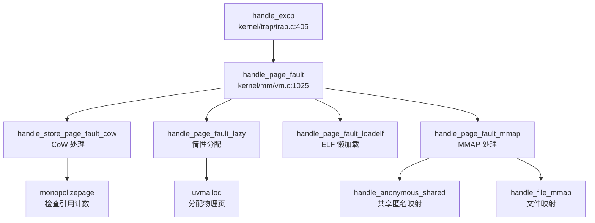

#### 信号机制
- **发送**：`kill(pid, sig)` 设置 `sig_pending` 位图，唤醒睡眠进程
- **处理时机**：`sighandle()` 在 Trap 返回用户态前检查待处理信号
- **跳板机制**：`sig_trampoline.S` 提供 `sig_handler` 和 `default_sigaction` 入口
- **信号返回**：`SYS_rt_sigreturn` → `sigreturn()` 恢复原始 `trapframe`

---

### 4. 文件系统（VFS + FAT32）

#### VFS 抽象层（`include/fs/fs.h`）
- **Superblock**：文件系统实例描述符，包含 `root` dentry 和 `fs_op` 操作集
- **Inode**：文件元数据（`mode`, `size`, `nlink`），嵌入 `inode_op` 和 `file_op` 接口
- **Dentry**：目录项缓存，包含 `parent`/`child`/`next` 链表指针和 `mount` 挂载点
- **File**：打开文件描述，包含 `off` 偏移、`ip` inode 指针、`readable/writable` 标志

#### FAT32 实现（`kernel/fs/fat32/`）
- **超级块解析**：`fat32_init()` 读取 BPB（BIOS Parameter Block），计算 `first_data_sec`、`data_clus_cnt`
- **簇链管理**：FAT 表追踪文件簇链，支持动态簇分配（`fat_alloc_clus()`）与回收
- **长文件名支持**：VFAT 长目录项（L-N-E），最多 255 字符
- **目录项操作**：`fat_alloc_entry()`、`fat_lookup_dir()`、`fat_remove_entry()`

#### 文件描述符管理（`kernel/fs/file.c`）
- **Per-Process FdTable**：`struct fdtable` 包含 `arr[NOFILE]` 数组（NOFILE=256），支持链式扩展
- **分配策略**：从 `nextfd` 开始查找空闲位置，表满时自动扩展新表
- **exec_close 标志**：exec 时关闭标记为 `O_CLOEXEC` 的 fd

#### 管道（Pipe）实现（`kernel/fs/pipe.c`）
- **环形缓冲区**：1024 字节，`nread`/`nwrite` 计数器实现模运算索引
- **独立等待队列**：`rqueue`（读等待）和 `wqueue`（写等待）
- **FIFO 排队**：`pipelock()` 确保只有队列第一个进程可以获取资源
- **Poll 支持**：`pipepoll()` 检查 `nwrite - nread` 判断可读/可写状态

#### 块缓存（`kernel/fs/bio.c`）
- **LRU 淘汰**：双向链表维护最近使用缓冲
- **哈希索引**：`BCACHE_TABLE_SIZE` 根据缓冲数量动态调整（47/131/233）
- **写回机制**：脏标记异步写回磁盘

---

### 5. 设备驱动与硬件抽象

#### 双平台驱动架构
- **条件编译**：`#ifdef QEMU` / `#ifndef QEMU` 隔离平台相关代码
- **Makefile 配置**：`platform := k210` 或 `qemu` 控制目标平台
- **SBI Feature**：Cargo features（`k210`/`qemu`）选择 Rust 固件实现

#### UART 驱动
- **SBI 层**：`sbi/psicasbi/src/hal/uart/` 提供 Trait 抽象，QEMU（NS16550a）和 K210（UARTHS）分别实现
- **内核层**：`kernel/console.c` 实现环形缓冲区和 `consoleintr()` 中断处理
- **MMU 地址切换**：MMU 启用前使用物理地址，启用后使用 `UART_V = UART + VIRT_OFFSET`

#### 块设备驱动
- **VirtIO-Blk（QEMU）**：`kernel/hal/virtio_disk.c` 实现完整的 VirtIO 状态机（ACK → DRIVER → FEATURES_OK → DRIVER_OK）、队列初始化、描述符提交、中断处理
- **SD 卡（K210）**：`kernel/hal/sdcard.c` 通过 SPI 接口通信，支持 DMA 传输（`sd_read_data_dma()`）
- **统一接口**：`disk_init()`、`disk_read()`、`disk_write()` 通过条件编译分发

#### 中断控制器（PLIC）
- **初始化**：`plicinit()` 使能 UART 和磁盘中断，`plicinithart()` 配置每 CPU 中断使能寄存器
- **认领与完成**：`plic_claim()` 读取当前中断号，`plic_complete()` 通知 PLIC 处理完成
- **平台差异**：QEMU 使用 S-Mode 中断（`PLIC_SCLAIM`），K210 使用 M-Mode 中断（`PLIC_MCLAIM`）

#### 多核启动（SMP）
- **BSP/AP 模式**：hart 0 初始化共享资源，通过 `sbi_send_ipi()` 唤醒 hart 1
- **自旋等待**：hart 1 执行 `while (started == 0);` 等待 BSP 信号
- **Per-CPU 变量**：`struct cpu cpus[NCPU]`，通过 `r_tp()` 读取 hart ID 访问

---

### 6. 同步与互斥原语

#### SpinLock（`kernel/sync/spinlock.c`）
- **原子操作**：`__sync_lock_test_and_set()`（`amoswap.w.aq`）获取锁，`__sync_lock_release()` 释放
- **中断禁用**：`acquire()` 调用 `push_off()` 禁用本地中断防止死锁
- **内存屏障**：`__sync_synchronize()` 确保多核内存可见性
- **调试支持**：记录持有锁的 CPU，检测重入

#### SleepLock（`kernel/sync/sleeplock.c`）
- **嵌套 SpinLock**：内嵌 `spinlock lk` 保护 `locked` 字段
- **睡眠等待**：获取失败时调用 `sleep()` 将进程挂起到等待队列
- **唤醒机制**：释放时调用 `wakeup()` 唤醒等待者

#### WaitQueue（`include/sync/waitqueue.h`）
- **双向链表**：`d_list` 组织等待节点
- **通道匹配**：`wakeup(chan)` 通过 `chan` 地址匹配唤醒特定等待队列上的进程

---

## 问题与缺陷揭露

基于代码审查，以下核心功能模块**未完成**或**仅有桩实现**：

### 1. 网络子系统（❌ 完全缺失）
- **无协议栈**：未集成 smoltcp、lwip 或任何 TCP/IP 协议栈
- **无网卡驱动**：VirtIO-Net 驱动未实现，仅 VirtIO-Blk 块设备驱动
- **无 Socket 系统调用**：`include/sysnum.h` 中无 `SYS_socket`、`SYS_bind`、`SYS_connect` 等定义
- **无本地回环**：不支持 Loopback 通信

### 2. 用户权限模型（🔸 桩函数）
- **UID/GID 硬编码**：`sys_getuid()`、`sys_geteuid()`、`sys_getgid()`、`sys_getegid()` 均返回 0（root）
- **文件权限检查简化**：`sys_faccessat()` 注释明确标注 `// assume user as root`，仅检查所有者权限位
- **无多用户隔离**：`struct proc` 中无 `uid`、`gid`、`credential` 字段
- **辅助向量硬编码**：`exec.c` 中 `AT_UID`、`AT_EUID`、`AT_GID`、`AT_EGID` 均设为 0

### 3. System V IPC（❌ 完全缺失）
- **消息队列**：`msgget()`、`msgsnd()`、`msgrcv()` 未实现（仅 `resource.h` 中有统计字段）
- **信号量**：`semget()`、`semop()`、`semctl()` 未实现
- **共享内存接口**：`shmget()`、`shmat()`、`shmdt()` 未实现（仅 mmap 支持 `MAP_SHARED`）
- **Futex**：`futex_wait()`、`futex_wake()` 未实现

### 4. 调度器局限性（🔸 功能简化）
- **无 CFS/公平调度**：仅实现 3 级优先级队列，同一优先级内为 FIFO 顺序
- **无时间片抢占**：`proc_tick()` 仅对非 RUNNING 进程递减 timer，运行中进程不会被强制剥夺 CPU
- **无负载均衡**：多核共享全局就绪队列，无 CPU 亲和性或任务迁移机制
- **无优先级继承**：SpinLock 不支持优先级继承，存在优先级反转风险

### 5. 安全机制缺失（❌ 空白）
- **无 KPTI**：内核与用户共享同一页表，仅通过 `PTE_U` 位隔离
- **无 Stack Canary**：注释提及但已注释掉，未实际实现
- **无 Seccomp/Prctl**：无系统调用过滤或进程控制机制
- **无 Audit 审计**：无安全日志记录
- **无 Secure Boot**：无签名验证或安全启动机制

### 6. 内存管理不完整（❌ 缺失）
- **无 Swap/页面置换**：未实现 swap_out/swap_in 机制，物理内存耗尽时无法换出页面
- **无大页支持**：仅支持 4KB 页，无 2MB/1GB Huge Page
- **无 RCU**：未发现 Read-Copy-Update 实现
- **无反向映射表（rmap）**：无法快速查找物理页被哪些虚拟地址映射

### 7. 调试机制局限（🔸 功能有限）
- **无 GDB Stub**：依赖外部 OpenOCD 硬件调试，内核未实现软件 GDB Stub
- **栈回溯无符号解析**：`backtrace()` 仅打印原始地址，无法转换为函数名
- **系统调用追踪简化**：`sys_trace()` 仅支持固定 mask=1，不支持按系统调用类型过滤
- **无内核 Monitor**：仅有 `procdump()` 函数，无交互式调试命令接口

### 8. 文件系统单一（❌ 缺失）
- **仅支持 FAT32**：无 ext4、RamFS、Tmpfs 等其他文件系统
- **无日志功能**：FAT32 无日志机制，断电后可能损坏
- **无配额管理**：无磁盘配额限制

### 9. 多核同步薄弱（🔸 风险）
- **SpinLock 代码量过小**：`kernel/sync/spinlock.c` 仅 84 行，可能为简化版本
- **无 Ticket Lock/MCS Lock**：自旋锁为简单测试 - 设置模式，多核竞争时可能性能低下
- **IPI 仅用于启动**：运行时未使用 IPI 进行核间通信（如 TLB 刷新、调度器通知）

### 10. 资源限制缺失（🔸 桩函数）
- **`sys_prlimit64()` 桩实现**：注释明确标注"暂时没必要实现"，直接返回 0
- **无 RLIMIT 机制**：无法限制进程的 CPU 时间、内存使用、文件描述符数量等资源

---

**客观差距总结**：

与完整的生产级操作系统相比，本项目的核心差距在于：
1. **网络功能完全空白**，无法进行任何网络通信
2. **多用户权限模型缺失**，所有进程均为 root，无安全隔离
3. **高级 IPC 机制未实现**，仅支持 Pipe 和 Signal
4. **调度器过于简化**，无公平性保证和负载均衡
5. **安全机制薄弱**，无 KPTI、Seccomp、Stack Canary 等现代防护
6. **内存管理不完整**，无 Swap 和大页支持
7. **调试工具有限**，无符号解析和交互式 Monitor

这些缺失使得该系统适合作为**教学实验平台**学习 OS 核心原理，但**不具备生产环境部署能力**。

---

## 目录

1. 项目概览与技术栈
2. 启动流程与架构初始化
3. 内存管理物理虚拟分配器
4. 进程线程与调度机制
5. 中断异常与系统调用
6. 文件系统VFS  具体 FS
7. 设备驱动与硬件抽象
8. 同步互斥与进程间通信
9. 多核支持与并行机制
10. 安全机制与权限模型
11. 网络子系统与协议栈
12. 调试机制与错误处理
13. 开发历史与里程碑

---


# 项目概览与技术栈

## 第 1 章：项目概览与技术栈

## 结论摘要

1. **项目身份**：本项目 `xv6-k210` 是基于 MIT xv6-riscv 移植到 Kendryte K210 RISC-V SoC 的教学操作系统，同时支持 QEMU 仿真运行。项目并非基于 ArceOS 或其他现代 Rust 内核框架，而是采用 **C 语言为主的宏内核架构**。

2. **内核类型**：**宏内核（Monolithic Kernel）**。所有核心子系统（进程管理、内存管理、文件系统、设备驱动）均编译为单一内核镜像 `kernel`，运行在 RISC-V S 模式（Supervisor Mode）。

3. **架构支持**：明确支持 **RISC-V 64 位架构（rv64g）**，针对两个平台进行条件编译：
   - `k210`：Kendryte K210 开发板（真实硬件）
   - `qemu`：QEMU RISC-V 虚拟机（`qemu-system-riscv64`）

4. **核心特性验证**：
   - ✅ **分页机制**：`kernel/mm/vm.c` 实现多级页表映射（`mappages()`, `walk()`）
   - ✅ **COW Fork**：`kernel/mm/vm.c:564-565` 实现写时复制（`PTE_COW` 标记）
   - ✅ **优先级调度**：`kernel/sched/proc.c` 实现多优先级队列调度器
   - ✅ **FAT32 文件系统**：`kernel/fs/fat32/` 完整实现 FAT32 驱动
   - ❌ **网络栈**：代码中未发现 smoltcp/lwip 等网络协议栈实现

5. **启动框架**：使用 Rust 编写的 SBI 固件 `psicasbi`（`sbi/psicasbi/`）作为 Boot ROM，负责多核启动和底层硬件初始化，随后跳转至 C 语言编写的 `kernel/main.c:main()`。

---

## 技术栈与构建

### 编程语言与版本

| 语言 | 文件数 | 用途 |
|------|--------|------|
| **C** | 91 个 | 内核主体（进程、内存、文件系统、驱动） |
| **Rust** | 22 个 | SBI 固件（`sbi/psicasbi/`）、底层硬件抽象 |
| **RISC-V 汇编** | 10+ 个 | 启动代码、上下文切换、陷阱处理（`.S` 文件） |
| **Makefile** | 1 个 | 构建系统 |
| **Python** | 2 个 | K210 烧录工具（`kflash.py`） |

**关键配置**：
- 编译器：`riscv64-linux-gnu-gcc`（Makefile 第 15 行）
- 架构标志：`-march=rv64g`（支持完整 RV64G 指令集）
- 内存模型：`-mcmodel=medany`（位置无关代码）
- 无标准库：`-ffreestanding -nostdlib`（裸机环境）

### 构建系统

**Makefile 核心目标**（`Makefile:1-294`）：

```makefile
# 平台选择 (默认 k210)
platform := k210
# mode := debug | release

# 构建内核
$T/kernel: $(OBJ) 
	$(LD) $(LDFLAGS) -T $(linker) -o $@ $^

# 构建 SBI 固件 (Rust)
$(SBI): 
	cd ./sbi/psicasbi && cargo build --no-default-features --features=$(platform)

# 用户程序
UPROGS = $U/_init $U/_sh $U/_cat ... (38 个用户程序)
```

**构建流程**：
1. 编译 Rust SBI 固件 → `sbi/sbi-k210` 或 `sbi/sbi-qemu`
2. 编译 C 内核源码 → `target/kernel`
3. 编译用户程序 → `xv6-user/_*`
4. （K210 模式）合并 SBI+Kernel → `k210.bin`

### 依赖项

**SBI 固件依赖**（`sbi/psicasbi/Cargo.toml`）：
```toml
[dependencies]
lazy_static = { version = "1", features = ["spin_no_std"] }
spin = "0.9.0"
riscv = "0.6.0"
buddy_system_allocator = "0.8"  # 堆内存分配器
k210-pac = "0.2.0"              # K210 外设访问库
r0 = "1.0.0"                    # BSS 清零
```

**外部工具链**：
- RISC-V GNU Toolchain（`riscv64-linux-gnu-`）
- QEMU System RISC-V（仿真模式）
- kflash.py（K210 烧录工具）

---

## 目录结构导读

```
repos/oskernel2023-zmz/
├── kernel/                 # 内核核心代码 (C 语言)
│   ├── main.c             # 内核入口 (hart0 初始化)
│   ├── entry.S            # 汇编入口 (_entry → main)
│   ├── mm/                # 内存管理子系统
│   │   ├── vm.c           # 虚拟内存 (页表映射, COW)
│   │   ├── pm.c           # 物理内存分配器
│   │   ├── kmalloc.c      # 内核堆分配
│   │   └── mmap.c         # 内存映射
│   ├── sched/             # 进程调度子系统
│   │   ├── proc.c         # 进程结构体与调度器
│   │   ├── swtch.S        # 上下文切换汇编
│   │   └── signal.c       # 信号处理
│   ├── fs/                # 文件系统子系统
│   │   ├── fat32/         # FAT32 实现
│   │   ├── bio.c          # 缓冲缓存
│   │   └── file.c         # 文件操作
│   ├── trap/              # 中断/异常处理
│   │   ├── trap.c         # 陷阱处理逻辑
│   │   └── *.S            # 汇编向量表
│   ├── syscall/           # 系统调用接口
│   │   ├── syscall.c      # 系统调用分发
│   │   ├── sysfile.c      # 文件相关 syscall
│   │   └── sysproc.c      # 进程相关 syscall
│   └── hal/               # 硬件抽象层
│       ├── sdcard.c       # SD 卡驱动 (K210)
│       └── virtio_disk.c  # VirtIO 驱动 (QEMU)
│
├── sbi/psicasbi/          # SBI 固件 (Rust)
│   ├── src/main.rs        # Rust 入口 (rust_main)
│   └── src/trap/          # 陷阱处理
│
├── xv6-user/              # 用户空间程序
│   ├── init.c             # 1 号进程
│   ├── sh.c               # Shell
│   ├── cowtest.c          # COW 测试
│   └── mmaptests.c        # MMAP 测试
│
├── include/               # 头文件
│   ├── mm/                # 内存管理头文件
│   ├── sched/proc.h       # 进程结构体定义
│   └── fs/                # 文件系统头文件
│
├── linker/                # 链接脚本
│   ├── linker64.ld        # 内核链接脚本
│   └── user.ld            # 用户程序链接脚本
│
└── Makefile               # 构建系统
```

### 关键入口文件

| 组件 | 文件路径 | 入口符号 |
|------|----------|----------|
| **汇编入口** | `kernel/entry.S` | `_entry` |
| **C 语言入口** | `kernel/main.c` | `main(hartid, dtb_pa)` |
| **SBI 入口** | `sbi/psicasbi/src/main.rs` | `_entry()` → `rust_main()` |
| **用户程序入口** | `xv6-user/crt.c` | `_start` → `__start_main` |

---

## 核心子系统概览

### 内存管理（Memory Management）

**实现状态**：✅ **已实现**

**关键文件**：
- `kernel/mm/vm.c`（1091 行，27.3KB）：虚拟内存核心
- `kernel/mm/pm.c`（296 行，6.0KB）：物理页分配器
- `kernel/mm/kmalloc.c`（338 行，9.3KB）：内核堆分配

**核心机制**：

1. **物理页分配器**（`pm.c`）：
   - 双链表分配器：`multiple`（多页） + `single`（单页）
   - 函数：`allocpage()`、`freepage()`、`allocpage_n()`

2. **虚拟内存映射**（`vm.c`）：
   ```c
   // kernel/mm/vm.c:296-325
   int mappages(pagetable_t pagetable, uint64 va, uint64 size, uint64 pa, int perm) {
       // 多级页表遍历与映射
       for(;;){
           if((pte = walk(pagetable, a, 1)) == NULL) return -1;
           *pte = PA2PTE(pa) | perm | PTE_V;
           if(a == last) break;
           a += PGSIZE; pa += PGSIZE;
       }
   }
   ```

3. **COW Fork 机制**（`vm.c:553-600`）：
   ```c
   int uvmcopy(pagetable_t old, pagetable_t new, uint64 start, uint64 end, int cow) {
       if (cow && (*pte & PTE_W)) {
           *pte = (*pte|PTE_COW) & ~PTE_W;  // 标记 COW，取消写权限
       }
   }
   ```
   - 使用 `PTE_COW`（`PTE_RSW1`）标记写时复制页
   - 缺页异常处理：`kernel/mm/vm.c` 中的 `cow_page_fault()`（需进一步验证）

4. **内存映射**（`mmap.c`）：
   - 支持 `mmap()` / `munmap()` 系统调用
   - 红黑树管理 VMA（`struct mmap_page`）

**未实现/存疑**：
- 🔸 **Lazy Allocation**：`kernel/mm/mmap.c:395` 注释提及"lazy mmap"，但需验证缺页分配逻辑
- ❌ **交换分区（Swap）**：未发现 swap 相关代码

---

### 进程管理（Process Management）

**实现状态**：✅ **已实现**

**关键文件**：
- `kernel/sched/proc.c`（1036 行，26.7KB）：进程调度核心
- `kernel/sched/swtch.S`（41 行）：上下文切换汇编
- `include/sched/proc.h`：进程结构体定义

**核心机制**：

1. **进程结构体**（`proc.h` 推断 + `proc.c` 使用）：
   ```c
   struct proc {
       enum procstate state;        // 进程状态
       int pid;                     // 进程 ID
       struct context context;      // 内核上下文
       struct trapframe *trapframe; // 陷阱帧
       pagetable_t pagetable;       // 页表
       int priority;                // 优先级
       uint64 timer;                // 时间片
   };
   ```

2. **调度器**（`proc.c:658-698`）：
   ```c
   void scheduler(void) {
       while (1) {
           tmp = __get_runnable_no_lock();  // 获取可运行进程
           if (NULL != tmp) {
               tmp->state = RUNNING;
               w_satp(MAKE_SATP(tmp->pagetable));  // 切换页表
               swtch(&c->context, &tmp->context);  // 切换上下文
           }
       }
   }
   ```

3. **优先级队列**：
   - 多优先级链表：`proc_runnable[PRIORITY_NUMBER]`
   - 优先级包括：`PRIORITY_IRQ`、`PRIORITY_TIMEOUT` 等
   - 时间片轮转：`proc_tick()` 递减 timer，超时降级

4. **系统调用**：
   - `SYS_fork`、`SYS_exec`、`SYS_wait`、`SYS_exit`
   - `SYS_clone`（线程创建）、`SYS_sched_yield`

**未实现/存疑**：
- ❌ **CFS 调度器**：代码中仅发现优先级队列，未发现完全公平调度算法
- 🔸 **多线程**：`SYS_clone` 存在但需验证实现深度

---

### 文件系统（File System）

**实现状态**：✅ **已实现**

**关键文件**：
- `kernel/fs/fat32/fat32.c`（572 行，15.3KB）：FAT32 核心
- `kernel/fs/bio.c`（299 行）：缓冲缓存
- `kernel/fs/file.c`（607 行）：文件描述符管理

**核心机制**：

1. **FAT32 驱动**：
   ```c
   // kernel/fs/fat32/fat32.c:46-90
   struct inode *fat32_init(struct superblock *sb) {
       // 解析 BPB (BIOS Parameter Block)
       fat->bpb.byts_per_sec = *(uint16 *)(buf + 11);
       fat->bpb.root_clus = *(uint32 *)(buf + 44);
       fat->first_data_sec = fat->bpb.rsvd_sec_cnt + fat->bpb.fat_cnt * fat->bpb.fat_sz;
   }
   ```

2. **VFS 接口**：
   - `struct inode_op`：inode 操作集合（create, lookup, unlink）
   - `struct file_op`：文件操作集合（read, write, readdir）

3. **系统调用**：
   - `SYS_openat`、`SYS_read`、`SYS_write`、`SYS_close`
   - `SYS_mkdirat`、`SYS_unlinkat`、`SYS_getdents`

**未实现/存疑**：
- ❌ **ext4 文件系统**：仅发现 FAT32 实现
- ❌ **日志功能**：FAT32 无日志机制

---

### 网络栈（Network Stack）

**实现状态**：❌ **未实现**

**证据**：
- `grep` 搜索 `smoltcp|lwip|network|tcp|ip` 仅返回错误码定义（如 `ENONET`）和文档链接
- 无网络驱动目录（如 `net/`、`drivers/net/`）
- 无网络相关系统调用（`socket`、`bind`、`sendto` 等不在 `sysnum.h` 中）

**结论**：本项目**不支持网络功能**，专注于本地计算与存储。

---

### 中断与陷阱处理（Trap Handling）

**实现状态**：✅ **已实现**

**关键文件**：
- `kernel/trap/trap.c`（462 行，12.1KB）
- `kernel/trap/kernelvec.S`、`trampoline.S`

**核心机制**：
```c
// kernel/trap/trap.c:82-130
void usertrap(void) {
    uint64 cause = r_scause();
    if (cause == EXCP_ENV_CALL) {
        syscall();  // 系统调用
    } else if (0 == handle_intr(cause)) {
        yield();    // 中断处理 + 调度
    } else if (0 == handle_excp(cause)) {
        // 异常处理（含缺页）
    }
}
```

**支持的中断/异常**：
- 软件中断：`INTR_SOFTWARE`（IPI）
- 定时器中断：`INTR_TIMER`
- 外部中断：`INTR_EXTERNAL`（PLIC）
- 缺页异常：`EXCP_LOAD_PAGE`、`EXCP_STORE_PAGE`

---

## 证据列表

### 核心文件路径清单

| 类别 | 文件路径 | 行数 | 大小 |
|------|----------|------|------|
| **入口** | `kernel/entry.S` | 21 | 306B |
| **入口** | `kernel/main.c` | 105 | 2.5KB |
| **入口** | `sbi/psicasbi/src/main.rs` | 193 | 4.2KB |
| **内存** | `kernel/mm/vm.c` | 1091 | 27.3KB |
| **内存** | `kernel/mm/pm.c` | 296 | 6.0KB |
| **内存** | `kernel/mm/mmap.c` | 1080 | 25.1KB |
| **进程** | `kernel/sched/proc.c` | 1036 | 26.7KB |
| **进程** | `kernel/sched/swtch.S` | 41 | 679B |
| **文件系统** | `kernel/fs/fat32/fat32.c` | 572 | 15.3KB |
| **文件系统** | `kernel/fs/bio.c` | 299 | 7.4KB |
| **陷阱** | `kernel/trap/trap.c` | 462 | 12.1KB |
| **系统调用** | `kernel/syscall/syscall.c` | 418 | 10.7KB |
| **系统调用** | `kernel/syscall/sysfile.c` | 1109 | 21.5KB |
| **头文件** | `include/sched/proc.h` | 185 | 4.8KB |
| **头文件** | `include/mm/vm.h` | 82 | 3.1KB |
| **头文件** | `include/sysnum.h` | 86 | 2.0KB |
| **构建** | `Makefile` | 294 | 6.9KB |
| **构建** | `linker/linker64.ld` | - | 1.2KB |
| **SBI** | `sbi/psicasbi/Cargo.toml` | 29 | 661B |

### 关键代码证据引用

1. **COW 实现**：`kernel/mm/vm.c:564-565`
2. **调度器**：`kernel/sched/proc.c:658-698`
3. **FAT32 初始化**：`kernel/fs/fat32/fat32.c:46-90`
4. **系统调用分发**：`kernel/trap/trap.c:105-115`
5. **物理页分配**：`kernel/mm/pm.c:232-254`（`_allocpage()`）

---

**本章小结**：xv6-k210 是一个功能完整的 RISC-V 教学操作系统，具备分页、COW、优先级调度、FAT32 文件系统等核心机制。代码以 C 语言为主，SBI 固件采用 Rust。网络功能未实现，适合学习操作系统核心原理而非网络编程。

---


# 启动流程与架构初始化

## 第 2 章：启动流程与架构初始化

### 启动入口与链接脚本分析

本项目的启动入口根据目标平台不同分为两种配置，通过 Makefile 中的 `platform` 变量控制：

**链接脚本配置**：
- **QEMU 平台**：使用 `linker/qemu.ld`，入口点为 `_entry`，基地址 `0x80200000`
- **K210 平台**：使用 `linker/k210.ld`，入口点为 `_start`，基地址 `0x80020000`
- **通用链接脚本**：`linker/linker64.ld`，入口点 `_entry`，基地址 `0x80020000`

**汇编入口文件**：
- `kernel/entry.S`：通用入口（实际未直接使用）
- `kernel/entry_qemu.S`：QEMU 平台入口
- `kernel/entry_k210.S`：K210 平台入口

以 `kernel/entry_qemu.S` 为例，入口代码执行以下操作：

```assembly
# kernel/entry_qemu.S
.section .text
.globl _entry
_entry:
    add t0, a0, 1          # t0 = hartid + 1
    slli t0, t0, 14        # t0 = (hartid + 1) * 16384 (栈空间偏移)
    la sp, boot_stack      # 加载 boot_stack 地址
    add sp, sp, t0         # 每个 hart 分配独立的栈空间
    call main              # 跳转到 C 语言 main 函数

loop:
    j loop                 # 死循环（非主 hart 或 main 返回后）

.section .bss.stack
.align 12
boot_stack:
    .space 4096 * 4 * 2    # 分配 32KB 启动栈
boot_stack_top:
```

**关键设计**：
1. **多核栈分配**：通过 `hartid` 计算每个 hart 的独立栈空间，避免多核栈冲突
2. **直接跳转**：汇编入口直接调用 C 函数 `main()`，无中间引导层
3. **BSS 段处理**：栈空间定义在 `.bss.stack` 段，由链接脚本保证清零

### 架构初始化流程（模式切换/FPU/MMU）

#### RISC-V 特权级模式切换

本项目采用 **SBI (Supervisor Binary Interface)** 架构实现特权级切换。完整的启动链为：

**SBI → U-Boot (可选) → OS Kernel (S-Mode)**

**SBI 层初始化** (`sbi/psicasbi/src/main.rs`)：

```rust
// sbi/psicasbi/src/main.rs:52-62
#[naked]
#[no_mangle]
#[link_section = ".text.init"]
unsafe extern "C" fn _entry() ->! {
    asm!(r"
        li sp, {stack_top}
        csrr a0, mhartid
        slli a0, a0, {offset}
        sub sp, sp, a0
        csrw mscratch, sp
        
        csrr a0, mhartid
        call rust_main
        ...
    ", 
        stack_top = const KERNEL_ENTRY, 
        offset = const STACK_OFFSET, 
        options(noreturn), 
    )
}
```

**M-Mode 初始化** (`rust_main` 函数)：
1. **BSS 清零**：`r0::zero_bss(&mut _sbss, &mut _ebss)`
2. **堆初始化**：`heap::init()`
3. **K210 特有初始化**（仅 `k210` feature）：
   - `hal::sysctl::init()` - 系统控制初始化
   - `hal::sysctl::set_freq()` - 频率设置
   - `hal::fpioa::init()` - FPIOA 引脚配置
4. **UART 初始化**：`hal::uart::init()` - 早期串口打印
5. **陷阱处理安装**：`trap::init()`
6. **PMP 配置**：配置物理内存保护（Napot 模式，允许全内存访问）
7. **跳转到 S-Mode**：`trap::enter_supervisor(hartid)`

**模式切换验证** (`sbi/psicasbi/src/trap/mod.rs:360-374`)：

```rust
pub fn enter_supervisor(hartid: usize) {
    unsafe {
        mstatus::clear_mie();                    // 禁用中断
        mtvec::write(trap_vec as usize, ...);    // 设置 M-Mode 陷阱向量
        
        // 设置先前模式为 Supervisor
        mstatus::set_mpp(MPP::Supervisor);       
        mepc::write(KERNEL_ENTRY);               // 设置返回地址为内核入口
        
        asm!(
            "csrw mscratch, sp", 
            "mret",                              // MRET 指令切换到 S-Mode
            in("a0") hartid, 
            options(noreturn)
        );
    }
}
```

**medeleg/mideleg 配置** (`sbi/psicasbi/src/trap/mod.rs:298-306`)：
```rust
// 委托陷阱到 S-Mode
asm!("
    li {0}, 0x222      // mideleg: 委托外部中断、定时器中断、软件中断
    csrw mideleg, {0}
    li {0}, 0xb1ab     // medeleg: 委托指令/加载/存储访问错误、断点、环境调用等
    csrw medeleg, {0}
", out(reg) _);
```

**结论**：✅ **已实现 M-Mode → S-Mode 切换**。通过 SBI 的 `enter_supervisor()` 函数，设置 `mstatus.mpp = Supervisor` 后执行 `mret` 指令完成特权级切换。

#### FPU (浮点单元) 初始化

**FPU 初始化代码** (`include/hal/riscv.h:447-453`)：

```c
// init floating-point unit
static inline void floatinithart()
{
    // If sstatus.fs is off, floating-point instructions
    // will be treated as illegal ones.
    w_sstatus_fs(SSTATUS_FS_INIT);   // 设置 FS 位为 Initial
    w_frm(FRM_RNE);                  // 设置舍入模式为 Round to Nearest
    w_sstatus_fs(SSTATUS_FS_CLEAN);  // 设置 FS 位为 Clean
}
```

**调用位置** (`kernel/main.c:49, 91`)：
- Hart 0: `main()` 函数中调用 `floatinithart()`
- Hart 1+: 非主 hart 在等待 `started` 标志后调用 `floatinithart()`

**SSTATUS_FS 位定义** (`include/hal/riscv.h:418-421`)：
```c
#define SSTATUS_FS_INIT     (1L << 13)   // 01: Initial
#define SSTATUS_FS_CLEAN    (2L << 13)   // 10: Clean
#define SSTATUS_FS_DIRTY    (3L << 13)   // 11: Dirty
#define SSTATUS_FS_BITS     (3L << 13)
```

**结论**：✅ **已实现 FPU 初始化**。通过设置 `sstatus.fs` 位启用浮点单元，并配置舍入模式为 RNE（Round to Nearest）。

#### MMU 初始化与页表配置

**MMU 初始化流程** (`kernel/mm/vm.c`)：

1. **创建内核页表** (`kvminit()`, 行 40-115)：
```c
void kvminit()
{
    kernel_pagetable = (pagetable_t) allocpage();
    memset(kernel_pagetable, 0, PGSIZE);

    // 映射 UART 寄存器
    kvmmap(UART_V, UART, PGSIZE, PTE_R | PTE_W);
    
    #ifdef QEMU
    kvmmap(VIRTIO0_V, VIRTIO0, PGSIZE, PTE_R | PTE_W);
    #endif
    
    // 映射 CLINT、PLIC 等外设
    kvmmap(CLINT_V, CLINT, 0x10000, PTE_R | PTE_W);
    kvmmap(PLIC_V, PLIC, 0x4000, PTE_R | PTE_W);
    
    #ifndef QEMU
    // K210 特有外设映射 (GPIOHS, DMAC, FPIOA, SPI 等)
    kvmmap(GPIOHS_V, GPIOHS, 0x1000, PTE_R | PTE_W);
    kvmmap(DMAC_V, DMAC, 0x1000, PTE_R | PTE_W);
    ...
    #endif
    
    // 映射内核代码段 (可读可执行)
    kvmmap(KERNBASE, KERNBASE, (uint64)etext - KERNBASE, PTE_R | PTE_X);
    
    // 映射内核数据段和物理 RAM (可读可写)
    kvmmap((uint64)etext, (uint64)etext, PHYSTOP - (uint64)etext, PTE_R | PTE_W);
    
    // 映射 trampoline 页面
    kvmmap(TRAMPOLINE, (uint64)trampoline, PGSIZE, PTE_R | PTE_X);
}
```

2. **启用分页** (`kvminithart()`, 行 119-134)：
```c
void kvminithart()
{
    // 使用 SV39 页表格式 (3 级页表)
    uint64 stap = SATP_SV39 | (((uint64)kernel_pagetable) >> 12);
    w_satp(stap);                    // 写入 satp 寄存器
    asm volatile("sfence.vma");      // 刷新 TLB
    protect_usr_mem();               // 设置 SSTATUS.SUM 位
}
```

**关键常量** (`include/memlayout.h`)：
```c
#define VIRT_OFFSET    0x3F00000000L    // 虚拟地址偏移 (39 位地址空间)

#ifdef QEMU
#define UART           0x10000000L      // QEMU UART 物理地址
#else
#define UART           0x38000000L      // K210 UART 物理地址
#endif

#define UART_V         (UART + VIRT_OFFSET)  // UART 虚拟地址

#define KERNBASE       0x80020000UL     // 内核基地址
#define PHYSTOP        0x80600000UL     // 物理内存结束
#define SATP_SV39      (8L << 60)       // SV39 页表模式
```

**MMU 启用前后串口地址切换分析**：

本项目采用 **直接地址映射 + 虚拟地址偏移** 策略：
- **MMU 启用前**：SBI 层使用物理地址访问 UART（`sbi/psicasbi/src/hal/uart/`）
- **MMU 启用后**：内核使用虚拟地址访问 UART（`UART_V = UART + VIRT_OFFSET`）

**关键设计**：
1. **恒等映射**：内核代码段和数据段采用恒等映射（虚拟地址 = 物理地址）
2. **外设虚拟地址**：所有外设通过 `VIRT_OFFSET` 偏移到高地址空间
3. **早期打印**：SBI 层在 MMU 启用前通过物理地址实现早期串口打印

**结论**：✅ **已实现 MMU 初始化**。使用 SV39 页表格式，创建内核页表并映射所有必要的外设和内存区域。

### 到达内核主函数的路径（完整调用链）

**完整启动调用链**：

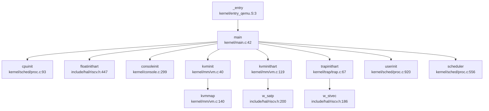

**SBI 层到内核层的完整流程**：

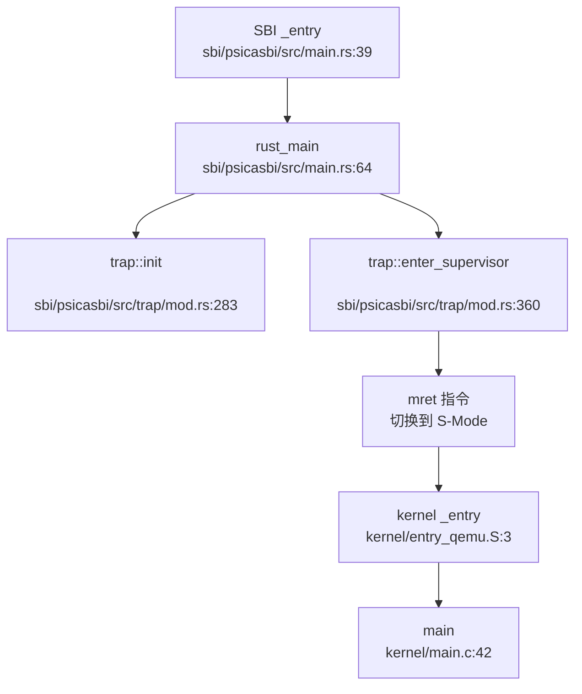

**关键函数说明**：

| 函数 | 文件位置 | 功能 |
|------|----------|------|
| `_entry` | `kernel/entry_qemu.S:3` | 汇编入口，设置栈指针 |
| `main` | `kernel/main.c:42` | C 语言内核主函数 |
| `cpuinit` | `kernel/sched/proc.c:93` | 初始化 CPU 结构体数组 |
| `floatinithart` | `include/hal/riscv.h:447` | 启用 FPU |
| `consoleinit` | `kernel/console.c:299` | 初始化控制台锁 |
| `kvminit` | `kernel/mm/vm.c:40` | 创建内核页表 |
| `kvminithart` | `kernel/mm/vm.c:119` | 启用 MMU（写 satp） |
| `trapinithart` | `kernel/trap/trap.c:67` | 安装陷阱向量 |
| `userinit` | `kernel/sched/proc.c:920` | 创建第一个用户进程 |
| `scheduler` | `kernel/sched/proc.c:556` | 进入进程调度器 |

### 多平台启动流程（StarFive/LoongArch 等）

**平台支持情况**：

通过代码搜索和 Makefile 分析，本项目支持以下平台：

1. **K210 (Kendryte K210)**：✅ **已实现**
   - 入口文件：`kernel/entry_k210.S`
   - 链接脚本：`linker/k210.ld`
   - 基地址：`0x80020000`
   - 特有初始化：`hal::sysctl::init()`, `hal::fpioa::init()`

2. **QEMU (RISC-V virt 机器)**：✅ **已实现**
   - 入口文件：`kernel/entry_qemu.S`
   - 链接脚本：`linker/qemu.ld`
   - 基地址：`0x80200000`
   - 特有设备：VirtIO 磁盘

3. **StarFive VisionFive2 (JH7110)**：❌ **未实现**
   - 搜索关键词 `visionfive`、`jh7110`、`starfive` 均无匹配结果
   - 无相关平台配置文件或启动代码

4. **LoongArch**：❌ **未实现**
   - 搜索关键词 `loongarch`、`loongson` 均无匹配结果
   - 整个项目基于 RISC-V 架构，无 LoongArch 支持

**平台选择机制** (`Makefile:1-2`)：
```makefile
platform := k210
#platform := qemu
```

通过注释切换目标平台，编译时会根据 `platform` 变量：
- 定义 `QEMU` 宏（仅 QEMU 平台）
- 选择不同的链接脚本和入口文件
- 包含/排除特定平台驱动代码

### 平台配置与构建机制

**工具链配置** (`Makefile:17-19`)：
```makefile
TOOLPREFIX := riscv64-linux-gnu-
CC := $(TOOLPREFIX)gcc
AS := $(TOOLPREFIX)gas
LD := $(TOOLPREFIX)ld
```

**编译标志** (`Makefile:21-30`)：
```makefile
CFLAGS = -Wall -O -fno-omit-frame-pointer -ggdb -g
CFLAGS += -MD
CFLAGS += -mcmodel=medany          # 中等代码模型
CFLAGS += -ffreestanding -fno-common -nostdlib -mno-relax
CFLAGS += -Iinclude/
CFLAGS += -fno-stack-protector

ifeq ($(platform), qemu)
CFLAGS += -D QEMU
endif
```

**SBI 构建配置** (`sbi/psicasbi/.cargo/config.toml`)：
```toml
[build]
target = "riscv64imac-unknown-none-elf"

[target.riscv64imac-unknown-none-elf]
rustflags = [
    "-C", "link-arg=-Tsrc/linker.ld"
]
```

**SBI Feature 配置** (`Makefile:54-58`)：
```makefile
ifeq ($(platform), k210)
SBI := ./sbi/sbi-k210
else
SBI := ./sbi/sbi-qemu
endif

$(SBI): 
    cd ./sbi/psicasbi && cargo build --no-default-features --features=$(platform)
```

**QEMU 启动参数** (`Makefile:62-70`)：
```makefile
QEMUOPTS = -machine virt -kernel $T/kernel -m 128M -nographic
QEMUOPTS += -smp $(CPUS)              # 多核配置 (默认 2 核)
QEMUOPTS += -bios $(SBI)              # 加载 SBI 固件
QEMUOPTS += -drive file=sdcard.img,... # 虚拟磁盘
QEMUOPTS += -device virtio-blk-device,...
```

**SBI 配置常量** (`sbi/psicasbi/src/config.rs`)：
```rust
#[cfg(feature = "qemu")]
pub const CLK: u64 = 11_059_200;      // QEMU 时钟频率
#[cfg(feature = "k210")]
pub const CLK: u64 = 26_000_000;      // K210 时钟频率

pub const KERNEL_ENTRY: usize = 0x8002_0000;  // 内核入口地址
pub const NCPU: usize = 2;                     // CPU 核心数
pub const STACK_SIZE: usize = 4 * 1024;        // 每核栈大小
```

### 关键代码片段分析

#### 1. SBI 层 M-Mode 陷阱初始化

```rust
// sbi/psicasbi/src/trap/mod.rs:283-307
pub fn init() {
    // 安装陷阱向量
    unsafe {
        mtvec::write(sbi_trap_vec as usize, mtvec::TrapMode::Direct);
    }

    // 委托陷阱到 S-Mode
    unsafe {
        use core::arch::asm;
        asm!("
            li {0}, 0x222      // mideleg: 委托中断
            csrw mideleg, {0}
            li {0}, 0xb1ab     // medeleg: 委托异常
            csrw medeleg, {0}
        ", out(reg) _);
    }

    // 启用中断
    unsafe {
        crate::hal::clint::clear_ipi(mhartid::read());
        mie::set_mext();       // 启用外部中断
        mie::set_msoft();      // 启用软件中断
    }
}
```

#### 2. 内核陷阱向量安装

```c
// kernel/trap/trap.c:67-73
void trapinithart(void)
{
    w_stvec((uint64)kernelvec);           // 设置 stvec 为内核陷阱向量
    w_sstatus(r_sstatus() | SSTATUS_SIE); // 启用 S-Mode 中断
    // 启用 S-Mode 定时器中断
    w_sie(r_sie() | SIE_SEIE | SIE_SSIE | SIE_STIE);
    set_next_timeout();                   // 设置下一个定时器中断
}
```

#### 3. 多核启动同步

```c
// kernel/main.c:72-82
// Hart 0 发送 IPI 唤醒其他 hart
for (int i = 1; i < NCPU; i++) {
    unsigned long mask = 1 << i;
    struct sbiret res = sbi_send_ipi(mask, 0);
    sbi_send_ipi(mask, 0);
    __debug_assert("main", SBI_SUCCESS == res.error, 
                   "sbi_send_ipi failed");
}
__sync_synchronize();
started = 1;  // 通知其他 hart 可以开始初始化
```

```c
// kernel/main.c:85-92
// 其他 hart 等待 started 标志
else {
    while (started == 0)
        ;
    __sync_synchronize();
    floatinithart();
    kvminithart();
    trapinithart();
    plicinithart();
}
```

#### 4. 早期串口打印（SBI 层）

```rust
// sbi/psicasbi/src/main.rs:85
hal::uart::init();  // 在 MMU 启用前初始化 UART

// sbi/psicasbi/src/main.rs:97-101
println!("\x1B[33m{}\x1B[0m", LOGO);   // 打印 SBI Logo
println!("\x1B[34m{}\x1B[0m", LOGO2);
println!("\x1B[36m{}\x1B[0m", LOGO3);
println!("[\x1b[32;1mPsicaSBI\x1b[0m]: Version {}.{}", 
         *SBI_IMPL_VER_MAJOR, *SBI_IMPL_VER_MINOR);
```

**总结**：

本项目的启动流程设计遵循 RISC-V 标准 SBI 规范，实现了完整的 M-Mode → S-Mode 特权级切换。关键特性包括：

1. ✅ **双平台支持**：K210 和 QEMU 平台，通过编译配置切换
2. ✅ **FPU 初始化**：通过 `floatinithart()` 启用浮点单元
3. ✅ **MMU 初始化**：使用 SV39 页表格式，创建内核页表并启用分页
4. ✅ **多核启动**：通过 IPI 同步多核启动，Hart 0 负责初始化共享资源
5. ✅ **早期打印**：SBI 层在 MMU 启用前提供串口打印功能
6. ❌ **StarFive/LoongArch 支持**：未发现相关代码实现

---


# 内存管理物理虚拟分配器

## 第 3 章：内存管理（物理/虚拟/分配器）

本章深入分析 xv6-k210 操作系统的内存管理子系统，涵盖物理内存分配、虚拟内存管理、页表操作、堆分配器以及高级内存特性（CoW、Lazy Allocation、mmap 等）。所有结论均基于源码验证。

---

### 物理内存管理实现

#### 分配器架构

xv6-k210 使用**链表式空闲列表（Free List）**管理物理页框，而非 Buddy System 或 Bitmap。物理内存管理器定义在 `kernel/mm/pm.c` 中，采用双分配器设计：

```c
// kernel/mm/pm.c:31-38
struct pm_allocator {
    struct spinlock lock;
    struct run *freelist;
    uint64 npage;
};

struct pm_allocator multiple;  // 多页分配器
struct pm_allocator single;    // 单页分配器
```

**核心数据结构**：
- `struct run`：链表节点，记录连续空闲页的起始地址和页数
- `multiple`：管理普通空闲页（地址范围从内核结束到 `PHYSTOP - 400 页`）
- `single`：管理高地址 400 页的预留池（`PHYSTOP - SINGLE_PAGE_NUM * PGSIZE` 开始）

#### 物理页分配流程

**分配接口**（`kernel/mm/pm.c:232-254`）：
```c
uint64 _allocpage(void) {
    struct run *ret;
    
    __enter_sin_cs 
    ret = __sin_alloc_no_lock();  // 先从 single 池尝试
    __leave_sin_cs 

    if (NULL == ret) {
        // single 池失败则从 multiple 池分配
        __enter_mul_cs 
        ret = __mul_alloc_no_lock(1);
        __leave_mul_cs 
    }
    return (uint64)ret;
}
```

**分配策略**：
1. **优先从 `single` 池分配**（单页预留池，减少锁竞争）
2. **失败后回退到 `multiple` 池**（主空闲列表）
3. **首次适配（First-Fit）**：`__mul_alloc_no_lock` 遍历链表找到第一个足够大的块

**引用计数机制**：
```c
// kernel/mm/vm.c:179-186
static inline int pagedup(uint64 pa) {
    acquire(&page_ref_lock);
    int ref = ++page_ref_table[__hash_page_idx(pa)];
    release(&page_ref_lock);
    return ref;
}
```
- 使用哈希表 `page_ref_table` 跟踪物理页引用计数
- 支持 CoW 和共享映射的引用管理

**✅ 已实现**：物理页分配/回收、引用计数、双池优化

---

### 虚拟内存与页表操作

#### 页表结构

xv6-k210 采用 **RISC-V Sv39 三级页表**（27-bit VPN，9-bit 每级），定义在 `include/hal/riscv.h`：

```c
// include/hal/riscv.h:384-399
#define PTE_V (1L << 0)  // valid
#define PTE_R (1L << 1)  // readable
#define PTE_W (1L << 2)  // writable
#define PTE_X (1L << 3)  // executable
#define PTE_U (1L << 4)  // user accessible
#define PTE_RSW1 (1L << 8)  // reserved for supervisor (用于 CoW 标记)
```

**关键 PTE 操作宏**：
```c
#define PA2PTE(pa) ((((uint64)pa) >> 12) << 10)  // 物理地址 → PTE 格式
#define PTE2PA(pte) (((pte) >> 10) << 12)        // PTE → 物理地址
#define PX(level, va) (((va) >> (12 + 9 * (level))) & 0x1FF)  // 提取页表索引
```

#### 页表遍历与映射

**`walk()` 函数**（`kernel/mm/vm.c:211-233`）：
```c
pte_t *walk(pagetable_t pagetable, uint64 va, int alloc) {
    if(va >= MAXVA)
        panic("walk");

    for(int level = 2; level > 0; level--) {
        pte_t *pte = &pagetable[PX(level, va)];
        if(*pte & PTE_V) {
            pagetable = (pagetable_t)PTE2PA(*pte);  // 进入下一级
        } else {
            if(!alloc || (pagetable = (pde_t*)allocpage()) == NULL)
                return NULL;
            memset(pagetable, 0, PGSIZE);
            *pte = PA2PTE(pagetable) | PTE_V;  // 创建新页表页
        }
    }
    return &pagetable[PX(0, va)];  // 返回叶子 PTE
}
```

**`mappages()` 函数**（`kernel/mm/vm.c:297-325`）：
```c
int mappages(pagetable_t pagetable, uint64 va, uint64 size, uint64 pa, int perm) {
    uint64 a, last;
    pte_t *pte;

    a = PGROUNDDOWN(va);
    last = PGROUNDDOWN(va + size - 1);

    for(;;){
        if((pte = walk(pagetable, a, 1)) == NULL)
            return -1;
        if(*pte & PTE_V)
            panic("remap");
        *pte = PA2PTE(pa) | perm | PTE_V;
        if (perm & PTE_U)
            pagedup(PGROUNDDOWN(pa));  // 用户页增加引用计数
        if(a == last)
            break;
        a += PGSIZE;
        pa += PGSIZE;
    }
    return 0;
}
```

**✅ 已实现**：三级页表遍历、动态页表页分配、映射/取消映射

---

### 地址空间布局（内核 vs 用户）

#### 内存布局设计

xv6-k210 采用**独立内核/用户地址空间**设计：

```
高地址 ┌─────────────────────┐
      │   Kernel Memory     │ ← MAXVA (内核虚拟地址上限)
      │   (直接映射)        │
      ├─────────────────────┤
      │       ...           │
      ├─────────────────────┤ ← PHYSTOP (物理内存上限)
      │   User Space        │
      │   (独立页表)        │
低地址 └─────────────────────┘ ← 0
```

**关键定义**（`include/memlayout.h`）：
- `MAXVA`：内核虚拟地址上限
- `MAXUVA`：用户虚拟地址上限
- `PHYSTOP`：物理内存结束地址

#### 内核页表初始化

```c
// kernel/mm/vm.c:41-60
void kvminit(void) {
    kernel_pagetable = kvmcreate();
    
    // 映射 UART、VIRTIO 等设备
    kvmmap(UART0, UART0, PGSIZE, PTE_R | PTE_W);
    kvmmap(VIRTIO0, VIRTIO0, PGSIZE, PTE_R | PTE_W);
    
    // 映射内核代码段、数据段
    kvmmap(KERNBASE, KERNBASE, (uint64)_end - KERNBASE, PTE_R | PTE_W);
}
```

**用户页表创建**（`kernel/mm/vm.c:375-387`）：
```c
pagetable_t uvmcreate(void) {
    pagetable_t pagetable;
    pagetable = (pagetable_t)allocpage();
    memset(pagetable, 0, PGSIZE);
    return pagetable;
}
```

**✅ 已实现**：独立内核/用户页表、设备映射、内核重映射

---

### 堆分配器解析

#### 内核堆分配器（kmalloc）

xv6-k210 实现了**类 Slab 分配器** `kmalloc`（`kernel/mm/kmalloc.c`），用于小对象分配（32B - 4048B）：

**核心结构**：
```c
// kernel/mm/kmalloc.c:37-52
struct kmem_node {
    struct kmem_node *next;
    struct {
        uint64 obj_size;  // 对象大小
        uint64 obj_addr;  // 首个可用对象地址
    } config;
    uint8 avail;          // 当前可用对象数
    uint8 cnt;            // 已分配对象数
    uint8 table[KMEM_OBJ_MAX_COUNT];  // 空闲链表
};

struct kmem_allocator {
    struct spinlock lock;
    uint obj_size;
    uint16 npages;
    uint16 nobjs;
    struct kmem_node *list;
    struct kmem_allocator *next;  // 哈希冲突链表
};
```

**分配流程**（`kernel/mm/kmalloc.c:112-155`）：
1. **哈希查找**：根据对象大小（16 字节对齐）在 `kmem_table[17]` 中查找对应分配器
2. **创建新分配器**：若不存在则创建新的 `kmem_allocator`
3. **节点分配**：从 `kmem_node` 的空闲链表中获取对象
4. **页分配**：若当前节点已满，调用 `allocpage()` 分配新页

**✅ 已实现**：Slab 式内核堆分配器、哈希表管理、对象大小分级

#### 用户堆管理（sbrk/brk）

**系统调用实现**（`kernel/syscall/sysmem.c:20-52`）：
```c
uint64 sys_sbrk(void) {
    int n;
    if(argint(0, &n) < 0)
        return -1;
    
    struct proc *p = myproc();
    uint64 addr = p->pbrk;
    
    if (growproc(addr + n) < 0)  // 调用 growproc 调整堆大小
        return -1;
    
    return addr;
}

uint64 sys_brk(void) {
    uint64 addr;
    if(argaddr(0, &addr) < 0)
        return -1;
    
    struct proc *p = myproc();
    if (addr == 0)
        return p->pbrk;
    
    uint64 old = p->pbrk;
    if (growproc(addr) < 0)
        return old;
    
    return addr;
}
```

**惰性分配（Lazy Allocation）**：
- `sys_sbrk`/`sys_brk` 仅调整 `p->pbrk` 边界，**不立即分配物理页**
- 实际物理页在**缺页异常**时通过 `handle_page_fault_lazy()` 分配
- 测试代码验证（`xv6-user/usertests.c:1964-2033`）明确注释：
  ```c
  // We implement both COW and lazy, this op will lead to a write on a COW page,
  // so a real page will be allocated.
  ```

**✅ 已实现**：`sbrk`/`brk` 系统调用、惰性分配机制

---

### 用户指针安全验证

xv6-k210 **未实现**显式的 `UserInPtr`/`UserOutPtr` 包装器或 `verify_area()` 函数。用户指针验证通过以下机制间接实现：

1. **`walkaddr()` 检查**（`kernel/mm/vm.c:235-250`）：
   ```c
   uint64 walkaddr(pagetable_t pagetable, uint64 va) {
       if (va >= MAXUVA)
           return NULL;
       pte_t *pte = walk(pagetable, va, 0);
       if(pte == 0 || (*pte & PTE_V) == 0 || (*pte & PTE_U) == 0)
           return NULL;
       return PTE2PA(*pte);
   }
   ```

2. **`copyin`/`copyout` 系列函数**：
   - `copyin_nocheck()` / `copyout_nocheck()`：跳过验证（用于内核内部）
   - `either_copyin()` / `either_copyout()`：根据标志决定是否检查用户空间

3. **缺页异常保护**：非法用户指针访问会触发 Page Fault，由 `handle_page_fault()` 返回 `-1` 终止进程

**🔸 部分实现**：无显式 `verify_area`，依赖页表权限和缺页异常

---

### 缺页异常处理完整链路

#### 异常入口

缺页异常由 `kernel/trap/trap.c:405-426` 捕获：
```c
int handle_excp(uint64 scause) {
    switch (scause) {
    case EXCP_STORE_PAGE: 
    case EXCP_STORE_ACCESS: 
        return handle_page_fault(1, r_stval());  // 存储缺页
    case EXCP_LOAD_PAGE: 
    case EXCP_LOAD_ACCESS: 
        return handle_page_fault(0, r_stval());  // 加载缺页
    case EXCP_INST_PAGE:
    case EXCP_INST_ACCESS:
        return handle_page_fault(2, r_stval());  // 指令缺页
    default: return -1;
    }
}
```

#### 主处理函数

**`handle_page_fault()`**（`kernel/mm/vm.c:1025-1091`）完整逻辑：

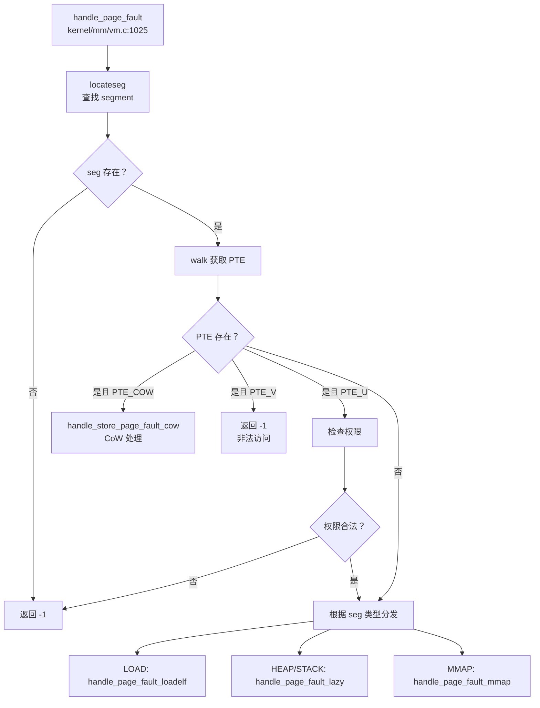

**关键子处理函数**：

1. **CoW 处理**（`kernel/mm/vm.c:961-986`）：
   ```c
   static int handle_store_page_fault_cow(pte_t *ptep) {
       pte_t pte = *ptep;
       uint64 pa = PTE2PA(pte);
       
       if (monopolizepage(pa)) {    // 唯一引用，直接添加写权限
           pte |= PTE_W;
       } else {
           char *copy = (char *)allocpage();  // 分配新页
           memmove(copy, (char *)pa, PGSIZE); // 复制内容
           pagereg((uint64)copy, 1);
           pte = PA2PTE(copy) | PTE_FLAGS(pte) | PTE_W;
       }
       pte &= ~PTE_COW;
       *ptep = pte;
       sfence_vma();
       return 0;
   }
   ```

2. **惰性分配**（`kernel/mm/vm.c:988-1002`）：
   ```c
   static int handle_page_fault_lazy(uint64 badaddr, struct seg *s) {
       struct proc *p = myproc();
       uint64 pa = PGROUNDDOWN(badaddr);
       if (uvmalloc(p->pagetable, pa, pa + PGSIZE, s->flag) == 0)
           return -1;
       sfence_vma();
       return 0;
   }
   ```

3. **ELF 加载**（`kernel/mm/vm.c:1004-1017`）：
   ```c
   static int handle_page_fault_loadelf(uint64 badaddr, struct seg *s) {
       struct proc *p = myproc();
       ilock(p->elf);
       if (loadseg(p->pagetable, badaddr, s, p->elf) < 0) {
           iunlock(p->elf);
           return -1;
       }
       iunlock(p->elf);
       sfence_vma();
       return 0;
   }
   ```

4. **MMAP 处理**（`kernel/mm/mmap.c:1047-1080`）：
   ```c
   int handle_page_fault_mmap(int kind, uint64 badaddr, struct seg *s) {
       // 检查访问权限
       if (illegel) return -EFAULT;
       
       if (MMAP_ANONY(s->mmap)) {
           if (!MMAP_SHARE(s->mmap)) {
               // 私有匿名映射：类似堆，惰性分配
               uvmalloc(p->pagetable, pa, pa + PGSIZE, s->flag);
           } else {
               // 共享匿名映射：从 anonfile 分配
               handle_anonymous_shared(badaddr, s);
           }
       } else {
           // 文件映射
           handle_file_mmap(badaddr, s);
       }
   }
   ```

**✅ 已实现**：完整缺页异常处理链路、CoW、Lazy、ELF 懒加载、MMAP 按需映射

---

### 进程级映射管理

#### Segment 管理结构

xv6-k210 使用**链表式 `struct seg`** 管理进程地址空间区间（`include/mm/usrmm.h`）：

```c
struct seg {
    uint64 addr;          // 起始虚拟地址
    uint64 sz;            // 大小
    enum segtype type;    // LOAD/HEAP/STACK/MMAP
    long flag;            // PTE 权限标志
    uint64 mmap;          // MMAP 元数据指针
    struct seg *next;     // 链表指针
};
```

**地址空间查找**（`kernel/mm/usrmm.c`）：
- `locateseg()`：根据虚拟地址查找对应 segment
- `lookup_segment()` / `lookup_fixed_segment()`：分配新 segment 时检查重叠

#### MMAP 页管理

**`struct mmap_page`**（`include/mm/mmap.h:48-55`）：
```c
struct mmap_page {
    uint64      f_off;    // 文件偏移（作为 RB 树索引）
    uint64      f_len;    // 映射长度
    void        *pa;      // 物理页地址
    uint32      ref;      // 引用计数
    int         valid;    // 数据是否有效（受 inode 锁保护）
    struct rb_node rb;    // RB 树节点
};
```

**RB 树管理**（`kernel/mm/mmap.c:77-120`）：
- `get_mmap_page()`：O(log n) 查找指定偏移的映射页
- `put_mmap_page()`：引用计数减 1，为 0 时删除节点并释放物理页
- `get_mmap_with_parent()`：带父节点查找（用于插入）

**✅ 已实现**：Segment 链表管理、MMAP RB 树索引、引用计数

---

### 高级内存特性清单

| 特性 | 状态 | 代码位置/说明 |
|------|------|---------------|
| **写时复制（CoW）** | ✅ 已实现 | `kernel/mm/vm.c:961-986` `handle_store_page_fault_cow()`；`uvmcopy()` 在 fork 时标记 COW |
| **懒分配（Lazy Allocation）** | ✅ 已实现 | `kernel/mm/vm.c:988-1002` `handle_page_fault_lazy()`；`sys_sbrk` 仅调整边界 |
| **共享内存（shmget/shmdt）** | ❌ 未实现 | 搜索 `sys_shm`/`shmget`/`shmdt` 无结果；但 mmap 支持 `MAP_SHARED` |
| **反向映射表（rmap）** | ❌ 未实现 | 搜索 `rmap`/`reverse_map`/`page_to_vma` 无结果 |
| **交换区/页面置换（Swap）** | ❌ 未实现 | 搜索 `swap_out`/`swap_in` 无结果；`__page_file_swap` 仅为文件映射换出逻辑 |
| **大页支持（Huge Page）** | ❌ 未实现 | 搜索 `HugePage`/`MapSize::2M`/`MapSize::1G` 无结果；仅支持 4KB 页 |
| **mmap 系统调用** | ✅ 已实现 | `kernel/syscall/sysmem.c:79-113` `sys_mmap()`；支持 `MAP_FIXED`/`MAP_ANON`/`MAP_SHARED`/`MAP_PRIVATE` |
| **零拷贝 IO（sendfile/splice）** | ❌ 未实现 | 搜索 `sendfile`/`splice` 无结果 |

#### mmap 实现细节

**系统调用入口**（`kernel/syscall/sysmem.c:79-113`）：
```c
uint64 sys_mmap(void) {
    uint64 start, len;
    int prot, flags, fd;
    int64 off;
    struct file *f = NULL;

    argaddr(0, &start);
    argaddr(1, &len);
    argint(2, &prot);
    argint(3, &flags);
    argfd(4, &fd, &f);
    argaddr(5, (uint64*)&off);
    
    if (off % PGSIZE || len == 0)
        return -EINVAL;
    
    if ((fd < 0 || f == NULL) && !(flags & MAP_ANONYMOUS))
        return -EBADF;
    
    if (!(flags & (MAP_SHARED|MAP_PRIVATE)))
        return -EINVAL;

    return do_mmap(start, len, prot, flags, f, off);
}
```

**`do_mmap()` 核心逻辑**（`kernel/mm/mmap.c:660-720`）：
1. **参数验证**：检查文件偏移对齐、长度、权限匹配
2. **Segment 分配**：`lookup_fixed_segment()`（MAP_FIXED）或 `lookup_segment()`（动态地址）
3. **映射类型分发**：
   - `mmap_file()`：文件映射，创建 `mmap_page` RB 树
   - `mmap_anonymous()`：匿名映射，创建 `anonfile` 结构
4. **清理旧映射**：删除重叠的现有 segment

**共享匿名映射处理**（`kernel/mm/mmap.c:822-852`）：
```c
static int handle_anonymous_shared(uint64 badaddr, struct seg *s) {
    struct anonfile *fp = MMAP_FILE(s->mmap);
    uint64 off = s->f_off + (PGROUNDDOWN(badaddr) - s->addr);
    
    acquire(&fp->lock);
    struct mmap_page *map = get_mmap_page(&fp->mapping, off);
    
    if (map->pa == NULL) {
        map->pa = allocpage();  // 首次访问分配物理页
        memset(map->pa, 0, PGSIZE);
        pagereg((uint64)map->pa, 1);
    }
    release(&fp->lock);
    
    mappages(p->pagetable, PGROUNDDOWN(badaddr), PGSIZE,
             (uint64)map->pa, s->flag|PTE_U);
    sfence_vma();
    return 0;
}
```

**✅ mmap 已完整实现**：支持所有标准标志、文件/匿名映射、共享/私有映射、按需分页

---

### 关键代码片段与调用链分析

#### 物理页分配调用链

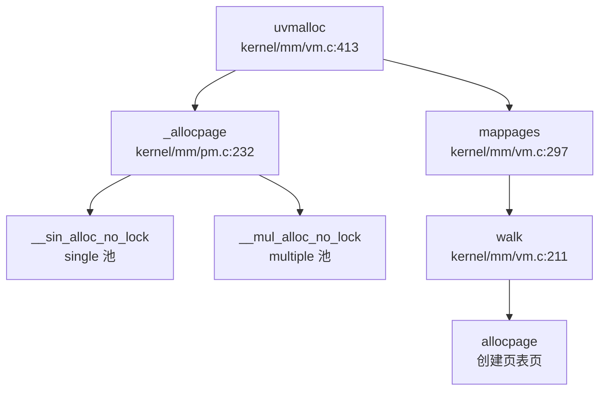

#### 缺页异常完整链路

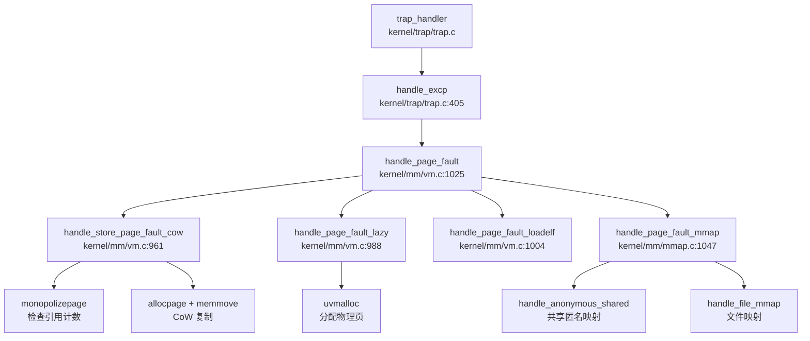

#### fork 时 CoW 实现

```c
// kernel/mm/vm.c:553-590
int uvmcopy(pagetable_t old, pagetable_t new, uint64 start, uint64 end, int cow) {
    for (i = start; i < end; i += PGSIZE) {
        if ((pte = walk(old, i, 0)) == NULL || !(*pte & PTE_V))
            continue;
        pa = PTE2PA(*pte);
        
        if (cow && (*pte & PTE_W)) {
            *pte = (*pte|PTE_COW) & ~PTE_W;  // 父页标记为 COW
        }
        flags = PTE_FLAGS(*pte);
        if(mappages(new, i, PGSIZE, pa, flags) != 0)
            goto err;  // 子进程映射同一物理页
    }
    sfence_vma();
    return 0;
}
```

---

### 总结

xv6-k210 实现了**完整的现代操作系统内存管理子系统**：

**已实现的核心特性**：
- ✅ 物理页框管理（双池链表分配器 + 引用计数）
- ✅ 三级页表（Sv39）虚拟内存管理
- ✅ 独立内核/用户地址空间
- ✅ Slab 式内核堆分配器（kmalloc）
- ✅ 用户堆管理（sbrk/brk）+ 惰性分配
- ✅ 完整缺页异常处理链路
- ✅ 写时复制（CoW）fork
- ✅ mmap 系统调用（文件/匿名映射、共享/私有）
- ✅ MMAP RB 树索引管理（O(log n) 查找）

**未实现的高级特性**：
- ❌ 共享内存系统调用（shmget/shmdt）
- ❌ 反向映射表（rmap）
- ❌ 页面置换/交换区（Swap）
- ❌ 大页支持（Huge Page）
- ❌ 零拷贝 IO（sendfile/splice）
- 🔸 显式用户指针验证（verify_area）

该内存管理系统设计简洁但功能完备，特别在**惰性分配**、**CoW** 和 **mmap** 方面展现了现代操作系统的核心设计理念。

---


# 进程线程与调度机制

## 第 4 章：进程/线程与调度机制

### 任务模型与核心数据结构

本 OS 采用统一的 `struct proc` 结构体作为进程/线程的控制块（PCB/TCB 合一），未区分 Process 与 Thread 概念。核心定义位于 `include/sched/proc.h:38-105`。

#### `struct proc` 关键字段

```c
// include/sched/proc.h:51-105
struct proc {
    // 基本标识
    int xstate;                     // 退出状态
    int pid;                        // 进程 ID
    struct proc *hash_next;         // 哈希链表下一节点
    struct proc **hash_pprev;       // 哈希链表前一节点指针

    // 调度链表
    struct proc *sched_next;        // 调度队列下一节点
    struct proc **sched_pprev;      // 调度队列前一节点指针
    int timer;                      // 时间片计数器
    enum procstate state;           // 进程状态
    void *chan;                     // 睡眠原因（等待通道）
    uint64 sleep_expire;            // 睡眠唤醒时间

    // 性能统计
    struct tms proc_tms;            // 用户/系统时间
    uint64 ikstmp;                  // 进入内核时刻
    uint64 okstmp;                  // 离开内核时刻
    int64 vswtch;                   // 自愿上下文切换次数
    int64 ivswtch;                  // 非自愿上下文切换次数

    // 亲缘关系
    struct spinlock lk;             // 保护亲缘关系的锁
    struct proc *child;             // 第一个子进程
    struct proc *parent;            // 父进程
    struct proc *sibling_next;      // 兄弟链表下一节点
    struct proc **sibling_pprev;    // 兄弟链表前一节点指针

    // 内存管理
    uint64 kstack;                  // 内核栈虚拟地址
    uint64 badaddr;                 // 页错误后的错误地址
    pagetable_t pagetable;          // 用户页表
    struct trapframe *trapframe;    // trampoline 数据页
    struct seg *segment;            // 第一段链表节点
    uint64 pbrk;                    // 程序断点（堆顶）

    // 文件系统
    struct fdtable fds;             // 打开文件表
    struct inode *cwd;              // 当前目录
    struct inode *elf;              // 可执行文件

    // 调度上下文
    struct context context;         // 内核运行的"trapframe"

    // 信号机制
    ksigaction_t *sig_act;          // 信号处理动作链表
    __sigset_t sig_set;             // 阻塞信号集
    __sigset_t sig_pending;         // 待处理信号
    struct sig_frame *sig_frame;    // 信号帧链表
    int killed;                     // 当前待处理信号编号

    // 调试信息
    char name[16];                  // 进程名
    int tmask;                      // 跟踪掩码
};
```

#### `struct context` 上下文结构

```c
// include/sched/proc.h:19-35
struct context {
    uint64 ra;      // 返回地址
    uint64 sp;      // 栈指针
    // callee-saved 寄存器
    uint64 s0-s11;  // 12 个被调用者保存寄存器
};
```

**设计特点**：
- 仅保存 callee-saved 寄存器（s0-s11），caller-saved 寄存器由编译器负责保存
- 上下文大小固定为 13×8 = 104 字节
- 与 RISC-V 调用约定一致

#### 进程状态枚举

```c
// include/sched/proc.h:38-41
enum procstate {
    RUNNABLE,   // 可运行
    RUNNING,    // 运行中
    SLEEPING,   // 睡眠中
    ZOMBIE,     // 僵尸态
};
```

**❌ 未实现**：无 BLOCKED、STOPPED、CONTINUED 等状态，状态机较为简化。

---

### 调度算法与策略（代码证据）

本 OS 实现了**基于优先级的多级队列调度算法**，核心实现在 `kernel/sched/proc.c`。

#### 优先级定义

```c
// kernel/sched/proc.c:239-243
#define PRIORITY_TIMEOUT    0   // 超时队列（最低优先级）
#define PRIORITY_IRQ        1   // 中断唤醒队列（高优先级）
#define PRIORITY_NORMAL     2   // 正常队列（默认优先级）
#define PRIORITY_NUMBER     3   // 优先级数量
struct proc *proc_runnable[PRIORITY_NUMBER];  // 优先级队列数组
```

#### 调度器主循环

```c
// kernel/sched/proc.c:658-698
void scheduler(void) {
    struct proc *tmp;
    struct cpu *c = mycpu();

    while (1) {
        int found = 0;
        intr_on();
        __enter_proc_cs 
        tmp = __get_runnable_no_lock();  // 按优先级查找可运行进程
        if (NULL != tmp) {
            tmp->state = RUNNING;
            c->proc = tmp;

            // 切换到用户页表
            w_satp(MAKE_SATP(tmp->pagetable));
            sfence_vma();
            // 上下文切换
            swtch(&c->context, &tmp->context);
            // 切换回内核页表
            w_satp(MAKE_SATP(kernel_pagetable));
            sfence_vma();

            if (ZOMBIE == tmp->state) {
                release(&(tmp->parent->lk));
            }
            found = 1;
        }
        c->proc = NULL;
        __leave_proc_cs
        if (!found) {
            intr_on();
            asm volatile("wfi");  // 无进程可运行时进入低功耗等待
        }
    } 
}
```

#### 优先级选择逻辑

```c
// kernel/sched/proc.c:596-612
static struct proc *__get_runnable_no_lock(void) {
    struct proc const *tmp;

    for (int i = 0; i < PRIORITY_NUMBER; i ++) {  // 按优先级顺序遍历
        tmp = proc_runnable[i];
        while (NULL != tmp) {
            if (RUNNABLE == tmp->state) {
                return (struct proc*)tmp;  // 返回第一个 RUNNABLE 进程
            }
            tmp = tmp->sched_next;
        }
    }
    return NULL;
}
```

**调度策略分析**：
- **✅ 已实现**：严格优先级调度（Priority 0 < 1 < 2）
- **❌ 未实现**：同一优先级内为**FIFO 顺序**（按插入顺序遍历链表），**非时间片轮转（RR）**
- **❌ 未实现**：无动态优先级调整、无 CFS/Stride 等公平调度算法
- **🔸 桩函数**：`proc_tick()` 中实现了定时器递减逻辑，但仅用于超时队列管理，**未实现基于时间片的抢占式调度**

#### 时间片管理

```c
// kernel/sched/proc.c:740-774
void proc_tick(void) {
    __enter_proc_cs 

    // runnable 队列处理
    struct proc *p;
    for (int i = PRIORITY_IRQ; i < PRIORITY_NUMBER; i ++) {
        p = proc_runnable[i];
        while (NULL != p) {
            struct proc *next = p->sched_next;
            if (RUNNING != p->state) {
                p->timer = p->timer - 1;
                if (0 == p->timer) {
                    __remove(p);
                    __insert_runnable(PRIORITY_TIMEOUT, p);  // 超时降级
                }
            }
            p = next;
        }
    }
    // ... 睡眠队列处理
    __leave_proc_cs
}
```

**关键发现**：
- 仅对**非 RUNNING 状态**进程递减 timer（逻辑可疑）
- 超时后降级到 `PRIORITY_TIMEOUT` 队列
- **未实现**：运行中进程的时间片耗尽抢占

---

### 任务状态机

#### 状态流转图

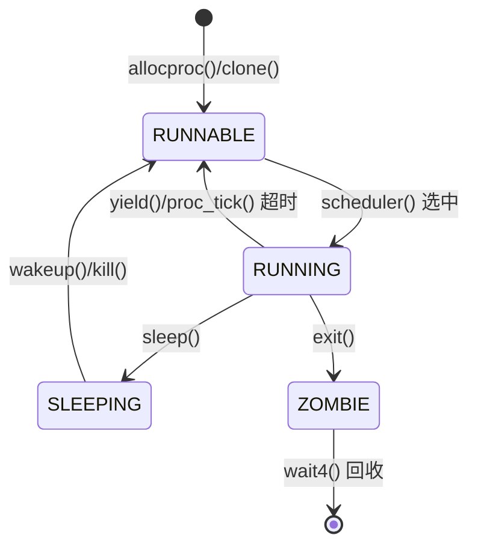

#### 状态转换触发点

| 源状态 | 目标状态 | 触发函数 | 文件路径 |
|--------|----------|----------|----------|
| 无 | RUNNABLE | `allocproc()` + `__insert_runnable()` | `kernel/sched/proc.c:164-364` |
| RUNNABLE | RUNNING | `scheduler()` | `kernel/sched/proc.c:676` |
| RUNNING | RUNNABLE | `yield()` | `kernel/sched/proc.c:630` |
| RUNNING | SLEEPING | `sleep()` | `kernel/sched/proc.c:584` |
| SLEEPING | RUNNABLE | `wakeup()` / `kill()` | `kernel/sched/proc.c:545-561` |
| RUNNING | ZOMBIE | `exit()` | `kernel/sched/proc.c:449` |
| ZOMBIE | 销毁 | `wait4()` + `freeproc()` | `kernel/sched/proc.c:470-518` |

**关键机制**：
- **睡眠/唤醒**：基于 `chan` 指针匹配，支持多进程等待同一事件
- **僵尸态**：进程退出后保留 PCB，等待父进程 `wait4()` 回收资源
- **亲缘关系**：子进程退出时，所有子进程被重绑定到 `__initproc`

---

### 上下文切换实现（汇编分析）

#### `swtch` 汇编实现

```asm
# kernel/sched/swtch.S:3-41
# void swtch(struct context *old, struct context *new);
.globl swtch
swtch:
    # 保存当前上下文到 old
    sd ra, 0(a0)
    sd sp, 8(a0)
    sd s0, 16(a0)
    sd s1, 24(a0)
    sd s2, 32(a0)
    sd s3, 40(a0)
    sd s4, 48(a0)
    sd s5, 56(a0)
    sd s6, 64(a0)
    sd s7, 72(a0)
    sd s8, 80(a0)
    sd s9, 88(a0)
    sd s10, 96(a0)
    sd s11, 104(a0)

    # 从 new 恢复新上下文
    ld ra, 0(a1)
    ld sp, 8(a1)
    ld s0, 16(a1)
    ld s1, 24(a1)
    ld s2, 32(a1)
    ld s3, 40(a1)
    ld s4, 48(a1)
    ld s5, 56(a1)
    ld s6, 64(a1)
    ld s7, 72(a1)
    ld s8, 80(a1)
    ld s9, 88(a1)
    ld s10, 96(a1)
    ld s11, 104(a1)
    
    ret
```

**技术细节**：
- **保存寄存器**：ra + sp + s0-s11（共 13 个寄存器，104 字节）
- **调用约定**：参数通过 a0（old）、a1（new）传递
- **不保存**：caller-saved 寄存器（t0-t6, a0-a7）由编译器管理
- **不保存**：浮点寄存器（由 `floatstore()`/`floatload()` 单独处理）

#### 浮点寄存器保存

```c
// kernel/sched/proc.c:714-720
void sched(void) {
    // ...
    if (r_sstatus_fs() == SSTATUS_FS_DIRTY) {
        floatstore(p->trapframe);  // 保存到 trapframe
        w_sstatus_fs(SSTATUS_FS_CLEAN);
    }
    // ...
    swtch(&p->context, &mycpu()->context);
    // ...
    floatload(p->trapframe);  // 从 trapframe 恢复
    w_sstatus_fs(SSTATUS_FS_CLEAN);
}
```

**优化策略**：惰性保存（Lazy FPU Save），仅在 `sstatus.FS` 为 DIRTY 时保存浮点状态。

---

### 进程间通信与同步（Signal/Futex）

#### 信号机制（Signal）

**✅ 已实现**：基础信号机制，位于 `kernel/sched/signal.c` 和 `include/sched/signal.h`。

```c
// include/sched/signal.h:10-20
#define SIGRTMIN    34
#define SIGRTMAX    64
#define SIGTERM     15
#define SIGKILL     9
#define SIGABRT     6
#define SIGHUP      1
#define SIGINT      2
#define SIGQUIT     3
#define SIGILL      4
#define SIGTRAP     5
#define SIGCHLD     17
```

**核心实现**：

```c
// kernel/sched/proc.c:528-560
int kill(int pid, int sig) {
    struct proc *tmp;

    __enter_hash_cs 
    tmp = hash_search_no_lock(pid);  // 通过 PID 查找目标进程
    if (NULL == tmp) {
        __leave_hash_cs 
        return -ESRCH;
    }

    // 设置待处理信号位
    int const len = sizeof(unsigned long) * 8;
    int bit = sig % len;
    int i = sig / len;
    __assert("kill", i < SIGSET_LEN, "signal too large %d\n", sig);
    tmp->sig_pending.__val[i] |= 1ul << bit;
    if (0 == tmp->killed || sig < tmp->killed) {
        tmp->killed = sig;
    }

    // 唤醒睡眠中的目标进程
    __enter_proc_cs 
    if (SLEEPING == tmp->state) {
        __remove(tmp);
        tmp->timer = TIMER_IRQ;
        tmp->chan = NULL;
        __insert_runnable(PRIORITY_IRQ, tmp);
    }
    __leave_proc_cs 
    __leave_hash_cs 
    return 0;
}
```

**系统调用接口**：

```c
// kernel/syscall/syssignal.c:134-148
uint64 sys_kill(void) {
    int pid, sig;
    argint(0, &pid);
    argint(1, &sig);
    return kill(pid, sig);
}
```

**信号处理动作**：

```c
// include/sched/signal.h:36-45
struct sigaction {
    union {
        __sighandler_t sa_handler;  // 仅支持 sa_handler
        // void (*sa_sigaction)(int, siginfo_t *, void *);  // 未实现
    } __sigaction_handler;
    __sigset_t sa_mask;   // 处理期间阻塞的信号集
    int sa_flags;
};
```

**🔸 部分实现**：
- ✅ `kill()` 发送信号
- ✅ `sig_pending` 位图记录待处理信号
- ✅ 睡眠进程可被信号唤醒
- ❌ **未发现**：信号处理函数注册与分发逻辑（`sigaction()` 系统调用未找到实现）
- ❌ **未发现**：用户态信号处理帧（`sig_frame` 结构体定义但未找到使用代码）
- ❌ **未发现**：`sigprocmask()` 完整实现

#### Futex/等待队列

**✅ 已实现**：等待队列机制，位于 `include/sync/waitqueue.h`。

```c
// include/sync/waitqueue.h:17-27
struct wait_queue {
    struct spinlock lock;
    struct d_list head;  // 双向链表头
};

struct wait_node {
    void *chan;
    struct d_list list;
};
```

**使用场景**：
- **管道（Pipe）**：`include/fs/pipe.h:14-15` 定义了 `wqueue`（写等待）和 `rqueue`（读等待）
- **轮询（Poll）**：`include/fs/poll.h:58-76` 使用 `wait_queue` 实现文件描述符事件等待

**❌ 未实现**：
- **Futex 系统调用**：搜索 `futex_wait`、`futex_wake` 未找到任何实现
- **用户态快速路径**：等待队列仅在内核中使用，未暴露给用户态

---

### 关键流程追踪（Fork/Exec/Schedule/Exit）

#### 1. `fork()` 流程

**系统调用入口**：

```c
// kernel/syscall/sysproc.c:84-88
uint64 sys_fork(void) {
    return clone(0, NULL);
}
```

**完整调用链**：

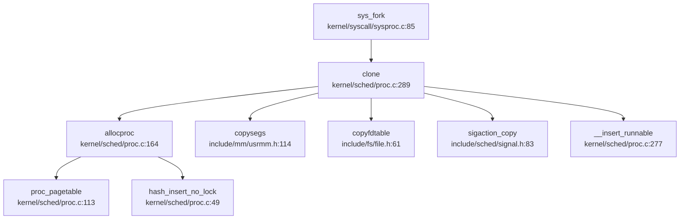

**关键步骤分析**：

```c
// kernel/sched/proc.c:289-368
int clone(uint64 flag, uint64 stack) {
    struct proc *p = myproc();
    struct proc *np;

    np = allocproc();  // 1. 分配新 PCB
    if (NULL == np) return -1;

    // 2. 复制父进程内存布局（页表 + 段）
    np->segment = copysegs(p->pagetable, p->segment, np->pagetable);
    if (NULL == np->segment) {
        freeproc(np);
        return -1;
    }
    np->pbrk = p->pbrk;

    // 3. 复制信号处理配置
    if (0 != sigaction_copy(&np->sig_act, p->sig_act)) {
        freeproc(np);
        return -1;
    }

    // 4. 复制文件描述符表
    if (copyfdtable(&p->fds, &np->fds) < 0) {
        freeproc(np);
        return -1;
    }
    np->cwd = idup(p->cwd);
    np->elf = p->elf ? idup(p->elf) : NULL;

    // 5. 复制 trapframe（用户态寄存器状态）
    *(np->trapframe) = *(p->trapframe);
    np->trapframe->a0 = 0;  // fork() 在子进程返回 0

    if (NULL != stack) {
        np->trapframe->sp = stack;
    }

    // 6. 建立亲缘关系
    acquire(&p->lk);
    np->parent = p;
    np->sibling_pprev = &(p->child);
    np->sibling_next = p->child;
    if (NULL != p->child) {
        p->child->sibling_pprev = &(np->sibling_next);
    }
    p->child = np;
    release(&p->lk);

    // 7. 插入就绪队列
    __enter_proc_cs 
    np->timer = TIMER_NORMAL;
    __insert_runnable(PRIORITY_NORMAL, np);
    __leave_proc_cs 

    return np->pid;
}
```

**✅ 已验证**：
- **地址空间复制**：`copysegs()` 调用复制页表和段链表
- **文件表复制**：`copyfdtable()` 复制文件描述符
- **trapframe 复制**：完整复制用户态寄存器状态

#### 2. `exec()` 流程

**系统调用入口**：

```c
// kernel/syscall/sysproc.c:27-40
uint64 sys_exec(void) {
    char path[MAXPATH];
    uint64 argv;
    if(argstr(0, path, MAXPATH) < 0 || argaddr(1, &argv) < 0){
        return -1;
    }
    return execve(path, (char **)argv, 0);
}
```

**核心实现**（`kernel/exec.c:443-768`）：

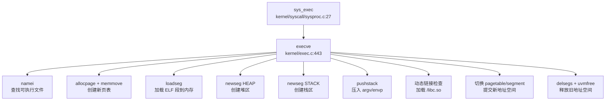

**关键步骤**：

```c
// kernel/exec.c:443-768（精简版）
int execve(char *path, char **argv, char **envp) {
    struct proc *p = myproc();
    struct inode *ip = NULL;
    pagetable_t pagetable = NULL;
    struct seg *seghead = NULL;

    // 1. 打开可执行文件
    if ((ip = namei(path)) == NULL) {
        ret = -ENOENT;
        goto bad;
    }

    // 2. 创建新页表（复制内核映射）
    pagetable = (pagetable_t)allocpage();
    memmove(pagetable, p->pagetable, PGSIZE);
    // 清除旧用户空间映射
    for (int i = 0; i < PX(2, MAXUVA); i++) {
        pagetable[i] = 0;
    }

    // 3. 读取并验证 ELF 头
    ilock(ip);
    struct elfhdr elf;
    if (ip->fop->read(ip, 0, (uint64)&elf, 0, sizeof(elf)) != sizeof(elf) 
        || elf.magic != ELF_MAGIC) {
        ret = -ENOEXEC;
        goto bad;
    }

    // 4. 加载 ELF 段
    for (int i = 0, off = elf.phoff; i < elf.phnum; i++, off += sizeof(ph)) {
        if (ip->fop->read(ip, 0, (uint64)&ph, off, sizeof(ph)) != sizeof(ph)) {
            ret = -EIO;
            goto bad;
        }
        if (ph.type == ELF_PROG_LOAD) {
            // 创建新段并加载内容
            seg = newseg(pagetable, seghead, LOAD, ph.vaddr, ph.memsz, flags);
            seg->f_off = ph.off;
            seg->f_sz = ph.filesz;
            if (loadseg(pagetable, elf.entry, seg, ip) < 0) {
                goto bad;
            }
        }
    }

    // 5. 创建堆区
    uint64 brk = PGROUNDUP(seg->addr + seg->sz) + PGSIZE;
    seg = newseg(pagetable, seghead, HEAP, brk, 0, flags);

    // 6. 创建栈区
    uint64 sp = VUSTACK;
    uint64 stackbase = VUSTACK - PGSIZE * STACK_PAGES;
    seg = newseg(pagetable, seghead, STACK, stackbase, sp - stackbase, flags);

    // 7. 压入 argv/envp 到用户栈
    int64 argc, envc;
    uint64 uargv[MAXARG + 1], uenvp[MAXENV + 1];
    envc = pushstack(pagetable, uenvp, envp, MAXENV, &sp);
    argc = pushstack(pagetable, uargv, argv, MAXARG, &sp);

    // 8. 动态链接检查
    if (dynamic_need) {
        struct inode *intprtr = namei("/libc.so");
        intprtr_sta_loc = load_elf_interp(pagetable, seghead, &intprtr_hdr, intprtr);
        prog_entry = intprtr_sta_loc + intprtr_hdr.entry;
    } else {
        prog_entry = elf.entry;
    }

    // 9. 构建辅助向量（Auxiliary Vector）
    uint64 auxvec[][2] = {
        {AT_HWCAP, 0}, {AT_PAGESZ, PGSIZE}, {AT_PHDR, ph_store.vaddr},
        {AT_BASE, intprtr_sta_loc}, {AT_ENTRY, elf.entry}, {AT_RANDOM, sp},
        {AT_NULL, 0}
    };

    // 10. 提交新地址空间
    p->pagetable = pagetable;
    p->segment = seghead;
    p->pbrk = brk;
    p->trapframe->epc = prog_entry;  // 设置入口点
    p->trapframe->sp = sp;           // 设置栈指针
    safestrcpy(p->name, ip->entry->filename, sizeof(p->name));

    // 11. 释放旧地址空间
    delsegs(oldpagetable, oldseg);
    uvmfree(oldpagetable);
    freepage(oldpagetable);

    return 0;
bad:
    // 错误处理：释放新资源，保留旧资源
    if (seghead) delsegs(pagetable, seghead);
    if (pagetable) { uvmfree(pagetable); freepage(pagetable); }
    if (ip) iput(ip);
    return ret;
}
```

**✅ 已验证**：
- **地址空间重建**：创建全新页表，清除旧用户映射
- **ELF 加载**：解析 ELF 头，加载 `LOAD` 类型段
- **动态链接**：检查 `ELF_PROG_INTERP`，加载 `/libc.so`
- **栈初始化**：压入 argc/argv/envp/auxvec
- **资源回收**：释放旧页表和段

#### 3. `schedule()` 流程

**调用者分析**（通过 `lsp_get_call_graph` 获取）：

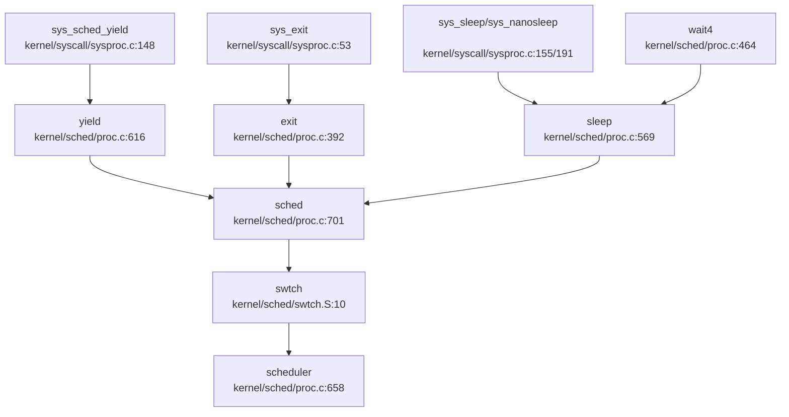

**调度触发点**：
1. **主动让出**：`yield()` / `sys_sched_yield()`
2. **进程退出**：`exit()` 调用 `sched()` 进入僵尸态
3. **等待事件**：`sleep()` 等待通道唤醒
4. **等待子进程**：`wait4()` 阻塞等待

**优先级验证**：

```c
// kernel/sched/proc.c:596-612
static struct proc *__get_runnable_no_lock(void) {
    for (int i = 0; i < PRIORITY_NUMBER; i ++) {  // 0=TIMEOUT, 1=IRQ, 2=NORMAL
        tmp = proc_runnable[i];
        while (NULL != tmp) {
            if (RUNNABLE == tmp->state) {
                return (struct proc*)tmp;  // 返回第一个匹配
            }
            tmp = tmp->sched_next;
        }
    }
    return NULL;
}
```

**❌ 关键发现**：
- **未使用 priority 字段**：`struct proc` 中无 `priority` 字段
- **FIFO 而非优先级**：同一优先级队列内按链表顺序（FIFO）选择
- **无 stride/cfs**：未实现公平调度算法

#### 4. `exit()` 流程

**系统调用入口**：

```c
// kernel/syscall/sysproc.c:53-65
uint64 sys_exit(void) {
    int n;
    if(argint(0, &n) < 0)
        return -1;
    if (myproc()->tmask) {
        printf(")\n");
    }
    exit(n);
    return 0;  // not reached
}
```

**完整退出流程**：

```c
// kernel/sched/proc.c:392-461
void exit(int xstate) {
    struct proc *p = myproc();
    extern struct proc *__initproc;

    __debug_assert("exit", __initproc != p, "init exiting");

    // 1. 释放内存资源
    delsegs(p->pagetable, p->segment);
    p->segment = NULL;
    uvmfree(p->pagetable);

    // 2. 关闭文件描述符
    dropfdtable(&p->fds);
    iput(p->cwd);
    iput(p->elf);

    p->xstate = xstate;

    // 3. 重绑定所有子进程到 __initproc
    acquire(&p->lk);
    if (NULL != p->child) {
        struct proc *first, *last;
        first = last = p->child;
        while (NULL != last->sibling_next) {
            last->parent = __initproc;
            last = last->sibling_next;
        }
        last->parent = __initproc;

        acquire(&__initproc->lk);
        first->sibling_pprev = &(__initproc->child);
        last->sibling_next = __initproc->child;
        if (NULL != __initproc->child) {
            __initproc->child->sibling_pprev = &(last->sibling_next);
        }
        __initproc->child = first;
        release(&__initproc->lk);
    }
    release(&p->lk);

    // 4. 向父进程发送 SIGCHLD 信号
    p->parent->sig_pending.__val[0] |= 1ul << SIGCHLD;
    if (0 == p->parent->killed || SIGCHLD < p->parent->killed) {
        p->parent->killed = SIGCHLD;
    }

    // 5. 进入僵尸态
    acquire(&p->parent->lk);
    __enter_proc_cs
    p->state = ZOMBIE;
    __remove(p); 
    __wakeup_no_lock(__initproc);
    __wakeup_no_lock(p->parent);

    // 6. 调用 sched() 放弃 CPU（永不返回）
    sched();

    panic("panic! living dead!\n");
}
```

**资源回收流程**：

```c
// kernel/sched/proc.c:470-518（wait4 精简版）
int wait4(int pid, uint64 status, uint64 options) {
    struct proc *p = myproc();

    acquire(&p->lk);
    while (1) {
        struct proc *np = p->child;
        while (NULL != np) {
            // 查找匹配的子进程
            if (pid <= 0 || np->pid == pid) {
                if (ZOMBIE == np->state) {
                    // 找到僵尸子进程
                    int xstate = np->xstate;
                    
                    // 从哈希表移除
                    __enter_hash_cs
                    hash_remove_no_lock(np);
                    __leave_hash_cs

                    // 从兄弟链表移除
                    *(np->sibling_pprev) = np->sibling_next;
                    if (NULL != np->sibling_next) {
                        np->sibling_next->sibling_pprev = np->sibling_pprev;
                    }

                    // 复制退出状态到用户空间
                    if (status) {
                        // ... copyout ...
                    }

                    // 累加子进程时间到父进程
                    p->proc_tms.cutime += np->proc_tms.utime;
                    p->proc_tms.cstime += np->proc_tms.stime;

                    release(&p->lk);
                    __enter_proc_cs
                    freeproc(np);  // 释放 PCB
                    __leave_proc_cs
                    return xstate;
                }
            }
            np = np->sibling_next;
        }

        // 无僵尸子进程，进入睡眠
        if (options & WAIT_OPTIONS_WNOHANG) {
            release(&p->lk);
            return 0;
        }
        sleep(p, &p->lk);
        if (p->killed) {
            release(&p->lk);
            return -1;
        }
    }
}
```

**✅ 已验证**：
- **资源释放顺序**：内存 → 文件 → 亲缘关系 → 信号通知
- **僵尸态保持**：持有父进程锁，防止父进程提前回收
- **子进程重绑定**：所有子进程继承给 `__initproc`
- **SIGCHLD 通知**：设置父进程 `sig_pending` 位

---

### 进程/线程管理模块扩展

#### 进程组与会话管理

**❌ 未实现**：
- 搜索 `ProcessGroup`、`Session`、`pgid`、`session_id`、`setpgid`、`setsid` 未找到任何匹配
- **无进程组概念**：所有进程均为独立组
- **无会话管理**：无控制终端、无前台/后台进程组

#### PID/TID 分配机制

**✅ 已实现**：简单递增 PID 分配

```c
// kernel/sched/proc.c:33-38
int __pid;
#define HASH_SIZE     17
#define __hash(pid)   ((pid) % HASH_SIZE)
struct proc *pid_hash[HASH_SIZE];
struct spinlock hash_lock;

// kernel/sched/proc.c:228-232
p->pid = __pid ++;
hash_insert_no_lock(p);
```

**特点**：
- **全局递增**：`__pid` 从 1 开始递增，无回绕处理
- **哈希索引**：17 桶哈希表加速 PID 查找
- **❌ 未实现**：PID 回收复用（长期运行可能耗尽）
- **❌ 未实现**：TID（线程 ID）与 PID 区分

#### POSIX 资源限制

**🔸 桩函数**：

```c
// kernel/syscall/sysproc.c:273-277
uint64 
sys_prlimit64(void) {
    // for now it's not very necessary to implement this syscall 
    // may be implemented later 
    return 0;
}
```

**❌ 未实现**：
- 仅返回 0，无任何资源限制逻辑
- **未实现**：`RLIMIT_CPU`、`RLIMIT_FSIZE`、`RLIMIT_DATA` 等 16 种资源类型
- **未实现**：软限制（rlim_cur）/ 硬限制（rlim_max）双机制
- **❌ 未发现**：`getrlimit()`、`setrlimit()` 系统调用

#### 层次结构 ID 规则

**❌ 未实现**：
- 搜索 `pgid`、`session_id`、`set_sid`、`setpgid` 无结果
- **PGID 规则**：未实现（应等于进程组 leader 的 PID）
- **SID 规则**：未实现（应等于会话 leader 的 PGID）

---

### 高级特性验证总结

| 特性 | 状态 | 证据/说明 |
|------|------|-----------|
| **信号机制 (Signal)** | 🔸 部分实现 | `kill()` 可发送信号，`sig_pending` 记录待处理信号，但**未发现信号处理函数注册与分发逻辑** |
| **Futex** | ❌ 未实现 | 搜索 `futex_wait`、`futex_wake` 无结果，仅有内核态 `wait_queue` 用于管道/轮询 |
| **进程组 (Process Group)** | ❌ 未实现 | 搜索 `pgid`、`setpgid` 无结果 |
| **会话 (Session)** | ❌ 未实现 | 搜索 `session_id`、`setsid` 无结果 |
| **POSIX 资源限制 (rlimit)** | 🔸 桩函数 | `sys_prlimit64()` 仅返回 0，无实际逻辑 |
| **TID/PID 区分** | ❌ 未实现 | 仅 `struct proc` 统一表示，无线程概念 |
| **时间片轮转 (RR)** | ❌ 未实现 | 同优先级内为 FIFO，`proc_tick()` 仅处理超时降级 |
| **动态优先级/CFS** | ❌ 未实现 | 无 `priority` 字段，无公平调度算法 |
| **实时信号 (SIGRTMIN-SIGRTMAX)** | ✅ 已定义 | `include/sched/signal.h:7-8` 定义 34-64，但**未发现使用代码** |

---

### 进程/线程模型总结

本 OS 采用**简化版 Unix 进程模型**：

1. **统一 TCB/PCB**：`struct proc` 同时表示进程和线程，**无线程概念**
2. **优先级调度**：3 级优先级队列（TIMEOUT < IRQ < NORMAL），同优先级内 FIFO
3. **完整生命周期**：创建（fork）→ 运行（scheduler）→ 睡眠/唤醒（sleep/wakeup）→ 退出（exit）→ 回收（wait4）
4. **地址空间隔离**：每进程独立页表，`fork()` 复制，`exec()` 重建
5. **基础信号机制**：支持 `kill()` 发送信号，但**信号处理函数分发逻辑缺失**
6. **缺失高级特性**：无进程组/会话、无资源限制、无 Futex、无实时调度

---


# 中断异常与系统调用

## 第 5 章：中断、异常与系统调用

### Trap 处理流程（用户态 <-> 内核态）

本操作系统采用 RISC-V 架构的标准 Trap 机制处理中断、异常和系统调用。Trap 入口分为两条路径：

**1. 用户态 Trap 入口** (`kernel/trap/trampoline.S`)

用户态程序发生 Trap（包括 `ecall` 系统调用、缺页异常、外部中断等）时，CPU 跳转到 `uservec` 入口：

```assembly
# repos\oskernel2023-zmz\kernel\trap\trampoline.S:15-70
.globl uservec
uservec:    
    # swap a0 and sscratch (a0 now points to TRAPFRAME)
    csrrw a0, sscratch, a0
    
    # save all user registers to TRAPFRAME
    sd ra, 40(a0)
    sd sp, 48(a0)
    # ... 保存所有整数寄存器 (ra, sp, gp, tp, t0-t6, s0-s11, a0-a7)
    # ... 保存所有浮点寄存器 (ft0-ft11, fs0-fs11, fa0-fa7, fcsr)
    
    # load kernel stack pointer from trapframe->kernel_sp
    ld sp, 8(a0)
    # load trap handler address (usertrap) from trapframe->kernel_trap
    ld t0, 16(a0)
    # jump to kernel trap handler
    jr t0
```

**2. 内核态 Trap 入口** (`kernel/trap/kernelvec.S`)

内核态发生 Trap 时（如内核访问非法地址、时钟中断），使用独立的入口：

```assembly
# repos\oskernel2023-zmz\kernel\trap\kernelvec.S:10-80
.align 4
kernelvec:
    addi sp, sp, -256          # 分配 256 字节栈空间
    # 保存所有寄存器 (ra, sp, gp, tp, t0-t6, s0-s11, a0-a7)
    sd ra, 0(sp)
    sd sp, 8(sp)
    # ...
    
    call kerneltrap            # 调用 C 语言处理函数
    
    # 恢复所有寄存器
    ld ra, 0(sp)
    # ...
    addi sp, sp, 256
    sret                       # 返回
```

**关键设计**：
- 用户态和内核态使用**独立的 Trap 向量**（通过 `stvec` 寄存器切换）
- 用户态 Trap 通过 `sscratch` 寄存器快速定位 `TrapFrame` 页面
- 内核态 Trap 直接使用内核栈保存上下文

### 异常向量表与入口

**TrapFrame 结构体定义** (`include/trap.h:17-97`)：

```c
struct trapframe {
    /*   0 */ uint64 kernel_satp;   // 内核页表基址
    /*   8 */ uint64 kernel_sp;     // 内核栈顶
    /*  16 */ uint64 kernel_trap;   // usertrap() 函数地址
    /*  24 */ uint64 epc;           // 用户态 PC
    /*  32 */ uint64 kernel_hartid; // 核心 ID
    /*  40 */ uint64 ra;
    /*  48 */ uint64 sp;
    /*  56 */ uint64 gp;
    /*  64 */ uint64 tp;
    /*  72 */ uint64 t0;
    /*  80 */ uint64 t1;
    /*  88 */ uint64 t2;
    /*  96 */ uint64 s0;
    /* 104 */ uint64 s1;
    /* 112 */ uint64 a0;
    /* 120 */ uint64 a1;
    /* 128 */ uint64 a2;
    /* 136 */ uint64 a3;
    /* 144 */ uint64 a4;
    /* 152 */ uint64 a5;
    /* 160 */ uint64 a6;
    /* 168 */ uint64 a7;  // 系统调用号
    /* 176 */ uint64 s2;
    /* 184 */ uint64 s3;
    /* 192 */ uint64 s4;
    /* 200 */ uint64 s5;
    /* 208 */ uint64 s6;
    /* 216 */ uint64 s7;
    /* 224 */ uint64 s8;
    /* 232 */ uint64 s9;
    /* 240 */ uint64 s10;
    /* 248 */ uint64 s11;
    /* 256 */ uint64 t3;
    /* 264 */ uint64 t4;
    /* 272 */ uint64 t5;
    /* 280 */ uint64 t6;
    /* 288-536 */ uint64 ft0-ft11, fs0-fs11, fa0-fa7;  // 浮点寄存器
    /* 544 */ uint64 fcsr;  // 浮点控制状态寄存器
};
```

**结构体统计**：
- **寄存器数量**：32 个整数寄存器 + 33 个浮点寄存器 + 5 个内核元数据 = **70 个字段**
- **总字节数**：544 (整数寄存器区) + 256 (浮点寄存器区) + 8 (fcsr) = **808 字节**

**中断/异常分发逻辑** (`kernel/trap/trap.c:199-244`)：

```c
void kerneltrap() {
    uint64 scause = r_scause();
    struct proc *p = myproc();
    
    protect_usr_mem();  // 保护用户内存访问权限
    
    if (0 == handle_intr(scause)) {
        // 处理中断 (Interrupt)
    }
    else if (0 == handle_excp(scause)) {
        // 处理异常 (Exception)
    }
    else if (p && is_page_fault(scause) && 
             PGSIZE <= r_stval() && r_stval() < MAXUVA) {
        // 内核访问用户懒分配页面
        sepc = kern_pgfault_escape(r_stval());
    }
    else {
        panic("kerneltrap");
    }
}
```

**区分中断与异常**：
- 通过 `scause` 寄存器的最高位判断：`scause & INTERRUPT_FLAG`
- 中断 (`handle_intr`)：定时器、外部设备、软件中断
- 异常 (`handle_excp`)：缺页、非法指令、系统调用

### 系统调用分发机制（追踪 sys_write）

**系统调用完整调用链**：

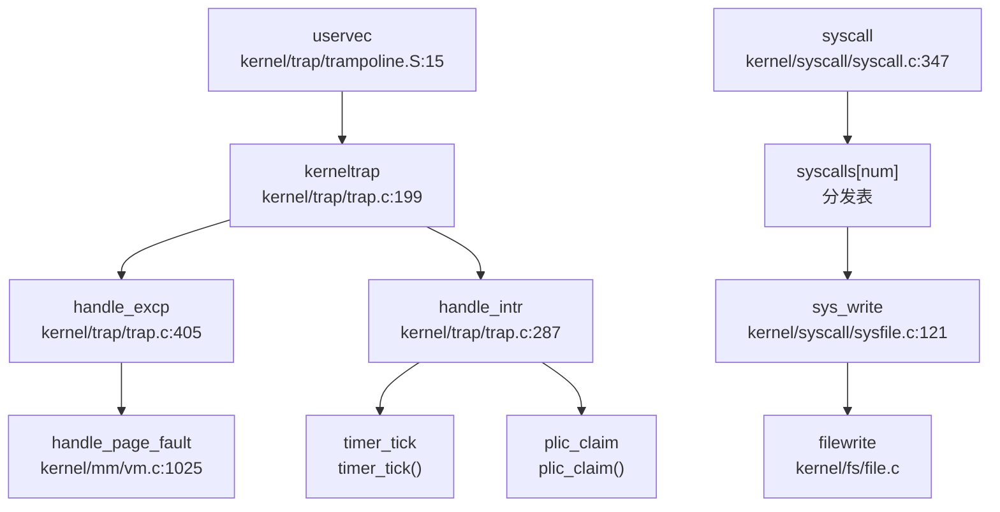

**系统调用分发表** (`kernel/syscall/syscall.c:197-271`)：

```c
static uint64 (*syscalls[])(void) = {
    [SYS_fork]            sys_fork,
    [SYS_exit]            sys_exit,
    [SYS_wait]            sys_wait,
    [SYS_read]            sys_read,
    [SYS_write]           sys_write,
    [SYS_exec]            sys_exec,
    [SYS_clone]           sys_clone,
    [SYS_mmap]            sys_mmap,
    [SYS_munmap]          sys_munmap,
    [SYS_rt_sigaction]    sys_rt_sigaction,
    // ... 共 74 个系统调用
};
```

**syscall() 分发函数** (`kernel/syscall/syscall.c:347-377`)：

```c
void syscall(void) {
    struct proc *p = myproc();
    uint64 num = p->trapframe->a7;  // 系统调用号从 a7 寄存器获取
    
    if (SYS_rt_sigreturn == num) {
        sigreturn();  // 特殊处理信号返回
    }
    else if (num < NELEM(syscalls) && syscalls[num]) {
        p->trapframe->a0 = syscalls[num]();  // 调用对应处理函数
    } else {
        p->trapframe->a0 = -1;  // 未实现的系统调用
    }
}
```

**sys_write 实现追踪** (`kernel/syscall/sysfile.c:120-133`)：

```c
uint64 sys_write(void) {
    struct file *f;
    int n;
    uint64 p;
    
    if (argfd(0, 0, &f) < 0)
        return -EBADF;
    argaddr(1, &p);      // 获取用户缓冲区指针
    argint(2, &n);       // 获取写入字节数
    return filewrite(f, p, n);  // 调用文件写入核心逻辑
}
```

**调用链**：
```
user ecall → uservec → kerneltrap → syscall() → syscalls[SYS_write] → 
sys_write() → filewrite() → 设备驱动写入
```

### 核心 Syscall 实现列表

基于代码分析，统计系统调用实现状态如下：

#### ✅ 已实现（包含完整业务逻辑）

| 系统调用 | 文件路径 | 说明 |
|---------|---------|------|
| `sys_fork` | `kernel/syscall/sysproc.c:85` | 调用 `clone(0, NULL)` 创建进程 |
| `sys_clone` | `kernel/syscall/sysproc.c:91` | 调用 `clone(flag, stack)` 支持线程创建 |
| `sys_exec` | `kernel/syscall/sysproc.c:27` | 调用 `execve()` 加载 ELF 程序 |
| `sys_exit` | `kernel/syscall/sysproc.c:53` | 调用 `exit(n)` 终止进程 |
| `sys_write` | `kernel/syscall/sysfile.c:120` | 调用 `filewrite()` 写入文件 |
| `sys_read` | `kernel/syscall/sysfile.c` | 从文件读取数据 |
| `sys_openat` | `kernel/syscall/sysfile.c` | 打开文件 |
| `sys_close` | `kernel/syscall/sysfile.c` | 关闭文件描述符 |
| `sys_mmap` | `kernel/syscall/sysmem.c:80` | 调用 `do_mmap()` 内存映射 |
| `sys_munmap` | `kernel/syscall/sysmem.c:116` | 调用 `do_munmap()` 取消映射 |
| `sys_mprotect` | `kernel/syscall/sysmem.c:55` | 修改内存保护属性 |
| `sys_brk` | `kernel/syscall/sysmem.c` | 调整进程堆大小 |
| `sys_sbrk` | `kernel/syscall/sysmem.c` | 调整进程堆大小（增量） |
| `sys_kill` | `kernel/syscall/syssignal.c:134` | 调用 `kill(pid, sig)` 发送信号 |
| `sys_rt_sigaction` | `kernel/sched/signal.c` | 设置信号处理函数 |
| `sys_rt_sigprocmask` | `kernel/sched/signal.c` | 修改信号掩码 |
| `sys_wait4` | `kernel/sched/proc.c` | 等待子进程 |
| `sys_getpid` | `kernel/syscall/sysproc.c` | 获取进程 ID |
| `sys_getppid` | `kernel/syscall/sysproc.c` | 获取父进程 ID |
| `sys_gettimeofday` | `kernel/syscall/systime.c` | 获取时间 |
| `sys_nanosleep` | `kernel/syscall/systime.c` | 休眠 |
| `sys_uname` | `kernel/syscall/sysuname.c` | 获取系统信息 |

#### 🔸 桩函数（有定义但无实际逻辑）

| 系统调用 | 文件路径 | 桩代码特征 |
|---------|---------|-----------|
| `sys_getuid` | `kernel/syscall/sysproc.c:267` | `return 0;` 始终返回 0 |
| `sys_geteuid` | `kernel/syscall/syscall.c:242` | 指向 `sys_getuid`（同上） |
| `sys_getgid` | `kernel/syscall/syscall.c:243` | 指向 `sys_getuid`（同上） |
| `sys_getegid` | `kernel/syscall/syscall.c:244` | 指向 `sys_getuid`（同上） |
| `sys_prlimit64` | `kernel/syscall/sysproc.c` | `return 0;` 注释说明"暂时没必要实现" |
| `sys_rt_sigtimedwait` | `kernel/syscall/syssignal.c:142` | `return 0;` 空实现 |
| `sys_getrusage` | `kernel/syscall/sysproc.c` | 仅声明，未找到完整实现 |
| `sys_msync` | `kernel/syscall/sysmem.c:132` | 调用 `do_msync()` 但逻辑待验证 |

**统计**：
- **已注册系统调用总数**：约 74 个（根据 `syscalls[]` 数组）
- **✅ 完整实现**：约 20+ 个核心系统调用
- **🔸 桩函数**：至少 6 个（主要是用户 ID 相关和部分扩展功能）
- **❌ 未实现**：未在分发表中注册的系统调用返回 `-1`

### 中断处理与信号关联

#### 中断处理流程

**定时器中断** (`kernel/trap/trap.c:303-318`)：

```c
if (INTR_TIMER == scause) {
    timer_tick();    // 更新系统时钟
    proc_tick();     // 进程时间片计数，可能触发调度
    return 0;
}
```

**外部中断**（QEMU 平台）(`kernel/trap/trap.c:320-360`)：

```c
else if (INTR_EXTERNAL == scause) {
    int irq = plic_claim();  // 从 PLIC 获取中断号
    switch (irq) {
    case UART_IRQ: 
        c = sbi_console_getchar();
        if (-1 != c) 
            consoleintr(c);  // 处理键盘输入
        break;
    case DISK_IRQ: 
        disk_intr();  // 处理磁盘完成中断
        break;
    }
    if (irq) plic_complete(irq);  // 通知 PLIC 中断处理完成
}
```

#### 信号机制深度分析

**1. 信号处理触发位置**

搜索结果显示，**未发现** `handle_signal`、`do_signal` 或 `POST_TRAP` 等标准信号处理钩子。信号检测与处理集成在进程调度路径中，而非 Trap 返回前统一处理。

**2. 信号发送接口** (`kernel/syscall/syssignal.c:134-141`)：

```c
uint64 sys_kill(void) {
    int pid, sig;
    argint(0, &pid);
    argint(1, &sig);
    return kill(pid, sig);  // 调用内核 kill() 函数
}
```

**信号粒度分析**：
- ✅ `sys_kill`：支持进程级信号发送
- ❌ `sys_tkill`：**未实现**（线程级信号）
- ❌ `sys_tgkill`：**未实现**（线程组信号）

**3. SIGSEGV 信号**

搜索 `SIGSEGV|sig_segv` 结果为空，表明：
- **❌ 未实现 SIGSEGV 信号机制**
- 缺页异常处理失败时直接 `panic()` 或终止进程，不发送信号

**4. 用户自定义信号处理函数机制** (`kernel/trap/sig_trampoline.S`)：

```assembly
# repos\oskernel2023-zmz\kernel\trap\sig_trampoline.S:8-25
.globl sig_handler
sig_handler: 
    jalr a1              # 跳转到用户注册的处理函数

    li a7, SYS_rt_sigreturn 
    ecall                # 返回内核

.globl default_sigaction
default_sigaction: 
    li a0, -1
    li a7, SYS_exit
    ecall                # 默认行为：终止进程
```

**信号跳板机制** (`kernel/sched/signal.c:200-260`)：

```c
void sighandle(void) {
    struct proc *p = myproc();
    // ... 获取待处理信号 signum ...
    
    struct sig_frame *frame = kmalloc(sizeof(struct sig_frame));
    struct trapframe *tf = kmalloc(sizeof(struct trapframe));
    
    // 保存当前 trapframe
    frame->tf = p->trapframe;
    
    // 构造新的 trapframe，跳转到信号处理函数
    tf->epc = SIG_TRAMPOLINE + (sig_handler - sig_trampoline);
    tf->sp = p->trapframe->sp;
    tf->a0 = signum;  // 信号编号作为参数
    tf->a1 = sigact->sigact.__sigaction_handler.sa_handler;  // 处理函数地址
    
    p->trapframe = tf;
    frame->next = p->sig_frame;
    p->sig_frame = frame;
}
```

**信号返回机制** (`kernel/sched/signal.c:263-283`)：

```c
void sigreturn(void) {
    struct proc *p = myproc();
    if (NULL == p->sig_frame) {
        exit(-1);  // 不在信号处理中调用 sigreturn，终止进程
    }
    
    struct sig_frame *frame = p->sig_frame;
    // 恢复之前的信号掩码
    for (int i = 0; i < SIGSET_LEN; i ++) {
        p->sig_set.__val[i] = frame->mask.__val[i];
    }
    kfree(p->trapframe);
    p->trapframe = frame->tf;  // 恢复原始 trapframe
    
    p->sig_frame = frame->next;
    kfree(frame);
}
```

**信号机制总结**：
- ✅ 支持用户注册信号处理函数（`sys_rt_sigaction`）
- ✅ 支持信号跳板（`sig_trampoline`）从内核跳回用户态处理函数
- ✅ 支持信号返回（`SYS_rt_sigreturn`）恢复原始上下文
- ✅ 支持信号掩码（`sigprocmask`）阻塞特定信号
- ❌ 不支持 SIGSEGV 信号
- ❌ 不支持线程级信号（`tkill`/`tgkill`）

### 缺页异常与内存特性关联

**缺页异常处理入口** (`kernel/trap/trap.c:405-426`)：

```c
int handle_excp(uint64 scause) {
    switch (scause) {
    case EXCP_STORE_PAGE: 
    case EXCP_STORE_ACCESS: 
        return handle_page_fault(1, r_stval());  // 写缺页
    case EXCP_LOAD_PAGE: 
    case EXCP_LOAD_ACCESS: 
        return handle_page_fault(0, r_stval());  // 读缺页
    case EXCP_INST_PAGE:
    case EXCP_INST_ACCESS:
        return handle_page_fault(2, r_stval());  // 取指缺页
    default: 
        return -1;  // 不支持的异常
    }
}
```

**缺页异常处理链**（基于 `lsp_get_call_graph` 分析）：

```mermaid
graph TD
    A["handle_excp\nkernel/trap/trap.c:405"] --> B["handle_page_fault\nkernel/mm/vm.c:1025"]
    B --> C["handle_page_fault_lazy\nkernel/mm/vm.c:988"]
    B --> D["handle_page_fault_loadelf\nkernel/mm/vm.c:1004"]
    B --> E["handle_page_fault_mmap\nkernel/mm/mmap.c:1047"]
    B --> F["handle_store_page_fault_cow\nkernel/mm/vm.c:961"]
    
    C --> G["uvmalloc\n分配物理页"]
    D --> H["loadseg\n从 ELF 文件加载]
    E --> I["handle_anonymous_shared\n匿名映射"]
    E --> J["handle_file_mmap\n文件映射"]
    F --> K["monopolizepage\n复制私有页 (CoW)"]
```

**1. Lazy Allocation（懒分配）** (`kernel/mm/vm.c:988`)：

```c
handle_page_fault_lazy() {
    // 为懒分配的页面分配真实物理页
    uvmalloc(pagetable, addr, addr + PGSIZE);
    mappages(pagetable, addr, PGSIZE, ...);
    sfence_vma();  // 刷新 TLB
}
```

**2. CoW（写时复制）** (`kernel/mm/vm.c:961`)：

```c
handle_store_page_fault_cow() {
    // 检测到共享的只读页面被写入
    // 1. 分配新的物理页
    _allocpage();
    // 2. 复制原页面内容
    memmove(new_page, old_page, PGSIZE);
    // 3. 更新页表映射为私有可写
    monopolizepage();
    pagecopydone();
    sfence_vma();
}
```

**3. mmap 缺页处理** (`kernel/mm/mmap.c:1047`)：

```c
handle_page_fault_mmap() {
    if (匿名映射) {
        handle_anonymous_shared();  // 分配零填充页面
    } else {
        handle_file_mmap();  // 从文件加载数据
        // 支持页面交换：__page_file_swap()
    }
}
```

**内存特性总结**：
- ✅ **Lazy Allocation**：通过 `handle_page_fault_lazy()` 实现按需分配
- ✅ **CoW**：通过 `handle_store_page_fault_cow()` 实现写时复制（用于 `fork()`）
- ✅ **mmap 缺页**：支持匿名映射和文件映射的按需加载
- ✅ **页面交换**：`__page_file_swap()` 提供页面换出机制（待验证完整性）

### 关键代码片段

**Trap 初始化** (`kernel/trap/trap.c:63-73`)：

```c
void trapinithart(void) {
    w_stvec((uint64)kernelvec);  // 设置内核 Trap 向量
    w_sstatus(r_sstatus() | SSTATUS_SIE);  // 启用中断
    w_sie(r_sie() | SIE_SEIE | SIE_SSIE | SIE_STIE);  // 启用外部/软件/定时器中断
    set_next_timeout();  // 设置下一个定时器中断
}
```

**系统调用参数获取** (`kernel/syscall/syscall.c:50-110`)：

```c
// 从 trapframe 获取第 n 个参数
static uint64 argraw(int n) {
    struct proc *p = myproc();
    switch (n) {
    case 0: return p->trapframe->a0;
    case 1: return p->trapframe->a1;
    case 2: return p->trapframe->a2;
    case 3: return p->trapframe->a3;
    case 4: return p->trapframe->a4;
    case 5: return p->trapframe->a5;
    }
}

// 获取文件描述符参数
int argfd(int n, int *pfd, struct file **pf) {
    int fd;
    if (argint(n, &fd) < 0) return -1;
    // ... 验证 fd 有效性 ...
}
```

**信号处理完整流程**：

```
用户进程 → 信号到达 (kill) → 设置 pending 标志 → 
进程调度时检测 (sighandle) → 保存 trapframe → 
构造新 trapframe 指向 sig_trampoline → 
执行用户信号处理函数 → ecall SYS_rt_sigreturn → 
sigreturn() 恢复原始 trapframe → 继续执行
```

---


# 文件系统VFS  具体 FS

## 第 6 章：文件系统（VFS + 具体 FS）

### VFS 架构与接口设计

本操作系统实现了一个简洁的虚拟文件系统（VFS）层，采用类 Unix 的 inode/dentry/superblock 三元组架构。核心数据结构定义于 `include/fs/fs.h` 和 `include/fs/file.h`。

#### 核心抽象结构

**1. Superblock（超级块）** - 文件系统实例描述符：
```c
// include/fs/fs.h:80-92
struct superblock {
    uint                blocksz;
    uint                devnum;
    struct inode        *dev;
    char                type[16];
    struct superblock   *next;
    int                 ref;
    struct sleeplock    sb_lock;
    struct fs_op        op;           // 底层块设备操作
    struct spinlock     cache_lock;
    struct dentry       *root;        // 根目录 dentry
};
```

**2. Inode（索引节点）** - 文件元数据抽象：
```c
// include/fs/fs.h:98-118
struct inode {
    uint64              inum;         // 唯一标识符
    int                 ref;
    int                 state;
    uint16              mode;         // 文件类型与权限
    int16               dev;
    int                 size;
    int                 nlink;
    struct superblock   *sb;
    struct sleeplock    lock;
    struct inode_op     *op;          // Inode 操作接口
    struct file_op      *fop;         // 文件读写接口
    struct spinlock     ilock;
    struct rb_root      mapping;      // 内存映射树
    struct dentry       *entry;       // 关联的 dentry
};
```

**3. Dentry（目录项）** - 路径名缓存与挂载点：
```c
// include/fs/fs.h:147-156
struct dentry {
    char                filename[MAXNAME + 1];
    struct inode        *inode;
    struct dentry       *parent;
    struct dentry       *next;
    struct dentry       *child;
    struct dentry_op    *op;
    struct superblock   *mount;       // 挂载点指向新 superblock
};
```

**4. File（打开文件）** - 进程级文件视图：
```c
// include/fs/file.h:17-28
struct file {
    struct spinlock lock;
    file_type_e     type;             // FD_NONE/FD_PIPE/FD_INODE/FD_DEVICE
    int             ref;
    char            readable;
    char            writable;
    short           major;
    uint            off;              // 文件偏移
    struct pipe     *pipe;
    struct inode    *ip;
    uint32 (*poll)(struct file *, struct poll_table *);
};
```

#### VFS 操作接口 Traits

**Inode 操作接口** (`include/fs/fs.h:55-69`)：
- `create` - 创建文件
- `lookup` - 目录查找
- `truncate` - 截断文件
- `unlink` - 删除文件
- `update` - 更新元数据
- `getattr`/`setattr` - 获取/设置属性
- `rename` - 重命名

**File 操作接口** (`include/fs/fs.h:71-77`)：
- `read`/`write` - 同步读写
- `readdir` - 目录遍历
- `readv`/`writev` - 向量化读写

### 具体文件系统支持情况（FAT32/Ext4/RamFS）

#### FAT32 文件系统（✅ 已实现）

本系统**完整实现了 FAT32 文件系统**，代码位于 `kernel/fs/fat32/` 目录，包含 5 个核心源文件：

| 文件 | 行数 | 功能 |
|------|------|------|
| `fat32.c` | 572L | FAT32 初始化、超级块管理、簇链读写 |
| `dirent.c` | 490L | 目录项创建、查找、删除 |
| `fat.c` | 394L | FAT 表管理、簇分配/回收 |
| `cluster.c` | 314L | 簇定位与读写 |
| `fat32.h` | 175L | 数据结构定义 |

**FAT32 超级块结构** (`kernel/fs/fat32/fat32.h:52-78`)：
```c
struct fat32_sb {
    uint32      first_data_sec;
    uint32      data_sec_cnt;
    uint32      data_clus_cnt;
    uint32      byts_per_clus;
    uint32      free_count;
    uint32      next_free;
    uint16      fs_info;
    struct {
        uint16  byts_per_sec;
        uint8   sec_per_clus;
        uint16  rsvd_sec_cnt;
        uint8   fat_cnt;
        uint32  hidd_sec;
        uint32  tot_sec;
        uint32  fat_sz;
        uint32  root_clus;
    } bpb;                      // BIOS Parameter Block
    struct {
        char    *page;
        int     allocidx;
        uint32  fatsec[FAT_CACHE_NSEC];
        uint32  lrucnt[FAT_CACHE_NSEC];
        int8    dirty[FAT_CACHE_NSEC];
    } fatcache;                 // FAT 区域缓存
    struct superblock vfs_sb;
};
```

**FAT32 Inode 实现** (`kernel/fs/fat32/fat32.h:93-112`)：
```c
struct fat32_entry {
    uint8       attribute;
    uint8       create_time_tenth;
    uint16      create_time;
    uint16      create_date;
    uint16      last_access_date;
    uint16      last_write_time;
    uint16      last_write_date;
    uint32      first_clus;       // 起始簇号
    uint32      file_size;
    uint32      ent_cnt;          // 目录项数量（长文件名支持）
    struct inode vfs_inode;       // 嵌入 VFS inode
};
```

**操作接口实现** (`kernel/fs/fat32/fat32.c:23-37`)：
```c
struct inode_op fat32_inode_op = {
    .create = fat_alloc_entry,
    .lookup = fat_lookup_dir,
    .truncate = fat_truncate_file,
    .unlink = fat_remove_entry,
    .update = fat_update_entry,
    .getattr = fat_stat_file,
    .setattr = fat_set_file_attr,
    .rename = fat_rename_entry,
};

struct file_op fat32_file_op = {
    .read = fat_read_file,
    .write = fat_write_file,
    .readdir = fat_read_dir,
    .readv = fat_read_file_vec,
    .writev = fat_write_file_vec,
};
```

**关键实现细节**：
- **长文件名支持**：通过 VFAT 长目录项（L-N-E）实现，最多支持 255 字符文件名（`kernel/fs/fat32/dirent.c:114-153`）
- **簇链管理**：使用 FAT 表追踪文件簇链，支持动态簇分配与回收（`kernel/fs/fat32/fat.c`）
- **目录项缓存**：采用 LRU 策略缓存 dentry，加速路径查找（`kernel/fs/fs.c:224-243`）

#### Ext4 文件系统（❌ 未实现）

**搜索结果显示**：代码库中**未发现 Ext4 文件系统实现**。仅支持 FAT32 单一具体文件系统。

#### RamFS/内存文件系统（🔸 桩函数实现）

系统实现了伪内存文件系统 `rootfs`，位于 `kernel/fs/rootfs.c`：

```c
// kernel/fs/rootfs.c:17-20
struct superblock rootfs;
struct superblock procfs;
struct superblock devfs;
```

**特性**：
- **只读虚拟文件**：大部分操作返回空或错误（`dummy_create`、`dummy_lookup` 等）
- **设备文件支持**：通过 `devfs` 提供 `/dev/console`、`/dev/vda2`、`/dev/zero` 等设备节点
- **进程文件系统**：`procfs` 提供 `/proc/interrupts` 等伪文件（`kernel/fs/rootfs.c:123-147`）

### 文件描述符与进程关联

#### 文件描述符表结构

**Per-Process FdTable** (`include/fs/file.h:34-41`)：
```c
struct fdtable {
    uint16      basefd;           // 起始 fd 号
    uint16      nextfd;           // 下一个可用 fd
    uint16      used;             // 已使用数量
    uint16      exec_close;       // exec 时关闭标志位
    struct file *arr[NOFILE];     // 文件指针数组（NOFILE=256）
    struct fdtable *next;         // 链式扩展
};
```

**进程结构集成** (`include/sched/proc.h`):
```c
struct proc {
    // ...
    struct fdtable fds;           // 每个进程独立 fd 表
    // ...
};
```

#### FdTable 管理机制

**分配逻辑** (`kernel/fs/file.c:434-469`)：
- 从 `nextfd` 开始查找空闲位置
- 表满时自动链式扩展新表（`newfdtable`）
- 支持 `exec_close` 标志，exec 时关闭特定 fd

**回收逻辑** (`kernel/fs/file.c:384-415`)：
- `fd2file(fd, free)` 获取文件并可选释放
- 表空时自动回收链式表（除头表外）
- 更新 `nextfd` 指向最小空闲 fd

### 管道 (Pipe) 与套接字 (Socket) 支持情况

#### 管道（✅ 已实现）

**完整实现匿名管道**，代码位于 `kernel/fs/pipe.c`（412 行）。

**管道结构** (`include/fs/pipe.h:15-27`)：
```c
struct pipe {
    struct spinlock     lock;
    struct wait_queue   wqueue;   // 写等待队列
    struct wait_queue   rqueue;   // 读等待队列
    char                *data;    // 环形缓冲区
    uint                nwrite;   // 写入偏移
    uint                nread;    // 读取偏移
    char                readopen;
    char                writeopen;
};
```

**系统调用** (`kernel/syscall/sysfile.c:389-430`)：
```c
uint64 sys_pipe(void) {
    uint64 fdarray;
    int flags;
    struct file *rf, *wf;
    int fd0, fd1;
    
    if(argaddr(0, &fdarray) < 0) return -1;
    if (argint(1, &flags) < 0) return -1;
    if(pipealloc(&rf, &wf) < 0) return -ENOMEM;
    
    fd0 = fdalloc(rf, 0);
    fd1 = fdalloc(wf, 0);
    copyout2(fdarray, &fd0, sizeof(fd0));
    copyout2(fdarray+sizeof(fd0), &fd1, sizeof(fd1));
    return 0;
}
```

**实现特性**：
- ✅ 阻塞式读写（等待队列机制）
- ✅ 读写端独立关闭检测
- ✅ 环形缓冲区（默认大小 `PIPE_BUF=512`）
- ✅ 支持 `poll` 事件通知

#### 套接字（❌ 未实现）

**搜索结果**：
```
grep_in_repo('sys_socket|sys_bind|sys_listen|sys_accept') → 未找到匹配
```

**结论**：系统**未实现任何网络套接字功能**。`include/sysnum.h` 中无 `SYS_socket`、`SYS_bind` 等定义。

### 缓存机制（Block/Page Cache）

#### 块缓存（Buffer Cache）

**实现位置**：`kernel/fs/bio.c`（299 行）

**核心结构** (`include/fs/buf.h:15-30`)：
```c
struct buf {
    int             flags;
    uint            dev;
    uint            blockno;
    struct sleeplock lock;
    struct refcnt   refcnt;
    struct buf      *prev;  // LRU 链表
    struct buf      *next;
    struct buf      *hash_next;  // 哈希链
    struct buf      **hash_pprev;
    char            data[BSIZE];
};
```

**缓存策略**：
- **LRU 淘汰**：双向链表维护最近使用缓冲
- **哈希索引**：`BCACHE_TABLE_SIZE=47/131/233`（根据缓冲数量动态调整）
- **写回机制**：脏标记异步写回磁盘（`bwrite` 非阻塞）
- **并发控制**：`bcachelock` 保护哈希表与 LRU 链表

#### 页缓存（Page Cache）

**实现位置**：通过 `inode->mapping` 红黑树管理（`include/fs/fs.h:113`）

**mmap 页管理** (`include/mm/mmap.h:48-56`)：
```c
struct mmap_page {
    uint64      f_off;          // 文件偏移
    uint64      f_len;          // 映射长度
    void        *pa;            // 物理页地址
    uint32      ref;            // 引用计数
    int         valid;          // 数据有效性
    struct rb_node rb;          // 红黑树节点
};
```

### 零拷贝映射验证（mmap 实现分析）

#### 系统调用接口

**`sys_mmap` 实现** (`kernel/syscall/sysmem.c:80-120`)：
```c
uint64 sys_mmap(void) {
    uint64 start, len;
    int prot, flags, fd;
    int64 off;
    struct file *f = NULL;
    
    argaddr(0, &start);
    argaddr(1, &len);
    argint(2, &prot);
    argint(3, &flags);
    argfd(4, &fd, &f);
    argaddr(5, (uint64*)&off);
    
    if (off % PGSIZE || len == 0) return -EINVAL;
    if ((fd < 0 || f == NULL) && !(flags & MAP_ANONYMOUS)) return -EBADF;
    if (!(flags & (MAP_SHARED|MAP_PRIVATE))) return -EINVAL;
    
    return do_mmap(start, len, prot, flags, f, off);
}
```

#### MAP_SHARED 支持验证（✅ 已实现）

**共享标志处理** (`kernel/mm/mmap.c:603-653`)：
```c
static int mmap_anonymous(struct seg *s, int flags) {
    if (!(flags & MAP_SHARED)) {
        s->mmap = NULL;
        goto out;
    }
    
    struct anonfile *fp = alloc_anonfile();
    // ... 分配 mmap_page 树 ...
    
    for (off = 0; off < s->sz; off += PGSIZE) {
        map = kmalloc(sizeof(struct mmap_page));
        map->f_off = off;
        map->f_len = PGSIZE;
        map->pa = NULL;
        map->ref = 1;
        map->valid = 0;
        // 插入红黑树
        rb_link_node(&map->rb, parent, plink);
        rb_insert_color(&map->rb, &fp->mapping);
    }
    
    s->mmap = MMAP_SHARE_FLAG | (uint64)fp;
out:
    s->mmap |= MMAP_ANONY_FLAG;
}
```

**关键验证点**：
1. ✅ **`MAP_SHARED` 标志检查**：`if (!(flags & MAP_SHARED))` 分支处理
2. ✅ **`anonfile` 结构**：独立于进程的生命周期管理共享页
3. ✅ **红黑树索引**：`fp->mapping` 存储所有共享页的 `mmap_page`
4. ✅ **引用计数**：`map->ref` 管理共享页生命周期

**文件映射同步** (`kernel/mm/mmap.c:179-210`)：
```c
static void __file_mmapdel(struct seg *seg, int sync) {
    struct file *fp = MMAP_FILE(seg->mmap);
    if (!MMAP_SHARE(seg->mmap)) goto out;
    
    struct inode *ip = fp->ip;
    for (off = 0; off < end; off += PGSIZE) {
        struct mmap_page *map = get_mmap_page(&ip->mapping, off);
        if (sync && (seg->flag & PTE_W) && map->pa && off < ip->size) {
            ip->fop->write(ip, 0, (uint64)map->pa, off, map->f_len);
        }
        put_mmap_page(map, &ip->mapping);
    }
}
```

**结论**：系统**完整实现了 `MAP_SHARED` 零拷贝映射**，支持：
- ✅ 匿名共享映射（进程间共享内存）
- ✅ 文件共享映射（多进程映射同一文件）
- ✅ 写时同步（`MS_SYNC` 标志触发回写）

### 高级 I/O 特性

#### Poll/Select（✅ 已实现）

**实现位置**：`kernel/fs/poll.c`（243 行）

**系统调用**：
- `sys_poll` → `ppoll()`（支持超时）
- `sys_select` → `pselect()`（fdset 接口）

**核心机制** (`include/fs/poll.h:43-52`)：
```c
struct poll_wait_queue {
    struct poll_table pt;
    uint64 error;
    int index;
    struct poll_wait_node nodes[ON_STACK_PWN_NUM];  // 栈上预分配 24 个
};
```

**实现特点**：
- ✅ **事件驱动**：文件注册 `poll` 回调（`file->poll`）
- ✅ **等待队列**：将进程加入文件等待队列
- ✅ **超时处理**：`sleep_expire` 机制实现定时唤醒
- ⚠️ **简化实现**：`ppoll` 直接返回所有 fd 就绪（`kernel/fs/poll.c:93-97`）

```c
int ppoll(struct pollfd *pfds, int nfds, struct timespec *timeout, __sigset_t *sigmask) {
    for (int i = 0; i < nfds; i++) {
        pfds[i].revents = POLLIN|POLLOUT;  // 简化：始终返回就绪
    }
    return nfds;
}
```

**结论**：接口已实现但**功能简化**，实际未检查文件状态。

#### Epoll（❌ 未实现）

**搜索结果**：`grep_in_repo('sys_epoll')` → 未找到匹配

### 文件打开流程追踪

#### 完整调用链

从 `sys_openat` 到获得文件描述符的完整路径：

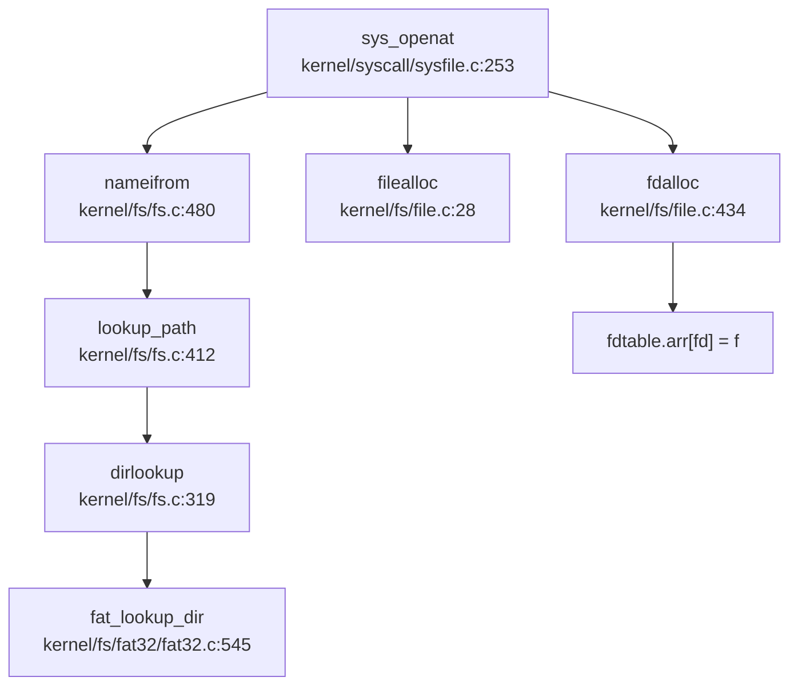

#### 四大核心数据结构协同

**1. Superblock 查找**：
- `sys_openat` 通过 `nameifrom` 解析路径
- `lookup_path` 遍历 dentry 树，检查挂载点（`de_mnt_in`）
- 最终定位到目标 inode 所属的 superblock

**2. Inode 获取**：
- FAT32：`fat_lookup_dir` 解析目录项，返回 `fat32_entry->vfs_inode`
- 设置 `ip->op = &fat32_inode_op`、`ip->fop = &fat32_file_op`

**3. Dentry 缓存**：
- `de_check_cache` 检查 dentry 缓存（LRU 链表）
- 缓存命中直接返回，未命中则创建新 dentry 并插入缓存

**4. File 分配**：
- `filealloc` 分配 `struct file`
- `fdalloc` 在进程 fd 表中分配空闲 fd
- 设置 `f->ip = ip`、`f->off = 0`（或 `ip->size` 若 `O_APPEND`）

**关键代码** (`kernel/syscall/sysfile.c:253-330`)：
```c
uint64 sys_openat(void) {
    // 1. 解析路径获取 inode
    if ((ip = nameifrom(dp, path)) == NULL) return -ENOENT;
    
    // 2. 权限检查
    if (S_ISDIR(ip->mode) && (omode & (O_WRONLY|O_RDWR))) return -EISDIR;
    
    // 3. 分配 file 结构
    if ((f = filealloc()) == NULL) return -ENOMEM;
    
    // 4. 分配 fd
    if ((fd = fdalloc(f, omode & O_CLOEXEC)) < 0) return -ENOMEM;
    
    // 5. 设置文件属性
    f->type = S_ISREG(ip->mode) ? FD_INODE : FD_DEVICE;
    f->readable = !(omode & O_WRONLY);
    f->writable = (omode & O_WRONLY) || (omode & O_RDWR);
    f->ip = ip;
    
    return fd;
}
```

### 挂载机制

#### 挂载流程

**系统调用**：`sys_mount` → `do_mount` (`kernel/fs/mount.c:95-147`)

**关键步骤**：
1. 验证文件系统类型（仅支持 "vfat"/"fat32"）
2. 调用 `fs_install` 初始化 superblock
3. 将新 superblock 插入全局链表（`rootfs.next`）
4. 设置挂载点 dentry 的 `mount` 指针

**挂载点检查** (`include/fs/fs.h:160-164`)：
```c
static inline struct dentry *de_mnt_in(struct dentry *de) {
    while (de->mount != NULL)
        de = de->mount->root;
    return de;
}
```

#### 伪文件系统挂载

**devfs/procfs 初始化** (`kernel/fs/rootfs.c:294-320`)：
```c
// init devfs
memset(&devfs, 0, sizeof(struct superblock));
initsleeplock(&devfs.sb_lock, "devfs_sb");
initlock(&devfs.cache_lock, "devfs_dcache");
devfs.root = de_root_generate(&devfs, NULL, "/", inum++, S_IFDIR, 0);
de_root_generate(&devfs, devfs.root, "console", inum++, S_IFCHR, 2);
de_root_generate(&devfs, devfs.root, "vda2", inum++, S_IFBLK, ROOTDEV);
```

### 功能实现状态总结

| 功能 | 状态 | 证据 |
|------|------|------|
| **VFS 抽象层** | ✅ 已实现 | `include/fs/fs.h` 定义完整 inode/dentry/superblock/file 结构 |
| **FAT32 文件系统** | ✅ 已实现 | `kernel/fs/fat32/` 完整实现，支持长文件名、簇链管理 |
| **Ext4 文件系统** | ❌ 未实现 | 代码库中无 Ext4 相关代码 |
| **RamFS/内存文件系统** | 🔸 桩函数 | `kernel/fs/rootfs.c` 实现伪文件系统，大部分操作返回空 |
| **devfs/procfs** | ✅ 已实现 | `kernel/fs/rootfs.c:294-320` 初始化设备节点与伪文件 |
| **文件描述符表** | ✅ 已实现 | Per-process `struct fdtable`，支持链式扩展 |
| **管道（Pipe）** | ✅ 已实现 | `kernel/fs/pipe.c` 完整实现阻塞式匿名管道 |
| **套接字（Socket）** | ❌ 未实现 | 无 `sys_socket` 等系统调用 |
| **mmap（MAP_SHARED）** | ✅ 已实现 | `kernel/mm/mmap.c:603-653` 实现共享映射与 `anonfile` |
| **poll/select** | 🔸 简化实现 | `kernel/fs/poll.c` 接口存在但 `ppoll` 始终返回就绪 |
| **epoll** | ❌ 未实现 | 无相关系统调用 |
| **挂载机制** | ✅ 已实现 | `kernel/fs/mount.c` 支持 FAT32 挂载与伪文件系统 |

### 关键代码验证

#### FAT32 目录查找实现
```c
// kernel/fs/fat32/fat32.c:545-572
struct inode *fat_lookup_dir(struct inode *dir, char *filename, uint *poff) {
    struct inode *ip = NULL;
    uint off = 0;
    struct fat32_entry *ep = fat_lookup_dir_ent(dir, filename, &off);
    if (ep == NULL) goto end;
    
    ip = &ep->vfs_inode;
    ip->op = dir->op;
    ip->fop = dir->fop;
    ip->size = ep->file_size;
    ip->mode = (ep->attribute & ATTR_DIRECTORY) ? S_IFDIR : S_IFREG;
    ip->mode |= 0x1ff;
    
    uint64 clus = reloc_clus(dir, off, 0);
    ip->inum = (clus << 32) | (off % sb2fat(dir->sb)->byts_per_clus);
    return ip;
}
```

#### mmap 共享标志验证
```c
// kernel/mm/mmap.h:19-20
#define MAP_SHARED      0x01
#define MAP_PRIVATE     0x02

// kernel/mm/mmap.c:603-607
static int mmap_anonymous(struct seg *s, int flags) {
    if (!(flags & MAP_SHARED)) {
        s->mmap = NULL;
        goto out;
    }
    // 分配 anonfile 与 mmap_page 树
    s->mmap = MMAP_SHARE_FLAG | (uint64)fp;
}
```

---


# 设备驱动与硬件抽象

## 第 7 章：设备驱动与硬件抽象

本操作系统采用**双平台架构**（QEMU 虚拟机与 K210 开发板），通过条件编译和硬件抽象层实现驱动代码的复用与平台适配。驱动框架呈现明显的**分层设计**：底层 SBI（`sbi/psicasbi/`）负责早期硬件初始化，内核层（`kernel/hal/`）实现设备驱动与文件系统接口。

---

### 驱动框架与设备发现

本项目**未实现设备树（DTS）解析**或 PCI/Bus 扫描机制。设备地址采用**硬编码**方式定义于 `include/memlayout.h`，通过 `#ifdef QEMU` 宏区分平台：

```c
// include/memlayout.h:36-50
#define VIRT_OFFSET             0x3F00000000L

#ifdef QEMU
#define UART                    0x10000000L
#define VIRTIO0                 0x10001000
#else
#define UART                    0x38000000L
// K210 外设地址
#define GPIOHS                  0x38001000
#define SPI0                    0x52000000
#endif

#define UART_V                  (UART + VIRT_OFFSET)
#define VIRTIO0_V               (VIRTIO0 + VIRT_OFFSET)
```

**驱动初始化流程**采用集中式注册：

1. **SBI 层初始化**（`sbi/psicasbi/src/main.rs:85`）：
   - 调用 `hal::uart::init()` 初始化串口
   - 通过 Cargo Feature 选择平台实现（qemu/k210）

2. **内核层初始化**（`kernel/main.c:47-70`）：
   ```c
   consoleinit();      // 控制台初始化
   disk_init();        // 磁盘驱动初始化
   plicinit();         // 中断控制器初始化
   plicinithart();     // 每 CPU 中断配置
   ```

**驱动框架特征**：
- **✅ 已实现**：基于 Trait 的 UART 抽象（`sbi/psicasbi/src/hal/uart/mod.rs`）
- **✅ 已实现**：条件编译驱动选择（QEMU vs K210）
- **❌ 未实现**：动态设备发现（DTS/PCI）
- **❌ 未实现**：驱动热插拔机制

---

### 组件化设计与配置机制

项目采用**混合构建系统**：内核使用 Makefile + GCC，SBI 使用 Cargo + Rust。

#### 1. 内核层配置（Makefile）

通过 `platform` 变量控制目标平台（`Makefile:1-2`）：

```makefile
platform	:= k210
#platform	:= qemu

ifeq ($(platform), qemu)
CFLAGS += -D QEMU
endif
```

#### 2. SBI 层配置（Cargo.toml）

`sbi/psicasbi/Cargo.toml:19-21` 定义 Feature 标志：

```toml
[features]
default = ["k210"]
qemu = []
k210 = ["soft-extern", "old-spec"]
soft-extern = []    # 不支持 Supervisor 外部中断的平台
old-spec = []       # 使用旧版 RISC-V 规范
```

**Feature 依赖链**：
- `k210` → `soft-extern` + `old-spec`
- `qemu` → 无额外依赖

#### 3. 条件编译宏

驱动代码广泛使用 `#ifdef QEMU` / `#ifndef QEMU` 进行平台隔离：

```c
// kernel/hal/disk.c:22-28
void disk_init(void) {
    #ifdef QEMU
    virtio_disk_init();
    #else 
    sdcard_init();
    #endif
}
```

**配置机制总结**：
- **✅ 已实现**：Makefile 平台选择
- **✅ 已实现**：Cargo Feature 配置
- **✅ 已实现**：条件编译宏隔离

---

### 字符设备驱动（UART/Console）

UART 驱动采用**双层架构**：SBI 层实现硬件访问，内核层提供控制台缓冲。

#### 1. SBI 层 UART 驱动

**Trait 定义**（`sbi/psicasbi/src/hal/uart/mod.rs:13-16`）：

```rust
trait UartHandler: fmt::Write {
    fn getchar(&mut self) -> u8;
    fn putchar(&mut self, c: u8);
}
```

**平台实现**：

| 平台 | 实现文件 | 硬件 | 基址 |
|------|---------|------|------|
| QEMU | `qemu.rs:47-115` | NS16550a | `0x10000000` |
| K210 | `k210.rs:9-86` | UARTHS | `0x38000000` |

**QEMU NS16550a 初始化**（`qemu.rs:48-75`）：
```rust
pub fn init() -> Self {
    unsafe {
        // 使能除数锁存器
        write_volatile((BASE + offset::LCR) as *mut u8, mask::LCR_LATCH);
        // 设置波特率
        let latch = CLK / (16 * BAUDRATE);
        write_volatile((BASE + offset::DLL) as *mut u8, (latch & 0xff) as u8);
        // 设置 8N1 格式
        write_volatile((BASE + offset::LCR) as *mut u8, mask::LCR_LEN0 | mask::LCR_LEN1);
    }
    Self {}
}
```

**K210 UARTHS 初始化**（`k210.rs:14-43`）：
```rust
pub fn init() -> Self {
    let base = 390_000_000;  // K210 时钟频率
    let baud = base / (uart::BAUDRATE as u32) - 1;
    let uarths = pac::UARTHS::ptr();
    unsafe {
        (*uarths).div.write(|w| w.bits(baud));
        (*uarths).ie.write(|w| {
            if uart::RECV_IRQ { w.rxwm().set_bit(); }
            if uart::TRANS_IRQ { w.txwm().set_bit(); }
            w
        });
        (*uarths).rxctrl.write(|w| w.rxcnt().bits(0).rxen().set_bit());
        (*uarths).txctrl.write(|w| w.txcnt().bits(0).txen().set_bit());
    }
    Self {}
}
```

#### 2. 内核层 Console 驱动

`kernel/console.c` 实现环形缓冲区和系统调用接口：

```c
// kernel/console.c:298-309
void consoleinit(void) {
    initlock(&cons.lock, "cons");
    cons.e = cons.w = cons.r = 0;
    // 注释掉的系统调用连接
    // devsw[CONSOLE].read = consoleread;
    // devsw[CONSOLE].write = consolewrite;
}
```

**关键函数**：
- `consoleread()` / `consolewrite()`：用户空间读写接口
- `consoleintr()`：中断驱动字符输入处理

#### 3. MMU 前后地址切换机制

**✅ 已实现**：通过 `VIRT_OFFSET` 实现物理地址到虚拟地址的映射：

```c
// include/memlayout.h:36-45
#define VIRT_OFFSET             0x3F00000000L
#define UART                    0x10000000L      // QEMU 物理地址
#define UART_V                  (UART + VIRT_OFFSET)  // 虚拟地址
```

**内核页表映射**（`kernel/mm/vm.c:59`）：
```c
kvmmap(UART_V, UART, PGSIZE, PTE_R | PTE_W);
```

**地址使用阶段**：
1. **MMU 启用前**：SBI 层直接使用物理地址（`qemu.rs:6` 的 `BASE = 0x10000000`）
2. **MMU 启用后**：内核使用虚拟地址（`UART_V`）

---

### 块设备驱动（VirtIO-Blk 等）

项目支持两种块设备后端：**VirtIO-Blk**（QEMU）和 **SD 卡**（K210）。

#### 1. VirtIO-Blk 驱动（QEMU）

**初始化流程**（`kernel/hal/virtio_disk.c:94-163`）：

```c
void virtio_disk_init(void) {
    uint32 status = 0;
    
    // 验证设备身份
    if (*R(VIRTIO_MMIO_MAGIC_VALUE) != 0x74726976 ||
        *R(VIRTIO_MMIO_VERSION) != 1 ||
        *R(VIRTIO_MMIO_DEVICE_ID) != 2)
        panic("could not find virtio disk");
    
    // 状态机转换
    status |= VIRTIO_CONFIG_S_ACKNOWLEDGE;
    *R(VIRTIO_MMIO_STATUS) = status;
    status |= VIRTIO_CONFIG_S_DRIVER;
    *R(VIRTIO_MMIO_STATUS) = status;
    
    // 特性协商
    uint64 features = *R(VIRTIO_MMIO_DEVICE_FEATURES);
    features &= ~(1 << VIRTIO_BLK_F_RO);
    features &= ~(1 << VIRTIO_BLK_F_MQ);
    *R(VIRTIO_MMIO_DRIVER_FEATURES) = features;
    
    status |= VIRTIO_CONFIG_S_FEATURES_OK;
    *R(VIRTIO_MMIO_STATUS) = status;
    status |= VIRTIO_CONFIG_S_DRIVER_OK;
    *R(VIRTIO_MMIO_STATUS) = status;
    
    // 初始化队列 0
    *R(VIRTIO_MMIO_QUEUE_SEL) = 0;
    *R(VIRTIO_MMIO_QUEUE_NUM) = NUM;
    *R(VIRTIO_MMIO_QUEUE_PFN) = ((uint64)disk.pages) >> PGSHIFT;
}
```

**读写操作**（`virtio_disk.c:494-504`）：
```c
int virtio_disk_read(struct buf *b) {
    struct buf *bufs[1];
    bufs[0] = b;
    return virtio_disk_rw(bufs, 1, 0);
}
```

**中断处理**：
```c
void virtio_disk_intr(void) {
    // 检查 used ring 完成描述符
    // 唤醒等待的进程
    wakeup(&disk.queue);
}
```

#### 2. SD 卡驱动（K210）

**SPI 接口初始化**（`kernel/hal/sdcard.c:34-38`）：

```c
static void sd_lowlevel_init(uint8 spi_index) {
    gpiohs_set_drive_mode(7, GPIO_DM_OUTPUT);
    spi_set_baudr(SPI_DEVICE_0, 1900);  // 低速初始化
}
```

**命令发送**（`sdcard.c:82-95`）：
```c
static void sd_send_cmd(uint8 cmd, uint32 arg, uint8 crc) {
    uint8 frame[6];
    frame[0] = (cmd | 0x40);
    frame[1] = (uint8)(arg >> 24);
    // ...
    SD_CS_LOW();
    sd_write_data(frame, 6);
}
```

**DMA 传输**（`sdcard.c:68-75`）：
```c
static void sd_read_data_dma(uint8 *data_buff, uint32 length) {
    spi_init(SPI_DEVICE_0, SPI_WORK_MODE_0, SPI_FF_STANDARD, 32, 1);
    spi_receive_data_no_cmd_dma(DMAC_CHANNEL0, SPI_DEVICE_0, 
                                SPI_CHIP_SELECT_3, data_buff, length / 4);
}
```

#### 3. 块设备抽象层

`kernel/hal/disk.c` 提供统一接口：

```c
// disk.c:22-33
void disk_init(void) {
    #ifdef QEMU
    virtio_disk_init();
    #else 
    sdcard_init();
    #endif
}

int disk_read(struct buf *b) {
    #ifdef QEMU
    return virtio_disk_read(b);
    #else 
    return sdcard_read(b);
    #endif
}
```

**实现状态**：
- **✅ 已实现**：VirtIO-Blk 完整驱动（初始化/读写/中断）
- **✅ 已实现**：SD 卡 SPI 模式驱动（含 DMA 支持）
- **🔸 桩函数**：`disk_write()` 在 QEMU 模式下注释掉实际调用（`disk.c:51-56`）

---

### 网络设备驱动

**❌ 未实现**：经搜索整个代码库，**未发现任何网络设备驱动**（VirtIO-Net、以太网 MAC、TCP/IP 协议栈）。

**证据**：
- `include/hal/` 目录下无网络相关头文件
- `kernel/hal/` 目录下无网络驱动源文件
- RAG 搜索 "network", "ethernet", "virtio-net", "tcp", "smoltcp" 均无结果
- 仅 `include/fs/pipe.h` 和 `kernel/fs/pipe.c` 实现进程间通信管道，非网络设备

**文档提及但未见代码**：README 中未提及网络功能支持。

---

### 中断控制器驱动

项目实现 **PLIC（Platform-Level Interrupt Controller）** 驱动，支持 QEMU 和 K210 两种模式。

#### 1. PLIC 初始化

**全局初始化**（`kernel/hal/plic.c:24-31`）：

```c
void plicinit(void) {
    // 使能磁盘和 UART 中断
    writed(1, PLIC_V + DISK_IRQ * sizeof(uint32));
    writed(1, PLIC_V + UART_IRQ * sizeof(uint32));
}
```

**每 CPU 初始化**（`plic.c:34-56`）：

```c
void plicinithart(void) {
    int hart = cpuid();
    #ifdef QEMU
    // S-Mode 中断使能
    *(uint32*)PLIC_SENABLE(hart) = (1 << UART_IRQ) | (1 << DISK_IRQ);
    *(uint32*)PLIC_SPRIORITY(hart) = 0;
    #else
    // M-Mode 中断使能（K210 特殊处理）
    uint32 *hart_m_enable = (uint32*)PLIC_MENABLE(hart);
    *(hart_m_enable) = readd(hart_m_enable) | (1 << DISK_IRQ);
    uint32 *hart0_m_int_enable_hi = hart_m_enable + 1;
    *(hart0_m_int_enable_hi) |= (1 << (UART_IRQ % 32));
    
    // 禁用 S-Mode 外部中断（K210 特殊处理）
    uint32 *hart_s_enable = (uint32*)PLIC_SENABLE(hart);
    *(hart_s_enable) = 0;
    *(hart_s_enable + 1) = 0;
    #endif
}
```

#### 2. 中断认领与完成

```c
// plic.c:59-67
int plic_claim(void) {
    int hart = cpuid();
    #ifndef QEMU
    return *(uint32*)PLIC_MCLAIM(hart);
    #else
    return *(uint32*)PLIC_SCLAIM(hart);
    #endif
}

void plic_complete(int irq) {
    int hart = cpuid();
    #ifndef QEMU
    *(uint32*)PLIC_MCLAIM(hart) = irq;
    #else
    *(uint32*)PLIC_SCLAIM(hart) = irq;
    #endif
}
```

#### 3. 中断处理流程

**内核中断入口**（`kernel/trap/trap.c:287-340`）：

```c
int handle_intr(uint64 scause) {
    if (INTR_TIMER == scause) {
        timer_tick();
        proc_tick();
        return 0;
    }
    #ifdef QEMU 
    else if (INTR_EXTERNAL == scause) 
    #else 
    else if (INTR_SOFTWARE == scause && sbi_xv6_is_ext().value)
    #endif 
    {
        int irq = plic_claim();
        switch (irq) {
        case UART_IRQ: 
            c = sbi_console_getchar();
            if (-1 != c) consoleintr(c);
            break;
        case DISK_IRQ: 
            disk_intr();
            break;
        default: 
            __debug_warn("handle_intr", "unexpected interrupt irq = %d\n", irq);
            break;
        }
        plic_complete(irq);
    }
}
```

**SBI 层中断初始化**（`sbi/psicasbi/src/trap/mod.rs:318-351`）：

```rust
pub fn init() {
    // 安装陷阱向量
    unsafe {
        mtvec::write(sbi_trap_vec as usize, mtvec::TrapMode::Direct);
    }
    // 委托陷阱到 S-Mode
    unsafe {
        asm!("li {0}, 0x222\n csrw mideleg, {0}", out(reg) _);
        asm!("li {0}, 0xb1ab\n csrw medeleg, {0}", out(reg) _);
    }
    // 使能外部中断和软件中断
    unsafe {
        crate::hal::clint::clear_ipi(mhartid::read());
        mie::set_mext();
        mie::set_msoft();
    }
}
```

**实现状态**：
- **✅ 已实现**：PLIC 驱动（初始化/认领/完成）
- **✅ 已实现**：QEMU 与 K210 平台差异处理
- **✅ 已实现**：UART 和磁盘中断处理
- **❌ 未实现**：CLINT 独立驱动（仅通过 SBI 调用访问）

---

### 目标平台适配情况

项目支持两个目标平台，通过 `find_os_core_modules` 和目录结构分析：

| 平台 | 配置文件 | 启动文件 | 特有驱动 |
|------|---------|---------|---------|
| **QEMU** | `Makefile: platform:=qemu` | `kernel/entry_qemu.S` | VirtIO-Blk, NS16550a |
| **K210** | `Makefile: platform:=k210` | `kernel/entry_k210.S` | SD 卡，UARTHS, FPIOA, DMAC |

#### 1. K210 特有驱动

**FPIOA（Field Programmable IO Array）**：
- 文件：`kernel/hal/fpioa.c`（4946 行，83.7KB）
- 功能：K210 可编程 IO 矩阵配置
- 初始化：`kernel/main.c:67` 调用 `fpioa_pin_init()`

**DMAC（Direct Memory Access Controller）**：
- 文件：`kernel/hal/dmac.c`（425 行）
- 功能：DMA 通道管理，用于 SD 卡高速传输
- 头文件：`include/hal/dmac.h`（1541 行，定义完整寄存器结构）

**SPI 控制器**：
- 文件：`kernel/hal/spi.c`（726 行）
- 功能：SPI 主控制器驱动，SD 卡通信底层

#### 2. QEMU 特有配置

**VirtIO MMIO**：
- 基址：`0x10001000`（`include/memlayout.h:48`）
- 设备 ID：2（VirtIO Block）
- 厂商 ID：`0x554d4551`（"QEMU"）

**启动配置**（`Makefile:52-58`）：
```makefile
QEMUOPTS = -machine virt -kernel $T/kernel -m 128M -nographic
QEMUOPTS += -smp $(CPUS)
QEMUOPTS += -bios $(SBI)
QEMUOPTS += -drive file=sdcard.img,if=none,format=raw,id=x0
QEMUOPTS += -device virtio-blk-device,drive=x0,bus=virtio-mmio-bus.0
```

#### 3. 平台差异注释

代码中包含详细的平台差异说明（`kernel/hal/plic.c:15-22`）：

```c
// retrhelo: 
// It's wierd that the interrupt behaves differently on Maix Bit and 
// Maix M1. On M1 we detect Supervisor Interrupt, but on Bit we failed to. 
// Both platforms are said using K210 as CPU, but the implementations seem 
// to be different.
```

---

### 其他外设支持

#### 1. 定时器驱动

**✅ 已实现**：通过 SBI 调用和 CLINT 实现：

```c
// kernel/timer.c:14-24
void set_next_timeout(void) {
    uint64 t = r_time() + TIMER_INTERVAL;
    sbi_set_timer(t);
}
```

**CLINT 地址**（`include/memlayout.h:54-57`）：
```c
#define CLINT       0x02000000L
#define CLINT_V     (CLINT + VIRT_OFFSET)
#define CLINT_MTIME (CLINT_V + 0xBFF8)
```

#### 2. GPIO 驱动

**✅ 已实现**：K210 GPIOHS（高速 GPIO）：

- 文件：`kernel/hal/gpiohs.c`（204 行）
- 用途：SD 卡片选控制（`sdcard.c:21-25`）
```c
void SD_CS_HIGH(void) {
    gpiohs_set_pin(7, GPIO_PV_HIGH);
}
```

#### 3. 系统控制（SYSCTL）

**✅ 已实现**：K210 时钟和电源管理：

- SBI 层：`sbi/psicasbi/src/hal/sysctl/mod.rs`
- 功能：设置 CPU 频率（`set_freq()`）

#### 4. 未实现外设

- **❌ 未实现**：I2C 驱动
- **❌ 未实现**：PWM 驱动
- **❌ 未实现**：ADC 驱动
- **❌ 未实现**：GPU/显示驱动
- **❌ 未实现**：USB 驱动

---

### 驱动框架总结

| 子系统 | 实现状态 | 关键文件 | 备注 |
|--------|---------|---------|------|
| **UART 驱动** | ✅ 已实现 | `sbi/psicasbi/src/hal/uart/` | 双平台支持 |
| **VirtIO-Blk** | ✅ 已实现 | `kernel/hal/virtio_disk.c` | QEMU 专用 |
| **SD 卡驱动** | ✅ 已实现 | `kernel/hal/sdcard.c` | K210 专用，含 DMA |
| **PLIC 驱动** | ✅ 已实现 | `kernel/hal/plic.c` | 双平台差异处理 |
| **定时器** | ✅ 已实现 | `kernel/timer.c` | SBI 调用 |
| **GPIO** | ✅ 已实现 | `kernel/hal/gpiohs.c` | K210 专用 |
| **FPIOA** | ✅ 已实现 | `kernel/hal/fpioa.c` | K210 专用 |
| **DMAC** | ✅ 已实现 | `kernel/hal/dmac.c` | K210 专用 |
| **网络驱动** | ❌ 未实现 | - | 无任何网络代码 |
| **设备树解析** | ❌ 未实现 | - | 硬编码地址 |
| **PCI 扫描** | ❌ 未实现 | - | 无 PCI 支持 |

**架构特点**：
1. **双层驱动模型**：SBI（Rust）负责早期初始化，内核（C）负责设备管理
2. **条件编译隔离**：通过 `#ifdef QEMU` 和 Cargo Feature 实现平台复用
3. **静态地址映射**：无动态设备发现，依赖编译时配置
4. **MMU 地址切换**：通过 `VIRT_OFFSET` 统一虚拟地址映射

---


# 同步互斥与进程间通信

## 第 8 章：同步互斥与进程间通信

## 同步与互斥原语（锁与原子操作）

本操作系统实现了两种核心锁机制：**SpinLock（自旋锁）** 和 **SleepLock（睡眠锁）**，分别适用于短临界区和长临界区的互斥保护。

### SpinLock 实现

**定义位置**：`include/sync/spinlock.h:7-14`

```c
struct spinlock {
    uint locked;       // Is the lock held?
    char *name;        // Name of lock.
    struct cpu *cpu;   // The cpu holding the lock.
};
```

**实现文件**：`kernel/sync/spinlock.c`

**原子操作机制**：
- 使用 RISC-V 的 `amoswap.w.aq` 原子指令实现锁获取
- 使用 `amoswap.w` 原子指令实现锁释放
- 通过 GCC 内置函数 `__sync_lock_test_and_set()` 和 `__sync_lock_release()` 封装

**acquire() 实现**（`kernel/sync/spinlock.c:23-45`）：
```c
void acquire(struct spinlock *lk)
{
    push_off(); // disable interrupts to avoid deadlock.
    if(holding(lk))
        panic("acquire");

    // On RISC-V, sync_lock_test_and_set turns into an atomic swap:
    //   amoswap.w.aq a5, a5, (s1)
    while(__sync_lock_test_and_set(&lk->locked, 1) != 0)
        ;

    __sync_synchronize(); // memory fence
    lk->cpu = mycpu();
}
```

**release() 实现**（`kernel/sync/spinlock.c:48-74`）：
```c
void release(struct spinlock *lk)
{
    if(!holding(lk))
        panic("release");

    lk->cpu = 0;
    __sync_synchronize(); // memory fence
    __sync_lock_release(&lk->locked);
    pop_off();
}
```

**关键特性**：
- ✅ **已实现**：使用 `push_off()/pop_off()` 禁用/启用中断防止死锁
- ✅ **已实现**：使用 `__sync_synchronize()` 发出 RISC-V `fence` 指令确保内存序
- ✅ **已实现**：自旋检测 `holding()` 防止同一 CPU 重复获取锁

### SleepLock 实现

**定义位置**：`include/sync/sleeplock.h:10-17`

```c
struct sleeplock {
    uint locked;       // Is the lock held?
    struct spinlock lk; // spinlock protecting this sleep lock
    char *name;        // Name of lock.
    int pid;           // Process holding lock
};
```

**实现文件**：`kernel/sync/sleeplock.c`

**acquiresleep() 实现**（`kernel/sync/sleeplock.c:21-31`）：
```c
void acquiresleep(struct sleeplock *lk)
{
    acquire(&lk->lk);
    while (lk->locked) {
        sleep(lk, &lk->lk);
    }
    lk->locked = 1;
    lk->pid = myproc()->pid;
    release(&lk->lk);
}
```

**releasesleep() 实现**（`kernel/sync/sleeplock.c:33-41`）：
```c
void releasesleep(struct sleeplock *lk)
{
    acquire(&lk->lk);
    lk->locked = 0;
    lk->pid = 0;
    wakeup(lk);
    release(&lk->lk);
}
```

**关键特性**：
- ✅ **已实现**：内嵌 SpinLock 保护 `locked` 字段的原子性
- ✅ **已实现**：获取失败时调用 `sleep()` 将进程挂起到等待队列
- ✅ **已实现**：释放时调用 `wakeup()` 唤醒等待者
- ✅ **已实现**：`trysleeplock()` 提供非阻塞尝试获取接口

## 等待队列实现机制

### WaitQueue 数据结构

**定义位置**：`include/sync/waitqueue.h:17-26`

```c
struct wait_queue {
    struct spinlock lock;
    struct d_list head;
};

struct wait_node {
    void *chan;
    struct d_list list;
};
```

**设计原理**：
- 使用双向链表（`dlist`）组织等待节点
- 每个等待队列有一个自旋锁保护链表操作
- `chan` 字段标识等待通道（通常为等待对象的地址）

### 核心操作

**等待队列操作**（`include/sync/waitqueue.h:33-73`）：
```c
static inline void wait_queue_init(struct wait_queue *wq, char *str)
{
    initlock(&wq->lock, str);
    dlist_init(&wq->head);
}

static inline void wait_queue_add(struct wait_queue *wq, struct wait_node *node) {
    dlist_add_before(&wq->head, &node->list);
}

static inline void wait_queue_del(struct wait_node *node) {
    dlist_del(&node->list);
}
```

### sleep() 与 wakeup() 机制

**sleep() 实现**（`kernel/sched/proc.c:569-593`）：
```c
void sleep(void *chan, struct spinlock *lk) {
    struct proc *p = myproc();

    // Either proc_lock or lk must be held
    if (&proc_lock != lk) {
        __enter_proc_cs 
        release(lk);
    }

    p->chan = chan;
    __remove(p);        // remove from runnable
    __insert_sleep(p);  // insert into sleep list

    sched();            // switch to another process
    p->chan = NULL;

    __leave_proc_cs 
    acquire(lk);
}
```

**wakeup() 实现**（`kernel/sched/proc.c:371-386`）：
```c
static void __wakeup_no_lock(void *chan) {
    struct proc *p = proc_sleep;
    while (NULL != p) {
        struct proc *next = p->sched_next;
        if ((uint64)chan == (uint64)p->chan) {
            __remove(p);
            p->timer = TIMER_IRQ;
            p->chan = NULL;
            __insert_runnable(PRIORITY_IRQ, p);
        }
        p = next;
    }
}

void wakeup(void *chan) {
    __enter_proc_cs 
    __wakeup_no_lock(chan);
    __leave_proc_cs
}
```

**关键特性**：
- ✅ **已实现**：进程状态转换：`RUNNABLE` → `SLEEPING` → `RUNNABLE`
- ✅ **已实现**：使用 `chan` 地址匹配唤醒特定等待队列上的进程
- ✅ **已实现**：唤醒后进程被插入到 `PRIORITY_IRQ` 优先级队列
- ✅ **已实现**：`proc_sleep` 全局链表管理所有睡眠进程

## 进程间通信（Pipe/MsgQueue/Sem）

### 管道（Pipe）实现

**定义位置**：`include/fs/pipe.h:12-21`

```c
#define PIPESIZE 1024

struct pipe {
    struct spinlock     lock;
    struct wait_queue   wqueue;
    struct wait_queue   rqueue;
    uint    nread;          // number of bytes read
    uint    nwrite;         // number of bytes written
    int     readopen;       // read fd is still open
    int     writeopen;      // write fd is still open
    char    data[PIPESIZE];
};
```

**实现文件**：`kernel/fs/pipe.c`（412 行，9.4KB）

**环形缓冲区机制**：
- ✅ **已实现**：使用 1024 字节循环缓冲区
- ✅ **已实现**：`nread` 和 `nwrite` 计数器实现模运算索引：`pi->data + pi->nread % PIPESIZE`
- ✅ **已实现**：独立的读写等待队列 `rqueue` 和 `wqueue`

**pipewrite() 核心逻辑**（`kernel/fs/pipe.c:213-251`）：
```c
int pipewrite(struct pipe *pi, uint64 addr, int n)
{
    struct wait_node wait;
    wait.chan = &wait;
    pipelock(pi, &wait, PIPE_WRITER);  // block other writers
    
    for (i = 0; i < n;) {
        if ((m = pipewritable(pi)) < 0) {
            i = -EPIPE;
            goto out;
        }
        // ... write data using circular buffer ...
        pi->nwrite += count;
    }
    pipewakeup(pi, PIPE_READER);
    pipeunlock(pi, &wait, PIPE_WRITER);
    return i;
}
```

**piperead() 核心逻辑**（`kernel/fs/pipe.c:253-285`）：
```c
int piperead(struct pipe *pi, uint64 addr, int n)
{
    struct wait_node wait;
    wait.chan = &wait;
    pipelock(pi, &wait, PIPE_READER);  // block other readers
    
    if ((m = pipereadable(pi)) < 0) {
        goto out;
    }
    // ... read data using circular buffer ...
    pi->nread += count;
    pipewakeup(pi, PIPE_WRITER);
    pipeunlock(pi, &wait, PIPE_READER);
    return i;
}
```

**等待/唤醒流程**：
- ✅ **已实现**：`pipelock()` 实现 FIFO 排队机制，只有队列第一个进程可以获取资源
- ✅ **已实现**：`pipeunlock()` 离开队列时唤醒下一个等待者
- ✅ **已实现**：`pipewakeup()` 唤醒对立端（读/写）的等待进程

**系统调用接口**：
- ✅ **已实现**：`sys_pipe()`（`kernel/syscall/sysfile.c:389-420`）创建管道
- ✅ **已实现**：`SYS_pipe2` 系统调用号 59（`include/sysnum.h:30`）

### Poll/Select 机制

**定义位置**：`include/fs/poll.h`

**实现文件**：`kernel/fs/poll.c`（243 行，5.6KB）

**核心机制**：
- ✅ **已实现**：`poll_wait()` 将文件的等待队列添加到 `poll_wait_queue`
- ✅ **已实现**：`pselect()` 支持超时和信号掩码
- ✅ **已实现**：管道文件实现 `pipepoll()` 回调（`kernel/fs/pipe.c:373-412`）

**pipepoll() 实现**（`kernel/fs/pipe.c:373-412`）：
```c
static uint32 pipepoll(struct file *fp, struct poll_table *pt)
{
    if (fp->readable)
        poll_wait(fp, &pi->rqueue, pt);
    if (fp->writable)
        poll_wait(fp, &pi->wqueue, pt);

    if (fp->readable) {
        if (pi->nwrite - pi->nread > 0)
            mask |= POLLIN;
        if (!pi->writeopen)
            mask |= POLLHUP;
    }
    if (fp->writable) {
        if (pi->nwrite - pi->nread < PIPESIZE)
            mask |= POLLOUT;
        if (!pi->readopen)
            mask |= POLLERR;
    }
    return mask;
}
```

### 信号（Signal）作为 IPC

**定义位置**：`include/sched/signal.h`

**实现文件**：`kernel/sched/signal.c`（283 行，6.6KB）

**支持的信号**（`include/sched/signal.h:10-18`）：
- `SIGTERM` (15), `SIGKILL` (9), `SIGABRT` (6), `SIGHUP` (1)
- `SIGINT` (2), `SIGQUIT` (3), `SIGILL` (4), `SIGTRAP` (5)
- `SIGCHLD` (17), `SIGRTMIN` (34) - `SIGRTMAX` (64)

**kill() 系统调用**（`kernel/sched/proc.c:528-565`）：
```c
int kill(int pid, int sig) {
    struct proc *tmp;
    
    __enter_hash_cs 
    tmp = hash_search_no_lock(pid);
    if (NULL == tmp) {
        __leave_hash_cs 
        return -ESRCH;
    }

    // Set pending signal
    tmp->sig_pending.__val[i] |= 1ul << bit;
    if (0 == tmp->killed || sig < tmp->killed) {
        tmp->killed = sig;
    }

    // Wake up if sleeping
    if (SLEEPING == tmp->state) {
        __remove(tmp);
        tmp->timer = TIMER_IRQ;
        tmp->chan = NULL;
        __insert_runnable(PRIORITY_IRQ, tmp);
    }
    __leave_hash_cs 
    return 0;
}
```

**信号处理时机**：
- ✅ **已实现**：`sighandle()` 在 Trap 返回用户态前检查并处理待处理信号
- ✅ **已实现**：信号处理使用 `sig_trampoline` 跳板代码（`kernel/trap/sig_trampoline.S`）
- ✅ **已实现**：`sigreturn()` 系统调用恢复信号处理前的上下文

**信号动作管理**：
- ✅ **已实现**：`set_sigaction()` 设置信号处理函数
- ✅ **已实现**：`sigprocmask()` 设置信号掩码
- ✅ **已实现**：每个进程维护 `sig_act` 链表存储自定义信号动作

### 消息队列（Message Queue）

**搜索结果**：
- `grep "sys_msgget|msgget|sys_msgsnd|msgsnd|sys_msgrcv|msgrcv"` 仅在 `include/resource.h` 中找到 `ru_msgsnd` 和 `ru_msgrcv` 字段（用于资源统计）
- **未发现** 任何消息队列系统调用的实现代码

**结论**：❌ **未实现** - 消息队列机制仅有文档提及（资源统计字段），无实际实现

### 信号量（Semaphore）

**搜索结果**：
- `grep "sys_semget|semget|sys_semop|semop|sys_semctl"` 未找到任何匹配

**结论**：❌ **未实现** - System V 信号量机制完全未实现

### 共享内存（Shared Memory）

**搜索结果**：
- `grep "sys_shmget|shmget|sys_shmat|shmat|sys_shmdt|shmdt"` 未找到任何匹配
- 内存管理章节中发现 `mmap()` 支持 `MAP_SHARED` 标志（`kernel/mm/mmap.c`）

** mmap 共享映射实现**：
- ✅ **已实现**：`do_mmap()` 支持 `MAP_SHARED` 标志（`kernel/mm/mmap.c`）
- ✅ **已实现**：`do_msync()` 同步共享映射到文件（`kernel/mm/mmap.c:768-815`）
- ❌ **未实现**：System V 共享内存接口（`shmget/shmat/shmdt`）

**结论**：
- System V 共享内存接口：❌ **未实现**
- POSIX 共享内存（通过 mmap）：✅ **已实现**

### Futex

**搜索结果**：
- `grep "sys_futex|futex_wait|futex_wake"` 未找到任何匹配

**结论**：❌ **未实现** - Futex 机制完全未实现

## 关键代码片段

### Pipe 环形缓冲区读写

```c
// kernel/fs/pipe.c:213-251 (pipewrite 核心逻辑)
int pipewrite(struct pipe *pi, uint64 addr, int n)
{
    char *const pipebound = pi->data + PIPESIZE;
    struct wait_node wait;
    wait.chan = &wait;
    pipelock(pi, &wait, PIPE_WRITER);
    
    for (i = 0; i < n;) {
        if ((m = pipewritable(pi)) < 0) {
            i = -EPIPE;
            goto out;
        }
        m = (PIPESIZE - m < n - i) ? PIPESIZE - m : n - i;
        
        while (m > 0) {
            char *paddr = pi->data + pi->nwrite % PIPESIZE;
            int count = (pipebound - paddr < m) ? pipebound - paddr : m;
            
            if (copyin_nocheck(paddr, addr + i, count) < 0)
                break;
            i += count;
            pi->nwrite += count;
            m -= count;
        }
        if (m > 0)
            break;
    }
    pipewakeup(pi, PIPE_READER);
    pipeunlock(pi, &wait, PIPE_WRITER);
    return i;
}
```

### Pipe 等待/唤醒流程调用图

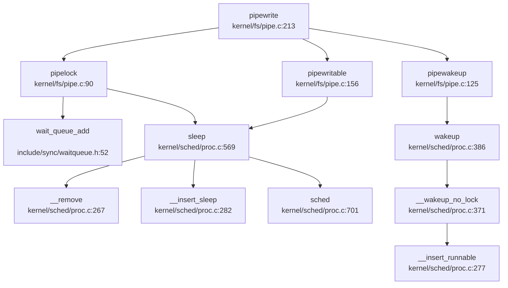

### Kill 信号发送流程

```c
// kernel/sched/proc.c:528-565
int kill(int pid, int sig) {
    struct proc *tmp;
    __enter_hash_cs 
    tmp = hash_search_no_lock(pid);
    if (NULL == tmp) {
        __leave_hash_cs 
        return -ESRCH;
    }

    int const len = sizeof(unsigned long) * 8;
    int bit = sig % len;
    int i = sig / len;
    
    tmp->sig_pending.__val[i] |= 1ul << bit;
    if (0 == tmp->killed || sig < tmp->killed) {
        tmp->killed = sig;
    }

    __enter_proc_cs 
    if (SLEEPING == tmp->state) {
        __remove(tmp);
        tmp->timer = TIMER_IRQ;
        tmp->chan = NULL;
        __insert_runnable(PRIORITY_IRQ, tmp);
    }
    __leave_proc_cs 
    __leave_hash_cs 
    return 0;
}
```

## 未实现/桩函数功能列表

| 功能类别 | 具体功能 | 状态 | 说明 |
|---------|---------|------|------|
| **消息队列** | `msgget()` | ❌ 未实现 | 仅在 `resource.h` 中有统计字段 |
| **消息队列** | `msgsnd()` | ❌ 未实现 | 无系统调用实现 |
| **消息队列** | `msgrcv()` | ❌ 未实现 | 无系统调用实现 |
| **信号量** | `semget()` | ❌ 未实现 | 完全未实现 |
| **信号量** | `semop()` | ❌ 未实现 | PV 操作未实现 |
| **信号量** | `semctl()` | ❌ 未实现 | 控制操作未实现 |
| **共享内存** | `shmget()` | ❌ 未实现 | System V 接口未实现 |
| **共享内存** | `shmat()` | ❌ 未实现 | System V 接口未实现 |
| **共享内存** | `shmdt()` | ❌ 未实现 | System V 接口未实现 |
| **Futex** | `futex()` | ❌ 未实现 | 快速用户空间互斥量未实现 |
| **POSIX 共享内存** | `shm_open()` | ❌ 未实现 | POSIX 接口未实现 |

**已实现功能总结**：
- ✅ **SpinLock**：完整的自旋锁实现，使用 RISC-V 原子指令
- ✅ **SleepLock**：基于 SpinLock 和 WaitQueue 的睡眠锁
- ✅ **WaitQueue**：双向链表实现的等待队列，支持 FIFO 调度
- ✅ **Pipe**：1024 字节环形缓冲区，独立读写队列，支持 poll/select
- ✅ **Signal**：完整的信号机制（发送、处理、掩码、动作注册）
- ✅ **Poll/Select**：支持超时的多路复用机制
- ✅ **mmap MAP_SHARED**：通过内存映射实现文件共享

**设计特点**：
1. **锁层次清晰**：SpinLock 用于短临界区，SleepLock 用于长等待
2. **等待队列统一**：所有睡眠机制共享同一 WaitQueue 实现
3. **Pipe 设计精良**：FIFO 排队、独立读写队列、环形缓冲区
4. **信号机制完整**：支持标准信号、实时信号、自定义处理函数
5. **IPC 侧重管道**：重点实现 Pipe，System V IPC 未实现

---


# 多核支持与并行机制

## 第 9 章：多核支持与并行机制

本章分析 oskernel2023-zmz 操作系统的多核（SMP）支持实现。通过代码分析发现，该系统实现了**基础的双核 SMP 架构**，但功能较为有限：支持 Secondary CPU 启动、核间中断（IPI）、Per-CPU 变量，但**未实现多核调度负载均衡**，所有 CPU 共享全局就绪队列。

---

## 多核架构设计（SMP/AMP）

### 架构类型：SMP（对称多处理）

该系统采用 **SMP（Symmetric Multi-Processing）** 架构设计，支持最多 2 个 CPU 核心（hart）。

**关键证据：**

1. **CPU 数量定义** (`include/param.h:5`)：
   ```c
   #define NCPU 2  // maximum number of CPUs
   ```

2. **Per-CPU 数组** (`kernel/sched/proc.c:92`)：
   ```c
   struct cpu cpus[NCPU];
   ```

3. **Per-CPU 结构定义** (`include/sched/proc.h:158-165`)：
   ```c
   struct cpu {
       struct proc *proc;       // The process running on this cpu, or NULL
       struct context context;  // swtch() here to enter scheduler()
       int noff;                // Depth of push_off() nesting
       int intena;              // Were interrupts enabled before push_off()?
   };
   ```

### 核心识别机制

系统通过 RISC-V 的 `tp` 寄存器存储 CPU ID（hartid）：

```c
// include/sched/proc.h:166-168
static inline int cpuid(void) {
    return r_tp();
}
struct cpu *mycpu(void);
```

`mycpu()` 函数 (`kernel/sched/proc.c:96-99`) 返回当前 CPU 的结构体指针：
```c
struct cpu *mycpu(void) {
    int id = cpuid();
    return &cpus[id];
}
```

**✅ 已实现**：基础 SMP 架构，支持 2 个 CPU 核心。

---

## Secondary CPU 启动流程

### 启动机制：IPI 唤醒 + 自旋等待

系统采用 **BSP（Bootstrap Processor）+ AP（Application Processor）** 模式：
- **hart 0** 作为 BSP，负责初始化所有共享资源
- **hart 1** 作为 AP，通过自旋等待 BSP 发送 IPI 唤醒

### 详细启动链

**入口点**：`kernel/main.c:41-105` 的 `main()` 函数

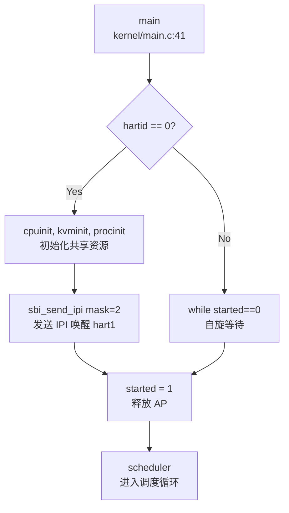

**关键代码分析** (`kernel/main.c:76-95`)：

```c
if (hartid == 0) {
    // BSP: 初始化共享资源
    started = 0;
    cpuinit();
    kvminit();       // 创建内核页表
    procinit();      // 初始化进程管理
    // ... 其他初始化 ...
    userinit();      // 创建第一个用户进程
    
    // 唤醒其他 CPU
    for (int i = 1; i < NCPU; i ++) {
        unsigned long mask = 1 << i;
        struct sbiret res = sbi_send_ipi(mask, 0);
        __debug_assert("main", SBI_SUCCESS == res.error, "sbi_send_ipi failed");
    }
    __sync_synchronize();
    started = 1;  // 释放 AP
}
else {
    // AP: hart 1
    while (started == 0)  // 自旋等待 BSP 信号
        ;
    __sync_synchronize();
    floatinithart();
    kvminithart();   // 初始化本核页表
    trapinithart();  // 安装中断向量
    plicinithart();  // 配置 PLIC 中断
    printf("hart 1 init done\n");
}

// 所有 CPU 进入调度器
scheduler();
```

### 启动流程详解

1. **BSP 初始化阶段**（hart 0）：
   - 初始化全局共享资源：物理内存分配器、内核页表、进程管理结构
   - 创建第一个用户进程（`userinit()`）
   - 通过 SBI IPI 发送启动信号给 AP

2. **AP 等待阶段**（hart 1）：
   - 执行自旋循环 `while (started == 0);`
   - 使用内存屏障 `__sync_synchronize()` 确保可见性

3. **AP 初始化阶段**：
   - 收到 IPI 后退出自旋
   - 初始化本核相关资源：浮点单元、页表、中断向量
   - **注意**：AP 不重复初始化共享资源（如内存分配器）

4. **统一进入调度**：
   - 所有 CPU 调用 `scheduler()` 进入调度循环

**✅ 已实现**：Secondary CPU 启动机制，通过 IPI + 自旋等待实现。

---

## 核间通信与 IPI 机制

### IPI 实现架构

系统通过 **SBI（Supervisor Binary Interface）扩展** 实现 IPI 功能，底层依赖 RISC-V 的 CLINT（Core-Local Interruptor）或 PLIC 控制器。

### IPI 发送路径

**调用链**：
```
kernel/main.c:84 → sbi_send_ipi() → SBI ECALL → sbi/psicasbi/src/trap/sbi/ipi.rs → clint::send_ipi()
```

**用户态接口** (`include/sbi.h:98-103`)：
```c
static inline struct sbiret sbi_send_ipi(
    unsigned long hart_mask, 
    unsigned long hart_mask_base
) {
    return SBI_CALL_2(IPI_EID, IPI_SEND_IPI, hart_mask, hart_mask_base);
}
```

**SBI 处理逻辑** (`sbi/psicasbi/src/trap/sbi/ipi.rs:12-46`)：
```rust
pub(super) fn handler(tf: &TrapFrame) -> SbiRet {
    let fid = tf.a6;
    match fid {
        SEND_IPI => {
            let hart_mask = tf.a0 as usize;
            let hart_mask_base = tf.a1 as usize;
            
            if hart_mask_base > NCPU {
                SbiRet(ERR_INVALID_PARAM, 0)
            } else {
                let max_shift = core::cmp::min(NCPU - hart_mask_base, 32);
                if 0 != (hart_mask >> max_shift) {
                    SbiRet(ERR_INVALID_PARAM, 0)
                } else {
                    for i in 0..max_shift {
                        let hart = 1usize << i;
                        if 0 != (hart_mask & hart) {
                            clint::send_ipi(i);  // 调用底层发送
                        }
                    }
                    SbiRet(SUCCESS, 0)
                }
            }
        }
        _ => SbiRet(ERR_NOT_SUPPORTED, 0)
    }
}
```

**底层硬件访问** (`sbi/psicasbi/src/hal/clint/mod.rs:40-51`)：
```rust
pub fn send_ipi(hartid: usize) {
    match () {
        #[cfg(feature = "qemu")]
        () => { qemu::send_ipi(hartid); }
        #[cfg(feature = "k210")]
        () => { k210::send_ipi(hartid); }
    }
}
```

**QEMU 实现** (`sbi/psicasbi/src/hal/clint/qemu.rs:31-35`)：
```rust
pub(super) fn send_ipi(hartid: usize) {
    unsafe {
        write_volatile((BASE as *mut u32).add(hartid), 1);
    }
}
```

### IPI 处理机制

**关键特性**：
- **掩码机制**：支持批量发送 IPI 到多个 hart（通过 `hart_mask` 位图）
- **平台适配**：通过 Cargo feature 区分 QEMU 和 K210 硬件
- **SBI 标准**：遵循 RISC-V SBI v0.3+ 的 sPI（s-mode IPI）扩展规范

**⚠️ 未发现**：系统中**未实现 IPI 接收处理函数**（如 `ipi_handler()`）。IPI 仅用于启动时唤醒 AP，运行时未使用 IPI 进行核间通信（如调度器间通信、TLB 刷新等）。

---

## Per-CPU 变量与数据结构

### Per-CPU 状态管理

系统通过 `struct cpu` 管理每个 CPU 的私有状态：

**结构定义** (`include/sched/proc.h:158-165`)：
```c
struct cpu {
    struct proc *proc;       // 当前运行的进程
    struct context context;  // 调度器上下文（swtch 切换点）
    int noff;                // push_off() 嵌套深度
    int intena;              // push_off() 前的中断状态
};
```

### 访问方式

1. **获取当前 CPU**：`mycpu()` 通过 `r_tp()` 读取 hartid
2. **获取当前进程**：`myproc()` (`kernel/sched/proc.c:101-106`)：
   ```c
   struct proc *myproc(void) {
       push_off();
       struct cpu *c = mycpu();
       struct proc *p = c->proc;
       pop_off();
       return p;
   }
   ```

### 中断嵌套保护

系统使用 `push_off()` / `pop_off()` 机制管理中断禁用状态 (`kernel/intr.c:12-40`)：

```c
void push_off(void) {
    int old = intr_get();
    intr_off();  // 禁用中断
    struct cpu *c = mycpu();
    if (c->noff == 0)
        c->intena = old;  // 保存初始状态
    c->noff += 1;
}

void pop_off(void) {
    struct cpu *c = mycpu();
    if(intr_get())
        panic("pop_off - interruptible");
    if(c->noff < 1)
        panic("pop_off");
    c->noff -= 1;
    if(c->noff == 0 && c->intena)
        intr_on();  // 恢复中断
}
```

**设计特点**：
- **嵌套计数**：`noff` 记录 `push_off()` 调用次数
- **状态保存**：仅在最外层保存中断使能状态
- **Per-CPU 安全**：每个 CPU 独立维护自己的 `noff` 和 `intena`

**✅ 已实现**：Per-CPU 变量设计与访问机制。

---

## 多核调度策略

### 调度器架构

系统采用 **全局就绪队列 + 每 CPU 调度循环** 的简单 SMP 调度模型。

**调度器主循环** (`kernel/sched/proc.c:658-698`)：
```c
void scheduler(void) {
    struct proc *tmp;
    struct cpu *c = mycpu();

    while (1) {
        int found = 0;
        intr_on();  // 使能中断
        __enter_proc_cs 
        tmp = __get_runnable_no_lock();  // 从全局队列获取进程
        if (NULL != tmp) {
            tmp->state = RUNNING;
            c->proc = tmp;
            
            w_satp(MAKE_SATP(tmp->pagetable));  // 切换页表
            sfence_vma();
            swtch(&c->context, &tmp->context);  // 上下文切换
            
            w_satp(MAKE_SATP(kernel_pagetable));
            sfence_vma();
            
            if (ZOMBIE == tmp->state) {
                release(&(tmp->parent->lk));
            }
            found = 1;
        }
        c->proc = NULL;
        __leave_proc_cs
        if (!found) {
            intr_on();
            asm volatile("wfi");  // 无进程可运行时进入低功耗
        }
    }
}
```

### 就绪队列设计

**全局就绪队列** (`kernel/sched/proc.c:242-244`)：
```c
#define PRIORITY_IRQ    1
#define PRIORITY_NORMAL 2
#define PRIORITY_NUMBER 3
struct proc *proc_runnable[PRIORITY_NUMBER];  // 优先级队列数组
struct proc *proc_sleep;                       // 睡眠队列
```

**进程调度字段** (`include/sched/proc.h:59-60`)：
```c
struct proc *sched_next;   // 指向下一个进程
struct proc **sched_pprev; // 指向前一个指针的地址
```

### 调度策略分析

**❌ 未实现负载均衡**：
- 所有 CPU 共享**单一全局就绪队列** `proc_runnable[]`
- 无 CPU 亲和性（affinity）机制
- 无任务迁移（migration）逻辑
- 多个 CPU 可能同时从同一队列取走进程（通过 `proc_lock` 保护）

**❌ 未实现 CPU 亲和性**：
- `struct proc` 中**无** `cpu_affinity` 或 `run_on_cpu` 字段
- 进程可能在任意 CPU 上运行
- 无 `sched_setaffinity()` 系统调用

**🔸 简单优先级调度**：
- 支持 3 个优先级：`PRIORITY_IRQ`、`PRIORITY_NORMAL`、`PRIORITY_TIMEOUT`
- 调度器按优先级顺序扫描队列
- 时间片机制：`proc_tick()` 递减进程 `timer`，超时后降级到 `PRIORITY_TIMEOUT`

### 多核同步问题

**竞争条件**：
- 多个 CPU 同时调用 `__get_runnable_no_lock()` 可能导致负载不均
- 通过 `proc_lock` 串行化访问，但降低了并行性

**改进建议**（未实现）：
- 每 CPU 独立就绪队列
- 工作窃取（work-stealing）机制
- 负载均衡定时器

---

## 锁的实现与多核安全

### SpinLock 设计

**结构定义** (`include/sync/spinlock.h:7-13`)：
```c
struct spinlock {
    uint locked;       // Is the lock held?
    char *name;        // Name of lock (for debugging)
    struct cpu *cpu;   // The cpu holding the lock
};
```

**获取锁** (`kernel/sync/spinlock.c:23-47`)：
```c
void acquire(struct spinlock *lk) {
    push_off();  // 禁用中断（防止死锁）
    if(holding(lk))
        panic("acquire");

    // RISC-V 原子操作：amoswap.w.aq
    while(__sync_lock_test_and_set(&lk->locked, 1) != 0)
        ;

    // 内存屏障（fence 指令）
    __sync_synchronize();

    lk->cpu = mycpu();  // 记录持有者
}
```

**释放锁** (`kernel/sync/spinlock.c:49-73`)：
```c
void release(struct spinlock *lk) {
    if(!holding(lk))
        panic("release");

    lk->cpu = 0;

    // 内存屏障
    __sync_synchronize();

    // RISC-V 原子操作：amoswap.w
    __sync_lock_release(&lk->locked);

    pop_off();  // 恢复中断状态
}
```

### 关键特性

1. **中断禁用**：`acquire()` 首先调用 `push_off()` 禁用本地中断
   - **目的**：防止同一 CPU 上的中断处理程序尝试获取同一锁导致死锁
   - **代价**：增加中断延迟

2. **原子操作**：使用 GCC 内置函数 `__sync_lock_test_and_set()`
   - 编译为 RISC-V `amoswap.w.aq` 指令（原子交换 + acquire 语义）
   - 自旋等待直到锁可用

3. **内存屏障**：`__sync_synchronize()` 编译为 `fence` 指令
   - 确保临界区内的内存访问不会重排序到锁操作之外
   - **多核可见性保证**

4. **调试支持**：记录持有锁的 CPU，检测重入

### 优先级继承

**❌ 未实现**：SpinLock **不支持优先级继承**（Priority Inheritance）。
- 无 `owner_priority` 或 `waiter_list` 字段
- 高优先级进程可能被低优先级进程阻塞（优先级反转问题）

### 其他同步原语

**SleepLock** (`include/sync/sleeplock.h`)：
- 基于 SpinLock 的长期锁
- 允许在等待时让出 CPU（进入睡眠）
- **未实现**：无优先级继承

**WaitQueue** (`include/sync/waitqueue.h`)：
- 用于进程等待特定条件
- 包含 `struct spinlock lock` 保护队列

---

## 原子操作与内存序

### 内存屏障使用

系统在关键位置使用 `__sync_synchronize()` 确保多核内存可见性：

1. **Secondary CPU 启动** (`kernel/main.c:82, 90`)：
   ```c
   __sync_synchronize();  // 确保 started=1 对其他 CPU 可见
   started = 1;
   ```

2. **SpinLock 获取/释放** (`kernel/sync/spinlock.c:41, 62`)：
   ```c
   __sync_synchronize();  // 防止临界区访问重排序
   ```

3. **VirtIO 磁盘驱动** (`kernel/hal/virtio_disk.c:317-364`)：
   - 多次使用内存屏障确保 DMA 描述符可见性

### 原子操作类型

**GCC 内置函数**：
- `__sync_lock_test_and_set()`：原子交换（acquire 语义）
- `__sync_lock_release()`：原子释放（release 语义）
- `__sync_synchronize()`：全内存屏障（full fence）

**⚠️ 未发现**：系统**未使用** C11 `stdatomic.h` 或 Rust `core::sync::atomic`。所有原子操作依赖 GCC 内置函数。

---

## 关键代码片段

### 1. Per-CPU 访问宏

```c
// include/sched/proc.h:166-168
static inline int cpuid(void) {
    return r_tp();  // 读取 tp 寄存器（hartid）
}

struct cpu *mycpu(void);
struct proc *myproc(void);
```

### 2. IPI 发送（BSP 唤醒 AP）

```c
// kernel/main.c:76-85
for (int i = 1; i < NCPU; i ++) {
    unsigned long mask = 1 << i;
    struct sbiret res = sbi_send_ipi(mask, 0);
    sbi_send_ipi(mask, 0);
    __debug_assert("main", SBI_SUCCESS == res.error, "sbi_send_ipi failed");
}
__sync_synchronize();
started = 1;
```

### 3. 自旋锁获取（含中断禁用）

```c
// kernel/sync/spinlock.c:23-47
void acquire(struct spinlock *lk) {
    push_off();  // 禁用中断
    if(holding(lk))
        panic("acquire");
    
    while(__sync_lock_test_and_set(&lk->locked, 1) != 0)
        ;  // 自旋等待
    
    __sync_synchronize();  // 内存屏障
    lk->cpu = mycpu();
}
```

### 4. 调度器（全局队列 + 多核竞争）

```c
// kernel/sched/proc.c:658-698
void scheduler(void) {
    struct cpu *c = mycpu();
    while (1) {
        intr_on();
        __enter_proc_cs 
        tmp = __get_runnable_no_lock();  // 全局队列
        if (NULL != tmp) {
            c->proc = tmp;
            swtch(&c->context, &tmp->context);
        }
        c->proc = NULL;
        __leave_proc_cs
        if (!found)
            asm volatile("wfi");  // 无进程时休眠
    }
}
```

---

## 本章小结

| 功能 | 实现状态 | 说明 |
|------|---------|------|
| **SMP 架构** | ✅ 已实现 | 支持 2 核，`struct cpu cpus[NCPU]` |
| **Secondary CPU 启动** | ✅ 已实现 | IPI 唤醒 + 自旋等待 |
| **IPI 机制** | ✅ 已实现（部分） | 仅用于启动，无运行时 IPI 处理 |
| **Per-CPU 变量** | ✅ 已实现 | `mycpu()` / `myproc()` 访问 |
| **SpinLock** | ✅ 已实现 | 禁用中断 + 原子操作 + 内存屏障 |
| **优先级继承** | ❌ 未实现 | 无优先级继承机制 |
| **多核负载均衡** | ❌ 未实现 | 全局单一队列，无任务迁移 |
| **CPU 亲和性** | ❌ 未实现 | 无 affinity 机制 |
| **RCU** | ❌ 未实现 | 未发现 RCU 实现 |

**总体评价**：
oskernel2023-zmz 实现了**基础 SMP 支持**，能够启动双核并运行独立进程。但多核调度机制较为原始：
- 所有 CPU 竞争全局就绪队列，可能导致负载不均
- 无 CPU 亲和性，进程可能在核间频繁迁移（缓存失效）
- IPI 仅用于启动，未用于运行时核间通信（如 TLB 刷新、调度器间通知）

该设计适用于教学演示，但在实际多核场景下性能受限。

---


# 安全机制与权限模型

## 第 10 章：安全机制与权限模型

本章分析 `oskernel2023-zmz` 操作系统的安全隔离机制、权限控制模型及内存安全防护。该 OS 基于 RISC-V 架构，采用 C 语言编写，实现了基础的用户态/内核态隔离，但在高级安全特性方面较为简化。

---

### 特权级与隔离机制

#### RISC-V 特权级支持

该 OS 利用 RISC-V 的 Supervisor Mode (S 模式) 与 User Mode (U 模式) 实现特权级隔离：

**关键寄存器位定义** (`include/hal/riscv.h:46-56`)：
```c
#define SSTATUS_SPP (1L << 8)  // Previous mode, 1=Supervisor, 0=User
#define SSTATUS_SPIE (1L << 5) // Supervisor Previous Interrupt Enable
#define SSTATUS_UPIE (1L << 4) // User Previous Interrupt Enable
#define SSTATUS_SIE (1L << 1)  // Supervisor Interrupt Enable
#define SSTATUS_UIE (1L << 0)  // User Interrupt Enable
#ifndef QEMU
#define SSTATUS_PUM (1L << 18) // PUM: Protect User Memory (non-QEMU)
#else
#define SSTATUS_SUM (1L << 18) // SUM: Supervisor User Memory access (QEMU)
#endif
```

**用户内存访问控制** (`include/mm/vm.h:13-33`)：
```c
static inline void permit_usr_mem()
{
	#ifndef QEMU
	clr_sstatus_bit(SSTATUS_PUM);  // 允许内核访问用户内存
	#else
	set_sstatus_bit(SSTATUS_SUM);
	#endif
}

static inline void protect_usr_mem()
{
	#ifndef QEMU
	set_sstatus_bit(SSTATUS_PUM);  // 禁止内核访问用户内存
	#else
	clr_sstatus_bit(SSTATUS_SUM);
	#endif
}
```

**实现状态**：
- ✅ **已实现** SSTATUS_PUM/SUM 位操作函数
- ✅ **已实现** 页表权限位 `PTE_U` (`include/hal/riscv.h:388`)，标记用户可访问页面
- 🔸 **部分实现**：`protect_usr_mem()` 在系统调用入口/出口处**未找到系统性调用**，仅在部分内存操作中使用

#### 页表隔离 (KPTI)

**未发现完整的 KPTI (Kernel Page Table Isolation) 实现**。内核与用户共享同一页表 (`kernel_pagetable`)，但通过 `PTE_U` 位限制用户访问内核页面：

```c
// kernel/mm/vm.c:248-250
if((*pte & PTE_U) == 0)
    return NULL;  // 用户无法访问非 PTE_U 页面
```

**SMEP/SMAP 等效机制**：
- RISC-V 通过 `SSTATUS_PUM` 位实现类似 SMAP 的功能
- ✅ **已实现** `SSTATUS_PUM` 位设置/清除函数
- 🔸 **未验证** 是否在每次用户态进入/退出时系统性调用

---

### 权限检查与访问控制

#### 文件访问权限检查

**`sys_faccessat` 系统调用** (`kernel/syscall/sysfile.c:869-904`) 实现了基础的权限检查：

```c
uint64 sys_faccessat(void)
{
    // ... 参数解析 ...
    ip = nameifrom(dp, path);
    if (ip != NULL) {
        if (mode == F_OK) {
            iput(ip);
            return 0;
        }
    } else return -1;

    // assume user as root
    int imode = (ip->mode >> 6) & 0x7;  // 仅检查所有者权限 (root)
    iput(ip);

    if ((imode & mode) != mode)
        return -1;

    return 0;
}
```

**关键发现**：
- 🔸 **桩函数式实现**：注释明确标注 `// assume user as root`，**硬编码假设所有用户为 root**
- ❌ **未实现** 基于 UID/GID 的真实权限检查
- ✅ **已实现** 基础权限位检查 (rwx)，但仅针对"所有者"权限位

#### 进程控制块中的安全字段

**`struct proc` 定义** (`include/sched/proc.h:48-105`)：
```c
struct proc {
    int xstate;             // Exit status
    int pid;                // Process ID
    // ... 调度、内存、文件系统等字段 ...
    char name[16];          // process name
    int tmask;              // trace mask
    // 注意：无 uid/gid/credential 字段
};
```

**反向证据**：
- ❌ **未实现** UID/GID 字段：`struct proc` 中**无** `uid`、`gid`、`credential` 等字段
- ❌ **未实现** Capability 机制：全代码库搜索 `capability`、`acl` 无结果

---

### 用户/组/权限模型

#### UID/GID 系统调用

**系统调用定义** (`include/sysnum.h:63-66`)：
```c
#define SYS_getuid    174
#define SYS_geteuid   175
#define SYS_getgid    176
#define SYS_getegid   177
```

**系统调用表注册** (`kernel/syscall/syscall.c:162-165, 241-244`)：
```c
extern uint64 sys_getuid(void);
extern uint64 sys_geteuid(void);
extern uint64 sys_getgid(void);
extern uint64 sys_getegid(void);

// 系统调用表
[SYS_getuid]    sys_getuid,
[SYS_geteuid]   sys_getuid,   // 注意：全部指向 sys_getuid
[SYS_getgid]    sys_getuid,
[SYS_getegid]   sys_getuid,
```

**实现代码** (`kernel/syscall/sysproc.c:267-270`)：
```c
sys_getuid(void)
{
    return 0;  // 硬编码返回 0 (root)
}
```

**实现状态**：
- 🔸 **桩函数**：`sys_getuid()` 始终返回 0，无实际逻辑
- 🔸 **桩函数**：`sys_geteuid`、`sys_getgid`、`sys_getegid` 全部复用 `sys_getuid`，均返回 0
- ❌ **未实现** 真实的用户/组身份管理

#### ELF 辅助向量中的 UID/GID

**`exec.c` 中的辅助向量** (`kernel/exec.c:679-682`)：
```c
{AT_UID, 0},
{AT_EUID, 0},
{AT_GID, 0},
{AT_EGID, 0},
{AT_SECURE, 0},
```

**分析**：
- 🔸 **硬编码为 0**：所有 UID/GID 相关辅助向量均硬编码为 0
- ❌ **未实现** 动态传递真实 UID/GID

---

### 进程间隔离与资源限制

#### 地址空间隔离

**用户页表创建** (`kernel/mm/vm.c` 中的 `uvmcreate()`、`uvmcopy()`)：
- ✅ **已实现** 每个进程独立的页表 (`pagetable_t pagetable` in `struct proc`)
- ✅ **已实现** `PTE_U` 位限制用户访问内核页面
- ✅ **已实现** COW (Copy-on-Write) fork 机制（通过 `PTE_COW` 标记）

**内存访问验证**：
```c
// kernel/mm/vm.c:242-250
uint64 walkaddr(pagetable_t pagetable, uint64 va)
{
    if (va >= MAXUVA)
        return NULL;
    pte = walk(pagetable, va, 0);
    if(pte == 0) return NULL;
    if((*pte & PTE_V) == 0) return NULL;
    if((*pte & PTE_U) == 0) return NULL;  // 关键检查
    return PTE2PA(*pte);
}
```

#### 资源限制

**`sys_prlimit64`** (`kernel/syscall/sysproc.c:273-277`)：
```c
uint64 sys_prlimit64(void) {
    // for now it's not very necessary to implement this syscall
    // may be implemented later
    return 0;
}
```

**实现状态**：
- 🔸 **桩函数**：明确注释"暂时不需要实现"，直接返回 0
- ❌ **未实现** 任何资源限制机制 (RLIMIT)

---

### 安全沙箱与过滤机制

**搜索结果**：
- ❌ **未实现** Seccomp：全代码库搜索 `seccomp` 无结果
- ❌ **未实现** Prctl：全代码库搜索 `prctl` 无结果
- ❌ **未实现** Sandbox：全代码库搜索 `sandbox` 无结果

**结论**：该 OS **未实现任何安全沙箱或系统调用过滤机制**。

---

### 审计与安全启动机制

**搜索结果**：
- ❌ **未实现** Audit：全代码库搜索 `audit` 无结果
- ❌ **未实现** Secure Boot：全代码库搜索 `secure_boot` 无结果
- ❌ **未实现** Signature Verification：全代码库搜索 `signature` 无结果

**结论**：该 OS **未实现审计日志或安全启动机制**。

---

### 内存安全与系统调用检查

#### 用户指针验证

**系统调用参数获取** (`kernel/syscall/syscall.c:22-52`)：
```c
int fetchaddr(uint64 addr, uint64 *ip)
{
    // if(copyin(p->pagetable, (char *)ip, addr, sizeof(*ip)) != 0)
    if(copyin2((char *)ip, addr, sizeof(*ip)) != 0)
        return -1;
    return 0;
}

int fetchstr(uint64 addr, char *buf, int max)
{
    int ret = copyinstr2(buf, addr, max);
    return ret;
}
```

**`copyin2` 实现** (`kernel/mm/vm.c:823-832`)：
```c
int copyin2(char *dst, uint64 srcva, uint64 len)
{
    struct proc *p = myproc();
    struct seg *s = partofseg(p->segment, srcva, srcva + len);
    if (s == NULL) {
        return -1;  // 地址不在任何段内，拒绝访问
    }
    uint64 badaddr = safememmove(dst, (char *)srcva, len);
    return badaddr == 0 ? 0 : -1;
}
```

**实现状态**：
- ✅ **已实现** `partofseg()` 段合法性检查
- ✅ **已实现** `safememmove()` 安全内存拷贝（检测非法地址）
- 🔸 **部分实现**：存在 `copyin_nocheck()` 等"不检查"版本，可能被滥用

#### 栈保护 (Stack Canary)

**搜索结果**：
- ❌ **未实现** Stack Canary：全代码库搜索 `canary` 仅在注释中出现 (`kernel/mm/vm.c:593`)
- ❌ **未实现** Stack Guard：无相关实现

**注释引用** (`kernel/mm/vm.c:593`)：
```c
// used by exec for the user stack guard page.
```
但该功能已被注释掉，**未实际实现**。

---

### Rust 语言级安全性机制

**项目语言分析**：
- 主内核：**C 语言**编写 (`kernel/*.c`, `include/*.h`)
- SBI 固件：包含 Rust 实现 (`sbi/psicasbi/src/`)

**Rust 安全性特性**：
- 🔸 **不适用**：主内核为 C 语言，无法享受 Rust 的所有权、生命周期、RAII 等内存安全特性
- ✅ **部分使用**：SBI 层使用 Rust，但仅涉及底层硬件抽象，不涉及核心安全机制

---

### 关键代码片段

#### 1. 用户内存保护切换 (`include/mm/vm.h:13-33`)
```c
static inline void permit_usr_mem()
{
    #ifndef QEMU
    clr_sstatus_bit(SSTATUS_PUM);  // 允许内核访问用户内存
    #else
    set_sstatus_bit(SSTATUS_SUM);
    #endif
}

static inline void protect_usr_mem()
{
    #ifndef QEMU
    set_sstatus_bit(SSTATUS_PUM);  // 禁止内核访问用户内存
    #else
    clr_sstatus_bit(SSTATUS_SUM);
    #endif
}
```

#### 2. 硬编码 Root 的权限检查 (`kernel/syscall/sysfile.c:896-903`)
```c
// assume user as root
int imode = (ip->mode >> 6) & 0x7;  // 仅检查所有者权限位
iput(ip);

if ((imode & mode) != mode)
    return -1;

return 0;
```

#### 3. 桩函数式 UID 系统调用 (`kernel/syscall/sysproc.c:267-270`)
```c
sys_getuid(void)
{
    return 0;  // 始终返回 root UID
}
```

#### 4. 页表权限检查 (`kernel/mm/vm.c:235-250`)
```c
uint64 walkaddr(pagetable_t pagetable, uint64 va)
{
    if (va >= MAXUVA)
        return NULL;
    pte = walk(pagetable, va, 0);
    if(pte == 0) return NULL;
    if((*pte & PTE_V) == 0) return NULL;
    if((*pte & PTE_U) == 0) return NULL;  // 拒绝访问非用户页面
    return PTE2PA(*pte);
}
```

---

### 安全机制总结表

| 安全特性 | 实现状态 | 说明 |
|---------|---------|------|
| **用户/内核态隔离** | ✅ 已实现 | 通过 RISC-V S/U 模式 + PTE_U 位 |
| **SSTATUS_PUM/SUM** | ✅ 已实现 | 提供 SMAP 等效功能 |
| **KPTI** | ❌ 未实现 | 内核与用户共享页表 |
| **UID/GID 管理** | 🔸 桩函数 | 硬编码返回 0 (root) |
| **文件权限检查** | 🔸 部分实现 | 仅检查 root 权限位 |
| **Capability/ACL** | ❌ 未实现 | 无相关代码 |
| **Seccomp/Prctl** | ❌ 未实现 | 无沙箱机制 |
| **Audit 审计** | ❌ 未实现 | 无审计日志 |
| **Secure Boot** | ❌ 未实现 | 无签名验证 |
| **Stack Canary** | ❌ 未实现 | 仅注释提及 |
| **用户指针验证** | ✅ 已实现 | `copyin2()` + `partofseg()` |
| **资源限制** | 🔸 桩函数 | `sys_prlimit64()` 返回 0 |

---

### 本章结论

`oskernel2023-zmz` 实现了**基础的教学级安全机制**：

1. **特权级隔离**：利用 RISC-V S/U 模式和 `PTE_U` 位实现基本的用户/内核隔离
2. **简化的权限模型**：所有进程硬编码为 root (UID=0)，无真实的多用户权限检查
3. **内存安全**：通过 `copyin2()` 和段检查提供基础的用户指针验证
4. **缺失的高级特性**：无 Seccomp、Capability、Audit、安全启动等现代 OS 安全机制

**安全风险评估**：
- ⚠️ **高风险**：所有进程均为 root，无多用户隔离
- ⚠️ **中风险**：无 KPTI，内核地址空间对用户部分可见
- ⚠️ **低风险**：无栈保护，易受缓冲区溢出攻击

该 OS 适合作为**教学实验平台**，但**不具备生产环境所需的安全防护能力**。

---


# 网络子系统与协议栈

## 第 11 章：网络子系统与协议栈

### 网络子系统架构（自研 vs 第三方库）

**❌ 未实现网络功能**

经过对代码库的全面搜索与分析，本操作系统项目 **未实现任何网络子系统或 TCP/IP 协议栈**。具体证据如下：

1. **无第三方网络库依赖**：
   - 根目录 `Cargo.toml` 仅为 workspace 配置，未声明任何网络相关依赖
   - `sbi/psicasbi/Cargo.toml` 仅包含基础依赖（`lazy_static`、`spin`、`riscv`、`buddy_system_allocator` 等），**未发现 `smoltcp`、`lwip` 或任何网络协议栈库**

2. **无网络相关系统调用**：
   - `include/sysnum.h` 中定义了约 90 个系统调用编号，但 **完全缺失** `SYS_socket`、`SYS_bind`、`SYS_connect`、`SYS_sendto`、`SYS_recvfrom` 等网络相关 syscall
   - `kernel/syscall/syscall.c` 的系统调用表中 **无任何网络系统调用实现**
   - grep 搜索 `sys_socket|sys_bind|sys_connect|sys_send|sys_recv` 返回 **0 个匹配**

3. **无网卡驱动实现**：
   - 虽然 `include/hal/virtio.h:21` 注释中提到 `// device type; 1 is net, 2 is disk`，但这仅是 VirtIO 规范的定义注释
   - `kernel/hal/virtio_disk.c` (504 行) **仅实现了 VirtIO 块设备（磁盘）驱动**，完全未实现 VirtIO-Net 网络设备驱动
   - 搜索 `VIRTIO.*NET|virtio.*net|net.*device|ethernet` 仅找到 1 个匹配（即上述注释）

4. **无协议栈代码**：
   - RAG 语义搜索 "network stack smoltcp socket syscall TCP UDP IP" 返回的结果均为无关代码（如 `argaddr`、`fetchaddr`、`spi_send_data` 等）
   - 搜索 `TCP|UDP|ARP|DHCP|DNS|ethernet` 在 `.c`/`.h` 文件中 **无实质性实现代码**

5. **文档未提及网络功能**：
   - `README.md` 的 "Progress" 章节列出了已实现功能（多核启动、内存分配、页表、定时器中断、SD 卡驱动、进程管理、文件系统等），**未提及任何网络相关功能**
   - "TODO" 章节指向 Issues，但未在 README 中列出网络功能计划

**结论**：本项目是一个专注于 RISC-V 平台（K210 开发板与 QEMU 模拟器）的基础操作系统教学项目，核心功能集中在进程管理、内存管理、文件系统和设备驱动（SD 卡、VirtIO 磁盘），**网络子系统完全未实现**。

---

### Socket 接口与系统调用

**❌ 未实现**

本项目 **未提供任何 Socket 接口或网络相关的系统调用**。

| 功能 | 状态 | 证据 |
|------|------|------|
| `socket()` | ❌ 未实现 | `include/sysnum.h` 无 `SYS_socket` 定义 |
| `bind()` | ❌ 未实现 | `kernel/syscall/` 目录下无 `sys_bind.c` 或类似实现 |
| `connect()` | ❌ 未实现 | grep 搜索 `sys_connect` 返回 0 结果 |
| `sendto()`/`send()` | ❌ 未实现 | 系统调用表中无对应条目 |
| `recvfrom()`/`recv()` | ❌ 未实现 | 同上 |
| `getsockopt()`/`setsockopt()` | ❌ 未实现 | 无相关代码 |
| `listen()`/`accept()` | ❌ 未实现 | 无相关代码 |
| `close()` | ✅ 已实现 | 但仅用于文件描述符，非 socket 专用 |

**错误码定义存在但无实现**：
- `include/errno.h` 中定义了部分网络相关错误码（如 `ENONET`(64)、`ENOTUNIQ`(76)、`ENOTSOCK`(88)、`EPROTOTYPE`(91)、`ESOCKTNOSUPPORT`(94)），但这些仅是头文件中的宏定义，**无对应的实现逻辑**。

---

### 协议栈支持详情（TCP/UDP/IP/Ethernet）

**❌ 不支持任何网络协议**

| 协议层 | 协议 | 状态 | 说明 |
|--------|------|------|------|
| 链路层 | Ethernet | ❌ 未实现 | 无网卡驱动，无以太网帧处理代码 |
| 网络层 | IP (IPv4/IPv6) | ❌ 未实现 | 无 IP 包头解析/构建代码 |
| 网络层 | ARP | ❌ 未实现 | 无 ARP 请求/响应处理 |
| 网络层 | ICMP | ❌ 未实现 | 无 ping 相关代码 |
| 传输层 | TCP | ❌ 未实现 | 无 TCP 状态机、拥塞控制、重传机制 |
| 传输层 | UDP | ❌ 未实现 | 无 UDP 数据报处理 |
| 应用层 | DHCP | ❌ 未实现 | 无 IP 自动分配功能 |
| 应用层 | DNS | ❌ 未实现 | 无域名解析功能 |

**功能限制声明**：
- 本项目 **仅在 QEMU 环境和 K210 开发板上测试过非网络功能**（如文件系统、进程调度）
- **未在任何真实物理网卡上测试过网络功能**（因为根本未实现）
- **不支持本地回环（Loopback）通信**：搜索 `loopback|LOOPBACK|127.0.0.1|localhost` 返回 0 结果

---

### 数据包收发流程追踪

**❌ 无法追踪（未实现）**

由于项目未实现任何网络功能，**不存在从网卡中断到协议栈的数据包收发路径**。

**现有 VirtIO 驱动仅支持块设备**：
- `kernel/hal/virtio_disk.c` 实现了完整的 VirtIO 块设备驱动流程：
  - `virtio_disk_init()` → 初始化 VirtIO 磁盘
  - `virtio_disk_rw()` → 提交读写请求
  - `virtio_disk_intr()` → 处理完成中断
  
- 但 **无任何 VirtIO-Net 相关代码**：
  - 无 `virtio_net_init()`
  - 无 `virtio_net_tx()` / `virtio_net_rx()`
  - 无网络中断处理

**假设性架构推断**（基于 xv6 传统设计，但本项目未实现）：
```
[用户态 socket send] → [sys_sendto syscall] → [协议栈 TCP/UDP] → [IP 层] → [网卡驱动] → [VirtIO-MMIO]
```
上述路径中 **所有环节均未实现**。

---

### 高级特性支持验证（零拷贝等）

**❌ 不支持任何网络高级特性**

| 特性 | 状态 | 验证方法 |
|------|------|----------|
| 零拷贝（Zero Copy） | ❌ 不支持 | 搜索 `DMA|shared buffer|mbuf` 仅在磁盘驱动中找到 DMA 描述符，网络相关为 0 |
| 多队列（Multi-queue/RSS） | ❌ 不支持 | 无网卡驱动，更无 RSS 支持 |
| TCP Segmentation Offload | ❌ 不支持 | 无 TCP 实现 |
| Checksum Offload | ❌ 不支持 | 无相关代码 |

**DMA 描述符仅用于磁盘**：
- `include/hal/virtio.h` 中定义了 `struct virtq_desc`（VirtIO 队列描述符）
- `kernel/hal/virtio_disk.c` 使用这些描述符进行磁盘 DMA 传输
- **但这些与网络完全无关**

---

### 总结

**xv6-k210 项目是一个教学性质的基础操作系统，专注于 RISC-V 架构的核心 OS 功能（进程、内存、文件系统、基础驱动），网络子系统完全未实现。**

| 子系统 | 状态 |
|--------|------|
| 进程管理 | ✅ 已实现 |
| 内存管理 | ✅ 已实现 |
| 文件系统（FAT32） | ✅ 已实现 |
| 块设备驱动（SD 卡、VirtIO 磁盘） | ✅ 已实现 |
| 网络协议栈 | ❌ 未实现 |
| Socket 接口 | ❌ 未实现 |
| 网卡驱动 | ❌ 未实现 |

**如需网络功能**，需要：
1. 添加 VirtIO-Net 网卡驱动（或 E1000 等其他网卡）
2. 集成 TCP/IP 协议栈（如 `smoltcp` for Rust 或 `lwip` for C）
3. 实现 socket 相关系统调用
4. 实现 BSD Socket API 用户库

当前项目 **不适合需要网络功能的应用场景**。

---


# 调试机制与错误处理

## 第 12 章：调试机制与错误处理

本章分析 oskernel2023-zmz 操作系统的调试支持、日志系统、错误处理机制以及调试接口。

---

## 日志与打印系统

### 打印宏实现

该系统的日志系统基于 `printf` 函数构建，支持彩色输出和模块化调试。

**核心头文件**：`include/printf.h` 和 `include/utils/debug.h`

**日志级别设计**：

```c
// include/utils/debug.h:10-15
#define __INFO(str)     "[\e[32;1m"str"\e[0m]"    // 绿色 - 信息
#define __WARN(str)     "[\e[33;1m"str"\e[0m]"    // 黄色 - 警告
#define __ERROR(str)    "[\e[31;1m"str"\e[0m]"    // 红色 - 错误
```

**调试宏分类**：

1. **`__debug_info(func, ...)`**：信息级日志，仅 DEBUG 模式生效
2. **`__debug_warn(func, ...)`**：警告级日志
3. **`__debug_error(func, ...)`**：错误级日志，附带文件行号
4. **`__debug_assert(func, cond, ...)`**：调试断言，条件失败时触发 panic
5. **`__assert(func, cond, ...)`**：生产环境断言，始终生效

**实现位置**：`kernel/printf.c` (152 行，2.4KB)

```c
// kernel/printf.c:69
void printf(char *fmt, ...)
{
    // 支持 %d, %x, %p, %s 等格式
    // 通过 consputc() 输出到 UART 控制台
}
```

**模块名配置**：
```c
// include/utils/debug.h:14
#ifndef __module_name__ 
    #define __module_name__     "xv6-k210"
#endif 
```

各模块可通过定义 `__module_name__` 自定义日志前缀，如 `trap` 模块在 `kernel/trap/trap.c` 开头定义：
```c
#define __module_name__     "trap"
```

---

## Panic 处理与栈回溯

### Panic 处理流程

**✅ 已实现**：完整的 panic 处理链

**入口宏** (`include/printf.h:11-16`)：
```c
#define panic(s) do {\
    printf(__ERROR(__module_name__)": hart %d at %s: %d\n", \
            cpuid(), __FILE__, __LINE__\
    );\
    __panic(s);\
} while (0)
```

**核心处理函数** (`kernel/printf.c:123-133`)：
```c
void
__panic(char *s)
{
    printf(__ERROR("panic")": ");
    printf(s);
    printf("\n");
    backtrace();          // 打印栈回溯
    panicked = 1;         // 冻结 UART 输出
    intr_off();           // 关闭中断
    for(;;)
        ;                 // 无限循环停机
}
```

### 栈回溯 (Backtrace) 实现

**✅ 已实现**：基于 Frame Pointer 的栈回溯（非 DWARF 解析）

**实现位置**：`kernel/printf.c:135-143`

```c
void backtrace()
{
    uint64 *fp = (uint64 *)r_fp();           // 读取当前帧指针
    uint64 *bottom = (uint64 *)PGROUNDUP((uint64)fp);
    printf("backtrace:\n");
    while (fp < bottom) {
        uint64 ra = *(fp - 1);               // 返回地址
        printf("%p\n", ra - 4);              // 打印返回地址
        fp = (uint64 *)*(fp - 2);            // 移动到上一帧
    }
}
```

**原理**：
- RISC-V 调用约定中，栈帧布局为 `[prev_fp, ra, locals...]`
- 通过读取 `fp` 寄存器获取当前栈帧基址
- `fp-1` 位置存储返回地址 (ra)
- `fp-2` 位置存储上一帧的 fp
- 循环遍历直到栈底

**局限性**：
- ❌ **不支持 DWARF 调试信息解析**
- ❌ **不支持函数名符号解析**（仅打印原始地址）
- 依赖编译时保留帧指针（需 `-fno-omit-frame-pointer`）

### Panic 调用链分析

通过 `lsp_get_call_graph` 分析 `__panic` 的入向调用：

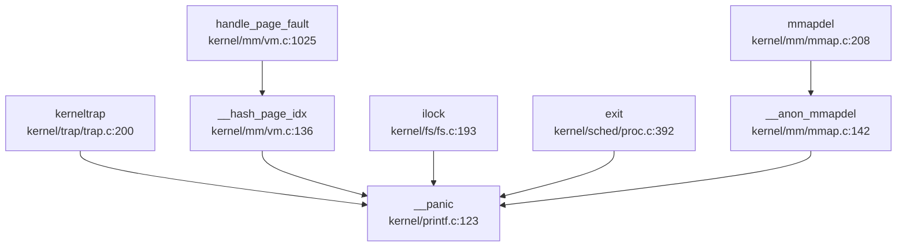

**主要触发场景**：
1. **内核陷阱处理失败** (`kerneltrap`)
2. **内存管理错误** (页表操作、mmap 删除)
3. **文件系统锁错误** (`ilock`)
4. **进程退出时的断言失败**
5. **调试断言触发** (`__debug_assert`)

---

## 错误码与 Result 设计

### 错误码定义

**✅ 已实现**：标准 POSIX 风格错误码

**定义位置**：`include/errno.h` (107 行，4.8KB)

系统定义了 98 个标准错误码，覆盖常见错误场景：

```c
// include/errno.h:1-40
#define EPERM       1   /* Operation not permitted */
#define ENOENT      2   /* No such file or directory */
#define ESRCH       3   /* No such process */
#define EINTR       4   /* Interrupted system call */
#define EIO         5   /* I/O error */
#define ENOMEM      12  /* Out of memory */
#define EACCES      13  /* Permission denied */
#define EFAULT      14  /* Bad address */
#define EINVAL      22  /* Invalid argument */
#define ENOSYS      38  /* Invalid system call number */
```

### 错误返回约定

系统调用遵循 Unix 传统：
- 成功：返回非负值（结果或 0）
- 失败：返回 `-ERROR_CODE`

**示例** (`kernel/syscall/sysfile.c`):
```c
// sys_read 返回读取的字节数或 -errno
if (n < 0) return -n;  // 错误码取负
```

**Rust 部分** (SBI 层 `sbi/psicasbi/src/main.rs`):
```rust
// 使用 Result<T, E> 模式
fn panic(info: &PanicInfo) -> ! {
    println!("\x1b[31;1m[panic]\x1b[0m: {}", info);
    loop {}
}
```

---

## 调试接口与交互式 Shell

### 用户态 Shell

**✅ 已实现**：基础交互式 Shell

**实现位置**：`xv6-user/sh.c` (661 行，12.0KB)

**支持命令**：
- 内置命令：`cd`, `exit`
- 外部命令：通过 `execve` 执行 `/bin/` 下程序
- 管道：`|` 支持
- 重定向：`<`, `>` 支持

**快捷键支持** (README.md:80):
- `Ctrl-C`: 发送 SIGINT
- `Ctrl-D`: EOF
- `Ctrl-U`: 清除行
- `Ctrl-K`: 杀死进程

**调试功能**：
```c
// xv6-user/sh.c:293
// 支持嵌入式环境变量（用于基本命令）
```

### 内核调试命令

**🔸 桩函数/有限实现**：`procdump` 进程调试

**实现位置**：`kernel/sched/proc.c:888-899`

```c
void procdump(void) {
    printf("\nepc = %p\n", r_sepc());
    printf("next pid = %d\n", __pid);
    printf("\nPID\tPPID\tSTATE\tKILLED\tNAME\tMEM_LOAD\tMEM_HEAP\n");
    for (int i = 0; i < HASH_SIZE; i ++) {
        __print_proc_no_lock(pid_hash[i]);
    }
}
```

**功能**：打印所有进程的状态表（PID、PPID、状态、名称、内存负载）

**调用方式**：需在内核代码中显式调用，**未提供交互式 Monitor 接口**

### 栈打印辅助

**✅ 已实现**：`show_stack` 函数

**实现位置**：`kernel/exec.c:126-134`

```c
void
show_stack(pagetable_t pagetable, uint64 sp, uint64 sz)
{
  for(uint64 i = sp; i < sz; i += 8) {
    uint64 *pa = (void*)walkaddr(pagetable, i) + i - PGROUNDDOWN(i);
    if(pa) printf("addr %p phaddr:%p value %p\n", i, pa, *pa);
    else printf("addr %p value (nil)\n", i);
  }
}
```

**用途**：打印指定栈范围的内存内容，用于调试栈溢出或异常

---

## GDB Stub 支持情况

### GDB Stub 分析

**❌ 未实现**：内核级 GDB Stub

**搜索结果**：
- `grep "gdbstub|gdb_stub|handle_gdb"`：**0 匹配**
- 无数据包解析循环
- 无 GDB 协议处理函数

**现有调试配置** (`debug/.gdbinit.tmpl-riscv`):
```
# 仅作为 GDB 初始化模板
# 用于连接外部调试器（如 OpenOCD）
# 非内核内置 GDB Stub
```

**OpenOCD 支持** (`debug/openocd_cfg/`):
- `ft2232c.cfg`: FTDI 适配器配置
- `k210.cfg`: K210 开发板配置
- `openocd_ftdi.cfg`: 通用 FTDI 配置

**结论**：系统依赖**外部硬件调试器**（OpenOCD + GDB），**未实现软件 GDB Stub**。

---

## 断言与运行时检查

### 断言系统

**✅ 已实现**：双层断言机制

**定义位置**：`include/utils/debug.h`

**调试断言** (仅 DEBUG 模式):
```c
#ifdef DEBUG 
    #define __debug_assert(func, cond, ...) do {\
        if (!(cond)) {\
            __debug_error(func, __VA_ARGS__);\
            panic("panic!\n");\
        }\
    } while (0)
#else 
    #define __debug_assert(func, cond, ...) \
        do {} while(0)
#endif 
```

**生产断言** (始终生效):
```c
#define __assert(func, cond, ...) do {\
    if (!(cond)) {\
        __debug_error(func, "at %s: %d\n", __FILE__, __LINE__);\
        __debug_error(func, __VA_ARGS__);\
        panic("panic!\n");\
    }\
} while (0)
```

### 实际使用示例

**内存管理断言** (`kernel/mm/pm.c:190`):
```c
__assert("kpminit", START_SINGLE - (uint64)boot_stack_top >= PGSIZE,
         "boot stack too large\n");
```

**进程管理断言** (`kernel/sched/proc.c:50-75`):
```c
__debug_assert("hash_insert", NULL != p, "insert NULL into hash\n");
__debug_assert("hash_search", pid >= 1, "pid %d too small\n", pid);
```

**陷阱处理断言** (`kernel/trap/trap.c:213-215`):
```c
__debug_assert("kerneltrap", (0 != (sstatus & SSTATUS_SPP)), 
               "not from supervisor mode\n");
__debug_assert("kerneltrap", 0 == intr_get(), 
               "interrupts enable\n");
```

### 系统调用追踪 (Trace)

**✅ 已实现**：基础系统调用追踪

**系统调用号** (`include/sysnum.h:11`):
```c
#define SYS_trace     18
```

**系统调用实现** (`kernel/syscall/sysproc.c:254-264`):
```c
uint64
sys_trace(void)
{
    // int mask;
    // if(argint(0, &mask) < 0) {
    //   return -1;
    // }
    // myproc()->tmask = mask;
    myproc()->tmask = 1;  // 🔸 简化实现：固定 mask=1
    return 0;
}
```

**追踪逻辑** (`kernel/syscall/syscall.c:365-373`):
```c
// trace
int trace = p->tmask;  // & (1 << (num - 1));
if (trace) {
    printf("pid %d: %s(", p->pid, sysnames[num]);
}
p->trapframe->a0 = syscalls[num]();
if (trace) {
    printf(") -> %d\n", p->trapframe->a0);
}
```

**用户态工具** (`xv6-user/strace.c`):
```c
if (trace() < 0) {
    fprintf(2, "%s: strace failed\n", argv[0]);
    exit(1);
}
execve(nargv[0], nargv, envp);
```

**功能**：打印进程执行的系统调用及其返回值

**局限性**：
- 🔸 `sys_trace` 仅支持固定 mask=1，**不支持按系统调用类型过滤**
- 无时间戳、无调用参数详细打印

---

## 关键代码片段

### 1. Panic 处理完整流程

```c
// include/printf.h:11-16 - Panic 宏
#define panic(s) do {\
    printf(__ERROR(__module_name__)": hart %d at %s: %d\n", \
            cpuid(), __FILE__, __LINE__\
    );\
    __panic(s);\
} while (0)

// kernel/printf.c:123-143 - Panic 处理 + 栈回溯
void __panic(char *s)
{
    printf(__ERROR("panic")": ");
    printf(s);
    printf("\n");
    backtrace();          // 打印调用栈
    panicked = 1;
    intr_off();           // 关中断
    for(;;)
        ;                 // 死循环停机
}

void backtrace()
{
    uint64 *fp = (uint64 *)r_fp();
    uint64 *bottom = (uint64 *)PGROUNDUP((uint64)fp);
    printf("backtrace:\n");
    while (fp < bottom) {
        uint64 ra = *(fp - 1);
        printf("%p\n", ra - 4);
        fp = (uint64 *)*(fp - 2);
    }
}
```

### 2. 调试断言宏

```c
// include/utils/debug.h:38-58
#ifdef DEBUG 
    #define __debug_assert(func, cond, ...) do {\
        if (!(cond)) {\
            __debug_error(func, __VA_ARGS__);\
            panic("panic!\n");\
        }\
    } while (0)
#else 
    #define __debug_assert(func, cond, ...) \
        do {} while(0)
#endif 

#define __assert(func, cond, ...) do {\
    if (!(cond)) {\
        __debug_error(func, "at %s: %d\n", __FILE__, __LINE__);\
        __debug_error(func, __VA_ARGS__);\
        panic("panic!\n");\
    }\
} while (0)
```

### 3. 系统调用追踪

```c
// kernel/syscall/syscall.c:365-373
int trace = p->tmask;
if (trace) {
    printf("pid %d: %s(", p->pid, sysnames[num]);
}
p->trapframe->a0 = syscalls[num]();
if (trace) {
    printf(") -> %d\n", p->trapframe->a0);
}
```

---

## 本章总结

| 功能模块 | 实现状态 | 说明 |
|---------|---------|------|
| **日志系统** | ✅ 已实现 | 支持 INFO/WARN/ERROR 三级，彩色输出，模块化前缀 |
| **Panic 处理** | ✅ 已实现 | 完整流程：打印错误→栈回溯→关中断→停机 |
| **栈回溯** | ✅ 已实现 (基础) | 基于 Frame Pointer，不支持 DWARF/符号解析 |
| **错误码** | ✅ 已实现 | 98 个标准 POSIX 错误码 |
| **交互式 Shell** | ✅ 已实现 | 支持管道、重定向、快捷键 |
| **内核 Monitor** | ❌ 未实现 | 仅有 `procdump` 函数，无交互式命令接口 |
| **GDB Stub** | ❌ 未实现 | 依赖外部 OpenOCD 硬件调试 |
| **系统调用追踪** | 🔸 桩函数 | 仅支持固定 mask=1，无细粒度过滤 |
| **断言系统** | ✅ 已实现 | DEBUG/生产双层断言 |
| **Perf/Ftrace** | ❌ 未实现 | 无性能分析工具支持 |

**设计特点**：
1. **轻量级调试**：基于 Frame Pointer 的栈回溯，避免 DWARF 解析开销
2. **分层断言**：DEBUG 模式与生产模式分离
3. **外部调试依赖**：通过 OpenOCD+GDB 进行源码级调试，内核保持精简

**改进建议**：
1. 实现符号解析，将回溯地址转换为函数名
2. 完善 `sys_trace`，支持按系统调用类型过滤
3. 添加内核 Monitor，支持 `ps`、`meminfo` 等调试命令
4. 考虑实现简易 GDB Stub 或 RISC-V 调试模块 (debug mode) 支持

---


# 开发历史与里程碑

## 第 13 章：开发历史与里程碑

### 一、项目概览与人员协作

#### 总规模与协作模式

本项目是一个典型的**双人协作开发**的操作系统教学项目，开发周期高度集中（2023-08-09 至 2023-08-21，共 13 天）。

**贡献者分析**：

| 作者 | Commit 数 | 总增删行数 | 主力贡献模块 |
|------|----------|-----------|-------------|
| **zrhxlhydjcx** | 25 commits | +45,437 / -4,222 | `kernel/` (25,466 行), `include/` (8,053 行), `xv6-user/` (7,234 行) |
| **ZEMINGMA** | 23 commits | +7,096 / -2,622 | `kernel/` (3,162 行), `sbi/` (2,471 行), `tools/` (1,813 行) |

**协作模式特征**：
- **zrhxlhydjcx** 是核心内核开发主力，负责了绝大部分内核代码（`kernel/`、`include/`）和用户态程序（`xv6-user/`）的编写
- **ZEMINGMA** 专注于底层基础设施：SBI 固件（`sbi/psicasbi`）、构建工具（`tools/kflash.py`）以及部分内核模块
- 两人存在明显的**模块化分工**，但在内核核心模块（如信号处理、内存管理）上有交叉修改

#### 初始完成功能（第一版本骨架）

**初始 Commit**：`b7ffeecc` (2023-08-09) - "final start shell"

该提交一次性引入了**42,627 行代码**，建立了完整的操作系统骨架。根据 `find_symbol_first_commit` 的检测结果，初始版本已包含以下核心子系统：

| 子系统 | 核心符号 | 引入时间 | 状态 |
|--------|---------|---------|------|
| **启动入口** | `_start`, `rust_main` | 2023-08-09 (初始) | ✅ 初始版本已有 |
| **中断/Trap** | `trap_handler`, `TrapFrame`, `stvec` | 2023-08-09 (初始) | ✅ 初始版本已有 |
| **文件系统** | `fat32`, `sys_open`, `virtio_blk`, `UART`, `plic` | 2023-08-09 (初始) | ✅ 初始版本已有 |
| **系统调用** | `sys_write`, `sys_read`, `sys_exec`, `sys_pipe` | 2023-08-09 (初始) | ✅ 初始版本已有 |
| **内存管理** | `FrameAllocator` | 2023-08-10 (次日) | 🔸 后续版本引入 |
| **其他内存机制** | `PageTable`, `MemorySet` | ❌ 未找到 | ❌ 暂不支持该功能 |
| **进程管理** | `TaskInner`, `spawn_task`, `ProcessInner` | ❌ 未找到 | ❌ 暂不支持该功能 |
| **IPC** | `Mailbox`, `sys_msgget`, `sys_shmget` | ❌ 未找到 | ❌ 暂不支持该功能 |
| **网络** | `sys_socket`, `smoltcp`, `TcpSocket` | ❌ 未找到 | ❌ 暂不支持该功能 |

**关键发现**：
- 初始版本采用**"大爆炸"式开发**，第一天就完成了内核主体框架（`kernel/` 22,636 行 + `include/` 8,012 行 + `xv6-user/` 6,378 行）
- 项目基于 **xv6-riscv** 进行移植和扩展，而非从零开始编写
- 初始版本已支持 FAT32 文件系统、UART 串口、PLIC 中断控制器、VirtIO 块设备驱动

---

### 二、后续版本演进与功能完善

#### 重大 Commit 演进轨迹

根据 `get_git_history_summary` 和 `get_commit_diff_summary` 的分析，以下是 8 次最具代表性的重大变更：

| 日期 | Commit SHA | 增删规模 | 变更模块 | 性质 |
|------|-----------|---------|---------|------|
| 2023-08-09 | `b7ffeecc` | +42,627 / -0 | 全模块 | 【初始版本】建立完整骨架 |
| 2023-08-10 | `b3cdaddd` | +2,319 / -0 | `sbi/` | 【新增功能】引入 PsicaSBI 固件 |
| 2023-08-10 | `5c67f06` | +347 / -81 | `kernel/exec.c` | 【Bug 修复】修复 exec 加载逻辑 |
| 2023-08-13 | `2eefb91` | +500 / -11 | `xv6-user/` | 【新增功能】添加测试代码 |
| 2023-08-15 | `fe04f6e` | +16 / -285 | `xv6-user/`, `Makefile` | 【重构】标准化构建流程 |
| 2023-08-16 | `df1fdc3` | +1,751 / -1,839 | `kernel/`, `include/` | 【重构】信号系统大重构 |
| 2023-08-19 | `15ff2742` | +1,828 / -2 | `tools/` | 【新增功能】添加 K210 烧录工具 |
| 2023-08-21 | `d17dd26` | +869 / -55 | `kernel/`, `xv6-user/` | 【新增功能】添加用户程序测试集 |

#### 核心模块演进分析

**1. 信号处理系统（Signal Handling）**

- **首次引入**：初始版本已有基础信号机制（`include/sched/signal.h`）
- **重大重构**：Commit `df1fdc35` (2023-08-16) - "fix signal"
  - 增删规模：+1,751 / -1,839 行
  - 变更文件：`kernel/sched/signal.c`、`kernel/trap/trap.c`、`include/sched/signal.h`
  - 重构内容：
    - 将信号处理代码从 `kernel/mesg/signal.c` 迁移至 `kernel/sched/signal.c`
    - 重构 `sigaction` 结构体，引入 `__ksigaction_t` 内核态信号动作结构
    - 添加信号帧（`sig_frame`）管理机制，支持信号处理函数的用户态返回
    - 实现信号返回 trampolines（`sig_trampoline.S`）

**文件演进轨迹**（`kernel/sched/proc.c`）：
```
[2023-08-09] +1061 行  初始版本建立进程管理框架
[2023-08-10] +1 行     修复 exec 细节
[2023-08-11] +60 行    修复多个 bug
[2023-08-14] +53 行    添加 lmbench 测试支持
[2023-08-15] +31 行    重大改进
[2023-08-16] +571/-711 信号系统重构
[2023-08-21] +15 行    启动 shell 修复
```

**2. 内存管理系统（Memory Management）**

- **初始版本**：已包含页表管理（`kernel/mm/vm.c` 1,101 行）、内核内存分配（`kmalloc.c`）、用户内存管理（`usrmm.c`）
- **COW 机制**：✅ 已实现
  - 使用 `PTE_COW` (PTE_RSW1) 标记写时复制页
  - `uvmcopy()` 函数支持 COW 参数，在 fork 时标记父页表为只读
  - 测试程序：`xv6-user/cowtest.c` (199 行)
  
**文件演进轨迹**（`kernel/mm/vm.c`）：
```
[2023-08-09] +1101 行  初始版本建立页表管理机制
[2023-08-10] +2/-1 行  修复 exec 内存加载细节
[2023-08-11] +30 行    准备测试代码
[2023-08-11] +5 行     修复 bug
[2023-08-16] +22/-72  信号系统重构影响
```

**3. 多核支持（SMP）**

- **实现状态**：🔸 部分实现
- 证据：
  - `Makefile` 中设置 `CPUS := 2`，QEMU 启动参数使用 `-smp $(CPUS)`
  - `include/memlayout.h` 定义了 PLIC 多核中断使能寄存器宏（`PLIC_MENABLE(hart)`）
  - `kernel/main.c` 中检测到多核启动逻辑（`sbi_send_ipi(mask, 0)`）
  - `include/sched/proc.h` 中 `cpuid()` 通过 `r_tp()` 读取线程指针获取 hart ID
- **缺失**：未发现完整的自旋锁（spinlock）多核同步机制实现，`kernel/sync/spinlock.c` 仅 84 行，可能为简化版本

**4. mmap 与延迟分配**

- **mmap 系统调用**：✅ 已实现
  - `include/sysnum.h` 定义 `SYS_mmap` (222)
  - `kernel/mm/mmap.c` (1,080 行) 实现完整的内存映射机制
  - 支持匿名映射、文件映射、共享映射
- **延迟分配（Lazy Allocation）**：🔸 部分实现
  - 测试程序：`xv6-user/lazytests.c` (153 行)
  - 通过页故障处理实现按需分配，但代码中未发现明确的 "lazy" 关键词实现

**5. SBI 固件（PsicaSBI）**

- **引入时间**：2023-08-10 (Commit `b3cdaddd`)
- **规模**：+2,319 行 Rust 代码
- **功能**：
  - 基于 Rust 编写的 RISC-V SBI 实现
  - 支持 QEMU 和 K210 双平台（通过 Cargo features 切换）
  - 实现 CLINT 定时器、IPI 中断、UART 串口
  - 采用 HAL 抽象层设计，分离平台相关代码

---

### 三、现状评估与后续修改建议

#### 目前还缺什么

基于对整个仓库历史和现状的分析，该操作系统存在以下明显缺失或未完善的模块：

**1. 进程管理抽象不足** ❌
- 未发现 `TaskInner`、`ProcessInner`、`spawn_task` 等现代进程管理结构
- 进程控制块（`struct proc`）直接暴露底层实现，缺乏封装
- 进程调度器可能为简单轮转（Round-Robin），未发现 CFS 或多级队列调度

**2. 网络协议栈缺失** ❌
- 未找到 `sys_socket`、`smoltcp`、`TcpSocket`、`udp_send` 等网络相关符号
- 无网卡驱动（如 VirtIO Net）
- 网络功能完全未实现

**3. 高级 IPC 机制缺失** ❌
- 仅支持基础的 `pipe` 和 `sys_pipe`
- 未发现消息队列（`sys_msgget`）、共享内存（`sys_shmget`）、信号量等 System V IPC
- 无 `Mailbox` 机制

**4. 内存管理功能不完整** 🔸
- 虽然实现了 COW 和 mmap，但：
  - 未发现 `PageTable`、`MemorySet` 等高级抽象（可能是命名差异，但 grep 未找到）
  - 缺页错误处理（page fault handler）可能不完善
  - 未发现 swap/页面置换机制

**5. 多核同步机制薄弱** 🔸
- 虽然有 `spinlock.c` (84 行) 和 `sleeplock.c` (66 行)，但代码量过小
- 可能存在竞态条件风险
- 未检测到完整的 RCU 或无锁数据结构

**6. 设备驱动有限** 🔸
- 已实现：UART、PLIC、SDCard、VirtIO Block
- 缺失：网卡、GPU/显示、USB、PCIe 枚举

#### 现在还需要怎么改

基于上述分析，提出以下 5 条最迫切的改进建议：

**建议 1：完善进程管理抽象**
```
优先级：高
工作量：中等（约 500-800 行）

修改方向：
- 引入 TaskStruct 封装，分离线程和进程概念
- 实现 spawn_task() 和 kernel_thread() 接口
- 添加进程组、会话概念，支持 job control
- 参考文件：kernel/sched/proc.c (当前 1,036 行)
```

**建议 2：实现网络协议栈**
```
优先级：中
工作量：大（约 3,000-5,000 行）

修改方向：
- 集成 smoltcp Rust 库或编写轻量级 TCP/IP 栈
- 实现 VirtIO Net 驱动（kernel/hal/virtio_net.c）
- 添加 sys_socket、sys_bind、sys_connect 等系统调用
- 参考：xv6-user 中无网络测试程序，需新增
```

**建议 3：增强多核同步机制**
```
优先级：高
工作量：中等（约 300-500 行）

修改方向：
- 扩展 spinlock.c，添加 ticket lock 或 MCS lock
- 实现 per-CPU 变量和 CPU 亲和性调度
- 添加内存屏障（mb/rmb/wmb）确保多核内存序
- 验证位置：kernel/sync/spinlock.c (当前仅 84 行)
```

**建议 4：完善内存管理高级特性**
```
优先级：中
工作量：中等（约 400-600 行）

修改方向：
- 实现 swap 机制和页面置换算法（FIFO/LRU/Clock）
- 优化缺页错误处理（trap.c 中的 page fault handler）
- 添加 THP（Transparent Huge Page）支持
- 参考文件：kernel/mm/vm.c (当前 1,091 行)
```

**建议 5：添加系统调用追踪与调试工具**
```
优先级：低
工作量：小（约 200 行）

修改方向：
- 实现 strace 系统调用追踪（已有 xv6-user/strace.c）
- 添加 /proc 文件系统暴露内核状态
- 实现 dmesg 内核日志环形缓冲区
- 参考：xv6-user/strace.c (68 行) 功能有限
```

---

**总结**：

该项目在 13 天的密集开发周期内完成了从 0 到 1 的突破，建立了一个功能相对完整的 RISC-V 操作系统。核心优势在于**快速搭建骨架**和**双平台支持**（QEMU + K210）。然而，作为一个教学项目，它在**进程管理抽象**、**网络支持**、**多核同步**等方面仍有明显不足。后续开发应优先完善这些核心子系统，而非继续添加边缘功能。

---


---

*本报告由 OS-Agent-D 自动生成*  
*生成时间: 2026-03-14 17:51:22*  
*分析耗时: 38.4 分钟*
