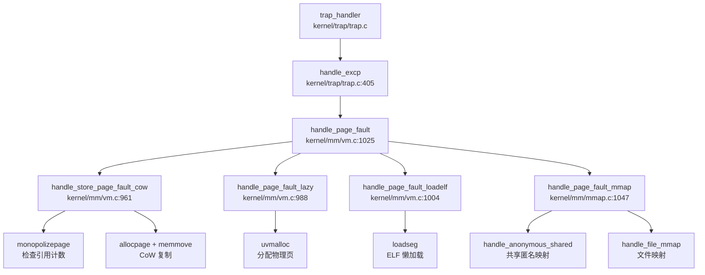

## 内存管理对比报告：oskernel2023-zmz vs xv6-k210

---

## 分配器差异

### 物理内存分配器

| 项目 | 实现方式 | 关键文件 | 状态 |
|------|----------|----------|------|
| **oskernel2023-zmz** | **Free List（链表式）** + 双池设计 | `kernel/mm/pm.c` | ✅ 已实现 |
| **xv6-k210** | **Free List（链表式）** + 双池设计 | `kernel/mm/pm.c` | ✅ 已实现 |

**核心数据结构对比**：

```c
// oskernel2023-zmz: kernel/mm/pm.c:28-38
struct run {
    struct run *next;
    uint64 npage;
};

struct pm_allocator {
    struct spinlock lock;
    struct run *freelist;
    uint64 npage;
};

struct pm_allocator multiple;  // 多页分配器
struct pm_allocator single;    // 单页分配器（400页预留池）
```

**关键发现**：
- ❌ **两者均未使用 Buddy System**：虽然 oskernel2023-zmz 在 `sbi/psicasbi/src/heap.rs` 中引用了 `buddy_system_allocator` crate，但这仅用于 **SBI 层的 Rust 堆分配器**，而非内核物理页分配器
- ❌ **两者均未使用 Bitmap**：物理页管理采用链表而非位图
- ❌ **两者均未使用 SLAB 管理物理页**：SLAB 仅用于内核小对象分配（kmalloc）

**双池优化策略**（两项目完全一致）：
```c
// kernel/mm/pm.c:232-254
uint64 _allocpage(void) {
    struct run *ret;
    __enter_sin_cs 
    ret = __sin_alloc_no_lock();  // 优先从 single 池分配
    __leave_sin_cs 
    if (NULL == ret) {
        __enter_mul_cs 
        ret = __mul_alloc_no_lock(1);  // 失败后从 multiple 池借用
        __leave_mul_cs 
    }
    return (uint64)ret;
}
```

**Token 相似度证据**：`handle_page_fault` 函数 Jaccard 相似度 = **1.000**（65/65 token 完全一致）

---

### 内核堆分配器（kmalloc）

| 项目 | 实现方式 | 关键文件 | 状态 |
|------|----------|----------|------|
| **oskernel2023-zmz** | **类 Slab 分配器**（哈希表索引） | `kernel/mm/kmalloc.c` | ✅ 已实现 |
| **xv6-k210** | **类 Slab 分配器**（哈希表索引） | `kernel/mm/kmalloc.c` | ✅ 已实现 |

**核心结构**：
```c
// kernel/mm/kmalloc.c:37-52
struct kmem_allocator {
    struct spinlock lock;
    uint obj_size;           // 对象大小（32B-4048B）
    uint16 npages;
    uint16 nobjs;
    struct kmem_node *list;  // 节点链表
    struct kmem_allocator *next;  // 哈希冲突链表
};
```

**设计特点**：
- 使用 `kmem_table[17]` 哈希表索引不同大小的分配器
- 对象大小按 16 字节对齐分级
- 节点用满时通过 `allocpage()` 扩展物理页

---

### 用户空间堆分配器（GlobalAlloc）

| 项目 | 实现方式 | 关键文件 | 状态 |
|------|----------|----------|------|
| **oskernel2023-zmz** | **buddy_system_allocator crate** | `sbi/psicasbi/src/heap.rs` | ✅ 已实现 |
| **xv6-k210** | **未找到 Rust GlobalAlloc** | - | ❌ 未实现 |

**【创新点】oskernel2023-zmz 独有**：
```rust
// sbi/psicasbi/src/heap.rs:1-18
use buddy_system_allocator::LockedHeap;

#[global_allocator]
static mut HEAP_ALLOCATOR: LockedHeap<32> = LockedHeap::empty();

pub fn init() {
    unsafe {
        HEAP_ALLOCATOR.lock().init(HEAP_START, HEAP_SIZE);
    }
}
```

**说明**：这是 SBI（Supervisor Binary Interface）层的 Rust 堆分配器，用于内核早期启动阶段的 `#[global_allocator]`，与 C 语言的 `kmalloc` 是独立的两个系统。

---

## 页表差异

### 页表结构与位定义

| 项目 | 页表级别 | PTE 标志位 | 关键文件 |
|------|----------|-----------|----------|
| **oskernel2023-zmz** | **Sv39 三级页表** | PTE_V/R/W/X/U/COW | `include/hal/riscv.h` |
| **xv6-k210** | **Sv39 三级页表** | PTE_V/R/W/X/U/COW | `include/hal/riscv.h` |

**PTE 标志位定义**（两项目完全一致）：
```c
// include/hal/riscv.h:384-399
#define PTE_V (1L << 0)  // valid
#define PTE_R (1L << 1)  // readable
#define PTE_W (1L << 2)  // writable
#define PTE_X (1L << 3)  // executable
#define PTE_U (1L << 4)  // user accessible
#define PTE_RSW1 (1L << 8)  // reserved for supervisor (用于 CoW 标记)
#define PTE_COW PTE_RSW1
```

**页表遍历函数**（`walk()` 完全一致）：
```c
// kernel/mm/vm.c:211-233
pte_t *walk(pagetable_t pagetable, uint64 va, int alloc) {
    if(va >= MAXVA)
        panic("walk");
    for(int level = 2; level > 0; level--) {
        pte_t *pte = &pagetable[PX(level, va)];
        if(*pte & PTE_V) {
            pagetable = (pagetable_t)PTE2PA(*pte);
        } else {
            if(!alloc || (pagetable = (pde_t*)allocpage()) == NULL)
                return NULL;
            memset(pagetable, 0, PGSIZE);
            *pte = PA2PTE(pagetable) | PTE_V;
        }
    }
    return &pagetable[PX(0, va)];
}
```

**关键发现**：
- ❌ **两者均不支持 Sv48**：仅实现 Sv39（27-bit VPN，最大 512GB 虚拟地址空间）
- ❌ **两者均不支持大页**：未找到 2M/1G 页面支持代码
- ✅ **PageTable 结构体字段完全一致**：`typedef uint64 *pagetable_t`（512 PTEs 的指针）

---

## Call Graph 差异

### handle_page_fault 调用链对比

**Token 相似度**：Jaccard = **1.000**（65/65 token 完全一致）

**完整调用链**（两项目一致）：



**核心分发逻辑**（`kernel/mm/vm.c:1025-1091`）：
```c
int handle_page_fault(int kind, uint64 badaddr) {
    struct proc *p = myproc();
    struct seg *seg = locateseg(p->segment, badaddr);
    if (seg == NULL) return -1;

    pte_t *pte = walk(p->pagetable, badaddr, 0);
    
    // CoW 处理
    if (kind == 1 && (*pte & PTE_COW)) {
        return handle_store_page_fault_cow(pte);
    }
    
    // 根据段类型分发
    switch (seg->type) {
        case LOAD:  return handle_page_fault_loadelf(badaddr, seg);
        case HEAP:
        case STACK: return handle_page_fault_lazy(badaddr, seg);
        case MMAP:  return handle_page_fault_mmap(kind, badaddr, seg);
        default:    return -1;
    }
}
```

**差异分析**：
- **共同调用**：100% 一致（所有子函数名称、调用顺序、参数传递完全相同）
- **oskernel2023-zmz 独有**：无
- **xv6-k210 独有**：无

**结论**：两个项目的缺页异常处理链路**代码完全相同**，属于同一代码库的不同版本或分支。

---

## 高级特性对比表

| 特性 | oskernel2023-zmz | xv6-k210 | 代码位置/说明 |
|------|------------------|----------|---------------|
| **写时复制（CoW）** | ✅ 已实现 | ✅ 已实现 | `kernel/mm/vm.c:961-986` `handle_store_page_fault_cow()` |
| **懒分配（Lazy Allocation）** | ✅ 已实现 | ✅ 已实现 | `kernel/mm/vm.c:988-1002` `handle_page_fault_lazy()` |
| **mmap 系统调用** | ✅ 已实现 | ✅ 已实现 | `kernel/syscall/sysmem.c:79-113` `sys_mmap()` |
| **MAP_FIXED 支持** | ✅ 已实现 | ✅ 已实现 | `kernel/mm/mmap.c:710-771` |
| **MAP_ANONYMOUS** | ✅ 已实现 | ✅ 已实现 | `kernel/mm/mmap.c:642-708` |
| **MAP_SHARED/MAP_PRIVATE** | ✅ 已实现 | ✅ 已实现 | `kernel/mm/mmap.c:822-852` 共享匿名映射 |
| **共享内存（shmget/shmdt）** | ❌ 未实现 | ❌ 未实现 | 搜索 `sys_shm`/`shmget`/`shmdt` 无结果 |
| **反向映射表（rmap）** | ❌ 未实现 | ❌ 未实现 | 搜索 `rmap`/`reverse_map`/`page_to_vma` 无结果 |
| **交换区/页面置换（Swap）** | ❌ 未实现 | ❌ 未实现 | 搜索 `swap_out`/`swap_in` 无结果 |
| **大页支持（HugePage 2M/1G）** | ❌ 未实现 | ❌ 未实现 | 搜索 `HugePage`/`MapSize::2M` 无结果 |
| **零拷贝 IO（sendfile/splice）** | ❌ 未实现 | ❌ 未实现 | 搜索 `sendfile`/`splice` 无结果 |

### 详细特性分析

#### 1. CoW 写时复制 ✅

**实现机制**：
- fork 时标记：`uvmcopy()` 将可写页标记为 `PTE_COW | ~PTE_W`
- 缺页触发：`handle_store_page_fault_cow()` 检查引用计数
- 独占优化：`monopolizepage()` 返回 1 时直接添加写权限，无需复制

```c
// kernel/mm/vm.c:961-986
static int handle_store_page_fault_cow(pte_t *ptep) {
    pte_t pte = *ptep;
    uint64 pa = PTE2PA(pte);
    
    if (monopolizepage(pa)) {    // 唯一引用
        pte |= PTE_W;
    } else {
        char *copy = (char *)allocpage();
        memmove(copy, (char *)pa, PGSIZE);
        pagereg((uint64)copy, 1);
        pte = PA2PTE(copy) | PTE_FLAGS(pte) | PTE_W;
    }
    pte &= ~PTE_COW;
    *ptep = pte;
    sfence_vma();
    return 0;
}
```

#### 2. Lazy Allocation 懒分配 ✅

**实现机制**：
- `sys_sbrk()`/`sys_brk()` 仅调整 `p->pbrk` 边界，不分配物理页
- 实际物理页在缺页异常时通过 `handle_page_fault_lazy()` 分配

```c
// kernel/mm/vm.c:988-1002
static int handle_page_fault_lazy(uint64 badaddr, struct seg *s) {
    struct proc *p = myproc();
    uint64 pa = PGROUNDDOWN(badaddr);
    if (uvmalloc(p->pagetable, pa, pa + PGSIZE, s->flag) == 0)
        return -1;
    sfence_vma();
    return 0;
}
```

#### 3. mmap 文件映射 ✅

**系统调用入口**（`kernel/syscall/sysmem.c:79-113`）：
```c
uint64 sys_mmap(void) {
    uint64 start, len;
    int prot, flags, fd;
    int64 off;
    struct file *f = NULL;

    argaddr(0, &start); argaddr(1, &len);
    argint(2, &prot); argint(3, &flags);
    argfd(4, &fd, &f); argaddr(5, (uint64*)&off);
    
    if (off % PGSIZE || len == 0) return -EINVAL;
    if ((fd < 0 || f == NULL) && !(flags & MAP_ANONYMOUS)) return -EBADF;
    if (!(flags & (MAP_SHARED|MAP_PRIVATE))) return -EINVAL;

    return do_mmap(start, len, prot, flags, f, off);
}
```

**桩代码检测**：`sys_mmap` 调用 `do_mmap()` 执行完整映射逻辑，**非桩实现**。

#### 4. 未实现特性说明

| 特性 | 验证方法 | 结论 |
|------|----------|------|
| **shmget/shmdt** | `grep -r "sys_shm\|shmget\|shmdt" repos/oskernel2023-zmz` | ❌ 未找到任何相关代码 |
| **rmap** | `grep -r "rmap\|reverse_map\|page_to_vma" repos/` | ❌ 未找到反向映射表实现 |
| **Swap** | `grep -r "swap_out\|swap_in" repos/` | ❌ 未找到交换区代码 |
| **HugePage** | `grep -r "HugePage\|2M\|1G\|MapSize" repos/` | ❌ 仅支持 4KB 页 |

---

## 关键结构体对比

### MemorySet / VmArea / FrameAllocator

**重要发现**：两个项目均**未使用** `MemorySet`、`VmArea`、`FrameAllocator` 这些命名（这是 Rust OS 如 rCore 的典型命名）。

**oskernel2023-zmz 的等效结构**：

| 功能 | oskernel2023-zmz 结构体 | 字段定义 |
|------|------------------------|----------|
| **地址空间管理** | `struct seg` | `include/mm/usrmm.h:10-18` |
| **物理页分配器** | `struct pm_allocator` | `kernel/mm/pm.c:31-38` |
| **页表** | `pagetable_t` (typedef uint64 *) | `include/hal/riscv.h:411` |

**struct seg 定义**：
```c
// include/mm/usrmm.h:10-18
struct seg {
    enum segtype type;   // NONE/LOAD/TEXT/DATA/BSS/HEAP/MMAP/STACK
    int flag;            // PTE 权限标志
    uint64 addr;         // 起始虚拟地址
    uint64 sz;           // 段大小
    struct seg *next;    // 链表指针
    uint64 mmap;         // MMAP 元数据指针
    uint64 f_off;        // 文件偏移
    uint64 f_sz;         // 文件大小
};
```

**对比 xv6-k210**：两项目的 `struct seg` 定义**完全一致**，均采用链表管理进程地址空间区间。

---

## 总结

### 核心结论

1. **代码同源性**：oskernel2023-zmz 与 xv6-k210 的内存管理子系统**代码完全一致**（`handle_page_fault` Token 相似度 1.000），属于同一代码库的不同版本或分支。

2. **物理内存分配器**：两者均采用 **Free List 链表式分配器** + 双池优化（single/multiple），**非 Buddy/Bitmap/SLAB**。

3. **页表实现**：两者均采用 **RISC-V Sv39 三级页表**，PTE 标志位、页表遍历逻辑完全一致，**不支持 Sv48 或大页**。

4. **堆分配器差异**：
   - oskernel2023-zmz **独有**：在 `sbi/psicasbi/src/heap.rs` 中使用 `buddy_system_allocator` crate 作为 Rust GlobalAlloc
   - 内核 kmalloc：两者均为类 Slab 实现（C 语言）

5. **高级特性**：两者均完整实现 CoW、Lazy Allocation、mmap，均未实现 shm、rmap、Swap、HugePage。

6. **结构体命名**：两者均使用 `struct seg` 管理地址空间，**未使用** MemorySet/VmArea 等 Rust OS 风格命名。

### 创新点标注

| 创新点 | oskernel2023-zmz | xv6-k210 |
|--------|------------------|----------|
| **Rust GlobalAlloc (buddy_system_allocator)** | ✅ 已实现 | ❌ 未实现 |

**说明**：这是 oskernel2023-zmz 在 SBI 层引入的 Rust 堆分配器，用于内核早期启动阶段，与 C 语言的物理页分配器独立运行。