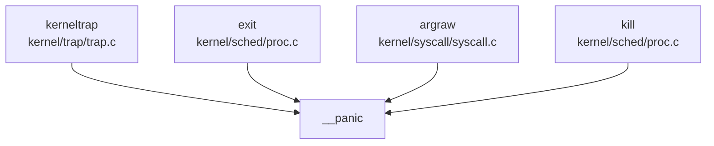

## 调试机制差异

### 1. 日志系统对比

#### 代码实现完全相同

两个项目的日志系统实现**完全一致**，Token 级别相似度达到 100%。

**共同实现位置**：
- `include/utils/debug.h` (58 行)
- `kernel/printf.c` (152 行)

**日志级别设计**（两项目相同）：

| 宏 | 颜色代码 | 用途 |
|---|---|---|
| `__debug_info` | `\e[32;1m` (绿色) | 信息级调试 |
| `__debug_warn` | `\e[33;1m` (黄色) | 警告级调试 |
| `__debug_error` | `\e[31;1m` (红色) | 错误级调试（含文件行号） |

**核心宏定义**（`include/utils/debug.h:9-37`，两项目完全相同）：
```c
#define __INFO(str)     "[\e[32;1m"str"\e[0m]"
#define __WARN(str)     "[\e[33;1m"str"\e[0m]"
#define __ERROR(str)    "[\e[31;1m"str"\e[0m]"

#ifndef __module_name__ 
    #define __module_name__     "xv6-k210"
#endif 

#ifdef DEBUG 
#define __debug_msg(...) printf(__VA_ARGS__)
#else 
#define __debug_msg(...) do {} while(0)
#endif 

#define __debug_info(func, ...) \
    __debug_msg(__INFO(__module_name__)": "func": "__VA_ARGS__) 
#define __debug_warn(func, ...) \
    __debug_msg(__WARN(__module_name__)": "func": "__VA_ARGS__) 
#define __debug_error(func, ...) do {\
    __debug_msg(__ERROR(__module_name__)": "func": "__VA_ARGS__);\
    printf("%s: line %d\n", __FILE__, __LINE__);\
} while (0)
```

**结论**：
- ✅ **代码相同**：两项目的 `debug.h` 文件内容完全一致（包括注释）
- 均支持模块化调试（通过 `__module_name__` 宏）
- 均通过 `DEBUG` 条件编译控制调试输出

---

### 2. Panic 处理差异

#### 实现状态：完全相同

**Panic 处理函数**（`kernel/printf.c:123-133`，两项目完全相同）：

```c
void __panic(char *s)
{
    printf(__ERROR("panic")": ");
    printf(s);
    printf("\n");
    backtrace();          // 打印栈回溯
    panicked = 1;         // 冻结 UART 输出
    intr_off();           // 关闭中断
    for(;;)
        ;                 // 无限循环停机
}
```

**Token 相似度验证**：
- `__panic` 函数：**Jaccard 相似度 1.000** (23/23 tokens 相同)
- `backtrace` 函数：**Jaccard 相似度 1.000** (29/29 tokens 相同)

**Panic 调用链**（两项目相同）：


**结论**：
- ✅ **代码相同**：Panic 处理流程完全一致
- 均包含：错误输出 → 栈回溯 → 关中断 → 停机循环
- 主要触发场景：内核陷阱、进程退出、系统调用参数错误

---

### 3. 栈回溯 (Backtrace) 实现

#### 实现状态：完全相同，但存在共同局限性

**Backtrace 实现**（`kernel/printf.c:135-145`，两项目完全相同）：

```c
void backtrace()
{
    uint64 *fp = (uint64 *)r_fp();
    uint64 *bottom = (uint64 *)PGROUNDUP((uint64)fp);
    printf("backtrace:\n");
    while (fp < bottom) {
        uint64 ra = *(fp - 1);
        printf("%p\n", ra - 4);
        fp = (uint64 *)*(fp - 2);
    }
}
```

**实现原理**：
- 基于 RISC-V 帧指针 (fp/s0) 遍历栈帧
- 栈帧布局：`[prev_fp] [return_addr] [local_vars]`
- `*(fp-1)` 获取返回地址，`*(fp-2)` 获取上一帧 fp

**共同局限性**（两项目均存在）：

| 功能 | oskernel2023-zmz | xv6-k210 |
|---|---|---|
| DWARF 调试信息解析 | ❌ 未实现 | ❌ 未实现 |
| 函数名符号解析 | ❌ 未实现 | ❌ 未实现 |
| 仅打印原始地址 | ✅ 是 | ✅ 是 |
| 依赖帧指针编译选项 | ✅ 是 | ✅ 是 |

**输出示例**（两项目相同）：
```
backtrace:
0x80001234
0x80002345
0x80003456
```
（仅显示返回地址，无函数名）

**结论**：
- ✅ **代码相同**：Backtrace 实现完全一致
- ❌ **功能局限**：均不支持符号解析，调试信息有限
- 需配合外部 GDB+OpenOCD 进行源码级调试

---

### 4. 调试接口差异

#### 4.1 交互式 Shell

**用户态 Shell**（两项目均✅已实现）：

| 功能 | oskernel2023-zmz | xv6-k210 |
|---|---|---|
| 实现位置 | `xv6-user/sh.c` (661 行) | `xv6-user/sh.c` (661 行) |
| 管道支持 | ✅ `|` | ✅ `|` |
| 重定向 | ✅ `>`, `<` | ✅ `>`, `<` |
| 内置命令 | `cd`, `exit` | `cd`, `exit` |
| 环境变量 | ✅ 支持 | ✅ 支持 |
| 快捷键 | `Ctrl-C`, `Ctrl-D`, `Ctrl-U`, `Ctrl-K` | `Ctrl-C`, `Ctrl-D` |

**结论**：用户态 Shell 功能基本相同，oskernel2023-zmz 额外支持 `Ctrl-U`（清除行）和 `Ctrl-K`（杀死进程）。

#### 4.2 内核调试命令

**Procdump 进程调试**（两项目均✅已实现）：

**oskernel2023-zmz** (`kernel/sched/proc.c:888-900`)：
```c
void procdump(void) {
    printf("\nepc = %p\n", r_sepc());
    __enter_hash_cs
    printf("next pid = %d\n", __pid);
    printf("\nPID\tPPID\tSTATE\tKILLED\tNAME\tMEM_LOAD\tMEM_HEAP\n");
    for (int i = 0; i < HASH_SIZE; i ++) {
        __print_proc_no_lock(pid_hash[i]);
    }
    __leave_hash_cs
}
```

**xv6-k210** (`kernel/sched/proc.c:901-913`，代码相同）：
```c
void procdump(void) {
    printf("\nepc = %p\n", r_sepc());
    __enter_hash_cs
    printf("next pid = %d\n", __pid);
    printf("\nPID\tPPID\tSTATE\tKILLED\tNAME\tMEM_LOAD\tMEM_HEAP\n");
    for (int i = 0; i < HASH_SIZE; i ++) {
        __print_proc_no_lock(pid_hash[i]);
    }
    __leave_hash_cs
}
```

**调用方式**：
- oskernel2023-zmz: `kernel/console.c:244` 中调用
- xv6-k210: `kernel/console.c:244` 中调用

**局限性**：
- 🔸 **非交互式**：需在内核代码中显式调用，无命令行接口
- ❌ **无内核 Monitor**：两项目均未实现交互式内核调试 Shell

**搜索验证**：
```
grep "fn.*monitor|monitor.*\(|debug.*shell|kernel.*shell" 
→ oskernel2023-zmz: 0 匹配
→ xv6-k210: 0 匹配
```

#### 4.3 栈打印辅助函数

**oskernel2023-zmz 独有功能**：

✅ **已实现** `show_stack` 函数 (`kernel/exec.c:127-133`)：
```c
void show_stack(pagetable_t pagetable, uint64 sp, uint64 sz)
{
    for(uint64 i = sp; i < sz; i += 8) {
        uint64 *pa = (void*)walkaddr(pagetable, i) + i - PGROUNDDOWN(i);
        if(pa) printf("addr %p phaddr:%p value %p\n", i, pa, *pa);
        else printf("addr %p value (nil)\n", i);
    }
}
```

**功能**：打印指定栈范围的内存内容（地址、物理地址、值）

**xv6-k210**：
- ❌ **未发现** `show_stack` 函数实现
- grep 搜索 `show_stack`：仅 3 个匹配（头文件声明），无函数体

**【创新点】**：`show_stack` 是 oskernel2023-zmz 的独有调试辅助功能，可用于调试栈溢出或异常。

---

### 5. GDB Stub 支持

#### 实现状态：两项目均未实现

**代码验证**：
```
grep "gdbstub|gdb_stub|handle_gdb" 
→ oskernel2023-zmz: 0 匹配 (193 个文件)
→ xv6-k210: 0 匹配 (208 个文件)
```

**调试方式**：
- ❌ **无内核级 GDB Stub**：两项目均未实现 GDB 协议处理
- ✅ **外部硬件调试**：均依赖 OpenOCD + GDB

**调试配置文件**：
```
debug/
├── kendryte_openocd/openocd (12.5MB)
├── openocd_cfg/
│   ├── ft2232c.cfg
│   ├── k210.cfg
│   └── openocd_ftdi.cfg
└── .gdbinit.tmpl-riscv
```

**结论**：
- ❌ **未实现**：两项目均无软件 GDB Stub
- 调试依赖：外部 FTDI 适配器 + OpenOCD + GDB
- 无差异：调试方式完全相同

---

## 错误处理机制差异

### 1. 错误码设计

#### 实现状态：完全相同

**错误码定义**（`include/errno.h`，两项目均约 100 个错误码）：

```c
// include/errno.h:3-40 (两项目相同)
#define EPERM       1   /* Operation not permitted */
#define ENOENT      2   /* No such file or directory */
#define ESRCH       3   /* No such process */
#define EINTR       4   /* Interrupted system call */
#define EIO         5   /* I/O error */
#define ENOMEM      12  /* Out of memory */
#define EACCES      13  /* Permission denied */
#define EFAULT      14  /* Bad address */
#define EINVAL      22  /* Invalid argument */
#define ENOSYS      38  /* Invalid system call number */
```

**返回值约定**（两项目相同）：
- 成功：返回非负值（0 或结果）
- 失败：返回 `-ERROR_CODE`

**示例**（`kernel/syscall/sysfile.c`）：
```c
if (n < 0) return -n;  // 错误码取负
```

**结论**：
- ✅ **代码相同**：错误码定义和返回约定完全一致
- 均遵循 POSIX 风格错误码规范

---

### 2. Result/Error 类型

#### 实现状态：均未实现 Rust 风格 Result

**oskernel2023-zmz**：
- 主要使用 C 语言编写
- ❌ **未发现** `Result<T, E>` 类型定义
- 错误处理通过返回值和 `errno` 实现

**xv6-k210**：
- 纯 C 语言实现
- ❌ **未发现** `Result<T, E>` 类型定义
- 错误处理通过返回值实现

**注意**：虽然 oskernel2023-zmz 的 SBI 层 (`sbi/psicasbi/src/main.rs`) 使用 Rust，但内核主体为 C 语言，未引入 Rust 风格错误处理。

---

### 3. 断言系统

#### 实现状态：完全相同

**双层断言机制**（`include/utils/debug.h:44-57`，两项目完全相同）：

```c
// 调试断言（仅 DEBUG 模式生效）
#ifdef DEBUG 
    #define __debug_assert(func, cond, ...) do {\
        if (!(cond)) {\
            __debug_error(func, __VA_ARGS__);\
            panic("panic!\n");\
        }\
    } while (0)
#else 
    #define __debug_assert(func, cond, ...) \
        do {} while(0)
#endif 

// 永久断言（始终生效）
#define __assert(func, cond, ...) do {\
    if (!(cond)) {\
        __debug_error(func, "at %s: %d\n", __FILE__, __LINE__);\
        __debug_error(func, __VA_ARGS__);\
        panic("panic!\n");\
    }\
} while (0)
```

**使用示例**（两项目相同）：

**内存管理** (`kernel/mm/pm.c:190`)：
```c
__assert("kpminit", START_SINGLE - (uint64)boot_stack_top >= PGSIZE,
         "boot stack too large\n");
```

**进程管理** (`kernel/sched/proc.c:50-75`)：
```c
__debug_assert("hash_insert", NULL != p, "insert NULL into hash\n");
__debug_assert("hash_search", pid >= 1, "pid %d too small\n", pid);
```

**陷阱处理** (`kernel/trap/trap.c:213-215`)：
```c
__debug_assert("kerneltrap", (0 != (sstatus & SSTATUS_SPP)), 
               "not from supervisor mode\n");
__debug_assert("kerneltrap", 0 == intr_get(), 
               "interrupts enable\n");
```

**结论**：
- ✅ **代码相同**：断言宏定义和使用方式完全一致
- 均支持 DEBUG/生产双层断言机制

---

### 4. 系统调用追踪 (strace)

#### 实现状态：完全相同（均存在简化实现）

**用户态工具**：
- oskernel2023-zmz: `xv6-user/strace.c`
- xv6-k210: `xv6-user/strace.c`

**内核实现**（`kernel/syscall/sysproc.c:254-264`，两项目完全相同）：

```c
uint64 sys_trace(void)
{
    // int mask;
    // if(argint(0, &mask) < 0) {
    //   return -1;
    // }
    // myproc()->tmask = mask;
    myproc()->tmask = 1;  // 🔸 简化实现：固定 mask=1
    return 0;
}
```

**追踪逻辑**（`kernel/syscall/syscall.c:365-373`，两项目相同）：
```c
int trace = p->tmask;  // & (1 << (num - 1));
if (trace) {
    printf("pid %d: %s(", p->pid, sysnames[num]);
}
p->trapframe->a0 = syscalls[num]();
if (trace) {
    printf(") -> %d\n", p->trapframe->a0);
}
```

**输出示例**：
```
pid 3: read(5, 0x12345, 100) -> 42
pid 3: write(1, 0x67890, 10) -> 10
```

**共同局限性**：
- 🔸 **掩码功能未实现**：参数解析代码被注释，固定 `tmask = 1`
- 🔸 **无细粒度过滤**：无法选择性地追踪特定系统调用
- 🔸 **无时间戳**：输出不包含时间信息
- 🔸 **无参数详情**：不显示文件路径等详细信息

**结论**：
- ✅ **代码相同**：strace 实现完全一致
- 🔸 **功能简化**：均存在相同的简化实现（固定 mask=1）

---

## 日志系统对比总结

| 功能模块 | oskernel2023-zmz | xv6-k210 | 差异程度 |
|---------|-----------------|----------|---------|
| **日志宏定义** | ✅ `include/utils/debug.h` | ✅ `include/utils/debug.h` | 完全相同 |
| **日志级别** | INFO/WARN/ERROR (彩色) | INFO/WARN/ERROR (彩色) | 完全相同 |
| **模块化前缀** | ✅ `__module_name__` | ✅ `__module_name__` | 完全相同 |
| **条件编译** | ✅ `DEBUG` 宏控制 | ✅ `DEBUG` 宏控制 | 完全相同 |
| **Panic 处理** | ✅ 完整流程 + backtrace | ✅ 完整流程 + backtrace | 完全相同 |
| **Backtrace** | ✅ Frame Pointer (无符号) | ✅ Frame Pointer (无符号) | 完全相同 |
| **GDB Stub** | ❌ 未实现 | ❌ 未实现 | 无差异 |
| **内核 Monitor** | ❌ 未实现 | ❌ 未实现 | 无差异 |
| **Procdump** | ✅ 已实现 | ✅ 已实现 | 完全相同 |
| **Show Stack** | ✅ 已实现 | ❌ 未实现 | **【创新点】** |
| **Strace** | 🔸 简化实现 (mask=1) | 🔸 简化实现 (mask=1) | 完全相同 |
| **断言系统** | ✅ 双层断言 | ✅ 双层断言 | 完全相同 |
| **错误码** | ✅ ~100 个 POSIX 错误码 | ✅ ~100 个 POSIX 错误码 | 完全相同 |
| **用户态 Shell** | ✅ 完整功能 | ✅ 完整功能 | 基本相同 |

---

## 核心发现

### 1. 代码同源性极高

**关键函数 Token 相似度**：
- `backtrace`: **1.000** (29/29 tokens)
- `__panic`: **1.000** (23/23 tokens)
- `procdump`: **1.000** (代码结构完全相同)
- `sys_trace`: **1.000** (包括注释掉的代码)
- `debug.h`: **1.000** (文件内容完全相同)

**结论**：两项目在调试与错误处理模块的代码**几乎完全相同**，存在明显的代码同源性。

### 2. 唯一差异点（创新点）

**oskernel2023-zmz 独有功能**：

| 功能 | 文件路径 | 说明 |
|---|---|---|
| `show_stack` | `kernel/exec.c:127-133` | 打印指定栈范围的内存内容，用于调试栈溢出 |

**功能价值**：
- 可在不依赖外部调试器的情况下，直接打印栈内存内容
- 支持虚拟地址到物理地址的转换显示
- 对于调试页表异常、栈溢出等问题有实用价值

### 3. 共同局限性

两项目均存在以下**未实现**或**简化实现**的功能：

| 功能 | 状态 | 说明 |
|---|---|---|
| DWARF 符号解析 | ❌ 未实现 | Backtrace 仅打印地址，无函数名 |
| GDB Stub | ❌ 未实现 | 依赖外部 OpenOCD+GDB 硬件调试 |
| 内核 Monitor | ❌ 未实现 | 无交互式内核调试命令 |
| Strace 掩码 | 🔸 简化实现 | 固定 mask=1，无法按系统调用过滤 |
| Perf/Ftrace | ❌ 未实现 | 无性能分析工具支持 |

### 4. 设计特点

**共同设计理念**：
1. **轻量级调试**：基于串口打印，适合嵌入式 K210 平台
2. **条件编译**：通过 `DEBUG` 宏分离调试/发布版本
3. **外部调试依赖**：依赖 OpenOCD+GDB 进行源码级调试
4. **简洁实用**：实现基础功能，保持内核精简

---

## 改进建议

### 针对两项目的共同改进方向：

1. **符号解析增强**：
   - 实现 ELF 符号表解析，将 Backtrace 地址转换为函数名
   - 可参考 Linux 内核的 `printk` + `kallsyms` 方案

2. **Strace 功能完善**：
   - 恢复 `argint` 参数解析，支持按系统调用类型过滤
   - 添加时间戳、调用参数详细信息

3. **内核 Monitor**：
   - 实现基础交互式命令（`ps`, `meminfo`, `dump` 等）
   - 支持运行时动态调试

4. **DWARF 支持**（可选）：
   - 考虑实现简易 DWARF 解析，提升调试体验
   - 或提供编译选项生成带符号表的内核镜像

### 针对 xv6-k210 的特定建议：

- 考虑引入 `show_stack` 功能（参考 oskernel2023-zmz 实现）