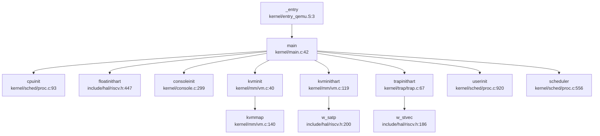
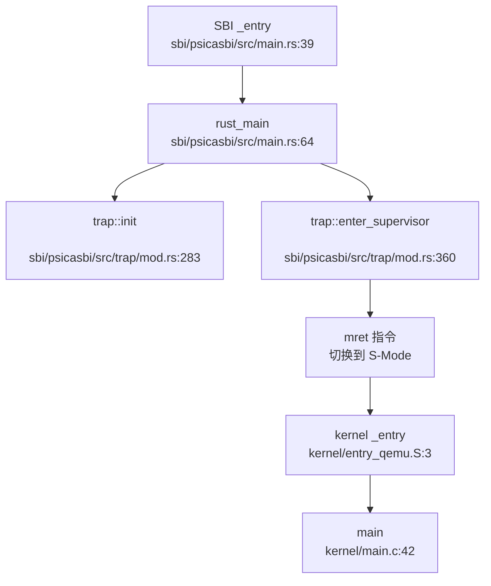

## 第 2 章：启动流程与架构初始化

### 启动入口与链接脚本分析

本项目的启动入口根据目标平台不同分为两种配置，通过 Makefile 中的 `platform` 变量控制：

**链接脚本配置**：
- **QEMU 平台**：使用 `linker/qemu.ld`，入口点为 `_entry`，基地址 `0x80200000`
- **K210 平台**：使用 `linker/k210.ld`，入口点为 `_start`，基地址 `0x80020000`
- **通用链接脚本**：`linker/linker64.ld`，入口点 `_entry`，基地址 `0x80020000`

**汇编入口文件**：
- `kernel/entry.S`：通用入口（实际未直接使用）
- `kernel/entry_qemu.S`：QEMU 平台入口
- `kernel/entry_k210.S`：K210 平台入口

以 `kernel/entry_qemu.S` 为例，入口代码执行以下操作：

```assembly
# kernel/entry_qemu.S
.section .text
.globl _entry
_entry:
    add t0, a0, 1          # t0 = hartid + 1
    slli t0, t0, 14        # t0 = (hartid + 1) * 16384 (栈空间偏移)
    la sp, boot_stack      # 加载 boot_stack 地址
    add sp, sp, t0         # 每个 hart 分配独立的栈空间
    call main              # 跳转到 C 语言 main 函数

loop:
    j loop                 # 死循环（非主 hart 或 main 返回后）

.section .bss.stack
.align 12
boot_stack:
    .space 4096 * 4 * 2    # 分配 32KB 启动栈
boot_stack_top:
```

**关键设计**：
1. **多核栈分配**：通过 `hartid` 计算每个 hart 的独立栈空间，避免多核栈冲突
2. **直接跳转**：汇编入口直接调用 C 函数 `main()`，无中间引导层
3. **BSS 段处理**：栈空间定义在 `.bss.stack` 段，由链接脚本保证清零

### 架构初始化流程（模式切换/FPU/MMU）

#### RISC-V 特权级模式切换

本项目采用 **SBI (Supervisor Binary Interface)** 架构实现特权级切换。完整的启动链为：

**SBI → U-Boot (可选) → OS Kernel (S-Mode)**

**SBI 层初始化** (`sbi/psicasbi/src/main.rs`)：

```rust
// sbi/psicasbi/src/main.rs:52-62
#[naked]
#[no_mangle]
#[link_section = ".text.init"]
unsafe extern "C" fn _entry() ->! {
    asm!(r"
        li sp, {stack_top}
        csrr a0, mhartid
        slli a0, a0, {offset}
        sub sp, sp, a0
        csrw mscratch, sp
        
        csrr a0, mhartid
        call rust_main
        ...
    ", 
        stack_top = const KERNEL_ENTRY, 
        offset = const STACK_OFFSET, 
        options(noreturn), 
    )
}
```

**M-Mode 初始化** (`rust_main` 函数)：
1. **BSS 清零**：`r0::zero_bss(&mut _sbss, &mut _ebss)`
2. **堆初始化**：`heap::init()`
3. **K210 特有初始化**（仅 `k210` feature）：
   - `hal::sysctl::init()` - 系统控制初始化
   - `hal::sysctl::set_freq()` - 频率设置
   - `hal::fpioa::init()` - FPIOA 引脚配置
4. **UART 初始化**：`hal::uart::init()` - 早期串口打印
5. **陷阱处理安装**：`trap::init()`
6. **PMP 配置**：配置物理内存保护（Napot 模式，允许全内存访问）
7. **跳转到 S-Mode**：`trap::enter_supervisor(hartid)`

**模式切换验证** (`sbi/psicasbi/src/trap/mod.rs:360-374`)：

```rust
pub fn enter_supervisor(hartid: usize) {
    unsafe {
        mstatus::clear_mie();                    // 禁用中断
        mtvec::write(trap_vec as usize, ...);    // 设置 M-Mode 陷阱向量
        
        // 设置先前模式为 Supervisor
        mstatus::set_mpp(MPP::Supervisor);       
        mepc::write(KERNEL_ENTRY);               // 设置返回地址为内核入口
        
        asm!(
            "csrw mscratch, sp", 
            "mret",                              // MRET 指令切换到 S-Mode
            in("a0") hartid, 
            options(noreturn)
        );
    }
}
```

**medeleg/mideleg 配置** (`sbi/psicasbi/src/trap/mod.rs:298-306`)：
```rust
// 委托陷阱到 S-Mode
asm!("
    li {0}, 0x222      // mideleg: 委托外部中断、定时器中断、软件中断
    csrw mideleg, {0}
    li {0}, 0xb1ab     // medeleg: 委托指令/加载/存储访问错误、断点、环境调用等
    csrw medeleg, {0}
", out(reg) _);
```

**结论**：✅ **已实现 M-Mode → S-Mode 切换**。通过 SBI 的 `enter_supervisor()` 函数，设置 `mstatus.mpp = Supervisor` 后执行 `mret` 指令完成特权级切换。

#### FPU (浮点单元) 初始化

**FPU 初始化代码** (`include/hal/riscv.h:447-453`)：

```c
// init floating-point unit
static inline void floatinithart()
{
    // If sstatus.fs is off, floating-point instructions
    // will be treated as illegal ones.
    w_sstatus_fs(SSTATUS_FS_INIT);   // 设置 FS 位为 Initial
    w_frm(FRM_RNE);                  // 设置舍入模式为 Round to Nearest
    w_sstatus_fs(SSTATUS_FS_CLEAN);  // 设置 FS 位为 Clean
}
```

**调用位置** (`kernel/main.c:49, 91`)：
- Hart 0: `main()` 函数中调用 `floatinithart()`
- Hart 1+: 非主 hart 在等待 `started` 标志后调用 `floatinithart()`

**SSTATUS_FS 位定义** (`include/hal/riscv.h:418-421`)：
```c
#define SSTATUS_FS_INIT     (1L << 13)   // 01: Initial
#define SSTATUS_FS_CLEAN    (2L << 13)   // 10: Clean
#define SSTATUS_FS_DIRTY    (3L << 13)   // 11: Dirty
#define SSTATUS_FS_BITS     (3L << 13)
```

**结论**：✅ **已实现 FPU 初始化**。通过设置 `sstatus.fs` 位启用浮点单元，并配置舍入模式为 RNE（Round to Nearest）。

#### MMU 初始化与页表配置

**MMU 初始化流程** (`kernel/mm/vm.c`)：

1. **创建内核页表** (`kvminit()`, 行 40-115)：
```c
void kvminit()
{
    kernel_pagetable = (pagetable_t) allocpage();
    memset(kernel_pagetable, 0, PGSIZE);

    // 映射 UART 寄存器
    kvmmap(UART_V, UART, PGSIZE, PTE_R | PTE_W);
    
    #ifdef QEMU
    kvmmap(VIRTIO0_V, VIRTIO0, PGSIZE, PTE_R | PTE_W);
    #endif
    
    // 映射 CLINT、PLIC 等外设
    kvmmap(CLINT_V, CLINT, 0x10000, PTE_R | PTE_W);
    kvmmap(PLIC_V, PLIC, 0x4000, PTE_R | PTE_W);
    
    #ifndef QEMU
    // K210 特有外设映射 (GPIOHS, DMAC, FPIOA, SPI 等)
    kvmmap(GPIOHS_V, GPIOHS, 0x1000, PTE_R | PTE_W);
    kvmmap(DMAC_V, DMAC, 0x1000, PTE_R | PTE_W);
    ...
    #endif
    
    // 映射内核代码段 (可读可执行)
    kvmmap(KERNBASE, KERNBASE, (uint64)etext - KERNBASE, PTE_R | PTE_X);
    
    // 映射内核数据段和物理 RAM (可读可写)
    kvmmap((uint64)etext, (uint64)etext, PHYSTOP - (uint64)etext, PTE_R | PTE_W);
    
    // 映射 trampoline 页面
    kvmmap(TRAMPOLINE, (uint64)trampoline, PGSIZE, PTE_R | PTE_X);
}
```

2. **启用分页** (`kvminithart()`, 行 119-134)：
```c
void kvminithart()
{
    // 使用 SV39 页表格式 (3 级页表)
    uint64 stap = SATP_SV39 | (((uint64)kernel_pagetable) >> 12);
    w_satp(stap);                    // 写入 satp 寄存器
    asm volatile("sfence.vma");      // 刷新 TLB
    protect_usr_mem();               // 设置 SSTATUS.SUM 位
}
```

**关键常量** (`include/memlayout.h`)：
```c
#define VIRT_OFFSET    0x3F00000000L    // 虚拟地址偏移 (39 位地址空间)

#ifdef QEMU
#define UART           0x10000000L      // QEMU UART 物理地址
#else
#define UART           0x38000000L      // K210 UART 物理地址
#endif

#define UART_V         (UART + VIRT_OFFSET)  // UART 虚拟地址

#define KERNBASE       0x80020000UL     // 内核基地址
#define PHYSTOP        0x80600000UL     // 物理内存结束
#define SATP_SV39      (8L << 60)       // SV39 页表模式
```

**MMU 启用前后串口地址切换分析**：

本项目采用 **直接地址映射 + 虚拟地址偏移** 策略：
- **MMU 启用前**：SBI 层使用物理地址访问 UART（`sbi/psicasbi/src/hal/uart/`）
- **MMU 启用后**：内核使用虚拟地址访问 UART（`UART_V = UART + VIRT_OFFSET`）

**关键设计**：
1. **恒等映射**：内核代码段和数据段采用恒等映射（虚拟地址 = 物理地址）
2. **外设虚拟地址**：所有外设通过 `VIRT_OFFSET` 偏移到高地址空间
3. **早期打印**：SBI 层在 MMU 启用前通过物理地址实现早期串口打印

**结论**：✅ **已实现 MMU 初始化**。使用 SV39 页表格式，创建内核页表并映射所有必要的外设和内存区域。

### 到达内核主函数的路径（完整调用链）

**完整启动调用链**：



**SBI 层到内核层的完整流程**：



**关键函数说明**：

| 函数 | 文件位置 | 功能 |
|------|----------|------|
| `_entry` | `kernel/entry_qemu.S:3` | 汇编入口，设置栈指针 |
| `main` | `kernel/main.c:42` | C 语言内核主函数 |
| `cpuinit` | `kernel/sched/proc.c:93` | 初始化 CPU 结构体数组 |
| `floatinithart` | `include/hal/riscv.h:447` | 启用 FPU |
| `consoleinit` | `kernel/console.c:299` | 初始化控制台锁 |
| `kvminit` | `kernel/mm/vm.c:40` | 创建内核页表 |
| `kvminithart` | `kernel/mm/vm.c:119` | 启用 MMU（写 satp） |
| `trapinithart` | `kernel/trap/trap.c:67` | 安装陷阱向量 |
| `userinit` | `kernel/sched/proc.c:920` | 创建第一个用户进程 |
| `scheduler` | `kernel/sched/proc.c:556` | 进入进程调度器 |

### 多平台启动流程（StarFive/LoongArch 等）

**平台支持情况**：

通过代码搜索和 Makefile 分析，本项目支持以下平台：

1. **K210 (Kendryte K210)**：✅ **已实现**
   - 入口文件：`kernel/entry_k210.S`
   - 链接脚本：`linker/k210.ld`
   - 基地址：`0x80020000`
   - 特有初始化：`hal::sysctl::init()`, `hal::fpioa::init()`

2. **QEMU (RISC-V virt 机器)**：✅ **已实现**
   - 入口文件：`kernel/entry_qemu.S`
   - 链接脚本：`linker/qemu.ld`
   - 基地址：`0x80200000`
   - 特有设备：VirtIO 磁盘

3. **StarFive VisionFive2 (JH7110)**：❌ **未实现**
   - 搜索关键词 `visionfive`、`jh7110`、`starfive` 均无匹配结果
   - 无相关平台配置文件或启动代码

4. **LoongArch**：❌ **未实现**
   - 搜索关键词 `loongarch`、`loongson` 均无匹配结果
   - 整个项目基于 RISC-V 架构，无 LoongArch 支持

**平台选择机制** (`Makefile:1-2`)：
```makefile
platform := k210
#platform := qemu
```

通过注释切换目标平台，编译时会根据 `platform` 变量：
- 定义 `QEMU` 宏（仅 QEMU 平台）
- 选择不同的链接脚本和入口文件
- 包含/排除特定平台驱动代码

### 平台配置与构建机制

**工具链配置** (`Makefile:17-19`)：
```makefile
TOOLPREFIX := riscv64-linux-gnu-
CC := $(TOOLPREFIX)gcc
AS := $(TOOLPREFIX)gas
LD := $(TOOLPREFIX)ld
```

**编译标志** (`Makefile:21-30`)：
```makefile
CFLAGS = -Wall -O -fno-omit-frame-pointer -ggdb -g
CFLAGS += -MD
CFLAGS += -mcmodel=medany          # 中等代码模型
CFLAGS += -ffreestanding -fno-common -nostdlib -mno-relax
CFLAGS += -Iinclude/
CFLAGS += -fno-stack-protector

ifeq ($(platform), qemu)
CFLAGS += -D QEMU
endif
```

**SBI 构建配置** (`sbi/psicasbi/.cargo/config.toml`)：
```toml
[build]
target = "riscv64imac-unknown-none-elf"

[target.riscv64imac-unknown-none-elf]
rustflags = [
    "-C", "link-arg=-Tsrc/linker.ld"
]
```

**SBI Feature 配置** (`Makefile:54-58`)：
```makefile
ifeq ($(platform), k210)
SBI := ./sbi/sbi-k210
else
SBI := ./sbi/sbi-qemu
endif

$(SBI): 
    cd ./sbi/psicasbi && cargo build --no-default-features --features=$(platform)
```

**QEMU 启动参数** (`Makefile:62-70`)：
```makefile
QEMUOPTS = -machine virt -kernel $T/kernel -m 128M -nographic
QEMUOPTS += -smp $(CPUS)              # 多核配置 (默认 2 核)
QEMUOPTS += -bios $(SBI)              # 加载 SBI 固件
QEMUOPTS += -drive file=sdcard.img,... # 虚拟磁盘
QEMUOPTS += -device virtio-blk-device,...
```

**SBI 配置常量** (`sbi/psicasbi/src/config.rs`)：
```rust
#[cfg(feature = "qemu")]
pub const CLK: u64 = 11_059_200;      // QEMU 时钟频率
#[cfg(feature = "k210")]
pub const CLK: u64 = 26_000_000;      // K210 时钟频率

pub const KERNEL_ENTRY: usize = 0x8002_0000;  // 内核入口地址
pub const NCPU: usize = 2;                     // CPU 核心数
pub const STACK_SIZE: usize = 4 * 1024;        // 每核栈大小
```

### 关键代码片段分析

#### 1. SBI 层 M-Mode 陷阱初始化

```rust
// sbi/psicasbi/src/trap/mod.rs:283-307
pub fn init() {
    // 安装陷阱向量
    unsafe {
        mtvec::write(sbi_trap_vec as usize, mtvec::TrapMode::Direct);
    }

    // 委托陷阱到 S-Mode
    unsafe {
        use core::arch::asm;
        asm!("
            li {0}, 0x222      // mideleg: 委托中断
            csrw mideleg, {0}
            li {0}, 0xb1ab     // medeleg: 委托异常
            csrw medeleg, {0}
        ", out(reg) _);
    }

    // 启用中断
    unsafe {
        crate::hal::clint::clear_ipi(mhartid::read());
        mie::set_mext();       // 启用外部中断
        mie::set_msoft();      // 启用软件中断
    }
}
```

#### 2. 内核陷阱向量安装

```c
// kernel/trap/trap.c:67-73
void trapinithart(void)
{
    w_stvec((uint64)kernelvec);           // 设置 stvec 为内核陷阱向量
    w_sstatus(r_sstatus() | SSTATUS_SIE); // 启用 S-Mode 中断
    // 启用 S-Mode 定时器中断
    w_sie(r_sie() | SIE_SEIE | SIE_SSIE | SIE_STIE);
    set_next_timeout();                   // 设置下一个定时器中断
}
```

#### 3. 多核启动同步

```c
// kernel/main.c:72-82
// Hart 0 发送 IPI 唤醒其他 hart
for (int i = 1; i < NCPU; i++) {
    unsigned long mask = 1 << i;
    struct sbiret res = sbi_send_ipi(mask, 0);
    sbi_send_ipi(mask, 0);
    __debug_assert("main", SBI_SUCCESS == res.error, 
                   "sbi_send_ipi failed");
}
__sync_synchronize();
started = 1;  // 通知其他 hart 可以开始初始化
```

```c
// kernel/main.c:85-92
// 其他 hart 等待 started 标志
else {
    while (started == 0)
        ;
    __sync_synchronize();
    floatinithart();
    kvminithart();
    trapinithart();
    plicinithart();
}
```

#### 4. 早期串口打印（SBI 层）

```rust
// sbi/psicasbi/src/main.rs:85
hal::uart::init();  // 在 MMU 启用前初始化 UART

// sbi/psicasbi/src/main.rs:97-101
println!("\x1B[33m{}\x1B[0m", LOGO);   // 打印 SBI Logo
println!("\x1B[34m{}\x1B[0m", LOGO2);
println!("\x1B[36m{}\x1B[0m", LOGO3);
println!("[\x1b[32;1mPsicaSBI\x1b[0m]: Version {}.{}", 
         *SBI_IMPL_VER_MAJOR, *SBI_IMPL_VER_MINOR);
```

**总结**：

本项目的启动流程设计遵循 RISC-V 标准 SBI 规范，实现了完整的 M-Mode → S-Mode 特权级切换。关键特性包括：

1. ✅ **双平台支持**：K210 和 QEMU 平台，通过编译配置切换
2. ✅ **FPU 初始化**：通过 `floatinithart()` 启用浮点单元
3. ✅ **MMU 初始化**：使用 SV39 页表格式，创建内核页表并启用分页
4. ✅ **多核启动**：通过 IPI 同步多核启动，Hart 0 负责初始化共享资源
5. ✅ **早期打印**：SBI 层在 MMU 启用前提供串口打印功能
6. ❌ **StarFive/LoongArch 支持**：未发现相关代码实现
