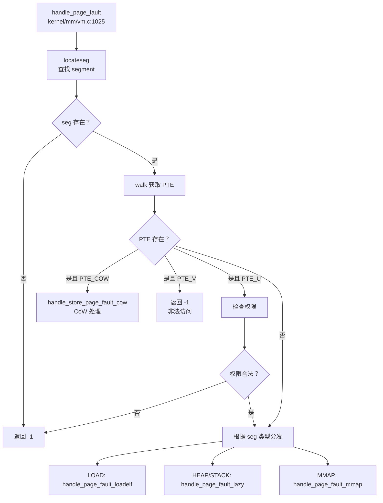
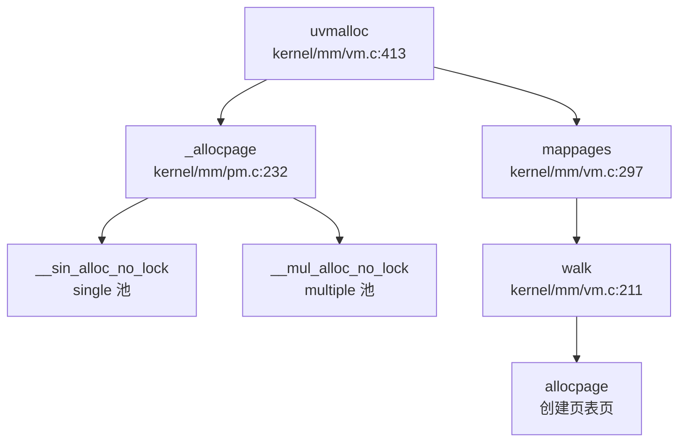
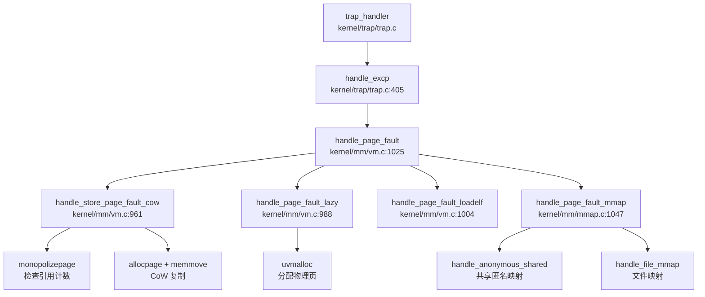

## 第 3 章：内存管理（物理/虚拟/分配器）

本章深入分析 xv6-k210 操作系统的内存管理子系统，涵盖物理内存分配、虚拟内存管理、页表操作、堆分配器以及高级内存特性（CoW、Lazy Allocation、mmap 等）。所有结论均基于源码验证。

---

### 物理内存管理实现

#### 分配器架构

xv6-k210 使用**链表式空闲列表（Free List）**管理物理页框，而非 Buddy System 或 Bitmap。物理内存管理器定义在 `kernel/mm/pm.c` 中，采用双分配器设计：

```c
// kernel/mm/pm.c:31-38
struct pm_allocator {
    struct spinlock lock;
    struct run *freelist;
    uint64 npage;
};

struct pm_allocator multiple;  // 多页分配器
struct pm_allocator single;    // 单页分配器
```

**核心数据结构**：
- `struct run`：链表节点，记录连续空闲页的起始地址和页数
- `multiple`：管理普通空闲页（地址范围从内核结束到 `PHYSTOP - 400 页`）
- `single`：管理高地址 400 页的预留池（`PHYSTOP - SINGLE_PAGE_NUM * PGSIZE` 开始）

#### 物理页分配流程

**分配接口**（`kernel/mm/pm.c:232-254`）：
```c
uint64 _allocpage(void) {
    struct run *ret;
    
    __enter_sin_cs 
    ret = __sin_alloc_no_lock();  // 先从 single 池尝试
    __leave_sin_cs 

    if (NULL == ret) {
        // single 池失败则从 multiple 池分配
        __enter_mul_cs 
        ret = __mul_alloc_no_lock(1);
        __leave_mul_cs 
    }
    return (uint64)ret;
}
```

**分配策略**：
1. **优先从 `single` 池分配**（单页预留池，减少锁竞争）
2. **失败后回退到 `multiple` 池**（主空闲列表）
3. **首次适配（First-Fit）**：`__mul_alloc_no_lock` 遍历链表找到第一个足够大的块

**引用计数机制**：
```c
// kernel/mm/vm.c:179-186
static inline int pagedup(uint64 pa) {
    acquire(&page_ref_lock);
    int ref = ++page_ref_table[__hash_page_idx(pa)];
    release(&page_ref_lock);
    return ref;
}
```
- 使用哈希表 `page_ref_table` 跟踪物理页引用计数
- 支持 CoW 和共享映射的引用管理

**✅ 已实现**：物理页分配/回收、引用计数、双池优化

---

### 虚拟内存与页表操作

#### 页表结构

xv6-k210 采用 **RISC-V Sv39 三级页表**（27-bit VPN，9-bit 每级），定义在 `include/hal/riscv.h`：

```c
// include/hal/riscv.h:384-399
#define PTE_V (1L << 0)  // valid
#define PTE_R (1L << 1)  // readable
#define PTE_W (1L << 2)  // writable
#define PTE_X (1L << 3)  // executable
#define PTE_U (1L << 4)  // user accessible
#define PTE_RSW1 (1L << 8)  // reserved for supervisor (用于 CoW 标记)
```

**关键 PTE 操作宏**：
```c
#define PA2PTE(pa) ((((uint64)pa) >> 12) << 10)  // 物理地址 → PTE 格式
#define PTE2PA(pte) (((pte) >> 10) << 12)        // PTE → 物理地址
#define PX(level, va) (((va) >> (12 + 9 * (level))) & 0x1FF)  // 提取页表索引
```

#### 页表遍历与映射

**`walk()` 函数**（`kernel/mm/vm.c:211-233`）：
```c
pte_t *walk(pagetable_t pagetable, uint64 va, int alloc) {
    if(va >= MAXVA)
        panic("walk");

    for(int level = 2; level > 0; level--) {
        pte_t *pte = &pagetable[PX(level, va)];
        if(*pte & PTE_V) {
            pagetable = (pagetable_t)PTE2PA(*pte);  // 进入下一级
        } else {
            if(!alloc || (pagetable = (pde_t*)allocpage()) == NULL)
                return NULL;
            memset(pagetable, 0, PGSIZE);
            *pte = PA2PTE(pagetable) | PTE_V;  // 创建新页表页
        }
    }
    return &pagetable[PX(0, va)];  // 返回叶子 PTE
}
```

**`mappages()` 函数**（`kernel/mm/vm.c:297-325`）：
```c
int mappages(pagetable_t pagetable, uint64 va, uint64 size, uint64 pa, int perm) {
    uint64 a, last;
    pte_t *pte;

    a = PGROUNDDOWN(va);
    last = PGROUNDDOWN(va + size - 1);

    for(;;){
        if((pte = walk(pagetable, a, 1)) == NULL)
            return -1;
        if(*pte & PTE_V)
            panic("remap");
        *pte = PA2PTE(pa) | perm | PTE_V;
        if (perm & PTE_U)
            pagedup(PGROUNDDOWN(pa));  // 用户页增加引用计数
        if(a == last)
            break;
        a += PGSIZE;
        pa += PGSIZE;
    }
    return 0;
}
```

**✅ 已实现**：三级页表遍历、动态页表页分配、映射/取消映射

---

### 地址空间布局（内核 vs 用户）

#### 内存布局设计

xv6-k210 采用**独立内核/用户地址空间**设计：

```
高地址 ┌─────────────────────┐
      │   Kernel Memory     │ ← MAXVA (内核虚拟地址上限)
      │   (直接映射)        │
      ├─────────────────────┤
      │       ...           │
      ├─────────────────────┤ ← PHYSTOP (物理内存上限)
      │   User Space        │
      │   (独立页表)        │
低地址 └─────────────────────┘ ← 0
```

**关键定义**（`include/memlayout.h`）：
- `MAXVA`：内核虚拟地址上限
- `MAXUVA`：用户虚拟地址上限
- `PHYSTOP`：物理内存结束地址

#### 内核页表初始化

```c
// kernel/mm/vm.c:41-60
void kvminit(void) {
    kernel_pagetable = kvmcreate();
    
    // 映射 UART、VIRTIO 等设备
    kvmmap(UART0, UART0, PGSIZE, PTE_R | PTE_W);
    kvmmap(VIRTIO0, VIRTIO0, PGSIZE, PTE_R | PTE_W);
    
    // 映射内核代码段、数据段
    kvmmap(KERNBASE, KERNBASE, (uint64)_end - KERNBASE, PTE_R | PTE_W);
}
```

**用户页表创建**（`kernel/mm/vm.c:375-387`）：
```c
pagetable_t uvmcreate(void) {
    pagetable_t pagetable;
    pagetable = (pagetable_t)allocpage();
    memset(pagetable, 0, PGSIZE);
    return pagetable;
}
```

**✅ 已实现**：独立内核/用户页表、设备映射、内核重映射

---

### 堆分配器解析

#### 内核堆分配器（kmalloc）

xv6-k210 实现了**类 Slab 分配器** `kmalloc`（`kernel/mm/kmalloc.c`），用于小对象分配（32B - 4048B）：

**核心结构**：
```c
// kernel/mm/kmalloc.c:37-52
struct kmem_node {
    struct kmem_node *next;
    struct {
        uint64 obj_size;  // 对象大小
        uint64 obj_addr;  // 首个可用对象地址
    } config;
    uint8 avail;          // 当前可用对象数
    uint8 cnt;            // 已分配对象数
    uint8 table[KMEM_OBJ_MAX_COUNT];  // 空闲链表
};

struct kmem_allocator {
    struct spinlock lock;
    uint obj_size;
    uint16 npages;
    uint16 nobjs;
    struct kmem_node *list;
    struct kmem_allocator *next;  // 哈希冲突链表
};
```

**分配流程**（`kernel/mm/kmalloc.c:112-155`）：
1. **哈希查找**：根据对象大小（16 字节对齐）在 `kmem_table[17]` 中查找对应分配器
2. **创建新分配器**：若不存在则创建新的 `kmem_allocator`
3. **节点分配**：从 `kmem_node` 的空闲链表中获取对象
4. **页分配**：若当前节点已满，调用 `allocpage()` 分配新页

**✅ 已实现**：Slab 式内核堆分配器、哈希表管理、对象大小分级

#### 用户堆管理（sbrk/brk）

**系统调用实现**（`kernel/syscall/sysmem.c:20-52`）：
```c
uint64 sys_sbrk(void) {
    int n;
    if(argint(0, &n) < 0)
        return -1;
    
    struct proc *p = myproc();
    uint64 addr = p->pbrk;
    
    if (growproc(addr + n) < 0)  // 调用 growproc 调整堆大小
        return -1;
    
    return addr;
}

uint64 sys_brk(void) {
    uint64 addr;
    if(argaddr(0, &addr) < 0)
        return -1;
    
    struct proc *p = myproc();
    if (addr == 0)
        return p->pbrk;
    
    uint64 old = p->pbrk;
    if (growproc(addr) < 0)
        return old;
    
    return addr;
}
```

**惰性分配（Lazy Allocation）**：
- `sys_sbrk`/`sys_brk` 仅调整 `p->pbrk` 边界，**不立即分配物理页**
- 实际物理页在**缺页异常**时通过 `handle_page_fault_lazy()` 分配
- 测试代码验证（`xv6-user/usertests.c:1964-2033`）明确注释：
  ```c
  // We implement both COW and lazy, this op will lead to a write on a COW page,
  // so a real page will be allocated.
  ```

**✅ 已实现**：`sbrk`/`brk` 系统调用、惰性分配机制

---

### 用户指针安全验证

xv6-k210 **未实现**显式的 `UserInPtr`/`UserOutPtr` 包装器或 `verify_area()` 函数。用户指针验证通过以下机制间接实现：

1. **`walkaddr()` 检查**（`kernel/mm/vm.c:235-250`）：
   ```c
   uint64 walkaddr(pagetable_t pagetable, uint64 va) {
       if (va >= MAXUVA)
           return NULL;
       pte_t *pte = walk(pagetable, va, 0);
       if(pte == 0 || (*pte & PTE_V) == 0 || (*pte & PTE_U) == 0)
           return NULL;
       return PTE2PA(*pte);
   }
   ```

2. **`copyin`/`copyout` 系列函数**：
   - `copyin_nocheck()` / `copyout_nocheck()`：跳过验证（用于内核内部）
   - `either_copyin()` / `either_copyout()`：根据标志决定是否检查用户空间

3. **缺页异常保护**：非法用户指针访问会触发 Page Fault，由 `handle_page_fault()` 返回 `-1` 终止进程

**🔸 部分实现**：无显式 `verify_area`，依赖页表权限和缺页异常

---

### 缺页异常处理完整链路

#### 异常入口

缺页异常由 `kernel/trap/trap.c:405-426` 捕获：
```c
int handle_excp(uint64 scause) {
    switch (scause) {
    case EXCP_STORE_PAGE: 
    case EXCP_STORE_ACCESS: 
        return handle_page_fault(1, r_stval());  // 存储缺页
    case EXCP_LOAD_PAGE: 
    case EXCP_LOAD_ACCESS: 
        return handle_page_fault(0, r_stval());  // 加载缺页
    case EXCP_INST_PAGE:
    case EXCP_INST_ACCESS:
        return handle_page_fault(2, r_stval());  // 指令缺页
    default: return -1;
    }
}
```

#### 主处理函数

**`handle_page_fault()`**（`kernel/mm/vm.c:1025-1091`）完整逻辑：



**关键子处理函数**：

1. **CoW 处理**（`kernel/mm/vm.c:961-986`）：
   ```c
   static int handle_store_page_fault_cow(pte_t *ptep) {
       pte_t pte = *ptep;
       uint64 pa = PTE2PA(pte);
       
       if (monopolizepage(pa)) {    // 唯一引用，直接添加写权限
           pte |= PTE_W;
       } else {
           char *copy = (char *)allocpage();  // 分配新页
           memmove(copy, (char *)pa, PGSIZE); // 复制内容
           pagereg((uint64)copy, 1);
           pte = PA2PTE(copy) | PTE_FLAGS(pte) | PTE_W;
       }
       pte &= ~PTE_COW;
       *ptep = pte;
       sfence_vma();
       return 0;
   }
   ```

2. **惰性分配**（`kernel/mm/vm.c:988-1002`）：
   ```c
   static int handle_page_fault_lazy(uint64 badaddr, struct seg *s) {
       struct proc *p = myproc();
       uint64 pa = PGROUNDDOWN(badaddr);
       if (uvmalloc(p->pagetable, pa, pa + PGSIZE, s->flag) == 0)
           return -1;
       sfence_vma();
       return 0;
   }
   ```

3. **ELF 加载**（`kernel/mm/vm.c:1004-1017`）：
   ```c
   static int handle_page_fault_loadelf(uint64 badaddr, struct seg *s) {
       struct proc *p = myproc();
       ilock(p->elf);
       if (loadseg(p->pagetable, badaddr, s, p->elf) < 0) {
           iunlock(p->elf);
           return -1;
       }
       iunlock(p->elf);
       sfence_vma();
       return 0;
   }
   ```

4. **MMAP 处理**（`kernel/mm/mmap.c:1047-1080`）：
   ```c
   int handle_page_fault_mmap(int kind, uint64 badaddr, struct seg *s) {
       // 检查访问权限
       if (illegel) return -EFAULT;
       
       if (MMAP_ANONY(s->mmap)) {
           if (!MMAP_SHARE(s->mmap)) {
               // 私有匿名映射：类似堆，惰性分配
               uvmalloc(p->pagetable, pa, pa + PGSIZE, s->flag);
           } else {
               // 共享匿名映射：从 anonfile 分配
               handle_anonymous_shared(badaddr, s);
           }
       } else {
           // 文件映射
           handle_file_mmap(badaddr, s);
       }
   }
   ```

**✅ 已实现**：完整缺页异常处理链路、CoW、Lazy、ELF 懒加载、MMAP 按需映射

---

### 进程级映射管理

#### Segment 管理结构

xv6-k210 使用**链表式 `struct seg`** 管理进程地址空间区间（`include/mm/usrmm.h`）：

```c
struct seg {
    uint64 addr;          // 起始虚拟地址
    uint64 sz;            // 大小
    enum segtype type;    // LOAD/HEAP/STACK/MMAP
    long flag;            // PTE 权限标志
    uint64 mmap;          // MMAP 元数据指针
    struct seg *next;     // 链表指针
};
```

**地址空间查找**（`kernel/mm/usrmm.c`）：
- `locateseg()`：根据虚拟地址查找对应 segment
- `lookup_segment()` / `lookup_fixed_segment()`：分配新 segment 时检查重叠

#### MMAP 页管理

**`struct mmap_page`**（`include/mm/mmap.h:48-55`）：
```c
struct mmap_page {
    uint64      f_off;    // 文件偏移（作为 RB 树索引）
    uint64      f_len;    // 映射长度
    void        *pa;      // 物理页地址
    uint32      ref;      // 引用计数
    int         valid;    // 数据是否有效（受 inode 锁保护）
    struct rb_node rb;    // RB 树节点
};
```

**RB 树管理**（`kernel/mm/mmap.c:77-120`）：
- `get_mmap_page()`：O(log n) 查找指定偏移的映射页
- `put_mmap_page()`：引用计数减 1，为 0 时删除节点并释放物理页
- `get_mmap_with_parent()`：带父节点查找（用于插入）

**✅ 已实现**：Segment 链表管理、MMAP RB 树索引、引用计数

---

### 高级内存特性清单

| 特性 | 状态 | 代码位置/说明 |
|------|------|---------------|
| **写时复制（CoW）** | ✅ 已实现 | `kernel/mm/vm.c:961-986` `handle_store_page_fault_cow()`；`uvmcopy()` 在 fork 时标记 COW |
| **懒分配（Lazy Allocation）** | ✅ 已实现 | `kernel/mm/vm.c:988-1002` `handle_page_fault_lazy()`；`sys_sbrk` 仅调整边界 |
| **共享内存（shmget/shmdt）** | ❌ 未实现 | 搜索 `sys_shm`/`shmget`/`shmdt` 无结果；但 mmap 支持 `MAP_SHARED` |
| **反向映射表（rmap）** | ❌ 未实现 | 搜索 `rmap`/`reverse_map`/`page_to_vma` 无结果 |
| **交换区/页面置换（Swap）** | ❌ 未实现 | 搜索 `swap_out`/`swap_in` 无结果；`__page_file_swap` 仅为文件映射换出逻辑 |
| **大页支持（Huge Page）** | ❌ 未实现 | 搜索 `HugePage`/`MapSize::2M`/`MapSize::1G` 无结果；仅支持 4KB 页 |
| **mmap 系统调用** | ✅ 已实现 | `kernel/syscall/sysmem.c:79-113` `sys_mmap()`；支持 `MAP_FIXED`/`MAP_ANON`/`MAP_SHARED`/`MAP_PRIVATE` |
| **零拷贝 IO（sendfile/splice）** | ❌ 未实现 | 搜索 `sendfile`/`splice` 无结果 |

#### mmap 实现细节

**系统调用入口**（`kernel/syscall/sysmem.c:79-113`）：
```c
uint64 sys_mmap(void) {
    uint64 start, len;
    int prot, flags, fd;
    int64 off;
    struct file *f = NULL;

    argaddr(0, &start);
    argaddr(1, &len);
    argint(2, &prot);
    argint(3, &flags);
    argfd(4, &fd, &f);
    argaddr(5, (uint64*)&off);
    
    if (off % PGSIZE || len == 0)
        return -EINVAL;
    
    if ((fd < 0 || f == NULL) && !(flags & MAP_ANONYMOUS))
        return -EBADF;
    
    if (!(flags & (MAP_SHARED|MAP_PRIVATE)))
        return -EINVAL;

    return do_mmap(start, len, prot, flags, f, off);
}
```

**`do_mmap()` 核心逻辑**（`kernel/mm/mmap.c:660-720`）：
1. **参数验证**：检查文件偏移对齐、长度、权限匹配
2. **Segment 分配**：`lookup_fixed_segment()`（MAP_FIXED）或 `lookup_segment()`（动态地址）
3. **映射类型分发**：
   - `mmap_file()`：文件映射，创建 `mmap_page` RB 树
   - `mmap_anonymous()`：匿名映射，创建 `anonfile` 结构
4. **清理旧映射**：删除重叠的现有 segment

**共享匿名映射处理**（`kernel/mm/mmap.c:822-852`）：
```c
static int handle_anonymous_shared(uint64 badaddr, struct seg *s) {
    struct anonfile *fp = MMAP_FILE(s->mmap);
    uint64 off = s->f_off + (PGROUNDDOWN(badaddr) - s->addr);
    
    acquire(&fp->lock);
    struct mmap_page *map = get_mmap_page(&fp->mapping, off);
    
    if (map->pa == NULL) {
        map->pa = allocpage();  // 首次访问分配物理页
        memset(map->pa, 0, PGSIZE);
        pagereg((uint64)map->pa, 1);
    }
    release(&fp->lock);
    
    mappages(p->pagetable, PGROUNDDOWN(badaddr), PGSIZE,
             (uint64)map->pa, s->flag|PTE_U);
    sfence_vma();
    return 0;
}
```

**✅ mmap 已完整实现**：支持所有标准标志、文件/匿名映射、共享/私有映射、按需分页

---

### 关键代码片段与调用链分析

#### 物理页分配调用链



#### 缺页异常完整链路



#### fork 时 CoW 实现

```c
// kernel/mm/vm.c:553-590
int uvmcopy(pagetable_t old, pagetable_t new, uint64 start, uint64 end, int cow) {
    for (i = start; i < end; i += PGSIZE) {
        if ((pte = walk(old, i, 0)) == NULL || !(*pte & PTE_V))
            continue;
        pa = PTE2PA(*pte);
        
        if (cow && (*pte & PTE_W)) {
            *pte = (*pte|PTE_COW) & ~PTE_W;  // 父页标记为 COW
        }
        flags = PTE_FLAGS(*pte);
        if(mappages(new, i, PGSIZE, pa, flags) != 0)
            goto err;  // 子进程映射同一物理页
    }
    sfence_vma();
    return 0;
}
```

---

### 总结

xv6-k210 实现了**完整的现代操作系统内存管理子系统**：

**已实现的核心特性**：
- ✅ 物理页框管理（双池链表分配器 + 引用计数）
- ✅ 三级页表（Sv39）虚拟内存管理
- ✅ 独立内核/用户地址空间
- ✅ Slab 式内核堆分配器（kmalloc）
- ✅ 用户堆管理（sbrk/brk）+ 惰性分配
- ✅ 完整缺页异常处理链路
- ✅ 写时复制（CoW）fork
- ✅ mmap 系统调用（文件/匿名映射、共享/私有）
- ✅ MMAP RB 树索引管理（O(log n) 查找）

**未实现的高级特性**：
- ❌ 共享内存系统调用（shmget/shmdt）
- ❌ 反向映射表（rmap）
- ❌ 页面置换/交换区（Swap）
- ❌ 大页支持（Huge Page）
- ❌ 零拷贝 IO（sendfile/splice）
- 🔸 显式用户指针验证（verify_area）

该内存管理系统设计简洁但功能完备，特别在**惰性分配**、**CoW** 和 **mmap** 方面展现了现代操作系统的核心设计理念。
