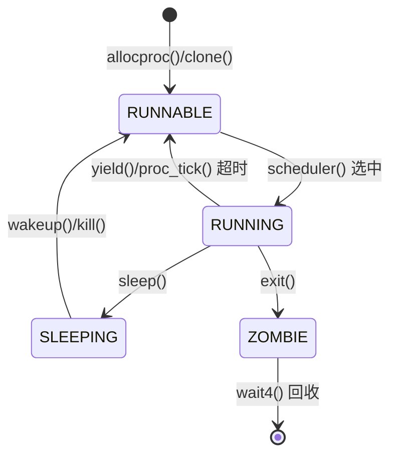
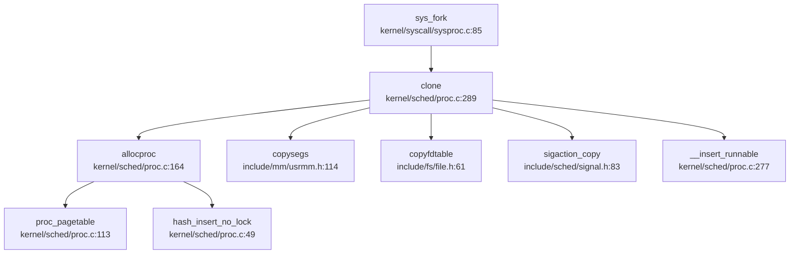
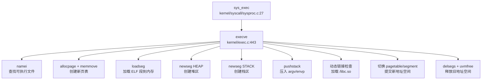
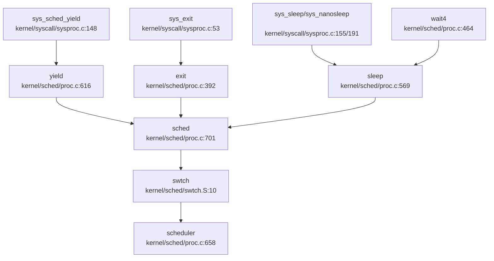

## 第 4 章：进程/线程与调度机制

### 任务模型与核心数据结构

本 OS 采用统一的 `struct proc` 结构体作为进程/线程的控制块（PCB/TCB 合一），未区分 Process 与 Thread 概念。核心定义位于 `include/sched/proc.h:38-105`。

#### `struct proc` 关键字段

```c
// include/sched/proc.h:51-105
struct proc {
    // 基本标识
    int xstate;                     // 退出状态
    int pid;                        // 进程 ID
    struct proc *hash_next;         // 哈希链表下一节点
    struct proc **hash_pprev;       // 哈希链表前一节点指针

    // 调度链表
    struct proc *sched_next;        // 调度队列下一节点
    struct proc **sched_pprev;      // 调度队列前一节点指针
    int timer;                      // 时间片计数器
    enum procstate state;           // 进程状态
    void *chan;                     // 睡眠原因（等待通道）
    uint64 sleep_expire;            // 睡眠唤醒时间

    // 性能统计
    struct tms proc_tms;            // 用户/系统时间
    uint64 ikstmp;                  // 进入内核时刻
    uint64 okstmp;                  // 离开内核时刻
    int64 vswtch;                   // 自愿上下文切换次数
    int64 ivswtch;                  // 非自愿上下文切换次数

    // 亲缘关系
    struct spinlock lk;             // 保护亲缘关系的锁
    struct proc *child;             // 第一个子进程
    struct proc *parent;            // 父进程
    struct proc *sibling_next;      // 兄弟链表下一节点
    struct proc **sibling_pprev;    // 兄弟链表前一节点指针

    // 内存管理
    uint64 kstack;                  // 内核栈虚拟地址
    uint64 badaddr;                 // 页错误后的错误地址
    pagetable_t pagetable;          // 用户页表
    struct trapframe *trapframe;    // trampoline 数据页
    struct seg *segment;            // 第一段链表节点
    uint64 pbrk;                    // 程序断点（堆顶）

    // 文件系统
    struct fdtable fds;             // 打开文件表
    struct inode *cwd;              // 当前目录
    struct inode *elf;              // 可执行文件

    // 调度上下文
    struct context context;         // 内核运行的"trapframe"

    // 信号机制
    ksigaction_t *sig_act;          // 信号处理动作链表
    __sigset_t sig_set;             // 阻塞信号集
    __sigset_t sig_pending;         // 待处理信号
    struct sig_frame *sig_frame;    // 信号帧链表
    int killed;                     // 当前待处理信号编号

    // 调试信息
    char name[16];                  // 进程名
    int tmask;                      // 跟踪掩码
};
```

#### `struct context` 上下文结构

```c
// include/sched/proc.h:19-35
struct context {
    uint64 ra;      // 返回地址
    uint64 sp;      // 栈指针
    // callee-saved 寄存器
    uint64 s0-s11;  // 12 个被调用者保存寄存器
};
```

**设计特点**：
- 仅保存 callee-saved 寄存器（s0-s11），caller-saved 寄存器由编译器负责保存
- 上下文大小固定为 13×8 = 104 字节
- 与 RISC-V 调用约定一致

#### 进程状态枚举

```c
// include/sched/proc.h:38-41
enum procstate {
    RUNNABLE,   // 可运行
    RUNNING,    // 运行中
    SLEEPING,   // 睡眠中
    ZOMBIE,     // 僵尸态
};
```

**❌ 未实现**：无 BLOCKED、STOPPED、CONTINUED 等状态，状态机较为简化。

---

### 调度算法与策略（代码证据）

本 OS 实现了**基于优先级的多级队列调度算法**，核心实现在 `kernel/sched/proc.c`。

#### 优先级定义

```c
// kernel/sched/proc.c:239-243
#define PRIORITY_TIMEOUT    0   // 超时队列（最低优先级）
#define PRIORITY_IRQ        1   // 中断唤醒队列（高优先级）
#define PRIORITY_NORMAL     2   // 正常队列（默认优先级）
#define PRIORITY_NUMBER     3   // 优先级数量
struct proc *proc_runnable[PRIORITY_NUMBER];  // 优先级队列数组
```

#### 调度器主循环

```c
// kernel/sched/proc.c:658-698
void scheduler(void) {
    struct proc *tmp;
    struct cpu *c = mycpu();

    while (1) {
        int found = 0;
        intr_on();
        __enter_proc_cs 
        tmp = __get_runnable_no_lock();  // 按优先级查找可运行进程
        if (NULL != tmp) {
            tmp->state = RUNNING;
            c->proc = tmp;

            // 切换到用户页表
            w_satp(MAKE_SATP(tmp->pagetable));
            sfence_vma();
            // 上下文切换
            swtch(&c->context, &tmp->context);
            // 切换回内核页表
            w_satp(MAKE_SATP(kernel_pagetable));
            sfence_vma();

            if (ZOMBIE == tmp->state) {
                release(&(tmp->parent->lk));
            }
            found = 1;
        }
        c->proc = NULL;
        __leave_proc_cs
        if (!found) {
            intr_on();
            asm volatile("wfi");  // 无进程可运行时进入低功耗等待
        }
    } 
}
```

#### 优先级选择逻辑

```c
// kernel/sched/proc.c:596-612
static struct proc *__get_runnable_no_lock(void) {
    struct proc const *tmp;

    for (int i = 0; i < PRIORITY_NUMBER; i ++) {  // 按优先级顺序遍历
        tmp = proc_runnable[i];
        while (NULL != tmp) {
            if (RUNNABLE == tmp->state) {
                return (struct proc*)tmp;  // 返回第一个 RUNNABLE 进程
            }
            tmp = tmp->sched_next;
        }
    }
    return NULL;
}
```

**调度策略分析**：
- **✅ 已实现**：严格优先级调度（Priority 0 < 1 < 2）
- **❌ 未实现**：同一优先级内为**FIFO 顺序**（按插入顺序遍历链表），**非时间片轮转（RR）**
- **❌ 未实现**：无动态优先级调整、无 CFS/Stride 等公平调度算法
- **🔸 桩函数**：`proc_tick()` 中实现了定时器递减逻辑，但仅用于超时队列管理，**未实现基于时间片的抢占式调度**

#### 时间片管理

```c
// kernel/sched/proc.c:740-774
void proc_tick(void) {
    __enter_proc_cs 

    // runnable 队列处理
    struct proc *p;
    for (int i = PRIORITY_IRQ; i < PRIORITY_NUMBER; i ++) {
        p = proc_runnable[i];
        while (NULL != p) {
            struct proc *next = p->sched_next;
            if (RUNNING != p->state) {
                p->timer = p->timer - 1;
                if (0 == p->timer) {
                    __remove(p);
                    __insert_runnable(PRIORITY_TIMEOUT, p);  // 超时降级
                }
            }
            p = next;
        }
    }
    // ... 睡眠队列处理
    __leave_proc_cs
}
```

**关键发现**：
- 仅对**非 RUNNING 状态**进程递减 timer（逻辑可疑）
- 超时后降级到 `PRIORITY_TIMEOUT` 队列
- **未实现**：运行中进程的时间片耗尽抢占

---

### 任务状态机

#### 状态流转图



#### 状态转换触发点

| 源状态 | 目标状态 | 触发函数 | 文件路径 |
|--------|----------|----------|----------|
| 无 | RUNNABLE | `allocproc()` + `__insert_runnable()` | `kernel/sched/proc.c:164-364` |
| RUNNABLE | RUNNING | `scheduler()` | `kernel/sched/proc.c:676` |
| RUNNING | RUNNABLE | `yield()` | `kernel/sched/proc.c:630` |
| RUNNING | SLEEPING | `sleep()` | `kernel/sched/proc.c:584` |
| SLEEPING | RUNNABLE | `wakeup()` / `kill()` | `kernel/sched/proc.c:545-561` |
| RUNNING | ZOMBIE | `exit()` | `kernel/sched/proc.c:449` |
| ZOMBIE | 销毁 | `wait4()` + `freeproc()` | `kernel/sched/proc.c:470-518` |

**关键机制**：
- **睡眠/唤醒**：基于 `chan` 指针匹配，支持多进程等待同一事件
- **僵尸态**：进程退出后保留 PCB，等待父进程 `wait4()` 回收资源
- **亲缘关系**：子进程退出时，所有子进程被重绑定到 `__initproc`

---

### 上下文切换实现（汇编分析）

#### `swtch` 汇编实现

```asm
# kernel/sched/swtch.S:3-41
# void swtch(struct context *old, struct context *new);
.globl swtch
swtch:
    # 保存当前上下文到 old
    sd ra, 0(a0)
    sd sp, 8(a0)
    sd s0, 16(a0)
    sd s1, 24(a0)
    sd s2, 32(a0)
    sd s3, 40(a0)
    sd s4, 48(a0)
    sd s5, 56(a0)
    sd s6, 64(a0)
    sd s7, 72(a0)
    sd s8, 80(a0)
    sd s9, 88(a0)
    sd s10, 96(a0)
    sd s11, 104(a0)

    # 从 new 恢复新上下文
    ld ra, 0(a1)
    ld sp, 8(a1)
    ld s0, 16(a1)
    ld s1, 24(a1)
    ld s2, 32(a1)
    ld s3, 40(a1)
    ld s4, 48(a1)
    ld s5, 56(a1)
    ld s6, 64(a1)
    ld s7, 72(a1)
    ld s8, 80(a1)
    ld s9, 88(a1)
    ld s10, 96(a1)
    ld s11, 104(a1)
    
    ret
```

**技术细节**：
- **保存寄存器**：ra + sp + s0-s11（共 13 个寄存器，104 字节）
- **调用约定**：参数通过 a0（old）、a1（new）传递
- **不保存**：caller-saved 寄存器（t0-t6, a0-a7）由编译器管理
- **不保存**：浮点寄存器（由 `floatstore()`/`floatload()` 单独处理）

#### 浮点寄存器保存

```c
// kernel/sched/proc.c:714-720
void sched(void) {
    // ...
    if (r_sstatus_fs() == SSTATUS_FS_DIRTY) {
        floatstore(p->trapframe);  // 保存到 trapframe
        w_sstatus_fs(SSTATUS_FS_CLEAN);
    }
    // ...
    swtch(&p->context, &mycpu()->context);
    // ...
    floatload(p->trapframe);  // 从 trapframe 恢复
    w_sstatus_fs(SSTATUS_FS_CLEAN);
}
```

**优化策略**：惰性保存（Lazy FPU Save），仅在 `sstatus.FS` 为 DIRTY 时保存浮点状态。

---

### 进程间通信与同步（Signal/Futex）

#### 信号机制（Signal）

**✅ 已实现**：基础信号机制，位于 `kernel/sched/signal.c` 和 `include/sched/signal.h`。

```c
// include/sched/signal.h:10-20
#define SIGRTMIN    34
#define SIGRTMAX    64
#define SIGTERM     15
#define SIGKILL     9
#define SIGABRT     6
#define SIGHUP      1
#define SIGINT      2
#define SIGQUIT     3
#define SIGILL      4
#define SIGTRAP     5
#define SIGCHLD     17
```

**核心实现**：

```c
// kernel/sched/proc.c:528-560
int kill(int pid, int sig) {
    struct proc *tmp;

    __enter_hash_cs 
    tmp = hash_search_no_lock(pid);  // 通过 PID 查找目标进程
    if (NULL == tmp) {
        __leave_hash_cs 
        return -ESRCH;
    }

    // 设置待处理信号位
    int const len = sizeof(unsigned long) * 8;
    int bit = sig % len;
    int i = sig / len;
    __assert("kill", i < SIGSET_LEN, "signal too large %d\n", sig);
    tmp->sig_pending.__val[i] |= 1ul << bit;
    if (0 == tmp->killed || sig < tmp->killed) {
        tmp->killed = sig;
    }

    // 唤醒睡眠中的目标进程
    __enter_proc_cs 
    if (SLEEPING == tmp->state) {
        __remove(tmp);
        tmp->timer = TIMER_IRQ;
        tmp->chan = NULL;
        __insert_runnable(PRIORITY_IRQ, tmp);
    }
    __leave_proc_cs 
    __leave_hash_cs 
    return 0;
}
```

**系统调用接口**：

```c
// kernel/syscall/syssignal.c:134-148
uint64 sys_kill(void) {
    int pid, sig;
    argint(0, &pid);
    argint(1, &sig);
    return kill(pid, sig);
}
```

**信号处理动作**：

```c
// include/sched/signal.h:36-45
struct sigaction {
    union {
        __sighandler_t sa_handler;  // 仅支持 sa_handler
        // void (*sa_sigaction)(int, siginfo_t *, void *);  // 未实现
    } __sigaction_handler;
    __sigset_t sa_mask;   // 处理期间阻塞的信号集
    int sa_flags;
};
```

**🔸 部分实现**：
- ✅ `kill()` 发送信号
- ✅ `sig_pending` 位图记录待处理信号
- ✅ 睡眠进程可被信号唤醒
- ❌ **未发现**：信号处理函数注册与分发逻辑（`sigaction()` 系统调用未找到实现）
- ❌ **未发现**：用户态信号处理帧（`sig_frame` 结构体定义但未找到使用代码）
- ❌ **未发现**：`sigprocmask()` 完整实现

#### Futex/等待队列

**✅ 已实现**：等待队列机制，位于 `include/sync/waitqueue.h`。

```c
// include/sync/waitqueue.h:17-27
struct wait_queue {
    struct spinlock lock;
    struct d_list head;  // 双向链表头
};

struct wait_node {
    void *chan;
    struct d_list list;
};
```

**使用场景**：
- **管道（Pipe）**：`include/fs/pipe.h:14-15` 定义了 `wqueue`（写等待）和 `rqueue`（读等待）
- **轮询（Poll）**：`include/fs/poll.h:58-76` 使用 `wait_queue` 实现文件描述符事件等待

**❌ 未实现**：
- **Futex 系统调用**：搜索 `futex_wait`、`futex_wake` 未找到任何实现
- **用户态快速路径**：等待队列仅在内核中使用，未暴露给用户态

---

### 关键流程追踪（Fork/Exec/Schedule/Exit）

#### 1. `fork()` 流程

**系统调用入口**：

```c
// kernel/syscall/sysproc.c:84-88
uint64 sys_fork(void) {
    return clone(0, NULL);
}
```

**完整调用链**：



**关键步骤分析**：

```c
// kernel/sched/proc.c:289-368
int clone(uint64 flag, uint64 stack) {
    struct proc *p = myproc();
    struct proc *np;

    np = allocproc();  // 1. 分配新 PCB
    if (NULL == np) return -1;

    // 2. 复制父进程内存布局（页表 + 段）
    np->segment = copysegs(p->pagetable, p->segment, np->pagetable);
    if (NULL == np->segment) {
        freeproc(np);
        return -1;
    }
    np->pbrk = p->pbrk;

    // 3. 复制信号处理配置
    if (0 != sigaction_copy(&np->sig_act, p->sig_act)) {
        freeproc(np);
        return -1;
    }

    // 4. 复制文件描述符表
    if (copyfdtable(&p->fds, &np->fds) < 0) {
        freeproc(np);
        return -1;
    }
    np->cwd = idup(p->cwd);
    np->elf = p->elf ? idup(p->elf) : NULL;

    // 5. 复制 trapframe（用户态寄存器状态）
    *(np->trapframe) = *(p->trapframe);
    np->trapframe->a0 = 0;  // fork() 在子进程返回 0

    if (NULL != stack) {
        np->trapframe->sp = stack;
    }

    // 6. 建立亲缘关系
    acquire(&p->lk);
    np->parent = p;
    np->sibling_pprev = &(p->child);
    np->sibling_next = p->child;
    if (NULL != p->child) {
        p->child->sibling_pprev = &(np->sibling_next);
    }
    p->child = np;
    release(&p->lk);

    // 7. 插入就绪队列
    __enter_proc_cs 
    np->timer = TIMER_NORMAL;
    __insert_runnable(PRIORITY_NORMAL, np);
    __leave_proc_cs 

    return np->pid;
}
```

**✅ 已验证**：
- **地址空间复制**：`copysegs()` 调用复制页表和段链表
- **文件表复制**：`copyfdtable()` 复制文件描述符
- **trapframe 复制**：完整复制用户态寄存器状态

#### 2. `exec()` 流程

**系统调用入口**：

```c
// kernel/syscall/sysproc.c:27-40
uint64 sys_exec(void) {
    char path[MAXPATH];
    uint64 argv;
    if(argstr(0, path, MAXPATH) < 0 || argaddr(1, &argv) < 0){
        return -1;
    }
    return execve(path, (char **)argv, 0);
}
```

**核心实现**（`kernel/exec.c:443-768`）：



**关键步骤**：

```c
// kernel/exec.c:443-768（精简版）
int execve(char *path, char **argv, char **envp) {
    struct proc *p = myproc();
    struct inode *ip = NULL;
    pagetable_t pagetable = NULL;
    struct seg *seghead = NULL;

    // 1. 打开可执行文件
    if ((ip = namei(path)) == NULL) {
        ret = -ENOENT;
        goto bad;
    }

    // 2. 创建新页表（复制内核映射）
    pagetable = (pagetable_t)allocpage();
    memmove(pagetable, p->pagetable, PGSIZE);
    // 清除旧用户空间映射
    for (int i = 0; i < PX(2, MAXUVA); i++) {
        pagetable[i] = 0;
    }

    // 3. 读取并验证 ELF 头
    ilock(ip);
    struct elfhdr elf;
    if (ip->fop->read(ip, 0, (uint64)&elf, 0, sizeof(elf)) != sizeof(elf) 
        || elf.magic != ELF_MAGIC) {
        ret = -ENOEXEC;
        goto bad;
    }

    // 4. 加载 ELF 段
    for (int i = 0, off = elf.phoff; i < elf.phnum; i++, off += sizeof(ph)) {
        if (ip->fop->read(ip, 0, (uint64)&ph, off, sizeof(ph)) != sizeof(ph)) {
            ret = -EIO;
            goto bad;
        }
        if (ph.type == ELF_PROG_LOAD) {
            // 创建新段并加载内容
            seg = newseg(pagetable, seghead, LOAD, ph.vaddr, ph.memsz, flags);
            seg->f_off = ph.off;
            seg->f_sz = ph.filesz;
            if (loadseg(pagetable, elf.entry, seg, ip) < 0) {
                goto bad;
            }
        }
    }

    // 5. 创建堆区
    uint64 brk = PGROUNDUP(seg->addr + seg->sz) + PGSIZE;
    seg = newseg(pagetable, seghead, HEAP, brk, 0, flags);

    // 6. 创建栈区
    uint64 sp = VUSTACK;
    uint64 stackbase = VUSTACK - PGSIZE * STACK_PAGES;
    seg = newseg(pagetable, seghead, STACK, stackbase, sp - stackbase, flags);

    // 7. 压入 argv/envp 到用户栈
    int64 argc, envc;
    uint64 uargv[MAXARG + 1], uenvp[MAXENV + 1];
    envc = pushstack(pagetable, uenvp, envp, MAXENV, &sp);
    argc = pushstack(pagetable, uargv, argv, MAXARG, &sp);

    // 8. 动态链接检查
    if (dynamic_need) {
        struct inode *intprtr = namei("/libc.so");
        intprtr_sta_loc = load_elf_interp(pagetable, seghead, &intprtr_hdr, intprtr);
        prog_entry = intprtr_sta_loc + intprtr_hdr.entry;
    } else {
        prog_entry = elf.entry;
    }

    // 9. 构建辅助向量（Auxiliary Vector）
    uint64 auxvec[][2] = {
        {AT_HWCAP, 0}, {AT_PAGESZ, PGSIZE}, {AT_PHDR, ph_store.vaddr},
        {AT_BASE, intprtr_sta_loc}, {AT_ENTRY, elf.entry}, {AT_RANDOM, sp},
        {AT_NULL, 0}
    };

    // 10. 提交新地址空间
    p->pagetable = pagetable;
    p->segment = seghead;
    p->pbrk = brk;
    p->trapframe->epc = prog_entry;  // 设置入口点
    p->trapframe->sp = sp;           // 设置栈指针
    safestrcpy(p->name, ip->entry->filename, sizeof(p->name));

    // 11. 释放旧地址空间
    delsegs(oldpagetable, oldseg);
    uvmfree(oldpagetable);
    freepage(oldpagetable);

    return 0;
bad:
    // 错误处理：释放新资源，保留旧资源
    if (seghead) delsegs(pagetable, seghead);
    if (pagetable) { uvmfree(pagetable); freepage(pagetable); }
    if (ip) iput(ip);
    return ret;
}
```

**✅ 已验证**：
- **地址空间重建**：创建全新页表，清除旧用户映射
- **ELF 加载**：解析 ELF 头，加载 `LOAD` 类型段
- **动态链接**：检查 `ELF_PROG_INTERP`，加载 `/libc.so`
- **栈初始化**：压入 argc/argv/envp/auxvec
- **资源回收**：释放旧页表和段

#### 3. `schedule()` 流程

**调用者分析**（通过 `lsp_get_call_graph` 获取）：



**调度触发点**：
1. **主动让出**：`yield()` / `sys_sched_yield()`
2. **进程退出**：`exit()` 调用 `sched()` 进入僵尸态
3. **等待事件**：`sleep()` 等待通道唤醒
4. **等待子进程**：`wait4()` 阻塞等待

**优先级验证**：

```c
// kernel/sched/proc.c:596-612
static struct proc *__get_runnable_no_lock(void) {
    for (int i = 0; i < PRIORITY_NUMBER; i ++) {  // 0=TIMEOUT, 1=IRQ, 2=NORMAL
        tmp = proc_runnable[i];
        while (NULL != tmp) {
            if (RUNNABLE == tmp->state) {
                return (struct proc*)tmp;  // 返回第一个匹配
            }
            tmp = tmp->sched_next;
        }
    }
    return NULL;
}
```

**❌ 关键发现**：
- **未使用 priority 字段**：`struct proc` 中无 `priority` 字段
- **FIFO 而非优先级**：同一优先级队列内按链表顺序（FIFO）选择
- **无 stride/cfs**：未实现公平调度算法

#### 4. `exit()` 流程

**系统调用入口**：

```c
// kernel/syscall/sysproc.c:53-65
uint64 sys_exit(void) {
    int n;
    if(argint(0, &n) < 0)
        return -1;
    if (myproc()->tmask) {
        printf(")\n");
    }
    exit(n);
    return 0;  // not reached
}
```

**完整退出流程**：

```c
// kernel/sched/proc.c:392-461
void exit(int xstate) {
    struct proc *p = myproc();
    extern struct proc *__initproc;

    __debug_assert("exit", __initproc != p, "init exiting");

    // 1. 释放内存资源
    delsegs(p->pagetable, p->segment);
    p->segment = NULL;
    uvmfree(p->pagetable);

    // 2. 关闭文件描述符
    dropfdtable(&p->fds);
    iput(p->cwd);
    iput(p->elf);

    p->xstate = xstate;

    // 3. 重绑定所有子进程到 __initproc
    acquire(&p->lk);
    if (NULL != p->child) {
        struct proc *first, *last;
        first = last = p->child;
        while (NULL != last->sibling_next) {
            last->parent = __initproc;
            last = last->sibling_next;
        }
        last->parent = __initproc;

        acquire(&__initproc->lk);
        first->sibling_pprev = &(__initproc->child);
        last->sibling_next = __initproc->child;
        if (NULL != __initproc->child) {
            __initproc->child->sibling_pprev = &(last->sibling_next);
        }
        __initproc->child = first;
        release(&__initproc->lk);
    }
    release(&p->lk);

    // 4. 向父进程发送 SIGCHLD 信号
    p->parent->sig_pending.__val[0] |= 1ul << SIGCHLD;
    if (0 == p->parent->killed || SIGCHLD < p->parent->killed) {
        p->parent->killed = SIGCHLD;
    }

    // 5. 进入僵尸态
    acquire(&p->parent->lk);
    __enter_proc_cs
    p->state = ZOMBIE;
    __remove(p); 
    __wakeup_no_lock(__initproc);
    __wakeup_no_lock(p->parent);

    // 6. 调用 sched() 放弃 CPU（永不返回）
    sched();

    panic("panic! living dead!\n");
}
```

**资源回收流程**：

```c
// kernel/sched/proc.c:470-518（wait4 精简版）
int wait4(int pid, uint64 status, uint64 options) {
    struct proc *p = myproc();

    acquire(&p->lk);
    while (1) {
        struct proc *np = p->child;
        while (NULL != np) {
            // 查找匹配的子进程
            if (pid <= 0 || np->pid == pid) {
                if (ZOMBIE == np->state) {
                    // 找到僵尸子进程
                    int xstate = np->xstate;
                    
                    // 从哈希表移除
                    __enter_hash_cs
                    hash_remove_no_lock(np);
                    __leave_hash_cs

                    // 从兄弟链表移除
                    *(np->sibling_pprev) = np->sibling_next;
                    if (NULL != np->sibling_next) {
                        np->sibling_next->sibling_pprev = np->sibling_pprev;
                    }

                    // 复制退出状态到用户空间
                    if (status) {
                        // ... copyout ...
                    }

                    // 累加子进程时间到父进程
                    p->proc_tms.cutime += np->proc_tms.utime;
                    p->proc_tms.cstime += np->proc_tms.stime;

                    release(&p->lk);
                    __enter_proc_cs
                    freeproc(np);  // 释放 PCB
                    __leave_proc_cs
                    return xstate;
                }
            }
            np = np->sibling_next;
        }

        // 无僵尸子进程，进入睡眠
        if (options & WAIT_OPTIONS_WNOHANG) {
            release(&p->lk);
            return 0;
        }
        sleep(p, &p->lk);
        if (p->killed) {
            release(&p->lk);
            return -1;
        }
    }
}
```

**✅ 已验证**：
- **资源释放顺序**：内存 → 文件 → 亲缘关系 → 信号通知
- **僵尸态保持**：持有父进程锁，防止父进程提前回收
- **子进程重绑定**：所有子进程继承给 `__initproc`
- **SIGCHLD 通知**：设置父进程 `sig_pending` 位

---

### 进程/线程管理模块扩展

#### 进程组与会话管理

**❌ 未实现**：
- 搜索 `ProcessGroup`、`Session`、`pgid`、`session_id`、`setpgid`、`setsid` 未找到任何匹配
- **无进程组概念**：所有进程均为独立组
- **无会话管理**：无控制终端、无前台/后台进程组

#### PID/TID 分配机制

**✅ 已实现**：简单递增 PID 分配

```c
// kernel/sched/proc.c:33-38
int __pid;
#define HASH_SIZE     17
#define __hash(pid)   ((pid) % HASH_SIZE)
struct proc *pid_hash[HASH_SIZE];
struct spinlock hash_lock;

// kernel/sched/proc.c:228-232
p->pid = __pid ++;
hash_insert_no_lock(p);
```

**特点**：
- **全局递增**：`__pid` 从 1 开始递增，无回绕处理
- **哈希索引**：17 桶哈希表加速 PID 查找
- **❌ 未实现**：PID 回收复用（长期运行可能耗尽）
- **❌ 未实现**：TID（线程 ID）与 PID 区分

#### POSIX 资源限制

**🔸 桩函数**：

```c
// kernel/syscall/sysproc.c:273-277
uint64 
sys_prlimit64(void) {
    // for now it's not very necessary to implement this syscall 
    // may be implemented later 
    return 0;
}
```

**❌ 未实现**：
- 仅返回 0，无任何资源限制逻辑
- **未实现**：`RLIMIT_CPU`、`RLIMIT_FSIZE`、`RLIMIT_DATA` 等 16 种资源类型
- **未实现**：软限制（rlim_cur）/ 硬限制（rlim_max）双机制
- **❌ 未发现**：`getrlimit()`、`setrlimit()` 系统调用

#### 层次结构 ID 规则

**❌ 未实现**：
- 搜索 `pgid`、`session_id`、`set_sid`、`setpgid` 无结果
- **PGID 规则**：未实现（应等于进程组 leader 的 PID）
- **SID 规则**：未实现（应等于会话 leader 的 PGID）

---

### 高级特性验证总结

| 特性 | 状态 | 证据/说明 |
|------|------|-----------|
| **信号机制 (Signal)** | 🔸 部分实现 | `kill()` 可发送信号，`sig_pending` 记录待处理信号，但**未发现信号处理函数注册与分发逻辑** |
| **Futex** | ❌ 未实现 | 搜索 `futex_wait`、`futex_wake` 无结果，仅有内核态 `wait_queue` 用于管道/轮询 |
| **进程组 (Process Group)** | ❌ 未实现 | 搜索 `pgid`、`setpgid` 无结果 |
| **会话 (Session)** | ❌ 未实现 | 搜索 `session_id`、`setsid` 无结果 |
| **POSIX 资源限制 (rlimit)** | 🔸 桩函数 | `sys_prlimit64()` 仅返回 0，无实际逻辑 |
| **TID/PID 区分** | ❌ 未实现 | 仅 `struct proc` 统一表示，无线程概念 |
| **时间片轮转 (RR)** | ❌ 未实现 | 同优先级内为 FIFO，`proc_tick()` 仅处理超时降级 |
| **动态优先级/CFS** | ❌ 未实现 | 无 `priority` 字段，无公平调度算法 |
| **实时信号 (SIGRTMIN-SIGRTMAX)** | ✅ 已定义 | `include/sched/signal.h:7-8` 定义 34-64，但**未发现使用代码** |

---

### 进程/线程模型总结

本 OS 采用**简化版 Unix 进程模型**：

1. **统一 TCB/PCB**：`struct proc` 同时表示进程和线程，**无线程概念**
2. **优先级调度**：3 级优先级队列（TIMEOUT < IRQ < NORMAL），同优先级内 FIFO
3. **完整生命周期**：创建（fork）→ 运行（scheduler）→ 睡眠/唤醒（sleep/wakeup）→ 退出（exit）→ 回收（wait4）
4. **地址空间隔离**：每进程独立页表，`fork()` 复制，`exec()` 重建
5. **基础信号机制**：支持 `kill()` 发送信号，但**信号处理函数分发逻辑缺失**
6. **缺失高级特性**：无进程组/会话、无资源限制、无 Futex、无实时调度
