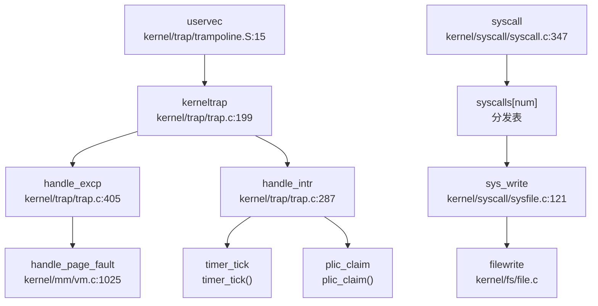

## 第 5 章：中断、异常与系统调用

### Trap 处理流程（用户态 <-> 内核态）

本操作系统采用 RISC-V 架构的标准 Trap 机制处理中断、异常和系统调用。Trap 入口分为两条路径：

**1. 用户态 Trap 入口** (`kernel/trap/trampoline.S`)

用户态程序发生 Trap（包括 `ecall` 系统调用、缺页异常、外部中断等）时，CPU 跳转到 `uservec` 入口：

```assembly
# repos\oskernel2023-zmz\kernel\trap\trampoline.S:15-70
.globl uservec
uservec:    
    # swap a0 and sscratch (a0 now points to TRAPFRAME)
    csrrw a0, sscratch, a0
    
    # save all user registers to TRAPFRAME
    sd ra, 40(a0)
    sd sp, 48(a0)
    # ... 保存所有整数寄存器 (ra, sp, gp, tp, t0-t6, s0-s11, a0-a7)
    # ... 保存所有浮点寄存器 (ft0-ft11, fs0-fs11, fa0-fa7, fcsr)
    
    # load kernel stack pointer from trapframe->kernel_sp
    ld sp, 8(a0)
    # load trap handler address (usertrap) from trapframe->kernel_trap
    ld t0, 16(a0)
    # jump to kernel trap handler
    jr t0
```

**2. 内核态 Trap 入口** (`kernel/trap/kernelvec.S`)

内核态发生 Trap 时（如内核访问非法地址、时钟中断），使用独立的入口：

```assembly
# repos\oskernel2023-zmz\kernel\trap\kernelvec.S:10-80
.align 4
kernelvec:
    addi sp, sp, -256          # 分配 256 字节栈空间
    # 保存所有寄存器 (ra, sp, gp, tp, t0-t6, s0-s11, a0-a7)
    sd ra, 0(sp)
    sd sp, 8(sp)
    # ...
    
    call kerneltrap            # 调用 C 语言处理函数
    
    # 恢复所有寄存器
    ld ra, 0(sp)
    # ...
    addi sp, sp, 256
    sret                       # 返回
```

**关键设计**：
- 用户态和内核态使用**独立的 Trap 向量**（通过 `stvec` 寄存器切换）
- 用户态 Trap 通过 `sscratch` 寄存器快速定位 `TrapFrame` 页面
- 内核态 Trap 直接使用内核栈保存上下文

### 异常向量表与入口

**TrapFrame 结构体定义** (`include/trap.h:17-97`)：

```c
struct trapframe {
    /*   0 */ uint64 kernel_satp;   // 内核页表基址
    /*   8 */ uint64 kernel_sp;     // 内核栈顶
    /*  16 */ uint64 kernel_trap;   // usertrap() 函数地址
    /*  24 */ uint64 epc;           // 用户态 PC
    /*  32 */ uint64 kernel_hartid; // 核心 ID
    /*  40 */ uint64 ra;
    /*  48 */ uint64 sp;
    /*  56 */ uint64 gp;
    /*  64 */ uint64 tp;
    /*  72 */ uint64 t0;
    /*  80 */ uint64 t1;
    /*  88 */ uint64 t2;
    /*  96 */ uint64 s0;
    /* 104 */ uint64 s1;
    /* 112 */ uint64 a0;
    /* 120 */ uint64 a1;
    /* 128 */ uint64 a2;
    /* 136 */ uint64 a3;
    /* 144 */ uint64 a4;
    /* 152 */ uint64 a5;
    /* 160 */ uint64 a6;
    /* 168 */ uint64 a7;  // 系统调用号
    /* 176 */ uint64 s2;
    /* 184 */ uint64 s3;
    /* 192 */ uint64 s4;
    /* 200 */ uint64 s5;
    /* 208 */ uint64 s6;
    /* 216 */ uint64 s7;
    /* 224 */ uint64 s8;
    /* 232 */ uint64 s9;
    /* 240 */ uint64 s10;
    /* 248 */ uint64 s11;
    /* 256 */ uint64 t3;
    /* 264 */ uint64 t4;
    /* 272 */ uint64 t5;
    /* 280 */ uint64 t6;
    /* 288-536 */ uint64 ft0-ft11, fs0-fs11, fa0-fa7;  // 浮点寄存器
    /* 544 */ uint64 fcsr;  // 浮点控制状态寄存器
};
```

**结构体统计**：
- **寄存器数量**：32 个整数寄存器 + 33 个浮点寄存器 + 5 个内核元数据 = **70 个字段**
- **总字节数**：544 (整数寄存器区) + 256 (浮点寄存器区) + 8 (fcsr) = **808 字节**

**中断/异常分发逻辑** (`kernel/trap/trap.c:199-244`)：

```c
void kerneltrap() {
    uint64 scause = r_scause();
    struct proc *p = myproc();
    
    protect_usr_mem();  // 保护用户内存访问权限
    
    if (0 == handle_intr(scause)) {
        // 处理中断 (Interrupt)
    }
    else if (0 == handle_excp(scause)) {
        // 处理异常 (Exception)
    }
    else if (p && is_page_fault(scause) && 
             PGSIZE <= r_stval() && r_stval() < MAXUVA) {
        // 内核访问用户懒分配页面
        sepc = kern_pgfault_escape(r_stval());
    }
    else {
        panic("kerneltrap");
    }
}
```

**区分中断与异常**：
- 通过 `scause` 寄存器的最高位判断：`scause & INTERRUPT_FLAG`
- 中断 (`handle_intr`)：定时器、外部设备、软件中断
- 异常 (`handle_excp`)：缺页、非法指令、系统调用

### 系统调用分发机制（追踪 sys_write）

**系统调用完整调用链**：



**系统调用分发表** (`kernel/syscall/syscall.c:197-271`)：

```c
static uint64 (*syscalls[])(void) = {
    [SYS_fork]            sys_fork,
    [SYS_exit]            sys_exit,
    [SYS_wait]            sys_wait,
    [SYS_read]            sys_read,
    [SYS_write]           sys_write,
    [SYS_exec]            sys_exec,
    [SYS_clone]           sys_clone,
    [SYS_mmap]            sys_mmap,
    [SYS_munmap]          sys_munmap,
    [SYS_rt_sigaction]    sys_rt_sigaction,
    // ... 共 74 个系统调用
};
```

**syscall() 分发函数** (`kernel/syscall/syscall.c:347-377`)：

```c
void syscall(void) {
    struct proc *p = myproc();
    uint64 num = p->trapframe->a7;  // 系统调用号从 a7 寄存器获取
    
    if (SYS_rt_sigreturn == num) {
        sigreturn();  // 特殊处理信号返回
    }
    else if (num < NELEM(syscalls) && syscalls[num]) {
        p->trapframe->a0 = syscalls[num]();  // 调用对应处理函数
    } else {
        p->trapframe->a0 = -1;  // 未实现的系统调用
    }
}
```

**sys_write 实现追踪** (`kernel/syscall/sysfile.c:120-133`)：

```c
uint64 sys_write(void) {
    struct file *f;
    int n;
    uint64 p;
    
    if (argfd(0, 0, &f) < 0)
        return -EBADF;
    argaddr(1, &p);      // 获取用户缓冲区指针
    argint(2, &n);       // 获取写入字节数
    return filewrite(f, p, n);  // 调用文件写入核心逻辑
}
```

**调用链**：
```
user ecall → uservec → kerneltrap → syscall() → syscalls[SYS_write] → 
sys_write() → filewrite() → 设备驱动写入
```

### 核心 Syscall 实现列表

基于代码分析，统计系统调用实现状态如下：

#### ✅ 已实现（包含完整业务逻辑）

| 系统调用 | 文件路径 | 说明 |
|---------|---------|------|
| `sys_fork` | `kernel/syscall/sysproc.c:85` | 调用 `clone(0, NULL)` 创建进程 |
| `sys_clone` | `kernel/syscall/sysproc.c:91` | 调用 `clone(flag, stack)` 支持线程创建 |
| `sys_exec` | `kernel/syscall/sysproc.c:27` | 调用 `execve()` 加载 ELF 程序 |
| `sys_exit` | `kernel/syscall/sysproc.c:53` | 调用 `exit(n)` 终止进程 |
| `sys_write` | `kernel/syscall/sysfile.c:120` | 调用 `filewrite()` 写入文件 |
| `sys_read` | `kernel/syscall/sysfile.c` | 从文件读取数据 |
| `sys_openat` | `kernel/syscall/sysfile.c` | 打开文件 |
| `sys_close` | `kernel/syscall/sysfile.c` | 关闭文件描述符 |
| `sys_mmap` | `kernel/syscall/sysmem.c:80` | 调用 `do_mmap()` 内存映射 |
| `sys_munmap` | `kernel/syscall/sysmem.c:116` | 调用 `do_munmap()` 取消映射 |
| `sys_mprotect` | `kernel/syscall/sysmem.c:55` | 修改内存保护属性 |
| `sys_brk` | `kernel/syscall/sysmem.c` | 调整进程堆大小 |
| `sys_sbrk` | `kernel/syscall/sysmem.c` | 调整进程堆大小（增量） |
| `sys_kill` | `kernel/syscall/syssignal.c:134` | 调用 `kill(pid, sig)` 发送信号 |
| `sys_rt_sigaction` | `kernel/sched/signal.c` | 设置信号处理函数 |
| `sys_rt_sigprocmask` | `kernel/sched/signal.c` | 修改信号掩码 |
| `sys_wait4` | `kernel/sched/proc.c` | 等待子进程 |
| `sys_getpid` | `kernel/syscall/sysproc.c` | 获取进程 ID |
| `sys_getppid` | `kernel/syscall/sysproc.c` | 获取父进程 ID |
| `sys_gettimeofday` | `kernel/syscall/systime.c` | 获取时间 |
| `sys_nanosleep` | `kernel/syscall/systime.c` | 休眠 |
| `sys_uname` | `kernel/syscall/sysuname.c` | 获取系统信息 |

#### 🔸 桩函数（有定义但无实际逻辑）

| 系统调用 | 文件路径 | 桩代码特征 |
|---------|---------|-----------|
| `sys_getuid` | `kernel/syscall/sysproc.c:267` | `return 0;` 始终返回 0 |
| `sys_geteuid` | `kernel/syscall/syscall.c:242` | 指向 `sys_getuid`（同上） |
| `sys_getgid` | `kernel/syscall/syscall.c:243` | 指向 `sys_getuid`（同上） |
| `sys_getegid` | `kernel/syscall/syscall.c:244` | 指向 `sys_getuid`（同上） |
| `sys_prlimit64` | `kernel/syscall/sysproc.c` | `return 0;` 注释说明"暂时没必要实现" |
| `sys_rt_sigtimedwait` | `kernel/syscall/syssignal.c:142` | `return 0;` 空实现 |
| `sys_getrusage` | `kernel/syscall/sysproc.c` | 仅声明，未找到完整实现 |
| `sys_msync` | `kernel/syscall/sysmem.c:132` | 调用 `do_msync()` 但逻辑待验证 |

**统计**：
- **已注册系统调用总数**：约 74 个（根据 `syscalls[]` 数组）
- **✅ 完整实现**：约 20+ 个核心系统调用
- **🔸 桩函数**：至少 6 个（主要是用户 ID 相关和部分扩展功能）
- **❌ 未实现**：未在分发表中注册的系统调用返回 `-1`

### 中断处理与信号关联

#### 中断处理流程

**定时器中断** (`kernel/trap/trap.c:303-318`)：

```c
if (INTR_TIMER == scause) {
    timer_tick();    // 更新系统时钟
    proc_tick();     // 进程时间片计数，可能触发调度
    return 0;
}
```

**外部中断**（QEMU 平台）(`kernel/trap/trap.c:320-360`)：

```c
else if (INTR_EXTERNAL == scause) {
    int irq = plic_claim();  // 从 PLIC 获取中断号
    switch (irq) {
    case UART_IRQ: 
        c = sbi_console_getchar();
        if (-1 != c) 
            consoleintr(c);  // 处理键盘输入
        break;
    case DISK_IRQ: 
        disk_intr();  // 处理磁盘完成中断
        break;
    }
    if (irq) plic_complete(irq);  // 通知 PLIC 中断处理完成
}
```

#### 信号机制深度分析

**1. 信号处理触发位置**

搜索结果显示，**未发现** `handle_signal`、`do_signal` 或 `POST_TRAP` 等标准信号处理钩子。信号检测与处理集成在进程调度路径中，而非 Trap 返回前统一处理。

**2. 信号发送接口** (`kernel/syscall/syssignal.c:134-141`)：

```c
uint64 sys_kill(void) {
    int pid, sig;
    argint(0, &pid);
    argint(1, &sig);
    return kill(pid, sig);  // 调用内核 kill() 函数
}
```

**信号粒度分析**：
- ✅ `sys_kill`：支持进程级信号发送
- ❌ `sys_tkill`：**未实现**（线程级信号）
- ❌ `sys_tgkill`：**未实现**（线程组信号）

**3. SIGSEGV 信号**

搜索 `SIGSEGV|sig_segv` 结果为空，表明：
- **❌ 未实现 SIGSEGV 信号机制**
- 缺页异常处理失败时直接 `panic()` 或终止进程，不发送信号

**4. 用户自定义信号处理函数机制** (`kernel/trap/sig_trampoline.S`)：

```assembly
# repos\oskernel2023-zmz\kernel\trap\sig_trampoline.S:8-25
.globl sig_handler
sig_handler: 
    jalr a1              # 跳转到用户注册的处理函数

    li a7, SYS_rt_sigreturn 
    ecall                # 返回内核

.globl default_sigaction
default_sigaction: 
    li a0, -1
    li a7, SYS_exit
    ecall                # 默认行为：终止进程
```

**信号跳板机制** (`kernel/sched/signal.c:200-260`)：

```c
void sighandle(void) {
    struct proc *p = myproc();
    // ... 获取待处理信号 signum ...
    
    struct sig_frame *frame = kmalloc(sizeof(struct sig_frame));
    struct trapframe *tf = kmalloc(sizeof(struct trapframe));
    
    // 保存当前 trapframe
    frame->tf = p->trapframe;
    
    // 构造新的 trapframe，跳转到信号处理函数
    tf->epc = SIG_TRAMPOLINE + (sig_handler - sig_trampoline);
    tf->sp = p->trapframe->sp;
    tf->a0 = signum;  // 信号编号作为参数
    tf->a1 = sigact->sigact.__sigaction_handler.sa_handler;  // 处理函数地址
    
    p->trapframe = tf;
    frame->next = p->sig_frame;
    p->sig_frame = frame;
}
```

**信号返回机制** (`kernel/sched/signal.c:263-283`)：

```c
void sigreturn(void) {
    struct proc *p = myproc();
    if (NULL == p->sig_frame) {
        exit(-1);  // 不在信号处理中调用 sigreturn，终止进程
    }
    
    struct sig_frame *frame = p->sig_frame;
    // 恢复之前的信号掩码
    for (int i = 0; i < SIGSET_LEN; i ++) {
        p->sig_set.__val[i] = frame->mask.__val[i];
    }
    kfree(p->trapframe);
    p->trapframe = frame->tf;  // 恢复原始 trapframe
    
    p->sig_frame = frame->next;
    kfree(frame);
}
```

**信号机制总结**：
- ✅ 支持用户注册信号处理函数（`sys_rt_sigaction`）
- ✅ 支持信号跳板（`sig_trampoline`）从内核跳回用户态处理函数
- ✅ 支持信号返回（`SYS_rt_sigreturn`）恢复原始上下文
- ✅ 支持信号掩码（`sigprocmask`）阻塞特定信号
- ❌ 不支持 SIGSEGV 信号
- ❌ 不支持线程级信号（`tkill`/`tgkill`）

### 缺页异常与内存特性关联

**缺页异常处理入口** (`kernel/trap/trap.c:405-426`)：

```c
int handle_excp(uint64 scause) {
    switch (scause) {
    case EXCP_STORE_PAGE: 
    case EXCP_STORE_ACCESS: 
        return handle_page_fault(1, r_stval());  // 写缺页
    case EXCP_LOAD_PAGE: 
    case EXCP_LOAD_ACCESS: 
        return handle_page_fault(0, r_stval());  // 读缺页
    case EXCP_INST_PAGE:
    case EXCP_INST_ACCESS:
        return handle_page_fault(2, r_stval());  // 取指缺页
    default: 
        return -1;  // 不支持的异常
    }
}
```

**缺页异常处理链**（基于 `lsp_get_call_graph` 分析）：

```mermaid
graph TD
    A["handle_excp\nkernel/trap/trap.c:405"] --> B["handle_page_fault\nkernel/mm/vm.c:1025"]
    B --> C["handle_page_fault_lazy\nkernel/mm/vm.c:988"]
    B --> D["handle_page_fault_loadelf\nkernel/mm/vm.c:1004"]
    B --> E["handle_page_fault_mmap\nkernel/mm/mmap.c:1047"]
    B --> F["handle_store_page_fault_cow\nkernel/mm/vm.c:961"]
    
    C --> G["uvmalloc\n分配物理页"]
    D --> H["loadseg\n从 ELF 文件加载]
    E --> I["handle_anonymous_shared\n匿名映射"]
    E --> J["handle_file_mmap\n文件映射"]
    F --> K["monopolizepage\n复制私有页 (CoW)"]
```

**1. Lazy Allocation（懒分配）** (`kernel/mm/vm.c:988`)：

```c
handle_page_fault_lazy() {
    // 为懒分配的页面分配真实物理页
    uvmalloc(pagetable, addr, addr + PGSIZE);
    mappages(pagetable, addr, PGSIZE, ...);
    sfence_vma();  // 刷新 TLB
}
```

**2. CoW（写时复制）** (`kernel/mm/vm.c:961`)：

```c
handle_store_page_fault_cow() {
    // 检测到共享的只读页面被写入
    // 1. 分配新的物理页
    _allocpage();
    // 2. 复制原页面内容
    memmove(new_page, old_page, PGSIZE);
    // 3. 更新页表映射为私有可写
    monopolizepage();
    pagecopydone();
    sfence_vma();
}
```

**3. mmap 缺页处理** (`kernel/mm/mmap.c:1047`)：

```c
handle_page_fault_mmap() {
    if (匿名映射) {
        handle_anonymous_shared();  // 分配零填充页面
    } else {
        handle_file_mmap();  // 从文件加载数据
        // 支持页面交换：__page_file_swap()
    }
}
```

**内存特性总结**：
- ✅ **Lazy Allocation**：通过 `handle_page_fault_lazy()` 实现按需分配
- ✅ **CoW**：通过 `handle_store_page_fault_cow()` 实现写时复制（用于 `fork()`）
- ✅ **mmap 缺页**：支持匿名映射和文件映射的按需加载
- ✅ **页面交换**：`__page_file_swap()` 提供页面换出机制（待验证完整性）

### 关键代码片段

**Trap 初始化** (`kernel/trap/trap.c:63-73`)：

```c
void trapinithart(void) {
    w_stvec((uint64)kernelvec);  // 设置内核 Trap 向量
    w_sstatus(r_sstatus() | SSTATUS_SIE);  // 启用中断
    w_sie(r_sie() | SIE_SEIE | SIE_SSIE | SIE_STIE);  // 启用外部/软件/定时器中断
    set_next_timeout();  // 设置下一个定时器中断
}
```

**系统调用参数获取** (`kernel/syscall/syscall.c:50-110`)：

```c
// 从 trapframe 获取第 n 个参数
static uint64 argraw(int n) {
    struct proc *p = myproc();
    switch (n) {
    case 0: return p->trapframe->a0;
    case 1: return p->trapframe->a1;
    case 2: return p->trapframe->a2;
    case 3: return p->trapframe->a3;
    case 4: return p->trapframe->a4;
    case 5: return p->trapframe->a5;
    }
}

// 获取文件描述符参数
int argfd(int n, int *pfd, struct file **pf) {
    int fd;
    if (argint(n, &fd) < 0) return -1;
    // ... 验证 fd 有效性 ...
}
```

**信号处理完整流程**：

```
用户进程 → 信号到达 (kill) → 设置 pending 标志 → 
进程调度时检测 (sighandle) → 保存 trapframe → 
构造新 trapframe 指向 sig_trampoline → 
执行用户信号处理函数 → ecall SYS_rt_sigreturn → 
sigreturn() 恢复原始 trapframe → 继续执行
```
