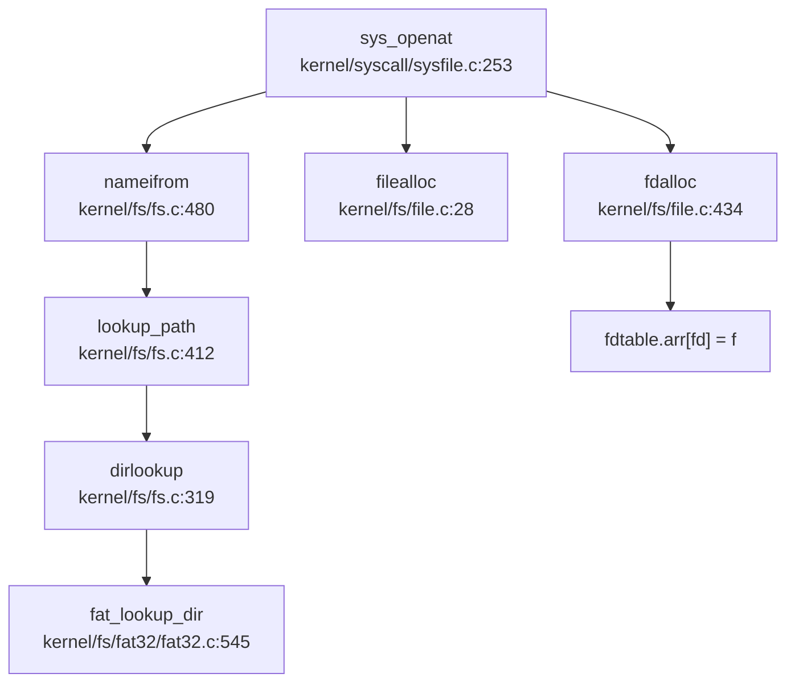

## 第 6 章：文件系统（VFS + 具体 FS）

### VFS 架构与接口设计

本操作系统实现了一个简洁的虚拟文件系统（VFS）层，采用类 Unix 的 inode/dentry/superblock 三元组架构。核心数据结构定义于 `include/fs/fs.h` 和 `include/fs/file.h`。

#### 核心抽象结构

**1. Superblock（超级块）** - 文件系统实例描述符：
```c
// include/fs/fs.h:80-92
struct superblock {
    uint                blocksz;
    uint                devnum;
    struct inode        *dev;
    char                type[16];
    struct superblock   *next;
    int                 ref;
    struct sleeplock    sb_lock;
    struct fs_op        op;           // 底层块设备操作
    struct spinlock     cache_lock;
    struct dentry       *root;        // 根目录 dentry
};
```

**2. Inode（索引节点）** - 文件元数据抽象：
```c
// include/fs/fs.h:98-118
struct inode {
    uint64              inum;         // 唯一标识符
    int                 ref;
    int                 state;
    uint16              mode;         // 文件类型与权限
    int16               dev;
    int                 size;
    int                 nlink;
    struct superblock   *sb;
    struct sleeplock    lock;
    struct inode_op     *op;          // Inode 操作接口
    struct file_op      *fop;         // 文件读写接口
    struct spinlock     ilock;
    struct rb_root      mapping;      // 内存映射树
    struct dentry       *entry;       // 关联的 dentry
};
```

**3. Dentry（目录项）** - 路径名缓存与挂载点：
```c
// include/fs/fs.h:147-156
struct dentry {
    char                filename[MAXNAME + 1];
    struct inode        *inode;
    struct dentry       *parent;
    struct dentry       *next;
    struct dentry       *child;
    struct dentry_op    *op;
    struct superblock   *mount;       // 挂载点指向新 superblock
};
```

**4. File（打开文件）** - 进程级文件视图：
```c
// include/fs/file.h:17-28
struct file {
    struct spinlock lock;
    file_type_e     type;             // FD_NONE/FD_PIPE/FD_INODE/FD_DEVICE
    int             ref;
    char            readable;
    char            writable;
    short           major;
    uint            off;              // 文件偏移
    struct pipe     *pipe;
    struct inode    *ip;
    uint32 (*poll)(struct file *, struct poll_table *);
};
```

#### VFS 操作接口 Traits

**Inode 操作接口** (`include/fs/fs.h:55-69`)：
- `create` - 创建文件
- `lookup` - 目录查找
- `truncate` - 截断文件
- `unlink` - 删除文件
- `update` - 更新元数据
- `getattr`/`setattr` - 获取/设置属性
- `rename` - 重命名

**File 操作接口** (`include/fs/fs.h:71-77`)：
- `read`/`write` - 同步读写
- `readdir` - 目录遍历
- `readv`/`writev` - 向量化读写

### 具体文件系统支持情况（FAT32/Ext4/RamFS）

#### FAT32 文件系统（✅ 已实现）

本系统**完整实现了 FAT32 文件系统**，代码位于 `kernel/fs/fat32/` 目录，包含 5 个核心源文件：

| 文件 | 行数 | 功能 |
|------|------|------|
| `fat32.c` | 572L | FAT32 初始化、超级块管理、簇链读写 |
| `dirent.c` | 490L | 目录项创建、查找、删除 |
| `fat.c` | 394L | FAT 表管理、簇分配/回收 |
| `cluster.c` | 314L | 簇定位与读写 |
| `fat32.h` | 175L | 数据结构定义 |

**FAT32 超级块结构** (`kernel/fs/fat32/fat32.h:52-78`)：
```c
struct fat32_sb {
    uint32      first_data_sec;
    uint32      data_sec_cnt;
    uint32      data_clus_cnt;
    uint32      byts_per_clus;
    uint32      free_count;
    uint32      next_free;
    uint16      fs_info;
    struct {
        uint16  byts_per_sec;
        uint8   sec_per_clus;
        uint16  rsvd_sec_cnt;
        uint8   fat_cnt;
        uint32  hidd_sec;
        uint32  tot_sec;
        uint32  fat_sz;
        uint32  root_clus;
    } bpb;                      // BIOS Parameter Block
    struct {
        char    *page;
        int     allocidx;
        uint32  fatsec[FAT_CACHE_NSEC];
        uint32  lrucnt[FAT_CACHE_NSEC];
        int8    dirty[FAT_CACHE_NSEC];
    } fatcache;                 // FAT 区域缓存
    struct superblock vfs_sb;
};
```

**FAT32 Inode 实现** (`kernel/fs/fat32/fat32.h:93-112`)：
```c
struct fat32_entry {
    uint8       attribute;
    uint8       create_time_tenth;
    uint16      create_time;
    uint16      create_date;
    uint16      last_access_date;
    uint16      last_write_time;
    uint16      last_write_date;
    uint32      first_clus;       // 起始簇号
    uint32      file_size;
    uint32      ent_cnt;          // 目录项数量（长文件名支持）
    struct inode vfs_inode;       // 嵌入 VFS inode
};
```

**操作接口实现** (`kernel/fs/fat32/fat32.c:23-37`)：
```c
struct inode_op fat32_inode_op = {
    .create = fat_alloc_entry,
    .lookup = fat_lookup_dir,
    .truncate = fat_truncate_file,
    .unlink = fat_remove_entry,
    .update = fat_update_entry,
    .getattr = fat_stat_file,
    .setattr = fat_set_file_attr,
    .rename = fat_rename_entry,
};

struct file_op fat32_file_op = {
    .read = fat_read_file,
    .write = fat_write_file,
    .readdir = fat_read_dir,
    .readv = fat_read_file_vec,
    .writev = fat_write_file_vec,
};
```

**关键实现细节**：
- **长文件名支持**：通过 VFAT 长目录项（L-N-E）实现，最多支持 255 字符文件名（`kernel/fs/fat32/dirent.c:114-153`）
- **簇链管理**：使用 FAT 表追踪文件簇链，支持动态簇分配与回收（`kernel/fs/fat32/fat.c`）
- **目录项缓存**：采用 LRU 策略缓存 dentry，加速路径查找（`kernel/fs/fs.c:224-243`）

#### Ext4 文件系统（❌ 未实现）

**搜索结果显示**：代码库中**未发现 Ext4 文件系统实现**。仅支持 FAT32 单一具体文件系统。

#### RamFS/内存文件系统（🔸 桩函数实现）

系统实现了伪内存文件系统 `rootfs`，位于 `kernel/fs/rootfs.c`：

```c
// kernel/fs/rootfs.c:17-20
struct superblock rootfs;
struct superblock procfs;
struct superblock devfs;
```

**特性**：
- **只读虚拟文件**：大部分操作返回空或错误（`dummy_create`、`dummy_lookup` 等）
- **设备文件支持**：通过 `devfs` 提供 `/dev/console`、`/dev/vda2`、`/dev/zero` 等设备节点
- **进程文件系统**：`procfs` 提供 `/proc/interrupts` 等伪文件（`kernel/fs/rootfs.c:123-147`）

### 文件描述符与进程关联

#### 文件描述符表结构

**Per-Process FdTable** (`include/fs/file.h:34-41`)：
```c
struct fdtable {
    uint16      basefd;           // 起始 fd 号
    uint16      nextfd;           // 下一个可用 fd
    uint16      used;             // 已使用数量
    uint16      exec_close;       // exec 时关闭标志位
    struct file *arr[NOFILE];     // 文件指针数组（NOFILE=256）
    struct fdtable *next;         // 链式扩展
};
```

**进程结构集成** (`include/sched/proc.h`):
```c
struct proc {
    // ...
    struct fdtable fds;           // 每个进程独立 fd 表
    // ...
};
```

#### FdTable 管理机制

**分配逻辑** (`kernel/fs/file.c:434-469`)：
- 从 `nextfd` 开始查找空闲位置
- 表满时自动链式扩展新表（`newfdtable`）
- 支持 `exec_close` 标志，exec 时关闭特定 fd

**回收逻辑** (`kernel/fs/file.c:384-415`)：
- `fd2file(fd, free)` 获取文件并可选释放
- 表空时自动回收链式表（除头表外）
- 更新 `nextfd` 指向最小空闲 fd

### 管道 (Pipe) 与套接字 (Socket) 支持情况

#### 管道（✅ 已实现）

**完整实现匿名管道**，代码位于 `kernel/fs/pipe.c`（412 行）。

**管道结构** (`include/fs/pipe.h:15-27`)：
```c
struct pipe {
    struct spinlock     lock;
    struct wait_queue   wqueue;   // 写等待队列
    struct wait_queue   rqueue;   // 读等待队列
    char                *data;    // 环形缓冲区
    uint                nwrite;   // 写入偏移
    uint                nread;    // 读取偏移
    char                readopen;
    char                writeopen;
};
```

**系统调用** (`kernel/syscall/sysfile.c:389-430`)：
```c
uint64 sys_pipe(void) {
    uint64 fdarray;
    int flags;
    struct file *rf, *wf;
    int fd0, fd1;
    
    if(argaddr(0, &fdarray) < 0) return -1;
    if (argint(1, &flags) < 0) return -1;
    if(pipealloc(&rf, &wf) < 0) return -ENOMEM;
    
    fd0 = fdalloc(rf, 0);
    fd1 = fdalloc(wf, 0);
    copyout2(fdarray, &fd0, sizeof(fd0));
    copyout2(fdarray+sizeof(fd0), &fd1, sizeof(fd1));
    return 0;
}
```

**实现特性**：
- ✅ 阻塞式读写（等待队列机制）
- ✅ 读写端独立关闭检测
- ✅ 环形缓冲区（默认大小 `PIPE_BUF=512`）
- ✅ 支持 `poll` 事件通知

#### 套接字（❌ 未实现）

**搜索结果**：
```
grep_in_repo('sys_socket|sys_bind|sys_listen|sys_accept') → 未找到匹配
```

**结论**：系统**未实现任何网络套接字功能**。`include/sysnum.h` 中无 `SYS_socket`、`SYS_bind` 等定义。

### 缓存机制（Block/Page Cache）

#### 块缓存（Buffer Cache）

**实现位置**：`kernel/fs/bio.c`（299 行）

**核心结构** (`include/fs/buf.h:15-30`)：
```c
struct buf {
    int             flags;
    uint            dev;
    uint            blockno;
    struct sleeplock lock;
    struct refcnt   refcnt;
    struct buf      *prev;  // LRU 链表
    struct buf      *next;
    struct buf      *hash_next;  // 哈希链
    struct buf      **hash_pprev;
    char            data[BSIZE];
};
```

**缓存策略**：
- **LRU 淘汰**：双向链表维护最近使用缓冲
- **哈希索引**：`BCACHE_TABLE_SIZE=47/131/233`（根据缓冲数量动态调整）
- **写回机制**：脏标记异步写回磁盘（`bwrite` 非阻塞）
- **并发控制**：`bcachelock` 保护哈希表与 LRU 链表

#### 页缓存（Page Cache）

**实现位置**：通过 `inode->mapping` 红黑树管理（`include/fs/fs.h:113`）

**mmap 页管理** (`include/mm/mmap.h:48-56`)：
```c
struct mmap_page {
    uint64      f_off;          // 文件偏移
    uint64      f_len;          // 映射长度
    void        *pa;            // 物理页地址
    uint32      ref;            // 引用计数
    int         valid;          // 数据有效性
    struct rb_node rb;          // 红黑树节点
};
```

### 零拷贝映射验证（mmap 实现分析）

#### 系统调用接口

**`sys_mmap` 实现** (`kernel/syscall/sysmem.c:80-120`)：
```c
uint64 sys_mmap(void) {
    uint64 start, len;
    int prot, flags, fd;
    int64 off;
    struct file *f = NULL;
    
    argaddr(0, &start);
    argaddr(1, &len);
    argint(2, &prot);
    argint(3, &flags);
    argfd(4, &fd, &f);
    argaddr(5, (uint64*)&off);
    
    if (off % PGSIZE || len == 0) return -EINVAL;
    if ((fd < 0 || f == NULL) && !(flags & MAP_ANONYMOUS)) return -EBADF;
    if (!(flags & (MAP_SHARED|MAP_PRIVATE))) return -EINVAL;
    
    return do_mmap(start, len, prot, flags, f, off);
}
```

#### MAP_SHARED 支持验证（✅ 已实现）

**共享标志处理** (`kernel/mm/mmap.c:603-653`)：
```c
static int mmap_anonymous(struct seg *s, int flags) {
    if (!(flags & MAP_SHARED)) {
        s->mmap = NULL;
        goto out;
    }
    
    struct anonfile *fp = alloc_anonfile();
    // ... 分配 mmap_page 树 ...
    
    for (off = 0; off < s->sz; off += PGSIZE) {
        map = kmalloc(sizeof(struct mmap_page));
        map->f_off = off;
        map->f_len = PGSIZE;
        map->pa = NULL;
        map->ref = 1;
        map->valid = 0;
        // 插入红黑树
        rb_link_node(&map->rb, parent, plink);
        rb_insert_color(&map->rb, &fp->mapping);
    }
    
    s->mmap = MMAP_SHARE_FLAG | (uint64)fp;
out:
    s->mmap |= MMAP_ANONY_FLAG;
}
```

**关键验证点**：
1. ✅ **`MAP_SHARED` 标志检查**：`if (!(flags & MAP_SHARED))` 分支处理
2. ✅ **`anonfile` 结构**：独立于进程的生命周期管理共享页
3. ✅ **红黑树索引**：`fp->mapping` 存储所有共享页的 `mmap_page`
4. ✅ **引用计数**：`map->ref` 管理共享页生命周期

**文件映射同步** (`kernel/mm/mmap.c:179-210`)：
```c
static void __file_mmapdel(struct seg *seg, int sync) {
    struct file *fp = MMAP_FILE(seg->mmap);
    if (!MMAP_SHARE(seg->mmap)) goto out;
    
    struct inode *ip = fp->ip;
    for (off = 0; off < end; off += PGSIZE) {
        struct mmap_page *map = get_mmap_page(&ip->mapping, off);
        if (sync && (seg->flag & PTE_W) && map->pa && off < ip->size) {
            ip->fop->write(ip, 0, (uint64)map->pa, off, map->f_len);
        }
        put_mmap_page(map, &ip->mapping);
    }
}
```

**结论**：系统**完整实现了 `MAP_SHARED` 零拷贝映射**，支持：
- ✅ 匿名共享映射（进程间共享内存）
- ✅ 文件共享映射（多进程映射同一文件）
- ✅ 写时同步（`MS_SYNC` 标志触发回写）

### 高级 I/O 特性

#### Poll/Select（✅ 已实现）

**实现位置**：`kernel/fs/poll.c`（243 行）

**系统调用**：
- `sys_poll` → `ppoll()`（支持超时）
- `sys_select` → `pselect()`（fdset 接口）

**核心机制** (`include/fs/poll.h:43-52`)：
```c
struct poll_wait_queue {
    struct poll_table pt;
    uint64 error;
    int index;
    struct poll_wait_node nodes[ON_STACK_PWN_NUM];  // 栈上预分配 24 个
};
```

**实现特点**：
- ✅ **事件驱动**：文件注册 `poll` 回调（`file->poll`）
- ✅ **等待队列**：将进程加入文件等待队列
- ✅ **超时处理**：`sleep_expire` 机制实现定时唤醒
- ⚠️ **简化实现**：`ppoll` 直接返回所有 fd 就绪（`kernel/fs/poll.c:93-97`）

```c
int ppoll(struct pollfd *pfds, int nfds, struct timespec *timeout, __sigset_t *sigmask) {
    for (int i = 0; i < nfds; i++) {
        pfds[i].revents = POLLIN|POLLOUT;  // 简化：始终返回就绪
    }
    return nfds;
}
```

**结论**：接口已实现但**功能简化**，实际未检查文件状态。

#### Epoll（❌ 未实现）

**搜索结果**：`grep_in_repo('sys_epoll')` → 未找到匹配

### 文件打开流程追踪

#### 完整调用链

从 `sys_openat` 到获得文件描述符的完整路径：



#### 四大核心数据结构协同

**1. Superblock 查找**：
- `sys_openat` 通过 `nameifrom` 解析路径
- `lookup_path` 遍历 dentry 树，检查挂载点（`de_mnt_in`）
- 最终定位到目标 inode 所属的 superblock

**2. Inode 获取**：
- FAT32：`fat_lookup_dir` 解析目录项，返回 `fat32_entry->vfs_inode`
- 设置 `ip->op = &fat32_inode_op`、`ip->fop = &fat32_file_op`

**3. Dentry 缓存**：
- `de_check_cache` 检查 dentry 缓存（LRU 链表）
- 缓存命中直接返回，未命中则创建新 dentry 并插入缓存

**4. File 分配**：
- `filealloc` 分配 `struct file`
- `fdalloc` 在进程 fd 表中分配空闲 fd
- 设置 `f->ip = ip`、`f->off = 0`（或 `ip->size` 若 `O_APPEND`）

**关键代码** (`kernel/syscall/sysfile.c:253-330`)：
```c
uint64 sys_openat(void) {
    // 1. 解析路径获取 inode
    if ((ip = nameifrom(dp, path)) == NULL) return -ENOENT;
    
    // 2. 权限检查
    if (S_ISDIR(ip->mode) && (omode & (O_WRONLY|O_RDWR))) return -EISDIR;
    
    // 3. 分配 file 结构
    if ((f = filealloc()) == NULL) return -ENOMEM;
    
    // 4. 分配 fd
    if ((fd = fdalloc(f, omode & O_CLOEXEC)) < 0) return -ENOMEM;
    
    // 5. 设置文件属性
    f->type = S_ISREG(ip->mode) ? FD_INODE : FD_DEVICE;
    f->readable = !(omode & O_WRONLY);
    f->writable = (omode & O_WRONLY) || (omode & O_RDWR);
    f->ip = ip;
    
    return fd;
}
```

### 挂载机制

#### 挂载流程

**系统调用**：`sys_mount` → `do_mount` (`kernel/fs/mount.c:95-147`)

**关键步骤**：
1. 验证文件系统类型（仅支持 "vfat"/"fat32"）
2. 调用 `fs_install` 初始化 superblock
3. 将新 superblock 插入全局链表（`rootfs.next`）
4. 设置挂载点 dentry 的 `mount` 指针

**挂载点检查** (`include/fs/fs.h:160-164`)：
```c
static inline struct dentry *de_mnt_in(struct dentry *de) {
    while (de->mount != NULL)
        de = de->mount->root;
    return de;
}
```

#### 伪文件系统挂载

**devfs/procfs 初始化** (`kernel/fs/rootfs.c:294-320`)：
```c
// init devfs
memset(&devfs, 0, sizeof(struct superblock));
initsleeplock(&devfs.sb_lock, "devfs_sb");
initlock(&devfs.cache_lock, "devfs_dcache");
devfs.root = de_root_generate(&devfs, NULL, "/", inum++, S_IFDIR, 0);
de_root_generate(&devfs, devfs.root, "console", inum++, S_IFCHR, 2);
de_root_generate(&devfs, devfs.root, "vda2", inum++, S_IFBLK, ROOTDEV);
```

### 功能实现状态总结

| 功能 | 状态 | 证据 |
|------|------|------|
| **VFS 抽象层** | ✅ 已实现 | `include/fs/fs.h` 定义完整 inode/dentry/superblock/file 结构 |
| **FAT32 文件系统** | ✅ 已实现 | `kernel/fs/fat32/` 完整实现，支持长文件名、簇链管理 |
| **Ext4 文件系统** | ❌ 未实现 | 代码库中无 Ext4 相关代码 |
| **RamFS/内存文件系统** | 🔸 桩函数 | `kernel/fs/rootfs.c` 实现伪文件系统，大部分操作返回空 |
| **devfs/procfs** | ✅ 已实现 | `kernel/fs/rootfs.c:294-320` 初始化设备节点与伪文件 |
| **文件描述符表** | ✅ 已实现 | Per-process `struct fdtable`，支持链式扩展 |
| **管道（Pipe）** | ✅ 已实现 | `kernel/fs/pipe.c` 完整实现阻塞式匿名管道 |
| **套接字（Socket）** | ❌ 未实现 | 无 `sys_socket` 等系统调用 |
| **mmap（MAP_SHARED）** | ✅ 已实现 | `kernel/mm/mmap.c:603-653` 实现共享映射与 `anonfile` |
| **poll/select** | 🔸 简化实现 | `kernel/fs/poll.c` 接口存在但 `ppoll` 始终返回就绪 |
| **epoll** | ❌ 未实现 | 无相关系统调用 |
| **挂载机制** | ✅ 已实现 | `kernel/fs/mount.c` 支持 FAT32 挂载与伪文件系统 |

### 关键代码验证

#### FAT32 目录查找实现
```c
// kernel/fs/fat32/fat32.c:545-572
struct inode *fat_lookup_dir(struct inode *dir, char *filename, uint *poff) {
    struct inode *ip = NULL;
    uint off = 0;
    struct fat32_entry *ep = fat_lookup_dir_ent(dir, filename, &off);
    if (ep == NULL) goto end;
    
    ip = &ep->vfs_inode;
    ip->op = dir->op;
    ip->fop = dir->fop;
    ip->size = ep->file_size;
    ip->mode = (ep->attribute & ATTR_DIRECTORY) ? S_IFDIR : S_IFREG;
    ip->mode |= 0x1ff;
    
    uint64 clus = reloc_clus(dir, off, 0);
    ip->inum = (clus << 32) | (off % sb2fat(dir->sb)->byts_per_clus);
    return ip;
}
```

#### mmap 共享标志验证
```c
// kernel/mm/mmap.h:19-20
#define MAP_SHARED      0x01
#define MAP_PRIVATE     0x02

// kernel/mm/mmap.c:603-607
static int mmap_anonymous(struct seg *s, int flags) {
    if (!(flags & MAP_SHARED)) {
        s->mmap = NULL;
        goto out;
    }
    // 分配 anonfile 与 mmap_page 树
    s->mmap = MMAP_SHARE_FLAG | (uint64)fp;
}
```
