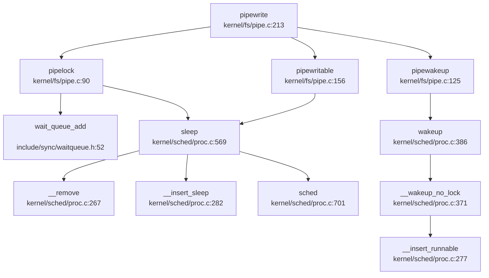

## 第 8 章：同步互斥与进程间通信

## 同步与互斥原语（锁与原子操作）

本操作系统实现了两种核心锁机制：**SpinLock（自旋锁）** 和 **SleepLock（睡眠锁）**，分别适用于短临界区和长临界区的互斥保护。

### SpinLock 实现

**定义位置**：`include/sync/spinlock.h:7-14`

```c
struct spinlock {
    uint locked;       // Is the lock held?
    char *name;        // Name of lock.
    struct cpu *cpu;   // The cpu holding the lock.
};
```

**实现文件**：`kernel/sync/spinlock.c`

**原子操作机制**：
- 使用 RISC-V 的 `amoswap.w.aq` 原子指令实现锁获取
- 使用 `amoswap.w` 原子指令实现锁释放
- 通过 GCC 内置函数 `__sync_lock_test_and_set()` 和 `__sync_lock_release()` 封装

**acquire() 实现**（`kernel/sync/spinlock.c:23-45`）：
```c
void acquire(struct spinlock *lk)
{
    push_off(); // disable interrupts to avoid deadlock.
    if(holding(lk))
        panic("acquire");

    // On RISC-V, sync_lock_test_and_set turns into an atomic swap:
    //   amoswap.w.aq a5, a5, (s1)
    while(__sync_lock_test_and_set(&lk->locked, 1) != 0)
        ;

    __sync_synchronize(); // memory fence
    lk->cpu = mycpu();
}
```

**release() 实现**（`kernel/sync/spinlock.c:48-74`）：
```c
void release(struct spinlock *lk)
{
    if(!holding(lk))
        panic("release");

    lk->cpu = 0;
    __sync_synchronize(); // memory fence
    __sync_lock_release(&lk->locked);
    pop_off();
}
```

**关键特性**：
- ✅ **已实现**：使用 `push_off()/pop_off()` 禁用/启用中断防止死锁
- ✅ **已实现**：使用 `__sync_synchronize()` 发出 RISC-V `fence` 指令确保内存序
- ✅ **已实现**：自旋检测 `holding()` 防止同一 CPU 重复获取锁

### SleepLock 实现

**定义位置**：`include/sync/sleeplock.h:10-17`

```c
struct sleeplock {
    uint locked;       // Is the lock held?
    struct spinlock lk; // spinlock protecting this sleep lock
    char *name;        // Name of lock.
    int pid;           // Process holding lock
};
```

**实现文件**：`kernel/sync/sleeplock.c`

**acquiresleep() 实现**（`kernel/sync/sleeplock.c:21-31`）：
```c
void acquiresleep(struct sleeplock *lk)
{
    acquire(&lk->lk);
    while (lk->locked) {
        sleep(lk, &lk->lk);
    }
    lk->locked = 1;
    lk->pid = myproc()->pid;
    release(&lk->lk);
}
```

**releasesleep() 实现**（`kernel/sync/sleeplock.c:33-41`）：
```c
void releasesleep(struct sleeplock *lk)
{
    acquire(&lk->lk);
    lk->locked = 0;
    lk->pid = 0;
    wakeup(lk);
    release(&lk->lk);
}
```

**关键特性**：
- ✅ **已实现**：内嵌 SpinLock 保护 `locked` 字段的原子性
- ✅ **已实现**：获取失败时调用 `sleep()` 将进程挂起到等待队列
- ✅ **已实现**：释放时调用 `wakeup()` 唤醒等待者
- ✅ **已实现**：`trysleeplock()` 提供非阻塞尝试获取接口

## 等待队列实现机制

### WaitQueue 数据结构

**定义位置**：`include/sync/waitqueue.h:17-26`

```c
struct wait_queue {
    struct spinlock lock;
    struct d_list head;
};

struct wait_node {
    void *chan;
    struct d_list list;
};
```

**设计原理**：
- 使用双向链表（`dlist`）组织等待节点
- 每个等待队列有一个自旋锁保护链表操作
- `chan` 字段标识等待通道（通常为等待对象的地址）

### 核心操作

**等待队列操作**（`include/sync/waitqueue.h:33-73`）：
```c
static inline void wait_queue_init(struct wait_queue *wq, char *str)
{
    initlock(&wq->lock, str);
    dlist_init(&wq->head);
}

static inline void wait_queue_add(struct wait_queue *wq, struct wait_node *node) {
    dlist_add_before(&wq->head, &node->list);
}

static inline void wait_queue_del(struct wait_node *node) {
    dlist_del(&node->list);
}
```

### sleep() 与 wakeup() 机制

**sleep() 实现**（`kernel/sched/proc.c:569-593`）：
```c
void sleep(void *chan, struct spinlock *lk) {
    struct proc *p = myproc();

    // Either proc_lock or lk must be held
    if (&proc_lock != lk) {
        __enter_proc_cs 
        release(lk);
    }

    p->chan = chan;
    __remove(p);        // remove from runnable
    __insert_sleep(p);  // insert into sleep list

    sched();            // switch to another process
    p->chan = NULL;

    __leave_proc_cs 
    acquire(lk);
}
```

**wakeup() 实现**（`kernel/sched/proc.c:371-386`）：
```c
static void __wakeup_no_lock(void *chan) {
    struct proc *p = proc_sleep;
    while (NULL != p) {
        struct proc *next = p->sched_next;
        if ((uint64)chan == (uint64)p->chan) {
            __remove(p);
            p->timer = TIMER_IRQ;
            p->chan = NULL;
            __insert_runnable(PRIORITY_IRQ, p);
        }
        p = next;
    }
}

void wakeup(void *chan) {
    __enter_proc_cs 
    __wakeup_no_lock(chan);
    __leave_proc_cs
}
```

**关键特性**：
- ✅ **已实现**：进程状态转换：`RUNNABLE` → `SLEEPING` → `RUNNABLE`
- ✅ **已实现**：使用 `chan` 地址匹配唤醒特定等待队列上的进程
- ✅ **已实现**：唤醒后进程被插入到 `PRIORITY_IRQ` 优先级队列
- ✅ **已实现**：`proc_sleep` 全局链表管理所有睡眠进程

## 进程间通信（Pipe/MsgQueue/Sem）

### 管道（Pipe）实现

**定义位置**：`include/fs/pipe.h:12-21`

```c
#define PIPESIZE 1024

struct pipe {
    struct spinlock     lock;
    struct wait_queue   wqueue;
    struct wait_queue   rqueue;
    uint    nread;          // number of bytes read
    uint    nwrite;         // number of bytes written
    int     readopen;       // read fd is still open
    int     writeopen;      // write fd is still open
    char    data[PIPESIZE];
};
```

**实现文件**：`kernel/fs/pipe.c`（412 行，9.4KB）

**环形缓冲区机制**：
- ✅ **已实现**：使用 1024 字节循环缓冲区
- ✅ **已实现**：`nread` 和 `nwrite` 计数器实现模运算索引：`pi->data + pi->nread % PIPESIZE`
- ✅ **已实现**：独立的读写等待队列 `rqueue` 和 `wqueue`

**pipewrite() 核心逻辑**（`kernel/fs/pipe.c:213-251`）：
```c
int pipewrite(struct pipe *pi, uint64 addr, int n)
{
    struct wait_node wait;
    wait.chan = &wait;
    pipelock(pi, &wait, PIPE_WRITER);  // block other writers
    
    for (i = 0; i < n;) {
        if ((m = pipewritable(pi)) < 0) {
            i = -EPIPE;
            goto out;
        }
        // ... write data using circular buffer ...
        pi->nwrite += count;
    }
    pipewakeup(pi, PIPE_READER);
    pipeunlock(pi, &wait, PIPE_WRITER);
    return i;
}
```

**piperead() 核心逻辑**（`kernel/fs/pipe.c:253-285`）：
```c
int piperead(struct pipe *pi, uint64 addr, int n)
{
    struct wait_node wait;
    wait.chan = &wait;
    pipelock(pi, &wait, PIPE_READER);  // block other readers
    
    if ((m = pipereadable(pi)) < 0) {
        goto out;
    }
    // ... read data using circular buffer ...
    pi->nread += count;
    pipewakeup(pi, PIPE_WRITER);
    pipeunlock(pi, &wait, PIPE_READER);
    return i;
}
```

**等待/唤醒流程**：
- ✅ **已实现**：`pipelock()` 实现 FIFO 排队机制，只有队列第一个进程可以获取资源
- ✅ **已实现**：`pipeunlock()` 离开队列时唤醒下一个等待者
- ✅ **已实现**：`pipewakeup()` 唤醒对立端（读/写）的等待进程

**系统调用接口**：
- ✅ **已实现**：`sys_pipe()`（`kernel/syscall/sysfile.c:389-420`）创建管道
- ✅ **已实现**：`SYS_pipe2` 系统调用号 59（`include/sysnum.h:30`）

### Poll/Select 机制

**定义位置**：`include/fs/poll.h`

**实现文件**：`kernel/fs/poll.c`（243 行，5.6KB）

**核心机制**：
- ✅ **已实现**：`poll_wait()` 将文件的等待队列添加到 `poll_wait_queue`
- ✅ **已实现**：`pselect()` 支持超时和信号掩码
- ✅ **已实现**：管道文件实现 `pipepoll()` 回调（`kernel/fs/pipe.c:373-412`）

**pipepoll() 实现**（`kernel/fs/pipe.c:373-412`）：
```c
static uint32 pipepoll(struct file *fp, struct poll_table *pt)
{
    if (fp->readable)
        poll_wait(fp, &pi->rqueue, pt);
    if (fp->writable)
        poll_wait(fp, &pi->wqueue, pt);

    if (fp->readable) {
        if (pi->nwrite - pi->nread > 0)
            mask |= POLLIN;
        if (!pi->writeopen)
            mask |= POLLHUP;
    }
    if (fp->writable) {
        if (pi->nwrite - pi->nread < PIPESIZE)
            mask |= POLLOUT;
        if (!pi->readopen)
            mask |= POLLERR;
    }
    return mask;
}
```

### 信号（Signal）作为 IPC

**定义位置**：`include/sched/signal.h`

**实现文件**：`kernel/sched/signal.c`（283 行，6.6KB）

**支持的信号**（`include/sched/signal.h:10-18`）：
- `SIGTERM` (15), `SIGKILL` (9), `SIGABRT` (6), `SIGHUP` (1)
- `SIGINT` (2), `SIGQUIT` (3), `SIGILL` (4), `SIGTRAP` (5)
- `SIGCHLD` (17), `SIGRTMIN` (34) - `SIGRTMAX` (64)

**kill() 系统调用**（`kernel/sched/proc.c:528-565`）：
```c
int kill(int pid, int sig) {
    struct proc *tmp;
    
    __enter_hash_cs 
    tmp = hash_search_no_lock(pid);
    if (NULL == tmp) {
        __leave_hash_cs 
        return -ESRCH;
    }

    // Set pending signal
    tmp->sig_pending.__val[i] |= 1ul << bit;
    if (0 == tmp->killed || sig < tmp->killed) {
        tmp->killed = sig;
    }

    // Wake up if sleeping
    if (SLEEPING == tmp->state) {
        __remove(tmp);
        tmp->timer = TIMER_IRQ;
        tmp->chan = NULL;
        __insert_runnable(PRIORITY_IRQ, tmp);
    }
    __leave_hash_cs 
    return 0;
}
```

**信号处理时机**：
- ✅ **已实现**：`sighandle()` 在 Trap 返回用户态前检查并处理待处理信号
- ✅ **已实现**：信号处理使用 `sig_trampoline` 跳板代码（`kernel/trap/sig_trampoline.S`）
- ✅ **已实现**：`sigreturn()` 系统调用恢复信号处理前的上下文

**信号动作管理**：
- ✅ **已实现**：`set_sigaction()` 设置信号处理函数
- ✅ **已实现**：`sigprocmask()` 设置信号掩码
- ✅ **已实现**：每个进程维护 `sig_act` 链表存储自定义信号动作

### 消息队列（Message Queue）

**搜索结果**：
- `grep "sys_msgget|msgget|sys_msgsnd|msgsnd|sys_msgrcv|msgrcv"` 仅在 `include/resource.h` 中找到 `ru_msgsnd` 和 `ru_msgrcv` 字段（用于资源统计）
- **未发现** 任何消息队列系统调用的实现代码

**结论**：❌ **未实现** - 消息队列机制仅有文档提及（资源统计字段），无实际实现

### 信号量（Semaphore）

**搜索结果**：
- `grep "sys_semget|semget|sys_semop|semop|sys_semctl"` 未找到任何匹配

**结论**：❌ **未实现** - System V 信号量机制完全未实现

### 共享内存（Shared Memory）

**搜索结果**：
- `grep "sys_shmget|shmget|sys_shmat|shmat|sys_shmdt|shmdt"` 未找到任何匹配
- 内存管理章节中发现 `mmap()` 支持 `MAP_SHARED` 标志（`kernel/mm/mmap.c`）

** mmap 共享映射实现**：
- ✅ **已实现**：`do_mmap()` 支持 `MAP_SHARED` 标志（`kernel/mm/mmap.c`）
- ✅ **已实现**：`do_msync()` 同步共享映射到文件（`kernel/mm/mmap.c:768-815`）
- ❌ **未实现**：System V 共享内存接口（`shmget/shmat/shmdt`）

**结论**：
- System V 共享内存接口：❌ **未实现**
- POSIX 共享内存（通过 mmap）：✅ **已实现**

### Futex

**搜索结果**：
- `grep "sys_futex|futex_wait|futex_wake"` 未找到任何匹配

**结论**：❌ **未实现** - Futex 机制完全未实现

## 关键代码片段

### Pipe 环形缓冲区读写

```c
// kernel/fs/pipe.c:213-251 (pipewrite 核心逻辑)
int pipewrite(struct pipe *pi, uint64 addr, int n)
{
    char *const pipebound = pi->data + PIPESIZE;
    struct wait_node wait;
    wait.chan = &wait;
    pipelock(pi, &wait, PIPE_WRITER);
    
    for (i = 0; i < n;) {
        if ((m = pipewritable(pi)) < 0) {
            i = -EPIPE;
            goto out;
        }
        m = (PIPESIZE - m < n - i) ? PIPESIZE - m : n - i;
        
        while (m > 0) {
            char *paddr = pi->data + pi->nwrite % PIPESIZE;
            int count = (pipebound - paddr < m) ? pipebound - paddr : m;
            
            if (copyin_nocheck(paddr, addr + i, count) < 0)
                break;
            i += count;
            pi->nwrite += count;
            m -= count;
        }
        if (m > 0)
            break;
    }
    pipewakeup(pi, PIPE_READER);
    pipeunlock(pi, &wait, PIPE_WRITER);
    return i;
}
```

### Pipe 等待/唤醒流程调用图



### Kill 信号发送流程

```c
// kernel/sched/proc.c:528-565
int kill(int pid, int sig) {
    struct proc *tmp;
    __enter_hash_cs 
    tmp = hash_search_no_lock(pid);
    if (NULL == tmp) {
        __leave_hash_cs 
        return -ESRCH;
    }

    int const len = sizeof(unsigned long) * 8;
    int bit = sig % len;
    int i = sig / len;
    
    tmp->sig_pending.__val[i] |= 1ul << bit;
    if (0 == tmp->killed || sig < tmp->killed) {
        tmp->killed = sig;
    }

    __enter_proc_cs 
    if (SLEEPING == tmp->state) {
        __remove(tmp);
        tmp->timer = TIMER_IRQ;
        tmp->chan = NULL;
        __insert_runnable(PRIORITY_IRQ, tmp);
    }
    __leave_proc_cs 
    __leave_hash_cs 
    return 0;
}
```

## 未实现/桩函数功能列表

| 功能类别 | 具体功能 | 状态 | 说明 |
|---------|---------|------|------|
| **消息队列** | `msgget()` | ❌ 未实现 | 仅在 `resource.h` 中有统计字段 |
| **消息队列** | `msgsnd()` | ❌ 未实现 | 无系统调用实现 |
| **消息队列** | `msgrcv()` | ❌ 未实现 | 无系统调用实现 |
| **信号量** | `semget()` | ❌ 未实现 | 完全未实现 |
| **信号量** | `semop()` | ❌ 未实现 | PV 操作未实现 |
| **信号量** | `semctl()` | ❌ 未实现 | 控制操作未实现 |
| **共享内存** | `shmget()` | ❌ 未实现 | System V 接口未实现 |
| **共享内存** | `shmat()` | ❌ 未实现 | System V 接口未实现 |
| **共享内存** | `shmdt()` | ❌ 未实现 | System V 接口未实现 |
| **Futex** | `futex()` | ❌ 未实现 | 快速用户空间互斥量未实现 |
| **POSIX 共享内存** | `shm_open()` | ❌ 未实现 | POSIX 接口未实现 |

**已实现功能总结**：
- ✅ **SpinLock**：完整的自旋锁实现，使用 RISC-V 原子指令
- ✅ **SleepLock**：基于 SpinLock 和 WaitQueue 的睡眠锁
- ✅ **WaitQueue**：双向链表实现的等待队列，支持 FIFO 调度
- ✅ **Pipe**：1024 字节环形缓冲区，独立读写队列，支持 poll/select
- ✅ **Signal**：完整的信号机制（发送、处理、掩码、动作注册）
- ✅ **Poll/Select**：支持超时的多路复用机制
- ✅ **mmap MAP_SHARED**：通过内存映射实现文件共享

**设计特点**：
1. **锁层次清晰**：SpinLock 用于短临界区，SleepLock 用于长等待
2. **等待队列统一**：所有睡眠机制共享同一 WaitQueue 实现
3. **Pipe 设计精良**：FIFO 排队、独立读写队列、环形缓冲区
4. **信号机制完整**：支持标准信号、实时信号、自定义处理函数
5. **IPC 侧重管道**：重点实现 Pipe，System V IPC 未实现
